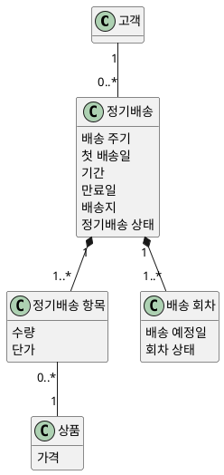

# 정기배송 시스템 — 도메인 모델

```plantuml
@startuml
hide empty methods
class "고객" as Customer
class "정기배송" as Subscription {
  배송 주기
  첫 배송일
  기간
  만료일
  배송지
  정기배송 상태
}
class "정기배송 항목" as SubscriptionItem {
  수량
  단가
}
class "배송 회차" as DeliveryRound {
  배송 예정일
  회차 상태
}
class "상품" as Product {
  가격
}
Customer "1" -- "0..*" Subscription
Subscription "1" *-- "1..*" SubscriptionItem
Subscription "1" *-- "1..*" DeliveryRound
SubscriptionItem "0..*" -- "1" Product
@enduml
```
