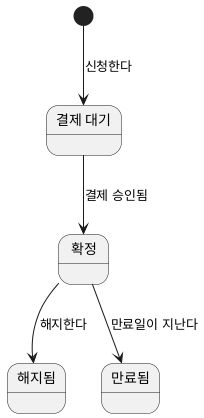
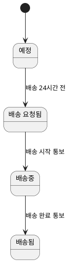

# 정기배송 시스템 — 상태 기계

## 정기배송 상태

```plantuml
@startuml
state "결제 대기" as Wait
state "확정" as On
state "해지됨" as End
state "만료됨" as Exp
[*] --> Wait : 신청한다
Wait --> On : 결제 승인됨
On --> End : 해지한다
On --> Exp : 만료일이 지난다
@enduml
```

## 회차 상태

```plantuml
@startuml
state "예정" as S
state "배송 요청됨" as R
state "배송중" as T
state "배송됨" as D
[*] --> S
S --> R : 배송 24시간 전
R --> T : 배송 시작 통보
T --> D : 배송 완료 통보
@enduml
```
