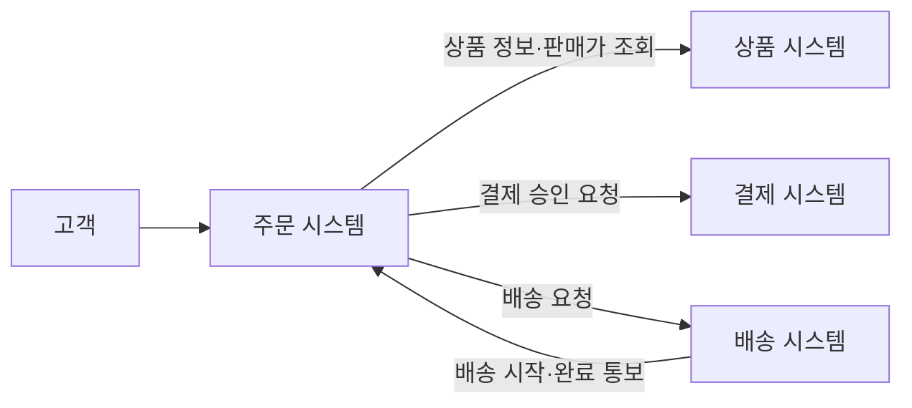
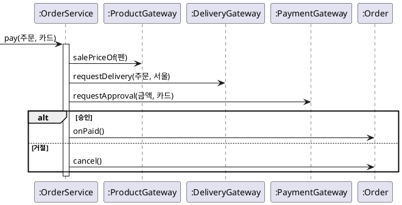
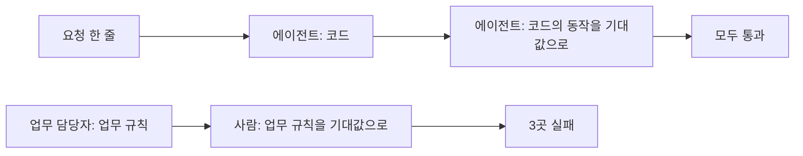
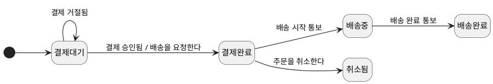
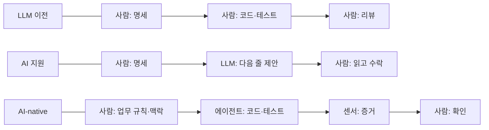
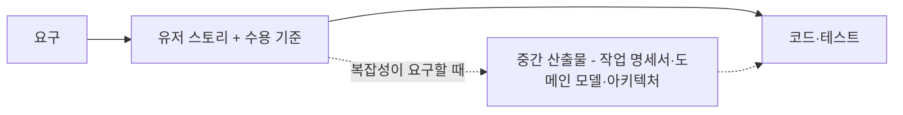
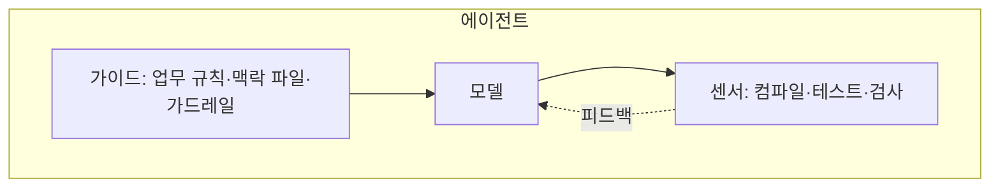

--------------------
Session 명: 01. AI 협업의 특성과 사람의 판단 책임
--------------------

## 목차

01. 세션 목표
02. 첫 시도
03. AI가 바꾼 것과 바꾸지 못한 것
04. 업무 규칙의 명시
05. 개발 방식의 변화
06. 개발자의 일과 LLM의 일
07. 결정 지도
08. 실습 — 추측 찾기
09. 요약

## 01. 세션 목표

AI는 코드를 만드는 비용을 크게 줄였다. 그러나 **무엇을 만들지, 무엇이 옳은 결과인지**는 여전히 사람이 정한다.

- AI가 SW 공학에서 **바꾼 것과 바꾸지 못한 것**을 본질적·우연적 복잡성으로 설명한다.
- **업무 규칙**은 도메인 지식이며, 주어지지 않으면 LLM이 추측으로 채운다는 것을 코드와 테스트로 확인한다.
- LLM의 성질 — **그럴듯한 추측, 비결정성, 맥락의 한계** — 을 설명한다.
- 업무 규칙을 **용어집·도메인 모델·온톨로지**로 명시하는 이유를 설명한다.
- **LLM 이전·AI 지원·AI-native** 개발을 구분하고, AI-native에서 **개발자의 일과 LLM의 일**을 나눈다.
- 과정의 **결정 지도**로 남은 세션이 답할 질문을 안다.

**강사 노트**

- 세션 전체가 하나의 시나리오(쇼핑몰 주문 시스템의 첫 시도)로 이어진다. 사건 → 원인 → 처방 → 새 일하는 방식 → 로드맵 순서다.
- 내용은 2026-10 기준이다. 도구·모델의 능력에 관한 서술은 과정을 열 때마다 원문으로 다시 확인한다.

---

## 02. 첫 시도

## 쇼핑몰의 주문 시스템

생활용품 쇼핑몰이 주문 시스템을 **빈 저장소에서 새로** 만든다. 첫 기능은 **주문한다**이다. 주문은 결제를 포함한다.

**도식 — Mermaid — 주문 시스템과 외부 시스템**



1. 고객이 펜 2개(개당 1,000원)를 장바구니에 담는다.
2. 배송지(서울)를 정하면 주문이 생기고 주문 금액 2,000원이 정해진다.
3. 카드 결제가 승인되면 결제완료가 되고 배송을 요청한다.

**강사 노트**

- 사례는 "객체지향 분석과 설계 실무" 과정과 같은 주문 시스템이며 이름도 같다. 이 과정만 듣는 수강생을 위해 필요한 전제만 소개한다.
- 상품·결제·배송 시스템은 이미 운영 중인 외부 시스템이다. 주문 시스템은 이들과 요청·통보를 주고받는다.
- 업무 담당자 한 명이 주문 정책을 정하고, 개발자 세 명(테크 리드 한 명, 개발자 두 명)이 코딩 에이전트를 쓴다.

---

## 요청 한 줄과 10분

업무 담당자의 요청은 한 줄이었다. 테크 리드가 이 한 줄을 코딩 에이전트에게 주자 **10분 만에** 코드와 테스트가 나왔다.

> "장바구니에 담은 상품을 결제하면 주문이 되고 배송이 시작되게 해 주세요."

- **결과** — 자바 파일 15개와 테스트 3개를 만들었다. 테스트는 모두 통과했다.
- **데모** — 펜 2개를 카드로 결제하자 결제완료가 되고 배송이 요청되었다.
- **팀의 판단** — "다 됐다"고 보고 업무 담당자에게 리뷰를 요청했다.

**강사 노트**

- 10분, 파일 15개, 테스트 3개는 교육용 가정이다. 파일 수는 `code/s01/order/`와 같다.
- 수강생에게 묻는다: 여기서 받아들여도 되는가? 무엇을 확인하면 되는가?

---

## 리뷰에서 나온 문제 3가지

테스트는 모두 통과했지만, 업무 담당자의 리뷰에서 **고객과 회사가 실제로 겪을 문제** 3가지가 나왔다.

**표 — 리뷰에서 나온 문제와 원인**

| 고객과 회사가 겪는 일 | 에이전트가 고른 것 | 업무 담당자가 정한 업무 규칙 |
|---|---|---|
| 2,000원에 주문한 고객에게 2,400원을 청구한다 | 결제할 때의 판매가로 계산 | 주문할 때의 판매가로 정한다 |
| 돈을 받지 않은 주문이 배송 준비에 들어간다 | 결제 승인 전에 배송 요청 | 결제가 승인된 뒤에만 배송을 요청한다 |
| 결제가 거절된 고객이 다시 결제할 수 없다 | 결제가 거절되면 주문 취소 | 결제대기로 남겨 다른 카드로 다시 결제한다 |

- **공통점** — 3가지 모두 요청 한 줄에 없던 **업무 규칙**이다. 에이전트는 묻지 않고 골랐다.

**강사 노트**

- 첫 번째 줄은 결제 직전에 펜 판매가가 1,200원으로 오른 경우다.
- 에이전트가 고른 답은 다른 쇼핑몰에서는 맞을 수 있는 답이다. 그래서 코드만 봐서는 틀린 줄 모른다.

---

## 추측으로 채운 코드

결제 코드는 업무 규칙 3가지을 모두 **추측으로 채웠다**.

**도식 — PlantUML — 첫 시도의 결제 시퀀스**



1. **주문 금액** — 결제할 때 판매가를 다시 조회해 계산한다.
2. **배송 요청** — 결제 승인을 요청하기 전에 배송을 요청한다.
3. **결제 거절** — 거절되면 주문을 취소한다.

**페이지 분할**

```java
public class OrderService {
    // ... 필드와 생성자 생략
    public void pay(OrderNumber number, PaymentMethod method) {
        Order order = repository.findBy(number);
        Money amount = Money.ZERO;
        for (OrderItem item : order.items()) {
            // ① 결제 시점의 판매가로 다시 계산
            Money salePrice = productGateway.salePriceOf(item.productNumber());
            amount = amount.plus(salePrice.times(item.quantity().value()));
        }
        // ② 승인 전에 배송 요청
        deliveryGateway.requestDelivery(number.value(), order.shippingAddress());
        if (paymentGateway.requestApproval(amount, method)) order.onPaid();
        else order.cancel();   // ③ 거절되면 취소됨
        repository.save(order);
    }
}
```

**강사 노트**

- 전체 코드는 `code/s01/order/`다. 첫 시도의 결제 코드는 LLM이 흔히 내는 추측을 모아 만든 교육용 예이며, 수강생의 LLM은 다른 곳을 추측할 수 있다.
- 코드가 보장하는 것: 승인되면 결제완료가 된다. 보장하지 않는 것: 주문 금액, 배송 요청의 시점, 거절 뒤 상태 — 모두 업무 규칙이 정해야 하는 것이다.
- 코드의 영문 이름은 설계 이름이다. 본문에서는 결제한다·주문 금액처럼 한글로 부른다.

---

## 자기 코드를 확인한 테스트

에이전트의 테스트는 **업무 규칙이 아니라 자기 코드의 동작**을 기대값으로 삼았다. 같은 코드를 업무 규칙으로 확인하면 3곳에서 실패한다.

**도식 — Mermaid — 기대값은 어디서 오는가?**



**표 — 같은 코드, 두 테스트의 결과**

| 확인하는 것 | 에이전트의 테스트 | 업무 규칙의 테스트 |
|---|---|---|
| 승인되면 결제완료 | 통과 | 통과 |
| 주문 금액 | 판매가 × 수량 — 통과 | 판매가가 올라도 2,000원 — 실패 |
| 결제 거절 | 취소된다 — 통과 | 결제대기, 배송 요청 없음 — 실패 |

**강사 노트**

- 두 테스트는 `code/s01/order/test/`의 `AgentWrittenTest`와 `PayTest`다. javac로 컴파일하고 각각 실행해 결과를 대조한다.
- 테스트가 통과했다는 것은 "코드가 기대값대로 동작한다"는 뜻이다. 기대값이 추측이면 통과도 추측을 확인했을 뿐이다. 기대값은 사람이 업무 규칙에서 정한다("04. 수용 기준과 검증 가능한 작업 단위").

---

## 03. AI가 바꾼 것과 바꾸지 못한 것

## 본질적 복잡성과 우연적 복잡성

**인용문**

"소프트웨어를 만드는 어려운 부분은 이 개념 구조의 **명세·설계·검증**이지, 그것을 **표현하는 노동**이 아니다", "I believe the hard part of building software to be the specification, design, and testing of this conceptual construct, not the labor of representing it", [Brooks 1986]

**표 — 첫 시도에서 본 두 복잡성**

| 구분 | 첫 시도에서 | 누가 하는가? |
|---|---|---|
| **본질적 복잡성** — 업무 규칙 | 주문 금액, 배송 요청, 결제 거절 | 업무 담당자와 개발자가 정한다 |
| **우연적 복잡성** — 업무 규칙을 코드로 옮기는 일 | 파일 15개·반복문·외부 호출·테스트 틀 | AI가 10분 만에 만들었다 |

- **AI가 줄인 것** — 업무 규칙을 코드로 옮기는 노동이다.
- **병목의 이동** — 이제 시간은 업무 규칙을 찾고, 정하고, 검증하는 데 든다.

**강사 노트**

- 인용 근거: Frederick P. Brooks Jr., "No Silver Bullet — Essence and Accidents of Software Engineering", 1986 원문 확인. 원문은 "…testing the fidelity of the representation."으로 이어지며, PDF의 쪽 번호가 문장 중간에 있어 앞부분까지 인용했다.
- 본질적 복잡성을 업무 규칙에, 우연적 복잡성을 업무 규칙을 코드로 옮기는 일에 대응시킨 것은 이 과정의 해석이다. Brooks의 문장이 아니다.

---

## 업무 규칙은 도메인 지식이다

**인용문**

"소프트웨어 시스템을 만드는 일에서 가장 어려운 부분은 **정확히 무엇을 만들지 결정하는 것**이다", "The hardest single part of building a software system is deciding precisely what to build.", [Brooks 1986]

**업무 규칙은 업무 담당자가 아는 도메인 지식이다.** 코드나 공개된 자료에 있지 않고, 회사의 정책·운영 방식·고객과의 약속이 정한다.

**표 — 회사마다 달라지는 업무 규칙**

| 업무 규칙 | 회사마다 달라지는 이유 |
|---|---|
| 주문 금액 | 주문할 때 보여 준 가격을 고객에게 보장할지는 회사의 가격 정책이다 |
| 배송 요청 | 결제 확인 전에 배송 준비를 시작할지는 물류 운영과 위험을 감수하는 정도의 문제다 |
| 결제 거절 | 거절된 주문을 남겨 다시 결제받을지, 바로 정리할지는 고객 경험과 재고 운영의 선택이다 |

- **LLM은 이 지식을 모른다** — 주어지지 않으면 흔히 보이는 답을 고른다. 그 답은 다른 회사에서는 맞는 답이라 틀린 줄 알기 어렵다.

**강사 노트**

- 인용 근거: Brooks(1986) 원문 확인.
- "LLM은 흔히 보이는 답을 고른다"는 이 과정의 설명이다. 출처로 인용하지 않는다.

---

## 그럴듯한 추측과 비결정성

LLM은 엔지니어가 다뤄 온 도구와 성질이 다르다. 결정적으로 동작하는 컴파일러와 달리 **추측하고, 매번 다르게 답한다**.

**인용문**

"**작화**(confabulation)는 자신 있게 말하지만 **틀리거나 거짓인 내용**을 만드는 것이다", "Confabulation: The production of confidently stated but erroneous or false content", [NIST 2024]

- **그럴듯한 추측** — 2,400원을 청구하는 코드도 컴파일되고 테스트를 통과했다. 그럴듯할수록 틀린 줄 모른다.
- **비결정성** — 같은 요청을 다시 주면 결제 거절을 결제대기로 처리한 코드가 나오기도 한다. 한 번 맞은 결과는 **증거가 아니다**.

**강사 노트**

- 인용 근거: NIST, *Artificial Intelligence Risk Management Framework: Generative Artificial Intelligence Profile*(NIST AI 600-1), 2024의 Confabulation 항목 원문 확인. 같은 항목은 이것을 흔히 "환각(hallucination)"이라 부른다고 적는다.
- 비결정성은 이 과정의 설명이다. 수강생의 LLM으로 같은 요청을 두 번 보내 차이를 확인하게 할 수 있다.

---

## 맥락의 한계

LLM은 **그 작업에 주어진 것만** 보고 판단한다. 업무 담당자와 정한 업무 규칙도 맥락에 넣지 않으면 모른다.

**인용문**

"맥락은 **양이 정해진 자원**이며, 더 넣을수록 **얻는 효과가 줄어든다**", "Context, therefore, must be treated as a finite resource with diminishing marginal returns.", [Anthropic 2025c]

- **주어진 것만 안다** — 맥락은 요청, 열어 본 파일, 이전 대화다. 작업이 끝나면 기억하지 않는다.
- **한 번에 볼 수 있는 양이 정해져 있다** — 이 한도를 맥락 창(context window)이라 부른다.
- **많이 넣을수록 좋아지지 않는다** — 맥락이 길어질수록 중요한 것을 놓친다. 판단을 바꾸는 것을 골라 준다.

**강사 노트**

- 인용 근거: Anthropic, "Effective context engineering for AI agents"(2025) 원문 확인.
- 무엇을 골라 줄지는 "05. 도메인·설계 지식과 맥락 구성"에서 다룬다. 결제 연동 매뉴얼 200쪽을 통째로 준 장면이 그 세션의 사례다.

---

## 04. 업무 규칙의 명시

## 같은 뜻의 언어

업무 규칙은 그 규칙이 쓰는 **말의 뜻이 고정되어야** 지킬 수 있다. "가격"이라는 한 단어로 두면 에이전트는 어느 가격인지 추측한다.

**인용문**

"모델을 언어의 **뼈대**로 삼고, 팀 안의 모든 소통과 **코드**에서 그 언어를 끈질기게 쓴다", "Use the model as the backbone of a language. Commit the team to exercising that language relentlessly in all communication within the team and in the code.", [Evans 2015]

**표 — 용어집**

| 용어 | 정의 |
|---|---|
| **판매가** | 상품의 지금 가격. 상품 시스템이 바꾼다 |
| **단가** | 주문이 생길 때 판매가로 정한 주문 항목의 가격. 그 뒤로 바뀌지 않는다 |
| **주문 금액** | 주문 항목마다 단가 × 수량의 합 |

- **용어에 담긴 업무 규칙** — "가격"을 판매가와 단가로 나누면, "주문 금액은 주문할 때의 가격"이 용어의 정의에 담긴다.

**강사 노트**

- 인용 근거: Eric Evans, *Domain-Driven Design Reference*(2015)의 Ubiquitous Language 원문 확인. 도메인 주도 설계(DDD)는 이 언어를 **보편 언어**(ubiquitous language)라 부른다.
- 용어집과 보편 언어를 만드는 법은 "객체지향 분석과 설계 실무" 과정이 다룬다. 이 과정은 그것을 에이전트의 맥락으로 쓴다.

---

## 모델로 보이는 업무 규칙

업무 규칙을 모델에 그리면 **에이전트가 추측할 빈칸**이 사라진다. 주문 상태 기계에는 결제 거절과 배송 요청의 업무 규칙이 보인다.

**도식 — PlantUML — 주문 상태 기계**



- **결제 거절** — 결제대기에서 결제가 거절되면 결제대기에 머문다. 고객은 다른 카드로 다시 결제할 수 있다.
- **배송 요청** — 결제 승인 전이의 행동이다. 승인되지 않으면 배송을 요청하지 않는다.

**강사 노트**

- 첫 시도의 코드가 고른 "거절되면 취소됨"은 이 모델에 없는 전이다. 모델이 있었다면 에이전트가 추측할 곳이 아니었다.
- 상태 기계의 표기는 "객체지향 분석과 설계 실무" 과정이 다룬다. 코드 값은 `course-design.md`의 공통 전제를 따른다.

---

## 온톨로지

**인용문**

"온톨로지는 **개념화의 명시적 명세**다", "An ontology is an explicit specification of a conceptualization.", [Gruber 1993]

- **개념화** — 무엇을 같은 것으로, 무엇을 다른 것으로 볼지 정한 추상이다. 판매가와 단가를 다른 개념으로 보는 것이 그 예다.
- **명시적 명세** — 개념·관계·제약을 형식으로 드러내, 사람과 시스템이 같은 뜻으로 해석하게 한다.

**표 — 업무 규칙을 명시하는 수단**

| 수단 | 명시하는 것 | 주로 읽는 쪽 |
|---|---|---|
| **용어집** | 용어와 정의 | 사람, LLM |
| **도메인 모델·상태 기계** | 개념·관계·상태와 전이 | 사람, LLM |
| **온톨로지** | 개념·관계·제약을 형식 언어로 | 사람, 추론하는 기계 |

- **적용 판단** — 여러 시스템·에이전트가 같은 뜻을 주고받거나 기계가 추론해야 할 때 가치가 크다. 모든 과제의 필수는 아니다.

**강사 노트**

- 인용 근거: Thomas R. Gruber, "A Translation Approach to Portable Ontology Specifications", 1993 원문 확인.
- 용어집 → 도메인 모델 → 온톨로지로 갈수록 명시가 강해진다. 이 과정의 사례는 용어집과 도메인 모델·상태 기계로 충분하다. 온톨로지를 주는 것만으로 같은 해석이 보장되지는 않으며 사례와 검증으로 확인한다.

---

## 05. 개발 방식의 변화

## 3가지 개발 방식

3가지 방식은 도구가 아니라 **작업의 단위, 누가 무엇을 하는가, 무엇으로 검증하는가**가 다르다.

**표 — 개발 방식의 구분**

| 구분 | 작업의 단위 | 누가 무엇을 하는가? | 검증 |
|---|---|---|---|
| **LLM 이전** | 사람이 쓰는 코드 | 사람이 명세·설계·코드·테스트를 쓴다 | 사람이 쓴 테스트와 리뷰 |
| **AI 지원**(AI-assisted) | LLM의 제안 하나 | 사람이 흐름을 쥐고 제안을 받아들인다 | 제안마다 사람이 읽는다 |
| **AI-native** | 맡긴 과제 하나 | 사람이 정하고 에이전트가 실행한다 | 센서의 증거와 사람의 확인 |

- **바뀌는 것** — 사람의 일의 위치다. 코드를 쓰고 읽던 일이 업무 규칙을 정하고 명시하고 검증하는 일로 옮겨 간다.
- **바뀌지 않는 것** — 무엇이 옳은 결과인지의 판단과 책임은 사람에게 있다.
- **AI-native는 "모두 에이전트"가 아니다** — 작업마다 가장 단순한 충분한 형태를 고른다.

**강사 노트**

- 3가지 구분은 원전의 분류가 아니라 이 과정의 구분이다(`course-design.md`의 「원전 적용 결정」).
- AI 지원의 병목은 사람의 리뷰다. 형태의 선택은 "02. 작업 특성에 따른 AI 활용 방식"에서 다룬다.

---

## 같은 과제, 3가지 방식

주문한다를 3가지 방식으로 개발하면 **사람이 손대는 곳**이 달라진다.

**도식 — Mermaid — 3가지 방식의 흐름**



- **LLM 이전** — 사람이 결제 코드와 테스트를 쓴다.
- **AI 지원** — LLM이 다음 줄을 제안하고 사람이 받아들인다.
- **AI-native** — 에이전트가 코드와 테스트를 만들고, 사람은 센서의 결과로 판단한다.

**강사 노트**

- 첫 시도는 AI-native의 겉모양(에이전트가 과제를 실행)만 있고, 사람의 몫(업무 규칙·맥락·센서·확인)이 빠졌다.
- 센서와 확인 지점은 "07. 워크플로·에이전트와 사람의 개입"과 "09. 검증 하네스·결과 점검·피드백"에서 다룬다.

---

## 요구에서 코드까지

어떤 방식으로 개발하든 **요구 → 유저 스토리 → 코드·테스트**의 뼈대는 같다. 그 사이에 무엇을 넣을지는 **도메인·기술 복잡성**이 정한다.

**도식 — Mermaid — 불변의 뼈대와 중간 산출물**



- **실선은 뼈대** — 작은 작업도 유저 스토리와 수용 기준, 테스트는 빠지지 않는다.
- **점선은 고르는 것** — 업무 규칙이 얽히면 작업 명세서와 도메인 모델을, 외부 연동과 품질 요구가 크면 아키텍처를 넣는다. 많이 넣을수록 좋은 것이 아니다.
- **첫 시도는 뼈대를 건너뛰었다** — 요청 한 줄에서 바로 코드로 갔다. 수용 기준이 없어 테스트가 자기 코드를 확인했다.

**강사 노트**

- 경로 원칙은 원전의 분류가 아니다(`course-design.md`의 「과정 전체 판단 원칙」). 상세는 "03. 요구의 구체화와 명세"에서 다룬다.
- 같은 뼈대는 3가지 개발 방식 모두에 있다. 달라지는 것은 각 단계를 누가 하는가다.

---

## 워크플로와 에이전트

AI-native에서 맡기는 단위는 **워크플로**(workflow)와 **에이전트**(agent) 두 형태다.

**인용문**

"워크플로는 LLM과 도구가 **미리 정한 코드 경로**로 조율되는 시스템이다", "Workflows are systems where LLMs and tools are orchestrated through predefined code paths.", [Anthropic 2024]

**인용문**

"에이전트는 LLM이 **자기 과정과 도구 사용을 스스로 정하며**, 일을 어떻게 이룰지 통제하는 시스템이다", "Agents, on the other hand, are systems where LLMs dynamically direct their own processes and tool usage, maintaining control over how they accomplish tasks.", [Anthropic 2024]

- **차이** — 단계를 누가 정하는가다. 워크플로는 사람이 정한 경로를 따르고, 에이전트는 LLM이 그때그때 정한다.
- **예** — "명세 확인 → 구현 → 테스트"를 정해 두고 단계마다 LLM을 부르면 워크플로다. 첫 시도처럼 과제만 주고 에이전트가 파일을 찾고 고치고 테스트를 돌리게 하면 에이전트다.

**강사 노트**

- 인용 근거: Anthropic, "Building effective agents"(2024) 원문 확인. 위임 형태에 관한 이 과정의 기준 원전이다.
- 두 형태 중 무엇을 고를지, 언제 AI가 필요 없는지는 "02. 작업 특성에 따른 AI 활용 방식"에서 다룬다.

---

## 바이브 코딩과 규율

첫 시도는 데모 한 번을 보고 받아들일 뻔했다. 결과의 동작만 보고 받아들이는 방식이 **바이브 코딩**(vibe coding)이다.

**인용문**

"바이브 코딩에서는 코드가 아니라 **시스템의 동작만** 신경 쓴다", "In vibe coding you don't care about the code, just the behavior of the system.", [Beck 2025]

**인용문**

"증강 코딩에서는 **코드와 그 복잡도, 테스트와 그 커버리지**를 신경 쓴다", "In augmented coding you care about the code, its complexity, the tests, & their coverage.", [Beck 2025]

**인용문**

숙련자가 LLM으로 일을 빠르게 하면서도 **자기가 만든 소프트웨어에 책임을 지는** 방식을 바이브 엔지니어링(vibe engineering)이라 부른다, "seasoned professionals accelerate their work with LLMs while staying proudly and confidently accountable for the software they produce", [Willison 2025b]

- **AI는 팀의 습관을 키운다** — 업무 규칙·테스트·리뷰가 있는 팀에서는 좋은 결과를, 없는 팀에서는 나쁜 결과를 더 빨리 만든다.

**강사 노트**

- 인용 근거: Kent Beck, "Augmented Coding: Beyond the Vibes"(2025), Simon Willison, "Vibe engineering"(2025) 원문 확인. Willison 인용은 요약이다.
- 바이브 코딩은 개발 방식의 한 구분이 아니라 규율이 없는 사용이다. AI 지원과 AI-native 어디에서나 생길 수 있다.
- "습관을 키운다"는 이 과정의 설명이다. 출처로 인용하지 않는다.

---

## 06. 개발자의 일과 LLM의 일

## 사람이 조종하고 에이전트가 실행한다

**인용문**

"사람이 **조종하고**, 에이전트가 **실행한다**", "Humans steer. Agents execute.", [Lopopolo 2026]

**인용문**

"사람은 늘 루프 안에 있지만 **예전과 다른 추상 수준**에서 일한다. 일의 우선순위를 정하고, 사용자 피드백을 **수용 기준**으로 옮기고, **결과를 확인**한다", "Humans always remain in the loop, but work at a different layer of abstraction than we used to. We prioritize work, translate user feedback into acceptance criteria, and validate outcomes.", [Lopopolo 2026]

- **우선순위** — 첫 릴리스에 "주문한다"를 먼저 맡기기로 정한다.
- **수용 기준** — 업무 규칙 3가지을 허용·거절 예시로 옮긴다.
- **결과 확인** — 데모가 아니라 업무 규칙의 테스트로 받아들인다.

**강사 노트**

- 인용 근거: Ryan Lopopolo, "Harness engineering: leveraging Codex in an agent-first world", OpenAI, 2026 영문 원문 확인(openai.com이 한국어판으로 자동 전환하므로 영문판으로 확인).
- 한 팀(OpenAI 내부 제품)의 경험이다. 글도 비슷한 투자 없이 일반화된다고 가정하지 말라고 밝힌다.

---

## 역할 나눔

개발자는 업무 규칙을 **정하고, 명시하고, 검증한다**. LLM은 **실행하고**, 빈칸은 정하지 않고 **묻는다**.

**표 — AI-native에서 개발자의 일과 LLM의 일**

| 활동 | 개발자 | LLM(에이전트) |
|---|---|---|
| **업무 규칙** | 업무 담당자와 정한다 | 빠진 업무 규칙을 질문으로 드러낸다 |
| **명세·수용 기준** | 확정한다 | 초안을 만들고, 기대값은 바꾸지 않는다 |
| **맥락** | 판단을 바꾸는 지식을 고른다 | 맥락 안에서 찾아 읽는다 |
| **위임 경계** | 도구·권한·멈출 조건을 정한다 | 경계 안에서 실행하고, 닿으면 멈춘다 |
| **실행** | — | 코드·테스트를 만들고 실행한다 |
| **가드레일·하네스** | 설계하고 유지한다 | 센서 결과로 고치고, 센서를 끄지 않는다 |
| **결과 판단** | 받아들이거나 되돌리고, 최종 책임을 진다 | 완료의 증거(테스트 출력)를 보인다 |
| **실패·변경** | 원인이 된 결정으로 되돌린다 | 상한 안에서 재시도하고, 반복되면 멈춘다 |

- **예** — 에이전트는 "결제가 거절되면 주문은 어떻게 되나요?"를 정하지 않고 묻는다. 정하는 것은 업무 담당자와 개발자다.

**강사 노트**

- 이 역할 구분은 이 과정의 구분이다(`course-design.md`의 「과정 전체 판단 원칙」).
- 표의 각 행이 뒤 세션의 주제다 — 명세·수용 기준은 03·04, 맥락은 05, 위임 경계는 06, 가드레일·하네스는 08·09, 실패는 10 세션.

---

## 하네스

맡긴 일은 **하네스의 센서**로 확인한다. 하네스는 개발자가 만든다.

**인용문**

"하네스는 AI 에이전트에서 **모델을 뺀 모든 것**이다 — 에이전트 = 모델 + 하네스", "everything in an AI agent except the model itself - Agent = Model + Harness.", [Böckeler 2026a]

**도식 — Mermaid — 에이전트 = 모델 + 하네스**



- **가이드와 센서** — 가이드는 실행 전에 방향을 주고, 센서는 실행 뒤에 결과를 알려 모델이 스스로 고치게 한다.
- **자율의 정도** — 확인할 수 있는 만큼 자율을 준다. 첫 시도처럼 센서가 자기 코드만 확인하면 "완료"는 주장일 뿐이다.

**강사 노트**

- 인용 근거: Birgitta Böckeler, "Harness engineering for coding agent users", martinfowler.com, 2026 원문 확인.
- 가이드(feedforward)·센서(feedback)의 상세는 "09. 검증 하네스·결과 점검·피드백"에서 다룬다. "자율의 정도"는 이 과정의 설명이다.

---

## 07. 결정 지도

첫 시도가 무너진 곳마다 **사람이 내렸어야 할 결정**이 있다. 남은 세션이 그 결정을 하나씩 다룬다.

**표 — 결정 지도**

| 결정 | 질문 | 첫 시도에서 | 세션 |
|---|---|---|---|
| **활용 방식** | 어떤 방식으로 맡길까? | 모든 일을 한 줄로 에이전트에게 맡겼다 | 02 |
| **명세·수용 기준** | 무엇을 만들고 무엇으로 받아들일까? | 업무 규칙 없이 테스트가 자기 코드를 확인했다 | 03·04 |
| **맥락** | 무엇을 알려 줄까? | "가격"이 어느 가격인지 몰랐다 | 05 |
| **위임 경계** | 어디까지 맡길까? | 권한과 멈출 조건을 정하지 않았다 | 06 |
| **개입·가드레일·하네스** | 어디서 막고 무엇으로 확인할까? | 데모 한 번으로 받아들일 뻔했다 | 07~09 |
| **실패·평가** | 실패하면, 모델이 바뀌면 어떻게 할까? | 다시 요청하면 결과가 달라졌다 | 10·11 |

**강사 노트**

- 표의 행 순서가 결정의 순서다. 학습 순서이지 고정된 개발 절차가 아니며, 증거가 나오면 원인이 된 결정(대개 업무 규칙이나 맥락)으로 되돌린다.
- 산출물을 모두 합친 것을 위임 패키지라 부른다. "12. 명세·맥락·작업 지시의 종합 검토"에서 위임 패키지로 다음 기능을 맡긴다.

---

## 08. 실습 — 추측 찾기

정기배송의 **모델 패키지**를 LLM에 제공하여 **정기배송을 신청한다**를 개발하게 하고, 점검 항목으로 초안이 **추측한 것**을 찾아 **사람이 정할 결정**으로 정리하십시오.

- **서비스 개요**
  + 생필품을 고객이 정한 주기로 배송하는 정기배송 시스템을 **빈 저장소**에서 개발한다. 고객은 상품·수량·배송 주기·첫 배송일·기간·배송지를 정해 신청하고 일시불로 결제한다. 상품·결제·배송은 외부 시스템이 맡는다.
  + **모델 패키지** — 요구사항 정의서·용어집·유스케이스·도메인 모델·상태 기계
- **프롬프트**
  + ① "이 모델 패키지로 **정기배송을 신청한다**를 설계하고, 자바 코드와 테스트를 만들어줘."
  + ② "모델에 없어서 네가 스스로 정한 것과 모델과 다르게 만든 것을 **모두 나열**해줘."
- **점검 항목**
  1. **상태** — 모델에 없는 상태나 필드를 더했는가?
  2. **금액** — 회차 금액을 무엇으로 계산했는가? 신청 때의 가격인가?
  3. **회차** — 확정할 때 배송 회차를 몇 개, 어느 날짜로 만들었는가? 그 계산 규칙이 모델에 있는가?
  4. **거절** — 결제가 거절되면 정기배송은 어떤 상태인가?
  5. **덧붙인 규칙** — 모델에 없는 규칙(할인, 최소 수량 등)이 들어갔는가?
  6. **테스트** — 승인된 경우뿐 아니라 거절된 경우의 테스트가 있는가?
- **결과물** — 추측 목록과 사람이 정할 결정. 실습 2의 입력이 됩니다.

**강사 노트**

- 모델 패키지는 `code/s01/subscription/docs/`에 있다.
- 실습은 정기배송 시스템을 빈 저장소에서 개발하는 하나의 시나리오다. 강의의 첫 시도와 달리 모델 패키지를 받고 시작하지만, 모델에도 빈칸이 있다.
- 결과물은 실습 2(활용 방식 판단)에서 사람이 정할 결정과 맡길 수 있는 구현을 가르는 데 쓰이고, 실습 3(작업 명세서)에서 명세에 담긴다.
- 신청한다(실습 1~9) 다음에 배송지를 변경한다(실습 10~12)를 같은 맥락·하네스로 진행한다.
- 도구는 제한하지 않는다. 평가는 초안이 아니라 **찾아낸 추측과 정한 결정**을 본다. 모델에 없는 결정은 수강생이 업무 담당자로서 정한다.

---

## 09. 요약

AI는 업무 규칙을 코드로 옮기는 일을 줄였다. 업무 규칙을 **정하고, 명시하고, 검증하는 일**은 사람에게 남는다.

### AI 협업의 핵심

- **바꾼 것과 바꾸지 못한 것** — AI는 우연적 복잡성을 줄였고, 본질적 복잡성인 업무 규칙은 사람이 정한다
- **LLM의 성질** — 그럴듯한 추측, 비결정성, 맥락의 한계. 주어지지 않은 업무 규칙은 추측으로 채운다
- **업무 규칙의 명시** — 용어집·도메인 모델(보편 언어)·온톨로지로 뜻을 고정한다
- **역할** — 사람이 조종하고 에이전트가 실행한다. 테스트의 기대값은 업무 규칙에서 온다
- **결정 지도** — 활용 방식 → 명세·수용 기준 → 맥락 → 위임 경계 → 개입·가드레일·하네스 → 실패·평가

### 다음 세션

- "**02. 작업 특성에 따른 AI 활용 방식**" — 작업의 특성으로 수작업·대화형 보조·워크플로·에이전트 중 가장 단순한 충분한 형태를 고른다.

**강사 노트**

- 첫 시도의 실패는 AI의 실패가 아니라 사람의 몫(업무 규칙·검증)이 빠진 것이다. 다음 세션부터 그 몫을 하나씩 채운다.

---

## 별첨. 실습 답

---

## 추측 목록과 사람이 정할 결정 (안)

LLM 초안은 신청한다를 만들면서 **모델에 없는 상태와 규칙을 더하고**, 결제 거절과 회차 생성을 스스로 정했다. 추측마다 사람이 정할 결정을 적었다.

- **초안이 추측한 것**
  - **상태** — 정기배송 상태에 "신청 실패", 회차 상태에 "취소됨"을 더했다.
  - **금액** — 회차 금액을 배송할 때마다 상품 시스템의 현재 가격으로 계산했다.
  - **회차** — 회차를 만료일 다음 날까지 만들었다.
  - **거절** — 결제가 거절되면 정기배송을 삭제했다.
  - **덧붙인 규칙** — 기간이 6개월 이상이면 5% 할인했다.
  - **테스트** — 승인된 경우만 테스트했다.
- **사람이 정할 결정**
  - **상태** — 모델의 상태만 쓴다. 신청은 결제 대기 → 확정, 회차는 예정으로 시작한다.
  - **금액** — 회차 금액은 신청 때의 가격 × 수량이며 기간 끝까지 같다.
  - **회차** — 첫 배송일부터 배송 주기마다, 만료일까지의 날짜로 예정 회차를 만든다.
  - **거절** — 결제가 거절되면 결제 대기를 유지한다.
  - **덧붙인 규칙** — 모델에 없는 규칙은 넣지 않는다. 필요하면 업무 담당자에게 묻는다.
  - **테스트** — 승인·거절 두 경로와 회차의 날짜를 확인한다.

**강사 노트**

- 초안의 추측은 예다. 수강생의 LLM마다 다른 곳을 추측하며, 평가는 추측을 찾아 결정으로 바꾼 것을 본다.
- "거절되면 결제 대기 유지"와 회차 상태(예정·배송 요청됨·배송중·배송됨)는 `course-design.md`의 공통 전제와 같다.
