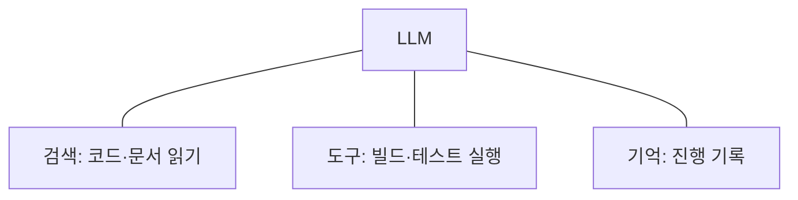
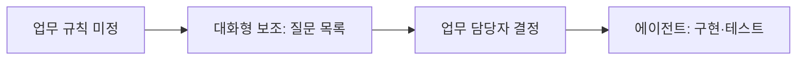

--------------------
Session 명: 02. 작업 특성에 따른 AI 활용 방식
--------------------

## 목차

01. 세션 목표
02. 작업 특성
03. AI 활용 방식
04. 작업 특성에 따른 선택
05. 주문 기능 개발에서 LLM 활용
06. 시연 — 주문 금액 구현을 3가지 방식으로
07. 판단이 갈리는 경우
08. 잘못된 관행
09. 자율성을 높이는 조건
10. 실습 — 활용 방식 판단
11. 요약

## 01. 세션 목표

**작업 특성**에 따라 일하는 방식을 선택한다.

- **작업 특성 4가지**를 설명한다.
- **AI 활용 방식 4가지**를 설명한다.
- 작업 특성에 따라 **가장 단순하면서 충분한 방식**을 고르고, 부적합한 방식의 이유를 남긴다.
- **자율성의 대가**와 **AI에게 맡기지 않는 작업**을 설명한다.
- 맡겨도 된다는 **증거가 분명할 때** 방식을 한 단계 올리는 조건을 설명한다.

**강사 노트**

- "01. AI 협업의 특성과 사람의 판단 책임"의 첫 시도는 성격이 다른 작업을 모두 요청 한 줄로 에이전트에게 맡겼다. 이 세션은 결정 지도의 첫 결정, 곧 작업마다 어떤 방식으로 맡길지를 다룬다.
- 고른 방식을 패턴과 사람의 확인 지점으로 구성하는 일은 "07. 워크플로·에이전트와 사람의 개입"이 맡는다.

---

## 02. 작업 특성

작업 특성은 **그 작업을 AI에게 맡겨도 되는지, 어떻게 맡길지를 가르는 성질**이다.

**인용문**

코딩 에이전트는 **자동 테스트로 검증**하고 테스트 결과에 따라 고칠 수 있으며 문제가 **잘 정의되어** 있고 품질을 **객관적으로 잴 수** 있을 때 특히 효과적이다, "Code solutions are verifiable through automated tests; Agents can iterate on solutions using test results as feedback; The problem space is well-defined and structured; and Output quality can be measured objectively.", [Anthropic 2024]

**표 — 작업 특성 4가지**

| 작업 특성 | 질문 | 예 |
|---|---|---|
| **업무 규칙의 확정** | 무엇이 옳은 결과인지 정해졌는가? | 주문 금액을 언제의 가격으로 할지 정했는가? |
| **절차의 확정** | 끝내기까지의 작업 순서를 미리 적을 수 있는가? | 연동 코드: 문서 확인 → 코드 작성 → 테스트 |
| **결과의 자동 확인** | 결과가 옳은지 테스트로 확인할 수 있는가? | 주문 금액은 수용 테스트로, 릴리스 노트는 사람이 |
| **되돌리기 쉬움** | 잘못되었을 때 이전 상태로 정확히 돌릴 수 있는가? | 코드는 이전 커밋으로, 운영 데이터는 어렵다 |

**강사 노트**

- 인용 근거: Anthropic, "Building effective agents"(2024)의 코딩 에이전트 사례 원문 확인. 한글은 요약이다.
- 작업 특성을 4가지로 묶은 것은 이 과정의 정리다. 원문의 "잘 정의된 문제"와 "자동 테스트로 검증"을 바탕으로 업무 규칙과 되돌리기를 더했다.

---

## 03. AI 활용 방식

## 증강 LLM

**증강 LLM은 LLM에 검색·도구·기억을 붙인 것**이다. 대화형 보조·워크플로·에이전트는 모두 증강 LLM을 쓴다.

**인용문**

"에이전트 시스템의 기본 구성 요소는 검색·도구·기억 같은 **증강을 더한 LLM**이다", "The basic building block of agentic systems is an LLM enhanced with augmentations such as retrieval, tools, and memory.", [Anthropic 2024]

**도식 — Mermaid — 증강 LLM**



- **방식의 차이** — 쓰는 LLM은 같고, **작업 순서를 누가 정하느냐**가 다르다.

**강사 노트**

- 인용 근거: Anthropic, "Building effective agents"(2024) 원문 확인.
- 도식의 검색은 저장소의 코드·문서 읽기, 도구는 빌드·테스트 실행, 기억은 작업 사이의 진행 기록이다.
- 증강 LLM은 방식이 아니라 방식들의 공통 부품이다. 같은 부품을 사람이 순서를 정해 쓰면 워크플로, LLM이 순서를 정해 쓰면 에이전트다.

---

## 4가지 활용 방식

수작업에서 에이전트로 갈수록 **사람이 정하던 작업 순서를 LLM이 정한다**. LLM이 사람의 확인 없이 정하는 범위가 **자율성**이다.

**표 — AI 활용 방식 4가지**

| 방식 | 절차 결정 | 실행 | 사람 확인 | 예 |
|---|---|---|---|---|
| **수작업** | 사람 | 사람 | 하면서 | 사람이 이관 스크립트를 실행하고 건수·금액을 대조한다 |
| **대화형 보조** | 사람 | 사람(LLM은 답·초안) | 답마다 | LLM이 릴리스 노트 초안을 쓰고 사람이 고친다 |
| **워크플로** | 사람이 정한 순서 | LLM | 정한 지점 | LLM이 정해 둔 순서대로 연동 코드를 만든다 |
| **에이전트** | LLM | LLM | 끝에서 | LLM이 파일을 찾고 고치고 테스트를 돌려 구현한다 |

**인용문**

"워크플로는 잘 정의된 작업에 **예측 가능성과 일관성**을 주고, 에이전트는 **유연성과 모델 주도의 결정**이 대규모로 필요할 때 더 나은 선택이다", "workflows offer predictability and consistency for well-defined tasks, whereas agents are the better option when flexibility and model-driven decision-making are needed at scale.", [Anthropic 2024]

**강사 노트**

- 워크플로·에이전트의 정의는 "01. AI 협업의 특성과 사람의 판단 책임"의 「워크플로와 에이전트」에서 인용했다. 수작업과 대화형 보조는 이 과정이 더한 비교 대상이다.
- 수작업도 결정적인 도구(스크립트·템플릿)를 쓴다. 사람이 실행하고 결과를 직접 확인한다는 점이 다르다.

---

## 04. 작업 특성에 따른 선택

## 선택의 순서

작업 특성을 차례로 물으면 **가장 단순하면서 충분한 방식**에 닿는다. 업무 규칙과 되돌리기를 먼저 묻는다 — 이 둘은 AI가 아무리 뛰어나도 바뀌지 않는다.

**표 — 활용 방식의 선택**

| 순서 | 질문 | "아니오"이면 | "예"이면 |
|---|---|---|---|
| 1 | 업무 규칙이 정해졌나? | 사람이 먼저 정한다 | 2로 |
| 2 | 되돌리기 쉬운가? | 수작업 | 3으로 |
| 3 | 결과를 자동으로 확인할 수 있나? | 대화형 보조 | 4로 |
| 4 | 절차가 정해졌나? | 에이전트 | 워크플로 |

**인용문**

"에이전트는 필요한 **단계 수를 예측하기 어렵고**, 고정된 경로를 코드로 정할 수 없는 열린 문제에 쓸 수 있다", "Agents can be used for open-ended problems where it's difficult or impossible to predict the required number of steps, and where you can't hardcode a fixed path.", [Anthropic 2024]

- **에이전트는 마지막** — 앞의 질문을 모두 통과하고, 절차를 미리 정할 수 없을 때만 고른다.

**강사 노트**

- 질문의 순서는 이 과정의 정리다. 인용 근거: Anthropic(2024) 원문 확인.
- 결정적인 도구로 충분한 작업(늘 같은 결과)은 이 순서에 들어오기 전에 걸러진다(「AI에게 맡기지 않는 작업」).

---

## 자율성의 대가

자율성을 높이면 **사람이 확인하는 시점이 뒤로 가고, 오류가 쌓이는 범위가 넓어진다**. 비용은 작업이 크고 반복이 늘수록 커진다.

**인용문**

"에이전트 시스템은 더 나은 작업 성능을 얻는 대신 **지연과 비용**을 치르는 경우가 많다. 그 교환이 언제 맞는지 따져야 한다", "Agentic systems often trade latency and cost for better task performance, and you should consider when this tradeoff makes sense.", [Anthropic 2024]

**인용문**

"에이전트의 자율성은 **더 높은 비용과 오류가 누적될 가능성**을 뜻한다", "The autonomous nature of agents means higher costs, and the potential for compounding errors.", [Anthropic 2024]

**표 — 활용 방식의 대가**

| 방식 | 사람 확인 | 오류가 쌓이는 범위 | 비용이 커지는 때 |
|---|---|---|---|
| **대화형 보조** | 답마다 | 답 하나 | 질문이 많아질 때(사람의 시간) |
| **워크플로** | 정한 지점마다 | 한 단계 안 | 단계마다 맥락을 새로 읽을 때 |
| **에이전트** | 끝에서 | 여러 단계에 걸쳐 | 반복 실행이 길어질 때 |

**강사 노트**

- 인용 근거: Anthropic(2024) 원문 확인. 표는 이 과정의 정리다.
- 작은 작업에서는 방식 간 비용 차이가 작다. 「06. 시연 — 주문 금액 구현을 3가지 방식으로」에서는 단계마다 새로 시작한 워크플로가 에이전트보다 토큰을 더 썼다.

---

## AI에게 맡기지 않는 작업

AI에게 맡기지 않는 작업은 **두 종류**다.

- **AI가 할 수 없는 작업** — 답과 책임이 AI 밖에 있다.
  - **업무 규칙 정하기** — 답은 업무 담당자가 안다. 사람이 정하고 AI는 질문을 찾는다.
  - **되돌리기 어려운 작업의 실행** — 책임은 사람이 진다. 사람이 실행하고 AI는 초안만 쓴다.
- **AI가 필요 없는 작업** — 늘 같은 결과가 필요하다.
  - **저장소 골격·코드 형식·의존 규칙** — AI는 매번 다르게 만든다. 템플릿·포매터·정적 검사로 한다.

**인용문**

사용 사례가 기준을 분명히 충족하지 않으면 **결정적인 해법으로 충분**할 수 있다, "Before committing to building an agent, validate that your use case can meet these criteria clearly. Otherwise, a deterministic solution may suffice.", [OpenAI 2025]

**강사 노트**

- 인용 근거: OpenAI, "A practical guide to building agents"(2025) 원문 확인(받은 PDF). 한글은 요약이다.
- 포매터·정적 검사·빌드 도구는 뒤에서 에이전트의 결과를 확인하는 센서가 된다.
- "AI는 추측한다"는 "01. AI 협업의 특성과 사람의 판단 책임"의 첫 시도에서 본 것이다. 센서는 "09. 검증 하네스·결과 점검·피드백"에서 다룬다.

---

## 에이전트가 맞는 작업

에이전트는 **절차를 미리 정할 수 없고 판단이 많은 작업**에 맞는다.

**표 — 에이전트가 맞는 작업 (OpenAI, 2025)**

| 기준 | 뜻 | 개발 작업의 예 |
|---|---|---|
| **판단이 복잡한 결정** | 상황에 따라 판단이 갈린다 | 실패한 테스트의 원인 찾기 |
| **유지하기 어려운 규칙** | 규칙이 많고 얽혀 고치기 비싸다 | 여러 파일에 흩어진 검사 정리 |
| **비정형 데이터 의존** | 문서·자연어를 해석해야 한다 | 부실한 외부 문서를 읽고 연동 코드 작성 |

**강사 노트**

- 원전 표의 세 기준(Complex decision-making, Difficult-to-maintain rules, Heavy reliance on unstructured data)을 옮기고 뜻은 요약했다.
- 원전은 업무 자동화의 관점이다. 개발 작업의 예에 대응시킨 것은 이 과정의 해석이다.

---

## 05. 주문 기능 개발에서 LLM 활용

주문 기능의 작업 6가지의 **작업 특성에 따른 활용 방식**은 다음과 같다.

**표 — 주문 기능 개발의 활용 방식**

| 작업 | 작업 특성 | 방식 | 부적합한 방식 |
|---|---|---|---|
| **업무 규칙 정하기** | 업무 규칙 미정 — 업무 담당자만 안다 | 수작업 + 대화형 보조 | 에이전트 — 추측한다 |
| **저장소 골격** | 늘 같은 결과가 필요하다 | 수작업(템플릿) | 에이전트 — 매번 다르다 |
| **주문 금액·상태 구현** | 테스트로 확인되나 고칠 곳을 미리 모른다 | 에이전트 | 워크플로 — 순서를 못 적는다 |
| **결제·배송 연동 코드** | 문서가 정확해 순서를 적을 수 있다 | 워크플로 | 에이전트 — 대가가 크다 |
| **주문 데이터 이관** | 이전 상태로 돌리기 어렵다 | 수작업 | 워크플로·에이전트 |
| **릴리스 노트** | 테스트로 확인할 수 없다 | 대화형 보조 | 에이전트 |

- **이관은 왜 되돌리기 어려운가?** — 옮긴 주문은 곧바로 고객이 조회하고 배송이 진행된다. 잘못 옮긴 것을 나중에 알면 데이터는 고쳐도, 그사이 고객에게 일어난 일은 되돌릴 수 없다.
- **에이전트는 하나** — 작업 6가지 가운데 에이전트에게 맡긴 작업은 주문 금액·상태 구현뿐이다.

**강사 노트**

- 업무 규칙 정하기는 업무 담당자와 사람이 정하고, LLM은 대화형 보조로 빠진 질문을 찾는 데 쓴다.
- 주문 데이터 이관은 외부 솔루션에서 옮겨 오는 이 시나리오의 작업이다. LLM이 변환 스크립트 초안을 쓸 수 있지만, 실행과 확인은 사람이 한다.

---

## 06. 시연 — 주문 금액 구현을 3가지 방식으로

## 시연 준비

같은 작업을 3가지 방식으로 **실제로** 해 보았다. 세 번 모두 같은 저장소 사본, 같은 업무 규칙, 같은 수용 테스트를 썼다.

**표 — 시연의 준비물**

| 준비물 | 내용 |
|---|---|
| **저장소** | 주문 금액 계산 두 곳(단가 확정, 주문 금액)이 "구현 필요"로 비어 있다 |
| **업무 규칙** | 단가는 주문할 때의 판매가, 주문 금액은 단가 × 수량의 합 |
| **수용 테스트** | 펜 2개 → 2,000원, 판매가를 1,200원으로 바꿔도 2,000원 |
| **실행** | 테스트 실행 스크립트 하나(`sh run-tests.sh`) |

- **구현 전** — 테스트는 "구현 필요" 예외로 실패한다.

**강사 노트**

- 저장소는 `code/s02/order-demo`, 실행 기록은 `code/s02/demo-results`에 있다. 2026-10-07에 Claude Code 2.1.292(비대화형 실행, 모델 claude-opus-5-5)로 실행했다.
- 강의장에서는 수강생의 도구로 다시 실행한다. 결과는 매번 달라질 수 있다(비결정성).

---

## 대화형 보조

사람이 질문하고, 답을 붙여 넣고, 테스트를 돌렸다. LLM은 **질문에 붙인 것만** 보았다.

- **질문 1** — "다음 업무 규칙대로 OrderItem.confirm과 Order.totalAmount를 구현한 두 자바 파일의 전체 코드를 써줘." 업무 규칙과 두 파일만 붙였다.
- **결과 1** — 컴파일 오류(`cannot find symbol: method productNumber()`). 질문에 없던 `Product`의 메서드 이름을 추측했다.

- **질문 2** — "컴파일 오류가 났어. 고친 OrderItem.java 전체 코드만 다시 써줘." 오류 메시지를 붙였다.
- **결과 2** — 통과. LLM은 "Product.java를 보지 못해 `number()`도 추측"이라고 덧붙였다.
- **사람이 한 것** — 질문 2번, 붙여 넣기 3번, 테스트 실행 2번

**강사 노트**

- 오류는 실제 출력이다(`demo-results/chat-test1.txt`). LLM의 덧붙인 말 원문: "I haven't seen `Product.java`, so `number()` is a guess."
- 맥락의 한계("01. AI 협업의 특성과 사람의 판단 책임"의 「맥락의 한계」)가 그대로 드러난 장면이다. 대화형 보조에서는 맥락을 사람이 골라 붙인다.

---

## 워크플로

미리 정한 프롬프트 3개를 **순서대로** 실행했다. 단계마다 쓸 수 있는 도구를 그 단계에 필요한 것만 허용했다.

1. **계획** — 읽기만 허용
  - **프롬프트** — "업무 규칙을 구현하려면 바꿀 클래스와 메서드를 목록으로 적어줘. 코드는 바꾸지 마."
  - **결과** — 바꿀 곳 5가지의 계획
2. **코드** — 읽기·편집만 허용
  - **프롬프트** — "다음 계획대로 코드를 바꿔줘. test/ 폴더는 바꾸지 마."
  - **결과** — 두 파일을 고쳤다. 테스트도 돌리려 했으나 권한이 없어 멈췄다.
3. **테스트** — 테스트 실행만 허용
  - **프롬프트** — "sh run-tests.sh로 테스트를 실행하고 출력을 그대로 보고해줘."
  - **결과** — 통과

- **중간 결과** — 순서를 사람이 정해 계획을 보고 넘길 수 있었다.

**강사 노트**

- ①의 계획에는 "상품 객체를 들고 있으면 판매가가 바뀔 때 주문 금액도 바뀐다"는 판단이 적혀 있었다.
- 프롬프트는 줄였다. 원문은 `demo-results/workflow-prompts.txt`에 있다. ②의 프롬프트에는 ①의 계획을 그대로 붙였다.
- ②에서 테스트를 돌리지 못한 것은 오류가 아니라 의도한 경계다. 단계마다 권한을 좁히면 단계의 범위를 넘는 행동이 멈춘다.

---

## 에이전트

과제 **하나**만 주었다. 에이전트가 파일을 읽고, 고치고, 테스트를 돌려 끝냈다. 아래는 에이전트가 만든 코드다.

```java
    public static OrderItem confirm(Product product, Quantity quantity) {
        return new OrderItem(product.number(), product.salePrice(), quantity);
    }
    // ... 조회 메서드 생략
    public Money amount() { return unitPrice.times(quantity.value()); }
```

- **프롬프트** — "docs/business-rule.md의 업무 규칙대로 구현해서 sh run-tests.sh가 통과하게 해줘. test/ 폴더의 테스트는 바꾸지 마. 끝나면 테스트 출력을 보여줘."
- **결과** — 11턴, 34초, 통과. 테스트는 바꾸지 않았다.
- **사람이 한 것** — 과제를 주고, 끝에서 바뀐 코드와 테스트 출력을 보았다.

**강사 노트**

- 코드는 에이전트가 만든 결과 그대로다(`demo-results/agent/order/OrderItem.java`). 단가를 주문 항목에 복사해 두므로 판매가가 바뀌어도 주문 금액은 그대로다.
- 에이전트에게 허용한 도구는 읽기·편집과 테스트 실행 스크립트 하나다. 위임 경계는 "06. 작업 위임과 도구·권한·상태의 경계"에서 다룬다.

---

## 시연 결과의 비교

3가지 방식 모두 업무 규칙을 지켰다. 다른 것은 **사람이 개입한 곳, 걸린 시간, 쓴 토큰**이다.

**표 — 시연 기록**

| 방식 | 사람이 개입한 곳 | LLM 호출·턴 | LLM 시간 | 출력 토큰 | 입력 토큰 |
|---|---|---|---|---|---|
| **대화형 보조** | 질문·붙여 넣기·테스트 실행 7번 | 2·2 | 20초 | 1,608 | 56,810 |
| **워크플로** | 단계 3개의 실행 | 3·24 | 66초 | 6,333 | 402,181 |
| **에이전트** | 과제 하나와 결과 확인 | 1·11 | 34초 | 3,367 | 339,270 |

- **업무 규칙이 있으면 셋 다 지킨다** — 첫 시도와 달리 업무 규칙과 수용 테스트를 주었기 때문이다.
- **대화형 보조** — 토큰이 가장 적다. 대신 맥락을 사람이 골라 붙여야 하고, 빠뜨리면 LLM이 추측한다.
- **워크플로** — 에이전트보다 토큰을 더 썼다. 단계마다 새로 시작해 파일을 다시 읽었다. 대신 중간 결과를 볼 수 있다.
- **에이전트** — 사람의 개입이 가장 적다. 대신 확인이 끝에 몰린다.

**강사 노트**

- 수치는 2026-10-07 실행 한 번의 기록이다. LLM 시간은 도구가 보고한 시간의 합이며, 사람이 붙여 넣고 테스트를 돌린 시간은 넣지 않았다. 입력 토큰에는 도구의 시스템 프롬프트와 도구 정의가 포함된다.
- 작업이 작아 방식 간 비용 차이가 작다. 작업이 크고 반복이 늘면 차이가 벌어진다(「04. 작업 특성에 따른 선택」의 「자율성의 대가」).

---

## 07. 판단이 갈리는 경우

## 외부 문서 품질

같은 연동 코드도 **외부 문서의 품질**에 따라 절차의 확정 여부가 바뀐다.

**표 — 결제 연동 코드의 두 경우**

| 경우 | 절차 | 방식 |
|---|---|---|
| 문서가 정확하고 예제가 있다 | 정해짐 | 워크플로 |
| 문서가 부실하고 응답 형식이 자주 바뀐다 | 정해지지 않음 | 에이전트 + 사람 리뷰 |

- **질문** — 배송 연동 코드는 어느 쪽인가? 무엇을 확인하면 답할 수 있는가?

**강사 노트**

- 수강생이 먼저 고르게 하고 이유를 비교한다. 답은 하나가 아니며, 작업 특성의 판단이 맞는지가 핵심이다.

---

## 업무 규칙 결정 전과 후

방식은 작업의 이름이 아니라 **그 시점의 작업 특성**으로 정한다.

- **결정 전** — 구현을 맡기지 않는다. LLM으로 빠진 질문을 찾고 업무 담당자가 답한다.
- **결정 후** — 결과를 테스트로 확인할 수 있으므로 에이전트에게 맡긴다.
- **첫 시도** — 업무 규칙이 결정되기 전에 에이전트에게 맡겼다.

**도식 — Mermaid — 주문 금액 구현의 방식 변화**



**강사 노트**

- 업무 규칙을 정하는 일은 "03. 요구의 구체화와 명세"에서, 수용 테스트는 "04. 수용 기준과 검증 가능한 작업 단위"에서 다룬다.
- 시연은 업무 규칙이 결정된 뒤의 장면이다. 그래서 3가지 방식 모두 업무 규칙을 지켰다.

---

## 08. 잘못된 관행

작업 특성에 맞지 않는 방식은 **재검토하여 적절한 방식을 선택한다**.

**표 — 활용 방식의 잘못된 관행**

| 관행 | 첫 시도에서 | 바로잡기 |
|---|---|---|
| **에이전트가 목표가 된다** | "에이전트로 만들자"에서 출발했다 | 작업 특성에서 출발한다 |
| **모든 작업을 한 방식으로 맡긴다** | 성격이 다른 작업을 한 줄로 시켰다 | 작업마다 따로 맡긴다 |
| **되돌리기 어려운 작업을 맡긴다** | 운영에 쓰일 설정까지 한 요청에 담았다 | 사람이 한다 |
| **증거 없이 자율성을 높인다** | 데모 한 번으로 받아들일 뻔했다 | 테스트·기록·평가로 올린다 |

**강사 노트**

- "에이전트로 만들자"처럼 방식이 목표가 되면, 작업 특성을 묻지 않고 방식에 작업을 맞추게 된다.

---

## 09. 자율성을 높이는 조건

**가장 단순한 방식으로 시작하고, 맡겨도 된다는 증거가 분명할 때만 자율성을 높인다.**

**인용문**

"LLM으로 애플리케이션을 만들 때는 **가능한 가장 단순한 해법**을 찾고, 필요할 때만 복잡도를 높이라. 에이전트 시스템을 **아예 만들지 않는 것**일 수도 있다", "When building applications with LLMs, we recommend finding the simplest solution possible, and only increasing complexity when needed. This might mean not building agentic systems at all.", [Anthropic 2024]

**표 — 자율성의 계단**

| 지금 | 다음 | 필요한 증거 |
|---|---|---|
| 대화형 보조 | 워크플로 | 업무 규칙과 수용 테스트가 생겼다 |
| 워크플로 | 에이전트 | 테스트 통과와 실패 기록이 쌓였다 |
| 에이전트 | 사람 확인을 줄인 에이전트 | 평가 세트를 통과했다 |

- **계단마다 증거** — 한 단계 올리려면 아래 단계에서 쌓은 증거가 필요하다.
- **예** — 결제 연동 코드는 첫 릴리스에서 워크플로로 만들고, 테스트가 쌓인 다음 릴리스에서 에이전트로 올린다.

**강사 노트**

- 인용 근거: Anthropic(2024) 원문 확인.
- 실패 기록은 "10. 실패 대응·재시도·복구", 평가 세트는 "11. 평가 세트와 운영 점검 — 보안·비용·모델 변경"에서 다룬다.

---

## 10. 실습 — 활용 방식 판단

첫 릴리스 백로그를 LLM에 제공하여, 작업마다 **작업 특성 4가지**를 판단하고 그 판단으로 **활용 방식**을 고른 뒤, 점검 항목으로 피드백하여 완성하십시오.

- **상황**
  + 수강생은 정기배송 시스템의 **첫 릴리스**를 맡은 개발자다. 업무 담당자가 첫 릴리스 백로그를 넘겼다.
  + **결제 거절·회차 날짜 규칙 확정** — 업무 담당자와 아직 정하지 않음
  + **저장소 골격** — 사내 템플릿이 있음
  + **정기배송 신청과 회차 생성 구현** — 규칙 확정 뒤 착수
  + **결제 연동 코드** — 결제 시스템 문서가 정확함
  + **기존 구독 고객 이관** — 엑셀로 관리하던 구독 고객 1,200명을 옮김
  + **출시 안내 문구** — 고객에게 보낼 변경 안내
- **투입물**
  + 위 백로그, 실습 1의 **추측 목록과 사람이 정할 결정**, **정기배송 모델 패키지**
- **프롬프트**
  + ① "백로그의 작업 6개마다 작업 특성 4가지(업무 규칙의 확정, 절차의 확정, 결과의 자동 확인, 되돌리기 쉬움)를 **예·아니오로 판단**해 표로 써줘."
  + ② "①의 판단으로 작업마다 **활용 방식**(수작업·대화형 보조·워크플로·에이전트)을 고르고, **부적합한 방식과 그 이유**를 표로 덧붙여줘."
- **점검 항목**
  1. **사람의 결정** — 사람이 할 결정(결제 거절, 회차 날짜 등)을 에이전트에게 맡기지 않았는가?
  2. **가장 단순한 방식** — 더 단순한 방식으로 충분한 작업에 에이전트를 선택하지 않았는가?
  3. **자동 확인** — 에이전트에게 맡긴 작업마다 결과를 확인할 테스트가 있는가?
  4. **되돌리기** — 되돌리기 어려운 작업을 에이전트나 워크플로에 맡기지 않았는가?
  5. **결정적인 도구** — 템플릿 같은 결정적인 도구로 충분한 작업에 AI를 쓰지 않았는가?
- **결과물** — 작업별 작업 특성과 활용 방식의 판단표. 실습 3의 입력이 됩니다.

**강사 노트**

- 정기배송 모델 패키지는 `code/s01/subscription/docs/`에 있다.
- LLM은 대부분의 작업을 에이전트에 맡기거나, 사내 템플릿이 있는 저장소 골격에도 AI를 쓰기 쉽다. 점검 항목 2·5로 되돌린다.
- 평가는 방식 자체보다 **작업 특성으로 설명한 이유**를 본다. 같은 작업에 다른 방식을 골라도 이유가 맞으면 된다.

---

## 11. 요약

**작업 특성**에 따라 일하는 방식을 선택하고, 자율성은 **증거가 분명할 때만** 높인다.

### 활용 방식 선택의 핵심

- **작업 특성** — 업무 규칙의 확정, 절차의 확정, 결과의 자동 확인, 되돌리기 쉬움
- **활용 방식** — 수작업 → 대화형 보조 → 워크플로 → 에이전트. 작업 순서를 정하는 쪽이 사람에서 LLM으로 옮겨 간다
- **선택** — 작업 특성을 차례로 물어 가장 단순하면서 충분한 방식을 고르고, 부적합한 방식의 이유를 남긴다
- **맡기지 않는 작업** — 업무 규칙과 되돌리기 어려운 작업은 사람이, 늘 같은 결과가 필요한 작업은 결정적인 도구가 한다
- **시연** — 업무 규칙과 수용 테스트가 있으면 3가지 방식 모두 지킨다. 방식은 개입·시간·토큰과 확인 시점이 다르다

### 다음 세션

- "**03. 요구의 구체화와 명세**" — 모호한 요청에서 업무 규칙을 찾아 정하고, 위임할 수 있는 작업 명세서로 만든다.

**강사 노트**

- 첫 시도의 첫 실수는 방식의 선택이었다. 다음 세션은 두 번째 실수, 곧 업무 규칙이 없었던 문제를 다룬다.

---

## 별첨. 실습 답

---

## 활용 방식 판단 (안)

첫 릴리스 백로그 6개를 **작업 특성**으로 판단했다. 앞 질문에서 방식이 정해지면 뒤 칸은 "—"로 둔다.

**표 — 정기배송 첫 릴리스의 활용 방식**

| 작업 | 업무 규칙 | 되돌리기 | 자동 확인 | 절차 | 방식 |
|---|---|---|---|---|---|
| **결제 거절·회차 날짜 규칙 확정** | 아니오 | — | — | — | 수작업 + 대화형 보조 |
| **저장소 골격** | 예 | 예 | 예 | 예 | 수작업(사내 템플릿) |
| **정기배송 신청과 회차 생성 구현** | 예(확정 뒤) | 예 | 예 | 아니오 | 에이전트 |
| **결제 연동 코드** | 예 | 예 | 예 | 예 | 워크플로 |
| **기존 구독 고객 이관** | 예 | 아니오 | — | — | 수작업 |
| **출시 안내 문구** | 예 | 아니오(발송 뒤) | — | — | 대화형 보조 + 사람 검토 |

**강사 노트**

- 열의 순서는 「04. 작업 특성에 따른 선택」의 「선택의 순서」와 같다(업무 규칙 → 되돌리기 → 자동 확인 → 절차).
- 기존 구독 고객 이관에서 LLM은 변환 스크립트 초안을 쓸 수 있다. 실행과 확인은 사람이 한다.
- 저장소 골격은 사내 템플릿이 있어 AI가 필요 없다. 결제 연동 문서가 부실하다고 판단했다면 에이전트 + 사람 리뷰도 맞는 답이다.

---

## 보완 (안)

새로 발견한 것은 **후속 작업에 영향을 미치는 경우에만** 이전 산출물에 반영한다.

- **추측 목록과 사람이 정할 결정**(실습 1)
  - **작업이 되었다** — "사람이 정할 결정"이 백로그의 첫 작업(결제 거절·회차 날짜 규칙 확정)이 되었다.
- **※ 현행화 기준**
  - **반영** — 규칙 확정 작업과 그 결정 목록. 실습 3의 입력이 된다.
  - **기록만** — 부적합한 방식의 이유.

**강사 노트**

- 실습 1의 결과물 자체는 고치지 않는다. 그 결과물이 실습 2에서 어떤 작업으로 이어졌는지만 적는다.
