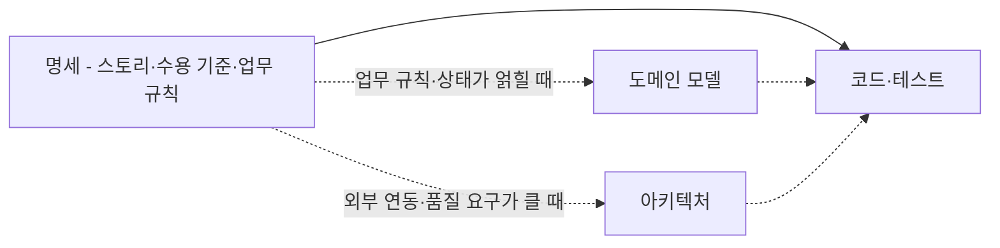
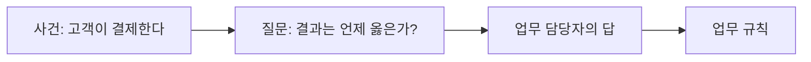
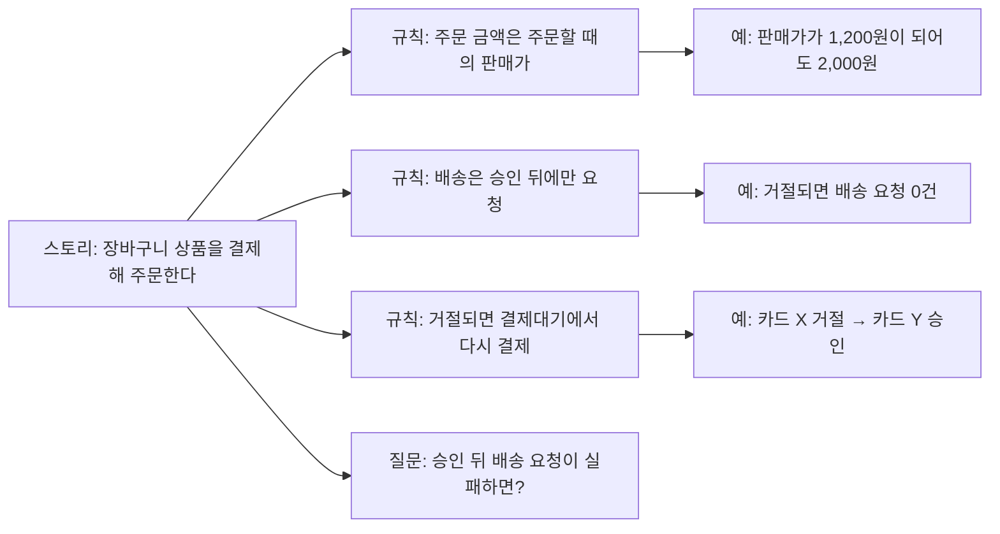
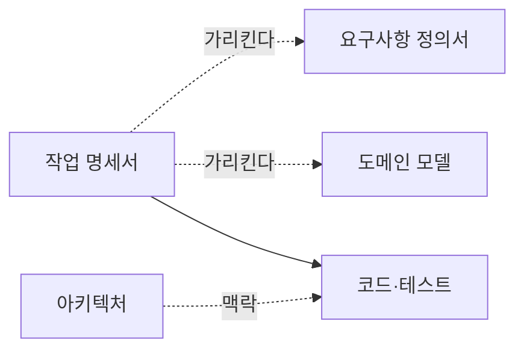

--------------------
Session 명: 03. 요구의 구체화와 명세
--------------------

## 목차

01. 세션 목표
02. 명세 주도 개발
03. 문제에서 요구사항으로
04. 요구를 담는 형식
05. 유저 스토리
06. BDD — 예로 명세하기
07. 명세와 산출물
08. 작업 명세서
09. SDD의 수준과 한계
10. 명세의 알맞은 수준과 경로
11. 시연 — LLM이 쓴 작업 명세서
12. 잘못된 관행
13. 실습 — 작업 명세서
14. 요약

## 01. 세션 목표

요구를 **유저 스토리 기반의 작업 명세서**로 만들어, LLM이 업무 규칙을 추측하지 않게 한다.

- **명세 주도 개발**의 명세가 요구사항의 명세임을 설명하고, 3가지 수준과 한계를 평가한다.
- 요청을 **문제/기회 → 요구 → 요구사항 → 해결책**으로 나누고 업무 규칙을 찾는다.
- 요구를 담는 형식(이벤트–반응 목록·유스케이스·유저 스토리·도메인 이벤트)이 모두 **이벤트**에서 출발함을 설명한다.
- 좋은 **유저 스토리**(INVEST)를 쓰고, 업무 규칙을 기준으로 세로로 나눈다.
- **BDD**로 업무 규칙의 예를 Given-When-Then으로 쓰고, Example Mapping으로 질문을 찾는다.
- **명세**와 산출물(요구사항 정의서·작업 명세서·도메인 모델·아키텍처)의 관계를 설명하고, **작업 명세서**를 쓴다.
- 명세의 **알맞은 수준**과 요구에서 코드까지 넣을 **중간 산출물**을 판단한다.

**강사 노트**

- "02. 작업 특성에 따른 AI 활용 방식"은 "어떤 방식으로 맡길까?"를 다뤘다. 이 세션은 "무엇을 만들게 할까?"를 다룬다. "무엇으로 받아들일까?"(수용 기준)는 "04. 수용 기준과 검증 가능한 작업 단위"가 맡는다.
- 요구의 틀과 유저 스토리는 "객체지향 분석과 설계 실무" 과정 02 세션의 내용을 재사용한다. 그 과정을 들은 수강생에게는 빠르게 환기한다.

---

## 02. 명세 주도 개발

## 명세 주도 개발이란?

**명세 주도 개발(SDD)**은 AI로 코드를 쓰기 전에 **명세**를 먼저 쓰고, 그 명세를 사람과 AI가 함께 따르는 기준으로 삼는 방식이다.

**인용문**

명세 주도 개발은 AI로 코드를 쓰기 전에 **명세를 먼저 쓰는 것**이고 그 명세가 **사람과 AI의 기준**이 된다, "Spec-driven development means writing a “spec” before writing code with AI (“documentation first”). The spec becomes the source of truth for the human and the AI.", [Böckeler 2025]

- **왜 지금인가?** — "01. AI 협업의 특성과 사람의 판단 책임"에서 보았듯이 요청 한 줄로 맡기면 LLM이 빈칸을 추측한다. 명세를 먼저 쓰면 사람이 정할 것을 먼저 정한다.
- **SDD는 방식이다** — 명세를 **언제** 쓰고 **얼마나** 남기는가를 정한다. 명세에 **무엇을** 쓰는가는 요구공학이 답한다.
- **명세는 새 산출물이 아니다** — 오래 써 온 **요구사항 정의**를 SDD가 다시 부르는 이름이다. 이름이 바뀌었다고 따로 만들지 않는다.

**강사 노트**

- 인용 근거: Birgitta Böckeler, "Understanding Spec-Driven-Development: Kiro, spec-kit, and Tessl", martinfowler.com, 2025 원문 확인. 명세의 기준 원전이다. 한글은 요약이다.
- 원문은 SDD의 정의가 아직 움직인다고 적고, GitHub(명세를 고쳐 가며 유지)와 Tessl(명세가 주된 산출물)의 정의를 함께 소개한다. 이 차이는 「09. SDD의 수준과 한계」의 「3가지 수준」에서 다룬다.

---

## 명세에 무엇을 쓰는가?

SDD의 명세는 **요구사항**을 확인할 수 있을 만큼 정밀하게 적은 것이다. **도메인 모델과 아키텍처는 명세에 포함하지 않고**, 명세가 가리키는 기준으로 둔다.

**인용문**

명세는 자연어로 쓴 **구조화된 행위 중심의 산출물**로 소프트웨어의 기능을 표현하고 AI 코딩 에이전트의 안내가 된다, "A spec is a structured, behavior-oriented artifact - or a set of related artifacts - written in natural language that expresses software functionality and serves as guidance to AI coding agents.", [Böckeler 2025]

**표 — 명세의 구성**

| 구성 | 명세 여부 | 주문한다(예) | 비고 |
|---|---|---|---|
| **유저 스토리** | 포함 | 고객으로서 결제해 주문하고 싶다 | 작업의 단위 |
| **수용 기준** | 포함 | 판매가가 올라도 2,000원 승인 요청 | 테스트 기준 |
| **업무 규칙과 예** | 포함 | 주문 금액·배송 요청·결제 거절 | 업무 담당자가 정한다 |
| **범위·제외·미정** | 포함 | 재고 제외, 배송 요청 실패는 미정 | 작업마다 정한다 |
| **도메인 모델** | 기준 | 주문 상태 기계 | 분석 산출물 — 명세가 가리킨다 |
| **아키텍처** | 기준 | 결제·배송 연동의 의존 규칙 | 설계 산출물 — 명세가 가리킨다 |

**강사 노트**

- 원문의 정의는 "a set of related artifacts"까지 포함한다. 그 묶음을 요구사항 정의서·작업 명세서와, 명세가 아닌 도메인 모델·아키텍처로 나누는 것은 「07. 명세와 산출물」에서 다룬다.
- 용어집은 요구 산출물이라 요구사항 정의서에 둔다. 도메인 모델(개념·관계·상태 기계)은 분석 산출물이다. 도메인 모델과 아키텍처를 맥락으로 만드는 법은 "05. 도메인·설계 지식과 맥락 구성"에서 다룬다.

---

## 명세에서 코드까지

**명세**는 모든 경로에 있고, 가장 작은 명세는 유저 스토리와 수용 기준이다. 그 사이에 **도메인 모델**과 **아키텍처**를 넣을지는 복잡성이 정한다.

**도식 — Mermaid — 명세에서 코드까지의 경로**



- **도메인 모델·아키텍처는 맥락** — 명세의 뜻과 실현 구조로 에이전트에게 준다. 주문한다는 둘 다 가볍게 넣는다(「10. 명세의 알맞은 수준과 경로」).

**강사 노트**

- 경로는 4가지다: 명세 → 코드, 명세 → 도메인 모델 → 코드, 명세 → 아키텍처 → 코드, 명세 → 도메인 모델·아키텍처 → 코드. 원전의 분류가 아니다(`guides/sw-engineering-principles.md` 7절).

---

## Kiro의 요구 문서

SDD 도구 Kiro의 요구 문서는 **유저 스토리와 수용 기준**의 목록이다. 주문한다를 이 형식으로 쓰면 다음과 같다.

```text
요구 1. 주문한다
유저 스토리: 고객으로서 장바구니 상품을 결제해 주문하고 싶다. 배송받기 위해서다.
수용 기준
1. GIVEN 펜 2개를 1,000원에 주문했고 판매가가 1,200원이 됐다
   WHEN 결제한다  THEN 2,000원의 승인을 요청한다
2. GIVEN 결제대기인 주문  WHEN 결제가 승인된다  THEN 결제완료, 배송 요청 1건
3. GIVEN 결제대기인 주문  WHEN 결제가 거절된다  THEN 결제대기, 배송 요청 0건
```

**인용문**

요구마다 "As a…" 형식의 **유저 스토리**와 "GIVEN… WHEN… THEN…" 형식의 **수용 기준**이 있다, "each requirement represents a “User Story” (in “As a…” format) with acceptance criteria (in “GIVEN… WHEN… THEN…” format)", [Böckeler 2025]

- **이것이 SDD의 명세다** — 「08. 작업 명세서」의 작업 명세서는 여기에 업무 규칙과 예·범위·제외·미정을 더한 완성본이다.
- **설계·작업 문서는 명세가 아니다** — Kiro는 요구 → 설계 → 작업의 문서 3개를 만든다. 설계는 해결책, 작업은 작업 계획이다.

**강사 노트**

- 원문은 Kiro의 흐름을 "Requirements → Design → Tasks"로, 설계 문서의 구성은 시도마다 달랐다고 적는다. 작업 목록의 항목마다 요구 번호가 붙는다.
- 예의 요구는 주문한다를 Kiro 형식으로 옮긴 교육용 예다. Kiro가 만든 결과가 아니다.

---

## 명세를 쓰는 순서

명세는 새 산출물이 아니므로 **요구공학의 순서**대로 쓴다. 이 세션의 목차가 그 순서다.

**표 — 명세를 쓰는 순서**

| 순서 | 목차 | 얻는 것 |
|---|---|---|
| 1 | **03. 문제에서 요구사항으로** | 업무 규칙과 업무 담당자에게 할 질문 |
| 2 | **04. 요구를 담는 형식** | 이벤트로 본 요구의 형식 |
| 3 | **05. 유저 스토리** | 누가·무엇을·왜 — 작업 단위 |
| 4 | **06. BDD — 예로 명세하기** | 수용 기준 — Given-When-Then |
| 5 | **07. 명세와 산출물** | 정의서·작업 명세서, 도메인 모델·아키텍처와의 관계 |
| 6 | **08. 작업 명세서** | 주문한다의 작업 명세서 |
| 7 | **09. SDD의 수준과 한계** | 명세를 얼마나 남기는가? |
| 8 | **10. 명세의 알맞은 수준과 경로** | 무엇을 얼마나 넣는가? |

**강사 노트**

- 순서는 학습 순서다. 실제로는 스토리와 수용 기준을 쓰다가 업무 규칙의 질문으로 되돌아간다.

---

## 03. 문제에서 요구사항으로

## 문제·요구·요구사항·해결책

업무 담당자의 요청에는 **문제·요구·요구사항·해결책**이 섞여 있다. 해결책은 작업 명세서에 넣지 않는다.

**인용문**

"요구사항은 시스템이 따라야 할 **능력과 조건**이다", "Requirements are capabilities and conditions to which the system … must conform", [Larman 2004]

**표 — 요청에 섞인 것**

| 구분 | 핵심 질문 | 주문의 요청에서 |
|---|---|---|
| **문제/기회** | 무엇이 부족한가? | 외부 솔루션으로는 주문 정책을 바꿀 수 없다 |
| **요구** | 무엇을 원하는가? | 고객이 결제하면 주문이 되고 배송이 시작되어야 한다 |
| **요구사항** | 시스템이 무엇을 충족해야 하는가? | 주문 금액·배송 요청·결제 거절의 업무 규칙과 그 예 |
| **해결책** | 어떻게 충족하는가? | 클래스, 저장 방식, 외부 호출 방식 |

- **요청 원문** — "장바구니에 담은 상품을 결제하면 주문이 되고 배송이 시작되게 해 주세요."

**강사 노트**

- 이 틀은 "객체지향 분석과 설계 실무" 과정 02 세션의 '문제·요구·요구사항·해결책'과 같다. 인용 근거: Craig Larman, *Applying UML and Patterns*, 3rd ed., 2004 원문 확인.
- 문제/기회 행은 교육용 가정이다. 실제 문제는 요청자에게 확인한다.

---

## 업무 규칙 찾기

"**올바른 결과가 무엇인가?**"에 대한 답이 업무 규칙이다. 요청에는 이 답이 없으므로 업무 담당자에게 질문해서 확인한다.

**도식 — Mermaid — 업무 규칙을 찾는 흐름**



**표 — 질문과 업무 규칙**

| 질문 | 업무 담당자의 답(업무 규칙) |
|---|---|
| 주문 금액은 어느 시점의 가격인가? | 주문이 생길 때의 판매가로 정한다 |
| 배송은 언제 요청하나? | 결제가 승인된 뒤에만 한다 |
| 결제가 거절되면 주문은 어떻게 되나? | 결제대기로 남고, 다른 카드로 다시 결제한다 |

**강사 노트**

- 시나리오에서 이 답은 업무 담당자와 30분 회의로 정했다. "01. AI 협업의 특성과 사람의 판단 책임"의 첫 시도는 이 질문을 묻지 않고 에이전트가 답을 골랐다.

---

## 04. 요구를 담는 형식

요구를 담는 형식은 모두 **이벤트**에서 출발하고, 형식마다 **다른 관점을 보는 작업 단위**다.

**인용문**

"도메인 전문가가 관심을 두는 **무언가가 일어났다**", "Something happened that domain experts care about.", [Evans 2015]

**표 — 형식별로 보는 이벤트**

| 형식 | 보는 이벤트 | AI-native에서의 쓰임 |
|---|---|---|
| **이벤트–반응 목록** | 외부에서 일어나 시스템이 반응해야 하는 자극 | 업무 규칙을 찾기 시작하는 목록 |
| **유스케이스** | 액터가 목표를 위해 시스템과 주고받는 상호작용 | 기능 전체의 흐름을 알려 주는 입력 |
| **유저 스토리** | 사용자가 원하는 작은 가치의 행위 | **AI가 처리하는 작업 단위** |
| **도메인 이벤트** | 업무 전문가가 관심을 두는, 이미 일어난 사건 | 상태가 바뀌는 사건 — 상태 기계의 전이 |

**강사 노트**

- 표는 "객체지향 분석과 설계 실무" 과정 02 세션의 '08. 이벤트 중심 기법'을 재사용했다. 인용 근거: Eric Evans, *Domain-Driven Design Reference*(2015)의 Domain Events 원문 확인.
- 유스케이스와 도메인 이벤트는 소개만 한다. 유저 스토리와, 수용 기준을 예로 쓰는 BDD는 이어지는 05·06에서 자세히 다룬다.

---

## 05. 유저 스토리

## 유저 스토리란?

**유저 스토리는 AI가 처리하는 작업 단위**다. 한 번에 만들고 확인할 크기이기 때문이다.

**인용문**

"유저 스토리에는 결정적인 세 가지 면이 있다. 이를 **카드, 대화, 확인**이라 부를 수 있다", "User stories have three critical aspects. We can call these Card, Conversation, and Confirmation.", [Jeffries 2001]

  - **카드** — 스토리를 짧게 적어 둔 것. 요구사항 전체가 아니라 대화를 시작하는 메모다.
  - **대화** — 세부는 고객과 개발자가 대화로 채운다. 업무 규칙이 여기서 나온다.
  - **확인** — 스토리가 끝났는지 수용 기준(테스트)으로 확인한다.

- **AI-native에서의 대화** — 업무 규칙은 업무 담당자와의 대화에서 정하고, LLM과의 대화에서는 빠진 질문을 찾는다.

**강사 노트**

- 인용 근거: Ron Jeffries, "Essential XP: Card, Conversation, Confirmation"(2001) 원문 확인. 세 요소의 설명은 원문의 각 절을 요약했다.
- "객체지향 분석과 설계 실무" 과정 02 세션의 '49. 유저 스토리'와 같은 근거다.

---

## 스토리의 문형

유저 스토리는 **누가, 무엇을, 왜** 원하는지를 한 문장으로 쓴다. "왜"가 스토리의 가치를 드러낸다.

```text
As a [누가]
I want [무엇을]
so that [왜]
```

**인용문**

이 문형의 강점은 스토리를 처음 정의할 때 **그 스토리를 전달하는 가치**를 밝히게 한다는 것이다, "Its strength is that it forces you to identify the value of delivering a story when you first define it.", [North 2006]

- **주문** — 고객으로서 장바구니에 담은 상품을 결제해 주문하고 싶다. 상품을 배송받기 위해서다.
- **정기배송** — 고객으로서 생필품을 정한 주기로 받도록 정기배송을 신청하고 결제하고 싶다. 매번 주문하지 않기 위해서다.
- **"왜"가 없으면** — 가치를 말하지 못하는 스토리는 범위에서 뺄 후보다.

**강사 노트**

- 인용 근거: Dan North, "Introducing BDD"(2006) 원문 확인. 원문은 가치가 없는 스토리가 "so that I just do, ok?"처럼 끝난다고 적는다.
- 문형은 필수 양식이 아니다. 누가·무엇을·왜가 드러나면 된다.

---

## 좋은 유저 스토리 — INVEST

좋은 유저 스토리의 조건은 **INVEST** 6가지다. AI에게 맡길 때는 특히 **작고(S), 확인할 수 있어야(T)** 한다.

**인용문**

좋은 스토리는 **독립적·협상 가능·가치·추정 가능·작음·테스트 가능**의 6가지 조건을 갖춘다, "good stories are: I – Independent N – Negotiable V – Valuable E – Estimable S – Small T – Testable", [Wake 2003]

**표 — INVEST와 AI에게 맡기는 작업**

| 조건 | 뜻 | AI에게 맡길 때 |
|---|---|---|
| **독립적**(Independent) | 다른 스토리와 겹치지 않고 순서를 바꿀 수 있다 | 작업을 따로 맡기고 따로 확인한다 |
| **협상 가능**(Negotiable) | 세부는 대화로 함께 채운다 | 업무 규칙은 사람이 정하고 명세서에 쓴다 |
| **가치**(Valuable) | 고객에게 가치가 있다 | 기술 작업이 아니라 고객의 결과로 쓴다 |
| **추정 가능**(Estimable) | 우선순위를 정할 만큼 크기를 안다 | 모르는 것이 많으면 먼저 질문을 찾는다 |
| **작음**(Small) | 길어야 몇 주, 짧게는 며칠 | 한 번 맡겨 끝까지 확인할 크기 |
| **테스트 가능**(Testable) | 테스트를 쓸 수 있을 만큼 안다 | 에이전트의 완료를 테스트로 확인한다 |

**강사 노트**

- 인용 근거: Bill Wake, "INVEST in Good Stories, and SMART Tasks"(2003) 원문 확인. 표의 "뜻"은 원문의 각 절을 요약했고, "AI에게 맡길 때"는 적용이다.
- 원문은 테스트 가능을 이렇게 설명한다: 스토리 카드를 쓰는 것은 "테스트를 쓸 수 있을 만큼 원하는 것을 안다"는 약속이다.

---

## 스토리 나누기

스토리는 **층이 아니라 기능을 세로로** 나눈다. 한 조각만으로도 고객에게 가치가 있어야 한다.

**인용문**

고객에게 케이크 전체의 본질을 주는 가장 좋은 방법은 **층을 세로로 자르는 것**이다, "We want to give the customer the essence of the whole cake, and the best way is to slice vertically through the layers.", [Wake 2003]

**표 — 주문한다를 나누는 두 방법**

| 나누는 방법 | 조각 | 문제 |
|---|---|---|
| **층으로**(가로) | 주문 테이블 만들기, 결제 연동 모듈, 주문 화면 | 한 조각만으로는 고객이 주문할 수 없다 |
| **업무 규칙으로**(세로) | ① 결제가 승인되면 배송을 요청한다 ② 거절되면 다시 결제한다 | 없다 — 조각마다 고객이 결과를 얻는다 |

- **나누는 기준은 업무 규칙** — 주문 금액 규칙은 ①과 함께 만들고, 결제 거절 규칙은 ②로 따로 만든다. 조각마다 따로 맡기고 따로 확인한다.

**강사 노트**

- 원문은 개발자가 한 번에 한 층만 "제대로" 만들고 싶어 하지만, 화면이 없는 데이터베이스 층은 고객에게 가치가 적다고 적는다.
- 시연과 실습은 주문한다를 한 스토리로 다룬다. 나누는 기준을 보이기 위한 예다.

---

## 잘못된 유저 스토리

LLM에게 스토리를 쓰게 하면 **개발자가 주어인 스토리**나 **기술 작업**이 섞이기 쉽다.

**인용문**

LLM 도구가 작은 버그를 고치며 쓴 스토리 — **개발자로서** 변환 함수가 경계 사례를 우아하게 처리하기를 원한다, "User story: As a developer, I want the transformation function to handle edge cases gracefully, so that the system remains robust when new category formats are introduced.", [Böckeler 2025]

**표 — 잘못된 유저 스토리**

| 관행 | 예 | 바로잡기 |
|---|---|---|
| **개발자가 주어** | 개발자로서 결제 함수가 견고하기를 원한다 | 고객의 결과로 쓴다 |
| **기술 작업** | 주문 테이블을 만든다 | 고객이 얻는 결과로 세로로 나눈다 |
| **"왜"가 없음** | 고객으로서 결제 버튼을 원한다 | 가치를 말하지 못하면 범위에서 뺀다 |
| **확인할 수 없음** | 결제가 빠르면 좋겠다 | 확인할 수 있는 예와 기준을 붙인다 |

**강사 노트**

- 인용은 Böckeler가 Kiro로 작은 버그를 고치려 했을 때 요구 문서에 생긴 스토리 가운데 하나다(원문의 표현으로 "gems like…"). 한글은 요약이다.
- 표의 예는 주문 시스템에 맞춘 교육용 예다.

---

## 06. BDD — 예로 명세하기

## BDD란?

**행위 주도 개발(BDD)**은 **구체적인 예로 기대 행위를 합의**하고, 그 예를 검증과 잇는 협업 방식이다. TDD에서 출발해 요구 분석으로 넓어졌다.

**인용문**

"행위 주도 개발은 여러 역할 간 협업을 통해 해결할 문제에 대한 **공통 이해**를 만들어 업무 담당자와 기술 담당자의 간극을 좁히는 소프트웨어 팀의 협업 방식이다", "BDD is a way for software teams to work that closes the gap between business people and technical people by: Encouraging collaboration across roles to build shared understanding of the problem to be solved", [Cucumber]

**표 — BDD의 3가지 실천**

| 실천 | 하는 것 | 주문한다에서 |
|---|---|---|
| **발견**(Discovery) | 함께 대화하며 규칙과 예를 찾는다 | 업무 담당자와 30분 회의 — 업무 규칙 3가지와 질문 |
| **정형화**(Formulation) | 예를 Given-When-Then으로 쓴다 | 판매가가 바뀌는 시나리오 |
| **자동화**(Automation) | 예를 실행되는 테스트로 만든다 | 자바 수용 테스트 — 다음 세션 |

**강사 노트**

- 인용 근거: Cucumber 공식 문서 "Behaviour-Driven Development" 원문 확인. 같은 문서가 세 실천을 Discovery, Formulation, Automation이라 부른다.
- North(2006)는 TDD의 "테스트" 대신 "행위"라는 말을 쓰다가, 동료(Chris Matts)와 함께 이 생각을 요구 정의에 적용했다고 적는다.

---

## Given-When-Then

스토리의 행위는 **수용 기준**이고, 수용 기준은 **Given-When-Then**의 시나리오로 쓴다.

```gherkin
Scenario: 결제 직전에 판매가가 올라도 주문 금액은 그대로다
  Given 고객이 펜 2개를 판매가 1,000원에 주문해 주문 금액이 2,000원이다
  And   펜의 판매가가 1,200원으로 바뀌었다
  When  고객이 카드로 결제한다
  Then  결제 시스템에 2,000원의 승인을 요청한다
```

**인용문**

스토리의 행위는 곧 **수용 기준**이다 — 시스템이 수용 기준을 모두 채우면 바르게 동작하고 채우지 못하면 아니다, "A story’s behaviour is simply its acceptance criteria: if the system fulfils all the acceptance criteria, it’s behaving correctly; if it doesn’t, it isn’t.", [North 2006]

- **Given** — 시작하는 상황, **When** — 일어나는 사건, **Then** — 확인할 결과
- **업무 규칙 하나에 대표 예** — 규칙마다 그 규칙을 가장 잘 보이는 예를 고른다.

**강사 노트**

- 인용 근거: Dan North, "Introducing BDD"(2006) 원문 확인. 원문의 형식은 "Given some initial context (the givens), When an event occurs, Then ensure some outcomes."다.
- Given-When-Then의 작성법은 "객체지향 분석과 설계 실무" 과정 02 세션의 '56. Given-When-Then'에도 있다.

---

## Example Mapping

**Example Mapping**은 스토리 하나를 놓고 **규칙·예·질문**을 카드로 나눠 대화하는 방법이다. 카드는 그대로 작업 명세서의 유저 스토리·업무 규칙·예·미정이 된다.

**인용문**

Example Mapping은 수용 기준을 밝히는 대화를 **짧고 생산적으로** 만드는 방법이다, "Example Mapping is a method designed to make this conversation short and very productive.", [Cucumber: Example Mapping]

**도식 — Mermaid — 주문한다의 Example Mapping**



**강사 노트**

- 인용 근거: Cucumber 공식 문서 "Example Mapping" 원문 확인. 원문은 스토리를 노란 카드, 규칙을 파란 카드, 예를 초록 카드, 답하지 못한 질문을 빨간 카드에 쓴다고 설명한다.
- 강의에서는 업무 담당자 역할을 정해 실제로 카드 놀이처럼 해 볼 수 있다.

---

## BDD와 AI

BDD의 예는 **사람과 AI가 같이 읽는 기준**이다. 예를 쓰는 일은 LLM이 도울 수 있지만, 규칙은 사람이 정한다.

**표 — BDD의 실천과 AI**

| 실천 | LLM이 하는 것 | 사람이 하는 것 |
|---|---|---|
| **발견** | 빠진 규칙과 질문을 찾는다 | 업무 담당자와 규칙을 정한다 |
| **정형화** | 예를 Given-When-Then으로 옮긴다 | 대표 예를 고르고, 지나치게 많은 예를 줄인다 |
| **자동화** | 예를 테스트 코드로 바꾼다 | 기대값이 규칙과 같은지 확인한다 |

- **예가 불어나는 위험** — 작은 버그가 수용 기준 16개로 불어난 예처럼, LLM은 예를 지나치게 많이 쓴다.

**강사 노트**

- 수용 기준 16개의 예는 [Böckeler 2025]가 Kiro로 작은 버그를 고칠 때 본 것이다(「09. SDD의 수준과 한계」의 「SDD의 한계 — 크기와 리뷰」).
- 자동화는 "04. 수용 기준과 검증 가능한 작업 단위"에서 실제 테스트 코드로 다룬다.

---

## 07. 명세와 산출물

## 명세와 산출물

요구사항의 명세는 범위와 수명에 따라 **요구사항 정의서**와 **작업 명세서**로 나뉜다. **도메인 모델**(분석)과 **아키텍처**(설계)는 명세가 아니다.

**표 — 요구에서 코드까지의 산출물**

| 산출물 | 무엇인가? | 범위·수명 |
|---|---|---|
| **요구** | 이해관계자가 원하는 것 | — |
| **요구사항** | 시스템이 충족할 능력과 조건 — 명세의 대상 | — |
| **유저 스토리** | 요구를 담는 작은 가치 단위 — 수용 기준이 붙어야 명세가 된다 | 스토리 하나 |
| **요구사항 정의서** | 시스템 전체의 요구사항 명세 — 용어집 포함 | 시스템 전체, 유지 |
| **작업 명세서** | 스토리 하나의 요구사항 명세 | 스토리 하나, 작업용 |
| **도메인 모델** | 분석 — 개념·관계·상태 기계. 명세가 아니다 | 도메인, 유지 |
| **아키텍처** | 설계 — 경계·의존 규칙. 명세가 아니다 | 시스템, 유지 |

**강사 노트**

- 표는 `guides/sw-engineering-principles.md` 7절의 정리를 따른다. 요구·요구사항의 구분은 「03. 문제에서 요구사항으로」, 유저 스토리와 수용 기준은 「05. 유저 스토리」·「06. BDD — 예로 명세하기」에서 다뤘다.
- "객체지향 분석과 설계 실무" 과정의 실습 1 결과물도 요구사항 정의서다. 이름이 같다.

---

## 산출물의 관계

작업 명세서는 요구사항 정의서와 도메인 모델에 있는 것을 **다시 쓰지 않고 가리킨다**. 아키텍처는 명세에 넣지 않고 **맥락**으로 준다.

**도식 — Mermaid — 산출물의 관계**



- **같은 종류, 다른 범위** — 둘 다 요구사항의 명세다. 정의서는 시스템 전체를 유지하고, 작업 명세서는 스토리 하나에 쓴다.
- **도메인 모델은 분석** — 주문 상태처럼 개념·관계·상태를 한 번 정하고, 명세는 그것을 가리킨다.
- **아키텍처는 해결 공간** — 명세에 섞으면 해결책을 지시하게 된다.

**강사 노트**

- SDD 도구는 "spec"이라는 한 단어로 요구·설계·작업 계획을 함께 부른다(「02. 명세 주도 개발」의 「Kiro의 요구 문서」). 나눠 보면 혼선이 줄어든다.
- 아키텍처를 맥락으로 주는 법(의존 규칙)은 "05. 도메인·설계 지식과 맥락 구성"에서 다룬다.

---

## 08. 작업 명세서

## 작업 명세서란?

**작업 명세서는 스토리 하나의 작업용 요구사항 명세**다. 유저 스토리에 업무 규칙과 예·범위·제외·미정을 붙인다. 프롬프트와 달리 저장소에 남겨 검토하지만, 오래 남길 업무 규칙은 정의서와 도메인 모델로 옮긴다.

**표 — 작업 명세서의 항목**

| 항목 | 답하는 질문 |
|---|---|
| **유저 스토리** | 누가, 무엇을, 왜 원하는가? |
| **업무 규칙과 예** | 결과는 언제 옳은가? 구체적인 값으로는? |
| **범위** | 이번 작업에서 무엇을 만드는가? |
| **제외** | 이번 작업에서 무엇을 만들지 않는가? |
| **미정** | 아직 답이 없는 질문은 무엇이고, 누가 답하는가? |
| **참조** | 어떤 요구사항 정의서·도메인 모델을 가리키는가? |

**강사 노트**

- 업무 규칙의 예를 수용 기준으로 정리해 작업 명세서에 더하는 일은 "04. 수용 기준과 검증 가능한 작업 단위"에서 한다.

---

## 주문한다의 작업 명세서

**문서 형식**

**작업 명세서 — 주문한다**

- **유저 스토리** — 고객으로서 장바구니에 담은 상품을 결제해 주문하고 싶다. 상품을 배송받기 위해서다.
- **업무 규칙과 예**
  - **주문 금액** — 배송지를 정해 주문이 생길 때의 판매가(단가) × 수량의 합. 예: 펜 2개, 판매가 1,000원 → 2,000원. 결제 직전에 판매가가 1,200원이 되어도 2,000원.
  - **배송 요청** — 결제가 승인된 뒤에만 한다. 예: 승인 → 배송 요청 1건, 거절 → 0건.
  - **결제 거절** — 주문은 결제대기로 남고, 다른 카드로 다시 결제한다. 예: 카드 X 거절 → 결제대기, 카드 Y 승인 → 결제완료.
- **범위** — 주문 생성과 금액 확정, 결제 승인 요청과 결과 반영, 승인 뒤 배송 요청
- **제외** — 장바구니 담기, 주문 취소·환불, 쿠폰·할인·배송비, 재고, 배송 이후의 일
- **미정** — 결제는 승인됐는데 배송 요청이 실패하면 어떻게 하는가? 업무 담당자가 다음 릴리스 전에 답한다.
- **참조** — 회의 메모, 용어집의 주문 상태(결제대기·결제완료)

**강사 노트**

- 이 명세는 「11. 시연 — LLM이 쓴 작업 명세서」의 초안을 사람이 검토해 완성한 것이다.
- 미정 하나는 이번 릴리스에 숨기지 않고 남긴 질문이다. "10. 실패 대응·재시도·복구"에서 다시 다룬다.

---

## 09. SDD의 수준과 한계

## 명세와 메모리 뱅크

SDD의 명세는 **한 작업**을 위한 문서(작업 명세서)이고, 메모리 뱅크는 **모든 작업**에 쓰는 맥락 문서(요구사항 정의서·도메인 모델·의존 규칙)다. 둘을 나눠 두어야 명세가 짧아진다.

**인용문**

메모리 뱅크는 코드베이스의 **모든 AI 코딩 세션**에 관련되고 명세는 그 기능을 만들거나 바꾸는 **작업에만** 관련된다, "These files are relevant across all AI coding sessions in the codebase, whereas specs only relevant to the tasks that actually create or change that particular functionality.", [Böckeler 2025]

**표 — 명세와 메모리 뱅크**

| 구분 | 담는 것 | 쓰는 범위 | 주문 시스템의 예 |
|---|---|---|---|
| **명세** | 한 작업의 유저 스토리·업무 규칙·범위 | 그 작업 | 작업 명세서 |
| **메모리 뱅크** | 규칙 파일, 제품과 코드베이스의 설명 | 모든 작업 | 요구사항 정의서, 용어집, 의존 규칙 |

- **용어집은 메모리 뱅크에** — "단가"의 정의는 작업마다 다시 쓰지 않는다. 작업 명세서는 그 정의를 가리키기만 한다.

**강사 노트**

- 원문은 일반 맥락 문서를 도구들의 이름을 따라 "메모리 뱅크"라 부른다(Kiro는 steering, spec-kit은 constitution).
- 메모리 뱅크(맥락 파일)를 만드는 법은 "05. 도메인·설계 지식과 맥락 구성"에서 다룬다.

---

## 3가지 수준

SDD는 **명세를 언제까지 남기는가**와 **코드와 명세 중 무엇을 원천으로 삼는가**에 따라 3가지 수준이 있다.

**인용문**

"**명세 먼저** — 잘 생각한 명세를 먼저 쓰고, 그 작업의 AI 지원 개발 흐름에 쓴다", "Spec-first: A well thought-out spec is written first, and then used in the AI-assisted development workflow for the task at hand.", [Böckeler 2025]

**인용문**

"**명세 고정** — 작업이 끝난 뒤에도 명세를 남겨 그 기능의 발전과 유지보수에 계속 쓴다", "Spec-anchored: The spec is kept even after the task is complete, to continue using it for evolution and maintenance of the respective feature.", [Böckeler 2025]

**인용문**

"**명세가 원천** — 명세가 시간이 지나도 주된 원천 파일이고, 사람은 명세만 고치며 코드는 건드리지 않는다", "Spec-as-source: The spec is the main source file over time, and only the spec is edited by the human, the human never touches the code.", [Böckeler 2025]

**강사 노트**

- 인용 근거: Böckeler(2025) 원문 확인. 원문은 이 셋을 SDD의 구현 수준으로 정리한다.

---

## 수준별 명세와 코드

3가지 수준은 **사람이 무엇을 고치는가**가 다르다. 원문이 살펴본 방식은 모두 명세 먼저였다.

**표 — 수준별로 사람이 고치는 것**

| 수준 | 사람이 고치는 것 | 명세는 |
|---|---|---|
| **명세 먼저** | 코드 | 작업이 끝나면 할 일을 다 했다 |
| **명세 고정** | 명세와 코드를 함께 | 둘이 어긋나지 않게 유지해야 한다 |
| **명세가 원천** | 명세만 | 코드는 명세에서 다시 생성된다 |

**인용문**

모든 SDD 접근은 **명세 먼저**지만 모두가 명세 고정이나 명세가 원천을 지향하지는 않는다, "All SDD approaches and definitions I’ve found are spec-first, but not all strive to be spec-anchored or spec-as-source.", [Böckeler 2025]

**강사 노트**

- 인용 근거: Böckeler(2025) 원문 확인. 원문은 명세를 시간이 지나며 어떻게 유지할지가 모호하거나 열려 있는 경우가 많다고 덧붙인다.

---

## SDD 도구 3가지

SDD를 내세우는 도구들도 **흐름과 수준이 서로 다르다**. SDD는 한 가지가 아니다.

**표 — SDD 도구 3가지 (Böckeler, 2025)**

| 도구 | 흐름 | 메모리 뱅크 | 수준 |
|---|---|---|---|
| **Kiro** | 요구 → 설계 → 작업(문서 3개) | steering | 명세 먼저 |
| **spec-kit** | constitution → (specify → plan → tasks) 반복 | constitution | 명세 먼저(명세마다 브랜치) |
| **Tessl** | 명세 하나가 코드 파일 하나 | 설정 | 명세 고정, 명세가 원천을 시험 |

- **spec-kit** — 명세마다 브랜치를 만든다. 명세의 수명을 기능 전체가 아니라 변경 요청 하나로 본다.
- **Tessl** — 생성된 코드 위에 "명세에서 생성됨 — 고치지 말 것"을 표시한다.

**강사 노트**

- 표는 원문이 2025년 9월에 써 본 도구의 설명을 요약한 것이다. 도구는 빠르게 바뀌므로 과정을 열 때마다 다시 확인한다. Tessl은 당시 비공개 베타였다.
- 도구 사용법은 다루지 않는다. 흐름과 수준의 차이만 본다.

---

## SDD의 한계 — 크기와 리뷰

SDD 도구의 흐름은 **작업 크기와 관계없이** 같은 문서를 만든다. 작은 작업에서는 리뷰할 문서가 코드보다 많아진다.

**인용문**

요구 문서는 이 **작은 버그**를 **유저 스토리 4개와 수용 기준 16개**로 바꾸었다, "The requirements document turned this small bug into 4 “user stories” with a total of 16 acceptance criteria", [Böckeler 2025]

**인용문**

솔직히 이 마크다운 파일들을 모두 리뷰하느니 **코드를 리뷰하겠다**, "To be honest, I’d rather review code than all these markdown files.", [Böckeler 2025]

- **작업 크기에 맞게** — 작은 수정은 작업 명세서를 몇 줄로 쓰고, 검증은 테스트로 한다.

**강사 노트**

- 원문은 spec-kit을 이전 팀에서 3~5포인트 크기였을 기능에 써 보았고, 그 크기에도 과했다고 적는다.

---

## SDD의 한계 — 통제의 착각

문서가 많다고 에이전트가 그대로 따르는 것은 아니다. **따랐는지는 결과로 확인해야** 한다.

**인용문**

이 모든 파일·템플릿·프롬프트·흐름·점검표가 있어도 **에이전트가 끝내 지시를 다 따르지 않는 것**을 자주 보았다, "Even with all of these files and templates and prompts and workflows and checklists, I frequently saw the agent ultimately not follow all the instructions.", [Böckeler 2025]

**인용문**

에이전트는 기존 클래스에 대한 설명이라는 메모를 무시하고 **새 명세로 받아들여 다시 만들어 중복**을 낳았다, "But ultimately the agent ignored the notes that these were descriptions of existing classes, it just took them as a new specification and generated them all over again, creating duplicates.", [Böckeler 2025]

**인용문**

우리가 만드는 것을 통제하는 가장 좋은 방법은 **작고 반복적인 단계**였다, "The past has shown that the best way for us to stay in control of what we’re building are small, iterative steps", [Böckeler 2025]

**강사 노트**

- 원문은 지시를 무시한 경우뿐 아니라, 규칙 하나를 지나치게 열심히 따른 경우도 보았다고 적는다.
- 따랐는지 확인하는 센서는 "09. 검증 하네스·결과 점검·피드백"에서 다룬다.

---

## SDD의 한계 — 무엇을 누가 쓰는가?

SDD는 **기능 명세와 기술 명세를 나누고**, 개발자가 요구 분석까지 하는 것을 전제한다. 둘 다 쉽지 않다.

1. **기능 명세와 기술 명세를 어떻게 나누는가?**
  - **원문** — 언제 기술의 세부를 더할지 자주 헷갈렸고, 문서마다 해석도 달랐다.
  - **지침** — 작업 명세서에는 업무 규칙만 쓰고, 설계는 맥락과 경계로 따로 둔다.
2. **누가 쓰는가?**
  - **원문** — 개발자가 요구 분석을 다 하는 것처럼 전제한다.
  - **지침** — 업무 규칙은 업무 담당자가 답하고, 개발자는 질문을 찾아 명세서로 옮긴다.

**강사 노트**

- 원문의 소제목: "How to effectively separate functional from technical spec?", "Who is the target user?". "원문"은 요약이다.

---

## 모델 주도 개발의 교훈

명세가 원천이 되는 SDD는 **모델 주도 개발(MDD)**과 닮았다. 모델이 명세였고, 코드 생성기가 코드를 만들었다.

**표 — MDD와 SDD**

| 구분 | 모델 주도 개발(MDD) | 명세가 원천인 SDD |
|---|---|---|
| **명세의 형식** | UML·전용 언어 — 도구가 읽을 수 있다 | 자연어 — 사람이 읽기 쉽다 |
| **코드를 만드는 것** | 직접 만든 코드 생성기 — 결정적이다 | LLM — 비결정적이다 |
| **잃은 것과 얻은 것** | 업무 애플리케이션에는 오버헤드가 커 자리잡지 못했다 | 생성기는 필요 없지만 명세 검사가 어렵다 |

**인용문**

명세가 원천인 방식과 명세 고정까지도 **MDD와 LLM의 단점을 함께** 떠안을 수 있다 — **경직성과 비결정성**, "I wonder if spec-as-source, and even spec-anchoring, might end up with the downsides of both MDD and LLMs: Inflexibility and non-determinism.", [Böckeler 2025]

**강사 노트**

- 표는 원문의 "Spec-anchored and spec-as-source: Are we learning from the past?" 절을 요약한 것이다. 원문의 저자는 MDD를 많이 쓴 프로젝트를 경험했다고 밝힌다.
- 모델을 그리는 "객체지향 분석과 설계 실무" 과정과 연결한다. 모델은 코드를 생성하려고 그리는 것이 아니라 의미를 밝히려고 그린다.

---

## SDD의 지침

SDD는 **명세 먼저**로 쓰고, 한계는 **작은 작업과 테스트**로 메운다.

**표 — SDD 지침**

| 지침 | 근거가 된 한계 |
|---|---|
| **작업 명세서를 먼저 쓴다** — 업무 규칙과 예를 담는다 | 명세 없이 맡기면 추측한다 |
| **명세서는 작업 크기에 맞게 짧게 쓴다** | 작은 작업에도 문서가 불어난다 |
| **업무 규칙은 요구사항 정의서와 도메인 모델에 남긴다** | 명세가 작업과 함께 버려진다 |
| **따랐는지는 테스트와 센서로 확인한다** | 문서가 있어도 에이전트가 따르지 않는다 |
| **업무 규칙과 설계를 섞지 않는다** | 기능과 기술의 경계가 흐려진다 |

**강사 노트**

- 수용 기준은 "04. 수용 기준과 검증 가능한 작업 단위", 맥락 파일은 "05. 도메인·설계 지식과 맥락 구성", 센서는 "09. 검증 하네스·결과 점검·피드백"에서 다룬다.

---

## 10. 명세의 알맞은 수준과 경로

## 알맞은 높이

명세는 **업무 규칙을 빠짐없이 담을 만큼 구체적이고, 구현 방법은 지시하지 않을 만큼 유연해야** 한다.

**인용문**

알맞은 높이는 행동을 이끌 만큼 **구체적**이면서 모델에게 강한 판단 기준을 줄 만큼 **유연**한 균형이다, "The optimal altitude strikes a balance: specific enough to guide behavior effectively, yet flexible enough to provide the model with strong heuristics to guide behavior.", [Anthropic 2025c]

**표 — 명세의 수준**

| 수준 | 주문의 예 | 일어나는 일 |
|---|---|---|
| **과소** | "결제되면 주문 완료로 해줘" | 주문 금액과 결제 거절을 LLM이 추측한다 |
| **알맞음** | 유저 스토리와 업무 규칙 3가지, 그 예 | 업무 규칙대로 만들고, 구현은 LLM이 판단한다 |
| **과잉** | "주문 서비스에서 반복문으로 판매가를 다시 조회해 더해줘" | 틀린 지시가 그대로 코드가 된다 |

**강사 노트**

- 인용 근거: Anthropic, "Effective context engineering for AI agents"(2025) 원문 확인. 원문은 시스템 프롬프트의 높이를 말하지만, 같은 균형이 작업 명세서에도 해당한다.
- 과잉의 예는 첫 시도의 잘못된 계산(결제 시점의 판매가 재조회)을 지시로 바꾼 것이다. 명세 과잉의 일반론은 "객체지향 분석과 설계 실무" 과정 02 세션의 '잘못된 관행 — 명세 과잉·방치'에 있다.

---

## 요구에서 코드까지

**요구 → 유저 스토리 → 코드·테스트**의 뼈대는 바뀌지 않는다. 중간 산출물은 **도메인 복잡성**과 **기술 복잡성**의 두 축으로 따로 고른다.

**표 — 두 축으로 고르는 중간 산출물**

| | 기술 복잡성 낮음 | 기술 복잡성 높음 |
|---|---|---|
| **도메인 복잡성 낮음** | 스토리와 수용 기준 → 코드 | + 아키텍처 |
| **도메인 복잡성 높음** | + 작업 명세서 + 도메인 모델 | 모두 |

- **도메인 복잡성** — 업무 규칙·상태·용어가 많고 서로 얽힌 정도
- **기술 복잡성** — 외부 연동·품질 요구·실행 환경의 제약이 큰 정도
- **사다리가 아니다** — 도메인은 복잡하고 기술은 단순하면, 아키텍처 없이 도메인 모델만 넣는다.

**강사 노트**

- 두 축의 정리는 원전의 분류가 아니다(`guides/sw-engineering-principles.md` 7절). 작업 계획은 스토리가 한 번에 끝나지 않을 만큼 클 때 더한다("04. 수용 기준과 검증 가능한 작업 단위").

---

## 무엇·언제·얼마나

중간 산출물의 판단은 **무엇·언제·얼마나**로 나눈다. 명세 주도 개발은 그중 **얼마나 남기는가**의 답이다.

**표 — 중간 산출물의 3가지 판단**

| 판단 | 기준 | 답 |
|---|---|---|
| **무엇을** 넣는가? | 도메인·기술 복잡성 | 작업 명세서, 도메인 모델, 아키텍처, 작업 계획 |
| **언제** 쓰는가? | 불확실성 | 먼저 정한다, 또는 만들면서 발견해 되돌린다 |
| **얼마나** 남기는가? | 수명·변경 빈도, 함께 쓰는 사람·에이전트의 수 | 작업에 쓰고 끝낸다, 또는 유지한다 |

- **SDD는 단계가 아니다** — 명세 먼저·명세 고정·명세가 원천은 작업 명세서를 얼마나 오래 원천으로 두는가의 차이다. 명세 고정은 작업 명세서를 정의서처럼 유지하는 것이다.
- **넣는 기준** — 그 산출물이 **에이전트의 결과나 사람의 검증을 바꾸는가?** LLM이 문서를 싸게 만들어도 검토 비용과 맥락의 한계는 그대로다.
- **기준이 없으면** — 도구가 작업 크기와 관계없이 같은 문서를 만든다(「SDD의 한계 — 크기와 리뷰」).

**강사 노트**

- 맥락이 한계 효용이 줄어드는 유한한 자원이라는 점은 "01. AI 협업의 특성과 사람의 판단 책임"의 「맥락의 한계」에서 다뤘다.

---

## 주문한다의 경로

주문한다는 도메인·기술 복잡성이 **모두 중간**이다. 업무 규칙 3가지와 주문 상태, 결제·배송 시스템 연동이 있다.

**표 — 주문한다에 넣는 산출물**

| 산출물 | 넣는가? | 이유 | 얼마나 남기는가? |
|---|---|---|---|
| **작업 명세서** | 넣는다 | 업무 규칙 3가지와 예 | 작업용 |
| **요구사항 정의서** | 넣는다 | 다음 작업이 같은 질문을 하지 않게 | 유지 |
| **용어집** | 넣는다 — 정의서 | 판매가와 단가 | 유지 — 맥락 파일 |
| **상태 기계** | 넣는다 — 도메인 모델 | 결제대기에서 다시 결제 | 유지 — 맥락 파일 |
| **의존 규칙** | 넣는다 | 결제·배송 연동이 업무 규칙에 섞이지 않게 | 유지 — 맥락 파일 |
| **아키텍처 문서** | 넣지 않는다 | 서비스 하나, 연동 2개 | — |
| **작업 계획** | 넣지 않는다 | 스토리 하나가 한 번에 끝나는 크기 | — |

- **오래 남는 것은 작업 명세서가 아니다** — 업무 규칙과 용어는 정의서에, 상태는 상태 기계에 남기고 다음 작업 명세서는 그것을 가리킨다.

**강사 노트**

- 맥락 파일과 의존 규칙은 "05. 도메인·설계 지식과 맥락 구성"에서 만든다.

---

## 11. 시연 — LLM이 쓴 작업 명세서

## 작업 명세서 초안

요청 한 줄과 회의 메모를 주고, LLM에게 **작업 명세서 초안**을 쓰게 했다(실제 실행).

- **프롬프트** — "다음 요청과 회의 메모로 '주문한다'의 작업 명세서를 써줘. 유저 스토리부터 쓰고, 업무 규칙과 예·범위·제외·미정을 붙여줘." 요청과 회의 메모(업무 규칙 3가지)를 붙였다.
- **업무 규칙** — 3가지 모두 "출처: 회의 메모"로 표시했다. 회의 메모에 없는 업무 규칙은 만들지 않았다.
- **미정** — 모르는 것 8가지를 질문으로 남겼다. "주문이 언제 생기는가?"를 가장 먼저 확인할 것으로 꼽았다.
- **제외** — 스스로 정한 경계라고 밝히고, 업무 담당자의 확인을 요청했다.
- **예** — 값은 지어냈다(상품 A, 10,000원).

**강사 노트**

- 2026-10-07에 Claude Code 2.1.292(비대화형, 도구 없음, 모델 claude-opus-5-5)로 실행했다. 41초, 출력 3,306토큰. 프롬프트와 초안 전문은 `code/s03/demo-results`에 있다.
- 첫 시도(요청 한 줄)와 달리 명세의 형식(미정 항목)과 회의 메모를 주자, 추측이 질문으로 바뀌었다. 같은 시연을 다시 하면 결과는 달라질 수 있다.

---

## 사람의 검토

미정 항목이 있는 명세 형식을 주자, LLM은 모르는 것을 **추측하지 않고 질문으로** 남겼다. 사람의 일은 그 질문에 답하는 것이다.

**표 — 초안의 미정과 사람의 결정**

| 초안의 미정 | 판정 | 결정 |
|---|---|---|
| 주문은 언제 생기는가? | 답함 | 배송지를 정하면 결제대기로 생긴다 |
| 주문 금액의 구성은? | 답함 | 단가 × 수량의 합. 배송비·할인은 제외 |
| 결제대기 기한과 재결제 횟수는? | 제외 | 이번 릴리스에는 제한이 없다 |
| 다시 결제할 수단은? | 답함 | 카드. 같은 카드로 다시 해도 된다 |
| 재고는 언제 확인하는가? | 제외 | 상품 시스템의 일이다 |
| 장바구니는 어떻게 처리하는가? | 제외 | 장바구니 기능은 이번 범위가 아니다 |
| 승인 뒤 상태의 이름은? | 답함 | 결제완료(용어집) |
| 결제 승인 뒤 배송 요청이 실패하면? | 미정 유지 | 업무 담당자가 다음 릴리스 전에 답한다 |

- **예의 값** — 지어낸 값을 시나리오의 값(펜 2개, 1,000원)으로 바꿨다. 결과가 「주문한다의 작업 명세서」다.

**강사 노트**

- 결정은 시나리오의 업무 담당자가 답한 교육용 결정이다. 수강생에게 먼저 답하게 하고 비교한다.
- "제외"로 옮긴 것은 답이 없어서가 아니라 이번 작업의 범위가 아니라서다. 숨기지 않고 명세에 남긴다.

---

## 12. 잘못된 관행

명세를 잘못 다루면 **LLM이 추측으로 채우거나** 문서끼리 **서로 어긋난다**.

**표 — 명세의 잘못된 관행**

| 관행 | 일어나는 일 | 바로잡기 |
|---|---|---|
| **새 이름, 새 산출물** | 요구사항 정의와 "명세"를 따로 만들어 어긋난다 | 명세가 요구사항 정의임을 알고 하나로 둔다 |
| **긴 프롬프트** | 업무 규칙이 지시 사이에 묻힌다 | 업무 규칙을 명세의 한 항목으로 쓴다 |
| **해결책을 지시하는 명세** | 틀린 지시가 그대로 코드가 된다 | 업무 규칙과 예만 쓴다 |
| **미정을 숨긴다** | 빈칸이 그럴듯하게 채워진다 | 질문으로 남기고 답할 사람을 적는다 |
| **업무 규칙을 남기지 않는다** | 다음 작업이 같은 질문을 다시 한다 | 요구사항 정의서와 용어집에 남긴다 |

**강사 노트**

- 업무 규칙을 저장소에 남기는 방법(맥락 파일·용어집)은 "05. 도메인·설계 지식과 맥락 구성"에서 다룬다.

---

## 13. 실습 — 작업 명세서

실습 2의 판단표와 회의 메모를 LLM에 제공하여 **정기배송 신청과 회차 생성 구현**의 **작업 명세서**를 만들고, 점검 항목으로 피드백하여 완성하십시오.

- **상황**
  + 실습 2에서 "규칙 확정"으로 분류한 작업을 업무 담당자와 마쳤다. **회의 메모**는 다음과 같다.
  + **결제 거절** — 결제 대기로 남고, 다른 결제 수단으로 다시 결제한다.
  + **회차** — 첫 배송일부터 배송 주기마다, 만료일까지 만든다.
  + **회차 금액** — 신청 때의 가격 × 수량. 기간 끝까지 같다.
- **투입물**
  + 실습 2의 **활용 방식 판단표**, 회의 메모, **정기배송 모델 패키지**
- **프롬프트**
  + "백로그의 '정기배송 신청과 회차 생성 구현'의 작업 명세서를 써줘. **유저 스토리부터** 쓰고 업무 규칙과 예·범위·제외·미정을 붙여줘. 회의 메모에 없는 규칙은 만들지 말고 **미정에 질문으로** 남겨줘."
- **점검 항목**
  1. **스토리** — 누가·무엇을·왜가 있고, 한 번에 만들고 확인할 크기인가?
  2. **업무 규칙의 출처** — 모든 업무 규칙이 회의 메모나 모델 패키지에 있는가?
  3. **해결책과 모델** — 구현 지시가 섞이거나, 모델 패키지의 내용을 다시 쓰지 않고 가리켰는가?
  4. **예** — 업무 규칙마다 구체적인 날짜·금액의 대표 예가 있는가?
  5. **제외** — 이번 작업에서 하지 않을 것(해지·취소·반품·배송지 변경)을 밝혔는가?
  6. **미정** — 답이 없는 것을 채우지 않고 질문으로 남겼는가? 답할 사람이 있는가?
- **결과물** — 작업 명세서. 실습 4의 입력이 됩니다.

**강사 노트**

- 정기배송 모델 패키지는 `code/s01/subscription/docs/`에 있다.
- LLM이 남긴 미정 질문에 수강생이 업무 담당자로서 답하게 한다. 답할 수 없는 것만 미정으로 남긴다.
- 예의 날짜는 수강생이 직접 계산해 확인한다(첫 배송일, 주기, 만료일).

---

## 14. 요약

LLM은 명세의 빈칸을 추측으로 채우므로, **사람이 정할 것은 먼저 정해 작업 명세서에 쓴다**.

### 작업 명세서의 핵심

- **요구의 틀** — 문제/기회 → 요구 → 요구사항 → 해결책. 해결책은 작업 명세서에 넣지 않는다
- **유저 스토리와 BDD** — 스토리는 AI가 처리하는 작업 단위다. 업무 규칙마다 대표 예를 Given-When-Then으로 쓴다
- **작업 명세서** — 스토리 하나의 작업용 요구사항 명세. 요구사항 정의서와 도메인 모델은 가리킨다
- **경로** — 요구 → 유저 스토리 → 코드·테스트는 불변이다. 중간 산출물은 도메인·기술 복잡성으로 고르고, SDD는 얼마나 남기는가의 답이다
- **시연** — 미정 항목이 있는 명세 형식을 주자 LLM은 모르는 것을 질문으로 남겼다

### 다음 세션

- "**04. 수용 기준과 검증 가능한 작업 단위**" — 작업 명세서의 업무 규칙을 허용·거절 예시와 테스트로 바꾸고, 한 번에 확인할 크기로 나눈다.

**강사 노트**

- 유저 스토리의 수용 기준이 다음 세션의 주제다. Given-When-Then의 예를 실행되는 테스트로 만든다(BDD의 자동화).

---

## 별첨. 실습 답

---

## 작업 명세서 (안)

**문서 형식**

**작업 명세서 — 정기배송 신청과 회차 생성**

- **유저 스토리** — 고객으로서 생필품을 정한 주기로 받도록 정기배송을 신청하고 결제하고 싶다. 매번 주문하지 않기 위해서다.
- **업무 규칙과 예**
  - **회차** — 첫 배송일부터 배송 주기마다, 만료일까지 예정 회차를 만든다. 만료일은 첫 배송일 + 기간의 전날이다. 예: 첫 배송일 11월 3일, 2주 주기, 3개월 → 만료일 2월 2일, 회차 7개(11/3, 11/17, 12/1, 12/15, 12/29, 1/12, 1/26).
  - **회차 금액** — 신청 때의 가격 × 수량. 기간 끝까지 같다. 예: 휴지 1묶음 10,000원 → 회차 금액 10,000원, 일시불 70,000원.
  - **결제 거절** — 정기배송은 결제 대기로 남고, 다른 결제 수단으로 다시 결제한다.
- **범위** — 신청, 회차 금액 확정, 일시불 결제 승인 요청, 승인되면 확정과 예정 회차 생성
- **제외** — 해지·취소·반품, 월별 청구, 배송지 변경, 회차의 배송 요청
- **미정** — 첫 배송일이 공휴일이면 어떻게 하는가? 업무 담당자가 답한다.

**강사 노트**

- 예의 값은 교육용 가정이다(`course-design.md`의 공통 전제). 회차 날짜는 2주 주기로 계산한 것이다.
- 배송지 변경은 실습 10~12의 두 번째 기능이므로 이번 작업에서 제외한다.

---

## 보완 (안)

새로 발견한 것은 **후속 작업에 영향을 미치는 경우에만** 이전 산출물에 반영한다.

- **활용 방식 판단표**(실습 2)
  - **규칙 확정 완료** — "결제 거절·회차 날짜 규칙 확정" 작업이 끝나, "정기배송 신청과 회차 생성 구현"을 에이전트에게 맡길 수 있다.
- **정기배송 모델 패키지**
  - **회차 규칙** — 만료일까지 회차를 만든다는 규칙과 예를 요구사항 정의서에 더한다.
- **※ 현행화 기준**
  - **반영** — 작업 명세서와 모델 패키지의 회차 규칙. 실습 4의 입력이 된다.
  - **기록만** — 미정 질문(공휴일).

**강사 노트**

- 실습 2의 판단은 고치지 않는다. 규칙 확정이 끝나 다음 작업을 맡길 조건이 갖춰졌다는 것만 기록한다.

---
