--------------------
Session 명: 01. OOAD 개요
--------------------

## 목차

01. 세션 목표
02. 개발의 비용과 가치
03. 문제와 요구사항
04. 소프트웨어의 복잡성
05. 분석과 설계
06. 맥락과 접근법
07. OOAD와 UML
08. 모델에서 코드로
09. 요구에서 테스트로
10. 책임과 경계
11. 적정 분석·설계
12. 피드백과 잘못된 관행
13. 전문영역으로의 확장
14. 실습 — 요구사항 명세서
15. 요약

## 01. 세션 목표

객체지향 분석·설계는 **문제와 해결책을 구분**하고, 요구를 **모델·코드·테스트**로 이어 가는 판단의 흐름이다.

- **문제·요구·해결책**을 구분하고 고객의 요청을 이벤트와 결과로 설명한다.
- **요구·분석·설계·코드**에서 내리는 결정과 가까운 검증을 구분한다.
- 같은 주문의 **구조·상호작용·상태**를 다이어그램과 코드로 연결한다.
- **책임·경계·협력**을 판단하고 분석 모델을 기계적으로 설계로 옮기지 않는다.
- **맥락**에 맞는 접근법과 적정 분석·설계 수준을 선택한다.
- **전문영역·AI 협업**으로 이어질 질문을 알고 요구사항 명세서 초안을 검토한다.

**강사 노트**

- 주문 예시는 다이어그램과 코드의 연결을 보여 줄 때만 사용한다. 실습의 정기배송은 별도 관통 사례다.
- 모델 표기법의 상세는 뒤 세션에서 다룬다. 이 세션에서는 각 그림이 답하는 질문과 코드의 결과를 먼저 예측하게 한다.

---

## 02. 개발의 비용과 가치

## SW 개발의 재작업

**재작업**은 이미 한 일을 바로잡거나 변경하기 위해 다시 수행하는 일이다. 일찍 확인할 수 있었던 오류와 **새 학습에 따른 변경**을 구분한다.

- 요구 **누락·오해**가 후속 판단에 반영되면 **수정 범위**가 커진다.
- **일찍 발견할 수 있었던 오류**를 줄이는 것이 목적이다.
- 실제 사용에서 **새 가치**를 발견한 변경까지 결함으로 취급하지 않는다.

**인용문**

"프로젝트 노력의 약 **40~50%**를 **회피 가능한 재작업**에 사용한다", "Current software projects spend about 40 to 50 percent of their effort on avoidable rework.", [Boehm·Basili 2001]

**도식 — Mermaid — 재작업이 커지는 흐름**

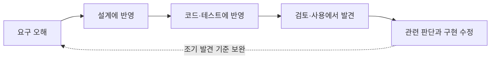

- **해석 범위** — 이 수치는 2001년 문헌의 보고이며 현재 모든 프로젝트의 비율이 아니다. 우리 팀의 재작업 비용은 별도로 측정한다.
- **사례 적용** — 배송 중 취소 거절 규칙은 먼저 합의한다. 나중에 승인된 새 취소 정책은 오류 수정과 구분한다.

**강사 노트**

- 재작업 인용 근거: Barry Boehm·Victor R. Basili, ["Software Defect Reduction Top 10 List"](https://www.cs.umd.edu/users/basili/publications/journals/J81.pdf), *IEEE Computer*, 2001, 원문 확인. 같은 항목은 재작업을 "더 일찍 발견해 더 싸게 고칠 수 있었던 문제에 쓴 노력"으로 정의한다.
- 인용 수치는 역사적 보고다. 재작업에는 학습으로 유용해진 변경도 섞여 있어, 모두 회피 가능한 결함은 아니다.
- 조기 검토의 비용과 줄일 수 있는 재작업 위험을 비교한다. 모든 변경을 처음부터 예방할 수 있다는 뜻은 아니다.

---

## 미사용 기능

**사용 빈도**와 **필요할 때의 가치**를 함께 본다. 드물게 쓰는 기능도 실패의 영향이나 업무상 필요가 크면 가치가 있을 수 있다.

**인용문**

폭포수식으로 미리 정한 기능 중 **45%는 전혀 사용되지 않았고 19%는 거의 사용되지 않았다**고 Larman이 재인용한다, "45% of such features were never used, and an additional 19% were \"rarely\" used.", [Larman 2004]

**Chart — matplotlib — 기능 사용 빈도(Johnson 조사, Larman 2004 재인용)**

```chart
{"type":"pie","labels":["미사용","거의 미사용","사용"],"series":[{"name":"사용 빈도(%)","values":[45,19,36]}]}
```

**주석**

원 조사 데이터·측정 기준은 미확인이다. 오늘의 모든 제품에 같은 비율을 적용하지 않는다.

**강사 노트**

- Craig Larman, Applying UML and Patterns, 3rd ed., 2004의 요구사항 논의에서 Johnson 조사를 재인용한 문장을 확인한다. 차트의 사용 36%는 100−45−19다.
- Larman은 요구 분석을 생략하라는 결론이 아니라 반복적 요구 분석과 사용자의 이른 피드백을 제시한다. 이 문헌의 해석과 원 조사 자체의 검증을 구분한다.

---

## 범위와 가치

**해야 할 것은 하고, 하지 않아도 될 것은 만들지 않는다.** 가장 나쁜 경우는 해야 할 것은 못하면서 하지 않아도 될 것을 만드는 것이다.

- **누락** — 필요한 요구사항을 놓친다.
- **범위의 무단 확대(Scope Creep)** — 승인 없이 범위가 늘어난다.
  - 예: 주문 취소를 만들다 승인 없이 **교환·반품**까지 추가
- **불필요한 기능 추가(Gold Plating)** — 요구에 없는 기능을 좋다는 이유로 더한다.
  - 예: 요청받지 않은 **취소 화면 효과**
- **과도한 설계·구현(Overengineering)** — 요구와 위험에 비해 지나치게 복잡하게 만든다.
  - 예: 단순한 취소 규칙에 **분산 처리 구조**

**강사 노트**

- 승인된 변경은 무단 확대가 아니다. 경계할 것은 가치 없이 비용과 변경 부담을 키우는 기능과 구조다.
- 범위의 무단 확대는 일정·비용·자원에 미치는 영향을 조정하거나 승인받지 않은 확대다. 세 개념은 서로 관련되지만 동의어가 아니다. 범위 확대는 변경 통제, 불필요한 기능 추가는 요구 밖의 기능, 과도한 설계·구현은 해법의 불필요한 복잡성이 초점이다.
- 예시는 모두 주문 취소라는 동일 상황에 연결한다.

---

## 03. 문제와 요구사항

## 문제 → 요구사항 → 해결책

해결책부터 정하지 않는다. 먼저 **문제**, 다음으로 충족할 **요구사항**, 마지막으로 **해결책**을 구분한다.

**도식 — Mermaid — 문제·요구사항·해결책**

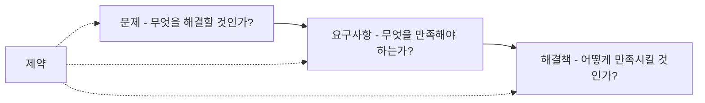

- **사례** — 고객의 “취소 버튼” 요청은 해결책이다. 문제는 직접 취소할 수 없다는 것이고, 요구사항은 취소 가능한 주문을 직접 취소할 수 있어야 한다는 것이다.
- **판단** — 같은 요구사항에도 여러 해결책이 가능하다. “왜?”를 물어 문제로 거슬러 오르고, 제약을 확인한 뒤 해결책을 고른다.

**강사 노트**
- 해석은 고객이 현재 직접 취소할 수 없다는 **가정**에 따른 것이다. 요청만으로 그 원인이 확인된 것은 아니다.
- 요구사항과 해결책은 각각 상위 목적에서 정당화되어야 한다.
- 이후 분석·설계 판단의 기준축으로 사용한다.
- 고객의 요청 자체가 이미 하나의 해결책일 수 있다.
- 바로 구현하기 전에 상위 문제와 요구사항을 확인한다.

---

## 이벤트 관점

고객 관점의 요구는 **사건과 기대 결과**로 표현한다. 화면 구성과 데이터 저장 방식은 요구를 합의한 뒤 해결책으로 결정한다.

- **이벤트로 본 요구** — “고객이 주문 취소를 요청한다 → 시스템이 허용 여부를 판단해 결과를 알린다.” 결제 완료·배송 시작 전 전체 취소만 확정하고, 결제 전 취소는 질문으로 남긴다.

**도식 — Mermaid — 고객 요청을 이벤트와 결과로**

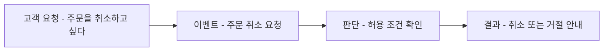

**강사 노트**

- 이벤트 반응 목록, 유스케이스, 사용자 이야기, 도메인 이벤트가 모두 이벤트를 출발점으로 삼는다는 근거는 "02. 요구 분석과 유스케이스"의 「07. 이벤트 중심 요구」·「08. 이벤트 중심 기법」에서 다룬다.
- 화면·기술 요소를 요구에 섞는 잘못된 관행은 "02. 요구 분석과 유스케이스"의 「37. 잘못된 관행 — 화면·기술 요소」에서 다룬다.

---

## 04. 소프트웨어의 복잡성

소프트웨어의 복잡성에는 문제 자체에서 생기는 **본질적 어려움**과 구현 수단에서 더해지는 **우연적 어려움**이 있다.

**인용문**

"소프트웨어의 복잡성은 우연적 속성이 아니라 본질적 속성이다", "The complexity of software is an essential property, not an accidental one.", [Brooks 1986]

- **본질적 어려움** — 업무 개념·규칙·관계에 내재한다. 어떤 상태에서 취소하고 언제 환불할지가 여기에 속한다.
- **우연적 어려움** — 확정한 의미를 언어·저장소·통신 기술로 구현하며 더해지는 부담이다.
- **업무 규칙과 구현 기법** — “환불은 한 번만 이루어진다”는 업무 규칙이고, 재시도·중복 제거는 그 규칙을 구현하는 기법이다.
- **기술의 한계** — 좋은 도구가 취소 조건을 대신 정하지 않는다. 외부 시스템 조정에서도 업무 의미와 구현 방식을 구분한다.

**강사 노트**

- Frederick P. Brooks Jr., No Silver Bullet — Essence and Accidents of Software Engineering, 1986 원문 확인.
- 환불 중복은 관심의 차이를 설명하는 질문이다. 이 개요 예제는 외부 시스템 실패·재시도·중복 처리를 구현하지 않는다.

---

## 05. 분석과 설계

## 분석과 설계

**인용문**

"분석은 해결책보다 문제와 요구사항의 조사를 강조한다", "Analysis emphasizes an investigation of the problem and requirements, rather than a solution.", [Larman 2004]

- **분석(Analysis)** — 문제와 요구사항을 조사해 업무의 개념·관계·규칙·상태를 밝힌다.
- **설계(Design)** — 요구를 실현할 구성 요소의 책임·협력·경계와 구현 방향을 정한다.
- **핵심 구분** — 개발 절차에서는 함께 반복해도, 사고에서는 문제와 해결책을 구분한다.

**도식 — Mermaid — 문제영역과 해결영역의 판단**

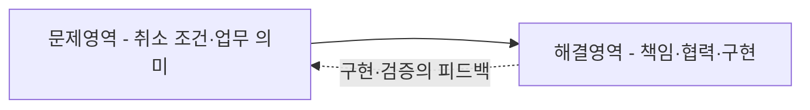

- **객체지향 분석**은 주문·주문 항목 같은 업무 개념과 관계를 검토한다. **객체지향 설계**는 분석에서 확인한 규칙을 지킬 소프트웨어 객체와 협력을 정한다.

**강사 노트**

- Craig Larman, Applying UML and Patterns, 3rd ed., 2004의 분석·설계 정의를 따른다. 설계는 요구를 충족하는 개념적 해결책을 강조한다.
- 분석 상호작용은 이 과정의 단계별 구성에 따른 선택이다. 그 적용 결정은 과정 설계에 기록되어 있다.

---

## 결정 경계

요구·분석·설계·코드는 **서로 다른 질문에 답한다**. 지금 어떤 결정을 내리는지 알아야 가까운 곳에서 검증할 수 있다.

**표 — 관점별 결정과 검증**

| 관점 | 질문 | 결정 | 가까운 검증 |
|---|---|---|---|
| **요구** | 누가 어떤 결과를 왜 원하는가? | 의도, 범위, 외부 결과 | 수용·거절 예시 |
| **분석** | 그 결과가 업무에서 무엇을 뜻하는가? | 개념, 관계, 규칙, 상태 | 시나리오와 모델의 교차검토 |
| **설계** | 누가 어떤 협력으로 실현하는가? | 경계, 책임, 협력, 계약 | 대안·실패 경로·변경 영향 |
| **코드** | 어떻게 실행하는가? | 실행 로직, 기술 구체화 | 정적 검사, 실행 테스트 |

- **분석이 끝났다** — 문서를 다 채웠다는 뜻이 아니라 다음 작업자가 중요한 의미를 **추측하지 않아도 되는** 상태다.
- **발견 위치 ≠ 원인** — 코딩 중 "배송된 주문도 취소하나?"가 드러나면 분기를 만들지 말고 요구로 돌아간다.

**강사 노트**

- 구분하는 이유는 문서 인계 절차를 고정하려는 것이 아니다. 앞 결정을 닫아 두고 되돌아가지 못하는 운영이 문제다(「피드백」).

---

## 06. 맥락과 접근법

**맥락**은 개발 판단에 영향을 주는 조건이고, **접근법**은 그 조건에서 일을 진행하고 검증하는 방식이다.

- **맥락을 묻는 질문** — 사람과 팀의 성숙도, 업무·기술·가치의 불확실성, 복잡성, 고객 참여와 실행 환경은 어떠한가?
- **접근법이 정하는 것** — 무엇부터 확인할지, 일을 얼마나 작게 나눌지, 어떤 모델·구현·실험으로 검증할지, 피드백을 얼마나 자주 받을지 정한다.
- **둘의 관계** — 같은 접근법을 항상 적용하지 않는다. 맥락에서 가장 큰 위험과 불확실성을 찾고, 그것을 먼저 줄이는 접근법을 선택한다.

**도식 — Mermaid — 맥락에서 접근법 선택으로**

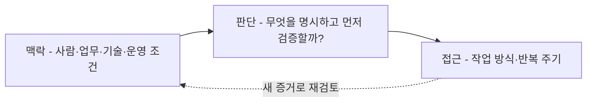

**강사 노트**

- 이 정의와 요소는 과정 설계의 맥락과 SW 공학 기본 원칙을 교육용으로 풀어 쓴 것이다. 보편적 표준 분류로 제시하지 않는다.

---

## 맥락에 따른 접근법

접근법 선택은 방법론의 이름을 고르는 일이 아니다. **가장 큰 불확실성을 먼저 줄이도록 활동의 순서·반복 단위·검증 방법을 조정**하는 일이다.

**표 — 맥락에 따른 접근의 출발점**

| 주요 조건 | 접근법 | 먼저 검증할 것 |
|---|---|---|
| 업무·기술이 안정적 | 계획 기반(폭포수) | 요구·계약의 완결성 |
| 도메인 지식·합의 경험이 부족 | 작은 범위의 모델·예시 검토 | 용어·규칙에 대한 이해 일치 |
| 기술이 불확실 | 반복·점진(I&I) | 작은 구현의 기술 위험 |
| 요구 변화·고객 참여 가능 | 애자일 | 짧은 증분의 동작·가치 |
| 문제·사용자 이해 부족 | 디자인 씽킹(DT) | 사용자의 문제 |
| 가치·시장 불확실 | Lean Startup | 최소 제품의 가치 가설 |
| 사용 경험 불확실 | Lean UX | 경험 가설과 실험 결과 |

**강사 노트**

- 표의 접근법은 배타적인 정답이 아니며 함께 사용할 수 있다.
- 성숙도가 높은 팀은 대화·스케치·코드로 가볍게 갈 수 있다. 모델 개수로 품질을 판단하지 않는다.
- 반복·점진(Iterative and Incremental, I&I), 디자인 씽킹(Design Thinking, DT)은 여기서 처음 소개한다. 기법 자체의 세부 절차는 범위 밖이다.
- 업무·기술 불확실성의 상세는 "02. 요구 분석과 유스케이스"의 「14. 업무·기술 불확실성」·「15. 경우별 접근법」에서 다룬다.

---

## 07. OOAD와 UML

## 분석·설계 방법

분석·설계 방법은 **무엇을 중심으로 문제와 구조를 보는가**에 따라 서로 다른 질문을 드러낸다. 이를 한 방법이 다른 방법을 완전히 대체한 일직선의 발전 과정으로 보지 않는다.

**표 — 방법별 관심사**

| 접근 | 중심 관심 | 유용한 질문 |
|---|---|---|
| **구조적 분석·설계** | 기능·자료 흐름·모듈 | 어떤 변환이 일어나며 자료가 어디로 흐르는가? |
| **정보공학** | 업무 정보·데이터 모델 | 어떤 정보와 관계를 일관되게 관리해야 하는가? |
| **객체지향 분석·설계** | 도메인 개념·객체 책임·협력 | 누가 상태와 규칙을 소유하고 어떻게 협력하는가? |

- **관점에 따른 질문** — 같은 문제를 보더라도 자료 흐름은 입력·변환·출력을, 데이터 모델은 정보와 관계를, 객체지향은 책임과 협력을 묻는다.

**강사 노트**

- 표는 관심사를 비교하는 교육용 정리다. 시대별 우열이나 단일 계보를 주장하지 않는다.
- 자료 흐름을 볼 때와 책임 배치를 볼 때 얻는 정보가 다르다는 점을 설명한다.

---

## 통합 모델링 언어

**통합 모델링 언어(Unified Modeling Language, UML)**는 **분석·설계 방법론이 아니라 모델을 표현·공유하는 표준 언어**다.

**인용문**

"UML은 소프트웨어와 시스템을 **시각화·명세·문서화**하는 표준이다", "Unified Modeling Language® (UML®) as a standard for visualizing, specifying, and documenting software and systems.", [OMG UML]

- **관점의 선택** — UML 다이어그램은 구조·상호작용·상태처럼 서로 다른 관점을 표현한다. 무엇을 그릴지는 확인하려는 질문에 따라 정한다.
- **통합 배경** — UML은 Booch·OMT·OOSE의 접근을 통합하며 발전했다. 표준 언어를 쓴다고 분석의 판단까지 자동으로 이루어지지는 않는다.

**강사 노트**
- 인용 근거: OMG의 UML 소개 페이지(omg.org/uml) 원문 확인. 영어는 그 페이지 문장의 발췌다.
- UML의 통합 배경은 OMG [UML 2.5.1](https://www.omg.org/spec/UML/2.5.1/PDF), Scope의 UML 1 설명을 참조한다.
- UML은 객체지향 분석·설계 자체가 아니다.
- 분석·설계의 결과를 표현하고 검토하는 언어다.

---

## 08. 모델에서 코드로

## 클래스 다이어그램

**클래스 다이어그램**은 시스템의 정적 구조를 클래스·속성·연관·다중성으로 표현한다.

- **주문 항목 `1..*`** — 주문 항목은 하나 이상이어야 하므로 생성자가 빈 목록을 거부한다. 펜 2개는 주문 항목 하나의 수량이 2라는 뜻이다.

**배치 — 좌우**

**도식 — PlantUML — 주문의 클래스 다이어그램**

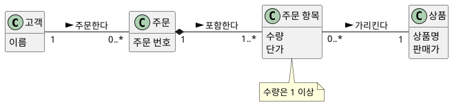

```java
final class 주문 {
    // ... 다른 필드 생략
    private final List<주문항목> 항목들;
    // ... 상태 필드 생략
    주문(String 주문번호, 고객 고객, List<주문항목> 항목들) {
        if (항목들.isEmpty()) throw new IllegalArgumentException("주문 항목은 1개 이상");
        // ... 다른 대입 생략
        this.항목들 = List.copyOf(항목들);
    }
    // ... 메서드 생략
}
```

**강사 노트**

- 분석 모델을 자동 변환한 최종 설계가 아니다. 참조 방향·생성 책임은 설계 판단이 더해진다.
- 공통 코드 주문예제.java에서 예시 주문을 만들고 빈 항목 목록·수량 0의 거절을 실행한다.
- 표기의 상세는 "03. 정적 모델 — 도메인 개념과 관계"의 「05. 클래스 다이어그램」에서 다룬다.

---

## 시스템 시퀀스 다이어그램

**시스템 시퀀스 다이어그램(SSD)**은 외부 액터가 시스템 경계에 보내는 이벤트를 시간 순서로 표현하며, 시스템 내부 객체는 드러내지 않는다.

**도식 — PlantUML — 주문의 시스템 시퀀스 다이어그램**

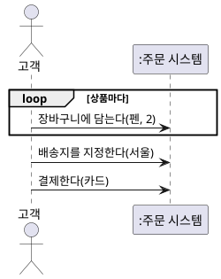

```java
interface 주문시스템 {
    void 장바구니에담는다(String 상품, int 수량);
    void 배송지를지정한다(String 주소);
    void 결제한다(String 결제수단);
}
```

**강사 노트**

- 공통 코드의 주문시스템대역으로 호출 순서와 인자를 실행 검증한다. 대역은 입력을 기록할 뿐 실제 결제·배송을 처리하지 않는다.
- 조회 뒤 장바구니부터 결제까지를 발췌했다. SSD는 시스템 내부 객체를 드러내지 않는다.
- SSD와 시스템 오퍼레이션은 "02. 요구 분석과 유스케이스"의 「41. 시스템 시퀀스 다이어그램」·「44. 정제된 SSD」에서 다룬다.

---

## 시퀀스 다이어그램

**시퀀스 다이어그램**은 메시지의 시간 순서와 반복을 보여 준다. 주문이 각 항목에 금액을 물어 **단가 × 수량**을 합산한다.

**배치 — 좌우**

**도식 — PlantUML — 주문의 총액 계산**

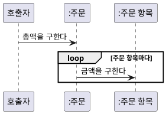

```java
final class 주문 {
    // ... 필드와 생성자 생략
    int 총액을구한다() {
        int 합계 = 0;
        for (주문항목 항목 : 항목들) 합계 += 항목.금액을구한다();
        return 합계;
    }
    // ... 상태 전이 메서드 생략
}
// ... 다른 선언 생략
final class 주문항목 {
    // ... 필드와 생성자 생략
    int 금액을구한다() { return 단가 * 수량; }
}
```

**강사 노트**

- 호출자는 총액 계산의 시작점을 나타내며 새 시스템 이벤트나 액터를 정의하지 않는다.
- 메시지는 받는 객체의 메서드로, 반복은 for로 구현한 예다. 두 계산 메서드는 공통 코드에서 실제로 호출된다.
- 상호작용의 상세는 "04. 동적 모델 — 상호작용과 상태"의 「06. 시퀀스 다이어그램」에서 다룬다.

---

## 커뮤니케이션 다이어그램

**커뮤니케이션 다이어그램**은 같은 총액 계산을 객체 사이의 **링크와 메시지 번호**로 보여 준다.

- **메시지 번호** — `1.1`은 메시지 `1`을 처리하는 동안 보내는 하위 메시지이고, `*`는 주문 항목마다 반복한다는 뜻이다.

**배치 — 좌우**

**도식 — PlantUML — 주문의 총액 계산 링크**

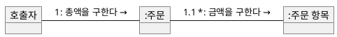

```java
final class 주문 {
    // ... 필드와 생성자 생략
    int 총액을구한다() {
        int 합계 = 0;
        for (주문항목 항목 : 항목들) 합계 += 항목.금액을구한다();
        return 합계;
    }
    // ... 상태 전이 메서드 생략
}
```

**강사 노트**

- 링크는 메시지를 보낼 수 있는 경로다. 이 코드에서는 항목들 필드로 구현했지만, 모든 링크가 반드시 영속적인 필드는 아니다.
- 앞 시퀀스와 같은 공통 코드의 총액을구한다를 발췌한다. 전체 원본은 하나다.
- 표기와 선택 기준은 "04. 동적 모델 — 상호작용과 상태"의 「07. 커뮤니케이션 다이어그램」에서 다룬다.

---

## 상태 기계 다이어그램

**상태 기계**는 같은 사건에도 현재 상태에 따라 반응이 달라지는 규칙을 보여 준다. 주문은 **결제 완료에서 취소됨**으로 갈 수 있다.

- **확정 규칙** — 배송 중·배송 완료의 취소는 거절한다. 결제 전 취소는 미확정이다.

**배치 — 좌우**

**도식 — PlantUML — 주문 상태 기계**

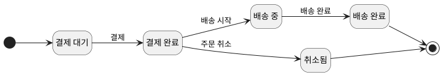

```java
enum 주문상태 { 결제대기, 결제완료, 배송중, 배송완료, 취소됨 }
// ... 다른 선언 생략
final class 주문 {
    // ... 필드와 다른 메서드 생략
    void 취소한다() { 전이(주문상태.결제완료, 주문상태.취소됨); }
    // ... 상태 조회 메서드 생략
    private void 전이(주문상태 출발, 주문상태 도착) {
        if (상태 != 출발) throw new IllegalStateException("허용되지 않은 상태 전이");
        상태 = 도착;
    }
}
```

**강사 노트**

- 공통 코드의 상태 필드는 결제대기로 초기화한다. 화면에는 전이 검사 부분을 발췌했다.
- 코드가 지원하지 않는 결제 전 취소를 업무적으로 금지했다고 해석하지 않는다. 거절 테스트는 합의된 배송 중·완료와 취소 후 재결제에 한정한다.
- 상태 상세는 "04. 동적 모델 — 상호작용과 상태"의 「08. 상태 기계 다이어그램」에서 다룬다.

---

## 09. 요구에서 테스트로

**수용·거절 예시**는 실행할 테스트의 기대값이 된다. 배송 중 취소의 거절은 예외 발생뿐 아니라 **상태 유지**까지 확인한다.

**표 — 주문 취소 규칙과 실행 검증**

| 사례 | 규칙·기대 결과 | 실행 검증 |
|---|---|---|
| 펜 2개 × 1,000원 | 총액 2,000원 | 계산 결과 비교 |
| 결제 완료 후 취소 | 취소됨으로 변경 | 허용 전이 확인 |
| 배송 중 취소 | 거절하고 배송 중 유지 | 예외·상태 비교 |
| 취소 후 재결제 | 거절하고 취소됨 유지 | 예외·상태 비교 |
| 빈 주문·수량 0 | 생성 거절 | 생성자 검사 |

**강사 노트**

- 수용·거절 예시의 기대값으로 미확정 정책을 결정하지 않는다. 요구 예시의 상세는 "02. 요구 분석과 유스케이스"의 「51. 행위 주도 개발」에서 다룬다.

---

## 거절 뒤 상태 유지 테스트

거절 테스트는 예외 발생만 확인하지 않는다. 실패한 행위가 객체의 **상태를 바꾸지 않았는지**도 함께 확인한다.

- **실행 순서** — 주문을 결제하고 배송을 시작한 뒤 취소를 요청한다. 코드를 실행하기 전에 마지막 상태를 예측한다.

**도식 — Mermaid — 배송 중 취소의 거절 테스트**

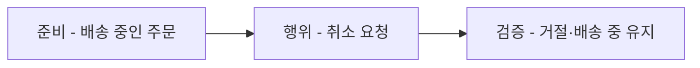

```java
class 주문예제 {
    // ... 주문 생성과 다른 테스트 생략
    static void 배송중취소거절() {
        var 주문 = 예시주문();
        주문.결제한다();
        주문.배송을시작한다();
        거절(IllegalStateException.class, 주문::취소한다);
        같음(주문상태.배송중, 주문.상태());
    }
    // ... 같음·거절 검증 함수 생략
}
```

- **실행 결과** — 공통 예제는 총액·경계 호출·상태 전이·거절 뒤 상태·다중성을 검사한다.
- **검증의 한계** — 이 테스트는 실제 환불·저장·통신 성공을 보장하지 않는다.

**강사 노트**

- 전체 코드는 code/s01/주문예제.java다. javac로 컴파일하고 주문예제의 main을 실행한다.
- 이 테스트는 합의된 배송 중 취소 거절 규칙을 실행으로 확인한다.

---

## 10. 책임과 경계

## 소프트웨어 아키텍처

**소프트웨어 아키텍처**는 시스템의 주요 구성 요소·관계·경계와 그 구조의 설계·진화를 이끄는 원칙을 다룬다.

- **구조의 범위** — 시스템 수준의 구성 요소, 책임 분할, 의존성과 상호작용을 정한다.
- **품질과 제약** — 성능·가용성·보안·변경 용이성과 기술·조직 제약이 구조 선택에 영향을 준다.
- **객체 설계와의 관계** — 객체 설계는 개별 객체의 책임과 메시지를 구체화하고, 아키텍처는 객체 협력을 포함한 시스템 구조와 큰 경계를 다룬다.
- **검토 시점** — 큰 위험과 되돌리기 어려운 선택은 구현 마지막이 아니라 증거를 얻을 수 있는 이른 시점에 확인한다.

**강사 노트**

- 과정 설계가 정한 아키텍처 개관이다. 개별 품질 속성과 아키텍처 설계 방법은 이 세션의 범위 밖이다.
- 품질 속성과 구조의 상세는 "13. OOAD에서 전문영역으로 — Architecture · DDD · MSA"에서 다룬다.

---

## 취소 판단의 책임

**책임 배치**는 누가 업무 규칙을 판단하고 누가 외부 작업을 조정할지 정하는 일이다. 주문 취소 가능 여부는 **Order**가 판단한다.

- **용어의 전환** — 분석의 주문은 설계의 `Order`, 주문 서비스는 `OrderService`다. 설계 이름은 과정의 영한 용어집을 따른다.
- **대안 A** — `OrderService`가 상태를 읽어 취소를 판단한다. 같은 규칙이 여러 진입점에 흩어질 수 있다.
- **대안 B** — `OrderService`가 `Order`에 맡긴다. 상태와 규칙이 한 객체에 모여 함께 바뀐다.

**도식 — PlantUML — 취소 판단의 책임 배치**

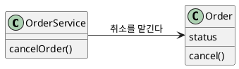

- **선택** — 취소 가능 여부는 `Order`에 맡긴다. 외부 연동·저장은 다른 객체의 책임으로 두고 상세 설계에서 검토한다.

**강사 노트**

- 분석 모델의 업무 개념과 설계 객체를 구분한다. OrderService는 도메인 개념이 아니다.
- 경계는 "05. 구조적 경계와 의존성", 책임 배치는 "07. 책임·협력·계약"에서 다룬다. 본 도식은 코드 상세가 아니라 대안의 미리보기다.

---

## 메시지와 협력

객체는 **메시지**를 받아 자기 책임으로 판단하고 **협력**한다. 주문 취소에서도 호출을 조정하는 곳과 규칙을 지키는 곳을 구분한다.

**도식 — PlantUML — 주문 취소 책임의 협력**

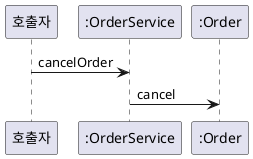

- **OrderService** — 주문을 찾아 취소를 맡기고 저장한다. 도식은 그중 위임 메시지만 발췌했다.
- **Order** — 자기 상태로 취소 가능 여부를 판단한다. 서비스에 같은 규칙을 복사하지 않는다.
- **다음 판단** — 출고 중단과 환불 요청의 순서·실패 처리는 상세 상호작용과 설계에서 다룬다.

**강사 노트**

- 협력을 클래스·상속의 목록으로 설명하지 않는다. 메시지를 받은 객체가 무엇을 판단하는지 질문한다.
- 외부 협력을 생략한 미리보기다. 상세 순서는 "04. 동적 모델 — 상호작용과 상태"의 「주문 취소 시퀀스」에서 확인한다.

---

## 분석 모델에서 설계 모델로

분석 모델의 개념마다 같은 이름의 설계 클래스를 **하나씩 만들지 않는다**. 설계에서는 책임·경계·협력을 다시 결정한다.

- **분석 모델** — 주문, 주문 항목, 결제, 배송 등 업무 개념과 관계
- **설계 모델** — `Order`, `OrderService`, `OrderRepository`, `PaymentAdapter` 등 책임과 협력 구조

분석 모델의 개념 하나가 **여러 설계 요소로 나뉠 수 있다**.

- 예: 주문 → **Order**(상태·규칙), **OrderService**(조정), **OrderRepository**(찾기·저장)
- 결제 연동·주문 저장소는 외부 연동과 영속성 요구를 검토하며 **필요 여부**를 정한다.

**강사 노트**

- 분석 모델은 설계의 입력이며, 설계 요소의 목록을 자동으로 결정하지 않는다.

---

## 다이어그램은 설계도가 아니다

다이어그램은 코드로 **옮겨 적는 설계도가 아니다**. 상자 하나가 여러 코드 요소가 되기도, 여러 상자가 한 코드에 담기기도 한다.

**표 — 분석·설계·코드에서 볼 것**

| 분석에서 확인할 의미 | 설계에서 더할 판단 | 코드에서 확인할 증거 |
|---|---|---|
| 배송된 주문은 취소할 수 없다 | 취소 판단의 책임 | 거절 결과와 상태 유지 |
| **주문 항목은 1개 이상** | 생성 책임과 검사 위치 | 빈 주문의 거절 |
| **총액은 항목 금액의 합** | 계산할지 저장할지 | 항목 변경 뒤의 총액 |

- 코드 한 조각이 **보장하는 것**과 모델 전체의 **제약**은 다르다. 보장하지 못하는 제약은 누가 지킬지 설계에서 정한다.

**강사 노트**
- 설계에서는 책임, 경계, 협력, 의존성을 다시 결정한다.

---

## 11. 적정 분석·설계

## 모델링의 적정 수준

**적정 분석·설계(Just Enough Analysis and Design)**는 **주요 위험을 줄이고 다음 검증으로 갈 만큼만** 분석·설계하는 것이다.

**인용문**

상세 객체 설계의 **어렵고 창의적인 부분**을 UML로 그린 뒤 멈춘다, "drawing UML for the hard, creative parts of the detailed object design. Then stop", [Larman 2004]

**표 — 분석·설계의 수준 판단**

| 상황 | 다음 행동 | 판단 근거 |
|---|---|---|
| **부족** — 요구·규칙·책임 불명확 | 필요한 모델을 보완한다 | 분석 비용으로 재작업 위험을 줄인다 |
| **적정** — 주요 판단 확보 | 구현·테스트·프로토타입으로 검증한다 | 모델보다 실제 검증이 더 많이 알려 준다 |
| **과도** — 상세가 판단을 바꾸지 않음 | 멈추고, 새 증거가 생기면 재검토한다 | 비용을 줄이되 불확실성은 기록한다 |

- **다음 결정이 추측하지 않을 만큼** 명시한다. 핵심 규칙을 빈칸으로 두는 것은 자유도가 아니라 **숨은 위험**이다.

- **멈춤 기준** — 취소 조건과 책임이 분명해졌다면 실행 예제로 검증한다. 같은 판단을 반복하는 그림을 더 만들지 않는다.

**강사 노트**

- Craig Larman, Applying UML and Patterns, 3rd ed., 2004의 상세 객체 설계에서 UML에 쓰는 시간에 대한 지침을 인용했다.
- 결정 경계마다 명시할 것과 열어 둘 것은 「결정 경계」의 표와 같다(요구 → 분석은 의도·범위·예시, 분석 → 설계는 용어·규칙·상태, 설계 → 코드는 책임·협력·계약).
- 중단 기준은 산출물의 양이 아니라 주요 위험과 다음 검증에 필요한 판단의 확보 여부다.
- 분석과 설계를 많이 하는 것이 좋은 것은 아니다.
- 추가 판단이 실제 위험을 줄이는지가 기준이다.

---

## 북 스마트와 스트리트 스마트

**북 스마트**는 표준·모델·프로세스·원칙을 아는 것이고, **스트리트 스마트**는 그중 무엇을 언제 얼마나 쓸지 맥락에서 판단하고 증거로 되돌리는 것이다. 둘 중 하나만으로는 SW 공학이 되지 않는다.

**표 — 한쪽만 있을 때**

| | 북 스마트만 있을 때 | 스트리트 스마트만 있을 때 |
|---|---|---|
| **요구** | 템플릿을 다 채우지만 합의한 이벤트가 없다 | 말로 합의하고 기록·예시가 없다 |
| **분석** | 다이어그램은 많지만 데이터 모델·규칙이 없다(분석 과잉) | 규칙을 코드 조건문에 바로 쓴다 |
| **설계** | 패턴을 먼저 고르고 요구를 맞춘다 | 매번 새로 만들어 같은 실수를 반복한다 |
| **검증** | 절차는 지켰지만 결과를 확인하지 않는다 | 동작하면 끝났다고 본다 |

- **같이 쓰기** — 상태 전이 표기를 알되, 미확정인 결제 전 취소는 그리지 않고 고객에게 묻는다.
- 결정 경계·다이어그램·원칙은 **북 스마트**, 적정 수준·맥락에 따른 선택·되돌림은 **스트리트 스마트**다.

**강사 노트**

- 둘 중 하나만으로는 SW 공학이 되지 않는다. 원칙과 모델은 북 스마트로 알되, 무엇을 언제 얼마나 쓸지는 맥락과 증거로 판단한다.

---

## KISS·DRY·YAGNI

세 원칙은 **판단의 도구**다. 이름의 뜻보다 우리 흐름 안에서의 의미로 쓴다.

**표 — 세 원칙의 의미**

| 원칙 | 진정한 의미 | 적용 예 | 잘못 쓰면 |
|---|---|---|---|
| **KISS** | 우연적 복잡성은 없애고 본질은 드러낸다 | 상태는 `enum`과 허용 검사로 쓴다 | 규칙을 빼고 "코드에서 처리"한다 |
| **DRY** | 하나의 지식에 하나의 원천 | 수량 규칙은 한 곳, 예시는 곧 테스트 | 모양만 같은 다른 의미를 합친다 |
| **YAGNI** | 추측으로 결정하지 않는다 | 미확정인 결제 전 취소를 묻는다 | 핵심 규칙·경계까지 미룬다 |

- 원칙이 부딪히면 **위험과 비용, 되돌리기 쉬운 정도**로 고른다. 공통 추상화가 두 개념을 함께 바뀌게 하면 중복을 남긴다.

**주석**

KISS — Keep It Simple, Stupid · DRY — Don’t Repeat Yourself · YAGNI — You Aren’t Gonna Need It

**강사 노트**

- KISS의 본질적·우연적 복잡성 구분은 「04. 소프트웨어의 복잡성」과 같은 관점이다.
- 단계별 의미(요구·분석·설계·코드·테스트)는 `references/sw-engineering-approach/`의 참조 자료를 참고한다.

---

## 12. 피드백과 잘못된 관행

## 피드백

구현·테스트의 오류는 앞선 **요구·분석·설계 판단**을 되돌아볼 증거다.

- **요구사항 오류** — 필요한 것 자체를 잘못 정의
- **분석 오류** — 의미·규칙을 잘못 이해
- **설계 오류** — 책임·경계를 잘못 배치
- **구현 오류** — 코드·기술 사용 오류

**인용문**

실제로 만들고 테스트한 **피드백**으로 요구나 설계의 이해를 고친다, "the team mines the feedback from realistic building and testing something for crucial practical insight and an opportunity to modify or adapt understanding of the requirements or design.", [Larman 2004]

**도식 — Mermaid — 피드백의 방향**

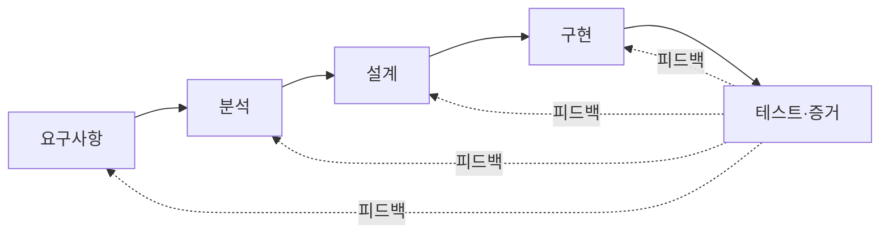

**강사 노트**

- Craig Larman, Applying UML and Patterns, 3rd ed., 2004의 반복·진화적 개발 설명 원문 확인.
- 구현과 테스트는 앞선 요구·분석·설계 판단을 되돌아보게 하는 증거다.

---

## 검증의 배치

테스트는 앞 활동을 **생략해도 된다는 허가가 아니다**. 오류가 생기는 곳 가까이에서 검증을 앞당긴다.

**표 — 관점별 검증의 배치**

| 관점 | 검증 | 예시 |
|---|---|---|
| **요구** | 수용·거절 예시 | 고객이 취소 가능 여부를 알 수 있는가? |
| **분석** | 규칙·상태의 일관성 | 배송된 주문에 취소 전이가 없는가? |
| **설계** | 책임·계약·실패 경로 | 취소 판단을 누가 지키는가? |
| **코드** | 실행·통합 | 거절 뒤 상태가 그대로인가? |
| **운영** | 실제 결과와 가치 | 취소 문의가 줄었는가? |

- 규칙이 모호하면 자동화보다 **허용·거절 예시의 합의**가 먼저다. 자동화는 합의된 규칙의 **회귀**를 막는다.

- **피드백의 방향** — 거절 테스트 뒤 상태가 바뀌었다면 구현을 고친다. 어떤 상태에서 거절할지 합의가 없다면 요구 판단으로 돌아간다.

**강사 노트**

- 오류가 발견된 위치와 오류가 만들어진 위치는 다를 수 있다.
- 검증은 각 결정과 가까운 곳에 두고, 실패가 가리키는 판단 단계로 돌아간다.

---

## 잘못된 관행

객체지향 분석·설계에 대한 흔한 오해는 **표기·산출물·기술**을 판단보다 앞세우는 데서 생긴다.

**인용문**

"모델링의 목적은 주로 이해이지 문서화가 아니다", "The purpose of modeling (sketching UML, …) is primarily to understand, not to document.", [Larman 2004]

**표 — 흔한 오해와 바른 판단**

| 오해 | 바른 판단 |
|---|---|
| UML을 그리면 OOAD다 | UML은 표현 언어다. 핵심은 문제 이해와 책임·경계 판단이다 |
| 분석은 문서를 많이 만드는 일이다 | 분석의 목적은 산출물이 아니라 판단이다 |
| 명사는 클래스, 테이블은 객체다 | 분석 개념을 설계·코드로 기계적으로 옮기지 않는다 |
| 객체는 데이터와 접근 메서드의 묶음이다 | 객체는 책임을 지고 메시지로 협력한다 |
| 상속과 디자인 패턴이 객체지향의 핵심이다 | 핵심은 메시지·책임·협력이며, 패턴은 실제 변경 압력이 있을 때 쓴다 |
| 기술을 먼저 정하고 요구를 맞춘다 | 문제와 요구를 먼저 정하고 기술은 해결책으로 고른다 |
| 한 번에 완벽하게 분석·설계한다 | 적정하게 분석·설계하고 피드백으로 고친다 |

- **일관성 점검** — 여러 도식이 서로 다른 취소 조건을 말하면 문서의 양과 관계없이 모델을 고쳐야 한다.

**강사 노트**
- Craig Larman, Applying UML and Patterns, 3rd ed., 2004의 애자일 모델링 목적 원문 확인.

- 각 오해는 앞 topic과 연결된다: 「통합 모델링 언어」, 「분석과 설계」, 「분석 모델에서 설계 모델로」, 「취소 판단의 책임」·「메시지와 협력」, 「04. 소프트웨어의 복잡성」, 「모델링의 적정 수준」·「피드백」. 절차만 갖추는 오해와 해 보기만 하는 오해는 「북 스마트와 스트리트 스마트」에서 다뤘다.
- 요구 분석의 잘못된 관행은 "02. 요구 분석과 유스케이스", 정적 모델링의 잘못된 관행은 "03. 정적 모델 — 도메인 개념과 관계", 패턴의 선택적 적용은 "08. 변화 대응과 변이 설계"에서 다룬다.

---

## 13. 전문영역으로의 확장

## 전문 영역으로의 확장

OOAD만으로 모든 판단을 끝내지 않는다. 규모·품질·분산·운영이 커지면 **전문 영역의 질문**이 더해진다.

**표 — 전문 영역이 더하는 질문**

| 영역 | 더해지는 질문 |
|---|---|
| SW Architecture | 품질속성과 제약 아래 구조·배포·변경 비용을 어떻게 절충하는가? |
| **DDD** | 도메인 언어와 문맥 경계를 어떻게 유지하는가? |
| **MSA** | 분산 경계·통신·실패·일관성이 업무 의미에 어떤 영향을 주는가? |
| **DevOps** | 운영 증거를 어떤 결정으로 얼마나 빨리 되돌리는가? |
| **AI-native SW공학** | 사람과 에이전트가 어떤 결정을 맡고 무엇으로 검증하는가? |

- **확장의 의미** — 전문 영역은 기존 분석·설계를 대체하지 않는다. 규모·품질·분산·운영에서 새로 생긴 위험을 다루기 위해 질문과 판단 범위를 넓힌다.

**강사 노트**

- 전문 영역의 깊이는 "13. OOAD에서 전문영역으로 — Architecture · DDD · MSA"와 "14. AI-native SW공학"에서 다룬다. 이어지는 세 topic은 그중 이 과정이 특히 연결하는 도메인 주도 설계, 온톨로지, AI 기반 소프트웨어공학이다.

---

## 도메인 주도 설계

**인용문**

Evans는 DDD의 설계 스타일이 **책임 주도 설계(RDD)·계약에 의한 설계(DBC)·Larman 등이 설명한 객체지향 설계 모범 사례**와 일관된다고 밝힌다, "The design style in this book largely follows the principle of \"responsibility-driven design,\" put forward in Wirfs-Brock et al. 1990 and updated in Wirfs-Brock 2003. It also draws heavily (especially in Part III) on the ideas of \"design by contract\" described in Meyer 1988. It is consistent with the general background of other widely held best practices of object-oriented design, which are described in such books as Larman 1998.", [Evans 2004]

**도메인 주도 설계(Domain-Driven Design, DDD)**는 복잡한 도메인의 지식을 모델로 만들고, 그 모델이 언어·설계·구현을 이끌게 하는 접근이다.

- **도메인** — 소프트웨어가 다루는 업무의 지식·활동·규칙이다.
- **모델과 주도 설계** — 중요한 개념·관계·규칙을 선택해 모델로 표현하고, 공유 언어로 정제해 설계와 코드에 반영한다.
- **두 수준의 설계** — DDD는 핵심 도메인·문맥 경계·문맥 관계를 정하는 **전략적 설계**와, 한 문맥 안에서 엔티티·값 객체·애그리거트·저장소를 구성하는 **전술적 설계**로 이루어진다.

**강사 노트**
- 인용 근거: Eric Evans, *Domain-Driven Design: Tackling Complexity in the Heart of Software*(Addison-Wesley, 판권면 © 2004), 객체 설계와의 관계 설명 원문 확인. 한글은 인용문의 요약이다.
- 같은 서두는 이 책이 객체지향 설계 입문서가 아니며 몇몇 전통적인 생각의 강조점을 옮긴다고 말한다("This book is not an introduction to object-oriented design … Domain-driven design shifts the emphasis of certain conventional ideas.").
- DDD는 전략적 설계와 전술적 설계로 구성된다. 이 과정에서는 "13. OOAD에서 전문영역으로 — Architecture · DDD · MSA"에서 두 설계의 연결을 소개한다.

---

## 온톨로지

**인용문**

"온톨로지는 **개념화의 명시적 명세**다", "An ontology is an explicit specification of a conceptualization.", [Gruber 1993]

- **개념화** — 어떤 대상과 개념·관계·제약을 중요하게 볼지 정한 추상화다.
- **명시적 명세** — 개념화한 내용을 용어와 형식 규칙으로 드러내 사람과 시스템이 공유·해석할 수 있게 한다.
- **도메인 모델과의 관계** — 객체지향 분석은 소프트웨어에 필요한 개념과 관계를 모델링하고, DDD는 공유 언어와 구현의 일치를 다룬다. 온톨로지는 의미의 명세와 공유에 초점을 둔다.
- **적용 판단** — 모든 도메인 모델이 온톨로지는 아니며, 여러 시스템이 같은 의미를 교환하거나 기계적 추론이 필요할 때 가치가 커진다.

**강사 노트**

- 인용 근거: Thomas R. Gruber, "A Translation Approach to Portable Ontology Specifications", *Knowledge Acquisition* 5(2):199–220, 1993 원문 확인.
- 객체지향 분석·DDD·온톨로지의 관계는 이 과정의 교육용 정리다. Gruber가 이 개발 순서를 제안했다는 의미가 아니다.
- 온톨로지를 제공하는 것만으로 동일한 해석이 보장되지는 않는다. 구체적인 사례와 검증으로 확인한다.

---

## AI-native SW공학

AI 기반 개발의 핵심은 **누가 코드를 쓰느냐보다 누가 의미·경계·위험을 판단하고 검증하느냐**다.

- **사람이 최종 책임지는 판단** — 비전과 가치, 위험 수용, 최종 의사결정
- **사람과 AI의 협업** — 요구사항, 도메인 모델·온톨로지, 아키텍처·설계, 테스트·검토
- **AI가 주도할 수 있는 실행** — 코드 생성·변환, 정적 검사, 테스트 실행
- 실행할 때는 맥락·제약을 **가드레일**에 담고, **에이전트**의 작업을 **하네스**(실행·검증 환경)에서 확인한다.
- **실행 조건** — AI에게 구현을 맡길 때는 상태와 기대 결과를 제공하고, 성공 경로뿐 아니라 거절 뒤 상태 유지 같은 실패 경로도 검사한다.
- 이 과정의 실습은 **LLM이 초안을 만들고 사람이 점검 항목으로 검토·수정**하는 흐름을 따른다.

**강사 노트**
- 세 영역은 보편적인 역할 표준이 아니라 검증과 책임 소재를 분명히 하기 위한 이 과정의 운영 원칙이다. 절대적인 기술 경계가 아니라 주도권과 책임의 구분이다.
- 가드레일(Guardrail)·에이전트(Agent)·하네스(Harness)는 "14. AI-native SW공학"에서 상세히 다룬다.
- 인간이 최종 책임진다는 것은 모든 산출물을 직접 작성한다는 뜻이 아니다. AI 중심 실행은 충분한 맥락·제약·명세·검증을 전제로 한다.
- 객체지향 분석·설계는 사라지지 않으며 인간과 AI의 협업 방식으로 수행된다.

---

## 14. 실습 — 요구사항 명세서

서비스 개요와 프롬프트를 LLM에 제공하여 **요구사항 명세서**를 만들고, 점검 항목을 참고해 **피드백**하여 명세서를 완성하십시오.

- **서비스 개요**
  + **생필품**을 일정 주기로 배송하는 정기배송 시스템을 개발한다. 고객은 상품·수량·기간·배송 주기(1·2·4주)·배송지를 입력하고 결제한다. 고객은 다음 배송을 24시간 전까지 취소할 수 있다(연속 2회까지). 상품·결제·배송은 각각 외부 시스템이 맡는다.
- **명세서 형식**
  + **명세서**는 서비스 개요 → 기능 요구(F) → 업무 규칙(R) → 외부 시스템 → 미확정 항목 순으로 씁니다. 기능 요구는 사용자가 얻을 결과를, 업무 규칙은 그 결과를 허용·제한하는 조건을 적습니다.
- **프롬프트**
  + "위 서비스 개요로 정기배송 시스템의 요구사항 명세서를 작성해줘. 기능 요구, 업무 규칙, 외부 시스템, 확인할 질문으로 나눠 정리해줘. 개요에 없는 내용은 추측하지 말고 **반드시 확인**해라."
- **점검 항목**
  1. **개요 반영** — 개요의 모든 내용이 빠짐없이 반영되었는가? 입력 항목, 결제, 취소 규칙, 외부 시스템을 확인한다.
  2. **결제** — 결제 방법(카드·계좌이체·간편결제 등), 청구 방식(일시불·월별 청구), 청구일이 정해졌는가?
  3. **배송 주기·기간** — 1·2·4주 외에 고객이 원하는 주기(매일·격일·3일·10일 등)를 지원하는가? 기간과 만료일이 정해졌는가?
  4. **취소·반품·해지** — 회차 환불, 반품 대상·기한·절차, 해지 후 남은 금액의 처리가 정해졌는가?
  5. **기술 용어** — 화면·버튼·DB·API 같은 구현 표현이 없는가?
  6. **미확정 항목** — 질문을 모두 확인해 없앴는가? 남긴 항목이 있다면 그 이유가 분명한가?
- **결과물** — 확인할 질문이 남지 않은 요구사항 명세서. 실습 2의 입력이 됩니다.

**강사 노트**

- 실습은 모든 세션이 이어 쓰는 **정기배송** 시스템의 신규 개발 시나리오다. 앞에서 배운 구분과 검증 방법을 적용하되, 실습의 업무 규칙은 서비스 개요에서 다시 확인한다.
- LLM 사용 — 도구는 제한하지 않는다. LLM의 초안은 검토 전의 **가설**이며, 초안을 그대로 제출하지 않는다. 평가는 초안이 아니라 **고친 곳과 그 이유**를 본다.
- LLM이 되묻는 질문에 수강생이 **업무 담당자처럼 답해** 규칙을 정한다. 답할 수 없는 질문만 미확정으로 남기고 이유를 적는다.

---

## 요구사항 명세서 (안)

생필품을 고객이 정한 주기로 배송하는 **정기배송 서비스**다. 고객은 상품·수량·배송 주기·첫 배송일·기간·배송지를 정해 신청하고, 일시불 또는 월별로 결제한다. 고객은 다음 배송을 취소하거나, 받은 상품을 반품하거나, 정기배송을 해지할 수 있다. 상품·결제·배송은 각각 외부 시스템이 맡는다.

- **기능 요구**
  - **F1 신청** — 상품·수량·주기·첫 배송일·기간·배송지를 정해 신청
  - **F2 결제** — 결제 방법과 청구 방식을 골라 결제
  - **F3 배송 요청** — 배송일마다 배송 시스템에 요청
  - **F4 취소** — 다음 배송을 취소하고 그 회차 금액을 환불
  - **F5 반품** — 반품을 신청하고, 회수가 확인되면 환불
  - **F6 해지** — 해지하고, 배송되지 않은 회차 금액을 환불
- **업무 규칙: 신청·금액·결제**
  - **R1 배송 주기** — 1~28일, 일 단위(매일·격일·3일·1주·10일·2주·4주 등)
  - **R2 배송일** — 첫 배송일은 신청 다음 날부터 7일 안에서 고르고, 이후는 주기마다 정해진다.
  - **R3 기간** — 1~12개월. 만료일은 첫 배송일 + 기간의 **전날**이며, 자동 연장하지 않는다.
  - **R4 회차 금액** — 상품 가격 × 수량. **신청 때의 가격**을 기간 끝까지 적용한다.
  - **R5 결제 방법** — 카드, 계좌이체, 간편결제 중 하나
  - **R6 청구 방식**
    - **일시불** — 신청할 때 전체 회차 금액을 청구한다.
    - **월별 청구** — 매월 첫 배송일과 같은 날(없으면 말일)에 그달 회차 금액을 청구한다.
- **업무 규칙: 청구 실패·취소·반품·해지**
  - **R7 청구 실패** — 3일 동안 매일 다시 청구하고, 그래도 실패하면 정지하고 고객에게 알린다.
  - **R8 취소** — 배송 24시간 전까지, 연속 2회까지
    - 청구한 회차는 **결제 수단으로 환불**하고, 청구 전이면 **청구에서 뺀다**.
  - **R9 반품 대상** — 개봉하지 않은 공산품, 받은 날부터 7일 이내
    - **식품은 불가**. 불량·오배송은 종류·개봉과 관계없이 가능하다.
  - **R10 반품 절차** — 배송 시스템이 회수하고, 확인 후 3영업일 안에 결제 수단으로 환불한다.
    - **단순 변심**은 반품 배송비 3,000원을 빼고 환불한다.
  - **R11 해지** — 언제든, 위약금 없음
    - 24시간 전이 지난 회차는 **배송**하고, 청구했지만 배송되지 않은 회차는 **환불**한다. 이후 청구는 멈춘다.
- **외부 시스템**
  - **상품** — 상품 정보·가격, 상품 종류(식품·공산품)
  - **결제** — 결제·청구·환불
  - **배송** — 배송, 반품 회수
- **미확정 항목** — 없음

**주석**

아래 규칙의 수치·정책은 교육용으로 확정한 예이며 실제 서비스 정책이 아니다.

**강사 노트**

- 점검 항목과 규칙의 대응 — 결제는 R5~R7, 주기·기간은 R1~R3, 취소·반품·해지는 R8~R11이다.
- 숫자(28일, 12개월, 7일, 3일, 3,000원)는 **교육용 가정**이다. 수강생의 답이 달라도 **정해져 있으면** 맞다.
- LLM 초안에서 고칠 곳의 예 — "결제 화면에서 카드 번호를 입력한다" 같은 기술 표현, 개요에 없는 규칙을 묻지 않고 단정한 것.

---

## 15. 요약

객체지향 분석·설계는 문제를 이해하고 해결책의 책임과 경계를 결정하는 **판단의 흐름**을 코드·테스트까지 잇는다.

### 객체지향 분석·설계의 핵심

- **문제·요구·해결책과 이벤트** — 해결책이 섞인 요청에서 문제와 요구를 찾고, 요구는 이벤트로 합의한다.
- **맥락과 복잡성** — 성숙도·불확실성·운영 조건을 살피고, 업무 규칙과 구현 부담을 구분한다.
- **결정 경계와 코드·테스트** — 요구·분석·설계·코드는 각자 결정하고 가까이에서 검증한다.
- **책임·경계·협력** — 객체지향 설계의 핵심 판단이다. 다이어그램은 옮겨 적는 설계도가 아니다.
- **적정 수준과 원칙** — 맥락에 맞게 명시하고, 원칙은 북 스마트로 알되 스트리트 스마트로 쓴다.

### 다음 세션

- "**02. 요구 분석과 유스케이스**" — 요청에서 요구를 발견해 이벤트로 합의하고, 사용자 목표와 시스템 책임을 구분한다.

**강사 노트**
- 이 세션에서는 객체지향 분석·설계의 전체 지도와 코드·테스트까지의 연결을 만들었다.
- DDD·온톨로지·AI 기반 개발과의 연결은 「전문 영역으로의 확장」 이후 topic에서 다뤘다.
- 다음에는 그 출발점인 문제와 요구사항을 구체적으로 다룬다.

---
