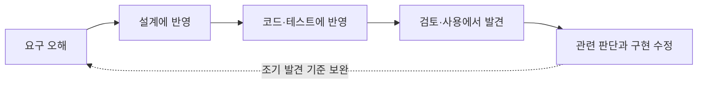
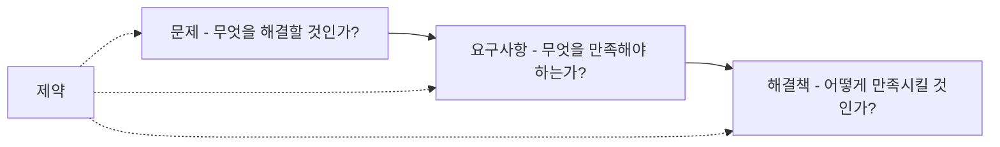
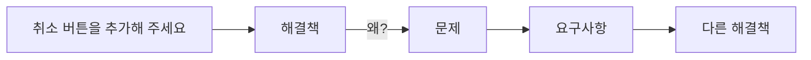
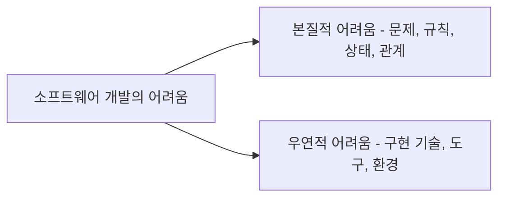
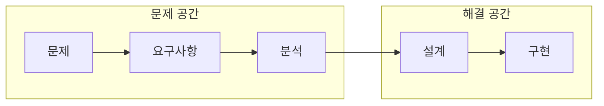
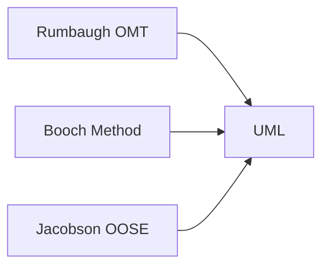
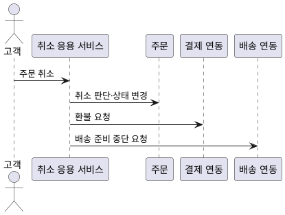
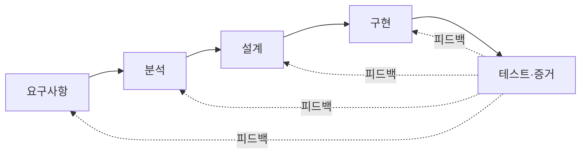
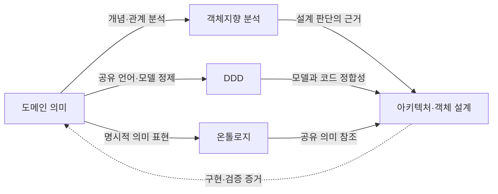

--------------------
Session 명: 01. OOAD 개요
--------------------

## 목차

01. 세션 목표
02. SW 개발의 재작업
03. 미사용 기능
04. 범위와 가치
05. 범위 확대와 불필요한 구현
06. 문제 → 요구사항 → 해결책
07. 문제와 해결책
08. 본질적 어려움과 우연적 어려움
09. 주문 취소의 복잡성
10. 분석과 설계
11. 분석·설계의 진화
12. 객체지향 분석·설계
13. 통합 모델링 언어
14. 소프트웨어 아키텍처
15. 책임과 경계
16. 메시지와 협력
17. 분석 모델에서 설계 모델로
18. 적정 분석·설계
19. 피드백
20. 도메인 주도 설계
21. 온톨로지
22. AI 기반 소프트웨어공학
23. 실습 — 문제·요구사항·해결책
24. 실습 — 검토 예시(모범답안)
25. 요약

## 01. 세션 목표

이 세션은 객체지향 분석·설계가 **무엇을 판단하고 왜 필요한지** 전체 흐름을 파악한다.

- 소프트웨어 개발에서 분석·설계가 필요한 이유를 이해한다.
- 문제, 요구사항, 해결책을 구분한다.
- 객체지향 분석과 객체지향 설계의 역할과 관계를 이해한다.
- 책임, 경계, 협력을 이해한다.
- 객체지향 분석·설계가 도메인 주도 설계, 온톨로지, AI 기반 소프트웨어공학으로 어떻게 이어지는지 이해한다.

**강사 노트**
- 세션 전체의 지도만 제시한다.
- 세부 개념은 뒤에서 순차적으로 설명한다.

---

## 02. SW 개발의 재작업

잘못된 요구나 판단을 늦게 발견하면 관련 설계·코드·테스트를 함께 고쳐야 할 수 있다. **회피 가능한 재작업**과 새로운 학습에 따른 **정당한 변경**을 구분한다.

- 요구 누락·오해가 후속 판단에 반영되면 수정 범위가 커진다.
- 일찍 발견할 수 있었던 오류를 줄이는 것이 목적이다.
- 실제 사용에서 새 가치를 발견한 변경까지 결함으로 취급하지 않는다.

**인용문**

"프로젝트 노력의 약 **40~50%**를 **회피 가능한 재작업**에 사용한다", "Current software projects spend about 40 to 50 percent of their effort on avoidable rework.", Barry Boehm·Victor R. Basili, 2001

**인용문**

"재작업 비용의 약 **70~85%**가 **요구사항 결함**에서 비롯된다", "70% to 85% of all project rework costs are due to errors in requirements.", Dean Leffingwell, 1997, www

**도식 — Mermaid**



**강사 노트**

- Leffingwell 원문(1997년 *American Programmer*)은 유료 아카이브에만 있어 직접 확인하지 못했다. 여러 매체가 인용하는 수치를 옮겼다(www).
- 인용 수치는 역사적 보고다. 원문도 학습을 통해 유용해진 변경과 회피 가능한 결함을 구분한다.
- 조기 검토의 비용과 줄일 수 있는 재작업 위험을 비교한다. 모든 변경을 처음부터 예방할 수 있다는 뜻은 아니다.

---

## 03. 미사용 기능

개발한 기능의 양이 곧 고객 가치는 아니다. **사용 빈도·사용 맥락·미사용 이유·필요 시의 가치**를 함께 확인한다.

**인용문**

"Standish Group 조사에서 **45%**는 **전혀 사용되지 않았고** **20%**만 자주·항상 사용됐다(항상 7%·자주 13%·때때로 16%·거의 19%·전혀 45%)", "A Standish study found that 45% of features were never used and only 20% of features were used often or always.", Jim Johnson·Standish Group, 2002, www(4개 회사 내부 애플리케이션 표본 — Mike Cohn, 2016 직접 확인)

**Chart — matplotlib**

```chart
{"type":"pie","title":"기능 사용 빈도","labels":["전혀","거의","때때로","자주","항상"],"series":[{"name":"사용 빈도","values":[45,19,16,13,7]}]}
```

**강사 노트**

- 사용 빈도 수치는 XP2002 발표를 인용한 여러 매체에서 확인했다(www). 표본 성격(4개 회사 내부 애플리케이션)은 Cohn이 Standish Group에 직접 문의해 확인한 내용이다. 원 조사 데이터·관찰 기간·측정 기준 자체는 직접 확인하지 못했다.
- 앞의 가치 판단 예는 교육용 사례이며 위 조사에서 얻은 결론이 아니다.
- 사용 빈도를 가치와 동일시하지 않는다. 운영 복구·감사 등 드물지만 필요한 기능을 반례로 토론한다.

---

## 04. 범위와 가치

**해야 할 것은 하고, 하지 않아도 될 것은 만들지 않는다.**

- **누락** — 필요한 요구사항을 놓침
- **범위 초과** — 문제 밖의 요구사항 추가
- **과잉 구현** — 요구사항 밖의 해결책 구현

가장 나쁜 경우는 **해야 할 것은 못하면서 하지 않아도 될 것을 만드는 것**이다.

**강사 노트**
- 다음 주제에서 범위의 무단 확대, 불필요한 기능 추가, 과도한 설계·구현을 비교한다.

---

## 05. 범위 확대와 불필요한 구현

요구사항 변경이 모두 문제인 것은 아니다. **합의한 범위를 어떻게 변경하고, 필요한 기능을 어디까지 구현하는가**가 중요하다.

- **범위의 무단 확대(Scope Creep)** — 일정·비용·자원에 미치는 영향을 조정하거나 승인받지 않고 기능·업무 범위가 늘어나는 것
  - 예: 주문 취소 기능을 만드는 동안 승인 없이 교환·반품 기능까지 추가
- **불필요한 기능 추가(Gold Plating)** — 요구사항을 충족하는 데 필요하지 않은 기능이나 장식을 좋다는 이유로 추가하는 것
  - 예: 요청받지 않은 복잡한 취소 화면 효과와 부가 기능 구현
- **과도한 설계·구현(Overengineering)** — 현재의 요구와 위험에 비해 설계·기술·구현을 지나치게 복잡하게 만드는 것
  - 예: 단순한 취소 규칙에 불필요한 분산 처리 구조 도입

**승인된 변경은 범위의 무단 확대와 다르다.** 불필요한 기능과 과도한 구조를 경계하는 이유는 고객 가치를 늘리지 못하면서 비용과 변경 부담을 키울 수 있기 때문이다.

**강사 노트**
- 세 개념은 서로 관련되지만 동의어가 아니다. 범위 확대는 변경 통제, 불필요한 기능 추가는 요구 밖의 기능, 과도한 설계·구현은 해법의 불필요한 복잡성이 초점이다.
- 예시는 모두 주문 취소라는 동일 상황에 연결한다.

---

## 06. 문제 → 요구사항 → 해결책

해결책부터 정하지 않는다. 먼저 **문제**, 다음으로 충족할 **요구사항**, 마지막으로 **해결책**을 구분한다.

- **문제** — 무엇을 해결할 것인가?
- **요구사항** — 무엇을 만족해야 하는가?
- **해결책** — 어떻게 만족시킬 것인가?
- **제약** — 가능한 선택과 범위를 제한

문제의 전부 또는 일부를 해결하기 위해 요구사항을 정하고, 요구사항의 전부 또는 일부를 만족시키기 위해 해결책을 선택한다.

**도식 — Mermaid**



**강사 노트**
- 요구사항과 해결책은 각각 상위 목적에서 정당화되어야 한다.
- 이후 분석·설계 판단의 기준축으로 사용한다.

---

## 07. 문제와 해결책

**문제(Problem)**와 **해결책(Solution)**은 구분해야 한다. 고객의 요청에는 해결해야 할 문제와 이미 선택한 해결책이 함께 들어 있을 수 있다.

> “주문 화면에 취소 버튼을 추가해 주세요.”

아래는 고객이 현재 직접 취소할 수 없다는 가정에 따른 해석이다. 요청만으로 그 원인이 확인된 것은 아니다.

- **문제** — 고객이 취소 가능한 주문을 직접 취소할 수 없음
- **요구사항** — 취소 가능한 주문은 고객이 직접 취소할 수 있어야 함
- **해결책** — 취소 버튼, `Order.cancel()`

같은 문제와 요구사항에도 **여러 해결책**이 가능하다.

**도식 — Mermaid**



**강사 노트**
- 고객의 요청 자체가 이미 하나의 해결책일 수 있다.
- 바로 구현하기 전에 상위 문제와 요구사항을 확인한다.

---

## 08. 본질적 어려움과 우연적 어려움

어려움은 **본질적(Essence)**·**우연적(Accident)** 어려움으로 나뉜다.

**인용문**

"소프트웨어의 복잡성은 **우연적** 속성이 아니라 **본질적** 속성이다", "The complexity of software is an essential property, not an accidental one.", Frederick P. Brooks Jr., 1986

- **본질적 어려움** — 문제와 소프트웨어 복잡성(의미·규칙·상태·관계)
- **우연적 어려움** — 구현 기술·환경의 추가 부담(언어·도구·연동)

**도식 — Mermaid**



**강사 노트**
- 기술은 우연적 어려움을 줄일 수 있지만 본질적 어려움을 제거하지는 못한다.

---

## 09. 주문 취소의 복잡성

주문 취소는 버튼 하나를 구현하는 문제가 아니다. **취소 조건과 후속 업무를 올바르게 결정하는 복잡성**이 핵심이며, 이를 실현하는 기술적 어려움과 구분해야 한다.

- **본질적 어려움 — 주문 취소 업무의 의미와 규칙**
  - 어떤 주문을 언제 취소할 수 있는가?
  - 결제·배송 상태에 따라 취소 결과가 어떻게 달라지는가?
  - 어떤 경우에 얼마를 환불해야 하는가?
- **우연적 어려움 — 결정된 규칙을 구현하는 기술적 부담**
  - 외부 결제 서비스와 배송 시스템 연동
  - 트랜잭션·이벤트·재시도 처리
  - 통신 장애와 중복 요청 대응

기술 선택에 앞서 **취소의 의미·조건·결과**를 분명히 해야 한다.

**강사 노트**
- 08 「본질적 어려움과 우연적 어려움」에서 정의한 본질적·우연적 어려움이 주문 취소에 어떻게 나타나는지 연결한다.
- 예시의 구현 기술을 본질적 업무 규칙으로 혼동하지 않도록 한다.
- 중복 요청이 발생해도 한 번만 환불되어야 한다는 보장은 업무 의미다. 재시도·중복 제거의 구현 수단과 그 보장 자체를 구분한다.

---

## 10. 분석과 설계

분석·설계의 목적은 **산출물이 아니라 판단**이다.

- **분석(Analysis)** — 무엇이 필요한가, 무엇을 의미하는가, 어떤 규칙과 제약이 있는가?
- **설계(Design)** — 누가 책임지는가, 어디에 경계를 두는가, 어떻게 협력하는가?

분석은 문제를 이해하고, 설계는 그 이해를 바탕으로 **해결책의 책임과 구조를 결정한다**. 개발 절차에서는 통합할 수 있지만, 사고에서는 **문제와 해결책을 구분**한다.

**도식 — Mermaid**



**강사 노트**
- 실제 개발 절차에서는 분석과 설계가 반복되고 섞일 수 있다.
- 사고에서는 문제와 해결책을 구분한다.

---

## 11. 분석·설계의 진화

분석·설계 방법은 **무엇을 중심으로 문제와 구조를 보는가**에 따라 서로 다른 질문을 드러낸다. 이를 한 방법이 다른 방법을 완전히 대체한 일직선의 발전 과정으로 보지 않는다.

| 접근 | 중심 관심 | 유용한 질문 |
|---|---|---|
| 구조적 분석·설계 | 기능·자료 흐름·모듈 | 어떤 변환이 일어나며 자료가 어디로 흐르는가? |
| 정보공학 | 업무 정보·데이터 모델 | 어떤 정보와 관계를 일관되게 관리해야 하는가? |
| 객체지향 분석·설계 | 도메인 개념·객체 책임·협력 | 누가 상태와 규칙을 소유하고 어떻게 협력하는가? |

**강사 노트**

- 표는 관심사를 비교하는 교육용 정리다. 시대별 우열이나 단일 계보를 주장하지 않는다.
- 자료 흐름을 볼 때와 책임 배치를 볼 때 얻는 정보가 다르다는 점을 설명한다.

---

## 12. 객체지향 분석·설계

**객체지향 분석·설계(Object-Oriented Analysis and Design, OOAD)**는 문제영역의 의미를 객체 관점으로 이해하고 이를 실현할 책임과 협력을 설계한다.

- **객체지향 분석(OOA)** — 문제영역의 개념·관계·규칙을 발견하고 요구와 교차검토한다.
- **객체지향 설계(OOD)** — 구현할 객체의 책임·상태·협력·인터페이스를 결정한다.

**인용문**

"객체지향 분석은 문제영역의 어휘에서 발견되는 **클래스와 객체의 관점**에서 요구사항을 검토하는 방법이다", "Object-oriented analysis is a method of analysis that examines requirements from the perspective of the classes and objects found in the vocabulary of the problem domain.", Grady Booch, 1994, www

**인용문**

"객체지향 설계는 **객체지향 분해**와 논리적·물리적, 정적·동적 모델의 표현을 포괄하는 설계 방법이다", "A method of design encompassing the process of object-oriented decomposition and a notation for depicting both logical and physical as well as static and dynamic models of the system under design.", Grady Booch, 1994, www

**강사 노트**

- Booch 원서 본문은 미확인이다. 여러 독립된 2차 출처가 같은 문장을 일관되게 인용하고 있어 사용했다(www). 영어 문구를 추측해 복원하지 않았다.

- 유스케이스는 요구 입력이며 그 자체로 객체 모델은 아니다. 도메인 개념 분석과 객체 설계의 출발점으로 사용한다.
- S03·S04에서 의미를 분석하고 S06·S07에서 설계 판단으로 연결한다.

---

## 13. 통합 모델링 언어

**통합 모델링 언어(UML)**는 **분석·설계 방법론이 아니라 모델을 표현·공유하는 표준 언어**다.

**인용문**

"UML은 소프트웨어와 시스템을 **시각화·명세·문서화**하는 표준이다", "Unified Modeling Language® (UML®) as a standard for visualizing, specifying, and documenting software and systems.", Object Management Group

Rumbaugh(OMT)·Booch(Booch Method)·Jacobson(OOSE) 세 표기법이 **1997년 UML로 통합됐다**.

**도식 — Mermaid**



**강사 노트**
- UML의 통합 배경은 OMG [UML 2.5.1](https://www.omg.org/spec/UML/2.5.1/PDF), §1 Scope의 UML 1 설명을 참조한다.
- UML은 객체지향 분석·설계 자체가 아니다.
- 분석·설계의 결과를 표현하고 검토하는 언어다.

---

## 14. 소프트웨어 아키텍처

**소프트웨어 아키텍처**는 시스템 수준에서 무엇을 주요 구성 요소로 나누고 어떻게 연결하며, 어떤 경계와 원칙에 따라 설계·변경할지를 다룬다.

**인용문**

"아키텍처는 환경 속 시스템의 근본적인 개념·속성이며, **요소·관계·설계 및 진화 원칙**에 구현된다", "Fundamental concepts or properties of a system in its environment embodied in its elements, relationships, and in the principles of its design and evolution.", ISO/IEC/IEEE 42010

- **구성 요소** — 컴포넌트·서브시스템 등 시스템의 주요 부분
- **관계와 연결** — 구성 요소 사이의 협력·의존성·인터페이스
- **경계** — 책임과 변경 영향을 구분하는 구조
- **설계·진화 원칙** — 품질속성과 제약을 고려한 주요 결정

객체지향 설계가 객체·모듈의 책임과 협력을 구체화한다면, 아키텍처는 **시스템 전체의 구조와 경계**를 다룬다.

**강사 노트**
- 아키텍처를 문서나 다이어그램 자체와 동일시하지 않는다. 위 정의는 ISO/IEC/IEEE 42010 정의를 그대로 재수록한 NIST 공식 용어집에서 확인했다. ISO 표준 본문 자체를 직접 확인한 것은 아니다.

---

## 15. 책임과 경계

**책임(Responsibility)**과 **경계(Boundary)**는 객체지향 설계의 핵심 판단이다. **누가 무엇을 책임지고 어디에 경계를 둘 것인가**를 결정한다.

- **책임**
  - 상태 소유
  - 규칙 판단
  - 행위 수행
- **경계**
  - 함께 변경되어야 할 상태와 행위를 묶음
  - 책임과 변경 영향을 구분함

“데이터를 어디에 둘까?”보다 **“누가 이 판단을 책임질까?”**를 먼저 묻는다.

**강사 노트**
- 책임과 경계를 함께 검토한다.

---

## 16. 메시지와 협력

객체는 데이터를 담는 단위가 아니다. **메시지**(요청)를 받은 객체가 자신의 **책임**(정보·규칙)으로 판단하고, 여러 객체가 **협력**해 목표를 달성한다.

**인용문**

"객체지향은 오직 **메시징**, 상태·프로세스의 **지역적 보존·보호·은닉**, 그리고 모든 것의 **극단적으로 늦은 바인딩**을 의미한다", "OOP to me means only messaging, local retention and protection and hiding of state-process, and extreme late-binding of all things.", Alan Kay, 2003

**도식 — PlantUML**



**강사 노트**
- 객체지향을 클래스와 상속만으로 설명하지 않는다.
- 메시지, 책임, 협력이 핵심이다.
- 응용 서비스는 취소 규칙을 다시 구현하지 않고 주문의 판단 결과를 사용한다.
- 외부 연동을 분리하면 주문 객체의 기술 의존을 줄일 수 있지만 협력과 실패 조정 책임이 추가된다.

---

## 17. 분석 모델에서 설계 모델로

분석 모델의 개념을 설계 클래스로 **1:1 기계 변환하지 않는다**. 설계에서는 책임·경계·협력을 다시 결정한다.

- **분석 모델** — 주문, 결제, 고객, 취소 정책 등 업무 개념과 관계
- **설계 모델** — 주문, 주문 서비스, 취소 정책, 결제 연동, 저장소 등 책임과 협력 구조

분석 모델의 개념 하나가 **여러 설계 요소로 나뉠 수 있다**(예: 취소 정책 → 주문 서비스·결제 연동·저장소). 결제 연동·저장소는 외부 연동과 영속성 요구를 검토하며 필요 여부를 결정한다.

**강사 노트**
- 설계에서는 책임, 경계, 협력, 의존성을 다시 결정한다.

---

## 18. 적정 분석·설계

**적정 분석·설계(Just Enough Analysis and Design)**란 가능한 많은 모델과 산출물을 만드는 것이 아니라, **현재의 주요 위험을 줄이고 다음 검증으로 진행할 만큼** 분석하고 설계하는 것이다.

| 상황 | 다음 행동 | 판단 근거 |
|---|---|---|
| **부족** — 핵심 요구·규칙·책임 불명확 | 해당 질문에 필요한 모델을 보완한다 | 추가 분석 비용으로 오해·재작업 위험을 줄인다 |
| **적정** — 주요 판단 확보 | 구현·테스트·프로토타입으로 검증한다 | 모델링 비용보다 실제 검증의 정보 가치가 큰지 판단한다 |
| **과도** — 추가 상세가 판단을 바꾸지 않음 | 상세화를 멈추고 새 증거가 생기면 재검토한다 | 불필요한 작성·유지 비용을 줄이되 불확실성은 기록한다 |

**강사 노트**
- 중단 기준은 산출물의 양이 아니라 주요 위험과 다음 검증에 필요한 판단의 확보 여부다.
- 분석과 설계를 많이 하는 것이 좋은 것은 아니다.
- 추가 판단이 실제 위험을 줄이는지가 기준이다.

---

## 19. 피드백

구현·테스트의 오류는 앞선 **요구·분석·설계 판단**을 되돌아볼 증거다.

- **요구사항 오류** — 필요한 것 자체를 잘못 정의
- **분석 오류** — 의미·규칙을 잘못 이해
- **설계 오류** — 책임·경계를 잘못 배치
- **구현 오류** — 코드·기술 사용 오류

**도식 — Mermaid**



**강사 노트**
- 오류가 발견된 위치와 오류가 만들어진 위치는 다를 수 있다.
- 구현과 테스트는 앞선 판단에 대한 피드백이다.

---

## 20. 도메인 주도 설계

**기존 객체지향 설계의 대체물이 아니라, 도메인 모델과 설계·구현의 정합성을 깊이 있게 다룬다.**

- **전략적 설계** — 핵심 도메인, 경계가 명확한 문맥, 문맥 간 관계
- **전술적 설계** — 엔티티, 값 객체, 애그리거트, 저장소, 도메인 서비스

- 라만의 UML과 패턴의 적용, 책임 중심 설계(RDD - Respomsibilty Driven Design), 계약에 의한 설계(DBC - Design By Contract)을 기본으로 하고 그 이외의 내용을 다룸. 


**강사 노트**
- 도메인 주도 설계를 객체지향 분석·설계의 대체재로 설명하지 않는다.
- 이 과정에서는 객체지향 설계를 기반으로 DDD와 연결한다. DDD 전체를 특정 프로그래밍 패러다임에 한정하는 정의는 아니다.
- 전략적 설계와 전술적 설계의 차이는 개괄 수준에서만 소개한다.

---

## 21. 온톨로지

**온톨로지(Ontology)**는 공유하려는 개념과 관계의 의미를 명시하는 데 사용한다. 도메인 모델과 관심을 공유하지만 **모든 도메인 모델을 자동으로 온톨로지라고 부르지는 않는다**.

**인용문**

"온톨로지는 **개념화의 명시적 명세**다", "An ontology is an explicit specification of a conceptualization.", Thomas R. Gruber, 1993

**도식 — Mermaid**



이는 필수 개발 순서가 아니라 **관심과 활용 관계**다.

**강사 노트**

- 위 관계는 이 과정의 교육용 연결이다. Gruber가 OOAD→DDD→온톨로지 순서를 제안했다는 의미가 아니다.
- LLM에 모델을 제공하는 것만으로 동일한 해석이 보장되지는 않는다. 구체적인 사례와 검증으로 확인한다.

---

## 22. AI 기반 소프트웨어공학

이 과정에서는 AI 기반 개발을 **인간의 판단 책임과 AI의 실행·지원 역할을 배치하는 관점**으로 다룬다. 아래 구분은 보편적으로 확정된 역할 표준이 아니라 검증과 책임 소재를 명확히 하기 위한 운영 원칙이다.

- **인간이 최종 책임지는 판단** — 비전과 가치, 위험 수용, 최종 의사결정과 책임
- **인간과 AI의 협업** — 요구사항, 도메인 모델·온톨로지, 아키텍처·설계, 테스트·검토
- **AI가 주도할 수 있는 실행** — 코드 생성·변환, 정적 검사, 테스트 실행, 자동화

핵심은 **누가 코드를 작성하느냐보다 누가 의미·경계·위험을 판단하고 결과를 검증하느냐**에 있다. 실행할 때는 필요한 맥락·제약을 **가드레일(Guardrail)**에 담고, **에이전트(Agent)**의 작업을 **실행·검증 환경(Harness)**에서 확인한다.

**강사 노트**
- 세 영역은 절대적인 기술 경계가 아니라 주도권과 책임의 구분이다.
- 인간이 최종 책임진다는 것은 모든 산출물을 직접 작성한다는 뜻이 아니다.
- AI 중심 실행은 충분한 맥락·제약·명세·검증을 전제로 한다.
- 도메인 모델·온톨로지와 아키텍처·설계는 함께 진화한다.
- 객체지향 분석·설계는 사라지지 않으며 인간과 AI의 협업 방식으로 수행된다.

---

## 23. 실습 — 문제·요구사항·해결책

요청에 포함된 해결책과 그 배경의 문제·요구사항·제약을 구분하고, **확인이 필요한 가정**을 식별한다.

온라인 쇼핑몰에 다음 요청이 들어왔다.

> “주문 목록에 취소 버튼을 추가해 주세요.” (조건: 배송 시작 전 주문만 취소 가능, 취소 시 결제 금액 환불)

**과제** — 구현 전에 (1) 문제 (2) 요구사항 (3) 제약 (4) 해결책을 구분하고, `취소 버튼`이 어느 항목에 해당하는지 판단한다. 주어진 사실과 추정을 구분해 추정을 확인할 질문을 하나 작성한다.

**강사 노트**
- 개인 판단 → 2~3인 근거 비교 → 전체 검토 순서로 진행한다. 시간은 전체 SA 완성 후 운영 계획에서 정한다.
- 객체 설계나 UML 작성까지 요구하지 않는다.
- 평가 기준: 네 항목의 수준 구분이 정확한지, 조건과 추정을 분리했는지, 취소 버튼 이외의 대안도 검토했는지, 확인 질문이 가설의 참·거짓을 가릴 수 있는지.

---

## 24. 실습 — 검토 예시(모범답안)

23번 실습의 **하나의 모범 예**다 — 유일한 정답이 아니라, "수준을 구분했는가"를 보여주는 예시다. 아래는 **고객이 현재 직접 취소할 수 없다는 가정**에 따른 검토이며, 실제 원인은 요청자에게 확인해야 한다.

- **문제** — 고객이 취소 가능한 주문을 직접 취소할 수 없음
- **요구사항** — 배송 시작 전 주문을 고객이 직접 취소하고 결제 금액을 환불받을 수 있어야 함
- **제약** — 배송 시작 후 일반 취소 불가
- **해결책** — 취소 버튼(다른 해결책도 가능. 예: 고객센터 취소 요청)
- **확인 질문** — 현재 취소 경로가 없는가, 아니면 찾기 어려운가?

**강사 노트**
- 특정 문장 하나보다 각 항목의 수준과 사실·가정을 구분했는지가 중요하다.
- 같은 요구사항을 만족시키는 해결책은 여러 개일 수 있다.

---

## 25. 요약

이 세션은 문제를 이해하고 해결책의 책임과 경계를 결정하는 **판단의 흐름**을 다뤘다.

### 객체지향 분석·설계의 핵심

- **문제 → 요구사항 → 해결책** — 상위 목적과 범위를 유지한다.
- **분석 → 설계** — 의미를 이해하고 책임·경계·협력을 결정한다.
- **본질적 어려움과 우연적 어려움** — 업무 복잡성과 기술적 부담을 구분한다.
- **책임 → 경계 → 협력** — 객체지향 설계의 핵심 판단이다.
- **DDD·온톨로지·AI 기반 개발과의 연결** — 각각의 목적에 맞게 도메인 의미를 공유하고 구현과 검증한다.

### 다음 단계는 **“요구 분석과 유스케이스”**다.

- 문제에서 필요한 요구사항을 어떻게 발견할 것인가?
- 사용자 목표와 시스템 책임을 어떻게 구분할 것인가?
- 요구사항의 범위를 어떻게 명확하게 만들 것인가?

**강사 노트**
- 이 세션에서는 객체지향 분석·설계의 전체 지도를 만들었다.
- 다음에는 그 출발점인 문제와 요구사항을 구체적으로 다룬다.
