--------------------
Session 명: 01. OOAD 개요
--------------------

## 목차

01. 세션 목표
02. SW 개발의 재작업
03. 미사용 기능
04. 범위와 가치
05. 문제 → 요구사항 → 해결책
06. 이벤트 관점
07. 본질적 어려움과 우연적 어려움
08. 주문 취소의 복잡성
09. 분석과 설계
10. 결정 경계
11. 분석·설계의 진화
12. 맥락과 접근법
13. 통합 모델링 언어
14. 클래스 다이어그램
15. 시스템 시퀀스 다이어그램
16. 분석 시퀀스 다이어그램
17. 커뮤니케이션 다이어그램
18. 상태 기계 다이어그램
19. 요구에서 테스트로
20. 소프트웨어 아키텍처
21. 책임과 경계
22. 메시지와 협력
23. 분석 모델에서 설계 모델로
24. 적정 분석·설계
25. 북 스마트와 스트리트 스마트
26. KISS·DRY·YAGNI
27. 피드백
28. 흔한 오해
29. 전문 영역으로의 확장
30. 도메인 주도 설계
31. 온톨로지
32. AI 기반 소프트웨어공학
33. 실습 — 요구사항 명세서
34. 요구사항 명세서 (안)
35. 요약

## 01. 세션 목표

이 세션은 객체지향 분석·설계가 **무엇을 판단하고 왜 필요한지** 전체 흐름을 파악한다.

- 분석·설계가 **필요한 이유**를 이해하고, **문제·요구사항·해결책**을 구분한다.
- 요구·분석·설계·코드가 각각 **어떤 결정**을 내리고 어디서 검증하는지 구분한다.
- 요구를 **이벤트 관점**으로 보고, 관점을 섞는 문제를 피한다.
- 객체지향 분석과 객체지향 설계의 역할과 관계를 이해하고, 다이어그램이 **코드·테스트**로 어떻게 이어지는지 확인한다.
- **책임**, **경계**, **협력**을 이해한다.
- 맥락에 맞는 **적정 수준**을 판단하고, 원칙(KISS·DRY·YAGNI)을 판단의 도구로 쓴다.
- 객체지향 분석·설계가 **도메인 주도 설계**, **온톨로지**, **AI 기반 소프트웨어공학**으로 어떻게 이어지는지 이해한다.

**강사 노트**
- 세션 전체의 지도를 제시하고, 다섯 다이어그램은 코드와 함께 미리 보여 준다.
- 세부 개념은 뒤 세션에서 같은 사례를 반복하며 깊게 다룬다. 원칙은 `guides/sw-engineering-principles.md`를 따른다.

---

## 02. SW 개발의 재작업

잘못된 요구나 판단을 늦게 발견하면 관련 설계·코드·테스트를 함께 고쳐야 할 수 있다. **회피 가능한 재작업**과 새로운 학습에 따른 **정당한 변경**을 구분한다.

- 요구 **누락·오해**가 후속 판단에 반영되면 **수정 범위**가 커진다.
- **일찍 발견할 수 있었던 오류**를 줄이는 것이 목적이다.
- 실제 사용에서 **새 가치**를 발견한 변경까지 결함으로 취급하지 않는다.

**인용문**

"프로젝트 노력의 약 **40~50%**를 **회피 가능한 재작업**에 사용한다", "Current software projects spend about 40 to 50 percent of their effort on avoidable rework.", Barry Boehm·Victor R. Basili, 2001

**인용문**

"요구사항 **오류**가 재작업 비용의 **70~85%**를 차지한다", "requirements errors account for 70 to 85 percent of the rework cost", Karl Wiegers, 2013

**도식 — Mermaid**

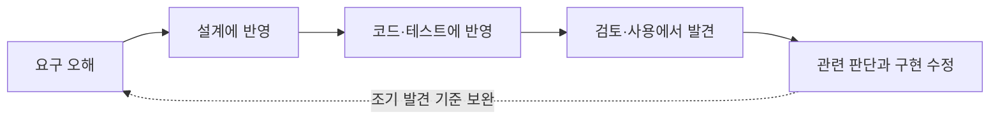

**강사 노트**

- 인용 근거: Karl Wiegers, "When Bad Requirements Happen to Nice People", Jama Software 블로그(2013). 이 글은 수치의 출처를 밝히지 않는다.
- 수치의 원전으로 알려진 Leffingwell, "Calculating the Return on Investment from More Effective Requirements Management", *American Programmer* 10(4), 1997은 확인하지 못했다. IfSQ는 같은 원전을 "요구사항 **변경**이 재작업의 70~85%"로 요약한다(IfSQ, "70% of rework caused by changing requirements"). 재인용처마다 오류·변경으로 해석이 갈리므로 원전의 수치로 단정하지 않는다.
- 인용 수치는 역사적 보고다. 재작업에는 학습으로 유용해진 변경도 섞여 있어, 모두 회피 가능한 결함은 아니다.
- 조기 검토의 비용과 줄일 수 있는 재작업 위험을 비교한다. 모든 변경을 처음부터 예방할 수 있다는 뜻은 아니다.

---

## 03. 미사용 기능

개발한 기능의 양이 곧 고객 가치는 아니다. **사용 빈도·사용 맥락·미사용 이유·필요 시의 가치**를 함께 확인한다.

**인용문**

"Standish Group 조사에서 **45%**는 **전혀 사용되지 않았고** **20%**만 자주·항상 사용됐다(항상 7%·자주 13%·때때로 16%·거의 19%·전혀 45%)", "A Standish study found that 45% of features were never used and only 20% of features were used often or always.", Jim Johnson·Standish Group, 2002, www(4개 회사 내부 애플리케이션 표본 — Mike Cohn, 2016 직접 확인)

**Chart — matplotlib**

```chart
{"type":"pie","title":"기능 사용 빈도","labels":["전혀","거의","때때로","자주","항상"],"series":[{"name":"사용 빈도","values":[45,19,16,13,7]}]}
```

**강사 노트**

- 사용 빈도 수치는 XP2002 발표를 인용한 여러 매체에서 확인했다(www). 표본 성격(4개 회사 내부 애플리케이션)은 Cohn이 Standish Group에 직접 문의해 확인한 내용이다. 원 조사 데이터·관찰 기간·측정 기준 자체는 직접 확인하지 못했다.
- 앞의 가치 판단 예는 교육용 사례이며 위 조사에서 얻은 결론이 아니다.
- 사용 빈도를 가치와 동일시하지 않는다. 운영 복구·감사 등 드물지만 필요한 기능을 반례로 토론한다.

---

## 04. 범위와 가치

**해야 할 것은 하고, 하지 않아도 될 것은 만들지 않는다.**

- **누락** — 필요한 요구사항을 놓침
- **범위 초과** — 문제 밖의 요구사항 추가
- **과잉 구현** — 요구사항 밖의 해결책 구현

가장 나쁜 경우는 **해야 할 것은 못하면서 하지 않아도 될 것을 만드는 것**이다.

**페이지 분할**

### 범위 확대와 불필요한 구현

요구사항 변경이 모두 문제인 것은 아니다. **합의한 범위를 어떻게 변경하고, 필요한 기능을 어디까지 구현하는가**가 중요하다.

- **범위의 무단 확대(Scope Creep)** — 일정·비용·자원에 미치는 영향을 조정하거나 승인받지 않고 기능·업무 범위가 늘어나는 것
  - 예: 주문 취소 기능을 만드는 동안 승인 없이 **교환·반품 기능**까지 추가
- **불필요한 기능 추가(Gold Plating)** — 요구사항을 충족하는 데 필요하지 않은 기능이나 장식을 좋다는 이유로 추가하는 것
  - 예: 요청받지 않은 복잡한 **취소 화면 효과**와 부가 기능 구현
- **과도한 설계·구현(Overengineering)** — 현재의 요구와 위험에 비해 설계·기술·구현을 지나치게 복잡하게 만드는 것
  - 예: 단순한 취소 규칙에 불필요한 **분산 처리 구조** 도입

**승인된 변경은 범위의 무단 확대와 다르다.** 불필요한 기능과 과도한 구조를 경계하는 이유는 고객 가치를 늘리지 못하면서 비용과 변경 부담을 키울 수 있기 때문이다.

**강사 노트**

- 세 개념은 서로 관련되지만 동의어가 아니다. 범위 확대는 변경 통제, 불필요한 기능 추가는 요구 밖의 기능, 과도한 설계·구현은 해법의 불필요한 복잡성이 초점이다.
- 예시는 모두 주문 취소라는 동일 상황에 연결한다.

---

## 05. 문제 → 요구사항 → 해결책

해결책부터 정하지 않는다. 먼저 **문제**, 다음으로 충족할 **요구사항**, 마지막으로 **해결책**을 구분한다.

- **문제** — 무엇을 해결할 것인가?
- **요구사항** — 무엇을 만족해야 하는가?
- **해결책** — 어떻게 만족시킬 것인가?
- **제약** — 가능한 선택과 범위를 제한

문제의 전부 또는 일부를 해결하기 위해 **요구사항**을 정하고, 요구사항의 전부 또는 일부를 만족시키기 위해 **해결책**을 선택한다.

**도식 — Mermaid**

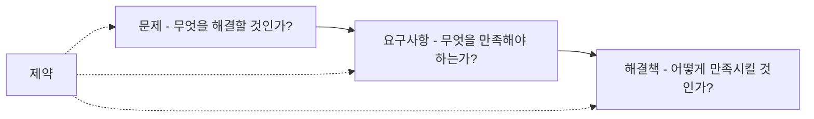

**페이지 분할**

### 요청 속의 해결책

**문제(Problem)**와 **해결책(Solution)**은 구분해야 한다. 고객의 요청에는 해결해야 할 문제와 이미 선택한 해결책이 함께 들어 있을 수 있다.

> “주문 화면에 취소 버튼을 추가해 주세요.”

아래는 고객이 현재 직접 취소할 수 없다는 **가정**에 따른 해석이다. 요청만으로 그 원인이 확인된 것은 아니다.

- **문제** — 고객이 취소 가능한 주문을 직접 취소할 수 없음
- **요구사항** — 취소 가능한 주문은 고객이 직접 취소할 수 있어야 함
- **해결책** — 취소 버튼, `Order.cancel()`

같은 문제와 요구사항에도 **여러 해결책**이 가능하다.

**도식 — Mermaid**

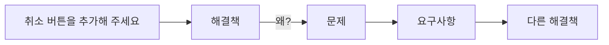

**강사 노트**
- 요구사항과 해결책은 각각 상위 목적에서 정당화되어야 한다.
- 이후 분석·설계 판단의 기준축으로 사용한다.
- 고객의 요청 자체가 이미 하나의 해결책일 수 있다.
- 바로 구현하기 전에 상위 문제와 요구사항을 확인한다.

---

## 06. 이벤트 관점

고객 관점의 요구는 **이벤트 관점으로 수렴**한다. 많은 문제의 본질은 한 관점으로 보지 않고 **여러 관점을 섞는 것**이다.

- **섞인 요구** — "취소 버튼을 누르면 주문 테이블 상태를 C로 바꾼다"에는 화면·데이터·해결책이 한 문장에 섞여 합의할 단위가 없다.
- **이벤트로 본 요구** — "고객이 배송 전 주문을 취소한다 → 주문이 취소되었다". 화면·데이터·기술은 그 뒤에 각자의 결정으로 다룬다.

**도식 — Mermaid**

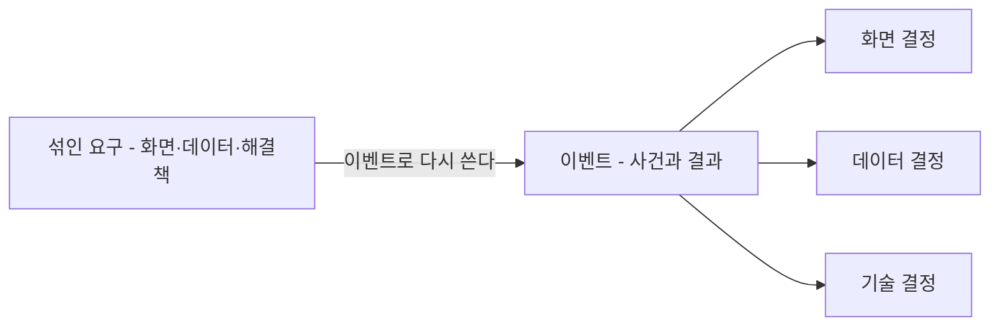

**강사 노트**

- 이벤트 반응 목록, 유스케이스, 사용자 이야기, 도메인 이벤트가 모두 이벤트를 출발점으로 삼는다는 근거는 "02. 요구 분석과 유스케이스"의 「07. 이벤트 중심 요구」·「08. 이벤트 중심 기법」에서 다룬다.
- 화면·기술 요소를 요구에 섞는 잘못된 관행은 "02. 요구 분석과 유스케이스"의 「36. 잘못된 관행 — 화면·기술 요소」에서 다룬다.

---

## 07. 본질적 어려움과 우연적 어려움

어려움은 **본질적(Essence)**·**우연적(Accident)** 어려움으로 나뉜다.

**인용문**

"소프트웨어의 복잡성은 **우연적** 속성이 아니라 **본질적** 속성이다", "The complexity of software is an essential property, not an accidental one.", Frederick P. Brooks Jr., 1986

- **본질적 어려움** — 문제와 소프트웨어 복잡성(의미·규칙·상태·관계)
- **우연적 어려움** — 구현 기술·환경의 추가 부담(언어·도구·연동)

**도식 — Mermaid**

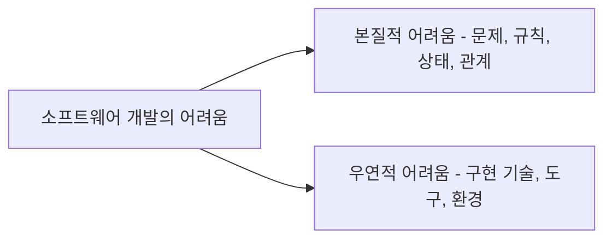

**강사 노트**
- 인용 근거: Brooks, "No Silver Bullet — Essence and Accidents of Software Engineering", UNC Technical Report TR86-020(1986), Essential Difficulties의 Complexity 원문 확인.
- 기술은 우연적 어려움을 줄일 수 있지만 본질적 어려움을 제거하지는 못한다.

---

## 08. 주문 취소의 복잡성

주문 취소는 버튼 하나를 구현하는 문제가 아니다. **취소 조건과 후속 업무를 올바르게 결정하는 복잡성**이 핵심이며, 이를 실현하는 기술적 어려움과 구분해야 한다.

- **본질적 어려움 — 주문 취소 업무의 의미와 규칙**
  - **어떤 주문**을 **언제** 취소할 수 있는가?
  - **결제·배송 상태**에 따라 취소 결과가 어떻게 달라지는가?
  - 어떤 경우에 **얼마를 환불**해야 하는가?
- **우연적 어려움 — 결정된 규칙을 구현하는 기술적 부담**
  - 외부 결제·상품·회계·배송 시스템 **연동**
  - **트랜잭션·이벤트·재시도** 처리
  - **통신 장애**와 **중복 요청** 대응

기술 선택에 앞서 **취소의 의미·조건·결과**를 분명히 해야 한다.

**강사 노트**
- 「07. 본질적 어려움과 우연적 어려움」에서 정의한 본질적·우연적 어려움이 주문 취소에 어떻게 나타나는지 연결한다.
- 예시의 구현 기술을 본질적 업무 규칙으로 혼동하지 않도록 한다.
- 중복 요청이 발생해도 한 번만 환불되어야 한다는 보장은 업무 의미다. 재시도·중복 제거의 구현 수단과 그 보장 자체를 구분한다.

---

## 09. 분석과 설계

분석·설계의 목적은 **산출물이 아니라 판단**이다.

- **분석(Analysis)** — 무엇이 필요한가, 무엇을 의미하는가, 어떤 규칙과 제약이 있는가?
- **설계(Design)** — 누가 책임지는가, 어디에 경계를 두는가, 어떻게 협력하는가?

분석은 문제를 이해하고, 설계는 그 이해를 바탕으로 **해결책의 책임과 구조를 결정한다**. 개발 절차에서는 통합할 수 있지만, 사고에서는 **문제와 해결책을 구분**한다.

**도식 — Mermaid**

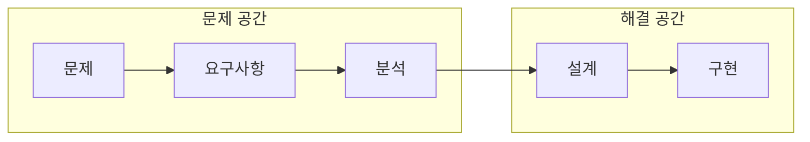

**페이지 분할**

**객체지향 분석·설계(Object-Oriented Analysis and Design, OOAD)**는 문제영역의 의미를 객체 관점으로 이해하고 이를 실현할 책임과 협력을 설계한다.

- **객체지향 분석(OOA)** — 문제영역의 개념·관계·규칙을 발견하고 요구와 교차검토한다.
- **객체지향 설계(OOD)** — 구현할 객체의 책임·상태·협력·인터페이스를 결정한다.

**인용문**

"객체지향 분석은 문제영역의 어휘에서 발견되는 **클래스와 객체의 관점**에서 요구사항을 검토하는 방법이다", "Object-oriented analysis is a method of analysis that examines requirements from the perspective of the classes and objects found in the vocabulary of the problem domain.", Grady Booch, 1994, www

**강사 노트**
- 실제 개발 절차에서는 분석과 설계가 반복되고 섞일 수 있다.
- 사고에서는 문제와 해결책을 구분한다.

- Booch, *Object-Oriented Analysis and Design with Applications*(2nd ed., 1994) 원서 본문은 미확인이다(www). 재인용처: tutorialspoint, "OOAD — Object Oriented Paradigm". 정의의 영어 문구가 이 페이지와 일치함을 확인했다.

- 유스케이스는 요구 입력이며 그 자체로 객체 모델은 아니다. 도메인 개념 분석과 객체 설계의 출발점으로 사용한다.
- "03. 정적 모델 — 도메인 개념과 관계"·"04. 동적 모델 — 상호작용과 상태"에서 의미를 분석하고 "06. 분석 모델에서 설계 모델로"·"07. 책임·협력·계약"에서 설계 판단으로 연결한다.

---

## 10. 결정 경계

요구·분석·설계·코드는 **서로 다른 질문에 답한다**. 지금 어떤 결정을 내리는지 알아야 가까운 곳에서 검증할 수 있다.

| 관점 | 질문 | 결정 | 가까운 검증 |
|---|---|---|---|
| **요구** | 누가 어떤 결과를 왜 원하는가? | 의도, 범위, 외부 결과 | 수용·거절 예시 |
| **분석** | 그 결과가 업무에서 무엇을 뜻하는가? | 개념, 관계, 규칙, 상태 | 시나리오와 모델의 교차검토 |
| **설계** | 누가 어떤 협력으로 실현하는가? | 경계, 책임, 협력, 계약 | 대안·실패 경로·변경 영향 |
| **코드** | 어떻게 실행하는가? | 실행 로직, 기술 구체화 | 정적 검사, 실행 테스트 |

- **분석이 끝났다** — 문서를 다 채웠다는 뜻이 아니라 다음 작업자가 중요한 의미를 **추측하지 않아도 되는** 상태다.
- **발견 위치 ≠ 원인** — 코딩 중 "배송된 주문도 취소하나?"가 드러나면 분기를 만들지 말고 요구로 돌아간다.

**강사 노트**

- 구분하는 이유는 문서 인계 절차를 고정하려는 것이 아니다. 앞 결정을 닫아 두고 되돌아가지 못하는 운영이 문제다(「27. 피드백」).

---

## 11. 분석·설계의 진화

분석·설계 방법은 **무엇을 중심으로 문제와 구조를 보는가**에 따라 서로 다른 질문을 드러낸다. 이를 한 방법이 다른 방법을 완전히 대체한 일직선의 발전 과정으로 보지 않는다.

| 접근 | 중심 관심 | 유용한 질문 |
|---|---|---|
| **구조적 분석·설계** | 기능·자료 흐름·모듈 | 어떤 변환이 일어나며 자료가 어디로 흐르는가? |
| **정보공학** | 업무 정보·데이터 모델 | 어떤 정보와 관계를 일관되게 관리해야 하는가? |
| **객체지향 분석·설계** | 도메인 개념·객체 책임·협력 | 누가 상태와 규칙을 소유하고 어떻게 협력하는가? |

**강사 노트**

- 표는 관심사를 비교하는 교육용 정리다. 시대별 우열이나 단일 계보를 주장하지 않는다.
- 자료 흐름을 볼 때와 책임 배치를 볼 때 얻는 정보가 다르다는 점을 설명한다.

---

## 12. 맥락과 접근법

접근법은 **누가 무엇을 얼마나 아는가**와 **무엇이 불확실한가**에 따라 달라진다. 고객·개발자의 도메인 지식, 기술 숙련, 팀워크의 성숙도가 무엇을 더 명시하고 검증할지를 정한다.

| 관점 | 낮을 때 | 이렇게 보완한다 |
|---|---|---|
| **고객의 도메인·요구 표현** | 요구를 해결책(화면·버튼)으로 말한다 | 관찰·예시·프로토타입으로 끌어낸다 |
| **개발자의 도메인 이해** | 규칙을 조건문 속에서 추측한다 | 이벤트·용어를 합의해 모델로 명시한다 |
| **개발자의 기술 숙련** | 구현 가능성·품질을 장담하지 못한다 | 스파이크·작은 구현으로 위험부터 줄인다 |
| **팀워크** | 결정이 전달되지 않고 암묵지가 흩어진다 | 결정 근거를 명시하고 짧은 주기로 맞춘다 |

**페이지 분할**

### 불확실성과 접근법

업무·기술의 **불확실성**이 반복의 주기와 먼저 검증할 대상을 정한다. 모든 접근은 **결정–검증–되돌림**을 서로 다른 주기로 운영한다.

| 상황 | 알맞은 접근 | 먼저 검증할 것 |
|---|---|---|
| 고객·개발자가 도메인을 알고 업무·기술이 안정적 | 계획 기반(폭포수) | 요구·계약의 완결성 |
| 업무는 명확하고 기술이 불확실 | 반복·점진(I&I), 스파이크 | 위험한 기술부터 작은 증분으로 |
| 요구가 자주 바뀌고 고객이 함께할 수 있음 | 애자일 | 짧은 주기로 동작하는 SW |
| 문제와 사용자가 불분명 | 디자인 씽킹(DT) | 사용자의 문제와 요구 |
| 가치·시장이 불확실 | Lean Startup | 최소 제품(MVP)으로 가치 가설 |
| 사용 경험이 불확실 | Lean UX | 경험 가설과 실험 결과 |

**강사 노트**

- 접근별 비교는 "02. 요구 분석과 유스케이스"의 「09. 반복적 접근」, 누가 요구를 아는지와 불확실성에 따른 경우별 접근은 "02. 요구 분석과 유스케이스"의 「13. 누가 요구를 아는가?」·「14. 업무·기술 불확실성」·「15. 경우별 접근법」에서 다룬다.
- 성숙도가 높으면 대화·스케치·코드·테스트로 가볍게 간다. 모델의 개수가 품질의 척도는 아니다.

---

## 13. 통합 모델링 언어

**통합 모델링 언어(UML)**는 **분석·설계 방법론이 아니라 모델을 표현·공유하는 표준 언어**다.

**인용문**

"UML은 소프트웨어와 시스템을 **시각화·명세·문서화**하는 표준이다", "Unified Modeling Language® (UML®) as a standard for visualizing, specifying, and documenting software and systems.", Object Management Group

Rumbaugh(OMT)·Booch(Booch Method)·Jacobson(OOSE) 세 표기법이 **1997년 UML로 통합됐다**.

**도식 — Mermaid**

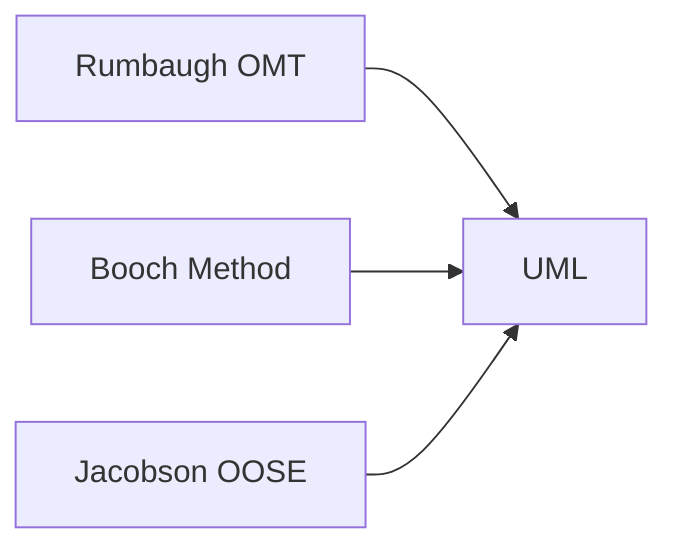

**강사 노트**
- 인용 근거: OMG의 UML 소개 페이지(omg.org/uml) 원문 확인. 영어는 그 페이지 문장의 발췌다.
- UML의 통합 배경은 OMG [UML 2.5.1](https://www.omg.org/spec/UML/2.5.1/PDF), §1 Scope의 UML 1 설명을 참조한다.
- UML은 객체지향 분석·설계 자체가 아니다.
- 분석·설계의 결과를 표현하고 검토하는 언어다.

---

## 14. 클래스 다이어그램

클래스 다이어그램의 **개념·관계·다중성**은 코드의 **클래스·필드·생성자 검사**로 이어진다. 연관은 필드, `1..*`와 수량 규칙은 생성자의 검사가 된다.

**도식 — PlantUML**

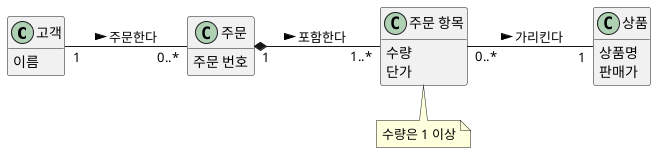

```java
final class 고객 {
    private final String 이름;
    고객(String 이름) { this.이름 = 이름; }
}

final class 주문 {
    private final String 주문번호;
    private final 고객 고객;
    private final List<주문항목> 항목들;
    주문(String 주문번호, 고객 고객, List<주문항목> 항목들) {
        if (항목들.isEmpty())
            throw new IllegalArgumentException("주문 항목은 1개 이상");
        this.주문번호 = 주문번호;
        this.고객 = 고객;
        this.항목들 = List.copyOf(항목들);
    }
}

final class 주문항목 {
    private final 상품 상품;
    private final int 수량;
    private final int 단가;
    주문항목(상품 상품, int 수량, int 단가) {
        if (수량 < 1)
            throw new IllegalArgumentException("수량은 1 이상");
        this.상품 = 상품;
        this.수량 = 수량;
        this.단가 = 단가;
    }
}

final class 상품 {
    private final String 상품명;
    private final int 판매가;
    상품(String 상품명, int 판매가) { this.상품명 = 상품명; this.판매가 = 판매가; }
}
```

**강사 노트**

- 코드는 다이어그램의 **한 관점**만 옮긴 예시다. 자동 변환이나 최종 설계가 아니다.
- 표기와 도메인 모델은 "03. 정적 모델 — 도메인 개념과 관계"의 「09. 클래스 다이어그램」, 설계로의 전환은 "06. 분석 모델에서 설계 모델로"에서 다룬다.

---

## 15. 시스템 시퀀스 다이어그램

시스템 시퀀스 다이어그램의 **시스템 이벤트**는 시스템 경계의 오퍼레이션이 된다. 시스템 안은 블랙박스이며, 이벤트를 받는 쪽인 주문 시스템만 코드로 본다.

**도식 — PlantUML**

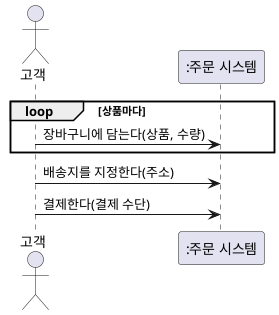

```java
interface 주문시스템 {
    void 장바구니에담는다(String 상품, int 수량);
    void 배송지를지정한다(String 주소);
    void 결제한다(String 결제수단);
}
```

**강사 노트**

- 코드는 다이어그램의 **한 관점**만 옮긴 예시다. 자동 변환이나 최종 설계가 아니다.
- SSD와 시스템 오퍼레이션은 "02. 요구 분석과 유스케이스"의 「40. 시스템 시퀀스 다이어그램」·「43. 정제된 SSD」에서 다룬다.

---

## 16. 분석 시퀀스 다이어그램

분석 시퀀스 다이어그램의 **메시지는 받는 객체의 메서드**가 된다. 생성은 `new`로, 반복은 `for` 문으로 옮긴다. 주문 항목을 추가하고 총액을 구하는 상호작용을 코드로 본다. 주문 항목은 만들어질 때 상품의 **판매가**를 **단가**로 확정한다.

**도식 — PlantUML**

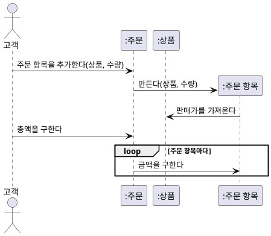

```java
// ... 상품(상품명, 판매가) 생략
final class 주문항목 {
    private final 상품 상품;
    private final int 수량;
    private final int 단가;
    주문항목(상품 상품, int 수량) {
        this.상품 = 상품;
        this.수량 = 수량;
        this.단가 = 상품.판매가();
    }
    int 금액() { return 단가 * 수량; }
}

final class 주문 {
    private final java.util.List<주문항목> 항목들 = new java.util.ArrayList<>();
    void 주문항목을추가한다(상품 상품, int 수량) {
        항목들.add(new 주문항목(상품, 수량));
    }
    int 총액을구한다() {
        int 합계 = 0;
        for (주문항목 항목 : 항목들) 합계 += 항목.금액();
        return 합계;
    }
}
```

**강사 노트**

- 코드는 다이어그램의 **한 관점**만 옮긴 예시다. 자동 변환이나 최종 설계가 아니다.
- 도메인 객체의 상호작용은 "04. 동적 모델 — 상호작용과 상태"의 「19. 시퀀스 다이어그램」에서 다룬다. 설계 객체의 상호작용은 "07. 책임·협력·계약"에서 다룬다.

---

## 17. 커뮤니케이션 다이어그램

커뮤니케이션 다이어그램의 **링크는 참조**(필드)가 되고, 번호는 호출의 중첩이 된다. 주문 항목을 추가하는 상호작용을 링크와 번호로 본다.

**도식 — PlantUML**

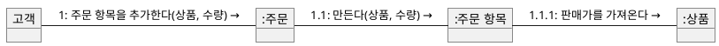

```java
final class 상품 {
    private final String 상품명;
    private final int 판매가;
    상품(String 상품명, int 판매가) { this.상품명 = 상품명; this.판매가 = 판매가; }
    int 판매가() { return 판매가; }
}

final class 주문항목 {
    private final 상품 상품;
    private final int 수량;
    private final int 단가;
    주문항목(상품 상품, int 수량) {
        this.상품 = 상품;
        this.수량 = 수량;
        this.단가 = 상품.판매가();
    }
}

final class 주문 {
    private final java.util.List<주문항목> 항목들 = new java.util.ArrayList<>();
    void 주문항목을추가한다(상품 상품, int 수량) {
        항목들.add(new 주문항목(상품, 수량));
    }
}
```

**강사 노트**

- 코드는 다이어그램의 **한 관점**만 옮긴 예시다. 자동 변환이나 최종 설계가 아니다.
- 표기와 시퀀스와의 비교는 "04. 동적 모델 — 상호작용과 상태"의 「28. 커뮤니케이션 다이어그램」에서 다룬다.

---

## 18. 상태 기계 다이어그램

상태 기계 다이어그램의 **상태·사건·전이**는 코드의 값·메서드·허용 검사가 된다. 규칙이 금지한 전이는 일어날 수 없다. 주문의 생애 전체를 코드로 본다.

**도식 — PlantUML**

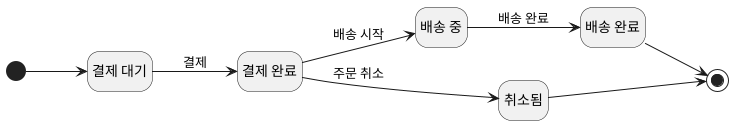

```java
enum 주문상태 { 결제대기, 결제완료, 배송중, 배송완료, 취소됨 }

final class 주문 {
    private 주문상태 상태 = 주문상태.결제대기;

    void 결제한다() { 전이(주문상태.결제대기, 주문상태.결제완료); }
    void 배송을시작한다() { 전이(주문상태.결제완료, 주문상태.배송중); }
    void 배송을완료한다() { 전이(주문상태.배송중, 주문상태.배송완료); }
    void 취소한다() { 전이(주문상태.결제완료, 주문상태.취소됨); }

    private void 전이(주문상태 출발, 주문상태 도착) {
        if (상태 != 출발)
            throw new IllegalStateException(상태 + "에서는 " + 도착 + "이 될 수 없다");
        상태 = 도착;
    }
}
```

**강사 노트**

- 코드는 다이어그램의 **한 관점**만 옮긴 예시다. 자동 변환이나 최종 설계가 아니다.
- 상태 값은 "03. 정적 모델 — 도메인 개념과 관계"의 「06. 상태 값과 상태 전이」와 같다. 취소는 결제 완료·배송 시작 전 주문만 할 수 있다는 "02. 요구 분석과 유스케이스"의 전제를 따른다.
- 결제·배송 시스템의 통보와 취소 처리 중 상태까지 포함한 주문의 생애는 "04. 동적 모델 — 상호작용과 상태"의 「32. 상태 기계 다이어그램」·「33. 주문 상태 기계」에서 다룬다.

---

## 19. 요구에서 테스트로

요구의 **수용·거절 예시**가 그대로 테스트가 된다. 규칙이 금지한 전이는 거절되어야 한다.

| 요구 예시 | 분석 규칙 | 테스트 |
|---|---|---|
| 배송 중인 주문은 취소할 수 없다 | 배송 중에서 취소 전이 없음 | 취소가 거절된다 |
| 취소된 주문은 결제할 수 없다 | 취소됨에서 결제 전이 없음 | 결제가 거절된다 |
| 주문 항목 없이 주문할 수 없다 | 주문 항목 `1..*` | 빈 주문 생성이 거절된다 |

**페이지 분할**

요구 예시를 **실행되는 테스트**로 옮긴다. 「18. 상태 기계 다이어그램」의 주문 코드와 함께 실행한다.

**도식 — PlantUML**


```java
class 주문테스트 {
    public static void main(String[] args) {
        var 배송중인주문 = new 주문();
        배송중인주문.결제한다();
        배송중인주문.배송을시작한다();
        거절(배송중인주문::취소한다);

        var 취소된주문 = new 주문();
        취소된주문.결제한다();
        취소된주문.취소한다();
        거절(취소된주문::결제한다);

        System.out.println("주문 규칙 확인");
    }

    static void 거절(Runnable 행위) {
        try { 행위.run(); } catch (IllegalStateException 기대한거절) { return; }
        throw new AssertionError("거절되어야 한다");
    }
}
```

**강사 노트**

- 테스트 통과가 정책의 결정은 아니다. 미확정 정책은 테스트 기대값으로 대신 정하지 않는다.
- 요구 예시와 행위 주도 개발은 "02. 요구 분석과 유스케이스"의 「50. 행위 주도 개발」에서 다룬다.

---

## 20. 소프트웨어 아키텍처

**소프트웨어 아키텍처**는 시스템 수준에서 무엇을 주요 구성 요소로 나누고 어떻게 연결하며, 어떤 경계와 원칙에 따라 설계·변경할지를 다룬다.

**인용문**

"아키텍처는 환경 속 시스템의 근본적인 개념·속성이며, **요소·관계·설계 및 진화 원칙**에 구현된다", "Fundamental concepts or properties of a system in its environment embodied in its elements, relationships, and in the principles of its design and evolution.", ISO/IEC/IEEE 42010, www

- **구성 요소** — 컴포넌트·서브시스템 등 시스템의 주요 부분
- **관계와 연결** — 구성 요소 사이의 협력·의존성·인터페이스
- **경계** — 책임과 변경 영향을 구분하는 구조
- **설계·진화 원칙** — 품질속성과 제약을 고려한 주요 결정

객체지향 설계가 객체·모듈의 책임과 협력을 구체화한다면, 아키텍처는 **시스템 전체의 구조와 경계**를 다룬다.

**강사 노트**
- 아키텍처를 문서나 다이어그램 자체와 동일시하지 않는다. 위 정의는 ISO/IEC/IEEE 42010 정의를 그대로 재수록한 NIST 공식 용어집에서 확인했다. ISO 표준 본문 자체를 직접 확인한 것은 아니다.

---

## 21. 책임과 경계

**책임(Responsibility)**과 **경계(Boundary)**는 객체지향 설계의 핵심 판단이다. **누가 무엇을 책임지고 어디에 경계를 둘 것인가**를 결정한다.

- **책임**
  - 상태 소유
  - 규칙 판단
  - 행위 수행
- **경계**
  - 함께 변경되어야 할 **상태와 행위**를 묶음
  - **책임**과 **변경 영향**을 구분함

“데이터를 어디에 둘까?”보다 **“누가 이 판단을 책임질까?”**를 먼저 묻는다.

**강사 노트**
- 책임과 경계를 함께 검토한다.

---

## 22. 메시지와 협력

객체는 데이터를 담는 단위가 아니다. **메시지**(요청)를 받은 객체가 자신의 **책임**(정보·규칙)으로 판단하고, 여러 객체가 **협력**해 목표를 달성한다.

**인용문**

"객체지향은 오직 **메시징**, 상태·프로세스의 **지역적 보존·보호·은닉**, 그리고 모든 것의 **극단적으로 늦은 바인딩**을 의미한다", "OOP to me means only messaging, local retention and protection and hiding of state-process, and extreme late-binding of all things.", Alan Kay, 2003

**도식 — PlantUML**

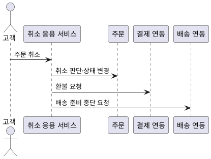

**강사 노트**
- 인용 근거: Alan Kay가 Stefan Ram에게 보낸 이메일(2003-07-23). Stefan Ram이 공개한 원문 페이지에서 확인했다.
- 객체지향을 클래스와 상속만으로 설명하지 않는다.
- 메시지, 책임, 협력이 핵심이다.
- 응용 서비스는 취소 규칙을 다시 구현하지 않고 주문의 판단 결과를 사용한다.
- 외부 연동을 분리하면 주문 객체의 기술 의존을 줄일 수 있지만 협력과 실패 조정 책임이 추가된다.

---

## 23. 분석 모델에서 설계 모델로

분석 모델의 개념을 설계 클래스로 **1:1 기계 변환하지 않는다**. 설계에서는 책임·경계·협력을 다시 결정한다.

- **분석 모델** — 주문, 결제, 고객, 취소 정책 등 업무 개념과 관계
- **설계 모델** — 주문, 주문 서비스, 취소 정책, 결제 연동, 저장소 등 책임과 협력 구조

분석 모델의 개념 하나가 **여러 설계 요소로 나뉠 수 있다**(예: 취소 정책 → 주문 서비스·결제 연동·저장소). 결제 연동·저장소는 외부 연동과 영속성 요구를 검토하며 필요 여부를 결정한다.

**페이지 분할**

### 다이어그램은 설계도가 아니다

다이어그램은 코드로 **옮겨 적는 설계도가 아니다**. 상자 하나가 여러 코드 요소가 되기도, 여러 상자가 한 코드에 담기기도 한다.

| 분석에서 확인할 의미 | 설계에서 더할 판단 | 코드에서 확인할 증거 |
|---|---|---|
| 배송된 주문은 취소할 수 없다 | 취소 판단의 책임 | 거절 결과와 상태 유지 |
| **주문 항목은 1개 이상** | 생성 책임과 검사 위치 | 빈 주문의 거절 |
| **총액은 항목 금액의 합** | 계산할지 저장할지 | 항목 변경 뒤의 총액 |

- 코드 한 조각이 **보장하는 것**과 모델 전체의 **제약**은 다르다. 보장하지 못하는 제약은 누가 지킬지 설계에서 정한다.

**강사 노트**
- 설계에서는 책임, 경계, 협력, 의존성을 다시 결정한다.

---

## 24. 적정 분석·설계

**적정 분석·설계(Just Enough Analysis and Design)**란 가능한 많은 모델과 산출물을 만드는 것이 아니라, **현재의 주요 위험을 줄이고 다음 검증으로 진행할 만큼** 분석하고 설계하는 것이다.

| 상황 | 다음 행동 | 판단 근거 |
|---|---|---|
| **부족** — 요구·규칙·책임 불명확 | 필요한 모델을 보완한다 | 분석 비용으로 재작업 위험을 줄인다 |
| **적정** — 주요 판단 확보 | 구현·테스트·프로토타입으로 검증한다 | 모델보다 실제 검증이 더 많이 알려 준다 |
| **과도** — 상세가 판단을 바꾸지 않음 | 멈추고, 새 증거가 생기면 재검토한다 | 비용을 줄이되 불확실성은 기록한다 |

### 다음 결정이 추측하지 않도록

**다음 결정이 중요한 것을 추측하지 않아도 될 만큼** 명시한다. 핵심 규칙을 빈칸으로 두는 것은 설계 자유도가 아니라 **숨은 위험**이다.

| 결정 경계 | 지금 명시할 것 | 열어 둘 것 |
|---|---|---|
| **요구 → 분석** | 의도, 범위, 수용·거절 예시 | 내부 객체와 메서드 |
| **분석 → 설계** | 용어, 규칙, 상태, 불변 조건 | 저장 기술, 책임 배치 |
| **설계 → 코드** | 책임, 협력, 계약, 주요 제약 | 국소 구현 방식 |
| **코드 → 운영** | 보장 범위, 통합 전제, 남은 위험 | 실사용으로 확인할 가치 가설 |

**강사 노트**
- 중단 기준은 산출물의 양이 아니라 주요 위험과 다음 검증에 필요한 판단의 확보 여부다.
- 분석과 설계를 많이 하는 것이 좋은 것은 아니다.
- 추가 판단이 실제 위험을 줄이는지가 기준이다.

---

## 25. 북 스마트와 스트리트 스마트

**북 스마트**는 표준·모델·프로세스·원칙을 아는 것이고, **스트리트 스마트**는 그중 무엇을 언제 얼마나 쓸지 맥락에서 판단하고 증거로 되돌리는 것이다. 둘 중 하나만으로는 SW 공학이 되지 않는다.

| | 북 스마트만 있을 때 | 스트리트 스마트만 있을 때 |
|---|---|---|
| **요구** | 템플릿을 다 채우지만 합의한 이벤트가 없다 | 말로 합의하고 기록·예시가 없다 |
| **분석** | 다이어그램은 많지만 데이터 모델·규칙이 없다(분석 과잉) | 규칙을 코드 조건문에 바로 쓴다 |
| **설계** | 패턴을 먼저 고르고 요구를 맞춘다 | 매번 새로 만들어 같은 실수를 반복한다 |
| **검증** | 절차는 지켰지만 결과를 확인하지 않는다 | 동작하면 끝났다고 본다 |

- 결정 경계·다이어그램·원칙은 **북 스마트**, 적정 수준·맥락에 따른 선택·되돌림은 **스트리트 스마트**다.

**강사 노트**

- 둘 중 하나만으로는 SW 공학이 되지 않는다. 원칙과 모델은 북 스마트로 알되, 무엇을 언제 얼마나 쓸지는 맥락과 증거로 판단한다.

---

## 26. KISS·DRY·YAGNI

세 원칙은 **판단의 도구**다. 이름의 뜻보다 우리 흐름 안에서의 의미로 쓴다.

| 원칙 | 진정한 의미 | 주문에서 | 잘못 쓰면 |
|---|---|---|---|
| **KISS** | 우연적 복잡성은 없애고 본질은 드러낸다 | 상태는 `enum`과 허용 검사로 쓴다 | 규칙을 빼고 "코드에서 처리"한다 |
| **DRY** | 하나의 지식에 하나의 원천 | 수량 규칙은 한 곳, 예시는 곧 테스트 | 모양만 같은 다른 의미를 합친다 |
| **YAGNI** | 추측으로 결정하지 않는다 | 미확정인 부분 취소·쿠폰은 안 만든다 | 핵심 규칙·경계까지 미룬다 |

- 원칙이 부딪히면 **위험과 비용, 되돌리기 쉬운 정도**로 고른다. 공통 추상화가 두 개념을 함께 바뀌게 하면 중복을 남긴다.

**강사 노트**

- KISS의 본질적·우연적 복잡성 구분은 「07. 본질적 어려움과 우연적 어려움」과 같은 관점이다.
- 단계별 의미(요구·분석·설계·코드·테스트)는 `references/sw-engineering-approach/`의 참조 자료를 참고한다.

---

## 27. 피드백

구현·테스트의 오류는 앞선 **요구·분석·설계 판단**을 되돌아볼 증거다.

- **요구사항 오류** — 필요한 것 자체를 잘못 정의
- **분석 오류** — 의미·규칙을 잘못 이해
- **설계 오류** — 책임·경계를 잘못 배치
- **구현 오류** — 코드·기술 사용 오류

**도식 — Mermaid**

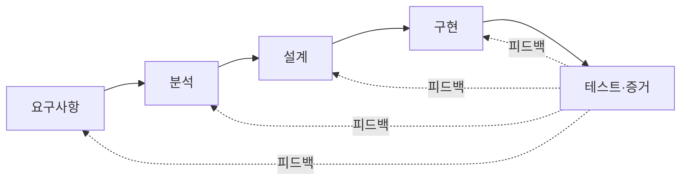

**페이지 분할**

### 검증의 배치

테스트는 앞 활동을 **생략해도 된다는 허가가 아니다**. 오류가 생기는 곳 가까이에서 검증을 앞당긴다.

| 관점 | 검증 | 주문에서 |
|---|---|---|
| **요구** | 수용·거절 예시 | 고객이 취소 가능 여부를 알 수 있는가? |
| **분석** | 규칙·상태의 일관성 | 배송된 주문에 취소 전이가 없는가? |
| **설계** | 책임·계약·실패 경로 | 취소 판단을 누가 지키는가? |
| **코드** | 실행·통합 | 거절 뒤 상태가 그대로인가? |
| **운영** | 실제 결과와 가치 | 취소 문의가 줄었는가? |

**강사 노트**
- 오류가 발견된 위치와 오류가 만들어진 위치는 다를 수 있다.
- 구현과 테스트는 앞선 판단에 대한 피드백이다.
- 규칙이 모호하면 자동화보다 허용·거절 예시의 합의가 먼저다. 자동화는 합의된 규칙의 회귀를 막는다.

---

## 28. 흔한 오해

객체지향 분석·설계에 대한 흔한 오해는 **표기·산출물·기술**을 판단보다 앞세우는 데서 생긴다.

| 오해 | 바른 판단 |
|---|---|
| UML을 그리면 OOAD다 | UML은 표현 언어다. 핵심은 문제 이해와 책임·경계 판단이다 |
| 분석은 문서를 많이 만드는 일이다 | 분석의 목적은 산출물이 아니라 판단이다 |
| 명사는 클래스, 테이블은 객체다 | 분석 개념을 설계·코드로 기계적으로 옮기지 않는다 |
| 객체는 데이터와 접근 메서드의 묶음이다 | 객체는 책임을 지고 메시지로 협력한다 |
| 상속과 디자인 패턴이 객체지향의 핵심이다 | 핵심은 메시지·책임·협력이며, 패턴은 실제 변경 압력이 있을 때 쓴다 |
| 기술을 먼저 정하고 요구를 맞춘다 | 문제와 요구를 먼저 정하고 기술은 해결책으로 고른다 |
| 한 번에 완벽하게 분석·설계한다 | 적정하게 분석·설계하고 피드백으로 고친다 |
| 다이어그램과 절차를 갖추면 된다 | 북 스마트만으로는 판단이 없다. 무엇을 언제 얼마나 쓸지 맥락에서 고른다 |
| 일단 해 보면 안다 | 스트리트 스마트만으로는 같은 실수를 반복한다. 예시·모델·테스트로 남긴다 |

**강사 노트**

- 각 오해는 앞 topic과 연결된다: 「13. 통합 모델링 언어」, 「09. 분석과 설계」, 「23. 분석 모델에서 설계 모델로」, 「21. 책임과 경계」·「22. 메시지와 협력」, 「07. 본질적 어려움과 우연적 어려움」, 「24. 적정 분석·설계」·「27. 피드백」, 「25. 북 스마트와 스트리트 스마트」.
- 요구 분석의 잘못된 관행은 "02. 요구 분석과 유스케이스", 정적 모델링의 잘못된 관행은 "03. 정적 모델 — 도메인 개념과 관계", 패턴의 선택적 적용은 "08. 변화 대응과 변이 설계"에서 다룬다.

---

## 29. 전문 영역으로의 확장

OOAD만으로 모든 판단을 끝내지 않는다. 규모·품질·분산·운영이 커지면 **전문 영역의 질문**이 더해진다.

| 영역 | 더해지는 질문 |
|---|---|
| SW Architecture | 품질속성과 제약 아래 구조·배포·변경 비용을 어떻게 절충하는가? |
| **DDD** | 도메인 언어와 문맥 경계를 어떻게 유지하는가? |
| **MSA** | 분산 경계·통신·실패·일관성이 업무 의미에 어떤 영향을 주는가? |
| **DevOps** | 운영 증거를 어떤 결정으로 얼마나 빨리 되돌리는가? |
| **AI-native SW공학** | 사람과 에이전트가 어떤 결정을 맡고 무엇으로 검증하는가? |

- 아키텍처는 **마지막 단계가 아니다**. 위험과 제약이 크면 판단과 검증을 **앞당긴다**.

**강사 노트**

- 전문 영역의 깊이는 "13. OOAD에서 전문영역으로 — Architecture · DDD · MSA"와 "14. AI-native SW공학"에서 다룬다. 이어지는 세 topic은 그중 이 과정이 특히 연결하는 도메인 주도 설계, 온톨로지, AI 기반 소프트웨어공학이다.

---

## 30. 도메인 주도 설계

**기존 객체지향 설계의 대체물이 아니라, 도메인 모델과 설계·구현의 정합성을 깊이 있게 다룬다.**

- **전략적 설계** — 핵심 도메인, 경계가 명확한 문맥, 문맥 간 관계
- **전술적 설계** — 엔티티, 값 객체, 애그리거트, 저장소, 도메인 서비스

에반스는 도메인 주도 설계를 **책임 중심 설계**와 객체지향 설계 모범 사례 위에 세운다. 이 세션은 그 위에서 도메인 주도 설계 고유의 **전략적·전술적 설계**를 다룬다.

**강사 노트**
- 도메인 주도 설계를 객체지향 분석·설계의 대체재로 설명하지 않는다.
- 이 과정에서는 객체지향 설계를 기반으로 DDD와 연결한다. DDD 전체를 특정 프로그래밍 패러다임에 한정하는 정의는 아니다.
- 전략적 설계와 전술적 설계의 차이는 개괄 수준에서만 소개한다.
- 근거: Eric Evans, *Domain-Driven Design*(Final Manuscript, 2003-04-15), Part II 서두(p.48) — 책의 설계 방식이 책임 중심 설계와 계약에 의한 설계, Larman 등 객체지향 설계 모범 사례를 배경으로 한다는 서술을 직접 확인했다.

---

## 31. 온톨로지

**온톨로지(Ontology)**는 공유하려는 개념과 관계의 의미를 명시하는 데 사용한다. 도메인 모델과 관심을 공유하지만 **모든 도메인 모델을 자동으로 온톨로지라고 부르지는 않는다**.

**인용문**

"온톨로지는 **개념화의 명시적 명세**다", "An ontology is an explicit specification of a conceptualization.", Thomas R. Gruber, 1993

**도식 — Mermaid**

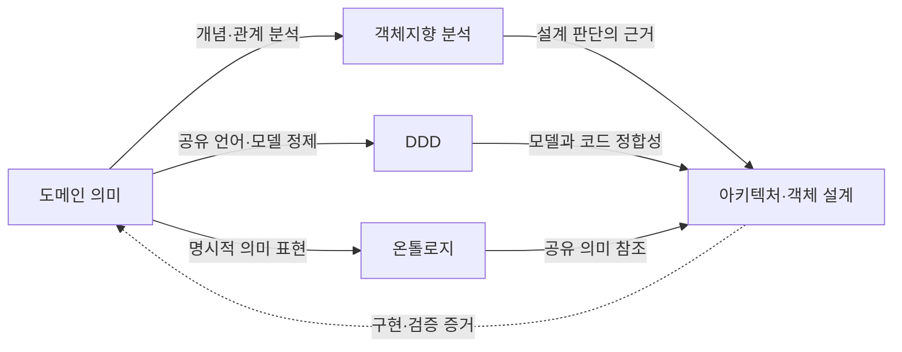

이는 필수 개발 순서가 아니라 **관심과 활용 관계**다.

**강사 노트**

- 인용 근거: Thomas R. Gruber, "A Translation Approach to Portable Ontology Specifications", *Knowledge Acquisition* 5(2):199–220, 1993 원문 확인.
- 위 관계는 이 과정의 교육용 연결이다. Gruber가 OOAD→DDD→온톨로지 순서를 제안했다는 의미가 아니다.
- LLM에 모델을 제공하는 것만으로 동일한 해석이 보장되지는 않는다. 구체적인 사례와 검증으로 확인한다.

---

## 32. AI 기반 소프트웨어공학

이 과정에서는 AI 기반 개발을 **인간의 판단 책임과 AI의 실행·지원 역할을 배치하는 관점**으로 다룬다. 아래 구분은 보편적으로 확정된 역할 표준이 아니라 검증과 책임 소재를 명확히 하기 위한 운영 원칙이다.

- **인간이 최종 책임지는 판단** — 비전과 가치, 위험 수용, 최종 의사결정과 책임
- **인간과 AI의 협업** — 요구사항, 도메인 모델·온톨로지, 아키텍처·설계, 테스트·검토
- **AI가 주도할 수 있는 실행** — 코드 생성·변환, 정적 검사, 테스트 실행, 자동화

핵심은 **누가 코드를 작성하느냐보다 누가 의미·경계·위험을 판단하고 결과를 검증하느냐**에 있다. 실행할 때는 필요한 맥락·제약을 **가드레일(Guardrail)**에 담고, **에이전트(Agent)**의 작업을 **실행·검증 환경(Harness)**에서 확인한다.

**강사 노트**
- 세 영역은 절대적인 기술 경계가 아니라 주도권과 책임의 구분이다.
- 인간이 최종 책임진다는 것은 모든 산출물을 직접 작성한다는 뜻이 아니다.
- AI 중심 실행은 충분한 맥락·제약·명세·검증을 전제로 한다.
- 도메인 모델·온톨로지와 아키텍처·설계는 함께 진화한다.
- 객체지향 분석·설계는 사라지지 않으며 인간과 AI의 협업 방식으로 수행된다.

---

## 33. 실습 — 요구사항 명세서

서비스 개요와 프롬프트를 LLM에 제공하여 **요구사항 명세서**를 만들고, 점검 항목을 참고해 **피드백**하여 명세서를 완성하십시오.

- **서비스 개요**
  + **생필품**을 일정 주기로 배송하는 정기배송 시스템을 개발한다. 고객은 상품·수량·기간·배송 주기(1·2·4주)·배송지를 입력하고 결제한다. 고객은 다음 배송을 24시간 전까지 취소할 수 있다(연속 2회까지). 상품·결제·배송은 각각 외부 시스템이 맡는다.
- **프롬프트**
  + "위 서비스 개요로 정기배송 시스템의 요구사항 명세서를 작성해줘. 기능 요구, 업무 규칙, 외부 시스템, 확인할 질문으로 나눠 정리해줘. 개요에 없는 내용은 추측하지 말고 **반드시 확인**해라."
- **점검 항목**
  1. **개요 반영** — 개요의 모든 내용이 빠짐없이 반영되었는가? 입력 항목, 결제, 취소 규칙, 외부 시스템을 확인한다.
  2. **결제** — 결제 방법(카드·계좌이체·간편결제 등), 청구 방식(일시불·월별 청구), 청구일이 정해졌는가?
  3. **배송 주기·기간** — 1·2·4주 외에 고객이 원하는 주기(매일·격일·3일·10일 등)를 지원하는가? 기간과 만료일이 정해졌는가?
  4. **취소·반품·해지** — 취소한 회차의 **환불 방법**, 반품할 수 있는 상품과 **반품 기한·절차**, 해지할 때 **남은 금액**의 처리
  5. **기술 용어** — 화면·버튼·DB·API 같은 구현 표현이 없는가?
  6. **미확정 항목** — 질문을 모두 확인해 없앴는가? 남긴 항목이 있다면 그 이유가 분명한가?
- **결과물** — 확인할 질문이 남지 않은 요구사항 명세서. 실습 2의 입력이 됩니다.

**강사 노트**

- 실습은 모든 세션이 이어 쓰는 **정기배송** 시스템의 신규 개발 시나리오다. 강의의 주문 사례와 방법은 같지만 모델을 그대로 옮길 수는 없다.
- LLM 사용 — 도구는 제한하지 않는다. LLM의 초안은 검토 전의 **가설**이며, 초안을 그대로 제출하지 않는다. 평가는 초안이 아니라 **고친 곳과 그 이유**를 본다.
- LLM이 되묻는 질문에 수강생이 **업무 담당자처럼 답해** 규칙을 정한다. 답할 수 없는 질문만 미확정으로 남기고 이유를 적는다.

---

## 34. 요구사항 명세서 (안)

생필품을 고객이 정한 주기로 배송하는 **정기배송 서비스**다. 고객은 상품·수량·배송 주기·첫 배송일·기간·배송지를 정해 신청하고, 일시불 또는 월별로 결제한다. 고객은 다음 배송을 취소하거나, 받은 상품을 반품하거나, 정기배송을 해지할 수 있다. 상품·결제·배송은 각각 외부 시스템이 맡는다.

- **기능 요구**
  - **F1 신청** — 상품·수량·주기·첫 배송일·기간·배송지를 정해 신청
  - **F2 결제** — 결제 방법과 청구 방식을 골라 결제
  - **F3 배송 요청** — 배송일마다 배송 시스템에 요청
  - **F4 취소** — 다음 배송을 취소하고 그 회차 금액을 환불
  - **F5 반품** — 반품을 신청하고, 회수가 확인되면 환불
  - **F6 해지** — 해지하고, 배송되지 않은 회차 금액을 환불
- **업무 규칙: 신청·금액·결제**
  - **R1 배송 주기** — 1~28일, 일 단위(매일·격일·3일·1주·10일·2주·4주 등)
  - **R2 배송일** — 첫 배송일은 신청 다음 날부터 7일 안에서 고르고, 이후는 주기마다 정해진다.
  - **R3 기간** — 1~12개월. 만료일은 첫 배송일 + 기간의 **전날**이며, 자동 연장하지 않는다.
  - **R4 회차 금액** — 상품 가격 × 수량. **신청 때의 가격**을 기간 끝까지 적용한다.
  - **R5 결제 방법** — 카드, 계좌이체, 간편결제 중 하나
  - **R6 청구 방식**
    - **일시불** — 신청할 때 전체 회차 금액을 청구한다.
    - **월별 청구** — 매월 첫 배송일과 같은 날(없으면 말일)에 그달 회차 금액을 청구한다.
- **업무 규칙: 청구 실패·취소·반품·해지**
  - **R7 청구 실패** — 3일 동안 매일 다시 청구하고, 그래도 실패하면 정지하고 고객에게 알린다.
  - **R8 취소** — 배송 24시간 전까지, 연속 2회까지
    - 청구한 회차는 **결제 수단으로 환불**하고, 청구 전이면 **청구에서 뺀다**.
  - **R9 반품 대상** — 개봉하지 않은 공산품, 받은 날부터 7일 이내
    - **식품은 불가**. 불량·오배송은 종류·개봉과 관계없이 가능하다.
  - **R10 반품 절차** — 배송 시스템이 회수하고, 확인 후 3영업일 안에 결제 수단으로 환불한다.
    - **단순 변심**은 반품 배송비 3,000원을 빼고 환불한다.
  - **R11 해지** — 언제든, 위약금 없음
    - 24시간 전이 지난 회차는 **배송**하고, 청구했지만 배송되지 않은 회차는 **환불**한다. 이후 청구는 멈춘다.
- **외부 시스템**
  - **상품** — 상품 정보·가격, 상품 종류(식품·공산품)
  - **결제** — 결제·청구·환불
  - **배송** — 배송, 반품 회수
- **미확정 항목** — 없음

**강사 노트**

- 점검 항목과 규칙의 대응 — 결제는 R5~R7, 주기·기간은 R1~R3, 취소·반품·해지는 R8~R11이다.
- 숫자(28일, 12개월, 7일, 3일, 3,000원)는 **교육용 가정**이다. 수강생의 답이 달라도 **정해져 있으면** 맞다.
- LLM 초안에서 고칠 곳의 예 — "결제 화면에서 카드 번호를 입력한다" 같은 기술 표현, 개요에 없는 규칙을 묻지 않고 단정한 것.

---

## 35. 요약

이 세션은 문제를 이해하고 해결책의 책임과 경계를 결정하는 **판단의 흐름**을 코드·테스트까지 이어서 다뤘다.

### 객체지향 분석·설계의 핵심

- **문제·요구·해결책과 이벤트** — 해결책이 섞인 요청에서 문제와 요구를 찾고, 요구는 이벤트로 합의한다.
- **본질적·우연적 어려움** — 업무 복잡성과 기술적 부담을 구분한다.
- **결정 경계와 코드·테스트** — 요구·분석·설계·코드는 각자 결정하고 가까이에서 검증한다.
- **책임·경계·협력** — 객체지향 설계의 핵심 판단이다. 다이어그램은 옮겨 적는 설계도가 아니다.
- **적정 수준과 원칙** — 맥락에 맞게 명시하고, 원칙은 북 스마트로 알되 스트리트 스마트로 쓴다.

### 다음 세션

- "**02. 요구 분석과 유스케이스**" — 요청에서 요구를 발견해 이벤트로 합의하고, 사용자 목표와 시스템 책임을 구분한다.

**강사 노트**
- 이 세션에서는 객체지향 분석·설계의 전체 지도와 코드·테스트까지의 연결을 만들었다.
- DDD·온톨로지·AI 기반 개발과의 연결은 「29. 전문 영역으로의 확장」 이후 topic에서 다뤘다.
- 다음에는 그 출발점인 문제와 요구사항을 구체적으로 다룬다.
