--------------------
Session 명: 02. 요구 분석과 유스케이스
--------------------

## 목차

01. 세션 목표
02. 요구공학의 본질
03. 분석 원칙
04. 문제·요구·요구사항·해결책
05. 요청에는 무엇이 섞여 있는가?
06. 요구공학의 주요 활동
07. 요구사항 수집과 발견
08. 디자인 싱킹·린 사고·Lean UX·애자일
09. 요구사항 유형
10. 좋은 요구사항의 자격요건
11. 요구사항은 언제 확정되는가?
12. 유스케이스란 무엇인가?
13. 왜 유스케이스가 필요한가?
14. 유스케이스 작성 절차
15. 대상 시스템과 경계
16. 목표와 액터
17. 유스케이스 후보 식별
18. 유스케이스 다이어그램 — 초안
19. 유스케이스 명세서 템플릿
20. 기본 이벤트 흐름
21. 규칙·제약·예외 정책
22. 이벤트 흐름을 이용한 요구 분석
23. 유스케이스 상세화
24. 유스케이스 다이어그램 — 상세화
25. 잘못된 유스케이스 다이어그램
26. 시스템 오퍼레이션과 계약
27. 정적·동적 모델을 통한 상세화
28. 유스케이스와 품질속성
29. 프로토타입·와이어프레임
30. 사용자 스토리
31. 사용자 스토리의 강점과 한계
32. 행위 주도 개발
33. 행위 주도 개발의 강점과 한계
34. 유스케이스·사용자 스토리·BDD
35. 요구사항 검증
36. 요구사항 관리
37. 요구사항 추적
38. 요구사항에서 학습으로
39. 실습 — 모델로 바꾸기
40. 요약

## 01. 세션 목표

이 세션은 **문제를 발견해 요구사항을 정제하고, 유스케이스로 목표와 시스템 책임을 표현·검증하는 방법**을 다룬다.

- **문제·요구·요구사항·해결책**을 구분한다.
- 요구공학의 주요 활동과 요구사항 유형을 설명한다.
- 여러 방법을 통해 명시된 요구와 **숨어 있는 요구**를 발견한다.
- 유스케이스를 **목표 중심**으로 식별하고 이벤트 흐름으로 상세화한다.
- 유스케이스 다이어그램을 기능 분할도나 업무 흐름도와 구분한다.
- 중요한 **시스템 오퍼레이션**을 식별하고 필요하면 계약으로 상세화한다.
- 정적·동적 분석 모델과 후속 설계 판단의 연결을 설명한다.
- 품질속성과 프로토타입을 요구 발견과 검증에 활용한다.
- 사용자 스토리와 행위 주도 개발의 역할을 구분한다.
- 요구사항 관리와 추적으로 **누락과 임의 추가**를 통제한다.
- 구현과 실제 사용에서 얻은 **증거**를 요구사항 학습으로 되돌린다.

**강사 노트**

세션의 목적은 요구사항 문서 작성법을 익히는 데 있지 않다. **무엇을 만들어야 하는지 발견하고, 그것이 실제로 필요한지 검증하는 사고 과정**을 이해하는 데 있다.

---

## 02. 요구공학의 본질

요구공학은 고객의 말을 그대로 옮기는 일이 아니라 **문제와 요구를 발견**하고, 무엇을 만들어야 하는지 구체화하며 **증거를 통해 계속 검토하는** 공학 활동이다.

**인용문**

"소프트웨어 시스템을 만드는 일에서 가장 어려운 부분은 **정확히 무엇을 만들지 결정하는 것**이다", "The hardest single part of building a software system is deciding precisely what to build.", Frederick P. Brooks Jr., 1986, www

**인용문**

"고객은 스스로 아직 모를 때도 **더 나은 것을 원한다**", "Even when they don't yet know it, customers want something better.", Jeff Bezos, 2016

**도식 — Mermaid**

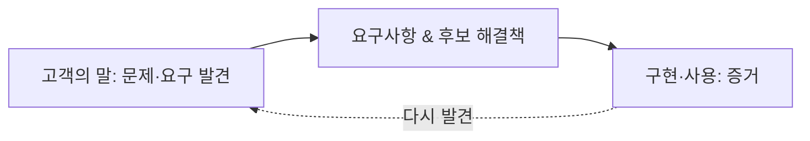

**강사 노트**

- 고객의 능력을 비판하는 의미가 아니다.
- 실제 사용 맥락, 숨어 있는 요구, 미래 상황을 처음부터 완전하게 표현하기 어렵다는 의미다.
- 초기에 표현된 요구를 가설로 보고 실제 사용과 피드백으로 정제해야 한다는 점을 설명한다.
- 명세의 품질과 실제 필요·가치의 타당성을 구분한다. "35. 요구사항 검증"에서 검토와 사용 증거의 역할을 연결한다.

---

## 03. 분석 원칙

요구사항을 **구분하고, 필요한 만큼 명세하고, 증거로 검토한다**.

- **구분한다** — 문제·요구·요구사항·해결책을 구분하고 표기보다 문제 이해를 먼저 한다.
- **필요한 만큼 명시한다** — 액터의 목표와 본질적인 이벤트 흐름을 쓰고, 규칙·제약·중요한 예외를 연결한다. 문서량이나 기능 분해를 목표로 하지 않는다.
- **증거로 검토한다** — 문서 승인을 타당성의 보증으로 보지 않고 구현·사용에서 얻은 증거로 판단을 수정한다.

- “배송지 변경 버튼을 만들어 달라”는 요청을 어떻게 분석하고, 어떤 정보를 더 묻고, 무엇으로 필요성을 확인할 것인가?

---

## 04. 문제·요구·요구사항·해결책

**요구**는 희망이나 필요일 수 있지만, **요구사항**은 이를 분석·구현·검증할 수 있는 형태로 구체화한 것이다.

**인용문**

"**필요와 그에 관련된 제약·조건**을 변환하거나 표현한 진술", "Statement that translates or expresses a need and its associated constraints and conditions.", ISO/IEC/IEEE 29148:2018, www

**인용문**

"요구사항은 **필요**를 사용할 수 있게 표현한 것이며 설계는 **해결책**을 사용할 수 있게 표현한 것이다", "A requirement is a usable representation of a need... a design is a usable representation of a solution.", IIBA, 2022

| 구분 | 핵심 질문 | 예 |
|---|---|---|
| **문제** | 무엇이 잘못되었거나 부족한가? | 출고 전 배송지를 고객이 직접 바꿀 수 없다 |
| **요구(Need)** | 무엇을 원하거나 필요로 하는가? | 고객이 직접 배송지를 바꾸고 싶다 |
| **요구사항** | 시스템이 무엇을 충족해야 하는가? | 출고 전 주문의 배송지 변경을 지원해야 한다 |
| **제약** | 반드시 지켜야 하는 조건은 무엇인가? | 출고 후에는 일반 변경을 허용하지 않는다 |
| **해결책** | 어떤 방식으로 충족할 것인가? | 웹, 앱, 상담 자동화 등 |

**강사 노트**

표의 "문제" 행은 교육용 가정이다. 실제 문제와 원인은 항상 요청자에게 직접 확인한다.

---

## 05. 요청에는 무엇이 섞여 있는가?

요청에 섞인 **문제·요구·요구사항·해결책**을 구분해 본다.

- “주문 상세 화면에 배송지 변경 버튼을 만들어 주세요.”
- "고객이 직접 배송지를 바꿀 수 없다"에서 **무엇을 모르는가?**

| 구분 | 내용 |
|---|---|
| 요청된 해결책 | 배송지 변경 버튼 |
| 문제 | 출고 전 배송지를 고객이 직접 수정할 수 없음 |
| 요구 | 고객이 직접 배송지를 변경하고 싶음 |
| 요구사항 | 출고 전 주문의 배송지 변경을 지원해야 함 |
| 제약 | 출고 이후 일반 변경 제한 |
| 후보 해결책 | 버튼, 편집 화면, 챗봇, 상담 자동화 등 |

---

## 06. 요구공학의 주요 활동

요구공학(Requirements Engineering)은 이해관계자의 요구를 **수집·분석·명세·검증하고 변경을 관리하는 공학 활동**이다.

### 다섯 가지 활동

- **요구 수집:** 이해관계자의 문제·목표·필요를 찾아낸다.
- **요구 분석:** 요구를 정제하고 관계·충돌·우선순위를 분석한다.
- **요구 명세:** 합의하고 검토할 수 있는 형태로 표현한다.
- **요구 검증:** 잘 작성되었는지, 실제 필요한 것인지 확인한다.
- **요구 관리:** 기준선·변경·추적·영향을 관리한다.

**강사 노트**

요구공학의 수집·분석·명세·검증·관리 활동을 연결한다.

이 다섯 활동은 수업의 설명 구조이며 표준의 절·분류를 그대로 옮긴 것이 아니다. 요구공학 표준의 범위는 [ISO/IEC/IEEE 29148:2018 공식 설명](https://www.iso.org/standard/72089.html), 반복적 요구 탐색은 Craig Larman의 [Evolutionary Requirements](https://www.craiglarman.com/wiki/downloads/applying_uml/larman-ch5-applying-evolutionary-requirements.pdf)를 근거로 한다.

---

## 07. 요구사항 수집과 발견

요구는 한 사람의 말이나 한 종류의 자료만으로 확정하지 않는다. 여러 출처에서 얻은 **증거를 교차검증**하며 발견하고 정제한다.

| 방법 | 발견에 유용한 정보 | 한계·주의 |
|---|---|---|
| 인터뷰 | 경험·목표·문제 | 말로 표현 가능한 것에 편향 |
| 워크숍 | 관점 차이·충돌·합의 | 참여자 구성의 영향 |
| 관찰 | 실제 업무·암묵지 | 시간·접근 비용 |
| 설문 | 넓은 집단의 경향 | 깊이 부족 |
| 문서 분석 | 규정·정책 | 실제 업무와 다를 수 있음 |
| 기존 시스템 분석 | 현재 동작·제약 | 기존 해결책에 사고가 고정될 수 있음 |
| 로그·데이터 분석 | 실제 행동의 증거 | 행동의 이유는 직접 설명하지 못함 |
| 프로토타입 | 숨어 있는 요구·사용 반응 | 해결책을 너무 일찍 고정할 위험 |

---

## 08. 디자인 싱킹·린 사고·Lean UX·애자일

디자인 싱킹, 린 사고, 린 사용자 경험, 애자일은 서로 다른 접근이지만 **요구와 해결책을 실제 증거로 검증**한다.

| 접근 | 핵심 질문 | 역할 |
|---|---|---|
| 디자인 싱킹(Design Thinking) | 실제로 풀어야 할 문제는 무엇인가? | 문제·숨어 있는 요구 발견 |
| 린 사고(Lean Thinking) | 실제 고객 가치인가? | 가치와 낭비 구분 |
| 린 사용자 경험(Lean UX) | 해결책 가설이 맞는가? | 가설·실험·결과 검증 |
| 애자일(Agile) | 작은 구현으로 무엇을 배울 것인가? | 점진적 구현과 빠른 피드백 |

**강사 노트**

표는 각 접근 전체의 정의가 아니라 요구 발견에 연결하는 교육용 비교다.

- 디자인 싱킹의 사람·기술·사업 관점과 반복적 검토: IDEO, [Design Thinking](https://designthinking.ideo.com/).
- 고객 가치·낭비·실험: Lean Enterprise Institute, [What is Lean?](https://www.lean.org/explore-lean/what-is-lean/).
- 가설·실험·학습의 구성: Jeff Gothelf·Josh Seiden, [Lean UX, 3rd Edition](https://www.oreilly.com/library/view/lean-ux-3rd/9781098116293/ch01.html), 2021, 출판사 공개 목차의 Chapters 10–12·15. 책 본문 전체를 인용하는 것이 아니다.
- 작동하는 소프트웨어의 잦은 전달·변화 수용·회고: [애자일 선언의 원칙](https://agilemanifesto.org/principles.html).

---

## 09. 요구사항 유형

요구사항은 이해관계자 요구사항에만 머물지 않는다. **사업 목적에서 해결책, 전환까지 연결**해서 본다.

### 개발 대상과 수준을 따라 요구를 구체화하기 (ISO 29148)

- 사업·임무 요구사항
- 이해관계자 요구사항
- 시스템 요구사항
- 소프트웨어 요구사항

### IIBA의 요구사항 분류

- 사업 요구사항
- 이해관계자 요구사항
- 해결책 요구사항
- 전환 요구사항

**강사 노트**

서로 다른 분류의 추상화 수준을 억지로 일대일 대응시키지 않는다.

앞의 수준 목록은 사업·임무에서 시스템과 소프트웨어로 요구를 구체화하는 수업용 연결이다. ISO의 완전한 유형 목록으로 제시하지 않는다. 수준 간 요구 도출은 NASA [Systems Engineering Handbook, §4](https://www.nasa.gov/reference/4-0-system-design-processes/)의 이해관계자 기대→기술 요구 및 하위 수준 전개를 참조한다. IIBA의 네 유형과 해결책 요구의 하위 분류는 [The Business Analysis Standard, 4.4.2](https://www.iiba.org/knowledgehub/the-business-analysis-standard/4-implementing-business-analysis/4-4-understanding-requirements-and-designs/)에서 확인한다. 두 관점은 목적이 달라 일대일 대응시키지 않는다.

---

## 10. 좋은 요구사항의 자격요건

ISO/IEC/IEEE 29148:2018은 **개별 요구사항의 특성**과 **요구사항 집합의 특성**을 구분해 정의한다. 문장 하나의 품질과 집합 전체의 품질은 서로 다른 기준으로 검토한다.

### 개별 요구사항의 특성

| 특성 | 의미 |
|---|---|
| 필요함 | 없으면 결함이 되는, 반드시 있어야 하는 능력·특성을 기술하는가 |
| 적절함 | 이해관계자에 맞는 추상화 수준이며 불필요한 제약·구현 세부사항을 넣지 않는가 |
| 명확함 | 하나로만 해석되도록 명확하게 서술했는가 |
| 완전함 | 이해에 필요한 정보를 그 서술 안에 모두 담았는가 |
| 단일함 | 하나의 능력·특성만 기술하는가 |
| 실현 가능함 | 주어진 제약 안에서 수용 가능한 위험으로 실현할 수 있는가 |
| 검증 가능함 | 충족 여부를 증명·측정할 수 있게 서술했는가 |
| 정확함 | 실제 필요를 정확히 반영하는가 |
| 형식 준수 | 합의된 서식·표현 규칙을 따르는가 |

### 요구사항 집합의 특성

- **완전함** — 해결책에 필요한 요구를 모두 포함하는가?
- **일관됨** — 요구 사이에 충돌이 없고 용어가 일관되는가?
- **실현 가능함** — 전체를 함께 고려해도 제약 안에서 실현할 수 있는가?
- **이해 가능함** — 관련 이해관계자가 이해할 수 있는가?
- **타당성 확인 가능함** — 실제 이해관계자 의도와 맞는지 확인할 수 있는가?

### 비교 예

- 위반 사례: `배송지를 신속하게 변경한다.` — **명확함·검증 가능함** 위반이다. `신속하게`가 측정 조건 없이 해석에 따라 달라진다.
- 개선 방향: 변경 가능한 주문 상태, 변경 결과를 확인할 주체, 결과 통지 조건을 명시한다. 응답 시간 목표는 측정 조건과 함께 합의해 검증 가능하게 만든다.

**강사 노트**

- 근거: ISO/IEC/IEEE 29148:2018, §5.2(개별 요구사항 및 요구사항 집합의 특성).
- 9가지·5가지를 매번 기계적으로 전부 채점하지 않는다. 문제가 되는 특성을 짚어 설명하는 도구로 쓴다.
- 근거 없이 응답 시간 숫자를 넣는 것으로 검증 가능성을 가장하지 않는다.

---

## 11. 요구사항은 언제 확정되는가?

문서의 승인과 요구의 타당성은 다르다. 승인된 요구사항도 실제 사용에서 **올바른 요구였는지 다시 검증**해야 한다.

### 앞에서 충분히 확정할 수 있다는 기대

- 모든 단계를 앞에서 한 번에 확정하고 순서대로 진행할 수 있다는 기대다.
  - 수집 → 분석 → 명세 → 승인 → 설계 → 구현

### 반복적인 학습

- 실제 사용과 관찰에서 얻은 학습을 요구 재검토로 되돌린다.

**도식 — Mermaid**

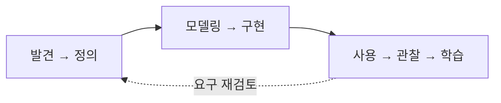

**강사 노트**

프로토타입, 디자인 싱킹, 린 사용자 경험, 애자일이 요구 발견과 연결되는 이유를 설명한다.

---

## 12. 유스케이스란 무엇인가?

유스케이스(Use Case)는 기능을 나열하는 단위가 아니라, 액터(Actor)가 목표를 달성해 **가치 있는 결과를 얻는 시스템 사용 단위**다.

**인용문**

"시스템과의 대화에서 이루어지는, **행위적으로 연관된 일련의 트랜잭션**", "a behaviorally related sequence of transactions in a dialogue with the system", Ivar Jacobson, 1992(Biddle·Noble·Tempero, 2001 재인용)

**인용문**

"유스케이스는 대상 시스템이 수행하는 일련의 행위를 명세하며, 하나 이상의 액터 또는 이해관계자에게 **가치 있는 관찰 가능한 결과**를 만든다", "A UseCase specifies a set of actions performed by its subjects, which yields an observable result that is of value for one or more Actors or other stakeholders of each subject.", Object Management Group, 2017, www

- 통합 모델링 언어(UML)에서 유스케이스는 **타원**으로 표시한다.

**도식 — PlantUML**


**강사 노트**

- 위 1992년 책의 문구는 Biddle 등의 논문에 재수록된 부분을 확인했다. 원서 페이지를 직접 확인하지 않았으므로 페이지 번호를 추정하지 않는다.
- Jacobson은 [Use Cases — Yesterday, Today, and Tomorrow](https://web.archive.org/web/20221229212011id_/http://download.boulder.ibm.com/ibmdl/pub/software/dw/rationaledge/mar03/UseCases_TheRationalEdge_Mar2003.pdf), The Rational Edge, 2003-03, “How Many Use Cases Is Enough?”에서 특정 액터에게 측정 가능한 가치를 제공한다는 기준을 1994년에 추가했다고 직접 설명한다. 첨부 검토서의 1995년 책 문장 전체와 정확한 귀속은 이번 확인 자료로 확정하지 않았다.
- 대화는 액터와 시스템의 외부 상호작용을 뜻한다. 의미 없는 요청·처리 반복을 피한다는 작성 원칙을 상호작용 자체의 금지로 확대하지 않는다.
- 액터·시스템 경계·연관은 이후 주제에서 단계적으로 설명한다.

---

## 13. 왜 유스케이스가 필요한가?

유스케이스는 시스템을 기능 목록으로 분해하기보다, 액터의 **목표와 가치**를 중심으로 시스템이 제공해야 할 책임을 파악하는 데 사용한다.

- **기능 중심**: 등록, 조회, 수정, 삭제
- **목표 중심**: 주문한다, 주문을 취소한다, 배송지를 변경한다, 배송 상태를 확인한다

기능 목록만으로는 **누가·왜·어떤 목표로 사용하는지, 어떤 결과가 가치 있는지, 시스템 책임은 어디까지인지** 알기 어렵다.

---

## 14. 유스케이스 작성 절차

유스케이스는 **시스템의 범위와 사용자 목표를 식별한 다음 이벤트 흐름과 규칙을 상세화**한다. 필요하면 앞 단계로 되돌아간다.

1. 대상 시스템을 정의한다.
2. 목표와 그 목표를 가진 액터를 함께 식별한다.
3. 목표 수준의 유스케이스 후보를 식별한다.
4. 액터와 유스케이스로 초안 유스케이스 다이어그램을 작성한다.
5. 유스케이스의 기본 이벤트 흐름을 작성한다.
6. 필요한 규칙·제약·예외 정책을 별도로 식별한다.
7. 사전조건·사후조건·비즈니스 규칙 등 필요한 내용을 상세화한다.
8. 상세화 결과를 반영해 유스케이스 다이어그램을 정제한다.
9. 중요한 시스템 이벤트에서 시스템 오퍼레이션을 식별한다.
10. 필요하면 중요하고 복잡한 시스템 오퍼레이션의 계약을 작성한다.
11. 전체 요구와 유스케이스를 검토하고 정제한다.

**강사 노트**

절대적인 순차 절차가 아니다. 실제 분석에서는 필요한 만큼 앞뒤로 반복한다.

---

## 15. 대상 시스템과 경계

**시스템 경계**를 명확히 해야 무엇을 시스템이 책임지고, 무엇을 외부 액터가 담당하는지 구분할 수 있다.

### 질문

+ 지금 분석하는 대상 시스템은 무엇인가?

**도식 — PlantUML**

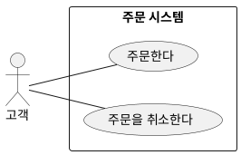

- 경계 사각형의 **상단 안쪽에 시스템 명칭**을 표시한다.
- 경계 안에는 분석 대상 시스템의 유스케이스를 둔다.
- 경계 밖에는 액터를 둔다.

**강사 노트**

이 요구분석 경계를 최종 배포·아키텍처 경계와 동일시하지 않는다.

---

## 16. 목표와 액터

액터를 먼저 나열하기보다, 먼저 **달성해야 할 목표**를 식별하고 그 목표를 가진 역할을 액터로 찾는다.

- **어떤 가치 있는 목표를 달성해야 하는가? 그 목표를 원하는 역할은 누구인가?**
- 액터는 시스템과 상호작용하는 외부 **역할**이다. 주 액터는 목표 달성에 시스템을 쓰고, 지원 액터는 필요한 외부 서비스를 제공한다.

| 목표 | 주 액터 |
|---|---|
| 주문한다 | 고객 |
| 주문을 취소한다 | 고객 |
| 배송 상태를 확인한다 | 고객 |

**도식 — PlantUML**

```plantuml:usecase
@startuml
left to right direction
actor "고객" as Customer
@enduml
```

**강사 노트**

주 액터의 목표를 출발점으로 삼되 지원 액터를 빠뜨리지 않는다. 근거: OMG [UML 2.5.1](https://www.omg.org/spec/UML/2.5.1/PDF), §18.1.3.1; Craig Larman, [Applying UML and Patterns, Chapter 6](https://www.craiglarman.com/wiki/downloads/applying_uml/larman-ch6-applying-evolutionary-use-cases.pdf), §6.6.

---

## 17. 유스케이스 후보 식별

유스케이스 후보는 기능 메뉴가 아니라 **액터의 목표와 외부에서 확인할 수 있는 가치**를 기준으로 식별한다.

- 액터에게 **의미 있는 결과**인가?
- 하나의 **목표**를 표현하는가?
- 결과의 **가치**를 외부에서 확인할 수 있는가?

### 예

- 주문한다
- 주문을 취소한다
- 배송지를 변경한다
- 배송 상태를 확인한다

**페이지 분할**

### 기계적인 기능 분해의 반례

- CRUD 목록을 목표·가치 확인 없이 그대로 유스케이스로 채택한 반례다.

- 회원 등록, 회원 조회, 회원 수정, 회원 삭제 (CRUD)

`회원 등록`이 실제 가치 있는 목표를 표현하면 후보가 될 수 있다. 명칭만으로 판단하지 않는다.

---

## 18. 유스케이스 다이어그램 — 초안

초안에서는 **액터·유스케이스·시스템 경계·연관**만으로 전체 시스템의 사용 구조를 단순하게 파악한다.

**도식 — PlantUML**

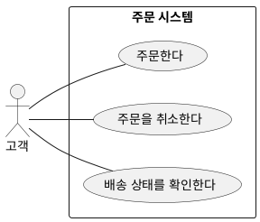

- 포함(`<<include>>`)과 확장(`<<extend>>`) 관계는 이 단계에서 넣지 않는다.

---

## 19. 유스케이스 명세서 템플릿

유스케이스 명세는 서식을 채우기 위한 문서가 아니라, **목표·조건·행위·결과를 명확히 해 검토와 합의를 가능하게 하는 수단**이다.

| 항목 | 설명 |
|---|---|
| **유스케이스명** | 액터가 달성하려는 목표 |
| **주 액터** | 목표 달성의 주체 |
| **범위(대상 시스템)** | 분석 대상 시스템 |
| **수준** | 사용자 목표 수준 등 |
| **이해관계자와 관심사** | 결과에 영향을 받는 이해관계자와 기대 |
| **사전조건** | 유스케이스 시작 전에 참이어야 하는 조건 |
| **성공 사후조건** | 성공했을 때 참이어야 하는 상태 |
| **기본 이벤트 흐름** | 정상적으로 목표를 달성하는 본질적인 흐름 |
| **비즈니스 규칙·제약** | 이벤트 흐름과 별도로 적용되는 규칙 |
| **예외 정책** | 정말 필요한 경우 별도로 정의하는 예외 처리 정책 |
| **특별 요구사항** | 품질속성 등 별도의 요구 |

**강사 노트**

모든 유스케이스에 모든 항목을 기계적으로 채우지 않는다.

---

## 20. 기본 이벤트 흐름

기본 이벤트 흐름에는 **본질적인 행위만** 남긴다.

### 유스케이스: 주문을 취소한다

**결제 완료·배송 전 전체 취소**가 허용되고 전액 환불되는 성공 경로다.

1. 고객이 주문을 취소한다.
2. 환불이 처리된다.
3. 고객은 주문 취소 결과를 확인한다.

### 작성 원칙

- 액터의 **목표와 의도**를 중심으로 **본질적인 행위만** 쓴다.
- 동일한 의미·결과의 반복이나 화면 클릭 순서를 쓰지 않는다.
- 의미 없는 `요청→처리` 반복은 피하되 필요한 의도·응답은 표현한다.
- 내부 구현의 확인·계산·저장·호출은 나열하지 않되, 경로를 바꾸는 판단은 외부 행위로 표현한다.
- 설계 내용(클래스·객체·메서드)이나 가능한 모든 경우를 넣지 않는다.

**강사 노트**

`시스템이 주문을 확인한다`, `시스템이 취소 가능 여부를 판단한다`와 같은 내부 처리 단계는 넣지 않는다.

---

## 21. 규칙·제약·예외 정책

이벤트 흐름에 가능한 모든 조건과 실패를 나열하지 않는다. **규칙·제약·예외 정책은 필요할 때 별도로 분리해 기술**한다.

### 비즈니스 규칙 예

- 배송 시작 이후에는 주문을 취소할 수 없다.
- 특정 상품은 취소가 제한될 수 있다.
- 부분 취소의 허용 조건을 정의한다.

### 제약 예

- 결제 완료 이후 취소는 환불 처리와 연결되어야 한다.
- 법률·계약·정책상 취소 제한이 있을 수 있다.

### 예외 정책 예

- 정말 중요한 경우에만 별도로 정의한다.

- 예를 들어 환불 실패가 핵심 업무 위험이라면 **환불 실패 정책**으로 별도 정의할 수 있다.

**강사 노트**

방어 코딩 수준의 모든 예외를 유스케이스에 기록하지 않는다.

---

## 22. 이벤트 흐름을 이용한 요구 분석

좋은 이벤트 흐름은 내부 처리 단계를 늘리는 것이 아니라, 목표 달성 과정에서 추가로 확인해야 할 중요한 질문을 드러낸다.

- "20. 기본 이벤트 흐름"을 출발점으로 적용 범위를 넓혀 보며 질문한다. 예시의 전제가 실제 요구 전체를 대표한다고 가정하지 않는다.

- 주문을 취소할 수 있는 범위는 어디까지인가?
- 환불은 항상 필요한가?
- 부분 취소가 필요한가?
- 고객에게 어떤 취소 결과를 제공해야 하는가?
- 주문 취소가 다른 업무에 어떤 영향을 주는가?

**도식 — Mermaid**

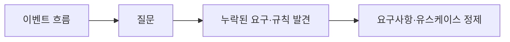

---

## 23. 유스케이스 상세화

유스케이스 상세화는 문서량을 늘리는 작업이 아니라, **조건·규칙·결과의 의미를 필요한 수준까지 명확히 하는 작업**이다.

### 주문을 취소한다

- "20. 기본 이벤트 흐름"과 동일한 결제 완료·배송 시작 전 주문의 전체 취소 성공 경로를 상세화한 예다.

| 항목 | 내용 |
|---|---|
| 유스케이스명 | 주문을 취소한다 |
| 주 액터 | 고객 |
| 범위(대상 시스템) | 주문 시스템 |
| 사전조건 | 고객 소유의 결제 완료 주문이며 배송 시작 전이다 |
| 기본 이벤트 흐름 | 주문 취소 → 환불 처리 → 결과 확인 |
| 성공 사후조건 | 주문이 취소 상태이고, 결제 금액 전액의 환불이 완료된다 |
| 비즈니스 규칙 | 배송 시작 이후에는 일반 취소를 허용하지 않는다 |
| 특별 요구사항 | 미정 — 취소 결과 통지 시간, 권한 확인 기준, 결과 확인 방식에 대한 요구를 확인한다 |

### 기본 흐름과 다른 경로를 구분하는 예

- 미결제 주문도 취소 대상이면 환불 없이 결과를 확인하는 대안 흐름을 추가할 수 있다.
- `배송 시작 이후 일반 취소 불가`는 흐름이 아니라 규칙으로 기록한다.

### 의미 있는 예외 흐름의 예

- **이 예외 설명에만 추가한 교육용 가정**이다: 취소 처리 중 환불이 실패하면 완료로 안내하지 않고, 미완료 결과와 후속 문의 방법을 안내한다.

- 환불이 완료되지 않는다.
- 고객에게 취소·환불이 완료되지 않았음과 후속 문의 방법이 안내된다.
- 이 경로는 성공 사후조건을 충족하지 않은 채 종료한다.

- **예외 정책**은 실패 시 지켜야 할 원칙이고, **예외 흐름**은 그때 달라지는 외부 행위·결과다. 내부 재시도 코드까지 나열하지 않는다.
- 남길 주문 상태, 재시도·보상·문의 담당자는 추가 정책 확인 대상이다.

**강사 노트**

- 표는 성공 경로, 추가한 예외 흐름은 실패 결과의 예다. 예외의 교육용 가정을 확정 업무 정책으로 승격하지 않는다. 실패 시 주문 상태와 복구 방식은 별도 확인 대상이다.
- 미결제 주문 지원은 확정된 요구가 아니라, 새로운 요구가 확인될 때 대안 흐름을 추가하는 예다.

---

## 24. 유스케이스 다이어그램 — 상세화

포함·확장·일반화는 상세화로 확인된 **행위의 결합 또는 분류 관계**를 표현한다. 실행 순서를 그리는 화살표가 아니다.

| 관계 | 의미와 성립 조건 | 표기 방향 |
|---|---|---|
| 포함 | 포함 지점에서 필요한 별도 유스케이스의 행위를 삽입한다. 내부 함수라는 이유로 분리하지 않는다 | 기본 → 포함 대상, 점선 열린 화살촉과 `<<include>>` |
| 확장 | 독립적으로 의미가 있는 기본 유스케이스의 확장 지점에 행위를 삽입한다. 조건이 지정되면 그 조건을 따른다 | 확장 → 기본, 점선 열린 화살촉과 `<<extend>>` |
| 일반화 | 특수 요소가 일반 요소의 의미·행위를 이어받는 분류 관계다 | 특수 → 일반, 실선 속 빈 삼각형 |

### 포함 관계 예

- `결제를 확인한다`가 포함으로 분리되는 이유는 내부 함수가 아니라 **외부 결제 시스템과의 상호작용**이기 때문이다.

- `주문한다`는 결제 확인 행위를 포함해야 완료된다.
  - 예: 결제 확인은 외부 `결제 시스템` 액터와 상호작용한다.

**도식 — PlantUML**

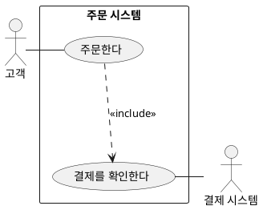

### 확장 관계 예

- 다음은 표기 설명을 위한 **교육용 가정**이다.

- `주문한다`는 쿠폰 없이도 완료된다.
  - 예: 유효한 쿠폰 요청이 있으면 `최종 금액 확정 전`에 쿠폰을 적용한다.

**도식 — PlantUML**

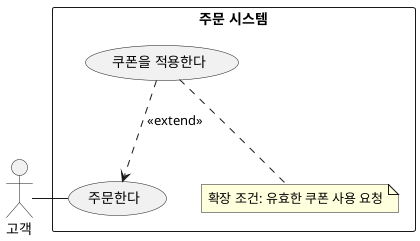

### 일반화 예

- 의미·행위를 모두 이어받을 때만 일반화를 쓴다.

- 기업 고객·VIP 고객이 `주문한다`를 모두 이어받는다고 가정한다.
  - 예: 이후 한도·혜택 등 요건이 붙을 수 있다.

**도식 — PlantUML**

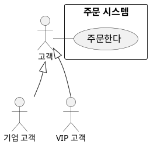

**강사 노트**

- 포함·확장은 코드 재사용이나 함수 호출을 나타내지 않는다. 확장은 조건을 생략할 수도 있으므로 UML 자체를 “항상 조건부 실행”으로 정의하지 않는다.
- 관계 의미와 표기 근거: OMG [UML 2.5.1](https://www.omg.org/spec/UML/2.5.1/PDF), §18.1.3.2–18.1.3.3, §18.1.4, §9 Classifiers.
- 학습자는 화살표 방향뿐 아니라 위 전제가 없다면 관계를 그리지 않아야 한다는 점까지 설명한다.

---

## 25. 잘못된 유스케이스 다이어그램

유스케이스 다이어그램은 **기능 분해도·업무 순서도·프로그램 호출 그래프**를 대신하는 표기법이 아니다.

### 피해야 할 표현

- 주문 관리 → 주문 등록 → 주문 조회 → 주문 수정 → 주문 삭제
- 로그인 → 상품 조회 → 상품 선택 → 결제 → 완료
- 일반 화살표로 유스케이스 호출 순서를 표현
- 화면 메뉴 구조를 그대로 유스케이스로 표현
- 내부 프로그램 기능을 유스케이스로 세분화
- 공통 코드라는 이유만으로 `<<include>>`를 사용
- 선택 기능이라는 이유만으로 무조건 `<<extend>>`를 사용

---

## 26. 시스템 오퍼레이션과 계약

시스템 오퍼레이션은 시스템 경계를 넘어 들어오는 **의미 있는 이벤트에 응답하는 시스템의 책임**이다. 내부 객체의 메서드나 API를 먼저 정하는 것이 아니며, 유스케이스 하나에는 여러 오퍼레이션이 있을 수 있다.

### 식별 기준

- 시스템 경계를 넘는 업무 의미의 이벤트를 찾는다.
- `배송지 변경`처럼 의미와 결과를 표현하며, 화면 조작·내부 함수 호출과 구분한다.
- 조건·상태 변화가 중요한 오퍼레이션에는 계약을 작성한다.

**페이지 분할**

### 오퍼레이션 계약 — 배송지 변경

고객 소유의 출고 전 주문으로 범위를 한정한다. 새 주소는 유효하며 배송비·결제 금액에 영향을 주지 않는다고 가정한다. 아래 **성공 사후조건**은 `주소 검증 → DB 저장 → 응답` 같은 처리 순서가 아니라 성공 후 참이어야 하는 상태이며, 이 표는 성공 계약만 다룬다.

| 항목 | 내용 |
|---|---|
| 오퍼레이션 | 배송지 변경 |
| 관련 유스케이스 | 배송지를 변경한다 |
| 입력의 의미 | 변경할 주문과 새 배송지 |
| 사전조건 | 주문이 존재하고 고객 소유이며 출고 전이다. 새 주소는 유효하며 위 교육 예시의 범위에 속한다 |
| 성공 사후조건 | 해당 주문의 배송지가 지정한 새 주소다. 주문 식별 정보·상품·결제 금액은 변경 전과 같다 |
| 관찰 가능한 결과 | 고객이 변경된 배송지를 확인할 수 있다 |

**강사 노트**

- 사전조건이 참인 호출의 정상 완료에서 사후조건이 성립한다는 계약 의미는 OMG [UML 2.5.1](https://www.omg.org/spec/UML/2.5.1/PDF), §9.6.3.1에 근거한다. 위 표는 수업용 시스템 수준 예시이며 표준 템플릿이 아니다.
- 유스케이스와 오퍼레이션 계약의 연결은 Craig Larman, [Applying UML and Patterns, Chapter 6](https://www.craiglarman.com/wiki/downloads/applying_uml/larman-ch6-applying-evolutionary-use-cases.pdf), Figure 6.1을 참조한다.
- 주문 취소·환불처럼 여러 결과가 걸린 계약은 성공의 범위와 시점을 먼저 정한다. 일부 상태 변화만 적고 전체 성공 계약으로 취급하지 않는다.
- 이 표는 성공 계약이다. 실패·인증 등 관련 유스케이스의 나머지 행위를 완전히 명세한 것은 아니다.

---

## 27. 정적·동적 모델을 통한 상세화

유스케이스(**행위 관점**)만으로는 부족하다. 정적·동적 모델이 **문제영역의 의미·관계·상태 변화**를 검토해 경계와 객체 책임을 결정한다.

**도식 — Mermaid**

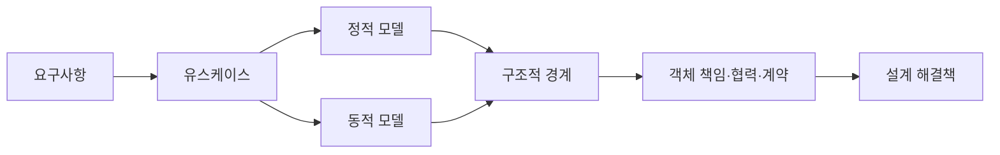

### 정적·동적 모델이 답하려는 질문

- 정적 모델은 문제영역의 의미·관계·제약을, 동적 모델은 상호작용과 상태 변화의 사건·규칙을 다룬다.

**강사 노트**

`명사 → 클래스` 식으로 기계적으로 변환한다는 의미가 아니다. S03과 S04에서 각각 본격적으로 다룬다.

---

## 28. 유스케이스와 품질속성

유스케이스가 어떤 결과를 제공하는지 설명한다면, **품질 요구**는 그 결과를 어떤 조건에서 어느 수준으로 제공해야 하는지 보완한다.

**인용문**

"제품 품질 모델은 제품의 품질을 **명세·측정·평가**하는 기준을 제공한다", ISO/IEC 25010:2023, www

아래 표는 검토 질문을 만드는 교육 예시다. 근거 없이 측정 수치나 서비스 수준을 확정하지 않는다.

| 품질 관점 | 요구 후보 | 검증 가능하게 만들기 위한 질문 |
|---|---|---|
| 응답 성능 | 주문 조회가 신속하게 완료된다 | 부하·데이터량·측정 구간·허용 지연은? |
| 장애 대응 | 일시적 결제 장애로 주문이 유실되지 않는다 | 유실의 정의, 복구 결과와 허용 시간은? |
| 접근 통제 | 다른 고객의 주문을 조회할 수 없다 | 어떤 역할·접근 경로·예외 권한을 검사하는가? |
| 사용 편의 | 모바일에서도 배송지를 변경할 수 있다 | 대상 기기·사용자·과업 성공 기준은? |
| 변경 용이성 | 배송 정책 변경의 영향을 제한한다 | 어떤 변경을 어떤 비용·영향 범위로 수용하는가? |

---

## 29. 프로토타입·와이어프레임

프로토타입과 와이어프레임은 화면을 확정하기 전에 **사용자가 과업을 이해하고 수행하는지 관찰해 숨은 요구와 잘못된 가정을 발견하는 도구**다.

### 배송지 변경 와이어프레임

"26. 시스템 오퍼레이션과 계약"의 성공 계약을 검토하기 위한 화면 초안이다. 교육용 주소 A·B는 실제 주소가 아니다. 버튼·화면 구성은 해결책 후보이며 확정된 요구사항이 아니다.

**도식 — SVG**

```svg
<svg xmlns="http://www.w3.org/2000/svg" width="900" height="340" viewBox="0 0 900 340" role="img" aria-label="주문 상세와 배송지 변경 와이어프레임">
<style>text{font-family:sans-serif;fill:#182230;font-size:20px}.title{font-size:24px;font-weight:700}.box{fill:white;stroke:#526070;stroke-width:2}.button{fill:#edf2f6;stroke:#526070;stroke-width:2}</style>
<rect width="900" height="340" fill="#f6f8fa"/>
<rect class="box" x="20" y="20" width="410" height="300" rx="8"/>
<text class="title" x="45" y="60">주문 상세</text>
<text x="45" y="105">주문: 예시 주문 A</text><text x="45" y="145">상태: 출고 전</text>
<text x="45" y="185">배송지: 기존 주소 A</text>
<rect class="button" x="100" y="235" width="240" height="50" rx="4"/><text x="162" y="268">배송지 변경</text>
<rect class="box" x="470" y="20" width="410" height="300" rx="8"/>
<text class="title" x="495" y="60">배송지 변경</text><text x="495" y="105">현재 주소: 기존 주소 A</text>
<text x="495" y="145">새 배송지</text><rect class="box" x="495" y="160" width="355" height="45"/><text x="510" y="190">새 주소 B</text>
<rect class="button" x="525" y="235" width="120" height="50" rx="4"/><text x="565" y="268">변경</text>
<rect class="button" x="695" y="235" width="120" height="50" rx="4"/><text x="735" y="268">취소</text>
</svg>
```

정적 와이어프레임만으로 실제 처리나 성공을 검증할 수는 없다. 사용자에게 과업을 설명하게 하거나 조작 가능한 프로토타입으로 관찰한다.

**페이지 분할**

### 확인할 질문

- 출고 직전 변경 가능 여부와 유효 주소 기준·오류 안내는 무엇인가?
- 배송비 변동이나 이미 외부 배송 시스템에 전달된 경우는 어떻게 하는가?
- 실패 시 기존 주소 유지 여부와 변경 완료 확인 방법은 무엇인가?

관찰한 혼란·누락을 요구사항과 계약에 반영한다. 새 주소·배송비·실패 정책을 화면만 보고 임의로 결정하지 않는다.

**강사 노트**

와이어프레임은 본문에 내장한 SVG 원본으로 제공한다. Production은 이를 실제 visual로 렌더한다. 현재 원고 검토에서는 화면에 담긴 의미와 검증 질문을 확인한다.

---

## 30. 사용자 스토리

사용자 스토리(User Story)는 요구사항 문서가 아니라, 사용자 관점에서 **작은 가치 단위**를 표현해 대화를 시작하는 수단이다.

### 표현 예

> 사용자로서 나는 `<목표>`를 원한다. 왜냐하면 `<가치>`를 얻고 싶기 때문이다.

### 예

> 고객으로서 출고 전 배송지를 변경하고 싶다. 올바른 장소에서 상품을 받고 싶기 때문이다.

### 핵심

- 세부 내용은 대화와 인수 조건으로 구체화한다.
- 반복적인 개발과 우선순위 관리에 적합하다.

- 형식 문장 자체보다 **카드·대화·확인**이 중요하다. 위 문형은 표현 예이며 필수 표준 양식이 아니다.

**인용문**

"사용자 스토리는 **카드, 대화, 확인** 세 요소로 이루어진다", "Card, Conversation, Confirmation", Ron Jeffries, 2001

---

## 31. 사용자 스토리의 강점과 한계

사용자 스토리는 작은 가치 단위의 대화와 우선순위 결정에 유용하다. 전체 목표와 여러 스토리에 걸친 조건은 함께 검토해야 한다.

| 강점 | 한계 |
|---|---|
| 작은 가치 단위 | 전체 사용 흐름이 약해질 수 있음 |
| 반복적 개발에 적합 | 중요한 조건이 누락될 수 있음 |
| 이해관계자 대화 촉진 | 여러 스토리의 전체 목표가 흩어질 수 있음 |
| 변경 수용 용이 | 상세 요구사항을 별도로 보완해야 함 |

---

## 32. 행위 주도 개발

행위 주도 개발(BDD)은 **구체적인 예로 기대 행위를 합의하고 검증과 연결하는 협업 방식**이다.

### BDD 템플릿

- **Given** — 시작 조건: 어떤 상태·전제에서 시작하는가?
- **When** — 행위: 액터가 무엇을 하는가?
- **Then** — 결과: 어떤 관찰 가능한 결과가 성립해야 하는가?

문법만으로 완성되지 않는다. 규칙을 함께 발견하고 구현에 연결한다.

| 활동 | 확인하는 것 |
|---|---|
| 함께 발견 | 어떤 규칙과 예가 필요한가, 아직 무엇을 모르는가? |
| 예로 명세 | 같은 조건·행위·결과를 이해하는가? |
| 자동화와 구현 | 합의한 예가 실제 시스템 행위와 일치하는가? |

**페이지 분할**

**인용문**

"행위 주도 개발은 여러 역할 간 협업을 통해 해결할 문제에 대한 **공통 이해**를 만들어 업무 담당자와 기술 담당자의 간극을 좁히는 소프트웨어 팀의 협업 방식이다", "BDD is a way for software teams to work that closes the gap between business people and technical people by encouraging collaboration across roles to build shared understanding of the problem to be solved.", Cucumber

### 배송지 변경의 성공 예 (Given-When-Then)

"26. 시스템 오퍼레이션과 계약"의 전제(출고 전)를 사용한다.
+ **Given** 고객 소유의 주문 A가 출고 전이고 배송지는 주소 A, 새 주소 B는 유효하다.
+ **When** 고객이 주문 A의 배송지를 주소 B로 변경한다.
+ **Then** 주문 A의 배송지는 주소 B이고, 주문 식별 정보·상품·결제 금액은 변경 전과 같다.

---

## 33. 행위 주도 개발의 강점과 한계

행위 주도 개발은 행위를 구체적으로 확인하는 데 유용하지만 목표와 요구사항 구조 전체를 대체하지는 않는다.

| 강점 | 한계 |
|---|---|
| 구체적인 예 | 전체 목표가 약해질 수 있음 |
| 검증 가능 | 예제가 지나치게 많아질 수 있음 |
| 자동화된 인수 테스트 연결 | 화면·구현 세부사항에 종속될 위험 |
| 공통 이해 | 전체 요구 구조를 대체하지 못함 |

---

## 34. 유스케이스·사용자 스토리·BDD

유스케이스·사용자 스토리·행위 주도 개발을 반드시 순서대로 도입할 필요는 없다. 일부 목적이 겹치지만 강조점이 다르다. **사용자 목표·작은 가치 단위·구체적인 행위와 검증** 중 필요한 관점에 맞춰 선택하거나 연결한다.

| 질문 | 적합한 기법 |
|---|---|
| 액터가 어떤 **목표**를 달성하는가? | 유스케이스 |
| 작은 **가치 단위**로 무엇을 제공할 것인가? | 사용자 스토리 |
| 이 행위를 구체적으로 **어떻게 검증**할 것인가? | 행위 주도 개발(BDD) |

**도식 — Mermaid**

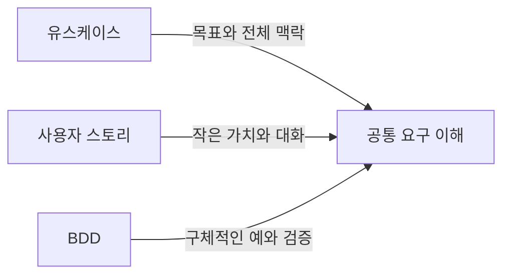

---

## 35. 요구사항 검증

요구사항의 **명세 품질**과 실제 문제 해결의 **타당성**을 함께 검토한다.

### 문서 수준에서 확인할 수 있는 것

- 구현·검증 가능한가?
- 명확·완전·일관적인가?

### 실제 사용에서 확인해야 하는 것

- 실제로 사용하며 문제를 해결하는가?
- 기대한 가치와 예상 못한 문제가 있는가?

**도식 — Mermaid**

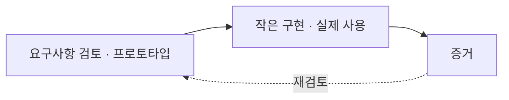

**강사 노트**

이해관계자 검토·모델·프로토타입으로 개발 전에도 필요와 적합성을 확인할 수 있고, 배포 후에는 실제 사용과 결과로 가정을 다시 평가한다. 명세 자체의 품질 검증과 실제 가치의 타당성 확인을 구분하되, 타당성 확인을 배포 이후로만 미루지 않는다. NASA [Systems Engineering Handbook, Appendix C](https://www.nasa.gov/reference/appendix-c-how-to-write-a-good-requirement/), C.3–C.4의 요구 검토 질문을 참조한다.

---

## 36. 요구사항 관리

요구사항 관리는 변경을 막는 활동이 아니라, 무엇이 왜 바뀌었고 어디까지 영향을 주는지 **변경의 이유와 영향을 통제하는 활동**이다.

### 관리 대상

- 기준선, 변경, 우선순위, 상태
- 버전, 의존성, 영향분석, 추적

### 질문

- 무엇이 언제·왜 바뀌었고 무엇에 영향을 주는가?
- 누가 결정했는가?
- 관련 요구·설계·코드·테스트는 무엇인가?

---

## 37. 요구사항 추적

추적성은 **기준선 요구의 누락**과 **근거 없는 임의 추가** 양방향을 통제한다.

**도식 — Mermaid**

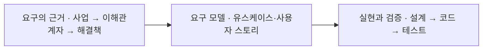

- **아래 방향** — 기준선 요구가 설계·구현·테스트에서 빠지지 않았는가?
- **위 방향** — 설계·코드·테스트가 어떤 요구에 근거하는가?
- 기능 요구와 코드를 일대일 대응시키지 않는다.
- 근거·영향을 기록하고 필요하면 기준선을 갱신한다.

**인용문**

"추적성은 원래의 **이해관계자 요구**에서 **실제 구현된 해결책**까지 요구사항과 설계 사이의 관계를 추적하는 능력이다", "The ability for tracking the relationships between requirements and designs from the original stakeholder need to the actual implemented solution.", IIBA, 2022

---

## 38. 요구사항에서 학습으로

요구사항은 개발 이전에 확정해 넘기는 입력이 아니라, **구현과 실제 사용에서 얻은 증거를 통해 계속 학습되고 수정되는 대상**이다.

**도식 — Mermaid**

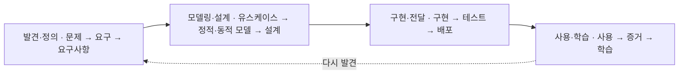

**강사 노트**

이 장에서 S02의 전체 메시지를 닫는다. 이후 구현·검증·DevOps 단계에서도 이 피드백은 계속 이어진다.

---

## 39. 실습 — 모델로 바꾸기

요청된 버튼을 그대로 유스케이스로 삼지 않고, 문제·요구·제약·목표·시스템 책임을 구분해 요구 모델을 만든다.

> “정기배송 고객에게 다음 배송을 건너뛸 수 있는 버튼을 만들어 주세요.” (조건: 48시간 전까지만 가능, 연속 2회 초과 불가, 결제 승인 건 별도 처리, 다음 배송일 안내 필요)

- **과제**
  - (1) 문제·요구·요구사항·제약·해결책
  - (2) 목표·주 액터·유스케이스
  - (3) 기본 흐름·규칙·시스템 오퍼레이션
  - (4) 품질 요구사항
  - (5) 아직 모르는 것과 검증 방법

- **진행** — 개인 작성 → 소그룹 비교 → 사실·가정·질문을 구분한 검토표 공유.

**페이지 분할**

- **검토 기준**
  - 사실과 가정 구분
  - 목표·해결책 분리
  - 흐름과 규칙 분리
  - 외부 결과 중심 책임
  - 근거 없는 정책 확정 여부
  - 품질 질문의 구체성
  - 가치의 사용 증거 확인

**강사 노트**

시간 배분은 전체 SA 완성 후 정한다.

세부 검토 기준(충족한 결과 / 보완할 결과):
- 사실과 가정 — 주어진 네 조건과 추정한 고객 문제를 구분한다 / 버튼 요청만으로 불편 원인을 단정한다
- 목표와 해결책 — 목표를 다음 배송 건너뛰기로 표현하고 버튼은 후보로 둔다 / 버튼 추가를 목표·요구·유스케이스에 그대로 복사한다
- 흐름과 규칙 — 성공 흐름에 의도·결과를 쓰고 48시간·연속 횟수는 규칙으로 분리한다 / 내부 조회·저장 순서를 흐름으로 쓴다
- 시스템 책임 — 건너뛰기 반영과 다음 배송일 확인을 외부 결과로 명시한다 / 책임 범위 없이 함수명·클래스부터 정한다
- 미확인 정책 — 승인된 결제 처리, 기준 시각·경계, 연속 횟수 계산을 질문으로 남긴다 / 환불·수수료·횟수 초기화 정책을 근거 없이 만든다
- 품질과 검증 — 통지 지연·권한·중복 요청 등 검토 질문과 확인 방법을 제시한다 / 근거 없이 성능 수치를 확정하거나 기능만 검사한다
- 가치 확인 — 일정 조절에 도움이 되는지 사용 증거로 확인한다 / 버튼을 구현했으므로 가치가 입증됐다고 본다

검토 예는 유일한 정답이 아니다. 다음 예는 결제 전·마감 전·연속 제한에 걸리지 않는 고객 본인의 배송 건이라는 전제를 둔다.

- 문제 가설: 고객이 특정 회차의 배송을 원하지 않지만 스스로 조절하기 어렵다. 현재 가능한 경로와 실제 불편을 확인한다.
- 목표·주 액터: 정기배송 고객이 다음 배송을 건너뛴다.
- 기본 흐름: 고객이 다음 배송을 건너뛴다 → 고객이 건너뛰기 결과와 다음 예정 배송일을 확인한다.
- 시스템 오퍼레이션·성공 결과: `다음 배송 건너뛰기`; 대상 회차가 배송 대상에서 제외되고 다음 예정 배송일을 확인할 수 있다. 일정 산정 규칙은 추가 확인 대상이다.
- 확인 질문: 정확히 48시간인 시점도 허용하는가? 어떤 시각·시간대를 기준으로 하는가? 이미 승인된 결제는 취소·환불·이월 중 무엇을 해야 하는가? 연속 횟수는 언제 초기화되는가?
- 아직 정해지지 않은 정책을 열어 두었다는 이유로 감점하지 않는다. 성공 예의 범위와 미확인 사항이 연결되어 있는지 평가한다.

다음 두 질문을 중심으로 토론한다.

- 왜 그렇게 판단했는가?
- 아직 무엇을 모르는가?

---

## 40. 요약

이 세션은 요청에서 요구를 발견하고 유스케이스로 목표와 시스템 책임을 표현·검증했다.

### 요구 분석과 유스케이스의 핵심

- **문제 → 요구 → 요구사항 → 해결책** — 요청에 섞인 수준을 구분한다.
- **유스케이스** — 기능 목록이 아니라 목표와 가치 있는 결과로 식별한다.
- **이벤트 흐름·시스템 오퍼레이션** — 본질적 행위만 남기고 외부 결과로 계약한다.
- **사용자 스토리·BDD** — 작은 가치 단위의 대화와 구체적 예로 검증한다.
- **검증·관리·추적** — 명세 품질과 실제 가치를 함께 확인하고 변경을 통제한다.

### 다음 세션

- "**03. 정적 모델 — 도메인 개념과 관계**" — 유스케이스를 클래스로 기계적으로 변환하지 않고, 문제영역의 정적 의미 구조를 분석한다.

**강사 노트**

S02에서는 요구를 **행위 관점**으로 구조화했다. S03에서는 문제영역의 **정적 의미 구조**를 본격적으로 분석한다.

---
