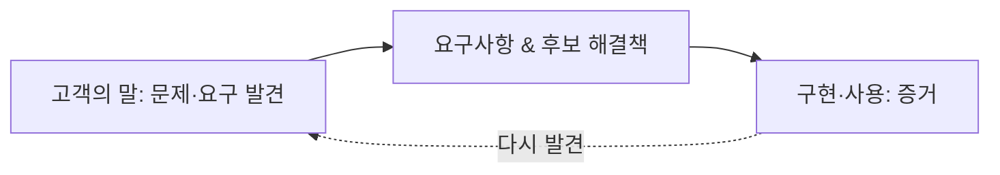
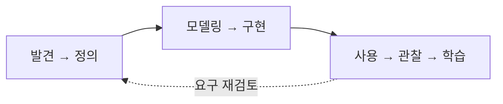
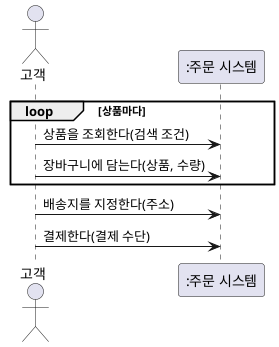
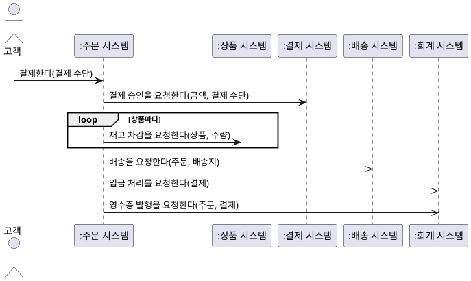
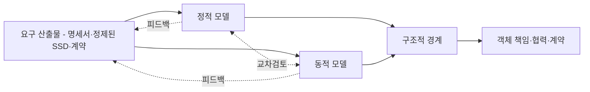
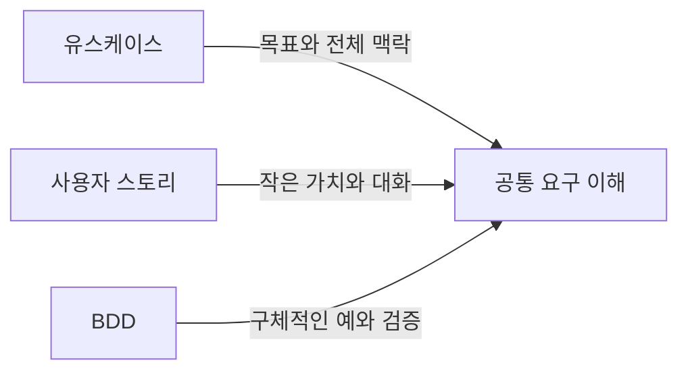
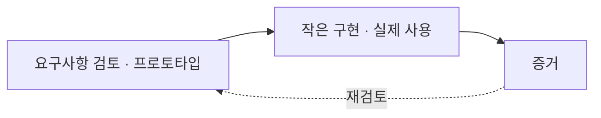
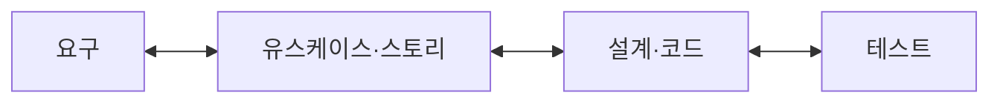
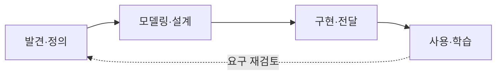

--------------------
Session 명: 02. 요구 분석과 유스케이스
--------------------

## 목차

01. 세션 목표
02. 요구공학의 본질
03. 분석 원칙
04. 문제·요구·요구사항·해결책
05. 요청에는 무엇이 섞여 있는가?
06. 명세의 한계
07. 이벤트 중심 요구
08. 이벤트 중심 기법
09. 반복적 접근
10. AI 시대의 요구
11. 요구공학의 주요 활동
12. 요구사항 수집과 발견
13. 누가 요구를 아는가?
14. 업무·기술 불확실성
15. 경우별 접근법
16. 요구사항 유형
17. 좋은 요구사항의 자격요건
18. 유스케이스란 무엇인가?
19. 왜 유스케이스가 필요한가?
20. 유스케이스의 위치
21. 유스케이스 작성 절차
22. 대상 시스템과 경계
23. 경계 판단
24. 목표와 액터
25. 유스케이스 후보 식별
26. 유스케이스 수준
27. 유스케이스 다이어그램 — 초안
28. 유스케이스 명세서 템플릿
29. 기본 이벤트 흐름
30. 규칙·제약·예외 정책
31. 이벤트 흐름을 이용한 요구 분석
32. 유스케이스 상세화
33. 유스케이스 다이어그램 — 상세화
34. 잘못된 관행 — 기능 분할
35. 잘못된 관행 — CRUD 분할
36. 잘못된 관행 — 화면·기술 요소
37. 잘못된 관행 — 시스템 관점·액터
38. 잘못된 관행 — 명세 과잉·방치
39. 잘못된 유스케이스 다이어그램
40. 시스템 시퀀스 다이어그램
41. SSD 초안
42. 시스템 이벤트와 오퍼레이션
43. 정제된 SSD
44. 시스템 오퍼레이션과 계약
45. 정적·동적 모델을 통한 상세화
46. 유스케이스와 품질속성
47. 프로토타입·와이어프레임
48. 사용자 스토리
49. 사용자 스토리의 강점과 한계
50. 행위 주도 개발
51. 행위 주도 개발의 강점과 한계
52. 유스케이스·사용자 스토리·BDD
53. 요구사항 검증
54. 요구사항 관리
55. 요구사항 추적
56. 요구사항에서 학습으로
57. 실습 — 모델로 바꾸기
58. 요약

## 01. 세션 목표

이 세션은 **문제를 발견해 요구사항을 정제하고, 유스케이스로 목표와 시스템 책임을 표현·검증하는 방법**을 다룬다.

- **문제·요구·요구사항·해결책**을 구분하고, 요구공학의 주요 활동과 요구사항 유형을 설명한다.
- 명세의 한계를 이해하고 **이벤트**를 요구 합의의 공통 단위로 사용하며, 불확실성에 따라 **요구 접근법**을 달리한다.
- 유스케이스를 **목표 중심**으로 식별·상세화하고, 기능 분해·CRUD·화면 명세 같은 **잘못된 관행**을 피한다.
- **시스템 경계**를 소유로 정하고 외부 시스템을 지원 액터로 둔다.
- SSD 초안으로 시스템 이벤트를 찾고, **정제된 SSD**와 **시스템 오퍼레이션 계약**으로 상세화해 분석 모델로 넘긴다.
- **품질속성·프로토타입·사용자 스토리·행위 주도 개발**을 요구 발견과 검증에 연결한다.
- 관리·추적과 실제 사용의 **증거**로 요구를 계속 검증한다.

**강사 노트**

- 세션의 목적은 요구사항 문서 작성법을 익히는 데 있지 않다. **무엇을 만들어야 하는지 발견하고, 그것이 실제로 필요한지 검증하는 사고 과정**을 이해하는 데 있다.

---

## 02. 요구공학의 본질

요구공학은 고객의 말을 그대로 옮기는 일이 아니라 **문제와 요구를 발견**하고, 무엇을 만들어야 하는지 구체화하며 **증거를 통해 계속 검토하는** 공학 활동이다.

**인용문**

"소프트웨어 시스템을 만드는 일에서 가장 어려운 부분은 **정확히 무엇을 만들지 결정하는 것**이다", "The hardest single part of building a software system is deciding precisely what to build.", Frederick P. Brooks Jr., 1986

**인용문**

"고객은 스스로 아직 모를 때도 **더 나은 것을 원한다**", "Even when they don't yet know it, customers want something better.", Jeff Bezos, 2016

**도식 — Mermaid**



**강사 노트**

- Brooks 인용 근거: "No Silver Bullet — Essence and Accidents of Software Engineering", UNC Technical Report TR86-020(1986), §5.2 "Requirements Refinement and Rapid Prototyping" 원문 확인.
- 고객의 능력을 비판하는 의미가 아니다.
- 실제 사용 맥락, 숨어 있는 요구, 미래 상황을 처음부터 완전하게 표현하기 어렵다는 의미다.
- 초기에 표현된 요구를 가설로 보고 실제 사용과 피드백으로 정제해야 한다는 점을 설명한다.
- 명세의 품질과 실제 필요·가치의 타당성을 구분한다. 「53. 요구사항 검증」에서 검토와 사용 증거의 역할을 연결한다.

---

## 03. 분석 원칙

요구사항을 **구분하고, 필요한 만큼 명세하고, 증거로 검토한다**.

- **구분한다** — 문제·요구·요구사항·해결책을 구분하고 표기보다 문제 이해를 먼저 한다.
- **필요한 만큼 명시한다** — 액터의 목표와 본질적인 이벤트 흐름을 쓰고, 규칙·제약·중요한 예외를 연결한다. 문서량이나 기능 분해를 목표로 하지 않는다.
- **증거로 검토한다** — 문서 승인을 타당성의 보증으로 보지 않고 구현·사용에서 얻은 증거로 판단을 수정한다.

- “배송지 변경 버튼을 만들어 달라”는 요청을 어떻게 **분석**하고, 어떤 **정보**를 더 묻고, 무엇으로 **필요성**을 확인할 것인가?

**강사 노트**

- 세 원칙(**구분**·**필요한 만큼**·**증거**)은 이 세션 전체의 판단 기준이다. 뒤의 topic마다 어느 원칙을 적용하는지 짚는다.
- 마지막 질문은 답을 정하지 않고 열어 둔다. 「05. 요청에는 무엇이 섞여 있는가?」에서 같은 요청을 나눠 본다.

---

## 04. 문제·요구·요구사항·해결책

**요구**는 희망이나 필요일 수 있지만, **요구사항**은 이를 분석·구현·검증할 수 있는 형태로 구체화한 것이다.

**인용문**

"**필요와 그에 관련된 제약·조건**을 변환하거나 표현한 진술", "statement which translates or expresses a need and its associated constraints and conditions", ISO/IEC/IEEE 29148:2018

**인용문**

"요구사항은 **필요**를 사용할 수 있게 표현한 것이며 설계는 **해결책**을 사용할 수 있게 표현한 것이다", "A requirement is a usable representation of a need... a design is a usable representation of a solution.", IIBA, 2022

| 구분 | 핵심 질문 | 예 |
|---|---|---|
| **문제** | 무엇이 잘못되었거나 부족한가? | 출고 전 배송지를 고객이 직접 바꿀 수 없다 |
| **요구(Need)** | 무엇을 원하거나 필요로 하는가? | 고객이 직접 배송지를 바꾸고 싶다 |
| **요구사항** | 시스템이 무엇을 충족해야 하는가? | 출고 전 주문의 배송지 변경을 지원해야 한다 |
| **제약** | 반드시 지켜야 하는 조건은 무엇인가? | 출고 후에는 일반 변경을 허용하지 않는다 |
| **해결책** | 어떤 방식으로 충족할 것인가? | 웹, 앱, 상담 자동화 등 |

표의 예는 한 요청에 대한 **교육용 가정**이다.

**강사 노트**

- 요구사항 정의 근거: ISO/IEC/IEEE 29148:2018, 3.1.19 "requirement" — 표준 공식 미리보기(용어 절) 원문 확인(iTeh Standards 공개 미리보기). 원문의 용어 참조 번호 (3.1.7)·(3.1.6)은 생략했다.
- 표의 "문제" 행은 교육용 가정이다. 실제 문제와 원인은 항상 요청자에게 직접 확인한다.

---

## 05. 요청에는 무엇이 섞여 있는가?

요청에 섞인 **문제·요구·요구사항·해결책**을 구분해 본다.

- “주문 상세 화면에 배송지 변경 버튼을 만들어 주세요.”
- "고객이 직접 배송지를 바꿀 수 없다"에서 **무엇을 모르는가?**

| 구분 | 내용 |
|---|---|
| **요청된 해결책** | 배송지 변경 버튼 |
| **문제** | 출고 전 배송지를 고객이 직접 수정할 수 없음 |
| **요구** | 고객이 직접 배송지를 변경하고 싶음 |
| **요구사항** | 출고 전 주문의 배송지 변경을 지원해야 함 |
| **제약** | 출고 이후 일반 변경 제한 |
| **후보 해결책** | 버튼, 편집 화면, 챗봇, 상담 자동화 등 |

표의 구분은 요청 한 문장에 대한 **교육용 해석**이다. 실제 문제와 출고 조건은 **고객에게 확인**해 정한다.

**강사 노트**

- 확인은 「03. 분석 원칙」의 증거로 검토한다.
- 후보 해결책을 여럿 적게 해 요청된 버튼이 **유일한 답이 아님**을 보인다.

---

## 06. 명세의 한계

복잡한 요구는 처음부터 완전하게 명세할 수 없다. 명세가 불완전한 것은 작성자의 성실성 문제가 아니라 **문제의 성질**이다.

- **고객** — 아직 경험하지 않은 해결책의 필요를 정확히 말하기 어렵다.
- **개발자** — 업무의 맥락·예외·암묵적 규칙을 모른다.
- **규칙** — 서로 얽혀 있고 시간이 지나며 바뀐다.
- **문서** — 길어질수록 읽히지 않고 해석이 갈려 합의가 약해진다.

### 그래서 필요한 것

- 고객과 개발자가 **같은 뜻으로 말할 수 있는 작은 단위**로 합의한다.
- **작게 만들어 보여주고 증거로 배우는** 반복으로 명세의 빈틈을 메운다.

**강사 노트**

- 명세를 포기하자는 뜻이 아니다. 완전한 명세를 전제로 한 계획이 깨지는 이유를 설명하고, 다음 두 topic(이벤트, 반복)으로 연결한다.
- 「02. 요구공학의 본질」의 Brooks·Bezos 인용과 같은 문제의식이다.

---

## 07. 이벤트 중심 요구

요구를 정의하는 가장 안정된 단위는 **이벤트**다. "무엇이 일어나면 시스템은 무엇을 해야 하는가?"는 고객과 개발자가 비교적 혼선 없이 말하고 합의할 수 있다.

**인용문**

"이벤트 목록은 시스템이 반응해야 하는, **외부 세계에서 일어나는 자극**을 서술한 목록이다", "The event list is a narrative list of the “stimuli” that occur in the outside world and to which our system must respond.", Edward Yourdon

- 이벤트는 **업무에서 일어나는 사건**이다. 화면·버튼·기능 이름이 아니다.

| 이벤트 | 시스템의 반응 |
|---|---|
| 고객이 주문을 취소한다 | 환불하고 취소 결과를 알린다 |
| 고객이 배송지를 변경한다 | 출고 전이면 배송지를 바꾼다 |
| 배송 시스템이 배송 시작을 알린다 | 주문을 배송 중으로 기록한다 |

**강사 노트**

- 인용 근거: Edward Yourdon, [Just Enough Structured Analysis, Chapter 18](https://web.archive.org/web/20070214052310/http://yourdon.com/strucanalysis/wiki/index.php?title=Chapter_18), "The Event List"(1989년 *Modern Structured Analysis*의 온라인판). 온라인판의 발행 연도를 직접 확인하지 못해 연도를 적지 않았다. Yourdon은 이벤트를 자료 흐름·시간·제어 이벤트로 구분한다.
- "요구 정의 기법의 공통 단위는 이벤트"라는 판단은 여러 기법을 비교한 **이 과정의 관점**이다. 한 문헌이 이렇게 선언한 것은 아니다. 다음 topic에서 기법별 근거를 보인다.
- 복잡하면 이벤트 목록도 한계가 있다. 이벤트 사이의 규칙과 상태는 정적·동적 모델로 보완한다.
- 세 번째 행처럼 **외부 시스템이 알리는 사건**도 이벤트다(「22. 대상 시스템과 경계」). 교육용 예다. 배송 시작과 출고의 관계는 "03. 정적 모델 — 도메인 개념과 관계"·"04. 동적 모델 — 상호작용과 상태"에서 확인한다.

---

## 08. 이벤트 중심 기법

구조적 분석부터 도메인 주도 설계까지, 요구를 다루는 주요 기법은 **이벤트를 출발점**으로 삼는다. 달라지는 것은 **누구의 관점에서 어떤 이벤트를 보는가**다.

**인용문**

"도메인 전문가가 관심을 두는 **무언가가 일어났다**", "Something happened that domain experts care about.", Eric Evans, 2015

| 기법 | 보는 이벤트 |
|---|---|
| **이벤트–반응 목록** | 외부에서 일어나 시스템이 반응해야 하는 자극 |
| **유스케이스** | 액터가 목표를 위해 시스템과 주고받는 상호작용 |
| **사용자 스토리** | 사용자가 원하는 작은 가치의 행위 |
| 도메인 이벤트·이벤트 스토밍 | 업무 전문가가 관심을 두는, 이미 일어난 사건 |

**강사 노트**

- 이 본질 위에서 **이벤트 기반 아키텍처**를 논한다. 요구 이벤트의 합의 없이 기술로서의 이벤트만 도입하면 복잡성만 늘어난다.
- 기법별 표현: 이벤트–반응 목록은 이벤트와 반응, 유스케이스는 이벤트 흐름과 시스템 오퍼레이션, 사용자 스토리는 카드·대화·확인, 도메인 이벤트는 과거형 이벤트와 타임라인으로 표현한다.
- 이벤트 스토밍: "이벤트 스토밍은 복잡한 업무 영역을 함께 탐색하는 유연한 워크숍 형식이다(EventStorming is a flexible workshop format for collaborative exploration of complex business domains.)" — Alberto Brandolini, [EventStorming](https://www.eventstorming.com/) 공식 사이트(게시 연도 미표기).
- 인용 근거: Eric Evans, [Domain-Driven Design Reference](https://www.domainlanguage.com/wp-content/uploads/2016/05/DDD_Reference_2015-03.pdf), 2015, "Domain Events".
- 표는 기법의 전체 정의가 아니라 "어떤 이벤트를 보는가"만 비교한 교육용 정리다. 유스케이스·사용자 스토리는 이 세션 뒤에서, 도메인 이벤트와 이벤트 기반 아키텍처는 "13. OOAD에서 전문영역으로 — Architecture · DDD · MSA"에서 다룬다.

---

## 09. 반복적 접근

명세의 한계를 다루는 방법은 시기마다 다른 이름으로 주목받았지만 본질은 같다. **작게 만들고, 보여주고, 증거로 배운다.**

| 접근 | 핵심 질문 | 반복의 단위 |
|---|---|---|
| **반복·점진(I&I)** | 작게 나눠 만들며 무엇을 배우는가? | 반복 주기 |
| **나선형 모델** | 가장 큰 위험을 무엇으로 먼저 줄이는가? | 위험 검토 주기 |
| **프로토타이핑** | 사용자가 보고 무엇을 새로 말하는가? | 시제품 |
| **애자일** | 작동하는 소프트웨어로 무엇을 배우는가? | 짧은 반복·릴리스 |
| **디자인 씽킹(DT)** | 실제로 풀어야 할 문제는 무엇인가? | 공감·정의·시제품·테스트 |
| **Lean Startup** | 이 사업 가설이 맞는가? | 만들기–측정–학습 |
| **Lean UX** | 이 해결책 가설이 맞는가? | 가설과 실험 |

문서의 승인과 요구의 타당성은 다르다. 승인된 요구사항도 실제 사용에서 **올바른 요구였는지 다시 검증**해야 한다.

**도식 — Mermaid**



**강사 노트**

- 표는 각 접근 전체의 정의가 아니라 요구의 불확실성을 다루는 방식을 비교한 교육용 정리다. 시대별 우열을 주장하지 않는다.
- 참고: Craig Larman·Victor R. Basili, "Iterative and Incremental Development: A Brief History", IEEE Computer, 2003; Barry Boehm, "A Spiral Model of Software Development and Enhancement", IEEE Computer, 1988; Eric Ries, *The Lean Startup*, 2011.
- 디자인 씽킹의 사람·기술·사업 관점과 반복적 검토: IDEO, [Design Thinking](https://designthinking.ideo.com/).
- 고객 가치·낭비·실험: Lean Enterprise Institute, [What is Lean?](https://www.lean.org/explore-lean/what-is-lean/).
- 가설·실험·학습의 구성: Jeff Gothelf·Josh Seiden, [Lean UX, 3rd Edition](https://www.oreilly.com/library/view/lean-ux-3rd/9781098116293/ch01.html), 2021, 출판사 공개 목차의 Chapters 10–12·15. 책 본문 전체를 인용하는 것이 아니다.
- 작동하는 소프트웨어의 잦은 전달·변화 수용·회고: [애자일 선언의 원칙](https://agilemanifesto.org/principles.html).

---

## 10. AI 시대의 요구

AI 시대에도 요구의 본질은 변하지 않는다. 새 용어들은 요구를 **AI가 실행할 수 있게 전달하고 검증하는 수단**이다.

- **사고와 검증은 사람이** 한다. **확실해진 작업은 AI가 점진적으로 대체**한다.

| AI 용어 | 요구공학에서 대응하는 것 |
|---|---|
| **프롬프트** | 요청과 요구 진술 — 무엇을 원하는가 |
| **컨텍스트** | 문제영역 지식, 이벤트·유스케이스, 모델 |
| **온톨로지** | 개념과 관계의 의미 — 정적 모델, 용어집 |
| **가드레일** | 규칙·제약·품질 요구 |
| **하네스** | 검증 환경 — 인수 조건, 예, 테스트 |

**강사 노트**

- 사람은 문제·이벤트·규칙을 정하고 결과가 맞는지 판단한다. AI에는 명세가 분명하고 검증할 수 있는 부분부터 넘긴다.
- 표의 대응은 교육용 비유다. 각 용어의 정의를 일대일로 같다고 주장하지 않는다.
- "01. OOAD 개요"의 「32. AI 기반 소프트웨어공학」과 연결한다. Human·Agent 역할과 가드레일·하네스의 구성은 "14. AI-native SW공학"에서 다룬다.
- 요구가 불명확한 부분을 AI에 넘기면 추측이 코드가 된다. 앞의 이벤트 합의와 반복적 검증이 AI 시대에도 그대로 필요한 이유다.

---

## 11. 요구공학의 주요 활동

요구공학(Requirements Engineering)은 이해관계자의 요구를 **수집·분석·명세·검증하고 변경을 관리하는 공학 활동**이다.

### 다섯 가지 활동

- **요구 수집:** 이해관계자의 문제·목표·필요를 찾아낸다.
- **요구 분석:** 요구를 정제하고 관계·충돌·우선순위를 분석한다.
- **요구 명세:** 합의하고 검토할 수 있는 형태로 표현한다.
- **요구 검증:** 잘 작성되었는지, 실제 필요한 것인지 확인한다.
- **요구 관리:** 기준선·변경·추적·영향을 관리한다.

**강사 노트**

- 요구공학의 수집·분석·명세·검증·관리 활동을 연결한다.

- 이 다섯 활동은 수업의 설명 구조이며 표준의 절·분류를 그대로 옮긴 것이 아니다. 요구공학 표준의 범위는 [ISO/IEC/IEEE 29148:2018 공식 설명](https://www.iso.org/standard/72089.html), 반복적 요구 탐색은 Craig Larman의 [Evolutionary Requirements](https://www.craiglarman.com/wiki/downloads/applying_uml/larman-ch5-applying-evolutionary-requirements.pdf)를 근거로 한다.

---

## 12. 요구사항 수집과 발견

요구는 한 사람의 말이나 한 종류의 자료만으로 확정하지 않는다. 여러 출처에서 얻은 **증거를 교차검증**하며 발견하고 정제한다.

| 방법 | 발견에 유용한 정보 | 한계·주의 |
|---|---|---|
| **인터뷰** | 경험·목표·문제 | 말로 표현 가능한 것에 편향 |
| **워크숍** | 관점 차이·충돌·합의 | 참여자 구성의 영향 |
| **관찰** | 실제 업무·암묵지 | 시간·접근 비용 |
| **설문** | 넓은 집단의 경향 | 깊이 부족 |
| **문서 분석** | 규정·정책 | 실제 업무와 다를 수 있음 |
| **기존 시스템 분석** | 현재 동작·제약 | 기존 해결책에 사고가 고정될 수 있음 |
| **로그·데이터 분석** | 실제 행동의 증거 | 행동의 이유는 직접 설명하지 못함 |
| **프로토타입** | 숨어 있는 요구·사용 반응 | 해결책을 너무 일찍 고정할 위험 |

**강사 노트**

- 표의 방법은 서로를 **보완**한다. 한 방법으로 얻은 결과를 다른 방법으로 교차검증하게 한다.
- 로그·데이터와 프로토타입은 「09. 반복적 접근」의 **사용 증거**와 이어진다.

---

## 13. 누가 요구를 아는가?

요구를 정의하는 방법은 **누가 업무를 알고 있는가**에 따라 달라야 한다. 고객과 개발자의 업무 지식을 조합하면 네 가지 경우가 된다.

| 경우 | 고객 | 개발자 | 주요 위험 | 접근 |
|---|---|---|---|---|
| **모두 앎** | 앎 | 앎 | 당연한 가정의 누락 | 이벤트 목록·명세로 합의하고 예외를 검토 |
| **고객만 앎** | 앎 | 모름 | 암묵지 전달 실패·오해 | 관찰·전문가 참여·용어집·구체적 예 |
| **개발자만 앎** | 모름 | 앎 | 개발자가 요구를 대신 결정 | 선택지·프로토타입을 보이고 고객이 결정 |
| **모두 모름** | 모름 | 모름 | 추측을 사실로 확정 | 가설·작은 실험·사용 증거로 학습 |

**강사 노트**

- "개발자만 앎"은 업계 표준·패키지·규제 지식을 개발 측이 더 많이 가진 경우다. 이때도 결정은 고객의 몫이다.
- 한 프로젝트 안에서도 영역마다 경우가 다르다. 「15. 경우별 접근법」에서 주문 시스템 영역별로 적용한다.

---

## 14. 업무·기술 불확실성

**업무**(무엇을 할 것인가)와 **기술**(어떻게 실현할 것인가)의 불확실성을 따로 본다. 둘을 섞으면 기술 검증을 요구 분석으로, 요구 탐색을 기술 과제로 착각한다.

| 경우 | 업무 | 기술 | 접근 |
|---|---|---|---|
| **명확·확실** | 명확 | 확실 | 명세 중심으로 계획하고 구현한다 |
| **업무 불명확** | 불명확 | 확실 | 요구 탐색 중심 — 프로토타입, 이벤트 워크숍, 짧은 반복 |
| **기술 불확실** | 명확 | 불확실 | 기술 검증 중심 — 스파이크·개념 증명으로 위험을 먼저 줄인다 |
| **모두 불확실** | 불명확 | 불확실 | 가설 검증 중심 — 가장 작은 실험, 위험 순서의 반복 |

**강사 노트**

- 두 축의 구분은 이 과정의 판단 틀이다. 같은 축을 쓰는 다른 도구가 있지만 특정 도구의 정의를 옮긴 것이 아니다.
- 기술 불확실성을 줄이는 스파이크·개념 증명은 요구 분석의 산출물이 아니다. 결과가 요구에 영향을 주면 요구로 되돌린다.

---

## 15. 경우별 접근법

앞의 두 표를 겹치면 **영역마다 요구 기법이 달라진다**. 하나의 방법을 프로젝트 전체에 일괄 적용하지 않는다. 영역별 경우는 **교육용 가정**이다.

| 주문 시스템의 영역 | 경우 | 요구 기법 |
|---|---|---|
| **배송지 변경** | 모두 앎 · 명확·확실 | 이벤트 목록, 시스템 오퍼레이션 계약 |
| **주문 취소·환불 규칙** | 고객만 앎 · 업무 명확 | 관찰·인터뷰, 유스케이스 명세, 구체적인 예(BDD) |
| **결제 대행 연동** | 개발자만 앎 · 기술 불확실 | 스파이크로 검증, 선택지를 보여주고 고객이 결정 |
| **정기배송 건너뛰기** | 모두 모름 · 업무 불명확 | 프로토타입, 작은 출시, 사용 데이터 |

**강사 노트**

- 표의 영역별 경우는 **교육용 가정**이다. 실제 프로젝트에서는 영역마다 누가 무엇을 아는지 먼저 확인한다.
- 정기배송 건너뛰기는 이 세션 실습(「57. 실습 — 모델로 바꾸기」)의 사례다.

---

## 16. 요구사항 유형

요구사항은 이해관계자 요구사항에만 머물지 않는다. **사업 목적에서 해결책, 전환까지 연결**해서 본다.

### 개발 대상과 수준을 따라 요구를 구체화하기 (ISO 29148)

- 사업·임무 요구사항
- 이해관계자 요구사항
- 시스템 요구사항
- 소프트웨어 요구사항

### IIBA의 요구사항 분류

- 사업 요구사항
- 이해관계자 요구사항
- 해결책 요구사항
- 전환 요구사항

**강사 노트**

- 서로 다른 분류의 추상화 수준을 억지로 일대일 대응시키지 않는다.

- 앞의 수준 목록은 사업·임무에서 시스템과 소프트웨어로 요구를 구체화하는 수업용 연결이다. ISO의 완전한 유형 목록으로 제시하지 않는다. 수준 간 요구 도출은 NASA [Systems Engineering Handbook, §4](https://www.nasa.gov/reference/4-0-system-design-processes/)의 이해관계자 기대→기술 요구 및 하위 수준 전개를 참조한다. IIBA의 네 유형과 해결책 요구의 하위 분류는 [The Business Analysis Standard, 4.4.2](https://www.iiba.org/knowledgehub/the-business-analysis-standard/4-implementing-business-analysis/4-4-understanding-requirements-and-designs/)에서 확인한다. 두 관점은 목적이 달라 일대일 대응시키지 않는다.

---

## 17. 좋은 요구사항의 자격요건

ISO/IEC/IEEE 29148:2018은 **개별 요구사항의 특성**과 **요구사항 집합의 특성**을 구분해 정의한다. 문장 하나의 품질과 집합 전체의 품질은 서로 다른 기준으로 검토한다.

### 개별 요구사항의 특성

| 특성 | 의미 |
|---|---|
| **필요함** | 없으면 결함이 되는, 반드시 있어야 하는 능력·특성을 기술하는가 |
| **적절함** | 이해관계자에 맞는 추상화 수준이며 불필요한 제약·구현 세부사항을 넣지 않는가 |
| **명확함** | 하나로만 해석되도록 명확하게 서술했는가 |
| **완전함** | 이해에 필요한 정보를 그 서술 안에 모두 담았는가 |
| **단일함** | 하나의 능력·특성만 기술하는가 |
| **실현 가능함** | 주어진 제약 안에서 수용 가능한 위험으로 실현할 수 있는가 |
| **검증 가능함** | 충족 여부를 증명·측정할 수 있게 서술했는가 |
| **정확함** | 실제 필요를 정확히 반영하는가 |
| **형식 준수** | 합의된 서식·표현 규칙을 따르는가 |

### 요구사항 집합의 특성

- **완전함** — 해결책에 필요한 요구를 모두 포함하는가?
- **일관됨** — 요구 사이에 충돌이 없고 용어가 일관되는가?
- **실현 가능함** — 전체를 함께 고려해도 제약 안에서 실현할 수 있는가?
- **이해 가능함** — 관련 이해관계자가 이해할 수 있는가?
- **타당성 확인 가능함** — 실제 이해관계자 의도와 맞는지 확인할 수 있는가?

### 비교 예

- 위반 사례: `배송지를 신속하게 변경한다.` — **명확함·검증 가능함** 위반이다. `신속하게`가 측정 조건 없이 해석에 따라 달라진다.
- **개선 방향**: 변경 가능한 주문 상태, 변경 결과를 확인할 주체, 결과 통지 조건을 명시한다. 응답 시간 목표는 **측정 조건**과 함께 합의해 검증 가능하게 만든다.

**강사 노트**

- 근거: ISO/IEC/IEEE 29148:2018, §5.2(개별 요구사항 및 요구사항 집합의 특성).
- 9가지·5가지를 매번 기계적으로 전부 채점하지 않는다. 문제가 되는 특성을 짚어 설명하는 도구로 쓴다.
- 근거 없이 응답 시간 숫자를 넣는 것으로 검증 가능성을 가장하지 않는다.

---

## 18. 유스케이스란 무엇인가?

유스케이스(Use Case)는 기능을 나열하는 단위가 아니라, 액터(Actor)가 목표를 달성해 **가치 있는 결과를 얻는 시스템 사용 단위**다.

**인용문**

"시스템과의 대화에서 이루어지는, **행위적으로 연관된 일련의 트랜잭션**", "a behaviorally related sequence of transactions in a dialogue with the system", Ivar Jacobson, 1992(Biddle·Noble·Tempero, 2001 재인용)

**인용문**

"유스케이스는 대상 시스템이 수행하는 일련의 행위를 명세하며, 하나 이상의 액터 또는 이해관계자에게 **가치 있는 관찰 가능한 결과**를 만든다", "A UseCase specifies a set of actions performed by its subjects, which yields an observable result that is of value for one or more Actors or other stakeholders of each subject.", Object Management Group, 2017

- 통합 모델링 언어(UML)에서 유스케이스는 **타원**으로 표시한다.

**도식 — SVG**

```svg:uml
<svg xmlns="http://www.w3.org/2000/svg" width="320" height="80" viewBox="0 0 320 80" role="img" aria-label="유스케이스 표기: 타원 안의 주문을 관리한다">
<style>text{font-family:sans-serif;font-size:17px;fill:#000;text-anchor:middle}.t{font-weight:bold}.st{font-size:16px}.h{paint-order:stroke;stroke:#fff;stroke-width:6px;stroke-linejoin:round}.s{fill:#fff;stroke:#181818;stroke-width:1.5}.u{fill:#fff;stroke:#181818;stroke-width:1.5}.x{fill:#fff;stroke:#1B3A6B;stroke-width:1.5}.c{fill:#fff;stroke:#1B3A6B;stroke-width:3}.w{font-weight:bold}.n{fill:#fff;stroke:#181818;stroke-width:1.2}.l{stroke:#181818;stroke-width:1.3;fill:none}.d{stroke:#181818;stroke-width:1.3;fill:none;stroke-dasharray:6,5}.f{stroke:#1B3A6B;stroke-width:1.6;fill:none}.a{fill:#fff;stroke:#181818;stroke-width:1.4}</style>
<defs><marker id="o" viewBox="0 0 12 12" refX="11" refY="6" markerWidth="12" markerHeight="12" orient="auto" markerUnits="userSpaceOnUse"><path d="M1,1 L11,6 L1,11" fill="none" stroke="#181818" stroke-width="1.4"/></marker><marker id="f" viewBox="0 0 12 12" refX="11" refY="6" markerWidth="12" markerHeight="12" orient="auto" markerUnits="userSpaceOnUse"><path d="M0,0 L12,6 L0,12 Z" fill="#1B3A6B"/></marker><marker id="g" viewBox="0 0 16 16" refX="15" refY="8" markerWidth="16" markerHeight="16" orient="auto" markerUnits="userSpaceOnUse"><path d="M1,1 L15,8 L1,15 Z" fill="#fff" stroke="#181818" stroke-width="1.4"/></marker></defs>
<rect width="320" height="80" fill="#fff"/>
<ellipse class="u" cx="160" cy="40" rx="98" ry="30"/><text x="160" y="46">주문을 관리한다</text>
</svg>
```

**강사 노트**

- OMG 정의 근거: OMG Unified Modeling Language 2.5.1(2017-12), §18.2.5.1 UseCase Description 원문 확인.
- 위 1992년 책의 문구는 Biddle 등의 논문에 재수록된 부분을 확인했다. 원서 페이지를 직접 확인하지 않았으므로 페이지 번호를 추정하지 않는다.
- Jacobson은 [Use Cases — Yesterday, Today, and Tomorrow](https://web.archive.org/web/20221229212011id_/http://download.boulder.ibm.com/ibmdl/pub/software/dw/rationaledge/mar03/UseCases_TheRationalEdge_Mar2003.pdf), The Rational Edge, 2003-03, “How Many Use Cases Is Enough?”에서 특정 액터에게 측정 가능한 가치를 제공한다는 기준을 1994년에 추가했다고 직접 설명한다. 첨부 검토서의 1995년 책 문장 전체와 정확한 귀속은 이번 확인 자료로 확정하지 않았다.
- 대화는 액터와 시스템의 외부 상호작용을 뜻한다. 의미 없는 요청·처리 반복을 피한다는 작성 원칙을 상호작용 자체의 금지로 확대하지 않는다.
- 액터·시스템 경계·연관은 이후 주제에서 단계적으로 설명한다.

---

## 19. 왜 유스케이스가 필요한가?

유스케이스는 시스템을 기능 목록으로 분해하기보다, 액터의 **목표와 가치**를 중심으로 시스템이 제공해야 할 책임을 파악하는 데 사용한다.

- **자료·기능 중심** — 주문 등록, 주문 조회, 주문 수정, 주문 삭제처럼 자료 조작별로 나눈다.
- **목표 중심** — 주문을 관리한다, 배송 현황을 조회한다, 배송을 처리한다, 상품 정보를 관리한다처럼 액터가 무엇을 위해 쓰는가로 묶는다.
- 주문 취소·배송지 변경처럼 **같은 주문을 유지하는** 조작은 유스케이스를 나누지 않고 **대안 흐름과 시스템 오퍼레이션**으로 상세화한다.

기능 목록만으로는 **누가·왜·어떤 목표로 사용하는지, 어떤 결과가 가치 있는지, 시스템 책임은 어디까지인지** 알기 어렵다.

**강사 노트**

- 자료·기능 중심 분해가 쓸모없다는 뜻이 아니다. 자료 구조는 "03. 정적 모델 — 도메인 개념과 관계"에서 다루고, 유스케이스는 **목표와 가치**를 묻는 관점이다.
- 대안 흐름과 시스템 오퍼레이션은 「32. 유스케이스 상세화」와 「42. 시스템 이벤트와 오퍼레이션」에서 상세화한다.

---

## 20. 유스케이스의 위치

유스케이스는 기능 목록·자료 흐름·화면 명세가 아니다. **행위 요구**를 액터의 목표로 표현하고, 다른 요구를 연결하는 중심이 된다.

**인용문**

"유스케이스는 요구사항 문서의 '3장', 즉 **행위 요구**일 뿐이다", "Use cases are only “chapter three” of the requirements document, the behavioral requirements.", Alistair Cockburn, 2000

| 표현 | 단위 | 답하는 질문 | 유스케이스로 옮길 때의 위험 |
|---|---|---|---|
| 기능 분해도 | 기능·하위 기능 | 무엇을 처리하는가? | 목표 없는 기능 조각 |
| 자료 흐름도(DFD) | 자료를 생성·변경하는 처리 | 사건마다 어떤 자료가 생기고 바뀌는가? | 처리 단계가 유스케이스가 됨 |
| CRUD 매트릭스 | 엔티티 × 생성·조회·수정·삭제 | 누가 어떤 자료에 접근하는가?(상세 설계) | 자료 접근 목록이 요구를 대신함 |
| 화면 명세 | 화면·버튼 | 어떻게 보이고 조작하는가? | 해결책이 요구를 대신함 |
| **유스케이스** | **액터의 목표** | **누가 무엇을 위해 무엇을 얻는가?** | — |

**강사 노트**

- 인용 근거: Alistair Cockburn, *Writing Effective Use Cases*, pre-publication draft #3(2000-02-21, Addison-Wesley 2001 출간), Chapter 1. 같은 곳에서 유스케이스는 성능 요구·비즈니스 규칙·화면 설계·데이터 설명·상태 기계 행위·우선순위를 담지 않으며, 이들을 연결하는 허브 역할을 한다고 설명한다.
- 기능 분해도·DFD·CRUD 매트릭스 자체가 틀린 도구라는 뜻이 아니다. 각자의 질문에 쓰되 유스케이스의 단위로 옮기지 않는다.
- DFD는 사건에 반응해 자료를 생성·변경(C·U)하는 처리가 중심이다. 모든 자료 접근을 CRUD로 채우는 것은 상세 설계의 점검 작업이며 요구의 출발점이 아니다.

---

## 21. 유스케이스 작성 절차

유스케이스는 **시스템의 범위와 사용자 목표를 식별한 다음 이벤트 흐름과 규칙을 상세화**한다. 필요하면 앞 단계로 되돌아간다.

1. **대상 시스템과 경계**를 정의한다. 외부 시스템은 지원 액터로 둔다.
2. **목표**와 그 목표를 가진 **액터**를 함께 식별한다.
3. 목표 수준의 **유스케이스 후보**를 식별한다.
4. 액터와 유스케이스로 **초안 유스케이스 다이어그램**을 작성한다.
5. 유스케이스의 **기본 이벤트 흐름**을 작성한다.
6. 필요한 **규칙·제약·예외 정책**을 별도로 식별한다.
7. **사전조건·사후조건·비즈니스 규칙** 등 필요한 내용을 상세화한다.
8. 상세화 결과를 반영해 유스케이스 다이어그램을 **정제**한다.
9. **SSD 초안**으로 시스템 이벤트와 시스템 오퍼레이션을 식별하고, 외부 시스템까지 SSD를 **정제**한다.
10. 필요하면 중요하고 복잡한 시스템 오퍼레이션의 **계약**을 작성한다.
11. 전체 요구와 유스케이스를 **검토**하고 정제한다.

**강사 노트**

- 절대적인 순차 절차가 아니다. 실제 분석에서는 필요한 만큼 앞뒤로 반복한다.

---

## 22. 대상 시스템과 경계

**다이어그램 — 업무 배경도**

**업무 배경도**(시스템 컨텍스트 다이어그램)는 대상 시스템과 외부 사이에 **무엇이 오가는지** 보여준다. 경계를 정해야 무엇을 시스템이 책임지고 무엇을 외부 액터가 담당하는지 구분할 수 있다.

- 결제·상품·회계·배송 시스템은 **지원 액터**다. 요청의 동기·비동기는 「43. 정제된 SSD」에서 구분한다.

**도식 — SVG**

```svg:uml
<svg xmlns="http://www.w3.org/2000/svg" width="940" height="500" viewBox="0 0 940 500" role="img" aria-label="업무 배경도: 주문 시스템과 고객·상품·결제·배송·회계 시스템 사이에 오가는 요청과 통보">
<style>text{font-family:sans-serif;font-size:17px;fill:#000;text-anchor:middle}.t{font-weight:bold}.st{font-size:16px}.h{paint-order:stroke;stroke:#fff;stroke-width:6px;stroke-linejoin:round}.s{fill:#fff;stroke:#181818;stroke-width:1.5}.u{fill:#fff;stroke:#181818;stroke-width:1.5}.x{fill:#fff;stroke:#1B3A6B;stroke-width:1.5}.c{fill:#fff;stroke:#1B3A6B;stroke-width:3}.w{font-weight:bold}.n{fill:#fff;stroke:#181818;stroke-width:1.2}.l{stroke:#181818;stroke-width:1.3;fill:none}.d{stroke:#181818;stroke-width:1.3;fill:none;stroke-dasharray:6,5}.f{stroke:#1B3A6B;stroke-width:1.6;fill:none}.a{fill:#fff;stroke:#181818;stroke-width:1.4}</style>
<defs><marker id="o" viewBox="0 0 12 12" refX="11" refY="6" markerWidth="12" markerHeight="12" orient="auto" markerUnits="userSpaceOnUse"><path d="M1,1 L11,6 L1,11" fill="none" stroke="#181818" stroke-width="1.4"/></marker><marker id="f" viewBox="0 0 12 12" refX="11" refY="6" markerWidth="12" markerHeight="12" orient="auto" markerUnits="userSpaceOnUse"><path d="M0,0 L12,6 L0,12 Z" fill="#1B3A6B"/></marker><marker id="g" viewBox="0 0 16 16" refX="15" refY="8" markerWidth="16" markerHeight="16" orient="auto" markerUnits="userSpaceOnUse"><path d="M1,1 L15,8 L1,15 Z" fill="#fff" stroke="#181818" stroke-width="1.4"/></marker></defs>
<rect width="940" height="500" fill="#fff"/>
<rect class="c" x="400" y="222" width="200" height="66" rx="14"/><text class="w" x="500" y="261">주문 시스템</text>
<rect class="x" x="120" y="40" width="190" height="56" rx="6"/><text x="215" y="74">상품 시스템</text>
<rect class="x" x="690" y="40" width="190" height="56" rx="6"/><text x="785" y="74">결제 시스템</text>
<rect class="x" x="120" y="420" width="190" height="56" rx="6"/><text x="215" y="454">배송 시스템</text>
<rect class="x" x="690" y="420" width="190" height="56" rx="6"/><text x="785" y="454">회계 시스템</text>
<circle class="a" cx="70" cy="228" r="8"/><path class="l" d="M70,236 L70,258 M56,244 L84,244 M70,258 L58,276 M70,258 L82,276"/><text x="70" y="298">고객</text>
<line class="f" x1="92" y1="255" x2="396" y2="255" marker-end="url(#f)"/>
<text x="245" y="222">주문·조회</text><text x="245" y="243">배송지 변경·취소</text>
<line class="f" x1="440" y1="222" x2="262" y2="100" marker-end="url(#f)"/>
<text x="316" y="150" style="text-anchor:end">상품 정보 조회·재고 차감</text>
<line class="f" x1="555" y1="222" x2="730" y2="100" marker-end="url(#f)"/>
<text x="612" y="148" style="text-anchor:end">결제 승인·환불 요청</text>
<line class="f" x1="790" y1="100" x2="598" y2="232" marker-end="url(#f)"/>
<text x="712" y="186" style="text-anchor:start">환불 완료 통보</text>
<line class="f" x1="445" y1="288" x2="268" y2="416" marker-end="url(#f)"/>
<text x="372" y="368" style="text-anchor:start">배송 요청·배송지 변경·출고 중단</text>
<line class="f" x1="215" y1="420" x2="400" y2="284" marker-end="url(#f)"/>
<text x="296" y="342" style="text-anchor:end">배송 시작·완료 통보</text>
<line class="f" x1="560" y1="288" x2="735" y2="416" marker-end="url(#f)"/>
<text x="668" y="352" style="text-anchor:start">입금 처리·영수증 발행</text>
</svg>
```

**강사 노트**

- 주문 시스템은 장바구니, 주문의 성립과 상태, 배송지 변경, 취소, 그리고 외부 시스템과의 **조정**을 책임진다.
- 이 요구분석 경계를 최종 배포·아키텍처 경계와 동일시하지 않는다.
- 관리자와 배송 담당자는 주문 시스템의 액터가 아니라 그림에 없다. 각자 상품 시스템과 배송 시스템을 쓴다(「27. 유스케이스 다이어그램 — 초안」의 경계 밖 유스케이스).
- 결제 시스템은 결제 대행(PG)이다. 배송 시스템을 외부 배송 대행사가 운영하는지는 운영 형태의 문제이며 경계 판단은 같다.

---

## 23. 경계 판단

어떤 책임을 대상 시스템 안에 둘지, 외부 시스템(지원 액터)으로 둘지는 **소유**로 판단한다.

| 외부 시스템으로 둔다 | 대상 시스템 안에 둔다 |
|---|---|
| 다른 조직·팀이 그 책임과 데이터를 **소유**한다 | 대상 시스템이 그 데이터의 **원천**이다 |
| 이미 운영 중인 시스템이 있다 | 새로 만들 책임이며 따로 운영할 이유가 없다 |
| 생애·변경 주기가 다르다 | 대상 시스템의 목표와 함께 바뀐다 |

### 두 방향의 잘못

- 판단 질문 — **이 책임의 데이터와 규칙을 누가 소유하는가?**

| 잘못된 예 | 결과 |
|---|---|
| 주문 시스템이 재고·입금·영수증·출고를 모두 처리한다 | 경계가 **비대**해지고, 회계·물류 규칙이 주문의 요구에 섞인다 |
| 기능마다 별도 시스템으로 떼어 액터로 둔다(주문 DB, 결제 모듈) | 시스템 **안의 요소**를 액터로 만든다 |

**강사 노트**

- 이 사례에서 재고는 상품 시스템, 입금·영수증은 회계 시스템, 출고·배송은 배송 시스템이 소유한다고 전제한다. 모든 쇼핑몰이 이렇게 나뉜다는 뜻이 아니다. 새로 만드는 작은 쇼핑몰이라면 한 시스템에 둘 수 있다.
- 주문 시스템 **내부**의 구조적 경계와 외부 시스템에 대한 의존 방향은 "05. 구조적 경계와 의존성"에서 다룬다.
- 시스템 안의 요소를 액터로 만드는 잘못은 「37. 잘못된 관행 — 시스템 관점·액터」에서 다룬다.

---

## 24. 목표와 액터

액터를 먼저 나열하기보다, 먼저 **달성해야 할 목표**를 식별하고 그 목표를 가진 역할을 액터로 찾는다.

- **어떤 가치 있는 목표를 달성해야 하는가? 그 목표를 원하는 역할은 누구인가?**
- 액터는 시스템과 상호작용하는 외부 **역할**이다. 주 액터는 목표 달성에 시스템을 쓰고, 지원 액터는 필요한 외부 서비스를 제공한다.

| 목표 | 주 액터 | 지원 액터 | 시스템 |
|---|---|---|---|
| 주문을 관리한다 — 주문·확인·배송지 변경·취소 | 고객 | 결제·상품·회계·배송 시스템 | 주문 시스템 |
| 배송 현황을 조회한다 | 고객 | 배송 시스템 | 주문 시스템 |
| 배송을 처리한다 — 출고·배송 시작 | 배송 담당자 | — | **배송 시스템** |
| 상품 정보를 관리한다 — 등록·수정·판매 중지 | 관리자 | — | **상품 시스템** |

- 이 **액터–목표 목록**으로 유스케이스 다이어그램을 그린다(「27. 유스케이스 다이어그램 — 초안」).

**강사 노트**

- 주 액터의 목표를 출발점으로 삼되 지원 액터를 빠뜨리지 않는다. 아래 두 목표는 다른 시스템의 것이다. 주문 시스템의 범위에 넣지 않는다(「23. 경계 판단」). 근거: OMG [UML 2.5.1](https://www.omg.org/spec/UML/2.5.1/PDF), §18.1.3.1; Craig Larman, [Applying UML and Patterns, Chapter 6](https://www.craiglarman.com/wiki/downloads/applying_uml/larman-ch6-applying-evolutionary-use-cases.pdf), §6.6.

---

## 25. 유스케이스 후보 식별

유스케이스 후보는 기능 메뉴가 아니라 **액터의 목표와 외부에서 확인할 수 있는 가치**를 기준으로 식별한다.

- 액터에게 **의미 있는 결과**인가?
- 하나의 **목표**를 표현하는가?
- 결과의 **가치**를 외부에서 확인할 수 있는가?

### 예

- **주문 시스템** — 주문을 관리한다, 배송 현황을 조회한다
- **경계 밖** — 배송을 처리한다(배송 시스템), 상품 정보를 관리한다(상품 시스템)

### 기계적인 기능 분해의 잘못된 예

- 회원 등록, 회원 조회, 회원 수정, 회원 삭제 — **CRUD 목록**을 그대로 유스케이스 4개로 만든 **잘못된 예**다.
- 자료 유지는 **회원 정보를 관리한다** 하나로 다루고, 조회·수정·탈퇴는 필요하면 대안 흐름으로 정의한다(「35. 잘못된 관행 — CRUD 분할」).

**강사 노트**

- 세 질문에 모두 "예"여야 후보다. 하나라도 "아니요"면 **기능 조각**이거나 **다른 시스템의 목표**다.
- 경계 밖 후보는 「27. 유스케이스 다이어그램 — 초안」에서 그 시스템의 경계 안에 따로 그린다.

---

## 26. 유스케이스 수준

유스케이스는 목표의 **수준**을 정해야 크기가 일정해진다. 기본 단위는 **사용자 목표 수준**이고, 하위 기능은 반복되는 의미 있는 행위일 때만 분리한다(포함).

**인용문**

"사용자 목표는 '주 액터가 이것을 마치고 **만족해서 떠날 수 있는가**?'라는 질문에 답한다", "A user goal addresses the question, “Can the primary actor go away happy after having done this?”", Alistair Cockburn, 2000

| 수준 | 기준 | 예 |
|---|---|---|
| 요약 | 여러 번의 사용·여러 날에 걸친 목표 | 정기배송을 이용한다 |
| **사용자 목표** | 한 사람이 한 번에 마치고 가치를 얻는다 | 주문을 관리한다, 상품 정보를 관리한다 |
| 하위 기능 | 사용자 목표의 한 단계, 단독으로는 가치가 없다 | 로그인한다, 주소를 검색한다 |

**강사 노트**

- 근거: Alistair Cockburn, *Writing Effective Use Cases*, pre-publication draft #3(2000), Chapter 5 "Three Named Goal Levels". 사용자 목표는 업무 공학의 "기본 업무 프로세스"에 대응하며, 한 사람이 한 번 앉은 자리에서(몇 분) 마치는지를 보는 기준을 함께 제시한다.
- 「28. 유스케이스 명세서 템플릿」의 "수준" 항목은 이 구분을 적는다.

---

## 27. 유스케이스 다이어그램 — 초안

초안은 **액터·유스케이스·시스템 경계·연관**만으로 시스템의 사용 구조를 **업무 배경도**처럼 파악한다.

- 초안에는 목표를 가진 **주 액터**만 둔다. 지원 액터와 포함·확장은 「33. 유스케이스 다이어그램 — 상세화」에서 더한다.

**도식 — SVG**

```svg:uml
<svg xmlns="http://www.w3.org/2000/svg" width="640" height="360" viewBox="0 0 640 360" role="img" aria-label="유스케이스 다이어그램 초안: 주 액터 고객과 주문 시스템의 두 유스케이스">
<style>text{font-family:sans-serif;font-size:17px;fill:#000;text-anchor:middle}.t{font-weight:bold}.st{font-size:16px}.h{paint-order:stroke;stroke:#fff;stroke-width:6px;stroke-linejoin:round}.s{fill:#fff;stroke:#181818;stroke-width:1.5}.u{fill:#fff;stroke:#181818;stroke-width:1.5}.x{fill:#fff;stroke:#1B3A6B;stroke-width:1.5}.c{fill:#fff;stroke:#1B3A6B;stroke-width:3}.w{font-weight:bold}.n{fill:#fff;stroke:#181818;stroke-width:1.2}.l{stroke:#181818;stroke-width:1.3;fill:none}.d{stroke:#181818;stroke-width:1.3;fill:none;stroke-dasharray:6,5}.f{stroke:#1B3A6B;stroke-width:1.6;fill:none}.a{fill:#fff;stroke:#181818;stroke-width:1.4}</style>
<defs><marker id="o" viewBox="0 0 12 12" refX="11" refY="6" markerWidth="12" markerHeight="12" orient="auto" markerUnits="userSpaceOnUse"><path d="M1,1 L11,6 L1,11" fill="none" stroke="#181818" stroke-width="1.4"/></marker><marker id="f" viewBox="0 0 12 12" refX="11" refY="6" markerWidth="12" markerHeight="12" orient="auto" markerUnits="userSpaceOnUse"><path d="M0,0 L12,6 L0,12 Z" fill="#1B3A6B"/></marker><marker id="g" viewBox="0 0 16 16" refX="15" refY="8" markerWidth="16" markerHeight="16" orient="auto" markerUnits="userSpaceOnUse"><path d="M1,1 L15,8 L1,15 Z" fill="#fff" stroke="#181818" stroke-width="1.4"/></marker></defs>
<rect width="640" height="360" fill="#fff"/>
<rect class="s" x="230" y="16" width="380" height="330"/><text class="t" x="420.0" y="44">주문 시스템</text>
<ellipse class="u" cx="420" cy="120" rx="98" ry="30"/><text x="420" y="126">주문을 관리한다</text>
<ellipse class="u" cx="420" cy="250" rx="125" ry="30"/><text x="420" y="256">배송 현황을 조회한다</text>
<circle class="a" cx="100" cy="158" r="8"/><path class="l" d="M100,166 L100,188 M86,174 L114,174 M100,188 L88,206 M100,188 L112,206"/><text x="100" y="228">고객</text>
<line class="l" x1="116" y1="178" x2="336.8" y2="135.9"/>
<line class="l" x1="116" y1="178" x2="331.0" y2="228.9"/>
</svg>
```

### 표기와 사용법

| 표기 | 의미 | 이렇게 쓴다 |
|---|---|---|
| **액터** — 사람 모양 | 시스템 밖에서 시스템을 쓰는 역할 | 역할 이름을 쓰고 경계 밖에 둔다 |
| **유스케이스** — 타원 | 액터가 목표를 이루는 시스템 사용 단위 | 목표를 동사구로 쓰고 경계 안에 둔다 |
| **시스템 경계** — 사각형 | 대상 시스템의 범위 | 위쪽에 이름, 안은 시스템의 책임 |
| **연관** — 실선 | 액터가 그 유스케이스에 참여한다 | 방향 없음, 순서·데이터 흐름이 아니다 |

### 경계 밖의 유스케이스

다른 시스템의 유스케이스는 **그 시스템의 경계 안**에 따로 그린다. 주문 시스템의 범위가 아님을 분명히 한다.

**도식 — SVG**

```svg:uml
<svg xmlns="http://www.w3.org/2000/svg" width="940" height="236" viewBox="0 0 940 236" role="img" aria-label="경계 밖 유스케이스: 관리자와 상품 시스템, 배송 담당자와 배송 시스템">
<style>text{font-family:sans-serif;font-size:17px;fill:#000;text-anchor:middle}.t{font-weight:bold}.st{font-size:16px}.h{paint-order:stroke;stroke:#fff;stroke-width:6px;stroke-linejoin:round}.s{fill:#fff;stroke:#181818;stroke-width:1.5}.u{fill:#fff;stroke:#181818;stroke-width:1.5}.x{fill:#fff;stroke:#1B3A6B;stroke-width:1.5}.c{fill:#fff;stroke:#1B3A6B;stroke-width:3}.w{font-weight:bold}.n{fill:#fff;stroke:#181818;stroke-width:1.2}.l{stroke:#181818;stroke-width:1.3;fill:none}.d{stroke:#181818;stroke-width:1.3;fill:none;stroke-dasharray:6,5}.f{stroke:#1B3A6B;stroke-width:1.6;fill:none}.a{fill:#fff;stroke:#181818;stroke-width:1.4}</style>
<defs><marker id="o" viewBox="0 0 12 12" refX="11" refY="6" markerWidth="12" markerHeight="12" orient="auto" markerUnits="userSpaceOnUse"><path d="M1,1 L11,6 L1,11" fill="none" stroke="#181818" stroke-width="1.4"/></marker><marker id="f" viewBox="0 0 12 12" refX="11" refY="6" markerWidth="12" markerHeight="12" orient="auto" markerUnits="userSpaceOnUse"><path d="M0,0 L12,6 L0,12 Z" fill="#1B3A6B"/></marker><marker id="g" viewBox="0 0 16 16" refX="15" refY="8" markerWidth="16" markerHeight="16" orient="auto" markerUnits="userSpaceOnUse"><path d="M1,1 L15,8 L1,15 Z" fill="#fff" stroke="#181818" stroke-width="1.4"/></marker></defs>
<rect width="940" height="236" fill="#fff"/>
<rect class="s" x="150" y="16" width="300" height="200"/><text class="t" x="300.0" y="44">상품 시스템</text>
<rect class="s" x="620" y="16" width="300" height="200"/><text class="t" x="770.0" y="44">배송 시스템</text>
<ellipse class="u" cx="300" cy="120" rx="125" ry="30"/><text x="300" y="126">상품 정보를 관리한다</text>
<ellipse class="u" cx="770" cy="120" rx="98" ry="30"/><text x="770" y="126">배송을 처리한다</text>
<circle class="a" cx="70" cy="100" r="8"/><path class="l" d="M70,108 L70,130 M56,116 L84,116 M70,130 L58,148 M70,130 L82,148"/><text x="70" y="170">관리자</text>
<circle class="a" cx="540" cy="100" r="8"/><path class="l" d="M540,108 L540,130 M526,116 L554,116 M540,130 L528,148 M540,130 L552,148"/><text x="540" y="170">배송 담당자</text>
<line class="l" x1="86" y1="120" x2="175.0" y2="120.0"/>
<line class="l" x1="556" y1="120" x2="672.0" y2="120.0"/>
</svg>
```

**강사 노트**

- 액터 이름은 사람·부서가 아니라 역할이다. 유스케이스 이름은 목표 동사구(주문을 관리한다)다. 경계 밖은 액터의 자리다.
- 유스케이스는 글로 쓰는 명세이고, 다이어그램과 관계는 유스케이스 작업에서 **부수적**이다. 액터–목표 목록으로 다이어그램을 간단히 그리고 시간은 명세서에 쓴다(요약: Craig Larman, [Applying UML and Patterns, Chapter 6](https://www.craiglarman.com/wiki/downloads/applying_uml/larman-ch6-applying-evolutionary-use-cases.pdf)).

---

## 28. 유스케이스 명세서 템플릿

유스케이스 명세는 서식을 채우기 위한 문서가 아니라, **목표·조건·행위·결과를 명확히 해 검토와 합의를 가능하게 하는 수단**이다.

| 항목 | 설명 |
|---|---|
| **유스케이스명** | 액터가 달성하려는 목표 |
| **주 액터** | 목표 달성의 주체 |
| **범위(대상 시스템)** | 분석 대상 시스템 |
| **수준** | 사용자 목표 수준 등 |
| **이해관계자와 관심사** | 결과에 영향을 받는 이해관계자와 기대 |
| **사전조건** | 유스케이스 시작 전에 참이어야 하는 조건 |
| **성공 사후조건** | 성공했을 때 참이어야 하는 상태 |
| **기본 이벤트 흐름** | 정상적으로 목표를 달성하는 본질적인 흐름 |
| **비즈니스 규칙·제약** | 이벤트 흐름과 별도로 적용되는 규칙 |
| **예외 정책** | 정말 필요한 경우 별도로 정의하는 예외 처리 정책 |
| **특별 요구사항** | 품질속성 등 별도의 요구 |

**강사 노트**

- 모든 유스케이스에 모든 항목을 기계적으로 채우지 않는다.

---

## 29. 기본 이벤트 흐름

기본 이벤트 흐름에는 **본질적인 행위만** 남긴다.

### 유스케이스: 주문을 관리한다 — 기본 흐름

1. 고객이 상품을 조회한다.
2. 고객이 상품과 수량을 장바구니에 담는다.
3. 고객이 배송지를 지정한다.
4. 고객이 결제한다.
5. 고객은 주문 결과를 확인한다.

- 고객은 주문할 상품마다 **1~2단계를 반복**한다.
- 주문 취소·배송지 변경·주문 내역 확인은 이 유스케이스의 **대안 흐름**이다. 대안 흐름의 번호는 갈라져 나오는 **기본 흐름의 단계**를 따른다(「32. 유스케이스 상세화」).

**페이지 분할**

### 작성 원칙

- 액터의 **목표와 의도**를 중심으로 **본질적인 행위만** 쓴다.
- 동일한 의미·결과의 **반복**이나 **화면 클릭 순서**를 쓰지 않는다.
- 의미 없는 `요청→처리` 반복은 피하되 필요한 **의도·응답**은 표현한다.
- **내부 구현**의 확인·계산·저장·호출은 나열하지 않되, 경로를 바꾸는 **판단**은 외부 행위로 표현한다.
- **설계 내용**(클래스·객체·메서드)이나 가능한 **모든 경우**를 넣지 않는다.

**강사 노트**

- `시스템이 재고를 조회한다`, `시스템이 결제 모듈을 호출한다`와 같은 내부 처리 단계는 넣지 않는다. 결제 확인은 외부 결제 시스템과의 상호작용이라 흐름에 남는다(「33. 유스케이스 다이어그램 — 상세화」의 포함 관계).

---

## 30. 규칙·제약·예외 정책

이벤트 흐름에 가능한 모든 조건과 실패를 나열하지 않는다. **규칙·제약·예외 정책은 필요할 때 별도로 분리해 기술**한다.

### 비즈니스 규칙 예

- **배송 시작 이후**에는 주문을 취소할 수 없다.
- **특정 상품**은 취소가 제한될 수 있다.
- **부분 취소**의 허용 조건을 정의한다.

### 제약 예

- 결제 완료 이후 취소는 **환불 처리**와 연결되어야 한다.
- **법률·계약·정책상** 취소 제한이 있을 수 있다.

### 예외 정책 예

- **정말 중요한 경우**에만 별도로 정의한다.

- 예를 들어 환불 실패가 핵심 업무 위험이라면 **환불 실패 정책**으로 별도 정의할 수 있다.

**강사 노트**

- 방어 코딩 수준의 모든 예외를 유스케이스에 기록하지 않는다.

---

## 31. 이벤트 흐름을 이용한 요구 분석

좋은 이벤트 흐름은 내부 처리 단계를 늘리는 것이 아니라, 목표 달성 과정에서 추가로 확인해야 할 **중요한 질문**을 드러낸다.

- 「32. 유스케이스 상세화」의 주문 취소 대안 흐름을 **출발점**으로 적용 범위를 넓혀 보며 질문한다. 예시의 전제가 실제 요구 전체를 대표한다고 가정하지 않는다.

| 질문 | 발견한 요구·규칙 (확인 대상) | 기록할 곳 |
|---|---|---|
| 취소할 수 있는 범위는? | 배송 시작 이후에는 일반 취소를 허용하지 않는다 | 비즈니스 규칙 |
| 환불은 항상 필요한가? | 결제 전 주문은 환불 없이 취소된다 | 대안 흐름 |
| 부분 취소가 필요한가? | 허용 조건이 정해지지 않았다 | 확인 질문 |
| 어떤 결과를 제공하는가? | 고객이 취소·환불 결과를 확인한다 | 사후조건 |
| 다른 업무에 영향은? | 배송 준비를 중단해야 한다 | 관련 유스케이스·외부 액터 |

**강사 노트**

- 표의 오른쪽 두 열은 질문이 요구로 바뀌는 모습을 보이는 **교육용 예**다. 확정된 정책이 아니다.
- 흐름 → 질문 → 누락된 요구·규칙 발견 → 요구사항·유스케이스 정제의 순서로 설명한다.

---

## 32. 유스케이스 상세화

유스케이스 상세화는 문서량을 늘리는 작업이 아니라, **조건·규칙·결과의 의미를 필요한 수준까지 명확히 하는 작업**이다.

### 주문을 관리한다

| 항목 | 내용 |
|---|---|
| **유스케이스명** | 주문을 관리한다 |
| **주 액터** | 고객 |
| **지원 액터** | 결제 시스템, 상품 시스템, 회계 시스템, 배송 시스템 |
| **범위(대상 시스템)** | 주문 시스템 |
| **수준** | 사용자 목표 |
| **기본 이벤트 흐름** | 상품 조회 → 장바구니 담기(반복) → 배송지 지정 → 결제 → 주문 결과 확인 |
| **대안 흐름** | 1a 주문 취소(결제 완료·배송 시작 전), 3a 배송지 변경(출고 전), 5a 주문 내역 확인 |
| **비즈니스 규칙** | 배송 시작 이후에는 일반 취소를 허용하지 않는다 |
| **특별 요구사항** | 미정 — 결과 통지 시간, 권한 확인 기준, 결과 확인 방식에 대한 요구를 확인한다 |

**페이지 분할**

### 대안 흐름 1a — 주문 취소

- **조건** — 고객 소유의 결제 완료 주문이며 배송 시작 전이다.

1. 고객이 주문을 취소한다.
2. 환불이 처리된다.
3. 고객은 주문 취소 결과를 확인한다.

- **결과** — 주문이 취소 상태이고, 결제 금액 전액의 환불이 완료된다.

### 예외 흐름 1a2a — 환불이 완료되지 않는다(교육용 가정)

1. 고객은 취소·환불이 완료되지 않았음과 후속 문의 방법을 안내받는다.
2. 취소 흐름은 성공 결과를 충족하지 않은 채 끝난다.

- 번호는 **기본 흐름에서 파생**한다. `1a` — 기본 흐름 1단계에서 갈라지는 첫 번째 대안 흐름, `1a2a` — 그 대안 흐름의 2단계에서 갈라지는 첫 번째 예외 흐름이다. 대안·예외 흐름 모두 **조건 → 달라지는 행위 → 복귀 또는 종료**로 쓴다.
- **예외 정책**은 실패 시 지킬 원칙이고, **예외 흐름**은 그때 달라지는 외부 행위·결과다.
- `배송 시작 이후 일반 취소 불가`는 **흐름**이 아니라 **규칙**으로 기록한다.

**강사 노트**

- 주문 취소 대안 흐름은 결제 완료·배송 시작 전 주문의 **전체 취소 성공 경로**다. `1a2a`는 실패 결과의 예이며 **이 예외 설명에만 추가한 교육용 가정**이고, 확정 업무 정책으로 승격하지 않는다. 남길 주문 상태, 재시도·보상·문의 담당자는 추가 확인 대상이다.
- 결제 전 주문의 취소가 요구로 확인되면 취소 흐름의 조건을 "배송 시작 전 주문"으로 넓히고 `1a1a. 결제 전 주문이다 → 환불 없이 취소된다` 같은 분기를 추가한다. 지금은 확정된 요구가 아니다.
- `주문을 관리한다`는 고객이 자기 주문을 만들고 유지하는 목표다. 주문 취소는 새로 주문할 상품을 고르는 대신(1단계) 이미 한 주문을 되돌리는 경로라 `1a`, 배송지 변경은 배송지 지정(3단계)의 대안이라 `3a`, 주문 내역 확인은 결과 확인(5단계)의 대안이라 `5a`다. 3a·5a의 단계도 같은 방식으로 쓴다. 배송지 변경의 결과는 「44. 시스템 오퍼레이션과 계약」의 계약으로 상세화한다. 배송 완료 후의 반품은 이 유스케이스의 대안 흐름이 아니라 별도 유스케이스다(「35. 잘못된 관행 — CRUD 분할」).
- 번호·분기 표기는 Cockburn의 확장(extension) 표기 방식을 따른 수업용 형식이다.

---

## 33. 유스케이스 다이어그램 — 상세화

포함·확장·일반화는 상세화로 확인된 **행위의 결합 또는 분류 관계**를 표현한다. 실행 순서를 그리는 화살표가 아니다.

| 관계 | 의미와 성립 조건 | 표기 방향 |
|---|---|---|
| **포함** | 포함 지점에 별도 유스케이스의 행위를 넣는다 | 기본 → 포함 대상, 점선 `«include»` |
| **확장** | 독립된 기본 유스케이스의 확장 지점에 행위를 넣는다 | 확장 → 기본, 점선 `«extend»` |
| **일반화** | 특수 요소가 일반 요소의 의미·행위를 이어받는다 | 특수 → 일반, 실선 빈 삼각형 |

### 포함 관계 예

- `결제를 확인한다`가 포함으로 분리되는 이유는 내부 함수가 아니라 **외부 결제 시스템과의 상호작용**이기 때문이다.

- `주문을 관리한다`의 주문 흐름은 결제 확인 행위를 포함해야 완료된다. 초안(「27. 유스케이스 다이어그램 — 초안」)에 **지원 액터**(오른쪽 `«actor»` 상자)와 포함 관계를 더한 상세화다.

**도식 — SVG**

```svg:uml
<svg xmlns="http://www.w3.org/2000/svg" width="940" height="500" viewBox="0 0 940 500" role="img" aria-label="상세화한 유스케이스 다이어그램: 주문을 관리한다가 결제를 확인한다를 포함하고 결제 시스템은 결제를 확인한다와 연결">
<style>text{font-family:sans-serif;font-size:17px;fill:#000;text-anchor:middle}.t{font-weight:bold}.st{font-size:16px}.h{paint-order:stroke;stroke:#fff;stroke-width:6px;stroke-linejoin:round}.s{fill:#fff;stroke:#181818;stroke-width:1.5}.u{fill:#fff;stroke:#181818;stroke-width:1.5}.x{fill:#fff;stroke:#1B3A6B;stroke-width:1.5}.c{fill:#fff;stroke:#1B3A6B;stroke-width:3}.w{font-weight:bold}.n{fill:#fff;stroke:#181818;stroke-width:1.2}.l{stroke:#181818;stroke-width:1.3;fill:none}.d{stroke:#181818;stroke-width:1.3;fill:none;stroke-dasharray:6,5}.f{stroke:#1B3A6B;stroke-width:1.6;fill:none}.a{fill:#fff;stroke:#181818;stroke-width:1.4}</style>
<defs><marker id="o" viewBox="0 0 12 12" refX="11" refY="6" markerWidth="12" markerHeight="12" orient="auto" markerUnits="userSpaceOnUse"><path d="M1,1 L11,6 L1,11" fill="none" stroke="#181818" stroke-width="1.4"/></marker><marker id="f" viewBox="0 0 12 12" refX="11" refY="6" markerWidth="12" markerHeight="12" orient="auto" markerUnits="userSpaceOnUse"><path d="M0,0 L12,6 L0,12 Z" fill="#1B3A6B"/></marker><marker id="g" viewBox="0 0 16 16" refX="15" refY="8" markerWidth="16" markerHeight="16" orient="auto" markerUnits="userSpaceOnUse"><path d="M1,1 L15,8 L1,15 Z" fill="#fff" stroke="#181818" stroke-width="1.4"/></marker></defs>
<rect width="940" height="500" fill="#fff"/>
<rect class="s" x="250" y="16" width="380" height="468"/><text class="t" x="440.0" y="44">주문 시스템</text>
<ellipse class="u" cx="440" cy="130" rx="98" ry="30"/><text x="440" y="136">주문을 관리한다</text>
<ellipse class="u" cx="440" cy="400" rx="125" ry="30"/><text x="440" y="406">배송 현황을 조회한다</text>
<ellipse class="u" cx="470" cy="270" rx="98" ry="30"/><text x="470" y="276">결제를 확인한다</text>
<circle class="a" cx="110" cy="230" r="8"/><path class="l" d="M110,238 L110,260 M96,246 L124,246 M110,260 L98,278 M110,260 L122,278"/><text x="110" y="300">고객</text>
<line class="l" x1="126" y1="250" x2="378.7" y2="153.4"/>
<line class="l" x1="126" y1="250" x2="383.9" y2="373.2"/>
<rect class="x" x="730" y="40" width="190" height="56"/><text class="st" x="825.0" y="62">«actor»</text><text x="825.0" y="85">상품 시스템</text>
<rect class="x" x="730" y="150" width="190" height="56"/><text class="st" x="825.0" y="172">«actor»</text><text x="825.0" y="195">회계 시스템</text>
<rect class="x" x="730" y="250" width="190" height="56"/><text class="st" x="825.0" y="272">«actor»</text><text x="825.0" y="295">결제 시스템</text>
<rect class="x" x="730" y="370" width="190" height="56"/><text class="st" x="825.0" y="392">«actor»</text><text x="825.0" y="415">배송 시스템</text>
<line class="l" x1="730" y1="68" x2="520.3" y2="112.8"/>
<line class="l" x1="730" y1="178" x2="526.2" y2="144.3"/>
<line class="l" x1="730" y1="278" x2="567.5" y2="273.0"/>
<line class="l" x1="730" y1="398" x2="470.8" y2="158.5"/>
<line class="l" x1="730" y1="398" x2="564.9" y2="399.1"/>
<line class="d" x1="446.4" y1="159.9" x2="463.6" y2="240.1" marker-end="url(#o)"/>
<text class="st h" x="469.0" y="206.0" style="text-anchor:start">«include»</text>
</svg>
```

### 확장 관계 예

- 다음은 표기 설명을 위한 **교육용 가정**이다.

- `주문을 관리한다`의 주문 흐름은 **쿠폰 없이도 완료**된다.
  - 예: 유효한 쿠폰 요청이 있으면 `최종 금액 확정 전`에 쿠폰을 **적용**한다.

**도식 — SVG**

```svg:uml
<svg xmlns="http://www.w3.org/2000/svg" width="780" height="362" viewBox="0 0 780 362" role="img" aria-label="확장 관계: 쿠폰을 적용한다가 확장 조건에 따라 주문을 관리한다를 확장">
<style>text{font-family:sans-serif;font-size:17px;fill:#000;text-anchor:middle}.t{font-weight:bold}.st{font-size:16px}.h{paint-order:stroke;stroke:#fff;stroke-width:6px;stroke-linejoin:round}.s{fill:#fff;stroke:#181818;stroke-width:1.5}.u{fill:#fff;stroke:#181818;stroke-width:1.5}.x{fill:#fff;stroke:#1B3A6B;stroke-width:1.5}.c{fill:#fff;stroke:#1B3A6B;stroke-width:3}.w{font-weight:bold}.n{fill:#fff;stroke:#181818;stroke-width:1.2}.l{stroke:#181818;stroke-width:1.3;fill:none}.d{stroke:#181818;stroke-width:1.3;fill:none;stroke-dasharray:6,5}.f{stroke:#1B3A6B;stroke-width:1.6;fill:none}.a{fill:#fff;stroke:#181818;stroke-width:1.4}</style>
<defs><marker id="o" viewBox="0 0 12 12" refX="11" refY="6" markerWidth="12" markerHeight="12" orient="auto" markerUnits="userSpaceOnUse"><path d="M1,1 L11,6 L1,11" fill="none" stroke="#181818" stroke-width="1.4"/></marker><marker id="f" viewBox="0 0 12 12" refX="11" refY="6" markerWidth="12" markerHeight="12" orient="auto" markerUnits="userSpaceOnUse"><path d="M0,0 L12,6 L0,12 Z" fill="#1B3A6B"/></marker><marker id="g" viewBox="0 0 16 16" refX="15" refY="8" markerWidth="16" markerHeight="16" orient="auto" markerUnits="userSpaceOnUse"><path d="M1,1 L15,8 L1,15 Z" fill="#fff" stroke="#181818" stroke-width="1.4"/></marker></defs>
<rect width="780" height="362" fill="#fff"/>
<rect class="s" x="230" y="16" width="520" height="330"/><text class="t" x="490.0" y="44">주문 시스템</text>
<ellipse class="u" cx="400" cy="110" rx="98" ry="30"/><text x="400" y="116">쿠폰을 적용한다</text>
<ellipse class="u" cx="400" cy="270" rx="98" ry="30"/><text x="400" y="276">주문을 관리한다</text>
<circle class="a" cx="90" cy="250" r="8"/><path class="l" d="M90,258 L90,280 M76,266 L104,266 M90,280 L78,298 M90,280 L102,298"/><text x="90" y="320">고객</text>
<line class="l" x1="106" y1="270" x2="302.0" y2="270.0"/>
<line class="d" x1="400" y1="140" x2="400" y2="238" marker-end="url(#o)"/>
<text class="st h" x="390" y="176" style="text-anchor:end">«extend»</text>
<path class="n" d="M540,150 L716,150 L730,164 L730,226 L540,226 Z"/><text x="635" y="182">확장 조건:</text><text x="635" y="210">유효한 쿠폰 사용 요청</text>
<line class="d" x1="540" y1="188" x2="402" y2="188"/>
</svg>
```

### 일반화 예

- 의미·행위를 **모두 이어받을 때만** 일반화를 쓴다.

- 기업 고객·VIP 고객이 `주문을 관리한다`를 **모두 이어받는다**고 가정한다.
  - 예: 이후 **한도·혜택** 등 요건이 붙을 수 있다.

**도식 — SVG**

```svg
<svg xmlns="http://www.w3.org/2000/svg" width="650" height="240" viewBox="0 0 650 240" role="img" aria-label="액터 일반화: 기업 고객과 VIP 고객이 고객을 특수화하고 고객은 주문을 관리한다에 참여">
<style>text{font-family:sans-serif;font-size:17px;fill:#000;text-anchor:middle}.t{font-weight:bold}.st{font-size:16px}.h{paint-order:stroke;stroke:#fff;stroke-width:6px;stroke-linejoin:round}.s{fill:#fff;stroke:#181818;stroke-width:1.5}.u{fill:#fff;stroke:#181818;stroke-width:1.5}.x{fill:#fff;stroke:#1B3A6B;stroke-width:1.5}.c{fill:#fff;stroke:#1B3A6B;stroke-width:3}.w{font-weight:bold}.n{fill:#fff;stroke:#181818;stroke-width:1.2}.l{stroke:#181818;stroke-width:1.3;fill:none}.d{stroke:#181818;stroke-width:1.3;fill:none;stroke-dasharray:6,5}.f{stroke:#1B3A6B;stroke-width:1.6;fill:none}.a{fill:#fff;stroke:#181818;stroke-width:1.4}</style>
<defs><marker id="o" viewBox="0 0 12 12" refX="11" refY="6" markerWidth="12" markerHeight="12" orient="auto" markerUnits="userSpaceOnUse"><path d="M1,1 L11,6 L1,11" fill="none" stroke="#181818" stroke-width="1.4"/></marker><marker id="f" viewBox="0 0 12 12" refX="11" refY="6" markerWidth="12" markerHeight="12" orient="auto" markerUnits="userSpaceOnUse"><path d="M0,0 L12,6 L0,12 Z" fill="#1B3A6B"/></marker><marker id="g" viewBox="0 0 16 16" refX="15" refY="8" markerWidth="16" markerHeight="16" orient="auto" markerUnits="userSpaceOnUse"><path d="M1,1 L15,8 L1,15 Z" fill="#fff" stroke="#181818" stroke-width="1.4"/></marker></defs>
<rect width="650" height="240" fill="#fff"/>
<rect class="s" x="330" y="12" width="300" height="150"/><text class="t" x="480.0" y="40">주문 시스템</text>
<ellipse class="u" cx="480" cy="100" rx="98" ry="30"/><text x="480" y="106">주문을 관리한다</text>
<circle class="a" cx="170" cy="18" r="8"/><path class="l" d="M170,26 L170,48 M156,34 L184,34 M170,48 L158,66 M170,48 L182,66"/><text x="170" y="88">고객</text>
<line class="l" x1="186" y1="38" x2="399.3" y2="83.0"/>
<circle class="a" cx="100" cy="158" r="8"/><path class="l" d="M100,166 L100,188 M86,174 L114,174 M100,188 L88,206 M100,188 L112,206"/><text x="100" y="228">기업 고객</text>
<circle class="a" cx="240" cy="158" r="8"/><path class="l" d="M240,166 L240,188 M226,174 L254,174 M240,188 L228,206 M240,188 L252,206"/><text x="240" y="228">VIP 고객</text>
<line class="l" x1="100" y1="146" x2="164" y2="98" marker-end="url(#g)"/>
<line class="l" x1="240" y1="146" x2="176" y2="98" marker-end="url(#g)"/>
</svg>
```

**강사 노트**

- 컴퓨터 시스템 액터를 `«actor»` 상자로 그리는 것은 사람 모양 액터의 **대안 표기**다. 사람과 외부 시스템을 한눈에 구분하려고 쓴다.
- 포함·확장은 코드 재사용이나 함수 호출을 나타내지 않는다. 확장은 조건을 생략할 수도 있으므로 UML 자체를 “항상 조건부 실행”으로 정의하지 않는다.
- 관계 의미와 표기 근거: OMG [UML 2.5.1](https://www.omg.org/spec/UML/2.5.1/PDF), §18.1.3.2–18.1.3.3, §18.1.4, §9 Classifiers.
- 학습자는 화살표 방향뿐 아니라 위 전제가 없다면 관계를 그리지 않아야 한다는 점까지 설명한다.

---

## 34. 잘못된 관행 — 기능 분할

기능 분해도처럼 유스케이스를 잘게 쪼개면 **액터의 목표가 사라지고** 유스케이스 수만 늘어난다. 판단 질문은 하나다. **이것만 마치고 액터가 만족해서 떠날 수 있는가?**

**인용문**

"글쓰기에서 가장 흔한 실수는 문장의 주어를 빼는 것, **화면 설계를 가정**하는 것, **너무 낮은 목표 수준**을 쓰는 것이다", "The most common mistakes in writing are leaving out the subjects of sentences, making assumptions about the user interface design, and using goal levels that are too low.", Alistair Cockburn, 2000

| 잘못된 예 | 바른 예 |
|---|---|
| 상품 선택·수량·쿠폰·결제 요청을 각각 유스케이스로 둔다 | **주문을 관리한다**의 흐름 하나에 단계로 쓴다 |
| 주문 흐름이 네 조각을 포함 관계로 부른다 | 여러 유스케이스가 공유하는 행위만 포함으로 뺀다 |

**강사 노트**

- 인용 근거: Cockburn, draft #3(2000), Chapter 19 "Mistakes Fixed". 세 가지 실수는 이어지는 잘못된 관행 topic들의 출발점이다.
- 판단 질문은 「26. 유스케이스 수준」의 사용자 목표 기준이다.

---

## 35. 잘못된 관행 — CRUD 분할

자료를 유지하는 요구를 생성·조회·수정·삭제별 유스케이스로 나누지 않는다. **하나의 유스케이스**로 다루고, 조회·수정·삭제는 필요하면 **대안 흐름**으로 정의한다.

묶는 기준은 **같은 자료의 유지**다. 같은 주문을 다뤄도 **시작 조건·목표·결과**가 독립인 업무는 **별도 유스케이스**다.

| 잘못된 예 | 바른 예 |
|---|---|
| 상품 등록·조회·수정·삭제 — 유스케이스 4개 | **상품 정보를 관리한다** — 기본: 등록, 대안: 수정·판매 중지 |
| 주문·내역 확인·배송지 변경·취소 — 유스케이스 4개 | **주문을 관리한다** — 기본: 주문, 대안: 확인·배송지 변경·취소 |
| 반품을 주문 관리의 대안 흐름으로 넣는다 | **주문을 반품한다** — 별도 유스케이스 |
| CRUD 매트릭스를 요구 목록으로 쓴다 | CRUD 전체 점검은 상세 설계에서 한다 |

**강사 노트**

- 상품 정보 관리와 관리자 액터는 CRUD 처리를 보이기 위한 **교육용 예**다. 주문 사례의 명세는 「32. 유스케이스 상세화」를 참조한다.
- 주문 취소는 배송 시작 전 주문 자체를 되돌리는 **주문 자료의 유지**라 주문 관리에 묶는다. 반품은 배송 완료 후 받은 상품을 돌려보내는 **다른 목표**다 — 시작 조건(배송 완료·반품 기간), 참여자(회수·검수), 결과(검수 후 환불 여부)가 따로 있다.
- 반품은 판단 기준을 보이기 위한 **교육용 예**이며, 이 과정의 관통 사례에서 상세화하지 않는다.
- 배송 현황 조회는 주문이 아니라 배송 자료를 보는 것이므로 **독립 유스케이스**(배송 현황을 조회한다)다. 주문 시스템의 범위에 넣을지는 확인 대상이다.
- 기본 흐름은 자료를 만드는 생성(C)이다. 조회·수정·삭제는 규칙이나 결과가 의미 있게 다를 때만 대안 흐름으로 쓴다. "삭제"는 업무에서 판매 중지·해지처럼 기록이 남는 사건인 경우가 많다.
- 정보공학의 DFD도 사건에 반응해 자료를 **생성·변경(C·U)**하는 처리가 중심이다. 모든 자료 접근을 CRUD로 채우는 일은 상세 설계의 점검 작업이지 요구의 출발점이 아니다.

---

## 36. 잘못된 관행 — 화면·기술 요소

이벤트 흐름에 화면·버튼·DB·API를 쓰면 **해결책이 요구를 대신**한다. 이들은 설계 결정이며, 요구라면 특별 요구사항·제약으로 분리한다.

**인용문**

"화면 세부가 아니라 **액터의 의도**를 드러낸다", "Highlight the actor's intention, not the user interface details.", Alistair Cockburn, 2000

| 잘못된 예 | 바른 예 |
|---|---|
| 고객이 주문 목록 화면에서 취소 버튼을 누른다 | 고객이 주문을 취소한다 |
| 시스템이 주문 테이블의 상태 코드를 바꾼다 | 주문이 취소된다 |
| 시스템이 결제 대행사의 환불 API를 호출한다 | 환불이 처리된다 |
| 배치가 5분마다 결과 알림을 보낸다 | 고객은 취소 결과를 확인한다 |

**강사 노트**

- 인용 근거: Cockburn, draft #3(2000), "Reminders"의 단계 작성 지침.
- 화면 흐름 자체가 요구인 경우(예: 규제로 정해진 화면)는 제약으로 명시한다.

---

## 37. 잘못된 관행 — 시스템 관점·액터

유스케이스는 **액터의 목표**에서 출발한다. 시스템이 하는 일의 목록이나 조직도가 아니다.

| 잘못된 예 | 바른 예 |
|---|---|
| 시스템이 주문 목록을 조회한다 | 고객이 주문 내역을 확인한다 |
| 액터: 물류팀 김과장 | 액터: 배송 담당자 — 사람이 아니라 **역할** |
| 액터: 주문 DB, 결제 모듈 | 시스템 안의 요소는 액터가 아니다. 외부 시스템(결제·상품·회계·배송)만 액터다 |
| 액터: 주문 시스템 | 대상 시스템은 **경계**이지 액터가 아니다 |

**강사 노트**

- Cockburn의 "Mistakes Fixed" 장은 대상 시스템이 없거나 주 액터가 없는 유스케이스를 대표적인 오류 예로 다룬다.
- **시간 이벤트는 정상적인 시작 사건이다.** 예를 들어 "정기배송 예정일이 된다"는 유스케이스를 시작하는 이벤트이고, 목표는 그 이벤트가 시작하는 유스케이스의 목표다. Yourdon도 이벤트를 자료 흐름·시간·제어 이벤트로 구분한다.

---

## 38. 잘못된 관행 — 명세 과잉·방치

명세를 **많이 쓰는 것**과 요구를 **잘 정의하는 것**은 다르다.

| 잘못된 예 | 바른 예 |
|---|---|
| 방어 코드 수준의 오류를 모두 흐름에 나열한다 | 목표 달성 경로가 달라지는 경우만 대안·예외 흐름으로 쓴다 |
| 템플릿의 모든 칸을 형식적으로 채운다 | 판단에 필요한 항목만 쓴다 |
| 규칙·정책을 흐름 단계에 섞는다 | 규칙·제약·예외 정책으로 분리한다 |
| 합의 없이 문서만 늘린다 | 이벤트·목표로 먼저 합의하고 반복한다 |
| 한 번 쓰고 구현·변경을 반영하지 않는다 | 추적하며 계속 갱신한다 |

**강사 노트**

- 명세의 양이 아니라 합의와 검증이 기준이다. 「06. 명세의 한계」와 「09. 반복적 접근」의 판단을 유스케이스 작성에 적용한 것이다.

---

## 39. 잘못된 유스케이스 다이어그램

유스케이스 다이어그램은 **기능 분해도·업무 순서도·프로그램 호출 그래프**를 대신하는 표기법이 아니다.

### 잘못된 예 — CRUD를 포함 관계로 분해

- 바른 모습은 **상품 정보를 관리한다** 하나와 대안 흐름이다(「35. 잘못된 관행 — CRUD 분할」).

**도식 — SVG**

```svg:uml
<svg xmlns="http://www.w3.org/2000/svg" width="900" height="422" viewBox="0 0 900 422" role="img" aria-label="잘못된 예: 상품 관리를 등록·조회·수정·삭제 포함 관계로 분해">
<style>text{font-family:sans-serif;font-size:17px;fill:#000;text-anchor:middle}.t{font-weight:bold}.st{font-size:16px}.h{paint-order:stroke;stroke:#fff;stroke-width:6px;stroke-linejoin:round}.s{fill:#fff;stroke:#181818;stroke-width:1.5}.u{fill:#fff;stroke:#181818;stroke-width:1.5}.x{fill:#fff;stroke:#1B3A6B;stroke-width:1.5}.c{fill:#fff;stroke:#1B3A6B;stroke-width:3}.w{font-weight:bold}.n{fill:#fff;stroke:#181818;stroke-width:1.2}.l{stroke:#181818;stroke-width:1.3;fill:none}.d{stroke:#181818;stroke-width:1.3;fill:none;stroke-dasharray:6,5}.f{stroke:#1B3A6B;stroke-width:1.6;fill:none}.a{fill:#fff;stroke:#181818;stroke-width:1.4}</style>
<defs><marker id="o" viewBox="0 0 12 12" refX="11" refY="6" markerWidth="12" markerHeight="12" orient="auto" markerUnits="userSpaceOnUse"><path d="M1,1 L11,6 L1,11" fill="none" stroke="#181818" stroke-width="1.4"/></marker><marker id="f" viewBox="0 0 12 12" refX="11" refY="6" markerWidth="12" markerHeight="12" orient="auto" markerUnits="userSpaceOnUse"><path d="M0,0 L12,6 L0,12 Z" fill="#1B3A6B"/></marker><marker id="g" viewBox="0 0 16 16" refX="15" refY="8" markerWidth="16" markerHeight="16" orient="auto" markerUnits="userSpaceOnUse"><path d="M1,1 L15,8 L1,15 Z" fill="#fff" stroke="#181818" stroke-width="1.4"/></marker></defs>
<rect width="900" height="422" fill="#fff"/>
<rect class="s" x="230" y="16" width="640" height="390"/><text class="t" x="550.0" y="44">상품 시스템</text>
<ellipse class="u" cx="380" cy="210" rx="90" ry="30"/><text x="380" y="216">상품 관리</text>
<circle class="a" cx="90" cy="190" r="8"/><path class="l" d="M90,198 L90,220 M76,206 L104,206 M90,220 L78,238 M90,220 L102,238"/><text x="90" y="260">관리자</text>
<line class="l" x1="106" y1="210" x2="290.0" y2="210.0"/>
<ellipse class="u" cx="700" cy="80" rx="90" ry="30"/><text x="700" y="86">상품 등록</text>
<line class="d" x1="437.1" y1="186.8" x2="642.9" y2="103.2" marker-end="url(#o)"/>
<ellipse class="u" cx="700" cy="170" rx="90" ry="30"/><text x="700" y="176">상품 조회</text>
<line class="d" x1="464.3" y1="199.5" x2="615.7" y2="180.5" marker-end="url(#o)"/>
<ellipse class="u" cx="700" cy="260" rx="90" ry="30"/><text x="700" y="266">상품 수정</text>
<line class="d" x1="461.5" y1="222.7" x2="618.5" y2="247.3" marker-end="url(#o)"/>
<ellipse class="u" cx="700" cy="350" rx="90" ry="30"/><text x="700" y="356">상품 삭제</text>
<line class="d" x1="434.5" y1="233.9" x2="645.5" y2="326.1" marker-end="url(#o)"/>
<text class="st h" x="540" y="140">«include»</text><text class="st h" x="540" y="296">«include»</text>
</svg>
```

**페이지 분할**

### 잘못된 예 — 유스케이스로 그린 업무 순서

- 시스템 경계가 없고, 유스케이스 사이의 일반 화살표가 **실행 순서**를 나타낸다.

**도식 — SVG**

```svg:uml
<svg xmlns="http://www.w3.org/2000/svg" width="950" height="200" viewBox="0 0 950 200" role="img" aria-label="잘못된 예: 시스템 경계 없이 유스케이스 사이 화살표로 실행 순서를 표현">
<style>text{font-family:sans-serif;font-size:17px;fill:#000;text-anchor:middle}.t{font-weight:bold}.st{font-size:16px}.h{paint-order:stroke;stroke:#fff;stroke-width:6px;stroke-linejoin:round}.s{fill:#fff;stroke:#181818;stroke-width:1.5}.u{fill:#fff;stroke:#181818;stroke-width:1.5}.x{fill:#fff;stroke:#1B3A6B;stroke-width:1.5}.c{fill:#fff;stroke:#1B3A6B;stroke-width:3}.w{font-weight:bold}.n{fill:#fff;stroke:#181818;stroke-width:1.2}.l{stroke:#181818;stroke-width:1.3;fill:none}.d{stroke:#181818;stroke-width:1.3;fill:none;stroke-dasharray:6,5}.f{stroke:#1B3A6B;stroke-width:1.6;fill:none}.a{fill:#fff;stroke:#181818;stroke-width:1.4}</style>
<defs><marker id="o" viewBox="0 0 12 12" refX="11" refY="6" markerWidth="12" markerHeight="12" orient="auto" markerUnits="userSpaceOnUse"><path d="M1,1 L11,6 L1,11" fill="none" stroke="#181818" stroke-width="1.4"/></marker><marker id="f" viewBox="0 0 12 12" refX="11" refY="6" markerWidth="12" markerHeight="12" orient="auto" markerUnits="userSpaceOnUse"><path d="M0,0 L12,6 L0,12 Z" fill="#1B3A6B"/></marker><marker id="g" viewBox="0 0 16 16" refX="15" refY="8" markerWidth="16" markerHeight="16" orient="auto" markerUnits="userSpaceOnUse"><path d="M1,1 L15,8 L1,15 Z" fill="#fff" stroke="#181818" stroke-width="1.4"/></marker></defs>
<rect width="950" height="200" fill="#fff"/>
<circle class="a" cx="60" cy="100" r="8"/><path class="l" d="M60,108 L60,130 M46,116 L74,116 M60,130 L48,148 M60,130 L72,148"/><text x="60" y="170">고객</text>
<ellipse class="u" cx="240" cy="120" rx="90" ry="30"/><text x="240" y="126">로그인</text>
<ellipse class="u" cx="440" cy="120" rx="90" ry="30"/><text x="440" y="126">상품 조회</text>
<ellipse class="u" cx="640" cy="120" rx="90" ry="30"/><text x="640" y="126">결제</text>
<ellipse class="u" cx="840" cy="120" rx="90" ry="30"/><text x="840" y="126">완료</text>
<line class="l" x1="76" y1="120" x2="150.0" y2="120.0"/>
<line class="l" x1="330" y1="120" x2="348" y2="120" marker-end="url(#o)"/>
<line class="l" x1="530" y1="120" x2="548" y2="120" marker-end="url(#o)"/>
<line class="l" x1="730" y1="120" x2="748" y2="120" marker-end="url(#o)"/>
</svg>
```

**페이지 분할**

### 피해야 할 표현

- **시스템 경계 없이** 유스케이스만 나열
- 유스케이스 사이의 일반 화살표로 **실행 순서** 표현
- **화면 메뉴 구조**를 그대로 유스케이스로 표현
- **CRUD·내부 기능**을 포함 관계로 분해
- **공통 코드**라는 이유만으로 `<<include>>`, **선택 기능**이라는 이유만으로 `<<extend>>` 사용
- 모든 액터를 모든 유스케이스에 연결한 **거미줄**

**강사 노트**

- 바른 다이어그램은 「27. 유스케이스 다이어그램 — 초안」과 「33. 유스케이스 다이어그램 — 상세화」를 참조한다.

---

## 40. 시스템 시퀀스 다이어그램

시스템 시퀀스 다이어그램(System Sequence Diagram, SSD)은 유스케이스 **시나리오 하나**에서 **주 액터**가 시스템에 보내는 **시스템 이벤트**와 그 순서를 보여준다. 시스템은 **블랙박스**다. 요구 분석에서는 SSD로 시스템 이벤트를 찾고, 시스템 오퍼레이션과 계약으로 이어 간다.

**도식 — SVG**

```svg
<svg xmlns="http://www.w3.org/2000/svg" width="1000" height="230" viewBox="0 0 1000 230" role="img" aria-label="시스템 시퀀스 다이어그램 표기: 액터, 대상 시스템과 생명선, 시스템 이벤트, 반복 조각">
<style>text{font-family:sans-serif;font-size:20px;fill:#000;text-anchor:middle}.b{fill:#fff;stroke:#1B3A6B;stroke-width:2}</style>
<rect width="1000" height="230" fill="#fff"/>
<circle cx="90" cy="45" r="14" fill="#fff" stroke="#181818" stroke-width="2"/><path d="M90,59 L90,100 M65,72 L115,72 M90,100 L68,130 M90,100 L112,130" stroke="#181818" stroke-width="2" fill="none"/>
<rect class="b" x="230" y="30" width="160" height="46" rx="6"/><text x="310" y="60">:주문 시스템</text><line x1="310" y1="76" x2="310" y2="140" stroke="#1B3A6B" stroke-width="2" stroke-dasharray="8,8"/>
<text x="575" y="80">장바구니에 담는다(상품, 수량)</text><line x1="460" y1="95" x2="680" y2="95" stroke="#1B3A6B" stroke-width="3"/><polygon points="690,95 670,85 670,105" fill="#1B3A6B"/>
<rect x="760" y="40" width="200" height="100" fill="none" stroke="#000" stroke-width="2"/><path d="M760,40 L830,40 L830,58 L818,70 L760,70 Z" fill="#fff" stroke="#000" stroke-width="2"/><text x="790" y="62" style="font-size:18px">loop</text><text x="860" y="110" style="font-size:18px">[상품마다]</text>
<text x="90" y="195">액터</text><text x="310" y="195">대상 시스템·생명선</text><text x="575" y="195">시스템 이벤트</text><text x="860" y="195">반복 조각</text>
</svg>
```

- **SSD 초안**은 **주 액터와 대상 시스템만** 그린다(정제는 「43. 정제된 SSD」).
- 이 단계의 이벤트는 모두 **동기 호출**이다. 응답은 그리지 않는다.

### 표기와 사용법

| 표기 | 의미 | 이렇게 쓴다 |
|---|---|---|
| **액터** | 시스템에 이벤트를 보내는 주 액터 | 주 액터를 왼쪽에 둔다 |
| **대상 시스템·생명선** | 블랙박스 시스템 하나, 점선은 시간 | `:주문 시스템`처럼 쓴다. 안의 객체는 넣지 않는다 |
| **시스템 이벤트** — 실선 화살표 | 액터가 시스템에 보내는 요청 | 액터 단계마다 하나, 업무 동사(필요한 정보) |
| **반복 조각** — `loop` 사각형 | 안의 이벤트가 조건 동안 반복된다 | 같은 이벤트의 반복, 조건은 `[상품마다]` |

**강사 노트**

- SSD는 **시퀀스 다이어그램**을 시스템 관점으로 제한해 쓴 것이다. 여기서는 SSD에 필요한 표기만 소개하고, 시퀀스 다이어그램의 정의와 전체 표기는 "04. 동적 모델 — 상호작용과 상태"에서 다룬다.
- SSD는 Craig Larman의 *Applying UML and Patterns*에서 유스케이스와 오퍼레이션 계약을 잇는 산출물로 소개된 개념이다. 저장소 기준은 `references/sw-engineering/larman/ssd.md`를 따른다.
- 생명선 이름 `:주문 시스템`의 콜론은 "주문 시스템의 한 인스턴스"를 뜻한다.

---

## 41. SSD 초안

SSD는 유스케이스 **한 시나리오**의 시스템 이벤트를 시각화한다. 명세서 기본 흐름의 **액터 단계마다** 시스템 이벤트가 나온다. 반복되는 단계(1~2단계)는 `loop`로 묶고, 시스템의 응답(5단계)은 이벤트가 아니다.

**도식 — SVG**

```svg:uml
<svg xmlns="http://www.w3.org/2000/svg" width="970" height="470" viewBox="0 0 970 470" role="img" aria-label="유스케이스 기본 흐름의 각 단계와 SSD 초안의 시스템 이벤트 대응">
<style>text{font-family:sans-serif;font-size:17px;fill:#000;text-anchor:middle}.t{font-weight:bold}.st{font-size:16px}.h{paint-order:stroke;stroke:#fff;stroke-width:6px;stroke-linejoin:round}.s{fill:#fff;stroke:#181818;stroke-width:1.5}.u{fill:#fff;stroke:#181818;stroke-width:1.5}.x{fill:#fff;stroke:#1B3A6B;stroke-width:1.5}.c{fill:#fff;stroke:#1B3A6B;stroke-width:3}.w{font-weight:bold}.n{fill:#fff;stroke:#181818;stroke-width:1.2}.l{stroke:#181818;stroke-width:1.3;fill:none}.d{stroke:#181818;stroke-width:1.3;fill:none;stroke-dasharray:6,5}.f{stroke:#1B3A6B;stroke-width:1.6;fill:none}.a{fill:#fff;stroke:#181818;stroke-width:1.4}</style>
<defs><marker id="o" viewBox="0 0 12 12" refX="11" refY="6" markerWidth="12" markerHeight="12" orient="auto" markerUnits="userSpaceOnUse"><path d="M1,1 L11,6 L1,11" fill="none" stroke="#181818" stroke-width="1.4"/></marker><marker id="f" viewBox="0 0 12 12" refX="11" refY="6" markerWidth="12" markerHeight="12" orient="auto" markerUnits="userSpaceOnUse"><path d="M0,0 L12,6 L0,12 Z" fill="#1B3A6B"/></marker><marker id="g" viewBox="0 0 16 16" refX="15" refY="8" markerWidth="16" markerHeight="16" orient="auto" markerUnits="userSpaceOnUse"><path d="M1,1 L15,8 L1,15 Z" fill="#fff" stroke="#181818" stroke-width="1.4"/></marker></defs>
<rect width="970" height="470" fill="#fff"/>
<rect x="10" y="30" width="410" height="430" rx="6" fill="#fff" stroke="#1B3A6B" stroke-width="1.5"/>
<text class="t" x="215" y="64">주문을 관리한다 — 기본 흐름</text>
<text x="28" y="176" style="text-anchor:start">1. 고객이 상품을 조회한다.</text>
<text x="28" y="216" style="text-anchor:start">2. 고객이 상품과 수량을 장바구니에 담는다.</text>
<text x="28" y="291" style="text-anchor:start">3. 고객이 배송지를 지정한다.</text>
<text x="28" y="351" style="text-anchor:start">4. 고객이 결제한다.</text>
<text x="28" y="411" style="text-anchor:start">5. 고객은 주문 결과를 확인한다.</text>
<text x="46" y="244" style="text-anchor:start;fill:#555">주문할 상품마다 1~2단계를 반복한다.</text>
<circle class="a" cx="500" cy="22" r="8"/><path class="l" d="M500,30 L500,52 M486,38 L514,38 M500,52 L488,70 M500,52 L512,70"/><text x="500" y="92">고객</text>
<line x1="500" y1="100" x2="500" y2="450" stroke="#1B3A6B" stroke-width="1.5" stroke-dasharray="7,6"/>
<rect class="x" x="790" y="46" width="160" height="42" rx="6"/><text x="870" y="73">:주문 시스템</text>
<line x1="870" y1="88" x2="870" y2="450" stroke="#1B3A6B" stroke-width="1.5" stroke-dasharray="7,6"/>
<rect x="470" y="112" width="490" height="116" fill="none" stroke="#181818" stroke-width="1.4"/><path d="M470,112 L535,112 L535,128 L525,138 L470,138 Z" fill="#fff" stroke="#181818" stroke-width="1.4"/><text class="t st" x="494" y="131">loop</text><text class="st t" x="548" y="132" style="text-anchor:start">[상품마다]</text>
<line class="f" x1="500" y1="170" x2="866" y2="170" marker-end="url(#f)"/>
<text x="690" y="162">상품을 조회한다(검색 조건)</text>
<line class="f" x1="500" y1="210" x2="866" y2="210" marker-end="url(#f)"/>
<text x="690" y="202">장바구니에 담는다(상품, 수량)</text>
<line class="f" x1="500" y1="285" x2="866" y2="285" marker-end="url(#f)"/>
<text x="690" y="277">배송지를 지정한다(주소)</text>
<line class="f" x1="500" y1="345" x2="866" y2="345" marker-end="url(#f)"/>
<text x="690" y="337">결제한다(결제 수단)</text>
<text x="690" y="411" style="fill:#555">응답 — 그리지 않는다</text>
<path d="M422,170 L496,170" stroke="#C0504D" stroke-width="1.4" stroke-dasharray="3,4" fill="none"/>
<path d="M422,210 L496,210" stroke="#C0504D" stroke-width="1.4" stroke-dasharray="3,4" fill="none"/>
<path d="M422,285 L496,285" stroke="#C0504D" stroke-width="1.4" stroke-dasharray="3,4" fill="none"/>
<path d="M422,345 L496,345" stroke="#C0504D" stroke-width="1.4" stroke-dasharray="3,4" fill="none"/>
<path d="M422,405 L496,405" stroke="#C0504D" stroke-width="1.4" stroke-dasharray="3,4" fill="none"/>
</svg>
```

**페이지 분할**

### SSD와 코드

시스템 이벤트는 **시스템 경계의 오퍼레이션**이 된다. 사용자 목표 하나를 이벤트 하나로 줄이면 **이벤트 흐름이 사라진다**.

**도식 — PlantUML**



```java
final class 상품 {
    private final String 상품명;
    private final int 판매가;

    상품(String 상품명, int 판매가) { this.상품명 = 상품명; this.판매가 = 판매가; }
    int 판매가() { return 판매가; }
}

interface 주문시스템 {
    List<상품> 상품을조회한다(String 검색조건);
    void 장바구니에담는다(상품 상품, int 수량);
    void 배송지를지정한다(String 주소);
    void 결제한다(String 결제수단);
}
```

**강사 노트**

- 마지막 단계(5단계 "고객은 주문 결과를 확인한다")는 시스템의 응답이라 이벤트로 그리지 않았다. 응답을 그리지 않는 것은 이 단계의 모든 호출이 동기라서다. 조회의 결과는 반환값으로 드러난다.
- 흐름과 SSD를 나란히 놓으면 누락이 보인다. 흐름에 없는 이벤트가 SSD에 생기면 명세서로 되돌려 흐름을 고친다.
- 시스템은 블랙박스라 **인터페이스만** 옮긴다. 시스템 안의 객체는 이 단계에서 정하지 않는다.
- 코드는 다이어그램의 한 관점만 옮긴 예시다. 이 세션의 코드는 모두 `code/s02/주문시스템.java`에서 발췌했으며, 그 파일을 컴파일·실행해 확인한다.

---

## 42. 시스템 이벤트와 오퍼레이션

액터가 보내는 요청이 **시스템 이벤트**이고, 이에 응답하는 시스템의 행위가 **시스템 오퍼레이션**이다. 유스케이스 흐름의 **액터 단계마다** 시스템 이벤트가 있다.

| 유스케이스 흐름 | 시스템 이벤트 | 시스템 오퍼레이션 | 계약 |
|---|---|---|---|
| 기본 흐름 1 — 상품을 조회한다 | 상품을 조회한다(검색 조건) | 상품 조회 | — |
| 기본 흐름 2 — 장바구니에 담는다 | 장바구니에 담는다(상품, 수량) | 장바구니 담기 | — |
| 기본 흐름 3 — 배송지를 지정한다 | 배송지를 지정한다(주소) | 배송지 지정 | — |
| 기본 흐름 4 — 결제한다 | 결제한다(결제 수단) | 결제 | **작성** — 네 외부 시스템을 조정한다 |
| 대안 흐름 1a — 주문 취소 | 주문을 취소한다(주문) | 주문 취소 | **작성** — 상태·출고 중단·환불이 얽힌다 |
| 대안 흐름 3a — 배송지 변경 | 배송지를 변경한다(주문, 새 주소) | 배송지 변경 | **작성** — 출고 여부를 외부가 판단한다 |

**강사 노트**

- 이벤트와 오퍼레이션은 같은 상호작용을 요청과 행위의 관점에서 본 것이다. 유스케이스 흐름은 「29. 기본 이벤트 흐름」·「32. 유스케이스 상세화」와 같다.

---

## 43. 정제된 SSD

SSD 초안에 **외부 시스템(지원 액터)**을 더해 정제한다. 시스템 이벤트마다 대상 시스템이 외부 시스템에 **무엇을 요청하는지**가 드러난다.

**도식 — SVG**

```svg
<svg xmlns="http://www.w3.org/2000/svg" width="1000" height="230" viewBox="0 0 1000 230" role="img" aria-label="정제된 SSD 표기: 외부 시스템 생명선, 동기 요청, 비동기 요청">
<style>text{font-family:sans-serif;font-size:20px;fill:#000;text-anchor:middle}.b{fill:#fff;stroke:#1B3A6B;stroke-width:2}</style>
<rect width="1000" height="230" fill="#fff"/>
<rect class="b" x="60" y="30" width="190" height="46" rx="6"/><text x="155" y="60">:결제 시스템</text><line x1="155" y1="76" x2="155" y2="140" stroke="#1B3A6B" stroke-width="2" stroke-dasharray="8,8"/>
<text x="480" y="80">결제 승인을 요청한다(금액)</text><line x1="360" y1="95" x2="590" y2="95" stroke="#1B3A6B" stroke-width="3"/><polygon points="600,95 580,85 580,105" fill="#1B3A6B"/>
<text x="810" y="80">배송을 요청한다(주문)</text><line x1="700" y1="95" x2="930" y2="95" stroke="#1B3A6B" stroke-width="3"/><path d="M915,85 L935,95 L915,105" fill="none" stroke="#1B3A6B" stroke-width="3"/>
<text x="155" y="195">외부 시스템·생명선</text><text x="480" y="195">동기 요청 — 채운 화살촉</text><text x="810" y="195">비동기 요청 — 열린 화살촉</text>
</svg>
```

### 표기와 사용법

- 응답은 그리지 않는다. 비동기의 결과는 나중에 오는 **별도의 이벤트**다(배송 시작 통보).

| 표기 | 의미 | 이렇게 쓴다 |
|---|---|---|
| **외부 시스템·생명선** | 대상 시스템이 요청을 보내는 지원 액터 | 대상 시스템 오른쪽에 둔다. 외부 시스템도 블랙박스다 |
| **동기 요청** — 채운 화살촉 | 결과를 받아야 흐름을 이어갈 수 있는 요청 | 결제 승인처럼 결과가 다음 단계를 결정할 때 |
| **비동기 요청** — 열린 화살촉 | 결과를 기다리지 않는 요청·통보 | 배송 요청처럼 결과가 나중에 따로 올 때 |

**페이지 분할**

「주문을 관리한다」 주문 시나리오의 **정제된 SSD**다.

**도식 — PlantUML**


**페이지 분할**

- 재고·입금·영수증·출고는 주문 시스템이 **하지 않고 요청한다**. 그래서 계약도 "요청했다"로 쓴다(「44. 시스템 오퍼레이션과 계약」).
- 배송 시스템의 **배송 시작·완료 통보**는 주문 시스템이 반응할 외부 이벤트다(「07. 이벤트 중심 요구」).

| 메시지 | 종류 | 의미 |
|---|---|---|
| 상품을 조회한다, 장바구니에 담는다 | 시스템 이벤트 — 반복 | 기본 흐름 1·2 |
| 배송지를 지정한다, 결제한다 | 시스템 이벤트 | 기본 흐름 3·4 |
| 상품 정보 조회, 재고 차감, 결제 승인 | 외부 시스템에 동기 요청 | 결과가 있어야 다음으로 간다 |
| 배송 요청, 입금 처리, 영수증 발행 | 외부 시스템에 비동기 요청 | 결과를 기다리지 않는다 |

**페이지 분할**

### 외부 시스템과 코드

외부 시스템은 주문 시스템이 **호출하는 인터페이스**가 된다. 동기 요청은 결과를 반환값으로 받고, 비동기 요청은 결과를 기다리지 않는다.

**도식 — PlantUML**


```java
interface 상품시스템 {
    List<상품> 상품정보를조회한다(String 검색조건);
    boolean 재고차감을요청한다(상품 상품, int 수량);
}
interface 결제시스템 {
    String 결제승인을요청한다(int 금액, String 결제수단);
}
interface 배송시스템 {
    void 배송을요청한다(String 주문번호, String 배송지);
}
interface 회계시스템 {
    void 입금처리를요청한다(String 승인번호);
    void 영수증발행을요청한다(String 주문번호, String 승인번호);
}
```

**강사 노트**

- 유스케이스 흐름에는 외부 시스템과의 요청을 쓰지 않았다(「29. 기본 이벤트 흐름」). 정제된 SSD는 흐름의 이벤트마다 대상 시스템이 외부와 주고받는 것을 드러내는 요구 산출물이다. 내부 처리 순서가 아니다.
- 코드에서 주문과 결제는 **식별 번호**(주문번호·승인번호)로 전달한다. 인터페이스가 외부 시스템의 내부를 정하지 않는다. 비동기 전달의 실제 방식(메시지 등)은 설계에서 정한다.
- 요청의 순서(승인 뒤 재고 차감)도 업무 규칙이다. 재고가 모자라면 이미 승인된 결제를 어떻게 하는가? 요구 질문으로 남기고 "04. 동적 모델 — 상호작용과 상태"에서 다시 본다.
- 정제된 SSD와 계약, 유스케이스 명세서는 "03. 정적 모델 — 도메인 개념과 관계"와 "04. 동적 모델 — 상호작용과 상태"의 **입력**이다. 분석에서 발견한 것은 이 산출물에 되돌려 보완한다.

---

## 44. 시스템 오퍼레이션과 계약

시스템 오퍼레이션은 SSD의 시스템 이벤트처럼 시스템 경계를 넘어 들어오는 **의미 있는 이벤트에 응답하는 시스템의 책임**이다. 내부 객체의 메서드나 API를 먼저 정하는 것이 아니며, 유스케이스 하나에는 여러 오퍼레이션이 있을 수 있다.

### 식별 기준

- 시스템 경계를 넘는 **업무 의미의 이벤트**를 찾는다.
- `배송지 변경`처럼 **의미와 결과**를 표현하며, 화면 조작·내부 함수 호출과 구분한다.
- 예: **주문을 관리한다** 하나에 `상품 조회`, `장바구니 담기`, `배송지 지정`, `결제`, `배송지 변경`, `주문 취소` 오퍼레이션이 있다.
- 외부 시스템이 소유한 결과는 "했다"가 아니라 "**요청했다**"로 쓴다. 대상 시스템이 보장할 수 있는 것만 계약한다.
- 계약은 이벤트 흐름 중 **어렵고 복잡한 이벤트**에만 쓴다 — 여러 외부 시스템을 조정하거나, 조건을 외부가 판단하거나, 상태와 결과가 얽힌 이벤트다. 조회·단순 입력은 흐름으로 충분하다(「42. 시스템 이벤트와 오퍼레이션」).

**페이지 분할**

### 오퍼레이션 계약 — 결제

| 항목 | 내용 |
|---|---|
| 오퍼레이션 | 결제 |
| 관련 유스케이스 | 주문을 관리한다 — 기본 흐름 4 |
| 사전조건 | 고객의 주문이 결제 대기이고 배송지가 지정되었다 |
| 성공 사후조건 | **결제**가 승인되어 주문과 연결되었다 |
|  | 상품 시스템에 **재고 차감**을, 배송 시스템에 **배송**을 요청했다 |
|  | 회계 시스템에 **입금 처리·영수증 발행**을 요청했다 |
|  | 주문 상태가 결제 완료다 |
| 관찰 가능한 결과 | 고객이 주문 결과를 확인할 수 있다 |

**페이지 분할**

### 계약에서 코드로

**사전조건**은 먼저 확인하고, **사후조건**은 결제 후의 상태와 **요청**이다.

**도식 — PlantUML**



```java
final class 주문시스템구현 implements 주문시스템 {
    // ... 필드·생성자, 상품을조회한다·장바구니에담는다·배송지를지정한다 생략
    public void 결제한다(String 결제수단) {
        if (!상태.equals("결제 대기") || 배송지 == null) throw new IllegalStateException("사전조건 위반");
        int 금액 = 0;
        for (var 항목 : 장바구니.entrySet()) 금액 += 항목.getKey().판매가() * 항목.getValue();
        승인번호 = 외부.결제().결제승인을요청한다(금액, 결제수단);
        if (승인번호 == null) throw new IllegalStateException("승인 거절 — 정책 미확정");
        장바구니.forEach((상품, 수량) -> {
            if (!외부.상품().재고차감을요청한다(상품, 수량)) throw new IllegalStateException("재고 부족 — 정책 미확정");
        });
        외부.배송().배송을요청한다(주문번호, 배송지);
        외부.회계().입금처리를요청한다(승인번호);
        외부.회계().영수증발행을요청한다(주문번호, 승인번호);
        상태 = "결제 완료";
    }
}
```

**페이지 분할**

### 계약에서 테스트로

계약의 예가 곧 **테스트**다. 외부 시스템은 요청을 기록하는 가짜로 대신한다.

**도식 — PlantUML**


```java
class 결제계약테스트 {
    public static void main(String[] args) {
        var 가짜 = new 가짜외부();
        var 시스템 = new 주문시스템구현("주문-1", new 외부시스템(가짜, 가짜, 가짜, 가짜));
        시스템.장바구니에담는다(시스템.상품을조회한다("펜").get(0), 2);
        거절(() -> 시스템.결제한다("카드"));

        시스템.배송지를지정한다("서울");
        시스템.결제한다("카드");
        확인(시스템.상태.equals("결제 완료"));
        확인(가짜.요청.equals(List.of("결제 승인 2000", "재고 차감", "배송", "입금 처리", "영수증 발행")));
        System.out.println("결제 계약 확인");
    }
    // ... 확인·거절 생략
}
```

**페이지 분할**

### 오퍼레이션 계약 — 배송지 변경

고객 소유의 출고 전 주문으로 범위를 한정한다. 새 주소는 유효하며 배송비·결제 금액에 영향을 주지 않는다고 가정한다. 아래 **성공 사후조건**은 `주소 검증 → DB 저장 → 응답` 같은 처리 순서가 아니라 성공 후 참이어야 하는 상태이며, 이 표는 성공 계약만 다룬다.

| 항목 | 내용 |
|---|---|
| **오퍼레이션** | 배송지 변경 |
| **관련 유스케이스** | 주문을 관리한다 — 대안 흐름 3a 배송지 변경 |
| **입력의 의미** | 변경할 주문과 새 배송지 |
| **사전조건** | 주문이 존재하고 고객 소유이며 출고 전이다 |
|  | 출고 여부는 배송 시스템이 판단한다 |
|  | 새 주소는 유효하며 위 교육 예시의 범위에 속한다 |
| **성공 사후조건** | 배송 시스템이 배송지 변경을 받아들였다 |
|  | 해당 주문의 배송지가 지정한 새 주소다 |
|  | 주문 식별 정보·상품·결제 금액은 변경 전과 같다 |
| **관찰 가능한 결과** | 고객이 변경된 배송지를 확인할 수 있다 |

**강사 노트**

- 사전조건이 참인 호출의 정상 완료에서 사후조건이 성립한다는 계약 의미는 OMG [UML 2.5.1](https://www.omg.org/spec/UML/2.5.1/PDF), §9.6.3.1에 근거한다. 위 표는 수업용 시스템 수준 예시이며 표준 템플릿이 아니다.
- 유스케이스와 오퍼레이션 계약의 연결은 Craig Larman, [Applying UML and Patterns, Chapter 6](https://www.craiglarman.com/wiki/downloads/applying_uml/larman-ch6-applying-evolutionary-use-cases.pdf), Figure 6.1을 참조한다.
- 주문 취소·환불처럼 여러 결과가 걸린 계약은 성공의 범위와 시점을 먼저 정한다. 일부 상태 변화만 적고 전체 성공 계약으로 취급하지 않는다.
- 주문 취소는 계약 대상이지만 끝 상태(환불이 끝나기 전의 상태)를 정하려면 상호작용 분석이 필요하다. 그래서 "04. 동적 모델 — 상호작용과 상태"의 「10. 계약의 정제」에서 작성한다.
- 결제 계약의 사후조건은 「43. 정제된 SSD」의 요청이 **결제 이후 참인 상태**로 바뀐 것이다. 재고가 실제로 줄었는지는 상품 시스템의 책임이다.
- 두 표는 성공 계약이다. 실패·인증 등 관련 유스케이스의 나머지 행위를 완전히 명세한 것은 아니다.
- 사전조건 위반을 거절하는 것은 코드의 선택이다. 계약은 사전조건이 거짓일 때의 결과를 보장하지 않는다.
- 승인 거절·재고 부족의 예외는 **정책이 아니다**. 정책이 정해질 때까지 드러내기만 한다. 정해지면 계약과 유스케이스의 예외 흐름에 먼저 쓰고 테스트를 더한다.
- 가짜 외부 시스템으로 확인하는 것은 "요청했다"까지다. `주문시스템구현`은 설계 객체의 한 예이며 분석 모델로 역수입하지 않는다. 내부 책임은 "07. 책임·협력·계약"에서 다룬다.
- 학습자가 테스트 결과(요청 목록과 순서)를 먼저 예측한 뒤 실행해 대조하게 한다.

---

## 45. 정적·동적 모델을 통한 상세화

요구 분석의 산출물인 **유스케이스 명세서·정제된 SSD·오퍼레이션 계약**은 정적·동적 분석의 **입력**이다. 분석에서 발견한 누락과 모순은 이 산출물로 **되돌아와** 보완된다.

**도식 — Mermaid**



### 정적·동적 모델이 답하려는 질문

- **정적 모델**은 문제영역의 의미·관계·제약을, **동적 모델**은 상호작용과 상태 변화의 사건·규칙을 다룬다.

**강사 노트**

- `명사 → 클래스` 식으로 기계적으로 변환한다는 의미가 아니다. 피드백은 별도 산출물을 만드는 것이 아니라 원래 산출물을 고치는 것이다. "03. 정적 모델 — 도메인 개념과 관계"와 "04. 동적 모델 — 상호작용과 상태"에서 각각 본격적으로 다룬다.

---

## 46. 유스케이스와 품질속성

유스케이스가 어떤 결과를 제공하는지 설명한다면, **품질 요구**는 그 결과를 어떤 조건에서 어느 수준으로 제공해야 하는지 보완한다.

**인용문**

"특성과 부특성은 제품 품질을 **명세·측정·평가**하는 참조 모델을 제공한다", "The characteristics and subcharacteristics provide a reference model for the quality of the products to be specified, measured and evaluated.", ISO/IEC 25010:2023

아래 표는 검토 질문을 만드는 **교육 예시**다. 근거 없이 측정 수치나 서비스 수준을 확정하지 않는다.

| 품질 관점 | 요구 후보 | 검증 가능하게 만들기 위한 질문 |
|---|---|---|
| **응답 성능** | 주문 조회가 신속하게 완료된다 | 부하·데이터량·측정 구간·허용 지연은? |
| **장애 대응** | 일시적 결제 장애로 주문이 유실되지 않는다 | 유실의 정의, 복구 결과와 허용 시간은? |
| **접근 통제** | 다른 고객의 주문을 조회할 수 없다 | 어떤 역할·접근 경로·예외 권한을 검사하는가? |
| **사용 편의** | 모바일에서도 배송지를 변경할 수 있다 | 대상 기기·사용자·과업 성공 기준은? |
| **변경 용이성** | 배송 정책 변경의 영향을 제한한다 | 어떤 변경을 어떤 비용·영향 범위로 수용하는가? |

**강사 노트**

- 인용 근거: ISO/IEC 25010:2023의 공식 초록(IEC Webstore 제품 페이지). 표준 본문이 아니라 **초록 범위**만 확인했다.
- 표의 요구 후보와 질문은 **교육 예시**다. 응답 시간 같은 수치는 측정 조건과 함께 이해관계자와 합의한다.
- 품질 관점의 이름은 인용한 품질 모델의 특성을 이 과정의 말로 옮긴 것이다. 품질 요구가 구조의 판단으로 이어지는 방식은 "13. OOAD에서 전문영역으로 — Architecture · DDD · MSA"에서 다룬다.

---

## 47. 프로토타입·와이어프레임

프로토타입과 와이어프레임은 화면을 확정하기 전에 **사용자가 과업을 이해하고 수행하는지 관찰해 숨은 요구와 잘못된 가정을 발견하는 도구**다.

### 배송지 변경 와이어프레임

「44. 시스템 오퍼레이션과 계약」의 성공 계약을 검토하기 위한 **화면 초안**이다. 교육용 주소 A·B는 실제 주소가 아니다. 버튼·화면 구성은 **해결책 후보**이며 확정된 요구사항이 아니다.

**도식 — SVG**

```svg
<svg xmlns="http://www.w3.org/2000/svg" width="900" height="340" viewBox="0 0 900 340" role="img" aria-label="주문 상세와 배송지 변경 와이어프레임">
<style>text{font-family:sans-serif;fill:#182230;font-size:20px}.title{font-size:24px;font-weight:700}.box{fill:white;stroke:#526070;stroke-width:2}.button{fill:#edf2f6;stroke:#526070;stroke-width:2}</style>
<rect width="900" height="340" fill="#f6f8fa"/>
<rect class="box" x="20" y="20" width="410" height="300" rx="8"/>
<text class="title" x="45" y="60">주문 상세</text>
<text x="45" y="105">주문: 예시 주문 A</text><text x="45" y="145">상태: 출고 전</text>
<text x="45" y="185">배송지: 기존 주소 A</text>
<rect class="button" x="100" y="235" width="240" height="50" rx="4"/><text x="162" y="268">배송지 변경</text>
<rect class="box" x="470" y="20" width="410" height="300" rx="8"/>
<text class="title" x="495" y="60">배송지 변경</text><text x="495" y="105">현재 주소: 기존 주소 A</text>
<text x="495" y="145">새 배송지</text><rect class="box" x="495" y="160" width="355" height="45"/><text x="510" y="190">새 주소 B</text>
<rect class="button" x="525" y="235" width="120" height="50" rx="4"/><text x="565" y="268">변경</text>
<rect class="button" x="695" y="235" width="120" height="50" rx="4"/><text x="735" y="268">취소</text>
</svg>
```

**정적 와이어프레임**만으로 실제 처리나 성공을 검증할 수는 없다. 사용자에게 과업을 설명하게 하거나 조작 가능한 프로토타입으로 **관찰**한다.

**페이지 분할**

### 확인할 질문

- **출고 직전** 변경 가능 여부와 **유효 주소** 기준·오류 안내는 무엇인가?
- **배송비 변동**이나 이미 외부 배송 시스템에 전달된 경우는 어떻게 하는가?
- **실패 시** 기존 주소 유지 여부와 변경 완료 확인 방법은 무엇인가?

관찰한 혼란·누락을 **요구사항과 계약**에 반영한다. 새 주소·배송비·실패 정책을 화면만 보고 **임의로 결정하지 않는다**.

**강사 노트**

- 와이어프레임은 본문에 내장한 SVG 원본으로 제공한다. Production은 이를 실제 visual로 렌더한다. 현재 원고 검토에서는 화면에 담긴 의미와 검증 질문을 확인한다.

---

## 48. 사용자 스토리

사용자 스토리(User Story)는 요구사항 문서가 아니라, 사용자 관점에서 **작은 가치 단위**를 표현해 대화를 시작하는 수단이다.

### 표현 예

> 사용자로서 나는 `<목표>`를 원한다. 왜냐하면 `<가치>`를 얻고 싶기 때문이다.

### 예

> 고객으로서 출고 전 배송지를 변경하고 싶다. 올바른 장소에서 상품을 받고 싶기 때문이다.

### 핵심

- 세부 내용은 **대화와 인수 조건**으로 구체화한다.
- **반복적인 개발**과 **우선순위 관리**에 적합하다.

- 형식 문장 자체보다 **카드·대화·확인**이 중요하다. 위 문형은 표현 예이며 필수 표준 양식이 아니다.

**인용문**

"사용자 스토리는 **카드, 대화, 확인** 세 요소로 이루어진다", "Card, Conversation, Confirmation", Ron Jeffries, 2001

**강사 노트**

- 문형보다 **대화**가 핵심이다. 카드는 대화를 시작하는 메모이고, 확인은 인수 조건이다(「50. 행위 주도 개발」).
- 예의 스토리는 「주문을 관리한다」의 대안 흐름 3a(배송지 변경)를 스토리 형식으로 쓴 것이다.

---

## 49. 사용자 스토리의 강점과 한계

사용자 스토리는 작은 가치 단위의 **대화와 우선순위 결정**에 유용하다. **전체 목표**와 여러 스토리에 걸친 조건은 함께 검토해야 한다.

| 강점 | 한계 |
|---|---|
| **작은 가치 단위** | 전체 사용 흐름이 약해질 수 있음 |
| **반복적 개발에 적합** | 중요한 조건이 누락될 수 있음 |
| **이해관계자 대화 촉진** | 여러 스토리의 전체 목표가 흩어질 수 있음 |
| **변경 수용 용이** | 상세 요구사항을 별도로 보완해야 함 |

**강사 노트**

- 한계는 스토리를 쓰지 말라는 뜻이 아니다. 전체 목표는 유스케이스로 함께 본다(「52. 유스케이스·사용자 스토리·BDD」).

---

## 50. 행위 주도 개발

행위 주도 개발(BDD)은 **구체적인 예로 기대 행위를 합의하고 검증과 연결하는 협업 방식**이다.

### BDD 템플릿

- **Given** — 시작 조건: 어떤 상태·전제에서 시작하는가?
- **When** — 행위: 액터가 무엇을 하는가?
- **Then** — 결과: 어떤 관찰 가능한 결과가 성립해야 하는가?

문법만으로 완성되지 않는다. 규칙을 **함께 발견**하고 구현에 연결한다.

| 활동 | 확인하는 것 |
|---|---|
| **함께 발견** | 어떤 규칙과 예가 필요한가, 아직 무엇을 모르는가? |
| **예로 명세** | 같은 조건·행위·결과를 이해하는가? |
| **자동화와 구현** | 합의한 예가 실제 시스템 행위와 일치하는가? |

**페이지 분할**

**인용문**

"행위 주도 개발은 여러 역할 간 협업을 통해 해결할 문제에 대한 **공통 이해**를 만들어 업무 담당자와 기술 담당자의 간극을 좁히는 소프트웨어 팀의 협업 방식이다", "BDD is a way for software teams to work that closes the gap between business people and technical people by encouraging collaboration across roles to build shared understanding of the problem to be solved.", Cucumber

### 배송지 변경의 성공 예 (Given-When-Then)

「44. 시스템 오퍼레이션과 계약」의 **전제**(출고 전)를 사용한다.
+ **Given** 고객 소유의 주문 A가 출고 전이고 배송지는 주소 A, 새 주소 B는 유효하다.
+ **When** 고객이 주문 A의 배송지를 주소 B로 변경한다.
+ **Then** 주문 A의 배송지는 주소 B이고, 주문 식별 정보·상품·결제 금액은 변경 전과 같다.

**강사 노트**

- 합의한 예는 그대로 실행되는 테스트가 된다. 결제 계약을 테스트로 옮긴 예는 「44. 시스템 오퍼레이션과 계약」에 있다.

---

## 51. 행위 주도 개발의 강점과 한계

행위 주도 개발은 행위를 **구체적으로 확인**하는 데 유용하지만 목표와 요구사항 구조 전체를 **대체하지는 않는다**.

| 강점 | 한계 |
|---|---|
| **구체적인 예** | 전체 목표가 약해질 수 있음 |
| **검증 가능** | 예제가 지나치게 많아질 수 있음 |
| **자동화된 인수 테스트 연결** | 화면·구현 세부사항에 종속될 위험 |
| **공통 이해** | 전체 요구 구조를 대체하지 못함 |

**강사 노트**

- 예가 많아지면 **규칙을 대표하는 예**만 남긴다. 화면 조작이 아니라 업무 행위로 쓴다(「50. 행위 주도 개발」의 배송지 변경 예).

---

## 52. 유스케이스·사용자 스토리·BDD

유스케이스·사용자 스토리·행위 주도 개발을 반드시 순서대로 도입할 필요는 없다. 일부 목적이 겹치지만 강조점이 다르다. **사용자 목표·작은 가치 단위·구체적인 행위와 검증** 중 필요한 관점에 맞춰 선택하거나 연결한다.

| 질문 | 적합한 기법 |
|---|---|
| 액터가 어떤 **목표**를 달성하는가? | 유스케이스 |
| 작은 **가치 단위**로 무엇을 제공할 것인가? | 사용자 스토리 |
| 이 행위를 구체적으로 **어떻게 검증**할 것인가? | 행위 주도 개발(BDD) |

**도식 — Mermaid**



**강사 노트**

- 세 기법은 경쟁하지 않는다. 이 과정은 유스케이스로 **목표와 경계**를, 스토리로 **반복의 단위**를, BDD로 **검증**을 잇는다.
- 결제 계약을 테스트로 옮긴 「44. 시스템 오퍼레이션과 계약」이 BDD의 확인과 같은 역할을 한다.

---

## 53. 요구사항 검증

요구사항의 **명세 품질**과 실제 문제 해결의 **타당성**을 함께 검토한다.

### 문서 수준에서 확인할 수 있는 것

- 구현·검증 가능한가?
- **명확·완전·일관적**인가?

### 실제 사용에서 확인해야 하는 것

- 실제로 사용하며 **문제를 해결**하는가?
- **기대한 가치**와 **예상 못한 문제**가 있는가?

**도식 — Mermaid**



**강사 노트**

- 이해관계자 검토·모델·프로토타입으로 개발 전에도 필요와 적합성을 확인할 수 있고, 배포 후에는 실제 사용과 결과로 가정을 다시 평가한다. 명세 자체의 품질 검증과 실제 가치의 타당성 확인을 구분하되, 타당성 확인을 배포 이후로만 미루지 않는다. NASA [Systems Engineering Handbook, Appendix C](https://www.nasa.gov/reference/appendix-c-how-to-write-a-good-requirement/), C.3–C.4의 요구 검토 질문을 참조한다.

---

## 54. 요구사항 관리

요구사항 관리는 변경을 막는 활동이 아니라, 무엇이 왜 바뀌었고 어디까지 영향을 주는지 **변경의 이유와 영향을 통제하는 활동**이다.

### 관리 대상

- 기준선, 변경, 우선순위, 상태
- 버전, 의존성, 영향분석, 추적

### 질문

- 무엇이 **언제·왜** 바뀌었고 무엇에 **영향**을 주는가?
- 누가 결정했는가?
- 관련 **요구·설계·코드·테스트**는 무엇인가?

**강사 노트**

- **기준선**은 합의된 요구의 한 시점이다. 변경은 막지 않고 이유·결정자·영향을 기록한다.
- 뒤의 분석에서 발견한 것을 요구 산출물로 되돌리는 것도 요구 관리의 **변경**이다("03. 정적 모델 — 도메인 개념과 관계"의 「55. 누락과 모순」).

---

## 55. 요구사항 추적

추적성은 **기준선 요구의 누락**과 **근거 없는 임의 추가** 양방향을 통제한다.

**도식 — Mermaid**



- **아래 방향** — 기준선 요구가 설계·구현·테스트에서 빠지지 않았는가?
- **위 방향** — 설계·코드·테스트가 어떤 요구에 근거하는가?
- 기능 요구와 코드를 **일대일 대응**시키지 않는다.
- **근거·영향**을 기록하고 필요하면 **기준선**을 갱신한다.

**인용문**

"추적성은 원래의 **이해관계자 요구**에서 **실제 구현된 해결책**까지 요구사항과 설계 사이의 관계를 추적하는 능력이다", "The ability for tracking the relationships between requirements and designs from the original stakeholder need to the actual implemented solution.", IIBA, 2022

**강사 노트**

- 일대일 대응을 강제하면 추적표가 목적이 된다. **판단에 필요한 관계**만 추적한다.
- 이 세션의 코드는 명세서·SSD·계약에 근거하고, 테스트는 계약의 예에서 나온다(「44. 시스템 오퍼레이션과 계약」).

---

## 56. 요구사항에서 학습으로

요구사항은 개발 이전에 확정해 넘기는 입력이 아니라, **구현과 실제 사용에서 얻은 증거를 통해 계속 학습되고 수정되는 대상**이다.

**도식 — Mermaid**



**강사 노트**

- 이 장에서 이 세션의 전체 메시지를 닫는다. 이후 구현·검증·DevOps 단계에서도 이 피드백은 계속 이어진다.

---

## 57. 실습 — 모델로 바꾸기

요청된 버튼을 그대로 유스케이스로 삼지 않고, **문제·요구·제약·목표·시스템 책임**을 구분해 요구 모델을 만든다.

> “정기배송 고객에게 다음 배송을 건너뛸 수 있는 버튼을 만들어 주세요.” (조건: 48시간 전까지만 가능, 연속 2회 초과 불가, 결제 승인 건 별도 처리, 다음 배송일 안내 필요)

- **과제**
  - (1) 문제·요구·요구사항·제약·해결책
  - (2) 업무 배경도와 유스케이스 다이어그램 — 목표·주 액터·지원 액터·유스케이스
  - (3) 기본·대안 흐름과 SSD의 대응, 규칙, 시스템 오퍼레이션
  - (4) 품질 요구사항
  - (5) 아직 모르는 것과 검증 방법

- **진행** — 개인 작성 → 소그룹 비교 → 사실·가정·질문을 구분한 검토표 공유.

**페이지 분할**

- **검토 기준**
  - 사실과 가정 구분
  - 목표·해결책 분리
  - 흐름과 규칙 분리
  - 경계와 외부 시스템이 드러나는 다이어그램
  - 흐름의 액터 단계와 SSD 이벤트의 대응
  - 외부 결과 중심 책임
  - 근거 없는 정책 확정 여부
  - 품질 질문의 구체성
  - 가치의 사용 증거 확인

**강사 노트**

- 시간 배분은 전체 SA 완성 후 정한다.

- 세부 검토 기준(충족한 결과 / 보완할 결과):
  - 사실과 가정 — 주어진 네 조건과 추정한 고객 문제를 구분한다 / 버튼 요청만으로 불편 원인을 단정한다
  - 목표와 해결책 — 건너뛰기를 정기배송 관리의 대안 흐름으로 두거나, 나눈다면 목표·시작 조건·성공 결과가 독립인 이유를 설명하고 버튼은 해결책 후보로 둔다 / 버튼이나 자료 조작 이름만으로 유스케이스를 나눈다
  - 흐름과 규칙 — 성공 흐름에 의도·결과를 쓰고 48시간·연속 횟수는 규칙으로 분리한다 / 내부 조회·저장 순서를 흐름으로 쓴다
  - 시스템 책임 — 건너뛰기 반영과 다음 배송일 확인을 외부 결과로 명시한다 / 책임 범위 없이 함수명·클래스부터 정한다
  - 미확인 정책 — 승인된 결제 처리, 기준 시각·경계, 연속 횟수 계산을 질문으로 남긴다 / 환불·수수료·횟수 초기화 정책을 근거 없이 만든다
  - 품질과 검증 — 통지 지연·권한·중복 요청 등 검토 질문과 확인 방법을 제시한다 / 근거 없이 성능 수치를 확정하거나 기능만 검사한다
  - 가치 확인 — 일정 조절에 도움이 되는지 사용 증거로 확인한다 / 버튼을 구현했으므로 가치가 입증됐다고 본다

- 검토 예는 유일한 정답이 아니다. 다음 예는 결제 전·마감 전·연속 제한에 걸리지 않는 고객 본인의 배송 건이라는 전제를 둔다.

- 문제 가설: 고객이 특정 회차의 배송을 원하지 않지만 스스로 조절하기 어렵다. 현재 가능한 경로와 실제 불편을 확인한다.
- 유스케이스·주 액터: **정기배송을 관리한다** — 정기배송 고객. 다음 배송 건너뛰기는 이 유스케이스의 대안 흐름이다.
- 업무 배경도·유스케이스 다이어그램: 정기배송 고객이 정기배송 시스템에 건너뛰기·조회를 요청하고, 정기배송 시스템은 배송 시스템에 해당 회차의 배송 제외를, 결제 시스템에 승인된 결제의 처리를 요청한다. 배송·결제 시스템은 지원 액터다. 결제 처리의 내용은 확인 질문이다.
- 대안 흐름(다음 배송 건너뛰기): 고객이 다음 배송을 건너뛴다 → 고객이 건너뛰기 결과와 다음 예정 배송일을 확인한다. SSD에서는 첫 단계가 시스템 이벤트 `다음 배송을 건너뛴다(회차)`가 되고, 둘째 단계는 응답이다.
- 시스템 오퍼레이션·성공 결과: `다음 배송 건너뛰기`; 대상 회차가 배송 대상에서 제외되고 다음 예정 배송일을 확인할 수 있다. 일정 산정 규칙은 추가 확인 대상이다.
- 확인 질문: 정확히 48시간인 시점도 허용하는가? 어떤 시각·시간대를 기준으로 하는가? 이미 승인된 결제는 취소·환불·이월 중 무엇을 해야 하는가? 연속 횟수는 언제 초기화되는가?
- 아직 정해지지 않은 정책을 열어 두었다는 이유로 감점하지 않는다. 성공 예의 범위와 미확인 사항이 연결되어 있는지 평가한다.

- 다음 두 질문을 중심으로 토론한다.

- 왜 그렇게 판단했는가?
- 아직 무엇을 모르는가?

---

## 58. 요약

이 세션은 요청에서 요구를 **발견**하고 유스케이스로 목표와 시스템 책임을 **표현·검증**했다.

### 요구 분석과 유스케이스의 핵심

- **문제·요구·이벤트** — 요청에 섞인 수준을 구분하고, 이벤트로 합의하며 작은 반복으로 검증한다.
- **경우별 접근** — 업무 지식과 업무·기술 불확실성에 따라 요구 기법을 고른다.
- **유스케이스와 경계** — 기능 분해·CRUD·화면이 아니라 사용자 목표와 가치 있는 결과로 식별하고, 소유로 시스템 경계를 정한다.
- **SSD·계약·검증** — SSD 초안을 외부 시스템까지 정제하고, 외부 결과로 계약해 코드·테스트로 잇고, 스토리·BDD·추적으로 검증한다.

### 다음 세션

- "**03. 정적 모델 — 도메인 개념과 관계**" — 명세서·정제된 SSD·계약을 입력으로, 클래스로 기계적으로 변환하지 않고 문제영역의 정적 의미 구조를 분석한다.

**강사 노트**

- 이 세션에서는 요구를 **행위 관점**으로 구조화했다. 다음 세션에서는 문제영역의 **정적 의미 구조**를 본격적으로 분석한다.
