--------------------
Session 명: 02. 요구 분석과 유스케이스
--------------------

## 목차

01. 세션 목표
02. 요구공학의 본질
03. 분석 원칙
04. 문제·요구·요구사항·해결책
05. 요청에는 무엇이 섞여 있는가?
06. 명세의 한계
07. 이벤트 중심 요구
08. 이벤트 중심 기법
09. 반복적 접근
10. AI 시대의 요구
11. 요구공학의 주요 활동
12. 요구사항 수집과 발견
13. 누가 요구를 아는가?
14. 업무·기술 불확실성
15. 경우별 접근법
16. 요구사항 유형
17. 좋은 요구사항의 자격요건
18. 용어집
19. 유스케이스란 무엇인가?
20. 왜 유스케이스가 필요한가?
21. 유스케이스 작성 절차
22. 대상 시스템과 경계
23. 경계 판단
24. 목표와 액터
25. 유스케이스 후보 식별
26. 유스케이스 수준
27. 유스케이스 다이어그램 — 초안
28. 유스케이스 명세 형식
29. 유스케이스 명세서 템플릿
30. 기본 이벤트 흐름
31. 규칙과 특별 요구사항
32. 이벤트 흐름을 이용한 요구 분석
33. 유스케이스 상세화
34. 유스케이스 다이어그램 — 상세화
35. 잘못된 관행 — 기능 분할
36. 잘못된 관행 — CRUD 분할
37. 잘못된 관행 — 화면·기술 요소
38. 잘못된 관행 — 시스템 관점·액터
39. 잘못된 관행 — 명세 과잉·방치
40. 잘못된 유스케이스 다이어그램
41. 시스템 시퀀스 다이어그램
42. SSD 초안
43. 시스템 이벤트와 오퍼레이션
44. 정제된 SSD
45. 시스템 오퍼레이션과 계약
46. 정적·동적 모델을 통한 상세화
47. 유스케이스와 품질속성
48. 프로토타입·와이어프레임
49. 유저 스토리
50. 스토리의 문형과 가치
51. 좋은 유저 스토리 — INVEST
52. 스토리 나누기
53. 잘못된 유저 스토리
54. 유저 스토리의 강점과 한계
55. 행위 주도 개발
56. Given-When-Then
57. Example Mapping
58. 행위 주도 개발의 강점과 한계
59. 유스케이스·유저 스토리·BDD
60. 명세 주도 개발
61. 명세 주도 개발의 한계
62. 요구사항 검증
63. 요구사항 관리
64. 요구사항 추적
65. 요구사항에서 학습으로
66. 실습 — 유스케이스
67. 요약

## 01. 세션 목표

요구 분석은 **문제를 발견해 요구사항을 정제하고, 유스케이스로 목표와 시스템 책임을 표현·검증하는 활동**이다.

- **문제·요구·요구사항·해결책**을 구분하고, 요구공학의 주요 활동과 요구사항 유형을 설명하며, **용어집**으로 용어의 뜻과 이름을 고정한다.
- 명세의 한계를 이해하고 **이벤트**를 요구 합의의 공통 단위로 사용하며, 불확실성에 따라 **요구 접근법**을 달리한다.
- 유스케이스를 **목표 중심**으로 식별·상세화하고, 기능 분해·CRUD·화면 명세 같은 **잘못된 관행**을 피한다.
- **시스템 경계**를 소유로 정하고 외부 시스템을 지원 액터로 둔다.
- SSD 초안으로 시스템 이벤트를 찾고, **정제된 SSD**와 **시스템 오퍼레이션 계약**으로 상세화해 분석 모델로 넘긴다.
- 좋은 **유저 스토리**(INVEST)를 흐름으로 나누고, **행위 주도 개발**의 예(Given-When-Then)로 확인하며, **명세 주도 개발**에서 그 쓰임과 한계를 설명한다.
- 관리·추적과 실제 사용의 **증거**로 요구를 계속 검증한다.

**강사 노트**

- 세션의 목적은 요구사항 문서 작성법을 익히는 데 있지 않다. **무엇을 만들어야 하는지 발견하고, 그것이 실제로 필요한지 검증하는 사고 과정**을 이해하는 데 있다.

---

## 02. 요구공학의 본질

요구공학은 고객의 말을 옮기는 일이 아니라 **문제와 요구를 발견**하고 **증거로 계속 검토하는** 공학 활동이다.

**인용문**

"소프트웨어 시스템을 만드는 일에서 가장 어려운 부분은 **정확히 무엇을 만들지 결정하는 것**이다", "The hardest single part of building a software system is deciding precisely what to build.", [Brooks 1986]

**인용문**

"고객은 스스로 아직 모를 때도 **더 나은 것을 원한다**", "Even when they don't yet know it, customers want something better.", [Bezos 2017]

**도식 — Mermaid — 요구공학의 반복**

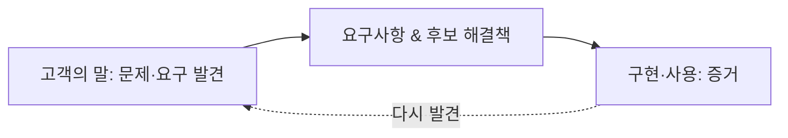

**강사 노트**

- Brooks 인용 근거: "No Silver Bullet — Essence and Accidents of Software Engineering", UNC Technical Report TR86-020(1986), §5.2 "Requirements Refinement and Rapid Prototyping" 원문 확인.
- Bezos 인용 근거: Jeff Bezos, ["2016 Letter to Shareholders"](https://www.aboutamazon.com/news/company-news/2016-letter-to-shareholders)(2017-04 공개), "True Customer Obsession" 원문 확인. 원문 문장은 "…and your desire to delight customers will drive you to invent on their behalf."로 이어지며 앞 절만 옮겼다.
- 고객의 능력을 비판하는 의미가 아니다.
- 실제 사용 맥락, 숨어 있는 요구, 미래 상황을 처음부터 완전하게 표현하기 어렵다는 의미다.
- 초기에 표현된 요구를 가설로 보고 실제 사용과 피드백으로 정제해야 한다는 점을 설명한다.
- 명세의 품질과 실제 필요·가치의 타당성을 구분한다. 「62. 요구사항 검증」에서 검토와 사용 증거의 역할을 연결한다.

---

## 03. 분석 원칙

요구사항을 **구분하고, 필요한 만큼 명세하고, 증거로 검토한다**.

- **구분한다** — 문제·요구·요구사항·해결책을 구분하고 표기보다 문제 이해를 먼저 한다.
- **필요한 만큼 명시한다** — 액터의 목표와 본질적인 이벤트 흐름을 쓰고, 규칙·제약·중요한 예외를 연결한다. 문서량이나 기능 분해를 목표로 하지 않는다.
- **증거로 검토한다** — 문서 승인을 타당성의 보증으로 보지 않고 구현·사용에서 얻은 증거로 판단을 수정한다.

- “배송지 변경 버튼을 만들어 달라”는 요청을 어떻게 **분석**하고, 어떤 **정보**를 더 묻고, 무엇으로 **필요성**을 확인할 것인가?

**강사 노트**

- 세 원칙(**구분**·**필요한 만큼**·**증거**)은 이 세션 전체의 판단 기준이다. 뒤의 topic마다 어느 원칙을 적용하는지 짚는다.
- 마지막 질문은 답을 정하지 않고 열어 둔다. 「05. 요청에는 무엇이 섞여 있는가?」에서 같은 요청을 나눠 본다.

---

## 04. 문제·요구·요구사항·해결책

**요구**는 희망이나 필요일 수 있지만, **요구사항**은 이를 분석·구현·검증할 수 있는 형태로 구체화한 것이다.

**인용문**

"요구사항은 시스템이 따라야 할 **능력과 조건**이다", "Requirements are capabilities and conditions to which the system … must conform", [Larman 2004]

- 요구사항은 필요를 표현한 것이고, 그 필요를 채우는 **해결책**(설계)은 따로 판단한다.

**강사 노트**

- 요구사항 정의 근거: Larman 2004 원문 확인(verify-quote). 생략한 부분은 "and more broadly, the project"다 — 요구사항은 시스템뿐 아니라 프로젝트가 따라야 할 조건도 포함한다.
- 요구사항과 설계(해결책)를 구분하는 관점은 IIBA, *The Business Analysis Standard*(2022)도 같은 취지로 설명한다. 기준 원전이 아니므로 본문에 인용하지 않는다.
- 표의 "문제" 행은 교육용 가정이다. 실제 문제와 원인은 항상 요청자에게 직접 확인한다.

---

## 05. 요청에는 무엇이 섞여 있는가?

요청에 섞인 **문제·요구·요구사항·해결책**을 구분해 본다.

- “주문 상세 화면에 배송지 변경 버튼을 만들어 주세요.”
- "고객이 직접 배송지를 바꿀 수 없다"에서 **무엇을 모르는가?**

**표 — 요청에 섞인 것**

| 구분 | 핵심 질문 | 이 요청에서 |
|---|---|---|
| **문제** | 무엇이 부족한가? | 출고 전 배송지를 고객이 직접 바꿀 수 없다 |
| **요구** | 무엇을 원하는가? | 고객이 직접 배송지를 바꾸고 싶다 |
| **요구사항** | 시스템이 무엇을 충족해야 하는가? | 출고 전 주문의 배송지 변경을 지원한다 |
| **제약** | 반드시 지킬 조건은? | 출고 후에는 일반 변경을 허용하지 않는다 |
| **해결책** | 어떻게 충족하는가? | 요청된 버튼, 그 밖에 편집 화면·챗봇·상담 자동화 |

**강사 노트**

- 표의 구분은 요청 한 문장에 대한 교육용 해석이다. 실제 문제와 출고 조건은 고객에게 확인해 정한다.

- 확인은 「03. 분석 원칙」의 증거로 검토한다.
- 후보 해결책을 여럿 적게 해 요청된 버튼이 **유일한 답이 아님**을 보인다.

---

## 06. 명세의 한계

복잡한 요구는 처음부터 완전하게 명세할 수 없다. 명세가 불완전한 것은 작성자의 성실성 문제가 아니라 **문제의 성질**이다.

- **고객** — 아직 경험하지 않은 해결책의 필요를 정확히 말하기 어렵다.
- **개발자** — 업무의 맥락·예외·암묵적 규칙을 모른다.
- **규칙** — 서로 얽혀 있고 시간이 지나며 바뀐다.
- **문서** — 길어질수록 읽히지 않고 해석이 갈려 합의가 약해진다.

### 그래서 필요한 것

- 고객과 개발자가 **같은 뜻으로 말할 수 있는 작은 단위**로 합의한다.
- **작게 만들어 보여주고 증거로 배우는** 반복으로 명세의 빈틈을 메운다.

**강사 노트**

- 명세를 포기하자는 뜻이 아니다. 완전한 명세를 전제로 한 계획이 깨지는 이유를 설명하고, 다음 두 topic(이벤트, 반복)으로 연결한다.
- 「02. 요구공학의 본질」의 Brooks·Bezos 인용과 같은 문제의식이다.

---

## 07. 이벤트 중심 요구

요구를 정의하는 가장 안정된 단위는 **이벤트**다.

**인용문**

"이벤트 목록은 시스템이 반응해야 하는, **외부 세계에서 일어나는 자극**을 서술한 목록이다", "The event list is a narrative list of the “stimuli” that occur in the outside world and to which our system must respond.", [Yourdon]

- "무엇이 일어나면 시스템은 무엇을 해야 하는가?"는 고객과 개발자가 **혼선 없이 합의**할 수 있다.
- 이벤트는 **업무에서 일어나는 사건**이다. 화면·버튼·기능 이름이 아니다.

**표 — 이벤트와 시스템의 반응**

| 이벤트 | 시스템의 반응 |
|---|---|
| 고객이 주문을 취소한다 | 환불하고 취소 결과를 알린다 |
| 고객이 배송지를 변경한다 | 출고 전이면 배송지를 바꾼다 |
| 배송 시스템이 배송 시작을 알린다 | 주문을 배송 중으로 기록한다 |

**강사 노트**

- 인용 근거: Edward Yourdon, [Just Enough Structured Analysis, Chapter 18](https://web.archive.org/web/20070214052310/http://yourdon.com/strucanalysis/wiki/index.php?title=Chapter_18), "The Event List"(1989년 *Modern Structured Analysis*의 온라인판). 온라인판의 발행 연도를 직접 확인하지 못해 연도를 적지 않았다. Yourdon은 이벤트를 자료 흐름·시간·제어 이벤트로 구분한다.
- "요구 정의 기법의 공통 단위는 이벤트"라는 판단은 여러 기법을 비교한 **이 과정의 관점**이다. 한 문헌이 이렇게 선언한 것은 아니다. 다음 topic에서 기법별 근거를 보인다.
- 복잡하면 이벤트 목록도 한계가 있다. 이벤트 사이의 규칙과 상태는 정적·동적 모델로 보완한다.
- 세 번째 행처럼 **외부 시스템(지원 액터)이 알리는 사건**도 이벤트다(「22. 대상 시스템과 경계」). 교육용 예다. 배송 시작과 출고의 관계는 "03. 정적 모델 — 도메인 개념과 관계"·"04. 동적 모델 — 상호작용과 상태"에서 확인한다.

---

## 08. 이벤트 중심 기법

요구를 다루는 주요 기법은 모두 **이벤트를 출발점**으로 삼는다. 달라지는 것은 **누구의 관점**에서 보는가다.

**인용문**

"도메인 전문가가 관심을 두는 **무언가가 일어났다**", "Something happened that domain experts care about.", [Evans 2015]

**표 — 기법별로 보는 이벤트**

| 기법 | 보는 이벤트 |
|---|---|
| **이벤트–반응 목록** | 외부에서 일어나 시스템이 반응해야 하는 자극 |
| **유스케이스** | 액터가 목표를 위해 시스템과 주고받는 상호작용 |
| **유저 스토리** | 사용자가 원하는 작은 가치의 행위 |
| 도메인 이벤트·이벤트 스토밍 | 업무 전문가가 관심을 두는, 이미 일어난 사건 |

**강사 노트**

- 이 본질 위에서 **이벤트 기반 아키텍처**를 논한다. 요구 이벤트의 합의 없이 기술로서의 이벤트만 도입하면 복잡성만 늘어난다.
- 기법별 표현: 이벤트–반응 목록은 이벤트와 반응, 유스케이스는 이벤트 흐름과 시스템 오퍼레이션, 유저 스토리는 카드·대화·확인, 도메인 이벤트는 과거형 이벤트와 타임라인으로 표현한다.
- 이벤트 스토밍: "이벤트 스토밍은 복잡한 업무 영역을 함께 탐색하는 유연한 워크숍 형식이다(EventStorming is a flexible workshop format for collaborative exploration of complex business domains.)" — Alberto Brandolini, [EventStorming](https://www.eventstorming.com/) 공식 사이트(게시 연도 미표기).
- 인용 근거: Eric Evans, [Domain-Driven Design Reference](https://www.domainlanguage.com/wp-content/uploads/2016/05/DDD_Reference_2015-03.pdf), 2015, "Domain Events".
- 표는 기법의 전체 정의가 아니라 "어떤 이벤트를 보는가"만 비교한 교육용 정리다. 유스케이스·유저 스토리는 이 세션 뒤에서, 도메인 이벤트와 이벤트 기반 아키텍처는 "13. OOAD에서 전문영역으로 — Architecture · DDD · MSA"에서 다룬다.

---

## 09. 반복적 접근

명세의 한계를 다루는 방법은 시기마다 다른 이름으로 주목받았지만 본질은 같다. **작게 만들고, 보여주고, 증거로 배운다.**

**표 — 접근별 반복의 단위**

| 접근 | 핵심 질문 | 반복의 단위 |
|---|---|---|
| **반복·점진(I&I)** | 작게 나눠 만들며 무엇을 배우는가? | 반복 주기 |
| **나선형 모델** | 가장 큰 위험을 무엇으로 먼저 줄이는가? | 위험 검토 주기 |
| **프로토타이핑** | 사용자가 보고 무엇을 새로 말하는가? | 시제품 |
| **애자일** | 작동하는 소프트웨어로 무엇을 배우는가? | 짧은 반복·릴리스 |
| **디자인 씽킹(DT)** | 실제로 풀어야 할 문제는 무엇인가? | 공감·정의·시제품·테스트 |
| **Lean Startup** | 이 사업 가설이 맞는가? | 만들기–측정–학습 |
| **Lean UX** | 이 해결책 가설이 맞는가? | 가설과 실험 |

**강사 노트**

- 표는 각 접근 전체의 정의가 아니라 요구의 불확실성을 다루는 방식을 비교한 교육용 정리다. 시대별 우열을 주장하지 않는다.
- 참고: Craig Larman·Victor R. Basili, "Iterative and Incremental Development: A Brief History", IEEE Computer, 2003; Barry Boehm, "A Spiral Model of Software Development and Enhancement", IEEE Computer, 1988; Eric Ries, *The Lean Startup*, 2011.
- 디자인 씽킹의 사람·기술·사업 관점과 반복적 검토: IDEO, [Design Thinking](https://designthinking.ideo.com/).
- 고객 가치·낭비·실험: Lean Enterprise Institute, [What is Lean?](https://www.lean.org/explore-lean/what-is-lean/).
- 가설·실험·학습의 구성: Jeff Gothelf·Josh Seiden, [Lean UX, 3rd Edition](https://www.oreilly.com/library/view/lean-ux-3rd/9781098116293/ch01.html), 2021, 출판사 공개 목차의 Chapters 10–12·15. 책 본문 전체를 인용하는 것이 아니다.
- 작동하는 소프트웨어의 잦은 전달·변화 수용·회고: [애자일 선언의 원칙](https://agilemanifesto.org/principles.html).

---

## 10. AI 시대의 요구

AI 시대에도 요구의 본질은 변하지 않는다. 새 용어들은 요구를 **AI가 실행할 수 있게 전달하고 검증하는 수단**이다.

- **사고와 검증은 사람이** 한다. **확실해진 작업은 AI가 점진적으로 대체**한다.

**표 — AI 용어와 요구공학**

| AI 용어 | 요구공학에서 대응하는 것 |
|---|---|
| **프롬프트** | 요청과 요구 진술 — 무엇을 원하는가? |
| **컨텍스트** | 문제영역 지식, 이벤트·유스케이스, 모델 |
| **온톨로지** | 개념과 관계의 의미 — 정적 모델, 용어집 |
| **가드레일** | 규칙·제약·품질 요구 |
| **하네스** | 검증 환경 — 인수 조건, 예, 테스트 |

**강사 노트**

- 사람은 문제·이벤트·규칙을 정하고 결과가 맞는지 판단한다. AI에는 명세가 분명하고 검증할 수 있는 부분부터 넘긴다.
- 표의 대응은 교육용 비유다. 각 용어의 정의를 일대일로 같다고 주장하지 않는다.
- "01. OOAD 개요"의 「AI-native SW공학」과 연결한다. Human·Agent 역할과 가드레일·하네스의 구성은 "14. AI-native SW공학"에서 다룬다.
- 요구가 불명확한 부분을 AI에 넘기면 추측이 코드가 된다. 앞의 이벤트 합의와 반복적 검증이 AI 시대에도 그대로 필요한 이유다.

---

## 11. 요구공학의 주요 활동

요구공학(Requirements Engineering)은 이해관계자의 요구를 **수집·분석·명세·검증하고 변경을 관리하는 공학 활동**이다.

### 다섯 가지 활동

- **요구 수집:** 이해관계자의 문제·목표·필요를 찾아낸다.
- **요구 분석:** 요구를 정제하고 관계·충돌·우선순위를 분석한다.
- **요구 명세:** 합의하고 검토할 수 있는 형태로 표현한다.
- **요구 검증:** 잘 작성되었는지, 실제 필요한 것인지 확인한다.
- **요구 관리:** 기준선·변경·추적·영향을 관리한다.

**강사 노트**

- 요구공학의 수집·분석·명세·검증·관리 활동을 연결한다.

- 이 다섯 활동은 수업의 설명 구조이며 표준의 절·분류를 그대로 옮긴 것이 아니다. 요구공학 표준의 범위는 [ISO/IEC/IEEE 29148:2018 공식 설명](https://www.iso.org/standard/72089.html), 반복적 요구 탐색은 Craig Larman의 [Evolutionary Requirements](https://www.craiglarman.com/wiki/downloads/applying_uml/larman-ch5-applying-evolutionary-requirements.pdf)(*Applying UML and Patterns*, 3rd ed., Chapter 5)를 근거로 한다.

---

## 12. 요구사항 수집과 발견

요구는 한 사람의 말이나 한 종류의 자료만으로 확정하지 않는다. 여러 출처에서 얻은 **증거를 교차검증**하며 발견하고 정제한다.

**표 — 요구 발견 방법**

| 방법 | 발견에 유용한 정보 | 한계·주의 |
|---|---|---|
| **인터뷰** | 경험·목표·문제 | 말로 표현 가능한 것에 편향 |
| **워크숍** | 관점 차이·충돌·합의 | 참여자 구성의 영향 |
| **관찰** | 실제 업무·암묵지 | 시간·접근 비용 |
| **설문** | 넓은 집단의 경향 | 깊이 부족 |
| **문서 분석** | 규정·정책 | 실제 업무와 다를 수 있음 |
| **기존 시스템 분석** | 현재 동작·제약 | 기존 해결책에 사고가 고정될 수 있음 |
| **로그·데이터 분석** | 실제 행동의 증거 | 행동의 이유는 직접 설명하지 못함 |
| **프로토타입** | 숨어 있는 요구·사용 반응 | 해결책을 너무 일찍 고정할 위험 |

**강사 노트**

- 표의 방법은 서로를 **보완**한다. 한 방법으로 얻은 결과를 다른 방법으로 교차검증하게 한다.
- 로그·데이터와 프로토타입은 「09. 반복적 접근」의 **사용 증거**와 이어진다.

---

## 13. 누가 요구를 아는가?

요구를 정의하는 방법은 **누가 업무를 알고 있는가**에 따라 달라야 한다. 고객과 개발자의 업무 지식을 조합하면 네 가지 경우가 된다.

**표 — 누가 요구를 아는가**

| 경우 | 고객 | 개발자 | 주요 위험 | 접근 |
|---|---|---|---|---|
| **모두 앎** | 앎 | 앎 | 당연한 가정의 누락 | 이벤트 목록·명세로 합의하고 예외를 검토 |
| **고객만 앎** | 앎 | 모름 | 암묵지 전달 실패·오해 | 관찰·전문가 참여·용어집·구체적 예·프로토타입 |
| **개발자만 앎** | 모름 | 앎 | 개발자가 요구를 대신 결정 | 선택지·프로토타입을 보이고 고객이 결정 |
| **모두 모름** | 모름 | 모름 | 추측을 사실로 확정 | 가설·작은 실험·사용 증거로 학습 |

**강사 노트**

- "개발자만 앎"은 업계 표준·패키지·규제 지식을 개발 측이 더 많이 가진 경우다. 이때도 결정은 고객의 몫이다.
- 한 프로젝트 안에서도 영역마다 경우가 다르다. 「15. 경우별 접근법」에서 주문 시스템 영역별로 적용한다.

---

## 14. 업무·기술 불확실성

**업무**(무엇을 할 것인가)와 **기술**(어떻게 실현할 것인가)의 불확실성을 따로 본다. 둘을 섞으면 기술 검증을 요구 분석으로, 요구 탐색을 기술 과제로 착각한다.

**표 — 업무·기술 불확실성에 따른 접근**

| 경우 | 업무 | 기술 | 접근 |
|---|---|---|---|
| **명확·확실** | 명확 | 확실 | 명세 중심으로 계획하고 구현한다 |
| **업무 불명확** | 불명확 | 확실 | 요구 탐색 중심 — 프로토타입, 이벤트 워크숍, 짧은 반복 |
| **기술 불확실** | 명확 | 불확실 | 기술 검증 중심 — 스파이크·개념 증명으로 위험을 먼저 줄인다 |
| **모두 불확실** | 불명확 | 불확실 | 가설 검증 중심 — 가장 작은 실험, 위험 순서의 반복 |

**강사 노트**

- 두 축의 구분은 이 과정의 판단 틀이다. 같은 축을 쓰는 다른 도구가 있지만 특정 도구의 정의를 옮긴 것이 아니다.
- 기술 불확실성을 줄이는 스파이크·개념 증명은 요구 분석의 산출물이 아니다. 결과가 요구에 영향을 주면 요구로 되돌린다.

---

## 15. 경우별 접근법

앞의 두 표를 겹치면 **영역마다 요구 기법이 달라진다**. 하나의 방법을 프로젝트 전체에 일괄 적용하지 않는다.

**표 — 주문 시스템 영역별 요구 기법**

| 주문 시스템의 영역 | 경우 | 요구 기법 |
|---|---|---|
| **배송지 변경** | 모두 앎 · 명확·확실 | 이벤트 목록, 시스템 오퍼레이션 계약 |
| **주문 취소·환불 규칙** | 고객만 앎 · 업무 명확 | 관찰·인터뷰, 유스케이스 명세, 구체적인 예(BDD) |
| **결제 대행 연동** | 개발자만 앎 · 기술 불확실 | 스파이크로 검증, 선택지를 보여주고 고객이 결정 |
| **정기배송 건너뛰기** | 모두 모름 · 업무 불명확 | 프로토타입, 작은 출시, 사용 데이터 |

**강사 노트**

- 영역별 경우는 교육용 가정이다.

- 표의 영역별 경우는 **교육용 가정**이다. 실제 프로젝트에서는 영역마다 누가 무엇을 아는지 먼저 확인한다.
- 정기배송은 이 과정 실습의 관통 사례다(「66. 실습 — 유스케이스」).

---

## 16. 요구사항 유형

요구는 **FURPS+**로 나눠 빠뜨린 종류가 없는지 확인한다. 기능만이 요구가 아니다.

**표 — FURPS+ (Larman, 2004)**

| 유형 | 내용 | 주문 사례 |
|---|---|---|
| **기능**(Functional) | 기능, 능력, 보안 | 배송지를 변경한다, 다른 고객의 주문은 볼 수 없다 |
| **사용성**(Usability) | 인적 요소, 도움말, 문서 | 모바일에서도 배송지를 변경할 수 있다 |
| **신뢰성**(Reliability) | 장애 빈도, 복구 가능성, 예측 가능성 | 결제 장애에도 주문이 유실되지 않는다 |
| **성능**(Performance) | 응답 시간, 처리량, 정확도, 가용성, 자원 사용 | 주문 조회의 응답 시간 |
| **지원성**(Supportability) | 적응성, 유지보수성, 국제화, 설정 가능성 | 배송 정책을 바꿔도 영향이 작다 |
| **+** | 구현·인터페이스·운영·패키징·법률 같은 부가 요소 | 결제 대행(PG)과의 인터페이스 제약 |

- 기능 요구는 **유스케이스**에 쓴다. 나머지는 주로 **보조 명세서**(Supplementary Specification) — 유스케이스에 없는 모든 요구 — 에 둔다.
- 용어는 **용어집**에, 여러 유스케이스에 공통인 규칙은 **업무 규칙**(Business Rules)에 둔다.

**강사 노트**

- 근거: Larman 2004 원문 확인(verify-quote) — FURPS+의 각 유형과 "+"의 부가 요소, 보조 명세서("everything not in the use cases"). 표의 "주문 사례" 열은 교육용 예다.
- 품질 요구를 검증 가능하게 만드는 질문은 「47. 유스케이스와 품질속성」에서 다룬다.

---

## 17. 좋은 요구사항의 자격요건

좋은 요구사항은 **개별 문장**과 **요구사항 집합**을 따로 검토한다.

**표 — ISO/IEC/IEEE 29148:2018의 요구사항 특성**

| 범위 | 특성 | 의미 |
|---|---|---|
| **개별** | **필요함** | 없으면 결함이 되는, 반드시 있어야 하는 능력·특성을 기술하는가? |
|  | **적절함** | 이해관계자에 맞는 추상화 수준이며 불필요한 제약·구현 세부사항을 넣지 않는가? |
|  | **명확함** | 하나로만 해석되도록 명확하게 서술했는가? |
|  | **완전함** | 이해에 필요한 정보를 그 서술 안에 모두 담았는가? |
|  | **단일함** | 하나의 능력·특성만 기술하는가? |
|  | **실현 가능함** | 주어진 제약 안에서 수용 가능한 위험으로 실현할 수 있는가? |
|  | **검증 가능함** | 충족 여부를 증명·측정할 수 있게 서술했는가? |
|  | **정확함** | 실제 필요를 정확히 반영하는가? |
|  | **형식 준수** | 합의된 서식·표현 규칙을 따르는가? |
| **집합** | **완전함** | 해결책에 필요한 요구를 모두 포함하는가? |
|  | **일관됨** | 요구 사이에 충돌이 없고 용어가 일관되는가? |
|  | **실현 가능함** | 전체를 함께 고려해도 제약 안에서 실현할 수 있는가? |
|  | **이해 가능함** | 관련 이해관계자가 이해할 수 있는가? |
|  | **타당성 확인 가능함** | 실제 이해관계자 의도와 맞는지 확인할 수 있는가? |

**강사 노트**

- 위반 사례 — `배송지를 신속하게 변경한다.`는 명확함·검증 가능함 위반이다. `신속하게`가 측정 조건 없이 해석에 따라 달라진다.

- 근거: ISO/IEC/IEEE 29148:2018, §5.2.5(개별 요구사항의 특성)·§5.2.6(요구사항 집합의 특성). 공식 미리보기의 목차로 절의 구분만 확인했고, 절 본문은 확인하지 못했다.
- 9가지·5가지를 매번 기계적으로 전부 채점하지 않는다. 문제가 되는 특성을 짚어 설명하는 도구로 쓴다.
- 근거 없이 응답 시간 숫자를 넣는 것으로 검증 가능성을 가장하지 않는다.

---

## 18. 용어집

**용어집**(Glossary)은 요구에 쓰는 용어의 **뜻과 규칙**을 한 곳에 고정한다. 이 과정에서는 요구부터 코드까지 모든 모델이 쓰는 **이름의 원천**이다.

**표 — 주문 시스템 용어집**

| 용어 | 정의 | 용어 수준의 업무 규칙 | 영문명 |
|---|---|---|---|
| **단가** | 주문 시점에 확정한 한 개의 가격 | 0원 이상, 판매가가 바뀌어도 그대로 | `unitPrice` |
| **수량** | 한 상품을 몇 개 사는가? | 1 이상의 정수 | `Quantity` |
| **주문 상태** | 주문이 지금 어느 단계인가? | 결제 대기 ~ 취소됨 중 하나 | `OrderStatus` |

- **한 용어, 한 뜻** — 동의어(주문 상품·주문 항목)는 하나로 정하고, 동음이의어(주문 취소·결제 취소)는 나눈다.
- **업무 규칙** — 값의 범위·형식·단위는 용어에 붙는다. 데이터 모델의 **도메인**, DDD **값 객체**의 출발점이다.
- **영문명** — 분석은 **한글 용어**, 설계·코드는 영문명과 **명명 규칙**으로 쓴다.

**페이지 분할**

### 같은 목적의 장치

**표 — 한 뜻, 한 이름을 지키는 장치**

| 장치 | 고정하는 것 | 용어집과의 관계 |
|---|---|---|
| **자료 사전(DD)** | 자료의 구성과 값 | 용어집은 업무 용어의 뜻을 고정한다 |
| **XP 메타포** | 시스템 전체의 비유 | 쓸모 있으면 공통 언어에 흡수한다 |
| **공통 언어(UL)** | 대화·문서·코드의 같은 말 | 용어집은 그것을 글로 고정한 형태다 |
| **명명 규칙** | 이름의 형식 | 용어집의 영문명을 코드 이름으로 쓴다 |

- **규칙 → 도메인 → 값 객체** — 용어의 규칙(수량은 1 이상)은 데이터 모델의 **도메인**, 코드의 **값 객체** `Quantity`가 된다.

**강사 노트**

- 「17. 좋은 요구사항의 자격요건」의 집합 특성 "일관됨(용어가 일관되는가?)"을 지키는 도구가 용어집이다. 명세서·SSD·계약이 같은 용어를 같은 뜻으로 쓰는지 용어집으로 확인한다.
- 표는 세 용어만 보였다. 과정의 용어집에는 주문 `Order`, 주문 항목 `OrderItem`, 판매가 `salePrice`, 출고 `dispatch`, 배송 시작 `deliveryStarted` 등이 함께 있다.
- **용어 수준의 업무 규칙**은 한 값만 보고 판단할 수 있는 규칙이다(수량 ≥ 1, 금액 ≥ 0, 상태 값 목록). 여러 용어가 얽힌 규칙(배송 시작 전에만 취소)은 명세서의 업무 규칙에 둔다. 용어 규칙은 "03. 정적 모델 — 도메인 개념과 관계"의 「속성 도메인」·「속성 수준 업무 규칙」에서 데이터 모델의 도메인·값 객체로 이어지고, 코드에서는 값이 만들어질 때 검사한다.
- 판매가와 단가, 출고와 배송 시작처럼 **비슷하지만 다른** 용어가 가장 위험하다. 이 과정의 뒤 세션들이 이 구분을 모델과 코드로 확인한다.
- 영문명을 요구 단계에서 정하는 이유 — 설계·코드에서 개발자마다 다른 영어로 옮기면 한 용어가 여러 이름이 된다. 과정의 전체 용어집과 명명 규칙은 과정 설계의 "영한 용어집과 명명 규칙"이 원천이다.
- 용어집은 "03. 정적 모델 — 도메인 개념과 관계"에서 도메인 모델과 함께 정제하고, 설계 이름으로의 전환은 "05. 구조적 경계와 의존성"에서 보인다.
- **자료 사전**(Data Dictionary, DD)과의 관계 — 구조적 분석의 자료 사전은 시스템에 관련된 **자료 요소**를 정밀하게 정의한 목록으로, 사용자와 분석가가 입력·출력·저장소·계산에 공통 이해를 갖게 한다. 별칭이 생기면 사용자들이 **하나의 이름**에 합의하게 하라고도 권한다. 근거: Edward Yourdon, *Just Enough Structured Analysis*, Chapter 10 "Data Dictionary"(yourdon.com, 2006) 원문 확인. 용어집이 **업무 용어의 뜻**을 고정한다면 자료 사전은 **자료의 구성과 값**을 정의한다. 데이터 모델링의 표준 용어·도메인 사전이 이 전통을 잇는다.
- **애자일의 메타포**와의 관계 — XP(익스트림 프로그래밍)의 실천 "메타포"는 시스템 전체를 이해하는 구체적인 비유를 팀이 공유해 설계와 이름을 이끄는 방식이다. Evans는 그런 비유가 쓸모 있으면 설계를 그 비유로 조직하고 **공통 언어에 흡수**하되, 비유는 부정확하므로 계속 다시 보라고 권한다. 근거: Eric Evans, [DDD Reference](https://www.domainlanguage.com/wp-content/uploads/2016/05/DDD_Reference_2015-03.pdf), 2015, "System Metaphor" 원문 확인. 메타포는 **전체의 그림**, 용어집은 **낱말의 뜻**이다.
- **공통 언어**(Ubiquitous Language, UL)와의 관계 — DDD는 모델을 언어의 뼈대로 삼아 팀의 대화·문서·도식과 **코드**에서 같은 언어를 쓰고, 언어가 바뀌면 모델이 바뀐 것으로 보며, 코드의 클래스·메서드·모듈 이름도 새 모델에 맞춰 바꾸라고 한다. 근거: 같은 문서, "Ubiquitous Language" 원문 확인. 용어집은 공통 언어를 **글로 고정한 한 형태**이고, 공통 언어는 경계(Bounded Context) 안에서 쓰는 살아 있는 언어다 — 본격 논의는 "13. OOAD에서 전문영역으로 — Architecture · DDD · MSA".
- **명명 규칙**과의 관계 — 용어집은 **무엇을 뜻하는가**를, 명명 규칙은 그 뜻을 설계·코드의 **이름으로 옮기는 형식**(대소문자, 동사, 약어)을 정한다. 데이터 모델링의 표준 용어가 한글명(논리명)과 영문명(물리명)을 함께 두는 것과 같은 구조다. 이 과정은 분석을 한글 용어로, 설계를 영문명과 명명 규칙으로 쓴다("05. 구조적 경계와 의존성"의 「05. 설계의 이름」).
- 네 가지는 모두 **한 뜻, 한 이름**을 지키는 장치다 — 자료 사전은 자료, 메타포는 전체 구조의 비유, 공통 언어는 대화에서 코드까지, 명명 규칙은 이름의 형식을 맡는다. 이 과정은 용어집(영문명 포함)과 명명 규칙으로 이를 실천한다.

---

## 19. 유스케이스란 무엇인가?

**인용문**

"유스케이스는 액터가 목표를 이루려고 시스템을 쓰는, 서로 관련된 **성공·실패 시나리오의 묶음**이다", "A use case is a collection of related success and failure scenarios that describe an actor using a system to support a goal.", [Larman 2004]

  - "유스케이스는 다이어그램이 아니라 **글**이며, 유스케이스 모델링은 주로 글을 쓰는 일이다", "Use cases are text documents, not diagrams, and use-case modeling is primarily an act of writing text, not drawing diagrams.", [Larman 2004]

- 유스케이스(Use Case)는 기능을 나열하는 단위가 아니라, 액터(Actor)가 목표를 이루는 **시스템 사용의 이야기**다.
- 통합 모델링 언어(UML)에서 유스케이스는 **타원**으로 표시한다. UML은 유스케이스가 액터에게 **가치 있는 관찰 가능한 결과**를 만든다고 정의한다[OMG 2017].

**도식 — SVG — 유스케이스 표기**

```svg:uml
<svg xmlns="http://www.w3.org/2000/svg" width="320" height="80" viewBox="0 0 320 80" role="img" aria-label="유스케이스 표기: 타원 안의 주문을 관리한다">
<style>text{font-family:sans-serif;font-size:17px;fill:#000;text-anchor:middle}.t{font-weight:bold}.st{font-size:16px}.h{paint-order:stroke;stroke:#fff;stroke-width:6px;stroke-linejoin:round}.s{fill:#fff;stroke:#181818;stroke-width:1.5}.u{fill:#fff;stroke:#181818;stroke-width:1.5}.x{fill:#fff;stroke:#1B3A6B;stroke-width:1.5}.c{fill:#fff;stroke:#1B3A6B;stroke-width:3}.w{font-weight:bold}.n{fill:#fff;stroke:#181818;stroke-width:1.2}.l{stroke:#181818;stroke-width:1.3;fill:none}.d{stroke:#181818;stroke-width:1.3;fill:none;stroke-dasharray:6,5}.f{stroke:#1B3A6B;stroke-width:1.6;fill:none}.a{fill:#fff;stroke:#181818;stroke-width:1.4}</style>
<defs><marker id="o" viewBox="0 0 12 12" refX="11" refY="6" markerWidth="12" markerHeight="12" orient="auto" markerUnits="userSpaceOnUse"><path d="M1,1 L11,6 L1,11" fill="none" stroke="#181818" stroke-width="1.4"/></marker><marker id="f" viewBox="0 0 12 12" refX="11" refY="6" markerWidth="12" markerHeight="12" orient="auto" markerUnits="userSpaceOnUse"><path d="M0,0 L12,6 L0,12 Z" fill="#1B3A6B"/></marker><marker id="g" viewBox="0 0 16 16" refX="15" refY="8" markerWidth="16" markerHeight="16" orient="auto" markerUnits="userSpaceOnUse"><path d="M1,1 L15,8 L1,15 Z" fill="#fff" stroke="#181818" stroke-width="1.4"/></marker></defs>
<rect width="320" height="80" fill="#fff"/>
<ellipse class="u" cx="160" cy="40" rx="98" ry="30"/><text x="160" y="46">주문을 관리한다</text>
</svg>
```

**강사 노트**

- 정의 근거: Larman 2004 원문 확인(verify-quote). 원문은 "Informally then, a use case is …"로 시작한다.
- OMG 정의 근거: OMG Unified Modeling Language 2.5.1(2017-12), UseCase Description 원문 확인(verify-quote) — "A UseCase specifies a set of actions performed by its subjects, which yields an observable result that is of value for one or more Actors or other stakeholders of each subject."
- 대화는 액터와 시스템의 외부 상호작용을 뜻한다. 의미 없는 요청·처리 반복을 피한다는 작성 원칙을 상호작용 자체의 금지로 확대하지 않는다.
- 액터·시스템 경계·연관은 이후 주제에서 단계적으로 설명한다.

---

## 20. 왜 유스케이스가 필요한가?

유스케이스는 기능 목록이 아니라 액터의 **목표와 가치**로 시스템이 제공할 책임을 찾는다.

**표 — 표현별 단위와 질문**

| 표현 | 단위 | 답하는 질문 | 유스케이스로 옮길 때의 위험 |
|---|---|---|---|
| 기능 분해도 | 기능·하위 기능 | 무엇을 처리하는가? | 목표 없는 기능 조각 |
| 자료 흐름도(DFD) | 자료를 생성·변경하는 처리 | 사건마다 어떤 자료가 생기고 바뀌는가? | 처리 단계가 유스케이스가 됨 |
| CRUD 매트릭스 | 엔티티 × 생성·조회·수정·삭제 | 누가 어떤 자료에 접근하는가?(상세 설계) | 자료 접근 목록이 요구를 대신함 |
| 화면 명세 | 화면·버튼 | 어떻게 보이고 조작하는가? | 해결책이 요구를 대신함 |
| **유스케이스** | **액터의 목표** | **누가 무엇을 위해 무엇을 얻는가?** | — |

- 주문 취소·배송지 변경처럼 **같은 주문을 유지하는** 조작은 유스케이스를 나누지 않고 대안 흐름과 시스템 오퍼레이션으로 상세화한다.

**강사 노트**

- 유스케이스는 행위 요구를 표현하고 다른 요구를 연결하는 중심이 된다. Cockburn은 유스케이스를 요구사항 문서의 "3장"(행위 요구)이라 부른다(Alistair Cockburn, *Writing Effective Use Cases*, 2000).

- 자료·기능 중심 분해가 쓸모없다는 뜻이 아니다. 자료 구조는 "03. 정적 모델 — 도메인 개념과 관계"에서 다루고, 유스케이스는 **목표와 가치**를 묻는 관점이다.
- 대안 흐름과 시스템 오퍼레이션은 「33. 유스케이스 상세화」와 「43. 시스템 이벤트와 오퍼레이션」에서 상세화한다.

---

## 21. 유스케이스 작성 절차

유스케이스는 **경계 → 주 액터 → 목표 → 유스케이스** 순서로 찾고(Larman, 2004), 찾은 유스케이스를 필요한 깊이까지 쓴다.

- **1단계** — 경계는 「22. 대상 시스템과 경계」, **2·3단계** — 액터와 목표는 「24. 목표와 액터」에서 정한다. 둘은 함께 찾는다.
- **4단계** — 유스케이스 이름은 **목표**로 짓는다: `주문을 관리한다`(「25. 유스케이스 후보 식별」).
- 찾은 유스케이스는 모두 **같은 깊이**로 쓰지 않는다(「28. 유스케이스 명세 형식」). 정식으로 쓴 명세서가 SSD와 계약의 입력이 된다.

**강사 노트**

- 근거: Larman 2004 원문 확인(verify-quote) — "1. Choose the system boundary." "2. Identify the primary actors…" "4. Define use cases that satisfy user goals; name them according to their goal." 원문은 2·3단계를 엄격하게 순서 짓는 것이 인위적이라고 덧붙인다.
- 절대적인 순차 절차가 아니다. 실제 분석에서는 필요한 만큼 앞뒤로 반복한다.

---

## 22. 대상 시스템과 경계

**다이어그램 — 유스케이스 다이어그램**

유스케이스 작업은 **시스템 경계를 고르는 것**에서 시작한다. 경계 안은 대상 시스템의 책임이고, 밖은 액터다.

**인용문**

"유스케이스 다이어그램은 시스템의 **경계와 그 밖에 있는 것, 시스템이 쓰이는 방식**을 보여 주는 좋은 컨텍스트 다이어그램이다", "A use case diagram is an excellent picture of the system context; it makes a good context diagram, that is, showing the boundary of a system, what lies outside of it, and how it gets used.", [Larman 2004]

**도식 — SVG — 주문 시스템의 경계**

```svg:uml
<svg xmlns="http://www.w3.org/2000/svg" width="940" height="300" viewBox="0 0 940 300" role="img" aria-label="주문 시스템의 경계: 왼쪽에 주 액터 고객, 오른쪽에 지원 액터 상품·회계·결제·배송 시스템, 경계 안은 아직 비어 있음">
<style>text{font-family:sans-serif;font-size:17px;fill:#000;text-anchor:middle}.t{font-weight:bold}.st{font-size:16px}.s{fill:#fff;stroke:#181818;stroke-width:1.5}.x{fill:#fff;stroke:#1B3A6B;stroke-width:1.5}.l{stroke:#181818;stroke-width:1.3;fill:none}.a{fill:#fff;stroke:#181818;stroke-width:1.4}.g{fill:#777}</style>
<rect width="940" height="300" fill="#fff"/>
<rect class="s" x="250" y="8" width="380" height="284"/><text class="t" x="440" y="36">주문 시스템</text>
<text class="g" x="440" y="144">유스케이스 — 액터의 목표를 찾아</text><text class="g" x="440" y="170">경계 안에 채운다</text>
<circle class="a" cx="110" cy="122" r="8"/><path class="l" d="M110,130 L110,152 M96,138 L124,138 M110,152 L98,170 M110,152 L122,170"/><text x="110" y="192">고객</text><text class="st g" x="110" y="214">주 액터</text>
<rect class="x" x="730" y="8" width="190" height="52"/><text class="st" x="825" y="28">«actor»</text><text x="825" y="50">상품 시스템</text>
<rect class="x" x="730" y="72" width="190" height="52"/><text class="st" x="825" y="92">«actor»</text><text x="825" y="114">회계 시스템</text>
<rect class="x" x="730" y="136" width="190" height="52"/><text class="st" x="825" y="156">«actor»</text><text x="825" y="178">결제 시스템</text>
<rect class="x" x="730" y="200" width="190" height="52"/><text class="st" x="825" y="220">«actor»</text><text x="825" y="242">배송 시스템</text>
<text class="st g" x="825" y="280">지원 액터</text>
</svg>
```

- **경계 안** — 주문 시스템은 장바구니, 주문의 성립과 상태, 배송지 변경, 취소, 그리고 외부 시스템과의 **조정**을 책임진다.
- **경계 밖** — 목표를 이루려고 시스템을 쓰는 **주 액터**(고객)와, 시스템에 서비스를 제공하는 **지원 액터**(상품·회계·결제·배송 시스템)다.
- **경계를 고르는 질문** — 소프트웨어만인가, 하드웨어와 함께인가, 쓰는 사람까지인가, 조직 전체인가? [Larman 2004]

**강사 노트**

- 인용 근거: Larman 2004 원문 확인(verify-quote). 경계를 고르는 질문은 같은 책의 유스케이스 작성 절차 1단계("Choose the system boundary.")의 요약이다.
- 경계는 이 그림에서 정하고, 경계 안의 유스케이스는 「25. 유스케이스 후보 식별」에서 찾아 「27. 유스케이스 다이어그램 — 초안」에서 채운다. 외부 시스템과 오가는 요청은 「44. 정제된 SSD」에서 보인다.
- 이 요구분석 경계를 최종 배포·아키텍처 경계와 동일시하지 않는다.
- 관리자와 배송 담당자는 주문 시스템의 액터가 아니라 그림에 없다. 각자 상품 시스템과 배송 시스템을 쓴다(「27. 유스케이스 다이어그램 — 초안」의 경계 밖 유스케이스).
- 결제 시스템은 결제 대행(PG)이다. 배송 시스템을 외부 배송 대행사가 운영하는지는 운영 형태의 문제이며 경계 판단은 같다.

---

## 23. 경계 판단

어떤 책임을 대상 시스템 안에 둘지, 외부 시스템(지원 액터)으로 둘지는 **소유**로 판단한다.

**표 — 소유에 따른 경계 판단**

| 외부 시스템으로 둔다 | 대상 시스템 안에 둔다 |
|---|---|
| 다른 조직·팀이 그 책임과 데이터를 **소유**한다 | 대상 시스템이 그 데이터의 **원천**이다 |
| 이미 운영 중인 시스템이 있다 | 새로 만들 책임이며 따로 운영할 이유가 없다 |
| 생애·변경 주기가 다르다 | 대상 시스템의 목표와 함께 바뀐다 |

### 두 방향의 잘못

- 판단 질문 — **이 책임의 데이터와 규칙을 누가 소유하는가?**

**표 — 경계를 잘못 둔 예**

| 잘못된 예 | 결과 |
|---|---|
| 주문 시스템이 재고·입금·영수증·출고를 모두 처리한다 | 경계가 **비대**해지고, 회계·물류 규칙이 주문의 요구에 섞인다 |
| 기능마다 별도 시스템으로 떼어 액터로 둔다(주문 DB, 결제 모듈) | 시스템 **안의 요소**를 액터로 만든다 |

**강사 노트**

- 이 사례에서 재고는 상품 시스템, 입금·영수증은 회계 시스템, 출고·배송은 배송 시스템이 소유한다고 전제한다. 모든 쇼핑몰이 이렇게 나뉜다는 뜻이 아니다. 새로 만드는 작은 쇼핑몰이라면 한 시스템에 둘 수 있다.
- 주문 시스템 **내부**의 구조적 경계와 외부 시스템에 대한 의존 방향은 "05. 구조적 경계와 의존성"에서 다룬다.
- 시스템 안의 요소를 액터로 만드는 잘못은 「38. 잘못된 관행 — 시스템 관점·액터」에서 다룬다.

---

## 24. 목표와 액터

액터를 먼저 나열하기보다, 먼저 **달성해야 할 목표**를 식별하고 그 목표를 가진 역할을 액터로 찾는다.

- **어떤 가치 있는 목표를 달성해야 하는가? 그 목표를 원하는 역할은 누구인가?**
- **액터**는 행위를 하는 외부의 무엇이다 — 사람(역할), 컴퓨터 시스템, 조직[Larman 2004].
  - **주 액터**는 목표를 이루려고 시스템을 쓰고, **지원 액터**는 시스템에 서비스를 제공한다.
  - **무대 밖 액터**(offstage)는 유스케이스의 결과에 관심이 있지만 주 액터도 지원 액터도 아니다 — 예: 매출 기록을 보는 쇼핑몰 운영사.

**표 — 액터–목표 목록**

| 목표 | 주 액터 | 지원 액터 | 시스템 |
|---|---|---|---|
| 주문을 관리한다 — 주문·확인·배송지 변경·취소 | 고객 | 결제·상품·회계·배송 시스템 | 주문 시스템 |
| 배송 현황을 조회한다 | 고객 | 배송 시스템 | 주문 시스템 |
| 배송을 처리한다 — 출고·배송 시작 | 배송 담당자 | — | **배송 시스템** |
| 상품 정보를 관리한다 — 등록·수정·판매 중지 | 관리자 | — | **상품 시스템** |


**강사 노트**

- 이 액터–목표 목록으로 유스케이스 다이어그램을 그린다(「27. 유스케이스 다이어그램 — 초안」).

- 주 액터의 목표를 출발점으로 삼되 지원 액터를 빠뜨리지 않는다. 아래 두 목표는 다른 시스템의 것이다. 주문 시스템의 범위에 넣지 않는다(「23. 경계 판단」). 근거: OMG [UML 2.5.1](https://www.omg.org/spec/UML/2.5.1/PDF); Larman 2004.
- 액터 정의와 세 종류는 Larman 2004 원문 확인(verify-quote) — "an actor is something with behavior, such as a person (identified by role), computer system, or organization", "Supporting actor provides a service (for example, information) to the SuD.", "Offstage actor has an interest in the behavior of the use case, but is not primary or supporting". 무대 밖 액터의 예(쇼핑몰 운영사)는 교육용 예이며 명세서의 **이해관계자와 관심사**로 이어진다.

---

## 25. 유스케이스 후보 식별

유스케이스 후보는 기능 메뉴가 아니라 **액터의 목표**로 찾고, 세 가지 시험으로 크기를 확인한다.

**표 — 유스케이스 후보를 거르는 시험 (Larman, 2004)**

| 시험 | 묻는 것 | 주문 사례 |
|---|---|---|
| **상사 시험**(Boss Test) | 이 일로 상사가 **만족**하는가? | 주문을 관리했다 ○ · 로그인했다 × |
| **EBP 시험** | **기본 업무 프로세스**인가? | 주문을 관리한다 ○ |
| **크기 시험** | **여러 단계**로 이루어지는가? | 주소를 검색한다 × |

- **상사 시험**은 "하루 종일 무엇을 했나?"에 그 이름으로 답해 보는 것이다. EBP는 「26. 유스케이스 수준」에서 정의한다.

- **주문 시스템의 유스케이스** — 주문을 관리한다, 배송 현황을 조회한다. 배송·결제는 이 유스케이스 안에서 외부 시스템(지원 액터)에 **요청**한다.

**강사 노트**

- 근거: Larman 2004 원문 확인(verify-quote) — "The Boss Test The EBP Test The Size Test", 상사 시험의 "Is your boss happy?", 크기 시험의 "in the fully dressed format will often require 3–10 pages of text". 표의 "묻는 것"은 원문의 요약이다.
- 세 시험에 떨어지면 **기능 조각**이거나 **다른 시스템의 목표**다. 다른 시스템의 목표(배송을 처리한다, 상품 정보를 관리한다)는 분석 대상이 아니라 그리지 않는다.
- CRUD 목록을 유스케이스로 만드는 잘못된 예는 「36. 잘못된 관행 — CRUD 분할」에서 다룬다.

---

## 26. 유스케이스 수준

유스케이스는 목표의 **수준**을 정해야 크기가 일정해진다. 기본 단위는 **사용자 목표 수준** — 기본 업무 프로세스(EBP)다.

**인용문**

"EBP는 업무 사건에 반응해 **한 사람이 한 장소에서 한 번에** 수행하고, 측정 가능한 업무 가치를 더하며 데이터를 일관된 상태로 남기는 작업이다", "A task performed by one person in one place at one time, in response to a business event, which adds measurable business value and leaves the data in a consistent state", [Larman 2004]

**표 — 유스케이스 수준**

| 수준 | 기준 | 예 |
|---|---|---|
| **사용자 목표** | EBP — 한 사람이 한 번에 마치고 업무 가치를 얻는다 | 주문을 관리한다, 상품 정보를 관리한다 |
| 하위 기능 | 사용자 목표의 한 단계, 단독으로는 가치가 없다 | 로그인한다, 주소를 검색한다 |

- **하위 기능**은 여러 유스케이스가 반복해 쓰는 의미 있는 행위일 때만 분리한다(포함, 「34. 유스케이스 다이어그램 — 상세화」).

**강사 노트**

- 근거: Larman 2004 원문 확인(verify-quote) — EBP의 정의와 "use cases are classified as at the user-goal level or the subfunction level, among others". EBP는 업무 프로세스 공학에서 온 용어이며, 원문의 정의는 예시로 이어진다.
- 「29. 유스케이스 명세서 템플릿」의 "수준" 항목은 이 구분을 적는다.

---

## 27. 유스케이스 다이어그램 — 초안

초안은 「22. 대상 시스템과 경계」의 경계 안에 유스케이스를 채우고 **액터·유스케이스·시스템 경계·연관**만으로 시스템의 사용 구조를 파악한다.

- 초안에는 목표를 가진 **주 액터**의 연관만 둔다. 지원 액터의 연관과 포함·확장은 「34. 유스케이스 다이어그램 — 상세화」에서 더한다.

**도식 — SVG — 유스케이스 다이어그램(초안)**

```svg:uml
<svg xmlns="http://www.w3.org/2000/svg" width="640" height="360" viewBox="0 0 640 360" role="img" aria-label="유스케이스 다이어그램 초안: 주 액터 고객과 주문 시스템의 두 유스케이스">
<style>text{font-family:sans-serif;font-size:17px;fill:#000;text-anchor:middle}.t{font-weight:bold}.st{font-size:16px}.h{paint-order:stroke;stroke:#fff;stroke-width:6px;stroke-linejoin:round}.s{fill:#fff;stroke:#181818;stroke-width:1.5}.u{fill:#fff;stroke:#181818;stroke-width:1.5}.x{fill:#fff;stroke:#1B3A6B;stroke-width:1.5}.c{fill:#fff;stroke:#1B3A6B;stroke-width:3}.w{font-weight:bold}.n{fill:#fff;stroke:#181818;stroke-width:1.2}.l{stroke:#181818;stroke-width:1.3;fill:none}.d{stroke:#181818;stroke-width:1.3;fill:none;stroke-dasharray:6,5}.f{stroke:#1B3A6B;stroke-width:1.6;fill:none}.a{fill:#fff;stroke:#181818;stroke-width:1.4}</style>
<defs><marker id="o" viewBox="0 0 12 12" refX="11" refY="6" markerWidth="12" markerHeight="12" orient="auto" markerUnits="userSpaceOnUse"><path d="M1,1 L11,6 L1,11" fill="none" stroke="#181818" stroke-width="1.4"/></marker><marker id="f" viewBox="0 0 12 12" refX="11" refY="6" markerWidth="12" markerHeight="12" orient="auto" markerUnits="userSpaceOnUse"><path d="M0,0 L12,6 L0,12 Z" fill="#1B3A6B"/></marker><marker id="g" viewBox="0 0 16 16" refX="15" refY="8" markerWidth="16" markerHeight="16" orient="auto" markerUnits="userSpaceOnUse"><path d="M1,1 L15,8 L1,15 Z" fill="#fff" stroke="#181818" stroke-width="1.4"/></marker></defs>
<rect width="640" height="360" fill="#fff"/>
<rect class="s" x="230" y="16" width="380" height="330"/><text class="t" x="420.0" y="44">주문 시스템</text>
<ellipse class="u" cx="420" cy="120" rx="98" ry="30"/><text x="420" y="126">주문을 관리한다</text>
<ellipse class="u" cx="420" cy="250" rx="125" ry="30"/><text x="420" y="256">배송 현황을 조회한다</text>
<circle class="a" cx="100" cy="158" r="8"/><path class="l" d="M100,166 L100,188 M86,174 L114,174 M100,188 L88,206 M100,188 L112,206"/><text x="100" y="228">고객</text>
<line class="l" x1="116" y1="178" x2="336.8" y2="135.9"/>
<line class="l" x1="116" y1="178" x2="331.0" y2="228.9"/>
</svg>
```

**표 — 표기와 사용법**

| 표기 | 의미 | 이렇게 쓴다 |
|---|---|---|
| **액터** — 사람 모양 | 시스템 밖에서 시스템을 쓰는 역할 | 역할 이름을 쓰고 경계 밖에 둔다 |
| **유스케이스** — 타원 | 액터가 목표를 이루는 시스템 사용 단위 | 목표를 동사구로 쓰고 경계 안에 둔다 |
| **시스템 경계** — 사각형 | 대상 시스템의 범위 | 위쪽에 이름, 안은 시스템의 책임 |
| **연관** — 실선 | 액터가 그 유스케이스에 참여한다 | 방향 없음, 순서·데이터 흐름이 아니다 |

**강사 노트**

- 액터 이름은 사람·부서가 아니라 역할이다. 유스케이스 이름은 목표 동사구(주문을 관리한다)다.
- 유스케이스는 글로 쓰는 명세이고, 다이어그램과 관계는 유스케이스 작업에서 **부수적**이다. 액터–목표 목록으로 다이어그램을 간단히 그리고 시간은 명세서에 쓴다(Larman 2004의 요약).

---

## 28. 유스케이스 명세 형식

유스케이스를 모두 같은 깊이로 쓰지 않는다. **간략 → 약식 → 정식** 형식 가운데 필요한 만큼만 쓰고, 가치와 위험이 큰 것만 정식으로 쓴다.

**표 — 유스케이스 형식 (Larman, 2004)**

| 형식 | 내용 | 언제 쓰는가? |
|---|---|---|
| **간략**(brief) | 기본 성공 시나리오를 **한 문단**으로 | 초기에 범위를 파악할 때(몇 분) |
| **약식**(casual) | 여러 시나리오를 **여러 문단**으로 | 간략 형식과 같다 |
| **정식**(fully dressed) | 모든 단계·변형과 **보조 항목** | 가치가 큰 **일부**(약 10%) |

- **정식 형식**은 사전조건·성공 보장 같은 보조 항목을 둔다. 간략 형식으로 많이 찾은 뒤, 아키텍처상 중요하고 가치가 큰 것만 정식으로 쓴다.

- **간략 형식의 예** — 배송 현황을 조회한다: 고객이 자기 주문을 골라 배송 현황을 조회하고, 배송 시스템이 알린 배송 상태를 확인한다.
- 주문 사례에서는 **주문을 관리한다**만 정식으로 쓴다 — 결제·취소·배송지 변경이 외부 시스템과 얽혀 가치와 위험이 가장 크다.

**강사 노트**

- 인용 근거: Larman 2004 원문 확인(verify-quote) — 세 형식의 정의와 "언제" 쓰는가. 표의 한글은 원문의 요약이다.
- Larman도 같은 장에서 짧은 예를 간략·약식 형식으로, 대표 유스케이스 하나를 정식 형식으로 보인다.
- 형식은 문서의 등급이 아니라 **지금 필요한 깊이**다. 간략 형식으로 시작한 유스케이스도 반복하며 정식으로 키울 수 있다(「09. 반복적 접근」).

---

## 29. 유스케이스 명세서 템플릿

정식 형식의 명세서는 **검토와 합의의 수단**이다. 아래 항목에 더해 이 유스케이스에만 적용되는 **업무 규칙**도 둔다.

**표 — 정식 형식의 항목 (Larman, 2004)**

| 항목 | 설명 |
|---|---|
| **유스케이스명** | 동사로 시작하는 목표 이름 |
| **범위** | 설계 대상 시스템 |
| **수준** | 사용자 목표 또는 하위 기능 |
| **주 액터** | 시스템에 서비스를 요청하는 액터 |
| **이해관계자와 관심사** | 누가 이 유스케이스에 관심을 두고 무엇을 원하는가? |
| **사전조건** | 시작할 때 참이어야 하고 알릴 가치가 있는 것 |
| **성공 보장**(사후조건) | 성공적으로 끝났을 때 참이어야 하는 것 |
| **기본 성공 시나리오** | 전형적인 무조건 성공 경로 |
| **대안 흐름** | 성공 또는 실패의 다른 시나리오 |
| **특별 요구사항** | 관련된 비기능 요구 |
| **기술·데이터 변형 목록** | 입출력 방법과 데이터 형식의 변형 |
| **발생 빈도** | 조사·테스트·구현 시점에 영향을 준다 |
| **기타** | 미결 사항 등 |

**강사 노트**

- 근거: Larman 2004 원문 확인(verify-quote) — 정식 형식 템플릿의 항목과 설명("Start with a verb.", "Calls on the system to deliver its services.", "Alternate scenarios of success or failure." 등). 설명은 원문의 번역·요약이다.
- 원문의 Extensions는 이 과정에서 **대안 흐름**이라 부른다(원문도 "Extensions (or Alternate Flows)"로 쓴다). 성공·실패를 모두 대안 흐름으로 쓰고 예외 흐름을 따로 두지 않는다.
- 모든 항목을 기계적으로 채우지 않는다.
- 유스케이스 수준의 업무 규칙을 명세서에 두는 것은 과정의 결정이다(`course-design.md`의 「원전 적용 결정」). 여러 유스케이스에 공통인 규칙은 별도 업무 규칙 목록에 둔다(「31. 규칙과 특별 요구사항」).

---

## 30. 기본 이벤트 흐름

기본 이벤트 흐름에는 목표를 이루는 **본질적인 행위만** 쓴다.

### 유스케이스: 주문을 관리한다 — 기본 흐름

1. 고객이 상품을 조회한다.
2. 고객이 상품과 수량을 장바구니에 담는다.
+ 고객은 주문할 상품마다 **1~2단계를 반복**한다.
3. 고객이 배송지를 지정한다.
4. 고객이 결제한다.
5. 고객은 주문 결과를 확인한다.

- 성공이든 실패든 기본 흐름이 아닌 경로는 모두 **대안 흐름**이다. 번호는 갈라져 나오는 기본 흐름 단계 번호 뒤에 붙인다.
  - 3단계의 첫째·둘째 **대안 흐름**은 `3a`·`3b`, `3a`의 2단계에서 다시 갈라지는 대안 흐름은 `3a2a`다.
  - 이 유스케이스는 **주문 취소** `1a`, **배송지 변경** `3a`, **주문 내역 확인** `5a`를 대안 흐름으로 둔다.

**페이지 분할**

### 작성 원칙

- **액터의 의도**와 외부에서 의미 있는 **결과**만 쓴다 — 화면 클릭 순서, 내부의 확인·계산·저장·호출, 설계 내용은 쓰지 않는다.
- **액터 단계 하나가 시스템 이벤트 하나**에 대응한다. 한 단계에 이벤트가 둘 숨어 있으면 단계를 나눈다.
- 반복은 "1~2단계를 반복한다"처럼 적는다.
- 대안 흐름은 목표 달성 경로가 **의미 있게 달라질 때만** 쓴다.
- 업무 규칙·특별 요구사항은 흐름에 섞지 않고 **따로** 쓴다(「31. 규칙과 특별 요구사항」).

**강사 노트**

- `시스템이 재고를 조회한다`, `시스템이 결제 모듈을 호출한다`와 같은 내부 처리 단계는 넣지 않는다. 결제 확인은 외부 결제 시스템과의 상호작용이라 흐름에 남는다(「34. 유스케이스 다이어그램 — 상세화」의 포함 관계).

---

## 31. 규칙과 특별 요구사항

흐름에 모든 조건을 넣지 않는다. 명세서의 **업무 규칙**과 **특별 요구사항**에 따로 쓰고, 실패한 경로는 **대안 흐름**으로 쓴다.

- **업무 규칙** — 이 유스케이스에서 늘 지켜야 하는 규칙과 조건이다.
  - **배송 시작 이후**에는 일반 취소를 허용하지 않는다.
  - 법률·계약상 취소가 제한되는 상품이 있다.
- 여러 유스케이스에 공통인 **도메인 규칙**은 명세서 밖의 **업무 규칙 목록**에 두고, 명세서는 그 규칙을 가리킨다.
- **특별 요구사항** — 품질속성처럼 흐름 밖에서 결과의 수준을 정하는 요구다.
  - 취소 결과를 고객에게 알리는 **시간**(미정 — 이해관계자와 정한다)
- **실패한 경로** — 환불이 완료되지 않은 경우처럼 결과가 달라지면 대안 흐름으로 쓴다(「33. 유스케이스 상세화」의 1a2a).

**강사 노트**

- 업무 규칙 목록(Business Rules, Domain Rules)은 Larman 2004의 요구 산출물 중 하나다(원문 확인 — "Business Rules (Domain Rules)"). 유스케이스 수준의 규칙은 명세서에, 공통 규칙은 이 목록에 둔다는 구분은 과정의 결정이다(`course-design.md`의 「원전 적용 결정」).
- 부분 취소처럼 허용 조건이 정해지지 않은 것은 규칙으로 쓰지 않고 확인할 질문으로 남긴다.
- 방어 코딩 수준의 모든 예외를 유스케이스에 기록하지 않는다.

---

## 32. 이벤트 흐름을 이용한 요구 분석

좋은 이벤트 흐름은 내부 처리 단계를 늘리는 것이 아니라, 목표 달성 과정에서 추가로 확인해야 할 **중요한 질문**을 드러낸다.


**표 — 이벤트 흐름에서 발견한 요구**

| 질문 | 발견한 요구·규칙 (확인 대상) | 기록할 곳 |
|---|---|---|
| 취소할 수 있는 범위는? | 배송 시작 이후에는 일반 취소를 허용하지 않는다 | 비즈니스 규칙 |
| 환불은 항상 필요한가? | 결제 전 주문은 환불 없이 취소된다 | 대안 흐름 |
| 부분 취소가 필요한가? | 허용 조건이 정해지지 않았다 | 확인 질문 |
| 어떤 결과를 제공하는가? | 고객이 취소·환불 결과를 확인한다 | 사후조건 |
| 다른 업무에 영향은? | 배송 준비를 중단해야 한다 | 관련 유스케이스·외부 액터 |

**강사 노트**

- 「33. 유스케이스 상세화」의 주문 취소 대안 흐름을 출발점으로 적용 범위를 넓혀 보며 질문한다. 예시의 전제가 실제 요구 전체를 대표한다고 가정하지 않는다.

- 표의 오른쪽 두 열은 질문이 요구로 바뀌는 모습을 보이는 **교육용 예**다. 확정된 정책이 아니다.
- 흐름 → 질문 → 누락된 요구·규칙 발견 → 요구사항·유스케이스 정제의 순서로 설명한다.

---

## 33. 유스케이스 상세화

**문서 형식**

**「주문을 관리한다」 명세서(정식 형식의 일부 항목)** — 상세화는 문서량을 늘리는 일이 아니라 조건·규칙·결과의 **의미를 필요한 만큼** 명확히 하는 일이다.

- **유스케이스명** — 주문을 관리한다
- **액터** — 주 액터: 고객 / 지원 액터: 결제·상품·회계·배송 시스템
- **범위·수준** — 주문 시스템, 사용자 목표
- **기본 흐름**
  1. 고객이 상품을 조회한다.
  2. 고객이 상품과 수량을 장바구니에 담는다.
  + 고객은 주문할 상품마다 **1~2단계를 반복**한다.
  3. 고객이 배송지를 지정한다.
  4. 고객이 결제한다.
  5. 고객은 주문 결과를 확인한다.
- **대안 흐름 1a 주문 취소** — 조건: 고객 소유의 결제 완료 주문, 배송 시작 전
  1. 고객이 주문을 취소한다.
  2. 환불이 처리된다.
  3. 고객은 주문 취소 결과를 확인한다.
  - **결과** — 주문이 취소 상태이고 결제 금액 전액의 환불이 완료된다.
- **대안 흐름 3a 배송지 변경**(출고 전), **5a 주문 내역 확인**
- **대안 흐름 1a2a 환불 미완료**(교육용 가정)
  1. 고객은 미완료와 후속 문의 방법을 안내받는다.
  2. 취소 흐름은 성공 결과 없이 끝난다.
- **업무 규칙** — 배송 시작 이후에는 일반 취소를 허용하지 않는다.
- **특별 요구사항** — 미정: 결과 통지 시간, 권한 확인 기준, 결과 확인 방식

**강사 노트**

- 주문 취소 대안 흐름은 결제 완료·배송 시작 전 주문의 **전체 취소 성공 경로**다. `1a2a`는 실패 결과의 예이며 **이 예외 설명에만 추가한 교육용 가정**이고, 확정 업무 정책으로 승격하지 않는다. 남길 주문 상태, 재시도·보상·문의 담당자는 추가 확인 대상이다.
- 결제 전 주문의 취소가 요구로 확인되면 취소 흐름의 조건을 "배송 시작 전 주문"으로 넓히고 `1a1a. 결제 전 주문이다 → 환불 없이 취소된다` 같은 분기를 추가한다. 지금은 확정된 요구가 아니다.
- `주문을 관리한다`는 고객이 자기 주문을 만들고 유지하는 목표다. 주문 취소는 새로 주문할 상품을 고르는 대신(1단계) 이미 한 주문을 되돌리는 경로라 `1a`, 배송지 변경은 배송지 지정(3단계)의 대안이라 `3a`, 주문 내역 확인은 결과 확인(5단계)의 대안이라 `5a`다. 3a·5a의 단계도 같은 방식으로 쓴다. 배송지 변경의 결과는 「45. 시스템 오퍼레이션과 계약」의 계약으로 상세화한다. 배송 완료 후의 반품은 이 유스케이스의 대안 흐름이 아니라 별도 유스케이스다(「36. 잘못된 관행 — CRUD 분할」).
- 번호는 **기본 흐름에서 파생**한다 — `1a`는 기본 흐름 1단계에서 갈라지는 첫 번째 대안 흐름, `1a2a`는 그 대안 흐름 2단계에서 다시 갈라지는 대안 흐름이다. 대안 흐름은 조건 → 달라지는 행위 → 복귀 또는 종료로 쓴다.
- `배송 시작 이후 일반 취소 불가`는 흐름이 아니라 **업무 규칙**으로 기록한다.
- 번호 표기(`3a` 등)는 Larman 2004의 정식 형식 예를 따른다(원문 확인 — "3a. Invalid item ID").

---

## 34. 유스케이스 다이어그램 — 상세화

포함·확장·일반화는 상세화로 확인된 **행위의 결합 또는 분류 관계**를 표현한다. 실행 순서를 그리는 화살표가 아니다.

**표 — 유스케이스 관계**

| 관계 | 의미와 성립 조건 | 표기 방향 |
|---|---|---|
| **포함** | 포함 지점에 별도 유스케이스의 행위를 넣는다 | 기본 → 포함 대상, 점선 `«include»` |
| **확장** | 독립된 기본 유스케이스의 확장 지점에 행위를 넣는다 | 확장 → 기본, 점선 `«extend»` |
| **일반화** | 특수 요소가 일반 요소의 의미·행위를 이어받는다 | 특수 → 일반, 실선 빈 삼각형 |

### 포함 관계 예

- `결제를 확인한다`가 포함으로 분리되는 이유는 내부 함수가 아니라 **외부 결제 시스템과의 상호작용**이기 때문이다.

- `주문을 관리한다`의 주문 흐름은 결제 확인 행위를 포함해야 완료된다. 초안(「27. 유스케이스 다이어그램 — 초안」)에 **지원 액터**(오른쪽 `«actor»` 상자)와 포함 관계를 더한 상세화다.

**도식 — SVG — 포함 관계**

```svg:uml
<svg xmlns="http://www.w3.org/2000/svg" width="940" height="500" viewBox="0 0 940 500" role="img" aria-label="상세화한 유스케이스 다이어그램: 주문을 관리한다가 결제를 확인한다를 포함하고 결제 시스템은 결제를 확인한다와 연결">
<style>text{font-family:sans-serif;font-size:17px;fill:#000;text-anchor:middle}.t{font-weight:bold}.st{font-size:16px}.h{paint-order:stroke;stroke:#fff;stroke-width:6px;stroke-linejoin:round}.s{fill:#fff;stroke:#181818;stroke-width:1.5}.u{fill:#fff;stroke:#181818;stroke-width:1.5}.x{fill:#fff;stroke:#1B3A6B;stroke-width:1.5}.c{fill:#fff;stroke:#1B3A6B;stroke-width:3}.w{font-weight:bold}.n{fill:#fff;stroke:#181818;stroke-width:1.2}.l{stroke:#181818;stroke-width:1.3;fill:none}.d{stroke:#181818;stroke-width:1.3;fill:none;stroke-dasharray:6,5}.f{stroke:#1B3A6B;stroke-width:1.6;fill:none}.a{fill:#fff;stroke:#181818;stroke-width:1.4}</style>
<defs><marker id="o" viewBox="0 0 12 12" refX="11" refY="6" markerWidth="12" markerHeight="12" orient="auto" markerUnits="userSpaceOnUse"><path d="M1,1 L11,6 L1,11" fill="none" stroke="#181818" stroke-width="1.4"/></marker><marker id="f" viewBox="0 0 12 12" refX="11" refY="6" markerWidth="12" markerHeight="12" orient="auto" markerUnits="userSpaceOnUse"><path d="M0,0 L12,6 L0,12 Z" fill="#1B3A6B"/></marker><marker id="g" viewBox="0 0 16 16" refX="15" refY="8" markerWidth="16" markerHeight="16" orient="auto" markerUnits="userSpaceOnUse"><path d="M1,1 L15,8 L1,15 Z" fill="#fff" stroke="#181818" stroke-width="1.4"/></marker></defs>
<rect width="940" height="500" fill="#fff"/>
<rect class="s" x="250" y="16" width="380" height="468"/><text class="t" x="440.0" y="44">주문 시스템</text>
<ellipse class="u" cx="440" cy="130" rx="98" ry="30"/><text x="440" y="136">주문을 관리한다</text>
<ellipse class="u" cx="440" cy="400" rx="125" ry="30"/><text x="440" y="406">배송 현황을 조회한다</text>
<ellipse class="u" cx="470" cy="270" rx="98" ry="30"/><text x="470" y="276">결제를 확인한다</text>
<circle class="a" cx="110" cy="230" r="8"/><path class="l" d="M110,238 L110,260 M96,246 L124,246 M110,260 L98,278 M110,260 L122,278"/><text x="110" y="300">고객</text>
<line class="l" x1="126" y1="250" x2="378.7" y2="153.4"/>
<line class="l" x1="126" y1="250" x2="383.9" y2="373.2"/>
<rect class="x" x="730" y="40" width="190" height="56"/><text class="st" x="825.0" y="62">«actor»</text><text x="825.0" y="85">상품 시스템</text>
<rect class="x" x="730" y="150" width="190" height="56"/><text class="st" x="825.0" y="172">«actor»</text><text x="825.0" y="195">회계 시스템</text>
<rect class="x" x="730" y="250" width="190" height="56"/><text class="st" x="825.0" y="272">«actor»</text><text x="825.0" y="295">결제 시스템</text>
<rect class="x" x="730" y="370" width="190" height="56"/><text class="st" x="825.0" y="392">«actor»</text><text x="825.0" y="415">배송 시스템</text>
<line class="l" x1="730" y1="68" x2="520.3" y2="112.8"/>
<line class="l" x1="730" y1="178" x2="526.2" y2="144.3"/>
<line class="l" x1="730" y1="278" x2="567.5" y2="273.0"/>
<line class="l" x1="730" y1="398" x2="470.8" y2="158.5"/>
<line class="l" x1="730" y1="398" x2="564.9" y2="399.1"/>
<line class="d" x1="446.4" y1="159.9" x2="463.6" y2="240.1" marker-end="url(#o)"/>
<text class="st h" x="469.0" y="206.0" style="text-anchor:start">«include»</text>
</svg>
```

### 확장 관계 예


- `주문을 관리한다`의 주문 흐름은 **쿠폰 없이도 완료**된다.
  - 예: 유효한 쿠폰 요청이 있으면 `최종 금액 확정 전`에 쿠폰을 **적용**한다.

**도식 — SVG — 확장 관계**

```svg:uml
<svg xmlns="http://www.w3.org/2000/svg" width="780" height="362" viewBox="0 0 780 362" role="img" aria-label="확장 관계: 쿠폰을 적용한다가 확장 조건에 따라 주문을 관리한다를 확장">
<style>text{font-family:sans-serif;font-size:17px;fill:#000;text-anchor:middle}.t{font-weight:bold}.st{font-size:16px}.h{paint-order:stroke;stroke:#fff;stroke-width:6px;stroke-linejoin:round}.s{fill:#fff;stroke:#181818;stroke-width:1.5}.u{fill:#fff;stroke:#181818;stroke-width:1.5}.x{fill:#fff;stroke:#1B3A6B;stroke-width:1.5}.c{fill:#fff;stroke:#1B3A6B;stroke-width:3}.w{font-weight:bold}.n{fill:#fff;stroke:#181818;stroke-width:1.2}.l{stroke:#181818;stroke-width:1.3;fill:none}.d{stroke:#181818;stroke-width:1.3;fill:none;stroke-dasharray:6,5}.f{stroke:#1B3A6B;stroke-width:1.6;fill:none}.a{fill:#fff;stroke:#181818;stroke-width:1.4}</style>
<defs><marker id="o" viewBox="0 0 12 12" refX="11" refY="6" markerWidth="12" markerHeight="12" orient="auto" markerUnits="userSpaceOnUse"><path d="M1,1 L11,6 L1,11" fill="none" stroke="#181818" stroke-width="1.4"/></marker><marker id="f" viewBox="0 0 12 12" refX="11" refY="6" markerWidth="12" markerHeight="12" orient="auto" markerUnits="userSpaceOnUse"><path d="M0,0 L12,6 L0,12 Z" fill="#1B3A6B"/></marker><marker id="g" viewBox="0 0 16 16" refX="15" refY="8" markerWidth="16" markerHeight="16" orient="auto" markerUnits="userSpaceOnUse"><path d="M1,1 L15,8 L1,15 Z" fill="#fff" stroke="#181818" stroke-width="1.4"/></marker></defs>
<rect width="780" height="362" fill="#fff"/>
<rect class="s" x="230" y="16" width="520" height="330"/><text class="t" x="490.0" y="44">주문 시스템</text>
<ellipse class="u" cx="400" cy="110" rx="98" ry="30"/><text x="400" y="116">쿠폰을 적용한다</text>
<ellipse class="u" cx="400" cy="270" rx="98" ry="30"/><text x="400" y="276">주문을 관리한다</text>
<circle class="a" cx="90" cy="250" r="8"/><path class="l" d="M90,258 L90,280 M76,266 L104,266 M90,280 L78,298 M90,280 L102,298"/><text x="90" y="320">고객</text>
<line class="l" x1="106" y1="270" x2="302.0" y2="270.0"/>
<line class="d" x1="400" y1="140" x2="400" y2="238" marker-end="url(#o)"/>
<text class="st h" x="390" y="176" style="text-anchor:end">«extend»</text>
<path class="n" d="M540,150 L716,150 L730,164 L730,226 L540,226 Z"/><text x="635" y="182">확장 조건:</text><text x="635" y="210">유효한 쿠폰 사용 요청</text>
<line class="d" x1="540" y1="188" x2="402" y2="188"/>
</svg>
```

### 일반화 예

- 의미·행위를 **모두 이어받을 때만** 일반화를 쓴다.

- 기업 고객·VIP 고객이 `주문을 관리한다`를 **모두 이어받는다**고 가정한다.
  - 예: 이후 **한도·혜택** 등 요건이 붙을 수 있다.

**도식 — SVG — 일반화 관계**

```svg
<svg xmlns="http://www.w3.org/2000/svg" width="650" height="240" viewBox="0 0 650 240" role="img" aria-label="액터 일반화: 기업 고객과 VIP 고객이 고객을 특수화하고 고객은 주문을 관리한다에 참여">
<style>text{font-family:sans-serif;font-size:17px;fill:#000;text-anchor:middle}.t{font-weight:bold}.st{font-size:16px}.h{paint-order:stroke;stroke:#fff;stroke-width:6px;stroke-linejoin:round}.s{fill:#fff;stroke:#181818;stroke-width:1.5}.u{fill:#fff;stroke:#181818;stroke-width:1.5}.x{fill:#fff;stroke:#1B3A6B;stroke-width:1.5}.c{fill:#fff;stroke:#1B3A6B;stroke-width:3}.w{font-weight:bold}.n{fill:#fff;stroke:#181818;stroke-width:1.2}.l{stroke:#181818;stroke-width:1.3;fill:none}.d{stroke:#181818;stroke-width:1.3;fill:none;stroke-dasharray:6,5}.f{stroke:#1B3A6B;stroke-width:1.6;fill:none}.a{fill:#fff;stroke:#181818;stroke-width:1.4}</style>
<defs><marker id="o" viewBox="0 0 12 12" refX="11" refY="6" markerWidth="12" markerHeight="12" orient="auto" markerUnits="userSpaceOnUse"><path d="M1,1 L11,6 L1,11" fill="none" stroke="#181818" stroke-width="1.4"/></marker><marker id="f" viewBox="0 0 12 12" refX="11" refY="6" markerWidth="12" markerHeight="12" orient="auto" markerUnits="userSpaceOnUse"><path d="M0,0 L12,6 L0,12 Z" fill="#1B3A6B"/></marker><marker id="g" viewBox="0 0 16 16" refX="15" refY="8" markerWidth="16" markerHeight="16" orient="auto" markerUnits="userSpaceOnUse"><path d="M1,1 L15,8 L1,15 Z" fill="#fff" stroke="#181818" stroke-width="1.4"/></marker></defs>
<rect width="650" height="240" fill="#fff"/>
<rect class="s" x="330" y="12" width="300" height="150"/><text class="t" x="480.0" y="40">주문 시스템</text>
<ellipse class="u" cx="480" cy="100" rx="98" ry="30"/><text x="480" y="106">주문을 관리한다</text>
<circle class="a" cx="170" cy="18" r="8"/><path class="l" d="M170,26 L170,48 M156,34 L184,34 M170,48 L158,66 M170,48 L182,66"/><text x="170" y="88">고객</text>
<line class="l" x1="186" y1="38" x2="399.3" y2="83.0"/>
<circle class="a" cx="100" cy="158" r="8"/><path class="l" d="M100,166 L100,188 M86,174 L114,174 M100,188 L88,206 M100,188 L112,206"/><text x="100" y="228">기업 고객</text>
<circle class="a" cx="240" cy="158" r="8"/><path class="l" d="M240,166 L240,188 M226,174 L254,174 M240,188 L228,206 M240,188 L252,206"/><text x="240" y="228">VIP 고객</text>
<line class="l" x1="100" y1="146" x2="164" y2="98" marker-end="url(#g)"/>
<line class="l" x1="240" y1="146" x2="176" y2="98" marker-end="url(#g)"/>
</svg>
```

**강사 노트**

- 확장·일반화 예는 표기 설명을 위한 교육용 가정이다.

- 컴퓨터 시스템 액터를 `«actor»` 상자로 그리는 것은 사람 모양 액터의 **대안 표기**다. 사람과 외부 시스템을 한눈에 구분하려고 쓴다.
- 포함·확장은 코드 재사용이나 함수 호출을 나타내지 않는다. 확장은 조건을 생략할 수도 있으므로 UML 자체를 “항상 조건부 실행”으로 정의하지 않는다.
- 관계 의미와 표기 근거: OMG [UML 2.5.1](https://www.omg.org/spec/UML/2.5.1/PDF), §18.1.3.2–18.1.3.3, §18.1.4, §9 Classifiers.
- 학습자는 화살표 방향뿐 아니라 위 전제가 없다면 관계를 그리지 않아야 한다는 점까지 설명한다.

---

## 35. 잘못된 관행 — 기능 분할

유스케이스를 잘게 쪼개면 **액터의 목표가 사라진다**. 판단 질문은 **이것만 마치고 액터가 만족해서 떠날 수 있는가?**

**표 — 잘못된 예와 바른 예**

| 잘못된 예 | 바른 예 |
|---|---|
| 상품 선택·수량·쿠폰·결제 요청을 각각 유스케이스로 둔다 | **주문을 관리한다**의 흐름 하나에 단계로 쓴다 |
| 주문 흐름이 네 조각을 포함 관계로 부른다 | 여러 유스케이스가 공유하는 행위만 포함으로 뺀다 |

**강사 노트**

- 판단 기준은 「25. 유스케이스 후보 식별」의 세 시험이다. 조각은 상사 시험과 크기 시험에 떨어진다.

---

## 36. 잘못된 관행 — CRUD 분할

자료 유지는 생성·조회·수정·삭제로 나누지 않고 **하나의 유스케이스**로 다룬다. 조회·수정·삭제는 **대안 흐름**이다.

**인용문**

"따로인 생성·조회·수정·삭제 목표를 **하나의 CRUD 유스케이스**로 묶어 관용적으로 `Manage <X>`라 부른다", "…to collapse CRUD (create, retrieve, update, delete) separate goals into one CRUD use case, idiomatically called Manage <X>.", [Larman 2004]

- **하나로 다루는 기준**은 같은 자료의 유지다. 시작 조건·목표·결과가 독립인 업무는 **별도 유스케이스**다.

**표 — 잘못된 예와 바른 예**

| 잘못된 예 | 바른 예 |
|---|---|
| 상품 등록·조회·수정·삭제 — 유스케이스 4개 | **상품 정보를 관리한다** — 기본: 등록, 대안: 수정·판매 중지 |
| 주문·내역 확인·배송지 변경·취소 — 유스케이스 4개 | **주문을 관리한다** — 기본: 주문, 대안: 확인·배송지 변경·취소 |
| 반품을 주문 관리의 대안 흐름으로 넣는다 | **주문을 반품한다** — 별도 유스케이스 |

**강사 노트**

- 상품 정보 관리와 관리자 액터는 CRUD 처리를 보이기 위한 **교육용 예**다. 주문 사례의 명세는 「33. 유스케이스 상세화」를 참조한다.
- 주문 취소는 배송 시작 전 주문 자체를 되돌리는 **주문 자료의 유지**라 주문 관리에 묶는다. 반품은 배송 완료 후 받은 상품을 돌려보내는 **다른 목표**다 — 시작 조건(배송 완료·반품 기간), 참여자(회수·검수), 결과(검수 후 환불 여부)가 따로 있다.
- 반품은 판단 기준을 보이기 위한 **교육용 예**이며, 이 과정의 관통 사례에서 상세화하지 않는다.
- 배송 현황 조회는 주문이 아니라 배송 자료를 보는 것이므로 **독립 유스케이스**(배송 현황을 조회한다)다. 주문 시스템의 범위에 넣을지는 확인 대상이다.
- 기본 흐름은 자료를 만드는 생성(C)이다. 조회·수정·삭제는 규칙이나 결과가 의미 있게 다를 때만 대안 흐름으로 쓴다. "삭제"는 업무에서 판매 중지·해지처럼 기록이 남는 사건인 경우가 많다.
- 인용 근거: Larman 2004 원문 확인(verify-quote). 원문은 이것을 "목표마다 유스케이스 하나"의 예외로 설명한다. `주문을 관리한다`가 이 `Manage <X>`다(`course-design.md`의 「원전 적용 결정」).

---

## 37. 잘못된 관행 — 화면·기술 요소

이벤트 흐름에 화면·버튼·DB·API를 쓰면 **해결책이 요구를 대신**한다. 이들은 설계 결정이며, 요구라면 특별 요구사항·제약으로 분리한다.

**인용문**

"유스케이스는 **본질 스타일**로 쓴다 — 사용자 인터페이스를 빼고 **액터의 의도**에 집중한다", "Write use cases in an essential style; keep the user interface out and focus on actor intent.", [Larman 2004]

**표 — 잘못된 예와 바른 예**

| 잘못된 예 | 바른 예 |
|---|---|
| 고객이 주문 목록 화면에서 취소 버튼을 누른다 | 고객이 주문을 취소한다 |
| 시스템이 주문 테이블의 상태 코드를 바꾼다 | 주문이 취소된다 |
| 시스템이 결제 대행사의 환불 API를 호출한다 | 환불이 처리된다 |
| 배치가 5분마다 결과 알림을 보낸다 | 고객은 취소 결과를 확인한다 |

**강사 노트**

- 인용 근거: Larman 2004 원문 확인(verify-quote) — 유스케이스 작성 지침.
- 화면 흐름 자체가 요구인 경우(예: 규제로 정해진 화면)는 제약으로 명시한다.

---

## 38. 잘못된 관행 — 시스템 관점·액터

유스케이스는 **액터의 목표**에서 출발한다. 시스템이 하는 일의 목록이나 조직도가 아니다.

**표 — 잘못된 예와 바른 예**

| 잘못된 예 | 바른 예 |
|---|---|
| 시스템이 주문 목록을 조회한다 | 고객이 주문 내역을 확인한다 |
| 액터: 물류팀 김과장 | 액터: 배송 담당자 — 사람이 아니라 **역할** |
| 액터: 주문 DB, 결제 모듈 | 시스템 안의 요소는 액터가 아니다. 외부 시스템(결제·상품·회계·배송)만 액터다 |
| 액터: 주문 시스템 | 대상 시스템은 **경계**이지 액터가 아니다 |

**강사 노트**

- Cockburn의 "Mistakes Fixed" 장은 대상 시스템이 없거나 주 액터가 없는 유스케이스를 대표적인 오류 예로 다룬다.
- **시간 이벤트는 정상적인 시작 사건이다.** 예를 들어 "정기배송 예정일이 된다"는 유스케이스를 시작하는 이벤트이고, 목표는 그 이벤트가 시작하는 유스케이스의 목표다. Yourdon도 이벤트를 자료 흐름·시간·제어 이벤트로 구분한다.

---

## 39. 잘못된 관행 — 명세 과잉·방치

명세를 **많이 쓰는 것**과 요구를 **잘 정의하는 것**은 다르다.

**표 — 잘못된 예와 바른 예**

| 잘못된 예 | 바른 예 |
|---|---|
| 방어 코드 수준의 오류를 모두 흐름에 나열한다 | 목표 달성 경로가 달라지는 경우만 대안 흐름으로 쓴다 |
| 템플릿의 모든 칸을 형식적으로 채운다 | 판단에 필요한 항목만 쓴다 |
| 규칙을 흐름 단계에 섞는다 | 업무 규칙·특별 요구사항으로 분리한다 |
| 합의 없이 문서만 늘린다 | 이벤트·목표로 먼저 합의하고 반복한다 |
| 한 번 쓰고 구현·변경을 반영하지 않는다 | 추적하며 계속 갱신한다 |

**강사 노트**

- 명세의 양이 아니라 합의와 검증이 기준이다. 「06. 명세의 한계」와 「09. 반복적 접근」의 판단을 유스케이스 작성에 적용한 것이다.

---

## 40. 잘못된 유스케이스 다이어그램

유스케이스 다이어그램은 **기능 분해도·업무 순서도·프로그램 호출 그래프**를 대신하는 표기법이 아니다.

- 바른 모습은 **상품 정보를 관리한다** 하나와 대안 흐름이다(「36. 잘못된 관행 — CRUD 분할」).

**도식 — SVG — CRUD를 포함 관계로 분해한 예**

```svg:uml
<svg xmlns="http://www.w3.org/2000/svg" width="900" height="422" viewBox="0 0 900 422" role="img" aria-label="잘못된 예: 상품 관리를 등록·조회·수정·삭제 포함 관계로 분해">
<style>text{font-family:sans-serif;font-size:17px;fill:#000;text-anchor:middle}.t{font-weight:bold}.st{font-size:16px}.h{paint-order:stroke;stroke:#fff;stroke-width:6px;stroke-linejoin:round}.s{fill:#fff;stroke:#181818;stroke-width:1.5}.u{fill:#fff;stroke:#181818;stroke-width:1.5}.x{fill:#fff;stroke:#1B3A6B;stroke-width:1.5}.c{fill:#fff;stroke:#1B3A6B;stroke-width:3}.w{font-weight:bold}.n{fill:#fff;stroke:#181818;stroke-width:1.2}.l{stroke:#181818;stroke-width:1.3;fill:none}.d{stroke:#181818;stroke-width:1.3;fill:none;stroke-dasharray:6,5}.f{stroke:#1B3A6B;stroke-width:1.6;fill:none}.a{fill:#fff;stroke:#181818;stroke-width:1.4}</style>
<defs><marker id="o" viewBox="0 0 12 12" refX="11" refY="6" markerWidth="12" markerHeight="12" orient="auto" markerUnits="userSpaceOnUse"><path d="M1,1 L11,6 L1,11" fill="none" stroke="#181818" stroke-width="1.4"/></marker><marker id="f" viewBox="0 0 12 12" refX="11" refY="6" markerWidth="12" markerHeight="12" orient="auto" markerUnits="userSpaceOnUse"><path d="M0,0 L12,6 L0,12 Z" fill="#1B3A6B"/></marker><marker id="g" viewBox="0 0 16 16" refX="15" refY="8" markerWidth="16" markerHeight="16" orient="auto" markerUnits="userSpaceOnUse"><path d="M1,1 L15,8 L1,15 Z" fill="#fff" stroke="#181818" stroke-width="1.4"/></marker></defs>
<rect width="900" height="422" fill="#fff"/>
<rect class="s" x="230" y="16" width="640" height="390"/><text class="t" x="550.0" y="44">상품 시스템</text>
<ellipse class="u" cx="380" cy="210" rx="90" ry="30"/><text x="380" y="216">상품 관리</text>
<circle class="a" cx="90" cy="190" r="8"/><path class="l" d="M90,198 L90,220 M76,206 L104,206 M90,220 L78,238 M90,220 L102,238"/><text x="90" y="260">관리자</text>
<line class="l" x1="106" y1="210" x2="290.0" y2="210.0"/>
<ellipse class="u" cx="700" cy="80" rx="90" ry="30"/><text x="700" y="86">상품 등록</text>
<line class="d" x1="437.1" y1="186.8" x2="642.9" y2="103.2" marker-end="url(#o)"/>
<ellipse class="u" cx="700" cy="170" rx="90" ry="30"/><text x="700" y="176">상품 조회</text>
<line class="d" x1="464.3" y1="199.5" x2="615.7" y2="180.5" marker-end="url(#o)"/>
<ellipse class="u" cx="700" cy="260" rx="90" ry="30"/><text x="700" y="266">상품 수정</text>
<line class="d" x1="461.5" y1="222.7" x2="618.5" y2="247.3" marker-end="url(#o)"/>
<ellipse class="u" cx="700" cy="350" rx="90" ry="30"/><text x="700" y="356">상품 삭제</text>
<line class="d" x1="434.5" y1="233.9" x2="645.5" y2="326.1" marker-end="url(#o)"/>
<text class="st h" x="540" y="140">«include»</text><text class="st h" x="540" y="296">«include»</text>
</svg>
```

**페이지 분할**

- 시스템 경계가 없고, 유스케이스 사이의 일반 화살표가 **실행 순서**를 나타낸다.
- 화면 메뉴 구조를 그대로 옮기거나, 모든 액터를 모든 유스케이스에 잇는 **거미줄**도 피한다.

**도식 — SVG — 업무 순서로 그린 예**

```svg:uml
<svg xmlns="http://www.w3.org/2000/svg" width="950" height="200" viewBox="0 0 950 200" role="img" aria-label="잘못된 예: 시스템 경계 없이 유스케이스 사이 화살표로 실행 순서를 표현">
<style>text{font-family:sans-serif;font-size:17px;fill:#000;text-anchor:middle}.t{font-weight:bold}.st{font-size:16px}.h{paint-order:stroke;stroke:#fff;stroke-width:6px;stroke-linejoin:round}.s{fill:#fff;stroke:#181818;stroke-width:1.5}.u{fill:#fff;stroke:#181818;stroke-width:1.5}.x{fill:#fff;stroke:#1B3A6B;stroke-width:1.5}.c{fill:#fff;stroke:#1B3A6B;stroke-width:3}.w{font-weight:bold}.n{fill:#fff;stroke:#181818;stroke-width:1.2}.l{stroke:#181818;stroke-width:1.3;fill:none}.d{stroke:#181818;stroke-width:1.3;fill:none;stroke-dasharray:6,5}.f{stroke:#1B3A6B;stroke-width:1.6;fill:none}.a{fill:#fff;stroke:#181818;stroke-width:1.4}</style>
<defs><marker id="o" viewBox="0 0 12 12" refX="11" refY="6" markerWidth="12" markerHeight="12" orient="auto" markerUnits="userSpaceOnUse"><path d="M1,1 L11,6 L1,11" fill="none" stroke="#181818" stroke-width="1.4"/></marker><marker id="f" viewBox="0 0 12 12" refX="11" refY="6" markerWidth="12" markerHeight="12" orient="auto" markerUnits="userSpaceOnUse"><path d="M0,0 L12,6 L0,12 Z" fill="#1B3A6B"/></marker><marker id="g" viewBox="0 0 16 16" refX="15" refY="8" markerWidth="16" markerHeight="16" orient="auto" markerUnits="userSpaceOnUse"><path d="M1,1 L15,8 L1,15 Z" fill="#fff" stroke="#181818" stroke-width="1.4"/></marker></defs>
<rect width="950" height="200" fill="#fff"/>
<circle class="a" cx="60" cy="100" r="8"/><path class="l" d="M60,108 L60,130 M46,116 L74,116 M60,130 L48,148 M60,130 L72,148"/><text x="60" y="170">고객</text>
<ellipse class="u" cx="240" cy="120" rx="90" ry="30"/><text x="240" y="126">로그인</text>
<ellipse class="u" cx="440" cy="120" rx="90" ry="30"/><text x="440" y="126">상품 조회</text>
<ellipse class="u" cx="640" cy="120" rx="90" ry="30"/><text x="640" y="126">결제</text>
<ellipse class="u" cx="840" cy="120" rx="90" ry="30"/><text x="840" y="126">완료</text>
<line class="l" x1="76" y1="120" x2="150.0" y2="120.0"/>
<line class="l" x1="330" y1="120" x2="348" y2="120" marker-end="url(#o)"/>
<line class="l" x1="530" y1="120" x2="548" y2="120" marker-end="url(#o)"/>
<line class="l" x1="730" y1="120" x2="748" y2="120" marker-end="url(#o)"/>
</svg>
```

**강사 노트**

- 바른 다이어그램은 「27. 유스케이스 다이어그램 — 초안」과 「34. 유스케이스 다이어그램 — 상세화」를 참조한다.

---

## 41. 시스템 시퀀스 다이어그램

**인용문**

"SSD는 유스케이스의 시나리오 하나에서 **외부 액터가 만드는 이벤트와 그 순서, 시스템 사이의 이벤트**를 보이는 그림이다", "A system sequence diagram is a picture that shows, for one particular scenario of a use case, the events that external actors generate, their order, and inter-system events.", [Larman 2004]

**도식 — SVG — SSD 표기**

```svg
<svg xmlns="http://www.w3.org/2000/svg" width="1000" height="230" viewBox="0 0 1000 230" role="img" aria-label="시스템 시퀀스 다이어그램 표기: 액터, 대상 시스템과 생명선, 시스템 이벤트, 반복 프레임">
<style>text{font-family:sans-serif;font-size:20px;fill:#000;text-anchor:middle}.b{fill:#fff;stroke:#1B3A6B;stroke-width:2}</style>
<rect width="1000" height="230" fill="#fff"/>
<circle cx="90" cy="45" r="14" fill="#fff" stroke="#181818" stroke-width="2"/><path d="M90,59 L90,100 M65,72 L115,72 M90,100 L68,130 M90,100 L112,130" stroke="#181818" stroke-width="2" fill="none"/>
<rect class="b" x="230" y="30" width="160" height="46" rx="6"/><text x="310" y="60">:주문 시스템</text><line x1="310" y1="76" x2="310" y2="140" stroke="#1B3A6B" stroke-width="2" stroke-dasharray="8,8"/>
<text x="575" y="80">장바구니에 담는다(상품, 수량)</text><line x1="460" y1="95" x2="680" y2="95" stroke="#1B3A6B" stroke-width="3"/><polygon points="690,95 670,85 670,105" fill="#1B3A6B"/>
<rect x="760" y="40" width="200" height="100" fill="none" stroke="#000" stroke-width="2"/><path d="M760,40 L830,40 L830,58 L818,70 L760,70 Z" fill="#fff" stroke="#000" stroke-width="2"/><text x="790" y="62" style="font-size:18px">loop</text><text x="860" y="110" style="font-size:18px">[상품마다]</text>
<text x="90" y="195">액터</text><text x="310" y="195">대상 시스템·생명선</text><text x="575" y="195">시스템 이벤트</text><text x="860" y="195">반복 프레임</text>
</svg>
```

- 시스템은 **블랙박스**다. SSD로 시스템 이벤트를 찾고, 시스템 오퍼레이션과 계약으로 잇는다.
- **SSD 초안**은 **주 액터와 대상 시스템만** 그린다(정제는 「44. 정제된 SSD」).
- 이벤트 이름은 입력 장치가 아니라 **의도**로 짓는다 — `버튼을 누른다`가 아니라 `결제한다`.

**페이지 분할**

**표 — 표기와 사용법**

| 표기 | 의미 | 이렇게 쓴다 |
|---|---|---|
| **액터** | 시스템에 이벤트를 보내는 주 액터 | 주 액터를 왼쪽에 둔다 |
| **대상 시스템·생명선** | 블랙박스 시스템 하나, 점선은 시간 | `:주문 시스템`처럼 쓴다. 안의 객체는 넣지 않는다 |
| **시스템 이벤트** — 실선 화살표 | 액터가 시스템에 보내는 요청 | 액터 단계마다 하나, 업무 동사(필요한 정보) |
| **반복 프레임(frame)** — `loop` 사각형 | 안의 이벤트가 조건 동안 반복된다 | 같은 이벤트의 반복, 조건은 `[상품마다]` |

**강사 노트**

- SSD는 **시퀀스 다이어그램**을 시스템 관점으로 제한해 쓴 것이다. SSD에는 필요한 표기만 사용하며, 시퀀스 다이어그램의 정의와 전체 표기는 "04. 동적 모델 — 상호작용과 상태"에서 다룬다.
- 인용 근거: Larman 2004 원문 확인(verify-quote). 이름 짓기는 같은 장의 "System events should be expressed at the abstract level of intention rather than in terms of the physical input device."에 근거한다. 정의의 "시스템 사이의 이벤트"는 「44. 정제된 SSD」에서 그린다.
- 생명선 이름 `:주문 시스템`의 콜론은 "주문 시스템의 한 인스턴스"를 뜻한다.

---

## 42. SSD 초안

SSD는 명세서 기본 흐름의 **액터 단계마다** 시스템 이벤트를 하나씩 보인다.

- 반복 단계(1~2단계)는 `loop`로 묶고, 시스템의 응답(5단계)은 **이벤트가 아니다**.

**도식 — SVG — 주문 시나리오의 SSD 초안**

```svg:uml
<svg xmlns="http://www.w3.org/2000/svg" width="970" height="470" viewBox="0 0 970 470" role="img" aria-label="유스케이스 기본 흐름의 각 단계와 SSD 초안의 시스템 이벤트 대응">
<style>text{font-family:sans-serif;font-size:17px;fill:#000;text-anchor:middle}.t{font-weight:bold}.st{font-size:16px}.h{paint-order:stroke;stroke:#fff;stroke-width:6px;stroke-linejoin:round}.s{fill:#fff;stroke:#181818;stroke-width:1.5}.u{fill:#fff;stroke:#181818;stroke-width:1.5}.x{fill:#fff;stroke:#1B3A6B;stroke-width:1.5}.c{fill:#fff;stroke:#1B3A6B;stroke-width:3}.w{font-weight:bold}.n{fill:#fff;stroke:#181818;stroke-width:1.2}.l{stroke:#181818;stroke-width:1.3;fill:none}.d{stroke:#181818;stroke-width:1.3;fill:none;stroke-dasharray:6,5}.f{stroke:#1B3A6B;stroke-width:1.6;fill:none}.a{fill:#fff;stroke:#181818;stroke-width:1.4}</style>
<defs><marker id="o" viewBox="0 0 12 12" refX="11" refY="6" markerWidth="12" markerHeight="12" orient="auto" markerUnits="userSpaceOnUse"><path d="M1,1 L11,6 L1,11" fill="none" stroke="#181818" stroke-width="1.4"/></marker><marker id="f" viewBox="0 0 12 12" refX="11" refY="6" markerWidth="12" markerHeight="12" orient="auto" markerUnits="userSpaceOnUse"><path d="M0,0 L12,6 L0,12 Z" fill="#1B3A6B"/></marker><marker id="g" viewBox="0 0 16 16" refX="15" refY="8" markerWidth="16" markerHeight="16" orient="auto" markerUnits="userSpaceOnUse"><path d="M1,1 L15,8 L1,15 Z" fill="#fff" stroke="#181818" stroke-width="1.4"/></marker></defs>
<rect width="970" height="470" fill="#fff"/>
<rect x="10" y="30" width="410" height="430" rx="6" fill="#fff" stroke="#1B3A6B" stroke-width="1.5"/>
<text class="t" x="215" y="64">주문을 관리한다 — 기본 흐름</text>
<text x="28" y="176" style="text-anchor:start">1. 고객이 상품을 조회한다.</text>
<text x="28" y="216" style="text-anchor:start">2. 고객이 상품과 수량을 장바구니에 담는다.</text>
<text x="28" y="291" style="text-anchor:start">3. 고객이 배송지를 지정한다.</text>
<text x="28" y="351" style="text-anchor:start">4. 고객이 결제한다.</text>
<text x="28" y="411" style="text-anchor:start">5. 고객은 주문 결과를 확인한다.</text>
<text x="46" y="244" style="text-anchor:start;fill:#555">주문할 상품마다 1~2단계를 반복한다.</text>
<circle class="a" cx="500" cy="22" r="8"/><path class="l" d="M500,30 L500,52 M486,38 L514,38 M500,52 L488,70 M500,52 L512,70"/><text x="500" y="92">고객</text>
<line x1="500" y1="100" x2="500" y2="450" stroke="#1B3A6B" stroke-width="1.5" stroke-dasharray="7,6"/>
<rect class="x" x="790" y="46" width="160" height="42" rx="6"/><text x="870" y="73">:주문 시스템</text>
<line x1="870" y1="88" x2="870" y2="450" stroke="#1B3A6B" stroke-width="1.5" stroke-dasharray="7,6"/>
<rect x="470" y="112" width="490" height="116" fill="none" stroke="#181818" stroke-width="1.4"/><path d="M470,112 L535,112 L535,128 L525,138 L470,138 Z" fill="#fff" stroke="#181818" stroke-width="1.4"/><text class="t st" x="494" y="131">loop</text><text class="st t" x="548" y="132" style="text-anchor:start">[상품마다]</text>
<line class="f" x1="500" y1="170" x2="866" y2="170" marker-end="url(#f)"/>
<text x="690" y="162">상품을 조회한다(검색 조건)</text>
<line class="f" x1="500" y1="210" x2="866" y2="210" marker-end="url(#f)"/>
<text x="690" y="202">장바구니에 담는다(상품, 수량)</text>
<line class="f" x1="500" y1="285" x2="866" y2="285" marker-end="url(#f)"/>
<text x="690" y="277">배송지를 지정한다(주소)</text>
<line class="f" x1="500" y1="345" x2="866" y2="345" marker-end="url(#f)"/>
<text x="690" y="337">결제한다(결제 수단)</text>
<text x="690" y="411" style="fill:#555">응답 — 그리지 않는다</text>
<path d="M422,170 L496,170" stroke="#C0504D" stroke-width="1.4" stroke-dasharray="3,4" fill="none"/>
<path d="M422,210 L496,210" stroke="#C0504D" stroke-width="1.4" stroke-dasharray="3,4" fill="none"/>
<path d="M422,285 L496,285" stroke="#C0504D" stroke-width="1.4" stroke-dasharray="3,4" fill="none"/>
<path d="M422,345 L496,345" stroke="#C0504D" stroke-width="1.4" stroke-dasharray="3,4" fill="none"/>
<path d="M422,405 L496,405" stroke="#C0504D" stroke-width="1.4" stroke-dasharray="3,4" fill="none"/>
</svg>
```

**페이지 분할**

### SSD와 코드

시스템 이벤트는 **시스템 경계의 오퍼레이션**이 된다. 사용자 목표 하나를 이벤트 하나로 줄이면 **이벤트 흐름이 사라진다**.

**도식 — PlantUML — 시스템 이벤트와 코드**

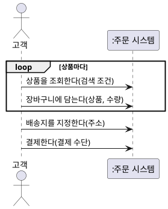

```java
final class 상품 {
    private final String 상품명;
    private final int 판매가;

    상품(String 상품명, int 판매가) { this.상품명 = 상품명; this.판매가 = 판매가; }
    int 판매가() { return 판매가; }
}

interface 주문시스템 {
    List<상품> 상품을조회한다(String 검색조건);
    void 장바구니에담는다(상품 상품, int 수량);
    void 배송지를지정한다(String 주소);
    void 결제한다(String 결제수단);
}
```

**강사 노트**

- 마지막 단계(5단계 "고객은 주문 결과를 확인한다")는 시스템의 응답이라 이벤트로 그리지 않았다. 응답을 그리지 않는 것은 이 단계의 모든 호출이 동기라서다. 조회의 결과는 반환값으로 드러난다.
- 흐름과 SSD를 나란히 놓으면 누락이 보인다. 흐름에 없는 이벤트가 SSD에 생기면 명세서로 되돌려 흐름을 고친다.
- 시스템은 블랙박스라 **인터페이스만** 옮긴다. 시스템 안의 객체는 이 단계에서 정하지 않는다.
- 코드는 다이어그램의 한 관점만 옮긴 예시다. 이 세션의 코드는 모두 `code/s02/주문시스템.java`에서 발췌했으며, 그 파일을 컴파일·실행해 확인한다.

---

## 43. 시스템 이벤트와 오퍼레이션

액터의 요청이 **시스템 이벤트**, 이에 응답하는 시스템의 행위가 **시스템 오퍼레이션**이다.

**표 — 흐름·이벤트·오퍼레이션·계약**

| 유스케이스 흐름 | 시스템 이벤트 | 시스템 오퍼레이션 | 계약 |
|---|---|---|---|
| 기본 흐름 1 — 상품을 조회한다 | 상품을 조회한다(검색 조건) | 상품 조회 | — |
| 기본 흐름 2 — 장바구니에 담는다 | 장바구니에 담는다(상품, 수량) | 장바구니 담기 | — |
| 기본 흐름 3 — 배송지를 지정한다 | 배송지를 지정한다(주소) | 배송지 지정 | — |
| 기본 흐름 4 — 결제한다 | 결제한다(결제 수단) | 결제 | **작성** — 결제 생성 |
| 대안 흐름 1a — 주문 취소 | 주문을 취소한다(주문) | 주문 취소 | **작성** — 상태·환불 |
| 대안 흐름 3a — 배송지 변경 | 배송지를 변경한다(주문, 새 주소) | 배송지 변경 | **작성** — 출고 전 조건 |

**강사 노트**

- 이벤트와 오퍼레이션은 같은 상호작용을 요청과 행위의 관점에서 본 것이다. 유스케이스 흐름은 「30. 기본 이벤트 흐름」·「33. 유스케이스 상세화」와 같다.

---

## 44. 정제된 SSD

SSD 초안에 **외부 시스템(지원 액터)**을 더해 정제한다. 시스템 이벤트마다 대상 시스템이 외부 시스템에 **무엇을 요청하는지**가 드러난다.

**도식 — SVG — 정제된 SSD 표기**

```svg
<svg xmlns="http://www.w3.org/2000/svg" width="1000" height="230" viewBox="0 0 1000 230" role="img" aria-label="정제된 SSD 표기: 외부 시스템 생명선, 외부 시스템에 보내는 요청">
<style>text{font-family:sans-serif;font-size:20px;fill:#000;text-anchor:middle}.b{fill:#fff;stroke:#1B3A6B;stroke-width:2}</style>
<rect width="1000" height="230" fill="#fff"/>
<rect class="b" x="160" y="30" width="190" height="46" rx="6"/><text x="255" y="60">:결제 시스템</text><line x1="255" y1="76" x2="255" y2="140" stroke="#1B3A6B" stroke-width="2" stroke-dasharray="8,8"/>
<text x="680" y="80">결제 승인을 요청한다(금액)</text><line x1="560" y1="95" x2="790" y2="95" stroke="#1B3A6B" stroke-width="3"/><polygon points="800,95 780,85 780,105" fill="#1B3A6B"/>
<text x="255" y="195">외부 시스템·생명선</text><text x="680" y="195">요청 — 실선 화살표</text>
</svg>
```

- **응답**은 그리지 않는다. 외부 시스템이 나중에 알리는 결과는 **별도의 이벤트**다(배송 시작 통보).

**표 — 표기와 사용법**

| 표기 | 의미 | 이렇게 쓴다 |
|---|---|---|
| **외부 시스템·생명선** | 대상 시스템이 요청을 보내는 지원 액터 | 대상 시스템 오른쪽에 둔다. 외부 시스템도 블랙박스다 |
| **요청** — 실선 화살표 | 대상 시스템이 외부 시스템에 맡기는 일 | 업무 동사(필요한 정보), 시스템 이벤트마다 필요한 요청만 |

**페이지 분할**

**도식 — PlantUML — 주문 시나리오의 정제된 SSD**

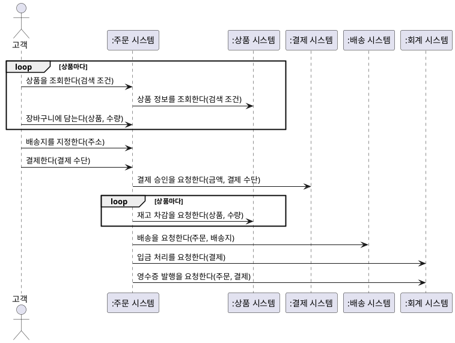

**페이지 분할**

- 재고·입금·영수증·출고는 주문 시스템이 **하지 않고 요청한다**. 이 요청은 계약의 사후조건이 아니라 이 SSD의 시스템 사이 이벤트다(「45. 시스템 오퍼레이션과 계약」).
- 배송 시스템의 **배송 시작·완료 통보**는 주문 시스템이 반응할 외부 이벤트다(「07. 이벤트 중심 요구」).

**표 — 메시지의 종류**

| 메시지 | 종류 | 의미 |
|---|---|---|
| 상품을 조회한다, 장바구니에 담는다 | 시스템 이벤트 — 반복 | 기본 흐름 1·2 |
| 배송지를 지정한다, 결제한다 | 시스템 이벤트 | 기본 흐름 3·4 |
| 상품 정보 조회, 결제 승인, 재고 차감 | 외부 시스템에 요청 | 결제한다의 처리에 필요하다 |
| 배송 요청, 입금 처리, 영수증 발행 | 외부 시스템에 요청 | 결제 뒤 다른 시스템에 맡긴다 |

**페이지 분할**

### 외부 시스템과 코드

외부 시스템은 주문 시스템이 **호출하는 인터페이스**가 된다. SSD의 **요청** 하나가 메서드 하나다.

**도식 — PlantUML — 외부 시스템 호출과 코드**

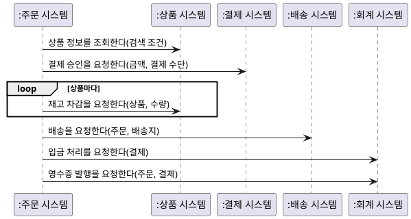

```java
interface 상품시스템 {
    List<상품> 상품정보를조회한다(String 검색조건);
    boolean 재고차감을요청한다(상품 상품, int 수량);
}
interface 결제시스템 {
    String 결제승인을요청한다(int 금액, String 결제수단);
}
interface 배송시스템 {
    void 배송을요청한다(String 주문번호, String 배송지);
}
interface 회계시스템 {
    void 입금처리를요청한다(String 승인번호);
    void 영수증발행을요청한다(String 주문번호, String 승인번호);
}
```

**강사 노트**

- 유스케이스 흐름에는 외부 시스템과의 요청을 쓰지 않았다(「30. 기본 이벤트 흐름」). 정제된 SSD는 흐름의 이벤트마다 대상 시스템이 외부와 주고받는 것을 드러내는 요구 산출물이다. 내부 처리 순서가 아니다.
- 코드에서 주문과 결제는 **식별 번호**(주문번호·승인번호)로 전달한다. 인터페이스가 외부 시스템의 내부를 정하지 않는다. 요청의 전달 방식(호출을 기다릴지, 메시지로 보낼지)은 설계에서 정한다.
- 요청의 순서(승인 뒤 재고 차감)도 업무 규칙이다. 재고가 모자라면 이미 승인된 결제를 어떻게 하는가? 요구 질문으로 남기고 "04. 동적 모델 — 상호작용과 상태"에서 다시 본다.
- 정제된 SSD와 계약, 유스케이스 명세서는 "03. 정적 모델 — 도메인 개념과 관계"와 "04. 동적 모델 — 상호작용과 상태"의 **입력**이다. 분석에서 발견한 것은 이 산출물에 되돌려 보완한다.

---

## 45. 시스템 오퍼레이션과 계약

시스템 오퍼레이션은 경계를 넘어 들어오는 **업무 이벤트에 응답하는 시스템의 책임**이다. 내부 메서드나 API를 먼저 정하는 일이 아니다.

### 식별 기준

- 시스템 경계를 넘는 **업무 의미의 이벤트**를 찾는다. 예: **주문을 관리한다** 하나에 `상품 조회`, `장바구니 담기`, `배송지 지정`, `결제`, `배송지 변경`, `주문 취소`가 있다.
- 계약은 **어렵고 복잡한 오퍼레이션**에만 쓴다 — 조건이 까다롭거나 여러 객체의 상태가 함께 바뀌는 오퍼레이션.

**인용문**

"사후조건은 **도메인 모델 객체의 상태 변화** — 인스턴스 생성, 연관 형성·해제, 속성 변경 — 를 서술한다", "The postconditions describe changes in the state of objects in the domain model. Domain model state changes include instances created, associations formed or broken, and attributes changed.", [Larman 2004]

- 외부 시스템에 보낸 **요청**은 사후조건이 아니다. 시스템 사이의 이벤트로 「44. 정제된 SSD」에 보인다.

**페이지 분할**

**표 — 오퍼레이션 계약 — 결제**

| 항목 | 내용 |
|---|---|
| **오퍼레이션** | 결제(결제 수단) |
| **관련 유스케이스** | 주문을 관리한다 — 기본 흐름 4 |
| **사전조건** | 고객의 주문이 결제 대기이고 배송지가 지정되었다 |
| **사후조건** | **결제**가 생성되었다 — 인스턴스 생성 |
|  | 결제가 주문과 연결되었다 — 연관 형성 |
|  | 주문의 상태가 **결제 완료**로 바뀌었다 — 속성 변경 |

**페이지 분할**

### 계약에서 코드로

**사전조건**은 먼저 확인하고, **사후조건**은 결제 후의 상태다. 외부 시스템에 보내는 **요청**은 정제된 SSD의 순서를 따른다.

**도식 — PlantUML — 결제 오퍼레이션의 시퀀스**


```java
final class 주문시스템구현 implements 주문시스템 {
    // ... 필드·생성자, 상품을조회한다·장바구니에담는다·배송지를지정한다 생략
    public void 결제한다(String 결제수단) {
        if (!상태.equals("결제 대기") || 배송지 == null) throw new IllegalStateException("사전조건 위반");
        int 금액 = 0;
        for (var 항목 : 장바구니.entrySet()) 금액 += 항목.getKey().판매가() * 항목.getValue();
        승인번호 = 외부.결제().결제승인을요청한다(금액, 결제수단);
        if (승인번호 == null) throw new IllegalStateException("승인 거절 — 정책 미확정");
        장바구니.forEach((상품, 수량) -> {
            if (!외부.상품().재고차감을요청한다(상품, 수량)) throw new IllegalStateException("재고 부족 — 정책 미확정");
        });
        외부.배송().배송을요청한다(주문번호, 배송지);
        외부.회계().입금처리를요청한다(승인번호);
        외부.회계().영수증발행을요청한다(주문번호, 승인번호);
        상태 = "결제 완료";
    }
}
```

**페이지 분할**

### 계약에서 테스트로

계약의 예가 곧 **테스트**다. 사후조건(상태)과 함께 정제된 SSD의 요청을 확인하며, 외부 시스템은 요청을 기록하는 가짜로 대신한다.

**도식 — PlantUML — 계약 테스트의 시퀀스**


```java
class 결제계약테스트 {
    public static void main(String[] args) {
        var 가짜 = new 가짜외부();
        var 시스템 = new 주문시스템구현("주문-1", new 외부시스템(가짜, 가짜, 가짜, 가짜));
        시스템.장바구니에담는다(시스템.상품을조회한다("펜").get(0), 2);
        거절(() -> 시스템.결제한다("카드"));

        시스템.배송지를지정한다("서울");
        시스템.결제한다("카드");
        확인(시스템.상태.equals("결제 완료"));
        확인(가짜.요청.equals(List.of("결제 승인 2000", "재고 차감", "배송", "입금 처리", "영수증 발행")));
        System.out.println("결제 계약 확인");
    }
    // ... 확인·거절 생략
}
```

**페이지 분할**

### 오퍼레이션 계약 — 배송지 변경

고객 소유의 출고 전 주문, 유효한 새 주소를 전제로 한 **성공 계약**이다. 사후조건은 처리 순서가 아니라 성공 후 **참인 상태**다.

**표 — 오퍼레이션 계약 — 배송지 변경**

| 항목 | 내용 |
|---|---|
| **오퍼레이션** | 배송지 변경(주문, 새 주소) |
| **관련 유스케이스** | 주문을 관리한다 — 대안 흐름 3a 배송지 변경 |
| **사전조건** | 주문이 존재하고 고객 소유이며 출고 전이다 |
|  | 출고 여부는 배송 시스템이 판단한다 |
|  | 새 주소는 유효하며 위 교육 예시의 범위에 속한다 |
| **사후조건** | 주문의 배송지가 새 주소로 바뀌었다 — 속성 변경 |

**강사 노트**

- 배송지 변경 계약의 교육용 가정 — 새 주소는 유효하고 배송비·세금·결제 금액·배송 방식에 영향을 주지 않는 지역이다(과정 설계 공통 전제). 사후조건은 `주소 검증 → DB 저장 → 응답` 같은 처리 순서가 아니다.

- 계약의 항목(오퍼레이션, 관련 유스케이스, 사전조건, 사후조건)과 사후조건의 세 종류는 Larman 2004를 따른다(원문 확인 — "Cross References", 사후조건 정의). 원문은 사후조건이 오퍼레이션 중에 할 행동이 아니라 끝난 뒤 참인 관찰이라고 강조한다.
- 사후조건의 결제·주문은 용어집의 개념이다. 도메인 모델은 "03. 정적 모델 — 도메인 개념과 관계"에서 그리며, 계약의 개념은 그 모델과 맞춘다.
- 배송 시스템에 배송지 변경을 요청하는 것은 「44. 정제된 SSD」의 이벤트다.
- 주문 취소·환불처럼 여러 결과가 걸린 계약은 성공의 범위와 시점을 먼저 정한다. 일부 상태 변화만 적고 전체 성공 계약으로 취급하지 않는다.
- 주문 취소는 계약 대상이지만 끝 상태(환불이 끝나기 전의 상태)를 정하려면 상호작용 분석이 필요하다. 그래서 "04. 동적 모델 — 상호작용과 상태"의 「03. 요구 산출물에서 출발」의 「계약의 정제」에서 작성한다.
- 재고 차감·배송·입금 처리·영수증 발행의 요청은 「44. 정제된 SSD」에 있다. 재고가 실제로 줄었는지는 상품 시스템의 책임이다.
- 두 표는 성공 계약이다. 실패·인증 등 관련 유스케이스의 나머지 행위를 완전히 명세한 것은 아니다.
- 사전조건 위반을 거절하는 것은 코드의 선택이다. 계약은 사전조건이 거짓일 때의 결과를 보장하지 않는다.
- 승인 거절·재고 부족의 예외는 **정책이 아니다**. 정책이 정해질 때까지 드러내기만 한다. 정해지면 계약과 유스케이스의 대안 흐름에 먼저 쓰고 테스트를 더한다.
- 가짜 외부 시스템으로 확인하는 것은 SSD의 요청까지다. `주문시스템구현`은 설계 객체의 한 예이며 분석 모델로 역수입하지 않는다. 내부 책임은 "07. 책임·협력·계약"에서 다룬다.
- 학습자가 테스트 결과(요청 목록과 순서)를 먼저 예측한 뒤 실행해 대조하게 한다.

---

## 46. 정적·동적 모델을 통한 상세화

**명세서·정제된 SSD·오퍼레이션 계약**은 정적·동적 분석의 **입력**이고, 분석의 발견은 이 산출물로 **되돌아온다**.

**도식 — Mermaid — 요구 산출물과 분석의 순환**

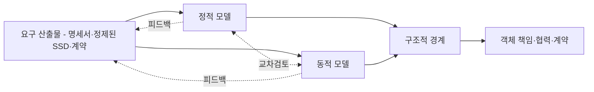

### 정적·동적 모델이 답하려는 질문

- **정적 모델**은 문제영역의 의미·관계·제약을, **동적 모델**은 상호작용과 상태 변화의 사건·규칙을 다룬다.

**강사 노트**

- `명사 → 클래스` 식으로 기계적으로 변환한다는 의미가 아니다. 피드백은 별도 산출물을 만드는 것이 아니라 원래 산출물을 고치는 것이다. "03. 정적 모델 — 도메인 개념과 관계"와 "04. 동적 모델 — 상호작용과 상태"에서 각각 본격적으로 다룬다.

---

## 47. 유스케이스와 품질속성

유스케이스가 어떤 결과를 제공하는지 설명한다면, **품질 요구**는 그 결과를 어떤 조건에서 어느 수준으로 제공해야 하는지 보완한다.

**인용문**

"특성과 부특성은 제품 품질을 **명세·측정·평가**하는 참조 모델을 제공한다", "The characteristics and subcharacteristics provide a reference model for the quality of the products to be specified, measured and evaluated.", ISO/IEC 25010:2023

**표 — 품질 관점별 요구 후보**

| 품질 관점 | 요구 후보 | 검증 가능하게 만들기 위한 질문 |
|---|---|---|
| **응답 성능** | 주문 조회가 신속하게 완료된다 | 부하·데이터량·측정 구간·허용 지연은? |
| **장애 대응** | 일시적 결제 장애로 주문이 유실되지 않는다 | 유실의 정의, 복구 결과와 허용 시간은? |
| **접근 통제** | 다른 고객의 주문을 조회할 수 없다 | 어떤 역할·접근 경로·예외 권한을 검사하는가? |
| **사용 편의** | 모바일에서도 배송지를 변경할 수 있다 | 대상 기기·사용자·과업 성공 기준은? |
| **변경 용이성** | 배송 정책 변경의 영향을 제한한다 | 어떤 변경을 어떤 비용·영향 범위로 수용하는가? |

**강사 노트**

- 표는 검토 질문을 만드는 교육 예시다. 근거 없이 측정 수치나 서비스 수준을 확정하지 않는다.

- 인용 근거: ISO/IEC 25010:2023의 공식 초록(IEC Webstore 제품 페이지). 표준 본문이 아니라 **초록 범위**만 확인했다.
- 표의 요구 후보와 질문은 **교육 예시**다. 응답 시간 같은 수치는 측정 조건과 함께 이해관계자와 합의한다.
- 품질 관점의 이름은 인용한 품질 모델의 특성을 이 과정의 말로 옮긴 것이다. 품질 요구가 구조의 판단으로 이어지는 방식은 "13. OOAD에서 전문영역으로 — Architecture · DDD · MSA"에서 다룬다.

---

## 48. 프로토타입·와이어프레임

프로토타입과 와이어프레임은 화면을 확정하기 전에 **사용자가 과업을 이해하고 수행하는지 관찰해 숨은 요구와 잘못된 가정을 발견하는 도구**다.

### 배송지 변경 와이어프레임

「45. 시스템 오퍼레이션과 계약」의 성공 계약을 검토하는 **화면 초안**이다.

**도식 — SVG — 배송지 변경 화면 초안**

```svg
<svg xmlns="http://www.w3.org/2000/svg" width="900" height="340" viewBox="0 0 900 340" role="img" aria-label="주문 상세와 배송지 변경 와이어프레임">
<style>text{font-family:sans-serif;fill:#182230;font-size:20px}.title{font-size:24px;font-weight:700}.box{fill:white;stroke:#526070;stroke-width:2}.button{fill:#edf2f6;stroke:#526070;stroke-width:2}</style>
<rect width="900" height="340" fill="#f6f8fa"/>
<rect class="box" x="20" y="20" width="410" height="300" rx="8"/>
<text class="title" x="45" y="60">주문 상세</text>
<text x="45" y="105">주문: 예시 주문 A</text><text x="45" y="145">상태: 출고 전</text>
<text x="45" y="185">배송지: 기존 주소 A</text>
<rect class="button" x="100" y="235" width="240" height="50" rx="4"/><text x="162" y="268">배송지 변경</text>
<rect class="box" x="470" y="20" width="410" height="300" rx="8"/>
<text class="title" x="495" y="60">배송지 변경</text><text x="495" y="105">현재 주소: 기존 주소 A</text>
<text x="495" y="145">새 배송지</text><rect class="box" x="495" y="160" width="355" height="45"/><text x="510" y="190">새 주소 B</text>
<rect class="button" x="525" y="235" width="120" height="50" rx="4"/><text x="565" y="268">변경</text>
<rect class="button" x="695" y="235" width="120" height="50" rx="4"/><text x="735" y="268">취소</text>
</svg>
```

**정적 와이어프레임**만으로 실제 처리나 성공을 검증할 수는 없다. 사용자에게 과업을 설명하게 하거나 조작 가능한 프로토타입으로 **관찰**한다.

**페이지 분할**

### 확인할 질문

- **출고 직전** 변경 가능 여부와 **유효 주소** 기준·오류 안내는 무엇인가?
- **배송비 변동**이나 이미 외부 배송 시스템에 전달된 경우는 어떻게 하는가?
- **실패 시** 기존 주소 유지 여부와 변경 완료 확인 방법은 무엇인가?


**강사 노트**

- 교육용 주소 A·B는 실제 주소가 아니다. 버튼·화면 구성은 해결책 후보이며 확정된 요구사항이 아니다. 관찰한 혼란·누락은 요구사항과 계약에 반영하고, 새 주소·배송비·실패 정책을 화면만 보고 임의로 결정하지 않는다.

- 와이어프레임은 본문에 내장한 SVG 원본으로 제공한다. Production은 이를 실제 visual로 렌더한다. 현재 원고 검토에서는 화면에 담긴 의미와 검증 질문을 확인한다.

---

## 49. 유저 스토리

유저 스토리(User Story)는 요구사항 문서가 아니라, 사용자 관점에서 **작은 가치 단위**를 표현해 **대화를 시작하는 수단**이다.

**인용문**

"유저 스토리에는 결정적인 세 가지 면이 있다. 이를 **카드, 대화, 확인**이라 부를 수 있다", "User stories have three critical aspects. We can call these Card, Conversation, and Confirmation.", [Jeffries 2001]

  - **카드** — 스토리를 짧게 적어 둔 것. 요구사항 전체가 아니라 대화를 시작하는 메모다.
  - **대화** — 세부는 고객과 개발자가 대화로 채운다. 업무 규칙이 여기서 나온다.
  - **확인** — 스토리가 끝났는지 인수 조건(테스트)으로 확인한다.

- **문형보다 대화** — 카드에 모든 것을 쓰지 않는다. 빠진 것은 대화로 채우고, 합의한 결과는 인수 조건으로 남긴다(「56. Given-When-Then」).
- **반복과 우선순위** — 작은 가치 단위라서 반복마다 고르고 순서를 바꾸기 쉽다.

**강사 노트**

- 인용 근거: Ron Jeffries, "Essential XP: Card, Conversation, Confirmation"(2001-08-30) 원문 확인. 세 요소의 설명은 원문의 Card·Conversation·Confirmation 절을 요약한 것이다.
- Wake(2003)도 Jeffries를 들어 스토리를 카드·대화·확인으로 소개한다(「51. 좋은 유저 스토리 — INVEST」).

---

## 50. 스토리의 문형과 가치

유저 스토리는 **누가, 무엇을, 왜** 원하는지를 한 문장으로 쓴다. "왜"가 스토리의 **가치**를 드러낸다.

```text
As a    고객 (누가)
I want  출고 전 배송지를 변경한다 (무엇을)
so that 올바른 장소에서 상품을 받는다 (왜)
```

**인용문**

이 문형의 강점은 스토리를 처음 정의할 때 **그 스토리를 전달하는 가치**를 밝히게 한다는 것이다, "Its strength is that it forces you to identify the value of delivering a story when you first define it.", [North 2006]

- **주문 취소** — 고객으로서 배송이 시작되기 전에 주문을 취소하고 싶다. 필요 없어진 상품의 대금을 돌려받고 싶기 때문이다.
- **"왜"가 없으면** — 가치를 말하지 못하는 스토리는 범위에서 뺄 후보다.

**강사 노트**

- 인용 근거: Dan North, "Introducing BDD"(2006) 원문 확인. 원문은 가치가 없는 스토리가 "so that I just do, ok?"처럼 끝난다고 적는다.
- 문형은 필수 양식이 아니다. 누가·무엇을·왜가 드러나면 된다.
- 예의 스토리는 「주문을 관리한다」의 대안 흐름 3a(배송지 변경)와 1a(주문 취소)를 스토리 형식으로 쓴 것이다.

---

## 51. 좋은 유저 스토리 — INVEST

좋은 유저 스토리의 조건은 **INVEST** 6가지다. 조건을 채우지 못하면 스토리를 나누거나 대화로 더 구체화한다.

**인용문**

좋은 스토리는 **독립적·협상 가능·가치·추정 가능·작음·테스트 가능**의 6가지 조건을 갖춘다, "good stories are: I – Independent N – Negotiable V – Valuable E – Estimable S – Small T – Testable", [Wake 2003]

**표 — INVEST와 주문 시스템**

| 조건 | 뜻 | 주문 시스템에서 |
|---|---|---|
| **독립적**(Independent) | 다른 스토리와 겹치지 않고 순서를 바꿀 수 있다 | 배송지 변경과 주문 취소를 따로 만든다 |
| **협상 가능**(Negotiable) | 세부는 대화로 함께 채운다 | "출고 전"의 뜻은 대화로 정한다 |
| **가치**(Valuable) | 고객에게 가치가 있다 | 연동 모듈이 아니라 고객이 얻는 결과 |
| **추정 가능**(Estimable) | 우선순위를 정할 만큼 크기를 안다 | 부분 취소처럼 규칙을 모르면 먼저 묻는다 |
| **작음**(Small) | 길어야 몇 주, 짧게는 며칠 | 반복 하나 안에 끝낼 크기 |
| **테스트 가능**(Testable) | 테스트를 쓸 수 있을 만큼 안다 | Given-When-Then의 예로 확인한다 |

**강사 노트**

- 인용 근거: Bill Wake, "INVEST in Good Stories, and SMART Tasks"(2003) 원문 확인. 표의 "뜻"은 원문의 각 절을 요약했다.
- 원문은 테스트 가능을 이렇게 설명한다: 스토리 카드를 쓰는 것은 "테스트를 쓸 수 있을 만큼 원하는 것을 안다"는 약속이다. 고객이 테스트 방법을 모르면 스토리가 아직 분명하지 않다는 신호다.

---

## 52. 스토리 나누기

스토리는 **층이 아니라 기능을 세로로** 나눈다. 한 조각만으로도 고객에게 가치가 있어야 한다.

**인용문**

고객에게 케이크 전체의 본질을 주는 가장 좋은 방법은 **층을 세로로 자르는 것**이다, "We want to give the customer the essence of the whole cake, and the best way is to slice vertically through the layers.", [Wake 2003]

**표 — 주문을 관리한다를 나누는 두 방법**

| 나누는 방법 | 조각 | 결과 |
|---|---|---|
| **층으로**(가로) | 주문 테이블, 배송 연동 모듈, 주문 화면 | 한 조각만으로는 고객이 얻는 것이 없다 |
| **흐름으로**(세로) | 결제한다, 주문을 취소한다, 배송지를 변경한다 | 조각마다 고객이 결과를 얻는다 |

- **유스케이스의 흐름이 나누는 기준** — 「주문을 관리한다」의 기본 흐름과 대안 흐름 1a(주문 취소)·3a(배송지 변경)가 각각 스토리가 된다.
- **유스케이스와 스토리** — 유스케이스는 **전체 목표**를 보이고, 스토리는 **반복의 단위**가 된다.

**강사 노트**

- 원문은 개발자가 한 번에 한 층만 "제대로" 만들고 싶어 하지만, 화면이 없는 데이터베이스 층은 고객에게 가치가 적다고 적는다.
- 층으로 나눈 조각은 「35. 잘못된 관행 — 기능 분할」과 같은 문제다.

---

## 53. 잘못된 유저 스토리

유저 스토리에도 유스케이스와 같은 **잘못된 관행**이 있다. 주어가 사용자가 아니거나, 기능·기술 작업으로 나눈 스토리다.

**인용문**

LLM 도구가 작은 버그를 고치며 쓴 스토리 — **개발자로서** 변환 함수가 경계 사례를 우아하게 처리하기를 원한다, "User story: As a developer, I want the transformation function to handle edge cases gracefully, so that the system remains robust when new category formats are introduced.", [Böckeler 2025]

**표 — 잘못된 유저 스토리**

| 관행 | 예 | 바로잡기 |
|---|---|---|
| **개발자가 주어** | 개발자로서 주문 클래스가 견고하기를 원한다 | 고객이 얻는 결과로 쓴다 |
| **기술 작업** | 배송 연동 모듈을 만든다 | 흐름으로 세로로 나눈다 |
| **CRUD 스토리** | 관리자로서 주문을 등록·수정·삭제하고 싶다 | 사용자의 목표로 쓴다 |
| **"왜"가 없음** | 고객으로서 취소 버튼을 원한다 | 가치를 말하지 못하면 범위에서 뺀다 |
| **확인할 수 없음** | 배송지 변경이 편리하면 좋겠다 | 확인할 수 있는 예를 붙인다 |

**강사 노트**

- 인용은 Böckeler가 SDD 도구(Kiro)로 작은 버그를 고치려 했을 때 요구 문서에 생긴 스토리 가운데 하나다. LLM에게 스토리를 쓰게 하면 이런 스토리가 섞이기 쉽다.
- CRUD 스토리는 「36. 잘못된 관행 — CRUD 분할」과 같은 문제다. 표의 예는 주문 시스템에 맞춘 교육용 예다.

---

## 54. 유저 스토리의 강점과 한계

유저 스토리는 작은 가치 단위의 **대화와 우선순위 결정**에 유용하다. **전체 목표**와 여러 스토리에 걸친 조건은 함께 검토해야 한다.

**표 — 유저 스토리의 강점과 한계**

| 강점 | 한계 |
|---|---|
| **작은 가치 단위** | 전체 사용 흐름이 약해질 수 있음 |
| **반복적 개발에 적합** | 중요한 조건이 누락될 수 있음 |
| **이해관계자 대화 촉진** | 여러 스토리의 전체 목표가 흩어질 수 있음 |
| **변경 수용 용이** | 상세 요구사항을 별도로 보완해야 함 |

**강사 노트**

- 한계는 스토리를 쓰지 말라는 뜻이 아니다. 전체 목표는 유스케이스로 함께 본다(「59. 유스케이스·유저 스토리·BDD」).

---

## 55. 행위 주도 개발

행위 주도 개발(BDD)은 **구체적인 예로 기대 행위를 합의**하고 검증과 연결하는 협업 방식이다. TDD에서 출발해 요구 분석으로 넓어졌다.

**인용문**

"행위 주도 개발은 여러 역할 간 협업을 통해 해결할 문제에 대한 **공통 이해**를 만들어 업무 담당자와 기술 담당자의 간극을 좁히는 소프트웨어 팀의 협업 방식이다", "BDD is a way for software teams to work that closes the gap between business people and technical people by: Encouraging collaboration across roles to build shared understanding of the problem to be solved", [Cucumber]

**표 — BDD의 3가지 실천**

| 실천 | 하는 것 | 확인하는 것 |
|---|---|---|
| **발견**(Discovery) | 함께 대화하며 규칙과 예를 찾는다 | 어떤 규칙과 예가 필요한가? |
| **정형화**(Formulation) | 예를 Given-When-Then으로 쓴다 | 모두 같은 뜻으로 읽는가? |
| **자동화**(Automation) | 예를 실행되는 테스트로 만든다 | 시스템이 예대로 동작하는가? |

**강사 노트**

- 인용 근거: Cucumber 공식 문서 "Behaviour-Driven Development" 원문 확인. 원문은 세 방식의 목록이며 첫 항목만 옮겼다. 같은 문서가 세 실천을 Discovery, Formulation, Automation이라 부른다.
- North(2006)는 TDD의 "테스트" 대신 "행위"라는 말을 쓰다가, 동료(Chris Matts)와 함께 이 생각을 요구 정의에 적용했다고 적는다.

---

## 56. Given-When-Then

스토리의 행위는 **인수 조건**이고, 인수 조건은 **Given-When-Then**의 시나리오로 쓴다.

```gherkin
Given 고객 소유의 주문 A가 출고 전이고 배송지는 주소 A, 새 주소 B는 유효하다
When  고객이 주문 A의 배송지를 주소 B로 변경한다
Then  주문 A의 배송지는 주소 B이고, 주문 식별 정보·상품·결제 금액은 변경 전과 같다
```

**인용문**

스토리의 행위는 곧 **인수 조건**이다 — 시스템이 인수 조건을 모두 채우면 바르게 동작하고 채우지 못하면 아니다, "A story’s behaviour is simply its acceptance criteria: if the system fulfils all the acceptance criteria, it’s behaving correctly; if it doesn’t, it isn’t.", [North 2006]

- **Given**은 어떤 상태에서 시작하는가, **When**은 액터가 무엇을 하는가, **Then**은 무엇이 관찰되어야 하는가다.
- 위의 예는 「45. 시스템 오퍼레이션과 계약」의 배송지 변경 계약을 **예로 옮긴 것**이다. 규칙마다 그 규칙을 가장 잘 보이는 **대표 예**를 고른다.

**강사 노트**

- 인용 근거: Dan North, "Introducing BDD"(2006) 원문 확인. 원문의 형식은 "Given some initial context (the givens), When an event occurs, Then ensure some outcomes."다.
- 합의한 예는 그대로 실행되는 테스트가 된다. 결제 계약을 테스트로 옮긴 예는 「45. 시스템 오퍼레이션과 계약」에 있다.

---

## 57. Example Mapping

**Example Mapping**은 스토리 하나를 놓고 **규칙·예·질문**을 카드로 나눠 대화하는 방법이다. 규칙은 업무 규칙, 예는 인수 조건, 답하지 못한 질문은 확인할 목록이 된다.

**인용문**

Example Mapping은 인수 조건을 밝히는 대화를 **짧고 생산적으로** 만드는 방법이다, "Example Mapping is a method designed to make this conversation short and very productive.", [Cucumber: Example Mapping]

**도식 — Mermaid — 배송지 변경의 Example Mapping**

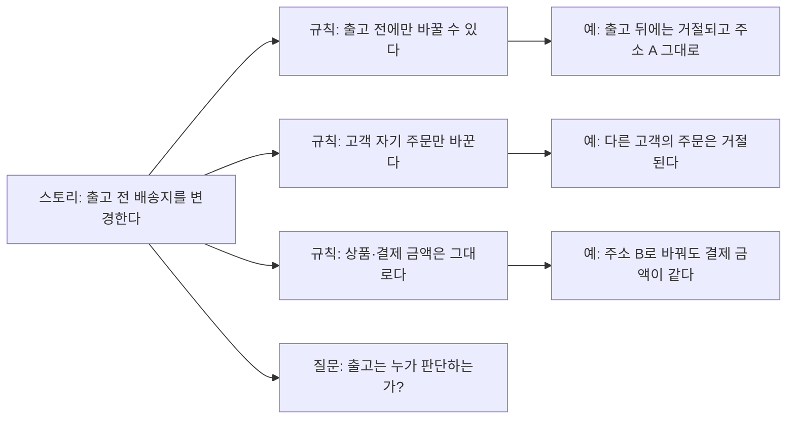

**강사 노트**

- 인용 근거: Cucumber 공식 문서 "Example Mapping" 원문 확인. 원문은 스토리를 노란 카드, 규칙을 파란 카드, 예를 초록 카드, 답하지 못한 질문을 빨간 카드에 쓴다고 설명한다.
- "출고는 누가 판단하는가?"는 "11. 통합 설계와 적정 모델링"에서 드러나는 빈틈과 같은 질문이다. 출고는 배송 시스템이 판단한다.

---

## 58. 행위 주도 개발의 강점과 한계

행위 주도 개발은 행위를 **구체적으로 확인**하는 데 유용하지만 목표와 요구사항 구조 전체를 **대체하지는 않는다**.

**표 — BDD의 강점과 한계**

| 강점 | 한계 |
|---|---|
| **구체적인 예** | 전체 목표가 약해질 수 있음 |
| **검증 가능** | 예제가 지나치게 많아질 수 있음 |
| **자동화된 인수 테스트 연결** | 화면·구현 세부사항에 종속될 위험 |
| **공통 이해** | 전체 요구 구조를 대체하지 못함 |

**강사 노트**

- 예가 많아지면 **규칙을 대표하는 예**만 남긴다. 화면 조작이 아니라 업무 행위로 쓴다(「56. Given-When-Then」의 배송지 변경 예).

---

## 59. 유스케이스·유저 스토리·BDD

세 기법은 목적이 겹치지만 **강조점이 다르다**. 순서대로 도입할 필요 없이 필요한 관점에 맞춰 고르거나 잇는다.

**표 — 질문별 적합한 기법**

| 질문 | 적합한 기법 |
|---|---|
| 액터가 어떤 **목표**를 달성하는가? | 유스케이스 |
| 작은 **가치 단위**로 무엇을 제공할 것인가? | 유저 스토리 |
| 이 행위를 구체적으로 **어떻게 검증**할 것인가? | 행위 주도 개발(BDD) |

**도식 — Mermaid — 세 기법의 연결**

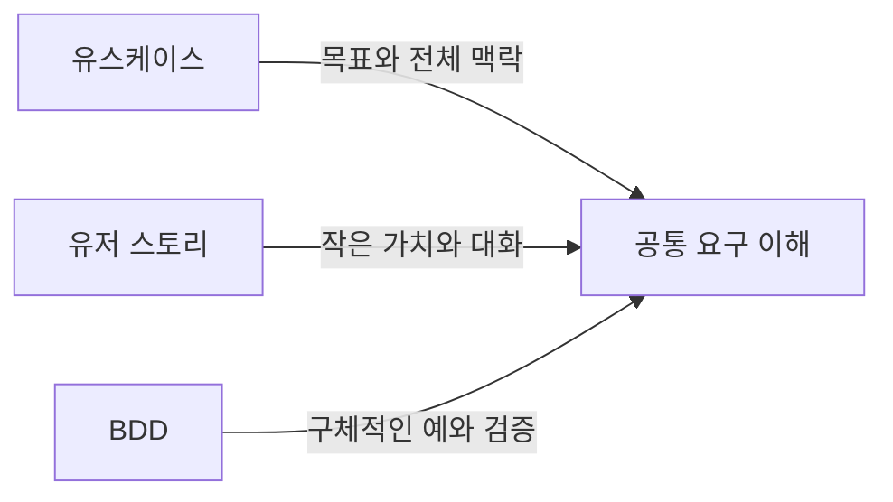

**강사 노트**

- 세 기법은 경쟁하지 않는다. 유스케이스로 **목표와 경계**를, 스토리로 **반복의 단위**를, BDD로 **검증**을 잇는다.
- 결제 계약을 테스트로 옮긴 「45. 시스템 오퍼레이션과 계약」이 BDD의 확인과 같은 역할을 한다.

---

## 60. 명세 주도 개발

AI 코딩 에이전트가 쓰이면서 **명세 주도 개발(SDD)**이 주목받는다. 코드를 쓰기 전에 명세를 먼저 쓰고, 그 명세를 사람과 AI의 기준으로 삼는다.

**인용문**

명세 주도 개발은 AI로 코드를 쓰기 전에 **명세를 먼저 쓰는 것**이고 그 명세가 **사람과 AI의 기준**이 된다, "Spec-driven development means writing a “spec” before writing code with AI (“documentation first”). The spec becomes the source of truth for the human and the AI.", [Böckeler 2025]

**표 — SDD의 3가지 수준**

| 수준 | 명세는 | 사람이 고치는 것 |
|---|---|---|
| **명세 먼저** | 그 작업에 쓰고 나면 할 일을 다 했다 | 코드 |
| **명세 고정** | 기능의 발전과 유지보수에 계속 쓴다 | 명세와 코드를 함께 |
| **명세가 원천** | 시간이 지나도 주된 원천 파일이다 | 명세만 |

- **명세의 내용은 요구 분석의 산출물** — SDD 도구가 만드는 요구 문서도 유저 스토리와 Given-When-Then 인수 조건의 목록이다.

**강사 노트**

- 인용 근거: Birgitta Böckeler, "Understanding Spec-Driven-Development: Kiro, spec-kit, and Tessl", martinfowler.com, 2025 원문 확인. 3가지 수준(spec-first, spec-anchored, spec-as-source)도 같은 글이 정리한 것이다.
- 원문은 Kiro의 요구 문서가 "As a…" 형식의 스토리와 "GIVEN… WHEN… THEN…" 형식의 인수 조건으로 되어 있다고 적는다.
- SDD의 상세는 "AI-native SW 공학" 과정의 '03. 요구의 구체화와 명세'가 다룬다.

---

## 61. 명세 주도 개발의 한계

명세가 많다고 좋은 것이 아니다. **작업 크기에 맞는 명세**와 **작은 반복**이 여전히 핵심이다.

**인용문**

요구 문서는 이 **작은 버그**를 **유저 스토리 4개와 인수 조건 16개**로 바꾸었다, "The requirements document turned this small bug into 4 “user stories” with a total of 16 acceptance criteria", [Böckeler 2025]

**인용문**

명세가 원천인 방식과 명세 고정까지도 **MDD와 LLM의 단점을 함께** 떠안을 수 있다 — **경직성과 비결정성**, "I wonder if spec-as-source, and even spec-anchoring, might end up with the downsides of both MDD and LLMs: Inflexibility and non-determinism.", [Böckeler 2025]

- **명세 과잉** — 작은 수정에도 문서가 불어나면 리뷰할 문서가 코드보다 많아진다(「39. 잘못된 관행 — 명세 과잉·방치」).
- **모델 주도 개발(MDD)의 교훈** — 모델에서 코드를 생성하려던 MDD는 업무 애플리케이션에 자리잡지 못했다. 모델과 명세는 코드를 생성하려고 쓰는 것이 아니라 **의미를 밝히려고** 쓴다.
- **작은 반복** — 통제는 문서의 양이 아니라 작은 단계와 검증에서 나온다(「09. 반복적 접근」).

**강사 노트**

- 인용 근거: Böckeler(2025) 원문 확인. 원문은 이 모든 문서가 있어도 에이전트가 지시를 다 따르지 않는 것을 자주 보았고, 통제하는 가장 좋은 방법은 작고 반복적인 단계였다고 적는다.
- 원문의 저자는 MDD를 많이 쓴 프로젝트를 경험했다고 밝힌다.

---

## 62. 요구사항 검증

요구사항의 **명세 품질**과 실제 문제 해결의 **타당성**을 함께 검토한다.

### 문서 수준에서 확인할 수 있는 것

- 구현·검증 가능한가?
- **명확·완전·일관적**인가?

### 실제 사용에서 확인해야 하는 것

- 실제로 사용하며 **문제를 해결**하는가?
- **기대한 가치**와 **예상 못한 문제**가 있는가?

**도식 — Mermaid — 요구사항 검증의 흐름**

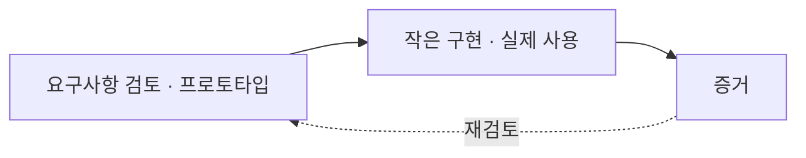

**강사 노트**

- 이해관계자 검토·모델·프로토타입으로 개발 전에도 필요와 적합성을 확인할 수 있고, 배포 후에는 실제 사용과 결과로 가정을 다시 평가한다. 명세 자체의 품질 검증과 실제 가치의 타당성 확인을 구분하되, 타당성 확인을 배포 이후로만 미루지 않는다. NASA [Systems Engineering Handbook, Appendix C](https://www.nasa.gov/reference/appendix-c-how-to-write-a-good-requirement/), C.3–C.4의 요구 검토 질문을 참조한다.

---

## 63. 요구사항 관리

요구사항 관리는 변경을 막는 활동이 아니라, 무엇이 왜 바뀌었고 어디까지 영향을 주는지 **변경의 이유와 영향을 통제하는 활동**이다.

### 관리 대상

- 기준선, 변경, 우선순위, 상태
- 버전, 의존성, 영향분석, 추적

### 질문

- 무엇이 **언제·왜** 바뀌었고 무엇에 **영향**을 주는가?
- 누가 결정했는가?
- 관련 **요구·설계·코드·테스트**는 무엇인가?

**강사 노트**

- **기준선**은 합의된 요구의 한 시점이다. 변경은 막지 않고 이유·결정자·영향을 기록한다.
- 뒤의 분석에서 발견한 것을 요구 산출물로 되돌리는 것도 요구 관리의 **변경**이다("03. 정적 모델 — 도메인 개념과 관계"의 「17. 모델의 검토」의 「누락과 모순」).

---

## 64. 요구사항 추적

추적성은 **기준선 요구의 누락**과 **근거 없는 임의 추가** 양방향을 통제한다.

**도식 — Mermaid — 요구사항 추적**

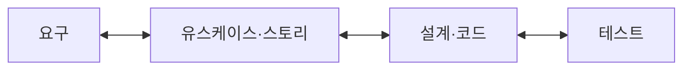

- **아래 방향** — 기준선 요구가 설계·구현·테스트에서 빠지지 않았는가?
- **위 방향** — 설계·코드·테스트가 어떤 요구에 근거하는가?

**인용문**

"추적성은 원래의 **이해관계자 요구**에서 **실제 구현된 해결책**까지 요구사항과 설계 사이의 관계를 추적하는 능력이다", "The ability for tracking the relationships between requirements and designs from the original stakeholder need to the actual implemented solution.", [IIBA 2022]

**강사 노트**

- 기능 요구와 코드를 일대일 대응시키지 않는다. 근거·영향을 기록하고 필요하면 기준선을 갱신한다.

- 인용 근거: IIBA, [*The Business Analysis Standard*](https://www.iiba.org/knowledgehub/the-business-analysis-standard/4-implementing-business-analysis/4-4-understanding-requirements-and-designs/)(2022), 4.4.3 원문 확인. 원문은 "Traceability is the ability for tracking…"이며 주어를 생략했다. 같은 절은 추적성이 변경 통제를 돕는다고 설명한다 — 변경의 출처와 영향받는 요구·설계를 알 수 있다.
- 일대일 대응을 강제하면 추적표가 목적이 된다. **판단에 필요한 관계**만 추적한다.
- 이 세션의 코드는 명세서·SSD·계약에 근거하고, 테스트는 계약의 예에서 나온다(「45. 시스템 오퍼레이션과 계약」).

---

## 65. 요구사항에서 학습으로

요구사항은 개발 이전에 확정해 넘기는 입력이 아니라, **구현과 실제 사용에서 얻은 증거를 통해 계속 학습되고 수정되는 대상**이다.

**도식 — Mermaid — 요구에서 학습으로**

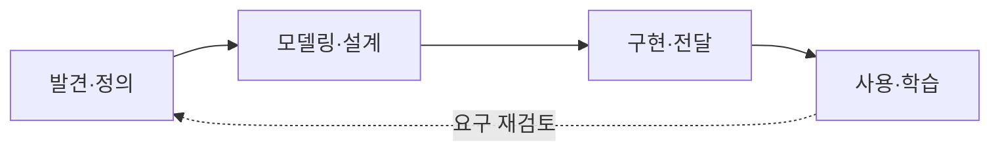

**강사 노트**

- 구현·검증·DevOps 단계에서도 사용 증거를 요구로 되돌리는 피드백은 계속 이어진다.

---

## 66. 실습 — 유스케이스

요구사항 정의서를 LLM에 제공하여 유스케이스 다이어그램과 **"정기배송을 신청한다"의 명세서**, **용어집**을 만들고, 점검 항목을 참고해 **피드백**하여 완성하십시오.

- **투입물**
  + 실습 1의 **요구사항 정의서** — 실제로는 여러분이 완성한 정의서를 이어 씁니다.
- **프롬프트**
  + "위 요구사항 정의서로 유스케이스 다이어그램을 PlantUML로 그리고, '정기배송을 신청한다'의 명세서를 작성해줘. 조회·변경·해지는 이 유스케이스의 대안 흐름에 넣고, Larman의 정식 형식(fully dressed)으로 기본 성공 시나리오와 대안 흐름(성공·실패 모두)을 써줘. 업무 규칙과 특별 요구사항도 덧붙여줘. 명세서에 없는 규칙은 **반드시 확인**해라. 명세서에 쓴 용어로 **용어집**(용어, 정의, 영문명)도 만들어줘."
- **점검 항목**
  1. **요구 반영** — 기능 요구 F1~F6이 모두 유스케이스나 흐름으로 나타나는가?
  2. **시스템 경계** — 월별 청구·배송 처리처럼 외부 시스템이 하는 일을 유스케이스로 만들지 않았는가?
  3. **유스케이스 단위** — 기능 조각(로그인·결제하기)이나 CRUD 분할(신청 조회·수정·삭제)이 아닌가?
  4. **흐름** — 결제 요청, 배송 요청, 영수증 발행이 기본 흐름에 빠짐없이 있는가?
  5. **규칙** — 업무 규칙이 흐름의 조건으로 들어갔는가? 명세서에 없는 규칙은 확인했는가?
  6. **용어** — 구현 표현(화면·DB) 없이, 한 용어를 한 뜻과 한 영문명으로 용어집에 정했는가?
- **결과물** — 유스케이스 다이어그램, "정기배송을 신청한다" 명세서, 용어집. 실습 3의 입력이 됩니다.

**강사 노트**

- 명세서 하나만 쓰는 이유 — 모든 유스케이스를 명세하는 것보다 **하나를 끝까지** 쓰는 편이 흐름·규칙·예외를 배우기에 좋다.
- LLM은 조회·수정·삭제를 별도 유스케이스로 나누거나, 결제 시스템이 할 월별 청구를 이 시스템의 유스케이스로 만들기 쉽다.
- 용어집은 명세서에 실제로 쓴 용어에서 시작한다. 모든 명사를 넣지 않고, 뜻이 헷갈릴 수 있는 용어를 먼저 넣는다.

---

## 67. 요약

요구 분석은 요청에서 요구를 **발견**하고 유스케이스로 목표와 시스템 책임을 **표현·검증**한다.

### 요구 분석과 유스케이스의 핵심

- **문제·요구·이벤트** — 요청에 섞인 수준을 구분하고, 이벤트로 합의하며 작은 반복으로 검증한다.
- **경우별 접근** — 업무 지식과 업무·기술 불확실성에 따라 요구 기법을 고른다.
- **용어집** — 한 용어에 한 뜻과 하나의 영문명. 과정 끝까지 모든 모델·코드가 쓰는 이름의 원천이다.
- **유스케이스와 경계** — 기능 분해·CRUD·화면이 아니라 사용자 목표와 가치 있는 결과로 식별하고, 소유로 시스템 경계를 정한다.
- **SSD·계약·검증** — SSD 초안을 외부 시스템까지 정제하고, 외부 결과로 계약해 코드·테스트로 잇고, 스토리·BDD(Given-When-Then)·추적으로 검증한다.

### 다음 세션

- "**03. 정적 모델 — 도메인 개념과 관계**" — 명세서·정제된 SSD·계약을 입력으로, 클래스로 기계적으로 변환하지 않고 문제영역의 정적 의미 구조를 분석한다.

**강사 노트**

- 이 세션에서는 요구를 **행위 관점**으로 구조화했다. 다음 세션에서는 문제영역의 **정적 의미 구조**를 본격적으로 분석한다.

---

## 별첨. 실습 답

---

## 유스케이스 다이어그램 (안)

고객은 정기배송을 신청·관리하고, 다음 배송 취소·배송 현황 조회·반품을 한다. **관리자**는 고객의 정기배송과 반품을 관리한다. 월별 청구는 결제 시스템이, 배송은 배송 시스템이 맡는다.

- **고객** — UC1 정기배송을 신청한다(F1·F2·F3·F6, 조회·변경), UC2 다음 배송을 취소한다(F4), UC3 배송 현황을 조회한다(새 요구), UC4 반품을 신청한다(F5)
- **관리자** — UC5 정기배송을 관리한다(정지된 정기배송의 재개·해지), UC6 반품을 승인한다(불량·오배송 판단)

```plantuml:usecase
left to right direction
actor 고객
actor 관리자
rectangle "정기배송 시스템" {
  usecase "정기배송을 신청한다" as UC1
  usecase "다음 배송을 취소한다" as UC2
  usecase "배송 현황을 조회한다" as UC3
  usecase "반품을 신청한다" as UC4
  usecase "정기배송을 관리한다" as UC5
  usecase "반품을 승인한다" as UC6
}
actor "상품 시스템" as 상품
actor "결제 시스템" as 결제
actor "배송 시스템" as 배송
고객 -- UC1
고객 -- UC2
고객 -- UC3
고객 -- UC4
관리자 -- UC5
관리자 -- UC6
UC1 -- 상품
UC1 -- 결제
UC1 -- 배송
UC2 -- 결제
UC2 -- 배송
UC3 -- 배송
UC4 -- 배송
UC5 -- 결제
UC5 -- 배송
UC6 -- 결제
```

**강사 노트**

- 관리자 유스케이스는 규칙에서 나온다 — 청구 실패로 정지된 정기배송(R7)은 누군가 재개·해지해야 하고, 불량·오배송 반품(R9)은 사람이 판단한다.
- "정책을 관리한다"(주기 범위·반품 배송비 변경)는 요구가 없어 넣지 않았다(YAGNI).

---

## 유스케이스 명세서 (안)

**「정기배송을 신청한다」** — 고객이 생필품을 정해진 주기로 받도록 정기배송을 신청하고, 신청한 정기배송을 조회·변경·해지한다.

- **액터·조건**
  - **주 액터** — 고객
  - **지원 액터** — 상품 시스템, 결제 시스템, 배송 시스템
  - **사전조건** — 고객이 식별되어 있다.
  - **성공 보장** — 정기배송이 확정되고, 배송이 요청되고, 영수증이 발행된다.
- **기본 흐름**
  1. 고객이 배송 신청할 상품을 조회한다.
  2. 고객이 선택한 상품과 수량을 **장바구니에 담는다**(1~2 반복).
  3. 고객이 배송 주기, 첫 배송일, 기간, 배송지를 입력한다.
  4. 시스템이 결제 금액, 배송 일정, 만료일을 보여 준다.
  5. 고객이 결제 방법과 청구 방식을 골라 결제한다.
  6. 시스템이 **결제를 요청**한다.
  7. 시스템이 정기배송을 확정하고, **배송을 요청**한다.
  8. 시스템이 **영수증을 발행**하고 고객에게 알린다.
- **업무 규칙** — R1~R6, R11
  - **R12 배송 정보 변경** — 다음 배송 24시간 전까지, 다음 회차부터 적용(새로 발견)
- **대안 흐름**
  - **1a 조회** — 상품·수량, 다음 배송일, 만료일, 결제 내역을 보여 준다.
  - **1b 변경** — 고객이 배송 정보를 변경하면 배송 시스템에 반영한다.
  - **1c 해지** — 결제 시스템에 남은 회차의 환불·청구 중지를, 배송 시스템에 남은 배송의 취소를 요청한다. 24시간 전이 지난 회차는 배송한다.
  - **3a 범위 벗어남** — 주기(1~28일), 기간(1~12개월), 첫 배송일(7일 이내)이 범위를 벗어나면 다시 정하게 한다.
  - **6a 결제 거절** — 신청을 확정하지 않고, 다른 결제 방법을 고르게 한다.
  - **7a 배송 요청 실패** — 결제 취소를 요청하고, 신청을 확정하지 않는다.
  - **1b1a 변경 기한 지남** — 그다음 회차부터 적용 가능하다고 알린다.
- **특별 요구사항** — 결제나 배송 요청이 실패하면 신청은 확정되지 않는다(전부 아니면 전무). 확정 전에 배송 일정(달력)과 회차별 금액을 보여 준다.

**강사 노트**

- CRUD를 하나의 유스케이스로 — 조회(R)·변경(U)·해지(D)는 "정기배송을 신청한다"의 대안 흐름이다. 별도 유스케이스로 나누면 기능 분할의 잘못된 관행이 된다.
- 월별 청구는 결제 시스템의 일이므로 흐름은 "결제를 요청한다"에서 멈춘다.
- 흐름에는 액터가 겪는 사건만 쓴다. 상품 정보를 어디서 받는지 같은 시스템 내부의 협력은 SSD·시퀀스에서 다룬다.
- 흐름 번호는 기본 흐름에서 파생한다 — 1a는 1단계에서 갈라지는 대안 흐름, 1b1a는 1b에서 다시 갈라지는 대안 흐름이다. 성공·실패를 모두 대안 흐름으로 쓴다(정식 형식).

---

## 용어집 (안)

명세서의 용어를 **한 뜻과 한 영문명**으로 고정했다. 회차 금액은 **신청 때의 가격**으로 정하고, 확정·해지는 정기배송에 일어나는 **사건**이다.

| 용어 | 정의 | 영문명 |
|---|---|---|
| **정기배송** | 고객이 정한 주기로 상품을 받는 약정 | `Subscription` |
| **배송 주기** | 배송 사이의 일수(1~28일) | `deliveryCycle` |
| **첫 배송일** | 첫 회차를 받는 날 | `firstDeliveryDate` |
| **기간** | 약정 개월 수(1~12개월) | `term` |
| **만료일** | 첫 배송일 + 기간의 전날 | `expiryDate` |
| **회차 금액** | 신청 때 가격 × 수량의 합 | `roundAmount` |
| **청구 방식** | 일시불 또는 월별 청구 | `BillingMethod` |
| **결제 방법** | 카드, 계좌이체, 간편결제 | `PaymentMethod` |
| **확정** | 결제와 배송 요청이 끝나 정기배송이 성립함 | `confirm` |
| **해지** | 남은 회차를 끝내는 고객의 요청 | `terminate` |
| **영수증** | 결제를 증명하는 발행물 | `Receipt` |

**강사 노트**

- 값의 영문명 — 청구 방식 `LUMP_SUM`(일시불)·`MONTHLY`(월별 청구), 결제 방법 `CARD`·`BANK_TRANSFER`·`EASY_PAY`.
- 주문 사례와 같은 용어(고객, 장바구니, 상품, 결제, 결제·배송·상품 시스템, 연동)는 과정 용어집의 영문명을 그대로 쓴다.
- 이 용어집이 정기배송 실습 사례의 영문명의 원천이다. 뒤 실습에서 발견하는 용어(정기배송 항목, 배송 회차, 정기배송 상태)는 각 실습의 보완 (안)에서 더한다.
- LLM은 "가격"을 판매가와 신청 때의 가격으로 섞거나, 같은 용어를 명세서와 용어집에서 다른 영어로 옮기기 쉽다(예: 해지를 cancel로 쓰면 다음 배송 취소와 섞인다).

---

## 시스템 시퀀스 다이어그램 (안)

기본 흐름의 사건을 **시스템 이벤트**로 보이고, 시스템이 외부 시스템에 보내는 **요청**을 더했다.

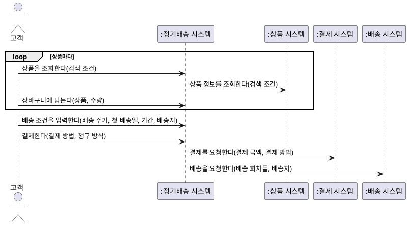

**강사 노트**

- 설명용이다. 실습 과제에는 넣지 않는다.
- 시스템 이벤트 — 상품을 조회한다, 장바구니에 담는다, 배송 조건을 입력한다, 결제한다. 동적 모델에서 각 이벤트를 도메인 객체의 상호작용으로 펼친다("04. 동적 모델 — 상호작용과 상태"의 「13. 실습 — 동적 모델」의 「시퀀스 다이어그램 (안)」).
- 응답은 그리지 않는다(「44. 정제된 SSD」). 유스케이스 흐름에 쓰지 않은 상품 조회가 여기서 외부 시스템에 보내는 요청으로 드러난다.

---

## 요구사항 정의서 보완 (안)

유스케이스를 작성하며 새로 발견한 요구는 **후속 작업에 영향을 미치는 경우에만** 명세서에 반영한다.

- **기능 요구**
  - **F7 배송 현황 조회** — 고객이 회차별 배송 현황을 조회한다(UC3).
  - **F8 정기배송 관리** — 관리자가 정지된 정기배송을 재개하거나 해지한다(UC5).
  - **F9 반품 승인** — 관리자가 불량·오배송 여부를 판단해 승인한다(UC6).
  - **F10 영수증 발행** — 결제가 승인되면 영수증을 발행하고 고객에게 알린다(UC1 기본 흐름 8).
- **업무 규칙**
  - **R4 회차 금액** — 여러 상품의 합: Σ(상품 가격 × 수량)(UC1 2 장바구니)
  - **R12 배송 정보 변경** — 다음 배송 24시간 전까지, 다음 회차부터 적용(UC1 1b)
- **책임 경계**
  - **F3 배송 요청** — 확정한 정기배송의 배송을 배송 시스템에 요청한다. 회차 배송은 배송 시스템이 한다.
  - **R6·R7 청구** — 월별 청구와 청구 실패 재시도는 결제 시스템이 한다.
- **※ 현행화 기준**
  - **반영** — R4, R12, F3·R6·R7. 클래스·동적 모델의 입력이 된다.
  - **기록만** — F7~F10. 유스케이스에 이미 담겼으므로 명세서는 **비용 대비 가치**가 있을 때만 현행화한다.

**강사 노트**

- 명세서는 한 번에 완성되지 않는다. 다음 산출물을 만들며 빈틈이 드러난다 — "01. OOAD 개요"의 「피드백」.
- 모든 산출물을 늘 최신으로 유지하는 것은 **적정 수준**을 넘는 비용이다 — "01. OOAD 개요"의 「모델링의 적정 수준」.
- 판단 기준 — 다음 단계의 입력이 되는가, 누군가 그 문서를 근거로 결정하는가. 둘 다 아니면 발견 기록만 남긴다.
- 수강생에게 자기 명세서에서 무엇을 반영하고 무엇을 남겼는지, 그 이유를 적게 한다.
