--------------------
Session 명: 03. 정적 모델 — 도메인 개념과 관계
--------------------

## 목차

01. 세션 목표
02. 요구에서 정적 모델로
03. 정적 모델과 동적 모델
04. 도메인 모델
05. 클래스 다이어그램
06. 데이터 모델과 도메인 모델
07. 모델 작성 절차
08. 개념 클래스 찾기
09. 속성
10. 연관
11. 개념의 분리
12. 일반화와 제약
13. 용어 정렬
14. 도메인 모델 작성
15. 패키지
16. 잘못된 관행
17. 모델의 검토
18. 실습 — 도메인 모델
19. 요약

---

## 01. 세션 목표

정적 모델은 문제영역에 **무엇이 존재하고, 어떤 정보를 가지며, 어떻게 관계하는지**를 명시하고 검토한다.

- 요구 분석의 **명세서·정제된 SSD·계약**에서 개념을 찾고, 발견한 것을 되돌린다.
- 정적·동적 모델의 관계를 알고, 상태 **값**과 상태 **전이**를 구분한다.
- 도메인 모델을 **기술 요소 없는 개념 모델**로 위치 짓고, 데이터 모델(ERD)과 대응시킨다.
- **찾기 → 그리기 → 연관·속성**의 절차로 **개념 클래스**와 **속성 도메인**을 명시한다.
- **클래스 유형**과 **관계 유형**을 구분하고, **연관**과 **다중성**으로 업무 규칙을 드러낸다.
- 용어를 정렬해 **도메인 모델**(초안·상세)을 그리고 **패키지**로 묶으며, **코드·테스트**로 잇는다.
- 시나리오와 교차검토해 **누락과 모순**을 찾고, **잘못된 관행**을 피한다.

**강사 노트**

- "02. 요구 분석과 유스케이스"가 요구를 **행위 관점**으로 구조화했다면, 정적 모델은 그 행위가 전제하는 **의미 구조**를 드러낸다. 설계 클래스로의 전환은 "06. 분석 모델에서 설계 모델로", 객체 책임은 "07. 책임·협력·계약"에서 다룬다.

---

## 02. 요구에서 정적 모델로

---

## 요구 산출물과 정적 모델

"02. 요구 분석과 유스케이스"의 **유스케이스 명세서·정제된 SSD·오퍼레이션 계약**이 이 세션의 **입력**이다. 그 안의 용어와 사후조건을 설명하려면 문제영역에 **무엇이 존재하고 어떻게 연결되는지**가 먼저 정해져야 한다.

**표 — 입력에서 찾는 것**

| 입력 | 예 | 정적 모델에서 찾는 것 |
|---|---|---|
| 유스케이스 명세서 | 주문 취소 결과 — 주문이 **취소 상태**, 전액 **환불** 완료 | 상태 값, 환불, 결제–환불 관계 |
| 정제된 SSD | `장바구니에 담는다(상품, 수량)`, `배송을 요청한다(주문, 배송지)` | 이벤트 파라미터의 개념·속성 |
| 오퍼레이션 계약 | 배송지 변경 — **배송지**는 새 주소, **상품**·**결제 금액**은 그대로 | 속성과 속성 도메인 |

모델을 그리다 발견한 누락·모순은 입력 산출물로 **되돌려** 보완한다. 별도의 문서를 만들지 않는다.

**도식 — Mermaid — 정적 모델의 입력과 되돌림**

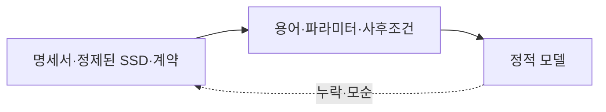

**강사 노트**

- 주문 취소는 "02. 요구 분석과 유스케이스"의 「33. 유스케이스 상세화」에 있는 **「주문을 관리한다」 명세의 주문 취소 대안 흐름 결과**, 정제된 SSD는 "02. 요구 분석과 유스케이스"의 「44. 정제된 SSD」, 배송지 변경은 "02. 요구 분석과 유스케이스"의 「45. 시스템 오퍼레이션과 계약」에 있는 **오퍼레이션 계약**이다. 전제(결제 완료·배송 시작 전 전체 취소, 출고 전 배송지 변경)를 그대로 사용한다.
- 모델을 그리다 용어가 모호하다는 사실을 발견하면 요구로 되돌아간다. 어디로 되돌리는지는 「누락과 모순」에서 정리한다.

---

## 도메인

도메인(Domain)은 소프트웨어를 적용하는 **업무의 영역**이다. 그 영역의 지식과 사람들이 하는 활동을 포함한다.

**인용문**

"지식·영향·활동의 영역. 사용자가 프로그램을 적용하는 주제 영역이 그 소프트웨어의 도메인이다", "A sphere of knowledge, influence, or activity. The subject area to which the user applies a program is the domain of the software.", [Evans 2015]

- **주문 시스템의 도메인** — 고객이 상품을 골라 주문하고, 결제하고, 취소·환불받고, 배송받는 **업무**와 그 업무의 규칙(배송 시작 전 취소, 출고 전 배송지 변경)
- 도메인은 **프로그램이 아니다**. 프로그램이 없어도 주문 업무는 있고, 프로그램은 그 업무를 돕는다.

**강사 노트**

- 정의 근거: Eric Evans, [DDD Reference](https://www.domainlanguage.com/wp-content/uploads/2016/05/DDD_Reference_2015-03.pdf), 2015, 용어 정의의 "domain" 원문 확인(verify-quote).
- 도메인 모델의 범위는 "02. 요구 분석과 유스케이스"에서 정한 **주문 시스템의 범위**다. 도메인을 하위 영역과 경계로 나누는 판단은 "13. OOAD에서 전문영역으로 — Architecture · DDD · MSA"에서 다룬다.

---

## 문제영역과 해결영역

같은 도메인을 두 질문으로 본다. 분석은 **무엇이 필요한가**를, 설계는 **어떻게 충족하는가**를 묻는다. 필요는 문제에서만 생기지 않고 **기회**에서도 생긴다.

**인용문**

"필요는 해결해야 할 **문제나 기회**다", "A problem or opportunity to be addressed.", [IIBA 2017]

**표 — 문제영역과 해결영역**

| 구분 | 묻는 것 | 주문 사례 |
|---|---|---|
| **문제영역 — 문제** | 무엇이 부족한가? | 출고 전 배송지를 고객이 직접 바꿀 수 없다 |
| **문제영역 — 기회** | 무엇을 더 잘할 수 있는가? | 배송 시작 전이면 고객이 직접 취소하고 환불받는다 |
| **해결영역** | 무엇으로 충족하는가? | 변경 화면, 결제 API, 주문 테이블, 메시지 큐 |

- 도메인 모델은 **문제영역의 말**(주문·결제·환불)로 그린다. 해결영역의 말은 설계에서 쓴다. 그래서 도메인 모델에는 **기술 요소가 없다**.

**강사 노트**

- 문제·기회 근거: IIBA, [Global Business Analysis Core Standard](https://www.iiba.org/globalassets/standards-and-resources/core-standard/iiba-core-standard.pdf), 2017, 핵심 개념 "Need"의 정의 원문 확인(verify-quote). IIBA는 필요(Need)와 해결책(Solution)을 서로 다른 핵심 개념으로 둔다.
- 문제 행은 "02. 요구 분석과 유스케이스"의 「05. 요청에는 무엇이 섞여 있는가?」와 같은 요청이다. 기회 행은 같은 세 장면 안에서 고른 교육용 예다.
- 기회는 고객이 아직 말하지 않은 필요일 수 있다("02. 요구 분석과 유스케이스"의 「02. 요구공학의 본질」).

---

## 정적 모델

문제영역을 모델로 옮길 때는 모든 것을 담지 않고 **필요한 측면만** 고른다. 정적 모델(Static Model)은 그중 문제영역의 **개념과 관계**를 구현과 분리해 보인다.

**인용문**

"모델은 도메인의 **선택된 측면**을 기술하고, 그 도메인과 관련된 문제를 푸는 데 쓸 수 있는 **추상의 체계**다", "A system of abstractions that describes selected aspects of a domain and can be used to solve problems related to that domain.", [Evans 2015]

- **개념** — 무엇이 존재하는가? 주문, 결제, 환불
- **정보** — 각 개념은 무엇을 기억하는가? 주문의 주문 상태, 결제의 결제 금액
- **관계** — 몇 개씩 연결되는가? 주문 하나에 결제는 없거나 하나다.
- **제약** — 언제나 지킬 조건은? 환불 금액은 결제 금액을 넘지 않는다.

**도식 — PlantUML — 주문 클래스 다이어그램**

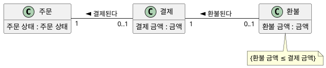

**강사 노트**

- 근거: Eric Evans, [DDD Reference](https://www.domainlanguage.com/wp-content/uploads/2016/05/DDD_Reference_2015-03.pdf), 2015, 용어 정의의 "model" 원문 확인(verify-quote).
- 정적 모델은 현실의 사진이 아니라 **현재 요구에 답하는 데 필요한 측면**만 고른 해석이다.
- "구현과 분리"는 구현을 무시하라는 뜻이 아니다. 의미를 먼저 합의해야 기술 선택이 의미를 바꾸는지 판단할 수 있다("10. 기술 제약과 도메인 의미 보존").

---

## 03. 정적 모델과 동적 모델

---

## 존재와 사건

정적 모델은 **무엇이 존재하는지**, 동적 모델은 **무엇이 일어나는지**를 보여준다. 두 모델은 **서로를 검증**한다.

**표 — 정적 모델과 동적 모델**

| 구분 | 정적 모델 | 동적 모델 |
|---|---|---|
| **질문** | 무엇이 존재하고 어떻게 관계하는가? | 무엇이 어떤 순서로 일어나는가? |
| **요소** | 개념, 속성, 연관, 다중성, 제약 | 시스템 이벤트, 상호작용, 상태 전이 |
| **표기** | 클래스 다이어그램 | 활동·시퀀스·커뮤니케이션·상태 기계 다이어그램 |

- 동적 모델의 중심은 **상태 기계**다. 정적 모델의 **상태 값**(열거형)과 동적 모델의 **사건**이 만나는 곳이기 때문이다.

**강사 노트**

- 정적·동적의 구분은 "04. 동적 모델 — 상호작용과 상태"의 출발점이다. 두 모델이 서로를 검증한다는 관계에 초점을 둔다.

---

## 한 사건, 네 다이어그램

**주문 취소** 하나를 네 동적 다이어그램으로 보면 모두 가운데의 **주문 상태 전이**(결제 완료 → 취소됨)로 모인다.

**도식 — SVG**

```svg:uml
<svg xmlns="http://www.w3.org/2000/svg" width="1000" height="620" viewBox="0 0 1000 620" role="img" aria-label="주문 취소 한 사건을 활동·시퀀스·커뮤니케이션·클래스 다이어그램으로 보고 모두 가운데 주문 상태 기계의 전이로 모이는 관계">
<style>text{font-family:sans-serif;font-size:16px;fill:#000;text-anchor:middle}.t{font-weight:bold}.n{font-size:19px;font-weight:bold}.s{fill:#fff;stroke:#181818;stroke-width:1.5}.x{fill:#fff;stroke:#1B3A6B;stroke-width:1.5}.c{fill:#fff;stroke:#1B3A6B;stroke-width:3}.l{stroke:#181818;stroke-width:1.3;fill:none}.f{stroke:#1B3A6B;stroke-width:1.6;fill:none}</style><defs><marker id="o" viewBox="0 0 12 12" refX="11" refY="6" markerWidth="12" markerHeight="12" orient="auto" markerUnits="userSpaceOnUse"><path d="M1,1 L11,6 L1,11" fill="none" stroke="#181818" stroke-width="1.4"/></marker><marker id="f" viewBox="0 0 12 12" refX="11" refY="6" markerWidth="12" markerHeight="12" orient="auto" markerUnits="userSpaceOnUse"><path d="M0,0 L12,6 L0,12 Z" fill="#1B3A6B"/></marker></defs>
<rect width="1000" height="620" fill="#fff"/>
<text class="n" x="165" y="30">활동 다이어그램</text>
<rect class="x" x="20" y="40" width="290" height="150" rx="6"/>
<rect class="s" x="45" y="62" width="240" height="34" rx="16"/><text x="165" y="85">고객이 주문을 취소한다</text>
<line class="l" x1="165" y1="96" x2="165" y2="124" marker-end="url(#o)"/>
<rect class="s" x="45" y="126" width="240" height="34" rx="16"/><text x="165" y="149">환불이 처리된다</text>
<text class="n" x="835" y="30">시퀀스 다이어그램</text>
<rect class="x" x="690" y="40" width="290" height="150" rx="6"/>
<rect class="s" x="705" y="55" width="70" height="28"/><text x="740" y="75">:주문</text>
<rect class="s" x="800" y="55" width="70" height="28"/><text x="835" y="75">:배송</text>
<rect class="s" x="895" y="55" width="70" height="28"/><text x="930" y="75">:결제</text>
<line x1="740" y1="83" x2="740" y2="180" stroke="#1B3A6B" stroke-width="1.3" stroke-dasharray="6,5"/>
<line x1="835" y1="83" x2="835" y2="180" stroke="#1B3A6B" stroke-width="1.3" stroke-dasharray="6,5"/>
<line x1="930" y1="83" x2="930" y2="180" stroke="#1B3A6B" stroke-width="1.3" stroke-dasharray="6,5"/>
<line class="f" x1="740" y1="118" x2="832" y2="118" marker-end="url(#f)"/><text x="787" y="111">출고 중단</text>
<line class="f" x1="740" y1="160" x2="927" y2="160" marker-end="url(#f)"/><text x="884" y="153">환불 요청</text>
<text class="n" x="500" y="240">상태 기계 다이어그램</text>
<rect class="c" x="370" y="250" width="260" height="120" rx="6"/>
<rect class="s" x="385" y="290" width="96" height="40" rx="14"/><text x="433" y="315">결제 완료</text>
<rect class="s" x="549" y="290" width="66" height="40" rx="14"/><text x="582" y="315">취소됨</text>
<line class="l" x1="481" y1="310" x2="547" y2="310" marker-end="url(#o)"/><text x="514" y="283">주문 취소</text>
<text class="n" x="165" y="440">커뮤니케이션 다이어그램</text>
<rect class="x" x="20" y="450" width="290" height="150" rx="6"/>
<rect class="s" x="35" y="505" width="70" height="28"/><text x="70" y="524">:주문</text>
<rect class="s" x="215" y="468" width="70" height="28"/><text x="250" y="487">:배송</text>
<rect class="s" x="215" y="550" width="70" height="28"/><text x="250" y="569">:결제</text>
<line class="l" x1="105" y1="514" x2="215" y2="482"/>
<line class="l" x1="105" y1="524" x2="215" y2="564"/>
<text x="140" y="480">1: 출고 중단 →</text>
<text x="140" y="592">2: 환불 요청 ↘</text>
<text class="n" x="835" y="440">클래스 다이어그램</text>
<rect class="x" x="690" y="450" width="290" height="150" rx="6"/>
<rect class="s" x="705" y="463" width="120" height="50"/><text class="t" x="765" y="482">주문</text><line class="l" x1="705" y1="489" x2="825" y2="489"/><text x="765" y="507">주문 상태</text>
<rect class="s" x="705" y="522" width="120" height="58"/><text x="765" y="543">«enumeration»</text><text x="765" y="567">주문 상태</text>
<rect class="s" x="880" y="463" width="80" height="28"/><text x="920" y="483">배송</text>
<rect class="s" x="880" y="507" width="80" height="28"/><text x="920" y="527">결제</text>
<rect class="s" x="880" y="551" width="80" height="28"/><text x="920" y="571">환불</text>
<line class="l" x1="825" y1="477" x2="880" y2="477"/>
<line class="l" x1="825" y1="500" x2="880" y2="521"/>
<line class="l" x1="920" y1="535" x2="920" y2="551"/>
<line x1="310" y1="170" x2="370" y2="262" stroke="#C0504D" stroke-width="1.6" stroke-dasharray="4,4"/>
<line x1="690" y1="170" x2="630" y2="262" stroke="#C0504D" stroke-width="1.6" stroke-dasharray="4,4"/>
<line x1="310" y1="470" x2="370" y2="358" stroke="#C0504D" stroke-width="1.6" stroke-dasharray="4,4"/>
<line x1="690" y1="470" x2="630" y2="358" stroke="#C0504D" stroke-width="1.6" stroke-dasharray="4,4"/>
</svg>
```

**강사 노트**

- 네 다이어그램의 표기와 작성법은 "04. 동적 모델 — 상호작용과 상태"의 「04. 상호작용 모델」부터 다룬다. 정적 모델이 네 다이어그램에 **무엇을 주고 무엇을 돌려받는지**에 초점을 둔다.

---

## 정적 모델과의 연결

네 다이어그램은 정적 모델의 요소를 쓰고, 쓸 요소가 없으면 정적 모델의 **누락**을 드러낸다.

**표 — 다이어그램별로 쓰는 정적 모델 요소**

| 다이어그램 | 주문 취소에서 답하는 질문 | 정적 모델에서 쓰는 것 | 정적 모델에 드러나는 누락 |
|---|---|---|---|
| **활동** | 어느 단계에서 상태가 바뀌는가? | 상태 값, 행동이 만드는 개념(환불) | 흐름에 없는 상태 값 |
| **시퀀스** | 어떤 메시지가 전이를 일으키는가? | 개념(생명선), 연관(메시지의 길) | 메시지를 보낼 연관이 없다 |
| **커뮤니케이션** | 메시지가 어느 링크를 지나는가? | 연관(링크), 다중성 | 링크에 대응하는 연관이 없다 |
| **상태 기계** | 어떤 사건으로 어떤 상태가 되는가? | 열거형 상태 값, 제약 | 전이 없는 상태 값, 값에 없는 상태 |

**강사 노트**

- 사건이 바꿀 대상이 정적 모델에 없으면 누락이다. 어떤 사건에도 등장하지 않는 개념은 불필요하거나 행위를 놓친 신호다.
- 동적 모델과의 본격적인 교차검증은 "04. 동적 모델 — 상호작용과 상태"에서 다룬다. 정적 모델에서는 유스케이스의 흐름·사후조건과 대조한다(「시나리오 교차검토」).

---

## 상태 값과 상태 전이

어떤 **상태 값**이 있는지는 정적 모델이, 어떤 사건이 상태를 **바꾸는지**는 동적 모델이 표현한다.

**인용문**

"객체의 상태는 그 객체가 속한 분류자의 **속성 값**으로 식별된다", "The state of an object identifies the values for that object of properties of the classifier of the object.", [OMG 2017]

- **정적 질문** — 가능한 값은? "배송 시작 전"과 "출고 전"은 같은 경계인가?
- **열거형** — 가능한 값을 나열한 값의 종류다. 주문의 속성 `주문 상태`의 타입이다.

**도식 — PlantUML — 주문 상태 열거형**

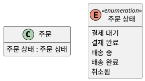

**페이지 분할**

- **동적 질문** — 어떤 사건이 상태를 바꾸는가? 어떤 전이가 금지되는가?
- 상태 기계의 **상태**는 열거형 `주문 상태`의 **값**과 하나씩 대응한다. 전이에 없는 값이나 값에 없는 상태는 **누락**이다.

**도식 — PlantUML — 주문 상태 기계**

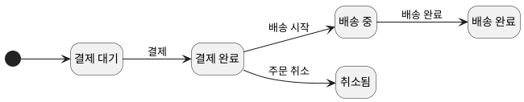

**강사 노트**

- 인용 근거: OMG [UML 2.5.1](https://www.omg.org/spec/UML/2.5.1/PDF)의 객체 상태 설명, 원문 확인(verify-quote).
- 주문 상태 값 목록은 **교육용 가정**이다.
- 상태 기계는 대비를 위한 미리보기다. 전이는 결제 완료·배송 시작 전 전체 취소라는 기존 전제와 일치하는 것만 그렸다. 가드·시간 이벤트와 금지된 전이는 "04. 동적 모델 — 상호작용과 상태"에서 다룬다.
- "배송 시작 전"과 "출고 전"은 동의어로 가정하지 않는다. 정적 모델은 둘의 차이를 질문으로 드러내고, 실제 사건·상태 관계는 "04. 동적 모델 — 상호작용과 상태"에서 확인한다.

---

## 04. 도메인 모델

---

## 도메인 모델

도메인 모델(Domain Model)은 문제영역의 **개념 클래스**(Conceptual Class)와 그 속성·연관을 시각화한 정적 모델이다.

**인용문**

"도메인 모델은 영역의 **개념 클래스**나 실제 상황의 객체를 시각적으로 표현한 것이다", "A domain model is a visual representation of conceptual classes or real-situation objects in a domain", [Larman 2004]

- **개념 클래스**는 업무에서 구분해 이야기하는 **아이디어·사물·객체**다. 소프트웨어 클래스가 아니다.
- UML 클래스 다이어그램으로 그리되 **오퍼레이션은 쓰지 않는다**. 책임과 메서드는 설계에서 정한다.
- **개념** — 주문, 주문 항목, 상품, 결제, 환불, 고객
- **개념이 아닌 것** — 주문 버튼, 주문 테이블, 주문 서비스

**강사 노트**

- 근거: Larman 2004 원문 확인(verify-quote) — 정의, "Informally, a conceptual class is an idea, thing, or object.", "a conceptual class may be considered in terms of its symbol, intension, and extension". 원문의 symbol·intension·extension을 표기·정의·인스턴스로 옮겼다. 같은 곳은 도메인 모델이 오퍼레이션 없는 클래스 다이어그램이며 영역의 **시각적 사전**(visual dictionary)이라고 설명한다.
- 모든 질문에 답할 수 있어야 개념인 것은 아니다. 속성이 없어도 업무상 구분되는 개념일 수 있다(「데이터 모델과 도메인 모델」).
- 분석 모델에서 설계 모델로의 전환은 "06. 분석 모델에서 설계 모델로", DDD의 도메인 모델과의 관계는 "13. OOAD에서 전문영역으로 — Architecture · DDD · MSA"에서 다룬다.

---

## 표기·정의·인스턴스

개념 클래스는 **세 측면**으로 본다(Larman, 2004).

- **표기** — 도식에 그리는 이름 "주문"이다. 업무 담당자가 부르는 말을 쓴다.
- **정의** — 무엇이 주문인지 정한 문장이다. 용어집에 둔다(「용어집 정제」).
- **인스턴스** — 정의에 맞는 주문 하나하나(O-1, O-2)다. 예시와 테스트의 값이 된다.
- 표기가 같아도 정의가 다르면 **다른 개념**이다. 인스턴스를 떠올리면 다중성이 보인다 — O-1에는 주문 항목이 몇 개인가?

**도식 — SVG**

```svg:uml
<svg xmlns="http://www.w3.org/2000/svg" width="1000" height="210" viewBox="0 0 1000 210" role="img" aria-label="개념 클래스 주문의 세 측면: 표기는 이름 주문, 정의는 용어집의 정의, 인스턴스는 주문 O-1, O-2, O-3">
<style>text{font-family:sans-serif;font-size:16px;fill:#000;text-anchor:middle}.t{font-weight:bold}.n{font-size:22px;font-weight:bold}.s{fill:#fff;stroke:#181818;stroke-width:1.5}.x{fill:#fff;stroke:#1B3A6B;stroke-width:1.5}.c{fill:#fff;stroke:#1B3A6B;stroke-width:3}.l{stroke:#181818;stroke-width:1.3;fill:none}.f{stroke:#1B3A6B;stroke-width:1.6;fill:none}</style><defs><marker id="o" viewBox="0 0 12 12" refX="11" refY="6" markerWidth="12" markerHeight="12" orient="auto" markerUnits="userSpaceOnUse"><path d="M1,1 L11,6 L1,11" fill="none" stroke="#181818" stroke-width="1.4"/></marker><marker id="f" viewBox="0 0 12 12" refX="11" refY="6" markerWidth="12" markerHeight="12" orient="auto" markerUnits="userSpaceOnUse"><path d="M0,0 L12,6 L0,12 Z" fill="#1B3A6B"/></marker></defs>
<rect width="1000" height="210" fill="#fff"/>
<text class="n" x="160" y="30">표기</text><text class="n" x="500" y="30">정의</text><text class="n" x="840" y="30">인스턴스</text>
<rect class="x" x="20" y="45" width="280" height="150" rx="6"/>
<rect class="s" x="95" y="95" width="130" height="50"/><text class="t" x="160" y="126">주문</text>
<rect class="x" x="360" y="45" width="280" height="150" rx="6"/>
<rect class="s" x="380" y="80" width="240" height="80"/><text x="500" y="114">고객이 상품 구매를</text><text x="500" y="138">요청해 성립한 거래</text>
<rect class="x" x="700" y="45" width="280" height="150" rx="6"/>
<rect class="s" x="740" y="75" width="80" height="36"/><text x="780" y="99">O-1</text>
<rect class="s" x="860" y="75" width="80" height="36"/><text x="900" y="99">O-2</text>
<rect class="s" x="800" y="130" width="80" height="36"/><text x="840" y="154">O-3</text>
<line class="l" x1="300" y1="120" x2="358" y2="120" marker-end="url(#o)"/>
<line class="l" x1="640" y1="120" x2="698" y2="120" marker-end="url(#o)"/>
</svg>
```

**강사 노트**

- 내포는 용어집(「용어집 정제」)의 정의와 같다. 그래서 용어집과 도메인 모델은 함께 정제한다.

---

## 도메인 모델의 위치

같은 주문도 **객체** 쪽과 **데이터** 쪽에서 따로 구체화된다. 맨 위의 두 모델은 같은 문제영역을 본다.

- **객체 쪽** — 설계 모델을 거쳐 **코드**로 구현된다.
- **데이터 쪽** — **물리 데이터 모델**(테이블·키·컬럼 타입)로 저장된다.
- 도메인 모델에는 둘의 **기술 요소가 없다**.

**도식 — SVG**

```svg:uml
<svg xmlns="http://www.w3.org/2000/svg" width="900" height="330" viewBox="0 0 900 330" role="img" aria-label="객체 쪽은 도메인 모델, 설계 모델, 코드로, 데이터 쪽은 논리 데이터 모델, 물리 데이터 모델로 구체화된다">
<style>text{font-family:sans-serif;font-size:16px;fill:#000;text-anchor:middle}.t{font-weight:bold}.n{font-size:22px;font-weight:bold}.s{fill:#fff;stroke:#181818;stroke-width:1.5}.l{stroke:#181818;stroke-width:1.3;fill:none}.m{font-family:monospace;text-anchor:start}</style><defs><marker id="o" viewBox="0 0 12 12" refX="11" refY="6" markerWidth="12" markerHeight="12" orient="auto" markerUnits="userSpaceOnUse"><path d="M1,1 L11,6 L1,11" fill="none" stroke="#181818" stroke-width="1.4"/></marker></defs>
<rect width="900" height="330" fill="#fff"/>
<text class="n" x="230" y="22">도메인 모델</text>
<rect class="s" x="130" y="30" width="200" height="62"/><text class="t" x="230" y="50">주문</text><line class="l" x1="130" y1="58" x2="330" y2="58"/><text x="230" y="81">주문 상태 : 주문 상태</text>
<text class="n" x="670" y="22">논리 데이터 모델</text>
<rect class="s" x="570" y="30" width="200" height="72"/><text class="t" x="670" y="50">주문</text><line class="l" x1="570" y1="58" x2="770" y2="58"/><text x="670" y="78">● 주문번호</text><text x="670" y="96">주문상태</text>
<line x1="330" y1="61" x2="570" y2="61" stroke="#1B3A6B" stroke-width="1.3" stroke-dasharray="6,5"/>
<line class="l" x1="230" y1="92" x2="230" y2="122" marker-end="url(#o)"/>
<text class="n" x="230" y="146">설계 모델</text>
<rect class="s" x="130" y="154" width="200" height="80"/><text class="t" x="230" y="173">Order</text><line class="l" x1="130" y1="180" x2="330" y2="180"/><text x="230" y="199">status : OrderStatus</text><line class="l" x1="130" y1="207" x2="330" y2="207"/><text x="230" y="226">cancel()</text>
<line class="l" x1="230" y1="234" x2="230" y2="252" marker-end="url(#o)"/>
<line class="l" x1="670" y1="102" x2="670" y2="252" marker-end="url(#o)"/>
<text class="n" x="230" y="274">코드</text>
<rect class="s" x="70" y="282" width="320" height="46"/><text class="m" x="84" y="301">class Order { OrderStatus status;</text><text class="m" x="84" y="321">  void cancel() { … } }</text>
<text class="n" x="670" y="274">물리 데이터 모델</text>
<rect class="s" x="560" y="282" width="220" height="46"/><text class="t" x="670" y="301">주문 테이블</text><text x="670" y="321">주문번호 PK · 주문상태</text>
</svg>
```

**강사 노트**

- 데이터 모델링의 개념·논리·물리 세 단계는 데이터 쪽 구체화다(「정보공학의 데이터 모델링」). 객체 쪽은 도메인 모델에서 설계 모델로, 다시 코드로 구체화된다. "물리 모델"이라는 말은 데이터 쪽에만 쓴다.
- "10. 기술 제약과 도메인 의미 보존"의 물리 모델(`OrderRow`)은 테이블의 행을 코드로 옮긴 저장용 클래스다 — 데이터 쪽의 물리 모델을 객체로 표현한 것이다.
- 근거: Larman 2004 원문 확인(verify-quote) — 객체지향 설계와 언어가 소프트웨어 구성 요소와 도메인 개념 사이의 표현 간극을 줄인다("lower representational gap"). 설계 이름의 영문은 과정의 영한 용어집을 따른다.
- 설계 이름을 도메인 모델에서 가져오면 표현 간극이 작아진다. 층은 작업 순서가 아니라 같은 대상을 서로 다른 질문으로 보는 관점이다.

---

## 05. 클래스 다이어그램

---

## 표기와 사용법

도메인 모델은 UML **클래스 다이어그램 표기**를 빌리지만, 각 사각형은 소프트웨어 클래스가 아니라 **개념**이다.

**도식 — SVG — 클래스 다이어그램 표기**

```svg
<svg xmlns="http://www.w3.org/2000/svg" width="1000" height="230" viewBox="0 0 1000 230" role="img" aria-label="클래스 다이어그램 표기: 개념과 속성, 연관과 다중성, 일반화, 합성, 열거형">
<style>text{font-family:sans-serif;font-size:16px;fill:#000;text-anchor:middle}.b{fill:#fff;stroke:#181818;stroke-width:2}.l{stroke:#181818;stroke-width:2.5;fill:none}</style>
<rect width="1000" height="230" fill="#fff"/>
<rect class="b" x="30" y="30" width="150" height="100"/><text x="105" y="58" style="font-weight:bold">주문</text><line x1="30" y1="70" x2="180" y2="70" stroke="#181818" stroke-width="2"/><text x="105" y="104" style="font-size:16px">주문 번호</text>
<line class="l" x1="215" y1="85" x2="375" y2="85"/><text x="295" y="72" style="font-size:16px">주문한다 ▶</text><text x="228" y="110" style="font-size:16px">1</text><text x="352" y="110" style="font-size:16px">0..*</text>
<line class="l" x1="410" y1="85" x2="545" y2="85"/><polygon points="545,70 572,85 545,100" fill="#fff" stroke="#181818" stroke-width="2.5"/>
<polygon points="605,85 623,74 641,85 623,96" fill="#181818" stroke="#181818" stroke-width="2"/><line class="l" x1="641" y1="85" x2="755" y2="85"/>
<rect class="b" x="790" y="25" width="180" height="110"/><text x="880" y="50" style="font-size:16px">«enumeration»</text><text x="880" y="74" style="font-weight:bold">주문 상태</text><line x1="790" y1="84" x2="970" y2="84" stroke="#181818" stroke-width="2"/><text x="880" y="112" style="font-size:16px">결제 대기</text>
<text x="105" y="195" style="font-size:22px;font-weight:bold">개념·속성</text><text x="295" y="195" style="font-size:22px;font-weight:bold">연관·다중성</text><text x="490" y="195" style="font-size:22px;font-weight:bold">일반화</text><text x="680" y="195" style="font-size:22px;font-weight:bold">합성</text><text x="880" y="195" style="font-size:22px;font-weight:bold">열거형</text>
</svg>
```

### 표기와 사용법

| 표기 | 의미 | 이렇게 쓴다 |
|---|---|---|
| **개념** — 이름 있는 사각형 | 문제영역에서 구분해 이야기하는 것 | 업무에서 쓰는 단수 명사로 이름 짓는다 |
| **속성** — 사각형 안의 항목 | 개념이 가지는 단순한 값 | `이름 : 값의 종류`로 쓴다. 타입은 업무 값의 종류로 |
| **연관** — 실선과 이름 | 기억하거나 이해할 가치가 있는 관계 | 동사구로 이름 짓고 읽는 방향(`>`)을 표시한다 |
| **다중성** — 양 끝의 수 | 상대와 몇 개씩 관계하는가 | `1`, `0..1`, `0..*`, `1..*` |
| 오퍼레이션 | — | 쓰지 않는다. 책임과 메서드는 설계에서 정한다 |

**강사 노트**

- 근거: Larman 2004 원문 확인 — 도메인 모델은 오퍼레이션(메서드 시그니처)을 정의하지 않은 클래스 다이어그램으로 표현한다.

---

## 값과 제약의 표기

| 표기 | 의미 | 이렇게 쓴다 |
|---|---|---|
| **파생 속성** — `/` | 다른 값에서 계산되는 속성 | `/ 주문 총액`처럼 이름 앞에 붙인다(「파생 속성」) |
| **제약** — `{ }` | 언제나 참이어야 하는 조건 | `{수량은 1 이상}`처럼 중괄호 메모로 붙인다(「제약」) |

**고객과 주문**을 그린 예다. "고객이 주문을 **주문한다**"로 읽고, 고객 한 명은 주문을 **0개 이상** 한다.

**도식 — PlantUML — 고객–주문 클래스 다이어그램**

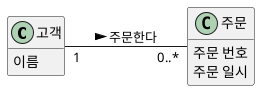

**강사 노트**

- 연관 이름은 읽는 방향이 있다. 위 도식은 "고객이 주문을 주문한다"로 읽는다. 표기가 같아도 의미는 모델의 관점이 정한다.

---

## 클래스 유형

클래스 다이어그램의 사각형은 모두 비슷해 보이지만 UML 표기의 **유형**이 다르다. 도메인 모델은 그중 개념 클래스·데이터 타입·열거형을 주로 쓴다.

**표 — UML 클래스 유형**

| 유형 | 표기 | 의미 | 도메인 모델 | 코드에서 |
|---|---|---|---|---|
| **개념 클래스** | 이름 있는 사각형 | 문제영역에서 구분하는 것 | 쓴다 — 주문, 상품 | `class` |
| **데이터 타입** | `«dataType»` | **값**이 같으면 같은 값의 종류 | 속성의 타입 — 금액, 수량 | `record` |
| **열거형** | `«enumeration»` | 정해진 값의 목록 | 쓴다 — 주문 상태 | `enum` |
| **연관 클래스** | 연관에 점선으로 연결 | 연관 자체가 가지는 정보 | 필요할 때 | 두 참조의 `class` |
| **추상 클래스** | 기울인 이름 | 직접 인스턴스가 없는 일반 개념 | 일반화의 위쪽 | `abstract class` |
| **인터페이스** | `«interface»` | 구현 없는 오퍼레이션 약속 | 쓰지 않는다 — 설계 | `interface` |

- **데이터 타입과 개념 클래스** — 금액 1,000원은 어디에 있든 같은 금액이다. 주문은 내용이 같아도 서로 다른 주문이다.

**강사 노트**

- 같은 사각형이라도 도메인 모델의 사각형은 **개념**이다(「도메인 모델의 위치」). 인터페이스는 설계 유형과 대비하려고 넣었다. 인터페이스·오퍼레이션은 설계에서 정한다.
- 데이터 타입은 식별자가 없어 값이 같으면 같은 것이다. 개념 클래스는 식별된다.
- 근거: OMG [UML 2.5.1](https://www.omg.org/spec/UML/2.5.1/PDF)의 DataType·Enumeration, 추상 분류자, Interface 정의.
- 데이터 타입은 「데이터 타입」, 연관 클래스는 「연관 클래스」, 추상 클래스는 「일반화」에서 자세히 본다.

---

## 클래스 유형의 예

**배치 — 좌우**

UML **클래스 유형**을 주문 사례에서 찾는다.

- **클래스 유형**
  - 개념 클래스(주문)
  - 열거형(주문 상태)
  - 데이터 타입(주소)
  - 추상 클래스(결제)
  - 인터페이스(결제 시스템)

**도식 — PlantUML — 클래스 유형**

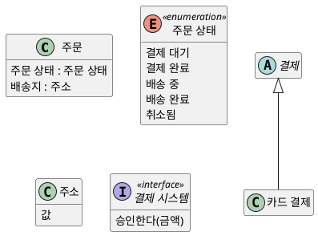

**강사 노트**

- 인터페이스는 설계의 유형이다. 도메인 모델에는 쓰지 않으며, 설계 유형과 대비하려고 넣었다.
- 주소는 데이터 타입이지만 도식에는 스테레오타입을 붙이지 않는다(session-authoring-guide.md의 UML 공통 규칙). 유형은 본문에서 대응시킨다.

---

## 관계 유형

클래스 사이의 관계는 UML 표기로 여섯 가지다. 도메인 모델은 **연관·합성·일반화**를 쓰고, **의존·실현**은 설계에서 쓴다.

**표 — UML 관계 유형**

| 관계 | 표기 | 의미 | 도메인 모델 | 코드에서 |
|---|---|---|---|---|
| **연관** | 실선 | 기억할 구조적 관계 | 쓴다 | 참조 필드(방향은 설계) |
| **집합** | 속 빈 마름모 | 전체–부분, 생애는 따로 | 쓰지 않는다 — 연관과 같다 | 공유되는 참조 |
| **합성** | 채운 마름모 | 한 전체에 속하고 생애를 함께 | 의미가 분명할 때 | 전체가 부분을 만들고 소유 |
| **일반화** | 실선, 빈 삼각형 | 특수가 일반의 한 종류 | 정의가 모두 적용될 때 | `extends` |
| **의존** | 점선, 열린 화살표 | 잠깐 쓴다 — 바뀌면 영향 | 쓰지 않는다 — 설계 | 매개변수·지역 변수 |
| **실현** | 점선, 빈 삼각형 | 인터페이스를 구현한다 | 쓰지 않는다 — 설계 | `implements` |

- **집합과 연관** — 코드가 같다(참조 필드). 그래서 도메인 모델은 집합 대신 일반 연관이나 합성을 쓴다.

**강사 노트**

- 코드의 관계는 **설계의 결정**이다. 집합과 연관은 코드가 같다(참조 필드). 도메인 모델은 집합을 쓰지 않고 필요하면 합성을 쓴다(「집합과 합성」).
- 의존·실현은 오퍼레이션과 인터페이스가 정해져야 생긴다. 도메인 모델에서는 쓰지 않고 "06. 분석 모델에서 설계 모델로"와 "07. 책임·협력·계약"에서 다룬다.

---

## 관계 유형과 코드

주문 사례로 여섯 관계를 그리고 코드로 옮겼다. 합성은 **주문이 주문 항목을 만드는 것**으로, 의존은 **매개변수로 잠깐 쓰는 것**으로 드러난다.

**도식 — PlantUML — 관계 유형**

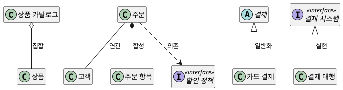

```java
// ... 고객·상품·주문항목·할인정책 생략
class 상품카탈로그 {
    final List<상품> 상품들 = new ArrayList<>();
}

class 주문 {
    final 고객 고객;
    final List<주문항목> 항목들 = new ArrayList<>();
    주문(고객 고객) { this.고객 = 고객; }
    void 담는다(상품 상품, int 수량) {
        항목들.add(new 주문항목(상품, 수량));
    }
    int 할인액(할인정책 정책) { return 정책.할인액(this); }
}

abstract class 결제 {}
class 카드결제 extends 결제 {}

interface 결제시스템 { boolean 승인한다(int 금액); }
class 결제대행 implements 결제시스템 {
    public boolean 승인한다(int 금액) { return true; }
}
```

**강사 노트**

- 코드는 `code/s03/관계유형.java`에서 발췌했다. 근거: OMG [UML 2.5.1](https://www.omg.org/spec/UML/2.5.1/PDF)의 AggregationKind, Dependency, InterfaceRealization 정의.
- 연관은 「연관의 이름」, 도메인에서 자주 나타나는 연관은 「기억해야 하는 연관」, 일반화는 「일반화」, 합성은 「집합과 합성」에서 자세히 본다.

---

## 집합과 합성

관계 유형 가운데 **집합과 합성**은 전체–부분 관계다. 표기보다 **의미가 먼저**다 — 부분이 전체와 **소속과 생애**를 공유하는지 확인한다.

**인용문**

"UML의 **집합은 쓰지 말고**, 적절할 때 **합성**을 쓴다", "don't bother to use aggregation in the UML; rather, use composition when appropriate.", [Larman 2004]

  - "합성은 **확신이 없으면 뺀다**", "On composition: If in doubt, leave it out.", [Larman 2004]

- **합성**(Composition) — 부분은 한 시점에 **하나의 전체**에만 속하고 생애를 함께한다.
- **합성을 보일 때** — 부분의 생애가 전체에 묶이고, 전체–부분의 조립이 분명하며, 전체의 속성·연산이 부분에 전해진다.
- **질문** — 주문 항목은 주문 없이 의미가 있는가? 여러 주문에 속할 수 있는가? 불분명하면 **일반 연관**으로 두고 질문을 남긴다.

**도식 — PlantUML — 주문–주문 항목 합성**

```plantuml:class
@startuml
hide empty methods
left to right direction
class "주문" as Order
class "주문 항목" as OrderItem
Order "1" *-- "1..*" OrderItem : 포함한다 >
@enduml
```

**강사 노트**

- 근거: Larman 2004 원문 확인(verify-quote). 원문은 집합이 UML에서 일반 연관과 구별되는 의미가 없다고 설명하고, Rumbaugh의 말("Think of it as a modeling placebo.")을 인용한 뒤 위 지침을 둔다. 합성을 보일 조건도 같은 곳의 지침이다.
- 합성 의미 근거: OMG [UML 2.5.1](https://www.omg.org/spec/UML/2.5.1/PDF)의 AggregationKind 정의. 같은 정의는 합성의 정확한 생애 의미를 의도적으로 명세하지 않는다. 도메인 모델의 "삭제"는 소프트웨어 객체 삭제가 아니라 업무 생애의 결합으로 읽는다.

---

## 06. 데이터 모델과 도메인 모델

---

## 정보공학의 데이터 모델링

정보공학의 데이터 모델링은 업무 정보를 **엔티티·속성·관계**로 표현하고, 개념 → 논리 → 물리 모델로 구체화한다.

**인용문**

"개체–관계 모델은 현실 세계가 **개체와 관계**로 이루어져 있다는 더 자연스러운 관점을 취한다", "The entity-relationship model adopts the more natural view that the real world consists of entities and relationships.", [Chen 1976]

**표 — 데이터 모델의 세 단계**

| 단계 | 초점 | 주문 사례 |
|---|---|---|
| **개념 데이터 모델** | 핵심 엔티티와 관계 | 고객–주문–상품 |
| **논리 데이터 모델** | 속성·식별자·관계의 카디널리티·정규화 | 주문(주문번호, 주문일시, 주문상태) |
| **물리 데이터 모델** | 테이블·컬럼 타입·인덱스·성능 | 주문 테이블과 인덱스 |

- 도메인 모델은 이 중 **개념·논리 데이터 모델**과 겹친다. 물리 데이터 모델의 테이블·인덱스는 다루지 않는다.

**강사 노트**

- 인용 근거: Peter Pin-Shan Chen, "The Entity-Relationship Model — Toward a Unified View of Data", *ACM Transactions on Database Systems*, 1976, [저자 공개 PDF](https://www.csc.lsu.edu/~chen/pdf/erd-5-pages.pdf), 서론 원문 확인(verify-quote). 같은 논문 초록은 이 모델이 현실 세계의 중요한 의미 정보를 담는다고 설명한다.
- 개념·논리·물리의 3단계는 데이터 모델링 실무에서 널리 쓰는 구분이다. 특정 표준의 정의를 옮긴 것은 아니다.

---

## 데이터 모델과 도메인 모델

**좋은 데이터 모델은 좋은 도메인 모델의 출발점이다.** 목적은 다르지만 뿌리는 같다. 도메인 모델링은 그 위에 **의미·규칙·책임의 자리**를 더한다.

**인용문**

"도메인 모델은 **데이터 모델이 아니다**", "Domain models are not data models.", [Larman 2004]

**표 — 논리 데이터 모델과 도메인 모델**

| 판단 | 논리 데이터 모델 | 도메인 모델 |
|---|---|---|
| **목적** | 정보를 일관되게 저장·관리 | 개념과 규칙을 이해·합의 |
| **식별** | 식별자·키 | 업무 식별자와 연관 |
| **속성 없는 개념** | 대개 제외 | 의미가 있으면 둔다 |
| **행위** | 다루지 않는다 | 이후 책임·협력의 근거가 된다 |

- **속성 없는 개념** — 장바구니는 기억할 속성이 없어도 업무에서 구분하는 개념이다. 관계형 데이터 모델링은 이런 것을 빼지만 도메인 모델은 둔다.
- **출발점** — 그래도 좋은 데이터 모델은 개념과 관계를 이미 담고 있어 도메인 모델의 출발점이 된다.

**강사 노트**

- 인용 근거: Larman 2004 원문 확인(verify-quote).
- Larman의 문장은 두 모델의 **목적**이 다르다는 뜻이다. 데이터 모델이 쓸모없다는 뜻이 아니다. 같은 곳은 속성이 없거나 기억할 정보가 없다는 이유만으로 개념을 빼는 것은 관계형 데이터 모델링의 기준이라고 설명한다. 그래서 개념을 찾을 때 데이터 모델은 **출발점**이 된다(「개념 클래스를 찾는 세 전략」).
- 실무에서는 데이터 모델조차 제대로 갖추지 않은 채 분석 문서에 시간을 쓰는 경우가 더 흔하다(「분석 과잉」).

---

## 모델 요소의 대응

ERD의 요소는 대부분 도메인 모델의 요소와 **대응**한다. 차이는 물리 요소를 빼고 의미를 더하는 데 있다.

**표 — ERD와 도메인 모델의 대응**

| ERD | 도메인 모델 | 도메인 모델에서 달라지는 점 |
|---|---|---|
| 엔티티 | 개념 | 저장 대상이 아니어도 개념이 될 수 있다 |
| 속성 | 속성 | 컬럼 타입보다 **값의 종류와 규칙** |
| 관계 | 연관 | 이름과 읽는 방향 |
| 카디널리티 | 다중성 | 같은 업무 규칙이다 |
| 교차(연결) 엔티티 | 연관 클래스·개념 | 관계 자체의 정보 |
| 슈퍼·서브타입 | 일반화 | 의미와 규칙을 이어받는다 |
| 외래키·대리 키 | 없음 | 연관이 대신한다 |
| 도메인(값의 범위) | 값의 종류 | 속성 수준 업무 규칙 |

**강사 노트**

- 표의 대응은 개념·논리 데이터 모델 기준이다. 물리 모델의 비정규화·인덱스는 대응 대상이 아니다.
- 마지막 행(도메인)은 뒤의 「속성 도메인」·「속성 수준 업무 규칙」에서 이어서 다룬다.

---

## 까마귀발 표기

같은 주문 사례를 **논리 데이터 모델**과 **도메인 모델**로 그려 비교한다. 데이터 모델은 관계의 수를 **까마귀발 표기**로 나타낸다.

**도식 — SVG — 까마귀발 표기**

```svg
<svg xmlns="http://www.w3.org/2000/svg" width="1000" height="230" viewBox="0 0 1000 230" role="img" aria-label="까마귀발 표기: 정확히 하나, 없거나 하나, 0개 이상, 1개 이상, 식별자와 외래키">
<style>text{font-family:sans-serif;font-size:16px;fill:#000;text-anchor:middle}.l{stroke:#181818;stroke-width:3;fill:none}.o{stroke:#181818;stroke-width:3;fill:#fff}.e{fill:#fff;stroke:#181818;stroke-width:2}</style>
<rect width="1000" height="230" fill="#fff"/>
<line x1="30" y1="90" x2="170" y2="90" class="l"/><line x1="160" y1="74" x2="160" y2="106" class="l"/><line x1="148" y1="74" x2="148" y2="106" class="l"/>
<text x="100" y="200" style="font-size:22px;font-weight:bold">정확히 하나</text>
<line x1="205" y1="90" x2="345" y2="90" class="l"/><line x1="333" y1="74" x2="333" y2="106" class="l"/><circle cx="311" cy="90" r="9" class="o"/>
<text x="275" y="200" style="font-size:22px;font-weight:bold">없거나 하나</text>
<line x1="380" y1="90" x2="520" y2="90" class="l"/><line x1="494" y1="90" x2="520" y2="74" class="l"/><line x1="494" y1="90" x2="520" y2="106" class="l"/><circle cx="480" cy="90" r="9" class="o"/>
<text x="450" y="200" style="font-size:22px;font-weight:bold">0개 이상</text>
<line x1="555" y1="90" x2="695" y2="90" class="l"/><line x1="669" y1="90" x2="695" y2="74" class="l"/><line x1="669" y1="90" x2="695" y2="106" class="l"/><line x1="661" y1="74" x2="661" y2="106" class="l"/>
<text x="625" y="200" style="font-size:22px;font-weight:bold">1개 이상</text>
<rect class="e" x="760" y="20" width="200" height="140"/><text x="860" y="48" style="font-weight:bold">주문</text>
<line x1="760" y1="60" x2="960" y2="60" stroke="#181818" stroke-width="2"/>
<text x="860" y="90" style="font-size:16px">● 주문번호</text><line x1="760" y1="104" x2="960" y2="104" stroke="#181818" stroke-width="1.5"/>
<text x="860" y="136" style="font-size:16px">고객번호 (FK)</text>
<text x="860" y="200" style="font-size:22px;font-weight:bold">식별자 · 외래키</text></svg>
```

### 표기와 사용법

| 표기 | 의미 | 이렇게 쓴다 | 도메인 모델에서는 |
|---|---|---|---|
| **정확히 하나** — 두 줄 | 반드시 하나와 관계한다 | 관계선의 상대 쪽 끝에 그린다 | `1` |
| **없거나 하나** — 원과 한 줄 | 관계가 없어도 되고, 있으면 하나 | 원은 "없어도 된다"(선택), 줄은 "하나" | `0..1` |
| **0개 이상** — 원과 까마귀발 | 없거나 여럿과 관계한다 | 까마귀발은 "여럿" | `0..*` |
| **1개 이상** — 줄과 까마귀발 | 적어도 하나, 여럿일 수 있다 | 줄은 "반드시" | `1..*` |
| **식별자** — `●`, 구분선 위 | 엔터티 하나를 구별하는 속성 | 구분선 위에 둔다 | 업무 식별자만 속성으로 |
| **외래키** — `(FK)` | 다른 엔터티의 식별자를 가진 속성 | 관계를 속성으로 구현한다 | 속성이 아니라 **연관** |

**강사 노트**

- 첫 도식은 까마귀발 표기의 논리 데이터 모델이다. `●`는 식별자, `(FK)`는 외래키다.

---

## 같은 사례, 두 모델

먼저 **논리 데이터 모델**이다. 주문상품은 주문번호와 상품번호를 식별자로 갖는 **교차 엔티티**이고, 관계는 **외래키**(FK)로 구현된다.

**도식 — PlantUML — 주문 논리 데이터 모델**

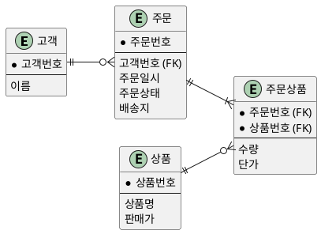

**페이지 분할**

같은 사례의 **도메인 모델**이다.

- **같은 것** — 개념, 관계, 카디널리티(다중성), 주문 시점의 단가
- **달라진 것** — 식별 키·외래키 대신 연관, 이름 있는 관계, 값의 종류(금액·주소·주문 상태)
- 바뀐 곳이 곧 도메인 모델이 **의미를 드러낸** 곳이다.

**도식 — PlantUML — 주문 도메인 모델**

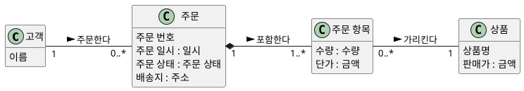

**강사 노트**

- 좋은 데이터 모델에서 출발하면 도메인 모델은 크게 바뀌지 않는다.

---

## 07. 모델 작성 절차

---

## 세 단계

도메인 모델은 **현재 반복에서 다루는 요구**의 범위 안에서 세 단계로 만든다. 이 세션의 다음 그룹들도 이 순서를 따른다.

**인용문**

"현재 반복의 요구로 범위를 한정해 1. **개념 클래스를 찾는다** 2. 클래스 다이어그램의 클래스로 그린다 3. **연관과 속성**을 더한다", "Bounded by the current iteration requirements under design: 1. Find the conceptual classes … 2. Draw them as classes in a UML class diagram. 3. Add associations and attributes.", [Larman 2004]

  1. **개념 클래스를 찾는다** — 기존 모델, 범주 목록, 유스케이스의 명사구에서 찾는다.
  2. **클래스로 그린다** — 찾은 개념에 이름 있는 연관만 이은 것이 **초안**이다.
  3. **연관과 속성을 더한다** — 속성·다중성·합성까지 더한 것이 **상세**다.

**도식 — Mermaid — 도메인 모델 작성 절차**

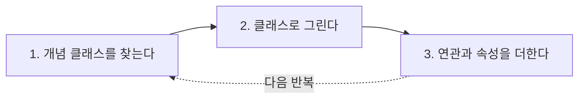

**강사 노트**

- 근거: Larman 2004 원문 확인(verify-quote). 생략한 부분은 "(see a following guideline)"이다.
- 세 단계는 한 번에 끝내는 순서가 아니다. 다음 반복에서 다룰 유스케이스가 늘면 다시 찾고 더한다. 과정은 Larman의 반복 구성을 따르지 않고 단계별로 구성했지만, 모델은 반복적으로 만든다.
- 용어 정렬(「지도 제작자의 원칙」)과 시나리오 교차검토(「시나리오 교차검토」)는 세 단계 내내 함께 한다.

---

## 개념 클래스를 찾는 세 전략

개념 클래스를 찾는 전략은 셋이다. 가장 먼저 **이미 있는 모델**에서 시작한다.

**인용문**

"기존 모델을 재사용하거나 고친다. 이것이 **첫째이자 가장 좋고**, 대개 가장 쉬운 방법이다", "Reuse or modify existing models. This is the first, best, and usually easiest approach", [Larman 2004]

**표 — 개념 클래스를 찾는 세 전략 (Larman, 2004)**

| 전략 | 무엇에서 찾는가 | 주문 사례 |
|---|---|---|
| **① 기존 모델의 재사용·수정** | 이미 검증된 도메인 모델·데이터 모델 | 논리 데이터 모델의 고객·주문·상품 |
| **② 범주 목록** | 자주 나타나는 개념의 범주 | 거래 범주에서 결제·환불(「개념 범주」) |
| **③ 명사구** | 유스케이스의 흐름·사후조건 | 장바구니, 배송(「유스케이스 어휘」) |

- 좋은 **데이터 모델**이 있으면 ①에서 출발한다(「같은 사례, 두 모델」). ②와 ③은 빠진 개념을 채운다.

**강사 노트**

- 근거: Larman 2004 원문 확인(verify-quote). 원문은 기존 모델의 예로 Len Silverston의 공개된 데이터 모델 책을 든다. 데이터 모델링을 먼저 하는 이 과정의 관점(「데이터 모델과 도메인 모델」)과 같은 출발점이다.
- 데이터 모델을 그대로 옮기는 것이 아니라 출발점으로 쓴다. 외래키가 연관으로, 컬럼 타입이 값의 종류로 바뀌는 곳은 「같은 사례, 두 모델」에서 보았다.
- 세 전략은 함께 쓴다. 같은 후보가 여러 전략에서 나오면 그만큼 확실하다.

---

## 08. 개념 클래스 찾기

---

## 개념 범주

자주 나타나는 **개념 범주**를 점검표로 삼아 후보를 떠올린다. 거래에서 시작해 그 항목·대상·참여자로 넓힌다. 후보를 **모두 모델에 넣지는 않는다**.

**표 — 개념 클래스 범주 목록 (Larman, 2004)**

| 범주 | 주문 사례의 후보 |
|---|---|
| **업무 거래** | 주문, 결제, 환불, 배송 |
| **거래 항목** | 주문 항목 |
| 거래·거래 항목과 관련된 **상품·서비스** | 상품 |
| 거래와 관련된 사람·조직의 **역할**, 유스케이스의 액터 | 고객 |
| **사물의 설명** | 상품(「설명 클래스」) |
| **담는 것**과 **담기는 것** | 장바구니와 장바구니 항목 |
| 기억해야 할 **주목할 사건** | 결제, 배송 시작 — 거래·상태로 이미 드러난다 |
| **다른 협력 시스템** | 결제·상품·회계·배송 시스템 — 이 과정에서는 **지원 액터** |
| 재무·업무·계약의 **기록** | 영수증 — 회계 시스템의 것이라 넣지 않는다 |

- **업무 거래**가 가장 중요하다. 주문 시스템의 핵심은 주문·결제·환불·배송의 **기록**이다.

**강사 노트**

- 근거: Larman 2004 원문 확인(verify-quote, 범주 이름). 원표의 범주 일부를 주문 사례에 적용했다. 원표에는 거래가 기록되는 곳, 장소, 물리적 객체, 카탈로그, 금융 수단, 일정·문서 등도 있다. 같은 후보가 여러 범주에 나타날 수 있다(결제는 거래이자 사건).
- 원표는 협력 시스템을 개념 후보로 두지만, 이 과정은 외부 시스템을 유스케이스 다이어그램의 지원 액터로 두고 도메인 모델에 그리지 않는다("02. 요구 분석과 유스케이스"의 「23. 경계 판단」).
- 원문은 업무 거래가 가장 중요한 범주이므로 거래부터 시작하라고 권한다.

---

## 유스케이스 어휘

유스케이스의 흐름과 사후조건에는 문제영역의 **어휘**가 이미 담겨 있다.

**인용문**

"도메인 모델은 주목할 만한 도메인 개념과 어휘를 시각화한 것이다. 그 용어들은 어디에 있는가? 일부는 **유스케이스**에 있다", "The domain model is a visualization of noteworthy domain concepts and vocabulary. Where are those terms found? Some are in the use cases.", [Larman 2004]

- 주문 취소 흐름 — **고객**이 **주문**을 취소한다 → **환불**이 처리된다 → 고객은 **취소 결과**를 확인한다.
- **개념 후보** — 고객, 주문, 결제, 환불
- **속성·값 후보** — 결제 금액, 취소 상태
- 정제된 SSD — `장바구니에 담는다(상품, 수량)` → **장바구니**·상품·수량, `배송을 요청한다(주문, 배송지)` → **배송**
- **넣지 않는 것** — 결제 수단은 기억할 필요가 없어 속성이 아니다. 입금·영수증은 회계 시스템의 것이다.

**강사 노트**

- 인용 근거: Larman 2004 원문 확인(verify-quote). 명사구 전략을 설명하는 곳이다. 같은 곳은 나머지 용어가 다른 문서나 **전문가의 머릿속**에 있다고 덧붙인다 — 용어집("02. 요구 분석과 유스케이스"의 「18. 용어집」)과 전문가와의 대화가 함께 원천이다.
- 원문도 바로 이어서 명사구 가운데 일부만 개념 후보이고, 일부는 이번 반복에서 무시하며, 일부는 속성일 수 있다고 설명한다. 명사 표시는 **후보를 모으는 도구**다.

---

## 흐름에서 찾은 개념

"02. 요구 분석과 유스케이스"의 명세서 **흐름의 이벤트마다** 시스템 이벤트와 그 결과가 **개념·속성·연관**으로 이어진다. 이 표가 「초안」의 출발점이다.

**표 — 흐름에서 찾은 개념**

| 흐름 | 시스템 이벤트 | 개념 | 속성 · 연관 |
|---|---|---|---|
| **기본 흐름** | 상품을 조회한다(검색 조건) | 상품 | 상품명, 판매가 |
| **기본 흐름** | 장바구니에 담는다(상품, 수량) | 장바구니, 장바구니 항목 | 수량 · 장바구니 항목–상품 |
| **기본 흐름** | 배송지를 지정한다(주소) | — | 주문의 배송지 : 주소 |
| **기본 흐름** | 결제한다(결제 수단) | 주문, 주문 항목, 결제, 배송 | 단가·결제 금액 · 주문–결제·배송 |
| **대안 흐름** | 주문을 취소한다(주문) | 환불 | 환불 금액, `취소됨` · 결제–환불 |
| **대안 흐름** | 배송지를 변경한다(주문, 새 주소) | — | 주문의 배송지 |

**강사 노트**

- 결제 계약의 사후조건(배송을 요청했다)에서 **배송 기록**이 나온다. 입금·영수증은 회계 시스템의 것이라 개념이 아니다.
- 결제 수단은 이벤트의 파라미터지만 현재 요구에서 기억할 필요가 없어 속성으로 넣지 않는다(「상세화」의 의도적으로 넣지 않은 것).
- 표의 행 순서가 기본 흐름의 이벤트 순서다. 흐름은 "02. 요구 분석과 유스케이스"의 「33. 유스케이스 상세화」와 같다.

---

## 명사 추출의 한계

명사를 기계적으로 클래스로 옮기면 **동의어·속성·해결책 요소·숨은 개념**을 잘못 다룬다.

**인용문**

"이 방법의 약점은 **자연어의 부정확성**이다", "A weakness of this approach is the imprecision of natural language", [Larman 2004]

- **동의어** — 주문 상품 / 주문 항목 / 주문 라인 → 이름 하나로
- **속성** — 결제 금액, 주문 일시 → 개념이 아니다
- **해결책 요소** — 주문 화면, 취소 버튼 → 문제영역이 아니다
- **동사 속 개념** — "환불이 **처리된다**" → 환불
- **숨은 개념** — 흐름에 없는 취소 정책 → 규칙·대화에서 찾는다

**강사 노트**

- 인용 근거: Larman 2004 원문 확인(verify-quote). 원문은 이어서 서로 다른 명사구가 같은 개념 클래스나 속성을 가리킬 수 있다고 설명한다.
- "명사 → 클래스"는 "분석 개념을 설계·코드로 기계 변환하지 않는다"는 과정 원칙의 가장 흔한 위반이다. 문장에 없는 개념은 개념 범주 점검과 업무 담당자와의 대화로 보완한다.

---

## 09. 속성

---

## 개념과 속성

**속성**(Attribute)은 개념이 가지는 **단순한 값**이다. 요구가 **기억하라고 하는** 정보만 속성으로 둔다.

**인용문**

"속성은 객체의 **논리적 데이터 값**이다", "An attribute is a logical data value of an object.", [Larman 2004]

  - "실세계에서 어떤 개념 X를 **숫자나 텍스트**로 여기지 않는다면, X는 속성이 아니라 개념 클래스일 가능성이 높다", "If we do not think of some conceptual class X as a number or text in the real world, X is probably a conceptual class, not an attribute.", [Larman 2004]

- **배송지는 속성인가?** — 이 주문을 보낼 주소라는 **값**만 중요하면 주문의 속성 `배송지 : 주소`로 충분하다.
- **개념이 되는 경우** — 저장된 여러 배송지 중 고르고 배송지마다 수령인·별칭을 관리한다면 **구분되는 대상**이다.
- 속성인지 개념인지 **확신이 없으면** 개념으로 둔다.

**강사 노트**

- 인용 근거: Larman 2004 원문 확인(verify-quote). 원문은 유스케이스 같은 요구가 정보를 기억할 필요를 말하거나 암시할 때 속성을 넣으라고 한다. 마지막 bullet도 원문의 권고다.
- 주소록 요구는 확정되지 않았다. 두 번째 경우는 판단 기준을 보이기 위한 가정이며, 현재 모델에서는 배송지를 주문의 속성으로 둔다.

---

## 데이터 타입

속성의 타입은 대개 숫자·문자열 같은 기본 **데이터 타입**이다. 그러나 아래 조건에 맞으면 숫자나 문자열이 아니라 **새 데이터 타입**, 곧 업무 값의 종류로 둔다.

**인용문**

"대부분의 수치는 **단순한 숫자**로 표현하지 않는다", "Most numeric quantities should not be represented as plain numbers.", [Larman 2004]

**표 — 데이터 타입으로 두는 조건 (Larman, 2004)**

| 조건 | 주문 사례 | 확인할 질문 |
|---|---|---|
| **여러 부분**으로 이루어진다 | 배송지 : **주소** | 필수 구성 요소는? |
| **검증·해석** 연산이 따른다 | 주문 번호 : **주문 번호** | 형식은? 다시 쓰이는가? |
| **다른 속성**을 가진다 | 현재 요구에는 없다 | 판매가에 적용 기간이 생기는가? |
| **단위가 있는 양**이다 | 결제 금액 : **금액**, 수량 : **수량** | 통화는? 0이 허용되는가? |

- 주문 상태는 정해진 값의 목록이므로 **열거형**으로 둔다(「상태 값과 상태 전이」).

**강사 노트**

- 근거: Larman 2004 원문 확인(verify-quote) — 숫자나 문자열로 보이는 것을 새 데이터 타입 클래스로 두는 네 조건. 원문의 예는 전화번호·사람 이름, 사회보장번호, 판촉가의 시작·종료일, 결제 금액의 통화 단위다. 표의 조건은 원문의 요약이다.
- 값의 종류를 밝히면 단위 혼동과 의미 없는 연산을 분석 단계에서 드러낸다. 값의 종류를 코드의 값 객체로 구현할지는 설계 판단이며, 정적 모델은 값의 의미를 명시한다.

---

## 속성 도메인

데이터 모델링의 **도메인**은 속성이 가질 수 있는 **값의 집합과 규칙**이다. 숫자·문자열 같은 DB 타입이 아니며, 같은 도메인을 쓰는 속성은 같은 규칙을 따른다.

**인용문**

"각 값 집합에는 어떤 값이 그 집합에 **속하는지 검사하는 술어**가 있다", "There is a predicate associated with each value set to test whether a value belongs to it.", [Chen 1976]

**표 — 주문 사례의 속성 도메인**

| 도메인 | 규칙 | 사용하는 속성 |
|---|---|---|
| **금액** | 0 이상, 통화 단위, 소수 자릿수 | 판매가, 단가, 결제 금액, 환불 금액 |
| **수량** | 1 이상의 정수 | 주문 항목의 수량 |
| **주소** | 필수 구성 요소, 형식 | 배송지, 고객의 기본 주소 |
| **주문 번호** | 형식, 유일, 재사용 금지 | 주문 번호 |
| **주문 상태** | 정해진 값 목록 | 주문 상태 |

- **단위도 도메인이다** — 같은 12라도 인치와 피트는 다른 값이다. 결제 금액 10,000이 원인지 달러인지 모르면 비교할 수 없다.

**강사 노트**

- 인용 근거: Chen 1976 원문 확인(verify-quote) — 속성·값·값 집합을 정의하는 부분이다. 같은 곳은 값 집합 INCH의 "12"가 FEET의 "1"과 같다는 예로 **단위**가 값의 의미에 속함을 보인다.
- 표의 규칙은 교육용 예다. 통화·자릿수·주소 형식은 실제 업무에서 확인한다.

---

## 속성 수준 업무 규칙

속성 수준 업무 규칙은 **데이터 모델링과 도메인 모델링이 공통으로 다루는 핵심**이다. 규칙이 빠지면 두 모델 모두 이름만 남는다.

- 「속성 도메인」의 규칙은 **값 하나**에 걸린다. 규칙이 걸리는 범위가 넓어지면 다루는 곳도 달라진다.

**표 — 규칙의 범위와 다루는 곳**

| 규칙의 범위 | 예 | 다루는 곳 |
|---|---|---|
| **값 하나** | 수량은 1 이상 | 속성 도메인 |
| **여러 속성·연관** | 주문 총액은 주문 항목 금액의 합계 | 제약 |
| **시점·사건** | 배송 시작 이후에는 취소할 수 없다 | 상태 전이 규칙(동적 모델) |

**강사 노트**

- 규칙의 범위를 나누는 이유는 규칙을 둘 **자리**를 정하기 위해서다. 여러 속성에 걸친 제약은 「제약」에서, 시점 규칙은 "04. 동적 모델 — 상호작용과 상태"에서 다룬다.

---

## 규칙의 소유

속성 규칙을 화면·서비스·DB의 검사 코드에 **흩어 두면** 규칙이 서로 달라진다. 화면은 수량 1 이상을 검사하는데 다른 경로가 검사하지 않으면 수량 0인 주문이 생긴다.

**인용문**

"그 요소가 전달하는 **속성의 의미를 표현**하게 하고 관련 기능을 부여한다", "Make it express the meaning of the attributes it conveys and give it related functionality.", [Evans 2015]

- 규칙은 **값의 종류**가 소유한다. 수량이라는 값의 종류가 "1 이상"을 지키면, 어느 경로로 만들어도 같은 규칙을 따른다.
- **데이터 모델링** — 도메인 정의가 규칙을 소유한다.
- **도메인 모델링** — 값의 종류(금액·수량·주소)가 규칙을 소유한다. DDD에서는 이 역할을 **값 객체**가 맡는다.

**강사 노트**

- 인용 근거: Eric Evans, [DDD Reference](https://www.domainlanguage.com/wp-content/uploads/2016/05/DDD_Reference_2015-03.pdf), 2015, "Value Objects". 원문은 식별성이 없고 속성과 그 논리만 중요한 요소를 값 객체로 분류하라는 맥락이다.
- 정적 모델은 값 객체를 설계하지 않고, 속성 규칙이 **어디에 속하는지**를 분석한다. 값 객체는 "13. OOAD에서 전문영역으로 — Architecture · DDD · MSA"에서 다룬다.

---

## 파생 속성

**파생 속성**(Derived Attribute)은 다른 정보로 **계산해 얻는** 속성이다. 이름 앞에 `/`를 붙인다.

**도식 — PlantUML — 파생 속성**

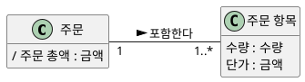

- 주문 총액 = 주문 항목의 **수량 × 단가 합계**. 고객이 확인하는 금액이라 계산 규칙이 **업무 의미**를 가진다.
- **저장과 계산** — 저장할지 매번 계산할지는 설계가 정한다. 모델은 계산 규칙만 밝힌다.
- **규칙이 바뀔 때** — 할인·배송비가 생기면 총액 규칙이 바뀐다. 지금 요구에는 없으므로 질문으로 남긴다.

**강사 노트**

- 저장할지는 성능·조회 요구에 따른 설계 판단이다. 할인·배송비는 공통 전제에 없다.

---

## 10. 연관

---

## 속성이 아닌 연관

다른 개념을 가리키는 정보는 `고객ID` 같은 속성이 아니라 **연관**으로 표현한다.

**인용문**

"개념 클래스는 속성이 아니라 **연관**으로 잇는다", "Relate conceptual classes with an association, not with an attribute.", [Larman 2004]

**도식 — PlantUML — 식별 키 속성과 연관**

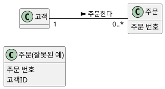

- **잘못된 예** — 고객과 주문의 관계를 그림에서 읽을 수 없다.
- **업무 식별자** — 고객이 보는 `주문 번호`는 속성이다. 대리 키·외래키는 빼고 연관으로 잇는다.

**강사 노트**

- 인용 근거: Larman 2004 원문 확인(verify-quote). 원문은 외래키에 해당하는 속성을 도메인 모델에 두지 말라는 지침으로 이어진다.
- 배송지 변경 계약의 "주문 식별 정보는 변경 전과 같다"는 업무 식별자의 의미다. 저장 키를 뜻하지 않는다.

---

## 연관의 이름

연관(Association)은 개념 사이의 **의미 있는 관계**다. 이름을 붙일 수 없다면 **관계를 아직 모르는 것**이다.

**인용문**

"연관은 클래스(정확히는 그 인스턴스) 사이의 **의미 있고 흥미로운 연결**을 나타내는 관계다", "An association is a relationship between classes (more precisely, instances of those classes) that indicates some meaningful and interesting connection.", [Larman 2004]

**도식 — PlantUML — 주문의 연관**

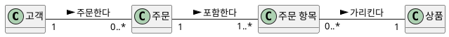

- **연관 이름** — `클래스-동사구-클래스`로 읽히게 짓는다. 위 도식은 "고객이 주문을 **주문한다**", "주문이 주문 항목을 **포함한다**"로 읽는다.
- **읽는 방향** — 이름 옆의 `>`는 읽는 방향이다. 탐색 방향이 아니다.
- **역할 이름** — 관계에서 맡는 역할이 클래스 이름과 다를 때 연관 끝에 붙인다.

**강사 노트**

- 인용 근거: Larman 2004 원문 확인(verify-quote). 이름 짓기는 원문의 지침 "Name an association based on a ClassName-VerbPhrase-ClassName format where the verb phrase creates a sequence that is readable and meaningful."을 따랐다.
- 도메인 모델의 연관은 탐색 방향이나 참조 구현을 뜻하지 않는다. 탐색 방향은 "06. 분석 모델에서 설계 모델로"와 "07. 책임·협력·계약"에서 결정한다.

---

## 기억해야 하는 연관

가능한 모든 관계를 그리지 않는다. 관계를 **일정 기간 기억해야 하는** 연관을 우선한다.

**인용문**

"관계에 대한 지식을 **일정 기간 보존해야 하는** 연관", "Associations for which knowledge of the relationship needs to be preserved for some duration", [Larman 2004]

- **기억해야 하는 연관** — 없으면 요구를 만족할 수 없다. 예: 주문–결제(전액 환불 확인)
- **이해를 돕는 연관** — 아래 목록에서 나와 도메인 이해를 돕는다. 예: 장바구니–장바구니 항목
- **과잉 연관** — 다른 경로로 이미 알 수 있다. 예: 고객–상품 "구매했다"
- **빈 이름** — "관련된다", "가진다"는 의미가 없다.

**강사 노트**

- 근거: Larman 2004 원문 확인(verify-quote). 원문은 기억해야 하는 연관을 "need-to-remember" 연관이라 부르고, 일반 연관 목록에서 나온 연관은 이해를 돕는 데 쓴다. 너무 많은 연관을 그리지 말라는 지침도 함께 둔다.
- 고객–상품이 "관심 상품", "재입고 알림"처럼 **다른 의미**를 가지면 별도 연관이 된다. 기준은 경로의 중복이 아니라 의미의 중복이다.

---

## 일반적인 연관 목록

자주 나타나는 연관의 목록으로 **빠진 연관**을 점검한다. 목록에 맞는다고 모두 그리지는 않고, 기억할 필요가 있는 것만 그린다.

**표 — 일반적인 연관 목록 (Larman, 2004)**

| 연관 | 주문 사례 |
|---|---|
| A는 다른 거래 B와 관련된 **거래**다 | 결제–주문, 환불–결제, 배송–주문 |
| A는 거래 B의 **항목**이다 | 주문 항목–주문 |
| A는 거래(항목) B의 **상품·서비스**다 | 상품–주문 항목 |
| A는 거래 B와 관련된 **역할**이다 | 고객–주문 |
| A는 B에 물리적·논리적으로 **담긴다** | 장바구니 항목–장바구니 |
| A는 B의 **설명**이다 | 상품–재고 품목 — 현재 모델에 없다(「설명 클래스」) |

- 주문 모델의 연관은 대부분 **거래**를 중심으로 이어진다. 거래가 다른 거래·항목·역할과 이어지지 않으면 **누가·무엇 다음에** 일어난 일인지 모델이 답하지 못한다.

**강사 노트**

- 표는 원표의 일부다. 원표에는 부분, 소속, 조직 단위, 사용·관리·소유, 기록되는 곳, 이웃 등도 있다.

---

## 다중성

다중성(Multiplicity)은 **특정 시점**에 한 인스턴스가 상대 인스턴스 **몇 개와 관계할 수 있는지**를 나타낸다.

**인용문**

"다중성은 클래스 A의 인스턴스 **몇 개**가 클래스 B의 인스턴스 하나와 연관될 수 있는지를 정한다", "Multiplicity defines how many instances of a class A can be associated with one instance of a class B.", [Larman 2004]

**표 — 다중성 표기**

| 표기 | 의미 | 예 |
|---|---|---|
| `1` | 정확히 하나 | 주문 항목 → 상품 |
| `0..1` | 없거나 하나 | 주문 → 결제 |
| `0..*` | 0개 이상 | 고객 → 주문 |
| `1..*` | 1개 이상 | 주문 → 주문 항목 |

**강사 노트**

- 인용 근거: Larman 2004 원문 확인(verify-quote). 같은 곳은 다중성이 기간 전체가 아니라 **특정 시점**의 수라고 설명한다.
- 다중성은 양쪽 끝에서 각각 읽는다. 주문 → 결제 `0..1`은 교육용 가정이다(「다중성과 업무 규칙」). `n..m` 범위 표기도 있으나 현재 사례에 확인된 한도가 없어 예로 들지 않았다.

---

## 다중성과 업무 규칙

숫자 하나를 정하면 **업무 규칙을 결정**하게 된다. 모르면 확정하지 않고 **질문으로 남긴다**. 이 사례는 주문 → 결제를 `0..1`로 둔다.

**도식 — PlantUML — 주문–결제 다중성**

```plantuml:class
@startuml
hide empty methods
left to right direction
class "주문" as Order
class "결제" as Payment
Order "1" -- "0..1" Payment : 결제된다 <
@enduml
```

**표 — 다중성이 정하는 규칙**

| 주문 → 결제 | 함께 결정되는 의미 |
|---|---|
| `1` | 결제 없는 주문은 없다 → "결제 대기"와 **모순** |
| `0..1` | 결제 전 주문이 있고, 한 번에 결제한다 |
| `0..*` | 분할 결제·재결제가 기록된다 |

- 고객 → 주문의 고객 쪽이 `1`이면 **비회원 주문**은 없다. 정하지 않았다면 질문으로 남긴다.

**강사 노트**

- 고객 → 주문의 고객 쪽이 `1`이면 비회원 주문은 없다. 주문 → 결제 `0..1`, 고객 `1`은 교육용 가정이며, 분할 결제·비회원 주문은 확인할 질문이다.
- 다중성이 다른 요소(주문 상태 값)와 모순되는지 보는 것도 교차검토다. 개발자가 편의상 정한 다중성은 곧 업무 정책이 된다.

---

## 11. 개념의 분리

---

## 반복되는 속성 묶음

한 개념에 모든 정보를 담으면 **반복되는 속성 묶음**이 생기고, 생애가 다른 정보가 섞인다.

**도식 — PlantUML — 반복되는 속성 묶음**

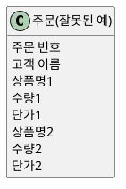

- 상품이 늘면 **속성을 추가**해야 하고, 묶음은 **이름의 숫자**로만 구분된다.
- 고객 이름을 주문에 담으면 고객과 주문의 **생애가 섞인다**.
- 반복되는 속성 묶음은 **숨은 개념**의 신호다.

**강사 노트**

- 고객 이름을 주문에 담으면 고객과 주문의 생애가 섞인다. "상품별 판매 수량" 같은 질문에도 모델이 답하지 못한다.

---

## 주문 항목

반복되는 묶음을 **주문 항목**으로 분리하면 "한 주문에 여러 상품"이 **구조**로 드러난다.

**도식 — PlantUML — 주문과 주문 항목**

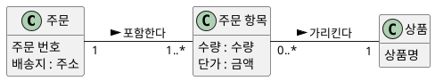

- **주문 항목** — 이 주문에서 이 상품을 **몇 개, 얼마에** 샀는가. 주문도 상품도 아닌 **둘 사이의 사실**이다.

**강사 노트**

- "주문 1 : 주문 항목 1..*"는 다중성에서 다룬 질문이 실제로 **모델 구조를 바꾸는 지점**이다.

---

## 연관 클래스

주문과 상품은 **다대다**다. 선 하나로는 수량·단가를 둘 곳이 없다.

- 수량은 주문의 속성도, 상품의 속성도 아니다. **"이 주문–이 상품" 관계**에 속한다.

**도식 — PlantUML — 주문–상품 다대다**

```plantuml:class
@startuml
hide empty methods
left to right direction
class "주문" as Order
class "상품" as Product
Order "0..*" -- "1..*" Product : 주문된다 <
@enduml
```

**페이지 분할**

관계 자체가 정보를 가지면 **연관 클래스**(Association Class)로 표현한다. 아래 단서가 보이면 연관 클래스를 생각한다(Larman, 2004).

- **연관에 관련된 속성** — 수량·단가는 "이 주문–이 상품"에 관련된다.
- **연관에 매인 생애** — 주문과 상품의 관계가 없으면 주문 항목도 없다.
- **다대다와 관계의 정보** — "다대다는 중간 클래스로 푼다"를 암기하지 않는다. **관계에 정보가 있는지** 먼저 본다.
- **한계** — 연관 클래스는 주문–상품 한 쌍에 하나다. 같은 주문에 같은 상품이 두 줄 들어갈 수 있으면 독립 개념으로 둔다(「주문 항목」).

**도식 — PlantUML — 주문 항목 연관 클래스**

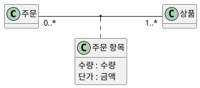

**강사 노트**

- 근거: Larman 2004 원문 확인(verify-quote) — 연관 클래스의 세 단서. 원문은 세 단서를 글머리 목록으로 든다.
- 주문 항목을 독립 개념으로 둔 「주문 항목」과 의미가 같다.
- UML 연관 클래스는 한 쌍의 인스턴스 사이에 인스턴스가 하나다. 같은 주문에 같은 상품이 두 줄(예: 다른 옵션) 들어갈 수 있다면 독립 개념이 더 정확하다. 확인 질문으로 남긴다.
- 연결 테이블은 저장 구조의 결과일 수 있지만 판단의 근거는 아니다.

---

## 설명 클래스

설명 클래스(Description Class)는 다른 것을 **설명하는 정보**를 담아 **개별 실물**과 구분한다. 실물이 모두 사라져도 설명은 남는다.

**인용문**

"설명 클래스는 **다른 것을 설명하는 정보**를 담는다", "A description class contains information that describes something else.", [Larman 2004]

**도식 — PlantUML — 상품과 재고 품목**

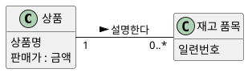

- **둘 때** — 실물이 없어도 설명이 필요하다(재고가 0이어도 상품을 보여 준다). 실물을 지우면 설명까지 사라진다. 같은 설명이 실물마다 반복된다.
- **현재 모델** — 개별 실물을 추적하는 요구가 없으므로 **상품만** 둔다. 상품이 이미 설명 클래스다. 재고는 **상품 시스템**이 소유한다.

**강사 노트**

- 근거: Larman 2004 원문 확인(verify-quote) — 정의와 설명 클래스를 더하는 세 조건. 원문의 예는 상품 설명(ProductDescription)과 개별 품목(Item)이다. 개별 실물 요구가 확인될 때 재고 품목을 추가한다(「모델의 유용성」). 이 사례에서 재고는 **상품 시스템**이 소유하므로 주문 시스템의 모델에는 두지 않는다.

---

## 현재 값과 확정 값

같은 이름의 정보라도 **지금의 값을 참조**하는지, **특정 시점에 확정되어 보존**되는지에 따라 속한 개념이 다르다.

- 판매가가 내일 바뀌면 **어제 주문의 금액**도 바뀌어야 하는가? 아니라면 주문 쪽에 **확정 값**으로 보존한다.
- **배송지 변경**은 특정 주문의 배송지를 바꾸는 것이다. 고객의 기본 주소 변경과 다르다.

**표 — 현재 값과 확정 값**

| 정보 | 현재 값 | 확정 값 |
|---|---|---|
| 가격 | 상품의 **판매가** | 주문 항목의 **단가** |
| 주소 | 고객의 **기본 주소** | 주문의 **배송지** |

**도식 — PlantUML — 현재 값과 확정 값**

```plantuml:class
@startuml
hide empty methods
left to right direction
class "상품" as Product {
  판매가 : 금액
}
class "주문 항목" as OrderItem {
  단가 : 금액
}
class "고객" as Customer {
  기본 주소 : 주소
}
class "주문" as Order {
  배송지 : 주소
}
OrderItem "0..*" -- "1" Product : 가리킨다 >
Customer "1" -- "0..*" Order : 주문한다 >
@enduml
```

**강사 노트**

- 참조만 두면 과거 사실이 조용히 바뀐다. 배송지 변경은 **특정 주문의 배송지**를 바꾸는 목표이며 고객 기본 주소 변경과 다르다. 두 정보를 분리해야 이 차이를 모델로 설명할 수 있다.

---

## 같은 구조, 다른 의미

구조가 같아도 **의미와 생애가 다르면 다른 개념**이다. 장바구니 항목과 주문 항목은 모두 "상품과 수량"을 가진다.

**표 — 장바구니 항목과 주문 항목**

| 구분 | 장바구니 항목 | 주문 항목 |
|---|---|---|
| 의미 | 사려는 **의도** | 성립한 **거래** |
| 가격 | 현재 판매가 **참조** | 주문 시점 단가 **확정** |
| 변경 | 자유롭게 바꾼다 | 임의로 바꿀 수 없다 |
| 생애 | 주문하면 비워진다 | 기록으로 남는다 |

- 구조가 같다고 한 개념이나 공통 부모로 합치지 않는다. **의미와 규칙**이 같은지로 판단한다.

**강사 노트**

- "선택된 상품"과 "주문된 상품"을 같은 말로 쓰면 이 차이가 사라진다.
- 구조가 같다고 하나의 개념이나 공통 부모로 합치고 싶은 유혹이 있다. 코드 재사용은 설계 판단이며, 도메인 모델에서는 의미와 규칙이 같은지로 판단한다(「일반화」).

---

## 12. 일반화와 제약

---

## 일반화

일반화(Generalization)는 특수 개념이 일반 개념의 **한 종류**일 때 쓴다.

**인용문**

"상위 개념 정의의 **100%**가 하위 클래스에 적용되어야 한다", "100% of the conceptual superclass's definition should be applicable to the subclass.", [Larman 2004]

- **100% 규칙** — 결제의 정의가 카드 결제에도 그대로 맞는다.
- **Is-a 규칙** — 모든 카드 결제는 **결제**다.
- **쓰지 않을 때** — 차이가 값 하나뿐이면 `결제 수단` 속성으로 충분하다.

**도식 — PlantUML — 결제 일반화**

```plantuml:class
@startuml
hide empty methods
class "결제" as Payment {
  결제 금액 : 금액
}
class "카드 결제" as CardPayment {
  할부 개월
}
class "계좌 이체" as BankTransfer {
  입금 은행
}
Payment <|-- CardPayment
Payment <|-- BankTransfer
@enduml
```

**강사 노트**

- 근거: Larman 2004 원문 확인(verify-quote) — 100% 규칙, Is-a 규칙("All the members of a subclass set must be members of their superclass set."), 상태를 하위 클래스로 모델링하지 않는다는 지침. 원문은 대안으로 상태 계층을 따로 두고 연관하거나, 도메인 모델에서 상태를 보이지 않고 상태 기계에서 보이라고 한다. 이 과정은 열거형 상태 값과 상태 기계를 쓴다.
- 첫 도식의 결제 수단별 속성은 **교육용 가정**이다. 현재 요구는 결제 수단별 차이를 요구하지 않으므로 종합 모델에 넣지 않는다.
- 의미 근거: OMG [UML 2.5.1](https://www.omg.org/spec/UML/2.5.1/PDF)의 Generalization 정의 — 특수 분류자의 모든 인스턴스는 일반 분류자의 인스턴스이기도 하다.

---

## 상태는 하위 클래스가 아니다

**인용문**

"개념 X의 **상태**를 X의 하위 클래스로 모델링하지 않는다", "Do not model the states of a concept X as subclasses of X.", [Larman 2004]

- **잘못된 예** — O-1을 취소하면 주문이 **클래스를 바꿔야** 한다.
- **바른 예** — 상태는 **상태 값**이고, 값을 바꾸는 사건은 상태 기계가 맡는다.

**도식 — PlantUML — 상태 하위 클래스와 상태 값**

```plantuml:class
@startuml
hide empty methods
left to right direction
class "주문(잘못된 예)" as BadOrder
class "결제 완료 주문" as PaidOrder
class "취소된 주문" as CancelledOrder
BadOrder <|-- PaidOrder
BadOrder <|-- CancelledOrder
class "주문" as Order {
  주문 상태 : 주문 상태
}
@enduml
```

**강사 노트**

- 원문은 대안으로 상태 계층을 따로 두고 연관하거나, 도메인 모델에서 상태를 보이지 않고 상태 기계에서 보이라고 한다. 이 과정은 열거형 상태 값과 상태 기계를 쓴다(「상태 값과 상태 전이」).

---

## 제약

제약(Constraint)은 **어느 시점에나 참이어야 하는 조건**이다. 모델에는 **중괄호 메모**로 붙인다.

- **정적 제약** — 수량은 1 이상, 주문 총액은 수량 × 단가의 합계, 환불 금액은 결제 금액 이하
- **상태 전이 규칙** — "배송 시작 이후에는 취소할 수 없다"처럼 **시점·사건**에 따라 허용이 달라지는 규칙은 동적 모델에서 다룬다.

**도식 — PlantUML — 제약**

```plantuml:class
@startuml
hide empty methods
left to right direction
class "주문 항목" as OrderItem {
  수량 : 수량
}
class "결제" as Payment {
  결제 금액 : 금액
}
class "환불" as Refund {
  환불 금액 : 금액
}
Payment "1" -- "0..1" Refund : 환불된다 <
note bottom of OrderItem : {수량은 1 이상}
note bottom of Refund : {환불 금액 ≤ 결제 금액}
@enduml
```

**강사 노트**

- 제약은 필요하면 `{수량은 1 이상}`처럼 중괄호 메모로 모델에 붙인다. OCL 같은 형식 언어는 이 과정의 범위가 아니다.
- 상태 전이 규칙은 정적 모델에 억지로 넣지 않고 "04. 동적 모델 — 상호작용과 상태"로 넘긴다.

---

## 13. 용어 정렬

---

## 지도 제작자의 원칙

모델의 이름은 **문제영역에서 이미 쓰는 말**이어야 한다. 용어가 흔들리면 모델도 흔들린다.

**인용문**

"지도 제작자처럼 도메인 모델을 만든다. 그 영역에서 **이미 쓰는 이름**을 사용하고, 무관하거나 범위 밖의 것은 빼고, 없는 것은 더하지 않는다", "Make a domain model in the spirit of how a cartographer or mapmaker works: Use the existing names in the territory. … Exclude irrelevant or out-of-scope features. … Do not add things that are not there.", [Larman 2004]

- **이미 쓰는 이름** — 현업이 부르는 "주문 항목"을 쓰고, 개발자가 만든 `OrderLine`을 강요하지 않는다.
- **범위 밖은 뺀다** — 현재 요구와 무관한 포장재는 그리지 않는다.
- **없는 것은 더하지 않는다** — 확인되지 않은 "주문 승인" 단계는 만들지 않는다.
- "배송 시작"을 "출고"로 바꾸자는 제안은 단어 교체가 아니라 **상태 경계의 변경**일 수 있다.

**강사 노트**

- 인용 근거: Larman 2004 원문 확인(verify-quote). 원문은 세 항목의 글머리 목록이며 항목마다 예가 붙어 있다. 인용은 예를 생략(…)하고 세 항목을 이어 옮긴 것이다.
- "용어와 모델은 함께 바뀐다"는 Evans의 공통 언어(Ubiquitous Language) 원칙과 같은 생각이다(Eric Evans, *DDD Reference*, 2015). 공통 언어의 본격 논의는 "13. OOAD에서 전문영역으로 — Architecture · DDD · MSA"에서 다룬다.

---

## 동의어와 동음이의어

**같은 것을 다르게 부르는 말**과 **다른 것을 같게 부르는 말**을 찾는다.

- **동의어**
  - 주문 항목 / 주문 상품 / 주문 라인 → 같은 개념이면 **이름 하나로**
  - 배송 시작 / 출고 → 같다고 **가정하지 않고** 확인한다
- **동음이의어**
  - **취소** — 주문 취소 / 결제 취소 / 환불
  - **주문** — 주문하는 행위 / 주문 기록
  - **가격** — 판매가 / 단가 / 결제 금액
- 동음이의어를 그대로 두면 "취소되면 환불된다"처럼 서로 다른 사실이 한 단어에 섞인다. 모델에서는 **다른 이름**으로 나눈다.

**강사 노트**

- 동음이의어를 두면 "취소되면 환불된다"처럼 서로 다른 사실이 한 단어에 섞인다. 모델에서는 다른 이름·요소로 분리한다.
- 결제 취소와 환불의 실제 구분은 결제 시스템·계약에 따라 다를 수 있다. 두 용어는 서로 다른 사실을 가리킬 수 있다.

---

## 용어집 정제

요구 분석에서 정의한 **용어집**을 도메인 모델과 **함께 정제**한다. 모델에서 드러난 **새 용어와 뜻의 차이**를 되돌리고, 모델의 이름은 용어집과 **같게** 쓴다.

**표 — 정제한 용어집**

| 용어 | 정의 | 영문명 | 확인 질문 |
|---|---|---|---|
| **주문** | 고객이 상품 구매를 요청해 성립한 거래 | `Order` | 결제 전 주문도 주문인가? |
| **주문 항목** | 한 주문에서 한 상품을 얼마에 몇 개 샀는가 | `OrderItem` | 같은 상품이 두 줄 가능한가? |
| **단가** | 주문 시점에 확정된 가격 | `unitPrice` | 할인은 반영되는가? |
| **배송지** | 이 주문을 보낼 주소 | `shippingAddress` | 기본 주소와 어떻게 다른가? |
| **주문 상태** | 주문의 현재 단계 값 | `OrderStatus` | 배송 시작과 출고는 다른가? |
| **환불** | 결제된 금액의 반환 | `Refund` | 부분 환불이 있는가? |

- 도메인 모델은 **한글 용어**로 그린다. 영문명은 설계와 코드에서 쓴다.

**강사 노트**

- 용어집은 "02. 요구 분석과 유스케이스"의 「18. 용어집」에서 정의하고, 정적 모델에서 정제한다. 배송지·환불은 도메인 모델을 그리며 뜻을 확정한 용어다.
- 확인 질문 열이 비어 있지 않다는 것이 용어집이 살아 있다는 증거다. 답을 얻으면 정의를 고치고 질문을 지운다.
- 영문명의 원천은 과정 설계의 "영한 용어집과 명명 규칙"이다. 설계 이름으로의 전환은 "05. 구조적 경계와 의존성"에서 보인다.

---

## 14. 도메인 모델 작성

---

## 초안

초안은 **개념과 연관**만으로 문제영역의 구조를 먼저 합의한다. 속성과 다중성은 아직 넣지 않는다.

- 기억할 관계만 **이름 있는 연관**으로 잇는다.
- "장바구니가 장바구니 항목을 담는다"처럼 **문장으로 읽으며** 확인한다.
- 속성부터 채우면 구조보다 **세부 논쟁**이 먼저 시작된다.

**도식 — PlantUML — 도메인 모델 — 초안**

```plantuml:class
@startuml
hide empty members
left to right direction
class "고객" as Customer
class "장바구니" as Cart
class "장바구니 항목" as CartItem
class "상품" as Product
class "주문" as Order
class "주문 항목" as OrderItem
class "결제" as Payment
class "환불" as Refund
class "배송" as Delivery
Customer -- Cart : 가진다 >
Cart -- CartItem : 담는다 >
CartItem -- Product : 가리킨다 >
Customer -- Order : 주문한다 >
Order -- OrderItem : 포함한다 >
OrderItem -- Product : 가리킨다 >
Order -- Payment : 결제된다 <
Payment -- Refund : 환불된다 <
Order -- Delivery : 배송된다 <
@enduml
```

**강사 노트**

- "02. 요구 분석과 유스케이스"의 유스케이스 다이어그램을 초안에서 상세화로 발전시킨 것과 같은 방식이다. 초안에서 구조를 합의하고, 상세화에서 규칙(속성 도메인·다중성·합성)을 드러낸다.
- 초안 단계에서 속성·다중성을 서둘러 채우면 구조에 대한 합의보다 세부 논쟁이 먼저 시작된다.

---

## 초안과 코드

개념은 **클래스**, 연관은 **참조**가 된다. 모델에 없는 **방향**(누가 누구를 아는가)과 컬렉션은 코드가 정한다.

**도식 — PlantUML — 도메인 모델 — 초안**

```plantuml:class
@startuml
hide empty members
left to right direction
class "고객" as Customer
class "장바구니" as Cart
class "장바구니 항목" as CartItem
class "상품" as Product
class "주문" as Order
class "주문 항목" as OrderItem
class "결제" as Payment
class "환불" as Refund
class "배송" as Delivery
Customer -- Cart : 가진다 >
Cart -- CartItem : 담는다 >
CartItem -- Product : 가리킨다 >
Customer -- Order : 주문한다 >
Order -- OrderItem : 포함한다 >
OrderItem -- Product : 가리킨다 >
Order -- Payment : 결제된다 <
Payment -- Refund : 환불된다 <
Order -- Delivery : 배송된다 <
@enduml
```

```java
class 고객 { 장바구니 장바구니; }
class 장바구니 { List<장바구니항목> 항목들; }
class 장바구니항목 { 상품 상품; }
class 상품 {}
class 주문 { 고객 고객; List<주문항목> 항목들; 결제 결제; 배송 배송; }
class 주문항목 { 상품 상품; }
class 결제 { 환불 환불; }
class 환불 {}
class 배송 {}
```

**강사 노트**

- 방향·컬렉션은 **설계의 결정**이다. 코드에서 정한 방향을 모델로 되돌려 그리지 않는다. 코드는 연관이 있다는 사실만 옮겼고 다중성·규칙은 아직 보장하지 않는다.

---

## 상세화

초안에 **속성과 속성 도메인, 다중성, 합성, 파생 속성**을 더해 요구 산출물(명세서·정제된 SSD·계약)에 답할 수준까지 상세화한 주문 시스템의 **개념적 도메인 모델**(Conceptual Domain Model)이다.

**도식 — PlantUML — 도메인 모델 — 상세화**

```plantuml:class
@startuml
hide empty methods
left to right direction
class "고객" as Customer {
  이름
}
class "주문" as Order {
  주문 번호
  주문 일시 : 일시
  주문 상태 : 주문 상태
  배송지 : 주소
  / 주문 총액 : 금액
}
class "주문 항목" as OrderItem {
  수량 : 수량
  단가 : 금액
}
class "상품" as Product {
  상품명
  판매가 : 금액
}
class "결제" as Payment {
  결제 금액 : 금액
}
class "환불" as Refund {
  환불 금액 : 금액
}
class "장바구니" as Cart
class "장바구니 항목" as CartItem {
  수량 : 수량
}
class "배송" as Delivery {
  배송 번호
  배송 상태 : 배송 상태
}
Customer "1" -- "0..1" Cart : 가진다 >
Cart "1" *-- "0..*" CartItem : 담는다 >
CartItem "0..*" -- "1" Product : 가리킨다 >
Customer "1" -- "0..*" Order : 주문한다 >
Order "1" *-- "1..*" OrderItem : 포함한다 >
OrderItem "0..*" -- "1" Product : 가리킨다 >
Order "1" -- "0..1" Payment : 결제된다 <
Payment "1" -- "0..1" Refund : 환불된다 <
Order "1" -- "0..1" Delivery : 배송된다 <
@enduml
```

**강사 노트**

- 결제–환불 `0..1`은 전체 취소·전액 환불 전제에 한정된 교육용 가정이다(「누락과 모순」).
- **배송**은 주문 시스템이 배송 시스템에 요청한 배송의 **기록**이다(배송 번호로 배송 현황을 조회한다). 출고·배송의 진행은 배송 시스템이 소유한다. **상품**의 원천도 상품 시스템이며, 주문 시스템은 주문에 필요한 상품 정보만 가진다.

---

## 모델을 문장으로 읽기

- 고객은 주문을 **0개 이상** 하고, 모든 주문에는 고객이 **한 명** 있다.
- 주문은 주문 항목을 **하나 이상** 포함하며, 주문 항목은 **주문 시점 단가**를 보존한다.
- 주문은 결제가 **없거나 하나**, 결제는 환불이 **없거나 하나** 있다.
- 장바구니 항목은 판매가를 **참조**만 한다. 주문은 배송이 **없거나 하나** 있다.

### 의도적으로 넣지 않은 것

- **재고** — 상품 시스템, **입금·영수증** — 회계 시스템이 소유한다
- **외부 시스템** — 지원 액터이며 결제·배송 기록과 다르다
- **결제 수단** — 현재 요구에 불필요
- **오퍼레이션·저장 키·화면** — 구현 요소

**강사 노트**

- 모델을 문장으로 읽는 것이 가장 싼 검토다. 업무 담당자가 듣고 "아니다"라고 할 수 있어야 한다.

---

## 속성 도메인과 코드

속성 도메인은 **속성의 타입**이 된다. 모델의 `수량 : 수량`은 `수량` 타입의 필드가 되고, 규칙은 그 타입이 **만들어질 때마다** 검사한다.

**도식 — PlantUML — 도메인 모델 — 상세화**

```plantuml:class
@startuml
hide empty methods
left to right direction
class "주문" as Order {
  주문 상태 : 주문 상태
  배송지 : 주소
  / 주문 총액 : 금액
}
class "주문 항목" as OrderItem {
  수량 : 수량
  단가 : 금액
}
class "상품" as Product {
  상품명
  판매가 : 금액
}
class "결제" as Payment {
  결제 금액 : 금액
}
class "환불" as Refund {
  환불 금액 : 금액
}
Order "1" *-- "1..*" OrderItem : 포함한다 >
OrderItem "0..*" -- "1" Product : 가리킨다 >
Order "1" -- "0..1" Payment : 결제된다 <
Payment "1" -- "0..1" Refund : 환불된다 <
note bottom of OrderItem : {수량은 1 이상}
note bottom of Refund : {환불 금액 ≤ 결제 금액}
@enduml
```

```java
record 수량(int 값) {
    수량 { 규칙.확인(값 >= 1, "수량은 1 이상"); }
}
record 금액(int 원) {
    금액 { 규칙.확인(원 >= 0, "금액은 0 이상"); }
    // ... 더한다·곱한다 생략
}
record 주소(String 값) {}
enum 주문상태 { 결제대기, 결제완료, 배송중, 배송완료, 취소됨 }

final class 주문항목 {
    private final 상품 상품;
    private final 수량 수량;
    private final 금액 단가;

    주문항목(상품 상품, 수량 수량, 금액 단가) {
        this.상품 = 상품;
        this.수량 = 수량;
        this.단가 = 단가;
    }
    금액 금액() { return 단가.곱한다(수량); }
}
```

**강사 노트**

- 개념(주문·주문 항목·상품·결제·환불)은 **필드와 생성자를 가진 `class`**로, 데이터 타입(금액·수량·주소)은 **`record`**로 옮겼다. 필드가 곧 모델의 속성·연관이다.
- 속성 도메인과 코드 — `record`는 값을 담는 자바 클래스이고, `수량 { … }`은 값이 만들어질 때마다 실행되는 생성자다. 그래서 수량이 0인 `수량`은 존재할 수 없고, 그 타입을 필드로 가진 주문 항목도 잘못된 수량을 가질 수 없다. 규칙을 속성마다 검사하지 않고 **값의 종류 한 곳**에 둔다(DRY). `{환불 금액 ≤ 결제 금액}`처럼 두 값을 함께 보는 제약은 그 값을 가진 개념(환불)이 지킨다.

---

## 다중성·합성과 코드

**합성**·`1..*`·**확정 값**·**파생 속성**이 코드에서 드러나는 모습이다.

**도식 — PlantUML — 도메인 모델 — 상세화**

```plantuml:class
@startuml
hide empty methods
left to right direction
class "주문" as Order {
  주문 상태 : 주문 상태
  배송지 : 주소
  / 주문 총액 : 금액
}
class "주문 항목" as OrderItem {
  수량 : 수량
  단가 : 금액
}
class "상품" as Product {
  상품명
  판매가 : 금액
}
class "결제" as Payment {
  결제 금액 : 금액
}
class "환불" as Refund {
  환불 금액 : 금액
}
Order "1" *-- "1..*" OrderItem : 포함한다 >
OrderItem "0..*" -- "1" Product : 가리킨다 >
Order "1" -- "0..1" Payment : 결제된다 <
Payment "1" -- "0..1" Refund : 환불된다 <
note bottom of OrderItem : {수량은 1 이상}
note bottom of Refund : {환불 금액 ≤ 결제 금액}
@enduml
```

```java
final class 상품 {
    final String 상품명;
    금액 판매가;

    상품(String 상품명, 금액 판매가) {
        this.상품명 = 상품명;
        this.판매가 = 판매가;
    }
}

final class 주문 {
    final 고객 고객;
    final List<주문항목> 항목들 = new ArrayList<>();
    주소 배송지;
    주문상태 상태 = 주문상태.결제대기;
    Optional<결제> 결제 = Optional.empty();

    주문(고객 고객, Map<상품, 수량> 담은것, 주소 배송지) {
        규칙.확인(!담은것.isEmpty(), "주문 항목은 1개 이상");
        this.고객 = 고객;
        this.배송지 = 배송지;
        담은것.forEach((상품, 수량) ->
                항목들.add(new 주문항목(상품, 수량, 상품.판매가)));
    }

    금액 주문총액() {
        금액 합계 = new 금액(0);
        for (주문항목 항목 : 항목들) 합계 = 합계.더한다(항목.금액());
        return 합계;
    }
}
```

**강사 노트**

- 다중성·합성과 코드 — 합성은 주문이 주문 항목을 **만드는** 것, `1..*`는 빈 주문의 **거절**, 확정 값은 판매가를 단가로 **옮겨 적는** 것, 파생 속성은 **저장하지 않는 계산**으로 드러난다.
- `Optional`·`Map`·참조의 방향은 코드의 결정이다. 모델로 역수입하지 않는다. 코드는 `code/s03/상세.java`에서 발췌했으며, 그 파일을 컴파일·실행해 확인한다.

---

## 제약과 코드

두 값을 함께 보는 **제약** `{환불 금액 ≤ 결제 금액}`은 그 값을 가진 **환불**이 만들어질 때 검사한다.

**도식 — PlantUML — 도메인 모델 — 상세화**

```plantuml:class
@startuml
hide empty methods
left to right direction
class "주문" as Order {
  주문 상태 : 주문 상태
  배송지 : 주소
  / 주문 총액 : 금액
}
class "주문 항목" as OrderItem {
  수량 : 수량
  단가 : 금액
}
class "상품" as Product {
  상품명
  판매가 : 금액
}
class "결제" as Payment {
  결제 금액 : 금액
}
class "환불" as Refund {
  환불 금액 : 금액
}
Order "1" *-- "1..*" OrderItem : 포함한다 >
OrderItem "0..*" -- "1" Product : 가리킨다 >
Order "1" -- "0..1" Payment : 결제된다 <
Payment "1" -- "0..1" Refund : 환불된다 <
note bottom of OrderItem : {수량은 1 이상}
note bottom of Refund : {환불 금액 ≤ 결제 금액}
@enduml
```

```java
final class 결제 {
    private final 금액 결제금액;

    결제(금액 결제금액) { this.결제금액 = 결제금액; }
    금액 결제금액() { return 결제금액; }
}

final class 환불 {
    private final 결제 결제;
    private final 금액 환불금액;

    환불(결제 결제, 금액 환불금액) {
        규칙.확인(환불금액.원() <= 결제.결제금액().원(),
                "환불 금액 ≤ 결제 금액");
        this.결제 = 결제;
        this.환불금액 = 환불금액;
    }
}
```

**강사 노트**

- 두 값을 함께 보는 제약은 그 값을 가진 개념이 지킨다. 값 하나의 규칙은 값의 종류(`record`)가, 두 값의 규칙은 그 값을 함께 가진 환불이 검사한다.

---

## 규칙에서 테스트로

「제약」의 규칙과 확정 값의 예가 곧 **테스트**다.

**도식 — PlantUML — 도메인 모델 — 상세화**

```plantuml:class
@startuml
hide empty methods
left to right direction
class "주문" as Order {
  주문 상태 : 주문 상태
  배송지 : 주소
  / 주문 총액 : 금액
}
class "주문 항목" as OrderItem {
  수량 : 수량
  단가 : 금액
}
class "상품" as Product {
  상품명
  판매가 : 금액
}
class "결제" as Payment {
  결제 금액 : 금액
}
class "환불" as Refund {
  환불 금액 : 금액
}
Order "1" *-- "1..*" OrderItem : 포함한다 >
OrderItem "0..*" -- "1" Product : 가리킨다 >
Order "1" -- "0..1" Payment : 결제된다 <
Payment "1" -- "0..1" Refund : 환불된다 <
note bottom of OrderItem : {수량은 1 이상}
note bottom of Refund : {환불 금액 ≤ 결제 금액}
@enduml
```

```java
class 도메인모델테스트 {
    public static void main(String[] args) {
        var 펜 = new 상품("펜", new 금액(1000));
        var 주문 = new 주문(new 고객("김"),
                Map.of(펜, new 수량(2)), new 주소("서울"));
        확인(주문.주문총액().equals(new 금액(2000)));

        펜.판매가 = new 금액(1500);
        확인(주문.주문총액().equals(new 금액(2000)));

        거절(() -> new 수량(0));
        거절(() -> new 주문(new 고객("김"),
                Map.of(), new 주소("서울")));
        거절(() -> new 환불(new 결제(new 금액(2000)),
                new 금액(3000)));
        System.out.println("정적 모델 규칙 확인");
    }
    // ... 확인·거절 생략
}
```

**강사 노트**

- 코드가 **보장하는 것** — 수량 1 이상, 금액 0 이상, 빈 주문 거절, 주문 시점의 단가, 환불 금액 ≤ 결제 금액. **보장하지 않는 것** — 상태 전이(결제 대기 → 결제 완료 …)와 배송 시작 후 취소 금지. 이것은 "04. 동적 모델 — 상호작용과 상태"의 상태 기계가 다룬다.

---

## 15. 패키지

---

## 패키지 표기

도메인 모델이 커지면 관련 개념을 **패키지**로 묶어 읽기 쉽게 한다. 패키지는 개념을 담는 이름 있는 묶음이다.

**도식 — SVG — 패키지 다이어그램 표기**

```svg
<svg xmlns="http://www.w3.org/2000/svg" width="1000" height="230" viewBox="0 0 1000 230" role="img" aria-label="패키지 다이어그램 표기: 패키지, 포함, 의존">
<style>text{font-family:sans-serif;font-size:16px;fill:#000;text-anchor:middle}.p{fill:#fff;stroke:#181818;stroke-width:2}.c{fill:#fff;stroke:#181818;stroke-width:2}</style>
<rect width="1000" height="230" fill="#fff"/>
<path class="p" d="M60,40 L140,40 L140,58 L60,58 Z"/><rect class="p" x="60" y="58" width="190" height="90"/><text x="155" y="110">주문</text>
<path class="p" d="M360,22 L450,22 L450,48 L360,48 Z"/><rect class="p" x="360" y="48" width="260" height="110"/><text x="405" y="42" style="font-size:16px">주문</text>
<rect class="c" x="380" y="80" width="100" height="44" rx="4"/><text x="430" y="108" style="font-size:16px">주문</text>
<rect class="c" x="500" y="80" width="100" height="44" rx="4"/><text x="550" y="108" style="font-size:16px">주문 항목</text>
<path class="p" d="M700,40 L760,40 L760,58 L700,58 Z"/><rect class="p" x="700" y="58" width="90" height="70"/><text x="745" y="100" style="font-size:16px">주문</text>
<path class="p" d="M880,40 L940,40 L940,58 L880,58 Z"/><rect class="p" x="880" y="58" width="90" height="70"/><text x="925" y="100" style="font-size:16px">상품</text>
<line x1="790" y1="93" x2="870" y2="93" stroke="#1B3A6B" stroke-width="3" stroke-dasharray="10,7"/><path d="M856,83 L874,93 L856,103" fill="none" stroke="#1B3A6B" stroke-width="3"/>
<text x="155" y="200" style="font-size:22px;font-weight:bold">패키지</text><text x="490" y="200" style="font-size:22px;font-weight:bold">포함</text><text x="835" y="200" style="font-size:22px;font-weight:bold">의존</text>
</svg>
```

### 표기와 사용법

| 표기 | 의미 | 이렇게 쓴다 |
|---|---|---|
| **패키지** — 탭이 달린 폴더 | 개념의 이름 있는 묶음 | 업무 의미로 이름 짓는다(주문, 결제) |
| **포함** | 패키지 안에 개념을 둔다 | 한 개념은 한 패키지에만 둔다 |
| **의존** — 점선 화살표 | 한 패키지가 다른 패키지의 개념을 쓴다 | 경계를 넘는 연관만 본다 |

**강사 노트**

- 정적 모델은 패키지의 표기와 **의미로 묶는 기준**까지 다룬다(「패키지 기준」, 「패키지별 도메인 모델」). 패키지를 경계로 판단하고 의존성 방향을 정하는 일은 "05. 구조적 경계와 의존성"에서 다룬다. 의존 화살표는 그때 쓴다.
- 표기 기준: OMG [UML 2.5.1](https://www.omg.org/spec/UML/2.5.1/PDF)의 Packages.

---

## 패키지 기준

분석에서는 개념을 **의미**로 묶는다. 무엇을 함께 두는지는 다음 네 기준으로 판단한다.

**인용문**

"같은 **주제 영역**에 있어 개념이나 목적으로 가깝다, 같은 **클래스 계층**에 있다, 같은 **유스케이스**에 참여한다, **강하게 연관**되어 있다", "are in the same subject area—closely related by concept or purpose … are in a class hierarchy together … participate in the same use cases … are strongly associated", [Larman 2004]

**표 — 패키지 기준과 주문 사례**

| 기준 | 주문 도메인의 예 | 패키지 |
|---|---|---|
| **같은 주제 영역** | 주문과 주문 항목은 한 주문의 내용 | 주문 |
| **같은 클래스 계층** | 결제와 그 특수 개념(「상태는 하위 클래스가 아니다」의 카드 결제) | 결제 |
| **같은 유스케이스** | 장바구니와 장바구니 항목은 "장바구니에 담는다"에 함께 | 장바구니 |
| **강한 연관** | 환불은 결제에 딸린다(결제–환불) | 결제 |

- 화면·서비스·DB 같은 **기술 계층**은 분석의 기준이 아니다.

**강사 노트**

- 인용 근거: Larman 2004 원문 확인(verify-quote) — 도메인 모델을 패키지로 나누는 지침. 원문은 네 항목의 글머리 목록이며, 인용은 네 항목을 생략 표시(…)로 이어 옮긴 것이다.
- 네 기준이 부딪히면 **주제 영역**을 먼저 본다. 변경 이유·외부 시스템으로 다시 묶는 설계의 기준은 "05. 구조적 경계와 의존성"에서 더한다.

---

## 패키지별 도메인 모델

「규칙에서 테스트로」의 통합 모델을 **패키지 기준**으로 나눈 것이다. 속성·다중성·연관 이름은 감추고 클래스와 관계만 남겨 **묶음**을 드러낸다.

**도식 — PlantUML — 도메인 모델 — 패키지별**

```plantuml:package
@startuml
hide empty members
left to right direction
package "고객" {
  class "고객" as Customer
}
package "장바구니" {
  class "장바구니" as Cart
  class "장바구니 항목" as CartItem
}
package "주문" {
  class "주문" as Order
  class "주문 항목" as OrderItem
}
package "상품" {
  class "상품" as Product
}
package "결제" {
  class "결제" as Payment
  class "환불" as Refund
}
package "배송" {
  class "배송" as Delivery
}
Customer -- Cart
Cart *-- CartItem
CartItem -- Product
Customer -- Order
Order *-- OrderItem
OrderItem -- Product
Order -- Payment
Payment -- Refund
Order -- Delivery
@enduml
```

**페이지 분할**

**표 — 패키지와 담은 개념**

| 패키지 | 담은 개념 | 기준 |
|---|---|---|
| **고객** | 고객 | 주제 영역 |
| **장바구니** | 장바구니, 장바구니 항목 | 같은 유스케이스·합성 |
| **주문** | 주문, 주문 항목 | 주제 영역·합성 |
| **상품** | 상품 | 주제 영역(상품 시스템 정보의 기억) |
| **결제** | 결제, 환불 | 강한 연관·클래스 계층 |
| **배송** | 배송 | 주제 영역(배송 요청의 기록) |

- 패키지를 **넘는 연관**(주문–결제, 주문 항목–상품 등)이 다음에 판단할 **경계와 방향**의 단서다.

**강사 노트**

- 통합 모델(「규칙에서 테스트로」)은 개념 사이의 규칙을, 패키지별 모델은 **어디까지가 한 묶음인지**를 보인다. 둘은 같은 모델의 두 관점이다.
- 상품·배송 패키지의 개념은 외부 시스템의 정보를 주문 시스템 쪽에서 **기억**하는 것이다.
- 이 묶음을 **변경 이유**로 다시 확인하고 패키지 사이의 **의존 방향**을 정하는 일은 "05. 구조적 경계와 의존성"에서 한다.

---

## 16. 잘못된 관행

---

## 분석 과잉

분석에 오랜 기간을 쓰지만 **분석의 본질**을 외면하는 경우가 많다. 기간이 길고 문서가 많다고 분석이 된 것은 아니다.

### 증상

- 수개월의 분석 단계, **수백 쪽의 문서**와 다이어그램
- 정작 **핵심 개념·관계·속성 규칙**은 모호하다. 제대로 된 **데이터 모델**도 없다.
- 분석 회의의 상당 부분이 프레임워크·아키텍처·화면·인프라 같은 **기술 요소**다.
- 고객과 **무엇을 할지**(이벤트·목표·규칙)는 합의하지 못했다.

### 되돌아볼 질문

- 고객과 합의한 **이벤트와 목표 목록**이 있는가?
- **핵심 개념·관계·속성 도메인**이 모델에 있는가?
- 분석 산출물에서 **기술 요소**가 차지하는 비중은 얼마인가?
- 지금 분석을 더 하면 **다음 판단이 달라지는가**?

**강사 노트**

- 분석을 줄이자는 것이 아니다. 분석 시간을 **고객과 무엇을 할지 정하는 데** 쓰자는 것이다.
- 좋은 데이터 모델은 분석의 가장 확실한 산출물 중 하나다(「데이터 모델과 도메인 모델」).
- 기술 요소의 검토가 필요 없다는 뜻은 아니다. 기술 불확실성은 스파이크·개념 증명으로 따로 줄인다("02. 요구 분석과 유스케이스"의 「14. 업무·기술 불확실성」).

---

## 구현 요소

도메인 모델에 **구현 결정**이 섞이면 문제영역의 의미가 해결책에 가려진다. 물리 데이터 모델의 요소(대리 키·외래키·컬럼 타입)도 여기에 속한다.

**도식 — PlantUML — 구현 요소가 섞인 모델**

```plantuml:class
@startuml
left to right direction
class "주문DTO(잘못된 예)" as OrderDto {
  주문ID : Long
  고객ID : Long
  상태코드 : String
  취소()
}
class "주문Repository(잘못된 예)" as OrderRepository {
  저장()
}
OrderDto --> OrderRepository
@enduml
```

- **메서드** `취소()` → 책임 배치는 설계에서
- **키** `주문ID`·`고객ID` → 업무 식별자와 연관으로
- **타입** `Long`·`String` → 금액·주문 상태 같은 값의 종류로
- **구조 요소** DTO·Repository, **의존 화살표** → 넣지 않는다

**강사 노트**

- 잘못된 예는 실무에서 「표기·정의·인스턴스」이라는 이름으로 흔히 공유되는 코드 구조 그림이다. 책임 배치는 "07. 책임·협력·계약", 설계 모델로의 비기계적 전환은 "06. 분석 모델에서 설계 모델로"에서 다룬다. 구현 요소를 빼는 것은 설계를 무시하는 것이 아니라 의미를 먼저 합의하기 위해서다.

---

## 규칙 없는 속성

속성을 숫자·문자열 타입으로만 두면 **속성 수준 업무 규칙**이 모델에서 사라지고, 화면·서비스·DB가 **제각각 다르게 검사**한다.

**표 — 규칙 없는 속성의 잘못된 예와 바른 예**

| 잘못된 예 | 문제 | 바른 예 |
|---|---|---|
| **결제 금액 : 숫자** | 통화·음수·자릿수 규칙이 없다 | 결제 금액 : 금액 |
| 주문 상태 : 문자열 "C" | 가능한 값이 모델에 없다 | 주문 상태 : 주문 상태(값 목록) |
| **배송지 : 문자열** | 필수 구성·형식이 없다 | 배송지 : 주소 |
| **수량 : 정수** | 0·음수 허용 여부를 모른다 | 수량 : 수량 |

**강사 노트**

- 「속성 도메인」과 「규칙의 소유」의 판단을 잘못된 예로 되짚는다. 코드에서 같은 문제를 흔히 "원시 타입 집착"이라고 부른다.

---

## 관계 남용

관계는 많이 그릴수록 좋은 것이 아니다. **의미 없는 선**은 모델을 읽기 어렵게 만든다.

**표 — 관계 남용의 잘못된 예와 바른 예**

| 잘못된 예 | 바른 기준 |
|---|---|
| 이름 없는 선 | 연관 이름과 읽는 방향 |
| 가능한 모든 관계를 그린 거미줄 | 기억해야 하는 연관을 우선 |
| 추측으로 정한 다중성 | 모르면 질문으로 남김 |
| 습관적인 집합(속 빈 마름모) | 의미가 분명할 때만 합성, 아니면 일반 연관 |
| 구조가 같다는 이유의 일반화 | "~의 한 종류"가 성립할 때만 |
| 연관 대신 상대의 식별 키 속성 | 연관으로 표현 |

**강사 노트**

- 각 기준은 「연관의 이름」·「기억해야 하는 연관」·「다중성과 업무 규칙」·「집합과 합성」·「일반화」·「속성이 아닌 연관」에서 설명했다. 이 topic은 한 장에서 다시 점검하는 목록이다.

---

## 개념과 이름

개념 하나에 모든 것을 담거나 뜻이 흐린 이름을 쓰면 모델이 **업무 담당자와 대화하지 못한다**.

**표 — 개념과 이름의 잘못된 예와 바른 예**

| 잘못된 예 | 바른 예 |
|---|---|
| "주문"에 결제·배송·환불·고객 정보를 모두 담는다 | 의미와 생애가 다른 개념으로 나눈다 |
| 이름마다 붙는 정보·데이터·관리 | 뜻을 더하지 않는 말은 빼고 업무 이름으로 부른다 |
| 개발자만 쓰는 이름 | 업무 담당자가 쓰는 이름 |
| 주문 상품·주문 항목·주문 라인을 섞어 쓴다 | 용어집에서 하나로 정한다 |

**강사 노트**

- 거대 개념은 「반복되는 속성 묶음」이 커진 형태다. 이름 문제는 「지도 제작자의 원칙」의 지도 제작자 원칙(이미 쓰는 이름)을 어긴 예다.
- 데이터 모델링에서 조직이 표준으로 정한 명명 규칙(예: 마스터·상세)은 그 조직의 공통 언어일 수 있다. 문제는 규칙 없이 뜻을 더하지 않는 말을 붙이는 경우다.

---

## 범위·시점

모델의 **범위와 시점**을 잘못 잡으면 그려 놓고도 판단에 쓰지 못한다.

**표 — 범위와 시점의 잘못된 예와 바른 예**

| 잘못된 예 | 바른 예 |
|---|---|
| 전사 모델을 한 번에 그린다 | 현재 반복의 유스케이스가 필요로 하는 범위만 그린다 |
| 확인되지 않은 개념·관계를 그린다 | 그림에 있으면 사실처럼 읽힌다. 질문으로 남긴다 |
| 상태 전이·처리 순서를 섞는다 | 정적 모델에는 존재와 관계만, 사건과 순서는 동적 모델에 둔다 |
| 한 번 그리고 방치한다 | 요구·용어가 바뀌면 모델도 바꾼다 |

**강사 노트**

- 「모델의 유용성」과 「정적 모델의 한계」의 판단을 잘못된 예로 되짚는다.

---

## 17. 모델의 검토

---

## 모델의 유용성

도메인 모델에 정답 하나가 있는 것은 아니다. **현재의 질문에 답하는 데 얼마나 유용한가**로 평가한다.

**인용문**

"도메인 모델은 반드시 옳거나 그른 것이 아니라 **더 유용하거나 덜 유용할** 뿐이다", "domain models are not necessarily correct or wrong, but rather more or less useful.", [Larman 2004]

- **모르면 그리지 않는다** — 그림에 있으면 사실처럼 읽힌다. 질문으로 남긴다.
- **멈출 때** — 요구의 용어가 모두 모델로 설명되고, 남은 질문은 업무 확인으로만 답할 수 있다.

**강사 노트**

- 인용 근거: Larman 2004 원문 확인(verify-quote) — 외부 서비스 거래의 변형을 모두 모델에 그릴지 논의하는 부분이다. 도메인 모델 장의 결론도 "There is no such thing as a single correct domain model."이라고 쓴다.
- 모델링의 추가 비용과 위험 감소 판단은 "04. 동적 모델 — 상호작용과 상태"와 "11. 통합 설계와 적정 모델링"에서 다시 다룬다.

---

## 시나리오 교차검토

요구의 **각 문장을 모델 요소로 설명할 수 있는지** 대조한다. ✘와 △는 모델을 고칠 곳이자 **요구에 되물을 질문**이다.

### 주문 취소 — 대안 흐름의 조건

| 요구 문장 | 모델 요소 | 결과 |
|---|---|---|
| 고객 소유의 결제 완료 주문 | 고객–주문, 주문–결제, 주문 상태 | ✔ |
| **배송 시작 전** | 주문 상태 `배송 중` 이전 | △ 배송 시작의 정의 |
| **취소 상태** | 주문 상태 `취소됨` | ✔ |
| **결제 금액 전액 환불** | 결제–환불, 결제 금액·환불 금액 | ✔ |

### 배송지 변경 — 오퍼레이션 계약

| 요구 문장 | 모델 요소 | 결과 |
|---|---|---|
| 고객 소유의 주문 | 고객–주문 | ✔ |
| 출고 전 | ? | ✘ **출고는 배송 시스템이 판단한다** — 물을 것인가, 통보받아 기억할 것인가? |
| 새 주소는 유효하다 | 주소 | △ 유효 조건 미정 |
| 배송지가 새 주소다 | 주문의 `배송지 : 주소` | ✔ |
| 상품·결제 금액은 같다 | 주문 항목–상품, 결제 금액 | ✔ |

**강사 노트**

- 두 요구의 출처와 전제는 「요구 산출물과 정적 모델」의 강사 노트와 같다. 배송지 변경의 "추가 요금·세금·배송 방식 변경이 없는 지역"이라는 가정도 유지한다.
- 성공 경로만 대조한다. 실패·동시성 요구는 모델이 보장한다고 추정하지 않는다.

---

## 누락과 모순

발견한 문제는 **모델을 고칠 것**과 **요구에 되물을 것**으로 나눈다. 추측으로 채우지 않는다.

- **확인: 출고 정보** — 출고는 배송 시스템이 소유한다. 주문 시스템이 "출고 전"을 판단하려면 배송 시스템에 **물어야** 하는가, 통보받아 배송 상태로 **기억해야** 하는가?
- **긴장: 부분 취소** — 허용되면 결제–환불은 `0..*`가 되고, 환불이 **어느 주문 항목**의 것인지 알아야 한다.
- **모순: 취소의 의미** — 주문 상태 `취소됨`과 결제 취소·환불이 한 단어에 섞이면 사후조건의 두 사실이 구분되지 않는다.

**강사 노트**

- 부분 취소는 "02. 요구 분석과 유스케이스"의 「31. 규칙과 특별 요구사항」에서 허용 조건을 정의할 대상으로 남긴 것이다.

---

## 되돌릴 곳

발견은 별도 문서가 아니라 **입력 산출물을 고쳐** 반영한다.

| 발견 | 되돌릴 곳 |
|---|---|
| 출고는 배송 시스템이 판단한다 | 배송지 변경 계약의 사전조건, 정제된 SSD(배송 시스템에 묻는 요청) |
| 부분 취소의 허용 여부 | 유스케이스 명세서의 규칙 |
| "취소"가 주문 취소와 결제 취소를 섞는다 | 명세서·계약의 용어, 용어집 |
| 요구 분석 예시 코드의 `상품.단가`가 판매가와 단가를 섞는다 | 요구 분석의 예시 코드 — 식별자를 용어집에 맞춘다(`상품.판매가`) |

**강사 노트**

- 모델링에서 발견한 질문은 **요구의 누락**이다. "02. 요구 분석과 유스케이스"의 「09. 반복적 접근」과 연결한다. 출고·배송 시작의 사건 순서는 "04. 동적 모델 — 상호작용과 상태"에서 확인한다.

---

## 정적 모델의 한계

정적 모델은 **무엇이 존재하는지**를 보여줄 뿐, **무엇이 어떤 순서로 일어나는지**는 보여주지 못한다.

- **순서** — 주문 취소에서 시스템과 외부는 어떤 순서로 상호작용하는가?
- **상태 전이** — 주문 상태는 어떤 사건으로 바뀌는가?
- **동시성·실패** — 출고와 취소가 동시에 일어나면? 환불이 실패하면?
- **책임** — 주문 취소를 어떤 객체가 책임지는가?
- **저장** — 주문 정보를 어디에 어떻게 저장하는가?

**강사 노트**

- 순서·상태 전이·동시성·실패는 "04. 동적 모델 — 상호작용과 상태", 책임은 "07. 책임·협력·계약", 저장은 "10. 기술 제약과 도메인 의미 보존"에서 다룬다. 정적 모델에 이 답을 넣으면 존재와 사건이 섞인다.

---

## 18. 실습 — 도메인 모델

「정기배송을 신청한다」 유스케이스 명세서와 요구사항 명세서의 **업무 규칙**을 LLM에 제공하여 **도메인 모델**을 초안과 상세 두 단계로 만들고, 점검 항목으로 **피드백**하여 완성하십시오.

- **투입물**
  + 실습 2의 **유스케이스 명세서**와 **용어집**, 요구사항 명세서의 업무 규칙 — 실제로는 여러분의 결과물을 이어 씁니다.
- **프롬프트**
  + ① "위 유스케이스 명세서로 도메인 모델 **초안**을 PlantUML 클래스 다이어그램으로 그려줘. 관계와 다중성만 보이고, 속성과 n:m 해소는 하지 마. 개념 이름은 **용어집**을 따라줘."
  + ② "초안의 **n:m 관계를 해소**하고, 업무 규칙에 필요한 속성과 속성 도메인을 더해 **상세 도메인 모델**로 바꿔줘. ID·외래키 같은 구현 요소는 넣지 마."
- **점검 항목**
  1. **개념과 용어** — 흐름의 사건이 남기는 개념이 모두 있고, 이름이 용어집과 같은가?
  2. **n:m 해소** — n:m 관계를 **항목**으로 풀었는가?
  3. **숨은 개념** — "배송 일정"을 **배송 회차**로 드러냈는가?
  4. **상태의 주인** — 상태를 **어느 개념**이 갖는지 판단했는가?
  5. **속성 도메인** — 단가·배송 주기·기간을 원시 값이 아닌 **도메인**으로 표현했는가?
  6. **구현 요소** — ID·외래키 같은 구현 요소가 없는가?
- **결과물** — 도메인 모델 초안과 상세. 실습 4의 입력이 됩니다.

**강사 노트**

- 초안에서는 n:m을 그대로 드러내야 상세화에서 해소할 대상이 분명해진다.
- LLM은 상태를 큰 개념(정기배송)에 몰아 두거나, ID·외래키를 속성으로 넣기 쉽다.

---

## 도메인 모델 초안 (안)

정기배송 신청이 남기는 개념과 그 관계다. **장바구니–상품**, **정기배송–상품**은 n:m이며, 상세화에서 해소한다.

**도식 — PlantUML — 정기배송 도메인 모델(초안)**

```plantuml:class
@startuml
hide empty members
left to right direction
class "고객" as Customer
class "장바구니" as Cart
class "상품" as Product
class "정기배송" as Sub
class "결제" as Payment
class "영수증" as Receipt
Customer "1" -- "0..1" Cart : 가진다 >
Cart "0..*" -- "0..*" Product : 담는다 >
Customer "1" -- "0..*" Sub : 신청한다 >
Sub "0..*" -- "1..*" Product : 받는다 >
Sub "1" -- "1..*" Payment : 결제된다 <
Payment "1" -- "0..1" Receipt : 발행한다 >
@enduml
```

- **결제가 `1..*`인 이유** — 일시불은 한 번, 월별 청구는 매월 결제가 생긴다. 청구는 결제 시스템이 하고, 이 모델은 그 결과를 기억한다.

**강사 노트**

- 초안에서 n:m을 드러내야 상세화에서 해소할 대상이 분명해진다.

---

## 도메인 모델 상세 (안)

n:m을 **항목**으로 해소하고, **배송 회차**를 드러냈다.


**도식 — PlantUML**

```plantuml:class
@startuml
hide empty methods
left to right direction
class "고객" as Customer {
  이름
}
class "장바구니" as Cart
class "장바구니 항목" as CartItem {
  수량 : 수량
}
class "상품" as Product {
  상품명
  판매가 : 금액
  상품 종류 : 상품 종류
}
class "정기배송" as Sub {
  정기배송 번호
  배송 주기 : 일수
  첫 배송일 : 날짜
  기간 : 개월 수
  / 만료일 : 날짜
  배송지 : 주소
  청구 방식 : 청구 방식
  / 회차 금액 : 금액
}
class "정기배송 항목" as SubItem {
  수량 : 수량
  단가 : 금액
}
class "배송 회차" as Round {
  회차 번호
  배송 예정일 : 날짜
  회차 상태 : 회차 상태
}
class "결제" as Payment {
  결제 금액 : 금액
  결제 방법 : 결제 방법
  결제 일시 : 일시
}
class "영수증" as Receipt {
  영수증 번호
  발행 일시 : 일시
}
Customer "1" -- "0..1" Cart : 가진다 >
Cart "1" *-- "0..*" CartItem : 담는다 >
CartItem "0..*" -- "1" Product : 가리킨다 >
Customer "1" -- "0..*" Sub : 신청한다 >
Sub "1" *-- "1..*" SubItem : 포함한다 >
SubItem "0..*" -- "1" Product : 가리킨다 >
Sub "1" *-- "1..*" Round : 나뉜다 >
Sub "1" -- "1..*" Payment : 결제된다 <
Payment "1" -- "0..1" Receipt : 발행한다 >
@enduml
```

**강사 노트**

- 속성 도메인 — 배송 주기: 일수 1~28, 기간: 개월 수 1~12, 첫 배송일: 신청 다음 날부터 7일 이내, 청구 방식: 일시불·월별, 상품 종류: 식품·공산품, 결제 방법: 카드·계좌이체·간편결제.
- 파생 속성 — 만료일 = 첫 배송일 + 기간 − 1일, 회차 금액 = Σ(단가 × 수량).
- 단가는 신청 때 확정한 값으로, 상품의 판매가(현재 값)와 다르다.
- 상태가 회차에 있는 이유 — 취소·배송은 회차 단위로 일어난다.
- 회차 상태 — 값과 전이는 회차를 다루는 유스케이스(다음 배송을 취소한다)에서 정하고, 코드에서는 enum이나 상태 패턴으로 옮긴다.
- 정기배송의 해지·만료를 회차 상태와 만료일로 판단한다는 초안은 실습 4의 동적 모델링에서 재검토한다.

---

## 이전 산출물 보완 (안)

도메인 모델을 만들며 발견한 것은 **후속 작업에 영향을 미치는 경우에만** 이전 산출물에 반영한다.

- **유스케이스 명세서**
  - **배송 회차** — 기본 흐름 4의 "배송 일정"은 배송 회차의 목록이고, 1c 해지의 "남은 배송의 취소"는 남은 회차의 취소다.
  - **해지·만료** — 회차 상태와 만료일로 판단한다는 초안을 실습 4에서 재검토한다. 회차 상태의 값과 전이는 「다음 배송을 취소한다」에서 정한다.
- **요구사항 명세서**
  - **용어 정렬** — "배송 일정"·"남은 회차"·"다음 배송"을 **배송 회차**로 통일한다.
- **용어집**(실습 2)
  - **새 용어** — 정기배송 항목 `SubscriptionItem`, 배송 회차 `DeliveryRound`, 회차 상태 `RoundStatus`, 배송 예정일 `scheduledDate`
- **※ 현행화 기준**
  - **반영** — 배송 회차와 상태의 주인(회차 상태), 용어집의 새 용어. 실습 4의 시퀀스·상태 기계의 입력이 된다.
  - **기록만** — 용어 정렬. 명세서는 **비용 대비 가치**가 있을 때만 현행화한다.

**강사 노트**

- 정적 모델을 만들며 유스케이스의 모호한 말(배송 일정, 남은 배송)이 개념으로 드러나는 것이 정적 분석의 가치다 — 「시나리오 교차검토」, 「누락과 모순」.
- 청구 실패로 인한 **정지**(R7)는 이 유스케이스의 범위가 아니다(UC5). 정지를 정기배송의 상태로 둘지는 관리자 유스케이스를 분석할 때 판단한다.

---

## 19. 요약

문제영역의 **개념·속성·관계·제약**을 **정적 모델**로 명시하고 검토했다.

### 정적 모델의 핵심

- **정적·동적** — 존재·관계는 정적 모델, 사건·전이는 동적 모델
- **작성 절차** — 찾기 → 그리기 → 연관·속성. 출발점은 데이터 모델
- **속성 규칙** — 속성 도메인으로 명시하고 값의 종류가 소유
- **관계** — 연관·다중성·합성·일반화. 상태는 하위 클래스가 아님
- **모델과 코드** — 값의 종류는 타입, 규칙 예시는 테스트
- **검토** — 용어집 정제, 패키지, 시나리오 교차검토

### 다음 세션

- "**04. 동적 모델 — 상호작용과 상태**" — 사건·상호작용·상태 전이로 정적 모델을 검증한다.

**강사 노트**

- 이 세션에서 남긴 "배송 시작과 출고" 질문을 다음 세션의 출발점으로 삼는다.
