--------------------
Session 명: 03. 정적 모델 — 도메인 개념과 관계
--------------------

## 목차

01. 세션 목표
02. 요구와 정적 모델
03. 도메인
04. 정적 모델
05. 정적·동적 모델
06. 상태 값과 상태 전이
07. 도메인 모델
08. 도메인 모델의 위치
09. 클래스 다이어그램
10. 클래스 유형
11. 관계 유형
12. 정보공학과 데이터 모델링
13. 데이터 모델과 도메인 모델
14. 모델 요소의 대응
15. 같은 사례, 두 모델
16. 도메인 개념
17. 개념 범주
18. 유스케이스 어휘
19. 명사 추출의 한계
20. 개념과 속성
21. 속성 값의 의미
22. 속성 도메인
23. 속성 수준 업무 규칙
24. 규칙의 소유
25. 파생 속성
26. 참조와 연관
27. 연관
28. 필요한 연관
29. 다중성
30. 다중성과 업무 규칙
31. 평면 모델
32. 주문과 주문 항목
33. 연관 클래스
34. 명세 개념
35. 현재 값과 확정 값
36. 같은 구조, 다른 의미
37. 일반화
38. 전체와 부분
39. 제약
40. 용어 정렬
41. 동의어와 동음이의어
42. 용어집
43. 모델 작성 절차
44. 도메인 모델 — 초안
45. 도메인 모델 — 상세화
46. 개념의 묶음 — 패키지
47. 잘못된 관행 — 분석 과잉
48. 잘못된 관행 — 구현 요소
49. 잘못된 관행 — 규칙 없는 속성
50. 잘못된 관행 — 관계 남용
51. 잘못된 관행 — 거대 개념·모호한 이름
52. 잘못된 관행 — 범위·시점
53. 모델의 유용성
54. 시나리오 교차검토
55. 누락과 모순
56. 정적 모델의 한계
57. 실습 — 도메인 모델
58. 실습 — 검토 예시
59. 요약

## 01. 세션 목표

이 세션은 문제영역에 **무엇이 존재하고, 어떤 정보를 가지며, 서로 어떻게 관계하는지**를 구현과 분리된 정적 모델로 명시하고 검토한다.

- 요구 분석의 **명세서·정제된 SSD·계약**을 입력으로 개념을 찾고, 발견한 것을 그 산출물에 되돌린다.
- 정적 모델과 동적 모델(활동·시퀀스·커뮤니케이션·**상태 기계**)의 관계를 알고, 상태 **값**과 상태 **전이**를 구분한다.
- 도메인 모델을 **기술 요소 없는 개념 모델**로 위치 짓고, 데이터 모델링(ERD)과의 대응을 설명한다.
- 명사를 기계적으로 옮기지 않고 **도메인 개념**과 **속성**을 식별하며, **속성 도메인**과 속성 수준 업무 규칙을 명시한다.
- **클래스 유형**과 **관계 유형**(연관·집합·합성·일반화·의존·실현)을 구분하고, **연관**과 **다중성**으로 업무 규칙을 드러낸다.
- 용어를 정렬해 **개념적 도메인 모델**(초안·상세)을 작성하고, 모델이 **코드·테스트**로 어떻게 이어지는지 확인한다.
- 시나리오와 교차검토해 **누락과 모순**을 찾고, 정적 모델링의 **잘못된 관행**을 피한다.

**강사 노트**

- "02. 요구 분석과 유스케이스"가 요구를 **행위 관점**으로 구조화했다면, 이 세션은 그 행위가 전제하는 **정적 의미 구조**를 다룬다. 설계 클래스로의 전환은 "06. 분석 모델에서 설계 모델로", 객체 책임은 "07. 책임·협력·계약"에서 다룬다.

---

## 02. 요구와 정적 모델

"02. 요구 분석과 유스케이스"의 **유스케이스 명세서·정제된 SSD·오퍼레이션 계약**이 이 세션의 **입력**이다. 그 안의 용어와 사후조건을 설명하려면 문제영역에 **무엇이 존재하고 어떻게 연결되는지**가 먼저 정해져야 한다.

| 입력 | 예 | 정적 모델에서 찾는 것 |
|---|---|---|
| 유스케이스 명세서 | 주문 취소 결과 — 주문이 **취소 상태**, 전액 **환불** 완료 | 상태 값, 환불, 결제–환불 관계 |
| 정제된 SSD | `장바구니에 담는다(상품, 수량)`, `배송을 요청한다(주문, 배송지)` | 이벤트 파라미터의 개념·속성 |
| 오퍼레이션 계약 | 배송지 변경 — **배송지**는 새 주소, **상품**·**결제 금액**은 그대로 | 속성과 속성 도메인 |

모델을 그리다 발견한 누락·모순은 입력 산출물로 **되돌려** 보완한다. 별도의 문서를 만들지 않는다.

**도식 — Mermaid**

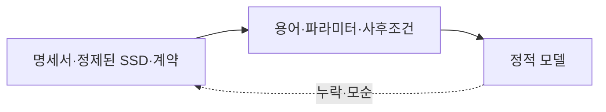

**강사 노트**

- 주문 취소는 "02. 요구 분석과 유스케이스"의 「32. 유스케이스 상세화」에 있는 **「주문을 관리한다」 명세의 주문 취소 대안 흐름 결과**, 정제된 SSD는 "02. 요구 분석과 유스케이스"의 「43. 정제된 SSD」, 배송지 변경은 "02. 요구 분석과 유스케이스"의 「44. 시스템 오퍼레이션과 계약」에 있는 **오퍼레이션 계약**이다. 전제(결제 완료·배송 시작 전 전체 취소, 출고 전 배송지 변경)를 그대로 사용한다.
- 모델을 그리다 용어가 모호하다는 사실을 발견하면 요구로 되돌아간다. 어디로 되돌리는지는 「55. 누락과 모순」에서 정리한다.
---

## 03. 도메인

도메인(Domain)은 소프트웨어가 다루는 **지식·활동·관심의 영역**이다. 분석은 먼저 **문제영역**을 이해하고, 기술 선택은 뒤로 미룬다.

- **문제영역** — 고객, 주문, 상품, 결제, 환불, 배송지
- **해결 영역** — 화면, API, 테이블, 메시지 큐, 프레임워크
- 주문 시스템의 도메인은 프로그램이 아니라 **주문하고, 결제하고, 취소·환불하고, 배송받는 업무**다.

**강사 노트**

- 정의 근거: Eric Evans, [Domain-Driven Design Reference](https://www.domainlanguage.com/wp-content/uploads/2016/05/DDD_Reference_2015-03.pdf), 2015, "Definitions" — 지식·영향·활동의 영역, 사용자가 프로그램을 적용하는 주제 영역. 본문은 수업의 말로 풀어 썼다.
- 이 세션은 "02. 요구 분석과 유스케이스"에서 정한 **주문 시스템의 범위** 안에서 모델링한다. 도메인을 하위 영역과 경계로 나누는 판단은 "13. OOAD에서 전문영역으로 — Architecture · DDD · MSA"에서 확장한다.

---

## 04. 정적 모델

정적 모델(Static Model)은 **구현과 분리해** 문제영역의 **개념과 관계**를 이해하고 검토하는 모델이다.

**인용문**

"모델은 **단순화**다. 당면한 문제를 해결하는 데 관련된 측면을 추상화하고 불필요한 세부는 무시하는 현실의 해석이다", "A model is a simplification. It is an interpretation of reality that abstracts the aspects relevant to solving the problem at hand and ignores extraneous detail.", Eric Evans, 2003, www

- 어떤 **개념**이 존재하는가?
- 각 개념은 어떤 **정보**를 가지는가?
- 개념들은 어떤 **관계**로, 몇 개씩 연결되는가?
- 항상 지켜져야 하는 **제약**은 무엇인가?

**강사 노트**

- 인용문은 원서 본문을 직접 확인하지 못했고 여러 독립 출처가 같은 문구로 인용한 것을 확인했다.
- 정적 모델은 현실의 사진이 아니라 **현재 요구에 답하는 데 필요한 측면**만 고른 해석이다.
- "구현과 분리"는 구현을 무시하라는 뜻이 아니다. 의미를 먼저 합의해야 기술 선택이 의미를 바꾸는지 판단할 수 있다("10. 기술 제약과 도메인 의미 보존").

---

## 05. 정적·동적 모델

정적 모델은 **무엇이 존재하는지**, 동적 모델은 **무엇이 일어나는지**를 보여준다. 두 모델은 **서로를 검증**한다.

| 구분 | 정적 모델 | 동적 모델 |
|---|---|---|
| **질문** | 무엇이 존재하고 어떻게 관계하는가? | 무엇이 어떤 순서로 일어나는가? |
| **요소** | 개념, 속성, 연관, 다중성, 제약 | 시스템 이벤트, 상호작용, 상태 전이 |
| **표기** | 클래스 다이어그램 | 활동·시퀀스·커뮤니케이션·상태 기계 다이어그램 |

- 동적 모델의 중심은 **상태 기계**다. 정적 모델의 **상태 값**(열거형)과 동적 모델의 **사건**이 만나는 곳이기 때문이다.

**페이지 분할**

### 한 사건, 네 다이어그램

**주문 취소** 하나를 네 동적 다이어그램으로 보면 모두 **주문의 상태 전이**(결제 완료 → 취소됨)로 모인다. 각 다이어그램은 정적 모델의 어휘를 쓴다.

**도식 — SVG**

```svg:uml
<svg xmlns="http://www.w3.org/2000/svg" width="1000" height="600" viewBox="0 0 1000 600" role="img" aria-label="주문 취소 한 사건을 활동·시퀀스·커뮤니케이션·클래스 다이어그램으로 보고 모두 주문 상태 기계의 전이로 모이는 관계">
<style>text{font-family:sans-serif;font-size:17px;fill:#000;text-anchor:middle}.t{font-weight:bold}.st{font-size:16px}.h{paint-order:stroke;stroke:#fff;stroke-width:6px;stroke-linejoin:round}.s{fill:#fff;stroke:#181818;stroke-width:1.5}.u{fill:#fff;stroke:#181818;stroke-width:1.5}.x{fill:#fff;stroke:#1B3A6B;stroke-width:1.5}.c{fill:#fff;stroke:#1B3A6B;stroke-width:3}.w{font-weight:bold}.n{fill:#fff;stroke:#181818;stroke-width:1.2}.l{stroke:#181818;stroke-width:1.3;fill:none}.d{stroke:#181818;stroke-width:1.3;fill:none;stroke-dasharray:6,5}.f{stroke:#1B3A6B;stroke-width:1.6;fill:none}.a{fill:#fff;stroke:#181818;stroke-width:1.4}</style>
<defs><marker id="o" viewBox="0 0 12 12" refX="11" refY="6" markerWidth="12" markerHeight="12" orient="auto" markerUnits="userSpaceOnUse"><path d="M1,1 L11,6 L1,11" fill="none" stroke="#181818" stroke-width="1.4"/></marker><marker id="f" viewBox="0 0 12 12" refX="11" refY="6" markerWidth="12" markerHeight="12" orient="auto" markerUnits="userSpaceOnUse"><path d="M0,0 L12,6 L0,12 Z" fill="#1B3A6B"/></marker><marker id="g" viewBox="0 0 16 16" refX="15" refY="8" markerWidth="16" markerHeight="16" orient="auto" markerUnits="userSpaceOnUse"><path d="M1,1 L15,8 L1,15 Z" fill="#fff" stroke="#181818" stroke-width="1.4"/></marker></defs>
<rect width="1000" height="600" fill="#fff"/>
<rect x="20" y="20" width="290" height="160" rx="6" fill="#fff" stroke="#1B3A6B" stroke-width="1.5"/><text class="t" x="165.0" y="46">활동 — 상태를 바꾸는 단계</text>
<rect class="s" x="45" y="62" width="240" height="34" rx="16"/><text x="165.0" y="85.0">고객이 주문을 취소한다</text>
<line class="l" x1="165" y1="96" x2="165" y2="122" marker-end="url(#o)"/>
<rect class="s" x="45" y="124" width="240" height="34" rx="16"/><text x="165.0" y="147.0">환불이 처리된다</text>
<rect x="690" y="20" width="290" height="160" rx="6" fill="#fff" stroke="#1B3A6B" stroke-width="1.5"/><text class="t" x="835.0" y="46">시퀀스 — 전이를 일으키는 메시지</text>
<rect class="s" x="705" y="60" width="70" height="28" rx="0"/><text x="740.0" y="80.0">:주문</text>
<line x1="740" y1="88" x2="740" y2="172" stroke="#1B3A6B" stroke-width="1.3" stroke-dasharray="6,5"/>
<rect class="s" x="800" y="60" width="70" height="28" rx="0"/><text x="835.0" y="80.0">:배송</text>
<line x1="835" y1="88" x2="835" y2="172" stroke="#1B3A6B" stroke-width="1.3" stroke-dasharray="6,5"/>
<rect class="s" x="895" y="60" width="70" height="28" rx="0"/><text x="930.0" y="80.0">:결제</text>
<line x1="930" y1="88" x2="930" y2="172" stroke="#1B3A6B" stroke-width="1.3" stroke-dasharray="6,5"/>
<line class="f" x1="740" y1="124" x2="832" y2="124" marker-end="url(#f)"/>
<text class="st" x="787" y="117">출고 중단</text>
<line class="f" x1="740" y1="156" x2="927" y2="156" marker-end="url(#f)"/>
<text class="st" x="886" y="149">환불 요청</text>
<rect x="370" y="230" width="260" height="140" rx="6" fill="#fff" stroke="#1B3A6B" stroke-width="3"/><text class="t" x="500" y="256">상태 기계 — 주문의 생애</text>
<rect class="s" x="385" y="290" width="96" height="40" rx="14"/><text x="433.0" y="316.0">결제 완료</text>
<rect class="s" x="549" y="290" width="66" height="40" rx="14"/><text x="582.0" y="316.0">취소됨</text>
<line class="l" x1="481" y1="310" x2="547" y2="310" marker-end="url(#o)"/>
<text class="st" x="514" y="302">주문 취소</text>
<rect x="20" y="420" width="290" height="160" rx="6" fill="#fff" stroke="#1B3A6B" stroke-width="1.5"/><text class="t" x="165.0" y="446">커뮤니케이션 — 메시지가 지나는 연관</text>
<rect class="s" x="35" y="488" width="70" height="28" rx="0"/><text x="70.0" y="508.0">:주문</text>
<rect class="s" x="215" y="462" width="70" height="28" rx="0"/><text x="250.0" y="482.0">:배송</text>
<rect class="s" x="215" y="530" width="70" height="28" rx="0"/><text x="250.0" y="550.0">:결제</text>
<line class="l" x1="105" y1="498" x2="215" y2="476"/>
<line class="l" x1="105" y1="508" x2="215" y2="544"/>
<text class="st" x="206" y="470" style="text-anchor:end">1: 출고 중단 →</text>
<text class="st" x="206" y="568" style="text-anchor:end">2: 환불 요청 ↘</text>
<rect x="690" y="420" width="290" height="160" rx="6" fill="#fff" stroke="#1B3A6B" stroke-width="1.5"/><text class="t" x="835.0" y="446">클래스 — 상태 값은 열거형</text>
<rect class="s" x="705" y="458" width="120" height="50"/><text class="t" x="765" y="477">주문</text><line class="l" x1="705" y1="484" x2="825" y2="484"/><text class="st" x="765" y="502">주문 상태</text>
<rect class="s" x="705" y="516" width="120" height="56"/><text class="st" x="765" y="537">«enumeration»</text><text x="765" y="560">주문 상태</text>
<rect class="s" x="880" y="458" width="80" height="28" rx="0"/><text x="920.0" y="478.0">배송</text>
<rect class="s" x="880" y="500" width="80" height="28" rx="0"/><text x="920.0" y="520.0">결제</text>
<rect class="s" x="880" y="542" width="80" height="28" rx="0"/><text x="920.0" y="562.0">환불</text>
<line class="l" x1="825" y1="472" x2="880" y2="472"/>
<line class="l" x1="825" y1="494" x2="880" y2="514"/>
<line class="l" x1="920" y1="528" x2="920" y2="542"/>
<line x1="310" y1="170" x2="370" y2="240" stroke="#C0504D" stroke-width="1.6" stroke-dasharray="4,4"/>
<line x1="690" y1="170" x2="630" y2="240" stroke="#C0504D" stroke-width="1.6" stroke-dasharray="4,4"/>
<line x1="310" y1="430" x2="370" y2="360" stroke="#C0504D" stroke-width="1.6" stroke-dasharray="4,4"/>
<line x1="690" y1="430" x2="630" y2="360" stroke="#C0504D" stroke-width="1.6" stroke-dasharray="4,4"/>
</svg>
```

**페이지 분할**

### 정적 모델과의 연결

| 다이어그램 | 주문 취소에서 답하는 질문 | 정적 모델에서 쓰는 것 | 정적 모델에 드러나는 누락 |
|---|---|---|---|
| **활동** | 어느 단계에서 상태가 바뀌는가? | 상태 값, 행동이 만드는 개념(환불) | 흐름에 없는 상태 값 |
| **시퀀스** | 어떤 메시지가 전이를 일으키는가? | 개념(생명선), 연관(메시지의 길) | 메시지를 보낼 연관이 없다 |
| **커뮤니케이션** | 메시지가 어느 링크를 지나는가? | 연관(링크), 다중성 | 링크에 대응하는 연관이 없다 |
| **상태 기계** | 어떤 사건으로 어떤 상태가 되는가? | 열거형 상태 값, 제약 | 전이 없는 상태 값, 값에 없는 상태 |

**강사 노트**

- 네 다이어그램의 표기와 작성법은 "04. 동적 모델 — 상호작용과 상태"의 「11. 상호작용」부터 다룬다. 이 세션은 정적 모델이 네 다이어그램에 **무엇을 주고 무엇을 돌려받는지**만 본다.

- 사건이 바꿀 대상이 정적 모델에 없으면 누락이다. 어떤 사건에도 등장하지 않는 개념은 불필요하거나 행위를 놓친 신호다.
- 동적 모델과의 본격적인 교차검증은 "04. 동적 모델 — 상호작용과 상태"에서 다룬다. 이 세션은 유스케이스의 흐름·사후조건과 대조하는 수준까지 다룬다(「54. 시나리오 교차검토」).

---

## 06. 상태 값과 상태 전이

**다이어그램 — 클래스·상태 기계 다이어그램**

상태는 정적이기도 하고 동적이기도 하다. 어떤 **상태 값**이 있는지는 정적 모델이, 어떤 사건이 상태를 **바꾸는지**는 동적 모델이 표현한다.

- **정적 질문** — 가능한 값은? "배송 시작 전"과 "출고 전"은 같은 경계인가?
- **열거형**(«enumeration») — 가능한 값을 칸에 나열한 값의 종류다. 속성의 값의 종류로 쓴다(`주문 상태 : 주문 상태`).

**인용문**

"객체의 상태는 그 객체가 속한 분류자의 **속성 값**으로 식별된다", "The state of an object identifies the values for that object of properties of the classifier of the object.", Object Management Group, 2017

**도식 — PlantUML**

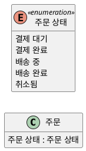

**페이지 분할**

- **동적 질문** — 어떤 사건이 상태를 바꾸는가? 어떤 전이가 금지되는가?
- 상태 기계의 **상태**는 열거형 `주문 상태`의 **값**과 하나씩 대응한다. 전이에 쓰이지 않는 값이나 값에 없는 상태는 누락이다.

**인용문**

"상태 기계는 시스템 일부의 **사건 주도 행위**를 표현하는 데 사용할 수 있다", "StateMachines can be used to express event-driven behaviors of parts of a system.", Object Management Group, 2017

**도식 — PlantUML**

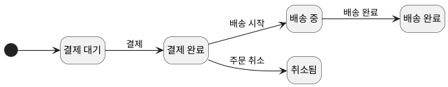

**강사 노트**

- 인용 근거: OMG [UML 2.5.1](https://www.omg.org/spec/UML/2.5.1/PDF), §6.3.1(객체의 상태), §14.5.10.1(StateMachine).
- 주문 상태 값 목록은 **교육용 가정**이다.
- 상태 기계는 대비를 위한 미리보기다. 전이는 결제 완료·배송 시작 전 전체 취소라는 기존 전제와 일치하는 것만 그렸다. 가드·시간 이벤트와 금지된 전이는 "04. 동적 모델 — 상호작용과 상태"에서 다룬다.
- "배송 시작 전"과 "출고 전"은 동의어로 가정하지 않는다. 이 세션은 질문으로 식별하고, 실제 사건·상태 관계는 다음 세션에서 확인한다.

---

## 07. 도메인 모델

도메인 모델(Domain Model)은 문제영역의 **개념 클래스**(Conceptual Class)와 그 속성·연관을 시각화한 정적 모델이다.

**인용문**

"도메인 모델은 관심 영역의 **개념 클래스** 또는 실세계 객체를 시각적으로 표현한 것이다", "A domain model is a visual representation of conceptual classes or real-world objects in a domain of interest.", Craig Larman, 2002

**인용문**

"도메인 모델은 실세계 개념 클래스를 표현한 것이지 **소프트웨어 컴포넌트**를 표현한 것이 아니다", "A domain model is a representation of real-world conceptual classes, not of software components.", Craig Larman, 2002

- 도메인 모델은 문제영역의 **시각적 사전**이다. 설계의 영감이 될 수 있지만 설계 클래스로 그대로 옮기지 않는다.

**강사 노트**

- 근거: Craig Larman, Applying UML and Patterns, 2nd ed., Chapter 10, Introduction·Key Idea·§10.1("visual dictionary"). 3판의 "real-situation" 문구와 섞지 않는다.
- 분석 모델에서 설계 모델로의 전환은 "06. 분석 모델에서 설계 모델로", DDD의 도메인 모델과의 관계는 "13. OOAD에서 전문영역으로 — Architecture · DDD · MSA"에서 다룬다.

---

## 08. 도메인 모델의 위치

도메인 모델은 **기술 요소가 없는 개념 모델**이다. 그래야 기술이 바뀌어도 **의미를 검토하는 기준**으로 남는다. 같은 "주문"이라도 층마다 표현이 다르다.

| 층 | 표현 | 주문의 예 | 기술 요소 |
|---|---|---|---|
| **개념 모델** (도메인 모델) | 개념·속성·연관 | 주문, 주문 항목, 금액 | 없음 |
| 설계 모델 | 클래스·책임·메시지 | 주문 클래스와 그 책임 | 언어·구조 |
| 물리 모델 | 테이블·키·인덱스, API·메시지 형식 | 주문 테이블, 주문 식별 키, 주문 응답 형식 | DB·프레임워크 |

**강사 노트**

- 설계 모델로의 전환은 "06. 분석 모델에서 설계 모델로", 물리 모델과 매핑은 "10. 기술 제약과 도메인 의미 보존"에서 다룬다.
- 층을 나누는 것은 작업 순서를 강제하려는 것이 아니다. 같은 대상을 서로 다른 질문으로 본다는 뜻이다.

---

## 09. 클래스 다이어그램

도메인 모델은 UML **클래스 다이어그램 표기**를 빌리지만, 각 사각형은 소프트웨어 클래스가 아니라 **개념**이다.

**도식 — SVG**

```svg
<svg xmlns="http://www.w3.org/2000/svg" width="1000" height="230" viewBox="0 0 1000 230" role="img" aria-label="클래스 다이어그램 표기: 개념과 속성, 연관과 다중성, 일반화, 합성, 열거형">
<style>text{font-family:sans-serif;font-size:20px;fill:#000;text-anchor:middle}.b{fill:#fff;stroke:#181818;stroke-width:2}.l{stroke:#181818;stroke-width:2.5;fill:none}</style>
<rect width="1000" height="230" fill="#fff"/>
<rect class="b" x="30" y="30" width="150" height="100"/><text x="105" y="58" style="font-weight:bold">주문</text><line x1="30" y1="70" x2="180" y2="70" stroke="#181818" stroke-width="2"/><text x="105" y="104" style="font-size:18px">주문 번호</text>
<line class="l" x1="215" y1="85" x2="375" y2="85"/><text x="295" y="72" style="font-size:18px">주문한다 ▶</text><text x="228" y="110" style="font-size:18px">1</text><text x="352" y="110" style="font-size:18px">0..*</text>
<line class="l" x1="410" y1="85" x2="545" y2="85"/><polygon points="545,70 572,85 545,100" fill="#fff" stroke="#181818" stroke-width="2.5"/>
<polygon points="605,85 623,74 641,85 623,96" fill="#181818" stroke="#181818" stroke-width="2"/><line class="l" x1="641" y1="85" x2="755" y2="85"/>
<rect class="b" x="790" y="25" width="180" height="110"/><text x="880" y="50" style="font-size:16px">«enumeration»</text><text x="880" y="74" style="font-weight:bold">주문 상태</text><line x1="790" y1="84" x2="970" y2="84" stroke="#181818" stroke-width="2"/><text x="880" y="112" style="font-size:18px">결제 대기</text>
<text x="105" y="195">개념·속성</text><text x="295" y="195">연관·다중성</text><text x="490" y="195">일반화</text><text x="680" y="195">합성</text><text x="880" y="195">열거형</text>
</svg>
```

### 표기와 사용법

| 표기 | 의미 | 이렇게 쓴다 |
|---|---|---|
| **개념** — 이름 있는 사각형 | 문제영역에서 구분해 이야기하는 것 | 업무에서 쓰는 단수 명사로 이름 짓는다 |
| **속성** — 사각형 안의 항목 | 개념이 가지는 단순한 값 | `이름 : 값의 종류`로 쓴다. 타입은 업무 값의 종류로 |
| **연관** — 실선과 이름 | 기억하거나 이해할 가치가 있는 관계 | 동사구로 이름 짓고 읽는 방향(`>`)을 표시한다 |
| **다중성** — 양 끝의 수 | 상대와 몇 개씩 관계하는가 | `1`, `0..1`, `0..*`, `1..*` |
| 오퍼레이션 | — | 쓰지 않는다. 책임과 메서드는 설계에서 정한다 |

**페이지 분할**

### 값과 제약의 표기

| 표기 | 의미 | 이렇게 쓴다 |
|---|---|---|
| **파생 속성** — `/` | 다른 값에서 계산되는 속성 | `/ 주문 총액`처럼 이름 앞에 붙인다(「25. 파생 속성」) |
| **제약** — `{ }` | 언제나 참이어야 하는 조건 | `{수량은 1 이상}`처럼 중괄호 메모로 붙인다(「39. 제약」) |

- **클래스의 종류**는 「10. 클래스 유형」, **관계의 종류**는 「11. 관계 유형」에서 정리한다.

**고객과 주문**을 클래스 다이어그램으로 그린 예다.

**도식 — PlantUML**

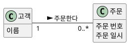

**강사 노트**

- 근거: Larman, 2nd ed., §10.1 — 도메인 모델은 오퍼레이션을 정의하지 않은 클래스 다이어그램으로 표현한다.
- 연관 이름은 읽는 방향이 있다. 위 도식은 "고객이 주문을 한다"로 읽는다. 표기가 같아도 의미는 모델의 관점이 정한다.

---

## 10. 클래스 유형

**다이어그램 — 클래스 다이어그램**

클래스 다이어그램의 사각형은 모두 비슷해 보이지만 **유형**이 다르다. **UML 표기에 따른 유형**과 **도메인 의미에 따른 유형**이 있다. 먼저 UML 유형이다.

| 유형 | 표기 | 의미 | 도메인 모델 | 코드에서 |
|---|---|---|---|---|
| **개념 클래스** | 이름 있는 사각형 | 문제영역에서 구분하는 것 | 쓴다 — 주문, 상품 | `class` |
| **데이터 타입** | `«dataType»` | **값**이 같으면 같은 값의 종류 | 속성의 타입 — 금액, 수량 | `record` |
| **열거형** | `«enumeration»` | 정해진 값의 목록 | 쓴다 — 주문 상태 | `enum` |
| **연관 클래스** | 연관에 점선으로 연결 | 연관 자체가 가지는 정보 | 필요할 때 | 두 참조의 `class` |
| **추상 클래스** | 기울인 이름 | 직접 인스턴스가 없는 일반 개념 | 일반화의 위쪽 | `abstract class` |
| **인터페이스** | `«interface»` | 구현 없는 오퍼레이션 약속 | 쓰지 않는다 — 설계 | `interface` |

**페이지 분할**

주문(**개념 클래스**), 주문 상태(**열거형**), 주소(**데이터 타입**), 결제(**추상 클래스**), 결제 시스템(**인터페이스**)이다. 인터페이스는 설계 유형과 대비하려고 넣었다.

**도식 — PlantUML**

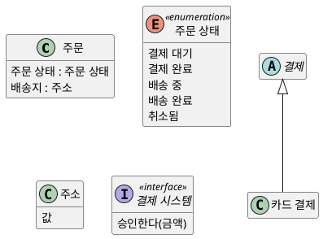

**페이지 분할**

### 도메인 유형

개념은 도메인에서 맡는 **유형**으로도 나눈다. 유형을 알면 **빠진 속성과 연관**을 예상할 수 있다.

| 도메인 유형 | 의미 | 주문 사례 | 전형적인 속성 | 전형적인 연관 |
|---|---|---|---|---|
| **거래**(순간·기간) | 기록해야 할 일 — 순간·기간 | 주문, 결제, 환불, 배송 | 번호, 일시, 상태, 금액 | 항목, 역할, 다음 거래 |
| **거래 항목** | 거래를 이루는 한 줄 | 주문 항목 | 수량, 확정 값(단가) | 거래(합성), 설명 |
| **역할** | 거래에 참여하는 방식 | 고객 | 역할별 정보 | 당사자, 거래 |
| **당사자·장소·물건** | 역할·거래 대상인 실체 | 사람, 재고 품목 | 이름, 식별 정보 | 역할, 설명 |
| **설명**(명세) | 여러 실체가 공유하는 정의 | 상품 | 이름, 기준 값(판매가) | 실체, 거래 항목 |

**페이지 분할**

### 도메인 유형으로 본 주문 모델

주문 모델은 **거래**(주문·결제·환불·배송)가 중심이고, 주문 항목은 거래 항목, 고객은 역할, 상품은 설명이다. 거래에 번호·일시·상태가 없거나 거래 항목에 확정 값이 없으면 먼저 의심한다.

**도식 — PlantUML**

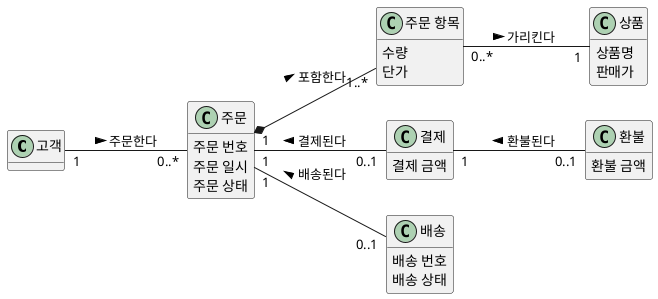

**강사 노트**

- 도메인 유형 근거: Peter Coad·Eric Lefebvre·Jeff De Luca, *Java Modeling in Color with UML*, 1999, [Chapter 1 "Archetypes, Color, and the Domain-Neutral Component"](https://dn.embarcadero.com/article/29871)의 네 원형(Moment-Interval, Role, Party·Place·Thing, Description)을 이 과정의 말로 옮겼다. 원서는 색으로 유형을 구분하지만 이 과정은 UML 표기에 바탕색을 쓰지 않고, 도식에는 클래스 이름만 쓴다. 유형은 본문에서 대응시킨다. 거래 항목은 원서에서 순간·기간의 세부 항목으로 다룬다.
- 「17. 개념 범주」는 후보를 **찾는** 점검표이고, 도메인 유형은 찾은 개념에서 **빠진 속성·연관을 예상**하는 도구다. 이 사례의 상품은 설명이고, 개별 실물(재고 품목)은 모델에 두지 않았다(「34. 명세 개념」).
- 같은 사각형이라도 도메인 모델의 사각형은 **개념**이다(「08. 도메인 모델의 위치」). 인터페이스·오퍼레이션은 설계에서 정한다.
- 데이터 타입은 식별자가 없어 값이 같으면 같은 것이다. 금액 1,000원은 어디에 있든 같은 금액이다. 개념 클래스는 값이 같아도 다른 주문이다.
- 근거: OMG [UML 2.5.1](https://www.omg.org/spec/UML/2.5.1/PDF), §10.2 DataType·Enumeration, §9.2.3.2 추상 분류자, §10.4 Interface.
- 연관 클래스는 「33. 연관 클래스」, 추상 클래스는 「37. 일반화」에서 자세히 본다.

---

## 11. 관계 유형

**다이어그램 — 클래스 다이어그램**

클래스 사이의 관계는 UML 표기로 여섯 가지다. 도메인 모델은 **연관·합성·일반화**를 쓰고, **의존·실현**은 설계에서 쓴다.

| 관계 | 표기 | 의미 | 도메인 모델 | 코드에서 |
|---|---|---|---|---|
| **연관** | 실선 | 기억할 구조적 관계 | 쓴다 | 참조 필드(방향은 설계) |
| **집합** | 속 빈 마름모 | 전체–부분, 생애는 따로 | 쓰지 않는다 — 연관과 같다 | 공유되는 참조 |
| **합성** | 채운 마름모 | 한 전체에 속하고 생애를 함께 | 의미가 분명할 때 | 전체가 부분을 만들고 소유 |
| **일반화** | 실선, 빈 삼각형 | 특수가 일반의 한 종류 | 정의가 모두 적용될 때 | `extends` |
| **의존** | 점선, 열린 화살표 | 잠깐 쓴다 — 바뀌면 영향 | 쓰지 않는다 — 설계 | 매개변수·지역 변수 |
| **실현** | 점선, 빈 삼각형 | 인터페이스를 구현한다 | 쓰지 않는다 — 설계 | `implements` |

**페이지 분할**

### 도메인 의미에 따른 연관

연관은 **도메인 의미**로도 나눈다. 개념의 도메인 유형(「10. 클래스 유형」)을 알면 **있어야 할 연관**을 점검할 수 있다(「28. 필요한 연관」).

| 연관의 의미 | 주문 사례 | UML 관계 |
|---|---|---|
| **거래 — 거래 항목** | 주문 — 주문 항목 | 합성 |
| **거래 — 역할** | 주문 — 고객 | 연관 |
| **거래 — 뒤따르는 거래** | 주문 — 결제 — 환불, 주문 — 배송 | 연관 |
| **거래 항목 — 설명** | 주문 항목 — 상품 | 연관 |
| **설명 — 실체** | 상품 — 재고 품목(「34. 명세 개념」) | 연관 |
| **담는 것 — 담기는 것** | 장바구니 — 장바구니 항목 | 합성 |
| **일반 — 특수** | 결제 — 카드 결제 | 일반화 |

- 거래가 역할이나 뒤따르는 거래와 이어지지 않으면 **누가·무엇 다음에** 일어난 일인지 모델이 답하지 못한다.

**페이지 분할**

### 관계 유형과 코드

주문 사례로 여섯 관계를 그리고 코드로 옮겼다. 합성은 **주문이 주문 항목을 만드는 것**으로, 의존은 **매개변수로 잠깐 쓰는 것**으로 드러난다.

**도식 — PlantUML**

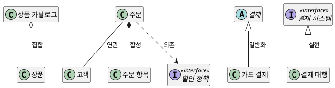

```java
// ... 고객·상품·주문항목·할인정책 생략
class 상품카탈로그 {
    final List<상품> 상품들 = new ArrayList<>();
}

class 주문 {
    final 고객 고객;
    final List<주문항목> 항목들 = new ArrayList<>();
    주문(고객 고객) { this.고객 = 고객; }
    void 담는다(상품 상품, int 수량) {
        항목들.add(new 주문항목(상품, 수량));
    }
    int 할인액(할인정책 정책) { return 정책.할인액(this); }
}

abstract class 결제 {}
class 카드결제 extends 결제 {}

interface 결제시스템 { boolean 승인한다(int 금액); }
class 결제대행 implements 결제시스템 {
    public boolean 승인한다(int 금액) { return true; }
}
```

**강사 노트**

- 도메인 의미의 분류는 Craig Larman, *Applying UML and Patterns*, 2nd ed., Chapter 11 ["Finding Associations—Common Associations List"](https://www.oreilly.com/library/view/applying-uml-and/0130925691/0130925691_ch11lev1sec4.html)의 Table 11.1 일부를 도메인 유형에 맞춰 묶은 수업용 정리다.
- 코드의 관계는 **설계의 결정**이다. 집합과 연관은 코드가 같다(참조 필드). 그래서 도메인 모델은 집합을 쓰지 않는다(「38. 전체와 부분」).
- 의존·실현은 오퍼레이션과 인터페이스가 정해져야 생긴다. 도메인 모델에서는 쓰지 않고 "06. 분석 모델에서 설계 모델로"와 "07. 책임·협력·계약"에서 다룬다.
- 코드는 `code/s03/관계유형.java`에서 발췌했다. 근거: OMG [UML 2.5.1](https://www.omg.org/spec/UML/2.5.1/PDF), §9.5.3 AggregationKind, §7.7.3.1 Dependency, §10.4.3 InterfaceRealization.
- 연관은 「27. 연관」, 일반화는 「37. 일반화」, 합성은 「38. 전체와 부분」에서 자세히 본다.

---

## 12. 정보공학과 데이터 모델링

정보공학의 데이터 모델링은 업무 정보를 **엔티티·속성·관계**로 표현하고, 개념 → 논리 → 물리 모델로 구체화한다.

**인용문**

"개체–관계 모델은 현실 세계가 **개체와 관계**로 이루어져 있다는 더 자연스러운 관점을 취한다", "The entity-relationship model adopts the more natural view that the real world consists of entities and relationships.", Peter Pin-Shan Chen, 1976

| 단계 | 초점 | 주문 사례 |
|---|---|---|
| **개념 데이터 모델** | 핵심 엔티티와 관계 | 고객–주문–상품 |
| **논리 데이터 모델** | 속성·식별자·관계의 카디널리티·정규화 | 주문(주문번호, 주문일시, 주문상태) |
| **물리 데이터 모델** | 테이블·컬럼 타입·인덱스·성능 | 주문 테이블과 인덱스 |

**강사 노트**

- 인용 근거: Peter Pin-Shan Chen, "The Entity-Relationship Model — Toward a Unified View of Data", *ACM Transactions on Database Systems*, 1976, [저자 공개 PDF](https://www.csc.lsu.edu/~chen/pdf/erd-5-pages.pdf) §1. 같은 논문 초록은 이 모델이 현실 세계의 중요한 의미 정보를 담는다고 설명한다.
- 개념·논리·물리의 3단계는 데이터 모델링 실무에서 널리 쓰는 구분이다. 특정 표준의 정의를 옮긴 것은 아니다.

---

## 13. 데이터 모델과 도메인 모델

**좋은 데이터 모델은 좋은 도메인 모델의 출발점이다.** 목적은 다르지만 뿌리는 같다. 도메인 모델링은 그 위에 **의미·규칙·책임의 자리**를 더한다.

**인용문**

"도메인 모델은 **데이터 모델이 아니다**", "Domain models are not data models.", Craig Larman, 2002

| 판단 | 논리 데이터 모델 | 도메인 모델 |
|---|---|---|
| **목적** | 정보를 일관되게 저장·관리 | 개념과 규칙을 이해·합의 |
| **식별** | 식별자·키 | 업무 식별자와 연관 |
| **속성 없는 개념** | 대개 제외 | 의미가 있으면 둔다 |
| **행위** | 다루지 않는다 | 이후 책임·협력의 근거가 된다 |

**강사 노트**

- Larman의 문장은 두 모델의 **목적**이 다르다는 뜻이다. 데이터 모델이 쓸모없다는 뜻이 아니다. 같은 장은 속성이 없거나 기억할 정보가 없다는 이유만으로 개념을 빼는 것은 관계형 데이터 모델링의 기준이라고 설명한다(Larman, 2nd ed., Chapter 10, 각주 2).
- 실무에서는 데이터 모델조차 제대로 갖추지 않은 채 분석 문서에 시간을 쓰는 경우가 더 흔하다(「47. 잘못된 관행 — 분석 과잉」).

---

## 14. 모델 요소의 대응

ERD의 요소는 대부분 도메인 모델의 요소와 **대응**한다. 차이는 물리 요소를 빼고 의미를 더하는 데 있다.

| ERD | 도메인 모델 | 도메인 모델에서 달라지는 점 |
|---|---|---|
| 엔티티 | 개념 | 저장 대상이 아니어도 개념이 될 수 있다 |
| 속성 | 속성 | 컬럼 타입보다 **값의 종류와 규칙** |
| 관계 | 연관 | 이름과 읽는 방향 |
| 카디널리티 | 다중성 | 같은 업무 규칙이다 |
| 교차(연결) 엔티티 | 연관 클래스·개념 | 관계 자체의 정보 |
| 슈퍼·서브타입 | 일반화 | 의미와 규칙을 이어받는다 |
| 외래키·대리 키 | 없음 | 연관이 대신한다 |
| 도메인(값의 범위) | 값의 종류 | 속성 수준 업무 규칙 |

**강사 노트**

- 표의 대응은 개념·논리 데이터 모델 기준이다. 물리 모델의 비정규화·인덱스는 대응 대상이 아니다.
- 마지막 행(도메인)은 뒤의 「22. 속성 도메인」·「23. 속성 수준 업무 규칙」에서 이어서 다룬다.

---

## 15. 같은 사례, 두 모델

**다이어그램 — ERD·클래스 다이어그램**

같은 주문 사례를 **논리 데이터 모델**과 **도메인 모델**로 그려 비교한다. 데이터 모델은 관계의 수를 **까마귀발 표기**로 나타낸다.

**도식 — SVG**

```svg
<svg xmlns="http://www.w3.org/2000/svg" width="1000" height="230" viewBox="0 0 1000 230" role="img" aria-label="까마귀발 표기: 정확히 하나, 없거나 하나, 0개 이상, 1개 이상, 식별자와 외래키">
<style>text{font-family:sans-serif;font-size:20px;fill:#000;text-anchor:middle}.l{stroke:#181818;stroke-width:3;fill:none}.o{stroke:#181818;stroke-width:3;fill:#fff}.e{fill:#fff;stroke:#181818;stroke-width:2}</style>
<rect width="1000" height="230" fill="#fff"/>
<line x1="30" y1="90" x2="170" y2="90" class="l"/><line x1="160" y1="74" x2="160" y2="106" class="l"/><line x1="148" y1="74" x2="148" y2="106" class="l"/>
<text x="100" y="200">정확히 하나</text>
<line x1="205" y1="90" x2="345" y2="90" class="l"/><line x1="333" y1="74" x2="333" y2="106" class="l"/><circle cx="311" cy="90" r="9" class="o"/>
<text x="275" y="200">없거나 하나</text>
<line x1="380" y1="90" x2="520" y2="90" class="l"/><line x1="494" y1="90" x2="520" y2="74" class="l"/><line x1="494" y1="90" x2="520" y2="106" class="l"/><circle cx="480" cy="90" r="9" class="o"/>
<text x="450" y="200">0개 이상</text>
<line x1="555" y1="90" x2="695" y2="90" class="l"/><line x1="669" y1="90" x2="695" y2="74" class="l"/><line x1="669" y1="90" x2="695" y2="106" class="l"/><line x1="661" y1="74" x2="661" y2="106" class="l"/>
<text x="625" y="200">1개 이상</text>
<rect class="e" x="760" y="20" width="200" height="140"/><text x="860" y="48" style="font-weight:bold">주문</text>
<line x1="760" y1="60" x2="960" y2="60" stroke="#181818" stroke-width="2"/>
<text x="860" y="90" style="font-size:18px">● 주문번호</text><line x1="760" y1="104" x2="960" y2="104" stroke="#181818" stroke-width="1.5"/>
<text x="860" y="136" style="font-size:18px">고객번호 (FK)</text>
<text x="860" y="200">식별자 · 외래키</text></svg>
```

### 표기와 사용법

| 표기 | 의미 | 이렇게 쓴다 | 도메인 모델에서는 |
|---|---|---|---|
| **정확히 하나** — 두 줄 | 반드시 하나와 관계한다 | 관계선의 상대 쪽 끝에 그린다 | `1` |
| **없거나 하나** — 원과 한 줄 | 관계가 없어도 되고, 있으면 하나 | 원은 "없어도 된다"(선택), 줄은 "하나" | `0..1` |
| **0개 이상** — 원과 까마귀발 | 없거나 여럿과 관계한다 | 까마귀발은 "여럿" | `0..*` |
| **1개 이상** — 줄과 까마귀발 | 적어도 하나, 여럿일 수 있다 | 줄은 "반드시" | `1..*` |
| **식별자** — `●`, 구분선 위 | 엔터티 하나를 구별하는 속성 | 구분선 위에 둔다 | 업무 식별자만 속성으로 |
| **외래키** — `(FK)` | 다른 엔터티의 식별자를 가진 속성 | 관계를 속성으로 구현한다 | 속성이 아니라 **연관** |

**페이지 분할**

**도식 — PlantUML**

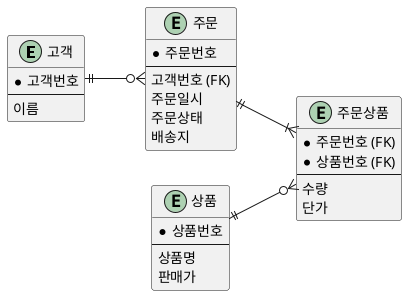

**페이지 분할**

- **같은 것** — 개념, 관계, 카디널리티(다중성), 주문 시점의 단가
- **달라진 것** — 식별 키·외래키 대신 연관, 이름 있는 관계, 값의 종류(금액·주소·주문 상태)

**도식 — PlantUML**

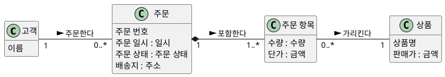

**강사 노트**

- 첫 도식은 까마귀발 표기의 논리 데이터 모델이다. `●`는 식별자, `(FK)`는 외래키다.
- 좋은 데이터 모델에서 출발하면 도메인 모델은 크게 바뀌지 않는다. 바뀌는 곳이 곧 의미를 드러낸 곳이다.

---

## 16. 도메인 개념

도메인 개념(Domain Concept)은 문제영역에서 **구분해 이야기하고, 그 정보나 관계가 요구에 의미를 가지는 것**이다.

- 업무 담당자가 **이 이름으로** 부르는가?
- 다른 것과 **구분해 식별**해야 하는가?
- **정보나 관계를 기억**해야 하는가? **업무 규칙**이 걸리는가?
- **개념** — 주문, 주문 항목, 상품, 결제, 환불, 고객
- **개념이 아닌 것** — 주문 버튼, 주문 테이블, 주문 서비스

**강사 노트**

- 모든 질문에 "예"여야 개념인 것은 아니다. 속성이 없어도 업무상 구분되는 개념일 수 있다. 질문은 후보를 거르는 도구이지 채점표가 아니다.

---

## 17. 개념 범주

자주 나타나는 **개념 범주**를 점검표로 삼아 후보를 떠올린다. 후보를 **모두 모델에 넣지는 않는다**.

| 범주 | 주문 도메인의 후보 |
|---|---|
| 거래 · 거래 항목 | 주문, 결제, 환불 · 주문 항목 |
| 역할 | 고객 |
| 명세·설명 | 상품 |
| 사건 | 주문, 결제, 배송 시작 |
| 규칙·정책 | 취소 정책, 환불 정책 |
| 외부 시스템 | 결제·상품·회계·배송 시스템 — 개념이 아니라 **지원 액터** |

**강사 노트**

- 근거: Larman, 2nd ed., Table 10.1 "Conceptual Class Category List"의 범주 일부를 주문 도메인에 적용했다. 원표 전체가 아니다. 같은 후보가 여러 범주에 나타날 수 있다(주문은 거래이자 사건).
- 원표에는 장소, 담는 것·담기는 것, 기록, 카탈로그, 조직 등도 있다. 필요하면 추가로 점검한다.

---

## 18. 유스케이스 어휘

유스케이스의 흐름과 사후조건에는 문제영역의 **어휘**가 이미 담겨 있다.

**인용문**

"도메인 모델은 주목할 만한 도메인 개념과 어휘를 시각화한 것이다. 그 용어들은 어디에 있는가? **유스케이스**에 있다", "The domain model is a visualization of noteworthy domain concepts and vocabulary. Where are those terms found? In the use cases.", Craig Larman, 2002

- 주문 취소 흐름 — **고객**이 **주문**을 취소한다 → **환불**이 처리된다 → 고객은 **취소 결과**를 확인한다.
- **개념 후보** — 고객, 주문, 결제, 환불
- **속성·값 후보** — 결제 금액, 취소 상태
- 정제된 SSD — `장바구니에 담는다(상품, 수량)` → **장바구니**·상품·수량, `배송을 요청한다(주문, 배송지)` → **배송**
- **확인 필요** — 배송(주문 시스템이 무엇을 기억해야 하는가?)

**페이지 분할**

### 흐름·SSD·계약에서 모델로

"02. 요구 분석과 유스케이스"의 명세서 **흐름 단계마다** 시스템 이벤트와 그 결과가 **개념·속성·연관**으로 이어진다. 이 표가 「44. 도메인 모델 — 초안」의 출발점이다.

| 흐름 | 시스템 이벤트 | 개념 | 속성 · 연관 |
|---|---|---|---|
| **기본 1** | 상품을 조회한다(검색 조건) | 상품 | 상품명, 판매가 |
| **기본 2** | 장바구니에 담는다(상품, 수량) | 장바구니, 장바구니 항목 | 수량 · 장바구니 항목–상품 |
| **기본 3** | 배송지를 지정한다(주소) | — | 주문의 배송지 : 주소 |
| **기본 4** | 결제한다(결제 수단) | 주문, 주문 항목, 결제, 배송 | 단가·결제 금액·주문 상태, 주문–결제·배송 |
| **대안 1a** | 주문을 취소한다(주문) | 환불 | 환불 금액, `취소됨` · 결제–환불 |
| **대안 3a** | 배송지를 변경한다(주문, 새 주소) | — | 주문의 배송지(기본 주소와 별개) |

**강사 노트**

- 결제 계약의 사후조건(배송을 요청했다)에서 **배송 기록**이 나온다. 입금·영수증은 회계 시스템의 것이라 개념이 아니다.
- 결제 수단은 이벤트의 파라미터지만 현재 요구에서 기억할 필요가 없어 속성으로 넣지 않는다(「45. 도메인 모델 — 상세화」의 의도적으로 넣지 않은 것).
- 흐름 번호는 "02. 요구 분석과 유스케이스"의 「32. 유스케이스 상세화」와 같다.

- 원문도 바로 이어서 명사구 가운데 일부만 개념 후보이고, 일부는 이번 반복에서 무시하며, 일부는 속성일 수 있다고 설명한다. 명사 표시는 **후보를 모으는 도구**다.

---

## 19. 명사 추출의 한계

명사를 기계적으로 클래스로 옮기면 **동의어·속성·해결책 요소·숨은 개념**을 잘못 다룬다.

- **동의어** — 주문 상품 / 주문 항목 / 주문 라인 → 이름 하나로
- **속성** — 결제 금액, 주문 일시 → 개념이 아니다
- **해결책 요소** — 주문 화면, 취소 버튼 → 문제영역이 아니다
- **동사 속 개념** — "환불이 **처리된다**" → 환불
- **숨은 개념** — 흐름에 없는 취소 정책 → 규칙·대화에서 찾는다

**강사 노트**

- "명사 → 클래스"는 "분석 개념을 설계·코드로 기계 변환하지 않는다"는 과정 원칙의 가장 흔한 위반이다. 문장에 없는 개념은 개념 범주 점검과 업무 담당자와의 대화로 보완한다.

---

## 20. 개념과 속성

**속성**(Attribute)은 개념이 가지는 **단순한 값**이다. 숫자나 텍스트로 다루지 않는 것이면 **개념**일 가능성이 높다.

**인용문**

"실세계에서 어떤 개념 X를 **숫자나 텍스트**로 여기지 않는다면, X는 속성이 아니라 개념 클래스일 가능성이 높다", "If we do not think of some conceptual class X as a number or text in the real world, X is probably a conceptual class, not an attribute.", Craig Larman, 2002

- **배송지는 속성인가?** — 이 주문을 보낼 주소라는 **값**만 중요하면 `주문.배송지 : 주소`로 충분하다.
- **개념이 되는 경우** — 저장된 여러 배송지 중 고르고 배송지마다 수령인·별칭을 관리한다면 **구분되는 대상**이다.

**강사 노트**

- 인용 근거: Larman, 2nd ed., Chapter 10, "A Common Mistake in Identifying Conceptual Classes". 확신이 없으면 별도 개념으로 두라고 권한다.
- 주소록 요구는 확정되지 않았다. 두 번째 경우는 판단 기준을 보이기 위한 가정이며, 현재 모델에서는 배송지를 주문의 속성으로 둔다.

---

## 21. 속성 값의 의미

속성은 이름만으로 끝나지 않는다. 타입은 DB 컬럼이 아니라 **업무 값의 종류**로 적고, **허용 범위**를 묻는다.

| 속성 | 값의 종류 | 확인할 질문 |
|---|---|---|
| **결제 금액** | 금액 | 통화는? 음수가 가능한가? |
| **수량** | 수량 | 0이 허용되는가? |
| **배송지** | 주소 | 필수 구성 요소는? |
| **주문 일시** | 일시 | 어느 시간대 기준인가? |
| **주문 상태** | 주문 상태 | 가능한 값은? |

**강사 노트**

- 값의 종류를 밝히면 단위 혼동과 의미 없는 연산을 분석 단계에서 드러낸다. 값의 종류를 코드의 값 객체로 구현할지는 설계 판단이다. 여기서는 의미를 명시하는 데까지 다룬다.

---

## 22. 속성 도메인

데이터 모델링의 **도메인**은 속성이 가질 수 있는 **값의 집합과 규칙**이다. DB 타입(숫자·문자열)이 아니며, 같은 도메인을 쓰는 속성은 같은 규칙을 따른다.

**인용문**

"각 값 집합에는 어떤 값이 그 집합에 **속하는지 검사하는 술어**가 있다", "There is a predicate associated with each value set to test whether a value belongs to it.", Peter Pin-Shan Chen, 1976

| 도메인 | 규칙 | 사용하는 속성 |
|---|---|---|
| **금액** | 0 이상, 통화 단위, 소수 자릿수 | 판매가, 단가, 결제 금액, 환불 금액 |
| **수량** | 1 이상의 정수 | 주문 항목의 수량 |
| **주소** | 필수 구성 요소, 형식 | 배송지, 고객의 기본 주소 |
| **주문 번호** | 형식, 유일, 재사용 금지 | 주문 번호 |
| **주문 상태** | 정해진 값 목록 | 주문 상태 |

**강사 노트**

- 인용 근거: Chen, 1976, §2.2.3 "Attribute, Value, and Value Set". 같은 절은 값 집합 INCH의 "12"가 FEET의 "1"과 같다는 예로 **단위**가 값의 의미에 속함을 보인다.
- 표의 규칙은 교육용 예다. 통화·자릿수·주소 형식은 실제 업무에서 확인한다.

---

## 23. 속성 수준 업무 규칙

속성 수준 업무 규칙은 **데이터 모델링과 도메인 모델링이 공통으로 다루는 핵심**이다. 규칙이 빠지면 두 모델 모두 이름만 남는다.

- **금액** — 같은 통화끼리만 더하고 비교한다.
- **수량** — 1 이상이어야 한다.
- **주소** — 우편번호와 기본 주소가 있어야 한다.
- **주문 번호** — 정해진 형식이며 다시 쓰이지 않는다.
- **주문 상태** — 정해진 값만 가진다.

| 규칙의 범위 | 예 | 다루는 곳 |
|---|---|---|
| **값 하나** | 수량은 1 이상 | 속성 도메인 |
| **여러 속성·연관** | 주문 총액은 주문 항목 금액의 합계 | 제약 |
| **시점·사건** | 배송 시작 이후에는 취소할 수 없다 | 상태 전이 규칙(동적 모델) |

**강사 노트**

- 규칙의 범위를 나누는 이유는 규칙을 둘 **자리**를 정하기 위해서다. 여러 속성에 걸친 제약은 「39. 제약」에서, 시점 규칙은 "04. 동적 모델 — 상호작용과 상태"에서 다룬다.

---

## 24. 규칙의 소유

속성 규칙을 화면·서비스·DB 곳곳의 검사 코드에 흩어 두면 규칙이 서로 달라진다. 규칙은 **값의 종류**가 소유해야 한다.

**인용문**

"그 요소가 전달하는 **속성의 의미를 표현**하게 하고 관련 기능을 부여한다", "Make it express the meaning of the attributes it conveys and give it related functionality.", Eric Evans, 2015

- **데이터 모델링** — 규칙을 도메인 정의로 소유한다.
- **도메인 모델링** — 규칙을 값의 종류(금액·수량·주소)로 소유한다.
- **DDD** — 이 역할을 **값 객체**가 맡는다.

**강사 노트**

- 인용 근거: Eric Evans, [DDD Reference](https://www.domainlanguage.com/wp-content/uploads/2016/05/DDD_Reference_2015-03.pdf), 2015, "Value Objects". 원문은 식별성이 없고 속성과 그 논리만 중요한 요소를 값 객체로 분류하라는 맥락이다.
- 이 세션은 값 객체를 설계하지 않는다. 속성 규칙이 **어디에 속하는지**를 분석 단계에서 정하는 데까지 다룬다. 값 객체는 "13. OOAD에서 전문영역으로 — Architecture · DDD · MSA"에서 다룬다.

---

## 25. 파생 속성

**다이어그램 — 클래스 다이어그램**

**파생 속성**(Derived Attribute)은 다른 정보로 **계산해 얻는** 속성이다. 이름 앞에 `/`를 붙인다.

**도식 — PlantUML**

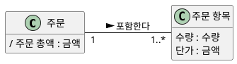

- 주문 총액 = 주문 항목의 **수량 × 단가 합계**
- 표시하는 이유는 **계산 규칙이 업무 의미**를 가지기 때문이다.

**강사 노트**

- 저장할지 매번 계산할지는 설계·성능 판단이다. 할인·배송비는 현재 전제에 없으므로 총액 규칙에 넣지 않았다. 필요하면 확인 질문으로 남긴다.

---

## 26. 참조와 연관

**다이어그램 — 클래스 다이어그램**

다른 개념을 가리키는 정보는 `고객ID` 같은 속성이 아니라 **연관**으로 표현한다.

**도식 — PlantUML**

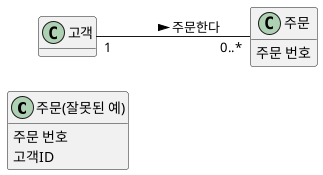

- **잘못된 예** — 고객과 주문의 관계를 그림에서 읽을 수 없다.
- **업무 식별자** — 고객이 보는 `주문 번호`는 속성이다. 대리 키·외래키는 넣지 않는다.

**강사 노트**

- 배송지 변경 계약의 "주문 식별 정보는 변경 전과 같다"는 업무 식별자의 의미다. 저장 키를 뜻하지 않는다.

---

## 27. 연관

**다이어그램 — 클래스 다이어그램**

연관(Association)은 개념 사이의 **의미 있는 관계**다. 이름을 붙일 수 없다면 **관계를 아직 모르는 것**이다.

**도식 — PlantUML**

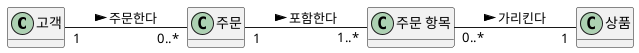

- **연관 이름** — 동사구와 읽는 방향
- **역할 이름** — 관계에서 맡는 역할이 이름과 다를 때

**강사 노트**

- 도메인 모델의 연관은 탐색 방향이나 참조 구현을 뜻하지 않는다. 방향 표시는 이름을 읽는 방향이다. 탐색 방향은 "06. 분석 모델에서 설계 모델로"와 "07. 책임·협력·계약"에서 결정한다.

---

## 28. 필요한 연관

가능한 모든 관계를 그리지 않는다. **요구를 충족하려면 기억해야 하는 관계**를 우선한다.

- **알아야 하는 연관** — 없으면 요구를 만족할 수 없다. 예: 주문–결제(전액 환불 확인)
- **이해를 돕는 연관** — 도메인 이해를 돕는다. 예: 상품–상품 카탈로그
- **과잉 연관** — 다른 경로로 이미 알 수 있다. 예: 고객–상품 "구매했다"
- **빈 이름** — "관련된다", "가진다"는 의미가 없다.

**강사 노트**

- 고객–상품이 "관심 상품", "재입고 알림"처럼 **다른 의미**를 가지면 별도 연관이 된다. 기준은 경로의 중복이 아니라 의미의 중복이다.

---

## 29. 다중성

**다이어그램 — 클래스 다이어그램**

다중성(Multiplicity)은 **특정 시점**에 한 인스턴스가 상대 인스턴스 **몇 개와 관계할 수 있는지**를 나타낸다.

| 표기 | 의미 | 예 |
|---|---|---|
| `1` | 정확히 하나 | 주문 항목 → 상품 |
| `0..1` | 없거나 하나 | 주문 → 결제 |
| `0..*` | 0개 이상 | 고객 → 주문 |
| `1..*` | 1개 이상 | 주문 → 주문 항목 |

**강사 노트**

- 다중성은 양쪽 끝에서 각각 읽는다. 주문 → 결제 `0..1`은 교육용 가정이다(「30. 다중성과 업무 규칙」). `n..m` 범위 표기도 있으나 현재 사례에 확인된 한도가 없어 예로 들지 않았다.

---

## 30. 다중성과 업무 규칙

**다이어그램 — 클래스 다이어그램**

숫자 하나를 정하면 **업무 규칙을 결정**하게 된다. 모르면 확정하지 않고 **질문으로 남긴다**.

| 주문 → 결제 | 함께 결정되는 의미 |
|---|---|
| `1` | 결제 없는 주문은 없다 → "결제 대기"와 **모순** |
| `0..1` | 결제 전 주문이 있고, 한 번에 결제한다 |
| `0..*` | 분할 결제·재결제가 기록된다 |

**강사 노트**

- 고객 → 주문의 고객 쪽이 `1`이면 비회원 주문은 없다. 이 세션은 주문 → 결제 `0..1`, 고객 `1`을 교육용 가정으로 두고 분할 결제·비회원 주문은 질문으로 남긴다.
- 다중성이 다른 요소(주문 상태 값)와 모순되는지 보는 것도 교차검토다. 개발자가 편의상 정한 다중성은 곧 업무 정책이 된다.

---

## 31. 평면 모델

**다이어그램 — 클래스 다이어그램**

모든 정보를 하나의 개념에 **평평하게** 담으면 반복되는 정보와 생애가 다른 정보가 섞인다.

**도식 — PlantUML**

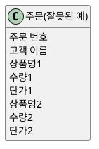

- 상품이 늘면 **속성을 추가**해야 한다.
- `상품명1`·`단가1`의 묶음을 **이름의 숫자**로만 표현한다.
- 반복되는 속성 묶음은 **숨은 개념**의 신호다.

**강사 노트**

- 고객 이름을 주문에 담으면 고객과 주문의 생애가 섞인다. "상품별 판매 수량" 같은 질문에도 모델이 답하지 못한다.

---

## 32. 주문과 주문 항목

**다이어그램 — 클래스 다이어그램**

반복되는 묶음을 **주문 항목**으로 분리하면 "한 주문에 여러 상품"이 **구조**로 드러난다.

**도식 — PlantUML**

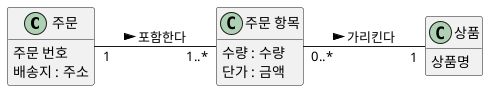

- **주문 항목** — 이 주문에서 이 상품을 **몇 개, 얼마에** 샀는가. 주문도 상품도 아닌 **둘 사이의 사실**이다.

**강사 노트**

- "주문 1 : 주문 항목 1..*"는 다중성에서 다룬 질문이 실제로 **모델 구조를 바꾸는 지점**이다.

---

## 33. 연관 클래스

**다이어그램 — 클래스 다이어그램**

주문과 상품은 **다대다**다. 선 하나로는 수량·단가를 둘 곳이 없다.

- 수량은 주문의 속성도, 상품의 속성도 아니다. **"이 주문–이 상품" 관계**에 속한다.

**도식 — PlantUML**

```plantuml:class
@startuml
hide empty methods
left to right direction
class "주문" as Order
class "상품" as Product
Order "0..*" -- "1..*" Product : 주문된다 <
@enduml
```

**페이지 분할**

관계 자체가 정보를 가지면 **연관 클래스**(Association Class)로 표현한다.

- "다대다는 중간 클래스로 푼다"를 암기하지 않는다. **관계에 정보가 있는지** 먼저 본다.

**도식 — PlantUML**

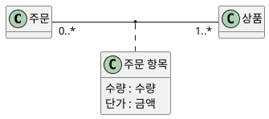

**강사 노트**

- 주문 항목을 독립 개념으로 둔 「32. 주문과 주문 항목」과 의미가 같다.
- UML 연관 클래스는 한 쌍의 인스턴스 사이에 인스턴스가 하나다. 같은 주문에 같은 상품이 두 줄(예: 다른 옵션) 들어갈 수 있다면 독립 개념이 더 정확하다. 확인 질문으로 남긴다.
- 연결 테이블은 저장 구조의 결과일 수 있지만 판단의 근거는 아니다.

---

## 34. 명세 개념

**다이어그램 — 클래스 다이어그램**

명세 개념(Specification Concept)은 **설명 정보**를 담아 **개별 실물**과 구분한다. 실물이 모두 사라져도 설명은 남는다.

**도식 — PlantUML**

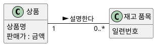

- **필요할 때** — 재고가 0이어도 상품 정보를 보여주거나, 일련번호별로 추적해야 할 때
- **현재 모델** — 개별 실물 추적 요구가 없으므로 **상품만** 둔다.

**강사 노트**

- 근거: Larman, 2nd ed., Chapter 10, "Specification or Description Conceptual Classes". 이 사례의 상품은 이미 명세 개념이다. 개별 실물 요구가 확인될 때 재고 품목을 추가한다(「53. 모델의 유용성」). 이 사례에서 재고는 **상품 시스템**이 소유하므로 주문 시스템의 모델에는 두지 않는다.

---

## 35. 현재 값과 확정 값

**다이어그램 — 클래스 다이어그램**

같은 이름의 정보라도 **지금의 값을 참조**하는지, **특정 시점에 확정되어 보존**되는지에 따라 속한 개념이 다르다.

- 판매가가 내일 바뀌면 **어제 주문의 금액**도 바뀌어야 하는가? 아니라면 주문 쪽에 **확정 값**으로 보존한다.

| 정보 | 현재 값 | 확정 값 |
|---|---|---|
| 가격 | 상품의 **판매가** | 주문 항목의 **단가** |
| 주소 | 고객의 **기본 주소** | 주문의 **배송지** |

**강사 노트**

- 참조만 두면 과거 사실이 조용히 바뀐다. 배송지 변경은 **특정 주문의 배송지**를 바꾸는 목표이며 고객 기본 주소 변경과 다르다. 두 정보를 분리해야 이 차이를 모델로 설명할 수 있다.

---

## 36. 같은 구조, 다른 의미

구조가 같아도 **의미와 생애가 다르면 다른 개념**이다. 장바구니 항목과 주문 항목은 모두 "상품과 수량"을 가진다.

| 구분 | 장바구니 항목 | 주문 항목 |
|---|---|---|
| 의미 | 사려는 **의도** | 성립한 **거래** |
| 가격 | 현재 판매가 **참조** | 주문 시점 단가 **확정** |
| 변경 | 자유롭게 바꾼다 | 임의로 바꿀 수 없다 |
| 생애 | 주문하면 비워진다 | 기록으로 남는다 |

**강사 노트**

- "선택된 상품"과 "주문된 상품"을 같은 말로 쓰면 이 차이가 사라진다.
- 구조가 같다고 하나의 개념이나 공통 부모로 합치고 싶은 유혹이 있다. 코드 재사용은 설계 판단이며, 도메인 모델에서는 의미와 규칙이 같은지로 판단한다(「37. 일반화」).

---

## 37. 일반화

**다이어그램 — 클래스 다이어그램**

일반화(Generalization)는 특수 개념이 일반 개념의 **한 종류**이고 일반 개념의 정의가 **모두 적용될 때** 쓴다.

**도식 — PlantUML**

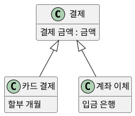

- **쓸 때** — "카드 결제는 결제의 한 종류"가 성립하고 고유한 속성·규칙이 있다.
- **쓰지 않을 때** — 차이가 값 하나뿐이면 `결제 수단` 속성으로 충분하다.

**강사 노트**

- 결제 수단별 속성은 **교육용 가정**이다. 현재 요구는 결제 수단별 차이를 요구하지 않으므로 종합 모델에 넣지 않는다.
- 의미 근거: OMG [UML 2.5.1](https://www.omg.org/spec/UML/2.5.1/PDF), §9.9.7.1 — 특수 분류자의 모든 인스턴스는 일반 분류자의 인스턴스이기도 하다.

---

## 38. 전체와 부분

**다이어그램 — 클래스 다이어그램**

전체–부분 관계는 **표기보다 의미가 먼저**다. 부분이 전체와 **소속과 생애**를 공유하는지 먼저 확인한다.

**인용문**

"집합(속 빈 마름모)은 일반 연관 이상의 의미가 없다. Jim Rumbaugh의 말대로 **모델링 위약**이다", "aggregation (white diamond) has no semantics beyond that of a regular association. It is, as Jim Rumbaugh puts it, a modeling placebo.", Martin Fowler, 2003

- **합성**(Composition) — 부분은 한 시점에 **하나의 전체**에만 속하고 생애를 함께한다.
- **질문** — 주문 항목은 주문 없이 의미가 있는가? 여러 주문에 속할 수 있는가?
- 답이 분명하면 합성, 불분명하면 **일반 연관**으로 두고 질문을 남긴다.

**도식 — PlantUML**

```plantuml:class
@startuml
hide empty methods
left to right direction
class "주문" as Order
class "주문 항목" as OrderItem
Order "1" *-- "1..*" OrderItem : 포함한다 >
@enduml
```

**강사 노트**

- 합성 의미 근거: OMG [UML 2.5.1](https://www.omg.org/spec/UML/2.5.1/PDF), §9.5.3. 같은 절은 합성의 정확한 생애 의미를 의도적으로 명세하지 않는다. 도메인 모델의 "삭제"는 소프트웨어 객체 삭제가 아니라 업무 생애의 결합으로 읽는다.
- 인용 근거: Martin Fowler, [AggregationAndComposition](https://martinfowler.com/bliki/AggregationAndComposition.html), 2003-05-17. Rumbaugh의 말은 Fowler의 글에서 재인용했다. 집합 표기는 쓰지 않는다.

---

## 39. 제약

**다이어그램 — 클래스 다이어그램**

제약(Constraint)은 **어느 시점에나 참이어야 하는 조건**이다. 모델에는 `{수량은 1 이상}`처럼 **중괄호 메모**로 붙인다. 시점·사건에 따라 허용이 달라지는 규칙은 **상태 전이 규칙**이다.

- **정적 제약**
  - 주문 항목의 **수량은 1 이상**이다.
  - **주문 총액**은 주문 항목의 수량 × 단가 합계다.
  - **환불 금액**은 결제 금액을 넘지 않는다.
- **상태 전이 규칙**
  - **배송 시작 이후**에는 주문을 취소할 수 없다.
  - **출고 전**에만 배송지를 변경할 수 있다.

**강사 노트**

- 제약은 필요하면 `{수량은 1 이상}`처럼 중괄호 메모로 모델에 붙인다. OCL 같은 형식 언어는 이 과정의 범위가 아니다.
- 상태 전이 규칙은 정적 모델에 억지로 넣지 않고 "04. 동적 모델 — 상호작용과 상태"로 넘긴다.

---

## 40. 용어 정렬

모델의 이름은 **문제영역에서 이미 쓰는 말**이어야 한다. 용어가 흔들리면 모델도 흔들린다.

**인용문**

"지도 제작자처럼 도메인 모델을 만든다. 그 영역에서 **이미 쓰는 이름**을 사용하고, 무관한 것은 빼고, 없는 것은 더하지 않는다", "Make a domain model in the spirit of how a cartographer or mapmaker works: Use the existing names in the territory. Exclude irrelevant features. Do not add things that are not there.", Craig Larman, 2002

**인용문**

"언어가 바뀌면 곧 **모델이 바뀐** 것임을 인식한다", "Recognize that a change in the language is a change to the model.", Eric Evans, 2015

- "배송 시작"을 "출고"로 바꾸자는 제안은 단어 교체가 아니라 **상태 경계의 변경**일 수 있다.

**강사 노트**

- 인용 근거: Larman, 2nd ed., Chapter 10, "The Mapmaker"; Eric Evans, [DDD Reference](https://www.domainlanguage.com/wp-content/uploads/2016/05/DDD_Reference_2015-03.pdf), 2015, "Ubiquitous Language".
- 적용 예: 현업이 "주문 상품"이라 부르면 개발자가 만든 `OrderLine`을 강요하지 않는다. 현재 요구와 무관한 포장재는 빼고, 확인되지 않은 "주문 승인" 단계는 만들지 않는다.
- Evans의 문장은 공통 언어 원칙의 일부다. 여기서는 "용어와 모델은 함께 바뀐다"만 쓴다. 공통 언어의 본격 논의는 "13. OOAD에서 전문영역으로 — Architecture · DDD · MSA"에서 다룬다.

---

## 41. 동의어와 동음이의어

**같은 것을 다르게 부르는 말**과 **다른 것을 같게 부르는 말**을 찾는다.

- **동의어**
  - 주문 항목 / 주문 상품 / 주문 라인 → 같은 개념이면 **이름 하나로**
  - 배송 시작 / 출고 → 같다고 **가정하지 않고** 확인한다
- **동음이의어**
  - **취소** — 주문 취소 / 결제 취소 / 환불
  - **주문** — 주문하는 행위 / 주문 기록
  - **가격** — 판매가 / 단가 / 결제 금액

**강사 노트**

- 동음이의어를 두면 "취소되면 환불된다"처럼 서로 다른 사실이 한 단어에 섞인다. 모델에서는 다른 이름·요소로 분리한다.
- 결제 취소와 환불의 실제 구분은 결제 시스템·계약에 따라 다를 수 있다. 여기서는 용어가 다른 사실을 가리킬 수 있음을 보이는 예다.

---

## 42. 용어집

용어집(Glossary)은 모델의 이름이 **무엇을 뜻하는지** 문장으로 고정한다. 모델과 **함께 정제**한다.

| 용어 | 정의 | 확인 질문 |
|---|---|---|
| **주문** | 고객이 상품 구매를 요청해 성립한 거래 | 결제 전 주문도 주문인가? |
| **주문 항목** | 한 주문에서 한 상품을 얼마에 몇 개 샀는가 | 같은 상품이 두 줄 가능한가? |
| **단가** | 주문 시점에 확정된 가격 | 할인은 반영되는가? |
| **배송지** | 이 주문을 보낼 주소 | 기본 주소와 어떻게 다른가? |
| **주문 상태** | 주문의 현재 단계 값 | 배송 시작과 출고는 다른가? |
| **환불** | 결제된 금액의 반환 | 부분 환불이 있는가? |

**강사 노트**

- 정의 열은 교육용 초안이다. 요구 분석에서 시작한 용어를 이어서 정제한다. 확인 질문 열이 비어 있지 않다는 것이 용어집이 살아 있다는 증거다.

---

## 43. 모델 작성 절차

개념적 도메인 모델은 **후보 → 구분 → 관계 → 정렬 → 검토**를 반복하며 만든다.

1. 현재 반복의 **유스케이스와 사후조건**을 정한다.
2. **개념 범주와 어휘**로 후보를 모은다.
3. **개념·속성·해결책 요소·제외 대상**으로 구분한다.
4. **연관·다중성**, **속성·제약**을 추가한다.
5. **용어집**과 맞추고 **시나리오**와 교차검토한다.

**도식 — Mermaid**

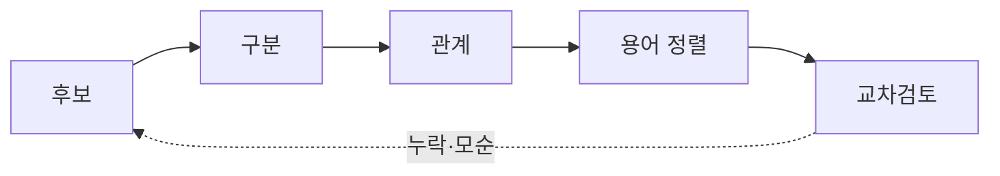

**강사 노트**

- 근거: Larman, 2nd ed., Chapter 10 — 후보 목록, 모델 그리기, 연관 추가, 속성 추가의 흐름과 반복 정제. 위 목록은 용어 정렬과 교차검토를 더한 수업용 절차이며 고정 순서가 아니다.

---

## 44. 도메인 모델 — 초안

**다이어그램 — 클래스 다이어그램**

초안은 **개념과 연관**만으로 문제영역의 구조를 먼저 합의한다. 속성과 다중성은 아직 넣지 않는다.

- 구분한 개념 사이에서 **기억할 가치가 있는 관계**만 이름 있는 연관으로 잇는다.
- 업무 담당자와 "고객이 주문을 한다"처럼 **문장으로 읽으며** 확인한다.

**도식 — PlantUML**

```plantuml:class
@startuml
hide empty members
left to right direction
class "고객" as Customer
class "장바구니" as Cart
class "장바구니 항목" as CartItem
class "상품" as Product
class "주문" as Order
class "주문 항목" as OrderItem
class "결제" as Payment
class "환불" as Refund
class "배송" as Delivery
Customer -- Cart : 가진다 >
Cart -- CartItem : 담는다 >
CartItem -- Product : 가리킨다 >
Customer -- Order : 주문한다 >
Order -- OrderItem : 포함한다 >
OrderItem -- Product : 가리킨다 >
Order -- Payment : 결제된다 <
Payment -- Refund : 환불된다 <
Order -- Delivery : 배송된다 <
@enduml
```

**페이지 분할**

### 초안과 코드

개념은 **클래스**, 연관은 **참조**가 된다. 모델에 없는 **방향**(누가 누구를 아는가)과 컬렉션은 코드가 정한다.

**도식 — PlantUML**

```plantuml:class
@startuml
hide empty members
left to right direction
class "고객" as Customer
class "장바구니" as Cart
class "장바구니 항목" as CartItem
class "상품" as Product
class "주문" as Order
class "주문 항목" as OrderItem
class "결제" as Payment
class "환불" as Refund
class "배송" as Delivery
Customer -- Cart : 가진다 >
Cart -- CartItem : 담는다 >
CartItem -- Product : 가리킨다 >
Customer -- Order : 주문한다 >
Order -- OrderItem : 포함한다 >
OrderItem -- Product : 가리킨다 >
Order -- Payment : 결제된다 <
Payment -- Refund : 환불된다 <
Order -- Delivery : 배송된다 <
@enduml
```

```java
class 고객 { 장바구니 장바구니; }
class 장바구니 { List<장바구니항목> 항목들; }
class 장바구니항목 { 상품 상품; }
class 상품 {}
class 주문 { 고객 고객; List<주문항목> 항목들; 결제 결제; 배송 배송; }
class 주문항목 { 상품 상품; }
class 결제 { 환불 환불; }
class 환불 {}
class 배송 {}
```

**강사 노트**

- 방향·컬렉션은 **설계의 결정**이다. 코드에서 정한 방향을 모델로 되돌려 그리지 않는다. 코드는 연관이 있다는 사실만 옮겼고 다중성·규칙은 아직 보장하지 않는다.

- "02. 요구 분석과 유스케이스"의 유스케이스 다이어그램을 초안에서 상세화로 발전시킨 것과 같은 방식이다. 초안에서 구조를 합의하고, 상세화에서 규칙(속성 도메인·다중성·합성)을 드러낸다.
- 초안 단계에서 속성·다중성을 서둘러 채우면 구조에 대한 합의보다 세부 논쟁이 먼저 시작된다.

---

## 45. 도메인 모델 — 상세화

**다이어그램 — 클래스 다이어그램**

초안에 **속성과 속성 도메인, 다중성, 합성, 파생 속성**을 더해 요구 산출물(명세서·정제된 SSD·계약)에 답할 수준까지 상세화한 주문 시스템의 **개념적 도메인 모델**(Conceptual Domain Model)이다.

**도식 — PlantUML**

```plantuml:class
@startuml
hide empty methods
left to right direction
class "고객" as Customer {
  이름
}
class "주문" as Order {
  주문 번호
  주문 일시 : 일시
  주문 상태 : 주문 상태
  배송지 : 주소
  / 주문 총액 : 금액
}
class "주문 항목" as OrderItem {
  수량 : 수량
  단가 : 금액
}
class "상품" as Product {
  상품명
  판매가 : 금액
}
class "결제" as Payment {
  결제 금액 : 금액
}
class "환불" as Refund {
  환불 금액 : 금액
}
class "장바구니" as Cart
class "장바구니 항목" as CartItem {
  수량 : 수량
}
class "배송" as Delivery {
  배송 번호
  배송 상태 : 배송 상태
}
Customer "1" -- "0..1" Cart : 가진다 >
Cart "1" *-- "0..*" CartItem : 담는다 >
CartItem "0..*" -- "1" Product : 가리킨다 >
Customer "1" -- "0..*" Order : 주문한다 >
Order "1" *-- "1..*" OrderItem : 포함한다 >
OrderItem "0..*" -- "1" Product : 가리킨다 >
Order "1" -- "0..1" Payment : 결제된다 <
Payment "1" -- "0..1" Refund : 환불된다 <
Order "1" -- "0..1" Delivery : 배송된다 <
@enduml
```

**페이지 분할**

### 모델을 문장으로 읽기

- 고객은 주문을 **0개 이상** 하고, 모든 주문에는 고객이 **한 명** 있다.
- 주문은 주문 항목을 **하나 이상** 포함하며, 주문 항목은 **주문 시점 단가**를 보존한다.
- 주문은 결제가 **없거나 하나**, 결제는 환불이 **없거나 하나** 있다.
- 장바구니 항목은 판매가를 **참조**만 한다. 주문은 배송이 **없거나 하나** 있다.

### 의도적으로 넣지 않은 것

- **재고** — 상품 시스템, **입금·영수증** — 회계 시스템이 소유한다
- **외부 시스템** — 지원 액터이며 결제·배송 기록과 다르다
- **결제 수단** — 현재 요구에 불필요
- **오퍼레이션·저장 키·화면** — 구현 요소

**페이지 분할**

### 속성 도메인과 코드

속성 도메인은 **속성의 타입**이 된다. 모델의 `수량 : 수량`은 주문 항목의 필드 `수량 수량`이고, 규칙은 그 타입이 **만들어질 때마다** 검사한다.

**도식 — PlantUML**

```plantuml:class
@startuml
hide empty methods
left to right direction
class "주문" as Order {
  주문 상태 : 주문 상태
  배송지 : 주소
  / 주문 총액 : 금액
}
class "주문 항목" as OrderItem {
  수량 : 수량
  단가 : 금액
}
class "상품" as Product {
  상품명
  판매가 : 금액
}
class "결제" as Payment {
  결제 금액 : 금액
}
class "환불" as Refund {
  환불 금액 : 금액
}
Order "1" *-- "1..*" OrderItem : 포함한다 >
OrderItem "0..*" -- "1" Product : 가리킨다 >
Order "1" -- "0..1" Payment : 결제된다 <
Payment "1" -- "0..1" Refund : 환불된다 <
note bottom of OrderItem : {수량은 1 이상}
note bottom of Refund : {환불 금액 ≤ 결제 금액}
@enduml
```

```java
record 수량(int 값) {
    수량 { 규칙.확인(값 >= 1, "수량은 1 이상"); }
}
record 금액(int 원) {
    금액 { 규칙.확인(원 >= 0, "금액은 0 이상"); }
    // ... 더한다·곱한다 생략
}
record 주소(String 값) {}
enum 주문상태 { 결제대기, 결제완료, 배송중, 배송완료, 취소됨 }

final class 주문항목 {
    private final 상품 상품;
    private final 수량 수량;
    private final 금액 단가;

    주문항목(상품 상품, 수량 수량, 금액 단가) {
        this.상품 = 상품;
        this.수량 = 수량;
        this.단가 = 단가;
    }
    금액 금액() { return 단가.곱한다(수량); }
}
```

**페이지 분할**

### 다중성·합성과 코드

**합성**·`1..*`·**확정 값**·**파생 속성**이 코드에서 드러나는 모습이다.

**도식 — PlantUML**

```plantuml:class
@startuml
hide empty methods
left to right direction
class "주문" as Order {
  주문 상태 : 주문 상태
  배송지 : 주소
  / 주문 총액 : 금액
}
class "주문 항목" as OrderItem {
  수량 : 수량
  단가 : 금액
}
class "상품" as Product {
  상품명
  판매가 : 금액
}
class "결제" as Payment {
  결제 금액 : 금액
}
class "환불" as Refund {
  환불 금액 : 금액
}
Order "1" *-- "1..*" OrderItem : 포함한다 >
OrderItem "0..*" -- "1" Product : 가리킨다 >
Order "1" -- "0..1" Payment : 결제된다 <
Payment "1" -- "0..1" Refund : 환불된다 <
note bottom of OrderItem : {수량은 1 이상}
note bottom of Refund : {환불 금액 ≤ 결제 금액}
@enduml
```

```java
final class 상품 {
    final String 상품명;
    금액 판매가;

    상품(String 상품명, 금액 판매가) {
        this.상품명 = 상품명;
        this.판매가 = 판매가;
    }
}

final class 주문 {
    final 고객 고객;
    final List<주문항목> 항목들 = new ArrayList<>();
    주소 배송지;
    주문상태 상태 = 주문상태.결제대기;
    Optional<결제> 결제 = Optional.empty();

    주문(고객 고객, Map<상품, 수량> 담은것, 주소 배송지) {
        규칙.확인(!담은것.isEmpty(), "주문 항목은 1개 이상");
        this.고객 = 고객;
        this.배송지 = 배송지;
        담은것.forEach((상품, 수량) ->
                항목들.add(new 주문항목(상품, 수량, 상품.판매가)));
    }

    금액 주문총액() {
        금액 합계 = new 금액(0);
        for (주문항목 항목 : 항목들) 합계 = 합계.더한다(항목.금액());
        return 합계;
    }
}
```

**페이지 분할**

### 제약과 코드

두 값을 함께 보는 **제약** `{환불 금액 ≤ 결제 금액}`은 그 값을 가진 **환불**이 만들어질 때 검사한다.

**도식 — PlantUML**

```plantuml:class
@startuml
hide empty methods
left to right direction
class "주문" as Order {
  주문 상태 : 주문 상태
  배송지 : 주소
  / 주문 총액 : 금액
}
class "주문 항목" as OrderItem {
  수량 : 수량
  단가 : 금액
}
class "상품" as Product {
  상품명
  판매가 : 금액
}
class "결제" as Payment {
  결제 금액 : 금액
}
class "환불" as Refund {
  환불 금액 : 금액
}
Order "1" *-- "1..*" OrderItem : 포함한다 >
OrderItem "0..*" -- "1" Product : 가리킨다 >
Order "1" -- "0..1" Payment : 결제된다 <
Payment "1" -- "0..1" Refund : 환불된다 <
note bottom of OrderItem : {수량은 1 이상}
note bottom of Refund : {환불 금액 ≤ 결제 금액}
@enduml
```

```java
final class 결제 {
    private final 금액 결제금액;

    결제(금액 결제금액) { this.결제금액 = 결제금액; }
    금액 결제금액() { return 결제금액; }
}

final class 환불 {
    private final 결제 결제;
    private final 금액 환불금액;

    환불(결제 결제, 금액 환불금액) {
        규칙.확인(환불금액.원() <= 결제.결제금액().원(),
                "환불 금액 ≤ 결제 금액");
        this.결제 = 결제;
        this.환불금액 = 환불금액;
    }
}
```

**페이지 분할**

### 규칙에서 테스트로

「39. 제약」의 규칙과 확정 값의 예가 곧 **테스트**다.

**도식 — PlantUML**

```plantuml:class
@startuml
hide empty methods
left to right direction
class "주문" as Order {
  주문 상태 : 주문 상태
  배송지 : 주소
  / 주문 총액 : 금액
}
class "주문 항목" as OrderItem {
  수량 : 수량
  단가 : 금액
}
class "상품" as Product {
  상품명
  판매가 : 금액
}
class "결제" as Payment {
  결제 금액 : 금액
}
class "환불" as Refund {
  환불 금액 : 금액
}
Order "1" *-- "1..*" OrderItem : 포함한다 >
OrderItem "0..*" -- "1" Product : 가리킨다 >
Order "1" -- "0..1" Payment : 결제된다 <
Payment "1" -- "0..1" Refund : 환불된다 <
note bottom of OrderItem : {수량은 1 이상}
note bottom of Refund : {환불 금액 ≤ 결제 금액}
@enduml
```

```java
class 도메인모델테스트 {
    public static void main(String[] args) {
        var 펜 = new 상품("펜", new 금액(1000));
        var 주문 = new 주문(new 고객("김"), Map.of(펜, new 수량(2)), new 주소("서울"));
        확인(주문.주문총액().equals(new 금액(2000)));

        펜.판매가 = new 금액(1500);
        확인(주문.주문총액().equals(new 금액(2000)));

        거절(() -> new 수량(0));
        거절(() -> new 주문(new 고객("김"), Map.of(), new 주소("서울")));
        거절(() -> new 환불(new 결제(new 금액(2000)), new 금액(3000)));
        System.out.println("정적 모델 규칙 확인");
    }
    // ... 확인·거절 생략
}
```

**강사 노트**

- 결제–환불 `0..1`은 전체 취소·전액 환불 전제에 한정된 교육용 가정이다(「55. 누락과 모순」).
- **배송**은 주문 시스템이 배송 시스템에 요청한 배송의 **기록**이다(배송 번호로 배송 현황을 조회한다). 출고·배송의 진행은 배송 시스템이 소유한다. **상품**의 원천도 상품 시스템이며, 주문 시스템은 주문에 필요한 상품 정보만 가진다.
- 개념(주문·주문 항목·상품·결제·환불)은 **필드와 생성자를 가진 `class`**로, 데이터 타입(금액·수량·주소)은 **`record`**로 옮겼다. 필드가 곧 모델의 속성·연관이다.
- 속성 도메인과 코드 — `record`는 값을 담는 자바 클래스이고, `수량 { … }`은 값이 만들어질 때마다 실행되는 생성자다. 그래서 수량이 0인 `수량`은 존재할 수 없고, 그 타입을 필드로 가진 주문 항목도 잘못된 수량을 가질 수 없다. 규칙을 속성마다 검사하지 않고 **값의 종류 한 곳**에 둔다(DRY). `{환불 금액 ≤ 결제 금액}`처럼 두 값을 함께 보는 제약은 그 값을 가진 개념(환불)이 지킨다.
- 다중성·합성과 코드 — 합성은 주문이 주문 항목을 **만드는** 것, `1..*`는 빈 주문의 **거절**, 확정 값은 판매가를 단가로 **옮겨 적는** 것, 파생 속성은 **저장하지 않는 계산**으로 드러난다.
- 코드가 **보장하는 것** — 수량 1 이상, 금액 0 이상, 빈 주문 거절, 주문 시점의 단가, 환불 금액 ≤ 결제 금액. **보장하지 않는 것** — 상태 전이(결제 대기 → 결제 완료 …)와 배송 시작 후 취소 금지. 이것은 "04. 동적 모델 — 상호작용과 상태"의 상태 기계가 다룬다.
- `Optional`·`Map`·참조의 방향은 코드의 결정이다. 모델로 역수입하지 않는다. 코드는 `code/s03/상세.java`에서 발췌했으며, 그 파일을 컴파일·실행해 확인한다.
- 모델을 문장으로 읽는 것이 가장 싼 검토다. 업무 담당자가 듣고 "아니다"라고 할 수 있어야 한다.

---

## 46. 개념의 묶음 — 패키지

도메인 모델이 커지면 관련 개념을 **패키지**로 묶어 읽기 쉽게 한다. 패키지는 개념을 담는 이름 있는 묶음이다.

**도식 — SVG**

```svg
<svg xmlns="http://www.w3.org/2000/svg" width="1000" height="230" viewBox="0 0 1000 230" role="img" aria-label="패키지 다이어그램 표기: 패키지, 포함, 의존">
<style>text{font-family:sans-serif;font-size:20px;fill:#000;text-anchor:middle}.p{fill:#fff;stroke:#181818;stroke-width:2}.c{fill:#fff;stroke:#181818;stroke-width:2}</style>
<rect width="1000" height="230" fill="#fff"/>
<path class="p" d="M60,40 L140,40 L140,58 L60,58 Z"/><rect class="p" x="60" y="58" width="190" height="90"/><text x="155" y="110">주문</text>
<path class="p" d="M360,22 L450,22 L450,48 L360,48 Z"/><rect class="p" x="360" y="48" width="260" height="110"/><text x="405" y="42" style="font-size:18px">주문</text>
<rect class="c" x="380" y="80" width="100" height="44" rx="4"/><text x="430" y="108" style="font-size:18px">주문</text>
<rect class="c" x="500" y="80" width="100" height="44" rx="4"/><text x="550" y="108" style="font-size:18px">주문 항목</text>
<path class="p" d="M700,40 L760,40 L760,58 L700,58 Z"/><rect class="p" x="700" y="58" width="90" height="70"/><text x="745" y="100" style="font-size:18px">주문</text>
<path class="p" d="M880,40 L940,40 L940,58 L880,58 Z"/><rect class="p" x="880" y="58" width="90" height="70"/><text x="925" y="100" style="font-size:18px">상품</text>
<line x1="790" y1="93" x2="870" y2="93" stroke="#1B3A6B" stroke-width="3" stroke-dasharray="10,7"/><path d="M856,83 L874,93 L856,103" fill="none" stroke="#1B3A6B" stroke-width="3"/>
<text x="155" y="200">패키지</text><text x="490" y="200">포함 — 개념을 묶는다</text><text x="835" y="200">의존</text>
</svg>
```

### 표기와 사용법

| 표기 | 의미 | 이렇게 쓴다 |
|---|---|---|
| **패키지** — 탭이 달린 폴더 | 개념의 이름 있는 묶음 | 업무 의미로 이름 짓는다(주문, 결제) |
| **포함** | 패키지 안에 개념을 둔다 | 한 개념은 한 패키지에만 둔다 |
| **의존** — 점선 화살표 | 한 패키지가 다른 패키지의 개념을 쓴다 | 경계를 넘는 연관만 본다 |

**페이지 분할**

주문 도메인의 개념을 업무 의미로 묶은 **분석 패키지**다.

- 묶는 기준은 **업무 의미**다. 화면·서비스·DB 같은 기술 계층으로 묶지 않는다.
- 패키지 경계를 **넘는 연관**이 경계와 의존성 방향을 판단하는 단서다.

**도식 — PlantUML**

```plantuml:package
@startuml
hide empty members
left to right direction
package "고객" {
  class "고객" as Customer
}
package "장바구니" {
  class "장바구니" as Cart
  class "장바구니 항목" as CartItem
}
package "주문" {
  class "주문" as Order
  class "주문 항목" as OrderItem
}
package "상품" {
  class "상품" as Product
}
package "결제" {
  class "결제" as Payment
  class "환불" as Refund
}
package "배송" {
  class "배송" as Delivery
}
Customer -- Cart
Cart *-- CartItem
CartItem -- Product
Customer -- Order
Order *-- OrderItem
OrderItem -- Product
Order -- Payment
Payment -- Refund
Order -- Delivery
@enduml
```

**강사 노트**

- 이 세션은 패키지의 표기와 개념 묶음까지만 다룬다. 패키지를 경계로 판단하고 의존성 방향을 정하는 일은 "05. 구조적 경계와 의존성"에서 다룬다. 의존 화살표는 그때 쓴다.
- 패키지는 주문 시스템 **안의** 개념 묶음이다. 상품·배송 패키지의 개념은 외부 시스템의 정보를 주문 시스템 쪽에서 기억하는 것이다.
- 표기 기준: OMG [UML 2.5.1](https://www.omg.org/spec/UML/2.5.1/PDF), §12 Packages.
- 패키지 사이 의존 방향의 판단은 "05. 구조적 경계와 의존성"에서 한다.

---

## 47. 잘못된 관행 — 분석 과잉

분석에 오랜 기간을 쓰지만 **분석의 본질**을 외면하는 경우가 많다. 기간이 길고 문서가 많다고 분석이 된 것은 아니다.

### 증상

- 수개월의 분석 단계, **수백 쪽의 문서**와 다이어그램
- 정작 **핵심 개념·관계·속성 규칙**은 모호하다. 제대로 된 **데이터 모델**도 없다.
- 분석 회의의 상당 부분이 프레임워크·아키텍처·화면·인프라 같은 **기술 요소**다.
- 고객과 **무엇을 할지**(이벤트·목표·규칙)는 합의하지 못했다.

### 되돌아볼 질문

- 고객과 합의한 **이벤트와 목표 목록**이 있는가?
- **핵심 개념·관계·속성 도메인**이 모델에 있는가?
- 분석 산출물에서 **기술 요소**가 차지하는 비중은 얼마인가?
- 지금 분석을 더 하면 **다음 판단이 달라지는가**?

**강사 노트**

- 분석을 줄이자는 것이 아니다. 분석 시간을 **고객과 무엇을 할지 정하는 데** 쓰자는 것이다.
- 좋은 데이터 모델은 분석의 가장 확실한 산출물 중 하나다(「13. 데이터 모델과 도메인 모델」).
- 기술 요소의 검토가 필요 없다는 뜻은 아니다. 기술 불확실성은 스파이크·개념 증명으로 따로 줄인다("02. 요구 분석과 유스케이스"의 「14. 업무·기술 불확실성」).

---

## 48. 잘못된 관행 — 구현 요소

**다이어그램 — 클래스 다이어그램**

도메인 모델에 **구현 결정**이 섞이면 문제영역의 의미가 해결책에 가려진다. 물리 데이터 모델의 요소(대리 키·외래키·컬럼 타입)도 여기에 속한다.

**도식 — PlantUML**

```plantuml:class
@startuml
left to right direction
class "주문DTO(잘못된 예)" as OrderDto {
  주문ID : Long
  고객ID : Long
  상태코드 : String
  취소()
}
class "주문Repository(잘못된 예)" as OrderRepository {
  저장()
}
OrderDto --> OrderRepository
@enduml
```

- **메서드** `취소()` → 책임 배치는 설계에서
- **키** `주문ID`·`고객ID` → 업무 식별자와 연관으로
- **타입** `Long`·`String` → 금액·주문 상태 같은 값의 종류로
- **구조 요소** DTO·Repository, **의존 화살표** → 넣지 않는다

**강사 노트**

- 잘못된 예는 실무에서 「07. 도메인 모델」이라는 이름으로 흔히 공유되는 코드 구조 그림이다. 책임 배치는 "07. 책임·협력·계약", 설계 모델로의 비기계적 전환은 "06. 분석 모델에서 설계 모델로"에서 다룬다. 구현 요소를 빼는 것은 설계를 무시하는 것이 아니라 의미를 먼저 합의하기 위해서다.

---

## 49. 잘못된 관행 — 규칙 없는 속성

속성을 숫자·문자열 타입으로만 두면 **속성 수준 업무 규칙**이 모델에서 사라지고, 화면·서비스·DB가 **제각각 다르게 검사**한다.

| 잘못된 예 | 문제 | 바른 예 |
|---|---|---|
| **결제 금액 : 숫자** | 통화·음수·자릿수 규칙이 없다 | 결제 금액 : 금액 |
| 주문 상태 : 문자열 "C" | 가능한 값이 모델에 없다 | 주문 상태 : 주문 상태(값 목록) |
| **배송지 : 문자열** | 필수 구성·형식이 없다 | 배송지 : 주소 |
| **수량 : 정수** | 0·음수 허용 여부를 모른다 | 수량 : 수량 |

**강사 노트**

- 「22. 속성 도메인」과 「24. 규칙의 소유」의 판단을 잘못된 예로 되짚는다. 코드에서 같은 문제를 흔히 "원시 타입 집착"이라고 부른다.

---

## 50. 잘못된 관행 — 관계 남용

관계는 많이 그릴수록 좋은 것이 아니다. **의미 없는 선**은 모델을 읽기 어렵게 만든다.

| 잘못된 예 | 바른 기준 |
|---|---|
| 이름 없는 선 | 연관 이름과 읽는 방향 |
| 가능한 모든 관계를 그린 거미줄 | 알아야 하는 연관을 우선 |
| 추측으로 정한 다중성 | 모르면 질문으로 남김 |
| 습관적인 집합(속 빈 마름모) | 의미가 분명할 때만 합성, 아니면 일반 연관 |
| 구조가 같다는 이유의 일반화 | "~의 한 종류"가 성립할 때만 |
| 연관 대신 상대의 식별 키 속성 | 연관으로 표현 |

**강사 노트**

- 각 기준은 「27. 연관」·「28. 필요한 연관」·「30. 다중성과 업무 규칙」·「38. 전체와 부분」·「37. 일반화」·「26. 참조와 연관」에서 설명했다. 이 topic은 한 장에서 다시 점검하는 목록이다.

---

## 51. 잘못된 관행 — 거대 개념·모호한 이름

개념 하나에 모든 것을 담거나 뜻이 흐린 이름을 쓰면 모델이 **업무 담당자와 대화하지 못한다**.

| 잘못된 예 | 바른 예 |
|---|---|
| "주문"에 결제·배송·환불·고객 정보를 모두 담는다 | 의미와 생애가 다른 개념으로 나눈다 |
| 이름마다 붙는 정보·데이터·관리 | 뜻을 더하지 않는 말은 빼고 업무 이름으로 부른다 |
| 개발자만 쓰는 이름 | 업무 담당자가 쓰는 이름 |
| 주문 상품·주문 항목·주문 라인을 섞어 쓴다 | 용어집에서 하나로 정한다 |

**강사 노트**

- 거대 개념은 「31. 평면 모델」이 커진 형태다. 이름 문제는 「40. 용어 정렬」의 지도 제작자 원칙(이미 쓰는 이름)을 어긴 예다.
- 데이터 모델링에서 조직이 표준으로 정한 명명 규칙(예: 마스터·상세)은 그 조직의 공통 언어일 수 있다. 문제는 규칙 없이 뜻을 더하지 않는 말을 붙이는 경우다.

---

## 52. 잘못된 관행 — 범위·시점

모델의 **범위와 시점**을 잘못 잡으면 그리는 데 시간을 쓰고도 판단에 쓰이지 않는다.

| 잘못된 예 | 바른 예 |
|---|---|
| 전사 모델을 한 번에 그린다 | 현재 반복의 유스케이스가 필요로 하는 범위만 그린다 |
| 확인되지 않은 개념·관계를 그린다 | 그림에 있으면 사실처럼 읽힌다. 질문으로 남긴다 |
| 상태 전이·처리 순서를 섞는다 | 정적 모델에는 존재와 관계만, 사건과 순서는 동적 모델에 둔다 |
| 한 번 그리고 방치한다 | 요구·용어가 바뀌면 모델도 바꾼다 |

**강사 노트**

- 「53. 모델의 유용성」과 「56. 정적 모델의 한계」의 판단을 잘못된 예로 되짚는다.

---

## 53. 모델의 유용성

도메인 모델에 정답 하나가 있는 것은 아니다. **현재의 질문에 답하고 소통을 돕는 정도**로 평가한다.

**인용문**

"도메인 모델은 절대적으로 옳거나 그른 것이 아니라 **더 유용하거나 덜 유용할** 뿐이며, 소통의 도구다", "A domain model is not absolutely correct or wrong, but more or less useful; it is a tool of communication.", Craig Larman, 2002

- **모르면 그리지 않는다** — 그림에 있으면 사실처럼 읽힌다. 확인 질문으로 남긴다.
- **멈출 때** — 요구의 용어가 모두 모델로 설명되고, 남은 질문은 업무 확인으로만 답할 수 있다.

**강사 노트**

- 인용 근거: Larman, 2nd ed., Chapter 10 — POST와 Register 중 어떤 이름을 쓸지 논의하는 부분.
- 모델링의 추가 비용과 위험 감소 판단은 "04. 동적 모델 — 상호작용과 상태"와 "11. 통합 설계와 적정 모델링"에서 다시 다룬다.

---

## 54. 시나리오 교차검토

요구의 **각 문장을 모델 요소로 설명할 수 있는지** 대조한다. ✘와 △는 모델을 고칠 곳이자 **요구에 되물을 질문**이다.

### 주문 취소 — 대안 흐름의 조건

| 요구 문장 | 모델 요소 | 결과 |
|---|---|---|
| 고객 소유의 결제 완료 주문 | 고객–주문, 주문–결제, 주문 상태 | ✔ |
| **배송 시작 전** | 주문 상태 `배송 중` 이전 | △ 배송 시작의 정의 |
| **취소 상태** | 주문 상태 `취소됨` | ✔ |
| **결제 금액 전액 환불** | 결제–환불, 결제 금액·환불 금액 | ✔ |

### 배송지 변경 — 오퍼레이션 계약

| 요구 문장 | 모델 요소 | 결과 |
|---|---|---|
| 고객 소유의 주문 | 고객–주문 | ✔ |
| 출고 전 | ? | ✘ **출고는 배송 시스템이 판단한다** — 물을 것인가, 통보받아 기억할 것인가? |
| 새 주소는 유효하다 | 주소 | △ 유효 조건 미정 |
| 배송지가 새 주소다 | 주문의 `배송지 : 주소` | ✔ |
| 상품·결제 금액은 같다 | 주문 항목–상품, 결제 금액 | ✔ |

**강사 노트**

- 두 요구의 출처와 전제는 「02. 요구와 정적 모델」의 강사 노트와 같다. 배송지 변경의 "추가 요금·세금·배송 방식 변경이 없는 지역"이라는 가정도 유지한다.
- 성공 경로만 대조한다. 실패·동시성 요구는 모델이 보장한다고 추정하지 않는다.

---

## 55. 누락과 모순

발견한 문제는 **모델을 고칠 것**과 **요구에 되물을 것**으로 나눈다. 추측으로 채우지 않는다.

- **확인: 출고 정보** — 출고는 배송 시스템이 소유한다. 주문 시스템이 "출고 전"을 판단하려면 배송 시스템에 **물어야** 하는가, 통보받아 배송 상태로 **기억해야** 하는가?
- **긴장: 부분 취소** — 허용되면 결제–환불은 `0..*`가 되고, 환불이 **어느 주문 항목**의 것인지 알아야 한다.
- **모순: 취소의 의미** — 주문 상태 `취소됨`과 결제 취소·환불이 한 단어에 섞이면 사후조건의 두 사실이 구분되지 않는다.

### 되돌릴 곳

발견은 별도 문서가 아니라 **입력 산출물을 고쳐** 반영한다.

| 발견 | 되돌릴 곳 |
|---|---|
| 출고는 배송 시스템이 판단한다 | 배송지 변경 계약의 사전조건, 정제된 SSD(배송 시스템에 묻는 요청) |
| 부분 취소의 허용 여부 | 유스케이스 명세서의 규칙 |
| "취소"가 주문 취소와 결제 취소를 섞는다 | 명세서·계약의 용어, 용어집 |
| 요구 분석 예시 코드의 `상품.단가`가 판매가와 단가를 섞는다 | 요구 분석의 예시 코드 — 식별자를 용어집에 맞춘다(`상품.판매가`) |

**강사 노트**

- 부분 취소는 "02. 요구 분석과 유스케이스"의 「30. 규칙·제약·예외 정책」에서 허용 조건을 정의할 대상으로 남긴 것이다.
- 모델링에서 발견한 질문은 **요구의 누락**이다. "02. 요구 분석과 유스케이스"의 「09. 반복적 접근」과 연결한다. 출고·배송 시작의 사건 순서는 "04. 동적 모델 — 상호작용과 상태"에서 확인한다.
---

## 56. 정적 모델의 한계

정적 모델은 **무엇이 존재하는지**를 보여줄 뿐, **무엇이 어떤 순서로 일어나는지**는 보여주지 못한다.

- **순서** — 주문 취소에서 시스템과 외부는 어떤 순서로 상호작용하는가?
- **상태 전이** — 주문 상태는 어떤 사건으로 바뀌는가?
- **동시성·실패** — 출고와 취소가 동시에 일어나면? 환불이 실패하면?
- **책임** — 주문 취소를 어떤 객체가 책임지는가?
- **저장** — 주문 정보를 어디에 어떻게 저장하는가?

**강사 노트**

- 순서·상태 전이·동시성·실패는 "04. 동적 모델 — 상호작용과 상태", 책임은 "07. 책임·협력·계약", 저장은 "10. 기술 제약과 도메인 의미 보존"에서 다룬다. 정적 모델에 이 답을 넣으면 존재와 사건이 섞인다.

---

## 57. 실습 — 도메인 모델

요구 분석 실습의 정기배송 요청을 이어서, 이번에는 **정적 의미**를 모델로 만든다.

> “정기배송 고객에게 다음 배송을 건너뛸 수 있는 버튼을 만들어 주세요.” (조건: 48시간 전까지만 가능, 연속 2회 초과 불가, 결제 승인 건 별도 처리, 다음 배송일 안내 필요)

- **과제**
  - (1) 개념·속성·해결책 요소 구분
  - (2) 연관·다중성, 모르는 다중성은 질문으로
  - (3) 속성의 값 종류와 정적 제약
  - (4) 용어집 초안
  - (5) 네 조건을 정적 제약·전이 규칙·질문으로 분류
- **진행** — 개인 작성 → 소그룹 비교 → 모델을 문장으로 읽으며 검토

**페이지 분할**

- **검토 기준**
  - 명사를 **기계적으로** 옮기지 않았는가?
  - 연관에 **이름과 다중성**이 있는가?
  - **현재 값과 확정 값**을 구분했는가?
  - 구현 요소가 없는가?
  - **상태 값과 전이 규칙**을 구분했는가?
  - **미확인 정책**을 질문으로 남겼는가?

**강사 노트**

- 시간 배분은 전체 SA 완성 후 정한다.
- "02. 요구 분석과 유스케이스"의 「57. 실습 — 모델로 바꾸기」에서 정한 유스케이스(정기배송을 관리한다)와 대안 흐름(다음 배송 건너뛰기), 성공 경로 전제를 유지한다.
- 세부 검토 기준(충족 / 보완):
  - 개념 구분 — 정기배송·배송 회차·결제 승인을 구분한다 / "건너뛰기 버튼"을 개념으로 둔다
  - 다중성 — 회차와 결제 승인의 관계를 질문과 함께 제시한다 / 근거 없이 `1`로 확정한다
  - 상태 — 회차 상태 값과 48시간 규칙을 분리한다 / 48시간 조건을 속성이나 개념으로 만든다
  - 제약 — 연속 2회를 판단할 정보(회차 순서·상태)가 있는지 확인한다 / 규칙만 나열한다
  - 구현 요소 — 키·메서드·화면이 없다 / `건너뛰기()`나 `회차ID`가 있다

---

## 58. 실습 — 검토 예시

**다이어그램 — 클래스 다이어그램**

검토 예는 유일한 정답이 아니다. **결제 전·마감 전·연속 제한에 걸리지 않는 고객 본인의 배송 건**이라는 전제를 유지한다.

**도식 — PlantUML**

```plantuml:class
@startuml
hide empty methods
left to right direction
class "고객" as Customer
class "정기배송" as Subscription {
  배송 주기 : 주기
}
class "정기배송 항목" as SubscriptionItem {
  수량 : 수량
}
class "상품" as Product
class "배송 회차" as Delivery {
  회차 번호
  예정 배송일 : 날짜
  회차 상태 : 회차 상태
}
class "결제 승인" as PaymentApproval {
  승인 금액 : 금액
}
Customer "1" -- "0..*" Subscription : 신청한다 >
Subscription "1" *-- "1..*" SubscriptionItem : 포함한다 >
SubscriptionItem "0..*" -- "1" Product : 가리킨다 >
Subscription "1" -- "1..*" Delivery : 예정한다 >
Delivery "1" -- "0..1" PaymentApproval : 승인된다 <
@enduml
```

**페이지 분할**

- **가정** — 회차 상태 `예정`·`건너뜀`·`배송됨`, 회차마다 결제 승인 0..1
- **질문** — 회차마다 주문이 생기는가? 승인된 결제는 어떻게 처리하는가?

| 조건 | 분류 | 모델과의 연결 |
|---|---|---|
| **48시간 전까지** | 전이 규칙 | 예정 배송일 |
| **연속 2회 초과 불가** | 제약·전이 규칙 | 회차 번호·회차 상태 |
| **결제 승인 건** | 확인 질문 | 배송 회차–결제 승인 |
| **다음 배송일 안내** | 파생 정보 | 배송 주기·예정 배송일 |

**강사 노트**

- 추가 질문: 승인된 결제는 취소·환불·이월 중 무엇인가? 연속 횟수는 언제 초기화되는가?
- 건너뛰기를 별도 개념이 아니라 **회차 상태 값**으로 둔 것은 판단의 예다. 사유·요청 일시를 기록해야 하면 별도 개념이 될 수 있다.
- 정기배송 항목의 가격이 신청 시점에 확정되는지도 질문이다(「35. 현재 값과 확정 값」).
- 정기배송–주문 연결을 추측으로 그리지 않은 것이 핵심이다. 질문을 남긴 것을 감점하지 않는다.
- 토론 질문: 왜 이것을 개념(또는 속성)으로 판단했는가? 아직 무엇을 모르는가?

---

## 59. 요약

이 세션은 문제영역의 **개념·속성·관계·제약**을 구현과 분리된 **정적 모델**로 명시하고 시나리오와 교차검토했다.

### 정적 모델의 핵심

- **정적·동적 모델** — 존재·관계는 정적, 사건·전이는 동적. 네 동적 다이어그램은 주문의 상태 기계로 모인다
- **데이터 모델** — 좋은 데이터 모델이 도메인 모델의 출발점
- **속성 규칙** — 속성 도메인으로 명시하고 값의 종류가 소유
- **클래스·관계 유형** — UML 유형(개념 클래스·데이터 타입·열거형, 연관·합성·일반화)과 거래 중심의 도메인 유형
- **모델과 코드** — 속성 도메인은 값의 종류, 규칙 예시는 테스트. 방향·컬렉션은 설계의 결정
- **검토** — 용어 정렬, 교차검토, 분석 과잉 경계

### 다음 세션

- "**04. 동적 모델 — 상호작용과 상태**" — 사건·상호작용·상태 전이로 정적 모델을 검증한다.

**강사 노트**

- 이 세션에서 남긴 "배송 시작과 출고" 질문을 다음 세션의 출발점으로 삼는다.
