--------------------
Session 명: 04. 동적 모델 — 상호작용과 상태
--------------------

## 목차

01. 세션 목표
02. 정적 모델에서 동적 모델로
03. 동적 모델
04. 정적·동적 모델의 상호 검증
05. 사건과 반응
06. 동적 모델의 종류
07. 분석과 설계의 상호작용
08. 프로세스와 동적 분석
09. 정제된 SSD
10. 계약의 정제
11. 상호작용
12. 상호작용 모델의 용도
13. 상호작용에서 발견하는 것
14. 활동 다이어그램
15. 유스케이스와 활동
16. 업무 흐름
17. 이벤트와 활동
18. 활동과 SSD
19. 시퀀스 다이어그램
20. 오퍼레이션에서 상호작용으로
21. 참여 객체와 도메인 모델
22. 연관을 따라 흐르는 메시지
23. 장바구니 담기 시퀀스
24. 주문 생성 시퀀스
25. 결제 시퀀스
26. 주문 취소 시퀀스
27. 시퀀스 다이어그램 조각
28. 커뮤니케이션 다이어그램
29. 시퀀스와 커뮤니케이션
30. 링크와 연관
31. 상태
32. 상태 기계 다이어그램
33. 주문 상태 기계
34. 출고와 배송 시작
35. 가드와 금지된 전이
36. 시간 이벤트
37. 상태 폭증
38. 상태와 불변 조건
39. 교차검토 절차
40. 계약과 정적 모델
41. 상태와 정적 모델
42. 상호작용과 정적 모델
43. 누락과 모순
44. 적정 동적 모델링
45. 잘못된 관행 — 설계 객체 혼입
46. 잘못된 관행 — 정적 모델만 있는 분석
47. 잘못된 관행 — 모든 흐름 그리기
48. 잘못된 관행 — 순서도가 된 활동
49. 잘못된 관행 — 상태 기계 오용
50. 잘못된 관행 — 모델 간 불일치
51. 동적 모델에서 코드로
52. 동적 모델의 한계
53. 실습 — 동적 모델
54. 시퀀스 다이어그램 (안)
55. 커뮤니케이션 다이어그램 (안)
56. 상태 기계 다이어그램 (안)
57. 동적 모델 보완 (안)
58. 요약

## 01. 세션 목표

이 세션은 시나리오의 **시스템 오퍼레이션·상호작용·상태 변화**를 동적 모델로 확인하고, 정적 모델과 **서로 검증**한다.

- 정적 모델과 동적 모델이 **서로를 검증**하는 방식을 설명한다.
- **분석의 상호작용**(도메인 객체)과 **설계의 상호작용**(설계 객체)을 구분한다.
- 요구 분석의 정제된 시스템 시퀀스 다이어그램과 계약을 입력으로, **활동 다이어그램**으로 유스케이스와 시스템 간 흐름을, **시퀀스·커뮤니케이션 다이어그램**으로 도메인 객체의 상호작용을 모델링한다.
- 상태 기계로 사건에 따른 상태 전이와 금지된 전이를 확인하고, 네 다이어그램이 **자바 코드·테스트**로 어떻게 이어지는지 확인한다.
- 동적 모델과 정적 모델을 교차검토해 **누락과 모순**을 찾고, 요구 산출물과 정적 모델에 되돌린다. 필요한 만큼만 모델링한다.

**강사 노트**

- "03. 정적 모델 — 도메인 개념과 관계"가 **무엇이 존재하는가**를 다뤘다면, 이 세션은 **무엇이 일어나는가**를 다룬다. 설계 객체 사이의 책임과 협력은 "07. 책임·협력·계약"에서 다룬다.

---

## 02. 정적 모델에서 동적 모델로

정적 모델은 무엇이 존재하는지 보여주지만, **어떤 순서로 무엇이 바뀌는지**는 보여주지 못한다. "03. 정적 모델 — 도메인 개념과 관계"는 다음 질문을 남겼다.

- **출고와 배송 시작**은 같은 사건인가?
- **주문 상태**는 어떤 사건으로 어떤 값에서 어떤 값으로 바뀌는가?
- **환불이 완료되지 않으면** 주문은 어떤 상태인가?
- 주문 취소에서 시스템과 외부는 **어떤 순서**로 상호작용하는가?

**도식 — Mermaid**

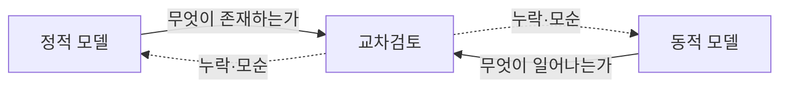

**강사 노트**

- 학습을 위해 요구 분석("02. 요구 분석과 유스케이스")과 정적·동적 분석을 세션으로 나눴지만, 실제로는 요구와 분석을 나누지 않고 함께 반복한다. 질문은 "03. 정적 모델 — 도메인 개념과 관계"의 「57. 누락과 모순」과 「58. 정적 모델의 한계」에서 남긴 것이다. 사례의 전제(결제 완료·배송 시작 전 전체 취소, 출고 전 배송지 변경)는 그대로 유지한다.

---

## 03. 동적 모델

동적 모델(Dynamic Model)은 **무엇이 일어나는지**, 즉 사건과 그에 따른 상호작용·상태 변화를 표현한다.

**인용문**

"사건은 가능한 발생들의 집합이다. 발생은 **시스템에 어떤 결과를 가져오는, 일어나는 무언가**다", "An event describes a set of possible occurrences. An occurrence is something that happens that has some consequence with regard to the system.", Object Management Group, 2017

- 어떤 **사건**이 일어나는가?
- 누가 누구와 어떤 순서로 **상호작용**하는가?
- 사건의 결과로 무엇의 **상태**가 바뀌는가?

**강사 노트**

- 인용 근거: OMG [UML 2.5.1](https://www.omg.org/spec/UML/2.5.1/PDF), §6.3.1. "02. 요구 분석과 유스케이스"에서 요구의 공통 단위로 본 이벤트가 동적 모델의 출발점이다.

---

## 04. 정적·동적 모델의 상호 검증

정적 모델은 **무엇이 존재하는지**, 동적 모델은 **무엇이 일어나는지**를 보여주며 **서로를 검증**한다. 한 모델만으로는 문제영역을 다 볼 수 없다.

**인용문**

"각 모델은 소프트웨어의 **한 측면만** 기술하므로 여러 모델을 함께 써야 할 수 있다", "You potentially need to use multiple models to develop software because each model describes a single aspect of your software.", Scott W. Ambler

| 동적 모델이 정적 모델에 묻는 질문 | 정적 모델이 동적 모델에 묻는 질문 |
|---|---|
| 사건이 바꾸는 대상이 모델에 있는가? | 이 개념은 어떤 사건에 참여하는가? |
| 상호작용하는 객체 사이에 연관이 있는가? | 이 연관은 어떤 상호작용에서 쓰이는가? |
| 상태 값이 속성으로 정의되어 있는가? | 이 상태 값에 들어오고 나가는 사건이 있는가? |

**강사 노트**

- 인용 근거: Scott W. Ambler, [The Principles of Agile Modeling](https://agilemodeling.com/principles.htm), "Multiple Models"(게시 연도 미표기).

---

## 05. 사건과 반응

업무 시스템은 **사건에 반응**하는 시스템이다. 사건이 일어나면 시스템은 상호작용하고 상태를 바꾼다.

**인용문**

"반응형 시스템은 대체로 **사건 주도적**이며, 외부와 내부의 자극에 계속 반응해야 한다", "A reactive system ..., is characterized by being, to a large extent, event-driven, continuously having to react to external and internal stimuli.", David Harel, 1987

| 사건 | 상호작용 | 상태 변화 |
|---|---|---|
| 고객이 주문을 취소한다 | 주문 → 결제 → 환불 | 주문: 결제 완료 → 취소됨 |
| 배송 시스템이 배송 시작을 알린다 | 배송 시스템 → 주문 | 주문: 결제 완료 → 배송 중 |
| 정기배송 예정일이 다가온다 | 정기배송 → 결제 | 배송 회차: 예정 → 결제 승인됨 |

**강사 노트**

- 인용 근거: David Harel, "Statecharts: A Visual Formalism for Complex Systems", *Science of Computer Programming*, 1987, [논문 PDF](https://dubroy.com/refs/Statecharts_a_visual_formalism_for_complex_systems.pdf) §1.
- 표의 상호작용과 상태는 이 세션 뒤에서 모델로 확인할 **교육용 예**다.

---

## 06. 동적 모델의 종류

동적 모델은 **답하려는 질문**에 따라 고른다. 한 다이어그램으로 모든 질문에 답하지 않는다.

| 다이어그램 | 답하는 질문 | 이 세션의 역할 |
|---|---|---|
| 정제된 시스템 시퀀스 | 한 시나리오에서 액터·외부 시스템과 어떤 이벤트를 주고받는가? | 출발점 — 요구 분석의 결과 |
| 활동 | 유스케이스 전체의 흐름과 분기는 무엇인가? 여러 액터에 걸친 업무 흐름은? | 유스케이스 수준의 흐름 |
| **시퀀스** | 도메인 객체가 어떤 순서로 상호작용하는가? | **중심** |
| 커뮤니케이션 | 어떤 객체들이 연결되어 상호작용하는가? | 시퀀스의 보완 |
| 상태 기계 | 한 개념이 사건에 따라 어떤 상태가 되는가? | 상태 확인 |

**강사 노트**

- 시간 흐름이 핵심이면 시퀀스, 참여자 연결이 핵심이면 커뮤니케이션을 고른다. 두 다이어그램은 같은 상호작용의 의미를 공유한다.

---

## 07. 분석과 설계의 상호작용

같은 시퀀스 다이어그램이라도 **분석에서는 도메인 객체 사이의 상호작용**을, **설계에서는 설계 객체 사이의 상호작용**을 그린다.

| 구분 | 분석의 상호작용 | 설계의 상호작용 |
|---|---|---|
| 참여자 | 액터, 도메인 객체(주문·결제·환불·배송), 외부 시스템 | 설계 객체(응용 서비스·도메인 객체·저장소·연동 어댑터) |
| 메시지 | 업무 의미 — 취소한다, 환불을 요청한다 | 오퍼레이션 — 이름, 인자, 반환 |
| 목적 | 개념·연관·상태를 **발견하고 검증**한다 | 책임을 **배치**하고 협력을 결정한다 |
| 다루는 곳 | 이 세션 | "07. 책임·협력·계약" |

**강사 노트**

- 분석의 메시지는 "누가 누구에게 무엇을 알리거나 요청하는가"라는 업무 의미다. 어느 객체가 그 책임을 최종적으로 지는지는 설계에서 다시 결정한다. 분석의 상호작용을 설계에 그대로 옮기지 않는다("06. 분석 모델에서 설계 모델로").

---

## 08. 프로세스와 동적 분석

동적 분석의 비중은 **개발 프로세스**에 따라 달라진다. 그러나 분석을 독립 단계로 둔다면 동적 분석은 생략할 수 없다.

- **분석과 설계를 통합하는 경우** (애자일 등) — 도메인 객체의 상호작용은 간단히 확인하고, 설계 객체의 상호작용에 집중한다.
- **분석을 독립 단계로 두는 경우** — 적절한 동적 분석 없이는 **정적 분석이 제대로 될 수 없다**.
  - 개념·연관·속성·상태는 **사건과 상호작용을 따라가야** 발견되고 검증된다.
  - 예: **취소 처리 중** 상태는 취소 상호작용에서, **배송 시작 통보**는 시스템 간 업무 흐름에서 드러난다.
  - **정적 모델만** 그리고 분석을 끝내면 누락된 개념과 모순이 설계·구현 단계로 넘어간다.

**강사 노트**

- 어느 프로세스든 "정적 모델과 동적 모델이 서로를 검증한다"는 원칙은 같다. 달라지는 것은 분석 단계에서 그 검증을 얼마나 **문서화된 모델**로 남기느냐다. 통합 프로세스에서는 설계와 테스트가 그 검증을 이어받는다.

---

## 09. 정제된 SSD

"02. 요구 분석과 유스케이스"의 **정제된 SSD**가 동적 분석의 **입력**이다. 시스템은 블랙박스이고, 외부 시스템과 무엇을 주고받는지까지 보인다. 이 세션은 블랙박스를 열어 **도메인 객체의 상호작용**으로 펼친다.

**도식 — PlantUML**

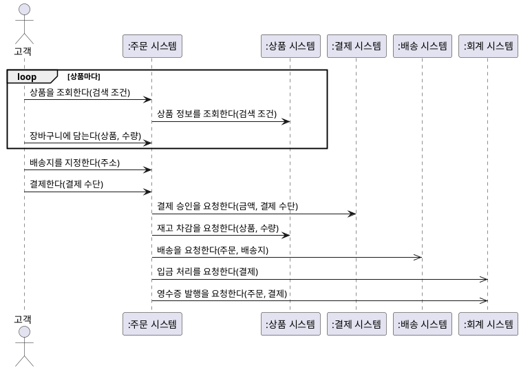

**강사 노트**

- 출처: "02. 요구 분석과 유스케이스"의 「43. 정제된 SSD」. 표기(외부 시스템, 동기·비동기 요청)도 그 topic에서 소개했다. "03. 정적 모델 — 도메인 개념과 관계"를 거치며 용어(장바구니, 배송)가 개념으로 확인되었다.
- 요구 산출물을 다시 그리는 것이 아니다. 분석의 입력으로 다시 보는 것이다. 분석에서 발견한 것은 이 SSD와 계약, 명세서에 되돌린다(「43. 누락과 모순」).

---

## 10. 계약의 정제

요구 분석의 **결제 계약**을 입력으로 쓰고, 시나리오 분석에 필요한 **주문 취소 계약**을 명세서의 대안 흐름 1a에서 작성한다. 사후조건의 각 표현은 **정적 모델의 요소**나 **외부 시스템에 대한 요청**으로 설명되어야 한다.

| 항목 | 결제 — 요구 분석의 계약 |
|---|---|
| 사전조건 | 고객의 주문이 결제 대기이고 배송지가 지정되었다 |
| 성공 사후조건 | **결제**가 승인되어 주문과 연결되었다 |
|  | 상품 시스템에 **재고 차감**을, 배송 시스템에 **배송**을 요청했다 |
|  | 회계 시스템에 **입금 처리·영수증 발행**을 요청했다 |
|  | 주문 상태가 결제 완료다 |

| 항목 | 주문 취소 |
|---|---|
| 관련 유스케이스 | 주문을 관리한다 — 대안 흐름 1a |
| 사전조건 | 고객 소유의 결제 완료 주문이며 배송 시작 전이다 |
| 성공 사후조건 | 배송 시스템이 **출고 중단**을 받아들였다 |
|  | 결제에 연결된 **환불**이 생겨 결제 시스템에 요청되었다 |
|  | 환불 금액은 결제 금액과 같다 |
|  | 주문 상태가 **취소 처리 중**이다 |

**강사 노트**

- 결제 계약의 출처는 "02. 요구 분석과 유스케이스"의 「44. 시스템 오퍼레이션과 계약」이다. 사전조건이 참인 호출의 정상 완료에서 사후조건이 성립한다는 계약 의미는 OMG [UML 2.5.1](https://www.omg.org/spec/UML/2.5.1/PDF), §9.6.3.1에 근거한다.
- 명세서의 취소 결과("주문이 취소 상태")와 달리 계약의 끝 상태는 **취소 처리 중**이다. 환불이 비동기라 즉시 끝나지 않는다는 사실은 「26. 주문 취소 시퀀스」에서 드러났다. 이 차이는 명세서의 결과로 되돌린다.
- 두 계약 모두 성공 계약이다. 결제 실패·출고 중단 거절·환불 실패는 포함하지 않는다.

---

## 11. 상호작용

상호작용(Interaction)은 참여자 사이에서 **관찰 가능한 정보 교환**이다. 분석에서는 도메인 객체가 사건을 처리하기 위해 무엇을 주고받는지 본다.

**인용문**

"상호작용은 연결된 요소들 사이의 **관찰 가능한 정보 교환**에 초점을 둔 행위 단위다", "An Interaction is a unit of Behavior that focuses on the observable exchange of information between connectable elements.", Object Management Group, 2017

- 정제된 SSD는 **시스템 밖**에서 본 상호작용이다. 이제 흐름(활동)과 시스템 **안**의 상호작용(시퀀스·커뮤니케이션), 개념의 생애(상태 기계)로 들어간다.

### 네 가지 동적 다이어그램

| 다이어그램 | 정의 | 보여주는 것 | 정적 모델과의 관계 |
|---|---|---|---|
| **활동** | 행동과 행동 사이의 **흐름** | 유스케이스·업무 흐름, 분기·병행 | 행동이 바꾸는 개념·상태 값 |
| **시퀀스** | **시간 순서**로 오가는 메시지 | 사건 하나의 상호작용 순서 | 생명선은 개념, 메시지는 연관 |
| **커뮤니케이션** | 링크와 **번호 붙은** 메시지 | 같은 상호작용의 참여자 연결 구조 | 링크는 연관의 후보다 |
| **상태 기계** | 한 개념의 **상태와 전이** | 개념의 생애, 허용·금지된 전이 | 상태는 상태 값, 불변 조건은 제약 |

### 정적 모델과의 관계

정적 모델은 동적 모델의 **어휘**(참여자, 상태 값)를 주고, 동적 모델은 정적 모델의 **누락과 모순**을 드러낸다.

**도식 — Mermaid**

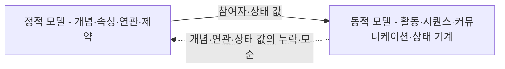

**강사 노트**

- 인용 근거: OMG UML 2.5.1, §17.12.11.1 "Interaction". 네 다이어그램의 정의는 같은 표준의 Chapter 15 Activities, Chapter 17 Interactions(시퀀스·커뮤니케이션), Chapter 14 StateMachines를 이 과정의 말로 요약한 것이다.
- 시퀀스와 커뮤니케이션은 같은 상호작용을 다르게 그린 **상호작용 다이어그램**이다. 이 세션은 활동 → 시퀀스 → 커뮤니케이션 → 상태 기계 순으로 다룬다.
---

## 12. 상호작용 모델의 용도

**다이어그램 — 시퀀스·커뮤니케이션 다이어그램**

상호작용 모델은 그림을 남기는 것이 목적이 아니다. 상황을 파악하고 **공통의 이해**에 이르기 위해 그린다.

**인용문**

"상호작용은 상황을 더 잘 파악하거나, 그 상황에 대한 **공통의 이해**에 이르려는 집단을 위해 쓰인다", "They are used to get a better grip of an interaction situation for an individual designer or for a group that needs to achieve a common understanding of the situation.", Object Management Group, 2017

- 업무 담당자와 함께 **읽을 수 있는 수준**으로 그린다.
- 합의가 끝나면 모든 그림을 유지할 필요는 없다. **판단의 근거**가 되는 것만 남긴다.

**강사 노트**

- 인용 근거: OMG UML 2.5.1, §17.1.1 "Overview". 같은 절은 상호작용이 이후 상세 설계에서 정밀한 통신을 정할 때도 쓰인다고 설명한다. 분석에서는 앞의 용도가 중심이다.

---

## 13. 상호작용에서 발견하는 것

**다이어그램 — 시퀀스·커뮤니케이션 다이어그램**

도메인 객체의 상호작용을 따라가면 **정적 모델과 요구 산출물만으로는 보이지 않던 것**이 드러난다. 무엇을 보고 무엇을 찾는지 먼저 정리한다.

| 상호작용에서 보는 것 | 발견하는 것 | 이 세션의 예 | 되돌릴 곳 |
|---|---|---|---|
| **참여자** | 모델에 없는 개념 | — | 정적 모델의 개념 |
| **메시지의 경로** | 빠진 연관, 일시적 연결 | 장바구니 → 주문 | 정적 모델의 연관 |
| **생성·변경** | 확정 값, 상태 값 | 단가 확정, 취소 처리 중 | 속성·상태 값 |
| **메시지의 순서** | 업무 규칙이 된 순서 | 승인 뒤 재고 차감, 출고 중단 뒤 환불 | 명세서 규칙, 정제된 SSD |
| **동기·비동기** | 즉시 끝나지 않는 처리 | 배송 시작·환불 완료 통보 | 계약, 상태 기계, 이벤트 목록 |
| **외부의 거절** | 새 예외 | 출고 중단 거절 | 명세서 예외 흐름, 계약 |

**강사 노트**

- 이것이 「08. 프로세스와 동적 분석」에서 말한 "동적 분석 없이는 정적 분석이 제대로 될 수 없다"의 구체적인 모습이다. 예는 뒤의 시퀀스 다이어그램들에서 하나씩 확인하고, 「43. 누락과 모순」에서 종합한다.
- 발견은 별도 문서가 아니라 원래 산출물을 고쳐 반영한다. "03. 정적 모델 — 도메인 개념과 관계"가 남긴 "출고 전을 누가 판단하는가"도 여기서 답을 얻는다 — 주문 시스템이 배송 시스템에 **묻는다**.

---

## 14. 활동 다이어그램

활동 다이어그램은 **행동의 흐름**을 표현한다. 수영 레인으로 **누가** 그 행동을 하는지 나눌 수 있다.

**도식 — SVG**

```svg
<svg xmlns="http://www.w3.org/2000/svg" width="1050" height="200" viewBox="0 0 1050 200" role="img" aria-label="활동 다이어그램 표기: 시작, 행동, 흐름, 결정·병합, 분기·합류, 종료, 수영 레인">
<style>text{font-family:sans-serif;font-size:20px;fill:#000;text-anchor:middle}.s{stroke:#1B3A6B;stroke-width:3;fill:none}.b{fill:#fff;stroke:#181818;stroke-width:2}</style>
<rect width="1050" height="200" fill="#fff"/>
<circle cx="75" cy="80" r="20" fill="#222"/>
<rect class="b" x="165" y="55" width="120" height="50" rx="22"/><text x="225" y="87">행동</text>
<line class="s" x1="330" y1="80" x2="415" y2="80"/><polygon points="420,80 402,71 402,89" fill="#1B3A6B"/>
<polygon class="b" points="525,50 560,80 525,110 490,80"/>
<rect x="645" y="73" width="80" height="14" fill="#222"/>
<circle cx="825" cy="80" r="20" fill="#fff" stroke="#181818" stroke-width="3"/><circle cx="825" cy="80" r="12" fill="#222"/>
<line x1="930" y1="35" x2="930" y2="125" stroke="#000" stroke-width="3"/><line x1="1020" y1="35" x2="1020" y2="125" stroke="#000" stroke-width="3"/><text x="975" y="62">고객</text>
<text x="75" y="170">시작</text><text x="225" y="170">행동</text><text x="375" y="170">흐름</text><text x="525" y="170">결정·병합</text><text x="685" y="170">분기·합류</text><text x="825" y="170">종료</text><text x="975" y="170">수영 레인</text>
</svg>
```

- **결정·병합**(조건)과 **분기·합류**(병행)는 서로 대신하지 않는다.

| 표기 | 의미 | 이렇게 쓴다 |
|---|---|---|
| **시작** — 채운 원 | 흐름의 시작 | 하나만 둔다 |
| **행동** — 둥근 사각형 | 수행하는 일 | 업무 동사로, 주체는 이름이나 레인으로 |
| **흐름** — 화살표 | 행동 사이의 순서 | 데이터가 아니라 제어의 흐름이다 |
| **결정·병합** — 마름모 | 조건에 따른 분기와 다시 합침 | 나가는 흐름마다 겹치지 않는 `[조건]` |
| **분기·합류** — 굵은 막대 | 병행의 시작과, 모두 끝날 때까지 기다림 | 순서와 상관없는 일에만 쓴다 |
| **종료** — 테두리 안의 채운 원 | 흐름의 끝 | 경로마다 둘 수 있다 |
| **수영 레인** — 세로 구역 | 행동의 책임자 | 액터·시스템별로 나눈다 |

**강사 노트**

- 표기 기준: 저장소 `references/sw-engineering/uml/activity.md`. 흐름의 화살표는 행동 사이의 제어 흐름이며, 업무 순서도의 선과 같지 않다.

---

## 15. 유스케이스와 활동

활동 다이어그램은 **유스케이스 전체의 흐름**을 보여준다. 기본 흐름과 대안 흐름이 **분기**로 함께 드러난다. 「주문을 관리한다」의 흐름이다.

**도식 — PlantUML**

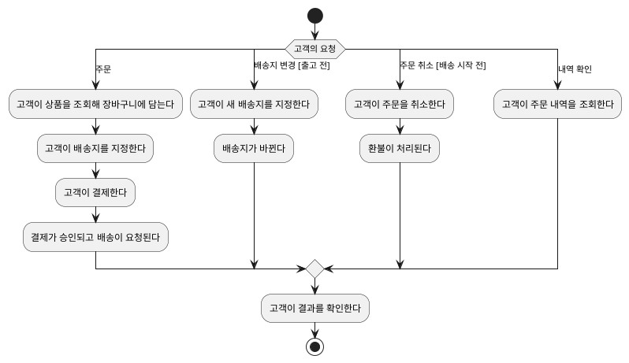

**페이지 분할**

### 주문 취소 활동과 코드

**결정**은 `if`, **행동**은 메서드 호출이 된다. 거절로 끝나는 가지는 예외로 드러난다. "이미 출고됨"의 거절은 **교육용 가정**이다.

**도식 — PlantUML**

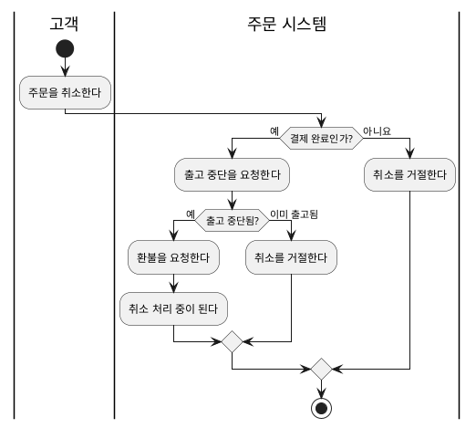

```java
final class 주문 {
    // ... 생략
    void 취소한다() {
        if (상태 != 주문상태.결제완료)
            throw new IllegalStateException(상태 + "에서는 취소할 수 없다");
        if (!배송.출고중단을요청한다())
            throw new IllegalStateException("이미 출고되었다");
        결제.환불을요청한다();
        전이(주문상태.결제완료, 주문상태.취소처리중);
    }
    // ... 생략
}
```

**강사 노트**

- 흐름은 "02. 요구 분석과 유스케이스"의 「32. 유스케이스 상세화」와 같다. 행동의 주체는 행동 이름에 적었다. 책임자를 레인으로 나누는 표기는 「16. 업무 흐름」에서 보인다. 가드는 대안 흐름의 조건이다. 결제 실패·환불 실패는 이 그림의 범위 밖이다.
- 주문 취소 활동의 두 결정은 코드의 두 `if`다. 코드는 모두 `code/s04/주문생애.java`에서 발췌했으며, 그 파일을 컴파일·실행해 확인한다. "이미 출고됨"에서 거절하는 것은 **교육용 가정**이다(「27. 시퀀스 다이어그램 조각」).
- "결제 완료인가? — 아니요"의 거절 중 배송 시작 이후는 확인된 규칙이고, 결제 대기의 취소는 **미정**이다. 코드는 확인된 경로만 구현했을 뿐 결제 대기의 처리를 정한 것이 아니다(「35. 가드와 금지된 전이」).

---

## 16. 업무 흐름

**다이어그램 — 활동 다이어그램**

활동 다이어그램은 **여러 시스템에 걸친 업무 흐름**을 보여줄 때도 쓴다. 결제에서 배송까지의 흐름이다.

**도식 — SVG**

```svg:uml
<svg xmlns="http://www.w3.org/2000/svg" width="1100" height="750" viewBox="0 0 1100 750" role="img" aria-label="결제에서 배송까지 여러 시스템에 걸친 업무 흐름 활동 다이어그램">
<style>text{font-family:sans-serif;font-size:17px;fill:#000;text-anchor:middle}.t{font-weight:bold}.st{font-size:16px}.h{paint-order:stroke;stroke:#fff;stroke-width:6px;stroke-linejoin:round}.s{fill:#fff;stroke:#181818;stroke-width:1.5}.u{fill:#fff;stroke:#181818;stroke-width:1.5}.x{fill:#fff;stroke:#1B3A6B;stroke-width:1.5}.c{fill:#fff;stroke:#1B3A6B;stroke-width:3}.w{font-weight:bold}.n{fill:#fff;stroke:#181818;stroke-width:1.2}.l{stroke:#181818;stroke-width:1.3;fill:none}.d{stroke:#181818;stroke-width:1.3;fill:none;stroke-dasharray:6,5}.f{stroke:#1B3A6B;stroke-width:1.6;fill:none}.a{fill:#fff;stroke:#181818;stroke-width:1.4}</style>
<defs><marker id="o" viewBox="0 0 12 12" refX="11" refY="6" markerWidth="12" markerHeight="12" orient="auto" markerUnits="userSpaceOnUse"><path d="M1,1 L11,6 L1,11" fill="none" stroke="#181818" stroke-width="1.4"/></marker><marker id="f" viewBox="0 0 12 12" refX="11" refY="6" markerWidth="12" markerHeight="12" orient="auto" markerUnits="userSpaceOnUse"><path d="M0,0 L12,6 L0,12 Z" fill="#1B3A6B"/></marker><marker id="g" viewBox="0 0 16 16" refX="15" refY="8" markerWidth="16" markerHeight="16" orient="auto" markerUnits="userSpaceOnUse"><path d="M1,1 L15,8 L1,15 Z" fill="#fff" stroke="#181818" stroke-width="1.4"/></marker></defs>
<rect width="1100" height="750" fill="#fff"/>
<text class="t" x="75.0" y="34">고객</text>
<line x1="20" y1="14" x2="20" y2="740" stroke="#181818" stroke-width="1.6"/>
<text class="t" x="290.0" y="34">주문 시스템</text>
<line x1="130" y1="14" x2="130" y2="740" stroke="#181818" stroke-width="1.6"/>
<text class="t" x="530.0" y="34">결제 시스템</text>
<line x1="450" y1="14" x2="450" y2="740" stroke="#181818" stroke-width="1.6"/>
<text class="t" x="680.0" y="34">상품 시스템</text>
<line x1="610" y1="14" x2="610" y2="740" stroke="#181818" stroke-width="1.6"/>
<text class="t" x="830.0" y="34">배송 시스템</text>
<line x1="750" y1="14" x2="750" y2="740" stroke="#181818" stroke-width="1.6"/>
<text class="t" x="995.0" y="34">회계 시스템</text>
<line x1="910" y1="14" x2="910" y2="740" stroke="#181818" stroke-width="1.6"/>
<line x1="1080" y1="14" x2="1080" y2="740" stroke="#181818" stroke-width="1.6"/>
<line x1="20" y1="48" x2="1080" y2="48" stroke="#181818" stroke-width="1.2"/>
<circle cx="75" cy="72" r="11" fill="#181818"/>
<rect x="32.0" y="102" width="86" height="36" rx="16" fill="#fff" stroke="#181818" stroke-width="1.4"/><text x="75" y="126">결제한다</text>
<rect x="189.5" y="154" width="191" height="36" rx="16" fill="#fff" stroke="#181818" stroke-width="1.4"/><text x="285" y="178">결제 승인을 요청한다</text>
<rect x="457.0" y="206" width="146" height="36" rx="16" fill="#fff" stroke="#181818" stroke-width="1.4"/><text x="530" y="230">결제를 승인한다</text>
<rect x="189.5" y="258" width="191" height="36" rx="16" fill="#fff" stroke="#181818" stroke-width="1.4"/><text x="285" y="282">재고 차감을 요청한다</text>
<rect x="614.5" y="310" width="131" height="36" rx="16" fill="#fff" stroke="#181818" stroke-width="1.4"/><text x="680" y="334">재고를 줄인다</text>
<rect x="160" y="378" width="250" height="7" fill="#181818"/>
<rect x="227.0" y="414" width="206" height="36" rx="16" fill="#fff" stroke="#181818" stroke-width="1.4"/><text x="330" y="438">입금·영수증을 요청한다</text>
<rect x="149.0" y="474" width="146" height="36" rx="16" fill="#fff" stroke="#181818" stroke-width="1.4"/><text x="222" y="498">배송을 요청한다</text>
<rect x="922.0" y="414" width="146" height="36" rx="16" fill="#fff" stroke="#181818" stroke-width="1.4"/><text x="995" y="438">입금을 처리한다</text>
<rect x="914.5" y="474" width="161" height="36" rx="16" fill="#fff" stroke="#181818" stroke-width="1.4"/><text x="995" y="498">영수증을 발행한다</text>
<rect x="787.0" y="534" width="86" height="36" rx="16" fill="#fff" stroke="#181818" stroke-width="1.4"/><text x="830" y="558">출고한다</text>
<rect x="757.0" y="594" width="146" height="36" rx="16" fill="#fff" stroke="#181818" stroke-width="1.4"/><text x="830" y="618">배송을 시작한다</text>
<rect x="172.0" y="654" width="236" height="36" rx="16" fill="#fff" stroke="#181818" stroke-width="1.4"/><text x="290" y="678">주문을 배송 중으로 바꾼다</text>
<rect x="160" y="706" width="275" height="7" fill="#181818"/>
<circle cx="285" cy="731" r="10" fill="#fff" stroke="#181818" stroke-width="1.6"/><circle cx="285" cy="731" r="6" fill="#181818"/>
<path d="M75,83 L75,100" fill="none" stroke="#1B3A6B" stroke-width="1.6" marker-end="url(#f)"/>
<path d="M75,138 L75,150 L285,150 L285,152" fill="none" stroke="#1B3A6B" stroke-width="1.6" marker-end="url(#f)"/>
<path d="M380.5,172 L530,172 L530,204" fill="none" stroke="#1B3A6B" stroke-width="1.6" marker-end="url(#f)"/>
<path d="M530,242 L530,254 L285,254 L285,256" fill="none" stroke="#1B3A6B" stroke-width="1.6" marker-end="url(#f)"/>
<path d="M380.5,276 L680,276 L680,308" fill="none" stroke="#1B3A6B" stroke-width="1.6" marker-end="url(#f)"/>
<path d="M680,346 L680,360 L285,360 L285,376" fill="none" stroke="#1B3A6B" stroke-width="1.6" marker-end="url(#f)"/>
<path d="M330,385 L330,412" fill="none" stroke="#1B3A6B" stroke-width="1.6" marker-end="url(#f)"/>
<path d="M200,385 L200,472" fill="none" stroke="#1B3A6B" stroke-width="1.6" marker-end="url(#f)"/>
<path d="M433.0,432 L920.0,432" fill="none" stroke="#1B3A6B" stroke-width="1.6" marker-end="url(#f)"/>
<path d="M995,450 L995,472" fill="none" stroke="#1B3A6B" stroke-width="1.6" marker-end="url(#f)"/>
<path d="M295.0,492 L830,492 L830,532" fill="none" stroke="#1B3A6B" stroke-width="1.6" marker-end="url(#f)"/>
<path d="M830,570 L830,592" fill="none" stroke="#1B3A6B" stroke-width="1.6" marker-end="url(#f)"/>
<path d="M830,630 L830,648 L290,648 L290,652" fill="none" stroke="#1B3A6B" stroke-width="1.6" marker-end="url(#f)"/>
<path d="M995,510 L995,690 L425,690 L425,704" fill="none" stroke="#1B3A6B" stroke-width="1.6" marker-end="url(#f)"/>
<path d="M230,690 L230,704" fill="none" stroke="#1B3A6B" stroke-width="1.6" marker-end="url(#f)"/>
<path d="M285,713 L285,719" fill="none" stroke="#1B3A6B" stroke-width="1.6" marker-end="url(#f)"/>
</svg>
```

**페이지 분할**

- 흐름이 주문 시스템에서 배송 시스템의 「배송을 처리한다」로 **시스템 경계를 넘는다**.
- **분기·합류** 사이의 두 흐름은 **병행**한다 — 서로의 순서에 의존하지 않고, 합류는 둘 다 끝나기를 기다린다.
- 주문 시스템은 배송 시스템의 처리를 **기다리지 않고**, 배송을 시작했다는 **통보**를 받아 주문을 바꾼다. 정제된 SSD의 **비동기 요청**이다.
- **병행**은 흐름의 순서, **비동기**는 요청자가 완료를 기다리는가의 구분이다. 서로 대신하지 않는다.

**강사 노트**

- 결제 승인 거절 경로는 생략했다. 레인은 시스템 단위로 나눴다. 사람(배송 담당자)의 행동은 배송 시스템 레인 안에 있다.

---

## 17. 이벤트와 활동

활동 다이어그램의 레인 경계에서 **이벤트**가 드러난다. 한 레인의 행동이 끝나면 다른 레인이 그 결과에 반응한다. "02. 요구 분석과 유스케이스"의 **이벤트 중심 요구**가 동적 모델로 이어지는 방식이다.

| 레인 경계 | 이벤트 | 반응 |
|---|---|---|
| 결제 시스템 → 주문 시스템 | 결제가 승인되었다 | 재고 차감·배송·입금을 요청한다 |
| 주문 시스템 → 배송 시스템 | 배송이 요청되었다 | 출고한다 |
| 배송 시스템 → 주문 시스템 | 배송이 시작되었다 | 주문을 배송 중으로 바꾼다 |
| 주문 시스템 → 회계 시스템 | 입금 처리가 요청되었다 | 입금을 처리하고 영수증을 발행한다 |

**강사 노트**

- 각 이벤트는 상태 기계의 전이와 대응한다. 이벤트를 과거형("배송이 시작되었다")으로 쓰면 도메인 이벤트의 표현과 같다. 시스템 사이의 이벤트 기반 설계로의 확장은 "13. OOAD에서 전문영역으로 — Architecture · DDD · MSA"에서 다룬다.

---

## 18. 활동과 SSD

활동 다이어그램과 SSD는 **같은 수준**의 모델이다. 둘 다 시스템을 블랙박스로 본다. 활동 다이어그램으로 흐름 전체를 보고, 중요한 경로마다 SSD로 **시스템 이벤트**를 확인한다.

| 구분 | 활동 다이어그램 | 시스템 시퀀스 다이어그램 |
|---|---|---|
| 대상 | 유스케이스 **전체** | 유스케이스 **시나리오 하나** |
| 보이는 것 | 분기·병합, 대안 흐름, 책임자(레인) | 시스템 이벤트의 순서, 외부 시스템과의 교환 |
| 관계 | 활동의 경로 하나 | = SSD 하나 |

**강사 노트**

- "주문" 경로의 SSD는 「09. 정제된 SSD」다. 모든 경로에 SSD를 그리지 않는다. 규칙·예외가 많은 경로를 고른다.

---

## 19. 시퀀스 다이어그램

시퀀스 다이어그램은 상호작용을 **생명선**과 **시간 순서의 메시지**로 표현한다. 위에서 아래로 읽는다. SSD는 시스템 밖에서 본 시퀀스 다이어그램이고, 분석의 시퀀스 다이어그램은 시스템 **안**의 도메인 객체 사이를 본다.

**도식 — SVG**

```svg
<svg xmlns="http://www.w3.org/2000/svg" width="1100" height="230" viewBox="0 0 1100 230" role="img" aria-label="시퀀스 다이어그램 표기: 생명선, 동기 메시지, 비동기 메시지, 자기 호출, 생성, 조각">
<style>text{font-family:sans-serif;font-size:20px;fill:#000;text-anchor:middle}.b{fill:#fff;stroke:#1B3A6B;stroke-width:2}.l{stroke:#1B3A6B;stroke-width:3;fill:none}</style>
<rect width="1100" height="230" fill="#fff"/>
<rect class="b" x="40" y="30" width="110" height="46" rx="6"/><text x="95" y="60">:주문</text><line x1="95" y1="76" x2="95" y2="145" stroke="#1B3A6B" stroke-width="2" stroke-dasharray="8,8"/>
<text x="265" y="80" style="font-size:18px">요청한다</text><line class="l" x1="195" y1="95" x2="325" y2="95"/><polygon points="335,95 315,85 315,105" fill="#1B3A6B"/>
<text x="445" y="80" style="font-size:18px">알린다</text><line class="l" x1="380" y1="95" x2="510" y2="95"/><path class="l" d="M495,85 L512,95 L495,105"/>
<line x1="600" y1="40" x2="600" y2="145" stroke="#1B3A6B" stroke-width="2" stroke-dasharray="8,8"/><path class="l" d="M600,70 L650,70 L650,110 L612,110"/><polygon points="602,110 620,101 620,119" fill="#1B3A6B"/>
<line class="l" x1="700" y1="95" x2="780" y2="95"/><polygon points="790,95 770,85 770,105" fill="#1B3A6B"/><rect class="b" x="792" y="72" width="100" height="46" rx="6"/><text x="842" y="102">:환불</text>
<rect x="930" y="40" width="150" height="100" fill="none" stroke="#000" stroke-width="2"/><path d="M930,40 L990,40 L990,58 L978,70 L930,70 Z" fill="#fff" stroke="#000" stroke-width="2"/><text x="957" y="62" style="font-size:18px">alt</text><text x="1005" y="110" style="font-size:18px">[조건]</text>
<text x="95" y="195">생명선</text><text x="265" y="195">동기 메시지</text><text x="445" y="195">비동기 메시지</text><text x="625" y="195">자기 호출</text><text x="795" y="195">생성</text><text x="1005" y="195">조각</text>
</svg>
```

- 응답은 그리지 않는다. **비동기 메시지**만 열린 화살촉으로 구분한다.

| 표기 | 의미 | 이렇게 쓴다 |
|---|---|---|
| **생명선** — 머리 박스와 점선 | 참여자와 그 존재 기간 | `:주문`처럼 개념의 인스턴스, 액터는 왼쪽 |
| **동기 메시지** — 채운 화살촉 | 처리를 마칠 때까지 기다리는 요청 | 업무 동사로 이름 짓는다 |
| **비동기 메시지** — 열린 화살촉 | 기다리지 않는 알림 | 사건을 알리기만 할 때 쓴다 |
| **자기 호출** | 자신에게 보내는 메시지 | 객체 안의 상태 변화·계산 |
| **생성** — 중간에서 시작하는 생명선 | 상호작용 도중에 생기는 참여자 | 생기는 시점에 박스를 둔다(주문 항목, 환불) |
| **조각** — 이름표 달린 사각형 | 조건·반복·병행 | 「27. 시퀀스 다이어그램 조각」에서 다룬다 |

**강사 노트**

- "02. 요구 분석과 유스케이스"는 SSD에 필요한 표기만 제한적으로 소개했다. 여기서는 전체 표기를 다룬다. 표기 기준: OMG UML 2.5.1, §17.8; 저장소 `references/sw-engineering/uml/sequence.md`. 응답 화살표는 UML에서 선택 사항이다. 동기 호출의 응답을 모두 그리면 그림만 복잡해진다.

---

## 20. 오퍼레이션에서 상호작용으로

**다이어그램 — 시퀀스 다이어그램**

SSD의 **시스템 오퍼레이션 하나**를 시스템 **안**에서 펼친 것이 분석의 시퀀스 다이어그램이다. 블랙박스를 열어 **도메인 객체**가 무엇을 주고받는지 본다. 첫 메시지는 그 사건의 **중심 개념**이 받는다.

| SSD의 시스템 이벤트 | 첫 메시지를 받는 도메인 객체 | 이어지는 상호작용 |
|---|---|---|
| 장바구니에 담는다(상품, 수량) | :장바구니 | 장바구니 항목을 만들고 상품의 판매가를 참조 |
| **배송지를 지정한다(주소)** | :장바구니 | 주문을 만들고 주문 항목마다 단가를 확정 |
| **결제한다(결제 수단)** | :주문 | 결제를 만들어 승인·재고·배송·입금을 요청 |
| **주문을 취소한다(주문)** | :주문 | 출고 중단을 요청하고 환불을 요청 |

**강사 노트**

- `상품을 조회한다`는 상태를 바꾸지 않아 상호작용을 그리지 않는다. 분석에서는 컨트롤러·서비스가 첫 메시지를 받지 않는다. 설계에서는 첫 메시지를 응용 서비스 같은 설계 객체가 받을 수 있다("07. 책임·협력·계약"). 분석에서는 어떤 개념이 사건의 중심인지 확인하는 것이 목적이다.

---

## 21. 참여 객체와 도메인 모델

**다이어그램 — 시퀀스 다이어그램**

시퀀스 다이어그램의 참여자는 **도메인 모델 개념의 인스턴스**다. 생명선 `:주문`은 "주문 개념의 한 인스턴스"를 뜻한다.

- 이 모델에 **없는 개념**은 생명선이 될 수 없다. 필요하면 그 자체가 정적 모델의 누락이다.
- **외부 시스템**은 도메인 개념이 아니라 **지원 액터**다. 생명선으로 쓰되 정적 모델에는 넣지 않는다.

**도식 — PlantUML**

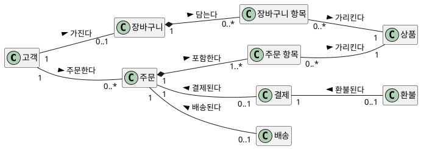

**강사 노트**

- 도식은 "03. 정적 모델 — 도메인 개념과 관계"의 「45. 도메인 모델 — 상세화」에서 속성을 뺀 것이다. 시퀀스 다이어그램을 그릴 때 이 도식을 옆에 두고 대조한다.

---

## 22. 연관을 따라 흐르는 메시지

**다이어그램 — 시퀀스 다이어그램**

객체는 **아는 상대에게만** 메시지를 보낼 수 있다. 분석에서 메시지는 도메인 모델의 **연관을 따라** 흐른다. 연관이 없는데 메시지가 필요하면 **연관이 빠졌거나**, 그 순간에만 필요한 **일시적 연결**이다.

| 메시지 | 보내는 쪽 → 받는 쪽 | 따라가는 연관 |
|---|---|---|
| 장바구니 항목을 만든다 | :장바구니 → :장바구니 항목 | 장바구니 — 장바구니 항목 |
| 주문을 만든다 | :장바구니 → :주문 | **없음** |
| 판매가를 가져온다 | :주문 항목 → :상품 | 주문 항목 — 상품 |
| 결제를 만든다, 환불을 요청한다 | :주문 → :결제 | 주문 — 결제 |
| 배송을 만든다, 출고 중단을 요청한다 | :주문 → :배송 | 주문 — 배송 |

**강사 노트**

- 이것이 동적 모델이 정적 모델의 연관을 검증하는 가장 직접적인 방법이다.
- 장바구니 → 주문은 주문을 **만드는 순간에만** 필요한 연결이다. 만든 뒤에도 기억해야 하는 관계가 아니면 연관으로 두지 않는다. 판단의 근거를 기록해 둔다.

---

## 23. 장바구니 담기 시퀀스

`장바구니에 담는다(상품, 수량)`를 **도메인 객체의 상호작용**으로 펼친다.

**도식 — PlantUML**

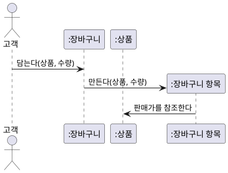

- **장바구니 항목**은 사려는 **의도**다. 판매가는 **참조**만 한다.
- 상품 조회는 **상태를 바꾸지 않아** 그리지 않는다.

**강사 노트**

- 장바구니 항목과 주문 항목의 차이는 "03. 정적 모델 — 도메인 개념과 관계"의 「36. 같은 구조, 다른 의미」다. 상품 정보의 원천은 상품 시스템이며, `:상품`은 주문 시스템이 가진 상품 정보다.
- 같은 상품을 다시 담으면 수량을 합치는가? 상호작용을 그리면서 생긴 **요구 질문**이다.

---

## 24. 주문 생성 시퀀스

시스템 이벤트 `배송지를 지정한다(주소)`에서 장바구니로 **주문**이 만들어진다.

**도식 — PlantUML**

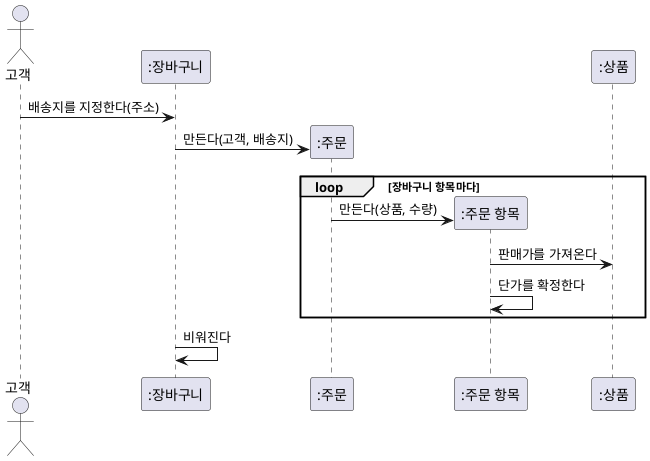

- **업무 사실** — 주문이 성립할 때 **현재 판매가**가 **단가**로 확정된다(**현재 값과 확정 값**).
- **예로 둔 배치** — 누가 만들고 확정하는지는 **책임 배치의 예**다.
- 주문은 **결제 대기**로 시작한다(「33. 주문 상태 기계」).

**강사 노트**

- 현재 값과 확정 값은 "03. 정적 모델 — 도메인 개념과 관계"에서 정했다. 분석이 확인하는 것은 **언제** 주문이 성립하고 단가가 확정되는가다. **누가** 만들고 확정하는지는 이해를 돕는 배치 예이며, 설계에서 책임으로 다시 결정한다("07. 책임·협력·계약").
- 결제가 실패하면 비워진 장바구니를 되살리는가? 요구 질문으로 남긴다.

---

## 25. 결제 시퀀스

시스템 이벤트 `결제한다(결제 수단)`를 펼친다. 정제된 SSD에서 주문 시스템이 외부에 보낸 요청을 **어느 도메인 객체가** 보내는지가 드러난다.

**도식 — PlantUML**

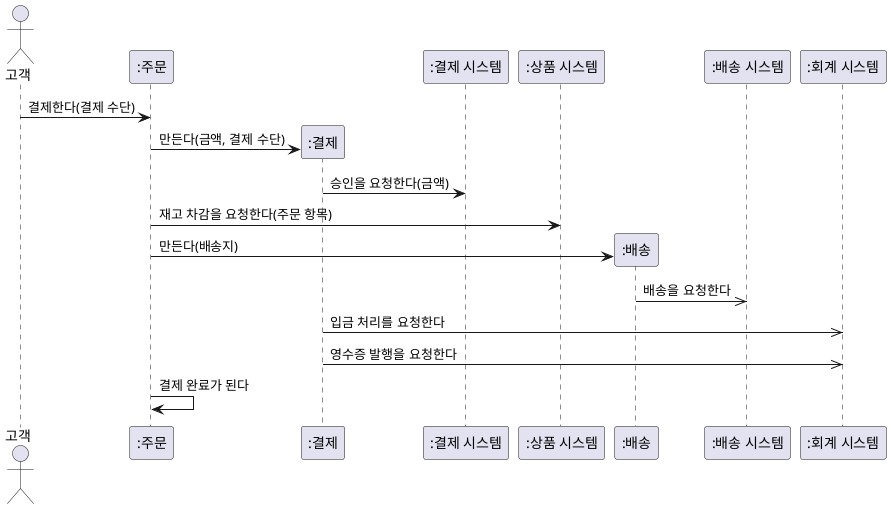

**페이지 분할**

- **재고** — 승인 **뒤에** 재고 차감을 요청한다. 차감이 실패하면 이미 승인된 결제를 되돌려야 한다 → 재고를 결제 **전에** 확보해야 하는가?
- **배송** — 배송 요청은 비동기다. 주문은 배송 시작을 **나중에 통보로** 안다 → 상태 기계의 전이 사건이 된다.
- **요청의 주체** — 결제가 입금·영수증을, 배송이 배송 시스템을 맡는다. 어떤 요청이 필요한지는 분석이 확인하고, 누가 요청하는지는 배치 예로 두어 설계에서 다시 정한다("07. 책임·협력·계약").

**강사 노트**

- 성공 경로다. 승인 거절은 `alt`로 그릴 수 있다(「27. 시퀀스 다이어그램 조각」).
- 재고 확보 시점은 **요구 질문**이다. 답이 정해지면 "02. 요구 분석과 유스케이스"의 명세서 규칙과 정제된 SSD의 순서를 고친다.

---

## 26. 주문 취소 시퀀스

시스템 이벤트 `주문을 취소한다(주문)`를 **도메인 객체의 상호작용**으로 펼친다.

**도식 — PlantUML**

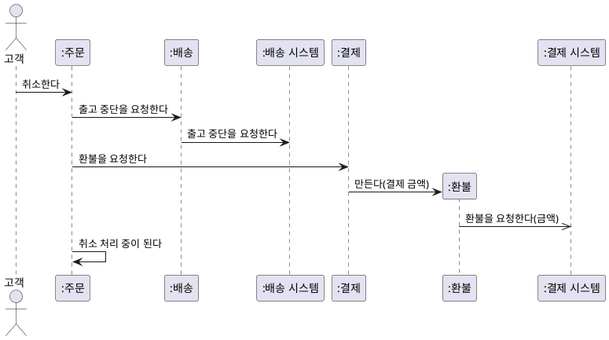

**페이지 분할**

- **출고 중단을 먼저** 확인하고 환불한다. 이미 출고되었다면 환불하면 안 되기 때문이다. 이 순서도 업무 규칙이다.
- 출고 중단은 배송 시스템이 **거절할 수 있다** → 취소의 새 예외다(「27. 시퀀스 다이어그램 조각」).
- 환불은 **비동기**다. 완료 통보가 올 때까지 취소가 끝나지 않는다 → **취소 처리 중** 상태가 필요하다.

**페이지 분할**

### 시퀀스와 코드

**메시지**는 받는 객체의 **메서드**가 되고, **생성**은 `new`, **비동기 메시지**는 완료를 기다리지 않는 요청이 된다. 결과는 나중에 **통보**로 온다.

**도식 — PlantUML**


```java
final class 배송 {
    // ... 생략
    boolean 출고중단을요청한다() {
        return 배송시스템.출고중단을요청한다(배송번호);
    }
}

final class 환불 {
    private final 금액 환불금액;

    환불(금액 환불금액) { this.환불금액 = 환불금액; }
    void 요청한다(결제시스템 결제시스템) {
        결제시스템.환불을요청한다(환불금액);
    }
}

final class 결제 {
    // ... 생략
    void 환불을요청한다() {
        var 새환불 = new 환불(결제금액);
        환불 = Optional.of(새환불);
        새환불.요청한다(결제시스템);
    }
}
```

**강사 노트**

- 성공 경로다. 결제 완료·배송 시작 전 주문의 전체 취소라는 전제를 유지한다.
- 발견한 순서·예외·중간 상태는 "02. 요구 분석과 유스케이스"의 명세서(대안 흐름 1a, 예외 흐름)와 정제된 SSD, 「10. 계약의 정제」에 되돌린다.

---

## 27. 시퀀스 다이어그램 조각

상호작용 조각(Combined Fragment)은 메시지의 **조건·반복·병행**을 표현한다. **프레임**(왼쪽 위에 이름표가 달린 사각형)으로 그리고, 이름표에 **연산자**, 칸 안에 **조건(가드)**을 쓴다. 메시지를 보기 좋게 묶는 상자가 아니다.

- 커뮤니케이션 다이어그램은 **프레임을 쓰지 않는다**. 같은 조건·반복을 메시지 번호의 `[조건]`과 `*`로 표현한다(「28. 커뮤니케이션 다이어그램」).

| 조각 | 의미 | 조건 쓰는 법 | 이렇게 쓴다 |
|---|---|---|---|
| `loop` | 조건 동안 반복 | `[상품마다]` | 같은 메시지가 여러 번 오갈 때 |
| `alt` | 서로 배타적인 대안 중 하나 | 칸마다 `[조건]`, 마지막은 `[그 밖]` | 조건에 따라 다른 상호작용이 일어날 때 |
| `opt` | 조건이 참일 때만 | `[쿠폰이 있으면]` | 선택적으로 일어나는 상호작용 하나 |
| `par` | 순서 없이 함께 일어날 수 있음 | 칸마다 병행 흐름 | 순서가 업무 의미를 갖지 않을 때 |
| `break` | 조건이 참이면 나머지를 중단 | `[결제 거절]` | 예외로 상호작용이 끝날 때 |

**페이지 분할**

주문 취소 상호작용에 `alt`를 쓴 예다. **출고 중단의 결과**에 따라 상호작용이 갈린다. 출고 후의 거절은 **교육용 가정**이다.

**도식 — PlantUML**

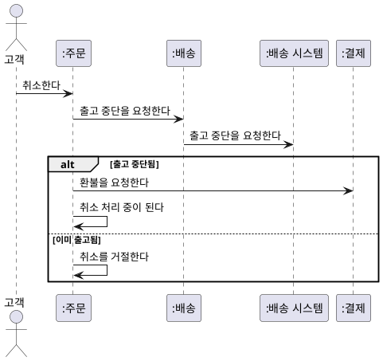

**강사 노트**

- `alt`의 "이미 출고됨" 칸은 「26. 주문 취소 시퀀스」에서 발견한 예외다. 출고 후 취소를 거절한다는 것은 **교육용 가정**이며, 실제 규칙은 「34. 출고와 배송 시작」의 질문으로 남아 있다.
- `loop`는 「09. 정제된 SSD」의 `[상품마다]`와 「24. 주문 생성 시퀀스」의 `[장바구니 항목마다]`에서 이미 썼다.
- 서로 배타적인 대안을 `opt` 여러 개나 `par`로 그리지 않는다. 조각을 두 단계 이상 겹치면 그림을 나눈다.
- 표기 기준: OMG UML 2.5.1, §17.6; 저장소 `references/sw-engineering/uml/sequence.md`.
---

## 28. 커뮤니케이션 다이어그램

커뮤니케이션 다이어그램(Communication Diagram)은 같은 상호작용을 **객체 사이의 링크**와 **번호 붙은 메시지**로 표현한다.

**도식 — SVG**

```svg
<svg xmlns="http://www.w3.org/2000/svg" width="1000" height="200" viewBox="0 0 1000 200" role="img" aria-label="커뮤니케이션 다이어그램 표기: 객체, 링크, 번호 붙은 메시지, 중첩 번호">
<style>text{font-family:sans-serif;font-size:20px;fill:#000;text-anchor:middle}.b{fill:#fff;stroke:#181818;stroke-width:2}</style>
<rect width="1000" height="200" fill="#fff"/>
<rect class="b" x="45" y="55" width="110" height="46" rx="6"/><text x="100" y="85">:주문</text>
<line x1="220" y1="78" x2="360" y2="78" stroke="#1B3A6B" stroke-width="3"/>
<line x1="430" y1="95" x2="600" y2="95" stroke="#1B3A6B" stroke-width="3"/><text x="515" y="70">1: 취소한다 →</text>
<line x1="680" y1="95" x2="960" y2="95" stroke="#1B3A6B" stroke-width="3"/><text x="820" y="70">1.1: 환불을 요청한다 →</text>
<text x="100" y="165">객체</text><text x="290" y="165">링크</text><text x="515" y="165">번호 붙은 메시지</text><text x="820" y="165">중첩 번호</text>
</svg>
```

- 번호가 **순서**다. `1.1`은 `1`을 처리하는 도중에 보내는 메시지다. 화살표는 메시지의 방향이다.

### 표기와 사용법

| 표기 | 의미 | 이렇게 쓴다 |
|---|---|---|
| **객체** — 사각형 | 상호작용의 참여자 | `:주문`처럼 도메인 개념의 인스턴스 이름을 쓴다 |
| **링크** — 실선 | 두 객체가 메시지를 주고받을 수 있는 연결 | 반복해서 필요한 링크는 연관의 후보다 |
| **번호 붙은 메시지** | 링크 위의 메시지와 그 순서 | `1:`부터 쓰고 화살표로 보내는 방향을 표시한다 |
| **중첩 번호** | 앞 메시지를 처리하는 도중의 메시지 | `1.1`, `1.2`처럼 쓴다. 같은 수준은 끝자리를 올린다 |
| **조건·반복** — `[조건]`, `*` | 조건이 참일 때만, 또는 반복해서 보내는 메시지 | `1.2 [출고 중단됨]: 환불을 요청한다` |

**강사 노트**

- 표기 기준: 저장소 `references/sw-engineering/uml/communication.md`; OMG UML 2.5.1, §17.9 Communication Diagrams(메시지 번호의 조건 `[ ]`과 반복 `*`). 메시지 번호 없이 객체만 연결한 그림은 커뮤니케이션 다이어그램이 아니다.

---

## 29. 시퀀스와 커뮤니케이션

두 다이어그램은 **같은 상호작용**을 다른 방식으로 강조한다. 「26. 주문 취소 시퀀스」의 앞부분을 **같은 번호**로 그렸다. 시퀀스는 **시간 순서**, 커뮤니케이션은 **누가 누구와 연결되는지**가 잘 보인다.

**도식 — SVG**

```svg:uml
<svg xmlns="http://www.w3.org/2000/svg" width="940" height="500" viewBox="0 0 940 500" role="img" aria-label="주문 취소 앞부분을 같은 번호로 그린 시퀀스 다이어그램과 커뮤니케이션 다이어그램">
<style>text{font-family:sans-serif;font-size:17px;fill:#000;text-anchor:middle}.t{font-weight:bold}.st{font-size:16px}.h{paint-order:stroke;stroke:#fff;stroke-width:6px;stroke-linejoin:round}.s{fill:#fff;stroke:#181818;stroke-width:1.5}.u{fill:#fff;stroke:#181818;stroke-width:1.5}.x{fill:#fff;stroke:#1B3A6B;stroke-width:1.5}.c{fill:#fff;stroke:#1B3A6B;stroke-width:3}.w{font-weight:bold}.n{fill:#fff;stroke:#181818;stroke-width:1.2}.l{stroke:#181818;stroke-width:1.3;fill:none}.d{stroke:#181818;stroke-width:1.3;fill:none;stroke-dasharray:6,5}.f{stroke:#1B3A6B;stroke-width:1.6;fill:none}.a{fill:#fff;stroke:#181818;stroke-width:1.4}</style>
<defs><marker id="o" viewBox="0 0 12 12" refX="11" refY="6" markerWidth="12" markerHeight="12" orient="auto" markerUnits="userSpaceOnUse"><path d="M1,1 L11,6 L1,11" fill="none" stroke="#181818" stroke-width="1.4"/></marker><marker id="f" viewBox="0 0 12 12" refX="11" refY="6" markerWidth="12" markerHeight="12" orient="auto" markerUnits="userSpaceOnUse"><path d="M0,0 L12,6 L0,12 Z" fill="#1B3A6B"/></marker><marker id="g" viewBox="0 0 16 16" refX="15" refY="8" markerWidth="16" markerHeight="16" orient="auto" markerUnits="userSpaceOnUse"><path d="M1,1 L15,8 L1,15 Z" fill="#fff" stroke="#181818" stroke-width="1.4"/></marker></defs>
<rect width="940" height="500" fill="#fff"/>
<text class="t" x="20" y="24" style="text-anchor:start">시퀀스 — 시간 순서</text>
<circle class="a" cx="45" cy="46" r="8"/><path class="l" d="M45,54 L45,76 M31,62 L59,62 M45,76 L33,94 M45,76 L57,94"/><text x="45" y="116">고객</text>
<line x1="45" y1="122" x2="45" y2="290" stroke="#1B3A6B" stroke-width="1.2" stroke-dasharray="6,5"/>
<rect x="125.0" y="50" width="70" height="32" fill="#fff" stroke="#1B3A6B" stroke-width="1.4"/><text class="st" x="160" y="72">:주문</text>
<line x1="160" y1="82" x2="160" y2="290" stroke="#1B3A6B" stroke-width="1.2" stroke-dasharray="6,5"/>
<rect x="325.0" y="50" width="70" height="32" fill="#fff" stroke="#1B3A6B" stroke-width="1.4"/><text class="st" x="360" y="72">:배송</text>
<line x1="360" y1="82" x2="360" y2="290" stroke="#1B3A6B" stroke-width="1.2" stroke-dasharray="6,5"/>
<rect x="515.0" y="50" width="110" height="32" fill="#fff" stroke="#1B3A6B" stroke-width="1.4"/><text class="st" x="570" y="72">:배송 시스템</text>
<line x1="570" y1="82" x2="570" y2="290" stroke="#1B3A6B" stroke-width="1.2" stroke-dasharray="6,5"/>
<rect x="695.0" y="50" width="70" height="32" fill="#fff" stroke="#1B3A6B" stroke-width="1.4"/><text class="st" x="730" y="72">:결제</text>
<line x1="730" y1="82" x2="730" y2="290" stroke="#1B3A6B" stroke-width="1.2" stroke-dasharray="6,5"/>
<line class="f" x1="45" y1="140" x2="158" y2="140" marker-end="url(#f)"/>
<text class="st" x="52" y="133" style="text-anchor:start">1: 취소한다</text>
<line class="f" x1="160" y1="170" x2="358" y2="170" marker-end="url(#f)"/>
<text class="st" x="167" y="163" style="text-anchor:start">1.1: 출고 중단을 요청한다</text>
<line class="f" x1="360" y1="200" x2="568" y2="200" marker-end="url(#f)"/>
<text class="st" x="367" y="193" style="text-anchor:start">1.1.1: 출고 중단을 요청한다</text>
<line class="f" x1="160" y1="230" x2="728" y2="230" marker-end="url(#f)"/>
<text class="st" x="380" y="223" style="text-anchor:start">1.2: 환불을 요청한다</text>
<rect x="835.0" y="244" width="70" height="32" fill="#fff" stroke="#1B3A6B" stroke-width="1.4"/><text class="st" x="870" y="266">:환불</text>
<line x1="870" y1="276" x2="870" y2="290" stroke="#1B3A6B" stroke-width="1.2" stroke-dasharray="6,5"/>
<line class="f" x1="730" y1="260" x2="833" y2="260" marker-end="url(#f)"/>
<text class="st" x="737" y="240" style="text-anchor:start">1.2.1: 만든다(결제 금액)</text>
<line x1="20" y1="306" x2="920" y2="306" stroke="#999" stroke-width="1" stroke-dasharray="3,4"/>
<text class="t" x="20" y="334" style="text-anchor:start">커뮤니케이션 — 연결 구조</text>
<rect x="20" y="362" width="70" height="32" fill="#fff" stroke="#181818" stroke-width="1.4"/><text class="st" x="55.0" y="384">고객</text>
<rect x="200" y="362" width="80" height="32" fill="#fff" stroke="#181818" stroke-width="1.4"/><text class="st" x="240.0" y="384">:주문</text>
<rect x="500" y="362" width="80" height="32" fill="#fff" stroke="#181818" stroke-width="1.4"/><text class="st" x="540.0" y="384">:배송</text>
<rect x="790" y="362" width="120" height="32" fill="#fff" stroke="#181818" stroke-width="1.4"/><text class="st" x="850.0" y="384">:배송 시스템</text>
<rect x="200" y="446" width="80" height="32" fill="#fff" stroke="#181818" stroke-width="1.4"/><text class="st" x="240.0" y="468">:결제</text>
<rect x="500" y="446" width="80" height="32" fill="#fff" stroke="#181818" stroke-width="1.4"/><text class="st" x="540.0" y="468">:환불</text>
<line class="l" x1="90" y1="378" x2="200" y2="378"/>
<text class="st" x="145" y="368" style="text-anchor:middle">1: 취소한다 →</text>
<line class="l" x1="280" y1="378" x2="500" y2="378"/>
<text class="st" x="390" y="368" style="text-anchor:middle">1.1: 출고 중단을 요청한다 →</text>
<line class="l" x1="580" y1="378" x2="790" y2="378"/>
<text class="st" x="685" y="368" style="text-anchor:middle">1.1.1: 출고 중단을 요청한다 →</text>
<line class="l" x1="240" y1="394" x2="240" y2="446"/>
<text class="st" x="250" y="425" style="text-anchor:start">1.2: 환불을 요청한다 ↓</text>
<line class="l" x1="280" y1="462" x2="500" y2="462"/>
<text class="st" x="390" y="490" style="text-anchor:middle">1.2.1: 만든다(결제 금액) →</text>
</svg>
```

**강사 노트**

- 순서와 흐름이 핵심이면 시퀀스, 참여자 구조가 핵심이면 커뮤니케이션을 고른다. 시퀀스는 조건·반복 조각(「27. 시퀀스 다이어그램 조각」)을 쓰고, 커뮤니케이션은 번호의 `[조건]`·`*`로 대신한다.
- 같은 상호작용을 두 다이어그램으로 모두 그릴 필요는 없다. 질문에 맞는 하나를 고른다.

---

## 30. 링크와 연관

**다이어그램 — 커뮤니케이션 다이어그램**

상호작용의 **링크**는 두 객체가 메시지를 주고받으려면 서로를 알아야 한다는 뜻이다. 링크가 곧 연관은 아니지만, **반복해서 필요한 링크**는 정적 모델의 연관 후보다.

| 링크 | 정적 모델의 연관 | 판단 |
|---|---|---|
| 주문 — 결제, 결제 — 환불 | 있음 | ✔ |
| 주문 — 배송 | 있음 | ✔ |
| 장바구니 — 주문 | 없음 | **일시적 연결** — 연관으로 두지 않는다 |
| 배송 — 배송 시스템 | — | 외부 시스템과의 연결. 정적 모델 밖 |

**페이지 분할**

### 링크와 코드

**링크**는 참조 필드다. 번호 `1.1`·`1.2`는 `취소한다` **안의** 호출, `1.2.1`은 `환불을요청한다` 안의 호출이다.

**도식 — PlantUML**

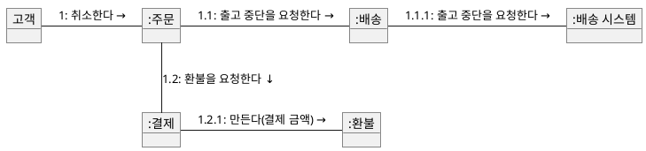

```java
final class 결제 {
    final 금액 결제금액;
    private final 결제시스템 결제시스템;
    Optional<환불> 환불 = Optional.empty();
    // ... 생략
}

final class 주문 {
    private 결제 결제;
    private 배송 배송;
    주문상태 상태 = 주문상태.결제대기;

    void 결제되었다(결제 결제, 배송 배송) {
        전이(주문상태.결제대기, 주문상태.결제완료);
        this.결제 = 결제;
        this.배송 = 배송;
    }
    // ... 생략
}
```

**강사 노트**

- 커뮤니케이션 다이어그램을 최종 객체 구조나 연관의 정본으로 쓰지 않는다(저장소 `references/sw-engineering/uml/communication.md`). 연관으로 둘지는 정적 모델에서 판단한다.

---

## 31. 상태

**다이어그램 — 상태 기계 다이어그램**

상태(State)는 어떤 **불변 조건이 성립하는 상황**이다. 사건이 일어나면 한 상태에서 다른 상태로 **전이**한다.

**인용문**

"상태는 어떤 (대개 암묵적인) **불변 조건이 성립하는 상황**을 모델링한다", "A State models a situation during which some (usually implicit) invariant condition holds.", Object Management Group, 2017

- 예: **취소됨** 상태에서는 "환불 금액 = 결제 금액"이 참이다.
- 상태 **값**은 정적 모델의 속성이고, 상태 **전이**는 동적 모델이다("03. 정적 모델 — 도메인 개념과 관계"의 「06. 상태 값과 상태 전이」).

**강사 노트**

- 인용 근거: OMG UML 2.5.1, §14.5.9.1 "State". 상태의 불변 조건이 정적 모델의 제약과 연결된다는 점은 「38. 상태와 불변 조건」에서 다시 다룬다.

---

## 32. 상태 기계 다이어그램

상태 기계 다이어그램은 **한 개념**이 사건에 따라 어떤 상태를 거치는지 보여준다.

**도식 — SVG**

```svg
<svg xmlns="http://www.w3.org/2000/svg" width="1000" height="200" viewBox="0 0 1000 200" role="img" aria-label="상태 기계 다이어그램 표기: 초기 상태, 상태, 전이, 종료 상태">
<style>text{font-family:sans-serif;font-size:20px;fill:#000;text-anchor:middle}.b{fill:#fff;stroke:#181818;stroke-width:2}</style>
<rect width="1000" height="200" fill="#fff"/>
<circle cx="90" cy="85" r="20" fill="#222"/>
<rect class="b" x="215" y="58" width="150" height="54" rx="22"/><text x="290" y="92">결제 완료</text>
<text x="600" y="68">사건 [가드] / 효과</text><line x1="460" y1="85" x2="730" y2="85" stroke="#1B3A6B" stroke-width="3"/><polygon points="740,85 720,75 720,95" fill="#1B3A6B"/>
<circle cx="890" cy="85" r="20" fill="#fff" stroke="#181818" stroke-width="3"/><circle cx="890" cy="85" r="12" fill="#222"/>
<text x="90" y="165">초기 상태</text><text x="290" y="165">상태</text><text x="600" y="165">전이</text><text x="890" y="165">종료 상태</text>
</svg>
```

### 표기와 사용법

| 표기 | 의미 | 이렇게 쓴다 |
|---|---|---|
| **초기 상태** — 채운 원 | 생애의 시작 | 하나만 둔다 |
| **상태** — 둥근 사각형 | 불변 조건이 성립하는 상황 | 상황의 이름(결제 완료). 화면·처리 단계가 아니다 |
| **전이** — 화살표 | 사건에 따른 상태 변화 | `사건 [가드] / 효과` — 가드가 참이면 전이한다 |
| **가드** — `[조건]` | 전이가 일어나는 조건 | 필요할 때만 쓴다. 같은 사건의 가드는 겹치지 않게 한다 |
| **효과** — `/ 결과` | 전이할 때 일어나는 일 | 업무 결과로 쓴다 |
| **종료 상태** — 테두리 안의 채운 원 | 생애의 끝 | 더 이상 사건에 반응하지 않는 상태 |

**강사 노트**

- 표기 기준: OMG UML 2.5.1, §14.2.4; 저장소 `references/sw-engineering/uml/state-machine.md`. 분석에서는 효과를 업무 결과로 쓴다. 진입·이탈 행위는 필요할 때만 쓴다.

---

## 33. 주문 상태 기계

주문의 생애를 상태 기계로 그린다. 주문은 외부 시스템의 **통보**로 전이한다. 상태 목록은 **교육용 가정**이다.

- **출고 준비 중·출고됨**은 배송 시스템의 상태라 주문에 두지 않는다.
- **배송 중·배송 완료**는 배송 시스템의 통보로, **취소됨**은 환불 완료 통보로 전이한다. 그 전까지는 **취소 처리 중**이다(「26. 주문 취소 시퀀스」).

**도식 — PlantUML**

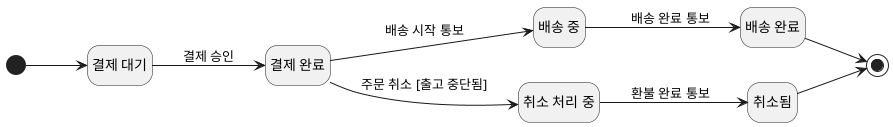

**페이지 분할**

### 상태 기계와 코드

**상태**는 `enum` 값, **전이**는 상태를 바꾸는 메서드, **가드**는 전이 전의 검사가 된다.

**도식 — PlantUML**


```java
enum 주문상태 { 결제대기, 결제완료, 배송중, 배송완료, 취소처리중, 취소됨 }
// ... 배송·환불·결제 생략
final class 주문 {
    // ... 생략
    void 배송시작통보() { 전이(주문상태.결제완료, 주문상태.배송중); }
    void 배송완료통보() { 전이(주문상태.배송중, 주문상태.배송완료); }
    void 환불완료통보() { 전이(주문상태.취소처리중, 주문상태.취소됨); }
    // ... 취소한다 생략

    private void 전이(주문상태 출발, 주문상태 도착) {
        if (상태 != 출발)
            throw new IllegalStateException(상태 + "에서는 " + 도착 + "이 될 수 없다");
        상태 = 도착;
    }
}
```

**강사 노트**

- 상태 목록과 전이는 **교육용 가정**이다. "03. 정적 모델 — 도메인 개념과 관계"의 주문 상태 값(결제 대기·결제 완료·배송 중·배송 완료·취소됨)에 취소 처리 중이 더해졌다. 이 차이는 「41. 상태와 정적 모델」에서 정적 모델로 되돌린다.
- 결제의 배송 요청은 주문 상태를 바꾸지 않는다. 결제 실패·배송 실패·출고 중단 거절·부분 취소는 이 모델의 범위 밖이다.

---

## 34. 출고와 배송 시작

**다이어그램 — 상태 기계 다이어그램**

"출고 전"과 "배송 시작 전"은 판단하는 **시스템이 다르다**. 여기서는 출고를 **물류센터 반출**, 배송 시작을 **운송 개시**로 구분하는 업무를 **가정한다**. 이 가정 아래 두 경계의 차이가 새로운 요구 질문을 만든다.

- **발견한 질문** — 출고는 됐지만 배송 시작 전인 주문의 취소를 허용하는가? 규칙대로라면 허용되지만, 가정대로라면 **물건은 이미 물류센터를 떠났다**. 모델이 아니라 **요구의 문제**이므로 업무 담당자에게 되묻는다.

| 규칙 | 조건 | 누가 판단하는가 |
|---|---|---|
| **배송지 변경** | 출고 전 | 배송 시스템 — 주문 시스템이 변경을 요청하고 결과를 받는다 |
| **주문 취소** | 배송 시작 전 | 주문 시스템(주문 상태)과 배송 시스템(출고 중단 결과) |

**강사 노트**

- "03. 정적 모델 — 도메인 개념과 관계"는 두 표현이 같은지와 출고를 누가 아는지를 질문으로 남겼다. 판단 주체가 다르다는 것은 공통 전제이고, 두 경계의 선후는 이 topic의 **교육용 가정**이다. 동적 모델은 그 가정 아래 드러나는 새로운 요구 질문을 보여준다. 실제 관계는 업무 담당자에게 확인한다. 답이 정해지면 "02. 요구 분석과 유스케이스"의 규칙과 계약을 고친다.

---

## 35. 가드와 금지된 전이

**다이어그램 — 상태 기계 다이어그램**

**가드**는 전이가 일어나는 조건이다. 전이가 없는 이유는 둘 중 하나다 — 확인된 규칙이 **금지**했거나, 요구가 아직 **미정**이다. 둘을 구분해 적는다.

- **가드** — `주문 취소 [출고 중단됨]`처럼 사건이 같아도 조건에 따라 전이가 갈린다.
- **금지된 전이** — 배송 중·배송 완료에서 나가는 `주문 취소` 전이가 없다. "배송 시작 이후에는 취소할 수 없다"는 규칙이 **전이의 부재**로 표현된다.
- **미정인 전이** — 결제 대기의 `주문 취소`는 확정된 요구가 아니다. 화살표가 없는 것은 금지가 아니라 **요구 질문**이다.
- **무시되는 사건** — 해당 상태에서 받은 사건이 전이를 일으키지 않으면, 시스템이 그 사건에 어떻게 응답할지는 요구로 정한다.

**페이지 분할**

### 금지된 전이에서 테스트로

**금지된 전이**는 거절되어야 한다. 배송 중의 취소가 거절되고, 취소는 출고 중단 → 환불 순서로 요청한다. **미정인 전이**는 테스트 기대값으로 정하지 않는다.

**도식 — PlantUML**


```java
class 주문생애테스트 {
    public static void main(String[] args) {
        var 요청 = new ArrayList<String>();
        결제시스템 결제시스템 = 금액 -> 요청.add("환불 " + 금액.원());
        배송시스템 출고전 = 번호 -> 요청.add("출고 중단");

        var 주문 = new 주문();
        주문.결제되었다(new 결제(new 금액(2000), 결제시스템),
                new 배송("배송-1", 출고전));
        주문.취소한다();
        확인(주문.상태 == 주문상태.취소처리중);
        확인(요청.equals(List.of("출고 중단", "환불 2000")));
        주문.환불완료통보();
        확인(주문.상태 == 주문상태.취소됨);

        var 배송중 = new 주문();
        배송중.결제되었다(new 결제(new 금액(1000), 결제시스템),
                new 배송("배송-2", 출고전));
        배송중.배송시작통보();
        거절(배송중::취소한다);
        System.out.println("주문 생애 확인");
    }
    // ... 확인·거절 생략
}
```

**강사 노트**

- 금지된 사건에 대한 외부 응답(예: 취소 불가 안내)은 유스케이스의 대안·예외 흐름이다. 상태 기계는 "일어날 수 없다"를, 유스케이스는 "그때 고객에게 무엇을 보여주는가"를 담당한다.

---

## 36. 시간 이벤트

**다이어그램 — 상태 기계 다이어그램**

시간이 지나는 것 자체도 **사건**이다. 시간 이벤트는 상태 기계와 유스케이스를 시작하는 정상적인 사건이다.

**도식 — PlantUML**

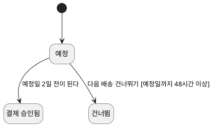

- **시간 이벤트** — "예정일 2일 전이 된다"(**교육용 가정**)는 아무도 요청하지 않아도 일어난다.
- `결제 승인됨`으로 바로 가는 전이는 **승인 성공을 축약**했다. 결제 요청과 승인은 따로 일어난다.

**강사 노트**

- 배송 회차는 시간 이벤트로 결제를 요청하고, 고객의 요청으로 건너뛸 수 있다. 시간이 된 사실과 외부 결제가 승인된 사실은 다른 사건이며, 그림은 승인 성공 경로만 보인다.
- "예정일 2일 전"은 **교육용 가정**이다. 48시간 조건은 "02. 요구 분석과 유스케이스"의 실습 조건을 가드로 옮긴 것이다. 두 사건이 가까운 시점에 겹치면 어느 쪽이 먼저인지는 요구로 확인한다.

---

## 37. 상태 폭증

**다이어그램 — 상태 기계 다이어그램**

모든 상태 조합을 평평하게 그리면 상태 기계는 **감당할 수 없이 커진다**. 판단이 필요한 개념과 상태에만 그린다.

**인용문**

"복잡한 시스템은 **기하급수적으로 늘어나는 상태** 때문에 이런 단순한 방식으로는 유익하게 기술할 수 없다", "a complex system cannot be beneficially described in this naive fashion, because of the unmanageable, exponentially growing multitude of states", David Harel, 1987

- **대상을 고른다** — 생애와 규칙이 중요한 개념(주문·배송 회차)만 그린다.
- **축을 나눈다** — 결제 상태와 배송 상태를 한 상태 이름에 곱해 넣지 않는다.
- **묶는다** — 같은 전이를 공유하는 상태는 상위 상태로 묶을 수 있다(예: 배송 시작 전).

**강사 노트**

- 인용 근거: Harel, 1987, §1. Harel의 상태 차트는 계층·병행·통신으로 이 문제를 줄인다. 이 과정에서는 계층(상위 상태)까지만 개념으로 소개한다.

---

## 38. 상태와 불변 조건

**다이어그램 — 상태 기계 다이어그램**

각 상태의 **불변 조건**은 정적 모델의 **제약**과 대응한다. 상태 기계와 제약을 맞대면 모순을 찾을 수 있고, 상태에 따라 **다중성이 달라지는** 연관은 규칙으로 남긴다.

| 상태 | 불변 조건 | 정적 모델의 요소 |
|---|---|---|
| **결제 완료** | 결제가 하나 있다 | 주문–결제 `0..1` → 이 상태에서는 `1` |
| **취소 처리 중** | 환불이 있고 완료 통보 전이다 | 결제–환불 연관, 환불 상태 |
| **취소됨** | 환불 금액 = 결제 금액 | 제약 `환불 금액 ≤ 결제 금액` |
| **배송 중** | 배송이 하나 있다 | 주문–배송 `0..1` → 이 상태에서는 `1` |

**강사 노트**

- "03. 정적 모델 — 도메인 개념과 관계"의 「39. 제약」과 「30. 다중성과 업무 규칙」에 연결된다. 환불 상태(승인 전·완료)는 상태 기계가 드러낸 새 속성이다.

---

## 39. 교차검토 절차

정적 모델과 동적 모델을 **서로의 질문으로** 검토한다. 한 번에 끝나지 않고 반복한다.

1. SSD의 시스템 오퍼레이션마다 **계약의 사후조건**을 정적 모델 요소로 설명한다.
2. 상호작용의 **참여자와 링크**가 정적 모델의 개념·연관에 있는지 확인한다.
3. 상태 기계의 **상태 값**이 정적 모델의 속성 값과 같은지 확인한다.
4. 상태의 **불변 조건**이 정적 모델의 제약과 모순되지 않는지 확인한다.
5. 발견한 누락·모순을 **모델과 요구로 되돌린다**.

**강사 노트**

- "03. 정적 모델 — 도메인 개념과 관계"의 「56. 시나리오 교차검토」가 요구 문장을 모델에 댔다면, 이 절차는 동적 모델을 모델에 댄다.

---

## 40. 계약과 정적 모델

「10. 계약의 정제」의 **사후조건**을 정적 모델 요소나 외부 요청으로 설명할 수 있는지 대조한다.

| 계약 | 사후조건 | 설명하는 요소 | 결과 |
|---|---|---|---|
| 결제 | 결제가 승인되어 주문과 연결되었다 | 결제 개념, 주문–결제 연관 | ✔ |
| 결제 | 재고 차감·입금·영수증을 요청했다 | 외부 시스템의 결과 — 정적 모델 밖 | ✔ 요청만 보장 |
| 결제 | 배송을 요청했다 | 배송 개념, 주문–배송 연관 | ✔ |
| 주문 취소 | 출고 중단을 받아들였다 | 배송 상태? | ✘ **출고 중단을 기억할 값이 없다** |
| 주문 취소 | 환불이 생겼다, 금액 = 결제 금액 | 결제–환불 연관, 제약 | ✔ |
| 주문 취소 | 주문 상태가 취소 처리 중이다 | 주문 상태 값? | ✘ **값이 없다** |

**강사 노트**

- 외부 시스템이 소유한 결과(재고, 입금, 영수증)는 주문 시스템의 정적 모델로 설명하지 않는다. 계약이 "요청했다"로 쓰인 이유다.

---

## 41. 상태와 정적 모델

**다이어그램 — 상태 기계 다이어그램**

상태 기계의 상태 값과 정적 모델의 주문 상태 값을 대조한다. 판단 질문은 **이 상태가 주문의 것인가, 배송·환불의 것인가, 다른 시스템의 것인가**다. 한 개념에 모든 상태를 모으면 상태 폭증이 된다.

| 상태 | 정적 모델 | 결과 |
|---|---|---|
| 결제 대기, 결제 완료, 배송 중, 배송 완료, 취소됨 | 주문 상태 값 있음 | ✔ |
| 취소 처리 중 | 없음 | ✘ 값 추가 또는 **환불 상태**로 분리 |
| 출고 중단됨 | 없음 | ✘ 배송의 **배송 상태** 값으로 |
| 출고 준비 중, 출고됨 | — | 배송 시스템의 상태. 주문 시스템에 두지 않는다 |

**강사 노트**

- 출고 관련 상태를 배송 시스템에 두면 주문 상태 기계는 단순해진다. 주문 시스템의 배송 개념은 필요한 만큼(배송 상태)만 기억한다. 어느 쪽에 둘지는 업무 규칙이 어느 개념·시스템에 걸리는지로 판단한다.

---

## 42. 상호작용과 정적 모델

**다이어그램 — 시퀀스·커뮤니케이션 다이어그램**

상호작용의 **참여자·링크·메시지**를 정적 모델과 대조한다.

| 상호작용에서 본 것 | 정적 모델 | 결과 |
|---|---|---|
| 참여자 — 장바구니·주문·주문 항목·상품·결제·환불·배송 | 개념 있음 | ✔ |
| 참여자 — 결제·상품·배송·회계 시스템 | 지원 액터 | ✔ 정적 모델에 넣지 않는다 |
| 링크 — 장바구니–주문 | 연관 없음 | ✔ 일시적 연결 |
| 메시지 — 출고 중단의 결과 | 배송 상태 값 없음 | ✘ 값 추가 |
| 메시지 — 환불을 만든다 | 결제–환불 `0..1` | ✔ 전체 취소 전제에서 |

**강사 노트**

- 메시지 자체를 정적 모델의 오퍼레이션으로 옮기지 않는다. 어떤 객체가 어떤 책임을 가질지는 "07. 책임·협력·계약"에서 정한다.

---

## 43. 누락과 모순

교차검토로 발견한 것을 **모델을 고칠 것**과 **요구에 되물을 것**으로 나눈다.

- **정적 모델에 반영** — 주문 상태 `취소 처리 중`(또는 환불 상태), 배송 상태 `출고 중단됨`
- **요구에 되물음** — 재고가 모자라면? 출고됐지만 배송 시작 전인 주문의 취소는? 환불 실패 시 주문은 취소 처리 중에 머무는가?
- **범위 밖으로 남김** — 결제 실패, 부분 취소, 배송 실패

### 되돌릴 곳

발견은 별도 문서가 아니라 **요구 산출물과 정적 모델을 고쳐** 반영한다.

| 발견 | 되돌릴 곳 |
|---|---|
| 재고 차감 시점 | 명세서 규칙, 정제된 SSD의 순서 |
| 배송 시작·완료, 환불 완료는 통보로 온다 | 이벤트 목록, 정제된 SSD |
| 출고 중단이 거절될 수 있다 | 명세서 예외 흐름, 취소 계약 |
| 취소가 즉시 끝나지 않는다 | 명세서 결과, 계약, 정적 모델의 상태 값 |

**강사 노트**

- 발견한 누락은 모델만의 문제가 아니라 요구의 누락일 수 있다. "02. 요구 분석과 유스케이스"의 「09. 반복적 접근」처럼 요구·정적 모델·동적 모델을 함께 고친다.

---

## 44. 적정 동적 모델링

동적 모델은 **질문에 답할 만큼만** 그린다. 모든 흐름과 모든 개념에 모든 다이어그램을 그리지 않는다.

**인용문**

"모델과 문서는 **당면한 작업에 충분**해야 한다. 애자일 실무자들의 말로는 '겨우 충분할 만큼'이다", "agile models and agile documents are sufficient for the task at hand, or as agilists like to say they are just barely good enough", Scott W. Ambler

| 그릴 때 | 그리지 않을 때 |
|---|---|
| 규칙·예외가 많은 흐름 | 단순 조회·자명한 흐름 |
| 여러 개념·외부 시스템이 얽힌 상호작용 | 한 개념 안에서 끝나는 처리 |
| 생애와 전이 규칙이 중요한 개념 | 상태가 없거나 두세 개뿐인 개념 |
| 정적 모델의 누락이 의심될 때 | 새 판단이 나오지 않을 때 |

**강사 노트**

- 인용 근거: Scott W. Ambler, [Just Barely Good Enough Models and Documents](https://agilemodeling.com/essays/barelygoodenough.htm)(게시 연도 미표기).
- 「08. 프로세스와 동적 분석」과 함께 본다. 분석을 독립 단계로 두면 "충분한 만큼"의 기준이 더 높아진다. 모델링의 추가 비용과 위험 감소 판단은 "11. 통합 설계와 적정 모델링"에서 다룬다.

---

## 45. 잘못된 관행 — 설계 객체 혼입

**다이어그램 — 시퀀스 다이어그램**

분석의 상호작용에 **설계 객체**를 넣으면 도메인 객체 사이의 의미가 기술 구조에 가려진다.

| 잘못된 예 | 바른 예 |
|---|---|
| 참여자: 주문 컨트롤러, 주문 서비스, 주문 저장소 | 참여자: 주문, 결제, 환불, 배송 |
| 메시지: `cancel(orderId): boolean` | 메시지: 취소한다 |
| 메시지: DB 저장, 트랜잭션 커밋 | 업무 결과: 주문이 취소됨이 된다 |
| 분석 시퀀스를 설계에 그대로 옮긴다 | 책임 배치는 설계에서 다시 결정한다 |

**강사 노트**

- 설계에서는 오른쪽 열의 설계 객체와 오퍼레이션이 정상이다("07. 책임·협력·계약"). 문제는 **분석 단계**에 섞이는 것이다.

---

## 46. 잘못된 관행 — 정적 모델만 있는 분석

클래스 다이어그램만 그리고 분석을 끝내면, 개념·연관·속성·상태가 **사건으로 검증되지 않은 채** 설계로 넘어간다.

| 잘못된 예 | 드러나지 않는 것 | 바른 예 |
|---|---|---|
| 도메인 모델만 그리고 분석 종료 | 환불·배송 같은 누락 개념 | 주요 흐름을 상호작용으로 따라간다 |
| 주문 상태를 값 목록으로만 정의 | 금지된 전이, 중간 상태 | 상태 기계로 전이를 확인한다 |
| 연관을 추측으로 확정 | 실제로 쓰이지 않는 연관, 빠진 연관 | 링크와 대조한다 |

**강사 노트**

- 「08. 프로세스와 동적 분석」의 판단을 잘못된 예로 되짚는다. 분석과 설계를 통합하는 프로세스라면 이 검증을 설계의 상호작용과 테스트가 이어받아야 한다.

---

## 47. 잘못된 관행 — 모든 흐름 그리기

**다이어그램 — 시퀀스·커뮤니케이션 다이어그램**

모든 시나리오·조회·예외마다 다이어그램을 그리면 **핵심 흐름이 묻힌다**.

| 잘못된 예 | 바른 예 |
|---|---|
| 조회·등록 같은 단순 흐름마다 시퀀스를 그린다 | 규칙·예외가 많은 흐름만 그린다 |
| 모든 요청에 응답 화살표를 그린다 | 의미 있는 응답만 그린다 |
| 방어 코드 수준의 예외를 모두 조각으로 넣는다 | 목표 달성 경로가 달라지는 경우만 넣는다 |
| 같은 상호작용을 시퀀스와 커뮤니케이션으로 모두 그린다 | 질문에 맞는 하나를 고른다 |

**강사 노트**

- 「44. 적정 동적 모델링」의 기준을 잘못된 예로 되짚는다.

---

## 48. 잘못된 관행 — 순서도가 된 활동

활동 다이어그램을 **화면 조작 순서나 코드 제어 흐름**의 순서도로 쓰면 업무 흐름과 책임이 보이지 않는다.

| 잘못된 예 | 바른 예 |
|---|---|
| 버튼 클릭·화면 이동을 행동으로 나열한다 | 업무 의미의 행동을 쓴다 |
| 반복문·변수 대입 같은 코드 흐름을 그린다 | 업무 흐름만 그린다 |
| 수영 레인 없이 누가 하는지 알 수 없다 | 레인으로 책임자를 나눈다 |
| 결정(마름모)과 병행(굵은 막대)을 섞어 쓴다 | 분기는 마름모, 병행은 막대 |

**강사 노트**

- 저장소 기준(`references/sw-engineering/uml/activity.md`)은 책임과 행동·제어 의미가 없는 순서도 대용으로 활동 다이어그램을 쓰지 말라고 정한다.

---

## 49. 잘못된 관행 — 상태 기계 오용

상태 기계에 **상태가 아닌 것**을 넣거나 상태를 흩어 두면 규칙이 사라진다.

| 잘못된 예 | 바른 예 |
|---|---|
| 입력 중·저장 중 같은 화면·처리 단계를 상태로 둔다 | 업무적으로 의미 있는 상황만 상태로 둔다 |
| 결제됨·출고됨·취소됨을 참·거짓 플래그 여러 개로 둔다 | 하나의 상태 값과 전이로 표현한다 |
| 결제·배송 상태를 곱해 모든 조합을 상태로 만든다 | 축을 나누거나 상위 상태로 묶는다 |
| 사건 이름 없는 화살표 | 모든 전이에 사건, 필요하면 가드 |

**강사 노트**

- 플래그 여러 개는 "결제되지 않았는데 출고됨"처럼 불가능한 조합을 허용한다. 상태 기계는 가능한 상태와 전이만 허용한다.

---

## 50. 잘못된 관행 — 모델 간 불일치

모델마다 이름과 값이 다르면 **서로를 검증할 수 없다**.

| 잘못된 예 | 바른 예 |
|---|---|
| 정적 모델은 "배송 중", 상태 기계는 "배송 진행" | 용어집의 이름을 모든 모델에 쓴다 |
| 상호작용의 참여자가 정적 모델에 없다 | 개념을 추가하거나 참여자를 고친다 |
| 동적 모델에서 찾은 상태를 정적 모델에 반영하지 않는다 | 발견 즉시 정적 모델과 용어집을 고친다 |
| 계약의 사후조건이 모델에 없는 말을 쓴다 | 모델의 요소로 사후조건을 쓴다 |

**강사 노트**

- "03. 정적 모델 — 도메인 개념과 관계"의 용어집이 모든 모델의 기준이다.

---

## 51. 동적 모델에서 코드로

네 동적 다이어그램은 **같은 행위**를 다른 면에서 본다. 주문 취소를 코드로 옮기면 각 다이어그램의 요소가 코드의 서로 다른 곳에 나타난다.

| 다이어그램 | 요소 | 코드 |
|---|---|---|
| **활동** | 행동 · 결정 | 메서드 호출 · `if` |
| **활동** | 분기·합류 | 순서에 의존하지 않는 호출 · 모두 끝난 뒤 진행 |
| **시퀀스** | 메시지 · 생성 | 받는 객체의 메서드 · `new` |
| **시퀀스** | 비동기 메시지 · `alt`·`loop` | 완료를 기다리지 않는 요청 · `if`·`for` |
| **커뮤니케이션** | 링크 · 번호 `1.1` | 참조 필드 · 호출 안의 호출 |
| **상태 기계** | 상태 · 전이 | `enum` 값 · 상태를 바꾸는 메서드 |
| **상태 기계** | 가드 · 금지된 전이 | 전이 전 검사 · 거절 |
| **요구의 예** | 허용·거절 예 | 테스트 |

비동기의 기준은 반환값이 아니라 **완료를 기다리는가**다. 예제는 전달 방식(큐·이벤트)을 생략하고 **요청의 기록**으로 순서만 확인한다.

- 코드가 **보장하는 것** — 코드에 없는 전이는 일어나지 않고, 취소는 출고 중단 뒤에 환불을 요청한다. **보장하지 않는 것** — 결제 대기 취소의 정책, 출고 중단 거절·환불 실패의 정책, 통보가 오지 않을 때의 처리. 요구 질문으로 남긴 것이다.

**강사 노트**

- 표의 예는 「15. 유스케이스와 활동」, 「26. 주문 취소 시퀀스」, 「30. 링크와 연관」, 「33. 주문 상태 기계」, 「35. 가드와 금지된 전이」에 있다.
- "01. OOAD 개요"의 다섯 다이어그램 코드, "02. 요구 분석과 유스케이스"의 SSD·계약 코드, "03. 정적 모델 — 도메인 개념과 관계"의 클래스 다이어그램 코드에 이어 동적 모델까지 **다이어그램–코드–테스트**를 끝까지 이었다.
- 도메인 객체가 외부 시스템 인터페이스(`배송시스템`, `결제시스템`)를 직접 가진 것은 **설계의 결정**이다. 분석 모델에 되돌려 그리지 않는다(「45. 잘못된 관행 — 설계 객체 혼입」). 누가 외부와 이야기할지는 "05. 구조적 경계와 의존성"과 "07. 책임·협력·계약"에서 다시 정한다.
- 코드의 `enum`에는 **취소처리중**이 있다. 「41. 상태와 정적 모델」에서 정적 모델의 상태 값에 더하기로 한 결과다. 모델과 코드의 상태 값은 한 원천이어야 한다(DRY).

---

## 52. 동적 모델의 한계

분석의 동적 모델은 **무엇이 일어나는지**를 보여줄 뿐, **어떤 구조로 실현할지**는 정하지 않는다.

- **책임** — 주문 취소를 어느 객체가 조정하는가? → "07. 책임·협력·계약"
- **경계** — 주문과 배송은 같은 경계 안에 있는가? → "05. 구조적 경계와 의존성"
- **실패와 동시성** — 출고와 취소가 동시에 일어나면? 환불이 실패하면? → 요구 확인과 설계
- **기술** — 이벤트를 어떤 방식으로 전달하는가? → "10. 기술 제약과 도메인 의미 보존"

**강사 노트**

- 동시성·실패 처리의 기술적 수단은 설계와 구현의 문제지만, **어떤 결과를 보장해야 하는지**는 요구다. 동적 모델은 그 질문을 드러내는 데까지 다룬다.

---

## 53. 실습 — 동적 모델

「정기배송을 신청한다」의 기본 흐름과 **도메인 모델**을 LLM에 제공하여 **시퀀스 다이어그램**과 정기배송의 **상태 기계 다이어그램**을 만들고, 점검 항목으로 **피드백**하여 완성하십시오.

- **투입물**
  + 실습 2의 **유스케이스 명세서**와 실습 3의 **도메인 모델 상세** — 실제로는 여러분의 결과물을 이어 씁니다.
- **프롬프트**
  + ① "위 기본 흐름을 도메인 모델의 객체로 PlantUML **시퀀스 다이어그램**을 그려줘. 화면·컨트롤러 같은 설계 객체는 넣지 마."
  + ② "정기배송의 **상태 기계 다이어그램**을 PlantUML로 그려줘. 전이마다 사건, 가드, 동작을 표시해줘."
- **점검 항목**
  1. **참여 객체** — 도메인 모델의 개념만 참여하는가?
  2. **연관** — 메시지가 도메인 모델의 연관을 따라 흐르는가?
  3. **반복·외부** — 담기의 반복과 결제·배송 요청이 있는가?
  4. **상태** — 정기배송의 상태가 **사건**으로 바뀌는가?
  5. **가드·시간** — 요청 결과의 가드와 만료 같은 **시간 이벤트**가 있는가?
  6. **교차 검토** — 도메인 모델에 없는 속성·연관이 필요하면 되돌렸는가?
- **결과물** — 시퀀스와 상태 기계 다이어그램. 실습 5의 입력이 됩니다.

**강사 노트**

- 분석의 상호작용은 **도메인 객체 사이**다. 화면·컨트롤러·저장소는 설계에서 다룬다.
- LLM은 모든 흐름을 한 시퀀스에 넣거나, 상태 기계를 순서도처럼 그리기 쉽다.

---

## 54. 시퀀스 다이어그램 (안)

기본 흐름을 **도메인 객체의 상호작용**으로 펼쳤다. 장바구니가 정기배송을 만들고, 정기배송이 결제·확정·배송 요청을 이끈다.

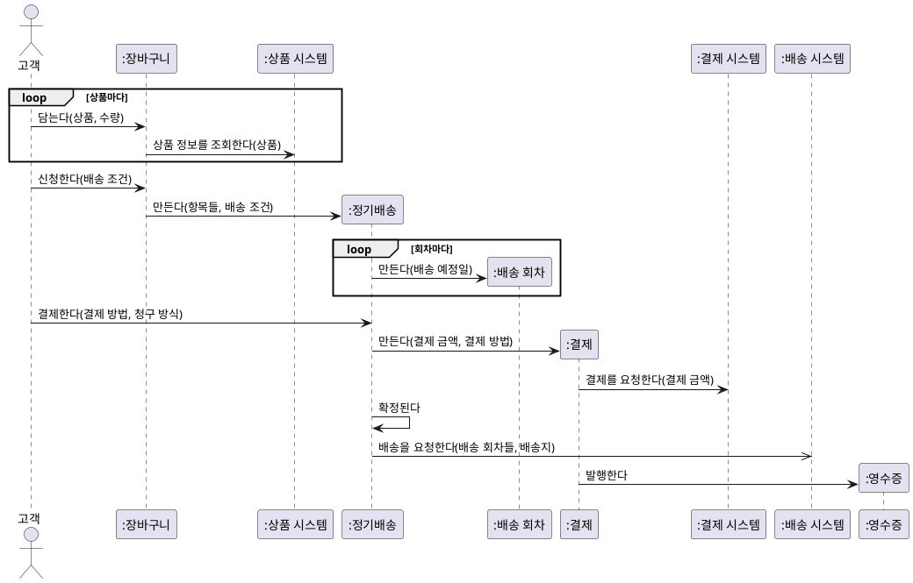

**강사 노트**

- 장바구니 항목·정기배송 항목의 생성은 읽기 쉽도록 생략했다.
- 배송 요청은 **비동기**다. 배송 시스템이 회차마다 배송한다.

---

## 55. 커뮤니케이션 다이어그램 (안)

같은 상호작용을 **링크와 메시지 번호**로 보였다. 링크는 도메인 모델의 **연관**과 일치해야 한다.

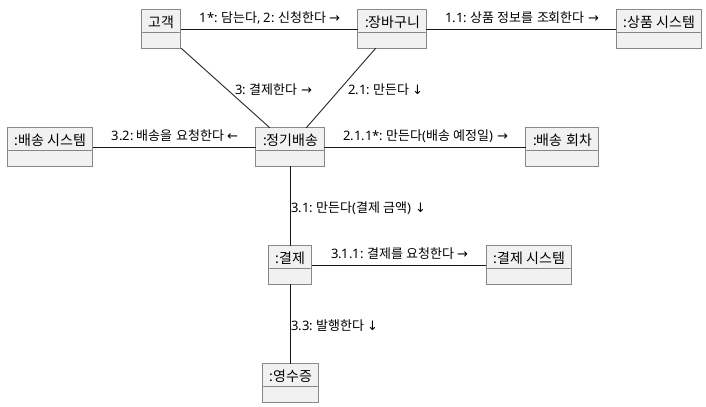

**강사 노트**

- 반복은 번호 뒤의 `*`로, 순서는 번호로 표현한다. 프레임(loop)은 쓰지 않는다.
- 링크가 도메인 모델의 연관과 맞는지 확인하는 것이 커뮤니케이션 다이어그램의 쓸모다.

---

## 56. 상태 기계 다이어그램 (안)

정기배송은 결제와 배송 요청의 결과에 따라 **확정**되거나 **신청 실패**가 되고, 해지나 만료로 끝난다.

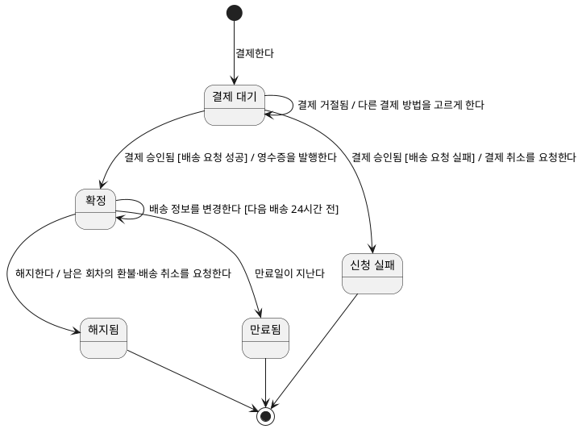

**강사 노트**

- 만료는 **시간 이벤트**다. 사람이 아니라 시간이 전이를 일으킨다.
- 코드에서는 상태를 enum이나 상태 패턴으로 옮기고, 전이를 한 곳에서 검사한다.

---

## 57. 동적 모델 보완 (안)

동적 모델을 만들며 발견한 것은 **후속 작업에 영향을 미치는 경우에만** 이전 산출물에 반영한다.

- **도메인 모델**(실습 3)
  - **정기배송 상태** — 정기배송에 `정기배송 상태`를 더한다(결제 대기·확정·신청 실패·해지됨·만료됨). "정기배송은 상태를 갖지 않는다"를 고친다.
  - **회차 상태** — 회차별 취소·배송은 배송 회차가 갖는다. 해지는 **정기배송 상태**로 판단한다.
  - **생성 책임** — 장바구니가 정기배송을, 정기배송이 배송 회차와 결제를 만든다.
- **유스케이스 명세서**(실습 2)
  - **7a 배송 요청 실패** — "결제 승인 후 미확정" 상태가 있음을 밝힌다.
- **※ 현행화 기준**
  - **반영** — 정기배송 상태, 생성 책임. 실습 5의 패키지·코드의 입력이 된다.
  - **기록만** — 유스케이스 명세서의 7a 설명.

**강사 노트**

- 정적 모델만으로는 상태의 주인을 잘못 판단하기 쉽다. 동적 분석이 이를 바로잡는다 — 「41. 상태와 정적 모델」.

---

## 58. 요약

이 세션은 사건에 따른 **상호작용과 상태 변화**를 동적 모델로 확인하고, 정적 모델과 **서로 검증**했다.

### 동적 모델의 핵심

- **정적·동적 모델** — 존재와 사건. 서로의 질문으로 검증한다.
- **분석과 설계** — 분석은 도메인 객체, 설계는 설계 객체의 상호작용
- **다이어그램** — 활동(유스케이스)·SSD(시나리오)에서 출발해 시퀀스 중심, 커뮤니케이션·상태 기계로 보완
- **모델과 코드** — 결정은 `if`, 메시지는 받는 객체의 메서드, 링크는 필드, 상태는 `enum`, 금지된 전이는 거절 테스트
- **교차검토** — 계약·상호작용·상태를 정적 모델에 대어 누락과 모순을 찾는다
- **적정 모델링** — 질문에 답할 만큼만 그린다

### 다음 세션

- "**05. 구조적 경계와 의존성**" — 분석 결과를 바탕으로 책임이 놓일 경계와 의존성 방향을 판단한다.

**강사 노트**

- 주문 시스템이 외부 시스템에 보내는 요청과 받는 통보는 다음 세션에서 **의존 방향**의 판단(주문 시스템이 배송 시스템을 아는가, 통보를 받는가?)으로 이어진다.
