--------------------
Session 명: 04. 동적 모델 — 상호작용과 상태
--------------------

## 목차

01. 세션 목표
02. 정적 모델에서 동적 모델로
03. 요구 산출물에서 출발
04. 상호작용 모델
05. 활동 다이어그램
06. 시퀀스 다이어그램
07. 커뮤니케이션 다이어그램
08. 상태 기계 다이어그램
09. 교차검토
10. 적정 동적 모델링
11. 잘못된 관행
12. 동적 모델에서 코드로
13. 실습 — 동적 모델
14. 요약

---

## 01. 세션 목표

시나리오를 동적 모델로 실행해 보고, 정적 모델의 개념·연관·상태가 사건을 설명하는지 **검증**한다.

- 요구 분석의 **정제된 SSD·계약**에서 출발해 **도메인 객체 수준**의 동적 모델을 그린다.
- **활동 다이어그램**으로 유스케이스와 시스템 사이의 업무 흐름을 보이고 **DFD**와 비교한다.
- **시퀀스·커뮤니케이션 다이어그램**으로 도메인 객체의 상호작용을 그리고 연관을 검증한다.
- **상태 기계 다이어그램**으로 사건에 따른 전이와 **금지된 전이**를 확인한다.
- "03. 정적 모델 — 도메인 개념과 관계"의 정적 모델을 완성된 결과가 아니라 **검증할 가설**로 보고, 누락과 모순을 요구와 모델에 되돌린다.
- **추상화 수준**에 맞춰 필요한 만큼만 그리고, **잘못된 관행**을 피한다.
- 동적 모델을 **코드**와 **금지된 전이 테스트**로 잇는다.

**강사 노트**

- "03. 정적 모델 — 도메인 개념과 관계"는 **무엇이 존재하는지**를 다뤘다. 동적 모델은 **무엇이 일어나는지**를 다룬다. 설계 객체의 상호작용은 "06. 분석 모델에서 설계 모델로"와 "07. 책임·협력·계약"에서 다룬다.

---

## 02. 정적 모델에서 동적 모델로

---

## 남은 질문

정적 모델은 시나리오에서 찾은 개념과 관계에 대한 **가설**이다. 어떤 순서로 무엇이 바뀌는지 실행해 보아야 그 가설의 누락과 모순을 찾을 수 있다. "03. 정적 모델 — 도메인 개념과 관계"는 다음 질문을 남겼다.

- **출고와 배송 시작**은 같은 사건인가?
- **주문 상태**는 어떤 사건으로 어떤 값에서 어떤 값으로 바뀌는가?
- **환불이 완료되지 않으면** 주문은 어떤 상태인가?
- 주문 취소에서 주문 시스템 안의 개념과 외부 시스템은 **어떤 순서**로 상호작용하는가?

**도식 — Mermaid — 교차검토의 흐름**

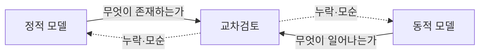

**강사 노트**

- 질문은 "03. 정적 모델 — 도메인 개념과 관계"의 「17. 모델의 검토」에서 남긴 것이다. 사례의 전제(결제 완료·배송 시작 전 전체 취소, 출고 전 배송지 변경)는 그대로 유지한다.
- 학습을 위해 요구 분석과 정적·동적 분석을 세션으로 나눴지만, 실제로는 함께 반복한다.

---

## 동적 모델

동적 모델(Dynamic Model)은 **사건**과 그에 따른 **상호작용**·**상태 변화**를 표현한다.

**인용문**

"사건은 **의미 있거나 주목할 만한 발생**이다", "An event is a significant or noteworthy occurrence.", [Larman 2004]

주문 시스템도 **사건에 반응**한다. 사건이 일어나면 개념들이 상호작용하고, 그 결과 상태가 바뀐다.

**표 — 주문의 사건과 반응**

| 사건 | 상호작용 | 상태 변화 |
|---|---|---|
| 고객이 결제한다 | 주문 → 결제 → 결제 시스템 | 주문: 결제 대기 → 결제 완료 |
| 고객이 주문을 취소한다 | 주문 → 배송·결제 → 환불 | 주문: 결제 완료 → 취소 처리 중 |
| 배송 시스템이 배송 시작을 알린다 | 배송 시스템 → 주문 | 주문: 결제 완료 → 배송 중 |

**강사 노트**

- 인용 근거: Larman 2004 원문 확인(상태 기계 장의 사건 정의). "02. 요구 분석과 유스케이스"에서 요구의 공통 단위로 본 이벤트가 동적 모델의 출발점이다.
- 표는 사건별 상호작용과 상태 변화를 대응시킨다. `취소 처리 중`은 주문 취소 계약을 동적으로 검토하면서 발견한다.

---

## 분석의 동적 모델

같은 장면도 **수준**에 따라 다르게 그린다. 도메인 모델 **전**에는 시스템 수준의 SSD가 있고, 도메인 모델 **뒤**에는 도메인 객체 수준의 동적 모델이 따른다.

**도식 — SVG — 동적 모델의 세 수준**

```svg:uml
<svg xmlns="http://www.w3.org/2000/svg" width="1100" height="300" viewBox="0 0 1100 300" role="img" aria-label="주문 취소를 시스템 수준, 도메인 객체 수준, 설계 객체 수준으로 그린 세 시퀀스">
<style>text{font-family:sans-serif;font-size:15px;fill:#000;text-anchor:middle}.t{font-size:21px;font-weight:bold}.b{fill:#fff;stroke:#1B3A6B;stroke-width:1.4}.p{fill:none;stroke:#181818;stroke-width:1.2}.l{stroke:#1B3A6B;stroke-width:1.2;stroke-dasharray:6,5}.f{stroke:#1B3A6B;stroke-width:1.6;fill:none}</style>
<defs><marker id="f" viewBox="0 0 12 12" refX="11" refY="6" markerWidth="12" markerHeight="12" orient="auto" markerUnits="userSpaceOnUse"><path d="M0,0 L12,6 L0,12 Z" fill="#1B3A6B"/></marker></defs>
<rect width="1100" height="300" fill="#fff"/>
<text class="t" x="185" y="28">시스템 수준</text>
<text class="t" x="550" y="28">도메인 객체 수준</text>
<text class="t" x="915" y="28">설계 객체 수준</text>
<rect class="p" x="20" y="42" width="330" height="200"/>
<rect class="p" x="385" y="42" width="330" height="200"/>
<rect class="p" x="750" y="42" width="330" height="200"/>
<rect class="b" x="30" y="58" width="90" height="30"/><text x="75" y="79">고객</text>
<rect class="b" x="130" y="58" width="105" height="30"/><text x="182" y="79">:주문 시스템</text>
<rect class="b" x="245" y="58" width="95" height="30"/><text x="292" y="79">:결제 시스템</text>
<line class="l" x1="75" y1="88" x2="75" y2="230"/><line class="l" x1="182" y1="88" x2="182" y2="230"/><line class="l" x1="292" y1="88" x2="292" y2="230"/>
<line class="f" x1="75" y1="140" x2="180" y2="140" marker-end="url(#f)"/><text x="128" y="130">주문을 취소한다</text>
<line class="f" x1="182" y1="195" x2="290" y2="195" marker-end="url(#f)"/><text x="237" y="185">환불을 요청한다</text>
<rect class="b" x="395" y="58" width="90" height="30"/><text x="440" y="79">고객</text>
<rect class="b" x="500" y="58" width="95" height="30"/><text x="547" y="79">:주문</text>
<rect class="b" x="610" y="58" width="95" height="30"/><text x="657" y="79">:결제</text>
<line class="l" x1="440" y1="88" x2="440" y2="230"/><line class="l" x1="547" y1="88" x2="547" y2="230"/><line class="l" x1="657" y1="88" x2="657" y2="230"/>
<line class="f" x1="440" y1="140" x2="545" y2="140" marker-end="url(#f)"/><text x="493" y="130">취소한다</text>
<line class="f" x1="547" y1="195" x2="655" y2="195" marker-end="url(#f)"/><text x="602" y="185">환불을 요청한다</text>
<rect class="b" x="757" y="58" width="104" height="30"/><text x="809" y="79">:OrderService</text>
<rect class="b" x="868" y="58" width="95" height="30"/><text x="915" y="79">:Order</text>
<rect class="b" x="972" y="58" width="100" height="30"/><text x="1022" y="79">:Payment</text>
<line class="l" x1="809" y1="88" x2="809" y2="230"/><line class="l" x1="915" y1="88" x2="915" y2="230"/><line class="l" x1="1022" y1="88" x2="1022" y2="230"/>
<line class="f" x1="809" y1="140" x2="913" y2="140" marker-end="url(#f)"/><text x="862" y="130">cancel()</text>
<line class="f" x1="915" y1="195" x2="1020" y2="195" marker-end="url(#f)"/><text x="968" y="185">requestRefund()</text>
<text x="185" y="270">요구 분석 — SSD·계약</text>
<text x="550" y="270">이 세션 — 분석 시퀀스</text>
<text x="915" y="270">설계 — 설계 시퀀스</text>
</svg>
```

- **왼쪽** — 시스템은 블랙박스다. 도메인 모델이 없어도 그릴 수 있다.
- **가운데** — 블랙박스를 열어 **도메인 모델의 개념**이 주고받는 것을 본다. 개념·연관·상태를 **발견하고 검증**한다.
- **오른쪽** — 설계 객체에 **책임을 배치**한다. 이름은 용어집의 영문명이다.

**강사 노트**

- 반복·점진적 개발에서 분석과 설계를 함께 하면 가운데를 간단히 하고 오른쪽에 집중한다. 이 과정처럼 **단계별**로 구성하면, 도메인 모델 전의 SSD가 있듯이 도메인 모델 뒤에는 도메인 객체 수준의 동적 모델이 따라야 한다. 사건과 상호작용을 따라가야 정적 모델의 누락과 모순이 드러나기 때문이다.
- Larman 2004는 상호작용 다이어그램을 객체 설계에서 쓴다. 이 과정은 단계별 구성이므로 도메인 객체 수준의 상호작용을 분석에서 먼저 그린다(`course-design.md`의 「원전 적용 결정」).
- 분석의 메시지는 "누가 누구에게 무엇을 알리거나 요청하는가"라는 업무 의미다. 어느 객체가 최종 책임을 지는지는 설계에서 다시 정한다("06. 분석 모델에서 설계 모델로").

---

## 다이어그램과 질문

동적 모델은 **답하려는 질문**에 따라 고른다. 한 다이어그램으로 모든 질문에 답하지 않는다.

**표 — 동적 다이어그램이 답하는 질문**

| 다이어그램 | 답하는 질문 | 이 세션에서 |
|---|---|---|
| 정제된 SSD | 한 시나리오에서 외부와 어떤 이벤트를 주고받는가? | 출발점 — 요구 분석의 결과 |
| **활동** | 유스케이스 전체와 여러 시스템에 걸친 흐름은? | 흐름과 책임자 |
| **시퀀스** | 도메인 객체가 어떤 순서로 메시지를 주고받는가? | 상호작용의 중심 |
| **커뮤니케이션** | 어떤 객체가 어떤 링크로 연결되어 있는가? | 상호작용의 연결 구조 |
| **상태 기계** | 한 개념이 사건에 따라 어떤 상태가 되는가? | 개념의 생애와 규칙 |

**강사 노트**

- 네 다이어그램과 정적 모델의 관계는 "03. 정적 모델 — 도메인 개념과 관계"의 「03. 정적 모델과 동적 모델」에서 소개했다. 모델은 답하려는 질문에 따라 고른다.

---

## 03. 요구 산출물에서 출발

---

## 정제된 SSD

요구 분석의 **정제된 SSD**가 동적 분석의 **입력**이다. 주문 시스템은 블랙박스이고, 외부 시스템에 무엇을 요청하는지까지 보인다.

**도식 — PlantUML — 주문 시나리오의 정제된 SSD**

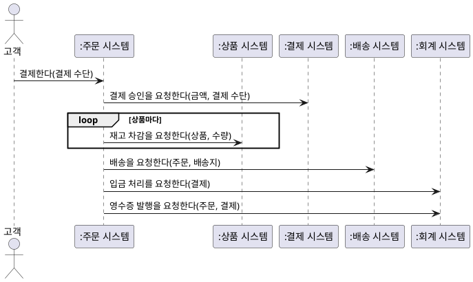

- 도메인 객체 수준의 동적 모델은 블랙박스를 열어, 시스템 이벤트마다 **도메인 객체가 무엇을 주고받는지** 펼친다.

**강사 노트**

- 출처: "02. 요구 분석과 유스케이스"의 「44. 정제된 SSD」. 다시 그리는 것이 아니라 분석의 입력으로 다시 보는 것이다. 분석에서 발견한 것은 이 SSD와 계약, 명세서에 되돌린다(「09. 교차검토」).
- SSD는 외부에 보내는 메시지를 모두 요청으로 그리고 동기·비동기를 구분하지 않는다. 비동기는 도메인 객체 수준의 시퀀스에서 구분한다.

---

## 계약의 정제

**주문 취소 계약**은 대안 흐름 1a에서 정의되어 있다. 계약을 작성하다 보면 도메인 모델에 **없는 것**(`취소 처리 중`)이 드러난다.

**인용문**

"계약을 쓰다 보면 도메인 모델에 **새 개념·속성·연관**을 기록할 필요를 발견하는 일이 흔하다. 이전 정의에 갇히지 말고 보완한다", "It's common during the creation of the contracts to discover the need to record new conceptual classes, attributes, or associations in the domain model. Do not be limited to the prior definition of the domain model; enhance it as you make new discoveries while thinking through operation contracts.", [Larman 2004]

**표 — 오퍼레이션 계약 — 주문 취소**

| 항목 | 내용 |
|---|---|
| **오퍼레이션** | 주문을 취소한다(주문) |
| **관련 유스케이스** | 주문을 관리한다 — 대안 흐름 1a |
| **사전조건** | 고객 소유의 결제 완료 주문이며 배송 시작 전이다 |
| **사후조건** | **환불**이 생성되었다 — 인스턴스 생성 |
|  | 환불이 결제와 연결되었다 — 연관 형성 |
|  | 환불 금액이 결제 금액이 되었다 — 속성 변경 |
|  | 주문의 상태가 **취소 처리 중**으로 바뀌었다 — 속성 변경 |

**강사 노트**

- **취소 처리 중** — 환불은 비동기라 완료 통보 전까지 취소가 끝나지 않는다. 이 상태 값은 도메인 모델에 없다. 학습자에게 "환불 요청 직후 주문은 어떤 상태인가?"를 먼저 묻는다.
- 인용 근거: Larman 2004 원문 확인(오퍼레이션 계약 장). 결제 계약은 "02. 요구 분석과 유스케이스"의 「45. 시스템 오퍼레이션과 계약」에 있다.
- 출고 중단·환불 요청은 사후조건이 아니라 시퀀스에 나타나는 **시스템 사이의 이벤트**다.
- 명세서의 취소 결과("주문이 취소 상태")와 계약의 끝 상태(취소 처리 중)가 다르다. 이 차이는 명세서의 결과와 도메인 모델의 상태 값으로 되돌린다(「09. 교차검토」). 공통 전제에서 이 세션이 더하는 **진화**다.
- 성공 계약이다. 출고 중단 거절·환불 실패는 포함하지 않는다.

---

## 04. 상호작용 모델

---

## 상호작용 다이어그램

상호작용 다이어그램은 객체들이 **메시지**로 어떻게 상호작용하는지 보인다. 시퀀스 다이어그램과 커뮤니케이션 다이어그램 두 가지가 있다.

**인용문**

"UML은 객체들이 **메시지로 어떻게 상호작용하는지** 보이려고 상호작용 다이어그램을 둔다. 동적 객체 모델링에 쓴다", "The UML includes interaction diagrams to illustrate how objects interact via messages. They are used for dynamic object modeling.", [Larman 2004]

- 정제된 SSD는 **시스템 밖**에서 본 상호작용이고, 분석 시퀀스는 시스템 **안**의 도메인 객체 사이를 보여 준다.
- 업무 담당자와 함께 **읽을 수 있는 수준**으로 그리고, 판단의 근거가 되는 그림만 남긴다.

**강사 노트**

- 인용 근거: Larman 2004 원문 확인(상호작용 다이어그램 장).

---

## 상호작용에서 발견하는 것

도메인 객체의 상호작용을 따라가면 **정적 모델과 요구 산출물만으로는 보이지 않던 것**이 드러난다. 상호작용의 요소마다 발견할 수 있는 문제가 다르다.

**표 — 상호작용에서 보는 것**

| 상호작용에서 보는 것 | 발견하는 것 | 이 세션의 예 |
|---|---|---|
| **참여자** | 모델에 없는 개념 | 출고 중단을 요청할 상대 — 배송 |
| **메시지의 경로** | 빠진 연관, 지원 액터와의 연결 | 주문 → 회계 시스템 |
| **생성·변경** | 확정 값, 상태 값 | 단가 확정, 취소 처리 중 |
| **메시지의 순서** | 업무 규칙이 된 순서 | 승인 뒤 재고 차감, 출고 중단 뒤 환불 |
| **동기·비동기** | 즉시 끝나지 않는 처리 | 배송 시작·환불 완료 통보 |
| **외부의 거절** | 새 대안 흐름 | 출고 중단 거절 |

**강사 노트**

- 예는 「06. 시퀀스 다이어그램」에서 하나씩 확인하고, 되돌릴 곳은 「09. 교차검토」의 「누락과 모순」에서 정리한다.
- "03. 정적 모델 — 도메인 개념과 관계"가 남긴 "출고 전을 누가 판단하는가"도 여기서 답을 얻는다 — 주문 시스템이 배송 시스템에 **묻는다**.

---

## 05. 활동 다이어그램

---

## 활동 다이어그램 표기

활동 다이어그램은 프로세스 안의 **순차·병행 활동**을 보인다. 수영 레인으로 **누가** 그 행동을 하는지 나눌 수 있다.

**인용문**

"활동 다이어그램은 프로세스의 **순차·병행 활동**을 보인다. 업무 프로세스·워크플로·데이터 흐름·복잡한 알고리즘의 모델링에 유용하다", "A UML activity diagram shows sequential and parallel activities in a process. They are useful for modeling business processes, workflows, data flows, and complex algorithms.", [Larman 2004]

**도식 — SVG — 활동 다이어그램 표기**

```svg
<svg xmlns="http://www.w3.org/2000/svg" width="1100" height="200" viewBox="0 0 1100 200" role="img" aria-label="활동 다이어그램 표기: 시작, 행동, 흐름, 결정·병합, 분기·합류, 객체 노드, 종료, 수영 레인">
<style>text{font-family:sans-serif;font-size:20px;fill:#000;text-anchor:middle}.s{stroke:#1B3A6B;stroke-width:3;fill:none}.b{fill:#fff;stroke:#181818;stroke-width:2}</style>
<rect width="1100" height="200" fill="#fff"/>
<circle cx="60" cy="80" r="20" fill="#222"/>
<rect class="b" x="135" y="55" width="110" height="50" rx="22"/><text x="190" y="87">행동</text>
<line class="s" x1="285" y1="80" x2="355" y2="80"/><polygon points="362,80 344,71 344,89" fill="#1B3A6B"/>
<polygon class="b" points="460,50 495,80 460,110 425,80"/>
<rect x="555" y="73" width="80" height="14" fill="#222"/>
<rect class="b" x="685" y="55" width="100" height="50"/><text x="735" y="87">결제</text>
<circle cx="860" cy="80" r="20" fill="#fff" stroke="#181818" stroke-width="3"/><circle cx="860" cy="80" r="12" fill="#222"/>
<line x1="940" y1="35" x2="940" y2="125" stroke="#000" stroke-width="3"/><line x1="1040" y1="35" x2="1040" y2="125" stroke="#000" stroke-width="3"/><text x="990" y="62">고객</text>
<text x="60" y="170">시작</text><text x="190" y="170">행동</text><text x="320" y="170">흐름</text><text x="460" y="170">결정·병합</text><text x="595" y="170">분기·합류</text><text x="735" y="170">객체 노드</text><text x="860" y="170">종료</text><text x="990" y="170">수영 레인</text>
</svg>
```

**페이지 분할**

**표 — 활동 다이어그램 표기와 사용법**

| 표기 | 의미 | 이렇게 쓴다 |
|---|---|---|
| **시작** — 채운 원 | 흐름의 시작 | 하나만 둔다 |
| **행동** — 둥근 사각형 | 수행하는 일 | 업무 동사로, 주체는 이름이나 레인으로 |
| **흐름** — 화살표 | 행동 사이의 순서 | 제어의 흐름이다. 객체 노드를 지나면 데이터의 흐름이다 |
| **결정·병합** — 마름모 | 조건에 따른 분기와 다시 합침 | 나가는 흐름마다 겹치지 않는 `[조건]` |
| **분기·합류** — 굵은 막대 | 병행의 시작과, 모두 끝날 때까지 기다림 | 순서와 상관없는 일에만 쓴다 |
| **객체 노드** — 사각형 | 행동 사이를 오가는 정보·사물 | 개념 이름으로 쓴다(결제) |
| **종료** — 테두리 안의 채운 원 | 흐름의 끝 | 경로마다 둘 수 있다 |
| **수영 레인** — 세로 구역 | 행동의 책임자 | 액터·시스템별로 나눈다 |

- **결정·병합**(조건)과 **분기·합류**(병행)는 서로 대신하지 않는다.

**강사 노트**

- 인용 근거: Larman 2004 원문 확인(활동 다이어그램 장).
- 표기 기준: 저장소 `references/sw-engineering/uml/activity.md`. 객체 노드는 「DFD와 활동」에서 데이터 흐름을 그릴 때 쓴다.

---

## 유스케이스와 활동

활동 다이어그램은 **유스케이스 전체의 흐름**을 보여 준다. 「주문을 관리한다」의 기본 흐름과 대안 흐름이 **결정**의 가지로 함께 드러난다.

**도식 — PlantUML — 주문을 관리한다의 활동 다이어그램**

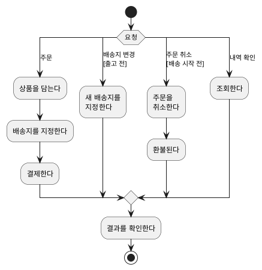

**강사 노트**

- 흐름은 "02. 요구 분석과 유스케이스"의 「33. 유스케이스 상세화」와 같다. 행동의 주체는 고객이다. 책임자를 레인으로 나누는 표기는 「업무 흐름」에서 보인다.
- 가지는 기본 흐름(주문)과 대안 흐름(3a·1a·5a)이다. 가지의 `[조건]`이 대안 흐름의 조건이다 — 배송지 변경은 **출고 전**, 취소는 **배송 시작 전**이다. 두 조건은 판단하는 시스템과 사건이 다르다.
- 결제 실패·환불 실패는 이 그림의 범위 밖이다.

---

## 주문 취소 활동과 코드

**결정**은 `if`, **행동**은 메서드 호출이 된다. 거절로 끝나는 가지는 예외로 드러난다.

**도식 — PlantUML — 주문 취소의 활동 다이어그램**

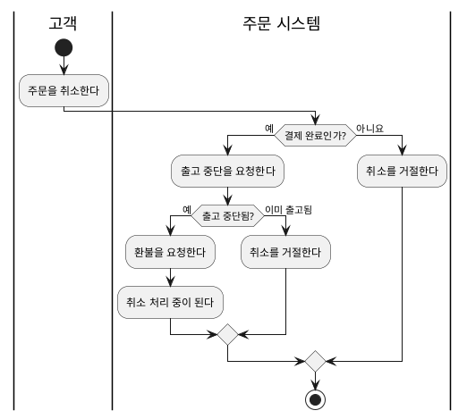

```java
final class 주문 {
    // ... 생략
    void 취소한다() {
        if (상태 != 주문상태.결제완료)
            throw new IllegalStateException(상태 + "에서는 취소할 수 없다");
        if (!배송.출고중단을요청한다())
            throw new IllegalStateException("이미 출고되었다");
        결제.환불을요청한다();
        전이(주문상태.결제완료, 주문상태.취소처리중);
    }
    // ... 생략
}
```

**강사 노트**

- 두 결정은 코드의 두 `if`다. 코드는 모두 `code/s04/주문생애.java`에서 발췌했으며, 그 파일을 컴파일·실행해 확인한다.
- "이미 출고됨"에서 거절하는 것은 **교육용 가정**이다(「08. 상태 기계 다이어그램」의 「출고와 배송 시작」).
- "결제 완료인가? — 아니요"의 거절 중 배송 시작 이후는 확인된 규칙이고, 결제 대기의 취소는 **미정**이다. 코드는 확인된 경로만 테스트한다. 결제 대기의 처리를 정한 것이 아니다(「08. 상태 기계 다이어그램」의 「가드와 금지된 전이」).

---

## 업무 흐름

활동 다이어그램은 **여러 시스템에 걸친 업무 흐름**도 보인다. 결제에서 배송까지 다섯 시스템을 레인으로 나눴다.

**도식 — SVG — 결제에서 배송까지의 활동 다이어그램**

```svg:uml
<svg xmlns="http://www.w3.org/2000/svg" width="1100" height="750" viewBox="0 0 1100 750" role="img" aria-label="결제에서 배송까지 여러 시스템에 걸친 업무 흐름 활동 다이어그램">
<style>text{font-family:sans-serif;font-size:17px;fill:#000;text-anchor:middle}.t{font-weight:bold}</style>
<defs><marker id="f" viewBox="0 0 12 12" refX="11" refY="6" markerWidth="12" markerHeight="12" orient="auto" markerUnits="userSpaceOnUse"><path d="M0,0 L12,6 L0,12 Z" fill="#1B3A6B"/></marker></defs>
<rect width="1100" height="750" fill="#fff"/>
<text class="t" x="75.0" y="34">고객</text>
<line x1="20" y1="14" x2="20" y2="740" stroke="#181818" stroke-width="1.6"/>
<text class="t" x="290.0" y="34">주문 시스템</text>
<line x1="130" y1="14" x2="130" y2="740" stroke="#181818" stroke-width="1.6"/>
<text class="t" x="530.0" y="34">결제 시스템</text>
<line x1="450" y1="14" x2="450" y2="740" stroke="#181818" stroke-width="1.6"/>
<text class="t" x="680.0" y="34">상품 시스템</text>
<line x1="610" y1="14" x2="610" y2="740" stroke="#181818" stroke-width="1.6"/>
<text class="t" x="830.0" y="34">배송 시스템</text>
<line x1="750" y1="14" x2="750" y2="740" stroke="#181818" stroke-width="1.6"/>
<text class="t" x="995.0" y="34">회계 시스템</text>
<line x1="910" y1="14" x2="910" y2="740" stroke="#181818" stroke-width="1.6"/>
<line x1="1080" y1="14" x2="1080" y2="740" stroke="#181818" stroke-width="1.6"/>
<line x1="20" y1="48" x2="1080" y2="48" stroke="#181818" stroke-width="1.2"/>
<circle cx="75" cy="72" r="11" fill="#181818"/>
<rect x="32.0" y="102" width="86" height="36" rx="16" fill="#fff" stroke="#181818" stroke-width="1.4"/><text x="75" y="126">결제한다</text>
<rect x="189.5" y="154" width="191" height="36" rx="16" fill="#fff" stroke="#181818" stroke-width="1.4"/><text x="285" y="178">결제 승인을 요청한다</text>
<rect x="457.0" y="206" width="146" height="36" rx="16" fill="#fff" stroke="#181818" stroke-width="1.4"/><text x="530" y="230">결제를 승인한다</text>
<rect x="189.5" y="258" width="191" height="36" rx="16" fill="#fff" stroke="#181818" stroke-width="1.4"/><text x="285" y="282">재고 차감을 요청한다</text>
<rect x="614.5" y="310" width="131" height="36" rx="16" fill="#fff" stroke="#181818" stroke-width="1.4"/><text x="680" y="334">재고를 줄인다</text>
<rect x="160" y="378" width="250" height="7" fill="#181818"/>
<rect x="227.0" y="414" width="206" height="36" rx="16" fill="#fff" stroke="#181818" stroke-width="1.4"/><text x="330" y="438">입금·영수증을 요청한다</text>
<rect x="149.0" y="474" width="146" height="36" rx="16" fill="#fff" stroke="#181818" stroke-width="1.4"/><text x="222" y="498">배송을 요청한다</text>
<rect x="922.0" y="414" width="146" height="36" rx="16" fill="#fff" stroke="#181818" stroke-width="1.4"/><text x="995" y="438">입금을 처리한다</text>
<rect x="914.5" y="474" width="161" height="36" rx="16" fill="#fff" stroke="#181818" stroke-width="1.4"/><text x="995" y="498">영수증을 발행한다</text>
<rect x="787.0" y="534" width="86" height="36" rx="16" fill="#fff" stroke="#181818" stroke-width="1.4"/><text x="830" y="558">출고한다</text>
<rect x="757.0" y="594" width="146" height="36" rx="16" fill="#fff" stroke="#181818" stroke-width="1.4"/><text x="830" y="618">배송을 시작한다</text>
<rect x="172.0" y="654" width="236" height="36" rx="16" fill="#fff" stroke="#181818" stroke-width="1.4"/><text x="290" y="678">주문을 배송 중으로 바꾼다</text>
<rect x="160" y="706" width="275" height="7" fill="#181818"/>
<circle cx="285" cy="731" r="10" fill="#fff" stroke="#181818" stroke-width="1.6"/><circle cx="285" cy="731" r="6" fill="#181818"/>
<path d="M75,83 L75,100" fill="none" stroke="#1B3A6B" stroke-width="1.6" marker-end="url(#f)"/>
<path d="M75,138 L75,150 L285,150 L285,152" fill="none" stroke="#1B3A6B" stroke-width="1.6" marker-end="url(#f)"/>
<path d="M380.5,172 L530,172 L530,204" fill="none" stroke="#1B3A6B" stroke-width="1.6" marker-end="url(#f)"/>
<path d="M530,242 L530,254 L285,254 L285,256" fill="none" stroke="#1B3A6B" stroke-width="1.6" marker-end="url(#f)"/>
<path d="M380.5,276 L680,276 L680,308" fill="none" stroke="#1B3A6B" stroke-width="1.6" marker-end="url(#f)"/>
<path d="M680,346 L680,360 L285,360 L285,376" fill="none" stroke="#1B3A6B" stroke-width="1.6" marker-end="url(#f)"/>
<path d="M330,385 L330,412" fill="none" stroke="#1B3A6B" stroke-width="1.6" marker-end="url(#f)"/>
<path d="M200,385 L200,472" fill="none" stroke="#1B3A6B" stroke-width="1.6" marker-end="url(#f)"/>
<path d="M433.0,432 L920.0,432" fill="none" stroke="#1B3A6B" stroke-width="1.6" marker-end="url(#f)"/>
<path d="M995,450 L995,472" fill="none" stroke="#1B3A6B" stroke-width="1.6" marker-end="url(#f)"/>
<path d="M295.0,492 L830,492 L830,532" fill="none" stroke="#1B3A6B" stroke-width="1.6" marker-end="url(#f)"/>
<path d="M830,570 L830,592" fill="none" stroke="#1B3A6B" stroke-width="1.6" marker-end="url(#f)"/>
<path d="M830,630 L830,648 L290,648 L290,652" fill="none" stroke="#1B3A6B" stroke-width="1.6" marker-end="url(#f)"/>
<path d="M995,510 L995,690 L425,690 L425,704" fill="none" stroke="#1B3A6B" stroke-width="1.6" marker-end="url(#f)"/>
<path d="M230,690 L230,704" fill="none" stroke="#1B3A6B" stroke-width="1.6" marker-end="url(#f)"/>
<path d="M285,713 L285,719" fill="none" stroke="#1B3A6B" stroke-width="1.6" marker-end="url(#f)"/>
</svg>
```

**페이지 분할**

흐름이 레인을 넘어 **다섯 시스템**을 오간다. 이런 흐름에서 활동 다이어그램이 가장 쓸모 있다.

**인용문**

"참여자가 많은 **매우 복잡한 프로세스**에서 가장 가치가 있다. 단순한 프로세스는 유스케이스 글로 충분하다", "This technique proves most valuable for very complex processes, usually involving many parties. Use-case text suffices for simple processes.", [Larman 2004]

- 흐름이 주문 시스템에서 배송 시스템의 「배송을 처리한다」로 **시스템 경계를 넘는다**.
- **분기·합류** 사이의 두 흐름은 **병행**한다 — 서로의 순서에 의존하지 않고, 합류는 둘 다 끝나기를 기다린다.
- 주문 시스템은 배송 시스템의 처리를 **기다리지 않고**, 배송을 시작했다는 **통보**를 받아 주문을 바꾼다.
- **병행**은 흐름의 순서, **비동기**는 요청자가 완료를 기다리는가의 구분이다. 서로 대신하지 않는다.

**강사 노트**

- 인용 근거: Larman 2004 원문 확인(활동 다이어그램의 지침).
- 결제 승인 거절 경로는 생략했다. 레인은 시스템 단위로 나눴다. 사람(배송 담당자)의 행동은 배송 시스템 레인 안에 있다.

---

## 이벤트와 활동

레인 경계에서 **이벤트**가 드러난다. 한 레인의 행동이 끝나면 다른 레인이 그 결과에 반응한다. "02. 요구 분석과 유스케이스"의 **이벤트 중심 요구**가 동적 모델로 이어지는 방식이다.

**표 — 레인 경계의 이벤트**

| 레인 경계 | 이벤트 | 반응 |
|---|---|---|
| 결제 시스템 → 주문 시스템 | 결제가 승인되었다 | 재고 차감·배송·입금을 요청한다 |
| 주문 시스템 → 배송 시스템 | 배송이 요청되었다 | 출고한다 |
| 배송 시스템 → 주문 시스템 | 배송이 시작되었다 | 주문을 배송 중으로 바꾼다 |
| 주문 시스템 → 회계 시스템 | 입금 처리가 요청되었다 | 입금을 처리하고 영수증을 발행한다 |

**강사 노트**

- 각 이벤트는 상태 기계의 전이와 대응한다(「08. 상태 기계 다이어그램」). 이벤트를 과거형("배송이 시작되었다")으로 쓰면 도메인 이벤트의 표현과 같다. 시스템 사이의 이벤트 기반 설계는 "13. OOAD에서 전문영역으로 — Architecture · DDD · MSA"에서 다룬다.

---

## 활동과 SSD

활동 다이어그램과 SSD는 **같은 수준**의 모델이다. 둘 다 주문 시스템을 블랙박스로 본다. 활동 다이어그램으로 흐름 전체를 보고, 중요한 경로마다 SSD로 **시스템 이벤트**를 확인한다.

**표 — 활동 다이어그램과 SSD**

| 구분 | 활동 다이어그램 | 시스템 시퀀스 다이어그램 |
|---|---|---|
| 대상 | 유스케이스 **전체** | 유스케이스 **시나리오 하나** |
| 보이는 것 | 결정·병합, 대안 흐름, 책임자(레인) | 시스템 이벤트의 순서, 외부 시스템과의 교환 |
| 관계 | 활동의 경로 하나 | = SSD 하나 |

**강사 노트**

- "주문" 경로의 SSD는 「03. 요구 산출물에서 출발」의 「정제된 SSD」다. 모든 경로에 SSD를 그리지 않는다. 규칙과 대안 흐름이 많은 경로를 고른다.

---

## 데이터 흐름 다이어그램

정보공학과 구조적 분석은 **데이터 흐름 다이어그램**(DFD)으로 시스템의 처리와 데이터를 그렸다. 처리 단계 사이로 **데이터가 어떻게 흐르고 어디에 저장되는지**를 보인다.

**도식 — SVG — 데이터 흐름 다이어그램 표기**

```svg
<svg xmlns="http://www.w3.org/2000/svg" width="1000" height="200" viewBox="0 0 1000 200" role="img" aria-label="데이터 흐름 다이어그램 표기: 외부 엔티티, 프로세스, 데이터 흐름, 데이터 저장소">
<style>text{font-family:sans-serif;font-size:20px;fill:#000;text-anchor:middle}.b{fill:#fff;stroke:#181818;stroke-width:2}</style>
<rect width="1000" height="200" fill="#fff"/>
<rect class="b" x="60" y="55" width="130" height="50"/><text x="125" y="87">고객</text>
<circle class="b" cx="375" cy="80" r="50"/><text x="375" y="74">1</text><text x="375" y="100">결제 처리</text>
<text x="610" y="65">결제 수단</text><line x1="530" y1="80" x2="680" y2="80" stroke="#1B3A6B" stroke-width="3"/><polygon points="690,80 670,70 670,90" fill="#1B3A6B"/>
<line x1="780" y1="60" x2="940" y2="60" stroke="#181818" stroke-width="2"/><line x1="780" y1="100" x2="940" y2="100" stroke="#181818" stroke-width="2"/><text x="860" y="88">D1 주문</text>
<text x="125" y="170">외부 엔티티</text><text x="375" y="170">프로세스</text><text x="610" y="170">데이터 흐름</text><text x="860" y="170">데이터 저장소</text>
</svg>
```

**표 — 데이터 흐름 다이어그램 표기와 사용법**

| 표기 | 의미 | 이렇게 쓴다 |
|---|---|---|
| **외부 엔티티** — 사각형 | 데이터를 주고받는 시스템 밖의 사람·시스템 | 액터·외부 시스템의 이름 |
| **프로세스** — 원 | 들어온 데이터를 바꾸는 처리 | 번호와 처리 이름 |
| **데이터 흐름** — 이름 붙은 화살표 | 오가는 데이터 | 데이터의 이름으로 쓴다. 순서·조건은 없다 |
| **데이터 저장소** — 두 줄 | 저장해 두었다 다시 쓰는 데이터 | 번호와 저장소 이름 |

**강사 노트**

- DFD로 컴퓨터 시스템 안의 데이터 흐름을 보고, 같은 흐름을 활동 다이어그램으로 옮겨 비교한다.
- 표기는 Yourdon·DeMarco 표기(프로세스는 원)다. Gane·Sarson 표기는 프로세스를 둥근 사각형으로 그린다. 정보공학의 데이터 모델(ERD)은 "03. 정적 모델 — 도메인 개념과 관계"의 「06. 데이터 모델과 도메인 모델」에서 다뤘다.

---

## DFD와 활동

같은 결제 흐름을 **DFD**(위)와 **객체 노드**를 쓴 활동 다이어그램(아래)으로 그렸다.

**도식 — SVG — 데이터 흐름 다이어그램과 활동 다이어그램**

```svg:uml
<svg xmlns="http://www.w3.org/2000/svg" width="1100" height="670" viewBox="0 0 1100 670" role="img" aria-label="결제 흐름을 데이터 흐름 다이어그램과 객체 노드를 쓴 활동 다이어그램으로 그린 비교">
<style>text{font-family:sans-serif;font-size:16px;fill:#000;text-anchor:middle}.t{font-size:23px;font-weight:bold;text-anchor:start}.b{fill:#fff;stroke:#181818;stroke-width:1.5}.a{fill:#fff;stroke:#181818;stroke-width:1.5}.l{stroke:#1B3A6B;stroke-width:1.6;fill:none}.s{stroke:#181818;stroke-width:1.5}</style>
<defs><marker id="f" viewBox="0 0 12 12" refX="11" refY="6" markerWidth="12" markerHeight="12" orient="auto" markerUnits="userSpaceOnUse"><path d="M0,0 L12,6 L0,12 Z" fill="#1B3A6B"/></marker></defs>
<rect width="1100" height="670" fill="#fff"/>
<text class="t" x="20" y="30">데이터 흐름 다이어그램</text>
<rect class="b" x="20" y="152" width="90" height="36"/><text x="65" y="176">고객</text>
<circle class="b" cx="250" cy="170" r="55"/><text x="250" y="162">1</text><text x="250" y="184">결제 처리</text>
<rect class="b" x="185" y="48" width="130" height="36"/><text x="250" y="72">결제 시스템</text>
<line class="l" x1="235" y1="115" x2="235" y2="86" marker-end="url(#f)"/><text x="186" y="106">결제 요청</text>
<line class="l" x1="265" y1="86" x2="265" y2="115" marker-end="url(#f)"/><text x="300" y="106">승인</text>
<line class="l" x1="110" y1="170" x2="193" y2="170" marker-end="url(#f)"/><text x="152" y="160">결제 수단</text>
<line class="s" x1="440" y1="115" x2="570" y2="115"/><line class="s" x1="440" y1="145" x2="570" y2="145"/><text x="505" y="136">D1 주문</text>
<line class="s" x1="440" y1="200" x2="570" y2="200"/><line class="s" x1="440" y1="230" x2="570" y2="230"/><text x="505" y="221">D2 결제</text>
<line class="l" x1="300" y1="150" x2="438" y2="132" marker-end="url(#f)"/><text x="365" y="128">주문 상태</text>
<line class="l" x1="300" y1="192" x2="438" y2="214" marker-end="url(#f)"/><text x="360" y="226">결제</text>
<circle class="b" cx="700" cy="130" r="50"/><text x="700" y="122">2</text><text x="700" y="144">배송 요청</text>
<circle class="b" cx="700" cy="255" r="50"/><text x="700" y="247">3</text><text x="700" y="269">입금 요청</text>
<line class="l" x1="572" y1="130" x2="648" y2="130" marker-end="url(#f)"/><text x="610" y="120">배송지</text>
<line class="l" x1="572" y1="222" x2="652" y2="242" marker-end="url(#f)"/><text x="605" y="252">결제</text>
<rect class="b" x="890" y="112" width="130" height="36"/><text x="955" y="136">배송 시스템</text>
<rect class="b" x="890" y="237" width="130" height="36"/><text x="955" y="261">회계 시스템</text>
<line class="l" x1="750" y1="130" x2="888" y2="130" marker-end="url(#f)"/><text x="819" y="120">배송 요청</text>
<line class="l" x1="750" y1="255" x2="888" y2="255" marker-end="url(#f)"/><text x="819" y="245">입금·영수증 요청</text>
<line x1="20" y1="330" x2="1080" y2="330" stroke="#999" stroke-width="1" stroke-dasharray="3,4"/>
<text class="t" x="20" y="370">활동 다이어그램</text>
<circle cx="40" cy="470" r="10" fill="#181818"/>
<line class="l" x1="50" y1="470" x2="68" y2="470" marker-end="url(#f)"/>
<rect class="a" x="70" y="450" width="190" height="40" rx="16"/><text x="165" y="476">결제 승인을 요청한다</text>
<line class="l" x1="260" y1="470" x2="290" y2="470" marker-end="url(#f)"/>
<polygon class="a" points="310,452 328,470 310,488 292,470"/>
<line class="l" x1="328" y1="470" x2="368" y2="470" marker-end="url(#f)"/><text x="350" y="445">[승인됨]</text>
<rect class="a" x="370" y="450" width="80" height="40"/><text x="410" y="476">결제</text>
<line class="l" x1="450" y1="470" x2="488" y2="470" marker-end="url(#f)"/>
<rect x="490" y="410" width="7" height="120" fill="#181818"/>
<line class="l" x1="497" y1="420" x2="558" y2="420" marker-end="url(#f)"/>
<rect class="a" x="560" y="400" width="210" height="40" rx="16"/><text x="665" y="426">입금·영수증을 요청한다</text>
<line class="l" x1="497" y1="520" x2="558" y2="520" marker-end="url(#f)"/>
<rect class="a" x="560" y="500" width="170" height="40" rx="16"/><text x="645" y="526">배송을 요청한다</text>
<rect class="a" x="575" y="590" width="140" height="50"/><text x="645" y="610">«datastore»</text><text x="645" y="630">주문</text>
<line class="l" x1="645" y1="590" x2="645" y2="542" marker-end="url(#f)"/>
<line class="l" x1="770" y1="420" x2="818" y2="420" marker-end="url(#f)"/>
<line class="l" x1="730" y1="520" x2="818" y2="520" marker-end="url(#f)"/>
<rect x="820" y="410" width="7" height="120" fill="#181818"/>
<line class="l" x1="827" y1="470" x2="858" y2="470" marker-end="url(#f)"/>
<circle cx="870" cy="470" r="10" fill="#fff" stroke="#181818" stroke-width="1.6"/><circle cx="870" cy="470" r="6" fill="#181818"/>
<line class="l" x1="310" y1="488" x2="310" y2="563" marker-end="url(#f)"/><text x="345" y="530">[거절]</text>
<circle cx="310" cy="575" r="10" fill="#fff" stroke="#181818" stroke-width="1.6"/><circle cx="310" cy="575" r="6" fill="#181818"/>
</svg>
```

**페이지 분할**

**인용문**

"UML 활동 다이어그램은 DFD와 **같은 목적**을 이룬다 — 데이터 흐름 모델링에 쓰여 전통적인 DFD 표기를 대신한다", "Fortunately, UML activity diagrams can satisfy the same goals—they can be used for data flow modeling, replacing traditional DFD notation.", [Larman 2004]

**표 — DFD와 활동 다이어그램의 대응**

| DFD | 활동 다이어그램 | 차이 |
|---|---|---|
| 프로세스 | 행동 | 행동은 업무 동사로 쓴다 |
| 데이터 흐름 | 객체 노드와 흐름 | 결제가 행동 사이를 오간다 |
| 데이터 저장소 | 데이터 저장소 노드 `«datastore»` | 주문을 읽어 배송을 요청한다 |
| 외부 엔티티 | 행동의 상대, 수영 레인 | 레인으로 책임자를 나눈다 |
| — | 결정·분기·합류 | **제어 흐름**은 활동 다이어그램에만 있다 |

- **DFD**에는 승인이 거절될 때가 없다. **활동 다이어그램**은 같은 데이터에 `[승인됨]`·`[거절]`과 병행을 더한다.

**강사 노트**

- 인용 근거: Larman 2004 원문 확인(활동 다이어그램 장의 데이터 흐름 모델링). 원전도 같은 정보를 DFD와 활동 다이어그램으로 나란히 그려 비교한다. 도식은 주문 사례로 다시 그렸다.
- UML에는 DFD 표기가 없다. 활동 다이어그램이 객체 노드로 같은 목적을 이룬다. DFD를 써 온 조직이라면 활동 다이어그램으로 옮겨도 데이터 흐름의 관점을 잃지 않는다. 대신 제어 흐름과 책임자(레인)가 더해진다.

---

## 06. 시퀀스 다이어그램

---

## 시퀀스 다이어그램 표기

시퀀스 다이어그램은 상호작용을 **생명선**과 **시간 순서의 메시지**로 그린다. 새 참여자를 오른쪽에 더해 가며, 위에서 아래로 읽는다.

**인용문**

"시퀀스 다이어그램은 새 객체를 **오른쪽에 더해 가는 울타리 형식**으로 상호작용을 보인다", "Sequence diagrams illustrate interactions in a kind of fence format, in which each new object is added to the right.", [Larman 2004]

**도식 — SVG — 시퀀스 다이어그램 표기**

```svg
<svg xmlns="http://www.w3.org/2000/svg" width="1100" height="230" viewBox="0 0 1100 230" role="img" aria-label="시퀀스 다이어그램 표기: 생명선, 동기 메시지, 비동기 메시지, 자기 호출, 생성, 프레임">
<style>text{font-family:sans-serif;font-size:20px;fill:#000;text-anchor:middle}.b{fill:#fff;stroke:#1B3A6B;stroke-width:2}.l{stroke:#1B3A6B;stroke-width:3;fill:none}</style>
<rect width="1100" height="230" fill="#fff"/>
<rect class="b" x="40" y="30" width="110" height="46" rx="6"/><text x="95" y="60">:주문</text><line x1="95" y1="76" x2="95" y2="145" stroke="#1B3A6B" stroke-width="2" stroke-dasharray="8,8"/>
<text x="265" y="80" style="font-size:18px">요청한다</text><line class="l" x1="195" y1="95" x2="325" y2="95"/><polygon points="335,95 315,85 315,105" fill="#1B3A6B"/>
<text x="445" y="80" style="font-size:18px">알린다</text><line class="l" x1="380" y1="95" x2="510" y2="95"/><path class="l" d="M495,85 L512,95 L495,105"/>
<line x1="600" y1="40" x2="600" y2="145" stroke="#1B3A6B" stroke-width="2" stroke-dasharray="8,8"/><path class="l" d="M600,70 L650,70 L650,110 L612,110"/><polygon points="602,110 620,101 620,119" fill="#1B3A6B"/>
<line class="l" x1="700" y1="95" x2="780" y2="95"/><polygon points="790,95 770,85 770,105" fill="#1B3A6B"/><rect class="b" x="792" y="72" width="100" height="46" rx="6"/><text x="842" y="102">:환불</text>
<rect x="930" y="40" width="150" height="100" fill="none" stroke="#000" stroke-width="2"/><path d="M930,40 L990,40 L990,58 L978,70 L930,70 Z" fill="#fff" stroke="#000" stroke-width="2"/><text x="957" y="62" style="font-size:18px">alt</text><text x="1005" y="110" style="font-size:18px">[조건]</text>
<text x="95" y="195">생명선</text><text x="265" y="195">동기 메시지</text><text x="445" y="195">비동기 메시지</text><text x="625" y="195">자기 호출</text><text x="795" y="195">생성</text><text x="1005" y="195">프레임</text>
</svg>
```

**페이지 분할**

**표 — 시퀀스 다이어그램 표기와 사용법**

| 표기 | 의미 | 이렇게 쓴다 |
|---|---|---|
| **생명선** — 머리 박스와 점선 | 참여자와 그 존재 기간 | `:주문`처럼 개념의 인스턴스, 액터는 왼쪽 |
| **동기 메시지** — 채운 화살촉 | 처리를 마칠 때까지 기다리는 요청 | 업무 동사로 이름 짓는다 |
| **비동기 메시지** — 열린 화살촉 | 기다리지 않는 요청·알림 | 결과가 나중에 통보로 올 때 쓴다 |
| **자기 호출** | 자신에게 보내는 메시지 | 객체 안의 상태 변화·계산 |
| **생성** — 중간에서 시작하는 생명선 | 상호작용 도중에 생기는 참여자 | 생기는 시점에 박스를 둔다(주문 항목, 환불) |
| **프레임** — 이름표 달린 사각형 | 조건·반복·병행 | 「프레임」에서 다룬다 |

- 응답은 그리지 않는다. **비동기 메시지**만 열린 화살촉으로 구분한다.

**강사 노트**

- 인용 근거: Larman 2004 원문 확인(상호작용 다이어그램 장).
- "02. 요구 분석과 유스케이스"는 SSD에 필요한 표기만 소개했다. 분석 시퀀스는 객체·생성·프레임을 포함한 표기를 사용한다. 표기 기준: OMG UML 2.5.1, 저장소 `references/sw-engineering/uml/sequence.md`. 응답 화살표는 UML에서 선택 사항이다.

---

## 오퍼레이션에서 상호작용으로

SSD의 **시스템 오퍼레이션 하나**를 시스템 **안**에서 펼친 것이 분석의 시퀀스 다이어그램이다. 분석에서는 첫 메시지를 사건의 중심 개념에 놓아 상호작용을 검토하고, 최종 책임은 설계에서 다시 정한다.

**표 — 시스템 이벤트와 첫 메시지를 받는 개념**

| SSD의 시스템 이벤트 | 첫 메시지를 받는 도메인 객체 | 이어지는 상호작용 |
|---|---|---|
| **결제한다(결제 수단)** | :주문 | 결제를 만들어 승인·재고·배송·입금을 요청 |
| **주문을 취소한다(주문)** | :주문 | 출고 중단을 요청하고 환불을 요청 |
| **배송지를 변경한다(주문, 새 주소)** | :주문 | 배송 시스템이 변경을 받아들이면 주소를 바꿈 |

- 표의 첫 수신자는 분석을 위한 **배치 가설**이다. 설계 객체와 최종 책임은 "06. 분석 모델에서 설계 모델로"와 "07. 책임·협력·계약"에서 결정한다.

**강사 노트**

- 분석에서는 컨트롤러·서비스가 첫 메시지를 받지 않는다. 설계에서는 첫 메시지를 응용 서비스 같은 설계 객체가 받는다("06. 분석 모델에서 설계 모델로"). 분석에서는 어떤 개념이 사건의 중심인지 확인하는 것이 목적이다.

---

## 참여 객체와 도메인 모델

시퀀스 다이어그램의 참여자는 **도메인 모델 개념의 인스턴스**다. 생명선 `:주문`은 "주문 개념의 한 인스턴스"를 뜻한다.

- 이 모델에 **없는 개념**은 생명선이 될 수 없다. 필요하면 그 자체가 정적 모델의 누락이다.
- **외부 시스템**은 도메인 개념이 아니라 **지원 액터**다. 생명선으로 쓰되 정적 모델에는 넣지 않는다.

**도식 — PlantUML — 주문 시스템 도메인 모델**

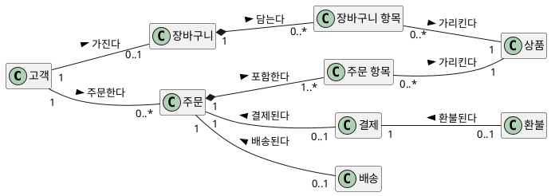

**강사 노트**

- 도식은 "03. 정적 모델 — 도메인 개념과 관계"의 「14. 도메인 모델 작성」의 「상세화」에서 속성을 뺀 것이다. 시퀀스 다이어그램을 그릴 때 이 도식을 옆에 두고 대조한다.
- 생명선·메시지·상태의 이름은 용어집의 한글 용어를 쓴다. 영문명(`Order`)은 설계에서 쓴다 — "05. 구조적 경계와 의존성".

---

## 연관을 따라 흐르는 메시지

객체는 **아는 상대에게만** 메시지를 보낼 수 있다. 분석에서 메시지는 도메인 모델의 **연관을 따라** 흐른다. 연관이 없는데 메시지가 필요하면 **연관이 빠졌거나**, 그 순간에만 필요한 **일시적 연결**이다.

**표 — 메시지와 따라가는 연관**

| 메시지 | 보내는 쪽 → 받는 쪽 | 따라가는 연관 |
|---|---|---|
| 결제를 만든다, 환불을 요청한다 | :주문 → :결제 | 주문 — 결제 |
| 배송을 만든다, 출고 중단을 요청한다 | :주문 → :배송 | 주문 — 배송 |
| 환불을 만든다 | :결제 → :환불 | 결제 — 환불 |
| 배송지를 바꾼다 | :주문 → :배송 | 주문 — 배송 |

- 외부 시스템에 보내는 요청은 정적 모델의 연관이 아니라 **지원 액터와의 연결**이다.

**강사 노트**

- 동적 모델이 정적 모델의 연관을 검증하는 가장 직접적인 방법이다. 판단의 근거를 기록해 둔다. 커뮤니케이션 다이어그램은 이 연결을 **링크**로 그린다(「07. 커뮤니케이션 다이어그램」).

---

## 결제 시퀀스

시스템 이벤트 `결제한다(결제 수단)`를 펼친다. 정제된 SSD에서 주문 시스템이 외부에 보낸 요청을 **어느 도메인 객체가** 보내는지가 드러난다.

**도식 — PlantUML — 결제 시퀀스**

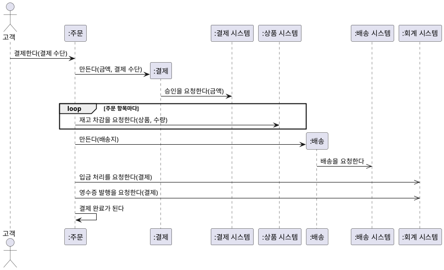

**페이지 분할**

- **재고** — 승인 **뒤에** 재고 차감을 요청한다. 차감이 실패하면 이미 승인된 결제를 되돌려야 한다 → 재고를 결제 **전에** 확보해야 하는가?
- **배송** — 배송 요청은 **비동기**다. 주문은 배송 시작을 **나중에 통보로** 안다 → 상태 기계의 전이 사건이 된다.
- **요청의 주체** — 결제가 승인을, 배송이 배송 요청을, 주문이 재고·입금·영수증을 맡았다. 어떤 요청이 필요한지는 분석이 확인하고, 누가 보내는지는 배치의 예로 두어 설계에서 다시 정한다.

**강사 노트**

- 성공 경로다. 승인 거절은 `alt`로 그릴 수 있다(「프레임」).
- 재고 확보 시점은 **요구 질문**이다. 답이 정해지면 "02. 요구 분석과 유스케이스"의 명세서 규칙과 정제된 SSD의 순서를 고친다.

---

## 주문 취소 시퀀스

시스템 이벤트 `주문을 취소한다(주문)`를 **도메인 객체의 상호작용**으로 펼친다.

**도식 — PlantUML — 주문 취소 시퀀스**

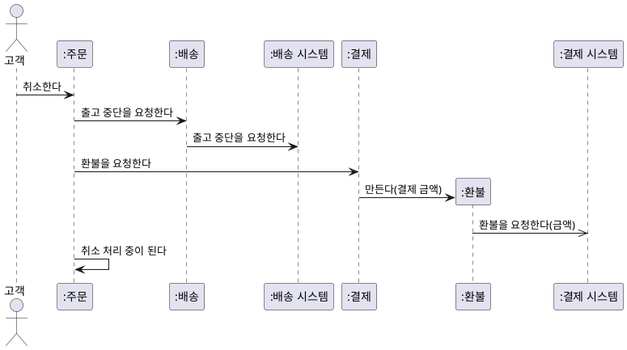

**페이지 분할**

- **출고 중단을 먼저** 확인하고 환불한다. 이미 출고되었다면 환불하면 안 되기 때문이다. 이 순서도 업무 규칙이다.
- 출고 중단은 배송 시스템이 **거절할 수 있다** → 취소의 새 대안 흐름이다(「프레임」).
- 환불은 **비동기**다. 완료 통보가 올 때까지 취소가 끝나지 않는다 → **취소 처리 중**이 계약과 같다.

**강사 노트**

- 성공 경로다. 결제 완료·배송 시작 전 주문의 전체 취소라는 전제를 유지한다.
- 발견한 순서와 대안 흐름은 "02. 요구 분석과 유스케이스"의 명세서(대안 흐름 1a)와 정제된 SSD에 되돌린다(「09. 교차검토」).

---

## 시퀀스와 코드

**메시지**는 받는 객체의 **메서드**가 되고, **생성**은 `new`, **비동기 메시지**는 완료를 기다리지 않는 요청이 된다. 결과는 나중에 **통보**로 온다.

**도식 — PlantUML — 주문 취소 시퀀스**


```java
final class 배송 {
    // ... 생략
    boolean 출고중단을요청한다() {
        return 배송시스템.출고중단을요청한다(배송번호);
    }
}

final class 환불 {
    private final 금액 환불금액;

    환불(금액 환불금액) { this.환불금액 = 환불금액; }
    void 요청한다(결제시스템 결제시스템) {
        결제시스템.환불을요청한다(환불금액);
    }
}

final class 결제 {
    // ... 생략
    void 환불을요청한다() {
        var 새환불 = new 환불(결제금액);
        환불 = Optional.of(새환불);
        새환불.요청한다(결제시스템);
    }
}
```

**강사 노트**

- `new 환불(결제금액)`이 생성 메시지 `만든다(결제 금액)`이다. 예제는 비동기 전달 방식(큐·이벤트)을 생략하고 요청만 기록한다.
- 도메인 객체가 외부 시스템 인터페이스(`배송시스템`, `결제시스템`)를 직접 가진 것은 **설계의 결정**이다. 분석 모델에 되돌려 그리지 않는다.

---

## 프레임

프레임(frame)은 메시지의 **조건·반복·병행**을 그린다. 왼쪽 위의 이름표에 **연산자**, 칸 안에 **조건(가드)**을 쓴다. 메시지를 보기 좋게 묶는 상자가 아니다.

**인용문**

"조건과 반복 구조를 위해 UML은 **프레임**을 쓴다. 프레임에는 연산자나 레이블(loop 등)과 가드가 있다", "To support conditional and looping constructs (among many other things), the UML uses frames. … they have an operator or label (such as loop) and a guard", [Larman 2004]

**표 — 프레임의 연산자**

| 연산자 | 의미 | 조건 쓰는 법 | 이렇게 쓴다 |
|---|---|---|---|
| `loop` | 조건 동안 반복 | `[상품마다]` | 같은 메시지가 여러 번 오갈 때 |
| `alt` | 서로 배타적인 대안 중 하나 | 칸마다 `[조건]`, 마지막은 `[그 밖]` | 조건에 따라 다른 상호작용이 일어날 때 |
| `opt` | 조건이 참일 때만 | `[배송지가 지정되었으면]` | 선택적으로 일어나는 상호작용 하나 |
| `par` | 순서 없이 함께 일어날 수 있음 | 칸마다 병행 흐름 | 순서가 업무 의미를 갖지 않을 때 |
| `break` | 조건이 참이면 나머지를 중단 | `[결제 거절]` | 거절로 상호작용이 끝날 때 |

- **반복 예** — `loop`는 「정제된 SSD」와 「결제 시퀀스」에서 상품마다 반복하는 재고 차감에 썼다.

**강사 노트**

- 인용 근거: Larman 2004 원문 확인(상호작용 다이어그램 장의 프레임). OMG UML 2.5.1은 프레임을 Combined Fragment로 정의한다. 과정에서는 Larman대로 **프레임**이라 부른다.
- 서로 배타적인 대안을 `opt` 여러 개나 `par`로 그리지 않는다. 프레임을 두 단계 이상 겹치면 그림을 나눈다.

---

## 주문 취소의 alt

**출고 중단의 결과**에 따라 상호작용이 갈린다. `alt` 프레임의 두 칸이 서로 배타적인 대안이다.

**도식 — PlantUML — 주문 취소 시퀀스**

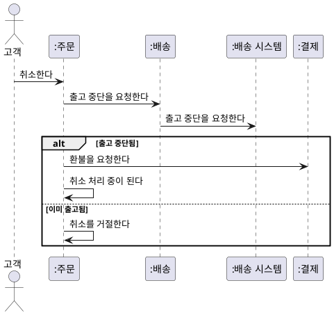

- **위 칸** — 출고 중단이 받아들여지면 환불하고 취소 처리 중이 된다.
- **아래 칸** — 이미 출고되었으면 취소를 거절한다. 명세서의 새 **대안 흐름**이다.

**강사 노트**

- "이미 출고됨" 칸은 「주문 취소 시퀀스」에서 발견한 대안 흐름이다. 출고 후 취소를 거절한다는 것은 **교육용 가정**이며, 실제 규칙은 「08. 상태 기계 다이어그램」의 「출고와 배송 시작」의 질문으로 남아 있다.
- 코드의 두 번째 `if`가 이 `alt`다(「05. 활동 다이어그램」의 「주문 취소 활동과 코드」).

---

## 07. 커뮤니케이션 다이어그램

---

## 커뮤니케이션 다이어그램 표기

커뮤니케이션 다이어그램(Communication Diagram)은 같은 상호작용을 **객체 사이의 링크**와 **번호 붙은 메시지**로 그린다. 객체를 어디에나 놓을 수 있어 **연결 구조**가 잘 보인다.

**인용문**

"커뮤니케이션 다이어그램은 객체를 다이어그램의 **어디에나 놓을 수 있는** 그래프·네트워크 형식으로 상호작용을 보인다", "Communication diagrams illustrate object interactions in a graph or network format, in which objects can be placed anywhere on the diagram.", [Larman 2004]

**도식 — SVG — 커뮤니케이션 다이어그램 표기**

```svg
<svg xmlns="http://www.w3.org/2000/svg" width="1000" height="200" viewBox="0 0 1000 200" role="img" aria-label="커뮤니케이션 다이어그램 표기: 객체, 링크, 번호 붙은 메시지, 중첩 번호">
<style>text{font-family:sans-serif;font-size:20px;fill:#000;text-anchor:middle}.b{fill:#fff;stroke:#181818;stroke-width:2}</style>
<rect width="1000" height="200" fill="#fff"/>
<rect class="b" x="45" y="55" width="110" height="46" rx="6"/><text x="100" y="85">:주문</text>
<line x1="220" y1="78" x2="360" y2="78" stroke="#1B3A6B" stroke-width="3"/>
<line x1="430" y1="95" x2="600" y2="95" stroke="#1B3A6B" stroke-width="3"/><text x="515" y="70">1: 취소한다 →</text>
<line x1="680" y1="95" x2="960" y2="95" stroke="#1B3A6B" stroke-width="3"/><text x="820" y="70">1.1: 환불을 요청한다 →</text>
<text x="100" y="165">객체</text><text x="290" y="165">링크</text><text x="515" y="165">번호 붙은 메시지</text><text x="820" y="165">중첩 번호</text>
</svg>
```

**페이지 분할**

**표 — 커뮤니케이션 다이어그램 표기와 사용법**

| 표기 | 의미 | 이렇게 쓴다 |
|---|---|---|
| **객체** — 사각형 | 상호작용의 참여자 | `:주문`처럼 도메인 개념의 인스턴스 이름을 쓴다 |
| **링크** — 실선 | 두 객체가 메시지를 주고받을 수 있는 연결 | 연관의 인스턴스다. 일시적 연결도 있다 |
| **번호 붙은 메시지** | 링크 위의 메시지와 그 순서 | `1:`부터 쓰고 화살표로 보내는 방향을 표시한다 |
| **중첩 번호** | 앞 메시지를 처리하는 도중의 메시지 | `1.1`, `1.2`처럼 쓴다. 같은 수준은 끝자리를 올린다 |
| **반복·조건** — `*[조건]`, `[조건]` | 반복해서, 또는 조건이 참일 때만 보내는 메시지 | 「조건과 반복」에서 다룬다 |

- 시퀀스는 **세로 위치**가 순서이고, 커뮤니케이션은 **번호**가 순서다. 번호 없이 객체만 이은 그림은 커뮤니케이션 다이어그램이 아니다.

**강사 노트**

- 인용 근거: Larman 2004 원문 확인(상호작용 다이어그램 장).
- 표기 기준: OMG UML 2.5.1(Communication Diagrams의 메시지 순서 표현), 저장소 `references/sw-engineering/uml/communication.md`.

---

## 메시지 번호

번호가 **순서와 포함 관계**를 함께 보인다. 주문 취소의 앞부분으로 번호를 읽는다.

**도식 — PlantUML — 주문 취소 커뮤니케이션**

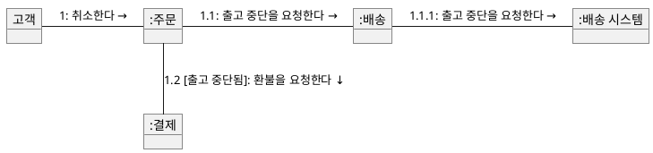

- **`1` → `1.1` → `1.1.1`** — 처리 **안의** 처리다. 주문은 취소를 처리하면서 배송에 출고 중단을 요청하고, 배송은 외부 배송 시스템에 요청한다.
- **같은 수준은 끝자리를 올린다** — `1.1`이 끝나고 환불을 요청하면 `1.2`다.

**강사 노트**

- 번호의 자릿수가 시퀀스 다이어그램에서 메시지가 오른쪽으로 들어가는 깊이와 같다. 뒤의 「시퀀스와 커뮤니케이션」에서 같은 장면을 한 장에 놓고 비교한다.
- 시퀀스의 자기 호출은 읽기 쉽도록 생략할 수 있다. 커뮤니케이션 다이어그램에서는 자기 링크 위에 같은 번호로 그린다.
- `*`는 반복이다(「조건과 반복」).

---

## 링크와 연관

**링크**는 두 객체가 메시지를 주고받으려면 서로를 알아야 한다는 뜻이다. 링크는 **연관의 인스턴스**이므로, 링크가 있으면 정적 모델에 그 연관이 있어야 한다.

**인용문**

"링크는 두 객체 사이의 **연결 경로**다. 더 형식적으로, 링크는 **연관의 인스턴스**다", "A link is a connection path between two objects; … More formally, a link is an instance of an association.", [Larman 2004]

**표 — 링크와 정적 모델의 연관**

| 링크 | 정적 모델의 연관 | 판단 |
|---|---|---|
| 주문 — 결제, 결제 — 환불 | 있음 | ✔ |
| 주문 — 배송, 주문 — 주문 항목 | 있음 | ✔ |
| 배송 — 배송 시스템 | — | 외부 시스템과의 연결. 정적 모델 밖 |

- 연관 없이 반복해서 필요한 링크는 **빠진 연관**이다. 정적 모델에 되돌린다.

**강사 노트**

- 인용 근거: Larman 2004 원문 확인(커뮤니케이션 다이어그램 표기의 링크).
- 커뮤니케이션 다이어그램을 최종 객체 구조나 연관의 정본으로 쓰지 않는다. 연관으로 둘지는 정적 모델에서 판단한다(저장소 `references/sw-engineering/uml/communication.md`).

---

## 결제 커뮤니케이션

「결제 시퀀스」를 **같은 메시지**로 그렸다. 주문이 결제·상품 시스템·배송·회계 시스템을 잇는 **중심**이라는 것이 한눈에 보인다.

**도식 — PlantUML — 결제 커뮤니케이션**

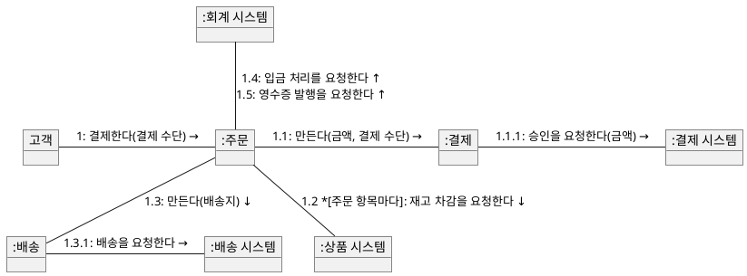

- **주문의 링크가 다섯 개**다. 결제에 관한 요청이 주문에 몰려 있다는 것이 연결 구조로 드러난다.
- **번호** `1.1` → `1.2` → `1.3` → `1.4`가 시퀀스의 위에서 아래 순서와 같다.

**강사 노트**

- 시퀀스에서는 생명선이 여덟 개로 늘어서 이 몰림이 잘 보이지 않는다. 주문에 요청이 몰린 것이 문제인지는 설계에서 책임을 나누며 판단한다("07. 책임·협력·계약").
- 비동기 메시지(배송 요청, 입금·영수증)는 시퀀스에서 구분했다. 커뮤니케이션 다이어그램에서는 화살표 모양으로 구분할 수 있지만 이 예에서는 번호와 방향만 보였다.
- 자기 호출 `1.6: 결제 완료가 된다`는 생략했다.

---

## 주문 취소 커뮤니케이션

「주문 취소 시퀀스」를 같은 메시지로 그렸다. **출고 중단이 환불보다 먼저**라는 규칙이 번호 `1.1`과 `1.2`에 담긴다.

**도식 — PlantUML — 주문 취소 커뮤니케이션**

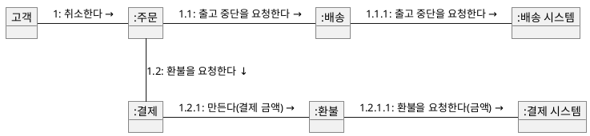

- **`1.1`이 `1.2`보다 먼저** — 출고 중단을 확인한 뒤에 환불한다.
- **`1.2.1.1`** — 환불은 만들어진 뒤 요청되고, 완료는 통보로 온다.
- **링크 다섯 개**가 모두 「링크와 연관」의 연관과 외부 시스템 연결이다.

**강사 노트**

- 자기 호출 `1.3: 취소 처리 중이 된다`는 생략했다. 출고 중단이 거절되면 환불 요청을 보내지 않는다.

---

## 조건과 반복

커뮤니케이션 다이어그램에는 **프레임이 없다**. 조건과 반복은 메시지 번호에 붙인다 — 반복은 `*[반복 조건]`, 조건은 `[가드]`다.

**도식 — PlantUML — 주문 취소 커뮤니케이션**


**표 — 프레임과 커뮤니케이션의 표현**

| 시퀀스의 프레임 | 커뮤니케이션의 표현 | 이 세션의 예 |
|---|---|---|
| `loop` | `*[반복 조건]` | `1.2 *[주문 항목마다]` 재고 차감 |
| `alt`·`opt` | 메시지마다 `[가드]` | `1.2 [출고 중단됨]` |
| `par` | 같은 수준의 이름 붙은 번호 | `1.2a`, `1.2b` |
| `break`, 겹친 프레임 | 표현이 어렵다 | 시퀀스 다이어그램으로 그린다 |

- `[출고 중단됨]`이 거짓이면 `1.2`는 보내지 않는다. 그때 무엇을 하는지(취소를 거절한다)는 **시퀀스의 `alt`**가 더 잘 보인다.

**강사 노트**

- 근거: OMG UML 2.5.1 원문 확인 — 메시지의 순서 표현에 반복(`*[iteration-clause]`)과 분기(`[guard]`)가 있고, 번호 뒤의 이름은 병행하는 제어 흐름이다.
- 조건이 많은 상호작용은 시퀀스로, 연결 구조가 중요한 상호작용은 커뮤니케이션으로 그린다(「시퀀스와 커뮤니케이션」).

---

## 커뮤니케이션과 코드

**링크**는 참조 필드다. 번호 `1.1`·`1.2`는 `취소한다` **안의** 호출이고, `1.2.1`은 `환불을요청한다` 안의 호출이다.

**도식 — PlantUML — 주문 취소 커뮤니케이션**

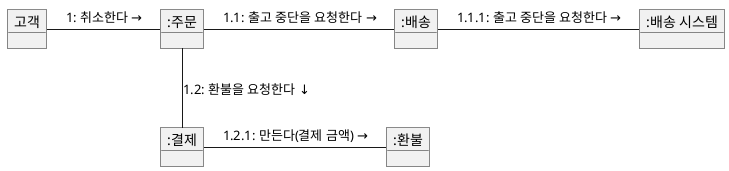

```java
final class 결제 {
    final 금액 결제금액;
    private final 결제시스템 결제시스템;
    Optional<환불> 환불 = Optional.empty();
    // ... 생략
}

final class 주문 {
    private 결제 결제;
    private 배송 배송;
    주문상태 상태 = 주문상태.결제대기;

    void 결제되었다(결제 결제, 배송 배송) {
        전이(주문상태.결제대기, 주문상태.결제완료);
        this.결제 = 결제;
        this.배송 = 배송;
    }
    // ... 생략
}
```

- `:주문`의 **링크** 둘은 **필드** `결제`·`배송`이다. 결제가 된 뒤에야 링크가 생긴다(`결제되었다`).

**강사 노트**

- 링크 결제 — 환불은 필드 `환불`(`Optional`)이다. 취소 전에는 링크가 없다. 다중성 `0..1`과 같다.
- 필드의 방향(주문이 결제를 안다)은 **설계의 결정**이다. 분석의 연관은 방향을 정하지 않는다.

---

## 시퀀스와 커뮤니케이션

두 다이어그램은 **같은 상호작용**을 다르게 보인다. 「주문 취소 시퀀스」의 앞부분을 **같은 번호**로 그렸다.

**도식 — SVG — 시퀀스 다이어그램과 커뮤니케이션 다이어그램**

```svg:uml
<svg xmlns="http://www.w3.org/2000/svg" width="940" height="500" viewBox="0 0 940 500" role="img" aria-label="주문 취소 앞부분을 같은 번호로 그린 시퀀스 다이어그램과 커뮤니케이션 다이어그램">
<style>text{font-family:sans-serif;font-size:17px;fill:#000;text-anchor:middle}.t{font-weight:bold;font-size:23px}.st{font-size:16px}.a{fill:#fff;stroke:#181818;stroke-width:1.4}.l{stroke:#181818;stroke-width:1.3;fill:none}.f{stroke:#1B3A6B;stroke-width:1.6;fill:none}</style>
<defs><marker id="f" viewBox="0 0 12 12" refX="11" refY="6" markerWidth="12" markerHeight="12" orient="auto" markerUnits="userSpaceOnUse"><path d="M0,0 L12,6 L0,12 Z" fill="#1B3A6B"/></marker></defs>
<rect width="940" height="500" fill="#fff"/>
<text class="t" x="20" y="26" style="text-anchor:start">시퀀스 다이어그램</text>
<circle class="a" cx="45" cy="46" r="8"/><path class="l" d="M45,54 L45,76 M31,62 L59,62 M45,76 L33,94 M45,76 L57,94"/><text x="45" y="116">고객</text>
<line x1="45" y1="122" x2="45" y2="290" stroke="#1B3A6B" stroke-width="1.2" stroke-dasharray="6,5"/>
<rect x="125.0" y="50" width="70" height="32" fill="#fff" stroke="#1B3A6B" stroke-width="1.4"/><text class="st" x="160" y="72">:주문</text>
<line x1="160" y1="82" x2="160" y2="290" stroke="#1B3A6B" stroke-width="1.2" stroke-dasharray="6,5"/>
<rect x="325.0" y="50" width="70" height="32" fill="#fff" stroke="#1B3A6B" stroke-width="1.4"/><text class="st" x="360" y="72">:배송</text>
<line x1="360" y1="82" x2="360" y2="290" stroke="#1B3A6B" stroke-width="1.2" stroke-dasharray="6,5"/>
<rect x="515.0" y="50" width="110" height="32" fill="#fff" stroke="#1B3A6B" stroke-width="1.4"/><text class="st" x="570" y="72">:배송 시스템</text>
<line x1="570" y1="82" x2="570" y2="290" stroke="#1B3A6B" stroke-width="1.2" stroke-dasharray="6,5"/>
<rect x="695.0" y="50" width="70" height="32" fill="#fff" stroke="#1B3A6B" stroke-width="1.4"/><text class="st" x="730" y="72">:결제</text>
<line x1="730" y1="82" x2="730" y2="290" stroke="#1B3A6B" stroke-width="1.2" stroke-dasharray="6,5"/>
<line class="f" x1="45" y1="140" x2="158" y2="140" marker-end="url(#f)"/>
<text class="st" x="52" y="133" style="text-anchor:start">1: 취소한다</text>
<line class="f" x1="160" y1="170" x2="358" y2="170" marker-end="url(#f)"/>
<text class="st" x="167" y="163" style="text-anchor:start">1.1: 출고 중단을 요청한다</text>
<line class="f" x1="360" y1="200" x2="568" y2="200" marker-end="url(#f)"/>
<text class="st" x="367" y="193" style="text-anchor:start">1.1.1: 출고 중단을 요청한다</text>
<line class="f" x1="160" y1="230" x2="728" y2="230" marker-end="url(#f)"/>
<text class="st" x="380" y="223" style="text-anchor:start">1.2: 환불을 요청한다</text>
<rect x="835.0" y="244" width="70" height="32" fill="#fff" stroke="#1B3A6B" stroke-width="1.4"/><text class="st" x="870" y="266">:환불</text>
<line x1="870" y1="276" x2="870" y2="290" stroke="#1B3A6B" stroke-width="1.2" stroke-dasharray="6,5"/>
<line class="f" x1="730" y1="260" x2="833" y2="260" marker-end="url(#f)"/>
<text class="st" x="737" y="240" style="text-anchor:start">1.2.1: 만든다(결제 금액)</text>
<line x1="20" y1="306" x2="920" y2="306" stroke="#999" stroke-width="1" stroke-dasharray="3,4"/>
<text class="t" x="20" y="336" style="text-anchor:start">커뮤니케이션 다이어그램</text>
<rect x="20" y="362" width="70" height="32" fill="#fff" stroke="#181818" stroke-width="1.4"/><text class="st" x="55.0" y="384">고객</text>
<rect x="200" y="362" width="80" height="32" fill="#fff" stroke="#181818" stroke-width="1.4"/><text class="st" x="240.0" y="384">:주문</text>
<rect x="500" y="362" width="80" height="32" fill="#fff" stroke="#181818" stroke-width="1.4"/><text class="st" x="540.0" y="384">:배송</text>
<rect x="790" y="362" width="120" height="32" fill="#fff" stroke="#181818" stroke-width="1.4"/><text class="st" x="850.0" y="384">:배송 시스템</text>
<rect x="200" y="446" width="80" height="32" fill="#fff" stroke="#181818" stroke-width="1.4"/><text class="st" x="240.0" y="468">:결제</text>
<rect x="500" y="446" width="80" height="32" fill="#fff" stroke="#181818" stroke-width="1.4"/><text class="st" x="540.0" y="468">:환불</text>
<line class="l" x1="90" y1="378" x2="200" y2="378"/>
<text class="st" x="145" y="368">1: 취소한다 →</text>
<line class="l" x1="280" y1="378" x2="500" y2="378"/>
<text class="st" x="390" y="368">1.1: 출고 중단을 요청한다 →</text>
<line class="l" x1="580" y1="378" x2="790" y2="378"/>
<text class="st" x="685" y="368">1.1.1: 출고 중단을 요청한다 →</text>
<line class="l" x1="240" y1="394" x2="240" y2="446"/>
<text class="st" x="250" y="425" style="text-anchor:start">1.2: 환불을 요청한다 ↓</text>
<line class="l" x1="280" y1="462" x2="500" y2="462"/>
<text class="st" x="390" y="490">1.2.1: 만든다(결제 금액) →</text>
</svg>
```

**페이지 분할**

**표 — 시퀀스와 커뮤니케이션의 선택**

| 구분 | 시퀀스 다이어그램 | 커뮤니케이션 다이어그램 |
|---|---|---|
| 순서 | 세로 위치 — 한눈에 보인다 | 번호 — 읽어야 보인다 |
| 연결 구조 | 생명선이 늘어서 잘 보이지 않는다 | 링크로 한눈에 보인다 |
| 조건·반복 | 프레임 | `*[조건]`, `[가드]` |
| 정적 모델 검증 | 메시지의 순서와 동기·비동기 | 링크와 연관 |
| 고를 때 | 순서·규칙이 핵심일 때 | 누가 누구와 연결되는지가 핵심일 때 |

- 같은 상호작용을 두 다이어그램으로 모두 그릴 필요는 없다. **질문에 맞는 하나**를 고른다.

**강사 노트**

- 위의 시퀀스와 아래의 커뮤니케이션은 메시지와 번호가 같다. 학습자에게 위아래를 오가며 같은 번호를 짚게 한다.

---

## 08. 상태 기계 다이어그램

---

## 상태

상태 기계 다이어그램은 한 객체의 **의미 있는 사건과 상태**, 그리고 사건에 반응하는 행위를 보인다.

**인용문**

"상태 기계 다이어그램은 한 객체의 **의미 있는 사건과 상태**, 사건에 반응하는 객체의 행위를 보인다", "A UML state machine diagram … illustrates the interesting events and states of an object, and the behavior of an object in reaction to an event.", [Larman 2004]

**인용문**

"상태는 **사건과 사건 사이**의 어느 순간 객체가 놓인 조건이다", "A state is the condition of an object at a moment in time—the time between events.", [Larman 2004]

**인용문**

"전이는 사건이 일어나면 객체가 **앞 상태에서 다음 상태로 옮겨 감**을 나타내는 두 상태 사이의 관계다", "A transition is a relationship between two states that indicates that when an event occurs, the object moves from the prior state to the subsequent state.", [Larman 2004]

- 상태 **값**은 정적 모델의 속성이고, 상태 **전이**는 동적 모델이다.

**강사 노트**

- 인용 근거: Larman 2004 원문 확인(상태 기계 장의 사건·상태·전이 정의). 사건의 정의는 「02. 정적 모델에서 동적 모델로」의 「동적 모델」에서 보였다.
- 상태 값과 상태 전이의 구분은 "03. 정적 모델 — 도메인 개념과 관계"의 「03. 정적 모델과 동적 모델」의 「상태 값과 상태 전이」에서 다뤘다.

---

## 상태 기계 다이어그램 표기

상태 기계 다이어그램은 **한 개념**이 사건에 따라 어떤 상태를 거치는지 보여 준다.

**도식 — SVG — 상태 기계 다이어그램 표기**

```svg
<svg xmlns="http://www.w3.org/2000/svg" width="1000" height="200" viewBox="0 0 1000 200" role="img" aria-label="상태 기계 다이어그램 표기: 초기 상태, 상태, 전이, 종료 상태">
<style>text{font-family:sans-serif;font-size:20px;fill:#000;text-anchor:middle}.b{fill:#fff;stroke:#181818;stroke-width:2}</style>
<rect width="1000" height="200" fill="#fff"/>
<circle cx="90" cy="85" r="20" fill="#222"/>
<rect class="b" x="215" y="58" width="150" height="54" rx="22"/><text x="290" y="92">결제 완료</text>
<text x="600" y="68">사건 [가드] / 효과</text><line x1="460" y1="85" x2="730" y2="85" stroke="#1B3A6B" stroke-width="3"/><polygon points="740,85 720,75 720,95" fill="#1B3A6B"/>
<circle cx="890" cy="85" r="20" fill="#fff" stroke="#181818" stroke-width="3"/><circle cx="890" cy="85" r="12" fill="#222"/>
<text x="90" y="165">초기 상태</text><text x="290" y="165">상태</text><text x="600" y="165">전이</text><text x="890" y="165">종료 상태</text>
</svg>
```

**표 — 상태 기계 다이어그램 표기와 사용법**

| 표기 | 의미 | 이렇게 쓴다 |
|---|---|---|
| **초기 상태** — 채운 원 | 생애의 시작 | 하나만 둔다 |
| **상태** — 둥근 사각형 | 사건과 사건 사이의 조건 | 상황의 이름(결제 완료). 화면·처리 단계가 아니다 |
| **전이** — 화살표 | 사건에 따른 상태 변화 | `사건 [가드] / 효과` — 가드가 참이면 전이한다 |
| **가드** — `[조건]` | 전이가 일어나는 조건 | 필요할 때만 쓴다. 같은 사건의 가드는 겹치지 않게 한다 |
| **효과** — `/ 결과` | 전이할 때 일어나는 일 | 업무 결과로 쓴다 |
| **시간 이벤트** — `after`·`at` | 시간이 지나 일어나는 사건 | 아무도 요청하지 않아도 일어난다. 상대 시간 `after`, 절대 시간 `at` |
| **종료 상태** — 테두리 안의 채운 원 | 생애의 끝 | 더 이상 사건에 반응하지 않는 상태 |

**강사 노트**

- 표기 기준: OMG UML 2.5.1(StateMachines, 시간 이벤트의 `after`·`at`), 저장소 `references/sw-engineering/uml/state-machine.md`. 분석에서는 효과를 업무 결과로 쓴다. 진입·이탈 행위는 필요할 때만 쓴다.
- 시간 이벤트는 유스케이스를 시작하는 정상적인 사건이기도 하다("02. 요구 분석과 유스케이스"). 주문 사례에는 시간 이벤트가 없다. 실습의 정기배송에서 만료로 쓴다.

---

## 주문 상태 기계

주문의 생애를 상태 기계로 그린다. 주문은 고객의 요청과 외부 시스템의 **통보**로 전이한다.

**도식 — PlantUML — 주문 상태 기계**

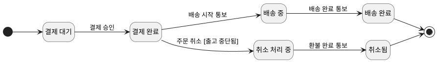

- **배송 중·배송 완료**는 배송 시스템의 통보로, **취소됨**은 환불 완료 통보로 전이한다. 그 전까지는 **취소 처리 중**이다.
- **출고 준비 중·출고됨**은 배송 시스템의 상태라 주문에 두지 않는다.

**강사 노트**

- 상태와 전이는 공통 전제의 주문 상태(결제 대기 → 결제 완료 → 배송 중 → 배송 완료, 결제 완료 → 취소됨)에 동적 분석에서 발견한 **취소 처리 중**을 더한 것이다(진화). 이 값은 교차검토를 거쳐 정적 모델에 반영한다.
- 새 상태 **취소 처리 중**은 용어집에도 더한다("02. 요구 분석과 유스케이스"의 「18. 용어집」). 동적 모델이 찾은 이름을 용어집에 되돌리지 않으면 모델마다 다른 이름이 생긴다.
- 결제 실패·배송 실패·출고 중단 거절·부분 취소는 이 모델의 범위 밖이다.

---

## 상태 기계와 코드

**상태**는 `enum` 값, **전이**는 상태를 바꾸는 메서드, **가드**는 전이 전의 검사가 된다.

**도식 — PlantUML — 주문 상태 기계**


```java
enum 주문상태 { 결제대기, 결제완료, 배송중, 배송완료, 취소처리중, 취소됨 }
// ... 배송·환불·결제 생략
final class 주문 {
    // ... 생략
    void 배송시작통보() { 전이(주문상태.결제완료, 주문상태.배송중); }
    void 배송완료통보() { 전이(주문상태.배송중, 주문상태.배송완료); }
    void 환불완료통보() { 전이(주문상태.취소처리중, 주문상태.취소됨); }
    // ... 취소한다 생략

    private void 전이(주문상태 출발, 주문상태 도착) {
        if (상태 != 출발)
            throw new IllegalStateException(상태 + "에서는 " + 도착 + "이 될 수 없다");
        상태 = 도착;
    }
}
```

**강사 노트**

- 외부의 통보는 주문의 메서드(`배송시작통보`)가 된다. 통보가 어떤 경로로 주문에 오는지는 설계에서 정한다("05. 구조적 경계와 의존성").
- 결제의 배송 요청은 주문 상태를 바꾸지 않는다.

---

## 출고와 배송 시작

"출고 전"과 "배송 시작 전"은 판단하는 **시스템이 다르다**. 교육용 가정은 출고를 **물류센터 반출**, 배송 시작을 **운송 개시**로 구분한다. 두 경계의 차이가 새로운 요구 질문을 만든다.

**표 — 출고 전과 배송 시작 전**

| 규칙 | 조건 | 누가 판단하는가 |
|---|---|---|
| **배송지 변경** | 출고 전 | 배송 시스템 — 주문 시스템이 변경을 요청하고 결과를 받는다 |
| **주문 취소** | 배송 시작 전 | 주문 시스템(주문 상태)과 배송 시스템(출고 중단 결과) |

- **발견한 질문** — 출고는 됐지만 배송 시작 전인 주문의 취소를 허용하는가? 규칙대로라면 허용되지만, 가정대로라면 **물건은 이미 물류센터를 떠났다**.
- 모델이 아니라 **요구의 문제**이므로 업무 담당자에게 되묻는다.

**강사 노트**

- "03. 정적 모델 — 도메인 개념과 관계"는 두 표현이 같은지와 출고를 누가 아는지를 질문으로 남겼다. 판단 주체가 다르다는 것은 공통 전제이고, 두 경계의 선후는 이 topic의 **교육용 가정**이다. 답이 정해지면 "02. 요구 분석과 유스케이스"의 규칙과 계약을 고친다.
- 용어집은 두 용어를 처음부터 **다른 용어**로 정의했다(출고 `dispatch`, 배송 시작 `deliveryStarted`). 같다는 증거가 나오기 전에는 하나로 합치지 않는다.

---

## 가드와 금지된 전이

**가드**는 전이가 일어나는 조건이다. 전이가 없는 이유는 둘 중 하나다 — 확인된 규칙이 **금지**했거나, 요구가 아직 **미정**이다. 둘을 구분해 적는다.

**인용문**

"전이에는 **조건 가드**(불리언 검사)가 있을 수 있다. 검사를 통과할 때만 전이가 일어난다", "A transition may also have a conditional guard—or boolean test. The transition only occurs if the test passes.", [Larman 2004]

- **가드** — `주문 취소 [출고 중단됨]`처럼 사건이 같아도 조건에 따라 전이가 갈린다.
- **금지된 전이** — 배송 중·배송 완료에서 나가는 `주문 취소` 전이가 없다. "배송 시작 이후에는 취소할 수 없다"는 규칙이 **전이의 부재**로 표현된다.
- **미정인 전이** — 결제 대기의 `주문 취소`는 확정된 요구가 아니다. 화살표가 없는 것은 금지가 아니라 **요구 질문**이다.
- **무시되는 사건** — 받은 사건이 전이를 일으키지 않으면, 시스템이 어떻게 응답할지는 요구로 정한다.

**강사 노트**

- 인용 근거: Larman 2004 원문 확인(상태 기계 장의 전이 표기).
- 금지된 사건에 대한 외부 응답(예: 취소 불가 안내)은 유스케이스의 대안 흐름이다. 상태 기계는 "일어날 수 없다"를, 유스케이스는 "그때 고객에게 무엇을 보여 주는가"를 담당한다.

---

## 금지된 전이에서 테스트로

**금지된 전이**는 거절되어야 한다. 배송 중의 취소가 거절되고, 취소는 출고 중단 → 환불 순서로 요청한다. **미정인 전이**는 테스트 기대값으로 정하지 않는다.

**도식 — PlantUML — 주문 상태 기계**


```java
class 주문생애테스트 {
    public static void main(String[] args) {
        var 요청 = new ArrayList<String>();
        결제시스템 결제시스템 = 금액 -> 요청.add("환불 " + 금액.원());
        배송시스템 출고전 = 번호 -> 요청.add("출고 중단");

        var 주문 = new 주문();
        주문.결제되었다(new 결제(new 금액(2000), 결제시스템),
                new 배송("배송-1", 출고전));
        주문.취소한다();
        확인(주문.상태 == 주문상태.취소처리중);
        확인(요청.equals(List.of("출고 중단", "환불 2000")));
        주문.환불완료통보();
        확인(주문.상태 == 주문상태.취소됨);

        var 배송중 = new 주문();
        배송중.결제되었다(new 결제(new 금액(1000), 결제시스템),
                new 배송("배송-2", 출고전));
        배송중.배송시작통보();
        거절(배송중::취소한다);
        System.out.println("주문 생애 확인");
    }
    // ... 확인·거절 생략
}
```

**강사 노트**

- 첫 테스트는 허용된 경로(결제 완료 → 취소 처리 중 → 취소됨)와 요청 순서를, 둘째 테스트는 금지된 전이(배송 중의 취소)의 거절을 확인한다. 결제 대기의 취소는 미정이라 테스트하지 않는다.
- 학습자가 결과를 먼저 예측한 뒤 `java 주문생애테스트`를 실행해 대조하게 한다.

---

## 상태와 불변 조건

각 상태에서 참이어야 하는 **조건**은 정적 모델의 제약과 대응한다. 상태 기계와 제약을 맞대면 모순을 찾을 수 있고, 상태에 따라 **다중성이 달라지는** 연관은 규칙으로 남긴다.

**표 — 주문의 상태와 불변 조건**

| 상태 | 불변 조건 | 정적 모델의 요소 |
|---|---|---|
| **결제 완료** | 결제가 하나 있다 | 주문–결제 `0..1` → 이 상태에서는 `1` |
| **취소 처리 중** | 환불이 있고 완료 통보 전이다 | 결제–환불 연관, 환불 상태 |
| **취소됨** | 환불 금액 = 결제 금액 | 제약 `환불 금액 ≤ 결제 금액` |
| **배송 중** | 배송이 하나 있다 | 주문–배송 `0..1` → 이 상태에서는 `1` |

**강사 노트**

- "03. 정적 모델 — 도메인 개념과 관계"의 「12. 일반화와 제약」·「10. 연관」에 연결된다(「제약」, 「다중성과 업무 규칙」). 환불 상태(승인 전·완료)는 상태 기계가 드러낸 새 속성이다.

---

## 09. 교차검토

---

## 교차검토 절차

정적 모델과 동적 모델은 **서로 다른 질문**에 답한다. 서로의 질문으로 검토해야 누락과 모순이 드러난다.

**표 — 교차검토의 순서와 질문**

| 순서 | 검토 대상 | 확인할 질문 |
|---|---|---|
| 1 | **계약** | 사후조건의 생성·연관·속성 변화가 정적 모델에 있는가? |
| 2 | **상태** | 상태 값이 속성으로 정의되고, 들어오고 나가는 사건이 있는가? |
| 3 | **상호작용** | 참여자·링크가 개념·연관에 있고 실제 메시지에서 쓰이는가? |
| 4 | **조건** | 상태에서 참인 조건이 정적 모델의 제약과 모순되지 않는가? |
| 5 | **되돌림** | 발견한 누락·모순을 어느 모델과 요구에 반영할 것인가? |

- 검토는 한 번에 끝나지 않고 **반복**한다.

**강사 노트**

- "03. 정적 모델 — 도메인 개념과 관계"의 「17. 모델의 검토」가 요구 문장을 모델에 댔다면, 이 절차는 동적 모델을 모델에 댄다. 4단계는 「08. 상태 기계 다이어그램」의 「상태와 불변 조건」에서 했다.

---

## 계약과 정적 모델

계약의 **사후조건**을 정적 모델의 요소로 설명할 수 있는지 대조한다. 사후조건은 도메인 객체의 생성·연관·속성 변화이므로, 모두 정적 모델에 있어야 한다.

**표 — 사후조건과 정적 모델**

| 계약 | 사후조건 | 설명하는 요소 | 결과 |
|---|---|---|---|
| 결제 | 결제가 생성되어 주문과 연결되었다 | 결제 개념, 주문–결제 연관 | ✔ |
| 결제 | 주문의 상태가 결제 완료로 바뀌었다 | 주문 상태 값 | ✔ |
| 주문 취소 | 환불이 생성되어 결제와 연결되었다 | 환불 개념, 결제–환불 연관 | ✔ |
| 주문 취소 | 환불 금액이 결제 금액이 되었다 | 제약 `환불 금액 ≤ 결제 금액` | ✔ |
| 주문 취소 | 주문의 상태가 취소 처리 중으로 바뀌었다 | 주문 상태 값? | ✘ **값이 없다** |

- 외부 시스템에 보낸 **요청**(재고 차감·배송·입금·출고 중단·환불)은 **사후조건이 아니다**. 정제된 SSD와 상호작용에서 확인한다.

**강사 노트**

- 결제 계약은 "02. 요구 분석과 유스케이스"의 「45. 시스템 오퍼레이션과 계약」, 주문 취소 계약은 「03. 요구 산출물에서 출발」의 「계약의 정제」에 있다.

---

## 상태와 정적 모델

상태 기계의 상태 값과 정적 모델의 주문 상태 값을 대조한다. 판단 질문은 **이 상태가 주문의 것인가, 배송·환불의 것인가, 다른 시스템의 것인가**다.

**표 — 상태 기계의 상태와 정적 모델**

| 상태 | 정적 모델 | 결과 |
|---|---|---|
| 결제 대기, 결제 완료, 배송 중, 배송 완료, 취소됨 | 주문 상태 값 있음 | ✔ |
| 취소 처리 중 | 없음 | ✘ 주문 상태 값에 더한다 |
| 출고 중단됨 | 없음 | ✘ 배송의 **배송 상태** 값으로 |
| 출고 준비 중, 출고됨 | — | 배송 시스템의 상태. 주문 시스템에 두지 않는다 |

- **한 개념에 모든 상태를 모으지 않는다**. 주문 시스템의 배송 개념은 필요한 만큼(배송 상태)만 기억한다.

**강사 노트**

- 취소 처리 중을 환불 상태(승인 전·완료)로 나눠 둘 수도 있다. 이 과정은 주문 상태 값에 더한다(공통 전제의 코드 값 `취소처리중`). 어느 쪽에 둘지는 업무 규칙이 어느 개념에 걸리는지로 판단한다 — 취소 처리 중에는 배송지 변경도, 다시 취소도 받지 않으므로 주문의 반응이 달라진다.

---

## 상호작용과 정적 모델

상호작용의 **참여자·링크·메시지**를 정적 모델과 대조한다.

**표 — 상호작용과 정적 모델**

| 상호작용에서 본 것 | 정적 모델 | 결과 |
|---|---|---|
| 참여자 — 주문·결제·환불·배송 | 개념 있음 | ✔ |
| 참여자 — 결제·상품·배송·회계 시스템 | 지원 액터 | ✔ 정적 모델에 넣지 않는다 |
| 링크 — 장바구니–주문 | 연관 없음 | ✔ 일시적 연결 |
| 메시지 — 출고 중단의 결과 | 배송 상태 값 없음 | ✘ 값 추가 |
| 메시지 — 환불을 만든다 | 결제–환불 `0..1` | ✔ 전체 취소 전제에서 |

**강사 노트**

- 메시지 자체를 정적 모델의 오퍼레이션으로 옮기지 않는다. 도메인 모델은 오퍼레이션을 정의하지 않는다. 어떤 객체가 어떤 책임을 가질지는 "07. 책임·협력·계약"에서 정한다.

---

## 누락과 모순

교차검토로 발견한 것을 **모델을 고칠 것**, **요구에 되물을 것**, **범위 밖으로 남길 것**으로 나눈다.

- **정적 모델에 반영** — 주문 상태 `취소 처리 중`, 배송 상태 `출고 중단됨`
- **요구에 되물음** — 재고가 모자라면? 출고됐지만 배송 시작 전인 주문의 취소는? 환불 실패 시 주문은 취소 처리 중에 머무는가?
- **범위 밖으로 남김** — 결제 실패, 부분 취소, 배송 실패

**표 — 발견과 되돌릴 곳**

| 발견 | 되돌릴 곳 |
|---|---|
| 재고 차감 시점 | 명세서 규칙, 정제된 SSD의 순서 |
| 배송 시작·완료, 환불 완료는 통보로 온다 | 이벤트 목록, 정제된 SSD |
| 출고 중단이 거절될 수 있다 | 명세서의 대안 흐름 |
| 취소가 즉시 끝나지 않는다 | 명세서 결과, 도메인 모델의 상태 값, 용어집 |

**강사 노트**

- 발견은 별도 문서가 아니라 **요구 산출물과 정적 모델을 고쳐** 반영한다. 발견한 누락은 모델만의 문제가 아니라 요구의 누락일 수 있다 — "02. 요구 분석과 유스케이스"의 「09. 반복적 접근」처럼 요구·정적 모델·동적 모델을 함께 고친다.

---

## 10. 적정 동적 모델링

---

## 추상화 수준

분석의 동적 모델은 **업무 의미의 수준**에서 그린다. 구현의 세부까지 내려가면 그림이 커지기만 하고 판단은 늘지 않는다. 이것은 모든 모델에 같은 문제다.

**인용문**

"상태 의존 객체는 **상태에 따라 사건에 다르게 반응**한다", "…state-dependent objects react differently to events depending on their state or mode.", [Larman 2004]

**표 — 분석의 수준과 구현의 세부**

| 다이어그램 | 분석의 수준 | 구현의 세부 |
|---|---|---|
| 활동 | 업무 행동 — 결제한다, 배송을 요청한다 | 화면 조작, 반복문·변수 대입 |
| 시퀀스·커뮤니케이션 | 업무 메시지 — 취소한다, 환불을 요청한다 | 메서드 시그니처, DB 저장·트랜잭션 |
| 상태 기계 | 사건에 다르게 반응하는 상황 — 결제 완료, 배송 중 | 처리 단계, 참·거짓 플래그의 조합 |

- **의미 있는 상태**는 같은 사건에 **다르게 반응**하는 상황이다. 주문 취소는 결제 완료에서 받아들이고 배송 중에서 거절한다 — 그래서 두 상태가 다르다.
- 주문의 **여섯 상태**가 이 기준을 통과한 결과다. 반응이 같은데 이름만 다른 상황은 상태로 나누지 않는다.

**강사 노트**

- 인용 근거: Larman 2004 원문 확인(상태 기계 장의 상태 독립·상태 의존 객체). 같은 곳은 사건에 늘 같게 반응하는 객체를 상태 독립 객체라 한다.
- 표의 오른쪽 열을 분석에 넣는 것이 「11. 잘못된 관행」의 설계 객체 혼입·순서도가 된 활동·상태 기계 오용이다.

---

## 그릴 것과 그리지 않을 것

동적 모델은 **이해할 만큼만** 그린다. 모든 흐름과 모든 개념에 모든 다이어그램을 그리지 않는다.

**인용문**

"모델링의 목적은 주로 **이해**이지 문서화가 아니다", "The purpose of modeling (sketching UML, …) is primarily to understand, not to document.", [Larman 2004]

**인용문**

"상태 기계는 **복잡한 행위를 하는 상태 의존 객체**에 쓰고, 상태 독립 객체에는 쓰지 않는다", "Consider state machines for state-dependent objects with complex behavior, not for state-independent objects.", [Larman 2004]

**표 — 그릴 때와 그리지 않을 때**

| 그릴 때 | 그리지 않을 때 |
|---|---|
| 규칙과 대안 흐름이 많은 흐름 | 단순 조회·자명한 흐름 |
| 여러 개념·외부 시스템이 얽힌 상호작용 | 한 개념 안에서 끝나는 처리 |
| 상태에 따라 반응이 달라지는 개념(주문) | 상태가 없거나 반응이 늘 같은 개념(상품) |
| 정적 모델의 누락이 의심될 때 | 새 판단이 나오지 않을 때 |

**강사 노트**

- 인용 근거: Larman 2004 원문 확인(애자일 모델링의 목적, 상태 기계의 지침).
- 분석을 독립 단계로 두면 "이해할 만큼"의 기준이 더 높아진다(「02. 정적 모델에서 동적 모델로」의 「분석의 동적 모델」). 모델링의 추가 비용과 위험 감소 판단은 "11. 통합 설계와 적정 모델링"에서 다룬다.

---

## 11. 잘못된 관행

---

## 잘못된 관행 — 설계 객체 혼입

분석의 상호작용에 **설계 객체**를 넣으면 도메인 객체 사이의 의미가 기술 구조에 가려진다. 아래는 주문 취소를 잘못 그린 예다.

**도식 — PlantUML — 설계 객체가 섞인 주문 취소 시퀀스**

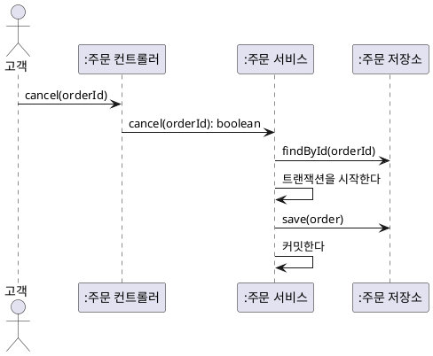

- 이 그림에는 **출고 중단과 환불**도, 그 **순서**도 보이지 않는다. 분석이 찾아야 할 것이 기술 구조에 가려졌다.

**페이지 분할**

**표 — 잘못된 예와 바른 예**

| 잘못된 예 | 바른 예 |
|---|---|
| 참여자: 주문 컨트롤러, 주문 서비스, 주문 저장소 | 참여자: 주문, 배송, 결제, 환불 |
| 메시지: `cancel(orderId): boolean` | 메시지: 취소한다 |
| 메시지: DB 저장, 트랜잭션 커밋 | 업무 결과: 취소 처리 중이 된다 |
| 분석 시퀀스를 설계에 그대로 옮긴다 | 책임 배치는 설계에서 다시 정한다 |

**강사 노트**

- 바른 예는 「06. 시퀀스 다이어그램」의 「주문 취소 시퀀스」다. 설계에서는 설계 객체와 오퍼레이션이 정상이다("06. 분석 모델에서 설계 모델로"). 문제는 **분석 단계**에 섞이는 것이다.

---

## 잘못된 관행 — 정적 모델만 있는 분석

클래스 다이어그램만 그리고 분석을 끝내면, 개념·연관·속성·상태가 **사건으로 검증되지 않은 채** 설계로 넘어간다.

**표 — 정적 모델만 있을 때**

| 잘못된 예 | 드러나지 않는 것 | 바른 예 |
|---|---|---|
| 도메인 모델만 그리고 분석 종료 | 취소 처리 중 같은 누락 상태 | 주요 흐름을 상호작용으로 따라간다 |
| 주문 상태를 값 목록으로만 정의 | 금지된 전이, 중간 상태 | 상태 기계로 전이를 확인한다 |
| 연관을 추측으로 확정 | 쓰이지 않는 연관, 빠진 연관 | 링크와 대조한다 |

**강사 노트**

- 「02. 정적 모델에서 동적 모델로」의 「분석의 동적 모델」의 판단을 잘못된 예로 되짚는다. 분석과 설계를 통합하는 프로세스라면 이 검증을 설계의 상호작용과 테스트가 이어받아야 한다.

---

## 잘못된 관행 — 모든 흐름 그리기

모든 시나리오·조회·예외마다 다이어그램을 그리면 **핵심 흐름이 묻힌다**.

**표 — 모든 흐름을 그릴 때**

| 잘못된 예 | 바른 예 |
|---|---|
| 조회·등록 같은 단순 흐름마다 시퀀스를 그린다 | 규칙과 대안 흐름이 많은 흐름만 그린다 |
| 모든 요청에 응답 화살표를 그린다 | 의미 있는 응답만 그린다 |
| 방어 코드 수준의 오류를 모두 프레임으로 넣는다 | 목표 달성 경로가 달라지는 경우만 넣는다 |
| 목적 없이 같은 상호작용을 두 형식으로 반복한다 | 학습용 비교 뒤에는 질문에 맞는 하나를 고른다 |

**강사 노트**

- 「10. 적정 동적 모델링」의 기준을 잘못된 예로 되짚는다.

---

## 잘못된 관행 — 순서도가 된 활동

활동 다이어그램을 **화면 조작 순서나 코드 제어 흐름**의 순서도로 쓰면 업무 흐름과 책임이 보이지 않는다.

**표 — 순서도가 된 활동**

| 잘못된 예 | 바른 예 |
|---|---|
| 버튼 클릭·화면 이동을 행동으로 나열한다 | 업무 의미의 행동을 쓴다 |
| 반복문·변수 대입 같은 코드 흐름을 그린다 | 업무 흐름만 그린다 |
| 수영 레인 없이 누가 하는지 알 수 없다 | 레인으로 책임자를 나눈다 |
| 결정(마름모)과 병행(굵은 막대)을 섞어 쓴다 | 분기는 마름모, 병행은 막대 |

**강사 노트**

- 저장소 기준(`references/sw-engineering/uml/activity.md`)은 책임과 행동·제어 의미가 없는 순서도 대용으로 활동 다이어그램을 쓰지 말라고 정한다. 「10. 적정 동적 모델링」의 「추상화 수준」의 활동 행과 같은 문제다.

---

## 잘못된 관행 — 상태 기계 오용

상태 기계에 **상태가 아닌 것**을 넣거나 상태를 흩어 두면 규칙이 사라진다.

**표 — 상태 기계 오용**

| 잘못된 예 | 바른 예 |
|---|---|
| 입력 중·저장 중 같은 화면·처리 단계를 상태로 둔다 | 사건에 다르게 반응하는 상황만 상태로 둔다 |
| 결제됨·출고됨·취소됨을 참·거짓 플래그 여러 개로 둔다 | 하나의 상태 값과 전이로 표현한다 |
| 반응이 늘 같은 개념(상품)에 상태 기계를 그린다 | 상태 의존 개념(주문)에만 그린다 |
| 사건 이름 없는 화살표 | 모든 전이에 사건, 필요하면 가드 |

**강사 노트**

- 플래그 여러 개는 "결제되지 않았는데 출고됨"처럼 불가능한 조합을 허용한다. 상태 기계는 가능한 상태와 전이만 허용한다.

---

## 잘못된 관행 — 모델 간 불일치

모델마다 이름과 값이 다르면 **서로를 검증할 수 없다**.

**표 — 모델 간 불일치**

| 잘못된 예 | 바른 예 |
|---|---|
| 정적 모델은 "배송 중", 상태 기계는 "배송 진행" | 용어집의 이름을 모든 모델에 쓴다 |
| 상호작용의 참여자가 정적 모델에 없다 | 개념을 추가하거나 참여자를 고친다 |
| 동적 모델에서 찾은 상태를 정적 모델에 반영하지 않는다 | 발견 즉시 정적 모델과 용어집을 고친다 |
| 계약의 사후조건이 모델에 없는 말을 쓴다 | 모델의 요소로 사후조건을 쓴다 |

- **용어집**이 모든 모델의 이름을 정한다 — 분석은 **한글 용어**, 설계는 같은 용어의 **영문명**이다.

**강사 노트**

- "02. 요구 분석과 유스케이스"에서 정의하고 "03. 정적 모델 — 도메인 개념과 관계"의 「13. 용어 정렬」의 「용어집 정제」에서 정제한 용어집이 모든 모델의 기준이다.

---

## 12. 동적 모델에서 코드로

---

## 다이어그램과 코드

네 동적 다이어그램은 **같은 행위**를 다른 면에서 본다. 주문 취소를 코드로 옮기면 각 다이어그램의 요소가 코드의 서로 다른 곳에 나타난다.

**표 — 동적 다이어그램의 요소와 코드**

| 다이어그램 | 요소 | 코드 |
|---|---|---|
| **활동** | 행동·결정·병행 | 메서드 호출·`if`·독립 호출 |
| **시퀀스** | 메시지·생성·비동기·프레임 | 메서드·`new`·요청·`if`·`for` |
| **커뮤니케이션** | 링크·메시지 번호 | 참조 필드·호출 안의 호출 |
| **상태 기계와 예** | 상태·전이·가드·금지 | `enum`·상태 변경·검사·테스트 |

- **비동기** — 반환값이 아니라 완료를 기다리는지로 구분한다. 예제는 요청 기록으로 순서를 확인한다.
- **코드가 보장** — 정의하지 않은 전이는 거절하고, 출고 중단 뒤에 환불을 요청한다.
- **요구로 남김** — 결제 대기 취소, 출고 중단 거절, 환불 실패, 통보가 오지 않을 때의 정책

**강사 노트**

- 표의 예는 「05. 활동 다이어그램」의 「주문 취소 활동과 코드」, 「06. 시퀀스 다이어그램」의 「시퀀스와 코드」, 「07. 커뮤니케이션 다이어그램」의 「커뮤니케이션과 코드」, 「08. 상태 기계 다이어그램」의 「상태 기계와 코드」·「금지된 전이에서 테스트로」에 있다.
- "01. OOAD 개요"의 다섯 다이어그램 코드, "02. 요구 분석과 유스케이스"의 SSD·계약 코드, "03. 정적 모델 — 도메인 개념과 관계"의 클래스 다이어그램 코드에 이어 동적 모델까지 **다이어그램–코드–테스트**를 끝까지 이었다.
- 코드의 `enum`에는 **취소처리중**이 있다. 「09. 교차검토」의 「상태와 정적 모델」에서 정적 모델의 상태 값에 더하기로 한 결과다. 모델과 코드의 상태 값은 한 원천이어야 한다(DRY).

---

## 동적 모델의 한계

분석의 동적 모델은 **무엇이 일어나는지**를 보여 줄 뿐, **어떤 구조로 실현할지**는 정하지 않는다.

- **책임** — 주문 취소를 어느 객체가 조정하는가? → "07. 책임·협력·계약"
- **경계** — 주문과 배송은 같은 경계 안에 있는가? → "05. 구조적 경계와 의존성"
- **실패와 동시성** — 출고와 취소가 동시에 일어나면? 환불이 실패하면? → 요구 확인과 설계
- **기술** — 통보를 어떤 방식으로 전달하는가? → "10. 기술 제약과 도메인 의미 보존"

**강사 노트**

- 동시성·실패 처리의 기술적 수단은 설계와 구현의 문제지만, **어떤 결과를 보장해야 하는지**는 요구다. 동적 모델은 그 질문을 드러내는 데까지 다룬다.

---

## 13. 실습 — 동적 모델

「정기배송을 신청한다」의 기본 흐름과 **도메인 모델**을 LLM에 제공하여 **시퀀스 다이어그램**과 정기배송의 **상태 기계 다이어그램**을 만들고, 점검 항목으로 **피드백**하여 완성하십시오.

- **투입물**
  + 실습 2의 **유스케이스 명세서**와 **용어집**, 실습 3의 **도메인 모델 상세** — 실제로는 여러분의 결과물을 이어 씁니다.
- **프롬프트**
  + ① "위 기본 흐름을 도메인 모델의 객체로 PlantUML **시퀀스 다이어그램**을 그려줘. 화면·컨트롤러 같은 설계 객체는 넣지 마."
  + ② "정기배송의 **상태 기계 다이어그램**을 PlantUML로 그려줘. 전이마다 사건, 가드, 효과를 표시해줘."
- **점검 항목**
  1. **참여 객체와 이름** — 도메인 모델의 개념만 참여하고, 메시지·상태의 이름이 용어집과 같은가?
  2. **연관** — 메시지가 도메인 모델의 연관을 따라 흐르는가?
  3. **반복·외부** — 회차 생성의 반복과 결제·배송 요청이 있는가?
  4. **상태** — 사건에 **다르게 반응하는 상황**만 상태로 두었는가?
  5. **가드·시간** — 요청 결과의 가드와 만료 같은 **시간 이벤트**가 있는가?
  6. **교차검토** — 도메인 모델에 없는 속성·연관이 필요하면 되돌렸는가?
- **결과물** — 시퀀스와 상태 기계 다이어그램. 실습 5의 입력이 됩니다.

**강사 노트**

- 분석의 상호작용은 **도메인 객체 사이**다. 화면·컨트롤러·저장소는 설계에서 다룬다.
- LLM은 모든 흐름을 한 시퀀스에 넣거나, 처리 단계를 상태로 넣어 상태 기계를 순서도처럼 그리기 쉽다.

---

## 시퀀스 다이어그램 (안)

기본 흐름의 신청·결제·확정 구간을 **도메인 객체의 상호작용**으로 펼쳤다. 정기배송·배송 회차·결제·영수증이 생기는 순서와 외부 요청을 확인한다. 메시지를 보내는 객체는 분석 단계의 가설이며 최종 책임은 설계에서 정한다.

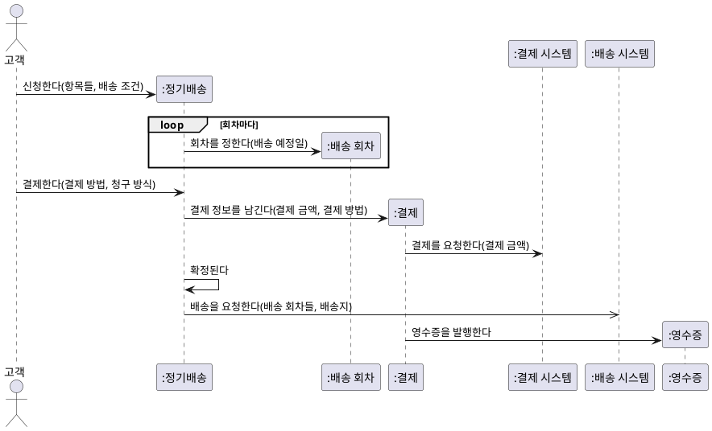

**강사 노트**

- 정기배송 항목의 생성은 읽기 쉽도록 생략했다. 화살표의 보낸 쪽을 설계 책임으로 확정하지 않는다.
- 배송 요청은 **비동기**다. 배송 시스템이 회차마다 배송한다.

---

## 상태 기계 다이어그램 (안)

정기배송은 결제와 배송 요청의 결과에 따라 **확정**되거나 **신청 실패**가 되고, 해지나 만료로 끝난다.

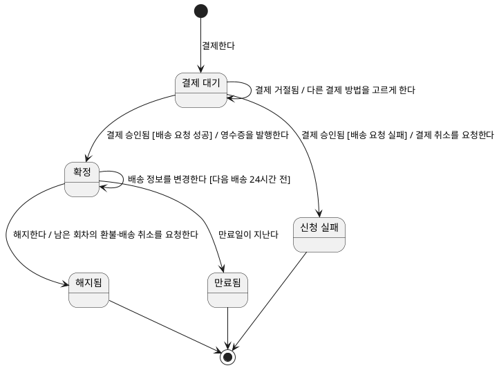

**강사 노트**

- 정기배송은 **상태 의존 객체**다. 해지는 확정에서만 받아들이고, 결제 대기에서는 받지 않는다 — 같은 사건에 다르게 반응한다.
- 만료는 **시간 이벤트**다. 사람이 아니라 시간이 전이를 일으킨다.

---

## 동적 모델 보완 (안)

동적 모델에서 발견한 것 가운데 **후속 작업에 필요한 내용**을 이전 산출물에 반영한다.

**표 — 발견과 이전 산출물 보완**

| 이전 산출물 | 발견 | 보완 |
|---|---|---|
| **도메인 모델** | 정기배송은 사건에 따라 다르게 반응한다 | `정기배송 상태`와 다섯 값을 더한다 |
| **도메인 모델** | 취소·배송은 회차 단위로 일어난다 | 주인은 배송 회차. 값·전이는 다음 배송 취소에서 결정 |
| **도메인 모델** | 정기배송·배송 회차·결제·영수증이 생긴다 | 개념과 연관을 확인한다. 생성 책임은 설계에서 정한다 |
| **유스케이스 명세서** | 7a는 결제 승인 뒤 배송 요청이 실패한다 | 결제 승인 후에도 정기배송이 확정되지 않음을 기록한다 |
| **용어집** | 정기배송 상태가 필요하다 | 정기배송 상태와 다섯 값을 추가 |

- **반영** — 정기배송 상태·용어와 기본 흐름에서 생기는 개념
- **기록만** — 7a의 설명과 회차 상태 값. 필요한 유스케이스를 분석할 때 확정한다.

**강사 노트**

- 정적 모델만으로는 상태의 주인을 잘못 판단하기 쉽다. 해지가 확정에서만 받아들여진다는 **반응의 차이**를 동적 분석이 드러내 바로잡는다 — 「09. 교차검토」의 「상태와 정적 모델」.
- 회차 상태 기계를 그리지 않은 것은 「10. 적정 동적 모델링」의 판단이다. 이 유스케이스에서 회차는 만들어질 뿐 반응이 달라지지 않는다.

---

## 14. 요약

사건에 따른 **상호작용과 상태 변화**를 동적 모델로 확인하고, 정적 모델과 **서로 검증**했다.

### 동적 모델의 핵심

- **수준** — SSD는 시스템 수준, 분석 시퀀스는 도메인 객체 수준, 설계 시퀀스는 설계 객체 수준
- **활동** — 유스케이스와 여러 시스템의 업무 흐름. DFD의 목적을 객체 노드로 이룬다
- **시퀀스·커뮤니케이션** — 순서는 시퀀스와 프레임, 연결 구조는 커뮤니케이션과 링크
- **상태 기계** — 사건에 다르게 반응하는 상황이 상태, 금지와 미정을 구분
- **교차검토** — 계약·상태·상호작용을 정적 모델에 대어 누락과 모순을 되돌린다
- **적정 모델링과 코드** — 업무 의미의 수준에서 이해할 만큼, 금지된 전이는 거절 테스트

### 다음 세션

- "**05. 구조적 경계와 의존성**" — 분석 결과를 바탕으로 책임이 놓일 경계와 의존성 방향을 판단한다.

**강사 노트**

- 주문 시스템이 외부 시스템에 보내는 요청과 받는 통보는 다음 세션에서 **의존 방향**의 판단(주문 시스템이 배송 시스템을 아는가, 통보를 받는가?)으로 이어진다.
