--------------------
Session 명: 05. 구조적 경계와 의존성
--------------------

## 목차

01. 세션 목표
02. 분석에서 구조로
03. 클래스에서 패키지로
04. 구조적 경계
05. 의존성
06. 경계와 의존의 결정
07. 패키지 다이어그램
08. 묶는 기준
09. 합성과 불변 조건
10. 규칙과 상태의 소유
11. 변경 이유
12. 함께 쓰임
13. 연동 분리
14. 묶기 절차
15. 경계 후보
16. 외부 시스템 의존
17. 동기 요청
18. 비동기 통보
19. 경계에서 옮기기
20. 주문 시스템 패키지 — 초안
21. 의존 화살표 읽기
22. 경계의 책임
23. 의존 방향
24. 순환 의존
25. 요청과 통보의 방향
26. 주문 시스템 패키지 — 상세화
27. 패키지 원칙
28. 구조의 진화
29. 결합도와 응집도
30. 변경 파급
31. 방향에 따른 파급
32. 구조적 제약
33. 제약의 검증
34. 잘못된 관행 — 기술 계층 분할
35. 잘못된 관행 — 공용 패키지
36. 잘못된 관행 — 외부 모델 누수
37. 패키지와 코드
38. 의존 방향과 테스트
39. 옮기기 코드
40. 적정 구조 설계
41. 실습 — 경계와 의존성
42. 패키지 다이어그램 초안 (안)
43. 패키지 다이어그램 상세 (안)
44. 구조 보완 (안)
45. 요약

## 01. 세션 목표

이 세션은 요구·정적·동적 모델을 바탕으로 책임이 놓일 **구조적 경계**와 **의존성 방향**을 판단한다.

- 구조적 경계와 의존성이 **변경의 범위와 전파 방향**을 정한다는 것을 설명한다.
- 클래스를 패키지로 **묶는 기준**(합성·소유·변경 이유·함께 쓰임·외부)을 적용해 경계 후보를 정한다.
- 외부 시스템에 대한 **요청과 통보**의 의존 방향을 판단한다.
- **패키지 다이어그램**으로 경계와 의존성을 표현하고, **패키지 원칙**으로 순환 없는 방향을 정한다.
- 변경 시나리오로 **결합도와 변경 파급**을 검토한다.
- 객체 설계 전에 지킬 **구조적 제약**을 명시하고 자바 코드·테스트로 확인한다.

**강사 노트**

- 시스템 전체의 경계(무엇이 주문 시스템의 책임인가)는 "02. 요구 분석과 유스케이스"에서 정했다. 이 세션은 주문 시스템 **안의** 경계를 다룬다. 클래스 수준의 책임 배치는 "06. 분석 모델에서 설계 모델로"·"07. 책임·협력·계약"에서 다룬다.

---

## 02. 분석에서 구조로

분석은 **무엇이 존재하고 무엇이 일어나는지**를 밝혔다. 이제 그 의미를 지킬 책임이 **어디에 놓일지** 판단한다.

| 입력 | 앞 세션 | 이 세션에서 쓰는 것 |
|---|---|---|
| **요구** | "02. 요구 분석과 유스케이스" | 시스템 이벤트, 오퍼레이션 계약, 외부 시스템 |
| **정적 모델** | "03. 정적 모델 — 도메인 개념과 관계" | 개념, 연관, 분석 패키지 |
| **동적 모델** | "04. 동적 모델 — 상호작용과 상태" | 상호작용, 상태의 소유, 요청과 통보 |

**도식 — Mermaid**

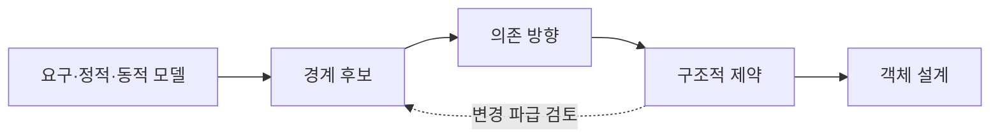

**강사 노트**

- "04. 동적 모델 — 상호작용과 상태"는 주문 시스템이 외부에 보내는 **요청**과 받는 **통보**를 남겼다. 이 세션은 그 질문(주문 시스템이 배송 시스템을 아는가, 통보를 받는가?)에 답한다.
- 사례의 전제(결제 완료·배송 시작 전 전체 취소, 출고 전 배송지 변경)는 그대로 유지한다.

---

## 03. 클래스에서 패키지로

**다이어그램 — 패키지 다이어그램**

도메인 모델이 커지면 클래스 다이어그램 한 장으로는 읽기도, 바꾸기도 어렵다. 패키지는 **개념을 읽기 쉽게 묶는** 데서 시작해, 이 세션에서는 **변경의 단위**가 된다.

**도식 — PlantUML**

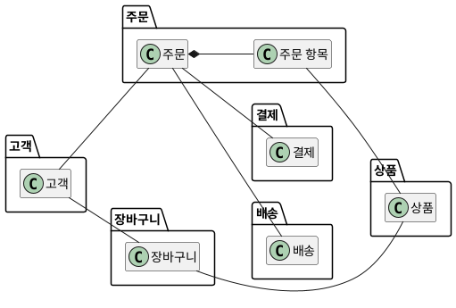

| 구분 | 분석 패키지 | 구조 패키지 |
|---|---|---|
| **묶는 이유** | 개념을 이해한다 | 변경을 가둔다 |
| **관계** | 방향 없는 연관 | 방향 있는 의존 |
| **판단 기준** | 업무 의미 | 소유·변경 이유·함께 쓰임 |

**강사 노트**

- 도식은 "03. 정적 모델 — 도메인 개념과 관계"의 「48. 도메인 모델 — 패키지별」을 경계를 넘는 연관만 남겨 줄인 것이다(장바구니 항목·환불은 생략). 분석 패키지의 기준(주제 영역·클래스 계층·유스케이스·강한 연관)은 "03. 정적 모델 — 도메인 개념과 관계"의 「47. 패키지 기준」에서 다뤘다.
- 분석 패키지를 구조 패키지로 그대로 쓸 수 있는지는 **설계의 기준**으로 다시 확인한다(「08. 묶는 기준」).

---

## 04. 구조적 경계

**구조적 경계**는 함께 바뀌는 **상태와 규칙**을 묶어, 책임이 놓일 범위를 정하는 선이다.

- **안** — 경계가 소유하는 상태와 그 상태를 바꾸는 규칙
- **밖** — 경계가 알 필요 없는 세부. 경계를 넘을 때는 약속한 방식으로만 주고받는다
- **목적** — 한 곳의 변경이 **다른 곳으로 번지지 않게** 한다

경계는 폴더 정리가 아니라 **변경을 가두는 결정**이다.

**강사 노트**

- "01. OOAD 개요"의 「21. 책임과 경계」에서 경계를 "함께 변경되어야 할 상태와 행위의 묶음"으로 미리 보였다. 이 세션은 그것을 주문 시스템에 적용한다.
- 이 세션의 경계는 **주문 시스템 안의 구조**다. 여러 시스템으로 나누는 판단(서비스 경계)은 "13. OOAD에서 전문영역으로 — Architecture · DDD · MSA"에서 다룬다.

---

## 05. 의존성

**의존성**은 한 요소가 다른 요소를 **알고 쓰는** 관계다. 쓰는 쪽은 쓰이는 쪽이 바뀌면 **함께 바뀔 수 있다**.

**인용문**

"의존은 공급자를 바꾸면 클라이언트 요소가 영향을 받을 수 있는, 모델 요소 사이의 **공급자/클라이언트** 관계다", "A Dependency signifies a supplier/client relationship between model elements where the modification of a supplier may impact the client model elements.", Object Management Group, 2017

- **방향** — 화살표는 쓰는 쪽(클라이언트)에서 쓰이는 쪽(공급자)으로 향한다.
- **전파** — 변경은 화살표의 **반대 방향**으로 번진다. 공급자가 바뀌면 클라이언트가 영향을 받는다.

**강사 노트**

- 인용 근거: OMG Unified Modeling Language 2.5.1(2017-12), §7.7 Dependencies 원문 확인.
- 의존 방향을 정하는 일은 곧 **변경이 어디로 번질지**를 정하는 일이다. 이 세션의 판단은 모두 이 한 문장에서 나온다.

---

## 06. 경계와 의존의 결정

경계와 의존 방향은 요구·분석과 다른 **구조 설계의 결정**이다. 앞의 결정을 입력으로 쓰고, 뒤의 결정을 제약한다.

| 결정 | 질문 | 다루는 곳 |
|---|---|---|
| **시스템 경계** | 무엇이 이 시스템의 책임인가? | "02. 요구 분석과 유스케이스" |
| **구조적 경계** | 시스템 안의 어느 묶음이 책임지는가? | 이 세션 |
| **의존 방향** | 어느 묶음이 어느 묶음을 아는가? | 이 세션 |
| **객체 책임** | 어느 객체가 판단하고 협력하는가? | "07. 책임·협력·계약" |

**강사 노트**

- 분석은 의미를 밝히고, 설계는 그 의미를 지킬 책임과 협력을 새로 판단한다. 경계는 분석 모델을 그대로 옮긴 결과가 아니다.
- 구조의 결정은 되돌리기 어렵다. 그래서 **객체 설계 전에** 확인한다(`sw-engineering-principles.md`의 YAGNI — 되돌리기 어려운 결정은 지금 확인한다).

---

## 07. 패키지 다이어그램

**패키지 다이어그램**은 패키지와 그 사이의 **의존**을 보여 준다. 경계와 의존 방향을 한눈에 검토하는 도구다.

**도식 — PlantUML**

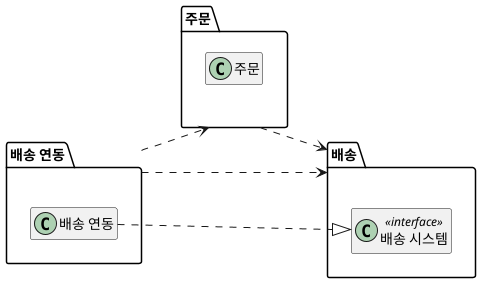

### 표기와 사용법

| 표기 | 의미 | 이렇게 쓴다 |
|---|---|---|
| **패키지** — 탭 달린 폴더 | 경계의 이름 있는 묶음 | 변경 이유로 이름 짓는다 |
| **의존** — 점선 화살표 | 쓰는 쪽 → 쓰이는 쪽 | 경계를 넘는 사용마다 하나 |
| **실현** — 점선·빈 삼각형 | 인터페이스를 구현한다 | 약속과 그 실현을 잇는다 |
| **«interface»** | 구현 없는 약속 | 약속을 소유한 패키지에 둔다 |

**강사 노트**

- 표기 기준: OMG UML 2.5.1, §12 Packages, §7.7 Dependencies, §10.4 Interfaces.
- "03. 정적 모델 — 도메인 개념과 관계"의 「46. 개념의 묶음 — 패키지」는 개념의 묶음까지 다뤘다. 이 세션은 **의존 화살표와 인터페이스**를 더한다.

---

## 08. 묶는 기준

클래스를 패키지로 묶는 기준은 **다섯 가지 질문**이다. 각 질문의 단서는 앞 세션의 모델에 이미 있다.

| 기준 | 질문 | 모델의 단서 |
|---|---|---|
| **합성·불변 조건** | 함께 있어야 규칙이 지켜지는가? | 정적 모델의 합성 |
| **소유** | 누가 그 상태와 규칙을 바꾸는가? | 동적 모델의 상태 기계 |
| **변경 이유** | 같은 이유로 바뀌는가? | 요구의 규칙·정책 |
| **함께 쓰임** | 늘 함께 쓰이는가? | 요구의 시스템 이벤트 |
| **외부 통제** | 우리가 바꿀 수 있는가? | 정제된 SSD의 외부 시스템 |

**강사 노트**

- 앞의 두 기준은 **함께 두어야 할 것**을, 뒤의 세 기준은 **나눠야 할 것**을 찾는다. 기준이 부딪히면 변경 이유가 우선한다.
- 기능 목록(주문 관리 기능, 결제 기능)이나 기술 계층은 기준이 아니다(「34. 잘못된 관행 — 기술 계층 분할」).

---

## 09. 합성과 불변 조건

**합성**으로 묶인 전체와 부분은 **같은 패키지**에 둔다. 전체가 부분의 규칙을 지키므로, 떼어 놓으면 규칙이 경계를 넘는다.

- **주문–주문 항목** — 주문 항목은 **1개 이상**이다(빈 주문 거절). 주문 항목만 따로 바뀌지 않는다.
- **장바구니–장바구니 항목** — 담기·빼기는 장바구니의 규칙이다.
- **연관**은 다르다. 주문과 결제는 연관이라 **나눌 수 있다** — 결제는 자기 규칙(환불 금액 ≤ 결제 금액)을 가진다.

**강사 노트**

- 합성과 다중성은 "03. 정적 모델 — 도메인 개념과 관계"의 「45. 도메인 모델 — 상세화」와 같다.
- 합성은 "함께 만들어지고 함께 사라지는 부분"이다. 연관의 강도가 약할수록 경계를 둘 후보가 된다.

---

## 10. 규칙과 상태의 소유

상태를 **바꾸는 쪽**이 그 상태의 경계다. 규칙은 그 규칙이 지키는 **상태와 같은 곳**에 둔다.

| 상태·규칙 | 바꾸는 쪽 | 경계 |
|---|---|---|
| **주문 상태**(결제 대기~취소됨) | 주문 | 주문 |
| **취소 규칙**(배송 시작 전) | 주문 | 주문 |
| **환불 규칙**(환불 ≤ 결제 금액) | 결제 | 결제 |
| **출고 준비 중·출고됨** | 배송 시스템 | 주문 시스템 밖 |

**강사 노트**

- 근거: "04. 동적 모델 — 상호작용과 상태"의 「33. 주문 상태 기계」와 「26. 주문 취소 시퀀스」.
- 규칙이 상태와 다른 경계에 있으면, 상태를 바꿀 때마다 두 경계가 함께 바뀐다. 규칙의 소유는 "03. 정적 모델 — 도메인 개념과 관계"의 「24. 규칙의 소유」와 같은 생각을 패키지 수준에 적용한 것이다.

---

## 11. 변경 이유

경계는 **함께 바뀌는 것**을 묶고 **따로 바뀌는 것**을 나눈다. 묶는 기준은 기능 목록이 아니라 **변경 이유**다.

**인용문**

"대신 **어렵거나 바뀔 가능성이 큰 설계 결정**의 목록에서 시작하기를 제안한다", "We propose instead that one begins with a list of difficult design decisions or design decisions which are likely to change.", David L. Parnas, 1972, www

**인용문**

"**함께 바뀌는** 클래스는 함께 둔다", "Classes that change together, belong together.", Robert C. Martin, 2000

| 바뀔 수 있는 것 | 변경 이유 | 가둘 경계 |
|---|---|---|
| **취소 규칙** | 업무 정책 | 주문 |
| **환불 정책** | 결제·환불 정책 | 결제 |
| **결제 대행 방식** | 외부 계약·기술 | 결제 연동 |
| **배송 통보 형식** | 배송 시스템의 변경 | 배송 연동 |

**강사 노트**

- Parnas, "On the Criteria To Be Used in Decomposing Systems into Modules", *Communications of the ACM*(1972) 원문은 확인하지 못했다(www). 재인용처: Adrian Colyer, *the morning paper*(2016-09-05)의 해설에서 문장을 확인했다.
- CCP 인용 근거: Robert C. Martin, "Design Principles and Design Patterns"(2000), The Common Closure Principle 원문 확인.
- Parnas는 각 모듈이 그런 결정 하나를 다른 모듈에 감추도록 설계하라고 이어 말한다. 이 세션의 "변경을 가둔다"와 같은 생각이다.

---

## 12. 함께 쓰임

늘 **함께 쓰이지 않는** 클래스는 한 패키지에 두지 않는다. 한쪽만 쓰는 곳도 다른 쪽의 변경에 영향을 받기 때문이다.

**인용문**

"**함께 재사용되지 않는** 클래스는 함께 묶지 않는다", "Classes that aren’t reused together should not be grouped together.", Robert C. Martin, 2000

| 시스템 이벤트 | 함께 쓰는 경계 | 쓰지 않는 경계 |
|---|---|---|
| **장바구니에 담는다** | 장바구니, 상품 | 주문, 결제 |
| **결제한다** | 주문, 결제 | 장바구니 |
| **주문을 취소한다** | 주문, 결제, 배송 | 장바구니 |
| **배송지를 변경한다** | 주문, 배송 | 결제 |

**강사 노트**

- 인용 근거: Robert C. Martin, "Design Principles and Design Patterns"(2000), The Common Reuse Principle 원문 확인.
- 장바구니와 결제는 한 이벤트에서도 함께 쓰이지 않는다. 한 패키지에 두면 장바구니 편의 기능의 변경이 결제까지 다시 확인하게 만든다.
- 이벤트 이름은 "02. 요구 분석과 유스케이스"의 공통 전제와 같다.

---

## 13. 연동 분리

**외부 시스템**과 주고받는 형식은 우리가 통제하지 못한다. 외부마다 **연동 경계**를 따로 둬 그 변경을 가둔다.

- **통제 밖** — 결제 대행 계약, 배송사의 통보 형식은 외부의 결정으로 바뀐다.
- **따로 바뀜** — 결제 시스템과 배송 시스템은 **서로 다른 이유**로 바뀌므로 연동도 나눈다.
- **업무와 분리** — 연동이 바뀌어도 주문의 규칙은 바뀌지 않아야 한다.

**강사 노트**

- 외부 시스템 목록과 동기·비동기는 과정의 공통 전제와 같다("02. 요구 분석과 유스케이스"의 「43. 정제된 SSD」).
- 연동 경계는 외부 시스템마다 하나다: 결제 연동, 상품 연동, 배송 연동, 회계 연동.

---

## 14. 묶기 절차

**다이어그램 — 패키지 다이어그램**

"03. 정적 모델 — 도메인 개념과 관계"의 「48. 도메인 모델 — 패키지별」을 **설계의 기준 순서대로** 다시 확인한다.

1. **합성**으로 묶인 부분을 전체에 붙인다(주문 항목 → 주문, 장바구니 항목 → 장바구니).
2. 상태·규칙의 **소유자**에 모은다(환불 → 결제).
3. **변경 이유**가 다르면 나눈다(배송 기록은 주문 규칙과 따로 바뀐다).
4. **함께 쓰이지 않으면** 나눈다(장바구니와 결제).
5. **외부 시스템**마다 연동을 둔다.
6. 경계를 넘는 연관의 **방향**을 정하고 순환을 검사한다(「20. 주문 시스템 패키지 — 초안」).

**페이지 분할**

**도식 — PlantUML**

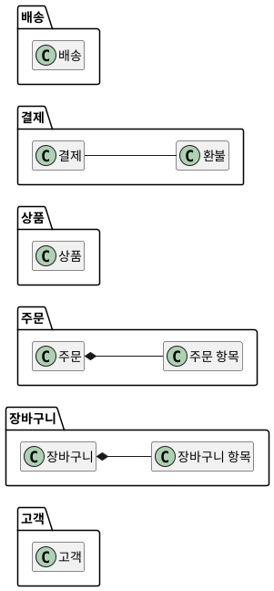

- 이 사례에서는 분석 패키지가 기준을 통과해 **업무 경계**가 된다. 연동 경계 넷을 더한다.

**강사 노트**

- 절차의 순서는 판단의 순서다. 먼저 함께 둘 것을 붙이고, 그다음 나눌 것을 나눈다.
- 분석 패키지와 결과가 같은 것은 우연이 아니라 "03. 정적 모델 — 도메인 개념과 관계"가 업무 의미로 묶었기 때문이다. 기술 계층으로 묶었다면 결과가 달랐을 것이다.

---

## 15. 경계 후보

단서와 변경 이유로 주문 시스템의 **경계 후보**를 정리한다. **업무 경계**는 분석 패키지를 따르고, 외부 시스템마다 **연동 경계**를 더한다.

| 경계 | 소유하는 것 | 변경 이유 |
|---|---|---|
| **고객** | 고객 정보 | 회원 정책 |
| **장바구니** | 담긴 상품·수량 | 구매 편의 정책 |
| **주문** | 주문·주문 항목·주문 상태·취소 규칙 | 주문 정책 |
| **상품** | 주문 시스템이 기억하는 상품 정보 | 상품 시스템의 정보 |
| **결제** | 결제·환불 기록과 규칙 | 결제·환불 정책 |
| **배송** | 배송 기록 | 배송 요청의 의미 |
| **연동** | 외부 시스템과 주고받는 형식 | 외부 시스템의 변경 |

**강사 노트**

- 연동 경계는 외부 시스템마다 하나다: 결제 연동, 상품 연동, 배송 연동, 회계 연동. 이 이름은 과정의 공통 전제에 더한다.
- 업무 경계의 이름은 분석 패키지와 같다. 이름을 바꾸면 모델이 바뀐 것이다.

---

## 16. 외부 시스템 의존

주문 시스템은 네 외부 시스템과 **요청과 통보**를 주고받는다. 요청의 종류가 의존의 성격을 정한다.

| 외부 시스템 | 주문 시스템 → 외부 | 외부 → 주문 시스템 |
|---|---|---|
| **결제 시스템** | 결제 승인(동기), 환불 요청 | 환불 완료 통보 |
| **상품 시스템** | 상품 정보·재고 차감(동기) | — |
| **회계 시스템** | 입금 처리·영수증 발행 | — |
| **배송 시스템** | 배송 요청, 배송지 변경·출고 중단(동기) | 배송 시작·완료 통보 |

**강사 노트**

- 외부 시스템과 요청의 동기·비동기는 과정의 공통 전제와 같다("02. 요구 분석과 유스케이스"의 「43. 정제된 SSD」).
- 외부 시스템 자체는 바꿀 수 없다. 우리가 정할 수 있는 것은 **주문 시스템 안에서 누가 외부를 아는가**다.

---

## 17. 동기 요청

**동기 요청**은 결과를 기다리는 요청이다. 요청하는 쪽은 받는 쪽의 **약속(인터페이스)**에 의존한다.

- 출고 중단 요청은 결과(중단됨·이미 출고됨)를 **받아야** 다음 행동을 정한다.
- 이때 주문이 아는 것은 "출고 중단을 요청할 수 있다"는 **약속**이면 충분하다. 배송 시스템의 주소·형식까지 알 필요는 없다.

**강사 노트**

- 동기·비동기의 구분 기준은 반환값이 아니라 **완료를 기다리는가**다("04. 동적 모델 — 상호작용과 상태"의 「51. 동적 모델에서 코드로」).
- 약속과 그 실현(외부 호출)을 나누면, 실현이 바뀌어도 약속에 의존하는 쪽은 바뀌지 않는다.

---

## 18. 비동기 통보

**비동기 통보**는 외부가 나중에 알려 오는 사건이다. 통보는 **주문 시스템 쪽으로** 들어오지만, 의존 방향은 우리가 정한다.

- **질문** — 주문이 배송 시스템을 알아야 통보를 받을 수 있는가?
- **답** — 아니다. 주문은 "배송이 시작되었다"는 **자기 사건**만 안다. 배송 시스템의 형식을 읽어 그 사건으로 바꾸는 일은 **연동**이 한다.

**강사 노트**

- "04. 동적 모델 — 상호작용과 상태"가 남긴 질문의 답이다. 주문은 통보를 **받지만**, 배송 시스템을 **알지 않는다**.
- 통보를 옮기는 연동이 주문을 알고, 주문은 연동을 모른다. 방향의 근거는 「23. 의존 방향」에서 다룬다.

---

## 19. 경계에서 옮기기

외부의 이름·형식·상태는 **경계에서 주문 시스템의 의미로 옮긴다**. 옮기지 않으면 외부의 변경이 안으로 번진다.

| 외부 | 연동이 옮긴 의미 | 옮기지 않는 것 |
|---|---|---|
| **DISPATCHED** 상태 코드 | 배송 시작 통보 | — |
| **PICKING·PACKED** 상태 코드 | — | 배송 시스템 내부 상태 |
| **REFUNDED** 결과 코드 | 환불 완료 통보 | — |
| **STOP·ACCEPTED** 명령 | 출고 중단 요청과 결과 | 요청 형식 |

**강사 노트**

- 상태 코드는 이해를 돕기 위한 **교육용 가정**이다. 실제 형식은 외부 시스템의 계약으로 확인한다.
- 판매가도 같다. 상품 시스템의 판매가는 주문 시점에 주문 항목의 **단가**로 옮겨 확정한다("03. 정적 모델 — 도메인 개념과 관계"의 현재 값과 확정 값).

---

## 20. 주문 시스템 패키지 — 초안

**다이어그램 — 패키지 다이어그램**

연관을 따라 의존을 그리고, 외부 호출을 쓰는 곳에서 연동을 **직접 부르는** 초안이다.

**도식 — PlantUML**

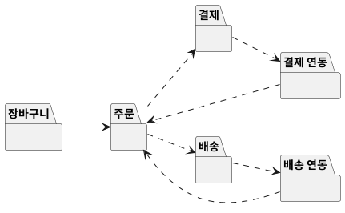

- 결제·배송이 연동을 부르고, 연동은 통보를 주문에 전한다 → 주문 → 배송 → 배송 연동 → 주문의 **순환**이 생긴다.

**강사 노트**

- 고객·상품·상품 연동·회계 연동은 같은 방식이라 생략했다.
- 초안의 문제를 먼저 보이고 「24. 순환 의존」·「26. 주문 시스템 패키지 — 상세화」에서 고친다.

---

## 21. 의존 화살표 읽기

의존 화살표는 **"이것이 바뀌면 저것이 바뀔 수 있다"**로 거꾸로 읽는다.

- **배송 ..> 배송 연동** — 배송 연동이 바뀌면(배송 대행사 교체) **배송**이 바뀔 수 있다.
- **배송 연동 ..> 주문** — 주문이 바뀌면 배송 연동이 바뀔 수 있다.
- 초안에서는 외부 형식의 변경이 연동 → 배송 → **주문까지** 번질 수 있다.

**강사 노트**

- 화살표를 셀 때는 **변경이 어디서 시작될 가능성이 큰가**를 함께 본다. 외부 시스템은 우리가 통제하지 못하는 변경의 출발점이다.

---

## 22. 경계의 책임

경계마다 **소유하는 것, 제공하는 약속, 의존하는 것**을 적으면 방향을 판단할 근거가 생긴다.

| 경계 | 소유 | 제공하는 약속 | 의존 |
|---|---|---|---|
| **주문** | 주문 상태·취소 규칙 | 결제되었다, 취소한다, 통보 수신 | 결제, 배송 |
| **결제** | 결제·환불 기록 | 환불을 요청한다 | — |
| **배송** | 배송 기록 | 출고 중단을 요청한다 | — |
| **결제 연동** | 결제 시스템 형식 | 결제 시스템 요청의 실현 | 결제, 주문 |
| **배송 연동** | 배송 시스템 형식 | 배송 시스템 요청의 실현 | 배송, 주문 |

**강사 노트**

- "제공하는 약속"은 오퍼레이션 이름 수준이다. 매개변수와 계약의 정제는 "07. 책임·협력·계약"에서 한다.

---

## 23. 의존 방향

의존은 **덜 바뀌는 쪽**을 향해야 한다. 업무 규칙은 외부 연동보다 덜 바뀌므로, **연동이 업무에 의존**한다.

**인용문**

"**안정된 방향**으로 의존하라", "Depend in the direction of stability.", Robert C. Martin, 2000

- **안정** — 많은 쪽이 의존하고, 바꾸기 어렵고, 바뀔 이유가 적다(주문의 규칙).
- **불안정** — 외부 계약·기술 때문에 자주 바뀐다(결제 대행, 배송 형식).

**강사 노트**

- 인용 근거: Robert C. Martin, "Design Principles and Design Patterns"(2000), The Stable Dependencies Principle 원문 확인.
- 안정은 "좋다"가 아니라 "바꾸기 어렵다"는 뜻이다. 그래서 바꾸기 어려운 곳에는 **자주 바뀌는 세부를 두지 않는다**.

---

## 24. 순환 의존

**순환 의존**은 서로가 서로를 아는 상태다. 순환 안의 요소는 **따로 바꾸거나 따로 시험할 수 없다**.

**인용문**

"패키지 사이의 의존은 **순환**을 이루어서는 안 된다", "The dependencies betwen packages must not form cycles.", Robert C. Martin, 2000

- 초안의 **주문 → 배송 → 배송 연동 → 주문**은 순환이다. 배송 연동을 바꾸면 세 경계를 모두 다시 확인해야 한다.
- 순환은 **화살표 하나의 방향**을 바꿔 끊는다. 요청의 약속을 누가 소유하는지가 그 화살표다.

**강사 노트**

- 인용 근거: Robert C. Martin, "Design Principles and Design Patterns"(2000), The Acyclic Dependencies Principle 원문 확인. "betwen"은 원문의 표기다.

---

## 25. 요청과 통보의 방향

**요청의 약속을 업무 경계가 소유**하면 순환이 끊긴다. 연동은 그 약속을 실현하고, 통보를 주문에 전한다.

**인용문**

"**추상**에 의존하라. 구체에 의존하지 마라", "Depend upon Abstractions. Do not depend upon concretions.", Robert C. Martin, 2000

**도식 — PlantUML**

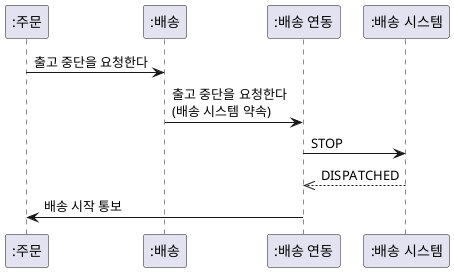

- **요청** — 배송은 자기 약속 **배송 시스템**을 부르고, 실현은 모른다.
- **통보** — 배송 연동이 외부 형식을 **배송 시작 통보**로 옮긴다.

**강사 노트**

- 인용 근거: Robert C. Martin, "Design Principles and Design Patterns"(2000), The Dependency Inversion Principle 원문 확인.
- 이 시퀀스의 참여자는 설계 객체(배송 연동)를 포함한다. 분석 시퀀스가 아니라 **구조 설계의 확인용**이다.
- 요청과 통보는 서로 다른 시점의 상호작용이다. 한 그림에 모은 것은 방향 비교를 위해서다.

---

## 26. 주문 시스템 패키지 — 상세화

**다이어그램 — 패키지 다이어그램**

요청의 약속을 업무 경계가 소유하게 바꾼 **상세화**다. 모든 화살표가 **업무 쪽으로** 향하고 순환이 없다.

**도식 — PlantUML**

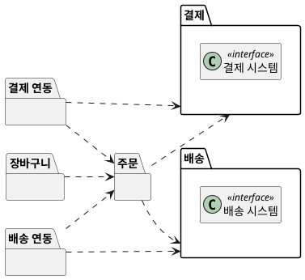

- 초안의 **배송 ..> 배송 연동**이 **배송 연동 ..> 배송**으로 바뀌었다. 결제도 같다.

**인용문**

"**안정된 패키지**는 추상 패키지여야 한다", "Stable packages should be abstract packages.", Robert C. Martin, 2000

- 많이 의존받는 결제·배송이 **약속(인터페이스)**을 소유하고, 실현은 연동이 맡는다.

**강사 노트**

- SAP 인용 근거: Robert C. Martin, "Design Principles and Design Patterns"(2000), The Stable Abstractions Principle 원문 확인.
- 고객·상품과 상품 연동·회계 연동은 같은 원칙이다: 상품이 상품 시스템 약속을, 결제가 회계 시스템 약속을 소유하고 각 연동이 실현한다.
- 이 구조에 이름을 붙이는 일(아키텍처 스타일)은 "13. OOAD에서 전문영역으로 — Architecture · DDD · MSA"에서 한다. 여기서는 판단의 근거만 본다.

---

## 27. 패키지 원칙

Robert C. Martin은 패키지를 묶는 **응집** 원칙 셋과 패키지 사이의 **결합** 원칙 셋을 정리했다.

**인용문**

"**재사용의 단위**는 릴리스의 단위다", "The granule of reuse is the granule of release.", Robert C. Martin, 2000

| 구분 | 원칙 | 요지 |
|---|---|---|
| **응집** | REP 재사용·릴리스 등가 | 함께 배포하는 단위로 묶는다 |
| **응집** | CCP 공통 폐쇄 | 함께 바뀌는 것을 묶는다 |
| **응집** | CRP 공통 재사용 | 함께 쓰이지 않는 것은 나눈다 |
| **결합** | ADP 비순환 의존 | 순환을 만들지 않는다 |
| **결합** | SDP 안정된 의존 | 안정된 쪽으로 의존한다 |
| **결합** | SAP 안정된 추상 | 안정된 패키지는 추상적이다 |

**강사 노트**

- 인용 근거: Robert C. Martin, "Design Principles and Design Patterns"(2000), The Release Reuse Equivalency Principle 원문 확인. 뒤의 책 *Clean Architecture*(2017)에서는 컴포넌트 원칙이라 부른다.
- 이 세션의 적용: CCP는 「11. 변경 이유」, CRP는 「12. 함께 쓰임」, SDP는 「23. 의존 방향」, ADP는 「24. 순환 의존」, SAP는 「26. 주문 시스템 패키지 — 상세화」.
- REP는 여러 팀·배포 단위로 나눌 때 중요하다. 한 시스템 안의 패키지에서는 CCP·CRP가 먼저다.
- SOLID가 클래스(벽돌)를 배치하는 원칙이라면, 패키지 원칙은 컴포넌트(방)를 배치하는 원칙이다. CCP는 SRP를, CRP는 ISP를 컴포넌트 수준으로 옮긴 것이다(Robert C. Martin, *Clean Architecture*, 2017의 요지 — 재인용처: Yannick Grenzinger, "Summary of 'Clean Architecture'"). SOLID는 "07. 책임·협력·계약"·"08. 변화 대응과 변이 설계"에서 다룬다.

---

## 28. 구조의 진화

패키지 구조는 처음에 완성하지 않는다. 이 세션의 경계는 **첫 구조**이며, 클래스 설계와 변경을 거치며 **다시 조정된다**.

**인용문**

"컴포넌트 구조는 **하향식으로 설계할 수 없다**. 시스템에서 가장 먼저 설계하는 것이 아니라, 시스템이 자라고 바뀌면서 진화한다", "The component structure cannot be designed from the top down. It is not one of the first things about the system that is designed, but rather evolves as the system grows and changes.", Robert C. Martin, 2017, www

- **지금** — 요구·분석 모델에서 드러난 변경 이유로 **첫 경계**와 방향을 정한다.
- **다음** — 클래스의 책임을 정하면("07. 책임·협력·계약") 경계가 맞는지 **다시 확인**한다.
- **변경 후** — 실제 변경이 여러 경계에 번지면 **경계를 되돌려** 고친다.

**강사 노트**

- Robert C. Martin, *Clean Architecture*(2017) 14장의 문장이다. 원서는 확인하지 못했다(www). 재인용처: GitHub "thzt/book-excerpt"의 *Clean Architecture* 발췌에서 문장을 확인했다. 국역본은 송준이 옮김, 인사이트, 2019다.
- 같은 장은 패키지 의존 그림이 기능이 아니라 **빌드와 유지보수의 지도**라고 설명한다(재인용처: Yannick Grenzinger의 요약).
- 반복·점진 개발에서 구조도 함께 자란다. `sw-engineering-principles.md`의 결정–검증–되돌림이 구조에도 적용된다.

---

## 29. 결합도와 응집도

**결합도**는 경계 사이가 서로에게 **얼마나 기대는가**, **응집도**는 경계 안이 **하나의 이유로 모여 있는가**다.

- **낮은 결합** — 경계를 넘는 것은 약속뿐이다. 한쪽의 세부가 바뀌어도 다른 쪽은 그대로다.
- **높은 응집** — 경계 안의 것은 **같은 변경 이유**로 함께 바뀐다.
- 둘은 **함께** 움직인다. 응집이 낮은 경계는 **여러 이유**로 바뀌고, 그 변경이 결합을 따라 번진다.

**강사 노트**

- 결합도·응집도는 Stevens·Myers·Constantine의 "Structured Design"(IBM Systems Journal, 1974)이 모듈 설계의 기준으로 제시한 개념이다. 이 세션은 패키지 수준에 적용한다.
- 객체 수준의 결합·응집은 "07. 책임·협력·계약"에서 다룬다.

---

## 30. 변경 파급

변경 시나리오를 하나씩 적용해 **어느 경계가 바뀌는지** 확인한다. 바뀌는 경계가 적을수록 구조가 변경을 잘 가둔다.

| 변경 | 바뀌는 경계 | 그대로인 경계 |
|---|---|---|
| **결제 대행사 교체** | 결제 연동 | 주문, 결제 |
| **배송 통보 형식 변경** | 배송 연동 | 주문, 배송 |
| **결제 전 취소 허용** | 주문(상태 기계·취소 규칙) | 연동 전부 |
| **판매가 정책 변경** | 상품 | 주문(단가는 확정 값) |

**강사 노트**

- 결제 전 취소는 "04. 동적 모델 — 상호작용과 상태"의 「35. 가드와 금지된 전이」에서 **미정**으로 남긴 요구다. 정해지면 주문 경계 안에서 끝난다.
- 시나리오는 교육용 예다. 실제 검토는 **바뀔 가능성이 큰 것**부터 고른다(「11. 변경 이유」).

---

## 31. 방향에 따른 파급

같은 변경도 **의존 방향**에 따라 번지는 범위가 다르다. 배송 대행사를 바꾸는 경우를 비교한다.

| 구조 | 배송 연동이 바뀌면 | 다시 확인할 경계 |
|---|---|---|
| **초안** | 배송이 바뀌고, 순환을 따라 주문까지 | 배송 연동, 배송, 주문 |
| **상세화** | 배송 연동 안에서 끝난다 | 배송 연동 |

**강사 노트**

- 상세화에서도 배송 연동은 주문과 배송에 의존한다. 그래서 **주문이 바뀌면 연동이 바뀔 수 있다**. 변경이 자주 일어나는 쪽(연동)이 덜 바뀌는 쪽(주문)에 기대는 것이 방향 판단의 핵심이다.

---

## 32. 구조적 제약

객체 설계 전에 **지켜야 할 구조의 규칙**을 명시한다. 제약은 이후 모든 설계 판단의 전제다.

- **방향** — 업무 경계는 연동 경계에 의존하지 않는다.
- **순환 없음** — 패키지 의존에 순환이 없다.
- **약속의 소유** — 외부에 대한 요청의 약속은 **업무 경계**가 소유한다.
- **외부 형식** — 외부의 이름·형식·상태 코드는 **연동 밖으로** 나가지 않는다.
- **상태의 소유** — 주문 상태는 **주문 경계만** 바꾼다. 연동은 통보를 전할 뿐이다.

**강사 노트**

- 이 제약은 "06. 분석 모델에서 설계 모델로"·"07. 책임·협력·계약"에서 클래스와 책임을 정할 때의 입력이다.
- 제약은 적을수록 좋다. 지키지 않으면 **변경이 번지는 것**만 적는다.

---

## 33. 제약의 검증

구조적 제약은 **리뷰와 코드**로 확인한다. 말로만 두면 코드가 자라며 어긋난다.

| 제약 | 확인 방법 |
|---|---|
| **방향·순환 없음** | 패키지 다이어그램 리뷰, 업무 패키지의 import 검사 |
| **약속의 소유** | 인터페이스가 업무 패키지에 있는가 |
| **외부 형식** | 상태 코드 문자열이 연동 밖에 없는가 |
| **상태의 소유** | 상태를 바꾸는 메서드가 주문에만 있는가 |

**강사 노트**

- 이 과정의 예제는 import 검사를 테스트로 둔다(「38. 의존 방향과 테스트」). 실제 프로젝트에서는 빌드 도구의 모듈 경계나 아키텍처 검사 도구를 쓸 수 있다.

---

## 34. 잘못된 관행 — 기술 계층 분할

경계를 **화면·서비스·저장소** 같은 기술 계층으로 먼저 나누면, 업무 규칙 하나의 변경이 **모든 계층**에 번진다.

| 잘못된 예 | 바른 예 |
|---|---|
| controller·service·repository 패키지가 첫 경계 | 업무의 **변경 이유**로 먼저 나눈다 |
| 취소 규칙이 서비스·저장소에 흩어짐 | 취소 규칙은 **주문 경계** 안에 |
| 계층 간 의존만 보고 업무 간 의존은 모름 | 업무 경계 사이의 방향을 먼저 정한다 |

**강사 노트**

- 기술 계층이 틀렸다는 뜻이 아니다. 계층은 경계 **안의** 구성 방식이 될 수 있다. 문제는 계층을 **첫 번째 경계**로 삼는 것이다.

---

## 35. 잘못된 관행 — 공용 패키지

**common·util·shared** 같은 공용 패키지는 모두가 의존하는 곳이 되고, 서로 다른 이유로 바뀌는 것이 모여 **응집이 무너진다**.

| 잘못된 예 | 바른 예 |
|---|---|
| 금액·주소·상태 코드를 common에 모은다 | 값의 **의미를 소유한 경계**에 둔다(금액은 결제) |
| 순환을 끊으려고 공용 패키지를 만든다 | 약속의 **소유자**를 바꿔 방향을 바꾼다 |

**강사 노트**

- 여러 경계가 같은 값을 쓰면 그 값을 소유한 경계에 의존한다. 정말 업무 의미가 없는 기술 도구(날짜 계산 등)만 공용으로 둔다.
- 예제 코드에서 `금액`은 결제 패키지에 있다(「37. 패키지와 코드」).

---

## 36. 잘못된 관행 — 외부 모델 누수

외부 시스템의 **상태·코드·이름**을 주문 시스템 안에서 그대로 쓰면, 외부가 바뀔 때 **주문의 규칙이 바뀐다**.

| 잘못된 예 | 바른 예 |
|---|---|
| 주문 상태에 PICKING·PACKED를 둔다 | 주문의 상태는 **주문의 사건**으로 정한다 |
| 주문이 DISPATCHED 문자열을 비교한다 | 연동이 **배송 시작 통보**로 옮긴다 |
| 결제 대행 응답 객체를 주문이 필드로 든다 | 결제 경계의 기록으로 옮긴다 |

**강사 노트**

- "04. 동적 모델 — 상호작용과 상태"에서 출고 준비 중·출고됨을 주문 상태에 넣지 않은 것과 같은 판단이다.

---

## 37. 패키지와 코드

**다이어그램 — 패키지 다이어그램**

패키지는 자바의 **package**, 의존은 **import**, 약속은 업무 패키지의 **interface**가 된다.

**도식 — PlantUML**

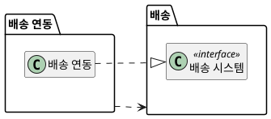

```java
package 배송;

// 배송 경계가 소유하는 요청 인터페이스. 배송 연동이 구현한다.
public interface 배송시스템 {
    boolean 출고중단을요청한다(String 배송번호);
}
```

```java
package 배송연동;

import 배송.배송시스템;
import 주문.주문;

// 배송 시스템과 주고받는 형식을 주문 시스템의 의미로 옮긴다.
public final class 배송연동 implements 배송시스템 {
    // ... 필드·생성자 생략
}
```

**강사 노트**

- 코드는 모두 `code/s05/`의 패키지별 원본에서 발췌했으며, 컴파일·실행해 확인한다. 인터페이스 이름 `배송시스템`은 "04. 동적 모델 — 상호작용과 상태"의 코드와 같다. 이 세션에서는 그 인터페이스가 **배송 패키지**에 놓인다.
- 코드가 보장하는 것은 import의 방향뿐이다. 클래스의 책임과 협력은 "07. 책임·협력·계약"에서 정한다.

---

## 38. 의존 방향과 테스트

**다이어그램 — 패키지 다이어그램**

업무 경계가 약속을 소유하면, 연동 없이 **가짜 약속**으로 주문 규칙을 시험할 수 있다.

**도식 — PlantUML**

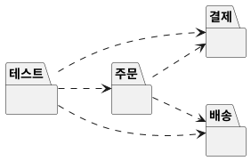

```java
        // 1. 연동 없이 주문 규칙을 검증한다 — 가짜 결제·배송 시스템
        var 요청 = new ArrayList<String>();
        결제시스템 가짜결제 = 금액 -> 요청.add("환불 " + 금액.원());
        배송시스템 가짜배송 = 번호 -> { 요청.add("출고 중단"); return true; };

        var 주문 = new 주문();
        주문.결제되었다(new 결제(new 금액(2000), 가짜결제), new 배송("배송-1", 가짜배송));
        주문.취소한다();
        확인(주문.상태() == 주문상태.취소처리중);
        확인(요청.equals(List.of("출고 중단", "환불 2000")));
        // ... 연동 확인 생략

        // 3. 구조 제약 — 업무 패키지는 연동 패키지를 import하지 않는다
        for (String 업무 : List.of("주문", "결제", "배송"))
            try (var 파일들 = Files.list(Path.of(업무))) {
                for (Path 파일 : 파일들.toList()) {
                    String 원본 = Files.readString(파일);
                    확인(!원본.contains("import 결제연동") && !원본.contains("import 배송연동"));
                }
            }
```

**강사 노트**

- 결과를 먼저 예측하게 한다: 가짜 약속으로 취소하면 요청은 어떤 순서로 기록되는가?
- 요청의 순서(출고 중단 → 환불)는 "04. 동적 모델 — 상호작용과 상태"의 테스트와 같다. 경계를 나눠도 **업무의 의미는 그대로**다.

---

## 39. 옮기기 코드

**다이어그램 — 시퀀스 다이어그램**

연동은 외부의 상태 코드를 읽어 **주문의 사건**으로 옮기고, 배송 시스템의 내부 상태는 옮기지 않는다.

**도식 — PlantUML**

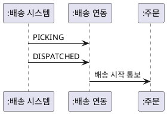

```java
    // 배송 시스템의 통보를 주문의 사건으로 옮긴다.
    public void 통보를받는다(String 상태코드, 주문 주문) {
        if (상태코드.equals("DISPATCHED")) 주문.배송시작통보();
        // PICKING·PACKED 같은 배송 시스템 내부 상태는 주문으로 옮기지 않는다.
    }
```

```java
        연동.통보를받는다("PICKING", 배송될주문);
        확인(배송될주문.상태() == 주문상태.결제완료);
        연동.통보를받는다("DISPATCHED", 배송될주문);
        확인(배송될주문.상태() == 주문상태.배송중);
```

**강사 노트**

- 상태 코드는 「19. 경계에서 옮기기」의 **교육용 가정**이다.
- 통보를 받는 방식(메시지 큐·웹훅 등)은 생략했다. 전달 기술은 "10. 기술 제약과 도메인 의미 보존"에서 다룬다.

---

## 40. 적정 구조 설계

경계는 **변경을 가둘 만큼만** 나눈다. 바뀔 이유가 확인되지 않은 곳까지 나누면 약속과 연동만 늘어난다.

- **나눌 때** — 변경 이유가 다르고, 한쪽의 변경이 실제로 번질 때
- **합칠 때** — 늘 함께 바뀌고, 약속이 형식적일 때
- **외부 시스템** — 우리가 통제하지 못하는 변경이라 처음부터 **연동으로 가둔다**

**강사 노트**

- 이 사례는 업무 경계 6개와 연동 4개로 충분했다. 작은 시스템은 패키지 몇 개와 방향 규칙 하나로 시작해도 된다.
- 판단 기준은 `sw-engineering-principles.md`의 적정 수준과 KISS·YAGNI다.

---

## 41. 실습 — 경계와 의존성

도메인 모델과 동적 모델을 LLM에 제공하여 **패키지 다이어그램**을 초안과 상세 두 단계로 만들고, 점검 항목으로 **피드백**하여 완성하십시오.

- **투입물**
  + 실습 3의 **도메인 모델 상세**와 실습 4의 **시퀀스 다이어그램** — 실제로는 여러분의 결과물을 이어 씁니다.
- **프롬프트**
  + ① "위 도메인 모델의 클래스를 **변경 이유**로 묶어 PlantUML **패키지 다이어그램 초안**을 그려줘. 의존을 표시하고, 클래스는 이름만 보여줘."
  + ② "외부 시스템 연동을 분리하고 **순환 의존**을 없애 **상세 패키지 다이어그램**으로 바꿔줘."
- **점검 항목**
  1. **묶는 기준** — 기술 계층이 아닌 **변경 이유**로 묶었는가?
  2. **순환 의존** — 패키지 의존에 순환이 없는가?
  3. **연동 분리** — 외부 시스템과의 연동을 별도 패키지로 뺐는가?
  4. **의존 방향** — 업무 패키지가 연동 패키지에 의존하지 않는가?
  5. **약속의 소유** — 결제·배송 요청의 **인터페이스**를 업무 패키지가 갖는가?
  6. **공용 패키지** — 이것저것 모은 공용(common) 패키지가 없는가?
- **결과물** — 패키지 다이어그램 초안과 상세. 객체 설계의 입력이 됩니다.

**강사 노트**

- LLM은 화면·서비스·저장소 같은 기술 계층으로 나누거나, 장바구니를 고객 패키지에 넣어 순환을 만들기 쉽다.

---

## 42. 패키지 다이어그램 초안 (안)

도메인 개념을 **변경 이유**로 묶었다. 장바구니가 정기배송을 만들고 정기배송이 고객을 알아서 **고객 ↔ 정기배송**에 순환이 생긴다.

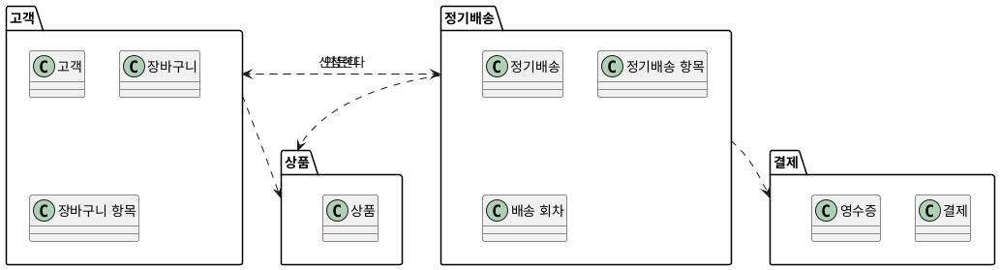

**강사 노트**

- 패키지 의존은 클래스 사이의 연관·생성에서 나온다 — 장바구니가 정기배송을 만들고(고객 → 정기배송), 정기배송이 고객을 참조한다(정기배송 → 고객).

---

## 43. 패키지 다이어그램 상세 (안)

장바구니를 정기배송으로 옮겨 **순환을 끊고**, 외부 연동을 **연동 패키지**로 분리했다. 요청의 약속은 **업무 패키지**가 갖는다.

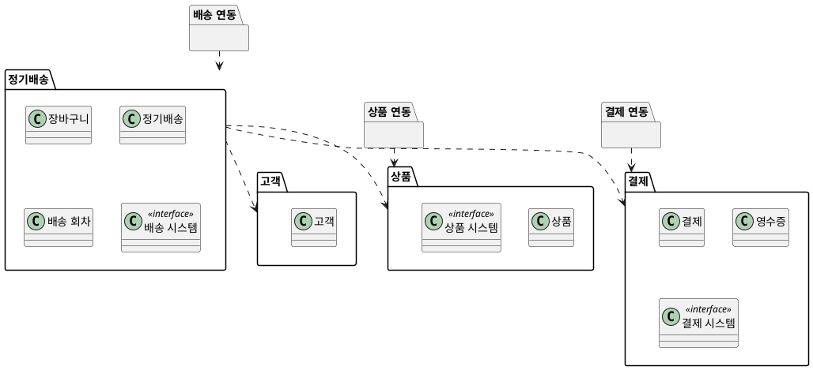

**강사 노트**

- 장바구니를 옮긴 근거 — 장바구니는 정기배송 신청과 **함께 쓰이고 함께 바뀐다**. 고객은 정기배송을 모르므로 의존은 정기배송 → 고객 한 방향이다.
- 연동은 업무 패키지의 인터페이스를 실현한다(의존 역전). 결제 시스템의 형식은 결제 연동 밖으로 나가지 않는다.
- 장바구니 항목·정기배송 항목은 소속만 같아 생략했다.

---

## 44. 구조 보완 (안)

패키지를 나누며 발견한 것은 **후속 작업에 영향을 미치는 경우에만** 이전 산출물에 반영한다.

- **도메인 모델**(실습 3)
  - **연관 방향** — 고객–정기배송 연관은 **정기배송 → 고객** 한 방향이다. 고객은 정기배송 목록을 직접 갖지 않는다.
  - **장바구니 소속** — 장바구니는 고객이 아닌 **정기배송 신청**의 개념이다.
- **동적 모델**(실습 4)
  - **외부 요청** — 결제·배송 요청은 업무 패키지의 **인터페이스**(결제 시스템·배송 시스템)로 보낸다.
- **※ 현행화 기준**
  - **반영** — 연관 방향, 장바구니 소속, 요청 인터페이스. 객체 설계와 코드의 입력이 된다.
  - **기록만** — 시퀀스 다이어그램의 외부 참여자 표기.

**강사 노트**

- 순환 의존은 대개 연관 방향을 정하지 않은 데서 온다. 패키지를 나누면 연관 방향을 결정해야 한다.
- 고객의 정기배송 목록이 필요하면 정기배송 쪽의 조회로 푼다 — 객체 설계에서 다룬다.

---

## 45. 요약

이 세션은 분석 결과를 바탕으로 책임이 놓일 **구조적 경계**와 변경이 번지는 **의존 방향**을 정했다.

### 구조적 경계와 의존성의 핵심

- **경계** — 함께 바뀌는 상태와 규칙의 묶음
- **묶는 기준** — 합성·소유·변경 이유·함께 쓰임·외부 통제
- **의존** — 쓰는 쪽 → 쓰이는 쪽. 변경은 반대 방향으로 번진다
- **방향** — 덜 바뀌는 업무 쪽으로. 약속은 업무 경계가 소유하고 연동이 통보를 옮긴다
- **패키지 원칙** — 응집(REP·CCP·CRP)과 결합(ADP·SDP·SAP)
- **제약** — 객체 설계 전에 명시하고 코드·테스트·변경 시나리오로 확인한다

### 다음 세션

- "**06. 분석 모델에서 설계 모델로**" — 분석 개념을 기계적으로 변환하지 않고 의미를 보존하며 설계 모델로 전환한다.

**강사 노트**

- 이 세션의 구조적 제약(「32. 구조적 제약」)은 다음 세션에서 분석 개념을 설계 클래스로 옮길 때의 경계가 된다.
