--------------------
Session 명: 05. 구조적 경계와 의존성
--------------------

## 목차

01. 세션 목표
02. 분석에서 구조로
03. 클래스에서 패키지로
04. 구조적 경계
05. 의존성
06. 설계의 이름
07. 패키지 다이어그램
08. 패키지 기준
09. 업무 패키지
10. 요청과 통보
11. 주문 시스템 패키지 — 초안
12. 의존 방향
13. 순환 의존
14. 주문 시스템 패키지 — 상세화
15. 패키지 원칙
16. 구조의 진화
17. 변경 파급
18. 구조적 제약
19. 잘못된 관행 — 기술 계층 분할
20. 잘못된 관행 — 공용 패키지
21. 잘못된 관행 — 외부 모델 누수
22. 패키지와 코드
23. 의존 방향과 테스트
24. 통보 변환 코드
25. 적정 구조 설계
26. 실습 — 패키지 다이어그램
27. 패키지 다이어그램 초안 (안)
28. 패키지 다이어그램 상세 (안)
29. 구조 보완 (안)
30. 요약

## 01. 세션 목표

이 세션은 요구·정적·동적 모델을 바탕으로 책임이 놓일 **구조적 경계**와 **의존성 방향**을 판단한다.

- 구조적 경계와 의존성이 **변경의 범위와 전파 방향**을 정한다는 것을 설명한다.
- 클래스를 패키지로 나누는 **패키지 기준**(합성·소유·변경 이유·함께 쓰임·외부)을 적용해 경계 후보를 정한다.
- 외부 시스템에 대한 **요청과 통보**의 의존 방향을 판단한다.
- **패키지 다이어그램**으로 경계와 의존성을 표현하고(설계 이름은 **용어집의 영문명**), **패키지 원칙**으로 순환 없는 방향을 정한다.
- 변경 시나리오로 **결합도와 변경 파급**을 검토한다.
- 객체 설계 전에 지킬 **구조적 제약**을 명시하고 자바 코드·테스트로 확인한다.

**강사 노트**

- 시스템 전체의 경계(무엇이 주문 시스템의 책임인가)는 "02. 요구 분석과 유스케이스"에서 정했다. 이 세션은 주문 시스템 **안의** 경계를 다룬다. 클래스 수준의 책임 배치는 "06. 분석 모델에서 설계 모델로"·"07. 책임·협력·계약"에서 다룬다.

---

## 02. 분석에서 구조로

분석은 **무엇이 존재하고 무엇이 일어나는지**를 밝혔다. 이제 그 의미를 지킬 책임이 **어디에 놓일지** 판단한다.

**도식 — Mermaid — 구조 설계의 흐름**

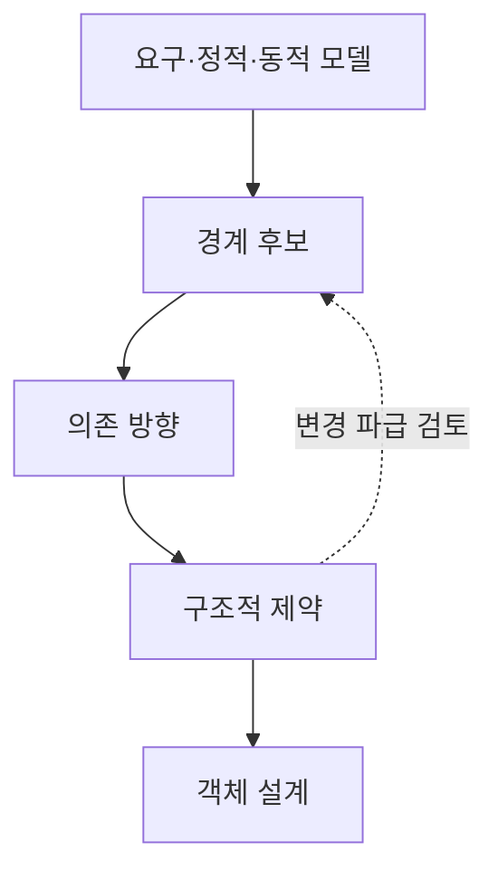

- 맨 위의 **요구·정적·동적 모델**이 입력이다. 그림의 순서대로 **경계 후보** → **의존 방향** → **구조적 제약**을 정해 객체 설계에 넘긴다.
- 점선은 **변경 파급**을 검토하며 경계 후보로 되돌아가는 길이다.


**강사 노트**

- 입력 — 요구("02. 요구 분석과 유스케이스")의 시스템 이벤트·오퍼레이션 계약·외부 시스템, 정적 모델("03. 정적 모델 — 도메인 개념과 관계")의 개념·연관·분석 패키지, 동적 모델("04. 동적 모델 — 상호작용과 상태")의 상호작용·상태의 소유·요청과 통보.
- "04. 동적 모델 — 상호작용과 상태"는 주문 시스템이 외부에 보내는 **요청**과 받는 **통보**를 남겼다. 이 세션은 그 질문(주문 시스템이 배송 시스템을 아는가, 통보를 받는가?)에 답한다.
- 사례의 전제(결제 완료·배송 시작 전 전체 취소, 출고 전 배송지 변경)는 그대로 유지한다.

---

## 03. 클래스에서 패키지로

**다이어그램 — 패키지 다이어그램**

도메인 모델이 커지면 클래스 다이어그램 한 장으로는 읽기도 바꾸기도 어렵다. 패키지는 **변경의 단위**가 된다.

**도식 — PlantUML — 분석 패키지**

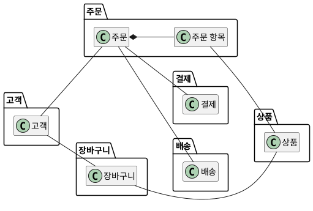

**표 — 분석 패키지와 구조 패키지**

| 구분 | 분석 패키지 | 구조 패키지 |
|---|---|---|
| **목적** | 개념을 이해한다 | 변경을 가둔다 |
| **관계** | 방향 없는 연관 | 방향 있는 의존 |
| **판단 기준** | 업무 의미 | 소유·변경 이유·함께 쓰임 |

**강사 노트**

- 도식은 "03. 정적 모델 — 도메인 개념과 관계"의 「48. 도메인 모델 — 패키지별」을 경계를 넘는 연관만 남겨 줄인 것이다(장바구니 항목·환불은 생략). 분석 패키지의 기준(주제 영역·클래스 계층·유스케이스·강한 연관)은 "03. 정적 모델 — 도메인 개념과 관계"의 「47. 패키지 기준」에서 다뤘다.
- 분석 패키지를 구조 패키지로 그대로 쓸 수 있는지는 **설계의 기준**으로 다시 확인한다(「08. 패키지 기준」).

---

## 04. 구조적 경계

**구조적 경계**는 함께 바뀌는 **상태와 규칙**을 묶어, 책임이 놓일 범위를 정하는 선이다.

- **안** — 경계가 소유하는 상태와 그 상태를 바꾸는 규칙
- **밖** — 경계가 알 필요 없는 세부. 경계를 넘을 때는 인터페이스로만 주고받는다
- **목적** — 한 곳의 변경이 **다른 곳으로 번지지 않게** 한다

경계는 폴더 정리가 아니라 **변경을 가두는 결정**이다. 요구·분석과 다른 **구조 설계의 결정**으로, 앞의 결정을 입력으로 쓰고 뒤의 결정을 제약한다.

**표 — 경계와 의존의 결정**

| 결정 | 질문 | 다루는 곳 |
|---|---|---|
| **시스템 경계** | 무엇이 이 시스템의 책임인가? | "02. 요구 분석과 유스케이스" |
| **구조적 경계** | 시스템 안의 어느 묶음이 책임지는가? | 이 세션 |
| **의존 방향** | 어느 묶음이 어느 묶음을 아는가? | 이 세션 |
| **객체 책임** | 어느 객체가 판단하고 협력하는가? | "07. 책임·협력·계약" |

**강사 노트**

- 분석은 의미를 밝히고, 설계는 그 의미를 지킬 책임과 협력을 새로 판단한다. 경계는 분석 모델을 그대로 옮긴 결과가 아니다.
- 구조의 결정은 되돌리기 어렵다. 그래서 **객체 설계 전에** 확인한다(`sw-engineering-principles.md`의 YAGNI — 되돌리기 어려운 결정은 지금 확인한다).
- "01. OOAD 개요"의 「21. 책임과 경계」에서 경계를 "함께 변경되어야 할 상태와 행위의 묶음"으로 미리 보였다. 이 세션은 그것을 주문 시스템에 적용한다.
- 이 세션의 경계는 **주문 시스템 안의 구조**다. 여러 시스템으로 나누는 판단(서비스 경계)은 "13. OOAD에서 전문영역으로 — Architecture · DDD · MSA"에서 다룬다.

---

## 05. 의존성

**의존성**은 한 요소가 다른 요소를 **알고 쓰는** 관계다. 쓰는 쪽은 쓰이는 쪽이 바뀌면 **함께 바뀔 수 있다**.

**인용문**

"의존은 공급자를 바꾸면 클라이언트 요소가 영향을 받을 수 있는, 모델 요소 사이의 **공급자/클라이언트** 관계다", "A Dependency signifies a supplier/client relationship between model elements where the modification of a supplier may impact the client model elements.", [OMG 2017]

- **방향** — 화살표는 쓰는 쪽(클라이언트)에서 쓰이는 쪽(공급자)으로 향한다.
- **전파** — 변경은 화살표의 **반대 방향**으로 번진다. 공급자가 바뀌면 클라이언트가 영향을 받는다.

**강사 노트**

- 인용 근거: OMG Unified Modeling Language 2.5.1(2017-12), §7.7 Dependencies 원문 확인.
- 의존 방향을 정하는 일은 곧 **변경이 어디로 번질지**를 정하는 일이다. 이 세션의 판단은 모두 이 한 문장에서 나온다.

---

## 06. 설계의 이름

**분석**은 용어집의 **한글 용어**로, **설계**는 같은 용어의 **영문명**으로 그린다. 이 세션의 패키지 다이어그램부터 설계 도식과 코드는 영문이다.

**표 — 용어집에서 설계 이름으로**

| 용어집 | 영문명 | 설계에서 |
|---|---|---|
| **주문** | `Order` | 클래스, 패키지 `order` |
| **배송 게이트웨이** | `DeliveryGateway` | 배송 시스템에 요청하는 인터페이스 |
| **배송 연동** | `DeliveryAdapter` | 외부 배송 시스템과 통신하는 클래스 |
| **배송 시작 통보** | `onDeliveryStarted` | 메서드 |

- **이름 쓰는 법** — 표의 이름처럼 쓴다.
  - **클래스·인터페이스**는 단어 첫 글자를 대문자로(`DeliveryGateway`), **메서드**는 첫 단어만 소문자로(`onDeliveryStarted`)
  - **상태 값**은 대문자와 밑줄로(`PENDING_PAYMENT`), **패키지**는 소문자로(`order`)

**강사 노트**

- 한 용어, 한 이름 — 용어집에 없는 업무 용어는 코드에서 먼저 만들지 않고 용어집에 먼저 더한다. 다른 예: 주문 상태 `OrderStatus`(값 `PENDING_PAYMENT` ~ `CANCELLED`), 출고 중단을 요청한다 `requestDispatchStop`.
- 용어집과 영문명은 "02. 요구 분석과 유스케이스"의 「18. 용어집」에서 정의하고 "03. 정적 모델 — 도메인 개념과 관계"의 「42. 용어집 정제」에서 정제했다. 전체 목록과 명명 규칙은 과정 설계의 "영한 용어집과 명명 규칙"이 원천이다.
- 앞 세션들의 예시 코드는 분석 모델을 옮긴 것이라 한글 식별자였다. 이 세션부터의 설계 코드는 개발 도구·라이브러리·협업의 관례를 따라 영문으로 쓴다. 뜻은 용어집이 잇는다 — `OrderStatus.CANCELLING`은 "취소 처리 중"이다.
- 개발자마다 다른 영어로 옮기면 한 용어가 여러 이름이 된다(예: 주문 항목을 `OrderLine`·`OrderItem`·`OrderDetail`로). 용어집의 영문명이 이를 막는다.
- 이 세션의 「03. 클래스에서 패키지로」와 「09. 업무 패키지」은 분석 모델을 다시 보는 도식이라 한글이다.

---

## 07. 패키지 다이어그램

**패키지 다이어그램**은 패키지와 그 사이의 **의존**을 보여 준다. 경계와 의존 방향을 한눈에 검토하는 도구다.

**도식 — PlantUML — 패키지 다이어그램의 예**

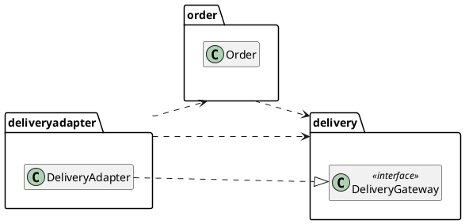

**표 — 표기와 사용법**

| 표기 | 의미 | 이렇게 쓴다 |
|---|---|---|
| **패키지** — 탭 달린 폴더 | 경계의 이름 있는 묶음 | 변경 이유로 이름 짓는다 |
| **의존** — 점선 화살표 | 쓰는 쪽 → 쓰이는 쪽 | 경계를 넘는 사용마다 하나 |
| **실현** — 점선·빈 삼각형 | 인터페이스를 구현한다 | 인터페이스와 구현 클래스를 잇는다 |
| **«interface»** | 구현 없는 메서드 목록 | 그 인터페이스를 쓰는 패키지에 둔다 |

**강사 노트**

- 표기 기준: OMG UML 2.5.1, §12 Packages, §7.7 Dependencies, §10.4 Interfaces.
- "03. 정적 모델 — 도메인 개념과 관계"의 「46. 개념의 묶음 — 패키지」는 개념의 묶음까지 다뤘다. 이 세션은 **의존 화살표와 인터페이스**를 더한다.

---

## 08. 패키지 기준

클래스를 패키지로 나누는 기준은 **다섯 가지 질문**이다. 각 질문의 단서는 앞 세션의 모델에 이미 있다.

**표 — 패키지 기준**

| 기준 | 질문 | 모델의 단서 |
|---|---|---|
| **합성·불변 조건** | 함께 있어야 규칙이 지켜지는가? | 정적 모델의 합성 |
| **소유** | 누가 그 상태와 규칙을 바꾸는가? | 동적 모델의 상태 기계 |
| **변경 이유** | 같은 이유로 바뀌는가? | 요구의 규칙·정책 |
| **함께 쓰임** | 늘 함께 쓰이는가? | 요구의 시스템 이벤트 |
| **외부 통제** | 우리가 바꿀 수 있는가? | 정제된 SSD의 외부 시스템 |

- 앞의 두 기준은 **함께 둘 것**을, 뒤의 세 기준은 **나눌 것**을 찾는다. 기준이 부딪히면 **변경 이유**가 우선한다.
- 기능 목록(주문 관리 기능, 결제 기능)이나 **기술 계층**은 기준이 아니다(「19. 잘못된 관행 — 기술 계층 분할」).

**페이지 분할**

경계는 **함께 바뀌는 것**을 묶고, **함께 쓰이지 않는 것**은 나눈다.

- "대신 **어렵거나 바뀔 가능성이 큰 설계 결정**의 목록에서 시작하기를 제안한다", "We propose instead that one begins with a list of difficult design decisions or design decisions which are likely to change.", [Parnas 1972, 재인용]
- "**함께 바뀌는** 클래스는 함께 둔다", "Classes that change together, belong together.", [Martin 2000]
- "**함께 재사용되지 않는** 클래스는 함께 묶지 않는다", "Classes that aren’t reused together should not be grouped together.", [Martin 2000]
- 취소 규칙(업무 정책)과 결제 대행 방식(외부 계약)은 **바뀌는 이유**가 달라 다른 경계에 둔다.

**강사 노트**

- Parnas, "On the Criteria To Be Used in Decomposing Systems into Modules", *Communications of the ACM*(1972) 원문은 확인하지 못했다(www). 재인용처: Adrian Colyer, *the morning paper*(2016-09-05)의 해설에서 문장을 확인했다. Parnas는 각 모듈이 그런 결정 하나를 다른 모듈에 감추도록 설계하라고 이어 말한다.
- CCP·CRP 인용 근거: Robert C. Martin, "Design Principles and Design Patterns"(2000), The Common Closure Principle·The Common Reuse Principle 원문 확인.

---

## 09. 업무 패키지

**다이어그램 — 클래스 다이어그램**

도메인 모델에 **패키지 기준**을 적용하면 **업무 패키지 여섯**이 나온다.

**도식 — PlantUML — 업무 패키지 도출**

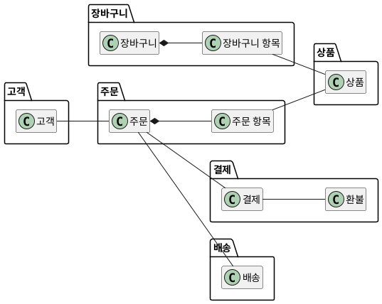

- **합성·소유** — 주문 항목은 주문에 붙이고, 환불은 환불 규칙을 지키는 **결제**에 모은다.
- **변경 이유·함께 쓰임** — 배송은 취소 규칙과 따로 바뀌고, 장바구니와 결제는 함께 쓰이지 않아 **나눈다**.

**강사 노트**

- 도메인 모델은 "03. 정적 모델 — 도메인 개념과 관계"의 것이다. 환불 규칙은 환불 ≤ 결제 금액, 출고 준비 중·출고됨은 배송 시스템의 상태라 주문 시스템 밖이다.
- 근거: "03. 정적 모델 — 도메인 개념과 관계"의 「45. 도메인 모델 — 상세화」·「48. 도메인 모델 — 패키지별」, "04. 동적 모델 — 상호작용과 상태"의 「33. 주문 상태 기계」.
- 결과가 분석 패키지와 같은 것은 우연이 아니다. "03. 정적 모델 — 도메인 개념과 관계"가 업무 의미로 묶었기 때문이다. 기술 계층으로 묶었다면 결과가 달랐을 것이다.
- 외부 시스템마다 둘 연동 넷은 「10. 요청과 통보」에서 더한다.
- 업무 경계의 이름은 분석 패키지와 같다. 이름을 바꾸면 모델이 바뀐 것이다. 분석 모델을 다시 보는 도식이라 한글로 그렸다.

---

## 10. 요청과 통보

주문 시스템은 외부 시스템 넷과 **요청과 통보**를 주고받는다.

**표 — 외부 시스템과의 요청·통보**

| 외부 시스템 | 주문 시스템 → 외부 | 외부 → 주문 시스템 |
|---|---|---|
| **결제 시스템** | 결제 승인(동기), 환불 요청 | 환불 완료 통보 |
| **상품 시스템** | 상품 정보·재고 차감(동기) | — |
| **회계 시스템** | 입금 처리·영수증 발행 | — |
| **배송 시스템** | 배송 요청, 배송지 변경·출고 중단(동기) | 배송 시작·완료 통보 |

**페이지 분할**

**다이어그램 — 시퀀스 다이어그램**

**도식 — PlantUML — 배송 시스템과의 요청과 통보**

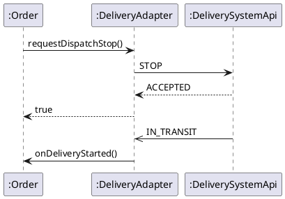

- **요청(위·동기)** — 출고 중단 요청 `requestDispatchStop()`을 `DeliveryAdapter`가 `STOP`으로 보내고, `ACCEPTED`를 `true`로 돌려준다.
- **통보(아래·비동기)** — 배송 시작 `IN_TRANSIT`을 `DeliveryAdapter`가 배송 시작 통보 `onDeliveryStarted()`로 **바꿔** 전한다.

**강사 노트**

- 외부마다 **연동 경계**를 따로 둬 통제할 수 없는 변경을 가둔다.
- 외부 시스템 목록과 동기·비동기는 과정의 공통 전제와 같다("02. 요구 분석과 유스케이스"의 「43. 정제된 SSD」). 동기·비동기의 기준은 반환값이 아니라 **완료를 기다리는가**다("04. 동적 모델 — 상호작용과 상태"의 「51. 동적 모델에서 코드로」).
- 외부 코드(`STOP`·`IN_TRANSIT`)는 연동 안에서만 쓰이고, `PICKING` 같은 배송 시스템 내부 상태는 주문으로 바꾸지 않는다. 상태 코드는 **교육용 가정**이다. 실제 형식은 외부 시스템의 계약으로 확인한다. `DeliverySystemApi`는 외부 배송 시스템의 형식을 나타낸다.
- 도식은 무엇이 오가는지만 본다. 누가 누구를 아는가 — 인터페이스를 어느 패키지에 두는가 — 는 「13. 순환 의존」에서 정한다.
- 연동 경계는 외부 시스템마다 하나다: 결제 연동, 상품 연동, 배송 연동, 회계 연동.
- 상품 시스템의 판매가도 주문 시점에 주문 항목의 단가로 옮겨 확정한다("03. 정적 모델 — 도메인 개념과 관계"의 현재 값과 확정 값).

---

## 11. 주문 시스템 패키지 — 초안

**다이어그램 — 패키지 다이어그램**

연관을 따라 의존을 그리고, 외부 호출을 쓰는 곳에서 연동을 **직접 부르는** 초안이다.

**도식 — PlantUML — 주문 시스템 패키지(초안)**

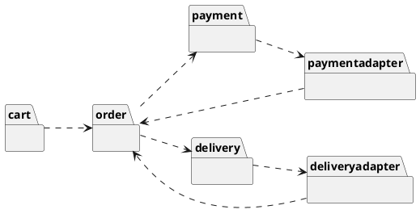

- 의존 화살표는 **"이것이 바뀌면 저것이 바뀔 수 있다"**로 거꾸로 읽는다.
- 결제·배송이 연동을 부르고 연동이 통보를 주문에 전해 **순환**이 생긴다: `order` → `delivery` → `deliveryadapter` → `order`.

**강사 노트**

- 고객·상품·상품 연동·회계 연동은 같은 방식이라 생략했다.
- 읽기의 예 — `delivery ..> deliveryadapter`는 배송 연동이 바뀌면 배송이 바뀔 수 있다는 뜻이다.
- 화살표를 셀 때는 **변경이 어디서 시작될 가능성이 큰가**를 함께 본다. 외부 시스템은 우리가 통제하지 못하는 변경의 출발점이다.
- 초안의 문제를 먼저 보이고 「13. 순환 의존」·「14. 주문 시스템 패키지 — 상세화」에서 고친다.

---

## 12. 의존 방향

의존은 **덜 바뀌는 쪽**을 향해야 한다. 업무 규칙은 외부 연동보다 덜 바뀌므로, **연동이 업무에 의존**한다.

**인용문**

"**안정된 방향**으로 의존하라", "Depend in the direction of stability.", [Martin 2000]

- **안정** — 많은 쪽이 의존하고, 바꾸기 어렵고, 바뀔 이유가 적다(주문의 규칙).
- **불안정** — 외부 계약·기술 때문에 자주 바뀐다(결제 대행, 배송 형식).
- 안정은 "좋다"가 아니라 **"바꾸기 어렵다"**는 뜻이다. 그래서 바꾸기 어려운 곳에 **자주 바뀌는 세부**를 두지 않는다.

**강사 노트**

- 인용 근거: Robert C. Martin, "Design Principles and Design Patterns"(2000), The Stable Dependencies Principle 원문 확인.

---

## 13. 순환 의존

**순환 의존**은 서로가 서로를 알아 **따로 바꾸거나 시험할 수 없는** 상태다.

**인용문**

"패키지 사이의 의존은 **순환**을 이루어서는 안 된다", "The dependencies betwen packages must not form cycles.", [Martin 2000]

- 초안의 **`order` → `delivery` → `deliveryadapter` → `order`**는 순환이다. 배송 연동을 바꾸면 세 경계를 모두 다시 확인해야 한다.
- 순환은 **화살표 하나의 방향**을 바꿔 끊는다. 요청 인터페이스를 어느 패키지에 두는지가 그 화살표다.
  - "**추상**에 의존하라. 구체에 의존하지 마라", "Depend upon Abstractions. Do not depend upon concretions.", [Martin 2000]

**페이지 분할**

**도식 — PlantUML — 인터페이스를 가진 배송, 구현하는 연동**

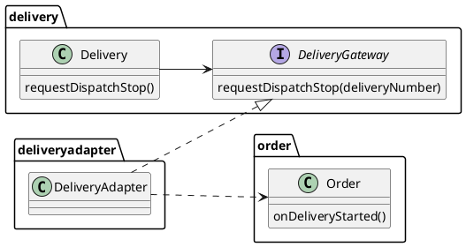

- **요청 인터페이스를 업무 패키지에 둔다** — `Delivery`는 같은 패키지의 인터페이스 `DeliveryGateway`만 안다.
- `DeliveryAdapter`가 그 인터페이스를 **구현**하고(빈 삼각형) 통보를 `Order`에 전한다 — 화살표가 모두 **업무 쪽**을 향해 순환이 끊긴다.

**강사 노트**

- 인용 근거: Robert C. Martin, "Design Principles and Design Patterns"(2000), The Acyclic Dependencies Principle·The Dependency Inversion Principle 원문 확인. "betwen"은 원문의 표기다.
- 설계 요소(배송 연동)를 포함한 구조 설계의 확인용 도식이라 용어집의 영문명으로 그렸다.

---

## 14. 주문 시스템 패키지 — 상세화

**다이어그램 — 패키지 다이어그램**

요청 인터페이스를 업무 패키지에 둔 **상세화**다. 순환이 없다.

**도식 — PlantUML — 주문 시스템 패키지(상세화)**

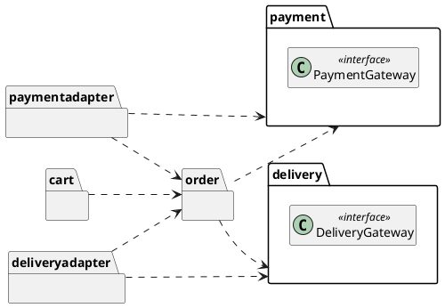

**인용문**

"**안정된 패키지**는 추상 패키지여야 한다", "Stable packages should be abstract packages.", [Martin 2000]

- `payment`·`delivery`가 인터페이스를 갖고 연동이 **구현**한다 — 연동의 점선이 모두 **업무 패키지**로 향한다.

**강사 노트**

- 초안의 `delivery` → `deliveryadapter` 의존이 반대로 바뀌었다. 결제도 같다 — 초안과 나란히 보여 준다.
- SAP 인용 근거: Robert C. Martin, "Design Principles and Design Patterns"(2000), The Stable Abstractions Principle 원문 확인.
- 고객·상품과 상품 연동·회계 연동은 같은 원칙이다: 상품이 상품 시스템 인터페이스를, 결제가 회계 시스템 인터페이스를 갖고 각 연동이 실현한다.
- 이 구조에 이름을 붙이는 일(아키텍처 스타일)은 "13. OOAD에서 전문영역으로 — Architecture · DDD · MSA"에서 한다. 여기서는 판단의 근거만 본다.
- 경계별 소유·인터페이스·의존 — 주문(주문 상태·취소 규칙, `onPaid`·`cancel`·통보 수신, 결제·배송에 의존), 결제(결제·환불 기록, `requestRefund`), 배송(배송 기록, `requestDispatchStop`), 결제·배송 연동(외부 형식, 인터페이스 구현, 업무 경계에 의존).
- 인터페이스는 오퍼레이션 이름 수준이다. 매개변수와 계약의 정제는 "07. 책임·협력·계약"에서 한다.

---

## 15. 패키지 원칙

Robert C. Martin은 패키지를 묶는 **응집** 원칙 셋과 패키지 사이의 **결합** 원칙 셋을 정리했다.

**인용문**

"**재사용의 단위**는 릴리스의 단위다", "The granule of reuse is the granule of release.", [Martin 2000]

**표 — 패키지 원칙**

| 구분 | 원칙 | 요지 |
|---|---|---|
| **응집** | REP 재사용·릴리스 등가 | 함께 배포하는 단위로 묶는다 |
| **응집** | CCP 공통 폐쇄 | 함께 바뀌는 것을 묶는다 |
| **응집** | CRP 공통 재사용 | 함께 쓰이지 않는 것은 나눈다 |
| **결합** | ADP 비순환 의존 | 순환을 만들지 않는다 |
| **결합** | SDP 안정된 의존 | 안정된 쪽으로 의존한다 |
| **결합** | SAP 안정된 추상 | 안정된 패키지는 추상적이다 |

- **이 세션에서 적용한 곳** — CCP·CRP는 「08. 패키지 기준」, SDP는 「12. 의존 방향」, ADP는 「13. 순환 의존」, SAP는 「14. 주문 시스템 패키지 — 상세화」.
- REP는 여러 팀·배포 단위로 나눌 때 중요하다. 한 시스템 안의 패키지에서는 **CCP·CRP**가 먼저다.

**주석**

REP — Release Reuse Equivalency Principle · CCP — Common Closure Principle · CRP — Common Reuse Principle · ADP — Acyclic Dependencies Principle · SDP — Stable Dependencies Principle · SAP — Stable Abstractions Principle

**강사 노트**

- 인용 근거: Robert C. Martin, "Design Principles and Design Patterns"(2000), The Release Reuse Equivalency Principle 원문 확인. 뒤의 책 *Clean Architecture*(2017)에서는 컴포넌트 원칙이라 부른다.
- SOLID가 클래스(벽돌)를 배치하는 원칙이라면, 패키지 원칙은 컴포넌트(방)를 배치하는 원칙이다. CCP는 SRP를, CRP는 ISP를 컴포넌트 수준으로 옮긴 것이다(Robert C. Martin, *Clean Architecture*, 2017의 요지 — 재인용처: Yannick Grenzinger, "Summary of 'Clean Architecture'"). SOLID는 "07. 책임·협력·계약"·"08. 변화 대응과 변이 설계"에서 다룬다.

---

## 16. 구조의 진화

패키지 구조는 처음에 완성하지 않는다. 이 세션의 경계는 **첫 구조**이며, 클래스 설계와 변경을 거치며 **다시 조정된다**.

**인용문**

"컴포넌트 구조는 **하향식으로 설계할 수 없다**. 시스템에서 가장 먼저 설계하는 것이 아니라, 시스템이 자라고 바뀌면서 진화한다", "The component structure cannot be designed from the top down. It is not one of the first things about the system that is designed, but rather evolves as the system grows and changes.", [Martin 2018, 재인용]

- **지금** — 요구·분석 모델에서 드러난 변경 이유로 **첫 경계**와 방향을 정한다.
- **다음** — 클래스의 책임을 정하면("07. 책임·협력·계약") 경계가 맞는지 **다시 확인**한다.
- **변경 후** — 실제 변경이 여러 경계에 번지면 **경계를 되돌려** 고친다.

**강사 노트**

- Robert C. Martin, *Clean Architecture*(2017) 14장의 문장이다. 원서는 확인하지 못했다(www). 재인용처: GitHub "thzt/book-excerpt"의 *Clean Architecture* 발췌에서 문장을 확인했다. 국역본은 송준이 옮김, 인사이트, 2019다.
- 같은 장은 패키지 의존 그림이 기능이 아니라 **빌드와 유지보수의 지도**라고 설명한다(재인용처: Yannick Grenzinger의 요약).
- 반복·점진 개발에서 구조도 함께 자란다. `sw-engineering-principles.md`의 결정–검증–되돌림이 구조에도 적용된다.

---

## 17. 변경 파급

**결합도**는 경계 사이가 **얼마나 기대는가**, **응집도**는 경계 안이 **한 이유로 모였는가**다.

- **낮은 결합** — 경계를 넘는 것은 인터페이스뿐이다. 한쪽의 세부가 바뀌어도 다른 쪽은 그대로다.
- **높은 응집** — 경계 안의 것은 **같은 변경 이유**로 함께 바뀐다.
- 변경 시나리오를 하나씩 대어 **어느 경계가 바뀌는지** 확인한다.

**표 — 변경 시나리오별 파급**

| 변경 | 바뀌는 경계 | 그대로인 경계 |
|---|---|---|
| **결제 대행사 교체** | 결제 연동 | 주문, 결제 |
| **배송 통보 형식 변경** | 배송 연동 | 주문, 배송 |
| **결제 전 취소 허용** | 주문(상태 기계·취소 규칙) | 연동 전부 |
| **판매가 정책 변경** | 상품 | 주문(단가는 확정 값) |

**페이지 분할**

**다이어그램 — 패키지 다이어그램**

**도식 — PlantUML — 초안과 상세화의 파급 비교**

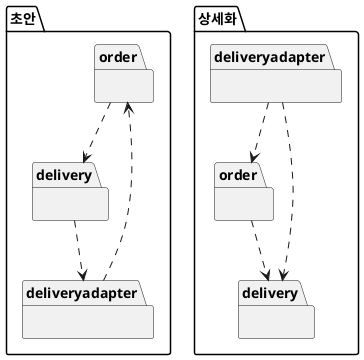

- **왼쪽(초안)** — 화살표가 `order` → `delivery` → `deliveryadapter` → `order`로 돈다. 연동이 바뀌면 **`order`까지** 다시 본다.
- **오른쪽(상세화)** — `deliveryadapter`로 들어오는 화살표가 없어 변경이 **그 안에서** 끝난다.

**강사 노트**

- 결합도·응집도는 Stevens·Myers·Constantine의 "Structured Design"(IBM Systems Journal, 1974)이 모듈 설계의 기준으로 제시한 개념이다. 이 세션은 패키지 수준에 적용한다. 객체 수준의 결합·응집은 "07. 책임·협력·계약"에서 다룬다.
- 결제 전 취소는 "04. 동적 모델 — 상호작용과 상태"의 「35. 가드와 금지된 전이」에서 **미정**으로 남긴 요구다. 정해지면 주문 경계 안에서 끝난다.
- 상세화에서도 연동은 주문에 기댄다. 자주 바뀌는 쪽이 덜 바뀌는 쪽에 기대는 것이 방향의 핵심이다.
- 시나리오는 교육용 예다. 실제 검토는 **바뀔 가능성이 큰 것**부터 고른다(「08. 패키지 기준」).

---

## 18. 구조적 제약

객체 설계 전에 **지켜야 할 구조의 규칙**을 명시한다. 제약은 이후 모든 설계 판단의 전제다.

- **방향** — 업무 경계는 연동 경계에 의존하지 않는다.
- **순환 없음** — 패키지 의존에 순환이 없다.
- **인터페이스의 위치** — 외부에 대한 요청 인터페이스는 **업무 패키지**에 둔다.
- **외부 형식** — 외부의 이름·형식·상태 코드는 **연동 밖으로** 나가지 않는다.
- **상태의 소유** — 주문 상태는 **주문 경계만** 바꾼다. 연동은 통보를 전할 뿐이다.
- **확인** — 리뷰와 코드로 본다. 업무 패키지의 **import 검사**는 「23. 의존 방향과 테스트」의 테스트다.

**강사 노트**

- 이 제약은 "06. 분석 모델에서 설계 모델로"·"07. 책임·협력·계약"에서 클래스와 책임을 정할 때의 입력이다.
- 제약은 적을수록 좋다. 지키지 않으면 **변경이 번지는 것**만 적는다.
- 말로만 두면 코드가 자라며 어긋난다. 인터페이스의 위치, 상태 코드 문자열, 상태를 바꾸는 메서드의 위치는 리뷰로 확인한다. 실제 프로젝트에서는 빌드 도구의 모듈 경계나 아키텍처 검사 도구를 쓸 수 있다.

---

## 19. 잘못된 관행 — 기술 계층 분할

**다이어그램 — 패키지 다이어그램**

경계를 **화면·서비스·저장소**로 먼저 나누면, 취소 규칙 하나가 **모든 계층**에 흩어진다.

**도식 — PlantUML — 기술 계층 분할과 변경 이유 분할**

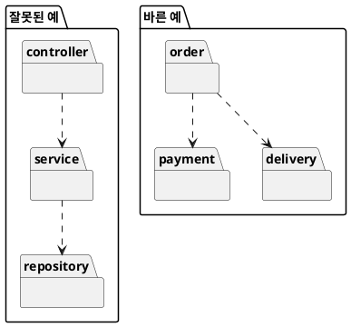

- 왼쪽에서 취소 규칙이 바뀌면 **세 계층**을 모두 고친다. 업무 사이의 의존(주문 → 결제)은 보이지 않는다.
- 오른쪽은 **변경 이유**로 나눠 취소 규칙이 `order` 안에 있다.
- 계층이 틀린 것은 아니다. 계층은 경계 **안의** 구성 방식이 될 수 있다.

**강사 노트**

- 왼쪽 구조는 LLM이 패키지를 나눌 때 흔히 내놓는 답이다(실습의 점검 항목 1).
- 경계 안의 구성 방식은 "13. OOAD에서 전문영역으로 — Architecture · DDD · MSA"의 포트와 어댑터로 이어진다.

---

## 20. 잘못된 관행 — 공용 패키지

**다이어그램 — 패키지 다이어그램**

**공용 패키지**(common·util)는 모두가 의존해 **응집이 무너진다**.

**도식 — PlantUML — 공용 패키지와 의미 소유**

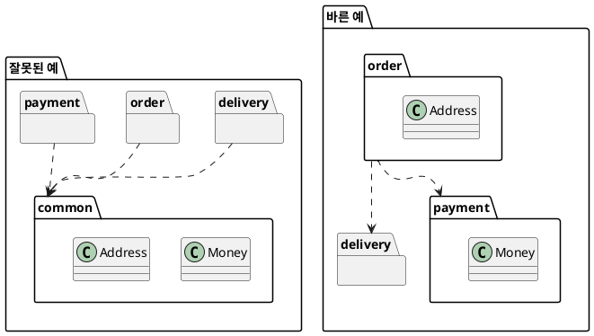

- 왼쪽은 금액 규칙만 고쳐도 주소를 쓰는 곳까지 **다시 확인**한다.
- 오른쪽은 값을 **의미를 소유한 경계**에 둔다 — 금액은 `payment`, 주소는 `order`.
- 순환을 끊으려고 공용 패키지를 만들지 않는다. 인터페이스를 **두는 패키지**를 바꿔 방향을 바꾼다(「13. 순환 의존」).

**강사 노트**

- 공용 패키지에는 서로 다른 이유로 바뀌는 것이 모인다. 여러 경계가 같은 값을 쓰면 그 값을 소유한 경계에 의존한다. 정말 업무 의미가 없는 기술 도구(날짜 계산 등)만 공용으로 둔다.
- 예제 코드에서 `Money`(금액)는 `payment` 패키지에 있다(`code/s05/payment/Money.java`).

---

## 21. 잘못된 관행 — 외부 모델 누수

**다이어그램 — 클래스 다이어그램**

외부 시스템의 **상태·코드·이름**을 주문 시스템 안에서 그대로 쓰면, 외부가 바뀔 때 **주문의 규칙이 바뀐다**.

**도식 — PlantUML — 외부 형식의 누수와 번역**

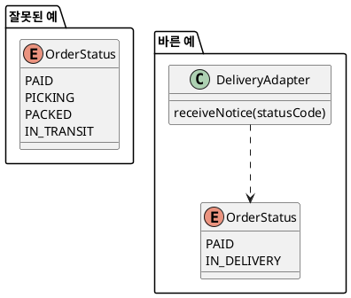

- 왼쪽은 배송 시스템의 상태 코드 `PICKING`·`PACKED`가 **주문 상태**가 됐다. 배송 시스템이 코드를 바꾸면 주문의 규칙이 바뀐다.
- 오른쪽은 주문 상태를 **주문의 사건**으로 정하고, 연동이 `IN_TRANSIT`을 배송 시작 통보로 변환한다.

**강사 노트**

- 결제도 같다. 결제 대행 응답 객체를 주문이 필드로 들지 않고 결제 경계의 기록으로 변환한다.
- "04. 동적 모델 — 상호작용과 상태"에서 출고 준비 중·출고됨을 주문 상태에 넣지 않은 것과 같은 판단이다.
- 도식의 `OrderStatus`는 비교에 필요한 값만 보였다(나머지 값 생략).

---

## 22. 패키지와 코드

**다이어그램 — 패키지 다이어그램**

패키지는 자바의 **package**, 의존은 **import**, 요청 인터페이스는 업무 패키지의 **interface**가 된다. 이름은 **용어집의 영문명**이다.

**도식 — PlantUML — 배송 인터페이스와 연동**

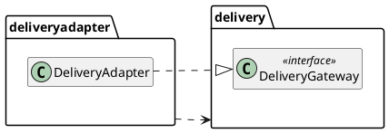

```java
package delivery;

// 배송 패키지가 가진 요청 인터페이스. 배송 연동이 구현한다.
public interface DeliveryGateway {
    boolean requestDispatchStop(String deliveryNumber);
}
```

```java
package deliveryadapter;

import delivery.DeliveryGateway;
import order.Order;

// 배송 시스템과 주고받는 형식을 주문 시스템의 의미로 변환한다.
public final class DeliveryAdapter implements DeliveryGateway {
    // ... 필드·생성자 생략
}
```

**강사 노트**

- 코드는 모두 `code/s05/`의 패키지별 원본에서 발췌했으며, 컴파일·실행해 확인한다. "04. 동적 모델 — 상호작용과 상태"의 분석 코드 `배송시스템`·`출고중단을요청한다`가 용어집의 영문명 `DeliveryGateway`·`requestDispatchStop`이 되었다. 이 세션에서는 그 인터페이스가 **`delivery` 패키지**에 놓인다.
- 코드가 보장하는 것은 import의 방향뿐이다. 클래스의 책임과 협력은 "07. 책임·협력·계약"에서 정한다.

---

## 23. 의존 방향과 테스트

**다이어그램 — 패키지 다이어그램**

요청 인터페이스가 업무 패키지에 있으면, 연동 없이 **가짜 구현**으로 주문 규칙을 시험할 수 있다.

**도식 — PlantUML — 시험할 때의 의존**

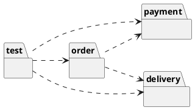

```java
        // 1. 연동 없이 주문 규칙을 검증한다 — 가짜 결제·배송 시스템
        var requests = new ArrayList<String>();
        PaymentGateway fakePayment = amount -> requests.add("환불 " + amount.won());
        DeliveryGateway fakeDelivery = number -> { requests.add("출고 중단"); return true; };

        var order = new Order();
        order.onPaid(new Payment(new Money(2000), fakePayment), new Delivery("D-1", fakeDelivery));
        order.cancel();
        check(order.status() == OrderStatus.CANCELLING);
        check(requests.equals(List.of("출고 중단", "환불 2000")));
        // ... 연동 확인 생략

        // 3. 구조 제약 — 업무 패키지는 연동 패키지를 import하지 않는다
        for (String business : List.of("order", "payment", "delivery"))
            try (var files = Files.list(Path.of(business))) {
                for (Path file : files.toList()) {
                    String source = Files.readString(file);
                    check(!source.contains("import paymentadapter") && !source.contains("import deliveryadapter"));
                }
            }
```

**강사 노트**

- 결과를 먼저 예측하게 한다: 가짜 구현으로 취소하면 요청은 어떤 순서로 기록되는가?
- 요청의 순서(출고 중단 → 환불)는 "04. 동적 모델 — 상호작용과 상태"의 테스트와 같다. 경계를 나누고 이름을 영문으로 바꿔도 **업무의 의미는 그대로**다 — `CANCELLING`은 용어집의 "취소 처리 중"이다.

---

## 24. 통보 변환 코드

**다이어그램 — 시퀀스 다이어그램**

`DeliveryAdapter`는 `IN_TRANSIT`만 배송 시작 통보 `onDeliveryStarted()`로 **변환**하고, `PICKING`은 버린다.

**도식 — PlantUML — 상태 코드를 주문의 사건으로 변환**

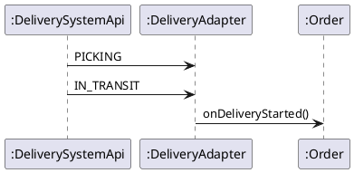

```java
    // 배송 시스템의 통보를 주문의 사건으로 변환한다.
    public void receiveNotice(String statusCode, Order order) {
        if (statusCode.equals("IN_TRANSIT")) order.onDeliveryStarted();
        // PICKING·PACKED 같은 배송 시스템 내부 상태는 주문으로 변환하지 않는다.
    }
```

**강사 노트**

- 테스트(`code/s05/test/BoundaryTest.java`) — `PICKING`을 받아도 주문은 결제 완료(`PAID`) 그대로이고, `IN_TRANSIT`을 받으면 배송 중(`IN_DELIVERY`)이 된다.

- 상태 코드는 「10. 요청과 통보」의 **교육용 가정**이다. 배송 시작을 `IN_TRANSIT`으로 둔 것은 용어집의 출고(`dispatch`)와 섞지 않기 위해서다.
- 통보를 받는 방식(메시지 큐·웹훅 등)은 생략했다. 전달 기술은 "10. 기술 제약과 도메인 의미 보존"에서 다룬다.

---

## 25. 적정 구조 설계

경계는 **변경을 가둘 만큼만** 나눈다. 바뀔 이유가 확인되지 않은 곳까지 나누면 인터페이스와 연동만 늘어난다.

- **나눌 때** — 변경 이유가 다르고, 한쪽의 변경이 실제로 번질 때
- **합칠 때** — 늘 함께 바뀌고, 인터페이스가 형식적일 때
- **외부 시스템** — 우리가 통제하지 못하는 변경이라 처음부터 **연동으로 가둔다**

**강사 노트**

- 이 사례는 업무 경계 6개와 연동 4개로 충분했다. 작은 시스템은 패키지 몇 개와 방향 규칙 하나로 시작해도 된다.
- 판단 기준은 `sw-engineering-principles.md`의 적정 수준과 KISS·YAGNI다.

---

## 26. 실습 — 패키지 다이어그램

도메인 모델과 동적 모델을 LLM에 제공하여 **패키지 다이어그램**을 초안과 상세 두 단계로 만들고, 점검 항목으로 **피드백**하여 완성하십시오.

- **투입물**
  + 실습 3의 **도메인 모델 상세**, 실습 4의 **시퀀스 다이어그램**, 실습 2의 **용어집**(보완 포함) — 실제로는 여러분의 결과물을 이어 씁니다.
- **프롬프트**
  + ① "위 도메인 모델의 클래스를 **변경 이유**로 묶어 PlantUML **패키지 다이어그램 초안**을 그려줘. 의존을 표시하고, 클래스는 이름만 보여줘. 패키지·클래스 이름은 **용어집의 영문명**으로 써줘."
  + ② "외부 시스템 연동을 분리하고 **순환 의존**을 없애 **상세 패키지 다이어그램**으로 바꿔줘."
- **점검 항목**
  1. **패키지 기준** — 기술 계층이나 공용(common) 패키지가 아닌 **변경 이유**로 묶었는가?
  2. **순환 의존** — 패키지 의존에 순환이 없는가?
  3. **연동 분리** — 외부 시스템과의 연동을 별도 패키지로 뺐는가?
  4. **의존 방향** — 업무 패키지가 연동 패키지에 의존하지 않는가?
  5. **인터페이스의 위치** — 결제·배송 요청의 **인터페이스**를 업무 패키지가 갖는가?
  6. **설계 이름** — 패키지·클래스 이름이 용어집의 영문명과 명명 규칙을 따르는가?
- **결과물** — 패키지 다이어그램 초안과 상세. 객체 설계의 입력이 됩니다.

**강사 노트**

- LLM은 화면·서비스·저장소 같은 기술 계층으로 나누거나, 장바구니를 고객 패키지에 넣어 순환을 만들기 쉽다.
- 영문으로 그리게 하면 LLM은 용어집과 다른 영어를 지어내기 쉽다(예: 정기배송을 `RegularDelivery`, 해지를 `cancel`로). 용어집의 영문명을 투입물로 함께 준다.

---

## 27. 패키지 다이어그램 초안 (안)

도메인 개념을 **변경 이유**로 묶었다. 장바구니가 정기배송을 만들고 정기배송이 고객을 알아서 **고객 ↔ 정기배송**에 순환이 생긴다.

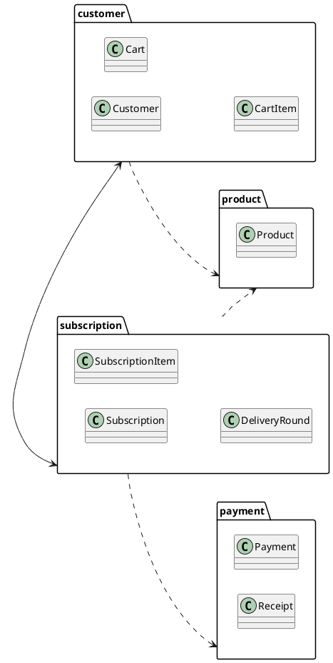

**강사 노트**

- 패키지 의존은 클래스 사이의 연관·생성에서 나온다 — 장바구니가 정기배송을 만들고(고객 → 정기배송), 정기배송이 고객을 참조한다(정기배송 → 고객).

---

## 28. 패키지 다이어그램 상세 (안)

장바구니를 정기배송으로 옮겨 **순환을 끊고**, 외부 연동을 **연동 패키지**로 분리했다. 요청 인터페이스는 **업무 패키지**가 갖는다.

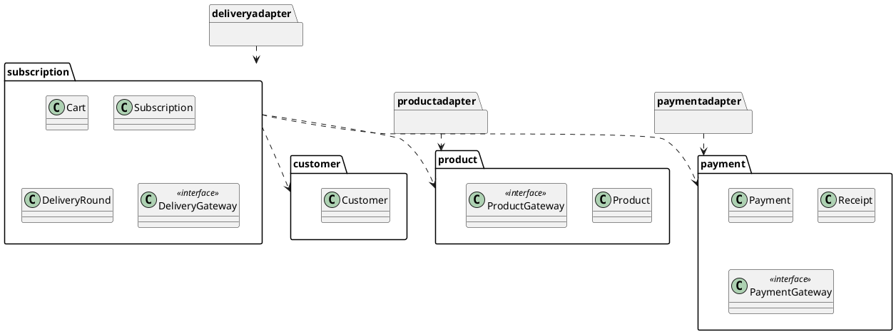

**강사 노트**

- 장바구니를 옮긴 근거 — 장바구니는 정기배송 신청과 **함께 쓰이고 함께 바뀐다**. 고객은 정기배송을 모르므로 의존은 정기배송 → 고객 한 방향이다.
- 연동은 업무 패키지의 인터페이스를 실현한다(의존 역전). 결제 시스템의 형식은 결제 연동 밖으로 나가지 않는다.
- 장바구니 항목·정기배송 항목은 소속만 같아 생략했다.

---

## 29. 구조 보완 (안)

패키지를 나누며 발견한 것은 **후속 작업에 영향을 미치는 경우에만** 이전 산출물에 반영한다.

- **도메인 모델**(실습 3)
  - **연관 방향** — 고객–정기배송 연관은 **정기배송 → 고객** 한 방향이다. 고객은 정기배송 목록을 직접 갖지 않는다.
  - **장바구니 소속** — 장바구니는 고객이 아닌 **정기배송 신청**의 개념이다.
- **동적 모델**(실습 4)
  - **외부 요청** — 결제·배송 요청은 업무 패키지의 **인터페이스**(`PaymentGateway`·`DeliveryGateway`)로 보낸다.
- **※ 현행화 기준**
  - **반영** — 연관 방향, 장바구니 소속, 요청 인터페이스. 객체 설계와 코드의 입력이 된다.
  - **기록만** — 시퀀스 다이어그램의 외부 참여자 표기.

**강사 노트**

- 순환 의존은 대개 연관 방향을 정하지 않은 데서 온다. 패키지를 나누면 연관 방향을 결정해야 한다.
- 고객의 정기배송 목록이 필요하면 정기배송 쪽의 조회로 푼다 — 객체 설계에서 다룬다.

---

## 30. 요약

이 세션은 분석 결과를 바탕으로 책임이 놓일 **구조적 경계**와 변경이 번지는 **의존 방향**을 정했다.

### 구조적 경계와 의존성의 핵심

- **경계** — 함께 바뀌는 상태와 규칙의 묶음
- **패키지 기준** — 합성·소유·변경 이유·함께 쓰임·외부 통제
- **의존** — 쓰는 쪽 → 쓰이는 쪽. 변경은 반대 방향으로 번진다
- **방향** — 덜 바뀌는 업무 쪽으로. 요청 인터페이스는 업무 패키지에 두고, 연동이 통보를 변환한다
- **패키지 원칙** — 응집(REP·CCP·CRP)과 결합(ADP·SDP·SAP)
- **설계의 이름** — 분석은 한글 용어, 설계는 용어집의 영문명과 명명 규칙
- **제약** — 객체 설계 전에 명시하고 코드·테스트·변경 시나리오로 확인한다

**주석**

REP — Release Reuse Equivalency Principle · CCP — Common Closure Principle · CRP — Common Reuse Principle · ADP — Acyclic Dependencies Principle · SDP — Stable Dependencies Principle · SAP — Stable Abstractions Principle

### 다음 세션

- "**06. 분석 모델에서 설계 모델로**" — 분석 개념을 기계적으로 변환하지 않고 의미를 보존하며 설계 모델로 전환한다.

**강사 노트**

- 이 세션의 구조적 제약(「18. 구조적 제약」)은 다음 세션에서 분석 개념을 설계 클래스로 옮길 때의 경계가 된다.
