--------------------
Session 명: 06. 분석 모델에서 설계 모델로
--------------------

## 목차

01. 세션 목표
02. 분석에서 설계로
03. 전환은 판단이다
04. 분석 모델과 설계 모델
05. 표현 간극
06. 끊어진 모델
07. 대응의 유형
08. 개념에서 클래스로
09. 속성에서 타입으로
10. 연관에서 참조로
11. 경계를 넘는 연관
12. 상태에서 전이로
13. 계약에서 메서드로
14. 통보에서 사건으로
15. 주문 사례 대응표
16. 의미 보존 기준
17. 조용한 의미 변경
18. 보존의 검증
19. 분석 모델 되돌림
20. 초기 설계
21. 시스템 이벤트를 받는 객체
22. 메시지에서 책임으로
23. 경계가 정하는 위치
24. 주문 취소 설계 시퀀스
25. 설계 클래스 다이어그램
26. 설계에서 코드로
27. 초기 설계의 한계
28. 잘못된 관행 — 기계적 변환
29. 잘못된 관행 — 데이터만 옮기기
30. 잘못된 관행 — 분석과 단절
31. 잘못된 관행 — 기술 먼저
32. 적정 전환
33. 실습 — 분석에서 설계로
34. 대응표 (안)
35. 설계 클래스 다이어그램 (안)
36. 설계 시퀀스 다이어그램 (안)
37. 설계 보완 (안)
38. 요약

## 01. 세션 목표

이 세션은 분석 모델의 **의미를 보존**하면서 책임·경계·협력으로 **설계 모델**을 만든다.

- 분석 모델과 설계 모델이 답하는 질문이 다르며, 전환이 **변환이 아닌 판단**임을 설명한다.
- 개념·속성·연관·상태·계약·통보가 설계 요소로 가는 **대응의 유형**을 구분한다.
- **의미 보존 기준**(용어집의 영한 대응 포함)으로 설계가 도메인 의미를 조용히 바꾸지 않았는지 검사한다.
- 시퀀스의 메시지와 구조적 제약에서 출발해 **초기 설계**(설계 시퀀스·설계 클래스 다이어그램)를 만든다.
- 설계 모델을 자바 코드로 옮기고 **테스트로 의미 보존**을 확인한다.
- 기계적 변환·데이터만 옮기기·분석과의 단절·기술 먼저 같은 **잘못된 관행**을 식별한다.

**강사 노트**

- 이 세션의 설계는 **첫 책임 배치**까지다. 책임의 정제와 객체 계약·SOLID는 "07. 책임·협력·계약", 변경 압력에 따른 변이는 "08. 변화 대응과 변이 설계", 저장 기술은 "10. 기술 제약과 도메인 의미 보존"에서 다룬다.

---

## 02. 분석에서 설계로

설계는 빈 종이에서 시작하지 않는다. 앞 세션의 **분석 산출물과 구조적 제약**이 입력이고, 이 세션의 출력은 **초기 설계**다.

**도식 — Mermaid**

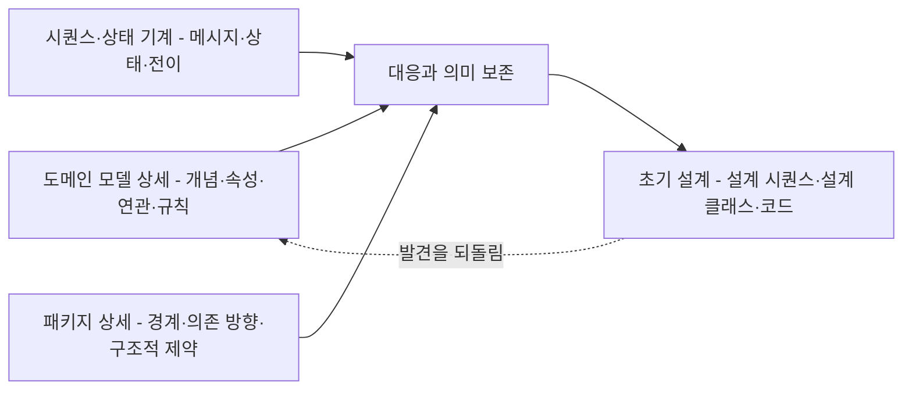

- **입력** — 도메인 모델 상세, 주문 취소 시퀀스와 주문 상태 기계, 패키지 상세와 구조적 제약
- **출력** — 대응표, 설계 시퀀스, 설계 클래스 다이어그램, 의미 보존을 확인하는 코드와 테스트

**강사 노트**

- 입력의 출처 — "03. 정적 모델 — 도메인 개념과 관계"의 「45. 도메인 모델 — 상세화」, "04. 동적 모델 — 상호작용과 상태"의 「26. 주문 취소 시퀀스」·「33. 주문 상태 기계」, "05. 구조적 경계와 의존성"의 「14. 주문 시스템 패키지 — 상세화」·「18. 구조적 제약」.
- 점선은 설계에서 발견한 것을 분석 산출물에 되돌리는 흐름이다(「19. 분석 모델 되돌림」). 설계는 분석의 끝이 아니라 분석을 다시 검증하는 자리다.

---

## 03. 전환은 판단이다

분석 모델의 **의미**는 보존하고, 설계 요소의 **형태**는 책임·경계·협력으로 다시 결정한다. 전환은 판단이지 **변환**이 아니다.

**인용문**

"소프트웨어 개발의 핵심 설계 도구는 **설계 원칙을 잘 익힌 사고**이며, UML이나 다른 어떤 기술도 아니다", "The critical design tool for software development is a mind well educated in design principles. It is not the UML or any other technology.", [Larman 2004]

| 구분 | 분석이 답하는 질문 | 설계가 답하는 질문 |
|---|---|---|
| **개념** | 무엇이 존재하는가? | 어느 클래스가 무엇을 알고 하는가? |
| **행위** | 무엇이 일어나는가? | 누가 메시지를 받고 누구에게 맡기는가? |
| **규칙** | 무엇이 참이어야 하는가? | 그 규칙을 어디서 검사하고 누가 지키는가? |
| **경계** | 무엇이 함께 바뀌는가? | 어느 패키지·인터페이스에 두는가? |

**강사 노트**

- 인용 근거: Craig Larman, *Applying UML and Patterns*, 3rd ed.(2004), §17.1 "UML versus Design Principles" 원문 확인.
- 도구가 모델을 코드로 바꿔 줄 수는 있어도, 무엇을 어디에 둘지는 정해 주지 않는다. 그 판단이 이 세션의 대상이다.
- 분석의 질문에 대한 답(의미)은 설계에서 바뀌지 않는다. 바뀌는 것은 설계의 질문에 대한 답(형태)이다.

---

## 04. 분석 모델과 설계 모델

같은 클래스 다이어그램이라도 **분석 모델**은 문제영역의 개념을, **설계 모델**은 소프트웨어 객체를 그린다. 설계에서는 분석에 없던 **타입·방향·오퍼레이션·설계 객체**가 더해진다.

| 구분 | 분석 모델(도메인 모델) | 설계 모델 |
|---|---|---|
| **요소** | 도메인 개념(주문, 결제) | 소프트웨어 클래스(`Order`, `OrderService`) |
| **이름** | 용어집의 한글 용어 | 용어집의 영문명과 명명 규칙 |
| **속성** | 속성과 속성 도메인 | 필드와 타입(값 타입 포함) |
| **연관** | 방향 없는 연관과 다중성 | 참조의 방향, 컬렉션, 식별자 참조 |
| **행위** | 오퍼레이션 없음 | 메서드(책임) |
| **추가 요소** | 없음 | 응용 서비스, 저장소, 인터페이스, 연동 |

- 분석 모델은 **도메인 전문가와 검토**하고, 설계 모델은 **코드와 테스트로 검증**한다.

**강사 노트**

- 도메인 모델에 오퍼레이션을 두지 않는 것은 "03. 정적 모델 — 도메인 개념과 관계"의 원칙이다. 설계 모델에서 처음으로 메서드가 나타난다.
- 설계 모델은 분석 모델을 대체하지 않는다. 두 모델은 다른 질문에 답하며, 대응 관계로 서로를 확인한다.
- 설계 클래스 다이어그램(Design Class Diagram, DCD)의 표기는 「25. 설계 클래스 다이어그램」에서 다룬다.

---

## 05. 표현 간극

설계 클래스의 **이름**은 도메인 모델에서 가져온다. 그러나 클래스의 **형태**를 정하는 것은 이름이 아니라 변경과 책임이다.

**인용문**

"도메인 계층의 소프트웨어 클래스 이름은 **도메인 모델의 이름에서 영감**을 얻고, 객체는 도메인에 익숙한 정보와 책임을 갖게 한다", "Use software class names in the domain layer inspired from names in the domain model, with objects having domain-familiar information and responsibilities.", [Larman 2004]

**인용문**

"표현 간극을 줄이는 것은 유용하지만, **변경과 확장을 쉽게** 하고 복잡성을 관리·은닉하는 객체의 장점에 비하면 부차적이다", "A lowered representational gap is useful, but arguably secondary to the advantage objects have in supporting ease of change and extension, and managing and hiding complexity.", [Larman 2004]

- **표현 간극**(representational gap) — 업무를 이해하는 방식과 소프트웨어의 표현 사이의 거리
- 이름이 같으면 코드를 **읽기 쉽다**. 형태까지 같게 만들면 변경이 **번지기 쉽다**.

**강사 노트**

- 인용 근거: Craig Larman, *Applying UML and Patterns*, 3rd ed.(2004), §9.3 "Motivation: Why Create a Domain Model?"의 "Motivation: Lower Representational Gap with OO Modeling" 원문 확인.
- 첫 인용의 "도메인 계층(domain layer)"에 주목한다. 도메인 모델에서 이름을 얻는 것은 도메인 계층의 클래스다. 주문 서비스·주문 저장소처럼 도메인 모델에 없는 설계 요소도 있다.
- 두 인용은 짝이다. 이름은 도메인에서 가져오되, 클래스를 나누고 합치는 기준은 변경과 책임이다.

---

## 06. 끊어진 모델

그대로 옮기지 않는다고 해서 **끊어도 되는** 것은 아니다. 설계가 분석 모델과 대응하지 않으면 모델도 코드도 **믿을 수 없다**.

**인용문**

"설계나 그 핵심이 도메인 모델에 **대응하지 않으면** 그 모델은 가치가 거의 없고, 소프트웨어의 정확성도 의심스럽다", "If the design, or some central part of it, does not map to the domain model, that model is of little value, and the correctness of the software is suspect.", [Evans 2015]

| 전환 | 결과 |
|---|---|
| **기계적 변환** | 분석 클래스마다 설계 클래스 — 책임·경계가 없는 설계 |
| **단절** | 분석을 버리고 새로 설계 — 규칙·상태가 조용히 바뀐 코드 |
| **판단** | 의미는 대응으로 추적하고, 형태는 책임·경계로 결정 |

**강사 노트**

- 인용 근거: Eric Evans, [Domain-Driven Design Reference](https://www.domainlanguage.com/wp-content/uploads/2016/05/DDD_Reference_2015-03.pdf), 2015, "Model-Driven Design" 원문 확인.
- 같은 단락은 복잡한 대응도 유지할 수 없다고 경고한다 — 분석과 설계 사이에 "치명적인 간극(deadly divide)"이 생겨 한쪽의 통찰이 다른 쪽으로 가지 않는다.
- 「05. 표현 간극」과 짝을 이룬다. 그대로 옮기지 않지만, 끊지도 않는다. 두 잘못된 관행은 「28. 잘못된 관행 — 기계적 변환」·「30. 잘못된 관행 — 분석과 단절」에서 다룬다.

---

## 07. 대응의 유형

분석 요소와 설계 요소의 대응은 **1:1이 아니다**. 하나가 여럿으로 **나뉘고**, 여럿이 하나로 **합쳐지며**, 설계에만 있는 요소가 **생긴다**.

| 유형 | 뜻 | 주문 사례 |
|---|---|---|
| **1:1** | 개념 하나가 클래스 하나 | 배송 → `Delivery` |
| **1:N** | 개념 하나가 여러 설계 요소 | 주문 → `Order`, `OrderService`, `OrderRepository` |
| **N:1** | 여러 분석 요소가 한 설계 요소 | 배송지 속성과 주소 도메인 → 값 타입 `Address` |
| **요소의 변화** | 분석 요소가 다른 종류의 설계 요소 | 주문 항목–상품 연관 → 필드 `productNumber` |
| **설계에만** | 분석 모델에 없는 설계 요소 | `PaymentGateway`, 연동, 저장소 |

- 어떤 유형인지는 **책임·경계·변경**이 정한다. 이름이나 표기가 정하지 않는다.

**강사 노트**

- 표의 예는 이 세션의 주문 사례에서 내린 설계 판단이다. 보편 규칙이 아니며, 다른 요구에서는 다른 유형이 될 수 있다.
- "설계에만"인 요소는 분석 모델에 **역수입하지 않는다**. 주문 서비스는 업무 개념이 아니다.
- 반대로 분석에만 있고 설계에 클래스가 없는 요소도 있다. 예를 들어 파생 속성 주문 총액은 필드가 아니라 계산 메서드가 된다(「09. 속성에서 타입으로」).

---

## 08. 개념에서 클래스로

**다이어그램 — 클래스 다이어그램**

도메인 개념 주문은 설계에서 **책임에 따라 나뉜다**. 규칙과 상태는 `Order`가, 시스템 이벤트의 조정은 `OrderService`가, 찾고 저장하는 약속은 `OrderRepository`가 맡는다.

**도식 — PlantUML**

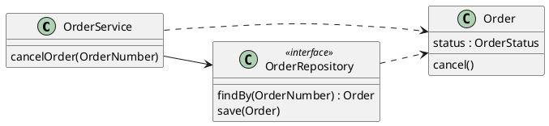

| 설계 요소 | 맡는 것 | 맡지 않는 것 |
|---|---|---|
| **`Order`** | 상태·전이·취소 규칙 | 저장·찾기 |
| **`OrderService`** | 시스템 이벤트 수신, 찾기·맡기기·저장의 조정 | 업무 규칙 |
| **`OrderRepository`** | 주문을 찾고 저장하는 약속 | 저장 기술 |

**강사 노트**

- 주문 서비스(`OrderService`)와 주문 저장소(`OrderRepository`)는 새 **설계 용어**다. 용어집과 과정의 공통 전제에 더한다. 설계 도식과 코드는 "05. 구조적 경계와 의존성"의 「06. 설계의 이름」대로 용어집의 영문명을 쓴다.
- 저장소는 인터페이스(약속)로만 둔다. 데이터베이스·ORM 같은 저장 기술은 "10. 기술 제약과 도메인 의미 보존"에서 다룬다.
- 나누는 이유는 「05. 표현 간극」의 "변경과 확장"이다. 저장 방식이 바뀌어도 취소 규칙은 바뀌지 않아야 한다.

---

## 09. 속성에서 타입으로

**다이어그램 — 클래스 다이어그램**

속성 도메인은 **값 타입**이 되고, 규칙은 값이 **만들어질 때** 검사한다. 파생 속성은 저장하지 않고 **계산**한다.

**도식 — PlantUML**

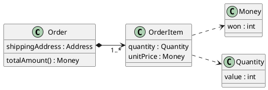

```java
public record Money(int won) {
    public Money {
        if (won < 0) throw new IllegalArgumentException("금액은 0 이상");
    }
    public Money plus(Money other) { return new Money(won + other.won); }
    public Money times(int multiplier) { return new Money(won * multiplier); }
}
```

```java
    public Money totalAmount() {
        Money total = new Money(0);
        for (OrderItem item : items) total = total.plus(item.amount());
        return total;
    }
```

**강사 노트**

- 분석 모델의 `/ 주문 총액`(파생 속성)은 필드가 아니라 **계산 메서드** `totalAmount()`가 됐다. 저장하면 항목과 총액이 어긋날 수 있다. 저장이 필요해지면(조회 성능 등) 그때 두 값을 맞추는 책임을 함께 설계한다.
- 이름은 용어집의 대응이다 — 금액 `Money`, 수량 `Quantity`, 주소 `Address`, 단가 `unitPrice`, 주문 총액 `totalAmount`.
- `Money`는 "05. 구조적 경계와 의존성"의 결정대로 **`payment` 패키지**에 있다. 이 세션은 규칙(0 이상)과 계산을 더했다. `Quantity`·`Address`는 `order` 패키지의 값 타입이다.
- 코드는 `code/s06/payment/Money.java`와 `code/s06/order/Order.java`의 발췌다.

---

## 10. 연관에서 참조로

**다이어그램 — 클래스 다이어그램**

분석의 연관은 설계에서 **방향을 가진 참조**가 된다. 방향은 누가 누구에게 **메시지를 보내는가**와 구조적 제약이 정한다.

**도식 — PlantUML**

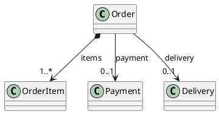

| 분석 모델 | 설계 판단 | 코드 |
|---|---|---|
| **다중성 1..*** | 빈 주문을 만들 수 없다 | 생성자에서 빈 목록 거절 |
| **합성** | 주문이 항목의 생애를 소유 | 주문 밖에서 항목 목록을 바꿀 수 없다 |
| **0..1** | 결제 전에는 없다 | `onPaid`에서 연결 |
| **방향** | 주문 → 결제·배송 | 결제·배송은 주문을 모른다 |

**강사 노트**

- 방향의 근거 — 취소 시퀀스에서 메시지는 주문 → 배송, 주문 → 결제로 흐른다. 패키지 의존(주문 → 결제·배송)도 같은 방향이다("05. 구조적 경계와 의존성"의 「12. 의존 방향」).
- 고객–주문 연관(1 : 0..*)은 이 세션의 코드에서 생략했다. 설계한다면 주문 → 고객 한 방향으로, 경계가 다르므로 고객 번호로 잇는다(「11. 경계를 넘는 연관」과 같은 판단).
- 합성의 코드 — 주문은 받은 목록을 복사해 갖는다(`List.copyOf`). 호출자가 목록을 바꿔도 주문의 항목은 바뀌지 않는다.

---

## 11. 경계를 넘는 연관

**다이어그램 — 클래스 다이어그램**

주문 항목–상품 연관은 **패키지 경계**를 넘는다. 설계는 상품 객체를 참조하지 않고 **상품 번호**와 주문 시점의 **확정 단가**를 갖는다.

**도식 — PlantUML**

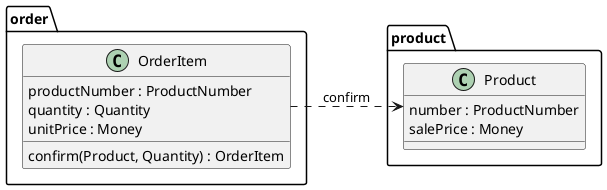

```java
    // 주문 시점의 판매가를 단가로 옮겨 적는다.
    public static OrderItem confirm(Product product, Quantity quantity) {
        return new OrderItem(product.number(), quantity, product.salePrice());
    }
```

| 대안 | 판매가가 바뀌면 | 판단 |
|---|---|---|
| **상품 객체 참조** | 주문이 상품의 변경에 묶인다 | 단가를 판매가로 읽을 위험 |
| **상품 번호 + 확정 단가** | 주문은 영향이 없다 | 의미와 경계를 함께 지킨다 |

**강사 노트**

- 분석 모델의 연관 "가리킨다"는 그대로다. 바뀐 것은 **연관을 코드로 나타내는 방식**이다. 상품 번호는 설계 결정이므로 도메인 모델에 역수입하지 않는다.
- 단가와 판매가의 구분은 "03. 정적 모델 — 도메인 개념과 관계"의 「35. 현재 값과 확정 값」이다. 상품 객체를 참조하면 누군가 `product.salePrice()`로 금액을 계산하는 순간 이 의미가 조용히 바뀐다(「17. 조용한 의미 변경」). 용어집이 단가 `unitPrice`와 판매가 `salePrice`를 다른 이름으로 정한 이유다.
- 상품 이름을 주문 내역에 보여야 한다면 상품 이름도 확정 값으로 옮겨 적을지 판단한다. 현재 요구에는 없다.

---

## 12. 상태에서 전이로

**다이어그램 — 상태 기계 다이어그램**

상태는 **enum 값**, 전이는 상태를 바꾸는 **메서드**, 가드는 전이 전의 **검사**가 된다. 전이는 **주문 한 곳**에서만 일어난다.

**도식 — PlantUML**

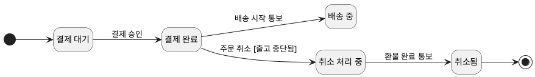

```java
public enum OrderStatus { PENDING_PAYMENT, PAID, IN_DELIVERY, DELIVERED, CANCELLING, CANCELLED }
```

```java
    private void transition(OrderStatus from, OrderStatus to) {
        if (status != from)
            throw new IllegalStateException(status + "에서는 " + to + "이 될 수 없다");
        status = to;
    }
```

- 상태 값의 **개수와 뜻**은 분석과 같다. 이름은 용어집의 영문명이다 — 취소 처리 중은 `CANCELLING`이다.

**강사 노트**

- 도식은 분석의 상태 기계이므로 한글이다. 취소와 관련된 전이만 보였다(배송 완료 생략). 전체 상태 기계는 "04. 동적 모델 — 상호작용과 상태"의 「33. 주문 상태 기계」다.
- `OrderStatus`의 값은 앞 세션의 `주문상태`와 용어집으로 대응한다(결제대기 `PENDING_PAYMENT` ~ 취소됨 `CANCELLED`). Production이 용어집으로 두 enum을 대조한다.
- 모든 전이가 `transition` 메서드를 거치므로, 금지된 전이는 한 곳에서 거절된다. 상태를 바꾸는 setter를 두지 않는 것도 설계 판단이다.

---

## 13. 계약에서 메서드로

시스템 오퍼레이션 계약은 **시스템 전체의 보장**이다. 설계는 그 보장을 **누가 받아 어느 객체들이 나누어 지키는가**를 정한다.

| 계약 | 주문을 취소한다(주문) | 설계에서 지키는 곳 |
|---|---|---|
| **입력** | 주문 | `OrderService`가 `OrderNumber`로 찾는다 |
| **사전조건** | 결제 완료·배송 시작 전 | `Order`의 상태 검사와 출고 중단 결과 |
| **사후조건** | 주문이 취소 처리 중이 된다 | `Order`의 전이(`CANCELLING`) |
| | 배송 시스템에 출고 중단을 요청했다 | `Delivery` → `DeliveryGateway` |
| | 결제 시스템에 환불을 요청했다 | `Payment` → `PaymentGateway` |

- 시스템 계약의 **"요청했다"**는 설계에서도 요청이다. 환불이 **완료**되었다고 설계하지 않는다.

**강사 노트**

- 계약의 원천은 "02. 요구 분석과 유스케이스"의 「45. 시스템 오퍼레이션과 계약」과 "04. 동적 모델 — 상호작용과 상태"의 「10. 계약의 정제」다.
- 시스템 오퍼레이션의 입력 "주문"은 설계에서 **주문 번호**가 된다. 시스템 경계를 넘는 것은 객체가 아니라 식별자다. 찾는 일은 주문 서비스가 맡는다.
- 객체 하나의 사전·사후조건·불변 조건(**객체 계약**)은 "07. 책임·협력·계약"에서 정한다. 이 세션은 시스템 계약을 어느 객체들이 나누어 지키는지까지만 정한다.

---

## 14. 통보에서 사건으로

**다이어그램 — 시퀀스 다이어그램**

외부 통보는 연동이 받아 **주문 서비스**에 알리고, 주문 서비스가 주문을 찾아 **주문의 사건**으로 맡긴다. 외부의 상태 코드는 연동 밖으로 나가지 않는다.

**도식 — PlantUML**

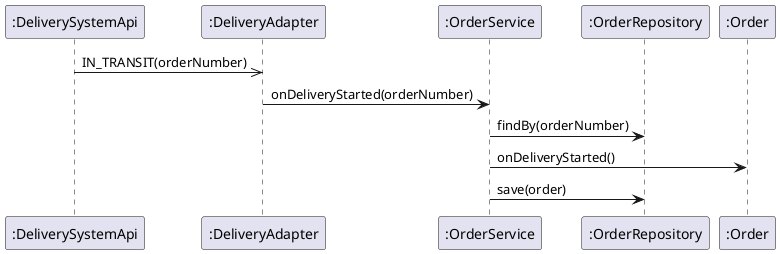

```java
    // 배송 시스템의 통보를 주문의 사건으로 옮긴다. 주문은 주문 서비스가 찾는다.
    public void receiveNotice(String statusCode, String orderNumber) {
        if (statusCode.equals("IN_TRANSIT")) orderService.onDeliveryStarted(new OrderNumber(orderNumber));
    }
```

**강사 노트**

- "05. 구조적 경계와 의존성"의 「24. 통보 변환 코드」는 연동이 주문 객체를 직접 받았다. 설계에서는 외부가 아는 것은 **주문 번호**뿐이므로, 주문을 찾는 책임이 주문 서비스에 생긴다. 구조적 제약("연동은 통보를 전할 뿐")은 그대로다.
- 상태 코드와 통보에 주문 번호가 실린다는 것은 교육용 가정이다. 전달 기술(메시지 큐·웹훅)은 "10. 기술 제약과 도메인 의미 보존"에서 다룬다.

---

## 15. 주문 사례 대응표

주문 사례의 분석 요소가 어떤 설계 요소가 되었는지와 그 **판단 근거**를 한 표로 모은다. 대응표는 설계가 분석과 **끊어지지 않았다는 증거**다.

| 분석 요소 | 설계 요소 | 판단 근거 |
|---|---|---|
| **주문** | `Order`, `OrderService`, `OrderRepository` | 규칙과 조정·저장의 변경 이유가 다르다 |
| **주문 항목** | `OrderItem`(`productNumber`, `quantity`, `unitPrice`) | 단가는 확정 값, 상품은 다른 경계 |
| **주문 총액** | `totalAmount()` | 파생 속성은 저장하지 않는다 |
| **배송지·수량·금액** | 값 타입 `Address`·`Quantity`·`Money` | 속성 도메인의 규칙을 생성 때 검사 |
| **주문 상태** | `OrderStatus`와 전이 메서드 | 상태 값 보존, 전이는 한 곳 |
| **결제·환불** | `Payment`, `Refund` | 환불 금액 ≤ 결제 금액은 결제 경계의 규칙 |
| **배송** | `Delivery` | 출고 중단 요청의 주인 |
| **외부 시스템** | `PaymentGateway`·`DeliveryGateway`, 연동 | 약속은 업무 경계, 형식은 연동 |
| **통보** | 연동 → `OrderService` → `Order` | 외부는 주문 번호만 안다 |

**강사 노트**

- 대응표는 설계 리뷰의 입력이다. "이 분석 요소는 어디로 갔는가?"와 "이 설계 요소는 어디서 왔는가?"에 모두 답할 수 있어야 한다.
- 설계 요소의 이름은 모두 용어집의 영문명이다. 대응표의 왼쪽(한글 용어)과 오른쪽(영문명)을 잇는 것이 **용어집**이다.
- 추적성은 "02. 요구 분석과 유스케이스"의 「56. 요구사항 추적」과 같은 생각이다. 판단에 필요한 관계만 추적하며, 모든 필드를 표로 옮기지 않는다.

---

## 16. 의미 보존 기준

설계가 분석 모델의 의미를 지켰는지는 **여섯 기준**으로 검사한다. 형태는 바뀌어도 이 여섯은 바뀌지 않아야 한다.

| 기준 | 확인할 질문 | 주문 사례 |
|---|---|---|
| **용어** | 이름이 용어집의 영문명과 같은가? | `OrderStatus`, `unitPrice` ≠ `salePrice` |
| **값** | 상태·코드 값이 용어집으로 대응하는가? | 결제대기 `PENDING_PAYMENT` ~ 취소됨 `CANCELLED` |
| **규칙** | 속성 도메인과 불변 조건을 지키는가? | 수량 ≥ 1, 금액 ≥ 0, 환불 ≤ 결제 |
| **다중성·생애** | 최소·최대 개수와 소유가 같은가? | 주문 항목 1개 이상, 주문이 소유 |
| **계약** | 시스템 계약의 보장이 같은가? | 요청했다는 요청으로 |
| **사건의 순서** | 업무 순서를 지키는가? | 출고 중단 → 환불 |

**강사 노트**

- 기준의 출처 — 용어·값은 용어집("02. 요구 분석과 유스케이스"의 「18. 용어집」)과 과정의 공통 전제, 규칙·다중성은 도메인 모델, 계약은 요구 산출물, 사건의 순서는 동적 모델이다.
- 영문으로 바꾸는 순간이 용어가 흔들리기 가장 쉬운 때다. 개발자마다 다른 영어를 지으면 한 용어가 여러 이름이 되고, 비슷한 두 용어(단가·판매가)가 한 이름이 된다.
- 여섯 기준은 이 과정의 정리다. 한 문헌의 분류가 아니다. 「06. 끊어진 모델」에서 본 "대응"을 검사할 수 있는 질문으로 바꾼 것이다.

---

## 17. 조용한 의미 변경

의미 변경은 대개 **설계 편의**에서 온다. 코드는 잘 돌아가지만 업무 규칙이 **아무도 모르게** 바뀐다.

| 설계 편의 | 조용히 바뀐 의미 | 어긴 기준 |
|---|---|---|
| **상품 객체 참조**로 금액 계산 | 판매가가 바뀌면 지난 주문 금액도 바뀐다 | 용어(단가 ≠ 판매가) |
| **용어집에 없는 영어** | 단가·판매가를 모두 `price`로 불러 한 뜻이 된다 | 용어 |
| **빈 리스트**로 초기화 | 항목 없는 주문이 생긴다 | 다중성 1..* |
| **취소 여부 boolean** | 취소 처리 중이 사라져 환불 전 취소됨 | 값 |
| **출고 여부 한 플래그** | 출고 전과 배송 시작 전이 한 조건이 된다 | 용어 |
| **외부 상태 코드 저장** | PICKING 같은 배송 시스템 상태가 주문 상태가 된다 | 값·경계 |
| **환불 뒤 출고 중단** | 이미 출고된 주문을 환불한다 | 사건의 순서 |

- 이런 변경이 필요하다면 **분석 모델을 먼저 고치고** 합의한다. 설계가 혼자 바꾸지 않는다.

**강사 노트**

- 일곱 예는 모두 이 과정의 주문 사례에서 앞 세션이 확인한 의미를 어긴다 — 단가와 판매가("02. 요구 분석과 유스케이스"의 용어집, "03. 정적 모델 — 도메인 개념과 관계"), 취소 처리 중과 출고·배송 시작("04. 동적 모델 — 상호작용과 상태"), 외부 형식("05. 구조적 경계와 의존성").
- `price` 예는 영문으로 옮기며 생기는 의미 변경이다. 용어집의 영문명(`unitPrice`·`salePrice`)을 쓰면 막을 수 있다.
- 코드 리뷰에서 가장 발견하기 어려운 결함이다. 컴파일도 테스트도 통과할 수 있다. 의미를 지키는 테스트가 따로 있어야 하는 이유다(「18. 보존의 검증」).

---

## 18. 보존의 검증

**다이어그램 — 클래스 다이어그램**

의미 보존은 **테스트**로 확인한다. 기준마다 "지켜지면 통과, 바뀌면 실패"하는 예를 하나씩 둔다.

**도식 — PlantUML**

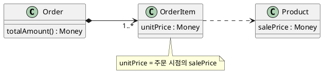

```java
        // 1. 의미 보존 — 단가는 주문 시점의 판매가, 주문 총액은 항목 금액의 합
        var pen = new Product(new ProductNumber("P-1"), new Money(1000));
        var order = new Order(new OrderNumber("O-1"),
                List.of(OrderItem.confirm(pen, new Quantity(2))), new Address("서울"));
        pen.changeSalePrice(new Money(1500));
        check(order.totalAmount().equals(new Money(2000)));

        // 2. 의미 보존 — 주문 항목은 1개 이상, 수량은 1 이상
        rejects(() -> new Order(new OrderNumber("O-0"), List.of(), new Address("서울")));
        rejects(() -> new Quantity(0));
```

**강사 노트**

- 결과를 먼저 예측하게 한다: 판매가를 1,500원으로 바꾼 뒤 주문 총액은 얼마인가? 주문 항목이 상품 객체를 참조해 판매가로 계산했다면 어떻게 되는가?
- 이 테스트는 "03. 정적 모델 — 도메인 개념과 관계"의 규칙 테스트와 **같은 기대값**이다. 설계가 바뀌어도 기대값이 같다는 것이 의미 보존의 증거다.
- 금지된 전이와 사건의 순서는 「26. 설계에서 코드로」의 테스트가 확인한다.

---

## 19. 분석 모델 되돌림

설계는 분석의 **빈틈을 드러낸다**. 발견한 것 중 업무 의미에 속하는 것은 분석 산출물에 **되돌리고**, 설계 결정은 설계에 남긴다.

| 설계에서 발견한 것 | 성격 | 처리 |
|---|---|---|
| **통보에 주문 번호가 실려야 한다** | 외부 시스템과의 약속 | 정제된 SSD의 통보에 반영 |
| **출고 중단이 거절되면 취소도 거절된다** | 업무 규칙 | 이미 명세서 예외 흐름에 있음 — 확인만 |
| **주문 서비스·주문 저장소** | 설계 결정 | 설계에만 둔다. 이름은 용어집에 더한다 |
| **상품 번호로 참조** | 설계 결정 | 도메인 모델에 역수입하지 않는다 |

- 되돌릴지는 **업무 의미인가, 설계 결정인가**로 가른다.

**강사 노트**

- Evans는 같은 단락에서 모델이 소프트웨어로 더 자연스럽게 구현되도록 모델을 **다시 보고 고치라**고 권한다(DDD Reference, 2015, "Model-Driven Design"). 설계가 분석의 검증자가 되는 이유다.
- 되돌림은 "02. 요구 분석과 유스케이스"의 정제된 SSD·명세서, "03. 정적 모델 — 도메인 개념과 관계"의 도메인 모델에 한다. 보완을 위한 새 산출물은 만들지 않는다.
- 되돌린 결과는 과정의 공통 전제에도 반영한다. 설계 요소는 도메인 모델에는 넣지 않지만 **용어집에는 넣는다** — 이름이 여러 개로 갈라지는 것을 막는 곳은 용어집 하나다.

---

## 20. 초기 설계

**초기 설계**(initial design)는 분석 모델 위에 **첫 책임 배치**를 하는 일이다. 모델에서 **용어와 기본 책임**을 가져오고, 정제는 뒤로 미룬다.

**인용문**

"설계에 쓰는 **용어**와 **기본적인 책임 배정**을 모델에서 가져온다", "Draw from the model the terminology used in the design and the basic assignment of responsibilities.", [Evans 2015]

1. **시스템 이벤트** — 누가 받는가?
2. **메시지** — 분석 시퀀스의 메시지를 누가 책임지는가?
3. **경계** — 구조적 제약 안에서 어디에 두는가?
4. **확인** — 설계 시퀀스와 설계 클래스 다이어그램, 코드와 테스트로 확인한다.

**강사 노트**

- 인용 근거: Eric Evans, [DDD Reference](https://www.domainlanguage.com/wp-content/uploads/2016/05/DDD_Reference_2015-03.pdf), 2015, "Model-Driven Design" 원문 확인.
- "기본적인" 배정만 가져온다. 책임 후보를 비교하고 정제하는 일은 "07. 책임·협력·계약"에서 한다.
- 네 단계는 이 세션의 수업용 절차다. 고정 순서가 아니며, 코드에서 발견한 것이 앞 단계를 다시 연다.

---

## 21. 시스템 이벤트를 받는 객체

**다이어그램 — 시퀀스 다이어그램**

시스템 이벤트는 **주문 서비스** `OrderService`(응용 서비스, Application Service)가 받는다. 주문 서비스는 찾고, 맡기고, 저장하며, **업무 규칙은 `Order`**가 갖는다.

**도식 — PlantUML**

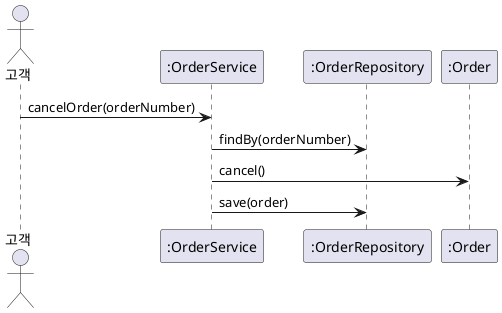

| 받는 객체 후보 | 문제 |
|---|---|
| **화면·API 처리기** | 업무 규칙이 기술 계층에 섞인다 |
| **`Order` 자신** | 자신을 찾고 저장하는 일까지 주문이 떠안는다 |
| **`OrderService`** | 조정만 하고 규칙은 주문에 맡긴다 |

**강사 노트**

- 주문 서비스라는 이름은 "01. OOAD 개요"의 「23. 분석 모델에서 설계 모델로」 미리보기와 같다. 시스템 오퍼레이션 "주문을 취소한다"는 용어집대로 `cancelOrder`다.
- 시스템 이벤트를 받는 객체를 정하는 원칙은 GRASP의 **컨트롤러**(Controller)다. GRASP는 "07. 책임·협력·계약"의 「07. GRASP」에서 소개한다. 여기서는 판단 근거(규칙과 조정의 분리)만 본다.
- 주문 서비스가 규칙을 가지기 시작하면 「29. 잘못된 관행 — 데이터만 옮기기」가 된다.

---

## 22. 메시지에서 책임으로

**다이어그램 — 시퀀스 다이어그램**

분석 시퀀스의 **메시지**는 받는 객체의 **책임 후보**가 된다. 메시지를 받는 객체는 그 일을 하는 데 필요한 것을 **알고 있어야** 한다.

**도식 — PlantUML**

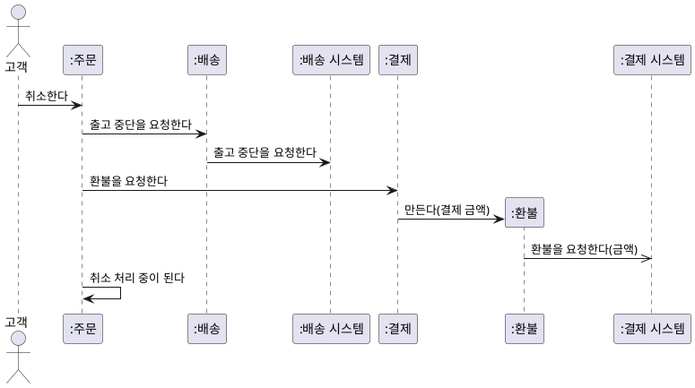

| 메시지 | 받는 객체 | 설계 메서드 | 아는 것 |
|---|---|---|---|
| **취소한다** | 주문 | `Order.cancel()` | 상태, 결제, 배송 |
| **출고 중단을 요청한다** | 배송 | `Delivery.requestDispatchStop()` | 배송 번호 |
| **환불을 요청한다** | 결제 | `Payment.requestRefund()` | 결제 금액 |

**강사 노트**

- 도식은 "04. 동적 모델 — 상호작용과 상태"의 「26. 주문 취소 시퀀스」 그대로다. 분석 시퀀스라 한글이며 설계 객체가 없다. 메시지는 용어집을 거쳐 설계 메서드의 이름이 된다.
- 책임은 **하는 것**(doing)과 **아는 것**(knowing)으로 나눈다. 이 구분과 책임 배치의 원칙은 "07. 책임·협력·계약"에서 다룬다.
- 분석의 메시지가 설계에서 모두 메서드가 되는 것은 아니다. "취소 처리 중이 된다"는 주문 안의 전이가 된다.

---

## 23. 경계가 정하는 위치

**다이어그램 — 패키지 다이어그램**

책임을 어디에 둘지는 **구조적 제약**이 먼저 제한한다. 약속은 업무 경계에, 외부 형식은 연동에, 상태 변경은 주문에 둔다.

**도식 — PlantUML**

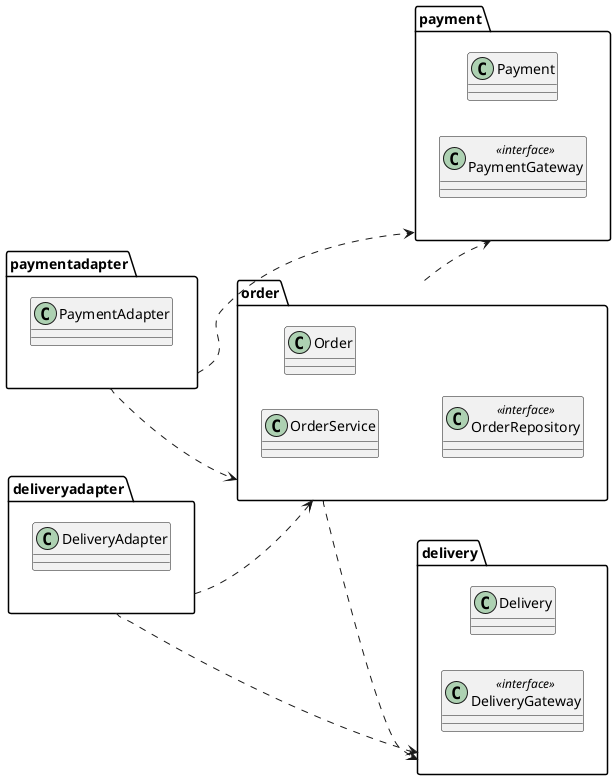

| 구조적 제약 | 설계에서 |
|---|---|
| **방향** | `order`·`payment`·`delivery`는 연동을 import하지 않는다 |
| **순환 없음** | 결제·배송은 주문을 모른다 |
| **약속의 소유** | `PaymentGateway`·`DeliveryGateway`은 업무 경계에 |
| **외부 형식** | REFUND·STOP·IN_TRANSIT은 연동 안에만 |
| **상태의 소유** | 주문 상태는 `Order`만 바꾼다. 연동은 `OrderService`에 알릴 뿐 |

**강사 노트**

- 제약의 원천은 "05. 구조적 경계와 의존성"의 「18. 구조적 제약」이다. 주문 서비스·주문 저장소는 주문 경계 안에 둔다 — 주문과 함께 바뀌기 때문이다.
- 연동 → 주문 의존은 "05. 구조적 경계와 의존성"과 같다. 설계에서 바뀐 것은 연동이 부르는 대상이 주문에서 주문 서비스로 옮겨 간 것뿐이다.
- 상품 패키지(`Product`·`ProductNumber`)는 읽기 쉽도록 생략했다.

---

## 24. 주문 취소 설계 시퀀스

**다이어그램 — 시퀀스 다이어그램**

분석 시퀀스에 **설계 객체**(`OrderService`·`OrderRepository`)와 **인터페이스**(`DeliveryGateway`·`PaymentGateway`)가 더해진다. 도메인 객체 사이의 **메시지와 순서는 그대로**이고, 이름은 **용어집의 영문명**이다.

**도식 — PlantUML**

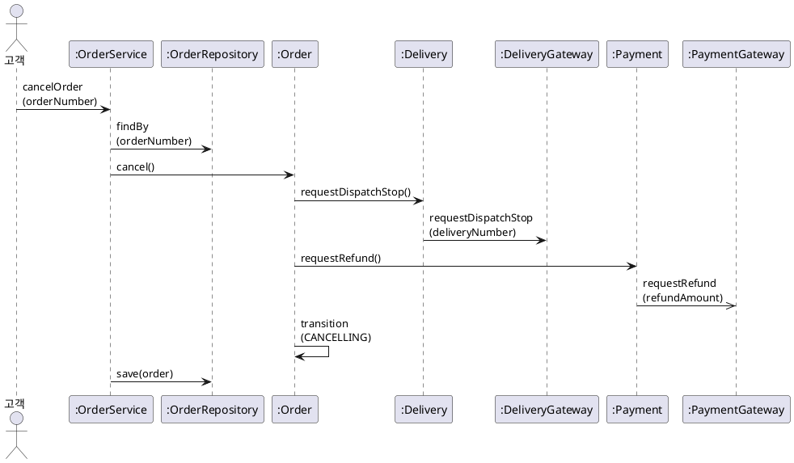

| 분석 시퀀스와 비교 | 설계 시퀀스 |
|---|---|
| **더해진 것** | `OrderService`, `OrderRepository`, 찾기·저장, 인터페이스 |
| **그대로인 것** | 취소한다 → 출고 중단 → 환불 → 취소 처리 중 |

**강사 노트**

- `Payment`는 안에서 `Refund`를 만들어 환불 규칙(환불 금액 ≤ 결제 금액)을 검사한 뒤 요청한다. 도식에서는 `Refund` 생명선을 생략했다(코드 `code/s06/payment/`).
- 분석 시퀀스(「22. 메시지에서 책임으로」)와 나란히 놓고 메시지를 용어집으로 짝지어 읽게 한다 — 취소한다 `cancel()`, 출고 중단을 요청한다 `requestDispatchStop()`, 환불을 요청한다 `requestRefund()`.
- `DeliveryGateway`·`PaymentGateway`은 여기서 외부 시스템이 아니라 업무 경계의 **인터페이스**다. 실제 호출은 연동이 실현한다(「23. 경계가 정하는 위치」).
- 설계 시퀀스는 성공 경로만 그렸다. 출고 중단이 거절되면 주문은 예외로 거절하고 상태를 바꾸지 않는다 — 코드와 테스트가 보인다(「26. 설계에서 코드로」).
- 비교 표의 "그대로인 것"이 의미 보존 기준의 **사건의 순서**다.

---

## 25. 설계 클래스 다이어그램

**설계 클래스 다이어그램**(Design Class Diagram, DCD)은 필드의 **타입**, 참조의 **방향**, 책임인 **메서드**, 인터페이스와 그 **실현**을 보인다.

**도식 — PlantUML**

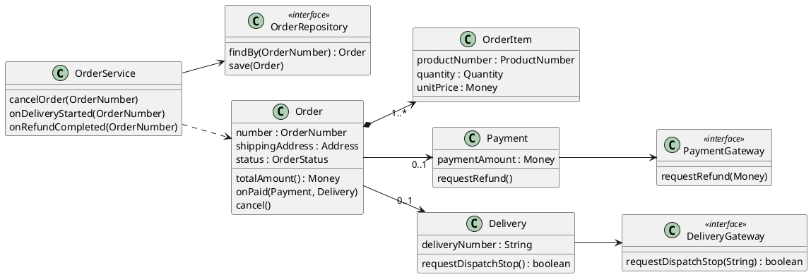

| 표기 | 의미 | 쓰는 법 |
|---|---|---|
| **화살표 연관** | 참조의 방향 | 메시지를 보내는 쪽 → 받는 쪽 |
| **메서드** | 객체의 책임 | 분석 시퀀스의 메시지에서 온다 |
| **«interface»** | 약속 | 업무 경계가 소유, 연동이 실현 |
| **점선 화살표** | 의존 | 필드 없이 쓰기만 한다 |

**강사 노트**

- 도메인 모델(「02. 분석에서 설계로」의 입력)과 나란히 놓고 대응표(「15. 주문 사례 대응표」)로 읽게 한다.
- 클래스·필드·메서드의 이름은 모두 용어집의 영문명이다. 타입 `PascalCase`, 필드·메서드 `camelCase`, 통보는 `on`으로 시작한다("05. 구조적 경계와 의존성"의 「06. 설계의 이름」).
- 환불·주문 상태 enum·값 타입의 세부와 연동의 실현(`..|>`)은 읽기 쉽도록 생략했다. 실현은 "05. 구조적 경계와 의존성"의 「22. 패키지와 코드」가 보였다.
- 고객은 코드에서 생략했다(「10. 연관에서 참조로」). 배송지 변경은 같은 방법으로 설계하며 이 세션에서는 다루지 않는다.

---

## 26. 설계에서 코드로

**다이어그램 — 시퀀스 다이어그램**

설계 시퀀스의 메시지는 **메서드 호출**이 된다. 테스트는 가짜 저장소와 가짜 약속으로 **순서와 금지된 전이**를 확인한다.

**도식 — PlantUML**


```java
    public void cancelOrder(OrderNumber number) {
        Order order = repository.findBy(number);
        order.cancel();
        repository.save(order);
    }
```

```java
        service.cancelOrder(new OrderNumber("O-1"));
        check(repository.findBy(new OrderNumber("O-1")).status() == OrderStatus.CANCELLING);
        check(requests.equals(List.of("출고 중단", "환불 2000")));
        // ... 환불 완료 통보 확인 생략

        // 4. 금지된 전이 — 배송 중인 주문은 취소할 수 없고 상태가 그대로다
        // ... 배송 시작 통보까지 준비 생략
        rejects(() -> service.cancelOrder(new OrderNumber("O-2")));
        check(shipped.status() == OrderStatus.IN_DELIVERY);
```

**강사 노트**

- 코드는 모두 `code/s06/`의 패키지별 원본에서 발췌했으며, 컴파일·실행해 확인한다. 실행: `javac -encoding UTF-8 -d out $(find . -name "*.java") && java -cp out test.DesignTest`.
- 결과를 먼저 예측하게 한다: 주문 서비스를 거쳐도 요청의 순서는 "04. 동적 모델 — 상호작용과 상태"의 테스트와 같은가?
- 코드가 **보장하는 것** — 사건의 순서, 금지된 전이의 거절, 상태 값. **보장하지 않는 것** — 저장의 원자성, 동시에 두 번 취소하는 경우, 요청 실패 뒤의 복구. 이것들은 설계 결정이 더 필요하며 이 예제는 정하지 않는다.
- 주문 서비스·저장소 같은 설계 요소를 분석 모델에 역수입하지 않는다.

---

## 27. 초기 설계의 한계

초기 설계는 **출발점**이다. 책임은 한 번 배치했을 뿐 **비교하고 정제하지 않았다**.

| 남긴 질문 | 다루는 곳 |
|---|---|
| **책임 배치의 근거** — 다른 배치와 비교하면? | "07. 책임·협력·계약" |
| **객체 계약** — 주문의 사전·사후조건·불변 조건은? | "07. 책임·협력·계약" |
| **변경 압력** — 부분 취소가 생기면 어디가 바뀌는가? | "08. 변화 대응과 변이 설계" |
| **대안 평가** — 주문 서비스가 없는 설계는 더 나쁜가? | "09. 설계 대안 평가" |
| **저장 기술** — 저장소를 무엇으로 실현하는가? | "10. 기술 제약과 도메인 의미 보존" |

**강사 노트**

- 초기 설계를 완성된 설계로 취급하면, 뒤의 판단이 "이미 정해진 것"을 뒤집는 비용이 커진다. 초기 설계는 코드와 테스트로 **빨리 확인**하는 것이 목적이다.
- 부분 취소는 교육용 변경 요청이다. 현재 요구에는 없다.

---

## 28. 잘못된 관행 — 기계적 변환

명사마다 클래스, 분석 클래스마다 설계 클래스를 **기계적으로** 만든다. 책임·경계가 아니라 **단어가 설계를 정한다**.

**인용문**

"이 방법은 주의해서 써야 한다. 명사를 **기계적으로 클래스에 대응**시킬 수는 없고, 자연어의 단어는 모호하다", "Care must be applied with this method; a mechanical noun-to-class mapping isn’t possible, and words in natural languages are ambiguous.", [Larman 2004]

| 기계적 변환 | 판단한 설계 |
|---|---|
| 도메인 모델의 클래스마다 같은 필드의 클래스 | 책임에 따라 나누고 합친다 |
| 모든 연관을 양방향 객체 참조로 | 메시지 방향으로, 경계를 넘으면 식별자로 |
| 파생 속성을 필드로 저장 | 계산할지 저장할지 판단한다 |
| 설계 객체 없이 도메인 객체가 저장까지 | 조정·저장은 설계 객체에 |

**강사 노트**

- 인용 근거: Craig Larman, *Applying UML and Patterns*, 3rd ed.(2004), §9.5 "Method 3: Finding Conceptual Classes with Noun Phrase Identification" 원문 확인. "03. 정적 모델 — 도메인 개념과 관계"의 「44. 도메인 모델 — 초안」 앞의 개념 찾기와 같은 절의 다른 문장이다.
- 개념 클래스를 찾을 때조차 기계적 대응이 안 된다면, 설계 클래스로 옮길 때는 더더욱 그렇다.
- 코드 생성 도구와 LLM은 도메인 모델을 받으면 기계적 변환을 하기 쉽다. 실습의 점검 항목이 이를 확인한다(「33. 실습 — 분석에서 설계로」).

---

## 29. 잘못된 관행 — 데이터만 옮기기

도메인 개념을 **getter·setter만 있는 클래스**로 옮기고, 규칙은 모두 **서비스**에 둔다. 데이터와 그 데이터의 규칙이 떨어진다.

| 데이터만 옮긴 설계 | 규칙이 데이터와 함께인 설계 |
|---|---|
| `order.setStatus(CANCELLED)` — 누구나 아무 상태로 | `order.cancel()` — 전이는 주문 안에서 |
| 서비스가 상태·출고·환불 순서를 모두 검사 | 서비스는 찾고 맡기고 저장만 |
| 새 서비스마다 같은 검사를 복사 | 규칙은 한 곳 |

- 규칙이 서비스로 흩어지면 **의미 보존을 검사할 곳**도 흩어진다.

**강사 노트**

- 이 관행에는 "빈약한 도메인 모델(Anemic Domain Model)"이라는 이름이 있다. 원인과 책임 배치로 푸는 방법은 "07. 책임·협력·계약"에서 다룬다.
- 데이터 모델에서 출발하는 것 자체는 잘못이 아니다. 문제는 데이터만 옮기고 **규칙을 옮기지 않은** 것이다.

---

## 30. 잘못된 관행 — 분석과 단절

분석 모델을 문서로 남기고, 설계는 **새 이름과 새 구조**로 처음부터 만든다. 분석에서 합의한 의미가 설계로 **전해지지 않는다**.

- **새 이름** — 용어집의 `OrderItem`을 두고 `OrderLine`·`Item`·`Detail`로 섞어 부른다. 용어 정렬이 무너진다.
- **새 구조** — 주문 상태를 여러 플래그로 나눈다. 상태 기계와 코드가 대응하지 않는다.
- **새 규칙** — 설계자가 편한 대로 정한다. 확인하지 않은 규칙이 코드에 들어간다.
- **되돌림 없음** — 설계에서 발견한 것이 분석에 돌아가지 않는다. 분석 모델이 낡는다.

**강사 노트**

- 「06. 끊어진 모델」의 Evans 인용이 경고하는 "치명적인 간극"이다. 분석 팀과 설계 팀이 나뉘어 있을 때 흔하다.
- 설계를 영어로 쓰는 것이 잘못은 아니다. 문제는 도메인 용어와의 **대응을 잃는** 것이다. 이 과정은 용어집에 한글 용어와 영문명을 함께 두어 대응을 지킨다.

---

## 31. 잘못된 관행 — 기술 먼저

프레임워크·ORM의 **기술 형식**이 설계의 형태를 정한다. 도메인 개념보다 테이블·어노테이션·화면이 먼저다.

| 기술이 정한 형태 | 사라진 의미 |
|---|---|
| **기본 생성자와 setter** 필수 | 수량 ≥ 1, 항목 1개 이상을 생성 때 검사할 수 없다 |
| **엔티티 간 양방향 참조** | 경계와 의존 방향이 사라진다 |
| **외부 API 응답 객체**를 그대로 사용 | 외부 형식이 주문 안으로 들어온다 |
| **화면 폼**과 같은 클래스 | 화면이 바뀌면 도메인이 바뀐다 |

- 좋은 **데이터 모델**에서 출발하는 것은 잘못이 아니다. 잘못은 저장 기술의 **형식**이 의미를 정하는 것이다.

**강사 노트**

- 표는 흔한 프레임워크 사용 방식에서 생기는 압력의 예다. 특정 프레임워크의 요구 사항으로 일반화하지 않는다.
- 기술 제약에 적응하면서 의미를 지키는 방법(도메인 모델과 영속 모델의 분리, 매핑의 의미 손실 검토)은 "10. 기술 제약과 도메인 의미 보존"에서 다룬다.

---

## 32. 적정 전환

초기 설계는 **세 질문**에 답하면 멈추고 코드로 확인한다. 모든 분석 요소를 설계 다이어그램으로 옮기지 않는다.

1. **누가 받는가?** — 시스템 이벤트마다 받는 객체가 있다.
2. **규칙은 어디 있는가?** — 규칙과 상태 변경이 도메인 객체 한 곳에 있다.
3. **경계를 지키는가?** — 구조적 제약을 어기지 않는다.

- **KISS** — 복잡한 협력만 설계 시퀀스로 그린다. 조회처럼 단순한 것은 코드로 바로 간다.
- **YAGNI** — 부분 취소·다른 저장 기술처럼 오지 않은 변경을 미리 추상화하지 않는다.
- **DRY** — 같은 규칙은 한 곳에. 대응표와 설계 다이어그램에 같은 내용을 반복하지 않는다.

**강사 노트**

- 애자일에서는 분석과 설계를 통합해 이 세 질문을 코드와 테스트로 바로 답하기도 한다. 이 경우에도 판단은 같다 — 대응과 의미 보존을 확인한다.
- KISS·DRY·YAGNI는 과정의 기본 원칙이다. 설계에서 이 원칙을 가장 자주 어기는 곳이 "미리 만든 추상화"다. 변이 설계의 판단은 "08. 변화 대응과 변이 설계"에서 다룬다.

---

## 33. 실습 — 분석에서 설계로

분석 모델과 패키지 다이어그램을 LLM에 제공하여 **대응표와 설계 클래스 다이어그램**, **설계 시퀀스 다이어그램**을 만들고, 점검 항목으로 **피드백**하여 완성하십시오.

- **투입물**
  + 실습 3의 **도메인 모델 상세**, 실습 4의 **시퀀스·상태 기계 다이어그램**, 실습 5의 **패키지 다이어그램 상세**와 보완, **용어집** — 실제로는 여러분의 결과물을 이어 씁니다.
- **프롬프트**
  + ① "위 분석 모델을 **설계 모델**로 바꿔줘. 분석 요소마다 설계 요소와 판단 근거를 **대응표**로 쓰고, PlantUML **설계 클래스 다이어그램**을 그려줘. 패키지의 의존 방향을 지키고, 이름은 **용어집의 영문명**으로 써줘."
  + ② "시스템 이벤트 **결제한다**의 PlantUML **설계 시퀀스 다이어그램**을 그려줘. 시스템 이벤트를 받는 객체와 외부 시스템 인터페이스를 보여줘."
- **점검 항목**
  1. **기계적 변환** — 분석 클래스를 1:1로 옮기지 않고 책임으로 나누고 합쳤는가?
  2. **의미와 이름** — 단가·만료일·회차 금액·상태 값의 의미가 분석과 같고, 이름이 용어집의 영문명인가?
  3. **받는 객체** — 시스템 이벤트를 받는 객체가 규칙 없이 조정만 하는가?
  4. **규칙의 위치** — 상태 전이와 규칙이 도메인 객체 한 곳에 있는가?
  5. **경계와 방향** — 경계를 넘는 연관은 식별자로, 업무 클래스는 연동을 모르는가?
  6. **순서** — 결제·배송 요청·확정·영수증의 순서가 상태 기계의 가드와 맞는가?
- **결과물** — 대응표, 설계 클래스 다이어그램, 설계 시퀀스 다이어그램. 책임·협력·계약 설계의 입력이 됩니다.

**강사 노트**

- LLM은 도메인 모델의 클래스마다 getter·setter를 붙이거나, 파생 속성(만료일·회차 금액)을 필드로 저장하거나, 정기배송 항목이 상품 객체를 참조해 판매가로 계산하기 쉽다.
- 결제 거절·배송 요청 실패는 설계 시퀀스에 그리지 않아도 된다. 다만 상태 기계의 가드와 어긋나지 않는지 묻는다.
- LLM은 용어집에 없는 영어를 지어내기 쉽다(해지를 `cancel`, 회차 금액을 `price`로). 새 설계 용어(정기배송 서비스 등)는 용어집에 먼저 더하게 한다.

---

## 34. 대응표 (안)

정기배송 분석 모델의 요소를 **책임과 경계**로 나누고 합쳐 설계 요소로 옮겼다. 판매가·만료일·상태 값의 **의미는 그대로**다.

| 분석 요소 | 설계 요소 | 판단 근거 |
|---|---|---|
| **정기배송** | `Subscription` | 상태와 규칙을 갖는다 |
| | `SubscriptionService` | 시스템 이벤트의 조정 |
| | `SubscriptionRepository` | 찾기·저장의 약속 |
| **정기배송 항목** | `SubscriptionItem` | 단가는 신청 때 확정(R4) |
| | `productNumber` | 상품은 다른 경계 |
| **만료일·회차 금액** | `expiryDate()`, `roundAmount()` | 파생 속성은 저장하지 않는다 |
| **배송 주기·기간·첫 배송일** | 값 타입 `Days`·`Months`·`LocalDate` | 범위 규칙(R1~R3)을 생성 때 검사 |
| **정기배송 상태** | `SubscriptionStatus` | 상태 값 보존, 전이는 정기배송 |
| **회차 상태** | `RoundStatus` | 회차 단위의 취소·배송 |
| **고객–정기배송** | `Subscription` → `CustomerNumber` | 방향은 실습 5 보완, 경계가 다르다 |
| **결제 방법·청구 방식** | `PaymentMethod`·`BillingMethod` | 값 목록(R5·R6) |
| **외부 시스템** | `PaymentGateway`·`DeliveryGateway`, 연동 | 약속은 업무 경계, 형식은 연동 |

**강사 노트**

- 장바구니는 신청 전의 담기만 맡는다. 결제한다 이후에는 정기배송이 모든 규칙을 갖는다.
- 수강생의 표가 이와 달라도 **판단 근거**가 있고 의미 보존 기준을 지키면 맞다. 영문명은 실습 2의 용어집(보완 포함)과 같아야 한다.
- 일수 `Days`·개월 수 `Months`는 속성 도메인의 값 타입 이름이다. 날짜는 자바의 `LocalDate`를 쓴다.

---

## 35. 설계 클래스 다이어그램 (안)

정기배송이 **상태와 규칙**을, 정기배송 서비스가 **조정**을 맡는다.

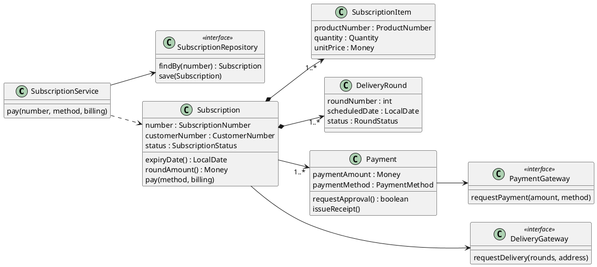

**강사 노트**

- 경계를 넘는 상품·고객은 **번호**로 잇는다(`ProductNumber`·`CustomerNumber`).
- 이름은 실습 2의 용어집과 그 보완이 원천이다. 이 실습에서 새로 생긴 설계 용어(`SubscriptionService` 등)는 설계 보완 (안)에서 용어집에 더한다.
- 만료일과 회차 금액은 필드가 아니라 계산 메서드다 — 만료일 = 첫 배송일 + 기간 − 1일, 회차 금액 = Σ(단가 × 수량).
- 정기배송의 첫 배송일 `firstDeliveryDate`·기간 `term`·배송 주기 `deliveryCycle`·배송지 `shippingAddress`와 영수증·enum·값 타입·연동은 읽기 쉽도록 생략했다. 결제 시스템·배송 시스템 인터페이스는 각각 결제·정기배송 패키지에 있다(실습 5).
- `requestPayment`·`requestDelivery`는 모두 접수 결과(`boolean`)를 돌려주는 동기 요청이다. 도식에서는 반환형을 생략했다.
- 결제가 1..*인 이유는 월별 청구다(R6). 월별 청구의 실행 주체는 결제 시스템이므로 이 설계는 청구 요청까지만 다룬다.

---

## 36. 설계 시퀀스 다이어그램 (안)

시스템 이벤트 **결제한다**를 정기배송 서비스가 받아 **정기배송에 맡긴다**. 확정은 상태 기계의 가드대로 **배송 요청이 접수된 뒤**다.

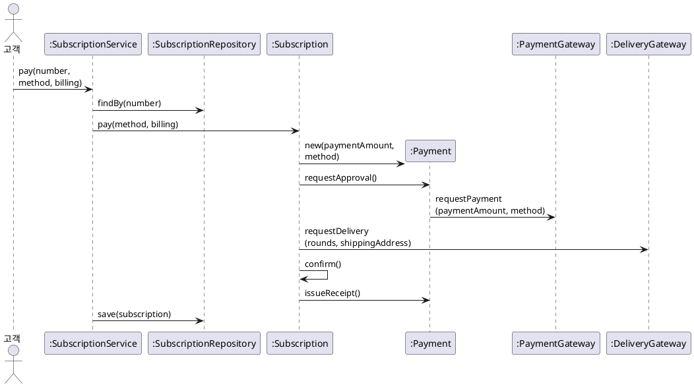

**강사 노트**

- 시스템 이벤트 "결제한다"는 `pay`이고, **정기배송 번호**(`SubscriptionNumber`)가 더해졌다. 신청 중인 정기배송을 찾기 위한 설계의 입력이다.
- 확정은 배송 요청이 **접수된 뒤**다. 상태 기계의 가드 [배송 요청 성공]을 판단하려면 접수 결과를 기다려야 한다 — 배송 요청의 접수는 동기, 회차별 배송은 비동기다. 이 발견은 보완 (안)에 적는다.
- 결제 거절·배송 요청 실패(6a·7a)는 정기배송이 상태를 바꾸지 않거나 신청 실패로 전이한다. 그리지 않았다.

---

## 37. 설계 보완 (안)

설계하며 발견한 것은 **후속 작업에 영향을 미치는 경우에만** 이전 산출물에 반영한다.

- **동적 모델**(실습 4)
  - **배송 요청의 접수** — 배송 요청은 접수 결과를 기다린다(동기). 회차별 배송은 비동기 통보로 온다. 가드 [배송 요청 성공]의 근거다.
  - **순서** — 확정은 배송 요청 접수 뒤, 영수증 발행은 확정 뒤다.
- **유스케이스 명세서**(실습 2)
  - **7단계** — "배송을 요청하고, 접수되면 정기배송을 확정한다"로 순서를 밝힌다.
- **패키지 다이어그램**(실습 5)
  - **설계 요소** — 정기배송 서비스·저장소는 `subscription` 패키지에 둔다.
- **용어집**(실습 2)
  - **설계 용어** — 정기배송 서비스 `SubscriptionService`, 정기배송 저장소 `SubscriptionRepository`, 정기배송 번호 `SubscriptionNumber`
  - **동작** — 결제한다 `pay`, 승인을 요청한다 `requestApproval`, 배송을 요청한다 `requestDelivery`, 영수증을 발행한다 `issueReceipt`
- **※ 현행화 기준**
  - **반영** — 배송 요청의 접수, 확정의 순서, 용어집의 새 용어. 책임·계약 설계의 입력이 된다.
  - **기록만** — 명세서 7단계의 문구, 패키지 다이어그램의 설계 요소.

**강사 노트**

- 상품 번호·고객 번호로 잇는 것은 **설계 결정**이다. 도메인 모델(실습 3)에는 되돌리지 않는다. 설계 용어는 도메인 모델이 아니라 용어집에 더한다.
- 설계가 동적 모델의 동기·비동기 판단을 다시 연 사례다. 분석이 틀린 것이 아니라, 설계가 **가드를 판단할 정보**가 필요하다는 것을 드러낸 것이다.

---

## 38. 요약

이 세션은 분석 모델의 **의미를 보존**하면서 책임·경계·협력으로 **초기 설계**를 만들었다.

### 분석에서 설계로의 핵심

- **판단** — 의미는 보존하고 형태는 책임·경계·협력으로 다시 결정한다
- **대응** — 1:1이 아니다. 나뉘고, 합쳐지고, 설계에만 있는 요소가 생긴다
- **의미 보존** — 용어·값·규칙·다중성·계약·사건의 순서를 테스트로 확인한다
- **설계의 이름** — 분석은 한글 용어, 설계는 용어집의 영문명. 새 설계 용어는 용어집에 먼저
- **초기 설계** — 시스템 이벤트를 받는 객체, 메시지에서 책임, 구조적 제약 안의 위치
- **되돌림** — 업무 의미는 분석 산출물로, 설계 결정은 설계에 남긴다
- **잘못된 관행** — 기계적 변환, 데이터만 옮기기, 분석과 단절, 기술 먼저

### 다음 세션

- "**07. 책임·협력·계약**" — 객체의 책임과 협력을 정제하고 계약으로 행위의 조건과 보장을 검증한다.

**강사 노트**

- 이 세션의 초기 설계(「25. 설계 클래스 다이어그램」)와 남긴 질문(「27. 초기 설계의 한계」)이 다음 세션의 입력이다.
