--------------------
Session 명: 07. 책임·협력·계약
--------------------

## 목차

01. 세션 목표
02. 초기 설계에서 정제로
03. 책임 중심 설계
04. 책임·역할·협력·계약
05. 아는 책임과 하는 책임
06. 책임 후보
07. GRASP
08. 책임 배치 기준
09. CRC 카드
10. 주문 취소 CRC
11. 메시지와 협력
12. 묻기와 시키기
13. 정보 은닉
14. 응집도
15. 결합도
16. SOLID와 클래스
17. SRP
18. SRP 적용
19. ISP
20. ISP 적용
21. DIP
22. DIP 적용
23. LSP
24. LSP 적용
25. 계약
26. 사전·사후조건과 불변 조건
27. 시스템 계약과 객체 계약
28. 주문 취소의 계약
29. 불변 조건
30. 계약과 상속
31. 계약과 분업
32. 계약에서 테스트로
33. 정제된 협력
34. 정제된 설계 클래스 다이어그램
35. 계약과 코드
36. 설계 원칙과 코드
37. 계약 테스트
38. 잘못된 관행 — 빈약한 도메인 모델
39. 잘못된 관행 — 만능 서비스
40. 잘못된 관행 — 묻고 또 묻기
41. 잘못된 관행 — 원칙 과잉
42. 잘못된 관행 — 계약 없는 방어
43. 적정 객체 설계
44. 실습 — 책임·협력·계약
45. CRC (안)
46. 계약 (안)
47. 정제된 설계 클래스 다이어그램 (안)
48. 책임·계약 보완 (안)
49. 요약

## 01. 세션 목표

이 세션은 초기 설계의 **책임과 협력**을 정제하고, **계약**으로 행위의 조건과 보장을 명시·검증한다.

- 책임 중심 설계(RDD)와 **GRASP**로 책임 후보를 찾고, 정보와 경계를 기준으로 **배치**한다.
- CRC 카드와 메시지로 **협력**을 설계하고, 응집도·결합도·정보 은닉으로 검토한다.
- 클래스 설계 원칙 **SRP·ISP·DIP·LSP**를 주문 사례에 적용한다.
- **사전조건·사후조건·불변 조건**으로 객체 계약을 명시하고, 시스템 계약과 구분한다.
- 계약을 **코드와 테스트**로 옮기고, 계약과 상속·분업의 관계를 설명한다.
- 빈약한 도메인 모델·만능 서비스 같은 **잘못된 관행**을 식별한다.

**강사 노트**

- 입력은 "06. 분석 모델에서 설계 모델로"의 초기 설계다. 변경 압력에 따른 변이(OCP·GRASP의 변화 대응 원칙)는 "08. 변화 대응과 변이 설계"에서 다룬다.

---

## 02. 초기 설계에서 정제로

초기 설계는 책임을 **한 번 배치**했을 뿐이다. 이 세션은 그 배치를 **비교하고 정제**하며, 협력의 조건을 **계약**으로 명시한다.

| 초기 설계가 남긴 질문 | 이 세션의 답 |
|---|---|
| **책임 배치의 근거** — 다른 배치와 비교하면? | 책임 후보·배치 기준·CRC |
| **협력의 품질** — 응집·결합은 적절한가? | 메시지, 정보 은닉, 응집도·결합도 |
| **클래스의 의존** — 변경이 어디로 번지는가? | SRP·ISP·DIP·LSP |
| **객체 계약** — 무엇을 요구하고 무엇을 보장하는가? | 사전·사후조건, 불변 조건 |

**강사 노트**

- 질문의 출처는 "06. 분석 모델에서 설계 모델로"의 「27. 초기 설계의 한계」다. 변경 압력과 대안 평가는 "08. 변화 대응과 변이 설계"·"09. 설계 대안 평가"로 넘긴다.
- 설계 도식과 코드는 용어집의 영문명을 쓴다("05. 구조적 경계와 의존성"의 「06. 설계의 이름」).

---

## 03. 책임 중심 설계

객체 설계의 핵심은 데이터를 나누는 것이 아니라, 데이터와 규칙을 아는 객체에 **책임**을 두고 **메시지**와 **계약**으로 협력을 만드는 것이다.

**인용문**

"객체지향 개발의 결정적인 능력은 소프트웨어 **객체**에 **책임을 능숙하게 배정**하는 것이다", "A critical ability in OO development is to skillfully assign responsibilities to software objects.", [Larman 2004]

- **책임 주도 설계**(Responsibility-Driven Design, RDD)는 조직이 구성원에게 **R&R**(역할과 책임)을 맡기듯 객체에게 책임을 맡긴다.
- 업무는 방법이 아니라 **무엇**을 요청하고(메시지), 서로의 조건과 결과를 **약속**한다(계약).

**인용문**

"GRASP는 General Responsibility Assignment Software Patterns의 약자다. 객체지향 소프트웨어를 잘 설계하려면 이 원칙들을 **잡는(grasp) 것**이 중요하다는 뜻으로 지은 이름이다", "GRASP stands for General Responsibility Assignment Software Patterns. The name was chosen to suggest the importance of grasping these principles to successfully design object-oriented software.", [Larman 2004]

- **GRASP**는 책임을 어디에 둘지 판단하는 **아홉 원칙**이다 — 「07. GRASP」.

**강사 노트**

- 인용 근거: Craig Larman, *Applying UML and Patterns*, 3rd ed.(2004), §1.2 "The Most Important Learning Goal?"(책임 배정)와 §17.9 "Applying GRASP to Object Design"(GRASP) 원문 확인. 17장 도입부는 GRASP를 객체 설계의 추론을 체계적이고 합리적이며 설명 가능하게(methodical, rational, explainable) 하도록 돕는 학습 도구(learning aid)라고 소개한다. 같은 곳은 책임 배정이 다이어그램을 그리든 코드를 쓰든 반드시 일어나는 일이며, 소프트웨어의 견고성·유지보수성·재사용성에 강하게 영향을 준다고 설명한다.
- R&R 비유의 한계 — 객체는 스스로 판단하지 않는다. 사람의 약속은 협상할 수 있지만 객체가 계약을 어기면 결함이다. 비유는 책임을 **맡긴다**는 관점을 잡는 데까지만 쓴다.
- 데이터를 가볍게 보라는 뜻이 아니다. 책임은 대개 그 데이터와 규칙을 **아는** 객체에 놓인다(「08. 책임 배치 기준」).

---

## 04. 책임·역할·협력·계약

RDD는 네 개념으로 객체 설계를 설명한다. 객체는 **역할**을 맡고, 역할은 **책임**의 묶음이며, 객체들은 **협력**하고 그 조건을 **계약**으로 정한다.

**인용문**

"책임은 **작업을 수행하거나 정보를 알** 의무다", "a responsibility = an obligation to perform a task or know information", [Wirfs-Brock 2006]

| 개념 | 뜻 | 주문 사례 |
|---|---|---|
| **책임** | 수행하거나 알아야 할 의무 | `Order` — 취소를 판단한다, 상태를 안다 |
| **역할** | 관련된 책임의 묶음 | 통보를 받는 쪽 — `OrderNotice` |
| **협력** | 객체·역할 사이의 상호작용 | `Order` → `Delivery` → `DeliveryGateway` |
| **계약** | 협력 조건에 대한 합의 | 결제 완료일 때만 취소를 받는다 |

**강사 노트**

- 인용 근거: Rebecca Wirfs-Brock, [A Brief Tour of Responsibility-Driven Design](https://www.wirfs-brock.com/PDFs/A_Brief-Tour-of-RDD.pdf)(Wirfs-Brock Associates, 강연 자료, 2006), "Responsibility-Driven Design Constructs" 쪽 원문 확인. 같은 쪽이 역할(관련된 책임의 묶음), 협력(객체·역할의 상호작용), 계약(협력 조건을 정한 합의)을 정의한다. 책 *Object Design: Roles, Responsibilities, and Collaborations*(Wirfs-Brock·McKean, 2003)의 본문은 확인하지 못해 강연 자료를 출처로 쓴다.
- 역할은 인터페이스로 드러나는 경우가 많다. 한 객체가 여러 역할을 맡을 수 있다 — `OrderService`는 시스템 이벤트를 받는 역할과 통보를 받는 역할을 함께 맡는다(「20. ISP 적용」).

---

## 05. 아는 책임과 하는 책임

책임은 **아는 것**(knowing)과 **하는 것**(doing)으로 나뉜다. 아는 책임은 대개 하는 책임의 **근거**다.

| 객체 | 아는 책임 | 하는 책임 |
|---|---|---|
| **`Order`** | 상태, 주문 항목, 결제·배송 | 취소 판단, 상태 전이, 주문 총액 계산 |
| **`OrderItem`** | 상품 번호, 수량, 단가 | 항목 금액 계산 |
| **`Payment`** | 결제 금액 | 환불 생성과 요청 |
| **`Delivery`** | 배송 번호 | 출고 중단 요청 |

- 하는 책임은 **아는 것을 가진 객체**에 둔다. 총액은 항목을 아는 `Order`가, 항목 금액은 단가를 아는 `OrderItem`이 계산한다.

**강사 노트**

- 아는 책임이 곧 공개 getter라는 뜻은 아니다. 알아야 할 것을 밖에 내주지 않고 스스로 쓰는 것이 좋은 책임이다(「12. 묻기와 시키기」).
- 표의 책임은 "06. 분석 모델에서 설계 모델로"의 「22. 메시지에서 책임으로」를 정제한 것이다.

---

## 06. 책임 후보

책임 후보는 새로 지어내지 않는다. 앞 세션들의 **산출물**에 이미 있다.

| 출처 | 찾는 책임 | 주문 사례 |
|---|---|---|
| **시스템 오퍼레이션 계약** | 시스템이 보장할 결과 | 취소 처리 중, 출고 중단·환불 요청 |
| **분석 시퀀스의 메시지** | 받는 객체의 하는 책임 | 취소한다, 출고 중단을 요청한다 |
| **상태 기계** | 전이와 가드를 지킬 책임 | 결제 완료에서만 취소 |
| **속성 도메인·불변 조건** | 값을 지킬 책임 | 수량 ≥ 1, 환불 ≤ 결제 |
| **용어집** | 책임의 이름 | `cancel`, `requestRefund` |

**강사 노트**

- 출처는 차례로 "02. 요구 분석과 유스케이스"의 계약, "04. 동적 모델 — 상호작용과 상태"의 시퀀스·상태 기계, "03. 정적 모델 — 도메인 개념과 관계"의 속성 도메인, 용어집이다.
- 후보를 모은 뒤 **배치**를 결정한다. 후보를 찾는 일과 어디에 둘지 정하는 일은 다른 판단이다.

---

## 07. GRASP

**GRASP**는 책임 배정의 **아홉 원칙**이다. 이 세션은 책임 배치의 기본 다섯을, "08. 변화 대응과 변이 설계"는 변화 대응의 넷을 다룬다.

| 원칙 | 원문 이름 | 해법 | 주문 사례 |
|---|---|---|---|
| **정보 전문가** | Information Expert | 정보를 가진 클래스에 | `Order`가 취소 판단 |
| **생성자** | Creator | 포함하거나 초기 정보를 가진 쪽이 | `Payment` → `Refund` |
| **컨트롤러** | Controller | 시스템 오퍼레이션을 대표 객체가 | `OrderService` |
| **높은 응집도** | High Cohesion | 응집도가 높게 | 「14. 응집도」 |
| **낮은 결합도** | Low Coupling | 결합도가 낮게 | 「15. 결합도」 |

**강사 노트**

- 근거: Craig Larman, *Applying UML and Patterns*, 3rd ed.(2004), §17.9 "Applying GRASP to Object Design"~§17.14 원문 확인. 해법 열은 각 원칙의 Solution을 줄여 옮긴 것이다(요약).
- 생성자의 해법은 조건 목록이다 — B가 A를 포함하거나(합성), 기록하거나, 가까이 쓰거나, A의 초기화 정보를 가지면 B가 A를 만든다(많이 해당할수록 좋다). 결제 금액을 가진 `Payment`가 `Refund`를 만든다.
- 이 세션의 코드에서 `OrderItem`은 정적 메서드 `confirm`으로 만들어 `Order`에 넘긴다. 합성 관계만 보면 `Order`가 만드는 설계도 가능하다 — 두 대안의 비교는 "09. 설계 대안 평가"의 연습 거리다.
- 다형성·순수 가공·간접화·보호된 변이는 "08. 변화 대응과 변이 설계"에서 다룬다.

---

## 08. 책임 배치 기준

책임은 **정보를 가진 객체**에 먼저 둔다. 그다음 **경계**와 **변경 이유**로 확인한다.

1. **정보** — 책임에 필요한 정보를 가장 많이 아는 객체는 누구인가?
2. **경계** — 구조적 제약(방향·약속의 소유·상태의 소유)을 지키는가?
3. **변경 이유** — 그 객체가 같은 이유로 바뀌는 책임만 갖는가?
4. **협력** — 배치 뒤 메시지가 연관을 따라 짧게 흐르는가?

- 취소 판단은 상태·결제·배송을 아는 **`Order`**, 환불 규칙은 결제 금액을 아는 **`Payment`**에 둔다.

**강사 노트**

- 첫 기준이 GRASP의 **정보 전문가**(Information Expert)다(「07. GRASP」). 정보 전문가의 해법 원문은 "Assign a responsibility to the information expert—the class that has the information necessary to fulfill the responsibility."다(Larman, 3rd ed., §17.11).
- 경계 기준은 "05. 구조적 경계와 의존성"의 「18. 구조적 제약」, 변경 이유는 「17. SRP」로 이어진다.

---

## 09. CRC 카드

**CRC 카드**는 클래스(Class)의 **책임**(Responsibility)과 **협력자**(Collaborator)를 카드 한 장에 적어, 제어가 객체들에 **나뉘는** 설계를 연습하는 도구다.

**인용문**

"객체지향을 가르칠 때 가장 어려운 문제는 학습자가 절차적 프로그램에서 가능한 **제어의 전역적 지식**을 버리게 하는 것이다", "The most difficult problem in teaching object-oriented programming is getting the learner to give up the global knowledge of control that is possible with procedural programs", [Beck·Cunningham 1989]

| 칸 | 적는 것 | 쓰는 법 |
|---|---|---|
| **클래스** | 이름 | 용어집의 이름으로 |
| **책임** | 짧은 동사구 | 아는 것과 하는 것 |
| **협력자** | 책임을 위해 메시지를 주고받는 객체 | 협력은 대칭이 아닐 수 있다 |

**강사 노트**

- 인용 근거: Kent Beck·Ward Cunningham, ["A Laboratory For Teaching Object-Oriented Thinking"](http://c2.com/doc/oopsla89/paper.html), OOPSLA'89 Conference Proceedings, 1989 원문 확인. 같은 논문은 책임을 짧은 동사구로 쓰고, 협력자를 책임을 수행하며 메시지를 주고받는 객체로 설명한다.
- 카드를 들고 시나리오를 따라가며 "이 메시지를 누가 받는가?"를 묻는다. 한 카드에 책임이 넘치면 나누고, 협력자가 너무 많으면 배치를 다시 본다.

---

## 10. 주문 취소 CRC

시스템 이벤트 **주문을 취소한다**에 참여하는 네 클래스의 CRC다. 제어는 한 곳에 모이지 않고 **책임을 가진 객체**로 흩어진다.

| 클래스 | 책임 | 협력자 |
|---|---|---|
| **`OrderService`** | 주문을 찾고 맡기고 저장한다 | `OrderRepository`, `Order` |
| **`Order`** | 취소를 판단하고 상태를 바꾼다 | `Delivery`, `Payment` |
| **`Delivery`** | 출고 중단을 요청한다 | `DeliveryGateway` |
| **`Payment`** | 환불을 만들고 요청한다 | `Refund`, `PaymentGateway` |

- `OrderService`는 취소의 규칙을 모른다. **판단**은 `Order`가, **요청**은 `Delivery`·`Payment`가 한다.

**강사 노트**

- "06. 분석 모델에서 설계 모델로"의 「24. 주문 취소 설계 시퀀스」를 카드로 다시 본 것이다. 시퀀스는 순서를, CRC는 책임의 소유를 보인다.
- 실습에서는 카드를 먼저 쓰고 시퀀스로 확인하는 순서도 좋다.

---

## 11. 메시지와 협력

**다이어그램 — 시퀀스 다이어그램**

협력은 **메시지**로 이루어진다. 보내는 쪽은 **무엇**을 원하는지 말하고, **어떻게** 할지는 받는 쪽이 정한다.

**도식 — PlantUML**

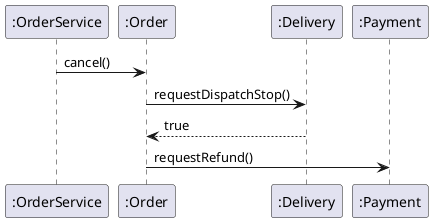

- **순서**를 아는 쪽은 `Order`다. `OrderService`는 `cancel()`만 보낸다.
- `Order`는 `Delivery`에게 출고 중단을 **요청**할 뿐, 배송 시스템의 형식은 모른다.

**강사 노트**

- 반환 화살표는 출고 중단의 결과가 다음 행동을 정하기 때문에 그렸다. 결과가 필요 없는 요청(환불)은 결과를 그리지 않았다.
- 메시지를 받는 객체가 방법을 정하므로, 방법이 바뀌어도 보내는 쪽은 그대로다. 이것이 정보 은닉과 낮은 결합의 출발점이다.

---

## 12. 묻기와 시키기

상태를 **묻고** 밖에서 판단하면 규칙이 호출하는 쪽으로 새어 나간다. 판단을 가진 객체에게 **시킨다**.

| 묻는 설계 | 시키는 설계 |
|---|---|
| `if (order.status() == PAID && delivery.requestDispatchStop())` 를 서비스가 판단 | `order.cancel()` — 판단은 `Order` 안에서 |
| 새 서비스마다 같은 `if`를 복사 | 규칙은 한 곳 |
| 상태가 늘면 모든 호출자를 고친다 | `Order`만 고친다 |

- 묻기가 모두 나쁜 것은 아니다. 화면에 **보여 주기** 위한 조회는 묻는다. 판단과 상태 변경은 **시킨다**.

**강사 노트**

- 이 과정의 설명이다. 같은 생각을 "Tell, Don't Ask"로 부르기도 하지만 출처를 확인하지 않아 인용하지 않는다.
- 묻고 또 묻는 호출이 길게 이어지는 관행은 「40. 잘못된 관행 — 묻고 또 묻기」에서 다룬다.

---

## 13. 정보 은닉

**정보 은닉**은 객체가 **어떻게** 하는지를 감추고 **무엇**을 하는지만 드러내는 것이다. 감춘 결정은 바꿔도 밖에 번지지 않는다.

| 감춘 것 | 드러낸 것 | 바뀌어도 그대로인 쪽 |
|---|---|---|
| 상태 전이의 규칙(`transition`) | `cancel()`, `onDeliveryStarted()` | `OrderService`, 연동 |
| 항목 목록(`List.copyOf`) | `totalAmount()` | 금액을 쓰는 쪽 |
| 환불 규칙(`Refund`는 패키지 내부) | `requestRefund()` | `Order` |
| 외부 요청 형식(`STOP`, `REFUND`) | `DeliveryGateway`, `PaymentGateway` | 업무 클래스 |

**강사 노트**

- 정보 은닉은 "05. 구조적 경계와 의존성"의 「08. 패키지 기준」에서 본 Parnas의 생각(바뀌기 쉬운 결정을 모듈 안에 감춘다)을 클래스 수준에 적용한 것이다.
- `Refund`는 `payment` 패키지 밖에서 보이지 않는다(자바의 패키지 전용 클래스). 가시성이 은닉을 **강제**하는 예다.

---

## 14. 응집도

**인용문**

"응집도는 한 요소의 책임들이 **얼마나 강하게 관련되고 집중되어 있는가**의 척도다", "cohesion … is a measure of how strongly related and focused the responsibilities of an element are.", [Larman 2004]

  - "모듈은 **하나의, 오직 하나의 액터**에 대해서만 책임져야 한다", "A module should be responsible to one, and only one, actor.", [Martin 2018]
  - "**같은 이유로 바뀌는 것은 모으고**, 다른 이유로 바뀌는 것은 나눈다", "Gather together the things that change for the same reasons. Separate those things that change for different reasons.", [Martin 2014]

**페이지 분할**

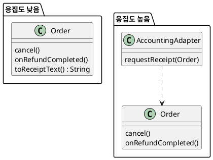

- 왼쪽 `Order`는 두 액터의 요청으로 바뀐다: **주문 운영 담당**(취소 규칙)과 **회계 담당**(영수증 형식).
- 회계 담당의 요청으로 `Order`를 고치면, 상관없는 **취소 규칙**까지 다시 확인해야 한다.
- 오른쪽은 회계 담당의 코드를 `AccountingAdapter`에 모았다. 이제 `Order`는 **한 액터**의 요청으로만 바뀐다.

**강사 노트**

- 인용 근거: Craig Larman, *Applying UML and Patterns*, 3rd ed.(2004), §17.14 "High Cohesion" 원문 확인. 생략한 부분은 "(or more specifically, functional cohesion)"이다. Robert C. Martin, *Clean Architecture*, Ch. 7 "SRP: The Single Responsibility Principle" 원문 확인(판권면 2018) — 같은 곳은 액터를 "그 변경을 요구하는 한 사람 이상의 집단"으로 정의하고 "Cohesion is the force that binds together the code responsible to a single actor."라고 잇는다. Robert C. Martin, ["The Single Responsibility Principle"](https://blog.cleancoder.com/uncle-bob/2014/05/08/SingleReponsibilityPrinciple.html), 2014-05-08 원문 확인.
- 주문 운영 담당과 회계 담당은 교육용 가정이다. 영수증 형식은 회계 시스템의 약속이라 연동에 둔다("05. 구조적 경계와 의존성"의 「10. 요청과 통보」).
- 이 인용은 「17. SRP」와 같은 원문이다. 이 세션을 보완할 때 응집도와 SRP를 한 흐름으로 합친다(과정 설계의 세부 목차).
---

## 15. 결합도

**결합도**는 한 클래스가 다른 클래스를 **얼마나 많이, 얼마나 깊이** 아는가다. 결합이 낮으면 한쪽의 변경이 다른 쪽으로 번지지 않는다.

| 아는 것 | 결합 | 주문 사례 |
|---|---|---|
| **약속(인터페이스)** | 낮다 | `Delivery` → `DeliveryGateway` |
| **공개 메서드** | 보통 | `Order` → `Delivery.requestDispatchStop()` |
| **내부 구조**(필드·순서) | 높다 | 서비스가 주문 상태와 배송을 꺼내 판단 |
| **구체 클래스** | 높다 | 연동 → `OrderService` |

- 넷째 행은 이 세션에서 고친다 — 연동은 `OrderService`가 아니라 통보 약속 **`OrderNotice`**를 안다(「22. DIP 적용」).

**강사 노트**

- 결합도와 응집도는 함께 움직인다. 응집이 높으면 경계를 넘는 메시지가 줄고, 결합도 낮아진다.
- 결합을 없애는 것이 목표가 아니다. 협력하려면 알아야 한다. **덜 바뀌는 것**을 알게 한다.

---

## 16. SOLID와 클래스

SOLID는 클래스와 그 연결을 설계하는 다섯 원칙이다. 이 세션은 **SRP·ISP·DIP·LSP**를 다루고, OCP는 변경 압력과 함께 다룬다.

| 원칙 | 한 줄 요지 | 다루는 곳 |
|---|---|---|
| **SRP** 단일 책임 | 바뀔 이유는 하나 | 이 세션 |
| **OCP** 개방·폐쇄 | 확장에 열리고 변경에 닫힌다 | "08. 변화 대응과 변이 설계" |
| **LSP** 리스코프 치환 | 하위 타입은 상위 타입의 약속을 지킨다 | 이 세션 |
| **ISP** 인터페이스 분리 | 쓰는 것에만 의존한다 | 이 세션 |
| **DIP** 의존 역전 | 추상에 의존한다 | 이 세션 |

**강사 노트**

- SOLID가 클래스(벽돌)를 배치하는 원칙이라면, 패키지 원칙(REP·CCP·CRP·ADP·SDP·SAP)은 컴포넌트(방)를 배치하는 원칙이다. 패키지 원칙은 "05. 구조적 경계와 의존성"의 「15. 패키지 원칙」에서 다뤘다.
- 원칙은 적용 횟수가 아니라 **변경이 덜 번지는가**로 평가한다. 원칙 과잉은 「41. 잘못된 관행 — 원칙 과잉」에서 다룬다.

---

## 17. SRP

**단일 책임 원칙**(Single Responsibility Principle, SRP)은 한 모듈이 **바뀔 이유를 하나**만 가져야 한다는 원칙이다. 바뀔 이유는 그 변경을 요구하는 **사람(액터)**이다.

**인용문**

"각 소프트웨어 모듈은 **바뀔 이유가 하나**, 오직 하나여야 한다", "The Single Responsibility Principle (SRP) states that each software module should have one and only one reason to change.", [Martin 2014]

- 같은 이유로 바뀌는 것은 **모으고**, 다른 이유로 바뀌는 것은 **나눈다**.
- "하나의 일만 한다"가 아니다. 한 **액터**의 요구에만 답한다는 뜻이다.

**강사 노트**

- 인용 근거: Robert C. Martin, ["The Single Responsibility Principle"](https://blog.cleancoder.com/uncle-bob/2014/05/08/SingleReponsibilityPrinciple.html), The Clean Code Blog, 2014-05-08 원문 확인. 같은 글은 "Gather together the things that change for the same reasons. Separate those things that change for different reasons."로 정리하고, "This principle is about people."이라고 말한다 — 변경의 이유는 요구하는 사람들에게서 온다.
- *Clean Architecture*(2017)는 이를 "하나의 액터에 대해서만 책임진다"로 다시 쓴다(국역 송준이 옮김, 인사이트, 2019). 원서 문장은 확인하지 못해 인용하지 않는다.
- "05. 구조적 경계와 의존성"의 CCP(함께 바뀌는 클래스는 함께 둔다)는 SRP를 패키지 수준으로 옮긴 것이다.

---

## 18. SRP 적용

**다이어그램 — 클래스 다이어그램**

주문이 회계 시스템의 형식과 화면 문구까지 만들면 **세 액터**의 요구로 바뀐다. 액터마다 클래스를 나눈다.

**도식 — PlantUML**

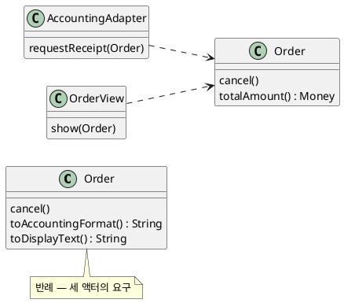

| 메서드 | 바뀌는 이유(액터) | 옮긴 곳 |
|---|---|---|
| **`cancel()`** | 주문 정책(업무 담당) | `Order` |
| **`toAccountingFormat()`** | 회계 시스템의 형식 | `AccountingAdapter` |
| **`toDisplayText()`** | 화면 표현(고객 경험) | `OrderView` |

**강사 노트**

- 왼쪽 `Order`는 반례다(코드에 없음). 회계 형식이 바뀌어도, 화면 문구가 바뀌어도 주문의 취소 규칙까지 다시 확인해야 한다.
- 회계 연동(`AccountingAdapter`)은 "05. 구조적 경계와 의존성"의 연동 경계와 같다 — 외부 형식은 연동 밖으로 나가지 않는다. `OrderView`는 화면 쪽의 설계 요소이며 이 과정의 예제 코드에는 두지 않는다. 두 이름은 용어집에 더했다.
- 이 세션의 예제에서 영수증 발행은 회계 시스템이 소유한다(공통 전제). 주문은 영수증의 형식을 알 필요가 없다.

---

## 19. ISP

**인터페이스 분리 원칙**(Interface Segregation Principle, ISP)은 클라이언트가 **쓰지 않는 메서드에 의존하지 않도록** 인터페이스를 클라이언트별로 나누라는 원칙이다.

**인용문**

"하나의 범용 인터페이스보다 **클라이언트별 인터페이스 여럿**이 낫다", "Many client specific interfaces are better than one general purpose interface", [Martin 2000]

- 쓰지 않는 메서드가 바뀌어도 그 클래스를 쓰는 **모든 클라이언트**가 다시 확인 대상이 된다.
- 인터페이스는 제공하는 쪽이 아니라 **쓰는 쪽**의 필요로 나눈다.

**강사 노트**

- 인용 근거: Robert C. Martin, ["Design Principles and Design Patterns"](https://staff.cs.utu.fi/~jounsmed/doos_06/material/DesignPrinciplesAndPatterns.pdf)(2000), The Interface Segregation Principle 원문 확인. 같은 절은 클라이언트가 여럿인 클래스에 모든 메서드를 싣는 대신 클라이언트마다 인터페이스를 만들라고 설명한다.
- "05. 구조적 경계와 의존성"의 CRP(함께 쓰이지 않는 것은 나눈다)는 ISP를 패키지 수준으로 옮긴 것이다.

---

## 20. ISP 적용

**다이어그램 — 클래스 다이어그램**

`OrderService`의 클라이언트는 둘이다. 고객 쪽은 **취소**를, 연동은 **통보**를 쓴다. 통보 창구를 **`OrderNotice`**로 분리한다.

**도식 — PlantUML**

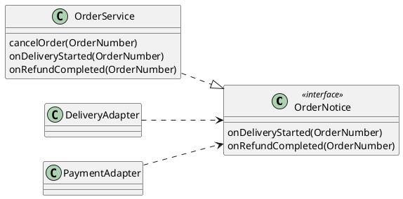

| 클라이언트 | 쓰는 것 | 의존 |
|---|---|---|
| **고객 쪽(화면·API)** | `cancelOrder` | `OrderService` |
| **`DeliveryAdapter`** | `onDeliveryStarted` | `OrderNotice` |
| **`PaymentAdapter`** | `onRefundCompleted` | `OrderNotice` |

**강사 노트**

- 분리 전("06. 분석 모델에서 설계 모델로"의 코드)에는 연동이 `cancelOrder`까지 가진 `OrderService`에 의존했다. 취소 규칙의 변경이 연동의 재확인을 부를 수 있었다.
- 통보를 받는 쪽은 역할이 하나라 두 연동이 한 인터페이스를 쓴다. 두 연동의 필요가 갈라지면 그때 더 나눈다(YAGNI).

---

## 21. DIP

**의존 역전 원칙**(Dependency Inversion Principle, DIP)은 구체 클래스가 아니라 **추상(인터페이스)**에 의존하라는 원칙이다. 세부가 추상에 맞추므로 의존의 방향이 **뒤집힌다**.

**인용문**

"의존 역전은 구체 함수·클래스가 아니라 **인터페이스나 추상 함수·클래스에 의존**하는 전략이다", "Dependency Inversion is the strategy of depending upon interfaces or abstract functions and classes, rather than upon concrete functions and classes.", [Martin 2000]

- **추상**은 덜 바뀐다. 구체 클래스의 세부가 바뀌어도 추상에 의존하는 쪽은 그대로다.
- 추상은 **쓰는 쪽**이 소유한다. `DeliveryGateway`은 `delivery`가, `OrderNotice`는 `order`가 갖는다.

**강사 노트**

- 인용 근거: Martin, "Design Principles and Design Patterns"(2000), The Dependency Inversion Principle 원문 확인. 절의 표어 "Depend upon Abstractions. Do not depend upon concretions."는 "05. 구조적 경계와 의존성"에서 패키지 수준으로 인용했다. 이 세션은 같은 원칙을 클래스 수준에 적용한다.
- 안정된 구체 클래스(`String`, `List`)까지 추상화할 필요는 없다. 바뀌기 쉬운 것에 대한 의존만 뒤집는다.

---

## 22. DIP 적용

**다이어그램 — 패키지 다이어그램**

연동이 구체 클래스 `OrderService`에 의존하던 것을 **`order`가 소유한 추상 `OrderNotice`**에 의존하게 바꾼다. 연동은 주문 서비스의 존재를 모른다.

**도식 — PlantUML**

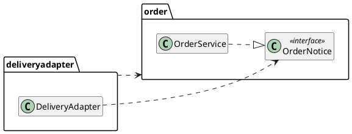

| 구분 | 바뀌기 전 | 바뀐 뒤 |
|---|---|---|
| **연동이 아는 것** | `OrderService`(구체) | `OrderNotice`(추상) |
| **시험** | 저장소까지 준비 | 가짜 `OrderNotice` 하나 |
| **서비스 변경의 파급** | 연동까지 | `order` 안에서 끝 |

**강사 노트**

- 패키지 의존의 방향(`deliveryadapter` → `order`)은 그대로다. 바뀐 것은 **무엇에** 의존하는가 — 구체에서 추상으로.
- 가짜 `OrderNotice`로 연동만 시험하는 코드는 「37. 계약 테스트」에 있다.

---

## 23. LSP

**리스코프 치환 원칙**(Liskov Substitution Principle, LSP)은 하위 타입이 상위 타입을 **대체**할 수 있어야 한다는 원칙이다. 상위 타입의 **계약**을 믿는 클라이언트가 하위 타입을 받아도 올바르게 동작해야 한다.

**인용문**

"하위 클래스는 **상위 클래스를 대체**할 수 있어야 한다", "Subclasses should be substitutable for their base classes.", [Martin 2000]

- 인터페이스의 **구현**도 같다. `PaymentGateway`을 믿는 `Payment`는 어느 구현을 받아도 같은 약속을 기대한다.
- 대체 가능성은 이름이나 메서드 모양이 아니라 **계약**으로 판단한다.

**강사 노트**

- 인용 근거: Martin, "Design Principles and Design Patterns"(2000), The Liskov Substitution Principle 원문 확인. 같은 절은 이 원칙이 Barbara Liskov의 데이터 추상·타입 이론 연구에서 나왔고, Bertrand Meyer의 계약에 의한 설계(Design by Contract)에서도 유래한다고 밝힌다. Liskov의 원 논문은 확인하지 못해 인용하지 않는다.
- LSP 위반은 숨은 OCP 위반이 된다 — 새 하위 타입마다 클라이언트가 `if`로 구분해야 하기 때문이다(같은 절). OCP는 "08. 변화 대응과 변이 설계"에서 다룬다.

---

## 24. LSP 적용

**다이어그램 — 클래스 다이어그램**

`PaymentGateway`의 약속은 "결제된 금액이면 **언제든** 환불을 요청할 수 있다"이다. 7일이 지나면 거절하는 구현은 사전조건을 **강화**해 약속을 깬다.

**도식 — PlantUML**

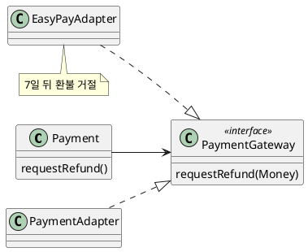

| 구현 | 사전조건 | 대체 가능 |
|---|---|---|
| **`PaymentAdapter`** | 결제된 금액 | 예 |
| **테스트의 가짜 구현** | 결제된 금액(요청을 기록) | 예 |
| **`EasyPayAdapter`** | 결제된 금액 + 결제 후 7일 이내 | 아니다 — 사전조건 강화 |

**강사 노트**

- 7일 규칙과 `EasyPayAdapter`는 **교육용 반례**다(코드에 없음). 간편결제의 실제 환불 조건은 결제 시스템의 계약으로 확인한다.
- 이런 제약이 실제로 있다면 숨기지 않고 **약속 자체를 고친다** — 환불 요청이 거절될 수 있음을 `PaymentGateway`의 계약에 드러내고, `Payment`와 `Order`가 거절을 처리하게 한다. 그것은 요구의 변경이다.
- 테스트의 가짜 구현이 대체 가능한 것도 LSP 덕분이다. 가짜가 약속을 지키지 않으면 테스트가 실제와 다른 것을 검증한다.

---

## 25. 계약

**계약**은 협력하는 두 객체가 서로에게 지는 **의무**와 얻는 **이익**을 명시한 합의다. 호출하는 쪽(클라이언트)과 호출받는 쪽(공급자)은 각각 의무를 지고 이익을 얻는다.

**인용문**

"각 당사자는 계약에서 **이익**을 기대하고, 그것을 얻기 위해 **의무**를 질 준비가 되어 있다", "Each party expects some benefits from the contract and is prepared to incur some obligations to obtain them.", [Meyer 1992]

| `Order.cancel()` | 의무 | 이익 |
|---|---|---|
| **클라이언트** `OrderService` | 결제된 주문에 취소를 요청한다 | 취소 처리 중과 출고 중단·환불 요청을 얻는다 |
| **공급자** `Order` | 출고 중단 → 환불을 요청하고 상태를 바꾼다 | 결제된 주문만 받으면 된다 |

**강사 노트**

- 인용 근거: Bertrand Meyer, ["Applying Design by Contract"](https://se.inf.ethz.ch/~meyer/publications/computer/contract.pdf), *IEEE Computer* 25(10), 1992, "The notion of contract" 원문 확인. 같은 논문의 표 2는 루틴 하나의 계약을 당사자(클라이언트·공급자) × 의무·이익으로 적는다. 위 표는 그 형식을 주문 사례에 적용한 것이다.
- 한쪽의 의무는 다른 쪽의 이익이다. 클라이언트의 의무(사전조건)가 공급자의 이익이 되고, 공급자의 의무(사후조건)가 클라이언트의 이익이 된다.

---

## 26. 사전·사후조건과 불변 조건

계약은 세 가지 **단언**(assertion)으로 쓴다. 사전·사후조건은 **메서드 하나**에, 불변 조건은 클래스의 **모든 메서드**에 적용된다.

**인용문**

"사전조건과 사후조건은 **개별 루틴**에 적용되고, 클래스 불변 조건은 그 클래스의 **모든 루틴**을 제약한다", "Some assertions, called preconditions and postconditions, apply to individual routines. Others, the class invariants, constrain all the routines of a given class", [Meyer 1992]

| 단언 | 뜻 | 주문 사례 |
|---|---|---|
| **사전조건** | 호출이 올바르려면 참이어야 할 것 | `cancel()` — 상태가 `PAID` |
| **사후조건** | 호출이 끝난 뒤 보장되는 것 | `cancel()` — 상태가 `CANCELLING` |
| **불변 조건** | 모든 공개 메서드 앞뒤로 참인 것 | 주문 항목은 1개 이상 |

**강사 노트**

- 인용 근거: Meyer, 1992, "Assertions: Contracting for software"(p.42) 원문 확인. 스캔본의 문장부호는 원문 이미지로 확인했다. 같은 쪽은 사전조건을 "모든 호출이 올바르려면 만족해야 할 요구", 사후조건을 "호출의 실행이 그 대가로 보장하는 성질"로 설명한다.
- 불변 조건은 **공개 메서드 사이**에서 참이면 된다. 메서드 안에서 잠시 깨졌다가 끝날 때 복원되는 것은 허용된다.

---

## 27. 시스템 계약과 객체 계약

**시스템 계약**은 시스템 경계에서 외부에 보장하는 결과이고, **객체 계약**은 객체 하나가 협력자에게 보장하는 결과다. 여러 객체 계약이 모여 시스템 계약을 **충족**한다.

| 구분 | 시스템 계약 | 객체 계약 |
|---|---|---|
| **대상** | 시스템 오퍼레이션 `주문을 취소한다` | 메서드 `Order.cancel()` |
| **당사자** | 액터 ↔ 주문 시스템 | `OrderService` ↔ `Order` |
| **표현** | 업무 용어(요청했다) | 설계 용어(상태 값, 메서드) |
| **정한 곳** | "02. 요구 분석과 유스케이스" | 이 세션 |

- 같은 "계약"이라도 **수준**이 다르다. 시스템 계약을 바꾸지 않고 객체 계약을 다시 나눌 수 있다.

**강사 노트**

- 시스템 계약의 원천은 "02. 요구 분석과 유스케이스"의 「45. 시스템 오퍼레이션과 계약」과 "04. 동적 모델 — 상호작용과 상태"의 「10. 계약의 정제」다. 과정 설계는 두 계약을 구분하라고 정했다.
- "06. 분석 모델에서 설계 모델로"의 「13. 계약에서 메서드로」가 시스템 계약을 어느 객체들이 나누어 지키는지를 정했다. 이 세션은 그 객체들의 계약을 쓴다.

---

## 28. 주문 취소의 계약

`Order.cancel()`의 계약을 쓴다. 사후조건의 외부 결과는 시스템 계약처럼 **요청했다**로 쓴다.

| 단언 | 내용 |
|---|---|
| **사전조건** | 상태가 `PAID`이다 |
| | 배송 시스템이 출고 중단을 수락한다 |
| **사후조건** | 상태가 `CANCELLING`이다 |
| | 출고 중단을 요청했다 |
| | 환불을 결제 금액만큼 요청했다(출고 중단 뒤) |
| **실패** | 사전조건이 거짓이면 거절하고 상태를 바꾸지 않는다 |

**강사 노트**

- 둘째 사전조건(출고 중단 수락)은 호출하는 쪽이 미리 알 수 없다. 그래서 공급자 `Order`가 검사하고, 거짓이면 거절한다(「31. 계약과 분업」).
- "전액 환불"은 공통 전제의 교육용 가정이다. 부분 취소는 이 계약의 범위 밖이다.

---

## 29. 불변 조건

**다이어그램 — 클래스 다이어그램**

불변 조건은 **객체가 만들어질 때** 세우고, 상태를 바꾸는 **모든 메서드**가 지킨다. 지킬 곳을 한 곳으로 모으면 깨질 곳도 줄어든다.

**도식 — PlantUML**

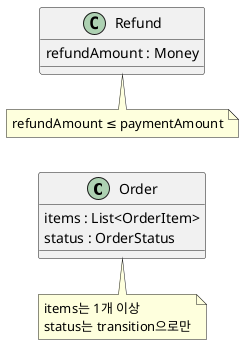

```java
// 불변 조건: 환불 금액은 결제 금액을 넘지 않는다.
final class Refund {
    private final Money refundAmount;

    Refund(Money refundAmount, Money paymentAmount) {
        if (refundAmount.won() > paymentAmount.won())
            throw new IllegalArgumentException("환불 금액 ≤ 결제 금액");
        this.refundAmount = refundAmount;
    }
    // ... 요청 생략
}
```

**강사 노트**

- `Refund`는 필드를 `final`로 두어 만든 뒤 바뀌지 않는다. 생성자 한 곳만 지키면 된다.
- `Order`의 상태는 `transition` 한 곳에서만 바뀌고, 항목 목록은 복사해 밖에서 바꿀 수 없다. 불변 조건을 지킬 곳이 두 군데로 줄었다.
- 불변 조건의 출처는 "03. 정적 모델 — 도메인 개념과 관계"의 다중성과 속성 수준 업무 규칙이다.

---

## 30. 계약과 상속

하위 타입이 상위 타입의 계약을 바꿀 때는 **방향**이 정해져 있다. 사전조건은 **약하게**, 사후조건은 **강하게**만 바꿀 수 있다.

| 변경 | 클라이언트에게 | 허용 |
|---|---|---|
| **사전조건 강화** | 올바른 호출이 거절된다 | 아니다 |
| **사후조건 약화** | 약속한 결과를 받지 못한다 | 아니다 |
| **사전조건 약화** | 더 많은 호출을 받는다 | 예 |
| **사후조건 강화** | 더 좋은 결과를 받는다 | 예 |
| **불변 조건** | 상위 타입의 불변 조건을 물려받는다 | 지켜야 한다 |

**강사 노트**

- 근거: Meyer, 1992, "Inheritance and assertions"(하도급, subcontracting) 원문 확인. 하위 타입은 원래 계약의 사전조건을 강화하거나 사후조건을 약화해서는 안 되고, 반대 방향은 허용된다. 불변 조건은 하위 타입에 항상 전달된다고 설명한다.
- 이 표가 「23. LSP」의 판단 기준이다 — `EasyPayAdapter`는 첫 행을 어겼다(「24. LSP 적용」).

---

## 31. 계약과 분업

계약은 검사의 **분업**이다. 같은 조건을 클라이언트와 공급자가 **둘 다** 검사하지 않고, 계약이 **한쪽**에 맡긴다.

| 조건 | 검사하는 쪽 | 이유 |
|---|---|---|
| **상태가 `PAID`** | `Order` | 상태를 아는 쪽 |
| **출고 중단 수락** | `Order`(결과로 판단) | 호출 전에는 알 수 없다 |
| **수량 ≥ 1** | `Quantity` 생성자 | 값이 만들어질 때 한 번 |
| **주문 번호로 찾기** | `OrderService` | 찾는 책임을 가진 쪽 |

- `OrderService`는 상태를 **다시** 검사하지 않는다. 검사가 두 곳에 있으면 규칙이 바뀔 때 한 곳만 고치게 된다.

**강사 노트**

- 근거: Meyer, 1992, "Defensive programming revisited" 원문 확인. 가능한 한 많은 중복 검사를 권하는 방어적 프로그래밍과 달리, 계약은 각 일관성 조건의 책임을 한쪽에 명확히 맡겨 중복 검사를 없앤다. 조건은 사전조건에 두거나 본문의 `if`에 두되 둘 다에 두지 않는다고 하며, 비정상 값을 누가 다룰지는 **분업**의 실용적 결정이고 가장 단순한 구조를 만드는 쪽이 좋다고 말한다.
- 이 예제는 사전조건을 공급자 `Order`가 검사해 거절한다(예외). 호출하는 쪽이 미리 확인하게 하는 설계도 가능하며, 어느 쪽이든 **한 곳**이다.
- 외부에서 들어오는 값(화면 입력, 외부 통보)은 신뢰할 수 없으므로 경계에서 검사한다. 계약은 **시스템 안의** 분업이다.

---

## 32. 계약에서 테스트로

계약의 각 단언은 **테스트 하나**가 된다. 사전조건은 거절을, 사후조건은 결과를, 불변 조건은 생성의 거절을 확인한다.

| 단언 | 테스트 | 기대 |
|---|---|---|
| **사전조건** — 상태 `PAID` | 결제 전 주문의 취소 | 거절, 요청 없음 |
| **사전조건** — 출고 중단 수락 | 출고된 주문의 취소 | 거절, 환불 요청 없음, 상태 그대로 |
| **사후조건** | 결제된 주문의 취소 | `CANCELLING`, 출고 중단 → 환불 |
| **불변 조건** | 빈 주문·수량 0·음수 금액 | 생성 거절 |

**강사 노트**

- 거절 테스트는 "상태가 그대로인가, 외부에 요청하지 않았는가"까지 본다. 거절했는데 환불을 이미 요청했다면 계약 위반이다.
- 테스트의 이름과 주석은 계약의 단언과 같은 말로 쓴다. 계약이 바뀌면 어느 테스트를 고칠지 바로 보인다.

---

## 33. 정제된 협력

**다이어그램 — 시퀀스 다이어그램**

정제된 설계에서 통보는 연동 → **`OrderNotice`** → 주문으로 흐른다. 연동은 통보 약속만 알고, 누가 실현하는지는 모른다.

**도식 — PlantUML**

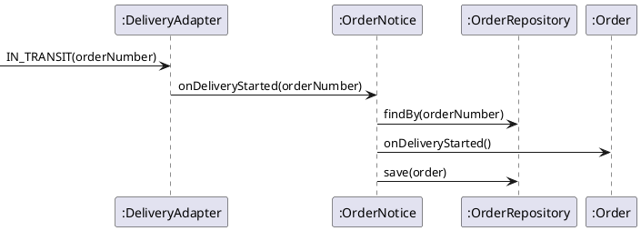

| 변화 | "06. 분석 모델에서 설계 모델로" | 이 세션 |
|---|---|---|
| **연동이 부르는 것** | `OrderService`(구체) | `OrderNotice`(추상) |
| **취소의 계약** | 성공 경로만 | 사전·사후조건과 거절 |

**강사 노트**

- `:OrderNotice` 생명선은 역할이다. 실행 시에는 `OrderService`가 그 역할을 맡는다. 시퀀스 다이어그램은 역할로 그려 연동이 구체 클래스를 모른다는 것을 보인다.
- 취소 흐름의 메시지와 순서는 "06. 분석 모델에서 설계 모델로"와 같다. 이 세션은 순서를 바꾸지 않고 계약과 의존만 정제했다.

---

## 34. 정제된 설계 클래스 다이어그램

정제된 설계는 **역할(인터페이스)**과 **계약**을 더했다. 연동은 `OrderNotice`에, 업무 클래스는 `DeliveryGateway`·`PaymentGateway`에 의존한다.

**도식 — PlantUML**

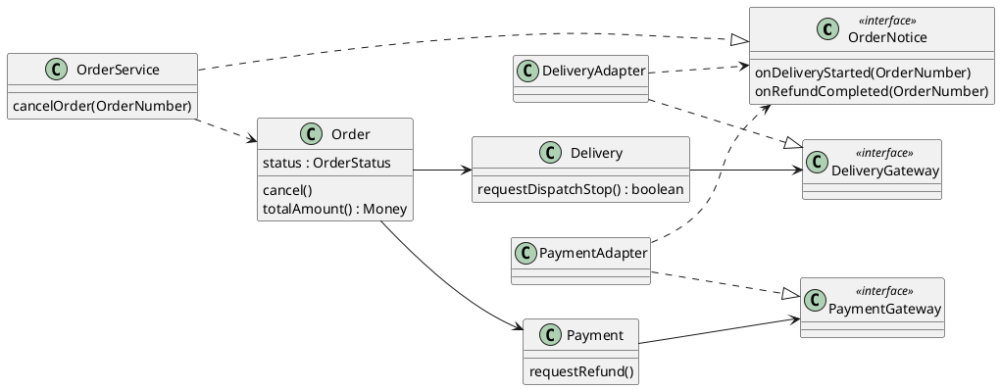

**강사 노트**

- 저장소·값 타입·환불은 읽기 쉽도록 생략했다. 전체는 `code/s07/`에 있다.
- 두 연동은 각각 업무 약속을 **실현**하고(`..|>`), 통보 약속에 **의존**한다(`..>`). 어느 쪽도 구체 업무 클래스를 모른다.

---

## 35. 계약과 코드

**다이어그램 — 클래스 다이어그램**

계약은 코드에서 **주석과 검사**로 드러난다. 사전조건은 메서드 앞의 검사로, 사후조건은 테스트로, 불변 조건은 생성자와 단일 전이 메서드로 지킨다.

**도식 — PlantUML**

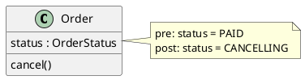

```java
    // 사전조건: 결제 완료이고 출고 중단이 수락된다.
    // 사후조건: 취소 처리 중이 되고, 출고 중단과 환불을 이 순서로 요청했다.
    public void cancel() {
        if (status != OrderStatus.PAID)
            throw new IllegalStateException(status + "에서는 취소할 수 없다");
        if (!delivery.requestDispatchStop())
            throw new IllegalStateException("이미 출고되었다");
        payment.requestRefund();
        transition(OrderStatus.PAID, OrderStatus.CANCELLING);
    }
```

**강사 노트**

- 자바에는 계약 문법이 없다. 이 예제는 사전조건을 예외로 검사하고, 사후조건은 테스트로 확인한다. Eiffel의 `require`·`ensure`처럼 언어가 지원하면 계약이 코드의 일부가 된다(Meyer, 1992).
- 거절이 앞에서 모두 끝난 뒤에 상태를 바꾼다. 중간에 실패하면 상태가 바뀌지 않는다 — 단, 출고 중단은 이미 요청된 뒤다. 외부 요청의 되돌림은 이 예제가 보장하지 않는다.

---

## 36. 설계 원칙과 코드

**다이어그램 — 클래스 다이어그램**

ISP·DIP의 적용은 코드에서 **인터페이스 하나와 생성자의 매개변수 타입**으로 드러난다.

**도식 — PlantUML**

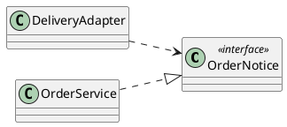

```java
// 외부 통보를 받는 약속. 연동은 이 약속에만 의존한다.
public interface OrderNotice {
    void onDeliveryStarted(OrderNumber number);
    void onRefundCompleted(OrderNumber number);
}
```

```java
    public DeliveryAdapter(DeliverySystemApi api, OrderNotice orderNotice) {
        this.api = api;
        this.orderNotice = orderNotice;
    }
```

**강사 노트**

- 코드는 모두 `code/s07/`의 패키지별 원본에서 발췌했으며, 컴파일·실행해 확인한다. 실행: `javac -encoding UTF-8 -d out $(find . -name "*.java") && java -cp out test.ContractTest`.
- 바뀐 것은 매개변수 타입 하나다. 원칙 적용이 코드를 크게 바꾸지 않는다 — 바뀌는 것은 **무엇을 아는가**다.

---

## 37. 계약 테스트

**다이어그램 — 시퀀스 다이어그램**

테스트는 계약의 단언을 하나씩 확인하고, 가짜 약속으로 **연동만** 따로 시험한다.

**도식 — PlantUML**

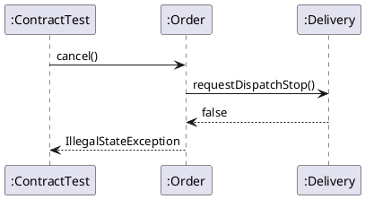

```java
        // 2. 사전조건 — 출고 중단이 거절되면 환불을 요청하지 않고 상태도 그대로다
        var dispatched = newOrder("O-2");
        dispatched.onPaid(new Payment(new Money(2000), fakePayment), new Delivery("D-2", refuses));
        rejects(dispatched::cancel);
        check(dispatched.status() == OrderStatus.PAID);
        check(requests.equals(List.of("출고 중단")));
        // ... 사후조건·불변 조건 생략

        // 5. 의존 역전 — 연동은 통보 약속(OrderNotice)만 알면 된다
        var notices = new ArrayList<OrderNumber>();
        OrderNotice fakeNotice = new OrderNotice() {
            public void onDeliveryStarted(OrderNumber number) { notices.add(number); }
            public void onRefundCompleted(OrderNumber number) { }
        };
        new DeliveryAdapter((command, number) -> "ACCEPTED", fakeNotice).receiveNotice("IN_TRANSIT", "O-3");
        check(notices.equals(List.of(new OrderNumber("O-3"))));
```

**강사 노트**

- 결과를 먼저 예측하게 한다: 출고 중단이 거절되면 환불 요청이 기록되는가? 상태는 무엇인가?
- 가짜 `OrderNotice`는 저장소도 주문도 없이 연동의 **옮기기**만 확인한다. DIP가 시험을 쉽게 만드는 예다.
- 코드가 **보장하지 않는 것** — 출고 중단 뒤 환불 요청이 실패할 때의 되돌림, 같은 주문의 동시 취소. 이는 설계 결정이 더 필요하다.

---

## 38. 잘못된 관행 — 빈약한 도메인 모델

도메인 클래스에 **데이터만** 있고 규칙은 모두 서비스에 있다. 객체는 이름만 객체이고, 설계는 절차적 코드로 돌아간다.

**인용문**

"이 안티패턴의 근본적인 문제는 **데이터와 처리를 함께 둔다**는 객체지향 설계의 기본 생각에 정면으로 어긋난다는 것이다", "The fundamental horror of this anti-pattern is that it's so contrary to the basic idea of object-oriented design; which is to combine data and process together.", [Fowler 2003b]

| 빈약한 모델 | 책임을 가진 모델 |
|---|---|
| `Order`는 getter·setter만 | `Order.cancel()`이 판단한다 |
| 서비스가 상태·출고·환불을 모두 조립 | 서비스는 찾고 맡기고 저장한다 |
| 계약을 쓸 곳이 없다 | 계약이 `Order`에 붙는다 |

**강사 노트**

- 인용 근거: Martin Fowler, ["AnemicDomainModel"](https://martinfowler.com/bliki/AnemicDomainModel.html), 2003-11-25 원문 확인.
- "06. 분석 모델에서 설계 모델로"의 「29. 잘못된 관행 — 데이터만 옮기기」에서 이름만 소개한 관행이다. 이 세션은 원인을 책임 배치로 설명한다.
- 데이터 모델에서 출발하는 것은 잘못이 아니다. 데이터를 아는 객체에 **그 데이터의 규칙**을 함께 두지 않은 것이 잘못이다.

---

## 39. 잘못된 관행 — 만능 서비스

하나의 서비스가 **모든 시스템 이벤트와 규칙**을 가진다. 서비스는 커지고, 모든 변경이 그 클래스를 거친다.

| 만능 서비스 | 나눈 설계 |
|---|---|
| `OrderManager`가 주문·결제·배송·통보를 모두 처리 | 규칙은 `Order`·`Payment`·`Delivery`에 |
| 모든 연동이 같은 서비스에 의존 | 연동은 `OrderNotice`에만 |
| 테스트마다 서비스 전체를 준비 | 객체마다 작게 시험 |

**강사 노트**

- 서비스는 **조정**만 한다(「10. 주문 취소 CRC」). 서비스에 `if`가 늘기 시작하면 규칙이 새어 나온 신호다.
- 만능 서비스는 SRP(여러 액터)와 ISP(여러 클라이언트)를 동시에 어긴다.

---

## 40. 잘못된 관행 — 묻고 또 묻기

객체의 내부를 줄줄이 **꺼내** 멀리 있는 정보를 판단한다. 호출하는 쪽이 협력자의 **구조**에 묶인다.

| 묻고 또 묻기 | 시키기 |
|---|---|
| `order.getPayment().getRefund().getAmount()` | `payment.requestRefund()` |
| `order.getDelivery().getNumber()`로 서비스가 배송 시스템 호출 | `delivery.requestDispatchStop()` |
| 구조가 바뀌면 모든 호출자가 바뀐다 | 협력자만 바뀐다 |

**강사 노트**

- 표의 getter 연쇄는 반례다(코드에 없음). 이 과정의 예제에는 이런 getter가 없다.
- 줄줄이 이어진 호출은 결합도가 높다는 신호다(「15. 결합도」). 필요한 일을 가장 가까운 협력자에게 시킨다.
- 근거: Craig Larman, *Applying UML and Patterns*, 3rd ed.(2004), §25.4 "Structure-Hiding Designs" 원문 확인. "낯선 객체에게 말하지 말라(Don't Talk to Strangers)", 곧 디미터 법칙(Law of Demeter)은 먼 객체의 구조를 따라가며 메시지를 보내는 설계가 구조 변경에 취약하다고 보고, 메서드 안에서는 자기 자신, 매개변수, 자기 속성, 속성인 컬렉션의 원소, 메서드에서 만든 객체에만 메시지를 보내라고 한다. Larman은 이를 보호된 변이의 특수한 경우로 본다("08. 변화 대응과 변이 설계").

---

## 41. 잘못된 관행 — 원칙 과잉

원칙을 **많이 적용할수록 좋다**고 여겨, 바뀔 이유가 없는 곳에도 인터페이스와 층을 만든다. 코드는 늘고 읽기는 어려워진다.

| 과잉 | 적정 |
|---|---|
| 모든 클래스에 `OrderImpl`·`IOrder` 짝 | 바뀌기 쉬운 곳(외부·통보)에만 인터페이스 |
| 메서드 하나마다 인터페이스 하나 | 클라이언트의 필요로 나눈다 |
| 값 타입까지 추상화 | `Money`·`Quantity`는 구체 타입으로 |

**강사 노트**

- 이 세션이 만든 인터페이스는 `OrderNotice` 하나다. 앞 세션의 `DeliveryGateway`·`PaymentGateway`·`OrderRepository`와 함께, 모두 **실제로 다른 구현**(연동·가짜·저장 기술)이 있는 곳이다.
- YAGNI — 오지 않은 변경을 위해 추상화하지 않는다. 설계 대안의 평가는 "09. 설계 대안 평가"에서 다룬다.

---

## 42. 잘못된 관행 — 계약 없는 방어

계약이 없으면 모두가 **모든 것을 검사**한다. 같은 검사가 여러 곳에 흩어지고, 규칙이 바뀌면 일부만 고쳐진다.

| 계약 없는 방어 | 계약으로 나눈 검사 |
|---|---|
| 서비스와 주문이 모두 상태를 검사 | 상태는 `Order`만 |
| 모든 메서드가 `null`·음수를 다시 검사 | 값 타입이 생성 때 한 번 |
| 검사가 실패하면 조용히 무시 | 계약 위반은 거절하고 드러낸다 |

**강사 노트**

- Meyer는 이런 중복 검사를 권하는 방어적 프로그래밍과 계약을 대비했다(「31. 계약과 분업」의 근거).
- 조용히 무시하는 것은 가장 나쁘다. 계약을 어긴 호출은 결함이므로 드러나야 고칠 수 있다.

---

## 43. 적정 객체 설계

객체 설계의 정제는 **질문에 답하면** 멈춘다. 모든 클래스에 모든 원칙과 계약을 적용하지 않는다.

1. **책임** — 규칙마다 판단하는 객체가 **한 곳**에 있는가?
2. **협력** — 메시지가 무엇을 시키고, 방법은 받는 쪽이 정하는가?
3. **의존** — 바뀌기 쉬운 것에는 **약속**으로 의존하는가?
4. **계약** — 복잡하거나 외부와 얽힌 메서드에 사전·사후조건이 있는가?

- 계약은 **어렵고 중요한** 메서드부터 쓴다. 단순한 조회에는 쓰지 않는다.

**강사 노트**

- 계약을 쓸 메서드를 고르는 기준은 시스템 오퍼레이션 계약을 고르는 기준("02. 요구 분석과 유스케이스")과 같다 — 여러 협력자를 조정하거나, 조건을 외부가 판단하거나, 상태와 결과가 얽힌 것.
- 변경 압력이 들어오면 이 설계가 어디서 흔들리는지 "08. 변화 대응과 변이 설계"에서 본다.

---

## 44. 실습 — 책임·협력·계약

실습 6의 설계를 LLM에 제공하여 **CRC**와 **계약**을 만들고, 설계 클래스 다이어그램을 정제한 뒤 점검 항목으로 **피드백**하여 완성하십시오.

- **투입물**
  + 실습 6의 **대응표·설계 클래스 다이어그램·설계 시퀀스 다이어그램**과 보완, **용어집** — 실제로는 여러분의 결과물을 이어 씁니다.
- **프롬프트**
  + ① "시스템 이벤트 **결제한다**에 참여하는 클래스마다 **CRC**(클래스, 책임, 협력자)를 써줘. 규칙은 정보를 가진 객체에 두고, 이름은 용어집을 따라줘."
  + ② "`Subscription.pay`의 **계약**(사전조건, 사후조건, 결제 거절·배송 요청 실패의 결과)과 `Subscription`의 **불변 조건**을 써줘. 외부 결과는 '요청했다'로 써줘."
- **점검 항목**
  1. **책임의 위치** — 결제 금액·확정 판단이 정보를 가진 객체(`Subscription`)에 있는가?
  2. **서비스** — `SubscriptionService`가 규칙 없이 찾고 맡기고 저장만 하는가?
  3. **메시지** — 상태를 묻고 밖에서 판단하지 않고 시키는가?
  4. **계약** — 사전·사후조건과 실패의 결과가 상태 기계의 가드와 같은가?
  5. **외부 결과** — 결제·배송은 "했다"가 아니라 "요청했다"인가?
  6. **과잉** — 바뀔 이유가 없는 곳에 인터페이스를 만들지 않았는가?
- **결과물** — CRC, 계약, 정제된 설계 클래스 다이어그램. 변화 대응 설계의 입력이 됩니다.

**강사 노트**

- LLM은 서비스에 결제 금액 계산과 상태 검사를 몰아넣거나, 모든 클래스에 인터페이스를 붙이거나, 배송 요청을 "배송했다"로 쓰기 쉽다.
- 계약의 실패 결과는 실습 4의 상태 기계(결제 거절 — 그대로, 배송 요청 실패 — 신청 실패)와 대조한다.

---

## 45. CRC (안)

결제의 규칙은 **`Subscription`**이 갖고, `SubscriptionService`는 조정만 한다. 외부 요청은 `Payment`와 `DeliveryGateway`이 맡는다.

| 클래스 | 책임 | 협력자 |
|---|---|---|
| **`SubscriptionService`** | 정기배송을 찾고 맡기고 저장한다 | `SubscriptionRepository`, `Subscription` |
| **`Subscription`** | 결제 금액을 정한다 | `SubscriptionItem` |
| | 결제·배송을 요청한다 | `Payment`, `DeliveryGateway` |
| | 확정·실패를 판단한다 | — |
| **`SubscriptionItem`** | 단가와 수량을 알고 항목 금액을 계산한다 | — |
| **`DeliveryRound`** | 배송 예정일과 회차 상태를 안다 | — |
| **`Payment`** | 승인을 요청하고, 결제를 취소하고, 영수증을 발행한다 | `PaymentGateway`, `Receipt` |

**강사 노트**

- 결제 금액은 청구 방식에 따라 다르다 — 일시불은 회차 금액 × 회차 수, 월별 청구는 첫 달의 회차 금액이다(R6). 이 계산은 청구 방식과 회차를 아는 `Subscription`이 한다.
- 수강생의 CRC가 달라도 **규칙이 한 곳**에 있고 서비스가 조정만 하면 맞다.

---

## 46. 계약 (안)

`Subscription.pay(method, billing)`는 결제와 배송 요청이 **모두 성공할 때만** 확정한다. 실패의 결과도 계약에 쓴다.

- **사전조건**
  - **상태** — `PENDING_PAYMENT`이다.
  - **결제 방법·청구 방식** — 용어집의 값 중 하나다.
- **사후조건(성공)**
  - **요청** — 결제 승인을 요청했고, 배송 회차들의 배송을 요청했다.
  - **상태** — `CONFIRMED`이고, 영수증을 발행했다.
- **결제 거절**
  - **상태** — `PENDING_PAYMENT` 그대로, 배송은 요청하지 않았다.
- **배송 요청 실패**
  - **보상** — 결제 취소를 요청했고, 상태는 `FAILED`다.
- **불변 조건**
  - **항목** — 정기배송 항목은 1개 이상이다.
  - **파생** — 회차 금액 = Σ(단가 × 수량), 만료일 = 첫 배송일 + 기간 − 1일

**강사 노트**

- 실패의 결과는 실습 4의 상태 기계와 같다 — 결제 거절은 결제 대기에 머물고, 배송 요청 실패는 결제 취소를 요청하고 신청 실패가 된다.
- "결제 취소를 요청한다"는 `PaymentGateway`의 새 요청이다. 보완 (안)에서 용어집과 설계에 더한다.

---

## 47. 정제된 설계 클래스 다이어그램 (안)

결제 취소 요청이 `PaymentGateway`에 더해졌다. 규칙은 **`Subscription`**에, 외부 요청은 **약속**에 둔다.

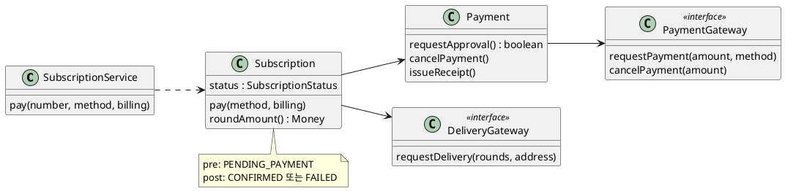

**강사 노트**

- 저장소·항목·회차·값 타입은 읽기 쉽도록 생략했다(실습 6의 설계 클래스 다이어그램 (안)).
- 인터페이스는 외부 시스템에 대한 약속 둘뿐이다. `Subscription`·`Payment`에 인터페이스를 붙이지 않은 것이 점검 항목 6의 답이다.

---

## 48. 책임·계약 보완 (안)

책임과 계약을 정하며 발견한 것은 **후속 작업에 영향을 미치는 경우에만** 이전 산출물에 반영한다.

- **용어집**(실습 2)
  - **새 용어** — 결제 취소를 요청한다 `cancelPayment`
- **설계 클래스 다이어그램**(실습 6)
  - **약속** — `PaymentGateway`에 `cancelPayment`를 더한다.
  - **책임** — 결제 금액의 계산은 `Subscription`이 한다.
- **유스케이스 명세서**(실습 2)
  - **7a** — "결제 취소를 요청한다"의 결과(신청 실패)를 사후조건에 밝힌다.
- **※ 현행화 기준**
  - **반영** — 용어집, 약속의 추가, 결제 금액의 책임. 변화 대응 설계의 입력이 된다.
  - **기록만** — 명세서 7a의 문구.

**강사 노트**

- 계약을 쓰면 실패의 결과가 드러나고, 그 결과를 만들 **요청**(결제 취소)이 설계에 없었다는 것이 보인다. 계약이 설계를 검증한 사례다.

---

## 49. 요약

이 세션은 초기 설계의 **책임과 협력**을 정제하고 **계약**으로 조건과 보장을 명시했다.

### 책임·협력·계약의 핵심

- **책임** — 데이터와 규칙을 아는 객체에 둔다. 서비스는 조정만 한다
- **협력** — 무엇을 시키고, 방법은 받는 쪽이 정한다. 정보 은닉·높은 응집·낮은 결합
- **원칙** — SRP(액터 하나), ISP(쓰는 것만), DIP(추상에), LSP(계약을 지키는 대체)
- **계약** — 사전·사후조건과 불변 조건. 한쪽의 의무는 다른 쪽의 이익
- **계약의 쓰임** — 상속의 규칙, 검사의 분업, 테스트의 기준
- **잘못된 관행** — 빈약한 모델, 만능 서비스, 묻고 또 묻기, 원칙 과잉, 계약 없는 방어

### 다음 세션

- "**08. 변화 대응과 변이 설계**" — 실제 변경 압력이 기존 책임·계약·협력에 주는 영향을 관찰하고 변화를 국소화하는 설계를 만든다.

**강사 노트**

- 이 세션의 계약과 약속(`OrderNotice`, `PaymentGateway`)은 다음 세션에서 변경 요청이 들어올 때 **어디가 흔들리는지** 관찰하는 기준이 된다.
