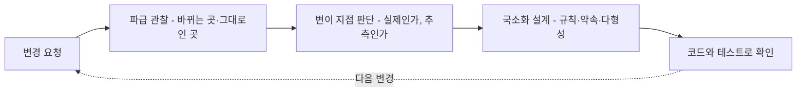
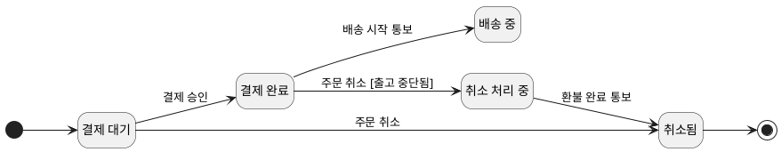
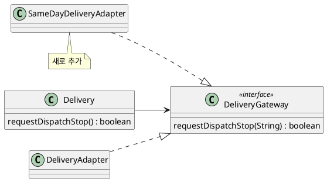
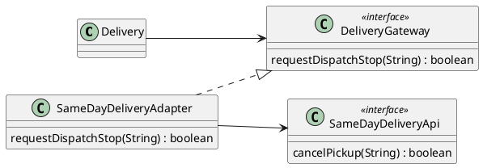
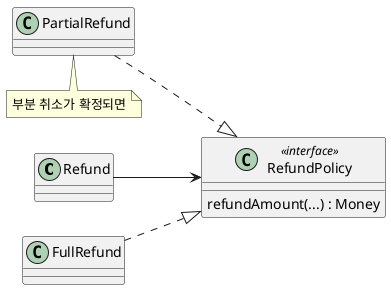
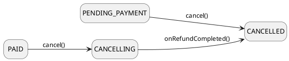
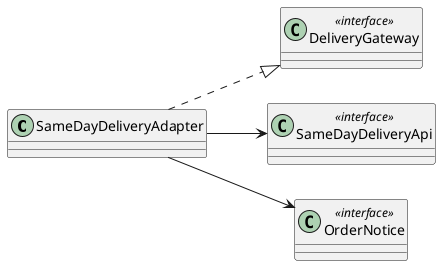
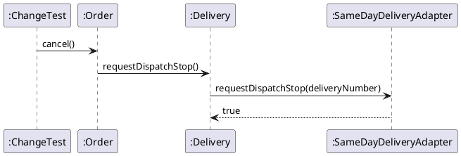
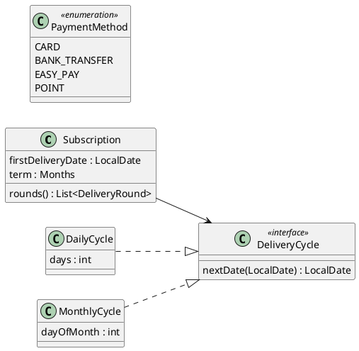

--------------------
Session 명: 08. 변화 대응과 변이 설계
--------------------

## 목차

01. 세션 목표
02. 설계에서 변경으로
03. 변화 대응은 판단이다
04. 변경 압력
05. 변경 요청
06. 변경 파급
07. 결제 전 취소의 파급
08. 당일 배송의 파급
09. 부분 취소의 파급
10. 변이 지점과 진화 지점
11. 안정된 책임
12. GRASP 변화 대응
13. OCP
14. OCP와 보호된 변이
15. 보호된 변이
16. 인터페이스
17. 다형성
18. 간접화
19. 합성
20. 구조 숨기기
21. 규칙의 국소화
22. 새 연동의 추가
23. 계약을 바꾸는 변경
24. 변경을 쉽게
25. YAGNI의 범위
26. 패턴 어휘
27. 어댑터
28. 전략
29. 패턴과 원칙
30. 규칙 변경 코드
31. 새 연동 코드
32. 변경 테스트
33. 잘못된 관행 — 추측성 일반화
34. 잘못된 관행 — 흩어진 변경
35. 잘못된 관행 — 타입 검사 분기
36. 잘못된 관행 — 패턴 과잉
37. 적정 변화 대응
38. 실습 — 변화 대응
39. 변경 영향 분석 (안)
40. 변이 설계 (안)
41. 설계 클래스 다이어그램 (안)
42. 변화 대응 보완 (안)
43. 요약

## 01. 세션 목표

이 세션은 실제 **변경 요청**으로 설계가 흔들리는 곳을 관찰하고, 변화를 **국소화**하는 설계를 만든다.

- 변경 요청을 적용해 책임·계약·협력으로 번지는 **변경 파급**을 관찰한다.
- **변이 지점**과 **진화 지점**을 구분하고, 흔들리지 않을 **안정된 책임**을 식별한다.
- **OCP**와 **보호된 변이**로 변이 국소화의 목표를 정의한다.
- GRASP의 변화 대응 원칙(다형성·간접화·순수 가공)과 합성·인터페이스를 **실제 압력**에 선택적으로 적용한다.
- 설계 문제와 해결 구조를 **패턴 어휘**(어댑터·전략)와 연결한다.
- 추측성 일반화·흩어진 변경·타입 검사 분기·패턴 과잉 같은 **잘못된 관행**을 식별한다.

**강사 노트**

- 입력은 "07. 책임·협력·계약"의 정제된 설계와 계약이다. 대안의 체계적 평가(비용·trade-off)는 "09. 설계 대안 평가"에서 한다.

---

## 02. 설계에서 변경으로

설계의 품질은 **변경이 올 때** 드러난다. 앞 세션의 책임·계약·약속이 변경 요청을 **어디까지** 가두는지 관찰한다.

**도식 — Mermaid**



- **입력** — "07. 책임·협력·계약"의 계약과 약속(배송·결제 시스템, 통보)
- **출력** — 변경 요청별 파급 분석, 국소화한 설계와 코드, 변경 테스트

**강사 노트**

- 변경 요청 셋은 과정 공통 전제의 **교육용 변경 요청**이다. 앞 두 개는 이 세션의 코드에 반영하고, 부분 취소는 분석까지만 한다.

---

## 03. 변화 대응은 판단이다

변화 대응은 예상 가능한 모든 변이를 추상화하는 것이 아니라, **실제 변경 압력**(change pressure)을 국소화하는 **판단**이다.

**인용문**

"전문 설계자는 통찰로 고른다. 변경 비용과 그 **가능성을 저울질해** 단순하고 깨지기 쉬운 설계를 택하기도 한다", "Expert designers choose with insight; perhaps a simple and brittle design whose cost of change is balanced against its likelihood.", [Larman 2004]

- **추상화는 비용**이다. 코드를 늘리고 읽기를 어렵게 한다.
- **보호는 투자**다. 변경이 실제로 오는 곳에서만 회수된다.

**강사 노트**

- 인용 근거: Craig Larman, *Applying UML and Patterns*, 3rd ed.(2004), §25.4 "Protected Variations" 원문 확인. 바로 앞 문장은 초보는 깨지기 쉬운 설계로, 중급은 쓰이지 않는 지나치게 일반화된 설계로 기운다고 말한다.
- 목표는 "변경에 강한 설계"라는 막연한 이상이 아니라, **이번 변경 요청**을 싸게 받아들이고 다음 변경을 관찰하는 것이다.

---

## 04. 변경 압력

**변경 압력**은 설계를 바꾸라고 요구하는 **실제 힘**이다. 추측(언젠가 바뀔지 모른다)과 구분한다.

| 구분 | 변경 압력 | 추측 |
|---|---|---|
| **근거** | 확정된 요구, 이미 있는 변형, 반복된 변경 이력 | "나중에 필요할 것 같다" |
| **예** | 두 번째 배송 대행사 계약이 체결됐다 | 언젠가 결제 대행사가 열 개가 될지 모른다 |
| **대응** | 지금 국소화한다 | 단순하게 두고 관찰한다 |

- 압력의 출처는 **요구·외부 시스템·규칙**이다. 기술 유행은 압력이 아니다.

**강사 노트**

- 변경 이력(같은 곳이 반복해서 바뀜)은 강한 압력이다. 버전 관리 이력에서 자주 함께 바뀌는 파일을 찾는 것도 방법이다 — "12. 구현·검증·DevOps와 SW공학 피드백".
- 과정의 기본 원칙("작게 끝까지", YAGNI)과 같은 판단이다.

---

## 05. 변경 요청

이 세션은 주문 사례에 **세 변경 요청**을 적용한다. 성격이 서로 다르다 — 규칙의 변경, 외부의 변이, 계약의 변경.

| 변경 요청 | 내용 | 성격 |
|---|---|---|
| **① 결제 전 취소** | 결제 대기 주문도 취소할 수 있다 | 업무 규칙의 변경 |
| **② 당일 배송** | 당일 배송 대행사를 추가한다(배송 시스템이 둘) | 외부 시스템의 변이 |
| **③ 부분 취소** | 주문 항목 일부만 취소한다 | 계약의 변경 |

- 세 요청은 모두 **교육용 가정**이다. 결제 전 취소는 앞 세션들이 **미정**으로 남긴 규칙이 확정된 경우다.

**강사 노트**

- 결제 전 취소는 "04. 동적 모델 — 상호작용과 상태"의 「08. 상태 기계 다이어그램」의 「가드와 금지된 전이」와 "05. 구조적 경계와 의존성"의 「15. 변경 파급」에서 미정으로 남겼다. 이 세션은 "결제 대기 → 취소됨, 외부 요청 없음"으로 정해졌다고 가정한다.
- 확정된 규칙은 분석 산출물(상태 기계, 명세서의 대안 흐름)에 되돌린다(「21. 규칙의 국소화」).

---

## 06. 변경 파급

**변경 파급**은 한 변경이 **다른 곳을 바꾸게 만드는** 연쇄다. 변경 요청마다 바뀌는 곳과 그대로인 곳을 적어 설계의 **경직성**을 드러낸다.

**인용문**

"경직성은 단순한 변경조차 어려운 성질이다. **모든 변경이 의존하는 모듈로 연쇄**를 일으킨다", "Rigidity is the tendency for software to be difficult to change, even in simple ways. Every change causes a cascade of subsequent changes in dependent modules.", [Martin 2000]

1. **적용** — 변경 요청을 한 문장의 요구로 쓴다.
2. **추적** — 바뀌어야 할 클래스·계약·테스트를 찾는다.
3. **구분** — 바뀌는 곳과 **그대로인 곳**을 표로 적는다.
4. **판단** — 파급이 넓으면 그 원인(책임의 위치, 의존)을 찾는다.

**강사 노트**

- 인용 근거: Robert C. Martin, ["Design Principles and Design Patterns"](https://staff.cs.utu.fi/~jounsmed/doos_06/material/DesignPrinciplesAndPatterns.pdf)(2000), "Symptoms of Rotting Design — Rigidity" 원문 확인. 같은 절은 경직성·취약성·부동성·점착성을 설계가 썩는 네 증상으로 든다.
- "05. 구조적 경계와 의존성"의 「15. 변경 파급」은 패키지 수준이었다. 이 세션은 클래스·계약 수준이다.

---

## 07. 결제 전 취소의 파급

변경 요청 ①은 **`Order` 한 곳**에서 끝난다. 취소 규칙과 상태 전이를 `Order`가 갖고 있기 때문이다.

| 요소 | 바뀌는가 | 이유 |
|---|---|---|
| **`Order.cancel()`** | 바뀐다 | 취소 규칙의 주인 |
| **`OrderStatus`** | 그대로 | 결제대기·취소됨 값이 이미 있다 |
| **`OrderService`** | 그대로 | 규칙을 모른다 |
| **`Delivery`·`Payment`** | 그대로 | 결제 전에는 요청하지 않는다 |
| **연동** | 그대로 | 외부 요청이 없다 |

- 좋은 **책임 배치**가 이미 변경을 가두었다. 이 변경에는 새 추상화가 필요 없다.

**강사 노트**

- "07. 책임·협력·계약"의 「12. 묻기와 시키기」에서 서비스가 상태를 물어 판단했다면, 이 규칙 변경은 판단을 복사한 모든 서비스로 번졌을 것이다.
- 계약은 바뀐다 — 사전조건이 넓어지고(결제 대기도 허용), 사후조건에 경우가 하나 는다. 계약의 변경은 테스트의 변경이다(「32. 변경 테스트」).

---

## 08. 당일 배송의 파급

변경 요청 ②는 **새 연동 하나**를 더하는 것으로 끝난다. 배송 경계가 약속 `DeliveryGateway`을 소유하고 있기 때문이다.

| 요소 | 바뀌는가 | 이유 |
|---|---|---|
| **`SameDayDeliveryAdapter`** | 새로 생긴다 | 당일 배송 대행사의 형식을 옮긴다 |
| **`DeliveryGateway`** | 그대로 | 약속은 대행사와 무관하다 |
| **`Delivery`·`Order`** | 그대로 | 약속에만 의존한다 |
| **`DeliveryAdapter`** | 그대로 | 기존 대행사의 형식 |
| **조립**(누가 어느 연동을 쓰는가) | 바뀐다 | 배송마다 대행사를 고른다 |

- 외부의 변이를 **약속 뒤**에 가두었다 — 이것이 보호된 변이다(「15. 보호된 변이」).

**강사 노트**

- "05. 구조적 경계와 의존성"에서 약속을 업무 경계가 소유하게 한 결정(의존 역전)이 이 변경 요청에서 **회수**된다.
- 배송마다 어느 대행사를 쓸지 정하는 **조립** 책임은 남는다. 이 세션의 코드는 테스트에서 조립한다. 대행사 선택 규칙이 생기면 그 책임의 위치를 정한다.

---

## 09. 부분 취소의 파급

변경 요청 ③은 **계약**을 바꾼다. 취소의 대상·결과가 달라져 여러 객체와 외부 약속까지 번진다.

| 요소 | 바뀌는가 | 이유 |
|---|---|---|
| **`Order.cancel()`** | 바뀐다 | 항목을 받아야 한다, 상태가 "일부 취소"를 표현해야 한다 |
| **`OrderStatus`** | 바뀐다 | 부분 취소 상태가 필요하다 |
| **`Refund`·`Payment`** | 바뀐다 | 환불 금액이 결제 금액보다 작다 |
| **`DeliveryGateway`** | 바뀐다 | 일부 항목만 출고를 중단한다 |
| **시스템 계약** | 바뀐다 | "주문을 취소한다"의 입력과 결과 |

- 파급이 넓은 것은 설계가 나빠서가 아니라 **요구의 의미**가 바뀌었기 때문이다. 이런 변경은 분석부터 다시 연다.

**강사 노트**

- 부분 취소는 과정 공통 전제의 교육용 가정이며, 이 세션은 **구현하지 않는다**. 판단은 「23. 계약을 바꾸는 변경」·「24. 변경을 쉽게」에서 한다.
- 모든 변경을 국소화할 수는 없다. 요구의 의미가 바뀌면 모델·계약·코드가 함께 바뀌는 것이 정상이다.

---

## 10. 변이 지점과 진화 지점

변경이 올 수 있는 곳은 둘로 나뉜다. **이미 있는** 변이(변이 지점)와 **추측한** 변이(진화 지점)다.

**인용문**

"변이 지점 — 기존 시스템이나 요구에 **이미 있는** 변이", "variation point—Variations in the existing, current system or requirements", [Larman 2004]

**인용문**

"진화 지점 — 앞으로 생길 수 있지만 현재 요구에는 **없는** 추측성 변이 지점", "evolution point—Speculative points of variation that may arise in the future, but which are not present in the existing requirements.", [Larman 2004]

| 지점 | 주문 사례 | 판단 |
|---|---|---|
| **변이 지점** | 배송 대행사가 둘(변경 요청 ②) | 지금 보호한다 |
| **진화 지점** | 결제 대행사가 늘어날지 모른다 | 약속만 두고 더 일반화하지 않는다 |

**강사 노트**

- 인용 근거: Larman, 3rd ed.(2004), §25.4 "Caution: Speculative PV and Picking Your Battles" 원문 확인. 같은 곳은 보호된 변이를 두 지점 모두에 적용하되, 진화 지점의 추측성 보호는 비용을 따져 보라고 경고한다.
- 결제 쪽 `PaymentGateway`은 이미 있는 약속이다(연동·가짜 구현). 결제 대행사가 늘어난다는 추측만으로 대행사 선택 구조까지 만들지는 않는다.

---

## 11. 안정된 책임

변이 지점을 찾으면 그 둘레의 **안정된 책임**도 보인다. 안정된 책임은 변경 요청이 와도 **바뀌지 않아야** 하는 의미다.

| 안정된 책임 | 주인 | 변경 요청 ①·②에서 |
|---|---|---|
| **출고 중단 → 환불의 순서** | `Order` | 그대로 |
| **출고 중단을 요청할 수 있다는 약속** | `DeliveryGateway` | 그대로(구현만 늘었다) |
| **환불 금액 ≤ 결제 금액** | `Refund` | 그대로 |
| **주문 상태는 주문만 바꾼다** | `Order` | 그대로 |

- 안정된 책임을 **약속과 계약**으로 드러내면, 변이는 그 뒤에서 자유롭게 늘어난다.

**강사 노트**

- 안정된 책임은 "07. 책임·협력·계약"의 계약과 불변 조건에서 나온다. 계약이 분명할수록 무엇이 안정적인지 분명하다.
- "05. 구조적 경계와 의존성"의 안정된 의존 원칙(SDP)과 같은 생각을 클래스 수준에서 본 것이다.

---

## 12. GRASP 변화 대응

변화 대응에는 GRASP의 나머지 **네 원칙**을 쓴다. 모두 변이가 다른 요소로 번지지 않게 하는 **보호된 변이**를 이룬다.

| 원칙 | 원문 이름 | 해법 | 주문 사례 |
|---|---|---|---|
| **보호된 변이** | Protected Variations | 변이 둘레에 안정된 인터페이스 | `DeliveryGateway` |
| **다형성** | Polymorphism | 다른 행위를 그 타입들에 | 배송 연동 둘 |
| **간접화** | Indirection | 사이에 중재 객체를 | 연동 |
| **순수 가공** | Pure Fabrication | 도메인 밖 가공 클래스에 | 서비스, 저장소 |

- 앞 세션의 다섯 원칙(정보 전문가·생성자·컨트롤러·높은 응집도·낮은 결합도)이 책임의 **자리**를 정했다면, 이 넷은 그 자리를 **변경으로부터** 지킨다.

**강사 노트**

- 근거: Craig Larman, *Applying UML and Patterns*, 3rd ed.(2004), Chapter 25 "GRASP: More Objects with Responsibilities"(§25.1 Polymorphism, §25.2 Pure Fabrication, §25.3 Indirection, §25.4 Protected Variations) 원문 확인. 해법 열은 각 원칙의 Solution을 줄여 옮긴 것이다(요약).
- 순수 가공의 해법 — 도메인 개념을 나타내지 않는 인위적인 클래스에 응집도 높은 책임 묶음을 두어 높은 응집·낮은 결합·재사용을 얻는다. 이 과정의 연동·서비스·저장소가 모두 순수 가공이다. Larman은 GoF의 어댑터·전략 등 대부분의 설계 패턴이 순수 가공이라고 말한다.

---

## 13. OCP

**개방·폐쇄 원칙**(Open-Closed Principle, OCP)은 모듈이 **확장에는 열려** 있고 **변경에는 닫혀** 있어야 한다는 원칙이다. 새 동작을 더할 때 기존 코드를 고치지 않는다.

**인용문**

"모듈은 **확장에는 열려** 있고 **변경에는 닫혀** 있어야 한다", "A module should be open for extension but closed for modification.", [Martin 2000]

- 변경 요청 ②는 OCP를 지켰다 — 새 연동을 **더했을 뿐**, `Order`·`Delivery`는 고치지 않았다.
- 변경 요청 ①은 OCP의 대상이 아니다 — 규칙 **자체**가 바뀌었으니 규칙의 주인을 고친다.

**강사 노트**

- 인용 근거: Martin, "Design Principles and Design Patterns"(2000), The Open Closed Principle 원문 확인. 같은 절은 이 원칙이 Bertrand Meyer의 연구에서 나왔고, "abstraction is the key to the OCP"라고 말한다.
- 모든 모듈을 모든 변경에 닫을 수는 없다. **어떤 변경에** 닫을지 고르는 것이 설계다 — 「14. OCP와 보호된 변이」.

---

## 14. OCP와 보호된 변이

OCP와 **보호된 변이**는 같은 원칙의 두 표현이다. OCP는 "닫힌다"는 결과를, 보호된 변이는 "어디를 보호할지"를 강조한다.

**인용문**

"OCP와 보호된 변이는 본질적으로 **같은 원칙의 두 표현**이며, 강조점이 다를 뿐이다 — 변이 지점과 진화 지점에서의 보호", "OCP and PV are essentially two expressions of the same principle, with different emphasis: protection at variation and evolution points.", [Larman 2004]

| 이름 | 묻는 것 | 주문 사례 |
|---|---|---|
| **OCP** | 이 변경에 이 모듈이 닫혀 있는가? | `Order`는 대행사 추가에 닫혀 있다 |
| **보호된 변이** | 어디가 흔들리고, 무엇으로 감싸는가? | 배송 대행사를 `DeliveryGateway`으로 감싼다 |
| **정보 은닉** | 바뀌기 쉬운 결정을 어디에 감추는가? | 대행사의 형식을 연동 안에 감춘다 |

**강사 노트**

- 인용 근거: Larman, 3rd ed.(2004), §25.4 "Open-Closed Principle" 원문 확인. 같은 곳은 OCP가 보호된 변이·정보 은닉과 본질적으로 같다고 말하고, "닫혀 있다"는 클라이언트가 영향을 받지 않는다는 뜻이라고 설명한다.
- 정보 은닉은 "07. 책임·협력·계약"의 「13. 정보 은닉」, 변경 이유에 따른 경계 판단은 "05. 구조적 경계와 의존성"의 「07. 경계 후보」에서 다뤘다.

---

## 15. 보호된 변이

**보호된 변이**(Protected Variations, PV)는 변이나 불안정이 예측되는 지점을 찾고, 그 둘레에 **안정된 인터페이스**를 두는 책임 배정 원칙이다.

**인용문**

"예측된 **변이나 불안정의 지점**을 찾고, 그 둘레에 **안정된 인터페이스**를 만드는 책임을 배정한다", "Identify points of predicted variation or instability; assign responsibilities to create a stable interface around them.", [Larman 2004]

| 불안정한 것 | 안정된 인터페이스 | 보호받는 쪽 |
|---|---|---|
| **배송 대행사의 형식** | `DeliveryGateway` | `Delivery`, `Order` |
| **결제 대행사의 형식** | `PaymentGateway` | `Payment` |
| **통보를 받는 쪽** | `OrderNotice` | 연동 |
| **저장 기술** | `OrderRepository` | `OrderService` |

**강사 노트**

- 인용 근거: Larman, 3rd ed.(2004), §25.4 "Protected Variations" 원문 확인. 같은 곳은 "인터페이스"를 자바 인터페이스만이 아니라 넓은 뜻의 **접근 창구**(access view)로 쓴다고 주석을 단다. 계약이 분명한 메서드도 안정된 인터페이스다.
- 보호된 변이는 GRASP의 변화 대응 원칙 중 중심이다(「12. GRASP 변화 대응」). 이어지는 다형성·간접화는 보호된 변이를 이루는 **수단**이다.

---

## 16. 인터페이스

**인터페이스**에 의존하면 구현이 **바뀔 수 있다**. 보호된 변이의 가장 흔한 수단이다.

**인용문**

"인터페이스에만 의존하면 구현에서 분리된다. 구현은 **바뀔 수 있고**, 그것이 건강한 의존 관계다", "Once you depend on interfaces only, you're decoupled from the implementation. That means the implementation can vary, and that's a healthy dependency relationship.", [Gamma 2005]

- 인터페이스는 **쓰는 쪽**의 필요로 만들고, 쓰는 쪽이 소유한다(`DeliveryGateway`은 `delivery`에).
- 구현이 **실제로 둘 이상**이거나 곧 둘이 될 때 만든다. 테스트의 가짜 구현도 구현이다.

**강사 노트**

- 인용 근거: Bill Venners, ["Design Principles from Design Patterns — A Conversation with Erich Gamma, Part III"](https://www.artima.com/articles/design-principles-from-design-patterns)(Artima, 2005-06-06) 원문 확인. GoF 책의 원칙 "구현이 아니라 인터페이스에 맞춰 프로그래밍하라"를 저자가 설명한 대목이다.
- DIP("07. 책임·협력·계약")가 의존의 **방향**을 말한다면, 여기서는 인터페이스가 **변이를 허용**하는 쪽을 본다.

---

## 17. 다형성

**다형성**(Polymorphism)은 타입에 따라 달라지는 행위를, 조건문이 아니라 그 **타입들의 같은 이름 오퍼레이션**에 맡기는 원칙이다.

**인용문**

"관련된 대안이나 행위가 **타입에 따라 달라지면**, 다형적 오퍼레이션으로 그 행위의 책임을 행위가 달라지는 타입에 배정한다", "When related alternatives or behaviors vary by type (class), assign responsibility for the behavior—using polymorphic operations—to the types for which the behavior varies.", [Larman 2004]

| 조건문 | 다형성 |
|---|---|
| `if (대행사 == 기존) ... else if (대행사 == 당일) ...` | `deliverySystem.requestDispatchStop(...)` |
| 대행사가 늘 때마다 모든 분기를 고친다 | 구현 하나를 더한다 |

**강사 노트**

- 인용 근거: Larman, 3rd ed.(2004), §25.1 "Polymorphism" 원문 확인. 같은 곳의 따름정리는 "객체의 타입을 검사해 조건문으로 대안을 고르지 말라"다 — 「35. 잘못된 관행 — 타입 검사 분기」.
- 같은 곳은 추측만으로 인터페이스와 다형성을 만드는 것을 금기 사항(contraindication)으로 든다. 변이가 즉각적이거나 매우 그럴듯할 때만 합리적이다.

---

## 18. 간접화

**간접화**(Indirection)는 두 요소가 **직접 결합하지 않도록** 그 사이에 중재자를 두는 원칙이다. 연동이 대표적인 중재자다.

**인용문**

"다른 구성 요소들이 **직접 결합하지 않도록** 그 사이를 중재하는 중간 객체에 책임을 배정한다", "Assign the responsibility to an intermediate object to mediate between other components or services so that they are not directly coupled.", [Larman 2004]

| 중재자 | 사이에 둔 것 | 없었다면 |
|---|---|---|
| **`SameDayDeliveryAdapter`** | `Delivery` ↔ 당일 배송 대행사 | `Delivery`가 대행사 형식을 안다 |
| **`OrderService`** | 연동·화면 ↔ `Order`와 저장 | 연동이 저장소를 안다 |

**강사 노트**

- 인용 근거: Larman, 3rd ed.(2004), §25.3 "Indirection" 원문 확인. 같은 곳은 간접화가 낮은 결합을 지원하고, 많은 GoF 패턴(어댑터·퍼사드·옵서버 등)이 간접화의 예라고 한다.
- 간접화는 층을 늘린다. 층이 결합을 줄이지 못하면 비용만 는다 — 「36. 잘못된 관행 — 패턴 과잉」.

---

## 19. 합성

**합성**은 작은 객체를 큰 객체에 **끼워 넣어** 행위를 바꾸는 방법이다. 상속보다 결합이 약하고, 실행 중에도 바꿀 수 있다.

**인용문**

"합성은 더 좋은 성질이 있다. 큰 것에 **작은 것을 끼워 넣는** 것만으로 결합이 줄어든다", "Composition has a nicer property. The coupling is reduced by just having some smaller things you plug into something bigger.", [Gamma 2005]

| 구분 | 상속 | 합성 |
|---|---|---|
| **바꾸는 방법** | 하위 클래스를 만든다 | 다른 객체를 끼운다 |
| **결합** | 상위 클래스의 내부에 묶인다 | 약속에만 묶인다 |
| **주문 사례** | `SameDayDelivery extends Delivery` | `new Delivery(번호, sameDayAdapter)` |

**강사 노트**

- 인용 근거: Venners, 2005, 같은 인터뷰 원문 확인. GoF의 원칙 "클래스 상속보다 객체 합성을 선호하라"의 설명이다. 같은 곳에서 Gamma는 상속이 하위 클래스가 문맥을 가정하기 쉬워 깨지기 쉽다고 말한다.
- 이 세션의 `Delivery`는 연동을 **생성자로 받아** 합성한다. 대행사를 바꾸려고 `Delivery`를 상속하지 않았다.

---

## 20. 구조 숨기기

객체의 **내부 구조**도 변이다. 먼 객체의 구조를 따라가며 메시지를 보내면, 구조가 바뀔 때 호출자가 함께 바뀐다.

| 구조를 드러낸 호출 | 구조를 숨긴 호출 |
|---|---|
| `order.getDelivery().getNumber()`로 대행사 호출 | `order.cancel()` 안에서 `delivery.requestDispatchStop()` |
| 배송의 구조가 바뀌면 호출자가 바뀐다 | `Delivery`만 바뀐다 |

- **가까운 협력자**에게만 메시지를 보낸다 — 자기 자신, 매개변수, 자기 속성, 메서드에서 만든 객체.

**강사 노트**

- 근거: Larman, 3rd ed.(2004), §25.4 "Structure-Hiding Designs" 원문 확인. "낯선 객체에게 말하지 말라"(디미터 법칙)는 보호된 변이의 특수한 경우이며, 구조 변경이라는 흔한 불안정으로부터 보호한다.
- "07. 책임·협력·계약"의 「40. 잘못된 관행 — 묻고 또 묻기」와 같은 판단을 변화 대응 관점에서 본 것이다.

---

## 21. 규칙의 국소화

**다이어그램 — 상태 기계 다이어그램**

변경 요청 ①은 **추상화 없이** 규칙의 주인 `Order`를 고친다. 분석의 상태 기계에도 확정된 전이를 **되돌린다**.

**도식 — PlantUML**



- 새 전이 **결제 대기 → 취소됨**이 더해졌다. 외부 요청은 없다.
- **되돌릴 곳** — 상태 기계, 명세서의 대안 흐름 1a(취소), 시스템 오퍼레이션 계약

**강사 노트**

- 도식은 분석의 상태 기계라 한글이다("04. 동적 모델 — 상호작용과 상태"의 「08. 상태 기계 다이어그램」의 「주문 상태 기계」에 전이 하나를 더했다). 배송 완료는 생략했다.
- 규칙이 바뀌면 규칙의 주인을 고친다. OCP를 지키려고 규칙을 전략 객체로 빼는 것은 이 압력에 비해 과하다(「36. 잘못된 관행 — 패턴 과잉」).

---

## 22. 새 연동의 추가

**다이어그램 — 클래스 다이어그램**

변경 요청 ②는 **약속을 실현하는 연동 하나**를 더한다. 배송 경계와 주문은 그대로다.

**도식 — PlantUML**



| 패키지 | 변경 |
|---|---|
| **`samedaydeliveryadapter`** | 새 패키지 — 연동과 대행사 형식(`SameDayDeliveryApi`) |
| **`delivery`, `order`** | 없음 |
| **조립** | 배송마다 연동을 골라 `Delivery`에 끼운다 |

**강사 노트**

- 외부 시스템마다 연동 경계를 하나 둔다는 "05. 구조적 경계와 의존성"의 결정대로 새 패키지를 만들었다. 이름은 용어집에 더했다(당일 배송 연동 `SameDayDeliveryAdapter`).
- 당일 배송 대행사의 형식(`cancelPickup`, `OUT_FOR_DELIVERY`)은 교육용 가정이다.

---

## 23. 계약을 바꾸는 변경

변경 요청 ③은 **계약과 요구의 의미**를 바꾼다. 이런 변경은 설계 기법으로 가두려 하지 않고, 분석부터 **다시 연다**.

1. **요구** — 부분 취소의 규칙(배송 시작 뒤에도 가능한가? 환불 금액은?)을 확인한다.
2. **모델** — 상태 기계에 부분 취소 상태를, 도메인 모델에 취소 항목을 더할지 정한다.
3. **계약** — 시스템 계약과 `Order.cancel`의 계약을 새로 쓴다.
4. **설계** — 변경을 **쉽게 만든 뒤** 변경한다(「24. 변경을 쉽게」).

- 부분 취소의 환불 금액 계산이 **여러 정책**으로 갈라진다면, 그때 전략 패턴이 후보가 된다(「28. 전략」).

**강사 노트**

- 요구를 확인하지 않고 설계에서 부분 취소를 "예상해" 일반화하는 것이 「33. 잘못된 관행 — 추측성 일반화」다.
- 분석으로 되돌아가는 것은 실패가 아니다. "06. 분석 모델에서 설계 모델로"의 되돌림과 같은 흐름이다.

---

## 24. 변경을 쉽게

큰 변경은 두 단계로 한다. 먼저 동작을 바꾸지 않고 **구조를 정리**해 변경을 쉽게 만들고, 그다음 **쉬운 변경**을 한다.

**인용문**

"**변경을 쉽게** 만들고, 그다음 쉬운 변경을 하라", "make the change easy, then make the easy change", [Beck 2012, 재인용]

| 단계 | 부분 취소의 예 | 확인 |
|---|---|---|
| **① 변경을 쉽게** | 환불 금액 계산을 `Refund`로 모은다 | 기존 테스트가 그대로 통과 |
| | 취소 대상을 항목 목록으로 받는다(전체 = 모든 항목) | 기존 테스트가 그대로 통과 |
| **② 쉬운 변경** | 일부 항목만 받는 경우를 더한다 | 새 계약의 테스트 |

**강사 노트**

- 인용 근거: 원출처는 Kent Beck의 트윗(2012-09-25)이다. 트윗 본문은 직접 확인하지 못했다(www). 재인용처: Martin Fowler, ["An example of preparatory refactoring"](https://martinfowler.com/articles/preparatory-refactoring-example.html)(2015-01-05)에서 이 문구를 확인했다.
- ①은 리팩터링이다 — 동작을 바꾸지 않으므로 기존 테스트가 안전망이다. 리팩터링의 실천은 "12. 구현·검증·DevOps와 SW공학 피드백"에서 다룬다.

---

## 25. YAGNI의 범위

YAGNI는 **추정한 기능**을 미리 만들지 말라는 것이지, 코드를 **바꾸기 쉽게** 유지하지 말라는 것이 아니다.

**인용문**

"YAGNI는 **추정한 기능**을 위해 넣는 능력에만 적용되며, 소프트웨어를 **바꾸기 쉽게** 만드는 노력에는 적용되지 않는다", "Yagni only applies to capabilities built into the software to support a presumptive feature, it does not apply to effort to make the software easier to modify.", [Fowler 2015a]

| 하지 않는다(YAGNI) | 한다(바꾸기 쉽게) |
|---|---|
| 요구에 없는 부분 취소를 미리 구현 | 취소 규칙을 `Order` 한 곳에 둔다 |
| 대행사 열 개를 위한 선택 구조 | 외부 형식을 연동 안에 감춘다 |
| 모든 클래스에 인터페이스 | 테스트로 변경을 안전하게 한다 |

**강사 노트**

- 인용 근거: Martin Fowler, ["Yagni"](https://martinfowler.com/bliki/Yagni.html), 2015-05-26 원문 확인. YAGNI는 익스트림 프로그래밍(XP)에서 나온 말이다.
- 좋은 책임 배치·계약·테스트는 추정한 기능이 아니다. 그것은 **모든 변경**을 싸게 만드는 투자다.

---

## 26. 패턴 어휘

**패턴**은 반복되는 설계 문제와 그 해결 구조에 붙인 **이름**이다. 이름이 있으면 설계를 짧고 정확하게 말할 수 있다.

**인용문**

"특정한 맥락의 **일반적인 설계 문제**를 풀도록 맞춘, 소통하는 객체와 클래스의 기술", "descriptions of communicating objects and classes that are customized to solve a general design problem in a particular context.", [Gamma 외 1994, 재인용]

| 설계 문제 | 패턴 | 주문 사례 |
|---|---|---|
| **외부의 형식이 우리 약속과 다르다** | 어댑터(Adapter) | `DeliveryAdapter`, `SameDayDeliveryAdapter` |
| **알고리즘을 바꿔 끼우고 싶다** | 전략(Strategy) | 부분 취소의 환불 금액 정책(후보) |
| **사건을 알려 받고 싶다** | 옵서버(Observer) | `OrderNotice`(통보 약속) |

**강사 노트**

- *Design Patterns*(Gamma·Helm·Johnson·Vlissides, 1994)의 본문은 확인하지 못했다(www). 재인용처: Ray Toal, ["Design Patterns"](https://cs.lmu.edu/~ray/notes/designpatterns/)(LMU 강의 노트)에서 정의의 문구를 확인했다.
- `OrderNotice`는 옵서버의 구독 목록 없이 받는 쪽 하나에 알리는 단순한 형태다. 패턴 이름은 구조의 **닮음**을 말하는 어휘이지 구현 규격이 아니다.

---

## 27. 어댑터

**다이어그램 — 클래스 다이어그램**

**어댑터**는 우리가 원하는 약속과 **다른 형식**의 외부를, 약속에 맞게 옮기는 패턴이다. 이 과정의 연동이 어댑터다.

**도식 — PlantUML**



| 역할 | 주문 사례 |
|---|---|
| **클라이언트** | `Delivery` |
| **목표 약속** | `DeliveryGateway` |
| **어댑터** | `SameDayDeliveryAdapter` |
| **적응 대상** | 당일 배송 대행사의 형식 `SameDayDeliveryApi` |

**강사 노트**

- 어댑터는 간접화·다형성·보호된 변이를 **한 구조**로 묶은 것이다(「29. 패턴과 원칙」).
- 역할 이름(클라이언트·목표·어댑터·적응 대상)은 GoF의 구성 요소 이름을 풀어 쓴 것이다.

---

## 28. 전략

**다이어그램 — 클래스 다이어그램**

**전략**은 바꿔 끼울 수 있는 **알고리즘**을 객체로 빼고, 쓰는 쪽은 약속에만 의존하게 하는 패턴이다. 알고리즘이 **실제로 여럿**일 때 쓴다.

**도식 — PlantUML**



- 지금은 **전액 환불 하나**뿐이다. 전략은 부분 취소가 요구로 확정되고 환불 정책이 **둘 이상**이 될 때의 후보다.

**강사 노트**

- 이 도식은 **후보 설계**다(코드에 없음). `RefundPolicy`·`FullRefund`·`PartialRefund`는 부분 취소가 확정될 때 용어집에 더할 이름이다.
- 정책이 하나일 때 전략을 만들면 「36. 잘못된 관행 — 패턴 과잉」이다. 정책이 둘이 되는 순간이 「24. 변경을 쉽게」의 첫 단계다.

---

## 29. 패턴과 원칙

패턴은 원칙을 **구체적인 구조**로 옮긴 것이다. 원칙을 모르고 패턴을 쓰면 문제가 없는 곳에 구조만 늘어난다.

| 패턴 | 실현하는 원칙 | 보호하는 변이 |
|---|---|---|
| **어댑터** | 간접화, 다형성, 보호된 변이 | 외부 형식 |
| **전략** | 다형성, OCP, 합성 | 알고리즘 |
| **옵서버** | 간접화, DIP | 알림을 받는 쪽 |

- 패턴을 고르는 순서 — **변경 압력** → 변이 지점 → 원칙 → 패턴. 패턴에서 출발하지 않는다.

**강사 노트**

- Larman은 보호된 변이를 여러 패턴과 원칙의 **밑바탕**이 되는 원리로 설명한다(3rd ed., §25.4). 패턴의 이름보다 그것이 무엇을 보호하는지를 먼저 묻는다.
- GoF 카탈로그를 완주하는 것은 이 과정의 범위가 아니다(과정 설계의 Non-scope).

---

## 30. 규칙 변경 코드

**다이어그램 — 상태 기계 다이어그램**

규칙의 변경은 **규칙의 주인 한 곳**에서 끝난다. 결제 대기의 취소는 외부에 아무것도 요청하지 않는다.

**도식 — PlantUML**



```java
    // 사전조건: 결제 대기이거나, 결제 완료이고 출고 중단이 수락된다.
    // 사후조건: 결제 대기였으면 취소됨(외부 요청 없음).
    //          결제 완료였으면 취소 처리 중이 되고, 출고 중단과 환불을 이 순서로 요청했다.
    public void cancel() {
        if (status == OrderStatus.PENDING_PAYMENT) {
            transition(OrderStatus.PENDING_PAYMENT, OrderStatus.CANCELLED);
            return;
        }
        // ... 결제 완료의 취소는 그대로 생략
    }
```

**강사 노트**

- 도식은 설계의 상태 전이(enum 값과 메서드)라 영문이다. 분석의 상태 기계는 「21. 규칙의 국소화」에 있다.
- 코드는 `code/s08/`의 원본에서 발췌했으며, 컴파일·실행해 확인한다. 결제 완료의 취소 부분은 "07. 책임·협력·계약"과 같다.

---

## 31. 새 연동 코드

**다이어그램 — 클래스 다이어그램**

새 연동은 약속 `DeliveryGateway`을 실현하고, 대행사의 형식을 **연동 안에서만** 다룬다.

**도식 — PlantUML**



```java
    @Override
    public boolean requestDispatchStop(String deliveryNumber) {
        return api.cancelPickup(deliveryNumber);
    }

    // 당일 배송 대행사의 이벤트를 주문의 사건으로 옮긴다.
    public void receiveEvent(String eventName, String orderNumber) {
        if (eventName.equals("OUT_FOR_DELIVERY")) orderNotice.onDeliveryStarted(new OrderNumber(orderNumber));
    }
```

**강사 노트**

- 두 연동은 같은 약속을 실현하지만 외부 형식은 전혀 다르다(`STOP`·`IN_TRANSIT` vs `cancelPickup`·`OUT_FOR_DELIVERY`). 다름은 연동 안에 갇힌다.
- 새 연동도 "07. 책임·협력·계약"의 LSP를 지켜야 한다 — 출고 중단을 요청할 수 있으면 참, 아니면 거짓. 다른 조건을 덧붙이지 않는다.

---

## 32. 변경 테스트

**다이어그램 — 시퀀스 다이어그램**

변경 테스트는 **바뀐 계약**과 **바뀌지 않아야 할 계약**을 함께 확인한다. 기존 테스트가 통과하는 것이 국소화의 증거다.

**도식 — PlantUML**



```java
        // 변경 요청 1 — 결제 전 취소: 취소됨이 되고 외부에 아무것도 요청하지 않는다
        var pending = newOrder("O-1");
        pending.cancel();
        check(pending.status() == OrderStatus.CANCELLED && requests.isEmpty());
        // ... 결제 완료의 취소 계약 확인 생략

        // 변경 요청 2 — 당일 배송 대행사: 새 연동만 더하고 주문·배송은 그대로 쓴다
        requests.clear();
        // ... 가짜 통보 약속 준비 생략
        var sameDay = new SameDayDeliveryAdapter(id -> { requests.add("픽업 취소 " + id); return true; }, fakeNotice);
        var fast = newOrder("O-3");
        fast.onPaid(new Payment(new Money(2000), fakePayment), new Delivery("S-3", sameDay));
        fast.cancel();
        check(fast.status() == OrderStatus.CANCELLING);
        check(requests.equals(List.of("픽업 취소 S-3", "환불 2000")));
```

**강사 노트**

- 실행: `javac -encoding UTF-8 -d out $(find . -name "*.java") && java -cp out test.ChangeTest`. 테스트는 업무 패키지가 어떤 연동도 import하지 않는지도 확인한다.
- 결과를 먼저 예측하게 한다: 당일 배송 주문을 취소하면 요청은 어떤 순서로 기록되는가? 환불은 누가 요청하는가?
- 코드가 **보장하지 않는 것** — 배송마다 대행사를 고르는 규칙, 부분 취소. 이 둘은 이 세션의 범위 밖이다.

---

## 33. 잘못된 관행 — 추측성 일반화

**올지 모르는** 변경을 위해 지금 추상화·설정·확장 구조를 만든다. 비용은 지금 들고, 변경은 오지 않거나 다른 모양으로 온다.

**인용문**

"진화 지점에 보호를 설계하는 비용이 단순한 설계를 **다시 고치는 비용보다 클** 수 있다", "the cost of engineering protection at evolution points can be higher than reworking a simple design.", [Larman 2004]

| 추측성 일반화 | 실제 압력에 맞춘 설계 |
|---|---|
| 결제 대행사 선택 프레임워크(대행사는 하나) | `PaymentGateway` 약속 하나 |
| 모든 규칙을 설정 파일로 | 규칙은 `Order`에, 바뀌면 고친다 |
| 부분 취소를 미리 구현 | 요구가 확정되면 분석부터 |

**강사 노트**

- 인용 근거: Larman, 3rd ed.(2004), §25.4 "Caution: Speculative PV and Picking Your Battles" 원문 확인. 같은 곳에서 Larman은 진화 지점의 유연성을 위해 스크립트 언어를 넣었다가 복잡하고 비효율적이라 결국 걷어낸 사례를 든다.
- 추측성 일반화는 "07. 책임·협력·계약"의 원칙 과잉과 짝이다. 원칙 과잉은 구조를, 추측성 일반화는 기능을 미리 만든다.

---

## 34. 잘못된 관행 — 흩어진 변경

변경 하나가 **여러 클래스를 조금씩** 고치게 만든다. 규칙이나 외부 형식이 여러 곳에 흩어져 있다는 신호다.

| 흩어진 변경 | 모은 설계 |
|---|---|
| 결제 전 취소를 허용하려고 서비스 셋과 화면을 고친다 | `Order.cancel()` 한 곳 |
| 대행사를 더하려고 `Delivery`·`Order`에 `if`를 더한다 | 연동 하나를 더한다 |
| 외부 상태 코드를 쓰는 곳을 모두 찾는다 | 상태 코드는 연동 안에만 |

**강사 노트**

- 흩어진 변경은 "산탄총 수술(Shotgun Surgery)"로도 불린다. 원인은 대개 책임 배치("07. 책임·협력·계약")나 경계("05. 구조적 경계와 의존성")에 있다.
- 파급 분석 표(「07. 결제 전 취소의 파급」·「08. 당일 배송의 파급」)에서 "바뀐다"가 여러 줄이면 이 관행을 의심한다.

---

## 35. 잘못된 관행 — 타입 검사 분기

객체의 **종류를 검사**해 조건문으로 행위를 고른다. 종류가 늘 때마다 모든 분기를 찾아 고쳐야 한다.

| 타입 검사 분기 | 다형성 |
|---|---|
| `if (delivery.carrier() == SAME_DAY) sameDayApi.cancelPickup(...)` | `deliverySystem.requestDispatchStop(...)` |
| `switch (결제 수단) { ... }`이 여러 클래스에 | 결제 수단마다 구현 하나 |
| 새 종류 = 모든 `switch` 수정 | 새 종류 = 구현 하나 추가 |

**강사 노트**

- Larman의 다형성 따름정리("타입을 검사해 조건문으로 대안을 고르지 말라", 3rd ed., §25.1)가 근거다.
- 상태 값에 따른 분기(`if (status == PAID)`)는 규칙이 한 곳(`Order`)에 있으면 괜찮다. 문제는 **같은** 분기가 여러 곳에 반복되는 것이다.

---

## 36. 잘못된 관행 — 패턴 과잉

문제보다 **패턴이 먼저** 온다. 변이가 없는 곳에 전략·팩토리·상태 패턴을 넣어 층만 늘어난다.

| 패턴 과잉 | 적정 |
|---|---|
| 상태 여섯 개를 상태 패턴의 클래스 여섯 개로 | `enum`과 `transition` 한 곳 |
| 환불 정책 하나에 전략 인터페이스 | `Refund` 하나(정책이 둘이 될 때 전략) |
| 연동 하나에 팩토리·레지스트리 | 생성자로 끼운다 |

**강사 노트**

- 패턴은 **변경 압력의 답**이다. 압력이 없는데 패턴을 쓰면 읽는 사람은 "무엇이 바뀌길래?"를 찾다 헤맨다.
- 상태 패턴은 상태마다 행위가 크게 다르고 상태가 자주 늘 때 후보다. 이 과정의 주문 상태는 그렇지 않다.

---

## 37. 적정 변화 대응

변화 대응은 **네 질문**에 답하면 충분하다. 모든 변이를 미리 막으려 하지 않는다.

1. **압력** — 이 변경은 확정된 요구·이미 있는 변형인가, 추측인가?
2. **파급** — 바뀌는 곳이 한 곳인가, 흩어지는가?
3. **보호** — 변이 지점이면 안정된 약속 뒤에 두었는가?
4. **확인** — 바뀌지 않아야 할 계약이 테스트로 지켜지는가?

- 파급이 넓으면 **다음 변경 전에** 구조를 정리한다(「24. 변경을 쉽게」).

**강사 노트**

- 여러 대안을 비용·품질·trade-off로 비교해 고르는 일은 "09. 설계 대안 평가"에서 한다.
- 과정의 기본 원칙 KISS·YAGNI와 같은 판단이다. 단, 바꾸기 쉬운 구조를 유지하는 노력은 YAGNI가 아니다(「25. YAGNI의 범위」).

---

## 38. 실습 — 변화 대응

실습 7의 설계에 **두 변경 요청**을 적용해 파급을 분석하고, 변이를 국소화하는 설계를 LLM과 만든 뒤 점검 항목으로 **피드백**하여 완성하십시오.

- **투입물**
  + 실습 7의 **CRC·계약·정제된 설계 클래스 다이어그램**, **용어집**
  + **변경 요청 A** — 결제 방법에 **포인트**를 추가한다(포인트도 결제 시스템이 처리한다).
  + **변경 요청 B** — 배송 주기에 **매월 ○일**을 추가한다(기존: 1~28일 간격).
- **프롬프트**
  + ① "위 설계에 변경 요청 A·B를 적용하면 **바뀌는 클래스와 그대로인 클래스**를 표로 써줘. 변이 지점인지 진화 지점인지도 판단해줘."
  + ② "파급을 가장 좁히는 설계를 PlantUML **설계 클래스 다이어그램**으로 그려줘. 필요한 곳에만 추상화하고, 이름은 용어집을 따라줘."
- **점검 항목**
  1. **압력** — 두 요청을 실제 압력으로 보고, 요청에 없는 변이는 추측으로 남겼는가?
  2. **국소화** — 요청 A가 값 추가와 연동 형식에서 끝나는가?
  3. **다형성** — 요청 B에서 주기 종류를 `if`가 아니라 다형성으로 다루는가?
  4. **안정된 책임** — 회차 금액·만료일·확정 판단의 계약이 그대로인가?
  5. **과잉** — 변이가 없는 곳에 인터페이스·패턴을 더하지 않았는가?
  6. **이름** — 새 타입·값의 이름을 용어집에 먼저 더했는가?
- **결과물** — 변경 영향 분석, 변이 설계, 설계 클래스 다이어그램. 설계 대안 평가의 입력이 됩니다.

**강사 노트**

- LLM은 두 요청을 모두 추상화하거나(결제 수단마다 클래스), 반대로 요청 B를 `if (주기 종류 == 매월)`로 처리하기 쉽다.
- 요청 A는 "포인트도 결제 시스템이 처리한다"는 전제 때문에 새 연동이 필요 없다. 전제가 다르면(별도 포인트 시스템) 판단도 달라진다 — 그 차이를 토론하게 한다.

---

## 39. 변경 영향 분석 (안)

요청 A는 **값과 연동 형식**에서, 요청 B는 **배송 주기의 계산**에서 끝나게 할 수 있다. B는 주기의 종류가 둘이 되는 **변이 지점**이다.

| 요소 | 요청 A 포인트 | 요청 B 매월 ○일 |
|---|---|---|
| **`PaymentMethod`** | 값 `POINT` 추가 | 그대로 |
| **`PaymentAdapter`** | 포인트 요청 형식 추가 | 그대로 |
| **`Subscription`** | 그대로 | 회차 날짜 계산을 주기에 맡긴다 |
| **배송 주기** | 그대로 | 일 간격과 매월 ○일 두 종류 |
| **`Payment`·계약** | 그대로 | 그대로 |
| **지점** | 추측 없음(값 하나) | 변이 지점 |

**강사 노트**

- 요청 A에서 결제 수단마다 클래스를 만들지 않은 것이 점검 항목 5의 답이다. 결제의 행위는 결제 수단에 따라 달라지지 않고, 요청의 형식만 연동에서 달라진다.
- 수강생의 표가 달라도 **바뀌는 곳이 좁고 그 이유**를 설명하면 맞다.

---

## 40. 변이 설계 (안)

배송 주기를 **다형성**으로 바꾼다. 정기배송은 주기에게 "다음 배송일"을 묻지 않고 **맡긴다**.

- **배송 주기 `DeliveryCycle`**
  - **약속** — 다음 배송일을 계산한다: `nextDate(from)`
  - **일 간격 `DailyCycle`** — 1~28일마다(기존 R1)
  - **매월 ○일 `MonthlyCycle`** — 매월 1~28일 중 하루(요청 B)
- **정기배송 `Subscription`**
  - **회차 생성** — 첫 배송일부터 만료일까지 `nextDate`로 회차를 만든다.
  - **그대로** — 회차 금액, 만료일, 결제·확정의 계약
- **결제 방법**
  - **값** — `PaymentMethod`에 `POINT`를 더한다.
  - **연동** — `PaymentAdapter`가 포인트 요청 형식을 옮긴다.

**강사 노트**

- 매월 ○일을 1~28일로 제한한 것은 기존 R1의 교육용 가정을 따른 것이다(29~31일이 없는 달의 처리를 피한다).
- `DeliveryCycle`은 값처럼 쓰이는 작은 객체다. 주기 규칙(1~28)은 각 구현의 생성자에서 검사한다.

---

## 41. 설계 클래스 다이어그램 (안)

주기의 **종류만** 약속 뒤로 보내고, 나머지는 그대로 두었다.



**강사 노트**

- `DeliveryCycle`은 변이 지점(두 종류가 실제로 있다)이라 인터페이스로 두었고, `PaymentMethod`는 값이 하나 늘었을 뿐이라 enum 그대로다.
- 결제·배송 요청의 약속과 서비스·저장소는 바뀌지 않아 생략했다(실습 7의 설계 클래스 다이어그램 (안)).

---

## 42. 변화 대응 보완 (안)

변경을 설계하며 발견한 것은 **후속 작업에 영향을 미치는 경우에만** 이전 산출물에 반영한다.

- **요구사항 명세서**(실습 1)
  - **R1 배송 주기** — "1~28일 간격 또는 매월 1~28일 중 하루"로 고친다.
  - **R5 결제 방법** — 포인트를 더한다.
- **용어집**(실습 2)
  - **새 용어** — 배송 주기 `DeliveryCycle`(타입), 일 간격 `DailyCycle`, 매월 ○일 `MonthlyCycle`, 포인트 `POINT`
- **도메인 모델**(실습 3)
  - **배송 주기의 속성 도메인** — 일수에서 "일 간격 또는 매월 ○일"로 바꾼다.
- **※ 현행화 기준**
  - **반영** — R1·R5, 용어집, 속성 도메인. 설계 대안 평가의 입력이 된다.
  - **기록만** — 유스케이스 명세서의 예외 흐름 3a(범위 벗어남)의 문구.

**강사 노트**

- 변경 요청은 설계만 바꾸지 않는다. 요구(R1)와 속성 도메인이 먼저 바뀌고, 설계는 그 의미를 따른다 — 「23. 계약을 바꾸는 변경」과 같은 순서다.

---

## 43. 요약

이 세션은 **실제 변경 요청**으로 설계의 파급을 관찰하고, 변화를 **국소화**하는 설계를 만들었다.

### 변화 대응과 변이 설계의 핵심

- **판단** — 모든 변이가 아니라 실제 변경 압력을 국소화한다
- **파급** — 바뀌는 곳과 그대로인 곳을 적어 경직성을 드러낸다
- **지점** — 변이 지점은 지금 보호하고, 진화 지점은 추측으로 남긴다
- **원칙** — OCP·보호된 변이·다형성·간접화·합성·구조 숨기기
- **패턴** — 어댑터·전략은 원칙을 구조로 옮긴 어휘. 압력에서 출발한다
- **잘못된 관행** — 추측성 일반화, 흩어진 변경, 타입 검사 분기, 패턴 과잉

### 다음 세션

- "**09. 설계 대안 평가**" — 동일한 문제에 대한 여러 설계 대안을 change impact·품질·비용·trade-off 관점에서 비교하고 선택한다.

**강사 노트**

- 이 세션의 판단(부분 취소를 지금 일반화하지 않는다, 결제 수단마다 클래스를 만들지 않는다)은 다음 세션에서 대안을 **비교해** 정당화한다.
