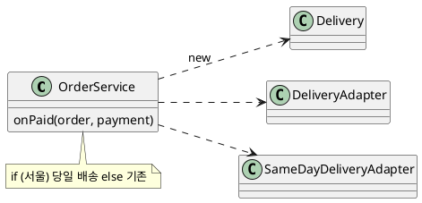
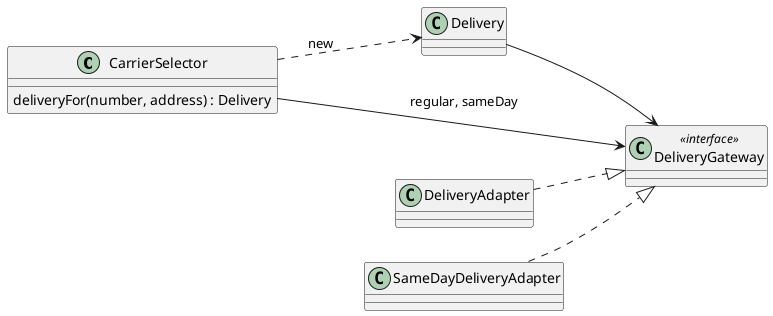
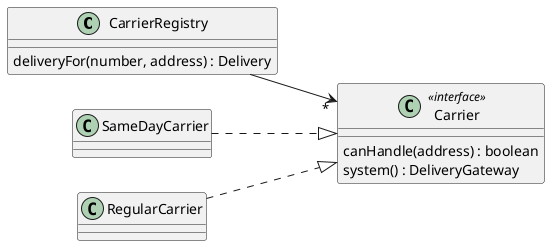
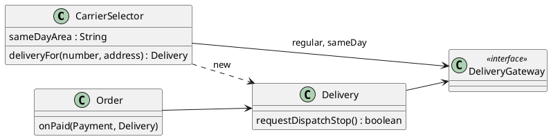
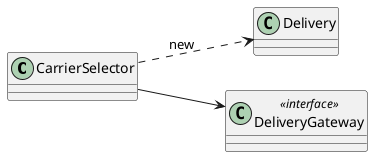
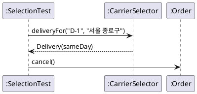

--------------------
Session 명: 09. 설계 대안 평가
--------------------

## 목차

01. 세션 목표
02. 변경에서 선택으로
03. 좋은 설계는 절충이다
04. 설계 대안
05. 평가 흐름
06. 평가 대상
07. 대안 A — 서비스의 분기
08. 대안 B — 대행사 선택기
09. 대안 C — 대행사의 자기 판단
10. 변경 영향
11. 응집도
12. 결합도
13. 의존
14. 추상화 비용
15. 원칙과 패턴
16. 단순함
17. 품질 요구
18. 절충
19. 선택과 근거
20. 포기한 대안
21. 결정 기록
22. 결정 기록 예
23. 선택한 설계
24. 선택 코드
25. 선택 테스트
26. 두 번째 평가 — 주문 항목의 생성
27. 잘못된 관행 — 원칙 점수 매기기
28. 잘못된 관행 — 대안 하나
29. 잘못된 관행 — 기록 없는 결정
30. 잘못된 관행 — 미래로 평가하기
31. 적정 평가
32. 실습 — 설계 대안 평가
33. 대안 비교 (안)
34. 결정 기록 (안)
35. 평가 보완 (안)
36. 요약

## 01. 세션 목표

이 세션은 같은 문제에 대한 **여러 설계 대안**을 비교해 고르고, 선택의 **근거와 포기한 대안**을 기록한다.

- 좋은 설계가 원칙의 개수가 아니라 **절충**(trade-off)의 선택임을 설명한다.
- 변경 영향 → 응집도·결합도 → 의존 → 추상화 비용 → 원칙·패턴 → 절충의 **평가 흐름**을 적용한다.
- 설계 대안별 **장단점**을 표로 비교하고, 현재의 변경 압력과 품질 요구로 고른다.
- 선택 근거와 **포기한 대안**을 결정 기록(ADR)으로 남긴다.
- 선택한 설계를 **코드와 테스트**로 확인한다.
- 원칙 점수 매기기·대안 하나·기록 없는 결정 같은 **잘못된 관행**을 식별한다.

**강사 노트**

- 입력은 "08. 변화 대응과 변이 설계"의 변경 요청과 설계다. 이 세션은 그 세션이 열어 둔 질문(배송마다 어느 대행사를 쓸지 누가 정하는가?)을 평가 대상으로 삼는다.

---

## 02. 변경에서 선택으로

변화 대응은 **어디를** 보호할지 정했다. 대안 평가는 **어떻게** 보호할지 여러 설계를 비교해 **고른다**.

| 앞 세션 | 이 세션 |
|---|---|
| 변경 요청의 파급을 관찰한다 | 같은 요청에 대한 대안의 파급을 **비교**한다 |
| 변이 지점을 찾는다 | 변이를 가두는 방법 **여럿**을 저울질한다 |
| 원칙을 적용한다 | 원칙이 **충돌할 때** 무엇을 우선할지 정한다 |

**강사 노트**

- 설계의 결정은 대부분 "이것 아니면 저것"이다. 하나의 정답을 찾는 것이 아니라, 지금의 조건에서 **더 나은** 쪽을 근거와 함께 고른다.

---

## 03. 좋은 설계는 절충이다

좋은 설계는 원칙을 많이 적용한 설계가 아니라, 현재의 변화와 품질 요구에 가장 적절한 **절충**(trade-off)을 선택한 설계다.

**인용문**

"상충하는 목표를 모두 만족시킬 수 없을 때 **타협을 받아들이는** 의지가 필요하다", "It also requires a willingness to accept objectives which are limited by physical, logical, and technological constraints, and to accept a compromise when conflicting objectives cannot be met.", [Hoare 1981]

- **목표는 충돌한다** — 유연성과 단순함, 결합 감소와 층의 수.
- **절충은 명시한다** — 무엇을 얻고 무엇을 포기했는지 적는다.

**강사 노트**

- 인용 근거: C. A. R. Hoare, ["The Emperor's Old Clothes"](https://noncombatant.org/hoare-emperors-old-clothes-turing-award/hoare-emperors-old-clothes.pdf), 1980 ACM Turing Award Lecture(1980-10-27 강연), *Communications of the ACM* 24(2), 1981 원문 확인. 인용은 "단순한 설계가 더 어렵다"는 대목에 이어지는 문장이다(「16. 단순함」).
- 원칙은 판단의 **렌즈**이지 점수표가 아니다(「27. 잘못된 관행 — 원칙 점수 매기기」).

---

## 04. 설계 대안

**설계 대안**은 같은 요구와 계약을 만족하는 **서로 다른 구조**다. 비교하려면 대안이 **적어도 둘**, 가능하면 셋이어야 한다.

- **같은 문제** — 대안은 같은 요구·계약을 만족해야 한다. 요구를 바꾸는 것은 대안이 아니다.
- **실제로 다른 구조** — 이름만 다른 대안은 대안이 아니다.
- **극단 하나 포함** — 가장 단순한 대안(추상화 없음)을 늘 넣는다. 비교의 기준점이다.

**강사 노트**

- 대안을 하나만 떠올리면 그 대안의 단점이 보이지 않는다. 가장 단순한 대안과 가장 유연한 대안을 양 끝에 두고 그 사이를 찾으면 좋다.
- 대안을 만드는 데 LLM을 쓰면 좋다. 다만 평가와 선택은 이 세션의 흐름으로 사람이 한다.

---

## 05. 평가 흐름

대안은 **여섯 단계**로 평가한다. 앞 단계일수록 현재의 변경 압력에 가깝고, 뒤 단계는 그 결과를 종합한다.

1. **변경 영향** — 실제 변경 요청이 오면 어디가 바뀌는가?
2. **응집도·결합도** — 책임이 모이고, 의존이 줄어드는가?
3. **의존** — 불안정한 것에 기대는가, 안정된 것에 기대는가?
4. **추상화 비용** — 더한 인터페이스·층이 제값을 하는가?
5. **원칙·패턴** — SOLID·GRASP·패턴의 렌즈로 놓친 점이 있는가?
6. **절충** — 무엇을 얻고 무엇을 포기하는가? 고르고 기록한다.

**강사 노트**

- 순서는 과정 설계의 평가 흐름(Change Impact → Cohesion/Coupling → Dependency → Abstraction Cost → SOLID/Pattern → Trade-off)을 따른다.
- 원칙·패턴이 다섯째인 이유 — 원칙은 앞의 구체적 판단을 **점검**하는 데 쓰고, 출발점으로 쓰지 않는다.

---

## 06. 평가 대상

"08. 변화 대응과 변이 설계"에서 배송 대행사가 둘이 되었다. 이제 **배송마다 어느 대행사를 쓸지** 정하는 책임을 어디에 둘지 평가한다.

- **규칙(교육용 가정)** — 배송지가 **당일 배송 권역**이면 당일 배송 대행사, 아니면 기존 대행사
- **계약** — 대행사가 무엇이든 `Order.cancel()`의 계약은 같다.
- **예상되는 변경** — 권역 규칙의 변경(실제 요청이 있었다), 대행사의 추가(추측)

**강사 노트**

- "08. 변화 대응과 변이 설계"의 「08. 당일 배송의 파급」은 "배송마다 대행사를 고르는 조립 책임"을 열어 둔 채 테스트에서 조립했다. 이 세션이 그 결정을 내린다.
- 당일 배송 권역(예: 주소가 "서울"로 시작)은 교육용 가정이다. 실제 권역은 대행사 계약으로 정한다.

---

## 07. 대안 A — 서비스의 분기

**다이어그램 — 클래스 다이어그램**

**가장 단순한 대안**이다. 주문 서비스가 배송지를 보고 대행사를 `if`로 고른다.

**도식 — PlantUML**



- **장점** — 새 클래스가 없다. 읽으면 바로 보인다.
- **단점** — 주문 서비스가 **연동의 구체 클래스**를 알고, 권역 규칙이 주문 쪽에 있다.

**강사 노트**

- 서비스의 메서드 `onPaid(order, payment)`는 이 대안을 설명하기 위한 가정이다(코드에 없음).
- 이 대안은 "05. 구조적 경계와 의존성"의 구조적 제약(업무 경계는 연동을 모른다)을 어긴다. 그래도 비교의 **기준점**으로 둔다.

---

## 08. 대안 B — 대행사 선택기

**다이어그램 — 클래스 다이어그램**

배송 경계에 **대행사 선택기**를 둔다. 선택기가 규칙을 갖고, 약속(`DeliveryGateway`)만 알며, 고른 대행사로 `Delivery`를 만든다.

**도식 — PlantUML**



- **장점** — 권역 규칙이 **배송 경계 한 곳**에 있다. 주문은 선택을 모른다.
- **단점** — 클래스가 하나 는다. 대행사가 셋이 되면 선택기를 고친다.

**강사 노트**

- 선택기는 GRASP의 **순수 가공**(도메인 개념이 아닌 가공 클래스)이자 **생성자**(`Delivery`의 초기화 정보를 가진 쪽)다("07. 책임·협력·계약"의 「07. GRASP」, "08. 변화 대응과 변이 설계"의 「12. GRASP 변화 대응」).
- 선택기는 연동의 구체 클래스를 모른다. 어느 연동을 끼울지는 조립하는 쪽(애플리케이션의 시작점)이 정한다.

---

## 09. 대안 C — 대행사의 자기 판단

**다이어그램 — 클래스 다이어그램**

**가장 유연한 대안**이다. 대행사마다 "이 배송지를 처리할 수 있는가?"를 답하고, 목록에서 처음 답한 대행사를 쓴다.

**도식 — PlantUML**



- **장점** — 대행사를 더할 때 **구현만 추가**한다(OCP).
- **단점** — 인터페이스·레지스트리·순서 규칙이 늘고, "어느 대행사가 먼저인가"라는 **새 규칙**이 생긴다.

**강사 노트**

- 이 대안의 이름(`CarrierRegistry`, `Carrier`, `SameDayCarrier`, `RegularCarrier`)은 비교를 위한 후보다(코드에 없음). 선택되지 않았으므로 용어집에 더하지 않는다.
- 구조는 책임 연쇄(Chain of Responsibility)와 닮았다. 패턴 이름은 비교의 어휘로만 쓴다.

---

## 10. 변경 영향

평가의 첫 단계는 **변경 시나리오**를 대안마다 적용해 보는 것이다. 실제 요청과 추측을 **구분**해 적는다.

| 변경 시나리오 | A 서비스 분기 | B 선택기 | C 자기 판단 |
|---|---|---|---|
| **권역 규칙 변경**(실제) | `OrderService` | `CarrierSelector` | 해당 `Carrier` |
| **대행사 API 변경**(실제) | 연동 | 연동 | 연동 |
| **대행사 추가**(추측) | 서비스·분기 | 선택기 | 구현 추가 |
| **주문 규칙 변경** | 서비스가 함께 흔들림 | `Order`만 | `Order`만 |

- 실제 변경에서는 **B와 C가 비슷**하다. C의 이점은 추측한 변경(대행사 추가)에서만 나타난다.

**강사 노트**

- 실제/추측의 구분은 "08. 변화 대응과 변이 설계"의 변이 지점과 진화 지점이다. 권역 규칙은 이미 한 번 바뀐 교육용 가정이다.
- A에서 주문 규칙 변경이 서비스까지 흔드는 이유 — 권역 분기와 주문 조정이 한 클래스에 섞였기 때문이다(「11. 응집도」).

---

## 11. 응집도

응집도가 **높게** 유지되는 대안을 고른다. 한 클래스가 **한 이유**로 바뀌는가를 본다.

**인용문**

"응집도가 높게 유지되도록 책임을 배정한다. 이것으로 **대안을 평가**한다", "Assign a responsibility so that cohesion remains high. Use this to evaluate alternatives.", [Larman 2004]

| 대안 | 권역 규칙이 있는 곳 | 그 클래스가 바뀌는 이유 |
|---|---|---|
| **A** | `OrderService` | 주문 조정, 권역 규칙 — 둘 |
| **B** | `CarrierSelector` | 권역 규칙 — 하나 |
| **C** | 각 `Carrier` | 대행사별 조건 — 하나, 흩어짐 |

**강사 노트**

- 인용 근거: Craig Larman, *Applying UML and Patterns*, 3rd ed.(2004), §17.14 "High Cohesion" 원문 확인. 같은 절은 응집도가 낮은 클래스가 이해·재사용·유지보수가 어렵고 변경에 늘 영향을 받는다고 설명한다.
- C는 응집도는 높지만 권역 규칙이 대행사마다 **흩어진다**. 규칙 전체를 보려면 모든 구현을 열어야 한다.

---

## 12. 결합도

결합도가 **낮게** 유지되는 대안을 고른다. 다른 것이 같다면 결합이 더 낮은 쪽을 택한다.

**인용문**

"결합도가 낮게 유지되도록 책임을 배정한다. 이 원칙으로 **대안을 평가**한다", "Assign a responsibility so that coupling remains low. Use this principle to evaluate alternatives.", [Larman 2004]

| 대안 | 주문 쪽이 아는 것 | 선택하는 쪽이 아는 것 |
|---|---|---|
| **A** | 연동 구체 클래스 둘 | — |
| **B** | 없음(`Delivery`만 받는다) | `DeliveryGateway` 약속 |
| **C** | 없음 | `Carrier` 약속과 레지스트리 |

**강사 노트**

- 인용 근거: Larman, 3rd ed.(2004), §17.12 "Low Coupling" 원문 확인. 같은 장은 "다른 모든 것이 같다면 결합이 더 낮은 설계를 선호하라"고 말한다(§17.4 부근의 Monopoly 예).
- 결합도는 숫자가 아니라 **무엇을 아는가**로 비교한다. 아는 것이 약속이면 낮고, 구체 클래스이면 높다.

---

## 13. 의존

결합의 **양**보다 **무엇에** 의존하는가가 중요하다. 불안정한 것에 대한 의존이 문제다.

**인용문**

"문제는 높은 결합 자체가 아니라, 인터페이스·구현·존재 자체가 **불안정한 요소**에 대한 높은 결합이다", "It is not high coupling per se that is the problem; it is high coupling to elements that are unstable in some dimension, such as their interface, implementation, or mere presence.", [Larman 2004]

| 대안 | 의존 대상 | 안정성 |
|---|---|---|
| **A** | 연동 구체 클래스(외부 API에 따라 바뀜) | 불안정 |
| **B** | `DeliveryGateway`(업무 경계의 약속) | 안정 |
| **C** | `Carrier`(새 약속) | 새로 만든 약속이라 아직 검증 전 |

**강사 노트**

- 인용 근거: Larman, 3rd ed.(2004), §17.12 "Low Coupling"의 "Pick Your Battles" 원문 확인. 같은 곳은 안정되고 널리 쓰이는 요소(자바 표준 라이브러리 등)에 대한 높은 결합은 거의 문제가 되지 않는다고 말한다(금기 사항).
- 의존 방향의 원칙은 "05. 구조적 경계와 의존성"의 SDP, "07. 책임·협력·계약"의 DIP와 같다.

---

## 14. 추상화 비용

추상화는 **비용**이다. 새 인터페이스·층·규칙이 지금의 압력에 대해 **제값을 하는지** 따진다.

**인용문**

"미래 대비는 추측이므로 완벽하기 어렵다. 예측한 변경이 오더라도 **추측한 설계는 어느 정도 바뀌기** 마련이다", "future proofing is arguably rarely perfect, since it is speculation; even if the predicted change occurs, some change in the speculated design is likely.", [Larman 2004]

| 대안 | 더한 것 | 제값을 하는 조건 |
|---|---|---|
| **A** | 없음 | — |
| **B** | 클래스 하나 | 권역 규칙이 바뀔 때(실제) |
| **C** | 인터페이스·레지스트리·구현 둘·순서 규칙 | 대행사가 자주 늘 때(추측) |

**강사 노트**

- 인용 근거: Larman, 3rd ed.(2004), §33.7 "The Art: Resolution of Architectural Factors"의 "Priorities and Evolution Points: Under- and Over-engineering" 원문 확인. 같은 곳은 추측성 미래 대비가 적중하지 않으면 값비싼 과잉 설계가 된다고 경고한다.
- 비용에는 **읽는 비용**이 포함된다. 새 팀원이 "대행사는 어떻게 정해지는가?"에 답하려면 C에서는 레지스트리의 등록 순서까지 찾아야 한다.

---

## 15. 원칙과 패턴

원칙과 패턴은 앞 단계의 판단을 **점검하는 렌즈**다. 대안이 원칙을 어기는 곳, 과하게 쓰는 곳을 찾는다.

| 렌즈 | A | B | C |
|---|---|---|---|
| **SRP** | 위반(서비스에 두 이유) | 지킴 | 지킴 |
| **DIP** | 위반(구체 연동에 의존) | 지킴 | 지킴 |
| **OCP**(대행사 추가) | 닫히지 않음 | 선택기 수정 | 닫힘 |
| **GRASP** | 정보 전문가 아님 | 순수 가공·생성자 | 보호된 변이 |
| **패턴** | — | — | 책임 연쇄와 닮음 |

- 원칙을 **가장 많이** 지키는 것은 C다. 그러나 C의 OCP 이점은 **추측한** 변경에 대한 것이다.

**강사 노트**

- 원칙을 가장 많이 지키는 대안이 가장 좋은 대안은 아니다 — 앵커 메시지. 이 표만 보고 C를 고르면 「27. 잘못된 관행 — 원칙 점수 매기기」다.
- SOLID는 "07. 책임·협력·계약"·"08. 변화 대응과 변이 설계"에서, GRASP는 두 세션의 목록 슬라이드에서 다뤘다.

---

## 16. 단순함

같은 요구를 만족한다면 **더 단순한** 대안이 낫다. 단순함은 결함이 **명백히 없어 보이는** 설계다.

**인용문**

"설계를 만드는 방법은 둘이다. **명백히 결함이 없을 만큼 단순하게** 만들거나, 명백한 결함이 없을 만큼 복잡하게 만든다", "There are two ways of constructing a software design: One way is to make it so simple that there are obviously no deficiencies and the other way is to make it so complicated that there are no obvious deficiencies.", [Hoare 1981]

**인용문**

"**테스트를 통과한다**, 의도를 드러낸다, 중복이 없다, 요소가 가장 적다 — 규칙은 우선순위 순서다", "Passes the tests; Reveals intention; No duplication; Fewest elements", [Fowler 2015b]

**강사 노트**

- Hoare 인용 근거: 「03. 좋은 설계는 절충이다」와 같은 강연 원문 확인. 같은 대목은 첫 방법이 훨씬 어렵다고 말한다.
- 네 규칙 근거: Martin Fowler, ["BeckDesignRules"](https://martinfowler.com/bliki/BeckDesignRules.html), 2015-03-02 원문 확인. 규칙은 Kent Beck이 익스트림 프로그래밍에서 제시한 단순한 설계의 규칙이며, 문구와 "The rules are in priority order"는 Fowler의 정리를 따랐다. 인용은 네 항목의 목록을 이어 옮긴 것이다.
- 적용 — 세 대안 모두 테스트를 통과하고 의도를 드러낸다면, 요소가 가장 적은 쪽(A, 그다음 B)이 우선이다. A는 SRP·DIP 위반으로 의도가 흐려져 탈락한다.

---

## 17. 품질 요구

대안은 **품질 요구**로도 비교한다. 이 문제에서 중요한 품질은 **변경 용이성**과 **시험 용이성**이다.

| 품질 | A | B | C |
|---|---|---|---|
| **변경 용이성**(권역 규칙) | 서비스 수정 | 선택기 한 곳 | 흩어진 구현 |
| **시험 용이성** | 서비스 전체 준비 | 가짜 약속 둘로 선택기만 | 레지스트리·구현 준비 |
| **이해 용이성** | 가장 쉽다 | 쉽다 | 순서 규칙까지 알아야 한다 |
| **성능** | 차이 없음 | 차이 없음 | 목록 순회(무시할 수준) |

**강사 노트**

- 품질 특성의 분류는 "02. 요구 분석과 유스케이스"의 ISO/IEC 25010을 참조한다. 모든 특성을 평가하지 않고 **이 문제에 걸린** 특성만 본다.
- 품질 요구가 달라지면 선택도 달라진다 — 대행사를 매달 바꾸는 사업이라면 C의 변경 용이성이 더 중요해진다.

---

## 18. 절충

평가를 **한 표**로 모아 무엇을 얻고 무엇을 포기하는지 본다. 가중치는 **현재의 압력**이 정한다.

| 기준 | A | B | C |
|---|---|---|---|
| **실제 변경 영향** | 넓다 | 좁다 | 좁다 |
| **응집도·결합도** | 나쁘다 | 좋다 | 좋다(규칙 흩어짐) |
| **의존** | 불안정 | 안정 | 새 약속 |
| **추상화 비용** | 없음 | 작다 | 크다 |
| **추측한 변경** | 넓다 | 보통 | 좁다 |
| **단순함** | 가장 단순 | 단순 | 복잡 |

- **B**는 실제 압력에서 C와 같고 비용은 작다. **C**의 이점은 추측한 변경에서만 나타난다.

**강사 노트**

- 절충표는 점수를 더하는 표가 아니다. 행마다 **지금 얼마나 중요한가**를 말로 적고, 결정을 이끄는 행 하나둘을 찾는다. 여기서는 "실제 변경 영향"과 "추상화 비용"이다.
- 표의 "좋다·나쁘다"는 이 사례의 판단이다. 같은 대안도 다른 요구에서는 다르게 평가된다.

---

## 19. 선택과 근거

**대안 B**(대행사 선택기)를 고른다. 근거는 **실제 압력**에 대한 변경 영향과 **추상화 비용**이다.

- **근거 1** — 실제로 바뀌는 권역 규칙이 배송 경계 한 곳(`CarrierSelector`)에 갇힌다.
- **근거 2** — 주문은 선택을 모르고, 선택기는 약속만 안다(구조적 제약을 지킨다).
- **근거 3** — 더한 것은 클래스 하나다. 대행사가 셋이 되기 전에는 C의 구조가 제값을 하지 않는다.
- **다시 열 조건** — 대행사가 **셋 이상**이 되거나 대행사별 조건이 복잡해지면 C를 다시 검토한다.

**강사 노트**

- "다시 열 조건"이 결정의 절반이다. 조건이 오면 지금의 결정을 뒤집는 것이 실패가 아니라 계획의 실행이 된다.
- 선택은 과정 공통 전제에 기록했다 — 배송마다 대행사를 고르는 책임은 `delivery`의 `CarrierSelector`에 있다.

---

## 20. 포기한 대안

고른 대안만큼 **버린 대안**도 기록한다. 나중에 조건이 바뀌면 그 대안을 다시 꺼내야 하기 때문이다.

**인용문**

"**대안을 버린 이유**를 설명하는 것이 중요하다. 제품이 진화할 때 설계자는 그 대안을 다시 검토하거나, 어떤 대안이 고려됐고 왜 하나가 선택됐는지 알고 싶어 한다", "Explaining the rationale of rejecting the alternatives is important, as during future product evolution, an architect may reconsider these alternatives, or at least want to know what alternatives were considered, and why one was chosen.", [Larman 2004]

| 포기한 대안 | 버린 이유 | 다시 볼 때 |
|---|---|---|
| **A 서비스의 분기** | 업무 경계가 연동을 알고, 서비스가 두 이유로 바뀐다 | 다시 보지 않는다(구조적 제약 위반) |
| **C 대행사의 자기 판단** | 이점이 추측한 변경에만 있고 비용이 크다 | 대행사가 셋 이상이 될 때 |

**강사 노트**

- 인용 근거: Larman, 3rd ed.(2004), §33.7 "The Art: Resolution of Architectural Factors" 원문 확인. 같은 곳은 결정을 **기술 메모**(technical memo)로 남기며, 형식은 중요하지 않고 나중에 시스템을 바꿀 사람이 판단하는 데 도움이 될 정보를 적으라고 말한다.
- 기록이 없으면 몇 주 뒤 원래 설계자도 근거를 잊는다 — 같은 곳의 각주.

---

## 21. 결정 기록

**결정 기록**(Architecture Decision Record, ADR)은 중요한 설계 결정 하나를 **맥락·결정·결과**로 짧게 남기는 문서다. 결정마다 한 장씩 모은다.

**인용문**

"구조, 비기능 특성, 의존, 인터페이스, 구현 기법에 영향을 주는 **아키텍처적으로 중요한 결정**의 기록을 모아 둔다", "We will keep a collection of records for "architecturally significant" decisions: those that affect the structure, non-functional characteristics, dependencies, interfaces, or construction techniques.", [Nygard 2011]

| 항목 | 적는 것 |
|---|---|
| **제목** | 결정을 한 문장으로 |
| **상태** | 제안·채택·대체됨 |
| **맥락** | 결정을 부른 힘 — 요구, 변경 압력, 제약 |
| **결정** | 무엇을 하기로 했는가 |
| **결과** | 좋든 나쁘든 결정 뒤에 생기는 모든 결과 |

**강사 노트**

- 인용 근거: Michael Nygard, ["Documenting Architecture Decisions"](https://www.cognitect.com/blog/2011/11/15/documenting-architecture-decisions), 2011-11-15 원문 확인. 같은 글은 결과(Consequences)에 긍정·부정·중립의 결과를 모두 적으라고 한다(요약).
- 이 과정은 포기한 대안과 다시 열 조건을 "결과" 옆에 함께 적는다(Larman의 기술 메모와 같다).
- 결정 기록은 코드 저장소에 코드와 함께 둔다. 아키텍처 수준의 결정은 "13. OOAD에서 전문영역으로 — Architecture · DDD · MSA"로 이어진다.

---

## 22. 결정 기록 예

「19. 선택과 근거」의 결정을 결정 기록으로 쓴다. **한 장**에 들어가야 읽힌다.

```text
제목: 배송 대행사 선택은 배송 경계의 선택기가 맡는다
상태: 채택
맥락: 배송 대행사가 둘이다(기존, 당일 배송). 배송지가 당일 배송 권역이면
      당일 배송 대행사를 쓴다. 권역 규칙은 바뀐 적이 있다. 대행사 추가는 추측이다.
결정: delivery에 CarrierSelector를 둔다. 선택기는 DeliveryGateway 약속만 알고,
      고른 대행사로 Delivery를 만든다. order는 선택을 모른다.
결과: 권역 규칙의 변경은 선택기 한 곳에서 끝난다. 클래스가 하나 는다.
      대행사가 늘면 선택기를 고친다.
포기한 대안: 서비스의 분기(구조적 제약 위반), 대행사의 자기 판단(추측에 대한 비용).
다시 열 조건: 대행사가 셋 이상이 되거나 대행사별 조건이 복잡해질 때.
```

**강사 노트**

- 결정 기록의 문장은 설계 용어집의 이름(`CarrierSelector`, `DeliveryGateway`)을 그대로 쓴다.
- 짧을수록 읽힌다. 평가표 전체는 기록에 붙이지 않고 필요하면 링크한다.

---

## 23. 선택한 설계

**다이어그램 — 설계 클래스 다이어그램**

선택기는 **약속**만 알고, 조립하는 쪽이 연동을 끼운다. 주문과 결제는 이 결정과 무관하다.

**도식 — PlantUML**



**강사 노트**

- `CarrierSelector`는 `delivery` 패키지에 있다. `order`는 선택기를 모르고, 만들어진 `Delivery`를 받을 뿐이다(`onPaid`).
- 누가 선택기를 부르는가 — 결제 흐름을 조정하는 쪽(주문 서비스의 결제 처리)이다. 이 예제는 결제 흐름을 구현하지 않아 테스트에서 부른다.

---

## 24. 선택 코드

**다이어그램 — 클래스 다이어그램**

선택기의 코드는 **규칙 한 줄**이다. 선택의 결과로 `Delivery`를 만든다(생성자 원칙).

**도식 — PlantUML**



```java
    public Delivery deliveryFor(String deliveryNumber, String shippingAddress) {
        DeliveryGateway carrier = shippingAddress.startsWith(sameDayArea) ? sameDay : regular;
        return new Delivery(deliveryNumber, carrier);
    }
```

**강사 노트**

- 코드는 `code/s09/delivery/CarrierSelector.java`의 발췌이며, 컴파일·실행해 확인한다. 실행: `javac -encoding UTF-8 -d out $(find . -name "*.java") && java -cp out test.SelectionTest`.
- 선택기는 배송지를 문자열로 받는다. `delivery`가 `order`의 `Address`를 알면 패키지 순환이 생기기 때문이다("05. 구조적 경계와 의존성"의 순환 없음). 이것도 이 설계의 작은 절충이다.

---

## 25. 선택 테스트

**다이어그램 — 시퀀스 다이어그램**

테스트는 **선택 규칙**과 **바뀌지 않아야 할 계약**을 함께 확인한다. 대행사가 달라도 취소의 계약은 같다.

**도식 — PlantUML**



```java
        // 선택 규칙 — 당일 배송 권역이면 당일 배송 대행사, 아니면 기존 대행사
        var seoul = newOrder("O-1", "서울 종로구");
        seoul.onPaid(new Payment(new Money(2000), fakePayment), selector.deliveryFor("D-1", "서울 종로구"));
        seoul.cancel();
        check(requests.equals(List.of("당일 배송 픽업 취소 D-1", "환불 2000")));
```

**강사 노트**

- 결과를 먼저 예측하게 한다: 부산 주소의 주문을 취소하면 어느 대행사에 요청하는가? 환불 요청의 순서는 달라지는가?
- 테스트는 `order`가 `CarrierSelector`를 모르는지도 확인한다 — 결정 기록의 "order는 선택을 모른다"를 코드로 지킨다.

---

## 26. 두 번째 평가 — 주문 항목의 생성

같은 흐름을 **작은 결정**에도 쓴다. 주문 항목을 **누가 만드는가**의 두 대안이다.

| 기준 | 현재: `OrderItem.confirm(상품, 수량)` | 대안: `Order`가 만든다 |
|---|---|---|
| **GRASP 생성자** | 초기 정보(상품)를 가진 쪽이 부른다 | 항목을 포함하는(합성) 쪽이 만든다 |
| **불변 조건** | 주문은 받은 목록을 검사한다 | 주문이 만들며 검사한다 |
| **결합** | 주문은 상품을 모른다 | 주문이 상품을 알게 된다 |
| **결정** | 유지 — 주문과 상품의 경계를 지킨다 | 항목 추가·삭제 규칙이 생기면 재검토 |

**강사 노트**

- "07. 책임·협력·계약"의 「07. GRASP」 노트가 남긴 연습 거리다. 생성자 원칙의 조건(포함·초기 정보)이 두 대안을 모두 지지한다 — 이럴 때 결정을 가르는 것은 **결합**(주문이 상품을 아는가)이다.
- 작은 결정은 결정 기록까지 남기지 않는다. 표 한 장과 코드 주석이면 충분하다(「31. 적정 평가」).

---

## 27. 잘못된 관행 — 원칙 점수 매기기

지킨 원칙의 **개수**로 대안을 고른다. 원칙이 많을수록 좋은 설계라고 여긴다.

| 원칙 점수 | 절충의 판단 |
|---|---|
| C가 SRP·DIP·OCP·PV를 모두 지키니 C | C의 OCP 이점은 추측한 변경에만 있다 |
| 원칙마다 1점, 합계가 큰 쪽 | 결정을 이끄는 기준 하나둘을 찾는다 |
| 원칙을 어기면 무조건 탈락 | 어긴 대가와 얻는 것을 비교한다 |

**강사 노트**

- 이 세션의 앵커 메시지를 거꾸로 한 관행이다. 원칙은 **렌즈**이고, 무엇을 볼지 알려 줄 뿐 무엇을 고를지 정해 주지 않는다.
- 예외 — 과정의 **구조적 제약**(업무 경계는 연동을 모른다)은 절충의 대상이 아니라 전제다. A는 이 때문에 탈락했다.

---

## 28. 잘못된 관행 — 대안 하나

처음 떠오른 설계 **하나**만 검토한다. 비교할 것이 없으니 단점도, 버린 것도 없다.

- **증상** — 설계 리뷰에서 "왜 이렇게 했나?"에 "이렇게 하면 되니까"로 답한다.
- **결과** — 과잉(처음부터 C) 또는 부족(처음부터 A)이 그대로 코드가 된다.
- **대응** — 가장 단순한 대안과 가장 유연한 대안을 **양 끝**에 두고 비교한다(「04. 설계 대안」).

**강사 노트**

- LLM에 설계를 요청할 때 특히 흔하다. LLM의 첫 답은 대안 하나다. "대안 셋과 각각의 장단점을 보여줘"로 요청한다.
- 대안을 만드는 비용은 작다. 다이어그램 한 장, 표 한 줄이면 된다.

---

## 29. 잘못된 관행 — 기록 없는 결정

결정은 했지만 **근거와 포기한 대안**을 남기지 않는다. 몇 달 뒤 같은 논쟁을 처음부터 다시 한다.

| 기록 없는 결정 | 결정 기록 |
|---|---|
| "왜 선택기가 있지?" — 아무도 모른다 | 맥락·결정·결과·다시 열 조건 |
| 새 팀원이 C로 "개선"한다 | C를 버린 이유와 다시 볼 조건이 있다 |
| 조건이 바뀌어도 알아채지 못한다 | "대행사 셋 이상"이 신호가 된다 |

**강사 노트**

- 기록의 비용은 몇 분이다. 기록하지 않은 비용은 반복된 회의와 되돌린 코드다.
- 결정 기록은 LLM에 맥락으로 주기 좋은 문서다. 설계 의도를 코드만으로 추측하게 하지 않는다 — "14. AI-native SW공학".

---

## 30. 잘못된 관행 — 미래로 평가하기

대안을 **추측한 미래**의 변경으로 평가한다. "언젠가 대행사가 열 개가 되면"으로 오늘의 설계를 고른다.

| 미래로 평가 | 현재의 압력으로 평가 |
|---|---|
| 대행사 열 개를 가정해 C | 대행사 둘, 권역 규칙 변경이 실제 |
| 모든 시나리오에 같은 가중치 | 실제와 추측을 구분해 적는다 |
| "확장성이 좋다"로 결론 | 무엇에 대한 확장인지 묻는다 |

**강사 노트**

- 추측한 변경도 평가표에 적는다. 다만 **추측**이라고 표시하고, 결정의 근거가 아니라 **다시 열 조건**으로 쓴다(「19. 선택과 근거」).
- "08. 변화 대응과 변이 설계"의 추측성 일반화를 평가 단계에서 막는 방법이다.

---

## 31. 적정 평가

평가의 **깊이**는 결정의 **무게**에 맞춘다. 모든 결정에 여섯 단계와 결정 기록을 쓰지 않는다.

| 결정의 무게 | 평가 | 기록 |
|---|---|---|
| **되돌리기 쉬움**(메서드 이름, 작은 생성 책임) | 머릿속·코드 리뷰 | 없음 또는 주석 |
| **되돌리기 어려움**(경계, 약속, 외부 연동) | 대안 셋, 여섯 단계 | 결정 기록 |
| **여러 팀·시스템에 걸침** | 아키텍처 평가 | 결정 기록과 리뷰 |

**강사 노트**

- 되돌리기 어려운 결정만 무겁게 다룬다는 판단은 "05. 구조적 경계와 의존성"의 「03. 구조적 경계」와 같다.
- 여러 시스템에 걸친 결정의 평가(품질 속성 시나리오 등)는 "13. OOAD에서 전문영역으로 — Architecture · DDD · MSA"에서 다룬다.

---

## 32. 실습 — 설계 대안 평가

실습 8의 변경 요청 B(매월 ○일 배송)에 대한 **설계 대안 셋**을 LLM과 만들고, 평가 흐름으로 비교해 **결정 기록**을 쓴 뒤 점검 항목으로 **피드백**하여 완성하십시오.

- **투입물**
  + 실습 8의 **변경 영향 분석·변이 설계·설계 클래스 다이어그램**과 보완, **용어집**
- **프롬프트**
  + ① "배송 주기에 '매월 ○일'을 더하는 **설계 대안 셋**을 만들어줘. 가장 단순한 대안과 가장 유연한 대안을 포함하고, 각 대안을 PlantUML 클래스 다이어그램과 장단점으로 보여줘."
  + ② "변경 영향, 응집도·결합도, 의존, 추상화 비용, 원칙·패턴, 절충 순서로 **비교표**를 만들고, 하나를 골라 **결정 기록**(맥락·결정·결과·포기한 대안·다시 열 조건)을 써줘."
- **점검 항목**
  1. **대안** — 셋이 같은 요구를 만족하고 구조가 실제로 다른가?
  2. **압력** — 실제 변경과 추측한 변경을 구분해 평가했는가?
  3. **비용** — 추상화 비용과 읽는 비용을 적었는가?
  4. **점수** — 원칙의 개수로 고르지 않았는가?
  5. **기록** — 포기한 대안의 이유와 다시 열 조건이 있는가?
  6. **이름** — 새 이름을 용어집에 더했는가(선택되지 않은 대안의 이름은 제외)?
- **결과물** — 대안 비교표와 결정 기록. 기술 제약 아래의 설계("10. 기술 제약과 도메인 의미 보존")의 입력이 됩니다.

**강사 노트**

- LLM은 원칙을 많이 지키는 대안을 "가장 좋다"고 결론짓기 쉽다. 점검 항목 4로 되돌린다.
- 실습 8의 변이 설계 (안)은 이미 하나의 대안(다형성)이다. 이 실습은 그 결정을 **비교로 정당화**하거나 뒤집는다.

---

## 33. 대안 비교 (안)

세 대안 중 **B 다형적 주기**가 실제 변경(주기 종류 추가)을 가장 좁게 가두고, 비용은 작다.

| 기준 | A 주기 종류 `enum`+`switch` | B `DeliveryCycle` 다형성 | C 주기 규칙 문자열(설정) |
|---|---|---|---|
| **실제 변경 영향** | `switch`가 있는 곳 모두 | 구현 하나 추가 | 파서와 규칙 |
| **응집도·결합도** | 주기 계산이 흩어짐 | 주기마다 한 클래스 | 파서에 모임 |
| **의존** | `Subscription`이 종류를 앎 | 약속에만 | 문자열 형식에 |
| **추상화 비용** | 없음 | 인터페이스 하나 | 파서·문법·검증 |
| **절충** | 단순하나 흩어진다 | 균형 | 추측한 유연성 |

**강사 노트**

- C(예: "매월 15일" 같은 규칙 문자열)는 주기 종류가 매우 많아지거나 사용자가 규칙을 직접 쓰는 요구가 있을 때의 대안이다. 지금은 추측이다.
- A는 주기 계산을 `switch`로 여러 곳(회차 생성, 다음 배송일 표시)에서 반복하게 된다 — "08. 변화 대응과 변이 설계"의 타입 검사 분기.

---

## 34. 결정 기록 (안)

배송 주기는 **다형적 약속**(`DeliveryCycle`)으로 설계한다. 규칙 문자열은 **다시 열 조건**으로 남긴다.

- **제목** — 배송 주기는 `DeliveryCycle` 약속과 주기별 구현으로 설계한다
- **상태** — 채택
- **맥락**
  - **요구** — 일 간격(1~28일)에 매월 ○일(1~28일)이 더해졌다.
  - **압력** — 주기 종류가 **둘**이 되었다(실제). 더 늘어날지는 추측이다.
- **결정** — `Subscription`은 `DeliveryCycle.nextDate`에 맡긴다. `DailyCycle`·`MonthlyCycle`이 구현한다.
- **결과**
  - **좋은 점** — 새 주기는 구현 하나. 회차 금액·만료일의 계약은 그대로다.
  - **나쁜 점** — 인터페이스 하나가 는다.
- **포기한 대안** — `enum`+`switch`(분기가 흩어짐), 규칙 문자열(추측에 대한 비용)
- **다시 열 조건** — 고객이 주기 규칙을 **직접 입력**하는 요구가 생길 때

**강사 노트**

- 결정 기록의 이름은 용어집(실습 8 보완의 `DeliveryCycle`·`DailyCycle`·`MonthlyCycle`)과 같다.
- 수강생의 결정이 달라도 **맥락·근거·포기한 대안·다시 열 조건**이 서로 맞으면 맞다.

---

## 35. 평가 보완 (안)

대안을 평가하며 발견한 것은 **후속 작업에 영향을 미치는 경우에만** 이전 산출물에 반영한다.

- **요구사항 명세서**(실습 1)
  - **R1 경계값** — 매월 ○일은 1~28일로 제한한다는 것을 규칙에 밝힌다(29~31일이 없는 달).
- **변이 설계**(실습 8)
  - **정당화** — 다형성의 선택에 결정 기록을 붙인다.
- **결정 기록 목록**(새 산출물)
  - **첫 기록** — 배송 주기의 설계. 앞으로의 설계 결정을 같은 형식으로 모은다.
- **※ 현행화 기준**
  - **반영** — R1 경계값, 결정 기록. 기술 제약 설계의 입력이 된다.
  - **기록만** — 실습 8 변이 설계 (안)의 설명 문구.

**강사 노트**

- 결정 기록 목록은 이 과정에서 처음 생기는 **지속 산출물**이다. 문서가 아니라 설계의 기억이다.

---

## 36. 요약

이 세션은 같은 문제의 **설계 대안**을 평가 흐름으로 비교해 고르고, **근거와 포기한 대안**을 기록했다.

### 설계 대안 평가의 핵심

- **절충** — 좋은 설계는 원칙의 개수가 아니라 현재에 맞는 절충의 선택이다
- **대안** — 가장 단순한 대안과 가장 유연한 대안을 양 끝에 둔다
- **평가 흐름** — 변경 영향 → 응집·결합 → 의존 → 추상화 비용 → 원칙·패턴 → 절충
- **압력** — 실제 변경은 근거로, 추측한 변경은 다시 열 조건으로
- **기록** — 결정 기록에 맥락·결정·결과·포기한 대안·다시 열 조건
- **잘못된 관행** — 원칙 점수 매기기, 대안 하나, 기록 없는 결정, 미래로 평가하기

### 다음 세션

- "**10. 기술 제약과 도메인 의미 보존**" — 영속성·프레임워크·외부 시스템 같은 기술 제약에 적응하면서 도메인 의미를 보존한다.

**강사 노트**

- 다음 세션의 기술 제약(저장 기술, 외부 API)도 대안 평가의 대상이다. 이 세션의 흐름과 결정 기록을 그대로 쓴다.
