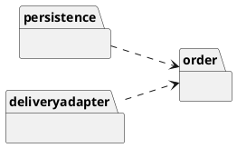
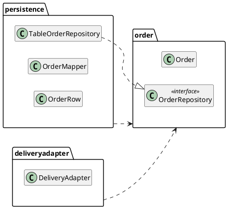
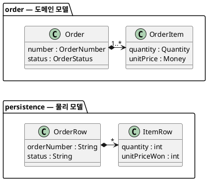
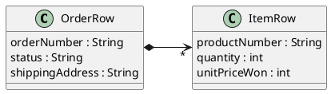
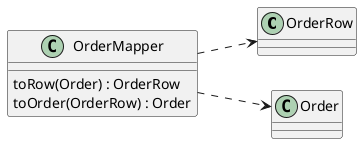
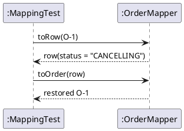

--------------------
Session 명: 10. 기술 제약과 도메인 의미 보존
--------------------

## 목차

01. 세션 목표
02. 설계에서 실현으로
03. 기술이 의미를 바꾼다
04. 영속성의 압력
05. 프레임워크의 압력
06. 외부 API의 압력
07. 도메인의 격리
08. 4개의 모델
09. 도메인 모델과 물리 모델
10. 데이터 매퍼
11. 매핑 표
12. 의미 손실
13. 상태 값의 매핑
14. 확정 값의 매핑
15. 복원과 불변 조건
16. 외부 형식의 변환
17. 변환의 손실
18. 물리 모델 코드
19. 매퍼 코드
20. 라운드트립 테스트
21. 잘못된 관행 — 테이블이 모델
22. 잘못된 관행 — 외부 모델 닮기
23. 잘못된 관행 — 프레임워크 규칙
24. 잘못된 관행 — 조용한 기본값
25. 적정 분리
26. 실습 — 기술 제약과 의미 보존
27. 매핑 표 (안)
28. 의미 손실 점검 (안)
29. 기술 제약 보완 (안)
30. 요약

## 01. 세션 목표

이 세션은 영속성·프레임워크·외부 시스템 같은 **기술 제약**에 적응하면서 도메인 **의미를 보존**한다.

- 기술 제약이 설계에 주는 **압력**을 영속성·프레임워크·외부 API로 나누어 설명한다.
- 도메인 모델을 **어댑터·인프라·물리 모델**과 분리하고, 각 모델이 어느 패키지에 있는지 설명한다.
- 매핑과 변환에서 생기는 **의미 손실**(상태 값, 확정 값, 불변 조건, 외부 형식)을 찾는다.
- **라운드트립 테스트**로 저장·복원·변환이 의미를 바꾸지 않았는지 확인한다.
- 테이블이 모델·외부 모델 닮기·조용한 기본값 같은 **잘못된 관행**을 식별한다.

**강사 노트**

- 입력은 "09. 설계 대안 평가"까지의 설계와 결정 기록이다. 기술 선택(어느 데이터베이스·프레임워크)은 이 세션의 대상이 아니다. 어느 기술이든 의미를 지키는 **구조와 검증**을 다룬다.
- 세션 전체가 같은 예를 쓴다 — 주문 O-1(펜 2개, 단가 1,000원, 배송지 서울, 결제 뒤 취소되어 `CANCELLING`). 코드의 테스트(`code/s10/test/MappingTest.java`)도 같은 주문이다.

---

## 02. 설계에서 실현으로

주문 O-1을 데이터베이스에 **저장했다가 다시 읽는** 일을 생각한다. 그 사이에 **구조와 표현**은 바뀌어도 되지만, 주문의 **의미**는 바뀌면 안 된다.

| 주문 O-1에서 바뀌어도 되는 것 | 바뀌면 안 되는 것 |
|---|---|
| **구조** — `orders`·`order_items` 두 테이블에 나뉘어 저장된다 | 주문 항목이 1개 이상이다 |
| **표현** — 상태가 문자열 `"CANCELLING"`, 단가가 정수 `1000`이 된다 | 상태가 "취소 처리 중"이다 |
| **위치** — 저장 코드가 `persistence` 패키지에 있다 | 단가는 주문 시점의 1,000원이다 |

- 왼쪽 열은 기술이 **정해도 되는 것**, 오른쪽 열은 앞 세션들이 정한 **의미**다. 이 세션은 오른쪽을 지키며 왼쪽을 정한다.

**강사 노트**

- 오른쪽 열의 셋은 "06. 분석 모델에서 설계 모델로"의 의미 보존 기준 중 다중성·값·용어에 해당한다. 이 세션은 그 기준을 **기술 수준**에 다시 적용한다.
- 저장소 약속 `OrderRepository`는 "06. 분석 모델에서 설계 모델로"에서 만들었다. 이 세션은 그 약속을 **실현**한다.

---

## 03. 기술이 의미를 바꾼다

기술적 실현은 구조와 표현을 바꿀 수 있어도 도메인 의미를 **조용히** 바꿔서는 안 된다. 기술 코드와 업무 로직이 섞이면 기술의 변경이 곧 **업무의 변경**이 된다.

**인용문**

"UI의 **겉보기 변경**이 실제로는 업무 로직을 바꿀 수 있다", "Superficial changes to the UI can actually change business logic.", Eric Evans, 2015

- **예** — 주문 O-1의 상태를 enum의 순번 `4`로 저장했다. 나중에 enum 값 하나를 앞에 끼워 넣으면, 다시 읽은 O-1은 4번째 값인 **다른 상태**가 된다. 컴파일도 테스트도 통과한다.
- **막는 방법** — 도메인을 기술에서 **격리**하고(「07. 도메인의 격리」), 저장·복원 사이에서 의미를 **검증**한다(「20. 라운드트립 테스트」).

**강사 노트**

- 인용 근거: Eric Evans, [Domain-Driven Design Reference](https://www.domainlanguage.com/wp-content/uploads/2016/05/DDD_Reference_2015-03.pdf), 2015, "Layered Architecture" 원문 확인. 같은 곳은 도메인 코드가 UI·데이터베이스 코드에 흩어지면 업무 규칙을 바꾸려 해도 UI·데이터베이스 코드를 샅샅이 추적해야 한다고 말한다.
- "조용히"가 핵심어다. 의도한 변경은 분석부터 다시 열면 된다. 문제는 아무도 모르게 바뀌는 것이다.

---

## 04. 영속성의 압력

객체와 테이블은 같은 데이터를 **다르게 표현**한다. 아래 표는 주문 O-1의 각 부분이 객체에서 테이블로 갈 때 **무엇을 잃는지**를 보인다.

**인용문**

"**레코드 중심**과 **객체 중심**의 데이터 표현이 서로 맞지 않아 여러 문제가 생긴다", "a number of problems arise due to the mismatch between record-oriented and object-oriented representations of data", Craig Larman, 2004

| O-1의 부분 | 객체에서 | 테이블에서 | 잃는 것 |
|---|---|---|---|
| **수량** | `Quantity(2)` — 1 이상만 만들어진다 | 정수 `2` | 1 이상이라는 규칙 |
| **항목** | 주문이 항목을 소유(합성) | 두 테이블과 외래 키 | 항목 없는 주문의 금지 |
| **상태** | `OrderStatus.CANCELLING` | 문자열 또는 숫자 | 여섯 값이라는 목록 |

**강사 노트**

- 인용 근거: Craig Larman, *Applying UML and Patterns*, 3rd ed.(2004), §38.1 "The Problem: Persistent Objects" 원문 확인.
- 이 차이를 흔히 객체–관계 **임피던스 불일치**라고 부른다. 잃는 것을 되살리는 곳이 매퍼다(「15. 복원과 불변 조건」).
- 데이터 모델링은 좋은 출발점이지만("03. 정적 모델 — 도메인 개념과 관계"), 저장 형식이 도메인의 형태를 **정하게** 두지 않는다.

---

## 05. 프레임워크의 압력

웹 프레임워크는 요청을 받는 **컨트롤러**를 요구한다. 편하다는 이유로 업무 규칙을 컨트롤러에 두면 규칙이 **화면을 따라** 흩어진다.

**인용문**

"응용 로직(세금 계산 같은)을 **UI 객체의 메서드에 두지 않는다**", "Do not put application logic (such as a tax calculation) in the UI object methods.", Craig Larman, 2004

| 고객이 O-1의 취소를 누르면 | 하는 일 | 하지 않는 일 |
|---|---|---|
| **컨트롤러**(프레임워크) | 주문 번호를 `OrderNumber`로 바꿔 넘긴다 | 상태가 `PAID`인지 검사 |
| **`OrderService`** | O-1을 찾아 `cancel()`을 시키고 저장한다 | 취소 규칙 |
| **`Order`** | 결제 완료인지 검사하고 취소 처리 중이 된다 | 요청의 형식 |

- 표는 한 요청이 세 객체를 **위에서 아래로** 지나는 순서다. 규칙은 맨 아래 `Order`에만 있다.

**강사 노트**

- 인용 근거: Larman, 3rd ed.(2004), §13.7 "Guideline: The Model-View Separation Principle" 원문 확인. 같은 곳은 UI 객체가 UI 요소를 초기화하고 이벤트를 받아 응용 로직 요청을 UI 밖 객체에 위임해야 한다고 말한다.
- 컨트롤러는 이 과정의 예제 코드에 없다. 컨트롤러는 **연동**과 같은 자리 — 외부(사용자 요청)의 형식을 시스템의 말로 옮기는 곳이다.

---

## 06. 외부 API의 압력

외부 시스템은 **자기 이름·코드·단위**로 말한다. 아래 표는 주문 O-1에 대해 외부가 보내거나 받는 표현과, 그것이 우리 도메인에서 **무슨 뜻인지**를 짝지은 것이다.

| O-1에 대한 외부의 표현 | 우리 도메인의 뜻 | 옮기는 곳 |
|---|---|---|
| **`STOP` 요청 → `ACCEPTED`** | 출고 중단을 요청했고 수락됐다 | 배송 연동 |
| **`REFUND` 요청(금액 2000)** | 결제 금액만큼 환불을 요청했다 | 결제 연동 |
| **`REFUNDED` 통보** | 환불 완료 → O-1이 `CANCELLED`가 된다 | 결제 연동 |
| **`IN_TRANSIT`·`OUT_FOR_DELIVERY`** | 배송 시작(대행사마다 표현이 다르다) | 배송 연동 둘 |

- 가운데 열이 **하나의 의미**, 왼쪽 열이 외부마다 **다른 표현**이다. 표현은 연동에 갇히고 도메인에는 가운데 열만 들어온다.

**강사 노트**

- 대행사가 둘인 배송("08. 변화 대응과 변이 설계")처럼, 같은 의미를 외부마다 다르게 받는다.
- 외부 코드는 모두 교육용 가정이다.

---

## 07. 도메인의 격리

**다이어그램 — 패키지 다이어그램**

기술 제약에 대한 답은 **격리**다. 아래 도식의 화살표는 모두 기술 패키지(`persistence`, `deliveryadapter`)에서 도메인 패키지(`order`)로 향한다. **도메인은 기술을 모른다.**

**인용문**

"도메인 모델과 업무 로직의 표현을 **격리**하고, 인프라·UI, 업무 로직이 아닌 응용 로직에 대한 **의존까지 없앤다**", "Isolate the expression of the domain model and the business logic, and eliminate any dependency on infrastructure, user interface, or even application logic that is not business logic.", Eric Evans, 2015

**도식 — PlantUML**



- 도메인이 필요한 기술은 **약속**으로만 선언한다 — 저장은 `OrderRepository`, 배송 요청은 `DeliverySystem`. 기술 패키지가 그 약속을 실현한다.

**강사 노트**

- 인용 근거: Evans, DDD Reference, 2015, "Layered Architecture" 원문 확인. 같은 곳은 복잡한 프로그램을 계층으로 나누고 각 계층은 아래 계층에만 의존하게 하라고 한다.
- 이 방향은 "05. 구조적 경계와 의존성"에서 정한 의존 역전(업무 경계가 약속을 소유)과 같다. 저장 기술도 연동과 같은 방식으로 붙는다.

---

## 08. 4개의 모델

**다이어그램 — 패키지 다이어그램**

실현 단계에는 모델이 **4개**, 패키지는 **3개**다. 표의 **패키지** 열로 도식과 맞춰 읽으면, `persistence` 하나에 **인프라**(저장소·매퍼)와 **물리 모델**(행)이 함께 있고 물리 모델은 도메인 코드에 나타나지 않는다.

**도식 — PlantUML**



| 모델 | 패키지 | 이 과정의 예 | 아는 것 |
|---|---|---|---|
| **도메인 모델** | `order` | `Order`, `OrderItem`, `OrderStatus` | 업무 규칙만 |
| **어댑터**(연동) | `deliveryadapter` | `DeliveryAdapter` | 외부 형식과 도메인 |
| **인프라**(실현) | `persistence` | `TableOrderRepository`, `OrderMapper` | 저장 기술과 도메인 |
| **물리 모델** | `persistence` | `OrderRow`, `ItemRow` | 테이블의 모양만 |


**강사 노트**

- 물리 모델을 별도 패키지로 나눌 수도 있다. 이 예제는 물리 모델을 쓰는 곳이 매퍼 하나라 함께 두었다 — 함께 쓰이는 것은 함께 둔다("05. 구조적 경계와 의존성"의 CRP).
- 이 구조를 포트와 어댑터(육각형 아키텍처) 등으로 부른다. 아키텍처 스타일의 이름과 비교는 "13. OOAD에서 전문영역으로 — Architecture · DDD · MSA"에서 한다.

---

## 09. 도메인 모델과 물리 모델

**다이어그램 — 클래스 다이어그램**

위 `order` 패키지가 **도메인 모델**, 아래 `persistence` 패키지가 **물리 모델**이다. 같은 주문 O-1이 위에서는 **의미**(값 타입·enum), 아래에서는 **저장의 모양**(문자열·정수)이 되고, 표의 오른쪽 열에서 사라진 것은 매퍼가 복원할 때 되살린다.

**도식 — PlantUML**



| 같은 값 | 위(도메인 모델) | 아래(물리 모델) | 사라지는 것 |
|---|---|---|---|
| **O-1의 수량** | `Quantity(2)` | `2` | 1 이상이라는 규칙 |
| **O-1의 상태** | `OrderStatus.CANCELLING` | `"CANCELLING"` | 여섯 값이라는 목록 |
| **항목의 수** | `1..*` | `*` | 1개 이상이라는 다중성 |


**강사 노트**

- 되살리는 방법은 「15. 복원과 불변 조건」에서 본다.
- 물리 모델은 "03. 정적 모델 — 도메인 개념과 관계"의 데이터 모델(ERD)과 다르다. ERD는 업무 개념을, 물리 모델은 저장 기술의 모양을 나타낸다.
- 데이터베이스 제약 조건(CHECK, NOT NULL)을 더하면 사라진 규칙을 저장 쪽에서도 지킬 수 있다. 이중으로 지키되, 기준은 도메인 모델이다.

---

## 10. 데이터 매퍼

**데이터 매퍼**는 두 모델 사이에서 데이터를 옮기며 **둘을 서로 모르게** 한다. `Order`는 `OrderRow`를 모르고, `OrderRow`는 `Order`를 모른다. 둘을 아는 것은 `OrderMapper` 하나다.

**인용문**

"객체와 데이터베이스 사이에서 데이터를 옮기면서, 둘을 **서로 독립적으로** 유지하는 매퍼의 계층", "A layer of mappers that moves data between objects and a database while keeping them independent of each other and the mapper itself.", Martin Fowler, 2002

| 객체 | 맡는 일 | O-1을 저장할 때 |
|---|---|---|
| **`OrderMapper`** | `Order` ↔ `OrderRow` 변환 | O-1을 주문 행과 항목 행으로 바꾼다 |
| **`TableOrderRepository`** | `OrderRepository` 약속의 실현 | 매퍼가 만든 행을 테이블에 넣는다 |

**강사 노트**

- 인용 근거: Martin Fowler, *Patterns of Enterprise Application Architecture*(2002)의 [카탈로그 "Data Mapper"](https://martinfowler.com/eaaCatalog/dataMapper.html) 원문 확인. 같은 곳은 메모리의 객체가 데이터베이스가 있다는 것조차 알 필요가 없다고 말한다.
- 매퍼는 GRASP의 **순수 가공**이다("08. 변화 대응과 변이 설계"의 「12. GRASP 변화 대응」). Larman도 데이터베이스 매퍼를 순수 가공으로 설명한다(3rd ed., §38.5).

---

## 11. 매핑 표

매핑은 코드보다 **표**로 먼저 쓴다. 표의 한 행은 도메인 요소 하나를 **어느 칼럼에 어떤 규칙으로** 저장하는지다. 굵은 세 규칙 — **이름**, **그대로**, **저장하지 않음** — 이 이 세션의 핵심이다.

| 도메인 요소 | 칼럼 | 변환 규칙 | O-1의 값 |
|---|---|---|---|
| **`Order.number`** | `orders.order_number` | 값 그대로 | `"O-1"` |
| **`Order.status`** | `orders.status` | enum의 **이름** | `"CANCELLING"` |
| **`Order.shippingAddress`** | `orders.shipping_address` | 값 그대로 | `"서울"` |
| **`OrderItem.quantity`** | `order_items.quantity` | 복원할 때 `Quantity`가 검사 | `2` |
| **`OrderItem.unitPrice`** | `order_items.unit_price_won` | 확정 값 **그대로** | `1000` |
| **`Order.totalAmount()`** | 없음 | **저장하지 않음**(파생) | — |

**강사 노트**

- 칼럼 이름은 저장 기술의 관례(snake_case)를 따른다. 용어집의 영문명을 관례에 맞게 옮긴 것이며, 대응은 이 표가 추적한다.
- 결제·배송의 연결(결제 번호·배송 번호 칼럼)은 교육용 범위에서 뺐다.

---

## 12. 의미 손실

매핑 표의 규칙을 잘못 정하면 의미가 **조용히** 바뀐다. 아래 표의 각 행은 잘못된 규칙 하나와, 그 규칙으로 주문 O-1이 **어떻게 달라지는지**를 보인다.

| 잘못된 규칙 | O-1에 생기는 일 |
|---|---|
| **상태를 순번으로 저장** | enum 값을 하나 끼워 넣으면 O-1이 다른 상태로 읽힌다 |
| **단가를 판매가로 다시 계산** | 판매가가 1,500원이 되면 O-1의 총액이 3,000원이 된다 |
| **복원이 필드에 직접 값을 넣음** | 수량 0인 항목이 들어 있는 주문이 읽힌다 |
| **`CANCELLING`을 매핑하지 않음** | 취소 처리 중인 O-1을 읽지 못한다 |
| **금액을 부동소수로 저장** | 1000원이 999.9999원으로 읽힌다 |

- 다섯 행 모두 **컴파일되고 동작한다**. 그래서 조용하다.

**강사 노트**

- 다섯 손실은 앞 세션들이 지켜 온 의미를 어긴다 — 상태 값("04. 동적 모델 — 상호작용과 상태"), 단가("03. 정적 모델 — 도메인 개념과 관계"), 불변 조건("07. 책임·협력·계약").
- "06. 분석 모델에서 설계 모델로"의 「17. 조용한 의미 변경」이 설계의 편의에서 오는 손실이었다면, 이 표는 **기술의 편의**에서 오는 손실이다.

---

## 13. 상태 값의 매핑

상태는 enum의 **이름**으로 저장한다. 아래 표는 O-1의 상태 `CANCELLING`을 세 방식으로 저장했을 때, enum이 바뀌면 **다시 읽은 값이 어떻게 되는지** 비교한다.

| 저장 방식 | O-1에 저장된 값 | enum 앞에 값 하나를 더하면 | 판단 |
|---|---|---|---|
| **순번** | `4` | 4번째가 `DELIVERED` — 다른 상태 | 쓰지 않는다 |
| **이름** | `"CANCELLING"` | 그대로 `CANCELLING` | 쓴다 |
| **업무 코드** | `"C2"` | 코드표만 맞으면 그대로 | 외부와 약속된 코드일 때 |

- 모르는 이름을 읽으면 **거절**한다. 기본값으로 바꾸지 않는다(「24. 잘못된 관행 — 조용한 기본값」).

**강사 노트**

- enum의 이름은 용어집의 영문명이다. 이름을 저장하면 저장된 데이터도 용어집으로 읽힌다.
- 이름을 바꾸려면(예: `IN_DELIVERY` → `SHIPPING`) 저장된 데이터를 함께 변환해야 한다. 용어집의 이름을 가볍게 바꾸지 않는 또 하나의 이유다.

---

## 14. 확정 값의 매핑

**확정 값**은 다시 계산하지 않고 **그대로 저장**한다. 저장할지는 "계산할 수 있는가"가 아니라 "**언제의** 값인가"로 정한다.

| O-1의 값 | 언제의 값인가 | 저장 |
|---|---|---|
| **단가 1,000원** | 주문 시점에 확정 | 저장한다 |
| **총액 2,000원** | 항목에서 언제든 계산 | 저장하지 않는다 |
| **펜의 판매가** | 상품의 현재 값(지금은 1,500원일 수 있다) | 주문에는 저장하지 않는다 |

- 단가를 저장하지 않으면 O-1의 총액이 **오늘의 판매가**로 계산된다. 확정의 의미가 사라진다.

**강사 노트**

- 단가와 판매가의 구분은 "02. 요구 분석과 유스케이스"의 용어집에서 정의하고 "03. 정적 모델 — 도메인 개념과 관계"의 「35. 현재 값과 확정 값」에서 모델로 확인했다. 저장은 그 의미를 지키는 마지막 자리다.
- 총액을 조회 성능 때문에 저장해야 한다면, 항목과 총액이 어긋나지 않게 **함께** 저장·검증하는 책임을 매퍼나 저장소에 둔다.

---

## 15. 복원과 불변 조건

행에서 객체를 **복원**할 때도 불변 조건을 검사한다. 아래 표는 잘못 저장된 행 둘을 두 방식으로 복원했을 때의 결과다.

| 잘못 저장된 행 | 필드에 직접 넣는 복원 | 생성자를 거치는 복원(`restore`) |
|---|---|---|
| **항목이 없는 주문** | 빈 주문이 만들어진다 | 거절 — 항목 1개 이상 |
| **수량 0인 항목** | 수량 0이 그대로 들어간다 | 거절 — `Quantity`가 검사 |

- 데이터가 잘못되었으면 복원이 **실패**해야 한다. 잘못된 주문이 조용히 돌아다니는 것보다 낫다.

**강사 노트**

- `Order.restore`는 생성자를 불러 항목 규칙을 검사한 뒤 저장된 상태를 넣는다. `OrderItem.restore`는 저장된 확정 단가를 그대로 받는다(판매가로 다시 계산하지 않는다).
- ORM 프레임워크를 쓸 때도 같은 원칙이다 — 프레임워크가 요구하는 기본 생성자·setter를 도메인에 열지 말고, 매핑 계층에서 옮긴다(「23. 잘못된 관행 — 프레임워크 규칙」).

---

## 16. 외부 형식의 변환

외부 시스템과의 변환은 **격리 계층**이 맡는다. 이 과정의 **연동**이 그 격리 계층이다 — 「06. 외부 API의 압력」 표에서 왼쪽 열을 가운데 열로 바꾸는 곳이다.

**인용문**

"하류 쪽 클라이언트로서, 상류 시스템의 기능을 **우리 도메인 모델의 말로** 제공하는 격리 계층을 만든다", "As a downstream client, create an isolating layer to provide your system with functionality of the upstream system in terms of your own domain model.", Eric Evans, 2015

| 방향 | O-1의 예 | 연동이 하는 일 |
|---|---|---|
| **요청**(우리 → 외부) | 환불 2,000원 | `Money(2000)`을 결제 시스템의 금액 형식으로 |
| **통보**(외부 → 우리) | `REFUNDED` | O-1의 환불 완료 사건(`onRefundCompleted`)으로 |

**강사 노트**

- 인용 근거: Evans, DDD Reference, 2015, "Anticorruption Layer" 원문 확인. 같은 곳은 이 계층이 상대 시스템의 기존 인터페이스로 말하고, 안에서 두 모델 사이를 번역한다고 설명한다.
- 반부패 계층(Anticorruption Layer)의 본격 논의 — 경계 컨텍스트 사이의 관계 — 는 "13. OOAD에서 전문영역으로 — Architecture · DDD · MSA"에서 한다.

---

## 17. 변환의 손실

외부와의 변환에서도 의미가 새거나 바뀐다. 아래 표의 각 행은 O-1에 대한 변환 하나와 그 **손실**, 그리고 **지키는 방법**이다.

| O-1에 대한 변환 | 손실 | 지키는 방법 |
|---|---|---|
| **2,000원 → 외부 "2000.00"** | 소수 표현의 오차 | 원 단위 정수로 다루고 외부 형식은 연동만 |
| **모르는 외부 코드** | 사건을 잃는다 | 기록하고 운영에 알린다 |
| **외부의 `PICKING`** | 주문 상태가 외부를 닮는다 | 의미 있는 사건만 옮긴다 |
| **외부가 "처리 중"을 모름** | `CANCELLING`이 사라진다 | 우리 상태는 우리가 전이한다 |

- 마지막 행 — 결제 시스템은 "환불 완료"만 알린다. 그래도 O-1은 그 사이 **취소 처리 중**이다. 외부에 맞춰 우리 상태를 줄이지 않는다.

**강사 노트**

- 모르는 코드를 조용히 무시하면 사건을 잃는다. 이 예제의 연동은 무시하지만(범위 밖), 실제로는 기록하고 알린다 — "12. 구현·검증·DevOps와 SW공학 피드백".

---

## 18. 물리 모델 코드

**다이어그램 — 클래스 다이어그램**

물리 모델은 테이블의 행을 그대로 옮긴 **규칙 없는 값**이다. 코드의 두 `record`가 도식의 두 클래스이며, O-1은 `OrderRow("O-1", "CANCELLING", "서울", [ItemRow("P-1", 2, 1000)])`이 된다.

**도식 — PlantUML**



```java
// 물리 모델: orders 테이블의 한 행과 그 항목들. 상태는 이름으로 저장한다.
public record OrderRow(String orderNumber, String status, String shippingAddress, List<ItemRow> items) {}
```

```java
// 물리 모델: order_items 테이블의 한 행. 단가는 확정 값 그대로 저장한다.
public record ItemRow(String productNumber, int quantity, int unitPriceWon) {}
```

**강사 노트**

- 코드는 `code/s10/persistence/`의 발췌이며, 컴파일·실행해 확인한다. 실행: `javac -encoding UTF-8 -d out $(find . -name "*.java") && java -cp out test.MappingTest`.
- 물리 모델에 `record`를 쓴 것은 규칙 없는 데이터 묶음이기 때문이다. 도메인의 값 타입(`Money`, `Quantity`)은 생성 규칙이 있다는 점이 다르다.

---

## 19. 매퍼 코드

**다이어그램 — 클래스 다이어그램**

매퍼의 `toOrder`는 행을 주문으로 **복원**한다. 코드에서 `new Quantity(...)`, `OrderItem.restore(...)`, `Order.restore(...)`를 거치므로 규칙이 되살아나고, `OrderStatus.valueOf(...)`가 모르는 상태 이름을 거절한다.

**도식 — PlantUML**



```java
    public Order toOrder(OrderRow row) {
        List<OrderItem> items = row.items().stream()
                .map(r -> OrderItem.restore(new ProductNumber(r.productNumber()),
                        new Quantity(r.quantity()), new Money(r.unitPriceWon())))
                .toList();
        return Order.restore(new OrderNumber(row.orderNumber()), items,
                new Address(row.shippingAddress()), OrderStatus.valueOf(row.status()));
    }
```

**강사 노트**

- 도식에서 매퍼만 양쪽을 안다(점선 두 개). `Order`와 `OrderRow` 사이에는 선이 없다 — 「10. 데이터 매퍼」의 "서로 모르게"다.
- 매퍼가 `Order`의 읽기 메서드(`items()`, `shippingAddress()`)를 쓴다. 읽기 메서드는 판단을 밖으로 내보내지 않는 선에서만 연다("07. 책임·협력·계약"의 묻기와 시키기).

---

## 20. 라운드트립 테스트

**다이어그램 — 시퀀스 다이어그램**

**라운드트립 테스트**(round-trip test)는 값을 다른 형식으로 바꿨다가 **되돌린 뒤** 의미가 같은지 비교한다. 코드의 1번은 O-1을 행으로 저장했다가 복원하며 그 사이 판매가를 바꿔 **확정 값**을, 2번은 잘못된 행으로 **불변 조건**을 확인한다.

**도식 — PlantUML**



```java
        // 1. 라운드트립 — 저장했다가 복원해도 상태·단가·총액의 의미가 같다
        OrderRow row = mapper.toRow(order);
        check(row.status().equals("CANCELLING"));
        pen.changeSalePrice(new Money(1500));
        Order restored = mapper.toOrder(row);
        check(restored.status() == OrderStatus.CANCELLING);
        check(restored.totalAmount().equals(new Money(2000)));

        // 2. 복원도 불변 조건을 지킨다 — 항목 없는 행, 수량 0인 행은 주문이 되지 못한다
        rejects(() -> mapper.toOrder(new OrderRow("O-2", "PAID", "서울", List.of())));
        rejects(() -> mapper.toOrder(new OrderRow("O-3", "PAID", "서울", List.of(new ItemRow("P-1", 0, 1000)))));
```

**강사 노트**

- 라운드트립 테스트는 **무엇을** 확인하는가(변환의 의미 보존)이고, 회귀 테스트는 **언제 왜** 돌리는가(변경 뒤에 다시)다. 라운드트립 테스트를 회귀 테스트 묶음에 넣어 두면 매퍼나 enum이 바뀔 때 의미가 조용히 바뀌는 것을 잡는다.
- 결과를 먼저 예측하게 한다: 판매가를 1,500원으로 바꾼 뒤 복원한 O-1의 총액은? 단가를 저장하지 않았다면?
- 전체 테스트는 이 밖에 모르는 상태 이름의 거절, 저장소를 거친 서비스의 계약, 도메인 패키지가 `persistence`를 모르는지를 확인한다.
- 이 기대값은 "06. 분석 모델에서 설계 모델로"의 「18. 보존의 검증」과 **같다**. 기술 계층을 지나도 기대값이 같다는 것이 의미 보존의 증거다. 실제 데이터베이스로 하는 통합 테스트는 "12. 구현·검증·DevOps와 SW공학 피드백"에서 다룬다.

---

## 21. 잘못된 관행 — 테이블이 모델

테이블 구조를 그대로 도메인 클래스로 쓴다. 규칙은 조회와 서비스로 새고, 객체는 **데이터 그릇**이 된다.

**인용문**

"도메인 로직이 조회와 응용 계층 코드로 옮겨 가고, 엔티티와 값 객체는 **데이터 그릇**이 된다", "Domain logic moves into queries and application layer code, and the entities and value objects become mere data containers.", Eric Evans, 2015

| 테이블이 모델일 때 O-1 | 분리한 모델일 때 O-1 |
|---|---|
| `Order`가 `String status`, `int quantity`를 가진다 | `OrderStatus`, `Quantity`를 가진다 |
| 취소가 SQL `UPDATE ... WHERE status='PAID'` | `Order.cancel()`이 판단한다 |
| 테이블에 칼럼이 늘면 `Order`가 바뀐다 | 매퍼만 바뀐다 |

**강사 노트**

- 인용 근거: Evans, DDD Reference, 2015, "Repositories" 원문 확인. 같은 곳은 기술적으로 복잡한 데이터베이스 접근이 도메인 계층을 단순한 데이터로 만들어 모델을 무의미하게 한다고 설명한다.
- 데이터 모델에서 **출발**하는 것은 잘못이 아니다. 잘못은 저장의 **모양**이 도메인의 모양을 정하는 것이다("06. 분석 모델에서 설계 모델로"의 기술 먼저).

---

## 22. 잘못된 관행 — 외부 모델 닮기

외부 시스템의 이름·코드·상태를 도메인이 그대로 쓴다. 우리 모델이 점점 **상대 모델을 닮아 간다**.

**인용문**

"상류 시스템과의 큰 인터페이스는 결국 하류 모델의 의도를 덮어, 하류 모델이 그때그때 **상대 모델을 닮아 가게** 만든다", "A large interface with an upstream system can eventually overwhelm the intent of the downstream model altogether, causing it to be modified to resemble the other system's model in an ad hoc fashion.", Eric Evans, 2015

| 외부 모델을 닮은 O-1 | 격리된 O-1 |
|---|---|
| 상태에 `PICKING`·`PACKED`가 들어온다 | 연동이 배송 시작만 옮긴다 |
| 대행사 응답 객체가 `Delivery`의 필드가 된다 | 연동 안에서 도메인 값으로 바뀐다 |
| 대행사마다 주문 코드에 분기가 생긴다 | 대행사마다 연동 하나 |

**강사 노트**

- 인용 근거: Evans, DDD Reference, 2015, "Anticorruption Layer" 원문 확인.
- "05. 구조적 경계와 의존성"의 「37. 잘못된 관행 — 외부 모델 누수」를 모델 수준에서 본 것이다. 누수가 쌓이면 닮음이 된다.

---

## 23. 잘못된 관행 — 프레임워크 규칙

프레임워크의 요구(기본 생성자, 모든 필드의 setter, 어노테이션)에 맞추려고 **도메인 클래스를 연다**. 불변 조건을 지킬 곳이 사라진다.

| 프레임워크에 맞춘 `Order` | 매핑 계층에서 흡수 |
|---|---|
| `Order()` 기본 생성자, `setStatus()` | `Order.restore()` — 생성자와 전이 규칙을 거친다 |
| `Order`에 테이블 어노테이션 | 물리 모델 `OrderRow`에만 |
| 요청 객체를 그대로 도메인에 | 컨트롤러가 도메인 값으로 옮긴다 |

- 왼쪽 열의 `setStatus()` 하나로 O-1을 결제 대기에서 바로 취소됨으로 바꿀 수 있다. **상태 기계**가 무너진다.

**강사 노트**

- 표는 흔한 ORM·웹 프레임워크 사용 방식의 압력이다. 특정 프레임워크의 요구 사항으로 일반화하지 않는다.
- 프레임워크가 도메인에 직접 붙는 방식이 팀의 결정이라면, 대안 평가("09. 설계 대안 평가")와 결정 기록을 남기고 불변 조건을 지킬 다른 수단(검증 계층, 테스트)을 명시한다.

---

## 24. 잘못된 관행 — 조용한 기본값

읽을 수 없는 값·빈 값을 **기본값으로 바꿔** 계속 진행한다. 오류는 사라지지만 의미가 바뀐다.

| 조용한 기본값 | O-1에 생기는 일 | 드러내기 |
|---|---|---|
| 모르는 상태 → `PENDING_PAYMENT` | 취소 중인 O-1이 결제 대기가 된다 | 거절하고 기록한다 |
| 단가가 비면 → 현재 판매가 | O-1의 총액이 바뀐다 | 복원 실패 |
| 외부 금액을 못 읽으면 → 0원 | 0원 환불을 요청한다 | 요청 실패로 드러낸다 |

**강사 노트**

- "07. 책임·협력·계약"의 「42. 잘못된 관행 — 계약 없는 방어」에서 본 "조용히 무시하기"의 데이터 판이다.
- 기본값이 **업무 규칙**으로 정해져 있다면(예: 배송 메모가 없으면 빈 문자열) 써도 된다. 문제는 **오류를 숨기는** 기본값이다.

---

## 25. 적정 분리

분리의 깊이는 **기술 제약의 크기**에 맞춘다. 아래 표의 왼쪽은 상황, 오른쪽은 그 상황에 맞는 분리다. 주문은 둘째 행에 해당한다.

| 상황 | 분리 |
|---|---|
| **도메인과 저장 형식이 거의 같다**(단순 CRUD) | 매핑을 가볍게, 라운드트립 테스트는 둔다 |
| **도메인 규칙이 복잡하다**(주문 상태, 확정 값) | 물리 모델·매퍼를 분리한다 |
| **외부 시스템의 모델이 다르다** | 연동(격리 계층)을 둔다 |

- 어느 경우든 **라운드트립 테스트**는 둔다. 분리를 가볍게 해도 의미 보존의 확인은 가볍게 하지 않는다.

**강사 노트**

- 분리의 비용은 매퍼 코드와 이중 모델이다. "09. 설계 대안 평가"의 흐름으로 비용과 얻는 것을 비교한다.
- 적정 모델링 전체의 판단은 "11. 통합 설계와 적정 모델링"에서 다룬다.

---

## 26. 실습 — 기술 제약과 의미 보존

정기배송을 관계형 데이터베이스에 저장하는 **매핑 표**를 LLM과 만들고, **의미 손실**을 점검해 점검 항목으로 **피드백**하여 완성하십시오.

- **투입물**
  + 실습 7~9의 **설계 클래스 다이어그램**과 결정 기록, **용어집**
- **프롬프트**
  + ① "위 설계를 관계형 데이터베이스에 저장하는 **매핑 표**(도메인 요소, 테이블·칼럼, 변환 규칙)를 써줘. 배송 주기(`DeliveryCycle`)의 두 종류를 어떻게 저장할지 포함해줘."
  + ② "이 매핑에서 **의미가 바뀔 수 있는 곳**을 찾고, 각각 라운드트립 테스트 하나로 확인하는 방법을 써줘."
- **점검 항목**
  1. **상태 값** — 정기배송·회차 상태를 순번이 아니라 이름으로 저장하는가?
  2. **확정 값** — 신청 때의 단가를 다시 계산하지 않고 저장하는가?
  3. **파생 값** — 만료일·회차 금액을 저장하지 않거나, 저장하면 어긋남을 막는가?
  4. **다형성** — 배송 주기의 종류와 값을 모두 저장해 같은 주기로 복원되는가?
  5. **복원** — 복원이 생성 규칙(주기 1~28, 기간 1~12)을 다시 검사하는가?
  6. **도메인** — 도메인 클래스에 테이블 어노테이션·setter가 들어가지 않았는가?
- **결과물** — 매핑 표와 의미 손실 점검표. 통합 설계와 적정 모델링의 입력이 됩니다.

**강사 노트**

- LLM은 enum을 순번으로 저장하거나, 만료일을 칼럼으로 저장하고 어긋남을 다루지 않거나, 도메인 클래스에 바로 ORM 어노테이션을 붙이기 쉽다.
- 배송 주기는 "종류 + 값"(예: `DAILY`, 7 / `MONTHLY`, 15) 두 칼럼이 자연스럽다. 다른 방식도 복원이 같은 주기를 만들면 맞다.

---

## 27. 매핑 표 (안)

정기배송은 **세 테이블**(`subscriptions`, `subscription_items`, `delivery_rounds`)에 저장한다. 상태는 이름, 단가는 확정 값, 배송 주기는 **종류와 값** 두 칼럼이다.

| 도메인 요소 | 칼럼 | 변환 규칙 |
|---|---|---|
| **`Subscription.status`** | `subscriptions.status` | enum의 이름 |
| **`Subscription.deliveryCycle`** | `cycle_type`, `cycle_value` | `DAILY`·`MONTHLY`와 1~28 |
| **`Subscription.term`** | `term_months` | 복원할 때 1~12 검사 |
| **`expiryDate()`·`roundAmount()`** | 없음 | 파생 값이라 저장하지 않는다 |
| **`SubscriptionItem.unitPrice`** | `subscription_items.unit_price_won` | 신청 때의 확정 값 그대로 |
| **`DeliveryRound.status`** | `delivery_rounds.status` | enum의 이름 |

**강사 노트**

- 회차 목록은 파생 값이 아니다 — 회차마다 상태가 바뀌므로 저장한다. 회차의 **예정일**은 첫 배송일과 주기로 계산할 수 있지만, 배송지 변경 등으로 바뀔 수 있어 저장한다.
- 결제·영수증 테이블은 생략했다.

---

## 28. 의미 손실 점검 (안)

매핑의 위험을 **네 곳**에서 찾고, 각각 라운드트립 테스트 하나로 확인한다.

- **상태 값**
  - **위험** — 정기배송 상태를 순번으로 저장하면 값 추가 때 의미가 바뀐다.
  - **테스트** — `CONFIRMED`로 저장·복원해 같은 상태인가
- **확정 단가**
  - **위험** — 상품 가격으로 다시 계산하면 R4(신청 때 가격)가 깨진다.
  - **테스트** — 상품 가격을 바꾼 뒤 복원한 회차 금액이 같은가
- **배송 주기**
  - **위험** — 종류를 저장하지 않으면 매월 15일이 15일 간격이 된다.
  - **테스트** — `MonthlyCycle(15)`로 저장·복원해 다음 배송일이 같은가
- **복원 규칙**
  - **테스트** — `cycle_value = 30`, `term_months = 0`인 행은 복원이 실패하는가

**강사 노트**

- 배송 주기의 손실은 다형성의 저장에서 흔하다 — 종류가 사라지면 같은 숫자가 다른 뜻이 된다.
- 수강생의 점검표가 달라도 위험마다 **확인하는 테스트**가 있으면 맞다.

---

## 29. 기술 제약 보완 (안)

매핑을 설계하며 발견한 것은 **후속 작업에 영향을 미치는 경우에만** 이전 산출물에 반영한다.

- **용어집**(실습 2)
  - **새 용어** — 주기 종류 `CycleType`(`DAILY`, `MONTHLY`), 정기배송 행 `SubscriptionRow`
- **설계 클래스 다이어그램**(실습 8)
  - **복원** — `Subscription.restore`, `DailyCycle`·`MonthlyCycle`의 생성 규칙을 복원에도 쓴다.
- **결정 기록**(실습 9)
  - **새 기록** — "배송 주기는 종류와 값 두 칼럼으로 저장한다"
- **※ 현행화 기준**
  - **반영** — 용어집, 복원 규칙, 결정 기록. 통합 설계의 입력이 된다.
  - **기록만** — 도메인 모델의 배송 주기 설명.

**강사 노트**

- 저장 형식의 결정도 결정 기록으로 남긴다. 나중에 JSON 칼럼이나 별도 테이블로 바꿀 때 근거가 된다.

---

## 30. 요약

이 세션은 기술 제약에 적응하면서 도메인 **의미를 보존**하는 구조와 검증을 다뤘다.

### 기술 제약과 도메인 의미 보존의 핵심

- **원칙** — 기술은 구조와 표현을 바꿀 수 있어도 의미를 조용히 바꾸지 않는다
- **압력** — 영속성(표현 불일치), 프레임워크(컨트롤러), 외부 API(외부 모델)
- **4개의 모델** — 도메인(`order`), 어댑터(연동), 인프라·물리 모델(`persistence`). 도메인은 기술을 모른다
- **매핑** — 상태는 이름, 확정 값은 그대로, 파생 값은 저장하지 않는다, 복원은 규칙을 다시 검사
- **검증** — 라운드트립 테스트로 저장·복원·변환의 의미를 확인한다
- **잘못된 관행** — 테이블이 모델, 외부 모델 닮기, 프레임워크 규칙, 조용한 기본값

### 다음 세션

- "**11. 통합 설계와 적정 모델링**" — 요구부터 기술 실현까지의 판단을 하나의 사례로 통합하고, 추가 모델링의 가치와 비용을 판단한다.

**강사 노트**

- 다음 세션은 요구 분석부터 이 세션까지의 산출물을 하나의 흐름으로 잇고, 어디까지 모델링할지를 판단한다.
