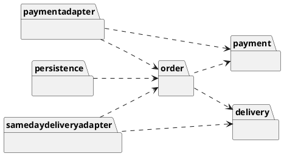
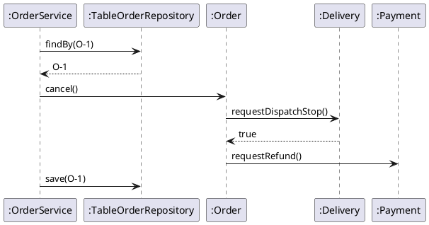
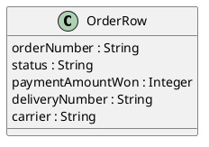
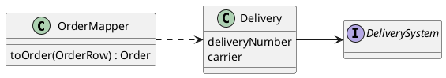
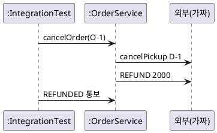

--------------------
Session 명: 11. 통합 설계와 적정 모델링
--------------------

## 목차

01. 세션 목표
02. 모델의 가치
03. 하나의 사례로 통합
04. 모델별 질문
05. 통합 구조
06. 통합 시퀀스
07. 통합이 드러낸 빈틈
08. 다시 여는 판단
09. 매핑 보완
10. 저장된 선택
11. 통합 테스트
12. 위험 주도 모델링
13. 주문 사례의 위험과 모델
14. 멈추는 기준
15. 유지 비용
16. 추상화의 비용
17. 적정 수준의 점검
18. 잘못된 관행 — 분석 마비
19. 잘못된 관행 — 문서를 위한 모델
20. 잘못된 관행 — 위험 앞의 생략
21. 잘못된 관행 — 조립 없는 완료
22. 실습 — 통합 설계와 적정 모델링
23. 통합 추적표 (안)
24. 적정 모델링 판단 (안)
25. 통합 보완 (안)
26. 요약

## 01. 세션 목표

이 세션은 요구부터 기술 실현까지의 판단을 **하나의 사례로 통합**하고, 추가 모델링의 **가치와 비용**을 판단한다.

- 주문 O-1의 취소 한 건을 **요구·정적·동적·경계·객체·변화·실현** 모델로 끝까지 추적한다.
- 각 모델이 **어떤 질문에 답했고** 무엇이 그 **evidence**인지 설명한다.
- 모델을 따로 확인할 때 보이지 않던 **통합의 빈틈**을 찾고, 다시 열 판단 수준을 정한다.
- 모델링·추상화를 더할지 **위험 감소와 비용**으로 판단하고, 멈출 곳을 정한다.
- 분석 마비·문서를 위한 모델·위험 앞의 생략 같은 **잘못된 관행**을 식별한다.

**강사 노트**

- 입력은 "02. 요구 분석과 유스케이스"부터 "10. 기술 제약과 도메인 의미 보존"까지의 산출물 전체다. 새 모델 기법은 없다. 이미 만든 모델을 **잇고 평가**한다.
- 세션 전체가 같은 예를 쓴다 — 주문 O-1(펜 2개, 단가 1,000원, 배송지 서울, 결제 완료, 당일 배송 대행사, 배송 번호 D-1)의 **취소**. 코드의 테스트(`code/s11/test/IntegrationTest.java`)도 같은 주문이다.

---

## 02. 모델의 가치

모델은 **질문에 답하고 위험을 줄일 때** 가치가 있다. 위험이 작으면 모델을 줄이고, 위험이 크면 모델을 생략하지 않는다. 이 세션의 두 부분 — 통합과 적정 모델링 — 은 이 한 문장에서 나온다.

**인용문**

"위험이 작을 때 **꼼꼼한 설계**는 필요 없고, 위험이 성공을 위협할 때 **엉성한 설계**는 변명할 수 없다", "There is no need for meticulous designs when risks are small, nor any excuse for sloppy designs when risks threaten your success.", George Fairbanks, 2010, www

- **통합** — 모델들이 이어져 **실제로 동작하는가**를 하나의 사례로 확인한다(「03」~「11」).
- **적정 모델링** — 다음 모델이 **판단을 개선하는가**로 더할지 멈출지 정한다(「12」~「17」).

**강사 노트**

- 인용 근거: George Fairbanks, *Just Enough Software Architecture: A Risk-Driven Approach*(Marshall & Brainerd, 2010). 저자의 책 소개 페이지 [georgefairbanks.com/book](https://www.georgefairbanks.com/book/)에서 원문 확인. 책 본문은 직접 확인하지 못해 www로 표시한다.
- Fairbanks의 책은 아키텍처를 다루지만 판단의 틀 — **위험에 비례한 설계 노력** — 은 이 과정의 모든 모델에 그대로 적용된다.
- "03. 정적 모델 — 도메인 개념과 관계"와 "04. 동적 모델 — 상호작용과 상태"에서 "충분한 만큼"을 물었다. 이 세션이 그 기준을 정리한다.

---

## 03. 하나의 사례로 통합

앞 세션들은 모델을 **하나씩** 만들었다. 아래 표는 주문 O-1의 취소 한 건이 각 모델에서 **무엇으로 나타나는지**를 세션 순서로 보인다. 위에서 아래로 읽으면 요구가 코드와 저장까지 이어진다.

**인용문**

"모델링의 목적은 주로 **이해하는 것**이지 문서화가 아니다", "The purpose of modeling (sketching UML, …) is primarily to understand, not to document.", Craig Larman, 2004

| 모델 | O-1의 취소에서 | 산출물 |
|---|---|---|
| **요구** | 대안 흐름 1a, 시스템 이벤트 "주문을 취소한다" | 유스케이스·계약 |
| **정적** | 주문·결제·배송, 주문 상태의 값 | 도메인 모델·용어집 |
| **동적** | 결제 완료 → 취소 처리 중 → 취소됨 | 시퀀스·상태 기계 |
| **경계** | `order`가 약속, 연동이 실현 | 패키지 다이어그램 |
| **객체** | `Order.cancel()`의 사전·사후조건 | 설계 클래스·계약 |
| **변화** | 대행사가 둘, `CarrierSelector`가 고른다 | 변이 설계·결정 기록 |
| **실현** | `OrderRow`로 저장, 매퍼로 복원 | 매핑 표·테스트 |

- 표의 한 행은 **한 세션의 판단**이다. 이 세션은 행 사이 — 한 판단이 다음 판단의 **입력으로 맞는지** — 를 본다.

**강사 노트**

- 인용 근거: Craig Larman, *Applying UML and Patterns*, 3rd ed.(2004), §2.7 "What is Agile Modeling?" 원문 확인. 같은 곳은 모델링 행위 자체가 문제를 이해하는 더 나은 방법을 이끌어야 한다고 말한다.
- 이 표는 **추적표**다. 요구 → 설계 → 코드의 추적은 문서를 위한 것이 아니라, 요구가 바뀔 때 **어디를 다시 열지** 찾기 위한 것이다("12. 구현·검증·DevOps와 SW공학 피드백"의 역추적과 연결).
- 흐름 번호 1a와 시스템 이벤트 이름은 과정의 공통 전제 그대로다.

---

## 04. 모델별 질문

모델마다 **답한 질문**이 다르고, 답이 맞았다는 **evidence**도 다르다. 표의 가운데 열이 그 모델이 없었다면 **답하지 못했을 질문**이다.

| 모델 | O-1에 대해 답한 질문 | evidence |
|---|---|---|
| **요구** | 누가 언제 취소할 수 있는가 | 이해관계자의 확인 |
| **정적** | 취소된 주문에 무엇이 남는가 | 용어집·다중성 검토 |
| **동적** | 환불이 늦으면 O-1은 어느 상태인가 | 상태 기계의 전이 검토 |
| **경계** | 결제 시스템이 바뀌면 어디가 바뀌는가 | 순환 없는 의존 |
| **객체** | 누가 취소 규칙을 아는가 | 계약 테스트 |
| **변화** | 당일 배송 O-1은 누구에게 중단을 요청하는가 | 선택 테스트 |
| **실현** | 저장했다가 읽은 O-1의 상태가 같은가 | 라운드트립 테스트 |

- 앞의 넷은 **검토**가, 뒤의 셋은 **실행**이 evidence다. 검토로 확인한 판단도 뒤에서 코드로 다시 확인된다.

**강사 노트**

- 동적 모델의 질문이 **취소 처리 중**을 발견했다("04. 동적 모델 — 상호작용과 상태"). 모델이 새 상태를 찾아낸 것 — 모델의 가치가 가장 분명한 예다.
- evidence의 종류는 "01. OOAD 개요"의 결정과 검증을 따른다. 각 모델이 **결정을 만들고**, 그 결정은 다음 모델이나 테스트가 **검증한다**.

---

## 05. 통합 구조

**다이어그램 — 패키지 다이어그램**

통합하면 앞 세션의 패키지가 **한 그림**에 모인다. 가운데 `order`와 그 약속을 쓰는 `payment`·`delivery`가 업무 경계이고, 바깥의 연동 둘과 `persistence`가 모두 **안쪽을 향해** 의존한다.

**도식 — PlantUML**



**강사 노트**

- 업무 경계 `order`·`payment`·`delivery`는 어느 것도 연동과 `persistence`를 모른다. 연동은 외부 형식을, `persistence`는 저장 형식을 안쪽의 말로 옮긴다.
- 정기 배송 연동(`deliveryadapter`)은 당일 배송 연동과 같은 자리라 도식에서 뺐다.
- 화살표가 모두 안쪽을 향한다는 것이 "05. 구조적 경계와 의존성"의 의존 규칙이 통합 뒤에도 지켜졌다는 evidence다. 패키지 사이의 순환이 없는지는 테스트로도 확인할 수 있다.

---

## 06. 통합 시퀀스

**다이어그램 — 시퀀스 다이어그램**

고객이 O-1의 취소를 요청하면 `OrderService`가 저장소에서 O-1을 **다시 읽어** 취소를 시킨다. 도식의 위에서 아래로, 읽기 → 출고 중단 → 환불 요청 → 저장의 순서다.

**도식 — PlantUML**



**강사 노트**

- 계약("07. 책임·협력·계약") — 사전조건은 O-1이 결제 완료이고 출고 중단이 수락되는 것, 사후조건은 O-1이 취소 처리 중이고 출고 중단과 환불을 이 순서로 요청한 것이다.
- 이 시퀀스는 "06. 분석 모델에서 설계 모델로"의 설계 시퀀스에 **저장소**가 실제로 끼어든 것이다. 앞 세션에서는 저장소가 메모리에 주문을 들고 있었다.
- 환불 완료 통보(`REFUNDED`)가 오면 결제 연동이 `onRefundCompleted`로 알리고 O-1은 취소됨이 된다. 도식에서는 뺐다.

---

## 07. 통합이 드러낸 빈틈

앞 시퀀스를 실제로 조립해 실행하면 **취소가 실패한다**. 저장소에서 다시 읽은 O-1에 **결제와 배송이 없기** 때문이다. 표의 왼쪽은 세션마다 확인한 것, 오른쪽은 조립해서야 드러난 것이다.

| 세션에서 확인한 것 | 조립하니 |
|---|---|
| **객체** — 메모리의 O-1은 취소된다 | 저장소를 거친 O-1은 취소되지 않는다 |
| **실현** — 저장·복원해도 상태·단가가 같다 | 결제·배송의 연결은 저장하지 않았다 |
| **변화** — 서울 O-1은 당일 배송 대행사 | 다시 읽은 O-1의 대행사를 알 수 없다 |

- 모든 모델이 **자기 질문에는** 맞게 답했다. "저장했다가 읽은 주문도 취소되는가"는 **어느 모델의 질문도 아니었다**.

**강사 노트**

- "10. 기술 제약과 도메인 의미 보존"은 결제·배송의 연결을 교육용 범위에서 뺐다고 적었다. 범위를 좁힌 결정 자체는 틀리지 않았다. 그 결정이 **다른 판단에 미치는 영향**을 통합에서 확인하지 않으면 빈틈이 된다.
- 결과를 먼저 예측하게 한다: 연결 없이 복원한 O-1에 `cancel()`을 시키면? — 출고 중단을 요청할 배송이 없어 실패한다.
- 이런 빈틈은 흔히 **통합 테스트**나 운영에서 처음 보인다. 발견 위치와 원인 수준이 다르다는 것은 "12. 구현·검증·DevOps와 SW공학 피드백"의 주제다.

---

## 08. 다시 여는 판단

빈틈은 **실현**에서 보였지만 다시 여는 판단은 둘이다. 표는 발견한 것마다 **어느 산출물을 다시 열고** 무엇을 더하는지 정한다.

| 발견 | 다시 여는 산출물 | 보완 |
|---|---|---|
| **결제·배송 연결이 없다** | 매핑 표 | 결제 금액·배송 번호 칼럼 |
| **대행사를 알 수 없다** | 결정 기록 | 고른 대행사를 저장한다 |

- 둘째는 **설계 결정**이다. 저장하지 않으면 다시 읽을 때 선택 규칙을 **다시 적용**해야 하고, 그 사이 규칙이 바뀌면 이미 당일 배송으로 보낸 O-1이 정기 배송으로 바뀐다.

**강사 노트**

- "09. 설계 대안 평가"의 결정 기록은 "배송마다 대행사를 고른다"였다. 고른 결과를 **언제까지 유지하는가**는 묻지 않았다. 보완은 결정 기록에 한 줄을 더한다 — "고른 대행사는 배송의 사실로 저장하고, 규칙이 바뀌어도 다시 고르지 않는다".
- 요구·도메인 모델은 다시 열지 않는다. 결제·배송이 주문에 연결된다는 **의미**는 이미 있었고, 빠진 것은 그 의미의 **저장**이었다.

---

## 09. 매핑 보완

**다이어그램 — 클래스 다이어그램**

보완한 물리 모델은 주문 행에 **세 칼럼**을 더한다. 결제한 O-1의 행은 결제 금액 **2000**, 배송 번호 **D-1**, 대행사 **SAME_DAY**를 갖고, 결제 전 주문은 세 칼럼이 비어 있다.

**도식 — PlantUML**



```java
// 물리 모델: orders 테이블의 한 행과 그 항목들. 상태는 이름으로 저장한다.
// 결제 금액·배송 번호·배송 대행사는 결제 뒤에만 값이 있다(결제 전에는 null).
public record OrderRow(String orderNumber, String status, String shippingAddress, List<ItemRow> items,
                       Integer paymentAmountWon, String deliveryNumber, String carrier) {}
```

**강사 노트**

- 코드는 `code/s11/persistence/`의 발췌이며, 컴파일·실행해 확인한다. 실행: `javac -encoding UTF-8 -d out $(find . -name "*.java") && java -cp out test.IntegrationTest`.
- 결제 금액은 **확정 값**이다. 주문 총액으로 다시 계산하지 않는다 — 결제된 금액이 환불 금액의 기준이다("10. 기술 제약과 도메인 의미 보존"의 확정 값 규칙).
- 대행사 칼럼의 값 `REGULAR`·`SAME_DAY`는 교육용 저장 코드다.

---

## 10. 저장된 선택

**다이어그램 — 클래스 다이어그램**

매퍼는 저장된 **대행사 이름**으로 배송 시스템을 찾아 배송을 복원한다. 코드의 주석처럼 `CarrierSelector`의 규칙을 다시 적용하지 않는다 — 고른 것은 **사실**이지 다시 계산할 값이 아니다.

**도식 — PlantUML**



```java
        // 배송 대행사는 저장된 이름으로 고른다. 선택 규칙을 다시 적용하지 않는다.
        Delivery delivery = row.deliveryNumber() == null ? null
                : new Delivery(row.deliveryNumber(), row.carrier(), carriers.get(row.carrier()));
```

**강사 노트**

- 매퍼는 이름 → 배송 시스템의 표(`Map`)를 조립 때 받는다. 도메인은 여전히 어느 대행사가 있는지 모른다.
- 선택은 판매가 → 단가의 확정과 같은 모양이다. **그때 정한 것**은 저장하고, **지금 계산할 것**은 저장하지 않는다.

---

## 11. 통합 테스트

**다이어그램 — 시퀀스 다이어그램**

통합 테스트는 모든 부품을 **실제로 조립해** O-1의 취소를 끝까지 실행한다. 외부 시스템만 요청을 기록하는 가짜다. 코드는 저장한 O-1을 서비스가 다시 읽어 취소하고, 외부에 간 요청의 **순서**를 확인한다.

**도식 — PlantUML**



```java
        // 시스템 오퍼레이션 — 저장소에서 다시 읽은 O-1을 취소한다
        service.cancelOrder(new OrderNumber("O-1"));
        check(external.equals(List.of("cancelPickup D-1", "REFUND 2000")));
        check(repository.rowOf(new OrderNumber("O-1")).status().equals("CANCELLING"));
```

- **보완 전** — 같은 테스트가 실패한다. 이 **실패**가 evidence가 되어 「07」의 빈틈을 보였다.

**강사 노트**

- 요청 순서(출고 중단 → 환불)는 "07. 책임·협력·계약"의 사후조건이다. 통합 테스트가 계약을 **조립된 상태에서** 다시 확인한다.
- 테스트는 이어서 환불 완료 통보로 O-1이 `CANCELLED`로 저장되는지, 저장된 대행사가 `SAME_DAY`인지 확인한다.
- 가짜 외부 시스템은 테스트 더블이다. 실제 외부와의 계약 확인은 "12. 구현·검증·DevOps와 SW공학 피드백"에서 다룬다.

---

## 12. 위험 주도 모델링

어디까지 모델링할지는 **위험**이 정한다. 위험을 찾고, 그 위험을 줄이는 기법(모델)을 고르고, **줄었는지** 평가한다. 줄었으면 멈추고, 아니면 다음 기법을 고른다.

**인용문**

"(1) **위험을 찾아** 우선순위를 정하고, (2) 기법을 골라 적용하고, (3) **위험이 줄었는지** 평가한다", "(1) identify and prioritize risks, (2) select and apply a set of techniques, and (3) evaluate risk reduction.", George Fairbanks, 2010, www

| 단계 | O-1의 취소에서 |
|---|---|
| **위험** | 환불이 늦게 오면 주문 상태가 틀린다 |
| **기법** | 상태 기계와 시퀀스로 환불 전후를 그린다 |
| **평가** | 취소 처리 중을 발견 → 위험이 줄었다, 멈춘다 |

**강사 노트**

- 인용 근거: Fairbanks(2010)의 책 소개 페이지 원문 확인(「02」와 같다). 위험 주도 모델(risk-driven model)의 세 단계다.
- 평가 단계가 핵심이다. 모델을 **만든 것**이 아니라 위험이 **줄었는지**를 묻는다. 줄지 않은 모델은 다시 고르고, 줄었으면 더 다듬지 않는다.

---

## 13. 주문 사례의 위험과 모델

주문 사례의 모델들을 **위험의 순서**로 다시 읽는다. 표의 한 행은 위험 하나와 그 위험을 줄인 모델이며, 마지막 행이 이 세션에서 찾은 위험이다.

| 위험 | 줄인 모델 | 줄었나 |
|---|---|---|
| **취소 조건이 모호하다** | 유스케이스·계약 | 배송 시작 전으로 확정 |
| **환불이 늦다** | 상태 기계 | 취소 처리 중 발견 |
| **외부가 바뀐다** | 경계·연동 | 바뀌는 곳이 연동 하나 |
| **대행사가 는다** | 변이 설계 | 연동 추가만으로 대응 |
| **저장이 뜻을 바꾼다** | 매핑 표·라운드트립 | 상태·단가 보존 |
| **조립이 깨진다** | 통합 테스트 | 연결 저장 보완 |

- 위험이 **없는** 곳 — 예를 들어 상품 조회 — 에는 상세 모델을 만들지 않았다. 그것도 적정 모델링의 결정이다.

**강사 노트**

- 이 과정의 순서(요구 → 정적 → 동적 → …)는 가르치는 순서다. 실제 프로젝트에서는 **위험이 큰 곳부터** 모델링하고, 위험이 작은 곳은 가볍게 지난다.
- 상품 조회는 규칙이 적고 상태가 없다. 유스케이스 한 줄과 용어집 항목이면 충분하다.

---

## 14. 멈추는 기준

모델링은 **다음 모델이 판단을 바꾸지 못할 때** 멈춘다. 설계에서는 어렵고 창의적인 부분만 그리고, 나머지는 코드에서 결정한다.

**인용문**

"상세 객체 설계의 **어렵고 창의적인 부분**만 UML로 그린다. **그리고 멈춘다**", "drawing UML for the hard, creative parts of the detailed object design. Then stop", Craig Larman, 2004

| O-1에서 | 그렸다 | 그리지 않았다 |
|---|---|---|
| **취소** | 상태 기계, 설계 시퀀스, 계약 | 항목별 수량 검사의 시퀀스 |
| **대행사** | 대안 A·B·C의 비교 | 대행사별 요청 형식 |
| **저장** | 매핑 표 | 칼럼 타입·인덱스 |

- 오른쪽 열은 **코드나 기술 선택이 바로 정하는** 것이다. 그려도 판단이 달라지지 않는다.

**강사 노트**

- 인용 근거: Larman, 3rd ed.(2004), §14.3 "How Much Time Spent Drawing UML Before Coding?" 원문 확인. 원문은 3주 반복이면 반복 초에 몇 시간, 길어야 하루 그린 뒤 멈추고 코딩으로 넘어가라는 지침의 일부다.
- 멈춘다는 것은 **버린다**는 뜻이 아니다. 코딩 중 새 위험이 보이면 다시 그린다 — 「07」의 빈틈이 그런 경우다.

---

## 15. 유지 비용

남기는 모델은 **유지 비용**을 낳는다. 코드가 바뀔 때 함께 고치지 않으면 모델은 틀린 문서가 된다. 그래서 **이해를 위해 그린 모델**과 **남겨서 유지할 모델**을 나눈다.

**인용문**

"만들고 **남기기로 한** 산출물은 모두 계속 **유지**해야 한다", "Every artifact that you create, and then decide to keep, will need to be maintained over time.", Scott W. Ambler, 2002, www

| 주문 사례의 산출물 | 남긴다 | 이유 |
|---|---|---|
| **용어집** | 예 | 이름의 원천, 코드가 따른다 |
| **상태 기계** | 예 | 상태 규칙의 기준, 테스트가 확인 |
| **결정 기록** | 예 | 선택의 근거, 코드에 없다 |
| **분석 시퀀스** | 아니오 | 설계·코드로 옮겨졌다 |
| **CRC 카드** | 아니오 | 책임 배정 뒤 역할이 끝났다 |

**강사 노트**

- 인용 근거: Scott W. Ambler, Agile Modeling의 원칙 "Travel Light", [agilemodeling.com/principles.htm](https://agilemodeling.com/principles.htm) 원문 확인. 원칙은 *Agile Modeling*(Wiley, 2002)에서 처음 정리됐고 책은 직접 확인하지 못해 www로 표시한다.
- 남기는 기준은 **코드에 없는 정보**인가다. 결정 기록의 "포기한 대안"은 코드에 없다. 분석 시퀀스의 흐름은 코드와 테스트가 대신한다.
- 남긴 모델도 테스트로 확인되면(상태 기계 → 상태 전이 테스트) 틀린 문서가 되기 어렵다.

---

## 16. 추상화의 비용

추상화도 모델처럼 **비용**이 있다. 표는 주문 사례가 더한 추상화마다 줄인 위험과 치른 비용을 짝짓는다. 오른쪽 열이 "없으면" — 추상화를 빼도 될 조건이다.

| 추상화 | 줄인 위험 | 비용 | 없어도 되는 때 |
|---|---|---|---|
| **`OrderNotice`** | 연동이 서비스에 묶임 | 인터페이스 하나 | 연동이 하나뿐 |
| **`CarrierSelector`** | 선택 규칙의 분산 | 클래스 하나 | 대행사가 하나 |
| **연동(Adapter)** | 외부 변경의 전파 | 변환 코드 | 외부가 안 바뀐다 |
| **`OrderMapper`** | 저장이 뜻을 바꿈 | 이중 모델 | 단순 CRUD |

- 주문 사례는 네 조건이 모두 **아니다**. 그래서 넷 모두 남긴다. 조건이 다른 시스템에서는 같은 추상화가 **과잉**이다.

**강사 노트**

- "09. 설계 대안 평가"의 추상화 비용과 같은 판단이다. 이 표는 그 판단을 통합된 설계 전체에 적용한다.
- 추상화의 비용은 코드 줄 수보다 **읽는 사람이 거치는 단계**다. 새 개발자가 O-1의 취소를 따라가며 몇 개의 파일을 열어야 하는가로 설명하면 잘 전달된다.

---

## 17. 적정 수준의 점검

모델이나 추상화를 **더하기 전에** 네 질문을 한다. 하나라도 "아니오"면 더하지 않거나 가볍게 한다.

| 질문 | O-1의 대행사 선택에서 |
|---|---|
| **답할 질문이 있는가** | 당일 배송 주문은 누구에게 중단을 요청하는가 |
| **위험이 있는가** | 대행사가 더 늘 수 있다 |
| **판단이 바뀌는가** | 대안 비교로 `CarrierSelector`를 골랐다 |
| **유지할 수 있는가** | 결정 기록 한 장, 테스트가 확인 |

- 넷 모두 **"예"**라서 대안 비교까지 모델링했다. 상품 조회였다면 첫 질문에서 멈춘다.

**강사 노트**

- 이 점검은 실습에서 정기배송에 그대로 쓴다.
- 셋째 질문이 가장 자주 놓친다. 모델을 그렸는데 **이미 정한 답을 옮겨 적기만** 했다면 판단을 개선하지 못한 것이다.

---

## 18. 잘못된 관행 — 분석 마비

완전하고 **올바른** 모델을 먼저 만들려는 노력은 끝나지 않는다. 모델은 완전해지지 않고, 그동안 코드와 테스트가 줄 **evidence**를 받지 못한다.

**인용문**

"철저하거나 **올바른** 도메인 모델을 만들려는 폭포수식 대형 모델링을 피하라 — 어느 쪽도 되지 않고, 과잉 모델링은 **분석 마비**로 이어진다", "Avoid a waterfall-mindset big-modeling effort to make a thorough or “correct” domain model—it won't ever be either, and such over-modeling efforts lead to analysis paralysis, with little or no return on the investment.", Craig Larman, 2004

- **예** — 주문 사례에서 반품·교환·부분 환불까지 도메인 모델을 먼저 완성하려 한다. 결제 완료 취소의 코드는 몇 주 뒤에야 나온다.
- **바른 방법** — 취소 한 건을 끝까지 만들고(「11」), 부분 취소는 변경 요청으로 받는다("08. 변화 대응과 변이 설계").

**강사 노트**

- 인용 근거: Larman, 3rd ed.(2004), §9.1 Guideline 원문 확인. 같은 장은 도메인 모델링에 쓰는 시간을 초기 반복의 몇 시간으로 제한하라고 이어 말한다.
- "작게 끝까지"(`guides/sw-engineering-principles.md`)가 이 관행의 반대다. 「07」의 빈틈도 **끝까지 조립했기 때문에** 보였다.

---

## 19. 잘못된 관행 — 문서를 위한 모델

모델을 **제출물**로 만들면 질문 없이 그리고, 그린 뒤에는 고치지 않는다. 코드와 다른 모델은 없는 것보다 **해롭다** — 읽는 사람을 틀린 쪽으로 이끈다.

- **예** — 주문 상태 기계에 취소 처리 중이 없다. 코드는 이미 `CANCELLING`을 쓰는데 신입 개발자가 상태 기계를 믿고 환불 전 취소됨을 가정한다.
- **바른 방법** — 남길 모델만 남기고(「15」), 남긴 모델은 **테스트로 확인**되게 한다.

**강사 노트**

- 문서를 위한 모델의 신호: 누가 이 모델로 무엇을 결정했는지 답하지 못한다.
- 이해를 위해 그린 모델(화이트보드, CRC)은 버려도 된다. 버린다고 가치가 없던 것이 아니다 — 가치는 **그리는 동안의 판단**에 있었다.

---

## 20. 잘못된 관행 — 위험 앞의 생략

반대 방향의 잘못도 있다. 모델이 비싸다는 이유로 **위험이 큰 곳까지** 건너뛴다. 「02」의 인용처럼, 위험이 성공을 위협할 때 엉성한 설계는 변명할 수 없다.

- **예** — 환불이 비동기라는 것을 알면서 상태 기계를 그리지 않았다. 환불 대기 중인 주문이 취소됨으로 보여 고객에게 "환불 완료"가 안내된다.
- **바른 방법** — 상태·외부 연동·돈처럼 **되돌리기 어려운** 곳은 모델로 먼저 확인한다(「13」).

**강사 노트**

- "애자일이니까 모델은 안 그린다"는 오해다. 애자일 모델링도 **목적 있는 모델**을 권한다. 그리지 않는 것이 아니라 필요한 만큼만 그린다.
- LLM으로 코드를 빠르게 만들 수 있을수록 이 관행이 늘기 쉽다. 코드가 빨리 나와도 **상태 경계의 판단**은 사람이 확인해야 한다("14. AI-native SW공학"과 연결).

---

## 21. 잘못된 관행 — 조립 없는 완료

모델마다 **따로 완료**하고 조립은 마지막으로 미룬다. 각 모델은 맞는데 이어 붙이면 깨지고, 그때는 어느 판단을 다시 열어야 하는지 찾기 어렵다.

- **예** — 「07」의 빈틈을 출시 직전 통합에서 발견한다. 매핑·결정 기록·테이블 모두를 한꺼번에 다시 연다.
- **바른 방법** — 한 사례를 **처음부터 끝까지** 조립하는 통합 테스트를 일찍 두고, 모델을 더할 때마다 돌린다.

**강사 노트**

- 이 과정도 세션별로 모델을 만들었다. 통합을 이 세션까지 미룬 것은 **가르치는 순서** 때문이다. 실제 프로젝트는 반복마다 얇게 끝까지 조립한다.
- 통합 테스트를 CI에 두는 방법은 "12. 구현·검증·DevOps와 SW공학 피드백"에서 다룬다.

---

## 22. 실습 — 통합 설계와 적정 모델링

정기배송의 **다음 배송 취소** 한 건을 요구부터 매핑까지 **추적**하고, 모델마다 **적정 수준**을 판단해 점검 항목으로 **피드백**하여 완성하십시오.

- **투입물**
  + 실습 2~10의 **산출물 전체**(유스케이스, 용어집, 도메인 모델, 동적 모델, 패키지, 설계, 결정 기록, 매핑 표)
- **프롬프트**
  + ① "정기배송 S-1(월별 청구)의 다음 배송 취소를 위 산출물에서 **추적표**(모델, 이 취소에서 나타나는 것, 산출물)로 써주고, 모델 사이에서 **이어지지 않는 곳**을 찾아줘."
  + ② "각 모델이 줄인 **위험**과 유지 비용을 표로 쓰고, 더 모델링할 곳과 **멈출 곳**을 근거와 함께 써줘."
- **점검 항목**
  1. **추적** — 요구의 흐름에서 매핑까지 같은 이름(용어집)으로 이어지는가?
  2. **빈틈** — 모델 사이의 빈틈을 하나 이상 찾았고, 다시 열 산출물을 정했는가?
  3. **evidence** — 모델마다 답이 맞았다는 확인 방법(검토·테스트)이 있는가?
  4. **위험** — 모델을 더하는 근거가 "빠짐없이"가 아니라 위험인가?
  5. **멈춤** — 그리지 않을 것과 남기지 않을 것을 정했는가?
- **결과물** — 추적표와 적정 모델링 판단표. 구현·검증과 피드백의 입력이 됩니다.

**강사 노트**

- LLM은 모든 모델에 "보완 필요"를 붙여 **더 그리라고** 하기 쉽다. 점검 항목 4·5로 되돌린다.
- 빈틈은 수강생마다 다를 수 있다. 다시 열 산출물과 이유가 있으면 맞다.

---

## 23. 통합 추적표 (안)

정기배송 S-1의 **다음 배송 취소**를 모델마다 추적했다. 위에서 아래로 읽으며, 마지막 열이 이어지지 않는 곳이다.

| 모델 | 다음 배송 취소에서 | 이어지는가 |
|---|---|---|
| **요구** | 유스케이스 "다음 배송을 취소한다" | 예 |
| **정적** | `DeliveryRound`의 회차 상태 | 예 |
| **동적** | 정기배송은 확정 그대로, 회차만 바뀐다 | 회차 상태 기계가 없다 |
| **경계** | `subscription`이 배송 약속을 쓴다 | 예 |
| **객체** | 회차 취소의 사전·사후조건 | 청구 여부를 묻지 않는다 |
| **실현** | `delivery_rounds.status` 저장 | 예 |

- **빈틈** — 월별 청구로 **이미 청구된** 회차를 취소하면 환불하는가? 해지 흐름 1c는 남은 회차의 환불을 말하지만, 다음 배송 취소는 어느 모델도 답하지 않았다.

**강사 노트**

- 빈틈은 객체 설계의 계약을 쓰다 보이지만, 원인은 **요구**다 — 유스케이스 명세에 청구 후 취소의 흐름이 없다. 발견 위치와 원인 수준이 다르다.
- 동적 모델은 정기배송 단위의 상태 기계만 그렸다(실습 4). 회차 상태는 실습 3에서 발견했지만 값과 전이는 정하지 않았다 — 위험이 작다고 본 판단이 청구 후 취소에서 다시 열린다.
- 일시불(`LUMP_SUM`)이면 모든 회차가 청구된 상태라 빈틈이 더 크다.

---

## 24. 적정 모델링 판단 (안)

정기배송의 모델마다 **위험**과 **남길지**를 정했다. 표의 마지막 열이 더할 모델과 멈출 모델이다.

| 모델 | 줄인 위험 | 판단 |
|---|---|---|
| **용어집** | 해지·취소의 혼동 | 남긴다 |
| **정기배송 상태 기계** | 해지·만료의 어긋남 | 남긴다 |
| **배송 주기 설계** | 매일·매월의 혼동 | 남긴다 |
| **영수증 모델** | 거의 없음 | 그리지 않는다 |
| **회차 상태 기계** | 청구 후 취소의 환불 누락 | 새로 그린다 |

- **멈춘다** — 영수증은 회계 시스템 형식을 따라 모델이 판단을 바꾸지 못한다.

**강사 노트**

- 더 모델링할 곳은 하나다. 「17. 적정 수준의 점검」의 네 질문에 모두 "예"인 곳이 회차 상태 — 청구 후 취소 — 뿐이다. 앞서 그리지 않은 판단이 틀린 것은 아니다. 새 질문이 생겨 위험이 바뀌었다.

---

## 25. 통합 보완 (안)

통합에서 발견한 것은 **후속 작업에 영향을 미치는 경우에만** 이전 산출물에 반영한다.

- **유스케이스 명세서**(실습 2)
  - **새 흐름** — 청구된 회차의 취소 → 회차 금액 환불 요청
- **동적 모델**(실습 4)
  - **새 모델** — 회차 상태 기계: 예정 → 청구됨 → 배송됨, 예정 → 취소됨, 청구됨 → 환불 대기 → 취소됨
- **용어집**(실습 2)
  - **새 용어** — 회차 상태의 다섯 값(예정·청구됨·배송됨·환불 대기·취소됨)
- **※ 현행화 기준**
  - **반영** — 유스케이스, 상태 기계, 용어집. 구현·검증의 입력이 된다.
  - **기록만** — 영수증을 그리지 않은 이유.

**강사 노트**

- 회차 상태 `RoundStatus`의 영문 값 — `SCHEDULED`, `BILLED`, `DELIVERED`, `REFUND_PENDING`, `CANCELLED`.
- 요구를 다시 열면 뒤 모델도 따라 바뀐다. 이 순서 — 원인 수준에서 고치고 아래로 내려온다 — 가 다음 세션의 역추적이다.

---

## 26. 요약

이 세션은 모델들을 **하나의 사례로 통합**하고, 추가 모델링의 가치와 비용을 판단했다.

### 통합 설계와 적정 모델링의 핵심

- **원칙** — 모델의 가치는 답한 질문과 줄인 위험이다. 판단이 나아지지 않으면 멈춘다
- **통합** — 주문 O-1의 취소를 요구부터 저장까지 추적하고 실제로 조립한다
- **빈틈** — 모델마다 맞아도 조립하면 깨질 수 있다. 결제·배송 연결과 고른 대행사를 저장해 보완했다
- **위험 주도** — 위험을 찾고, 기법을 고르고, 줄었는지 평가한다
- **비용** — 남긴 모델은 유지해야 한다. 코드에 없는 정보만 남긴다
- **잘못된 관행** — 분석 마비, 문서를 위한 모델, 위험 앞의 생략, 조립 없는 완료

### 다음 세션

- "**12. 구현·검증·DevOps와 SW공학 피드백**" — 구현·배포의 evidence로 다시 열 상위 판단을 진단한다.

**강사 노트**

- 이 세션의 빈틈은 실현에서 보였고 원인은 범위 결정이었다. 다음 세션은 이런 역추적을 코드·CI·운영의 evidence 전반으로 넓힌다.
