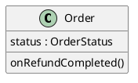
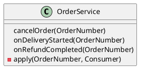
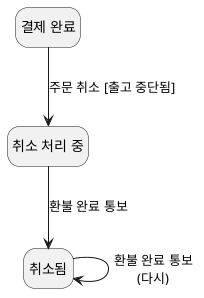

--------------------
Session 명: 12. 구현·검증·DevOps와 SW공학 피드백
--------------------

## 목차

01. 세션 목표
02. 발견 위치와 원인 수준
03. 두 증상
04. feedback의 층
05. 코딩과 디버깅
06. 개발자 테스트
07. 빨강·초록·리팩터링
08. 빨강 — 테스트 먼저
09. 초록 — 가장 작은 수정
10. 리팩터링 — 구조만 고친다
11. 리팩터링 코드
12. IDE와 pre-commit
13. 지속적 통합
14. CI 실패가 가리키는 곳
15. 지속적 배포
16. 운영 feedback
17. DevOps의 되먹임
18. 역추적
19. 원인 수준에서 고치기
20. 상태 기계 보완
21. 두 역추적의 비교
22. 잘못된 관행 — 증상 위치에서 고치기
23. 잘못된 관행 — 테스트를 코드에 맞추기
24. 잘못된 관행 — 느린 feedback
25. 실습 — 피드백과 역추적
26. 역추적 (안)
27. feedback 배치 (안)
28. 피드백 보완 (안)
29. 요약

## 01. 세션 목표

이 세션은 코드·테스트·통합·배포 과정에서 얻은 **evidence**를 보고 어느 **상위 판단**을 다시 열어야 하는지 진단한다.

- 코딩·디버깅·개발자 테스트·TDD·리팩터링이 주는 **feedback**을 설명한다.
- IDE·pre-commit·CI가 확인하는 것과, 실패한 검사가 **어느 판단 수준**을 가리키는지 연결한다.
- 배포와 운영의 **신호**가 설계 판단에 무엇을 알리는지 설명한다.
- 증상에서 요구·분석·아키텍처·설계의 **원인 수준**으로 역추적하고, 그 수준에서 고친다.
- 증상 위치에서 고치기·테스트를 코드에 맞추기 같은 **잘못된 관행**을 식별한다.

**강사 노트**

- 입력은 "11. 통합 설계와 적정 모델링"까지의 설계·코드·테스트다. 테스트 도구나 CI 제품의 사용법은 이 세션의 대상이 아니다. feedback이 **어느 판단으로 되돌아가는가**를 다룬다.
- 세션 전체가 같은 예를 쓴다 — 주문 O-1(펜 2개, 서울, 결제 2,000원, 당일 배송 대행사)의 취소와 환불 완료 통보. 코드의 테스트(`code/s12/test/FeedbackTest.java`)도 같은 주문이다.

---

## 02. 발견 위치와 원인 수준

문제가 **보인 곳**과 문제를 **만든 판단**은 다를 수 있다. 테스트에서 실패가 보여도 원인은 요구나 설계에 있을 수 있고, 그러면 코드만 고쳐서는 같은 문제가 다른 곳에서 다시 난다.

**인용문**

"팀은 실제로 **만들고 테스트한 것**에서 feedback을 캐내, 요구나 설계의 **이해를 고치고 적응**할 기회를 얻는다", "the team mines the feedback from realistic building and testing something for crucial practical insight and an opportunity to modify or adapt understanding of the requirements or design.", Craig Larman, 2004

- **발견 위치** — 코드, 테스트, CI, 운영. 빠를수록 싸다.
- **원인 수준** — 요구, 분석, 아키텍처, 설계. 그 수준의 산출물을 **다시 열어** 고친다.
- **DevOps** — 발견에서 원인 수준까지 feedback을 **빠르게 되돌리는** 실행 체계다.

**강사 노트**

- 인용 근거: Craig Larman, *Applying UML and Patterns*, 3rd ed.(2004), §2.2 "What is Iterative and Evolutionary Development?" 원문 확인. 같은 곳은 이른 feedback이 "금만큼 가치 있다"고 하고, 사용자의 "예, 그런데…"를 실패가 아니라 진전의 방법으로 본다.
- "01. OOAD 개요"의 결정과 검증이 여기서 닫힌다. 앞 세션들이 **결정**을 만들었고, 이 세션은 구현의 evidence로 그 결정을 **검증**하고 필요하면 다시 연다.

---

## 03. 두 증상

이 세션은 주문 O-1의 **두 증상**을 따라간다. 표의 왼쪽이 어디서 보였는지, 오른쪽이 역추적으로 찾은 원인 수준이다. 둘 다 코드에서 보였지만 원인은 코드가 아니다.

| 증상 | 발견 위치 | 원인 수준 |
|---|---|---|
| **다시 읽은 O-1이 취소되지 않는다** | 통합 테스트 | 기술 실현의 범위 결정 |
| **환불 완료 통보에서 예외가 난다** | 운영 로그 | 요구·동적 모델 |

- 첫째는 "11. 통합 설계와 적정 모델링"에서 찾아 고쳤다. 이 세션은 둘째를 **처음부터 끝까지** 따라간다.

**강사 노트**

- 둘째 증상의 가정(교육용): 결제 시스템은 환불 완료 통보에 응답을 못 받으면 **같은 통보를 다시 보낸다**. 두 번째 통보에서 `Order`가 "취소됨에서 취소됨이 될 수 없다"는 예외를 던진다.
- 예외 메시지와 스택은 `Order.transition`을 가리킨다 — 발견 위치다. 원인 수준은 「18. 역추적」에서 찾는다.

---

## 04. feedback의 층

feedback은 **여러 층**에서 온다. 위의 층일수록 빠르고 싸며, 아래로 갈수록 느리지만 실제에 가깝다. 표의 오른쪽 열이 각 층이 O-1에 대해 **알려 주는 것**이다.

| 층 | 걸리는 시간 | O-1에 대해 알려 주는 것 |
|---|---|---|
| **IDE** | 초 | 컴파일 오류, 쓰지 않는 코드 |
| **개발자 테스트** | 초~분 | 취소 계약, 상태 전이 |
| **pre-commit** | 분 | 커밋 전 테스트·형식 |
| **CI** | 분~십 분 | 통합, 의존 규칙, 라운드트립 |
| **CD** | 시간 | 배포 가능성, 설정 |
| **운영** | 일~주 | 실제 외부 시스템의 행동 |

- 같은 문제는 **가장 위의 층**에서 잡도록 검사를 옮긴다. 운영에서 본 중복 통보를 개발자 테스트로 옮기는 것이 이 세션의 사례다.

**강사 노트**

- 층의 시간은 대략적인 규모다. 중요한 것은 순서 — 아래 층에서 본 문제를 **위 층의 검사로 끌어올리면** 다음에는 더 싸게 잡는다.

---

## 05. 코딩과 디버깅

디버깅은 **어디서** 실패했는지 찾는다. **왜** 실패했는지는 다른 질문이다. O-1의 스택은 `Order.transition`을 가리키지만, `transition`의 규칙은 맞다 — 취소됨에서 취소됨으로 가는 전이는 상태 기계에 없다.

| 디버깅이 찾은 것 | 아직 모르는 것 |
|---|---|
| **예외 위치** — `Order.transition` | 왜 같은 통보가 두 번 왔는가 |
| **그때의 상태** — `CANCELLED` | 두 번 오는 것이 정상인가 |
| **호출 경로** — 결제 연동 → 서비스 → 주문 | 누가 이 경우를 정했어야 했는가 |

- 오른쪽 열의 질문은 코드가 답하지 못한다. 답은 **요구와 동적 모델**에 있어야 했다.

**강사 노트**

- 디버깅의 결과를 "`transition`에서 예외를 삼키자"로 바로 옮기기 쉽다. 그것이 「22. 잘못된 관행 — 증상 위치에서 고치기」다.
- 코딩 중 feedback — 이름이 어색하다, 메서드가 길어진다 — 도 판단의 신호다. 이름이 어색하면 용어집을, 메서드가 길면 책임 배정을 다시 본다.

---

## 06. 개발자 테스트

개발자 테스트는 **결함이 있음**을 보이지만 없음을 증명하지 못한다. 그래서 테스트의 가치는 **무엇을 기대하느냐**에 달렸고, 그 기대값은 앞 세션의 모델에서 온다.

**인용문**

"프로그램 테스트는 **버그가 있음**을 보이는 데는 아주 효과적이지만, **없음**을 보이지는 못한다", "program testing can be used very effectively to show the presence of bugs but never to show their absence", Edsger W. Dijkstra, 1970

| O-1의 테스트 | 기대값의 출처 |
|---|---|
| **결제 완료 O-1은 취소 처리 중이 된다** | 오퍼레이션 계약 |
| **환불 완료 뒤 O-1은 취소됨이다** | 상태 기계 |
| **출고 중단 → 환불 순서로 요청한다** | 객체 계약 |
| **저장·복원해도 상태가 같다** | 매핑 표 |

- 중복 통보의 테스트가 없었던 것은 **기대값의 출처**가 없었기 때문이다. 어느 모델도 두 번째 통보를 말하지 않았다.

**강사 노트**

- 인용 근거: Edsger W. Dijkstra, "On the Reliability of Programs"(EWD303), [UT Austin EWD 전사본](https://www.cs.utexas.edu/~EWD/transcriptions/EWD03xx/EWD303.html) 원문 확인. 전사본에 날짜가 없어 연도는 EWD 번호 대역으로 본 1970년이다.
- 테스트가 없는 곳은 **모델이 없는 곳**과 자주 겹친다. 테스트 목록을 모델에서 뽑으면 빠진 모델도 보인다.

---

## 07. 빨강·초록·리팩터링

TDD는 **빨강 → 초록 → 리팩터링**의 짧은 주기를 되풀이한다. 표는 O-1의 중복 통보를 이 주기로 고친 세 단계이고, 뒤의 세 topic이 각 단계의 코드다.

**인용문**

"**막대를 초록으로** 유지해 코드를 깨끗하게 유지한다", "Keep the bar green to keep the code clean.", Craig Larman, 2004

| 단계 | 하는 일 | O-1에서 |
|---|---|---|
| **빨강** | 실패하는 테스트를 먼저 쓴다 | 환불 완료 통보 두 번 → 예외 |
| **초록** | 통과하는 가장 작은 수정 | 취소됨이면 그대로 둔다 |
| **리팩터링** | 동작은 두고 구조를 고친다 | 서비스의 반복을 `apply`로 |

- 막대가 **초록일 때만** 리팩터링한다. 빨강에서 구조까지 고치면 실패의 원인이 둘이 된다.

**강사 노트**

- 인용 근거: Larman, 3rd ed.(2004), §21.1 "Test-Driven Development" 원문 확인. JUnit이 모든 테스트 통과를 초록 막대로 보여 준 데서 나온 TDD의 구호로 소개된다. 같은 책 §20.9는 "테스트 코드 조금, 제품 코드 조금, 통과, 다시 테스트 코드"의 리듬을 설명한다.
- 빨강·초록·리팩터링(red-green-refactor)은 Kent Beck이 TDD의 주기에 붙인 이름으로 널리 쓰인다.
- 빨강 단계에서 **실패를 눈으로 확인**하는 것이 중요하다. 처음부터 초록인 테스트는 증상을 재현하지 못했을 수 있다.

---

## 08. 빨강 — 테스트 먼저

TDD는 **실패하는 테스트**부터 쓴다. 운영에서 본 증상을 먼저 테스트로 **재현**하고, 빨간 막대를 확인한 뒤에 고친다. 코드는 O-1의 취소 뒤 환불 완료 통보를 **두 번** 보낸다.

```java
        // 2. 중복 통보 — 결제 시스템이 환불 완료를 두 번 보내도 O-1은 한 번만 취소됨이 된다
        paymentAdapter.receiveNotice("REFUNDED", "O-1");
        paymentAdapter.receiveNotice("REFUNDED", "O-1");
        check(repository.rowOf(new OrderNumber("O-1")).status().equals("CANCELLED"));
```

- **빨강** — 고치기 전에는 둘째 통보에서 예외가 난다. 테스트가 운영의 증상을 **재현**했다.

**강사 노트**

- 코드는 `code/s12/test/FeedbackTest.java`의 발췌이며, 컴파일·실행해 확인한다. 실행: `javac -encoding UTF-8 -d out $(find . -name "*.java") && java -cp out test.FeedbackTest`.
- 재현 테스트는 수정 뒤에도 **남긴다**. 같은 증상이 다시 나면 개발자 테스트 층에서 잡힌다(「04」).

---

## 09. 초록 — 가장 작은 수정

**다이어그램 — 클래스 다이어그램**

테스트를 초록으로 만드는 수정은 `Order.onRefundCompleted` 한 곳이다. 코드의 주석처럼 **계약이 바뀐다** — 사전조건에 "이미 취소됨"이 더해지고, 그때는 아무것도 바꾸지 않는다.

**도식 — PlantUML**



```java
    // 사전조건: 취소 처리 중이거나 이미 취소됨(결제 시스템은 같은 통보를 다시 보낼 수 있다).
    // 사후조건: 취소됨. 이미 취소됨이면 아무것도 바꾸지 않는다.
    public void onRefundCompleted() {
        if (status == OrderStatus.CANCELLED) return;
        transition(OrderStatus.CANCELLING, OrderStatus.CANCELLED);
    }
```

**강사 노트**

- 같은 요청을 여러 번 받아도 결과가 한 번과 같은 성질을 **멱등성**(idempotency)이라 한다. 비동기 통보를 받는 쪽에서 자주 필요하다.
- 코드 한 줄이지만 **계약의 변경**이다. 계약이 바뀌면 그 출처 — 상태 기계와 요구 — 도 바뀌어야 한다(「19」).

---

## 10. 리팩터링 — 구조만 고친다

초록이 되면 **리팩터링**한다. 외부 동작은 그대로 두고 구조만 고치며, 단계마다 테스트를 다시 돌린다. O-1의 수정을 넣으며 `OrderService`의 세 메서드가 **같은 순서**(찾고, 맡기고, 저장한다)를 되풀이한다는 것이 보였다.

**인용문**

"리팩터링은 **외부 동작을 바꾸지 않고** 기존 코드를 다시 쓰거나 구조를 바꾸는, 구조화되고 규율 있는 방법이다", "Refactoring is a structured, disciplined method to rewrite or restructure existing code without changing its external behavior", Craig Larman, 2004

| 리팩터링 전 | 리팩터링 뒤 |
|---|---|
| **세 메서드**가 각자 찾고·맡기고·저장한다 | `apply` 하나가 순서를 갖는다 |
| **새 통보**를 더하면 순서를 또 쓴다 | 한 줄로 더한다 |
| **확인** — 통합 테스트 초록 | 통합 테스트 초록(같은 기대값) |

**강사 노트**

- 인용 근거: Larman, 3rd ed.(2004), §21.2 "Refactoring" 원문 확인. 원문은 작은 변환 단계마다 테스트를 다시 실행한다고 이어진다.
- 표의 마지막 행이 핵심이다. 리팩터링의 evidence는 **같은 기대값의 테스트가 여전히 초록**인 것이다. 기대값을 바꿨다면 리팩터링이 아니라 동작 변경이다.

---

## 11. 리팩터링 코드

**다이어그램 — 클래스 다이어그램**

리팩터링 뒤 `OrderService`의 공개 메서드는 그대로이고, 순서는 `apply`라는 비공개 메서드 하나에 있다. 도식의 메서드 목록이 바뀌지 않았다는 것이 **외부 동작이 같다**는 뜻이다.

**도식 — PlantUML**



```java
    public void cancelOrder(OrderNumber number) { apply(number, Order::cancel); }
    @Override
    public void onDeliveryStarted(OrderNumber number) { apply(number, Order::onDeliveryStarted); }
    @Override
    public void onRefundCompleted(OrderNumber number) { apply(number, Order::onRefundCompleted); }
```

**강사 노트**

- 테스트의 1번은 리팩터링 뒤 "11. 통합 설계와 적정 모델링"의 통합 테스트를 다시 돌린다 — 회귀 테스트다.
- 업무 규칙은 여전히 `Order`에 있다. 리팩터링이 서비스에 규칙을 끌어들이지 않았는지도 확인한다("07. 책임·협력·계약").

---

## 12. IDE와 pre-commit

문제는 **가장 이른 곳**에서 찾을 때 가장 싸다. IDE는 입력하는 동안, pre-commit은 커밋하기 전에 검사한다. 아래 표는 O-1의 코드에 둘 수 있는 검사와 그 검사가 지키는 **판단**이다.

**인용문**

"문제와 결함은 **즉시**, 가능하면 버전 관리에 넣기 전에 로컬에서 자동 테스트를 돌려 찾을 때 **훨씬 싸게** 고친다", "It's much cheaper to fix problems and defects if we find them immediately—ideally before they are ever checked into version control, by running automated tests locally.", Jez Humble, 2010

| 위치 | 검사 | 지키는 판단 |
|---|---|---|
| **IDE** | 컴파일·경고 | 타입 — `Money`와 `int`를 섞지 않는다 |
| **IDE** | 이름 검사 | 용어집의 영문명과 명명 규칙 |
| **pre-commit** | 개발자 테스트 | 계약·상태 전이 |
| **pre-commit** | 형식 검사 | 팀의 코드 형식 |

**강사 노트**

- 인용 근거: Jez Humble, [continuousdelivery.com "Principles"](https://continuousdelivery.com/principles/)의 "Build quality in" 원문 확인. 페이지에 작성 연도가 없어 사이트 저작권 표기의 시작 연도(2010)를 쓴다. 같은 원칙은 Humble·Farley, *Continuous Delivery*(2010)에 있다.
- 값 타입("03. 정적 모델 — 도메인 개념과 관계"의 속성 규칙)은 IDE 층의 검사를 가능하게 한다. `int` 두 개였다면 단가와 수량을 바꿔 넣어도 컴파일된다.

---

## 13. 지속적 통합

**CI**는 모든 변경을 자주 합치고 **자동으로 빌드·테스트**한다. 변경이 작으면 실패했을 때 원인이 숨을 곳도 적다. 표는 O-1의 저장소에서 CI가 도는 순서다.

**인용문**

"커밋 사이의 변경이 **몇 시간 분량**뿐이라, 문제가 숨을 수 있는 곳도 **그만큼뿐**이다", "Since there's only a few hours of changes between commits, there's only so many places where the problem could be hiding.", Martin Fowler, 2024

| 순서 | CI 단계 | O-1에서 확인하는 것 |
|---|---|---|
| **1** | 빌드 | 모든 패키지가 컴파일된다 |
| **2** | 개발자 테스트 | 취소 계약, 중복 통보 |
| **3** | 의존 규칙 검사 | `order`가 `persistence`를 모른다 |
| **4** | 통합 테스트 | 다시 읽은 O-1의 취소 |

**강사 노트**

- 인용 근거: Martin Fowler, ["Continuous Integration"](https://martinfowler.com/articles/continuousIntegration.html)(2024-01-18 개정판) 원문 확인. 같은 글은 CI를 팀원 모두가 변경을 **적어도 매일** 합치는 실천으로 정의한다.
- 3번은 "05. 구조적 경계와 의존성"의 의존 규칙을 **코드로 지키는** 검사다. 규칙이 문서에만 있으면 조용히 깨진다.

---

## 14. CI 실패가 가리키는 곳

CI의 실패는 **어느 단계에서** 났는지로 먼저 볼 판단 수준을 좁힌다. 표의 오른쪽 열이 그 단계가 실패했을 때 **먼저 여는** 산출물이다.

| 실패한 단계 | 먼저 볼 판단 | 먼저 여는 산출물 |
|---|---|---|
| **빌드** | 코드 | 변경한 코드 |
| **개발자 테스트** | 설계 | 계약·상태 기계 |
| **의존 규칙** | 아키텍처 | 패키지 다이어그램 |
| **통합 테스트** | 경계·실현 | 매핑 표·결정 기록 |

- "먼저"다. 표는 출발점을 줄 뿐이고, 원인 수준은 역추적(「18」)으로 확인한다.

**강사 노트**

- "11. 통합 설계와 적정 모델링"의 빈틈은 표의 마지막 행이다 — 통합 테스트가 실패했고, 매핑 표와 결정 기록을 다시 열었다.
- 실패한 테스트의 **이름**이 판단을 드러내면 이 표를 쓰기 쉽다. "중복 통보"라는 이름은 상태 기계를 가리킨다.

---

## 15. 지속적 배포

배포가 어렵고 드물면 한 번에 많은 변경이 나가고, 문제가 나면 **어느 변경**이 원인인지 찾기 어렵다. 그래서 어려운 일일수록 **더 자주** 해서 작게 만든다.

**인용문**

"**아프면 더 자주 하라**", "if it hurts, do it more often", Martin Fowler, 2011

| O-1의 수정을 | 한 달에 한 번 배포 | 매일 배포 |
|---|---|---|
| **함께 나가는 변경** | 수십 개 | 몇 개 |
| **운영에서 예외가 나면** | 원인 후보가 많다 | 원인 후보가 적다 |
| **되돌리기** | 다른 수정도 함께 되돌린다 | 이 수정만 되돌린다 |

**강사 노트**

- 인용 근거: Martin Fowler, bliki ["FrequencyReducesDifficulty"](https://martinfowler.com/bliki/FrequencyReducesDifficulty.html)(2011-07-28) 원문 확인. 통합·배포처럼 어려운 일은 자주 할수록 작아지고, 자주 하면서 쉽게 만드는 방법을 찾게 된다는 논지다.
- 이 과정은 배포 도구를 다루지 않는다. 설계에 주는 요구만 본다 — **작은 변경이 독립적으로** 나갈 수 있도록 경계가 나뉘어 있어야 한다("05. 구조적 경계와 의존성").

---

## 16. 운영 feedback

운영은 **실제 외부 시스템**이 어떻게 행동하는지 알려 준다. 아래 표는 O-1과 같은 주문들에서 볼 수 있는 운영 신호와, 그 신호가 **어느 판단**을 다시 보라고 하는지다.

| 운영 신호 | 다시 볼 판단 |
|---|---|
| **환불 완료 통보에서 예외** | 외부 통보의 중복 가능성(요구·동적 모델) |
| **취소 처리 중에 며칠 머문 주문** | 환불 지연의 처리(예외 흐름 1a2a) |
| **당일 배송 출고 중단 실패가 잦다** | 대행사 선택 결정(결정 기록) |
| **주문 조회가 느리다** | 저장 구조(매핑·물리 모델) |

- 네 신호 모두 코드에서 보이지만, 오른쪽 열은 모두 **코드보다 위**의 판단이다.

**강사 노트**

- 둘째 행은 "02. 요구 분석과 유스케이스"의 예외 흐름 1a2a에서 **추가 확인 대상**으로 남긴 것이다. 운영 신호가 그 확인을 요구한다.
- 운영 신호를 받으려면 로그·지표가 **도메인의 말**로 남아야 한다. "주문 O-1, 취소 처리 중, 3일"은 설계를 가리키지만 "HTTP 500"은 아무것도 가리키지 않는다.

---

## 17. DevOps의 되먹임

DevOps는 개발에서 운영으로 가는 **흐름**만이 아니라, 운영에서 개발로 되돌아오는 **feedback 고리**를 짧게 만든다. 아래 표의 첫 행이 왼쪽에서 오른쪽으로 가는 흐름, 둘째 행이 O-1의 feedback이 되돌아간 길이다.

**인용문**

"두 번째 방식은 **오른쪽에서 왼쪽으로** 가는 feedback 고리를 만드는 것이다. 거의 모든 개선의 목표는 feedback 고리를 **짧게 하고 증폭**해 필요한 교정을 계속하는 것이다", "The Second Way is about creating the right to left feedback loops. The goal of almost any process improvement initiative is to shorten and amplify feedback loops so necessary corrections can be continually made.", Gene Kim, 2012

| 방향 | O-1에서 |
|---|---|
| **흐름**(왼쪽 → 오른쪽) | 요구 → 설계 → 코드 → CI → 배포 → 운영 |
| **feedback**(오른쪽 → 왼쪽) | 운영의 중복 통보 → 테스트 → 계약 → 상태 기계 → 요구 |

**강사 노트**

- 인용 근거: Gene Kim, ["The Three Ways: The Principles Underpinning DevOps"](https://itrevolution.com/articles/the-three-ways-principles-underpinning-devops/)(IT Revolution, 2012-08-22) 원문 확인. 같은 글의 첫 번째 방식은 **알려진 결함을 하류로 넘기지 않는** 것을 결과로 든다.
- feedback이 코드에서 멈추면 고리는 짧아 보여도 **판단**까지 돌아오지 않는다. 이 세션의 역추적은 고리를 요구까지 잇는 일이다.

---

## 18. 역추적

증상에서 **왜**를 되풀이해 원인 수준까지 올라간다. 아래 표는 O-1의 중복 통보에 **다섯 번의 왜**를 적용한 것이다. 위에서 아래로 읽으며 오른쪽 열의 수준이 올라간다.

**인용문**

"문제를 만날 때마다 **왜**를 반복해 물어, 눈에 보이는 **증상 너머의 근본 원인**을 찾는 실천", "5 Whys is the practice of asking why repeatedly whenever a problem is encountered in order to get beyond the obvious symptoms to discover the root cause.", Lean Enterprise Institute, www

| 왜 | 답 | 수준 |
|---|---|---|
| **왜 예외가 났나** | 취소됨에서 환불 완료를 받았다 | 코드 |
| **왜 다시 받았나** | 결제 시스템이 통보를 다시 보냈다 | 외부 |
| **왜 대비하지 않았나** | 계약이 취소 처리 중만 받는다 | 설계 |
| **왜 그렇게 정했나** | 상태 기계에 중복 통보가 없다 | 동적 모델 |
| **왜 없었나** | 통보의 전달 보장을 묻지 않았다 | 요구 |

- 원인 수준은 **요구**다. 외부 시스템의 통보가 몇 번 오는지는 결제 시스템과의 **약속**이며, 요구 분석에서 물었어야 했다.

**강사 노트**

- 인용 근거: Lean Enterprise Institute, [Lean Lexicon "5 Whys"](https://www.lean.org/lexicon-terms/5-whys/) 원문 확인. 사전(*Lean Lexicon*)의 판·연도를 직접 확인하지 못해 www로 표시한다. 같은 항목은 Taiichi Ohno(1988)의 기계 정지 사례 — 퓨즈에서 시작해 윤활 펌프의 거르개가 없는 것까지 — 를 예로 든다.
- 다섯은 횟수가 아니라 **원인 수준에 닿을 때까지**라는 뜻이다. 사람의 잘못에서 멈추면("개발자가 놓쳤다") 역추적이 아니다.

---

## 19. 원인 수준에서 고치기

원인 수준을 찾으면 **그 수준부터 아래로** 고친다. 코드 한 줄은 이미 고쳤지만(「09」), 위 산출물이 그대로면 다음 설계자가 같은 가정을 다시 한다.

| 수준 | 다시 여는 산출물 | 보완 |
|---|---|---|
| **요구** | 외부 시스템 약속 | 환불 완료 통보는 두 번 이상 올 수 있다 |
| **동적 모델** | 주문 상태 기계 | 취소됨에서 환불 완료 통보 → 그대로 |
| **설계** | `onRefundCompleted`의 계약 | 사전조건에 이미 취소됨을 더한다 |
| **코드·테스트** | `Order`, `FeedbackTest` | 수정과 재현 테스트 |

- 위에서 아래로 고치면 **같은 가정**을 쓰는 다른 통보(배송 시작·완료 통보)도 함께 점검하게 된다.

**강사 노트**

- 배송 시작 통보(`onDeliveryStarted`)도 같은 문제가 있을 수 있다. 요구 수준에서 고쳤기 때문에 이 질문이 나온다 — 코드에서만 고쳤다면 나오지 않는다.
- 외부 시스템 약속은 "02. 요구 분석과 유스케이스"의 지원 액터 설명(동기·비동기)에 더한다.

---

## 20. 상태 기계 보완

**다이어그램 — 상태 기계 다이어그램**

보완한 상태 기계의 맨 아래 **취소됨**에 자기 전이가 하나 생겼다. 환불 완료 통보를 다시 받아도 취소됨에 머문다 — 코드의 `return` 한 줄이 이 전이다.

**도식 — PlantUML**



**강사 노트**

- 분석 모델이므로 한글 이름을 쓴다(용어집의 주문 상태). 코드의 `CANCELLED`와 대응은 용어집이 추적한다.
- 도식은 취소 경로만 보인다. 전체 상태 기계는 "04. 동적 모델 — 상호작용과 상태"의 것에 이 전이 하나를 더한다.

---

## 21. 두 역추적의 비교

두 증상은 모두 테스트로 **드러났지만** 되돌아간 거리가 다르다. 표는 두 증상을 나란히 놓고, 원인 수준이 높을수록 다시 여는 **산출물이 많다**는 것을 보인다.

| 구분 | 다시 읽은 O-1의 취소 실패 | 중복 통보의 예외 |
|---|---|---|
| **발견 위치** | 통합 테스트 | 운영 로그 |
| **원인 수준** | 기술 실현의 범위 결정 | 요구 |
| **다시 연 산출물** | 매핑 표, 결정 기록 | 요구, 상태 기계, 계약 |
| **더 일찍 잡을 곳** | 통합 테스트를 CI에 | 요구 분석의 외부 약속 |

- 마지막 행이 **피드백의 결과**다. 한 번 되돌아간 feedback은 다음에 더 이른 곳에서 잡히도록 과정을 바꾼다.

**강사 노트**

- "11. 통합 설계와 적정 모델링"의 빈틈은 짧게, 중복 통보는 길게 되돌아갔다. 되돌아간 거리가 길수록 비용이 크다 — 그래서 위험 주도 모델링은 외부 통보 같은 곳을 **먼저** 모델링한다.

---

## 22. 잘못된 관행 — 증상 위치에서 고치기

증상이 보인 곳에서 **증상만** 없앤다. 예외는 사라지지만 판단은 그대로이고, 같은 원인이 다른 증상으로 다시 난다.

- **예** — 결제 연동에서 `IllegalStateException`을 잡아 무시한다. 결제 완료 주문에 잘못 온 환불 완료 통보까지 조용히 삼켜 환불 누락을 숨긴다.
- **바른 방법** — 역추적으로 원인 수준을 찾고, 그 수준부터 고친다(「19」). 무시해도 되는 경우를 **상태 기계에 정해** 그 경우만 무시한다.

**강사 노트**

- 예외를 삼키는 수정은 "10. 기술 제약과 도메인 의미 보존"의 **조용한 기본값**과 같은 모양이다. 틀린 상태를 조용히 만든다.

---

## 23. 잘못된 관행 — 테스트를 코드에 맞추기

테스트가 실패하면 **기대값을 코드에 맞춰** 바꾼다. 테스트는 초록이 되지만 이제 아무 판단도 확인하지 않는다.

- **예** — 리팩터링 뒤 통합 테스트가 실패하자, 외부 요청 순서의 기대값을 "환불 → 출고 중단"으로 바꾼다. 계약의 순서가 조용히 뒤집힌다.
- **바른 방법** — 기대값은 **모델에서** 온다(「06」). 기대값을 바꾸려면 먼저 그 출처 — 계약·상태 기계 — 를 바꿀 근거가 있어야 한다.

**강사 노트**

- LLM에게 "테스트를 통과시켜 줘"라고 하면 이 관행이 쉽게 나온다. 테스트의 기대값은 **사람이 판단한 결정**이라는 점을 LLM에게 명시한다("14. AI-native SW공학"과 연결).

---

## 24. 잘못된 관행 — 느린 feedback

통합과 배포를 **드물게** 한다. 문제는 늦게 보이고, 그때는 원인 후보가 많아 역추적이 어렵다.

- **예** — 한 달치 변경을 모아 배포한다. 운영에서 중복 통보의 예외가 나지만, 같은 배포에 결제 연동 변경이 셋 있어 어느 것이 원인인지부터 찾는다.
- **바른 방법** — 작게 자주 통합하고 배포한다(「13」·「15」). 운영의 증상은 **테스트로 끌어올려** 다음에는 개발자 테스트 층에서 잡는다.

**강사 노트**

- "작게 끝까지"(`guides/sw-engineering-principles.md`)가 개발 과정 전체에 적용된 모습이다.

---

## 25. 실습 — 피드백과 역추적

정기배송 운영에서 나온 **증상** 하나를 LLM과 함께 **원인 수준까지 역추적**하고, 다시 여는 산출물과 **feedback 배치**를 정해 점검 항목으로 **피드백**하여 완성하십시오.

- **투입물**
  + 실습 2~11의 **산출물 전체**와 운영 증상: "해지한 정기배송 S-1에 회차가 배송됐다"는 고객 문의
- **프롬프트**
  + ① "위 증상에 **다섯 번의 왜**를 적용해 원인 수준(코드·설계·동적 모델·요구)을 찾고, 다시 열 산출물과 보완을 표로 써줘."
  + ② "같은 증상을 **더 이른 층**(개발자 테스트·CI)에서 잡으려면 어떤 테스트를 어디에 둘지 써줘."
- **점검 항목**
  1. **원인 수준** — 코드나 사람의 실수에서 멈추지 않고 산출물까지 올라갔는가?
  2. **근거** — 각 "왜"의 답이 산출물(유스케이스·상태 기계·계약)에 있는가?
  3. **위에서 아래로** — 원인 수준부터 코드까지 고칠 산출물을 모두 정했는가?
  4. **재현** — 증상을 재현하는 테스트를 먼저 정했는가?
  5. **기대값** — 테스트의 기대값이 코드가 아니라 모델에서 왔는가?
- **결과물** — 역추적표와 feedback 배치표. 전문영역으로의 확장과 AI-native 개발의 입력이 됩니다.

**강사 노트**

- LLM은 "배치 작업에 해지 여부 확인을 추가"처럼 **코드 수준의 수정**에서 멈추기 쉽다. 점검 항목 1로 되돌린다.
- 요구의 해지 흐름 1c에는 "24시간 전이 지난 회차는 배송한다"가 이미 있다. 요구는 맞았고 모델이 그 규칙을 담지 못했다는 것을 찾으면 잘한 것이다.

---

## 26. 역추적 (안)

증상 "해지한 S-1에 회차가 배송됐다"에 **다섯 번의 왜**를 적용했다. 원인 수준은 **동적 모델**이다 — 요구에는 규칙이 있었다.

| 왜 | 답 | 수준 |
|---|---|---|
| **왜 배송됐나** | 해지 전에 회차의 배송 요청이 나갔다 | 코드 |
| **왜 취소되지 않았나** | 해지가 예정 회차만 취소했다 | 설계 |
| **왜 구분하지 않았나** | 회차 상태에 배송 요청됨이 없다 | 동적 모델 |
| **요구는 무엇이었나** | 1c: 24시간 전이 지난 회차는 배송한다 | 요구(맞음) |

- **결론** — 배송은 요구대로다. 빠진 것은 **배송 요청됨** 상태와 고객 안내다.

**강사 노트**

- 요구가 맞았다는 것을 확인하는 것도 역추적의 결과다. 모든 증상의 원인이 요구는 아니다.
- 고객 문의가 생긴 이유는 해지 확인 화면이 "남은 회차가 취소된다"고만 안내했기 때문이다. 안내 문구는 유스케이스 1c의 결과 설명으로 되돌린다.

---

## 27. feedback 배치 (안)

같은 증상을 **더 이른 층**에서 잡도록 검사를 배치했다. 표의 위에서 아래로 층이 느려진다.

| 층 | 검사 | 기대값의 출처 |
|---|---|---|
| **개발자 테스트** | 배송 요청된 회차는 해지 뒤에도 배송 | 회차 상태 기계 |
| **개발자 테스트** | 해지는 예정 회차만 취소 | 해지 계약 |
| **CI** | 해지와 배송 요청이 겹치는 통합 테스트 | 유스케이스 1c |
| **운영** | 해지 뒤 배송 건수 지표 | 고객 안내의 효과 |

**강사 노트**

- 운영 지표는 수정이 효과가 있었는지 확인하는 feedback이다. 0이 목표가 아니다 — 24시간 규칙에 따라 배송되는 회차는 정상이다.

---

## 28. 피드백 보완 (안)

역추적에서 찾은 것은 **원인 수준부터 아래로** 이전 산출물에 반영한다.

- **동적 모델**(실습 11 보완)
  - **새 상태** — 회차 상태에 배송 요청됨: 예정 → 배송 요청됨 → 배송됨
- **용어집**(실습 2)
  - **새 용어** — 배송 요청됨(회차 상태의 여섯째 값)
- **설계·계약**(실습 7)
  - **해지** — 사후조건: 예정 회차는 취소됨, 배송 요청된 회차는 그대로
- **유스케이스 명세서**(실습 2)
  - **1c 결과** — 해지 확인에 배송될 회차를 안내한다
- **※ 현행화 기준**
  - **반영** — 상태 기계, 용어집, 계약, 유스케이스.
  - **기록만** — 운영 지표의 정의.

**강사 노트**

- 회차 상태 `RoundStatus`의 새 영문 값 — `DELIVERY_REQUESTED`. 앞의 다섯 값(`SCHEDULED`, `BILLED`, `DELIVERED`, `REFUND_PENDING`, `CANCELLED`)에 더한다.

---

## 29. 요약

이 세션은 구현·검증·배포·운영의 **evidence**로 다시 열 판단을 진단했다.

### 구현·검증·DevOps와 SW공학 피드백의 핵심

- **원칙** — 발견 위치와 원인 수준은 다르다. DevOps는 그 feedback을 빠르게 되돌린다
- **TDD 주기** — 빨강(증상 재현), 초록(가장 작은 수정), 리팩터링(같은 기대값으로 구조만)
- **파이프라인** — IDE·pre-commit·CI·CD·운영. 같은 문제는 가장 이른 층에서 잡는다
- **역추적** — 다섯 번의 왜로 원인 수준을 찾고, 그 수준부터 아래로 고친다
- **잘못된 관행** — 증상 위치에서 고치기, 테스트를 코드에 맞추기, 느린 feedback

### 다음 세션

- "**13. OOAD에서 전문영역으로 — Architecture · DDD · MSA**" — OOAD의 판단과 전문영역이 더 소유하는 판단을 구분한다.

**강사 노트**

- 이 세션의 역추적은 요구·분석·설계까지 올라갔다. 다음 세션은 아키텍처·도메인 설계·분산 시스템에서 이 판단들이 어떻게 **더 깊어지는지** 본다.
