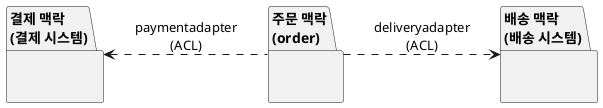
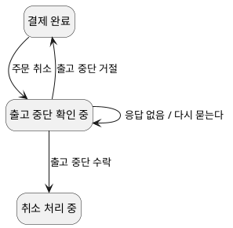

--------------------
Session 명: 13. OOAD에서 전문영역으로 — Architecture · DDD · MSA
--------------------

## 목차

01. 세션 목표
02. 공통 기반
03. OOAD가 넘기는 것
04. 아키텍처는 중요한 것
05. 바꾸기 어려운 결정
06. 품질 속성
07. 품질 속성 시나리오
08. 시스템 수준의 절충
09. OOAD에서 아키텍처로
10. 맥락 안의 모델
11. 맥락 지도
12. 공통 언어
13. 핵심 도메인
14. OOAD에서 DDD로
15. 마이크로서비스
16. 원격 호출은 다르다
17. 분산된 취소
18. 경계는 처음에 맞히기 어렵다
19. 조직과 설계
20. OOAD에서 MSA로
21. 잘못된 관행 — 서비스부터 나누기
22. 잘못된 관행 — 하나의 전사 모델
23. 잘못된 관행 — 도메인 없는 아키텍처
24. 실습 — 전문영역으로의 확장
25. 품질 속성 시나리오 (안)
26. 맥락 지도 (안)
27. 서비스 분리 판단 (안)
28. 확장 보완 (안)
29. 요약

## 01. 세션 목표

이 세션은 OOAD에서 다룬 판단과 **Architecture·DDD·MSA**가 추가로 소유하는 판단을 구분한다.

- 구조적 **품질 속성**과 시스템 수준의 절충이 아키텍처의 판단임을 설명한다.
- 도메인 모델의 **지속적 정제**, 공통 언어, **Bounded Context**가 DDD의 판단임을 설명한다.
- 분산 경계·**원격 통신**·운영 실패가 MSA의 판단임을 설명한다.
- 각 전문영역이 OOAD의 어느 **산출물을 입력**으로 쓰는지 연결한다.
- 서비스부터 나누기·하나의 전사 모델 같은 **잘못된 관행**을 식별한다.

**강사 노트**

- 이 세션은 세 전문영역을 **가르치지 않는다**. 각 영역의 입구에서 OOAD의 판단이 어떻게 이어지는지와, 어디서부터 그 영역의 판단인지를 보인다.
- 세션 전체가 같은 예를 쓴다 — 주문 O-1(펜 2개, 서울, 결제 2,000원)의 **취소**. 앞 세션까지 한 프로세스 안에서 일어난 취소를, 품질 속성·맥락·서비스의 눈으로 다시 본다.

---

## 02. 공통 기반

OOAD는 전문영역을 **대체하지 않는다**. 문제 이해와 설계 판단의 **공통 기반**을 준다. 아래 표의 가운데 열이 이 과정이 준 것, 오른쪽 열이 각 영역이 **더** 소유하는 판단이다.

**인용문**

"아키텍처는 **중요한 것**에 관한 것이다. 그것이 무엇이든", "Architecture is about the important stuff. Whatever that is.", Martin Fowler, 2003

| 전문영역 | OOAD가 준 것 | 더 소유하는 판단 |
|---|---|---|
| **Architecture** | 패키지 경계, 의존 규칙, 대안 평가 | 품질 속성, 시스템 수준의 절충 |
| **DDD** | 도메인 모델, 용어집, 연동 | 지속적 정제, 공통 언어, 맥락 경계 |
| **MSA** | 비동기 통보, 상태 경계, 멱등 | 분산 경계, 원격 통신, 운영 실패 |

- "중요한 것"은 시스템마다 다르다. 무엇이 중요한지 알아보는 눈이 **문제 이해**이고, OOAD가 그 눈을 준다.

**강사 노트**

- 인용 근거: Martin Fowler, "Who Needs an Architect?", *IEEE Software* 20(5), 2003, [martinfowler.com PDF](https://martinfowler.com/ieeeSoftware/whoNeedsArchitect.pdf) 원문 확인. 같은 글은 아키텍트를 "중요한 것을 걱정하는 사람"으로 이어 정의한다.
- 표의 가운데 열은 모두 앞 세션의 산출물이다. 전문영역은 빈손에서 시작하지 않는다.

---

## 03. OOAD가 넘기는 것

전문영역으로 넘어갈 때 **새로 만들 것**보다 **이미 있는 것**이 많다. 표는 주문 사례의 산출물 가운데 세 영역이 입력으로 쓰는 것을 모았다. 한 산출물이 여러 영역에 쓰인다.

| OOAD 산출물 | Architecture | DDD | MSA |
|---|---|---|---|
| **용어집** | — | 공통 언어의 출발 | 서비스 API의 이름 |
| **도메인 모델** | — | 모델 정제의 출발 | 데이터 소유 |
| **상태 기계** | 가용성 판단 | 규칙의 위치 | 최종 일관성 |
| **패키지·의존** | 모듈 구조 | 맥락 후보 | 서비스 후보 |
| **결정 기록** | 아키텍처 결정 | — | 분리 결정 |

- 오른쪽 세 열이 빈 곳은 그 영역이 **그 산출물 없이도** 판단할 수 있다는 뜻이 아니라, 주된 입력이 아니라는 뜻이다.

**강사 노트**

- 표를 채우며 수강생의 역할과 연결한다. 아키텍트·도메인 모델러·서비스 개발자가 같은 산출물을 **다른 질문**으로 읽는다.

---

## 04. 아키텍처는 중요한 것

**아키텍처**는 시스템 전체에 걸쳐 **중요한 결정**이다. 주문 사례의 결정 가운데 어떤 것은 한 클래스의 일이고, 어떤 것은 시스템 전체의 일이다. 표의 오른쪽 열이 그 구분이다.

| O-1의 취소에 관한 결정 | 영향 범위 | 수준 |
|---|---|---|
| **`Order.cancel()`의 사전조건** | 주문 클래스 | 설계 |
| **`CarrierSelector`에 선택을 둔다** | 배송 패키지 | 설계 |
| **업무 경계가 연동에 의존하지 않는다** | 모든 패키지 | 아키텍처 |
| **외부 통보는 비동기로 받는다** | 모든 외부 연동 | 아키텍처 |

- 아래 두 행은 **바꾸면 전체가 바뀐다**. 이 과정은 그 결정을 "05. 구조적 경계와 의존성"에서 내렸다 — OOAD가 아키텍처의 일부를 이미 다뤘다.

**강사 노트**

- 설계와 아키텍처의 경계는 선이 아니라 **폭**이다. 이 과정의 원칙("01. OOAD 개요")처럼 판단의 수준이 다르다.

---

## 05. 바꾸기 어려운 결정

아키텍처 결정은 **나중에 바꾸기 어려워서** 초기에 제대로 내리고 싶은 결정이다. 바꾸기 어려운 이유를 알면, 어떤 결정은 **쉽게 바꿀 수 있게** 만들어 초기 부담을 줄일 수 있다.

**인용문**

"아키텍처는 프로젝트 **초기에 제대로 내리고 싶은** 결정이다", "Architecture is the decisions that you wish you could get right early in a project.", Ralph Johnson(Martin Fowler, 2003 재인용)

| O-1의 결정 | 바꾸기 어려운 이유 | 쉽게 만든 방법 |
|---|---|---|
| **결제 시스템의 선택** | 연동 코드 전체 | 연동으로 격리 |
| **저장 기술** | 모든 저장·복원 | 저장소 약속과 매퍼 |
| **배송 대행사의 수** | 선택 규칙의 분산 | 선택 한 곳 |
| **동기·비동기의 선택** | 모든 상태 경계 | 쉽게 만들지 못했다 |

- 마지막 행이 **남은 아키텍처 결정**이다. 비동기를 동기로 바꾸면 취소 처리 중이 사라지고 상태 기계가 바뀐다.

**강사 노트**

- 인용 근거: Fowler(2003) 같은 글 원문 확인. Fowler는 이어 사람들이 초기에 정하려는 이유를 "그것이 **바꾸기 어렵다**고 보기 때문"이라고 쓰고, 좋은 아키텍트는 바꾸기 어려운 것을 **줄이는** 사람이라고 말한다.
- 표의 셋째 열은 "05. 구조적 경계와 의존성", "10. 기술 제약과 도메인 의미 보존", "09. 설계 대안 평가"의 결정이다.

---

## 06. 품질 속성

기능이 같아도 **품질 속성**(가용성, 성능, 보안…)이 다르면 구조가 달라진다. O-1의 취소 기능은 그대로인데, "결제 시스템이 멈춰도 취소를 받아야 한다"는 요구 하나가 구조를 바꾼다.

**인용문**

"**품질 속성**은 시스템의 아키텍처에 **강한 영향**을 준다", "the quality attributes have a strong influence on the architecture of a system.", Craig Larman, 2004

| 품질 속성 | O-1의 취소에서 | 구조에 주는 영향 |
|---|---|---|
| **가용성** | 결제 시스템 장애 중에도 취소 접수 | 환불 요청을 저장했다가 보낸다 |
| **성능** | 취소 응답 1초 이내 | 외부 요청을 기다리지 않는다 |
| **보안** | 본인 주문만 취소 | 인증을 서비스 앞에 둔다 |

**강사 노트**

- 인용 근거: Larman, 3rd ed.(2004), §5.4 "What are the Types and Categories of Requirements?" 원문 확인. 원문은 "고성능·고신뢰 요구는 소프트웨어·하드웨어 컴포넌트의 선택과 구성에 영향을 준다"로 이어진다. 같은 책 §33.3은 아키텍처 분석을 "기능 요구의 맥락에서 비기능 요구를 식별하고 해결하는 것"으로 정의한다.
- 품질 속성은 "02. 요구 분석과 유스케이스"의 비기능 요구다. 이 과정은 기능 요구를 중심으로 모델링했고, 품질 속성의 **구조적 해결**은 아키텍처의 몫이다.

---

## 07. 품질 속성 시나리오

품질 속성은 "가용성이 높아야 한다"로는 판단할 수 없다. **시나리오**로 써야 검증할 수 있다. 아래 표는 O-1의 취소에 대한 가용성 시나리오를 여섯 부분으로 나눈 것이다.

| 부분 | O-1의 가용성 시나리오 |
|---|---|
| **자극원** | 고객 |
| **자극** | O-1의 취소 요청 |
| **대상** | 주문 시스템 |
| **환경** | 결제 시스템 장애 중 |
| **응답** | 취소를 접수하고 취소 처리 중이 된다 |
| **응답 측정** | 장애 중 취소 접수 99.9%, 복구 뒤 1시간 내 환불 요청 |

- 마지막 행이 **검증 기준**이다. 기준이 있어야 대안을 비교하고 테스트할 수 있다.

**강사 노트**

- 여섯 부분의 틀은 Bass·Clements·Kazman, *Software Architecture in Practice*의 품질 속성 시나리오를 따른다(인용하지 않고 틀만 쓴다).
- 수치는 교육용 가정이다. 실제 기준은 이해관계자와 정한다 — 요구 분석("02. 요구 분석과 유스케이스")의 일이다.

---

## 08. 시스템 수준의 절충

품질 속성끼리는 **충돌**한다. O-1의 취소에서 가용성을 높이면 "취소됨"을 확정하는 시점이 늦어진다. 표는 두 대안의 절충이며, "09. 설계 대안 평가"의 흐름을 **시스템 수준**에 적용한 것이다.

| 결제 시스템 장애 중 | 대안 A — 취소 거절 | 대안 B — 접수 후 환불 대기 |
|---|---|---|
| **가용성** | 낮다(고객이 다시 시도) | 높다 |
| **일관성** | 즉시 확정 | 나중에 확정(최종 일관성) |
| **복잡도** | 낮다 | 환불 대기열, 재시도 |
| **고객 안내** | "잠시 후 다시" | "환불은 복구 후" |

- 이 과정의 설계는 이미 **B에 가깝다**. 취소 처리 중이 "요청했지만 확정되지 않음"을 표현한다(「05」의 마지막 행).

**강사 노트**

- 어느 대안이 맞는지는 업무가 정한다. 선택과 포기한 대안은 결정 기록으로 남긴다("09. 설계 대안 평가").
- 가용성과 일관성의 절충은 분산 시스템에서 더 날카로워진다(「17. 분산된 취소」).

---

## 09. OOAD에서 아키텍처로

OOAD의 판단은 아키텍처에서 **범위가 넓어진다**. 표의 왼쪽이 이 과정에서 내린 판단, 오른쪽이 아키텍처가 이어서 소유하는 판단이다.

| OOAD에서 | 아키텍처로 |
|---|---|
| **패키지 경계와 의존 규칙** | 모듈·배포 단위와 그 규칙 |
| **설계 대안 평가** | 품질 속성 시나리오와 절충 분석 |
| **기술 제약과 의미 보존** | 기술 선택과 그 결정 기록 |
| **결정 기록** | 아키텍처 결정 기록(ADR) |

- 공통점은 **결정과 검증**이다. 아키텍처도 결정을 내리고, 시나리오와 테스트로 검증한다.

**강사 노트**

- 절충 분석의 방법(ATAM 등)과 아키텍처 스타일의 비교는 SW Architecture 과정의 주제다.
- "10. 기술 제약과 도메인 의미 보존"의 도메인 격리 구조를 포트와 어댑터(육각형 아키텍처)라 부른다고 예고했다. 이름이 붙은 아키텍처 스타일은 이처럼 OOAD의 판단을 **패턴으로 굳힌** 것이다.

---

## 10. 맥락 안의 모델

같은 말도 **맥락**이 다르면 뜻이 다르다. "주문"은 주문 시스템에서는 O-1의 상태를 가진 약속이지만, 배송 시스템과 회계 시스템에서는 다른 것이다. 표의 가운데 열이 각 맥락에서의 뜻이다.

**인용문**

"모델의 표현은 다른 모든 말처럼 **맥락 안에서만** 뜻이 있다", "Model expressions, like any other phrase, only have meaning in context.", Eric Evans, 2015

| 맥락 | "O-1"이 뜻하는 것 | 식별자 |
|---|---|---|
| **주문 시스템** | 항목·상태·결제를 가진 주문 | 주문 번호 O-1 |
| **배송 시스템** | 출고할 물건 한 건 | 배송 번호 D-1 |
| **결제 시스템** | 2,000원의 결제 한 건 | 결제 금액·주문 번호 |
| **회계 시스템** | 입금 한 건과 영수증 | 영수증 번호 |

- 이 과정은 이 차이를 **연동**으로 다뤘다("05. 구조적 경계와 의존성"). DDD는 이것을 **Bounded Context**로 이름 붙인다.

**강사 노트**

- 인용 근거: Eric Evans, [Domain-Driven Design Reference](https://www.domainlanguage.com/wp-content/uploads/2016/05/DDD_Reference_2015-03.pdf), 2015, "Bounded Context" 원문 확인. 같은 곳은 "모델이 적용되는 맥락을 명시적으로 정하라"고 하고, 경계를 팀 조직·애플리케이션의 쓰임·코드베이스와 데이터베이스 스키마로 정하라고 한다.
- 배송 시스템의 말("출고 한 건")은 우리 용어집에 없다 — 우리 맥락 밖의 말이기 때문이다. 용어집은 **우리 맥락의 언어**다.

---

## 11. 맥락 지도

**다이어그램 — 패키지 다이어그램**

**맥락 지도**는 맥락들과 그 관계를 한 그림에 둔다. 가운데가 우리의 **주문 맥락**이고, 양쪽 외부 맥락과는 화살표 위의 연동 — DDD의 **부패 방지 계층**(ACL) — 을 거쳐서만 말한다.

**도식 — PlantUML**

- **ACL** — 외부 맥락의 모델이 주문 맥락에 새어 들어오지 않게 번역한다. "10. 기술 제약과 도메인 의미 보존"의 연동이 그것이다.

**강사 노트**

- "10. 기술 제약과 도메인 의미 보존"에서 인용한 Evans의 ACL 정의와 같은 구조다. 이 과정의 연동은 처음부터 ACL이었다.
- 맥락 지도의 다른 관계(공유 커널, 고객–공급자, 순응자 등)는 DDD 과정의 주제다.

---

## 12. 공통 언어

**공통 언어**는 용어집보다 넓다. 대화·도식·코드가 **같은 언어**를 쓰고, 언어가 바뀌면 모델과 코드가 함께 바뀐다. 이 과정에서 그런 일이 한 번 있었다 — 동적 모델이 **취소 처리 중**을 찾았다.

**인용문**

"**언어의 변경**은 곧 **모델의 변경**임을 인식하라", "Recognize that a change in the language is a change to the model.", Eric Evans, 2015

| 취소 처리 중이 생겼을 때 | 바뀐 것 |
|---|---|
| **언어** | "환불 완료 전의 취소된 주문"을 부르는 말이 생겼다 |
| **모델** | 주문 상태에 값 하나, 상태 기계에 전이 둘 |
| **코드** | `OrderStatus.CANCELLING`, `onRefundCompleted` |
| **용어집** | 취소 처리 중 — `CANCELLING` |

- 네 행이 **함께** 바뀌었다. 하나만 바뀌었다면 언어가 갈라진 것이다.

**강사 노트**

- 인용 근거: Evans(2015), "Ubiquitous Language" 원문 확인. 같은 곳은 모델을 언어의 뼈대로 삼고, 새 모델에 맞춰 클래스·메서드·모듈의 이름을 바꾸라고 한다.
- "02. 요구 분석과 유스케이스"의 용어집 노트에서 예고한 관계가 이것이다 — 용어집은 공통 언어를 **글로 고정한 한 형태**이고, 공통 언어는 맥락 안에서 계속 **정제**된다.

---

## 13. 핵심 도메인

모든 모델에 같은 노력을 들이지 않는다. **핵심 도메인** — 이 시스템만의 경쟁력 — 에 가장 깊은 모델을 둔다. 표는 주문 사례의 영역을 나누고, 오른쪽 열에 **투자의 깊이**를 정한다.

**인용문**

"모델을 **졸여라**. 핵심 도메인을 정하고 … **핵심을 작게** 하라", "Boil the model down. Define a core domain … Make the core small.", Eric Evans, 2015

| 영역 | 종류 | 투자 |
|---|---|---|
| **주문 상태와 취소** | 핵심 | 깊은 모델, 상태 기계, 계약 |
| **대행사 선택** | 핵심에 가까움 | 변이 설계 |
| **결제·배송** | 일반(외부 시스템) | 연동만 |
| **상품 조회** | 지원 | 단순한 조회 |

- 이 판단은 "11. 통합 설계와 적정 모델링"의 **위험 주도** 판단과 같은 방향이다 — 가치와 위험이 큰 곳에 모델을 둔다.

**강사 노트**

- 인용 근거: Evans(2015), "Core Domain" 원문 확인. 생략한 부분: "and provide a means of easily distinguishing it from the mass of supporting model and code. Bring the most valuable and specialized concepts into sharp relief." 같은 곳은 뛰어난 개발자를 핵심 도메인에 두라고 한다.
- 어느 것이 핵심인지는 **업무 전략**이 정한다. 이 표는 교육용 가정이다.

---

## 14. OOAD에서 DDD로

DDD의 전술 패턴 대부분은 이 과정에서 **이름 없이** 이미 만들었다. 표의 왼쪽이 이 과정의 산출물, 오른쪽이 DDD의 이름이다.

| OOAD에서 | DDD로 |
|---|---|
| **도메인 모델과 용어집** | 지속적으로 정제하는 모델과 공통 언어 |
| **값 타입(`Money`, `Quantity`)** | 값 객체 |
| **주문과 항목의 합성** | 애그리거트 |
| **`OrderRepository`** | 리포지터리 |
| **연동** | 부패 방지 계층 |
| **패키지 경계** | Bounded Context의 후보 |

- DDD가 **더** 소유하는 것은 오른쪽의 이름보다 **정제의 과정** — 도메인 전문가와 함께 모델을 계속 깊게 하는 일 — 이다.

**강사 노트**

- 이름의 대응은 대략적이다. 예를 들어 패키지 경계가 곧 Bounded Context는 아니다 — 같은 맥락 안에 패키지가 여럿일 수 있다.
- 사건(도메인 이벤트)은 "02. 요구 분석과 유스케이스"부터 이 과정의 출발점이었다. DDD의 도메인 이벤트와 같은 관점이다.

---

## 15. 마이크로서비스

**마이크로서비스**는 하나의 애플리케이션을 **따로 배포되는 작은 서비스**로 나눈다. 이 과정의 패키지와 무엇이 다른지가 판단의 출발점이다. 표는 `order`와 `delivery`를 패키지로 둘 때와 서비스로 나눌 때를 비교한다.

**인용문**

"하나의 애플리케이션을 **작은 서비스들의 묶음**으로 개발하는 방식 — 각자 **자기 프로세스**에서 돌고 가벼운 방식으로 통신한다", "the microservice architectural style is an approach to developing a single application as a suite of small services, each running in its own process and communicating with lightweight mechanisms", James Lewis·Martin Fowler, 2014

| `order`와 `delivery` | 패키지 | 서비스 |
|---|---|---|
| **배포** | 함께 | 따로 |
| **호출** | 메서드 호출 | 네트워크 요청 |
| **데이터** | 한 데이터베이스 | 서비스마다 따로 |
| **실패** | 함께 멈춘다 | 한쪽만 멈출 수 있다 |

**강사 노트**

- 인용 근거: James Lewis·Martin Fowler, ["Microservices"](https://martinfowler.com/articles/microservices.html)(2014-03-25) 원문 확인. 같은 글은 서비스 경계를 정할 때 DDD의 Bounded Context가 유용하다고 한다.
- 오른쪽 열의 모든 행이 **새 판단**을 요구한다. 특히 마지막 두 행 — 데이터와 실패 — 이 MSA의 핵심 판단이다.

---

## 16. 원격 호출은 다르다

패키지 사이의 호출은 빠르고 **항상 도착**한다. 서비스 사이의 호출은 느리고 **실패할 수 있다**. O-1의 취소에서 `requestDispatchStop()`이 원격 호출이 되면 결과가 둘이 아니라 **셋**이 된다.

**인용문**

"프로세스 안의 호출은 빠르고 **항상 성공**한다. 원격 호출은 **몇 자릿수 느리고**, 원격 프로세스나 연결의 장애로 **언제나 실패할 수 있다**", "An in-process function call is fast and always succeeds … Remote calls, however, are orders of magnitude slower, and there's always a chance that the call will fail due to a failure in the remote process or the connection.", Martin Fowler, 2014

| 출고 중단 요청의 결과 | 프로세스 안 | 원격 |
|---|---|---|
| **수락됐다** | 있음 | 있음 |
| **거절됐다(이미 출고)** | 있음 | 있음 |
| **모른다(응답 없음)** | 없음 | **있음** |

- "모른다"는 **새 상태**를 요구한다. 수락됐는지 모르는 O-1을 결제 완료로 둘 수도, 취소 처리 중으로 둘 수도 없다.

**강사 노트**

- 인용 근거: Martin Fowler, ["Microservices and the First Law of Distributed Objects"](https://martinfowler.com/articles/distributed-objects-microservices.html)(2014-08-13) 원문 확인. 같은 글의 제1법칙은 "Don't distribute your objects."이다.
- 이 과정의 배송 시스템은 **외부 시스템**이라 이미 원격이었다. 교육용 가정으로 출고 중단은 동기이고 항상 응답한다고 두었다. 이 가정을 풀면 이 표가 된다.

---

## 17. 분산된 취소

**다이어그램 — 상태 기계 다이어그램**

"모른다"를 다루는 방법은 **동적 모델링**이다 — 이 과정의 판단이 그대로 쓰인다. 도식은 결제 완료에서 취소할 때 출고 중단의 응답을 **기다리는 상태**를 더한 것이며, 응답이 없으면 다시 묻는다.

**도식 — PlantUML**

- 이 상태 기계는 교육용 **예시**다. 서비스로 나누기로 결정한 뒤에만 필요하다 — 나누지 않으면 이 복잡도도 없다.

**강사 노트**

- 원격 요청을 다시 보내려면 받는 쪽이 **멱등**해야 한다 — "12. 구현·검증·DevOps와 SW공학 피드백"의 중복 환불 통보와 같은 판단이다.
- 여러 서비스에 걸친 취소를 단계별 요청과 보상으로 엮는 방법(사가 등)은 MSA 과정의 주제다. 이 과정의 취소 처리 중과 환불 완료 통보가 그 씨앗이다.

---

## 18. 경계는 처음에 맞히기 어렵다

서비스 경계는 **나중에 옮기기 어렵다**. 그런데 처음에 맞히기도 어렵다. 그래서 경계가 검증될 때까지는 **한 애플리케이션 안의 모듈**로 두고, 경계를 확인한 뒤에 나눈다.

**인용문**

"경험 많은 아키텍트도 익숙한 도메인에서 **처음부터 경계를 맞히기**는 매우 어렵다", "even experienced architects working in familiar domains have great difficulty getting boundaries right at the beginning.", Martin Fowler, 2015

| 주문 사례의 경계 | 확인한 evidence | 서비스 후보 |
|---|---|---|
| **order ↔ 연동** | 대행사 추가가 연동에서 멈췄다 | 강함 |
| **order ↔ persistence** | 저장 변경이 매퍼에서 멈췄다 | 아님(기술 경계) |
| **delivery 안의 선택** | 대행사 추가가 한 곳에서 끝났다 | 약함 |

- 경계의 evidence는 **변경이 어디서 멈췄는가**다. 앞 세션의 변화 대응이 그 evidence를 만들었다.

**강사 노트**

- 인용 근거: Martin Fowler, bliki ["MonolithFirst"](https://martinfowler.com/bliki/MonolithFirst.html)(2015-06-03) 원문 확인. 같은 글은 서비스 사이로 기능을 옮기는 리팩터링이 모놀리스 안보다 훨씬 어렵다고 말한다.
- 표의 evidence는 차례로 "08. 변화 대응과 변이 설계", "10. 기술 제약과 도메인 의미 보존", "09. 설계 대안 평가"에서 나왔다.
- 기술 경계(`persistence`)는 서비스 경계가 아니다. 서비스는 **업무 능력**으로 나눈다.

---

## 19. 조직과 설계

설계의 경계는 **조직의 의사소통 구조**를 닮는다. 서비스 경계를 정하는 것은 곧 **팀 경계**를 정하는 것이기도 하다. 표는 주문 사례의 팀 구성 두 가지와 그 결과다.

**인용문**

"시스템을 설계하는 조직은 **자기 의사소통 구조를 복사한** 설계를 만들도록 제약받는다", "organizations which design systems … are constrained to produce designs which are copies of the communication structures of these organizations.", Melvin E. Conway, 1968

| 팀 구성 | 생기기 쉬운 설계 |
|---|---|
| **화면 팀·서버 팀·DB 팀** | 기술 계층으로 나뉜 서비스, 취소 하나에 세 팀 |
| **주문 팀·배송 연동 팀** | 업무 경계로 나뉜 서비스, 취소는 주문 팀 |

- 경계를 먼저 정하고 **팀을 경계에 맞추는** 선택도 있다. 어느 쪽이든 둘은 따로 정할 수 없다.

**강사 노트**

- 인용 근거: Melvin E. Conway, "How Do Committees Invent?", *Datamation*, 1968-04, [저자 공개 전문](https://www.melconway.com/Home/Committees_Paper.html) 원문 확인. 흔히 콘웨이의 법칙으로 부른다. Lewis·Fowler(2014)도 같은 문장을 인용한다.
- 팀 경계를 설계에 맞추는 전략을 흔히 "역 콘웨이 전략"이라 부른다.

---

## 20. OOAD에서 MSA로

MSA의 판단도 OOAD 위에 선다. 표의 왼쪽은 이 과정이 **한 프로세스 안에서** 내린 판단이고, 오른쪽은 그 판단이 서비스 사이로 나갈 때의 모습이다.

| OOAD에서 | MSA로 |
|---|---|
| **패키지 경계와 의존 규칙** | 서비스 경계와 API 계약 |
| **비동기 통보와 취소 처리 중** | 이벤트와 최종 일관성 |
| **연동의 형식 번역** | 서비스 사이의 부패 방지 계층 |
| **멱등한 통보 처리** | 재전송에 안전한 메시지 처리 |
| **통합 테스트** | 계약 테스트 |

- MSA가 **더** 소유하는 것은 오른쪽을 **운영**하는 일 — 배포, 관측, 장애 격리 — 이다.

**강사 노트**

- 왼쪽 열이 약하면 오른쪽은 더 약하다. 한 프로세스 안에서 경계가 흐린 설계를 나누면 **분산된 흐린 경계**가 된다.

---

## 21. 잘못된 관행 — 서비스부터 나누기

경계를 확인하기 전에 **서비스부터** 나눈다. 원격 호출·분산 데이터·운영의 비용은 바로 생기고, 경계가 틀렸다는 것은 나중에 안다.

**인용문**

"모놀리스로 관리하기에 **너무 복잡한** 시스템이 아니면 마이크로서비스는 **고려조차 하지 마라**", "Don't even consider microservices unless you have a system that's too complex to manage as a monolith.", Martin Fowler, 2015

- **예** — 주문 시스템을 장바구니·주문·상품 조회 서비스로 먼저 나눈다. O-1의 주문 성립이 세 서비스를 거치고, 단가 확정이 두 서비스에 흩어진다.
- **바른 방법** — 모듈과 의존 규칙으로 경계를 먼저 검증하고(「18」), 복잡도가 그 비용을 넘을 때 나눈다.

**강사 노트**

- 인용 근거: Martin Fowler, bliki ["MicroservicePremium"](https://martinfowler.com/bliki/MicroservicePremium.html)(2015-05-13) 원문 확인. 마이크로서비스에는 비용(premium)이 있고, 복잡도가 낮은 시스템에서는 그 비용이 생산성을 떨어뜨린다는 논지다.

---

## 22. 잘못된 관행 — 하나의 전사 모델

회사 전체에 **하나의 모델**을 만들고 모든 시스템이 따르게 한다. "주문"의 모든 뜻을 한 클래스에 담으려다 누구에게도 맞지 않는 모델이 된다.

- **예** — 전사 `Order`에 주문 상태·출고 단위·입금 정보를 모두 둔다. 배송 시스템의 변경이 주문 시스템을 멈춘다.
- **바른 방법** — 맥락마다 모델을 두고(「10」), 맥락 사이는 **번역**한다(「11」).

**강사 노트**

- 하나의 전사 모델은 "10. 기술 제약과 도메인 의미 보존"의 **외부 모델 닮기**를 회사 규모로 한 것이다.
- 용어의 통일이 목표가 아니라 **맥락 안의 일관성**이 목표다.

---

## 23. 잘못된 관행 — 도메인 없는 아키텍처

박스와 선으로 **기술 구조**만 그리고, 도메인의 판단은 "나중에 개발자가"로 미룬다. 구조는 그럴듯해도 업무 규칙이 어디 있어야 하는지 답하지 못한다.

- **예** — 게이트웨이·서비스·메시지 큐의 도식은 있는데, O-1의 취소 규칙과 취소 처리 중이 어느 서비스의 것인지 정하지 않았다.
- **바른 방법** — 품질 속성 시나리오와 **도메인 모델**을 함께 입력으로 쓴다(「03」). 아키텍처의 "중요한 것"에는 도메인이 들어간다.

**강사 노트**

- 이 세션의 앵커가 여기서 닫힌다. OOAD는 전문영역을 대체하지 않지만, OOAD 없이 전문영역만 하면 **문제 이해**가 빠진다.

---

## 24. 실습 — 전문영역으로의 확장

정기배송을 **품질 속성·맥락·서비스**의 눈으로 LLM과 함께 다시 보고, 점검 항목으로 **피드백**하여 완성하십시오.

- **투입물**
  + 실습 2~12의 **산출물 전체**(용어집, 도메인 모델, 상태 기계, 패키지, 결정 기록, 역추적표)
- **프롬프트**
  + ① "정기배송의 **품질 속성 시나리오** 하나를 여섯 부분으로 써줘. 매월 회차 청구를 대상으로 해줘."
  + ② "정기배송·결제·배송·회계의 **맥락 지도**를 그리고, 각 맥락에서 '회차'가 무엇을 뜻하는지 표로 써줘."
  + ③ "정기배송 시스템을 **서비스로 나눌지** 판단하고, 나눈다면 경계와 그 evidence를 써줘."
- **점검 항목**
  1. **측정** — 시나리오에 검증할 수 있는 응답 측정이 있는가?
  2. **맥락** — 같은 말이 맥락마다 다른 뜻인 것을 찾았는가?
  3. **번역** — 외부 맥락과의 관계에 연동(ACL)이 있는가?
  4. **evidence** — 서비스 경계의 근거가 변경이 멈춘 곳인가?
  5. **비용** — 나누는 비용(원격 호출·분산 데이터·운영)을 따졌는가?
- **결과물** — 품질 속성 시나리오, 맥락 지도, 서비스 분리 판단. AI-native SW공학의 입력이 됩니다.

**강사 노트**

- LLM은 서비스를 **잘게 나누는** 답을 내기 쉽다. 점검 항목 4·5로 되돌린다.

---

## 25. 품질 속성 시나리오 (안)

매월 1일의 **회차 청구**를 성능 시나리오로 썼다. 응답 측정의 두 수치가 검증 기준이다.

| 부분 | 정기배송의 성능 시나리오 |
|---|---|
| **자극원** | 매월 1일 0시의 청구 일정 |
| **자극** | 월별 청구 회차 10만 건의 청구 |
| **대상** | 정기배송 시스템의 회차 청구 |
| **환경** | 평상시, 결제 시스템 정상 |
| **응답** | 모든 회차를 청구하고 결과를 회차에 기록 |
| **응답 측정** | 2시간 내 완료, 실패 회차는 다음 날 재청구 |

**강사 노트**

- 이 시나리오는 구조를 바꾼다 — 청구를 한 건씩 동기로 하면 2시간을 넘는다. 청구 요청을 모아 보내고 결과 통보를 비동기로 받는 구조가 된다.
- 재청구는 멱등해야 한다 — "12. 구현·검증·DevOps와 SW공학 피드백"의 판단이다.

---

## 26. 맥락 지도 (안)

"회차"는 맥락마다 뜻이 다르다. 표의 가운데 열이 각 맥락에서의 뜻이고, 정기배송 맥락만 **우리 용어집**을 쓴다.

| 맥락 | "회차"가 뜻하는 것 | 관계 |
|---|---|---|
| **정기배송** | 예정일·상태를 가진 배송 회차 | 우리 맥락 |
| **결제** | 청구 한 건 | 결제 연동(ACL) |
| **배송** | 출고 한 건 | 배송 연동(ACL) |
| **회계** | 매출 한 건과 영수증 | 회계 연동(ACL) |

**강사 노트**

- 정기배송 맥락의 회차 상태(예정·배송 요청됨·청구됨…)는 외부 맥락에 보내지 않는다. 연동이 외부의 말로 번역한다.

---

## 27. 서비스 분리 판단 (안)

정기배송은 지금 **서비스로 나누지 않는다**. 모듈 경계를 유지하고, 나눌 조건을 결정 기록에 둔다.

- **판단**
  - **모놀리스 유지** — 팀 하나, 업무 규칙이 회차 상태에 모여 있다.
- **근거**
  - **evidence** — 변경이 연동에서 멈췄다. 업무 경계 안의 변경은 아직 적다.
  - **비용** — 나누면 해지와 배송 요청의 경합(실습 12)이 원격 호출이 된다.
- **다시 열 조건**
  - **성능** — 회차 청구가 시나리오의 2시간을 넘으면 청구를 분리한다.

**강사 노트**

- "나누지 않는다"도 결정이다. 다시 열 조건이 있으면 좋은 결정 기록이다.

---

## 28. 확장 보완 (안)

전문영역의 눈으로 찾은 것은 **후속 작업에 영향을 미치는 경우에만** 이전 산출물에 반영한다.

- **요구사항 명세서**(실습 1)
  - **새 비기능 요구** — 회차 청구 성능 시나리오
- **결정 기록**(실습 9)
  - **새 기록** — 모놀리스 유지와 다시 열 조건
- **용어집**(실습 2)
  - **맥락 표시** — 용어집은 정기배송 맥락의 언어임을 밝힌다
- **※ 현행화 기준**
  - **반영** — 비기능 요구, 결정 기록, 용어집의 맥락.
  - **기록만** — 맥락 지도.

**강사 노트**

- 맥락 지도는 외부 시스템이 바뀔 때 다시 그린다. 지금은 기록으로 충분하다.

---

## 29. 요약

이 세션은 OOAD의 판단과 **전문영역이 더 소유하는 판단**을 구분했다.

### OOAD에서 전문영역으로의 핵심

- **원칙** — OOAD는 전문영역을 대체하지 않고, 문제 이해와 설계 판단의 공통 기반이다
- **Architecture** — 품질 속성 시나리오와 시스템 수준의 절충, 바꾸기 어려운 결정
- **DDD** — 맥락 안의 모델, 공통 언어의 정제, 핵심 도메인
- **MSA** — 원격 호출의 실패, 검증된 경계, 조직과 설계
- **잘못된 관행** — 서비스부터 나누기, 하나의 전사 모델, 도메인 없는 아키텍처

### 다음 세션

- "**14. AI-native SW공학**" — OOAD의 판단을 Human과 Agent가 어떻게 나누고 검증하는지 연결한다.

**강사 노트**

- 다음 세션은 이 과정의 판단 — 문제·모델·경계·책임 — 을 AI Agent에게 맥락으로 주고, 사람이 검증하는 방법을 다룬다.
