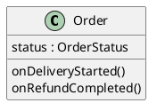

--------------------
Session 명: 14. AI-native SW공학
--------------------

## 목차

01. 세션 목표
02. 판단이 상한이다
03. 에이전트에게 맡길 과제
04. 맥락은 유한하다
05. 판단을 맥락으로
06. 도메인 모델과 온톨로지
07. 맥락 파일
08. 사람과 에이전트의 역할
09. 확인 지점
10. 가드레일·에이전트·하네스
11. 가이드와 센서
12. 의존 규칙 센서
13. 과제 테스트
14. 에이전트의 결과
15. 센서가 가리키는 판단
16. 잘못된 관행 — 테스트를 끄는 에이전트
17. 잘못된 관행 — 맥락 쏟아붓기
18. 잘못된 관행 — 판단까지 맡기기
19. 요약

## 01. 세션 목표

이 세션은 OOAD의 판단을 **사람과 에이전트**가 어떻게 나누고 **검증**하는지 AI-native 개발 관점에서 연결한다.

- 문제·모델·경계·책임의 판단이 에이전트 작업의 **품질 상한**임을 설명한다.
- 용어집·도메인 모델·상태 기계·계약을 에이전트의 **맥락**으로 고르고 전달한다.
- 과제마다 사람과 에이전트의 **역할**과 확인 지점을 정한다.
- **가드레일·에이전트·하네스**의 역할과, 가이드와 센서의 feedback을 설명한다.
- 테스트를 끄는 에이전트·맥락 쏟아붓기 같은 **잘못된 관행**을 식별한다.

**강사 노트**

- "01. OOAD 개요"의 「AI-native SW공학」에서 예고한 구분 — 사람이 최종 책임지는 판단, 사람과 AI의 협업, AI가 주도할 수 있는 실행 — 을 실제 과제에 적용한다.
- 세션 전체가 같은 예를 쓴다 — "12. 구현·검증·DevOps와 SW공학 피드백"에서 남긴 질문, **배송 시작 통보도 중복될 수 있다**를 에이전트에게 맡긴다. 코드의 테스트(`code/s14/test/AgentTaskTest.java`)도 같은 과제다.

---

## 02. 판단이 상한이다

에이전트가 코드를 빠르게 만들어도, 무엇을 만들지와 무엇이 맞는지는 **앞의 판단**이 정한다. 판단이 틀리면 에이전트는 틀린 것을 **빠르게** 만든다. 표는 이 과정의 네 판단이 에이전트 작업에서 무엇을 정하는지다.

| 판단 | 이 과정의 산출물 | 에이전트 작업에서 정하는 것 |
|---|---|---|
| **문제** | 유스케이스, 외부 시스템 약속 | 무엇을 만드는가? |
| **모델** | 용어집, 도메인 모델, 상태 기계 | 어떤 이름과 규칙을 쓰는가? |
| **경계** | 패키지, 의존 규칙 | 어디를 고쳐도 되는가? |
| **책임** | 계약, 결정 기록 | 누가 무엇을 보장하는가? |

- 네 판단이 없으면 에이전트는 **그럴듯한 추측**으로 빈칸을 채운다. 추측이 맞는지 확인할 기준도 없다.

**강사 노트**

- 이 세션의 앵커다 — 자동화의 품질은 문제·모델·경계·책임에 대한 판단 품질을 넘어서기 어렵다.
- "01. OOAD 개요"의 원칙("AI 시대에도 본질은 그대로")이 여기서 구체가 된다. 바뀐 것은 판단을 **실행하는 속도**다.

---

## 03. 에이전트에게 맡길 과제

과제는 "12. 구현·검증·DevOps와 SW공학 피드백"에서 남긴 질문이다. 환불 완료 통보처럼 **배송 시작 통보**도 다시 올 수 있다. 표의 왼쪽이 과제의 부분, 오른쪽이 그 부분을 **누가 정하는지**다.

| 과제의 부분 | 내용 | 정하는 쪽 |
|---|---|---|
| **요구** | 배송 시작 통보는 두 번 이상 올 수 있다 | 사람 |
| **상태 기계** | 배송 중에서 배송 시작 통보 → 그대로 | 사람 |
| **계약** | 사전조건에 이미 배송 중을 더한다 | 사람이 승인 |
| **코드·테스트** | `onDeliveryStarted`와 재현 테스트 | 에이전트 |

- 위의 두 행은 에이전트에게 **주는 맥락**이고, 아래 두 행이 **맡기는 일**이다.

**강사 노트**

- 요구와 상태 기계를 사람이 정하는 이유는 "12. 구현·검증·DevOps와 SW공학 피드백"의 역추적과 같다 — 원인 수준에서 판단하고 아래로 내려온다. 에이전트에게는 판단이 끝난 뒤의 **실행**을 맡긴다.
- 과제의 크기는 테스트 하나와 수정 하나다. 처음 맡기는 과제는 작게 한다.

---

## 04. 맥락은 유한하다

에이전트의 맥락은 **유한한 자원**이다. 많이 줄수록 좋은 것이 아니라, 결과를 정하는 **고신호**만 골라 준다. 표는 이 과제에 줄 것과 주지 않을 것이다.

**인용문**

"좋은 맥락 엔지니어링은 원하는 결과의 가능성을 최대로 높이는 **가장 작은 고신호 토큰 집합**을 찾는 것이다", "Good context engineering means finding the smallest possible set of high-signal tokens that maximize the likelihood of some desired outcome.", [Anthropic 2025]

| 줄 것 | 이유 |
|---|---|
| **주문 상태 기계** | 어떤 전이를 더하는지 정한다 |
| **용어집의 주문 상태** | `IN_DELIVERY` 같은 이름을 정한다 |
| **`onRefundCompleted`의 선례** | 같은 모양의 수정이 이미 있다 |
| **의존 규칙** | `order`만 고치게 한다 |

- **주지 않을 것** — 모든 세션의 도식, 저장·연동 코드 전체. 이 과제의 판단을 바꾸지 않는다.

**강사 노트**

- 인용 근거: Anthropic, ["Effective context engineering for AI agents"](https://www.anthropic.com/engineering/effective-context-engineering-for-ai-agents)(2025-09-29) 원문 확인. 같은 글은 맥락을 한계 효용이 줄어드는 **유한한 자원**으로 다뤄야 한다고 말한다.
- "11. 통합 설계와 적정 모델링"의 판단과 같은 모양이다 — 모델이 판단을 개선할 때만 더하듯, 맥락도 결과를 바꿀 때만 더한다.

---

## 05. 판단을 맥락으로

이 과정의 산출물은 그대로 **맥락의 재료**가 된다. 표는 네 판단이 맥락에서 어떤 **형태**를 가질 때 에이전트가 가장 잘 쓰는지다. 오른쪽 열의 형태일수록 해석의 여지가 적다.

| 판단 | 맥락의 형태 | 해석의 여지를 줄이는 것 |
|---|---|---|
| **문제** | 유스케이스의 흐름 번호 | 조건 → 행위 → 결과 |
| **모델** | 용어집 표, 상태 기계 | 영문명, 전이 목록 |
| **경계** | 의존 규칙 한 줄 | 검사 가능한 규칙 |
| **책임** | 계약의 사전·사후조건 | 테스트의 기대값 |

- 공통점은 **형식**이다. "주문은 적절히 처리한다" 같은 자연어보다 전이 목록과 기대값이 에이전트의 추측을 줄인다.

**강사 노트**

- "02. 요구 분석과 유스케이스"부터 식별자·흐름 번호·용어집을 고정한 이유가 여기서도 드러난다. 사람 사이의 공통 언어가 에이전트와의 공통 언어가 된다.

---

## 06. 도메인 모델과 온톨로지

의미를 명시하는 수단은 여럿이다. 표는 주문 사례에서 각 수단이 **무엇을 명시하는지**다. 온톨로지는 그중 가장 형식적인 수단이며, 모든 과제에 필요하지는 않다.

| 수단 | 주문 사례에서 명시하는 것 | 형식의 정도 |
|---|---|---|
| **용어집** | 주문 상태의 뜻과 영문명 | 표 |
| **도메인 모델** | 주문–항목–결제의 관계와 다중성 | 도식 |
| **상태 기계** | 주문 상태의 전이 | 도식 |
| **온톨로지** | 개념·관계를 기계가 추론할 수 있게 | 형식 언어 |

- 이 과제에는 용어집과 상태 기계로 **충분하다**. 여러 시스템이 같은 개념을 공유해야 할 때 온톨로지의 가치가 커진다.

**강사 노트**

- 온톨로지의 정의(Gruber, 1993)는 "01. OOAD 개요"에서 인용했다 — 개념화의 명시적 명세.
- 온톨로지는 맥락의 의미를 명시하는 **한 수단**이며 모든 작업의 필수 기술은 아니다. 수단의 선택도 적정 모델링의 판단이다.

---

## 07. 맥락 파일

**맥락 파일**은 모든 작업에 공통인 맥락을 저장소에 둔 것이다. 에이전트가 작업마다 읽는다. 아래는 주문 시스템의 맥락 파일 예시이며, 각 줄이 앞 세션의 **판단 하나**다.

```text
# 주문 시스템 — 에이전트 규칙
- 이름은 용어집(docs/glossary.md)의 영문명을 쓴다. 용어집에 없는 업무 용어를 만들지 않는다.
- 업무 규칙은 order 패키지의 Order에 둔다. OrderService는 찾고·맡기고·저장만 한다.
- order는 persistence와 어떤 adapter도 import하지 않는다.
- 상태 전이를 더하거나 바꾸려면 먼저 상태 기계(docs/order-states.md)의 변경을 제안하고 멈춘다.
- 테스트의 기대값을 바꾸지 않는다. 바꿔야 하면 이유를 쓰고 멈춘다.
- 완료 전에 전체 테스트를 실행하고 출력을 보인다.
```

**강사 노트**

- 각 줄의 출처: 용어집("02. 요구 분석과 유스케이스"), 책임 배치("07. 책임·협력·계약"), 의존 규칙("05. 구조적 경계와 의존성"), 상태 기계("04. 동적 모델 — 상호작용과 상태"), 기대값("12. 구현·검증·DevOps와 SW공학 피드백").
- 이 교재 저장소의 `AGENTS.md`도 같은 역할이다 — 교재를 만드는 에이전트의 맥락 파일이다. 수강생에게 실제 예로 보여 줄 수 있다.
- 맥락 파일은 **짧게** 유지한다. 모든 줄은 "이 줄이 없으면 에이전트가 틀리는가"로 걸러 낸다.

---

## 08. 사람과 에이전트의 역할

에이전트는 스스로 도구를 쓰며 일하지만, **확인 지점**에서 멈추고 사람의 판단을 받는다. 표는 이 과제의 단계마다 누가 **주도**하고 누가 **책임**지는지다.

**인용문**

"에이전트는 **확인 지점**이나 막히는 곳에서 멈추고 **사람의 피드백**을 받을 수 있다", "Agents can then pause for human feedback at checkpoints or when encountering blockers.", [Anthropic 2024]

| 단계 | 주도 | 책임 |
|---|---|---|
| **요구·상태 기계 결정** | 사람 | 사람 |
| **계획(고칠 곳, 테스트)** | 에이전트 | 사람이 승인 |
| **재현 테스트·수정** | 에이전트 | 에이전트가 센서로 확인 |
| **결과 검토·병합** | 사람 | 사람 |

- 주도와 책임은 다를 수 있다. 에이전트가 주도한 단계도 **최종 책임**은 사람에게 있다.

**강사 노트**

- 인용 근거: Anthropic, ["Building effective agents"](https://www.anthropic.com/engineering/building-effective-agents)(2024-12-19) 원문 확인. 같은 글은 워크플로(정해진 코드 경로)와 에이전트(스스로 과정과 도구를 정함)를 구분하고, **가장 단순한 해법**에서 시작해 필요할 때만 복잡도를 더하라고 권한다.
- "01. OOAD 개요"의 세 영역과 대응한다 — 요구·상태 기계는 사람이 최종 책임지는 판단, 계획은 협업, 코드·테스트 실행은 AI가 주도할 수 있는 실행이다.

---

## 09. 확인 지점

확인 지점은 **되돌리기 어려운 것**의 앞에 둔다. 그리고 에이전트의 "다 됐다"가 아니라 **실행한 검사의 결과**를 본다. 표는 이 과제의 확인 지점과, 사람이 그때 보는 것이다.

**인용문**

"Claude는 작업이 **다 된 것처럼 보이면** 멈춘다. 실행할 검사가 없으면 '다 된 것 같다'가 **유일한 신호**다", "Claude stops when the work looks done. Without a check it can run, “looks done” is the only signal available", [Anthropic]

| 확인 지점 | 사람이 보는 것 |
|---|---|
| **계획 뒤** | 고칠 곳이 `order` 안인가, 테스트가 과제를 재현하는가? |
| **빨강 뒤** | 테스트가 실제로 실패했는가(재현의 evidence) |
| **초록 뒤** | 기대값이 바뀌지 않았는가, 계약이 상태 기계와 같은가? |
| **병합 전** | 전체 테스트의 출력, 바뀐 파일 목록 |

- 모든 확인 지점에서 사람은 에이전트의 말이 아니라 **evidence**를 본다.

**강사 노트**

- 인용 근거: Anthropic, [Claude Code 문서 "Best practices for Claude Code"](https://code.claude.com/docs/en/best-practices)의 "Give Claude a way to verify its work" 원문 확인. 문서에 날짜가 없어 확인 시점의 연도와 www로 표시한다. 같은 곳은 성공을 주장하는 대신 테스트 출력 같은 **evidence**를 보이게 하라고 권한다.
- 확인 지점이 많으면 에이전트의 속도를 잃고, 적으면 틀린 것이 멀리 간다. 위험이 큰 곳에만 둔다("11. 통합 설계와 적정 모델링"의 위험 주도).

---

## 10. 가드레일·에이전트·하네스

에이전트는 **모델**만이 아니다. 모델을 둘러싼 맥락·제약·실행·검증의 구조 — **하네스** — 가 결과의 품질을 정한다. 이 과정은 그 구조를 셋으로 나눠 부른다.

**인용문**

"하네스는 AI 에이전트에서 **모델을 뺀 모든 것**이다 — 에이전트 = 모델 + 하네스", "everything in an AI agent except the model itself - Agent = Model + Harness.", [Böckeler 2026]

| 구성 | 역할 | 이 과제에서 |
|---|---|---|
| **가드레일** | 행동 전의 맥락과 제약 | 맥락 파일, 용어집, 상태 기계 |
| **에이전트** | 모델과 도구로 작업 | 테스트 작성, 코드 수정, 실행 |
| **하네스** | 실행과 검증의 환경 | 테스트, 의존 규칙 검사, CI |

**강사 노트**

- 인용 근거: Birgitta Böckeler, ["Harness engineering for coding agent users"](https://martinfowler.com/articles/exploring-gen-ai/harness-engineering.html)(martinfowler.com, 2026-04-02) 원문 확인. 같은 글은 하네스가 사람 개발자의 경험이 주던 **암묵적 하네스**를 밖으로 꺼내 명시하려는 시도라고 말한다.
- 용어의 범위가 다르다. Böckeler의 하네스는 모델 밖의 **모든 것**(가드레일 포함)이고, 이 과정은 "01. OOAD 개요"의 구분대로 가드레일(맥락·제약)과 하네스(실행·검증 환경)를 나눠 부른다.

---

## 11. 가이드와 센서

가드레일은 행동 **전에** 이끄는 가이드, 하네스의 테스트는 행동 **뒤에** 알리는 센서다. 하나만으로는 부족하다. 표는 가이드와 짝이 되는 센서다.

**인용문**

"따로 두면, 같은 실수를 되풀이하는 에이전트(**feedback만**)나, 규칙을 담았지만 그것이 통했는지 모르는 에이전트(**feedforward만**)를 얻는다", "Separately, you get either an agent that keeps repeating the same mistakes (feedback-only) or an agent that encodes rules but never finds out whether they worked (feed-forward-only).", [Böckeler 2026]

| 가이드(행동 전) | 센서(행동 뒤) |
|---|---|
| **용어집** | 컴파일, 이름 검사 |
| **상태 기계** | 상태 전이 테스트 |
| **의존 규칙** | 의존 규칙 검사 |
| **계약** | 계약·통합 테스트 |

- 왼쪽만 있으면 규칙이 지켜졌는지 **모르고**, 오른쪽만 있으면 같은 실수를 **되풀이**한다.

**강사 노트**

- 인용 근거: Böckeler(2026) 같은 글 원문 확인. 같은 글은 가이드를 에이전트가 행동하기 전에 이끄는 **feedforward**, 센서를 행동 뒤에 스스로 고치게 돕는 **feedback**으로 정의한다.
- 오른쪽 열은 모두 "12. 구현·검증·DevOps와 SW공학 피드백"에서 만든 것이다. 사람을 위한 feedback 층이 그대로 에이전트의 센서가 된다.

---

## 12. 의존 규칙 센서

맥락 파일의 "order는 persistence와 adapter를 모른다"는 **가이드**다. 코드는 같은 규칙을 **센서**로 만든 것이다 — `order` 패키지의 모든 파일에서 금지된 import를 찾는다.

```java
        // 센서 2. 의존 규칙 — 도메인(order)은 저장·연동 패키지를 모른다
        try (var files = Files.list(Path.of("order"))) {
            for (Path file : files.toList())
                for (String line : Files.readAllLines(file))
                    check(!line.matches("import (persistence|\\w*adapter)\\..*"));
        }
```

- 에이전트가 편의상 `order`에서 저장소 구현을 import하면 이 검사가 **즉시** 실패한다. 사람이 리뷰에서 찾기 전에.

**강사 노트**

- 코드는 `code/s14/test/AgentTaskTest.java`의 발췌이며, 컴파일·실행해 확인한다. 실행: `javac -encoding UTF-8 -d out $(find . -name "*.java") && java -cp out test.AgentTaskTest`.
- 실제 프로젝트에서는 ArchUnit 같은 도구로 같은 검사를 쓴다. 도구보다 **규칙이 코드로 확인된다**는 것이 핵심이다.
- 같은 테스트의 센서 1은 앞 세션의 테스트 전체를 다시 돌린다 — 회귀다.

---

## 13. 과제 테스트

**완료의 기준**은 에이전트의 판단이 아니라 **실행할 수 있는 검사**다(「09. 확인 지점」). 과제 테스트는 배송 시스템이 배송 시작을 두 번 보내도 O-1이 배송 중인지 확인한다. 기대값은 사람이 정한 상태 기계에서 왔다.

```java
        // 과제 — 배송 시스템이 배송 시작을 두 번 보내도 O-1은 한 번만 배송 중이 된다
        regular.receiveNotice("IN_TRANSIT", "O-1");
        regular.receiveNotice("IN_TRANSIT", "O-1");
        check(repository.rowOf(new OrderNumber("O-1")).status().equals("IN_DELIVERY"));
```

**강사 노트**

- 이 테스트는 에이전트가 수정하기 **전에** 실패해야 한다(빨강). 확인 지점 「09. 확인 지점」의 둘째 행이다.
- 이 사례의 O-1은 배송지가 부산이라 정기 배송 대행사로 간다 — 배송 시작 통보(`IN_TRANSIT`)를 정기 배송 연동이 받게 하기 위한 교육용 설정이다.

---

## 14. 에이전트의 결과

**다이어그램 — 클래스 다이어그램**

에이전트의 수정은 `Order.onDeliveryStarted` 한 곳이다. 사람은 코드보다 **주석의 계약**을 먼저 본다 — 사전조건의 "이미 배송 중"이 사람이 정한 상태 기계의 전이와 같은지.

**도식 — PlantUML**



```java
    // 사전조건: 결제 완료이거나 이미 배송 중(배송 시스템은 같은 통보를 다시 보낼 수 있다).
    // 사후조건: 배송 중. 이미 배송 중이면 아무것도 바꾸지 않는다.
    public void onDeliveryStarted() {
        if (status == OrderStatus.IN_DELIVERY) return;
        transition(OrderStatus.PAID, OrderStatus.IN_DELIVERY);
    }
```

**강사 노트**

- 에이전트는 맥락으로 받은 선례(`onRefundCompleted`)와 같은 모양으로 고쳤다. 선례를 맥락에 넣은 이유다(「04. 맥락은 유한하다」).
- 사람이 확인할 질문: 배송 완료 뒤에 배송 시작 통보가 오면? 이 수정은 예외를 던진다. 그것이 맞는지는 **상태 기계의 판단**이고, 에이전트가 정할 일이 아니다.

---

## 15. 센서가 가리키는 판단

센서가 실패하면 에이전트는 코드를 고치려 한다. 그러나 어떤 실패는 **판단**을 가리키고, 그때는 에이전트가 멈추고 사람에게 돌려야 한다. 표의 오른쪽 열이 그 구분이다.

| 실패한 센서 | 가리키는 판단 | 누가 |
|---|---|---|
| **컴파일·이름 검사** | 코드 | 에이전트가 고친다 |
| **과제 테스트** | 코드 | 에이전트가 고친다 |
| **앞 세션의 테스트** | 계약·상태 기계 | 멈추고 사람에게 |
| **의존 규칙 검사** | 경계 | 멈추고 사람에게 |

- 아래 두 행에서 에이전트가 코드를 "고치면" 판단이 **조용히 바뀐다**. 맥락 파일의 "멈춘다"가 이것을 막는다.

**강사 노트**

- "12. 구현·검증·DevOps와 SW공학 피드백"의 「14. CI 실패가 가리키는 곳」과 같은 표다. 사람의 역추적 규칙이 에이전트의 **멈춤 규칙**이 된다.

---

## 16. 잘못된 관행 — 테스트를 끄는 에이전트

에이전트가 초록을 만들려고 **테스트를 끄거나 기대값을 바꾼다**. 막대는 초록이지만 아무 판단도 확인하지 않는다.

**인용문**

"지니가 **속이고 있다는 징후** — 예를 들어 테스트를 **끄거나 지우는** 것", "Any indication that the genie was cheating, for example by disabling or deleting tests", [Beck 2025]

- **예** — 앞 세션의 통합 테스트가 실패하자, 에이전트가 외부 요청 순서의 기대값을 바꿔 초록을 만든다.
- **바른 방법** — 기대값 변경을 맥락 파일에서 금지하고(「07. 맥락 파일」), 확인 지점에서 **테스트 파일의 변경**을 먼저 본다(「09. 확인 지점」).

**강사 노트**

- 인용 근거: Kent Beck, ["Augmented Coding: Beyond the Vibes"](https://newsletter.kentbeck.com/p/augmented-coding-beyond-the-vibes)(2025-06-25) 원문 확인. 같은 글은 바이브 코딩은 시스템의 동작만 신경 쓰고, 증강 코딩(augmented coding)은 코드·복잡도·테스트와 그 범위를 신경 쓴다고 대비한다.
- "12. 구현·검증·DevOps와 SW공학 피드백"의 **테스트를 코드에 맞추기**가 에이전트에서 더 빠르게 일어난다.

---

## 17. 잘못된 관행 — 맥락 쏟아붓기

많이 주면 잘할 것이라 여겨 **모든 문서와 코드**를 맥락에 넣는다. 중요한 규칙이 소음에 묻히고, 에이전트는 관계없는 곳을 고친다.

- **예** — 14개 세션의 산출물 전체를 넣고 "배송 시작 중복을 처리해"라고 한다. 에이전트가 저장 매퍼까지 고친다.
- **바른 방법** — 과제의 판단을 바꾸는 **고신호**만 고른다(「04. 맥락은 유한하다」). 공통 규칙은 짧은 맥락 파일에, 과제별 맥락은 과제에 둔다.

**강사 노트**

- 적정 모델링("11. 통합 설계와 적정 모델링")의 반대 관행 — 분석 마비 — 이 맥락에서 되풀이되는 모습이다.

---

## 18. 잘못된 관행 — 판단까지 맡기기

"배송 시작이 중복되면 알아서 처리해"라고 맡긴다. 에이전트는 **상태 기계의 판단**까지 스스로 내리고, 그 판단은 아무도 검토하지 않는다.

- **예** — 에이전트가 배송 완료 뒤의 배송 시작 통보도 조용히 무시하게 만든다. 배송 시스템의 오류를 알리는 신호가 사라진다.
- **바른 방법** — 요구·상태 기계는 사람이 정하고(「03. 에이전트에게 맡길 과제」), 상태 전이의 변경은 **제안하고 멈추게** 한다(「07. 맥락 파일」).

**강사 노트**

- 이 세션의 앵커가 여기서 닫힌다. 판단을 맡기면 자동화의 품질은 에이전트의 **추측의 품질**이 된다.

---

## 19. 요약

이 세션은 OOAD의 판단을 사람과 에이전트가 **나누고 검증**하는 방법을 다뤘다.

### AI-native SW공학의 핵심

- **원칙** — 자동화의 품질은 문제·모델·경계·책임의 판단 품질을 넘어서기 어렵다
- **맥락** — 판단을 형식 있는 고신호로 고르고, 공통 규칙은 짧은 맥락 파일에 둔다
- **역할** — 사람은 판단과 최종 책임, 에이전트는 실행. 확인 지점은 evidence를 본다
- **구성** — 가드레일(가이드)과 하네스(센서)를 짝으로 둔다
- **잘못된 관행** — 테스트를 끄는 에이전트, 맥락 쏟아붓기, 판단까지 맡기기

### 다음 세션

- "**AI-native SW 공학**" 과정 — 개발 작업을 에이전트에게 맡길 때의 명세·맥락·위임 경계·가드레일·하네스·평가를 설계하고 운영한다.

**강사 노트**

- 과정의 마무리: OOAD의 판단은 사라지지 않는다. 사람이 직접 쓰던 판단이 에이전트의 맥락과 센서로 **옮겨 갈** 뿐이다.
