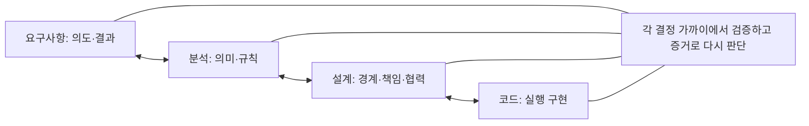
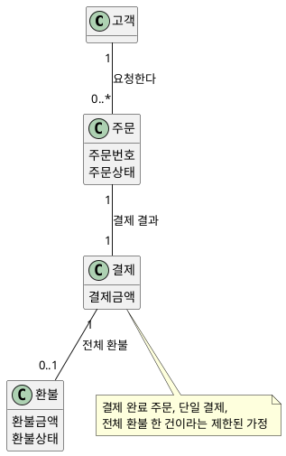
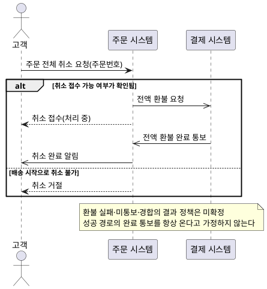
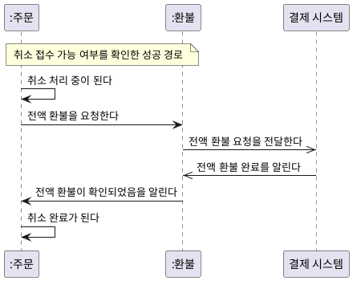
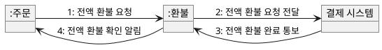
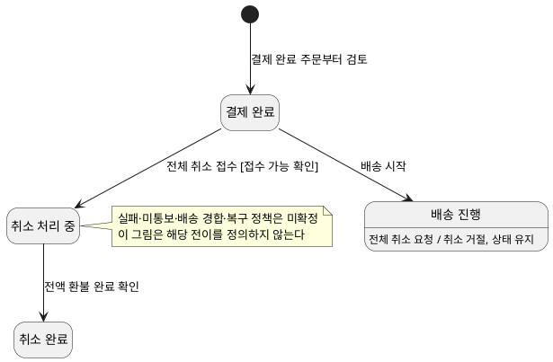

# 요구사항에서 코드까지: OOAD 학습과 엔지니어링 판단

> 논의 통합본 · 2026-09-27  
> 첨부된 두 문서와 함께 제공된 대화 내용을 중복 없이 통합한 학습·교재 작성의 공통 앵커다. 완결된 지침이 아니라 여러 과정에 적용하면서 반복 보완할 기준이다. 기존 과정 설계·교재·작성 지침을 변경하거나 대체하지 않는다.

## 이 문서의 위치

이번 논의의 중심 질문은 **“무엇을 모델링할까?”보다 “무엇을 언제 결정하고 어떻게 검증할까?”**다. UML 기법의 목록이나 OOAD 세션별 수정 목록보다, 요구사항에서 실행과 검증까지 이어지는 판단의 흐름을 먼저 정리한다.

통합 자료는 `ooad-engineering-learning-principles.md`, `ooad-discussion-integration-draft.md`, 그리고 이번 요청에 함께 제공된 대화다. 두 첨부와 대화에 반복된 원칙은 한 곳으로 모으고, 각각에 있던 전제·사례·실패 조건·도식·코드·교재 활용 방향은 남겼다. 제공되지 않은 과거 대화의 세부 내용은 추정하지 않았다.

기존 작성 지침과 OOAD 과정 설계는 참고 기준이다. 현재 문서의 권한과 역할을 존중하면서도, 이번 논의와 이후 검토에 따라 지침과 과정 설계 자체를 보완할 수 있다. 특정 과정의 세션 번호나 시간 배분이 이 공통 앵커의 원칙을 제한하지는 않는다.

## 목차

1. 문제 제기: 무엇을 어떤 순서와 수준으로 배울 것인가
2. 요구사항·분석·설계·코드의 결정 경계
3. 구현 감각에서 작은 전체 루프로
4. 분석 수준의 모델은 어떤 질문에 답하는가
5. 분석에서 설계와 코드로 넘어가기
6. ‘Just Enough’를 판단하는 방법
7. 검증과 테스트를 전체 흐름에 배치하기
8. 맥락에 따라 깊이를 조절하기
9. 아키텍처와 다른 전문 영역으로 확장하기
10. 인재 양성의 최종 목표와 교재 활용

## 1. 문제 제기: 무엇을 어떤 순서와 수준으로 배울 것인가

### 코드 없이 배우는 요구사항·분석의 공허함

코드를 전혀 이해하지 못한 채 요구사항과 분석 모델을 배우면 모델의 결정이 실행에서 무엇을 바꾸는지 알기 어렵다. 상태, 조건, 관계, 메시지를 그릴 수 있어도 그 의미가 실제 동작으로 이어지는지 판단하지 못할 수 있다. 따라서 작은 구현을 읽고 실행 결과를 예상할 수 있는 감각이 필요하다.

이는 모든 역할에 전문 개발자 수준의 코딩 숙련을 요구한다는 뜻이 아니다. 요구·분석을 맡는 사람도 자신의 결정이 구현과 검증에 어떤 영향을 주는지 읽고 설명할 수 있어야 한다는 뜻이다.

### 코드에만 집중할 때 놓치는 의도와 도메인

반대로 코딩만으로 문제를 해결하려 하면 사용자 의도와 도메인 규칙이 코드의 조건문 속에서 임의로 결정되기 쉽다. 실행되는 프로그램을 만들었다는 사실은 필요한 문제를 올바르게 해결했다는 증거와 다르다.

코드 숙련자에게도 반대 방향의 문해력이 필요하다. 이 동작이 어떤 사용자 의도를 충족하는지, 조건의 근거가 무엇인지, 어떤 규칙이 확정되었고 무엇이 아직 가정인지 설명할 수 있어야 한다.

### 전문 분야가 달라도 필요한 전체 흐름

역할마다 전문성의 깊이는 달라질 수 있다. 그러나 요구, 분석, 설계, 구현, 검증이 서로 무엇을 제공하고 어떤 문제를 되돌려 보내는지는 함께 이해해야 한다. 교육은 전체 흐름의 폭을 먼저 경험하게 하고, 반복하면서 필요한 부분의 깊이를 늘린다.

## 2. 요구사항·분석·설계·코드의 결정 경계

각 활동은 서로 다른 질문에 답한다. 이를 구분하는 이유는 담당자 사이에 문서를 넘기는 절차를 고정하기 위해서가 아니라, 지금 어떤 종류의 결정을 내리는지 알기 위해서다.

| 관점 | 중심 질문 | 결정의 내용 | 가까운 검증 |
|---|---|---|---|
| 요구사항 | 누가 어떤 결과를 왜 원하는가? | 사용자 의도, 범위, 외부 결과 | 구체적 예시와 수용·거절 기준 |
| 분석 | 그 결과가 업무에서 무엇을 의미하는가? | 개념, 관계, 규칙, 상태, 불변조건 | 시나리오와 모델의 교차검토 |
| 설계 | 그 의미를 어떤 책임과 협력으로 실현하는가? | 구조적 경계, 객체 책임, 협력, 계약 | 대안·실패 경로·변경 영향 검토 |
| 코드 | 결정한 동작을 어떻게 실행하는가? | 실행 로직과 기술적 구체화 | 정적 검사와 실행 테스트 |



### 단계별 인계와 결정 경계의 차이

요구·분석·설계·구현을 구분하는 것 자체가 문제는 아니다. 이전 활동을 완료 승인으로 닫고 산출물만 넘긴 뒤, 나중에 드러난 오류의 원인으로 돌아가지 못하게 하는 운영이 문제다.

“분석이 끝났다”는 말은 모든 문서를 채웠다는 뜻보다, 현재 범위에서 다음 작업자가 중요한 도메인 의미를 임의로 추측하지 않아도 되는 상태라는 뜻으로 이해한다. 새로운 증거가 생기면 그 판단을 다시 연다.

초안에는 Royce의 초기 논의를 떠올리는 언급도 있었다. 여기서는 그 역사적 해석을 근거로 삼지 않고, 일방향 인계의 위험과 피드백·초기 구현의 필요성이라는 논의의 취지만 보존한다. 역사적 설명이나 직접 인용을 교재에 넣을 때는 원전을 별도로 확인한다.

### 발견한 위치와 원인이 된 판단은 다를 수 있다

코딩 중 “부분 배송된 주문도 취소할 수 있는가?”가 드러났다면 개발자가 임의의 분기로 정책을 만들지 않는다. 요구 의도와 도메인 규칙으로 되돌아가 확인한 뒤 설계·코드·검증을 함께 고친다.

반대로 규칙은 명확하지만 코드가 잘못 옮겼다면 구현을 수정한다. 모든 실패를 요구 문제로 돌리거나 모든 실패를 코드 문제로 좁히지 않는다. **증상이 나타난 위치와 오류를 만든 결정의 수준을 구분한다.**

## 3. 구현 감각에서 작은 전체 루프로

### 먼저 확인할 최소한의 코드 이해

작은 업무 사례로 객체, 상태, 조건, 메서드, 메시지, 관계가 실행에서 무엇을 뜻하는지 확인한다. 학습자는 입력에 따른 결과를 예상하고, 조건 하나가 바뀌었을 때 영향받는 동작을 설명한다.

언어·프레임워크·ORM·데이터베이스 강의를 별도의 긴 선행 과정으로 추가하는 것이 목적은 아니다. 부족한 이해는 해당 사례에 필요한 만큼 보완한다. 기존 코드 경험이 있는 수강생에게는 그 경험을 확인하는 진입 활동이 될 수 있다.

### 하나의 문제를 요구부터 코드·검증까지 관통한다

첫 루프는 작은 범위를 끝까지 경험하는 데 목적이 있다. 전체 취소의 모든 정책을 해결하려 하지 않고, 선택한 성공·거절 사례에 대해 다음 흐름을 연결한다.

1. 고객이 원하는 결과와 그 이유를 읽는다.
2. 결과를 허용하거나 거절하는 업무 규칙을 명시한다.
3. 규칙을 지킬 책임과 필요한 협력을 최소한으로 생각한다.
4. 작은 코드에서 그 규칙과 상태 변화를 확인한다.
5. 허용·거절 예시로 결과를 검증한다.
6. 설명하지 못하는 결과가 나오면 원인이 된 결정으로 돌아간다.

단순히 완성된 도식과 코드를 보여 주는 것으로 끝내지 않는다. 학습자가 결과를 예측하고, 실제 결과와 비교하며, 잘못된 판단을 한 번 되돌려 보는 활동이 필요하다.

### 반복마다 새로운 어려움을 추가한다

첫 루프는 폭을 확보한다. 이후에는 관계와 수량, 예외와 상태, 객체 협력과 계약, 기술 제약, 변경과 대안 평가를 하나씩 더한다. 요구·분석·설계를 한 번씩 끝낸 뒤 돌아보지 않는 학습보다, 같은 문제에서 이전 판단을 다시 열며 깊어지는 학습을 지향한다.

이 원칙이 기존 세션을 모두 해체하거나 매번 전체 구현을 새로 만들라는 뜻은 아니다. 개요의 작은 전체 루프와 후속 세션의 본격적인 판단을 구분할 수 있다. 각 반복에서는 새롭게 답하는 질문이 분명해야 한다.

### 관통 사례의 사실·가정·미확정 질문

이 문서의 사례는 **결제 완료·배송 시작 전 주문의 전체 취소**다. 실제 서비스의 확정 정책이 아니라 학습을 위한 제한된 사례다.

| 구분 | 내용 |
|---|---|
| 제시된 사례 범위 | 결제가 완료된 주문의 전체 취소를 검토한다 |
| 교육용 가정 | 전체 취소 시 전액 환불한다. 취소 완료는 환불 확인 후 알린다 |
| 도식·코드의 추가 가정 | 환불 요청과 완료 확인 사이에 시간이 흐를 수 있어 취소 처리 중 상태를 둔다 |
| 제외 범위 | 부분 품목 취소, 부분 배송 취소, 수수료·프로모션·세금의 상세 정책 |
| 확인할 질문 | 배송 시작의 정확한 사건 경계, 출고와의 관계, 환불 실패·재시도·중복 통보·배송 경합 정책 |

‘배송 시작 전’과 ‘출고 전’을 동의어로 취급하지 않는다. 아래 예시는 취소 접수가 가능하다고 확인된 경로를 설명하며, 실제 시스템에서 그 확인을 어떻게 신뢰성 있게 확보할지는 별도의 문제다.

## 4. 분석 수준의 모델은 어떤 질문에 답하는가

모델은 질문에 답하기 위한 표현이다. 네 도식을 모두 작성하는 것이 목표가 아니다. 같은 사례에서 각 표현이 무엇을 추가로 밝혀 주는지, 언제 생략할 수 있는지를 판단한다.

아래 PlantUML은 편집 가능한 도식 원본이다. 분석 표현을 위한 예시이며 실행 코드나 최종 설계 청사진이 아니다. 이 통합본에서는 도식 렌더링을 검증하지 않았다.

### 4.1 개념과 관계: 클래스 도식

취소 규칙을 논의하려면 어떤 개념과 관계가 필요한가? 여기의 주문·결제·환불은 문제영역의 개념이다. 프로그램 클래스나 데이터베이스 테이블을 확정하지 않는다.



다중성은 보편적 사실이 아니다. 복수 결제나 부분 환불을 다룬다면 다시 검토해야 한다. 배송 관련 개념은 이 도식의 취소·환불 질문에 필요한 부분만 남기기 위해 생략했으며, 실제 배송 경계를 검토할 때 추가한다. 정적 도식에 모든 개념이 없다는 이유만으로 누락이라 판정하지 않고 모델의 질문과 범위를 먼저 본다.

### 4.2 외부 사건과 결과: 시스템 시퀀스 도식

고객의 요청에 시스템 경계가 어떤 결과를 약속하는가? 시스템 시퀀스 도식은 주문 시스템 내부의 서비스·저장소·객체 호출을 표현하지 않는다.



외부 결제 시스템을 포함해도 주문 시스템의 내부를 설계한 것은 아니다. 이 예시에서 접수와 완료 알림을 분리한 것은 교육용 구체화다. 환불 미확인을 ‘결과 미정’이라는 실제 제품 응답으로 내보내는 식으로 미결정 정책을 감추지 않는다.

### 4.3 도메인 참여자의 상호작용: 분석 시퀀스 도식

같은 취소 사건을 도메인 의미 수준으로 펼치면 주문과 환불의 상태가 어떻게 연결되는지 검토할 수 있다. 아래 메시지는 업무 의미를 나타내며 최종 메서드·호출 주체·구현 순서를 확정하지 않는다.



이 표현으로 “환불을 요청했다”와 “환불이 완료됐다”의 차이를 찾는다. 최종 구현에서 주문 객체가 직접 외부 연동을 호출해야 한다는 의미는 아니다. 그러한 책임 배치는 설계에서 결정한다.

### 4.4 참여자와 메시지: 커뮤니케이션 도식

시간의 흐름보다 참여자의 연결과 메시지 전달 관계가 질문일 때 사용한다. 아래는 앞선 분석 시퀀스의 참여자 간 메시지를 번호와 방향으로 다시 표현한 개략도다. 자기 상태 변경은 상태 머신에서 확인한다.



PlantUML의 객체와 방향 있는 연결로 메시지 읽기 방식을 나타낸 개략 표현이다. 정밀한 UML 표기 강의에 그대로 사용하기 전 표기·렌더링을 확인한다. 여기의 번호는 예시의 메시지 순서를 뜻하며 중첩 호출 구조를 주장하지 않는다. 연결도 정적 연관이나 최종 객체 구조를 확정하지 않는다.

시퀀스와 커뮤니케이션이 같은 정보를 반복한다면 둘 다 유지할 필요가 없다. 고객과 시스템만 있는 단순한 상호작용에서는 연결 구조를 다시 그리는 추가 가치가 특히 작다. 비교 학습을 위해 두 표현을 제시하는 것과 실무에서 두 산출물을 의무화하는 것은 다르다.

### 4.5 상태와 허용 조건: 상태 머신

언제 상태가 바뀔 수 있는가? 환불 요청과 완료 확인을 다른 사건으로 취급하면 중간 상태가 드러난다.



초안의 ‘결제 완료 상태에서 배송 시작 후 취소 거절’ 표현은 배송 진행 상태와의 관계를 혼동시킬 수 있어, 이 통합본에서는 배송 진행 상태의 거절로 명확히 했다. 환불 확인을 취소 요청 순간의 조건으로 묶기보다 별도의 완료 사건으로 구분했다. 이는 모든 서비스에 적용할 확정 정책이 아니라 사례를 일관되게 읽기 위한 교육용 보완이다.

### 4.6 도식 간 교차검토와 생략

| 표현 | 추가로 답하는 질문 | 잘못 사용하는 경우 |
|---|---|---|
| 클래스 | 개념·관계·수량이 규칙을 표현하는가? | 설계 클래스나 DB 스키마로 조기 고정 |
| 시스템 시퀀스 | 외부 사건과 결과가 합의되었는가? | 내부 호출을 외부 계약에 혼합 |
| 분석 시퀀스 | 업무 의미와 상태 변화가 연결되는가? | 메시지를 최종 메서드 배치로 확정 |
| 커뮤니케이션 | 참여자의 연결 구조가 검토에 도움을 주는가? | 추가 질문 없이 시퀀스를 복제 |
| 상태 머신 | 상태마다 허용·금지되는 행위가 일관되는가? | 근거 없는 상태를 나열하거나 실패 정책이 해결됐다고 간주 |

‘환불 확인’, ‘취소 처리 중’, ‘취소 완료’의 의미가 도식마다 같은지 확인한다. 불일치를 발견하면 도식 하나만 고치는 데 그치지 않고 원래의 요구·규칙·계약도 다시 확인한다.

## 5. 분석에서 설계와 코드로 넘어가기

### 개념 모델을 코드로 기계 변환하지 않는다

분석은 업무 의미를 밝힌다. 설계는 그 의미를 지킬 책임과 협력을 정한다. 분석 개념 하나가 여러 설계 요소로 나뉠 수도 있고, 여러 개념이 하나의 구현에 함께 표현될 수도 있다. 분석 도식의 상자 수와 코드의 클래스 수를 일치시키는 것이 목표가 아니다.

| 분석에서 확인할 의미 | 설계에서 추가할 판단 | 구현에서 확인할 증거 |
|---|---|---|
| 배송 시작 후 전체 취소 불가 | 취소 판단의 책임과 배송 정보 확인 경계 | 허용·거절 결과와 경합 처리 |
| 환불 확인 후 취소 완료 | 환불 협력, 상태 변경, 실패 조정의 책임 | 완료 통보 전후의 상태와 응답 |
| 고객에게 처리 결과를 알림 | 외부 결과와 내부 계약의 연결 | 접수·완료·실패가 구별되는지 |

### 정적 의미를 코드에서 읽는 최소 예시

아래 코드는 도식의 자동 변환이나 설계 모범답안이 아니다. 단일 결제·전체 환불이라는 제한된 가정이 코드에서 어떤 제약으로 표현되는지 읽기 위한 예시다. 금액은 정수 단위로 단순화했다.

```java
record Payment(long amount) {
    Payment {
        if (amount <= 0) throw new IllegalArgumentException("양수 금액 필요");
    }
}

record WholeRefund(Payment payment, long amount) {
    WholeRefund {
        if (payment == null) throw new IllegalArgumentException("원 결제 필요");
        if (amount != payment.amount()) {
            throw new IllegalArgumentException("이 예시는 전액 환불만 허용");
        }
    }
}
```

학습자는 “원 결제와 환불금액의 관계가 무엇인가?”, “부분 환불을 도입하면 어떤 가정부터 다시 확인해야 하는가?”를 설명한다. 이 코드는 결제당 환불 한 건이라는 다중성 전체를 보장하지 않는다. 여러 `WholeRefund` 생성을 제한하는 책임은 별도로 결정해야 한다. 코드 한 조각이 보장하는 것과 모델 전체의 제약을 구분하는 것도 학습 내용이다.

### 동적 의미를 코드에서 읽는 최소 예시

아래는 외부 배송 중단 등이 확인된 뒤 취소를 접수하고, 환불 완료 확인 이후 상태를 바꾸는 제한된 상태 전이 예시다. 실제 확인 절차, 비동기 통신, 영속성, 동시성은 구현하지 않는다.

```java
final class CancellationExample {
    enum Status { PAID, CANCEL_PENDING, CANCELLED, SHIPPING }

    static Status acceptCancellation(Status current,
                                     boolean acceptanceConfirmed) {
        if (current != Status.PAID || !acceptanceConfirmed) {
            return current;
        }
        return Status.CANCEL_PENDING;
    }

    static Status confirmFullRefund(Status current) {
        if (current != Status.CANCEL_PENDING) {
            throw new IllegalStateException("환불 확인을 적용할 상태가 아님");
        }
        return Status.CANCELLED;
    }

    public static void main(String[] args) {
        Status accepted = acceptCancellation(Status.PAID, true);
        check(accepted == Status.CANCEL_PENDING);
        check(confirmFullRefund(accepted) == Status.CANCELLED);
        check(acceptCancellation(Status.SHIPPING, true) == Status.SHIPPING);
        check(acceptCancellation(Status.PAID, false) == Status.PAID);
        System.out.println("네 가지 상태 전이 예시 확인");
    }

    static void check(boolean condition) {
        if (!condition) throw new AssertionError("예상 상태와 다름");
    }
}
```

`acceptanceConfirmed`는 미확정 업무 정책을 대신하는 마법의 값이 아니다. 이 예제 밖에서 확인됐다고 놓은 전제를 드러내는 입력이다. 실제 구현에서는 누가 무엇을 어떻게 확인하는지 결정해야 한다. `confirmFullRefund` 역시 신뢰할 수 있는 전액 환불 완료 확인을 받았다는 전제다.

이 예시가 확인하는 것은 접수와 완료의 구별, 배송 진행 중 상태 유지, 미확인 접수의 상태 유지다. 환불 실패·중복 통보·배송 경합·복구·고객 통지는 검증하지 않는다. 실행 테스트가 통과해도 그 정책이 정해진 것은 아니다.

### 코드에서 다시 모델로 돌아오기

코드를 읽고 “이미 취소된 주문에 다시 요청하면 거절인가, 같은 결과 반환인가?”, “환불 완료 통보가 두 번 오면 어떻게 하는가?”를 질문할 수 있어야 한다. 예제의 단순한 반환이나 예외 처리를 실제 서비스 정책으로 채택하지 않는다. 문제를 발견하면 관련 의도·규칙·계약으로 돌아간다.

## 6. ‘Just Enough’를 판단하는 방법

**다음 결정 경계에서 자기 책임 밖의 중요한 결정을 추측하지 않아도 될 만큼 명시하고 검증한다.** 문서의 최소량을 정하거나 모든 세부사항을 먼저 확정하는 원칙이 아니다.

| 결정 경계 | 지금 명시할 것 | 열어 둘 수 있는 것 |
|---|---|---|
| 요구 → 분석 | 의도, 범위, 중요한 수용·거절 예시 | 내부 객체와 메서드 |
| 분석 → 설계 | 용어, 규칙, 상태, 중요한 불변조건 | 저장 기술과 구체적 책임 배치 |
| 설계 → 코드 | 책임, 협력, 계약, 주요 제약 | 계약을 지키는 국소 구현 방식 |
| 코드 → 실행·운영 검증 | 구현의 보장 범위, 통합 전제, 남은 위험 | 실사용 증거로 다시 평가할 가치 가설 |

뒤로 넘기면 잘못된 가정이 전파되거나 변경 비용이 커지는 결정은 일찍 확인한다. 반대로 추가 정보가 생길 때까지 열어 두는 이득이 크고 되돌리기 쉬우면 늦출 수 있다.

핵심 규칙을 빈칸으로 남기는 것은 설계 자유도가 아니라 숨은 위험이다. 반대로 분석 단계에서 지역 변수 이름까지 정하는 것은 필요한 의미 확인을 넘는다. 추가 모델이 판단을 바꾸지 않으면 상세화를 멈추고 구현·실험 등 더 유용한 검증으로 이동한다.

실패는 양쪽에서 생긴다. 과소 분석은 추측을 전파하고, 과잉 모델링은 작성·유지 비용을 키운다. 늦은 결정은 비용 큰 오류를 퍼뜨리고, 너무 이른 결정은 학습할 기회를 막는다.

## 7. 검증과 테스트를 전체 흐름에 배치하기

테스트는 앞선 활동을 생략해도 된다는 허가가 아니다. 각 관점에서 생길 수 있는 오류를 가까운 곳에서 줄이고, 그래도 남는 오해·결함·통합 문제를 이후 검증으로 찾는다.

| 관점 | 검증할 내용 | 사례 |
|---|---|---|
| 요구 | 의도와 수용·거절 기준 | 고객이 접수와 완료를 구별할 수 있는가? |
| 분석 | 규칙·상태·불변조건의 일관성 | 환불 미확인 상태를 취소 완료로 표시하지 않는가? |
| 설계 | 책임·협력·계약과 실패 경로 | 완료 통보와 상태 변경의 책임이 명확한가? |
| 코드 | 결정한 의미의 실행과 통합 | 통보 전후 상태가 기대와 같은가? |
| 운영 | 실제 결과와 가치 가정 | 안내가 고객의 불확실성을 줄였는가? |

여기서 shift-left testing은 테스트 코드를 무조건 먼저 작성하라는 뜻으로 좁히지 않는다. 오류를 만들거나 키우는 지점에서 가능한 검증을 앞당기는 원칙이다. 취소 조건이 모호하면 자동화에 앞서 허용·거절 사례를 합의한다. 자동화는 합의된 규칙의 회귀를 막는 데 활용한다.

“환불 확인 전에 취소 완료로 응답했다”는 증거를 얻었다면 외부 결과 계약과 상태 규칙을 먼저 대조한다. 규칙이 잘못됐는지, 책임 배치가 놓쳤는지, 코드가 잘못 구현했는지를 구별한다. 발견한 테스트에 조건문만 덧붙여 상위 모순을 숨기지 않는다.

실습에서는 사실·가정·질문을 구분하고, 서로 다른 모델을 대조하며, 실패의 원인 수준을 설명하게 한다. 미확정 정책은 질문으로 남긴 뒤 결정된 범위만 구현·검증한다.

## 8. 맥락에 따라 깊이를 조절하기

모든 프로젝트에 동일한 문서량·모델·검토 절차를 적용하지 않는다. 추가 명시와 검증이 줄이는 위험을 작성·합의·유지 비용과 비교한다.

| 맥락 | 더 명시하거나 검증할 이유 | 가볍게 진행할 조건 |
|---|---|---|
| 도메인 | 예외가 많고 용어 해석이 다름 | 단순한 규칙과 공유된 이해 |
| 기술 | 구현 가능성·성능·동시성이 불확실함 | 익숙하고 되돌리기 쉬운 선택 |
| 팀 | 여러 팀, 분산 협업, 지식 차이, 높은 소통 비용 | 작은 팀의 빠른 공동 확인 |
| 영향 | 실패 영향과 나중의 변경 비용이 큼 | 영향이 작고 복구·변경이 쉬움 |

규칙은 분명하지만 새 저장 기술의 동시성이 불확실하면 작은 프로토타입으로 기술 위험을 먼저 확인한다. 기술은 익숙하지만 부분 배송 취소의 의미가 불분명하면 도메인 전문가와 규칙을 먼저 확인한다. 둘 다 불확실하면 작은 구현과 규칙 검토를 짧게 왕복한다.

숙련된 소규모 팀의 낮은 위험 변경은 대화·스케치·코드·테스트로 충분할 수 있다. 복잡한 규칙을 여러 팀이 나누어 구현한다면 용어·상태·경계·계약과 결정 이유를 더 명시해야 한다. 어느 경우에도 모델의 개수가 품질의 척도는 아니다.

이 학습 방식은 전체 연결과 판단력을 얻는 대신, 짧은 시간에 표기·패턴·도구를 폭넓게 나열하는 진도는 줄어들 수 있다. 교재의 사례와 실습 중복을 다시 검토하는 비용도 든다. 이 교환을 숨기지 않고 학습 목표에 비추어 선택한다.

## 9. 아키텍처와 다른 전문 영역으로 확장하기

OOAD에도 구조적 경계와 의존성 판단이 필요하다. 객체의 책임은 아무 구조 제약 없이 배치되지 않는다. 동시에 시스템 규모·품질속성·배포·분산·조직 경계의 복합적인 판단을 OOAD 하나로 모두 완결하지 않는다.

현재 OOAD의 구조적 경계 학습과 전문 아키텍처 확장은 교육상의 깊이 구분으로 참고할 수 있다. 아키텍처가 개발 마지막에 수행된다는 뜻은 아니다. 실제 과제에서는 위험과 제약에 따라 필요한 판단과 검증을 앞당긴다.

| 전문 영역 | 공통 앵커에서 이어지는 질문 |
|---|---|
| SW Architecture | 품질속성과 제약 아래 구조·배포·변경 비용을 어떻게 절충하는가? |
| DDD | 도메인 의미와 언어를 지속적으로 정제하고 문맥 경계를 어떻게 유지하는가? |
| MSA | 분산 경계·통신·실패·일관성이 업무 의미와 운영에 어떤 영향을 주는가? |
| DevOps | 구현·통합·배포·운영의 증거를 어떤 결정으로 얼마나 빨리 되돌리는가? |
| AI-native SW공학 | 사람과 에이전트가 어떤 결정을 맡고 어떤 맥락·제약·증거로 검증하는가? |

이는 고정된 선수과목 순서나 필수 기술 목록이 아니다. 과정마다 목표와 깊이는 달라도, 의도·의미·책임·실행·검증을 연결하고 맥락에 맞게 활동을 선택한다는 기준을 공유한다.

## 10. 인재 양성의 최종 목표와 교재 활용

### 정해진 절차를 넘어 활동을 설계하는 능력

최종 목표는 산출물 목록을 채우는 사람이 아니라, 현재 문제와 팀의 맥락에서 무엇을 언제 어느 수준까지 결정하고 검증할지 판단하는 엔지니어를 기르는 것이다.

학습자는 선택한 결정, 포기한 대안, 남은 불확실성, 검증 증거를 설명할 수 있어야 한다. 추가 모델을 만들 이유뿐 아니라 만들지 않을 이유도 설명해야 한다. 작은 전체 루프와 반복 심화는 이러한 판단을 연습하는 방식이다.

실패의 징후는 코드 없이 모델만 암기하는 것, 코드와 도구에 몰두해 의도와 규칙을 놓치는 것, 검증을 마지막으로 떠넘기는 것, ‘Just Enough’를 무기록·무검증으로 해석하는 것, 이전 판단을 다시 열지 못하는 것이다.

### 교재 전체를 관통하는 세 가지 질문

이 문서의 열 개 장을 기존 교재의 열 개 세션으로 곧바로 바꾸지 않는다. 먼저 각 세션에 다음 질문을 대응시킨다.

| 반영 요소 | 확인할 질문 |
|---|---|
| 핵심 질문 | 이 세션에서 학습자가 새로 내려야 할 결정은 무엇인가? |
| 관통 사례 | 그 결정이 요구·분석·설계·코드·검증 중 어디와 연결되는가? |
| 종료 기준 | 다음 결정으로 넘어가기 전에 어떤 추측과 위험을 제거해야 하는가? |

4장의 도식은 독립적인 UML 기법 강의로 분리하기보다, 2~7장의 판단을 같은 사례에서 확인하는 관통 활동으로 활용한다. 시퀀스와 커뮤니케이션을 모두 그리는 것이 목표가 아니라, 각각 추가로 답할 질문이 있는지 판단하게 한다.

### OOAD에 대한 현재의 반영 방향

사용자의 현재 판단은 **S01을 중심으로 학습·엔지니어링 판단의 관점을 많이 보완하고, S03·S04에는 코드 부분을 추가하는 것**이다. 이는 향후 작업의 방향이며, 이번 통합 문서에서 기존 과정이나 세션을 수정한 것은 아니다.

- **S01:** 전체 판단 지도, 구현 감각, 작은 전체 루프, 적정 상세화, 검증과 되돌림을 연결하는 중심 위치로 검토한다.
- **S03:** 정적 개념·관계·제약이 코드에 어떻게 표현되고 무엇까지 보장하는지 읽는 예시를 보완한다. 분석 모델을 코드 구조로 기계 변환하지 않는다.
- **S04:** 메시지·사건·상태·조건이 코드의 동작과 어떻게 연결되는지 읽고 검증하는 예시를 보완한다. 분석 상호작용을 최종 구현 책임으로 고정하지 않는다.

첫 작은 전체 루프를 어디에서 학습자가 끝까지 경험할지 결정하는 것이 실제 반영의 첫 판단이다. 현재 방향에서는 S01을 우선 검토하되, 운영 위치·분량·시간과 후속 반복의 깊이는 교재 보완 시 구체화한다. 코드 부분을 추가한다는 이유로 별도 코딩 세션이나 모든 역할에 동일한 코딩 숙련을 요구하지 않는다.

### 반복 보완하는 공통 앵커

이 문서는 이후 다른 과정에도 적용한다. 과정마다 어떤 작은 전체 루프가 적절한지, 무엇을 깊게 배우고 무엇을 연결 수준으로 남길지, 어떤 실패 증거로 앞선 결정을 다시 열지를 검토한다.

적용 결과 필요한 원칙은 지침에, 과정 고유의 범위와 전제는 과정 설계에, 실제 설명·사례·코드·실습은 세션 원고에 반영한다. 지침도 수정 가능하며, 교재와 실행 증거를 통해 계속 보완한다.

**공통 앵커:** 작은 구현과 업무 사례로 전체 흐름을 경험하고, 결정 경계마다 필요한 만큼 명시·검증하며, 발견한 문제를 원인이 된 결정으로 되돌린다. 반복하면서 깊이를 늘리고, 맥락에 맞게 활동을 선택하는 판단력을 기른다.
