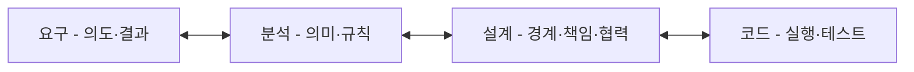
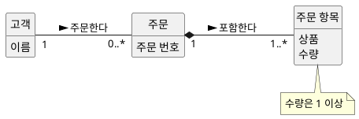
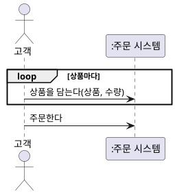
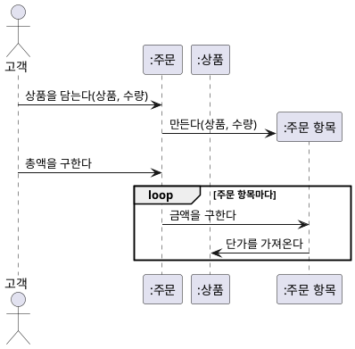
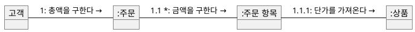
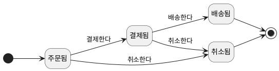

--------------------
Session 명: 00. SW 공학 접근법
--------------------

## 목차

01. SW 공학의 목적
02. 결정 경계
03. 되돌림
04. 성숙도
05. 불확실성과 접근법
06. 프로세스의 공통 본질
07. 이벤트 관점
08. 작게 끝까지
09. 사례 — 주문
10. 클래스 다이어그램
11. 시스템 시퀀스 다이어그램
12. 분석 시퀀스 다이어그램
13. 커뮤니케이션 다이어그램
14. 상태 머신 다이어그램
15. 다이어그램 선택
16. 변환이 아닌 설계
17. 요구에서 테스트로
18. 주문 테스트
19. 코드에서 모델로
20. 북 스마트와 스트리트 스마트
21. KISS
22. DRY
23. YAGNI
24. 원칙이 부딪힐 때
25. 적정 수준
26. 검증의 배치
27. 전문 영역
28. 요약

## 01. SW 공학의 목적

SW 공학은 산출물과 절차가 아니라 **무엇을 언제 결정하고 어떻게 검증하는가**를 다룬다. 요구에서 코드·테스트까지 결정과 검증이 끊기지 않게 잇는 것이 핵심이다.

- **결정** — 요구·분석·설계·코드는 서로 다른 결정을 내린다.
- **검증** — 각 결정 가까이에서, 가장 싼 방법으로 확인한다.
- **되돌림** — 증거가 나오면 원인이 된 결정으로 돌아간다.

---

## 02. 결정 경계

요구·분석·설계·코드는 **서로 다른 질문에 답한다**. 지금 어떤 결정을 내리는지 알아야 가까운 곳에서 검증할 수 있다.

| 관점 | 질문 | 결정 | 가까운 검증 |
|---|---|---|---|
| 요구 | 누가 어떤 결과를 왜 원하는가? | 의도, 범위, 외부 결과 | 수용·거절 예시 |
| 분석 | 그 결과가 업무에서 무엇을 뜻하는가? | 개념, 관계, 규칙, 상태 | 시나리오와 모델의 교차검토 |
| 설계 | 누가 어떤 협력으로 실현하는가? | 경계, 책임, 협력, 계약 | 대안·실패 경로·변경 영향 |
| 코드 | 어떻게 실행하는가? | 실행 로직, 기술 구체화 | 정적 검사, 실행 테스트 |

---

## 03. 되돌림

문제는 단계를 나누는 것이 아니라 **앞 결정을 닫아 두고 되돌아가지 못하는 것**이다. 증거가 나오면 원인이 된 결정으로 돌아간다.

**도식 — Mermaid**



- **분석이 끝났다** — 다음 작업자가 중요한 의미를 **추측하지 않아도 되는** 상태다. 새 증거가 나오면 다시 연다.
- **발견 위치 ≠ 원인** — 코딩 중 "배송된 주문도 취소하나?"가 나오면 분기를 만들지 말고 요구로 돌아간다. 규칙이 맞는데 코드가 틀렸다면 코드를 고친다.

---

## 04. 성숙도

접근법은 **누가 무엇을 얼마나 아는가**에 따라 달라진다. 고객·개발자의 도메인 지식, 기술 숙련, 팀워크의 성숙도가 무엇을 더 명시하고 검증할지를 정한다.

| 관점 | 낮을 때 | 이렇게 보완한다 |
|---|---|---|
| 고객의 도메인·요구 표현 | 원하는 것을 말하지 못하고 해결책(화면·버튼)으로 말한다 | 관찰, 구체적 예시, 프로토타입으로 요구를 끌어낸다 |
| 개발자의 도메인 이해 | 규칙을 조건문 속에서 추측한다 | 이벤트·용어를 합의하고 데이터·도메인 모델로 명시한다 |
| 개발자의 기술 숙련 | 구현 가능성·품질을 장담하지 못한다 | 스파이크, 작은 구현, 페어로 기술 위험을 먼저 줄인다 |
| 팀워크 | 결정이 전달되지 않고 암묵지가 흩어진다 | 경계·계약·결정 근거를 명시하고 짧은 주기로 신뢰를 쌓는다 |

- 성숙도가 높으면 대화·스케치·코드·테스트로 가볍게 간다. 모델의 개수가 품질의 척도는 아니다.

---

## 05. 불확실성과 접근법

업무와 기술의 **불확실성**이 반복의 주기와 검증 대상을 정한다. 프로세스는 이름이 아니라 불확실성을 줄이는 방식으로 고른다.

| 상황 | 알맞은 접근 | 먼저 검증할 것 |
|---|---|---|
| 고객·개발자가 도메인을 알고 업무·기술이 안정적 | 계획 기반(폭포수) + 단계별 검증 | 요구·계약의 완결성 |
| 업무는 명확하고 기술이 불확실 | 반복·점진(I&I), 스파이크 | 위험한 기술부터 작은 증분으로 |
| 요구가 자주 바뀌고 고객이 함께할 수 있음 | 애자일 | 짧은 주기로 동작하는 SW |
| 문제와 사용자가 불분명 | 디자인 씽킹 | 사용자의 문제와 요구 |
| 가치·시장이 불확실 | Lean Startup | 최소 제품(MVP)으로 가치 가설 |
| 사용 경험이 불확실 | Lean UX | 경험 가설과 실험 결과 |

---

## 06. 프로세스의 공통 본질

모든 프로세스는 **결정–검증–되돌림**을 서로 다른 주기와 단위로 운영한다. 이름을 따르는 것보다 이 흐름이 살아 있는지가 중요하다.

| 접근 | 반복 단위 | 검증하는 것 | 잘못 쓰면 |
|---|---|---|---|
| 폭포수 | 단계 | 명세·계약의 완결성 | 앞 단계를 닫아 되돌리지 못한다 |
| I&I | 증분 | 위험의 감소 | 위험과 무관한 순서로 증분한다 |
| 애자일 | 스프린트 | 동작하는 SW와 고객 반응 | 분석·설계 생략의 핑계가 된다 |
| 디자인 씽킹 | 공감–정의–시제품 | 문제의 정의 | 워크숍으로 끝나고 요구로 이어지지 않는다 |
| Lean Startup | 만들기–측정–학습 | 가치 가설 | MVP를 품질 낮은 제품으로 오해한다 |
| Lean UX | 가설–실험 | 경험의 결과 | 실험 없이 산출물만 줄인다 |

---

## 07. 이벤트 관점

고객 관점의 요구는 **이벤트 관점으로 수렴**한다. 이벤트 반응 목록, 유스케이스, 유저 스토리, 도메인 이벤트는 모두 "무엇이 일어나면 어떤 결과가 필요한가"를 본다. 복잡한 요구도 사건과 결과는 고객과 개발자가 혼선 없이 합의할 수 있다.

| 기법 | 이벤트를 보는 방식 | 주문에서 |
|---|---|---|
| 이벤트 반응 목록 | 외부 자극과 시스템의 반응 | 고객이 주문을 취소한다 → 배송 전이면 취소한다 |
| 유스케이스 | 액터의 목표를 이루는 이벤트 흐름 | 주문을 관리한다 — 담고, 주문하고, 결제한다 |
| 유저 스토리 | 사용자가 원하는 결과와 이유 | 고객으로서 배송 전 주문을 취소하고 싶다 |
| 도메인 이벤트 | 업무에서 일어난 사실 | 주문이 결제되었다, 주문이 취소되었다 |

- **많은 문제의 본질은 관점의 혼합이다.** "취소 버튼을 누르면 주문 테이블 상태를 C로 바꾼다"는 화면·데이터·해결책이 한 문장에 섞여 합의할 단위가 없다.
- 먼저 **이벤트 하나로 본다** — "고객이 배송 전 주문을 취소한다 → 주문이 취소되었다". 화면·데이터·기술은 그 뒤에 각자의 결정으로 다룬다.

---

## 08. 작게 끝까지

작은 범위를 **요구부터 코드·테스트까지 끝까지** 관통하고, 반복하며 깊이를 더한다.

1. 원하는 결과와 이유를 읽는다.
2. 허용·거절 규칙을 명시한다.
3. 규칙을 지킬 책임을 정한다.
4. 작은 코드로 규칙과 상태 변화를 구현한다.
5. 허용·거절 예시로 테스트한다.
6. 설명할 수 없는 결과는 원인이 된 결정으로 되돌린다.

- 다음 반복에서 관계·수량, 예외·상태, 협력·계약, 기술 제약, 변경을 하나씩 더한다.

---

## 09. 사례 — 주문

모든 예시는 **주문**이다. 확정 정책이 아니라 흐름을 보이기 위한 제한된 사례다.

| 구분 | 내용 |
|---|---|
| 범위 | 상품을 담아 주문하고, 결제·배송하며, 배송 전에는 취소할 수 있다 |
| 가정 | 주문 항목은 1개 이상, 수량은 1 이상 |
| 제외 | 부분 취소, 쿠폰, 세금, 결제 실패 |
| 확인할 질문 | 취소된 주문을 다시 취소하면? 결제가 두 번 오면? |

---

## 10. 클래스 다이어그램

클래스 다이어그램의 **개념·관계·다중성**은 코드의 타입·참조·검사로 이어진다. 여기서는 주문과 주문 항목의 `1..*`와 수량 규칙만 코드로 본다.

**도식 — PlantUML**



```java
record 주문항목(String 상품, int 수량) {
    주문항목 {
        if (수량 < 1) throw new IllegalArgumentException("수량은 1 이상");
    }
}

record 주문(String 고객, java.util.List<주문항목> 항목들) {
    주문 {
        항목들 = java.util.List.copyOf(항목들);
        if (항목들.isEmpty()) throw new IllegalArgumentException("주문 항목은 1개 이상");
    }
}
```

---

## 11. 시스템 시퀀스 다이어그램

시스템 시퀀스 다이어그램의 **시스템 이벤트**는 시스템 경계의 오퍼레이션이 된다. 시스템 안은 블랙박스이며, 이벤트를 받는 쪽인 주문 시스템만 코드로 본다.

**도식 — PlantUML**



```java
interface 주문시스템 {
    void 상품을담는다(String 상품, int 수량);
    void 주문한다();
}
```

---

## 12. 분석 시퀀스 다이어그램

분석 시퀀스 다이어그램의 **메시지는 받는 객체의 메서드**가 된다. 생성은 `new`로, 반복은 `for` 문으로 옮긴다. 주문 총액을 구하는 상호작용을 코드로 본다.

**도식 — PlantUML**



```java
record 상품(String 이름, int 단가) {}

record 주문항목(상품 상품, int 수량) {
    int 금액() { return 상품.단가() * 수량; }
}

final class 주문 {
    private final java.util.List<주문항목> 항목들 = new java.util.ArrayList<>();

    void 상품을담는다(상품 상품, int 수량) {
        항목들.add(new 주문항목(상품, 수량));
    }

    int 총액을구한다() {
        int 합계 = 0;
        for (주문항목 항목 : 항목들) 합계 += 항목.금액();
        return 합계;
    }
}
```

---

## 13. 커뮤니케이션 다이어그램

커뮤니케이션 다이어그램의 **링크는 참조**(필드)가 되고, 번호는 호출의 중첩이 된다. 같은 총액 계산을 링크와 번호로 본다.

**도식 — PlantUML**



```java
record 상품(String 이름, int 단가) {}

record 주문항목(상품 상품, int 수량) {
    int 금액() { return 상품.단가() * 수량; }
}

final class 주문 {
    private final java.util.List<주문항목> 항목들;
    주문(java.util.List<주문항목> 항목들) { this.항목들 = 항목들; }

    int 총액을구한다() {
        return 항목들.stream().mapToInt(주문항목::금액).sum();
    }
}
```

---

## 14. 상태 머신 다이어그램

상태 머신 다이어그램의 **상태·사건·전이**는 코드의 값·메서드·허용 검사가 된다. 표에 없는 전이는 일어날 수 없다. 주문의 생애 전체를 코드로 본다.

**도식 — PlantUML**



```java
enum 주문상태 { 주문됨, 결제됨, 배송됨, 취소됨 }

final class 주문 {
    private 주문상태 상태 = 주문상태.주문됨;

    void 결제한다() { 전이(주문상태.결제됨, 주문상태.주문됨); }
    void 배송한다() { 전이(주문상태.배송됨, 주문상태.결제됨); }
    void 취소한다() { 전이(주문상태.취소됨, 주문상태.주문됨, 주문상태.결제됨); }

    private void 전이(주문상태 다음, 주문상태... 출발) {
        if (!java.util.List.of(출발).contains(상태))
            throw new IllegalStateException(상태 + "에서는 할 수 없다");
        상태 = 다음;
    }
}
```

---

## 15. 다이어그램 선택

다이어그램은 **질문에 답할 때만** 그린다. 같은 정보를 반복하면 하나를 생략한다.

| 다이어그램 | 답하는 질문 | 잘못 쓰면 |
|---|---|---|
| 클래스 | 개념·관계·수량이 규칙을 표현하는가? | 설계 클래스·DB 스키마로 조기 고정 |
| 시스템 시퀀스 | 외부 사건과 결과가 합의되었는가? | 내부 호출을 외부 계약에 섞음 |
| 분석 시퀀스 | 업무 의미와 상태 변화가 이어지는가? | 메시지를 최종 메서드 배치로 확정 |
| 커뮤니케이션 | 참여자의 연결 구조가 필요한가? | 시퀀스를 그대로 복제 |
| 상태 머신 | 상태마다 허용·금지 행위가 일관되는가? | 근거 없는 상태 나열 |

---

## 16. 변환이 아닌 설계

다이어그램은 코드로 **옮겨 적는 설계도가 아니다**. 분석은 **업무 의미**를 밝히고, 설계는 그 의미를 지킬 **책임과 협력**을 새로 판단한다. 상자 하나가 여러 코드 요소가 되기도, 여러 상자가 한 코드에 담기기도 한다.

| 분석에서 확인할 의미 | 설계에서 더할 판단 | 코드에서 확인할 증거 |
|---|---|---|
| 배송된 주문은 취소할 수 없다 | 취소 판단의 책임 | 거절 결과와 상태 유지 |
| 주문 항목은 1개 이상 | 생성 책임과 검사 위치 | 빈 주문의 거절 |
| 총액은 항목 금액의 합 | 계산할지 저장할지 | 항목 변경 뒤의 총액 |

- 코드 한 조각이 보장하는 것과 모델 전체의 제약은 다르다. 보장하지 못하는 제약은 누가 지킬지 설계에서 정한다.

---

## 17. 요구에서 테스트로

요구의 **수용·거절 예시**가 그대로 테스트가 된다. 상태 머신에 없는 전이는 거절되어야 한다.

| 요구 예시 | 분석 규칙 | 테스트 |
|---|---|---|
| 배송된 주문은 취소할 수 없다 | 배송됨에서 취소 전이 없음 | 취소가 거절된다 |
| 취소된 주문은 결제할 수 없다 | 취소됨에서 결제 전이 없음 | 결제가 거절된다 |
| 주문 항목 없이 주문할 수 없다 | 주문 항목 `1..*` | 빈 주문 생성이 거절된다 |

---

## 18. 주문 테스트

요구 예시를 **실행되는 테스트**로 옮긴다. 「14. 상태 머신 다이어그램」의 주문 코드와 함께 실행한다.

**도식 — PlantUML**


```java
class 주문테스트 {
    public static void main(String[] args) {
        var 배송된주문 = new 주문();
        배송된주문.결제한다();
        배송된주문.배송한다();
        거절(배송된주문::취소한다);

        var 취소된주문 = new 주문();
        취소된주문.취소한다();
        거절(취소된주문::결제한다);

        System.out.println("주문 규칙 확인");
    }

    static void 거절(Runnable 행위) {
        try { 행위.run(); } catch (IllegalStateException 기대한거절) { return; }
        throw new AssertionError("거절되어야 한다");
    }
}
```

---

## 19. 코드에서 모델로

코드를 읽고 **모델과 요구로 되돌아가는 질문**을 한다. 코드의 예외나 반환값이 정책을 대신 정하지 않는다.

- 취소된 주문을 다시 취소하면 거절인가, 같은 결과인가?
- 결제 완료 통보가 두 번 오면 어떻게 하는가?
- 테스트에 조건문을 덧붙여 상위 모순을 숨기지 않는다.

---

## 20. 북 스마트와 스트리트 스마트

**북 스마트**는 표준·모델·프로세스·원칙을 아는 것이고, **스트리트 스마트**는 그중 무엇을 언제 얼마나 쓸지 맥락에서 판단하고 증거로 되돌리는 것이다. 둘 중 하나만으로는 SW 공학이 되지 않는다.

| | 북 스마트만 있을 때 | 스트리트 스마트만 있을 때 |
|---|---|---|
| 요구 | 템플릿을 다 채우지만 합의한 이벤트가 없다 | 말로 합의하고 기록·예시가 없다 |
| 분석 | 다이어그램은 많지만 데이터 모델·규칙이 없다(분석 과잉) | 규칙을 코드 조건문에 바로 쓴다 |
| 설계 | 패턴을 먼저 고르고 요구를 맞춘다 | 매번 새로 만들어 같은 실수를 반복한다 |
| 검증 | 절차는 지켰지만 결과를 확인하지 않는다 | 동작하면 끝났다고 본다 |

- 결정 경계·다이어그램·원칙은 **북 스마트**, 적정 수준·맥락에 따른 선택·되돌림은 **스트리트 스마트**다.

---

## 21. KISS

**KISS**의 진정한 의미는 코드를 짧게 쓰는 것이 아니라 **우연적 복잡성을 만들지 않는 것**이다. 업무 자체의 본질적 복잡성은 없앨 수 없으므로, 숨기지 말고 드러내야 한다.

| 결정 | 단순하게 한다는 것 | 단순함을 잘못 쓴 것 |
|---|---|---|
| 요구 | 사건과 결과로 합의한다 | 예외를 말하지 않아 요구가 단순해 보인다 |
| 분석 | 질문에 답하는 다이어그램만 그린다 | 규칙을 모델에서 빼고 "코드에서 처리"한다 |
| 설계 | 규칙을 지키는 곳을 하나로 둔다 | 계층·추상화를 미리 쌓는다 |
| 코드 | 상태는 `enum`과 허용 검사로 쓴다 | 조건문을 여기저기 흩뜨려 복잡성을 옮긴다 |

---

## 22. DRY

**DRY**는 코드 중복 제거가 아니라 **하나의 지식에 하나의 원천**을 두는 것이다. 같은 규칙을 요구·모델·코드·테스트가 다르게 말하면 반복이다.

| 지식 | 단일 원천 | 반복의 징후 |
|---|---|---|
| 용어 | 도메인과 코드가 같은 이름을 쓴다 | 문서는 "주문 항목", 코드는 `LineItem`, 화면은 "상품 줄" |
| 속성 규칙 | 값의 종류가 소유한다 — "수량 1 이상"은 한 곳 | 화면·서비스·DB가 각자 검사한다 |
| 요구 예시 | 수용·거절 예시가 곧 테스트다 | 명세와 테스트가 따로 놀아 어긋난다 |
| 모델과 코드 | 어긋나면 원인이 된 결정으로 되돌린다 | 코드만 고치고 모델은 방치한다 |

- 모양이 같아도 **의미가 다르면 합치지 않는다**(장바구니 항목 ≠ 주문 항목).

| 단계 | 하나의 원천 | 주문에서 |
|---|---|---|
| 요구 | 같은 요구는 **이벤트 하나**로 한 번 쓴다 | "배송 전 취소"를 화면·기능 명세에 따로 쓰지 않는다 |
| 분석 | 용어와 규칙은 **모델 한 곳** | 수량 규칙은 속성 도메인, 취소 조건은 상태 머신 |
| 설계 | 규칙을 지키는 **책임은 한 객체** | 취소 가능 판단은 주문이 한다 |
| 코드 | 검사·계산은 **한 곳** | 수량 검사는 주문 항목을 만들 때만 |
| 테스트 | **요구 예시가 곧 테스트** | 수용·거절 예시를 그대로 테스트로 옮긴다 |

---

## 23. YAGNI

**YAGNI**의 진정한 의미는 결정을 미루는 것이 아니라 **추측으로 결정하지 않는 것**이다. 필요한지 모르는 기능은 만들지 않되, 나중에 바꾸기 비싼 결정은 지금 확인한다.

| 지금 만들지 않는다 | 지금 확인한다 |
|---|---|
| 요구가 확정되지 않은 부분 취소·쿠폰 | 핵심 규칙 — 배송된 주문은 취소할 수 없다 |
| 쓰일지 모르는 확장 지점·설정 | 경계와 계약 — 누가 취소를 판단하는가? |
| 가정한 사용량을 위한 최적화 | 되돌리기 어려운 기술 선택 — 작은 구현으로 먼저 |

- 핵심 규칙을 빈칸으로 두는 것은 YAGNI가 아니라 **숨은 위험**이다. 추가 모델이 판단을 바꾸지 않을 때 멈추는 것이 YAGNI다.

---

## 24. 원칙이 부딪힐 때

원칙은 규칙이 아니라 **판단의 도구**다. 부딪히면 위험과 비용, 되돌리기 쉬운 정도로 고른다. 이것이 스트리트 스마트다.

| 충돌 | 판단 |
|---|---|
| DRY ↔ 결합 | 공통 추상화가 두 개념을 묶어 함께 바뀌게 하면 중복을 남긴다 |
| KISS ↔ 변경 대비 | 실제 변경 증거가 있을 때만 확장 구조를 둔다 |
| YAGNI ↔ 아키텍처 | 되돌리기 비싼 경계·기술 결정은 작은 실험으로 앞당겨 확인한다 |
| 적정 수준 ↔ 명시 | 팀·고객의 성숙도가 낮을수록 결정 근거를 더 남긴다 |

---

## 25. 적정 수준

**다음 결정이 중요한 것을 추측하지 않아도 될 만큼** 명시하고 검증한다. 더 그려도 판단이 바뀌지 않으면 멈추고 구현·테스트로 넘어간다.

| 결정 경계 | 지금 명시할 것 | 열어 둘 것 |
|---|---|---|
| 요구 → 분석 | 의도, 범위, 수용·거절 예시 | 내부 객체와 메서드 |
| 분석 → 설계 | 용어, 규칙, 상태, 불변 조건 | 저장 기술, 책임 배치 |
| 설계 → 코드 | 책임, 협력, 계약, 주요 제약 | 국소 구현 방식 |
| 코드 → 운영 | 보장 범위, 통합 전제, 남은 위험 | 실사용으로 확인할 가치 가설 |

---

## 26. 검증의 배치

테스트는 앞 활동을 **생략해도 된다는 허가가 아니다**. 오류가 생기는 곳 가까이에서 검증을 앞당긴다.

| 관점 | 검증 | 주문에서 |
|---|---|---|
| 요구 | 수용·거절 예시 | 고객이 취소 가능 여부를 알 수 있는가? |
| 분석 | 규칙·상태의 일관성 | 배송된 주문에 취소 전이가 없는가? |
| 설계 | 책임·계약·실패 경로 | 취소 판단을 누가 지키는가? |
| 코드 | 실행·통합 | 거절 뒤 상태가 그대로인가? |
| 운영 | 실제 결과와 가치 | 취소 문의가 줄었는가? |

- 규칙이 모호하면 자동화보다 **허용·거절 예시 합의**가 먼저다. 자동화는 합의된 규칙의 회귀를 막는다.

---

## 27. 전문 영역

OOAD만으로 모든 판단을 끝내지 않는다. 규모·품질·분산·운영이 커지면 **전문 영역의 질문**이 더해진다.

| 영역 | 더해지는 질문 |
|---|---|
| SW Architecture | 품질속성과 제약 아래 구조·배포·변경 비용을 어떻게 절충하는가? |
| DDD | 도메인 언어와 문맥 경계를 어떻게 유지하는가? |
| MSA | 분산 경계·통신·실패·일관성이 업무 의미에 어떤 영향을 주는가? |
| DevOps | 운영 증거를 어떤 결정으로 얼마나 빨리 되돌리는가? |
| AI-native SW공학 | 사람과 에이전트가 어떤 결정을 맡고 무엇으로 검증하는가? |

- 아키텍처는 마지막 단계가 아니다. 위험과 제약이 크면 판단과 검증을 앞당긴다.

---

## 28. 요약

**작게 끝까지 만들고, 결정마다 필요한 만큼 명시·검증하며, 문제는 원인이 된 결정으로 되돌린다.** 성숙도와 불확실성에 맞춰 접근법을 고르고, 원칙은 북 스마트로 알되 스트리트 스마트로 쓴다.
